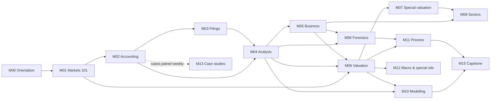

# 00.2 · How to use this course

> **Why this matters:** The core path through this course is about 180 hours of work. Most self-taught learners
> don't give up because the material is hard. They give up because they read without practising, forget Module 02
> by Module 06, or never set up the tools that make the real-world tasks possible. This lesson gives you the map,
> the schedule, a study method that holds up, and a working toolkit.

**Learning objectives** — after this lesson you can:

- Read the module map and list the prerequisites of any lesson before you start it.
- Follow, or rescale, the 20-week plan, knowing which mock comes when and which case studies go with which modules.
- Use four evidence-based study techniques (active reading, attempting exercises before solutions, spaced repetition, the explain-it-simply test), and keep an error log and a learning journal.
- Set up the toolkit: Screener.in, BSE/NSE filings pages, company investor-relations pages, a Python environment for `tools/`, a spreadsheet and Anki.
- Explain how the running examples work and reproduce a Kaveri Pumps ratio from its raw statements.

**Prerequisites:** [00.1 What fundamental investing is](01-what-is-fundamental-investing.md) · **Time:** ~75 min reading + ~60 min toolkit setup

---

## 1. The shape of the course

The course has 16 modules in nine parts. Parts I–IV teach you to read, analyse and value a business. Parts V–VII
apply those skills (sectors, forensics, modelling, process). Parts VIII–IX test them (historical cases, mocks and
your own case studies). The full specification is in the [syllabus](../syllabus.md).

| Module | You will be able to… | Lessons | Est. hours* |
|:--|:--|--:|--:|
| [M00 Orientation](index.md) | Say what the discipline is, plan your study, set up tools | 3 | 5.3 |
| [M01 Money, companies & markets 101](../01-markets-101/index.md) | Explain shares, market cap and EV, how capital is raised and returned, Indian market plumbing, time value of money | 5 | 9.3 |
| [M02 Accounting foundations](../02-accounting/index.md) | Read and link the three financial statements under Ind AS; understand the judgement calls behind each line | 9 | 14.3 |
| [M03 Reading filings & documents](../03-reading-filings/index.md) | Find and read annual reports, notes, results, concall transcripts, rating rationales, DRHPs, 10-Ks | 6 | 10.5 |
| [M04 Financial statement analysis](../04-financial-analysis/index.md) | Measure growth, margins, returns on capital, working capital, leverage and earnings quality | 7 | 11.8 |
| [M05 Business & competitive analysis](../05-business-analysis/index.md) | Judge business models, industries, moats, management, governance; plan primary research | 7 | 11.8 |
| [M06 Valuation](../06-valuation/index.md) | Estimate cost of capital; build a DCF, multiples and reverse DCF; think in distributions | 8 | 13.0 |
| [M07 Valuing special companies](../07-special-valuation/index.md) | Value lenders, insurers, cyclicals, loss-makers, holdcos, PSUs, utilities | 6 | 10.5 |
| [M08 Sector playbooks](../08-sectors/index.md) | Know the KPIs, accounting quirks and red flags of 11 Indian sectors | 11 | 16.8 (8.0 for 4 sectors) |
| [M09 Forensics & red flags](../09-forensics/index.md) | Spot aggressive accounting, cash-flow games and governance risks; run scoring models | 7 | 11.8 |
| [M10 Financial modelling](../10-modeling/index.md) | Build a three-statement model and DCF in Python or a spreadsheet | 5 | 9.3 |
| [M11 Process & portfolio](../11-process/index.md) | Generate ideas, write memos, size positions, monitor, sell, handle taxes and biases | 7 | 11.8 |
| [M12 Macro, cycles & special situations](../12-macro-special-sits/index.md) | Connect macro to sectors; recognise market cycles; analyse corporate events | 3 | 6.8 |
| [M13 Case studies](../13-case-studies/index.md) | Apply everything to 25 real episodes (10 global, 15 Indian) | 25 cases | 37.5 |
| [M14 Mocks & drills](../14-mocks/index.md) | Test yourself under time pressure | 8 | 23.3 |
| [M15 Capstone](../15-capstone/index.md) | Produce your own full case studies, in a private repository | – | 20+ per company |

\* Assumptions: 1.25 h per lesson, 3 h per module's exercise set (1.5 h for M00), 1.5 h per case study, and mocks
at 1.5× their exam length to allow for review. Worked example 1 adds these up.

### 1.1 Dependencies

Some modules can be read in any order. Others can't. The arrows below mean "read this first".



Three rules of thumb:

1. **M02 is the backbone.** Almost every later lesson assumes you can move between the income statement, the balance
   sheet and the cash-flow statement without thinking. Don't skim it, even if you have seen a P&L before. Lesson
   [02.6 How the three statements link](../02-accounting/06-linking-the-three-statements.md) is the most important
   single lesson in the course.
2. **Valuation (M06) depends on analysis (M04) and business judgement (M05).** A DCF is only as good as the growth,
   margin and reinvestment assumptions you feed it, and those come from M04–M05.
3. **Case studies can start early.** Each one is written to be read after particular modules. The plan below pairs
   them.

**Placement shortcut.** If you already have an accounting background, take [Mock 1](../14-mocks/01-mock-accounting.md)
cold before starting M02. Score 70% or more and you can skim M02–M03, doing only the Stretch and Real-world
exercises. Below 70%, do the modules in full. The mock tells you which lessons to prioritise.

## 2. The 20-week plan

### Worked example 1 — does the course fit in 20 weeks?

Add up the whole course using the assumptions under the module table:

| Component | Arithmetic | Hours |
|:--|:--|--:|
| Lessons (M00–M12) | 84 lessons × 1.25 h | 105.0 |
| Module exercise sets | 12 × 3 h + 1 × 1.5 h (M00) | 37.5 |
| Mocks and drills incl. review | (2 + 2 + 2.5 + 2 + 4 + 1 + 1 + 1) h × 1.5 | 23.25 |
| Case studies | 25 × 1.5 h | 37.5 |
| Capstone (first full company) | – | 20.0 |
| **Full course** | | **223.25** |

At 9 hours a week that is 223.25 ÷ 9 = **24.8 weeks**. The standard plan therefore uses a **core path**:

- read 4 of the 11 sector playbooks in M08 (saves 7 × 1.25 = 8.75 h),
- do 12 of the 25 case studies during the 20 weeks (saves 13 × 1.5 = 19.5 h), and
- only start the capstone in week 19–20 (3.5 h instead of 20),
- plus 1 hour of toolkit setup in week 1.

Core path = 223.25 − 8.75 − 19.5 − (20 − 3.5) + 1.0 = **179.5 hours**, an average of **8.98 h/week** over 20
weeks. The weekly table below uses exactly these items. Every week is between 8.0 and 10.0 hours.

**Rescaling:** at 6 h/week the core path takes 179.5 ÷ 6 ≈ **30 weeks**; at 12 h/week, about **15 weeks**. Keep the
*order*. Don't drop the exercises to go faster. They are where the learning happens (Section 3).

### 2.1 The weekly table

Time for flashcards (≈10 min/day) is not included in the weekly hours.

| Wk | Lessons & exercises | Case study (paired) | Mock / drill | Hours |
|:--|:--|:--|:--|--:|
| 1 | 00.1–00.3, M00 exercises, toolkit setup, 01.1–01.3 | – | – | 10.0 |
| 2 | 01.4–01.5, M01 exercises, 02.1–02.2 | – | [Speed & mental-maths drill](../14-mocks/08-drills-speed-and-mental-math.md) (first pass) | 9.5 |
| 3 | 02.3–02.8 | [G4 Enron](../13-case-studies/global/04-enron-2001.md) | – | 9.0 |
| 4 | 02.9, M02 exercises, 03.1–03.3 | [I1 Satyam](../13-case-studies/india/01-satyam-2009.md) | – | 9.5 |
| 5 | 03.4–03.6, M03 exercises | – | **[Mock 1 — Accounting](../14-mocks/01-mock-accounting.md)** | 9.75 |
| 6 | 04.1–04.6 | [G1 See's Candies](../13-case-studies/global/01-sees-candies-1972.md) | – | 9.0 |
| 7 | 04.7, M04 exercises, 05.1 | [I2 Asian Paints](../13-case-studies/india/02-asian-paints-compounder.md) | [Unidentified-industries drill](../14-mocks/07-drills-unidentified-industries.md) | 8.5 |
| 8 | 05.2–05.7 | [G7 Nokia & BlackBerry](../13-case-studies/global/07-nokia-blackberry-2007-2013.md) | – | 9.0 |
| 9 | M05 exercises, 06.1–06.2 | – | **[Mock 2 — Analysis & business](../14-mocks/02-mock-analysis-business.md)** | 8.5 |
| 10 | 06.3–06.8 | [G2 Coca-Cola 1988](../13-case-studies/global/02-coca-cola-1988.md) | – | 9.0 |
| 11 | M06 exercises, 07.1–07.3 | [G3 Cisco 2000](../13-case-studies/global/03-cisco-2000.md) | – | 8.25 |
| 12 | 07.4–07.6, M07 exercises | [I3 Bajaj Finance](../13-case-studies/india/03-bajaj-finance-2008-2019.md) | – | 8.25 |
| 13 | M08: three sector playbooks | [I4 IL&FS & DHFL](../13-case-studies/india/04-ilfs-dhfl-2018.md) | **[Mock 3 — Valuation](../14-mocks/03-mock-valuation.md)** | 9.0 |
| 14 | M08: fourth playbook, M08 exercises, 09.1–09.3 | [I8 Zomato & Paytm IPOs](../13-case-studies/india/08-zomato-paytm-ipos-2021.md) | – | 9.5 |
| 15 | 09.4–09.7, M09 exercises | [I14 Manpasand & Vakrangee](../13-case-studies/india/14-manpasand-vakrangee-small-cap-flags.md) | – | 9.5 |
| 16 | 10.1–10.5 | – | **[Mock 4 — Forensics & sectors](../14-mocks/04-mock-forensics-sectors.md)** | 9.25 |
| 17 | M10 exercises, 11.1–11.5 | – | – | 9.25 |
| 18 | 11.6–11.7, M11 exercises, 12.1 | – | [Stock-pitch mock](../14-mocks/06-stock-pitch-mock.md) | 8.25 |
| 19 | 12.2–12.3, M12 exercises; choose your capstone company | [I5 Yes Bank](../13-case-studies/india/05-yes-bank-2018-2020.md) | – | 8.0 |
| 20 | Capstone stage 1 ([method](../15-capstone/01-the-case-study-method.md)) | – | **[Final exam](../14-mocks/05-final-exam.md)** (4 h + review) | 8.5 |
| | | | **Total** | **179.5** |

**Choosing your four M08 sectors.** Take [08.1 Banks & lending](../08-sectors/01-banks-and-lending.md) whatever else
you choose. Financial services were 36.5% of the Nifty 50 on 31-Aug-2026
([NSE Indices factsheet](https://www.niftyindices.com/Factsheet/ind_nifty50.pdf)), so you can't avoid them. Add the
two sectors you are most likely to invest in, plus one you know nothing about (it trains transfer). Come back to the
other seven as needed.

**After week 20.** Finish the capstone (2–4 more weeks), then work through the remaining 13 case studies. They are
best read once you have all the tools: Amazon, Lehman, Valeant, Wirecard, Apple, Eicher, HDFC Bank, Adani–Hindenburg,
Vodafone Idea, Kingfisher & Jet, ITC, DMart and Tata Motors ([Module 13 index](../13-case-studies/index.md)).

## 3. How to study

The techniques below are chosen because learning research rates them highly. They are not merely popular. A large
review of ten common study techniques rated **practice testing** and **distributed (spaced) practice** as the two
"high-utility" methods, and rated highlighting and rereading low (Dunlosky et al., *Psychological Science in the
Public Interest*, 2013; [APS summary](https://www.psychologicalscience.org/publications/journals/pspi/learning-techniques.html)).
In a classic experiment, students who were *tested* on a passage remembered far more a week later than students who
spent the same time *re-reading* it, even though re-reading looked better after five minutes (Roediger & Karpicke,
*Psychological Science* 17(3), 2006; [PubMed](https://pubmed.ncbi.nlm.nih.gov/16507066/)).

### 3.1 Active reading, a six-step protocol for each lesson

1. **Preview (3 min).** Read the "why this matters", the objectives and the section headings. Look at the Key terms
   table and mark the terms you can't define yet.
2. **Predict (2 min).** Write one line: "I expect this lesson to show that…". Wrong predictions are memorable.
3. **Read with a pen (main block).** Stop at every **Worked example** and try to compute the next line *before*
   reading it. Use a calculator or Python. Treat any number you can't reproduce as a question, not a typo, until you
   have checked it.
4. **Close and recall (5 min).** Close the page. Write the lesson's three main ideas and one formula from memory.
   Then reopen it and correct yourself. This is retrieval practice, the "testing effect" above.
5. **Check your understanding.** Answer *every* question before opening its `<details>` box.
6. **Card and log (5 min).** Add 3–8 flashcards (Section 3.3) and write a journal entry (Section 5).

### 3.2 Exercises before solutions

Each module ends with `exercises.md` in four tiers: **Warm-up** (recall), **Core** (calculations and interpretation,
mostly on the running examples), **Stretch** (multi-step judgement) and **Real-world task** (on an actual listed
Indian company, using primary documents). Solutions are in `solutions.md`.

- **The 15-minute rule.** Struggle with a problem for 15 honest minutes before looking at the solution. If you
  peek, write down exactly what you were missing, then close the solution and redo the problem from scratch the next
  day.
- **Do the Real-world task.** It is the only tier that forces you to find, open and read real filings. That is the
  skill the rest of your investing life depends on.
- **Keep an error log.** Every wrong answer gets a row:

| # | Date | Exercise | Error type | What I did | What was right | Re-test on |
|:--|:--|:--|:--|:--|:--|:--|
| 7 | 02-Oct | E02.14 | Definitional | Used average receivables | Kaveri's §6 table uses closing receivables for days | 09-Oct |

Use four error types: **concept** (didn't understand the idea), **arithmetic** (slip), **reading** (misread the
question or the document), **definitional** (right idea, different definition). The mix tells you what to fix.
Concept errors mean re-reading the lesson. Reading errors mean slowing down. Definitional errors mean writing down
definitions explicitly, which matters enormously in finance, as Worked example 3 shows.

!!! tip "Trader's lens — attribute your errors like P&L"
    You would never accept "lost money today" as a trade review. You would split the P&L into delta, gamma, vega,
    theta and residual. Treat mistakes the same way. A month of error-log rows split by type is a P&L attribution
    of your learning. If 60% of errors are "definitional", the fix is a definitions sheet, not more reading. The
    same habit becomes the decision journal in [11.6](../11-process/06-behavioural-finance-and-decision-journals.md),
    where you attribute investment outcomes to skill, luck and process.

### 3.3 Spaced repetition with Anki

**Spaced repetition** means reviewing a fact just before you would forget it, at intervals that grow each time you
recall it successfully (1 day, then 3, then a week, and so on). **Anki** is free flashcard software that schedules
this for you. The course's glossary of 500+ terms is mirrored as an Anki deck in the repository's `flashcards/` folder
([glossary](../appendix/glossary.md)). Import it, and add your own cards as you go.

Good cards are **atomic** (one fact each), **bidirectional** where it helps (term → definition *and*
definition → term), and include **"why" cards**, not just "what" cards. Examples:

- *Front:* "Why does EBITDA overstate cash profit for a fast-growing company?" *Back:* "It ignores investment in
  working capital and capex, both of which rise with growth."
- *Front:* "Justified P/B formula?" *Back:* "(ROE − g) / (r − g)."
- *Front:* "Kaveri FY26 receivable days?" *Back:* "96 (346.7 ÷ 1,318 × 365)."

### Worked example 2 — how much daily time will flashcards take?

A simple model: each new card is reviewed at intervals of 1, 3, 7, 16, 35, 75 and 160 days (each gap about 2.2× the
last). That puts reviews on days 1, 4, 11, 27, 62, 137 and 297 after you add it. You add $n$ new cards every day for
20 weeks (140 days). How many reviews fall due on a typical day near the end (days 120–140)? A short simulation:

```python
def daily_reviews(n_new, days=140, offsets=(1, 4, 11, 27, 62, 137, 297)):
    due = [0] * (days + 400)
    for d in range(days):
        for o in offsets:
            due[d + o] += n_new
    return sum(due[120:141]) / 21          # average over days 120–140

for n in (4, 10, 20):
    print(n, round(daily_reviews(n), 1))   # 4 → 20.8, 10 → 51.9, 20 → 103.8
```

| New cards per day | Reviews per day (days 120–140) | Time at an assumed 10 s per review |
|--:|--:|--:|
| 4 | 20.8 | 3.5 min |
| 10 | 51.9 | 8.7 min |
| 20 | 103.8 | 17.3 min |

In steady state you do about **5.2 reviews per day for each new card per day**. The glossary alone is about
500 ÷ 140 ≈ 3.6 new cards a day over 20 weeks. Adding your own cards takes a sensible total to 8–10 a day, or
roughly 10 minutes of review. Three caveats. The model ignores **lapses** (a forgotten card restarts its schedule),
so real load is higher and this is a floor. Anki's real scheduler adapts the intervals to how easily you recall each
card. And the load keeps creeping up for a while after week 20 as the longer intervals come due. The practical rule:
**cap new cards at about 10 a day and never skip a day's reviews.** A skipped week turns into a pile of overdue cards.

### 3.4 The "explain it to a 12-year-old" test

If you can't explain an idea simply, you probably can't use it under pressure. After each lesson, pick its hardest
idea and explain it in **under 100 words, with no undefined jargon and one concrete example with numbers**.

*Weak (jargon hides the gap):* "The cash conversion cycle is DIO plus DSO minus DPO; it measures working-capital
efficiency."

*Strong:* "A lemonade stall buys lemons on credit and has 10 days to pay. The lemons sit for 5 days before becoming
lemonade. Neighbours buy on credit and pay after 30 days. So the stall's own money is stuck for 5 + 30 − 10 = 25 days
on every glass. If neighbours start paying after 60 days, the stall needs a much bigger piggy bank to keep going,
even though it sells exactly as much lemonade."

The strong version shows you understand *why* a rising cash conversion cycle hurts, which is Kaveri's central problem.
Run the test in your journal. If you reach for a jargon word, you have found the gap.

### 3.5 Taking the mocks

Mocks are exams, not reading. Sit them **timed and closed-book**, except for the [formula sheet](../appendix/formula-sheet.md)
where the mock allows it. Mark them with the [answer keys](../14-mocks/index.md), put every miss in the error log,
and re-take the missed questions a week later. A mock score below 60% means going back through the relevant module's
Core exercises before moving on. That is cheaper than discovering the gap in the valuation module.

## 4. The toolkit

Set these up in week 1. Everything here is free except where noted. Facts about each tool were checked on
21-Sep-2026. Tools change, so verify the details as you go.

### 4.1 Screener.in: the aggregator you'll use daily

[Screener.in](https://www.screener.in/) is a free (with a paid premium tier) Indian fundamentals site. With a free
account you get 10+ years of annual data, custom stock screens, a watchlist and company documents
([features page](https://www.screener.in/features/)). A company page (use the `/consolidated/` version of the URL for
group numbers) shows:

- **Profit & Loss** rows: Sales, Expenses, Operating Profit, OPM %, Other Income, Interest, Depreciation, Profit before
  tax, Tax %, Net Profit, EPS, Dividend Payout %. **Operating Profit = Sales − Expenses**, *before* other income,
  depreciation and interest. On the Asian Paints consolidated page on 21-Sep-2026, 35,584 − 28,884 = 6,700 exactly.
- **Ratios** rows: Debtor Days, Inventory Days, Days Payable, Cash Conversion Cycle, Working Capital Days, ROCE %.
- **Documents**: Announcements, Annual reports, Credit ratings, Concalls. These link out to the primary sources.
- **Export to Excel**: ten years of statements in a workbook ([guide](https://www.screener.in/docs/guides/excel/)).

**Aggregators are for speed; primary documents are for truth.** Aggregators re-classify line items, mix
standalone and consolidated data, miss restatements and use their own ratio definitions. Worked example 3 shows how
much definitions matter. The discipline for the whole course: *screen and explore on Screener, then verify every
number you rely on in the annual report or exchange filing.*
[03.1](../03-reading-filings/01-the-disclosure-universe.md) maps every primary source.

### 4.2 Exchange filings: BSE and NSE

Every listed company must file results, annual reports, shareholding patterns and material events with the
exchanges. Bookmark:

- BSE corporate announcements: [bseindia.com/corporates/ann.html](https://www.bseindia.com/corporates/ann.html)
- NSE corporate filings: [announcements](https://www.nseindia.com/companies-listing/corporate-filings-announcements),
  [annual reports](https://www.nseindia.com/companies-listing/corporate-filings-annual-reports),
  [financial results](https://www.nseindia.com/companies-listing/corporate-filings-financial-results)

Learn the timetable. Under SEBI's LODR Regulations, quarterly results are due within **45 days** of quarter-end and
audited annual results within **60 days** of the year-end (Reg. 33(3)). Half-year results must include a balance
sheet and cash-flow statement (Reg. 33(3)(f)–(g)) (*SEBI LODR Regulations 2015, as amended to 22-Jan-2026*,
[SEBI PDF](https://www.sebi.gov.in/sebi_data/attachdocs/jun-2026/1780915347745.pdf)). For example, Kaveri's Q1 FY27
(quarter ending 30-Jun-2026) was due by 14-Aug-2026. It reported on 8-Aug.

### 4.3 Company investor-relations pages

Most listed companies have an "Investors" section with annual reports, results, investor presentations and earnings
call material. The rules require a lot. Under LODR Reg. 46(2)(oa), **audio** of a post-results call must be on the
company's website before the next trading day or within 24 hours, video (if any) within 48 hours, and the
**transcript** within five working days, also filed with the exchanges (same SEBI source). Concall transcripts are
one of the richest free sources in Indian investing. [03.4](../03-reading-filings/04-quarterly-results-and-concalls.md)
teaches how to read them.

### 4.4 Python environment for `tools/`

The repository's `tools/` folder contains the course's Python helpers: data loaders, ratios, valuation, forensic
scores and a three-statement model. Their API is in `tools/SPEC.md` and the [tools appendix](../appendix/tools.md).
You need Python ≥ 3.11.

```bash
# from the repository root
python -m venv .venv
# Windows PowerShell:  .venv\Scripts\Activate.ps1      macOS/Linux:  source .venv/bin/activate
pip install -r tools/requirements.txt      # pandas, numpy, yfinance (+ optional openbb)
pytest tools/tests                         # the test suite runs offline
```

Three practical notes:

1. **Windows and the ₹ sign.** Scripts that print ₹ on Windows need
   `sys.stdout = io.TextIOWrapper(sys.stdout.buffer, encoding="utf-8")` at the top (after `import sys, io`),
   or they crash with an encoding error.
2. **Tickers.** Yahoo-style tickers use `.NS` for NSE and `.BO` for BSE, e.g. `ASIANPAINT.NS`. Some VPNs block
   yfinance requests. If a fetch fails mysteriously, disconnect the VPN and retry.
3. **Know your data depth.** In a test on 21-Sep-2026, `yf.Ticker("ASIANPAINT.NS").income_stmt` returned only
   **four** annual periods (FY23–FY26), and OpenBB's `obb.equity.fundamental.income(..., provider="yfinance")`
   returned both `operating_revenue` and `total_revenue` columns, which `tools/fi/data.py::fetch_statements`
   reconciles. For ten-year histories, use Screener's export or the annual reports themselves
   ([10.2](../10-modeling/02-historicals-and-data.md)).

### 4.5 A spreadsheet

Excel, Google Sheets or LibreOffice Calc all work. Python is better for repeatable analysis. A spreadsheet is better
for poking at a single company and is still the lingua franca of the industry. Import
`tools/data/kaveri_pumps_annual.csv` now and keep that workbook. You will add ratios to it in M04 and a model in M10.
Modelling conventions (inputs in one place, colour-coded, one formula per row, check rows) are taught in
[10.1](../10-modeling/01-model-architecture.md).

### 4.6 Anki

Download Anki from [apps.ankiweb.net](https://apps.ankiweb.net/). It is free on Windows, macOS, Linux, Android
(AnkiDroid) and the web. The official iPhone/iPad app, AnkiMobile, is a one-time paid purchase. Sync through a free
AnkiWeb account so reviews follow you across devices. Import the course deck from `flashcards/` and set new cards to
about 10 a day (Worked example 2).

### Worked example 3 — your first tie-out: Kaveri FY26 from raw statements

A **tie-out** means recomputing a published number from its inputs to confirm you understand exactly how it was
built. Load Kaveri's annual data and rebuild two things: its working-capital days, and a Screener-style P&L.

```python
import sys, io
sys.stdout = io.TextIOWrapper(sys.stdout.buffer, encoding="utf-8")
import pandas as pd

k = pd.read_csv("tools/data/kaveri_pumps_annual.csv", index_col="line_item")
fy = k["FY26"]
dio = fy["inventory"] / fy["mat"] * 365          # inventory days on material cost
dso = fy["receivables"] / fy["rev"] * 365        # receivable days on revenue
dpo = fy["payables"] / fy["mat"] * 365           # payable days on material cost
print(f"DIO {dio:.0f} | DSO {dso:.0f} | DPO {dpo:.0f} | CCC {dio + dso - dpo:.0f} days")
# DIO 80 | DSO 96 | DPO 61 | CCC 115 days

expenses = fy["mat"] + fy["emp"] + fy["oth"]
op = fy["rev"] - expenses
print(f"Screener-style Operating Profit ₹{op:,.1f} Cr, OPM {op / fy['rev']:.1%}")
# Screener-style Operating Profit ₹181.9 Cr, OPM 13.8%
```

(`tools/fi/data.py::load_kaveri()` returns the same frame once the tools package is installed.)

**Step 1: working-capital days.** **Inventory days (DIO)** = inventory ÷ material cost × 365. **Receivable days
(DSO)** = receivables ÷ revenue × 365. **Payable days (DPO)** = payables ÷ material cost × 365. The **cash conversion
cycle (CCC)** = DIO + DSO − DPO, the number of days the company's own cash is tied up in each sale.

| FY26, ₹ Cr | Numerator | Denominator | × 365 = days |
|:--|--:|--:|--:|
| DIO: inventories ÷ material cost | 188.1 | 858.0 | 80.0 |
| DSO: receivables ÷ revenue | 346.7 | 1,318.0 | 96.0 |
| DPO: payables ÷ material cost | 143.4 | 858.0 | 61.0 |
| **CCC** = 80.0 + 96.0 − 61.0 | | | **115.0** |

These match the reference table ([kaveri-pumps §6](../appendix/running-example/kaveri-pumps.md)): 80, 96, 61, 115.
Note the conventions the reference page uses: **closing** balances (not averages) and **material cost** (not
revenue) for inventory and payables. Change the convention and the answer changes. Computed on revenue, inventory
days are 188.1 ÷ 1,318 × 365 = **52** and payable days 143.4 ÷ 1,318 × 365 = **40**, giving a CCC of about 108.
Neither is wrong, but mixing them across companies or years is. Before comparing any aggregator's "inventory days"
across companies, find out which denominator it uses.

**Step 2: re-cast the Schedule III P&L in Screener's layout.**

| ₹ Cr | FY25 | FY26 | Source lines |
|:--|--:|--:|:--|
| Sales | 1,172.0 | 1,318.0 | Revenue from operations |
| Expenses | 999.7 | 1,136.1 | Materials + employee + other expenses |
| **Operating Profit** | **172.3** | **181.9** | Sales − Expenses (= Kaveri's EBITDA excl. other income) |
| OPM % | 14.7% | 13.8% | Operating Profit ÷ Sales |
| Other Income | 4.5 | 3.9 | Treasury income |
| Exceptional items | 14.0 | 0.0 | FY25: gain on sale of land |
| Interest | 16.3 | 17.0 | Finance costs (borrowings + leases) |
| Depreciation | 44.3 | 47.8 | D&A incl. right-of-use and intangibles |
| Profit before tax | 130.2 | 121.0 | 172.3 + 4.5 + 14.0 − 16.3 − 44.3 = 130.2 ✓ |
| Tax % | 25.2% | 25.2% | (current + deferred tax) ÷ PBT |
| Net Profit | 97.4 | 90.5 | PAT |

The trap is in FY25. An aggregator has no separate "exceptional items" row, so the ₹14.0 Cr one-off land gain has to
go somewhere. Wherever it lands (often folded into other income), a naive "operating profit + other income" margin
jumps from 15.1% (= (172.3 + 4.5) ÷ 1,172) to 16.3% (= (172.3 + 4.5 + 14.0) ÷ 1,172), which looks like improving
profitability. It is really a one-off asset sale. The only defence is to open the annual report's P&L and notes
([02.3](../02-accounting/03-the-income-statement.md), [04.7](../04-financial-analysis/07-quality-of-earnings.md)).

## 5. The learning journal

Keep a dated journal from day 1. It gives you a record of what you actually studied (not what you meant to study),
it is where the explain-it-simply test happens, and it grows into the research log and decision journal of Module 11.
One entry per study session:

```markdown
## 2026-09-22 · Week 1 · Lesson 00.1
Time: 1h40m · Focus (1–5): 4
Three ideas, in my own words:
1. …
2. …
3. …
Explain-it-simply (≤100 words, one numerical example): …
Confusions / errors: …  → error log #3
Real-world touch: opened <company>'s latest annual report and found …
Cards added: 6 · Questions to revisit: …
```

**Keep your journal, notes and own case studies in a private repository.** The course repository is public. Your
research (the companies you are looking at, your theses and your mistakes) belongs to you. Module 15 sets up a
private research repository with templates ([15 index](../15-capstone/index.md),
[templates](../15-capstone/02-templates.md)). Create it now, with a `journal/` folder, so the habit starts in week 1.

## 6. How the running examples work

Two fictional companies appear throughout the course, so that numbers stay consistent from lesson to exercise to mock:

| | [Kaveri Pumps & Motors Ltd](../appendix/running-example/kaveri-pumps.md) | [Nirmal Finance Ltd](../appendix/running-example/nirmal-finance.md) |
|:--|:--|:--|
| What it is | Coimbatore maker of agricultural, domestic and industrial pumps and motors, plus a fast-growing solar-pump business sold to state agencies | Nashik-based vehicle and MSME lender (an NBFC) in the middle layer of RBI's scale-based regulation |
| Used for | Accounting, analysis, valuation, forensics, modelling, the memo and the capstone example | Lending economics, asset quality, capital adequacy, bank/NBFC valuation (M07, M08, mocks) |
| Data | FY21–FY26 statements, segments, notes, FY26 quarters and Q1 FY27 | FY21–FY26 P&L, balance sheet, asset quality and capital |
| Market data | ₹390 on 18-Sep-2026 | ₹402 on 18-Sep-2026 |

The rules that keep them useful:

1. **The numbers are fixed.** They are generated by `tools/running_example/generate.py`, which enforces that each
   balance sheet balances and that each cash-flow statement reconciles exactly to the change in cash. Raw CSVs are
   in `tools/data/`. Every lesson uses exactly these figures. If you ever find two lessons disagreeing about a Kaveri
   number, the reference page wins, and please report it.
2. **There is one "house view" valuation.** [kaveri-valuation](../appendix/running-example/kaveri-valuation.md) holds
   the base-case DCF: WACC 12.19%, terminal growth 5.5%, **₹320/share**, with bull ₹416, bear ₹168 and
   probability-weighted ₹306, against a market price of ₹390. The reverse DCF implies about 14.1% growth. Lessons
   vary these assumptions to teach sensitivity but always quote them as the base case. The valuation is dated
   31-Mar-2026 and the price is from 18-Sep-2026. Rolling the valuation forward to that date gives about ₹338. Early
   lessons ignore the roll-forward; Module 06 deals with it.
3. **Kaveri is deliberately ambiguous.** It is neither a fraud nor an obvious bargain. It is a reasonable business
   with a set of yellow flags: rising receivables from state agencies, a new promoter pledge, growing related-party
   purchases, and cash conversion below profit. The course asks you to judge "aggressive or merely risky?" That
   middle ground is where most real analytical work happens.
4. **Fictional additions are labelled.** Lessons may add new *fictional* details (a concall quote, an MD&A
   paragraph) that don't contradict the reference pages, and always label them as such. The tickers (e.g.
   *KAVERIPMP*) are not real, and nor are the peers (Nilgiri Pumps, Deccan Flow Systems, Sabarmati Motors & Drives,
   Konkan Solar Pumps).
5. **Real companies appear too, but differently.** Historical case studies (M13) and every module's Real-world tasks
   use real, sourced data. Conclusions about real companies are always illustrations of method and history, never
   recommendations.

!!! info "India notes"
    - **Financial years.** FY26 = 1-Apr-2025 to 31-Mar-2026. Quarters: Q1 = Apr–Jun, Q2 = Jul–Sep, Q3 = Oct–Dec,
      Q4 = Jan–Mar. "Q1 FY27" means April–June 2026. See [Indian numbering & conventions](../appendix/indian-numbering-and-conventions.md).
    - **Crore and lakh.** 1 lakh = 100,000; 1 crore = 100 lakh = 10 million. The course writes "₹1,318 Cr".
    - **Standalone vs consolidated.** Indian companies publish both. Standalone covers the listed entity alone;
      consolidated includes subsidiaries. Default to consolidated for valuation, but read standalone too. Cash and
      debt can sit in different entities ([02.8](../02-accounting/08-deeper-cuts-group-accounts-and-other.md)).
      Screener has a toggle, and Kaveri's reference data is consolidated.
    - **Disclosure timetable.** Results within 45 days of quarter-end (60 days for the year-end audited results);
      concall transcripts on the company website within five working days (SEBI LODR, as amended to 22-Jan-2026).
    - **Real-world tasks** name "any Nifty 500 company" or similar. Pick companies you might actually own, because
      the work compounds into your capstone.

!!! warning "Common mistakes"
    - **Reading without doing.** Re-reading feels productive and isn't. If you haven't computed the worked examples
      and answered the questions, you haven't done the lesson.
    - **Opening solutions too early.** Five minutes of struggle followed by a peek produces recognition, not
      recall. Use the 15-minute rule.
    - **Skimming M02 because "I know what a P&L is".** The judgement calls (revenue recognition, capitalisation,
      working capital, the cash-flow statement) are where analysis lives.
    - **Trusting aggregator numbers blindly.** Definitions, reclassifications and standalone/consolidated mix-ups
      are common. Verify against the filing.
    - **Binge-then-abandon.** Twelve hours one weekend and nothing for three weeks loses to eight steady hours a
      week. Spacing is the point.
    - **Hoarding flashcards.** 40 new cards a day becomes 200 reviews a day within months. Card only what you need to
      recall instantly.
    - **Keeping research in the public repo.** Your theses and journal belong in a private repository.

## Key terms

| Term | Meaning |
|:--|:--|
| **Active reading** | Reading with prediction, computation and recall, not passive re-reading |
| **Retrieval practice (testing effect)** | Learning by recalling from memory; produces better long-term retention than re-reading |
| **Spaced repetition** | Reviewing material at growing intervals, just before you would forget it |
| **Anki** | Free flashcard software that schedules spaced repetition; the course glossary is mirrored as a deck in `flashcards/` |
| **Error log** | A table of every mistake, classified as concept, arithmetic, reading or definitional |
| **Learning journal** | A dated record of each study session, including the explain-it-simply test |
| **Primary source** | The original document (annual report, exchange filing, regulator order), as opposed to an aggregator's copy |
| **Aggregator** | A site that collects and re-formats company data (Screener.in, Trendlyne, etc.); fast but not authoritative |
| **Standalone vs consolidated** | Accounts of the listed company alone vs the group including subsidiaries |
| **Operating Profit / OPM (Screener)** | Sales − Expenses, before other income, depreciation and interest / that divided by sales |
| **DIO / DSO / DPO** | Inventory, receivable and payable days: balance ÷ (material cost or revenue) × 365 |
| **Cash conversion cycle (CCC)** | DIO + DSO − DPO: days the company's own cash is tied up per sale |
| **Exceptional item** | A material, unusual income or expense (e.g., Kaveri's FY25 land-sale gain) that should be separated when judging recurring profit |
| **Tie-out** | Recomputing a reported number from its inputs to confirm the definition and the data |
| **LODR** | SEBI's Listing Obligations and Disclosure Requirements Regulations, 2015: what listed companies must disclose, and when |
| **Virtual environment (venv)** | An isolated Python installation for a project, so package versions don't clash |
| **Ticker suffix** | `.NS` (NSE) or `.BO` (BSE) appended to a symbol for Yahoo-style data sources |
| **Running example** | The fictional Kaveri Pumps and Nirmal Finance, used with fixed numbers throughout the course |
| **House view** | The course's reference Kaveri valuation (₹320 base, ₹306 probability-weighted) that all lessons quote |

## Check your understanding

1. Using the reference statements, compute Kaveri's FY25 DIO, DSO, DPO and CCC with the same conventions as Worked
   example 3. (FY25: inventories 161.3, material cost 754.8, receivables 269.7, revenue 1,172.0, payables 132.3.)
<details><summary>Answer</summary>

DIO = 161.3 ÷ 754.8 × 365 = **78.0**; DSO = 269.7 ÷ 1,172.0 × 365 = **84.0**; DPO = 132.3 ÷ 754.8 × 365 = **64.0**;
CCC = 78.0 + 84.0 − 64.0 = **98.0** days. This matches §6 of the reference page. Between FY25 and FY26 the CCC rose by
17 days, almost all from receivables (84 → 96).
</details>

2. You can give the course only 6 hours a week. (a) How long will the core path take? (b) Name two changes that
   *don't* weaken the learning and two that do.
<details><summary>Answer</summary>

(a) 179.5 ÷ 6 ≈ **30 weeks**. (b) Harmless: stretch the calendar, and move some case studies to after the core
path. Harmful: skip exercises, skip mocks, skim M02. Order and practice matter more than speed.
</details>

3. In the flashcard model of Worked example 2, you add 8 new cards a day. (a) Roughly how many reviews a day should
   you expect near week 20? (b) Why is this an underestimate?
<details><summary>Answer</summary>

(a) About 5.2 × 8 ≈ **41–42 reviews a day** (the simulation gives 41.5), roughly 7 minutes at 10 seconds each.
(b) The model assumes you never forget. In reality, lapsed cards restart their schedule and add reviews, and the
load keeps rising slowly as longer intervals come due.
</details>

4. Compute Kaveri's FY24 Screener-style OPM (revenue 1,006.0; EBITDA excl. other income 155.0). Why would it be
   wrong to compare this with another site's "EBITDA margin" without checking?
<details><summary>Answer</summary>

OPM = 155.0 ÷ 1,006.0 = **15.4%** (matches the reference EBITDA margin). Other sources may include other income, add
back exceptional items, treat lease costs differently or use standalone numbers. A one- or two-point difference can
be pure definition. Always check what is in the numerator before comparing.
</details>

5. A friend says Kaveri's inventory days are 52, and you say 80. Who is right?
<details><summary>Answer</summary>

Both, under different definitions. 188.1 ÷ 1,318 × 365 = 52 (on revenue); 188.1 ÷ 858.0 × 365 = 80 (on material
cost). Material cost is the more meaningful denominator, because inventory is carried at cost, but the real lesson is
to state the definition and use it consistently across years and peers.
</details>

6. You want to study [06.6 Reverse DCF](../06-valuation/06-reverse-dcf-and-expectations.md) next week, having only
   finished M01. Using the dependency map, what must you do first, and why?
<details><summary>Answer</summary>

The map routes into M06 through M04 (and M05), which depend on M02–M03. Reverse DCF needs you to understand free
cash flow, reinvestment (capex and working capital), ROIC and the cost of capital. Those come from M02 (statements),
M04 (returns, working capital) and 06.1–06.3. Skipping ahead lets you run the tool, but you won't be able to judge
whether the implied growth is plausible, which is the point of the method.
</details>

7. Apply the explain-it-simply test to **market capitalisation**. Write a ≤60-word explanation with one numerical
   example, then check it against the rubric: no undefined jargon, a concrete number, and the "so what".
<details><summary>Answer (one good version)</summary>

"A company is split into slices called shares. Kaveri has 6 crore slices, and today each sells for ₹390, so buying
every slice would cost 6 crore × ₹390 = ₹2,340 crore. That's its market cap. It tells you the price of the whole
company's ownership, not whether that price is fair." It passes: no jargon, one number, and the so-what (price ≠
value).
</details>

## Go deeper

- Peter C. Brown, Henry Roediger & Mark McDaniel, *Make It Stick: The Science of Successful Learning* (2014). A
  readable account of retrieval, spacing and interleaving from two of the researchers behind them.
- Dunlosky et al., "Improving Students' Learning With Effective Learning Techniques", *Psychological Science in the
  Public Interest* (2013) ([APS](https://www.psychologicalscience.org/publications/journals/pspi/learning-techniques.html)).
  Which study methods actually work, and which only feel like they do.
- Screener.in [guides](https://www.screener.in/docs/guides/). Screens, custom ratios and the Excel export.
- OpenBB documentation ([docs.openbb.co](https://docs.openbb.co/)). The data platform behind `tools/fi/data.py`'s
  optional OpenBB path.
- The Anki manual ([docs.ankiweb.net](https://docs.ankiweb.net/)). Card design and scheduler settings.

---
[← Previous: What fundamental investing is — and isn't](01-what-is-fundamental-investing.md) · [Module index](index.md) · [Next: The investor's map →](03-the-research-workflow-map.md)
