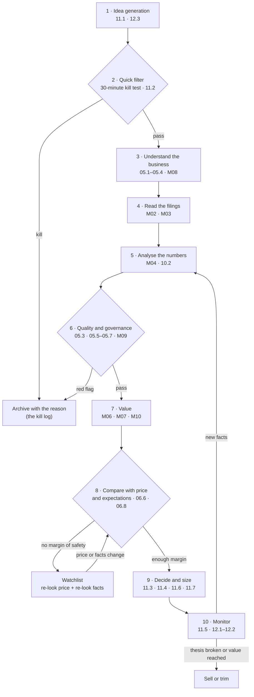

# 00.3 · The investor's map: from idea to decision

> **Why this matters:** The rest of the course teaches its tools one at a time: accounting, ratios, moats, DCFs,
> forensics, sizing. This lesson shows the whole job those tools serve, in the order you use them, and what the
> finished product looks like. For Kaveri Pumps that product is a one-page thesis saying *what to do at today's price
> and what would change the answer*. Once you know where each module plugs in, you know why you are learning it.

**Learning objectives** — after this lesson you can:

- List the ten steps of the research workflow in order, state the question each one answers, and name the module
  that teaches it.
- Explain why research is organised as a funnel with kill gates, and compute what a funnel costs in hours per position
  taken.
- Run a 30-minute kill test on Kaveri Pumps from its reference data and turn the result into research questions.
- Compare Kaveri's value with its price and with what the price implies, using scenario returns, probability-weighted
  value and a reverse DCF.
- Turn a valuation assumption into a KPI you can monitor, with a threshold and a date.
- Read a one-page thesis and trace each line back to the step and module that produced it.

**Prerequisites:** [00.1 What fundamental investing is](01-what-is-fundamental-investing.md),
[00.2 How to use this course](02-how-to-use-this-course.md) · **Time:** ~90 min

---

## 1. The map

Every fundamental investment decision goes through the same ten steps, whether a fund with 40 analysts makes it or you
make it on a Sunday afternoon. Professionals skip steps they have already done for a company, and they loop back when
new facts arrive. They do not skip the logic. The map below is the course in one picture. Each box names the lessons
that teach that step.



Module 01 (companies, market plumbing, enterprise value, time value of money) sits underneath every box, which is why
it is not drawn. The case studies (M13) let you watch other people walk this map, with the answers known. The mocks
(M14) test it under time pressure, and the capstone (M15) has you walk it yourself on a real company.

| # | Step | The question it answers | Main inputs | What you keep | Typical time | Taught in |
|:--|:--|:--|:--|:--|:--|:--|
| 1 | Idea generation | Is anything here worth 30 minutes? | Screens, 52-week lows, corporate events, disclosure flow, reading | A watchlist line with a one-sentence reason | Continuous; 1–2 h a week | [11.1](../11-process/01-idea-generation.md), [12.3](../12-macro-special-sits/03-special-situations.md) |
| 2 | Quick filter (kill test) | Is there a reason *not* to look further? | An aggregator page, the latest annual numbers, shareholding and pledge data | Pass + 3–5 research questions, or the kill reason | 30 min | [11.2](../11-process/02-the-research-process.md) |
| 3 | Understand the business | How does it make money, from whom, against whom? | Annual report business section, investor presentation, concalls, industry data | "The business in three sentences", unit economics, an industry map | 3–6 h | [05.1](../05-business-analysis/01-business-models-and-unit-economics.md)–[05.4](../05-business-analysis/04-capital-cycle-and-competition.md), [M08](../08-sectors/index.md) |
| 4 | Read the filings | What do the primary documents say, including the parts nobody quotes? | 3–5 annual reports, notes to accounts, auditor's report, results, concall transcripts, rating rationales | An annotated notes file and a flag list | 6–10 h | [M02](../02-accounting/index.md), [M03](../03-reading-filings/index.md) |
| 5 | Analyse the numbers | How good are growth, margins, returns, cash conversion and the balance sheet, and why? | The statements, rebuilt in your own spreadsheet or Python | A ratio dashboard with a written story | 4–8 h | [M04](../04-financial-analysis/index.md), [10.2](../10-modeling/02-historicals-and-data.md) |
| 6 | Quality and governance | Is it a good business, run by people I can trust with my money? | Moat evidence, capital-allocation record, related parties, pledges, auditor history, forensic scores | A moat verdict, a governance score, the forensic checklist | 3–6 h | [05.3](../05-business-analysis/03-moats-and-competitive-advantage.md), [05.5](../05-business-analysis/05-management-and-capital-allocation.md)–[05.7](../05-business-analysis/07-scuttlebutt-and-primary-research.md), [M09](../09-forensics/index.md) |
| 7 | Value | What is it worth, and how sensitive is that figure? | Forecasts, cost of capital, peers | DCF, scenarios, multiples: a value *range* | 5–10 h | [M06](../06-valuation/index.md), [M07](../07-special-valuation/index.md), [M10](../10-modeling/index.md) |
| 8 | Compare with price and expectations | What does the price assume, and do I disagree enough? | The price, a reverse DCF, the scenario values | A variant perception, expected return, payoff asymmetry | 1–2 h | [06.6](../06-valuation/06-reverse-dcf-and-expectations.md), [06.8](../06-valuation/08-margin-of-safety-and-expected-value.md) |
| 9 | Decide and size | Buy, watch or pass, and how much? | Everything above, plus your existing portfolio | One-page thesis, decision-journal entry, position size | 1–2 h | [11.3](../11-process/03-writing-an-investment-memo.md), [11.4](../11-process/04-position-sizing-and-portfolio-construction.md), [11.6](../11-process/06-behavioural-finance-and-decision-journals.md), [11.7](../11-process/07-fundamentals-meets-derivatives.md) |
| 10 | Monitor | Is the thesis still intact? | Results, concalls, shareholding filings, material-event disclosures | A KPI tracker, quarterly reviews, sell and trim rules | 2–3 h per company per quarter | [11.5](../11-process/05-monitoring-and-selling.md), [12.1](../12-macro-special-sits/01-macro-for-equity-investors.md)–[12.2](../12-macro-special-sits/02-market-cycles-and-sentiment.md) |

The times are rough guides for a part-time investor studying a mid-sized Indian company for the first time. A bank or a
conglomerate takes longer, and a company you already own takes much less. Four features of the map matter more than
the times.

1. **It is a funnel.** There are three exits before a decision: the quick filter (step 2), the quality-and-governance
   check (step 6) and the price comparison (step 8). Most ideas should leave by one of them. Section 2 shows why that
   saves time.
2. **Steps 3–6 are "the work".** Understanding the business, reading the filings, analysing the numbers and judging
   quality take roughly two-thirds of your research hours. They are Modules 02–05 and 09, about half the course.
3. **The decision is made at step 8, not step 7.** A **valuation** estimates what the business is worth. A
   **decision** compares that estimate with the **price** and with the **expectations** built into the price. A great
   business at the wrong price fails at step 8, as the Cisco case in 00.1 showed.
4. **Step 10 loops back.** Monitoring is not a separate activity. It means re-running steps 5–8 on new facts, at a
   rhythm set by the disclosure calendar (Section 6.2).

## 2. Why the map is a funnel

A **stage gate** is a checkpoint where you decide, with what you know so far, whether the next and more expensive stage
of work is justified. The course uses three research stages, built out fully in [11.2](../11-process/02-the-research-process.md):

- The **kill test** (30 minutes, step 2): look for a reason to stop.
- **Triage** (about 3 hours): a fast pass over steps 3–6 that asks one question: *is this worth three weeks?*
- The **deep dive** (about 30 hours spread over about three weeks): steps 3–8 done properly, ending in a decision.

### Worked example 1 — what one position costs in hours

Take a realistic Indian universe. The **Nifty Total Market** index covers the Nifty 500 plus the Nifty Microcap 250,
about 750 stocks. It had 752 constituents on 31-Aug-2026
([NSE Indices factsheet](https://www.niftyindices.com/Factsheet/Factsheet_NiftyTotalMarket.pdf)). Suppose your screens
and reading turn that universe into 60 ideas a year worth a kill test (8%). The pass rates below are *illustrative
assumptions*, not measured facts. Keep your own kill log and replace them with your own numbers after a year.

| Stage | Ideas in | Hours each | Hours spent | Pass rate (assumed) | Ideas out |
|:--|--:|--:|--:|--:|--:|
| Kill test | 60 | 0.5 | 30 | 25% | 15 |
| Triage | 15 | 3 | 45 | 1 in 3 | 5 |
| Deep dive | 5 | 30 | 150 | 40% | 2 |
| **Total** | | | **225** | | **2 positions** |

- **Hours per position** = 225 ÷ 2 = **112.5 hours**. At the course's 9 hours a week, 225 hours is 25 weeks, so a
  part-time investor adds roughly two new positions every six months. This is why a concentrated portfolio of 10–15
  names builds slowly, and why you should not expect to "fill" a portfolio in a month.
- **Where the hours go.** Deep dives take 150 of the 225 hours (67%), but only on 5 companies. The kill test takes 13%
  of the hours and filters 60 ideas.
- **Without gates.** Deep-diving all 60 ideas would cost 60 × 30 = 1,800 hours, 8x as much, and would find roughly the
  same two positions. Without the kill test alone (triage all 60, then deep-dive 5): 60 × 3 + 5 × 30 = 330 hours. The
  30 minutes per idea saves 105 hours.

A gate is worth running when the expected hours it saves exceed what it costs:

$$
P(\text{kill}) \times C_{\text{next stage}} \;>\; C_{\text{gate}}
$$

In words: the probability that the gate stops an idea, times the cost of the stage you then avoid, must beat the cost
of running the gate. For the kill test, 0.75 × 3 h = 2.25 h saved per idea against 0.5 h spent. For triage, (2/3) ×
30 h = 20 h saved against 3 h spent. Both gates pay handsomely.

The inequality leaves out one cost: killing a good idea (a **false negative**). Lesson 00.1 showed that a small number
of big winners drives most stock-market wealth. A gate so strict that it kills every company with a single yellow flag
will also kill some of those winners. That is why the kill test separates **hard no's** (automatic kills) from
**flags**, which become research questions (Section 3.2). It is also why you **log every kill** with the date, the
price and the reason. Re-read the log a year later: the base rate of your own gates is the only honest measure of
whether they are too loose or too tight.

!!! tip "Trader's lens — research stages are options"
    Each stage is an option premium. You pay 30 minutes for the right, but not the obligation, to spend 3 hours, and 3
    hours for the right to spend 30. As in a sensible options book, each premium is small relative to the cost of
    exercising, you let most options expire worthless without regret, and the value comes from the few you exercise.
    The failure mode is familiar too: the trader who keeps rolling a losing position because of the premium already
    paid. Twenty hours into a deep dive that has just turned up a governance red flag, those twenty hours are sunk.
    The only question is whether the *next* hour is worth spending.

## 3. Steps 1–2: finding ideas and killing most of them

### 3.1 Step 1 — idea generation

Ideas come from six places, covered in [11.1](../11-process/01-idea-generation.md) and
[12.3](../12-macro-special-sits/03-special-situations.md):

1. **Screens.** Quality (high returns, low debt), value (low multiples), growth, and classics such as Greenblatt's magic
   formula or Graham's net-nets.
2. **Price-driven lists.** New 52-week lows, or large falls after results. The market has changed its mind about the
   company; your job is to find out whether it was right to.
3. **Corporate events.** Demergers, buybacks, open offers, delistings, index inclusions and exclusions. These create
   forced or uninterested buyers and sellers.
4. **Disclosure flow.** Promoters buying in the open market, pledges being released, insider-trading disclosures, a new
   credit rating.
5. **Reading.** Industry reports; other companies' concalls (a customer praising a supplier is an idea); annual reports
   of companies you already own.
6. **Supply-side shifts.** Industries where capacity is leaving and returns may recover (the capital cycle,
   [05.4](../05-business-analysis/04-capital-cycle-and-competition.md)).

The filter on all six is your **circle of competence**: the set of businesses you can understand well enough to
forecast. It is not fixed. It grows with every sector playbook in M08 and every company you study. But an idea outside
it goes back to the pile, however cheap it looks.

**A screen on Screener.in.** Screener's query builder takes plain-English ratio names joined by `AND`/`OR`. The
public screens on its site use exactly these field names (checked 21-Sep-2026:
[example 1](https://www.screener.in/screens/3982/return-on-capital-employed/),
[example 2](https://www.screener.in/screens/349676/roic/); [how to create screens](https://support.screener.in/article/10-create-screens)):

```text
Average return on capital employed 5Years > 15 AND
Debt to equity < 0.5 AND
Market Capitalization > 1000 AND
Pledged percentage < 10
```

Market capitalisation is in ₹ crore. If Kaveri Pumps were a real listed company it would pass this screen. Its average
**ROCE** (return on capital employed: operating profit plus treasury income, divided by equity plus debt plus lease
liabilities) over FY22–FY26 was 16.5%. Its debt-to-equity was 0.3x and its market cap ₹2,340 Cr. The pledge is 6% of
promoter shares, which is 3.5% of all shares, so it passes whichever way Screener measures pledging. Tighten the last
condition to `Pledged percentage = 0` and Kaveri disappears. **Screen thresholds are choices, and every choice hides
companies from you.** Before relying on any aggregator field, check its definition (00.2 showed how much definitions
move a number).

**How Kaveri becomes an idea.** On 18-Sep-2026 Kaveri traded at ₹390, down 52% from its January-2025 peak of ₹812 and
down 25% since March, after a weak Q1 FY27 and the pledge disclosure. At a **P/E** (price ÷ earnings per share) of
25.9x it is the cheapest company in its fictional peer set, where P/Es run from 29.6x to 39.8x. "A decent business,
down by half, cheaper than its peers" is exactly the kind of idea that deserves 30 minutes. It is also exactly the
kind that is often cheap for a reason.

### 3.2 Step 2 — the 30-minute kill test

The kill test looks for reasons to *stop*, not reasons to buy. It has two kinds of item.

**Hard no's**, which kill automatically. An illustrative list, which [11.2](../11-process/02-the-research-process.md)
turns into a full checklist:

- You cannot explain the business in three sentences after ten minutes of reading, so it is outside your circle.
- A disqualifying governance record: a regulator's finding of fraud or diversion against the promoters, an auditor who
  resigned citing lack of information, or an adverse or disclaimer audit opinion ([09.5](../09-forensics/05-governance-red-flags-india.md)).
- A balance sheet that cannot survive a bad year, such as borrowings many times operating profit with falling interest
  cover. The threshold depends on the sector, and lenders are different altogether ([04.5](../04-financial-analysis/05-leverage-solvency-liquidity.md)).
- It cannot be traded at the size you want: too illiquid, or under a surveillance framework that restricts trading
  ([01.4](../01-markets-101/04-indian-market-structure.md)).
- Structural losses with no path to profit that you can model ([07.4](../07-special-valuation/04-high-growth-and-loss-making.md)).

**Flags**, which do not kill but become the questions that organise the rest of the research.

In 30 minutes you do not *answer* anything. You decide whether to keep going, and you write down what you need to find
out.

### Worked example 2 — Kaveri's kill test

Everything a kill test needs is on the [reference page](../appendix/running-example/kaveri-pumps.md) and in the
course's tools. Run this from the repository root:

```python
import io, sys
sys.stdout = io.TextIOWrapper(sys.stdout.buffer, encoding="utf-8")
sys.path.insert(0, "tools")                      # run from the repository root

from fi.data import load_kaveri
from fi.ratios import ratio_dashboard

df = load_kaveri()                               # line items x FY21..FY26, ₹ Cr
dash = ratio_dashboard(df)
last5 = ["FY22", "FY23", "FY24", "FY25", "FY26"]
rev, cfo, pat = df.loc["rev"], df.loc["cfo"], df.loc["pat"]

print(f"Revenue CAGR FY21-26        {(rev['FY26'] / rev['FY21']) ** (1 / 5) - 1:6.1%}")
print(f"ROIC FY26 / 5-yr average    {dash.loc['roic', 'FY26']:6.1%} / {dash.loc['roic', last5].mean():.1%}")
print(f"CFO/PAT FY21-26 cumulative  {cfo.sum() / pat.sum():6.1%}")
print(f"CFO/PAT FY25-26             {cfo[['FY25', 'FY26']].sum() / pat[['FY25', 'FY26']].sum():6.1%}")
print(f"Cumulative FCF FY21-26      ₹{dash.loc['fcf'].sum():5.1f} Cr")
print(f"Receivable days FY23 -> 26  {dash.loc['rec_days', 'FY23']:.0f} -> {dash.loc['rec_days', 'FY26']:.0f}")
print(f"Net debt/EBITDA, int. cover {dash.loc['nd_to_ebitda', 'FY26']:.1f}x, {dash.loc['int_cover', 'FY26']:.1f}x")
print(f"P/E at ₹390                 {390 * 6.00 / pat['FY26']:.1f}x")
# Revenue CAGR FY21-26         16.6%
# ROIC FY26 / 5-yr average     12.0% / 13.0%
# CFO/PAT FY21-26 cumulative   94.9%
# CFO/PAT FY25-26              67.1%
# Cumulative FCF FY21-26      ₹-20.3 Cr
# Receivable days FY23 -> 26  61 -> 96
# Net debt/EBITDA, int. cover 0.8x, 7.9x
# P/E at ₹390                 25.9x
```

The terms are defined properly in Module 04. For now: **ROIC** (return on invested capital) is operating profit after
tax (**NOPAT**) divided by the capital tied up in operations. **CFO/PAT** compares cash from operations with reported
profit. **Free cash flow (FCF)** is CFO minus capital expenditure. **Receivable days** are receivables ÷ revenue × 365.
**Net debt/EBITDA** is borrowings minus cash, divided by operating profit before depreciation. The hurdle for ROIC is
the **cost of capital (WACC)**, the blended return lenders and shareholders require. In a real kill test you would use a
rough hurdle; here we borrow the course's 12.19% from [06.2](../06-valuation/02-cost-of-capital.md).

| Check | Kaveri | Arithmetic | Reading |
|:--|--:|:--|:--|
| Business in three sentences? | Yes | Pumps and motors through dealers; solar pumps to state agencies | Pass |
| Growth | 16.6% a year | (1,318.0 ÷ 612.0)^(1/5) − 1 | Pass |
| Returns vs cost of capital | ROIC 12.0% (FY26); 13.0% 5-yr average | vs WACC 12.19% | **Flag**: returns ≈ cost of capital |
| Cash conversion | CFO/PAT 94.9% over six years, 67.1% over FY25–FY26 | 395.7 ÷ 416.9; (60.9 + 65.1) ÷ (97.4 + 90.5) | **Flag**: deteriorating |
| Free cash flow | ₹(20.3) Cr cumulative, FY21–FY26 | 32.8 + 31.7 − 36.4 − 64.4 + 2.9 + 13.1 | **Flag**: six years of profit, no free cash |
| Working capital | Receivable days 61 → 96 | 146.1 ÷ 874.0 × 365; 346.7 ÷ 1,318.0 × 365 | **Flag**: the biggest one |
| Solvency | Net debt/EBITDA 0.8x; interest cover 7.9x; rated "A / Stable" | 140.5 ÷ 181.9; 134.1 ÷ 17.0 | Pass |
| Governance | 6% of promoter shares pledged (Nov-2025); related-party purchases 10.4% of material cost; auditor rotated (mandatory), did not resign | Reference page §1, §8 | **Flag**, no hard no |
| Price | P/E 25.9x vs peers 29.6–39.8x | 2,340 ÷ 90.5 | Not obviously expensive |

**Verdict: pass to triage**, with no hard no's and five flags. The flags collapse into three research questions,
which the rest of the work is organised around:

1. **Will the solar receivables be collected, and when?** Receivables overdue by more than six months doubled from
   ₹31.0 Cr to ₹62.4 Cr in FY26, against a credit-loss allowance of ₹4.0 Cr.
2. **Is the growth creating value?** With ROIC roughly equal to WACC, and growth funded by working capital, faster
   growth may add little.
3. **Why did the promoters pledge shares, and what happens if the price keeps falling?** And alongside it, are the
   rising purchases from the promoter-owned Kaveri Castings really at arm's length?

## 4. Steps 3–6: doing the work

### 4.1 Step 3 — understand the business

The test from 00.1: explain the business in three plain sentences. For Kaveri:

> Kaveri makes agricultural, domestic and industrial pumps and electric motors in Coimbatore and Hosur and sells them
> through about 1,800 dealers in 14 states. Since FY23 most of its growth has come from solar pumping systems sold to
> state-government agencies under the government's PM-KUSUM solar-pump scheme ([portal](https://pmkusum.mnre.gov.in/)),
> which are now 27% of revenue and are paid slowly. It earns a 13.8% EBITDA margin, and its cash flow depends on how
> fast those state agencies pay.

Writing the second sentence forces a number you might otherwise skip: how much of the growth is solar?

| ₹ Cr | FY23 | FY26 | CAGR FY23–FY26 | Share of FY26 revenue |
|:--|--:|--:|--:|--:|
| Agricultural & domestic pumps | 550.6 | 606.2 | 3.3% | 46.0% |
| Industrial pumps & motors | 262.2 | 355.9 | 10.7% | 27.0% |
| Solar pumping systems | 61.2 | 355.9 | 79.8% | 27.0% |
| **Total revenue** | **874.0** | **1,318.0** | **14.7%** | **100.0%** |
| Total excluding solar | 812.8 | 962.1 | 5.8% | 73.0% |

Solar supplied (355.9 − 61.2) ÷ (1,318.0 − 874.0) = 294.7 ÷ 444.0 = **66%** of the revenue added over three years.
Outside solar, Kaveri is a business growing at about 6% a year. That changes the questions you ask in step 3:

- **Unit economics** ([05.1](../05-business-analysis/01-business-models-and-unit-economics.md)): what does one solar-pump
  contract earn, who pays which part (state agency, central subsidy, farmer), and on what terms?
- **Industry** ([05.2](../05-business-analysis/02-industry-analysis.md), [08.5](../08-sectors/05-industrials-capital-goods-defence.md)):
  how concentrated is demand, and how reliable are government payment cycles?
- **Moat and capital cycle** ([05.3](../05-business-analysis/03-moats-and-competitive-advantage.md),
  [05.4](../05-business-analysis/04-capital-cycle-and-competition.md)): a tender business attracts competitors. The
  fictional peer Konkan Solar Pumps grew revenue 38% a year over FY23–FY26. Can anyone win a tender without cutting
  price or extending credit?

The **order book** (contracted but not yet delivered work) was ₹410 Cr at FY26, 1.15x the year's solar revenue of
₹355.9 Cr, typically executed in 6–12 months. It supports near-term revenue. It says nothing about whether the cash
will arrive.

### 4.2 Step 4 — read the filings

Aggregator data got you through the kill test. From step 4 onwards you work from **primary sources**: annual reports
(ideally three to five years of them), the notes to accounts, the auditor's report, the quarterly results filings,
concall transcripts and credit-rating rationales. Module 02 teaches you to read the statements and Module 03 teaches
you to find and read the documents ([03.1](../03-reading-filings/01-the-disclosure-universe.md) maps every source;
[03.2](../03-reading-filings/02-anatomy-of-an-annual-report.md) gives a two-hour annual-report protocol).

The **notes to accounts** are where the questions from step 2 get answered, or sharpened. Kaveri's FY26 annual report:

| Note item | FY25 | FY26 | What it tells you |
|:--|--:|--:|:--|
| Receivables overdue > 6 months, ₹ Cr | 31.0 | 62.4 | Doubled; mostly two state nodal agencies |
| Expected-credit-loss allowance, ₹ Cr | 3.1 | 4.0 | Covers only 4.0 ÷ 62.4 = 6.4% of the overdue bucket |
| Contingent liability: GST demand under appeal, ₹ Cr | 0.0 | 38.0 | A rate-classification dispute on solar systems; equal to 42% of FY26 PAT |
| Bank guarantees given, ₹ Cr | 58.0 | 96.0 | Grows with solar tender wins |
| Promoter shares pledged (% of promoter holding) | 0% | 6% | Created Nov-2025 for a promoter-group real-estate venture |
| Purchases from Kaveri Castings (% of material cost) | 9.1% | 10.4% | Stated to be at arm's length; approved by the audit committee |
| Motors capacity utilisation | 48% | 57% | The Hosur plant is still ramping up |

Two habits start here. First, **read what is missing as well as what is there.** Kaveri's Q1 FY27 investor
presentation showed receivables as a bar chart *without numbers*, and the results did not disclose receivable days.
Management said the dues "remain elevated but fully recoverable". A company that stops quantifying its most-questioned
number is telling you something ([03.4](../03-reading-filings/04-quarterly-results-and-concalls.md)). Second, **track
what management said against what happened.** FY27 guidance was 15–18% revenue growth; Q1 delivered 3.5%. That
record becomes the say-do ratio of [05.5](../05-business-analysis/05-management-and-capital-allocation.md).

### 4.3 Step 5 — analyse the numbers

Step 5 turns statements into a small number of well-defined ratios, and then into a story. Module 04 does this
properly. Two calculations show the kind of question it answers for Kaveri.

**Where did the incremental revenue go?** From FY23 to FY26 revenue rose by 1,318.0 − 874.0 = ₹444.0 Cr, and trade
receivables rose by 346.7 − 146.1 = ₹200.6 Cr. So 200.6 ÷ 444.0 = **45 paise of every extra rupee of annual sales was
still uncollected at year-end.** Receivables compounded at 33.4% a year while revenue compounded at 14.7%, and the
**cash conversion cycle** (inventory days + receivable days − payable days, the days of sales the company must finance
itself) rose from 71 days in FY22 to 115 in FY26 ([04.4](../04-financial-analysis/04-working-capital-and-cash-conversion.md)).

**What did the extra capital earn?** The **incremental ROIC** is the change in NOPAT divided by the change in invested
capital. It asks what the *new* money earned, not the average of old and new
([04.3](../04-financial-analysis/03-returns-on-capital.md)).

$$
\text{Incremental ROIC}_{FY23\to FY26} = \frac{\text{NOPAT}_{FY26}-\text{NOPAT}_{FY23}}{\text{IC}_{FY26}-\text{IC}_{FY23}}
= \frac{100.3 - 63.3}{886.8 - 523.4} = \frac{37.0}{363.4} = 10.2\%
$$

NOPAT is EBIT × (1 − 25.17%): 84.6 × 0.7483 = 63.3 in FY23 and 134.1 × 0.7483 = 100.3 in FY26. Invested capital (IC)
is net fixed assets plus working capital, computed by `fi.ratios.invested_capital` with the reference page's
definition. The ₹363.4 Cr of capital added over three years earned 10.2%, below the 12.19% cost of capital. One caveat
belongs in your notes: part of that capital is the Hosur motors plant, only 57% utilised, which has not yet earned its
full return. Whether it will is a step-3 question (capacity and demand), and it is a good example of how the steps feed
each other.

These two numbers are the analytical core of the Kaveri story. Growth has been real, but it has been bought with
working capital, and the return on that capital has been at or below its cost.

### 4.4 Step 6 — quality and governance

Step 6 asks two questions. *Is the business good?* That means a durable competitive advantage (a **moat**) showing up
as returns above the cost of capital. *Can you trust the people?* That means capital allocation, related-party
dealings, pledges, auditor history and the honesty of disclosure. In India most listed companies have a controlling
**promoter**, so the second question carries more weight than in a widely held market
([05.6](../05-business-analysis/06-corporate-governance-india.md)).

For Kaveri the evidence is mixed:

- **Moat.** The agricultural franchise (1,800 dealers, a brand in a pump cluster) looks real but slow-growing. The
  solar business shows no sign of a moat: returns at or below the cost of capital, a fast-growing competitor, and
  customers who set terms by tender.
- **Governance.** The pledge covers 6% of the promoters' 58.4%, which is 3.5% of the company, about 0.21 Cr shares
  worth ≈₹82 Cr at ₹390. It was taken for an unrelated real-estate venture, and the share price has fallen 25% since
  March. Purchases from the promoter-owned Kaveri Castings rose from ₹25.5 Cr (6.5% of material cost) in FY21 to
  ₹89.2 Cr (10.4%) in FY26. The auditor changed in FY25, but by mandatory rotation, not resignation.
- **Forensic screens** ([09.6](../09-forensics/06-forensic-scoring-models.md)), computed with
  `fi.forensics.forensic_summary(df, "FY26")`: Beneish M-score −2.14 (below the −1.78 "likely manipulator" threshold),
  Piotroski F-score 4/9, Altman Z 6.99 ("safe" zone), accruals 2.3% of assets, and treasury income a plausible 7.4% of
  average cash and liquid funds (no sign of Satyam-style missing cash).

The scoring models do not flag Kaveri. The forensic checklist in [09.7](../09-forensics/07-the-forensic-checklist.md)
does, as **yellow flags that need resolution**: receivables and solar concentration, rising related-party purchases, a
new promoter pledge, and CFO/PAT below 75%. That is the course's general lesson about screens: they catch the crude
cases, and judgement catches the rest. Yellow is not red, so Kaveri passes the step-6 gate, but the flags go straight
into the bear case of step 7.

## 5. Steps 7–8: value, then compare with what the price implies

### 5.1 Step 7 — value

The course's house view of Kaveri ([kaveri-valuation](../appendix/running-example/kaveri-valuation.md)) is a
**discounted cash flow (DCF)** valuation. It forecasts **free cash flow to the firm (FCFF)**, the cash the operations
throw off after tax, capex and working-capital investment, available to lenders and shareholders together. It
discounts that cash flow at the WACC. The key inputs and outputs, all taught in Module 06:

| Item | House view |
|:--|:--|
| Valuation date | 31-Mar-2026 (base year FY26) |
| Revenue growth FY27→FY36 | 10% in FY27 (cut below the 15–18% guidance after Q1), 14% in FY28–FY29, fading to 7% by FY36; 10.8% CAGR over the decade |
| EBITDA margin | 13.3% in FY27, rising to 15.5% from FY31 |
| Net working capital | 25% of revenue in FY27, 23% in FY28, 22% from FY29 (FY26 actual: 27.7%) |
| WACC / terminal growth | 12.19% / 5.5% (terminal reinvestment consistent with an 18% return on new capital) |
| Enterprise value → equity | ₹2,100.0 Cr − net debt ₹140.5 Cr − leases ₹18.2 Cr = ₹1,941.3 Cr |
| **Value per share** (6.07 Cr diluted shares) | **₹320** |
| Terminal value share of EV | 55% |
| Sensitivity (WACC 11.2–13.2% × g 4–6%) | ₹263 to ₹395 |
| Scenarios | Bull ₹416 (25%), base ₹320 (50%), bear ₹168 (25%); probability-weighted **₹306** |

Two cross-checks belong in step 7. **Multiples** ([06.5](../06-valuation/05-relative-valuation-and-multiples.md)):
Kaveri's P/E of 25.9x is below every peer. But the two most expensive peers, Nilgiri Pumps (39.8x) and Sabarmati
Motors & Drives (33.1x), earn ROCEs of 24% and 21% against Kaveri's 16%, so part of the discount is earned. **Cheap
relative to peers is not the same as cheap relative to value.** And a **sanity check on the assumptions**: the house
view needs working capital to fall from 27.7% to 22% of sales. That is an assumption about receivables, and step 10
will have to watch it (Worked example 4).

### 5.2 Step 8 — compare with price and expectations

Step 8 puts three numbers side by side:

- **Price**: ₹390 (18-Sep-2026).
- **Value**: ₹320 in the base case, ₹306 probability-weighted.
- **Expectations**: what the price implies about the future. A **reverse DCF** holds every assumption except one fixed
  and solves for the value of that one assumption that makes the DCF equal the price
  ([06.6](../06-valuation/06-reverse-dcf-and-expectations.md)). For Kaveri, ₹390 implies revenue growth of **14.1% a
  year for ten years**. That compares with the house view's 10.8% and the FY23–FY26 pace of 14.7%.

The market, in other words, is paying for the last three years to repeat. Those three years were mostly solar, sold to
state agencies on credit. The **variant perception**, the specific point on which you disagree with the price and why
([11.3](../11-process/03-writing-an-investment-memo.md)), is not "growth will slow". It is "the growth that the price
extrapolates was bought with working capital at a return below the cost of capital".

### Worked example 3 — asymmetry at ₹390, and the price at which Kaveri gets interesting

```python
import io, sys
sys.stdout = io.TextIOWrapper(sys.stdout.buffer, encoding="utf-8")
sys.path.insert(0, "tools")                      # run from the repository root

from fi.valuation import kaveri_reference, kaveri_base_drivers, dcf_from_drivers, reverse_dcf

ref = kaveri_reference()                         # the house view (valuation date 31-Mar-2026)
price = ref["cmp"]                               # ₹390 on 18-Sep-2026
for name, value in ref["scenarios"].items():
    v = round(value)                             # the house view quotes whole rupees
    print(f"{name:5s} ₹{v}  p={ref['probabilities'][name]:.0%}  return {v / price - 1:+.1%}")
pw = round(ref["probability_weighted"])
print(f"Probability-weighted ₹{pw}: {pw / price - 1:+.1%}")
print(f"Implied 10-yr revenue growth at ₹{price:.0f}: {ref['implied_growth']:.1%}")

# The same question if receivables never normalise: NWC stays at FY26's 27.7% of sales
stuck = {**kaveri_base_drivers(), "nwc_pct": [0.277] * 10}
g = reverse_dcf(price, lambda x: dcf_from_drivers(**{**stuck, "growth": [x] * 10})["per_share"])
print(f"Implied growth if NWC stays at 27.7% of sales: {g:.1%}")
# Bull  ₹416  p=25%  return +6.7%
# Base  ₹320  p=50%  return -17.9%
# Bear  ₹168  p=25%  return -56.9%
# Probability-weighted ₹306: -21.5%
# Implied 10-yr revenue growth at ₹390: 14.1%
# Implied growth if NWC stays at 27.7% of sales: 15.3%
```

**(a) The payoff at ₹390.**

| Scenario | Value (₹) | Probability | Return from ₹390 | Return from ₹230 |
|:--|--:|--:|--:|--:|
| Bull | 416 | 25% | +6.7% | +80.9% |
| Base | 320 | 50% | −17.9% | +39.1% |
| Bear | 168 | 25% | −56.9% | −27.0% |
| **Probability-weighted** | **306** | | **−21.5%** | **+33.0%** |
| Upside to bull ÷ downside to bear | | | 26 ÷ 222 = **0.12** | 186 ÷ 62 = **3.0** |

At ₹390 the best case adds ₹26 a share and the bad case takes away ₹222. The probability-weighted value, 0.25 × 416 +
0.50 × 320 + 0.25 × 168 = ₹306, is 21.5% below the price.

**(b) How optimistic would you have to be?** Put all the weight on the good outcomes. With no bear case at all, the
bull probability $p$ must satisfy $416p + 320(1-p) = 390$, so $p = 70/96 = $ **72.9%**. Keep the house view's 25% bear
probability and the best possible mix of the rest is 0.75 × 416 + 0.25 × 168 = **₹354**, still below ₹390. Even with
the base case removed entirely, the bear probability must be below (416 − 390) ÷ (416 − 168) = **10.5%**. No reasonable
weighting of these three scenarios reaches the price.

**(c) What the price needs.** The 14.1% implied growth assumes, like the base case, that working capital falls to 22% of
sales. If it stays at FY26's 27.7%, ₹390 needs **15.3%** a year for a decade, faster than the FY23–FY26 pace. The
price needs *both* growth *and* the receivables coming home.

**(d) The re-look price.** A **margin of safety** is a discount to estimated value large enough to absorb your errors
([06.8](../06-valuation/08-margin-of-safety-and-expected-value.md)). How large depends on how uncertain the value is,
and Kaveri's range (₹168 to ₹416) is wide. Take 25% as an illustrative choice: 0.75 × 306 = ₹229.5, call it **₹230**.
At ₹230 the table's last column applies: a probability-weighted return of +33.0% and an upside-to-downside ratio of
3.0.

**(e) Timing.** The house view is dated 31-Mar-2026, but the price is from September. Rolling the base value forward
about 0.47 years at the 12.8% cost of equity gives ≈₹338. That narrows the gap but does not close it: ₹390 is still 15%
above (390 ÷ 338 = 1.15). Early lessons ignore the roll-forward; Module 06 deals with it.

!!! tip "Trader's lens — same company, different trade"
    At ₹390 the scenario payoff looks like a **short out-of-the-money put**: a small capped gain (+6.7% if everything
    goes right) against a large loss in the bad state (−56.9%). At ₹230 the same three scenarios give a **positively
    skewed** payoff: +81% / +39% / −27%. Nothing about the business changed between the two columns. Only the price
    did. That is the whole point of step 8. The analysis in steps 3–7 gives you the distribution of values, and the
    price decides whether you are long or short convexity against it.

## 6. Steps 9–10: decide, size, monitor

### 6.1 Step 9 — decide and size

A decision has exactly three possible outcomes, and each must be written down:

| Decision | What you write | Kaveri |
|:--|:--|:--|
| **Buy** | The thesis, the position size and the thesis-breakers | – |
| **Watchlist** | A **re-look price** and **re-look facts**: the price, or the evidence, that would reopen the case | ✓ Re-look at ≤ ₹230, or earlier if the receivables turn |
| **Pass** | The reason, in the kill log | – |

Kaveri is a watchlist name. The business is decent and the balance sheet is sound, but the price embeds more than the
evidence supports. Because the decision was *not* to buy, the discipline matters even more. A watchlist entry with no
re-look price becomes an anchor ("it was ₹812 once"), and one with no re-look facts is quietly forgotten.

**Sizing, if and when the answer is "buy".** Lesson [11.4](../11-process/04-position-sizing-and-portfolio-construction.md)
covers Kelly-style sizing, liquidity limits and correlation. The simplest rule is **max-loss sizing**: choose the most
you are willing to lose on the position if the bad case happens, then solve for the size. Suppose Kaveri fell to ₹230
with the facts unchanged. The bear case is −27.0%. With a loss budget of 1.5% of the portfolio, the position is
1.5 ÷ 27.0 = **5.6%** of the portfolio. Add a harsher stress (a −50% outcome, say, if the GST demand crystallises
*and* the pledge is invoked) with a 2.5% loss budget, and the cap is 2.5 ÷ 50 = **5.0%**. Take the smaller: 5%, before
checking whether the stock trades enough to build and exit that position (11.4). These budgets are illustrations, not
rules.

**The decision-journal entry.** Before you know the outcome, record the date, the price, the decision, the expected
value and the reasons, what would change your mind, and your confidence
([11.6](../11-process/06-behavioural-finance-and-decision-journals.md)). Lesson 00.1 showed that results take many
years to separate skill from luck. The journal is how you judge the *decision* in the meantime.

### 6.2 Step 10 — monitor

Monitoring means re-running steps 5–8 when new facts arrive. In India the rhythm is set by SEBI's disclosure rules
(SEBI LODR Regulations, as amended to 22-Jan-2026, [SEBI PDF](https://www.sebi.gov.in/sebi_data/attachdocs/jun-2026/1780915347745.pdf);
SAST rules summarised below):

- **Quarterly results** within 45 days of the quarter-end, and audited annual results within 60 days of the year-end
  (Reg. 33(3)(a) and (d)). The half-year results include a balance sheet, which is where you first see receivables.
- **Shareholding pattern** within 21 days of each quarter-end (Reg. 31(1)(b)), showing promoter holding and pledges.
- **Pledge events** disclosed by promoters within seven working days of creation, invocation or release (SAST Reg. 31).
- **Concall transcripts** on the company website within five working days (see 00.2).

For Kaveri that gives dated checkpoints: the September-quarter shareholding pattern by **21-Oct-2026**, and the Q2 FY27
results with the half-year balance sheet by **14-Nov-2026**. You do not need to watch the price every day. You need to
be ready on those dates with a written list of what would confirm or break the thesis.

### Worked example 4 — turning the thesis into KPIs

A **KPI** (key performance indicator) is useful for monitoring only if it has a threshold that means something and a
date on which you will see it. The trick is to derive both from the valuation, not from intuition.

**Part A: what does the rest of FY27 need?** Q1 FY27 revenue was ₹368.2 Cr. Q2–Q4 of FY26 brought in
263.6 + 290.0 + 408.5 = ₹962.1 Cr.

| Target for FY27 | FY27 revenue (₹ Cr) | Less Q1 | Needed in Q2–Q4 | Growth needed vs Q2–Q4 FY26 |
|:--|--:|--:|--:|--:|
| Guidance, low end (+15%) | 1,515.7 | 368.2 | 1,147.5 | +19.3% |
| Guidance, high end (+18%) | 1,555.2 | 368.2 | 1,187.0 | +23.4% |
| House view, base (+10%) | 1,449.8 | 368.2 | 1,081.6 | +12.4% |

Management's guidance now needs the next three quarters to grow at 19–23%, having just grown at 3.5%. The house view
needs 12.4%. On margins, the base case's FY27 EBITDA of ₹192.8 Cr less Q1's ₹46.4 Cr leaves ₹146.4 Cr on ₹1,081.6 Cr of
revenue, a **13.5%** margin for Q2–Q4, against 13.6% in the same quarters of FY26. So the base case is not heroic, but
it is not conservative either.

**Part B: what receivable days does the house view assume?** The valuation does not mention receivable days. It assumes
net working capital (NWC) of 25% of FY27 revenue. Translate:

- FY27 NWC in the base case = 0.25 × 1,449.8 = ₹362.5 Cr.
- The other working-capital items (inventory + other current assets − payables − other current liabilities) were
  365.0 − 346.7 = ₹18.3 Cr in FY26, or 1.39% of revenue. At the same share of FY27 revenue: ₹20.1 Cr.
- Receivables consistent with the base case = 362.5 − 20.1 = ₹342.3 Cr, which is 342.3 ÷ 1,449.8 × 365 = **86 days**.

The house view assumes receivable days fall from 96 to about 86 by March 2027. That is a partial normalisation, less
than management's 75–80. Now price the KPI in cash. The FY27 base-case FCFF is ₹108.5 Cr:

| Receivable days at Mar-2027 | Receivables (₹ Cr) | Cash released vs FY26 (₹ Cr) | NWC % of sales | FY27 FCFF (₹ Cr) |
|--:|--:|--:|--:|--:|
| 96 (no improvement) | 381.3 | (34.6) | 27.7% | 69.5 |
| 86 (house view) | 341.6 | 5.1 | 25.0% | 109.2 |
| 80 (management, top of range) | 317.8 | 28.9 | 23.3% | 133.1 |
| 75 (management, bottom of range) | 297.9 | 48.8 | 21.9% | 152.9 |

With the P&L unchanged, the receivables outcome alone moves FY27 free cash flow between about ₹70 Cr and ₹153 Cr. **That
makes receivable days the single most important number to monitor.** The threshold comes from the valuation (86 days
by March 2027, with ≤ 80 as a bull signal and no improvement from 96 as a thesis-breaker). The first reading comes with
the half-year balance sheet, due by 14-Nov-2026.

## 7. The destination: a one-page thesis for Kaveri

Steps 1–10 end in a single page. It is short on purpose. If a thesis cannot fit on one page, the thinking is usually
unfinished. Lesson [11.3](../11-process/03-writing-an-investment-memo.md) teaches the full memo that sits behind it, and
[15.2](../15-capstone/02-templates.md) gives the template. Here is the finished product for Kaveri, written as of
21-Sep-2026. Every number in it comes from the reference pages or from the worked examples above.

!!! example "One-page thesis · Kaveri Pumps & Motors Ltd (fictional; *KAVERIPMP* is not a real ticker) · 21-Sep-2026"
    **Decision: WATCHLIST, no position at ₹390.** Re-look at ≤ ₹230 (25% below probability-weighted value), or sooner
    if the receivables KPIs below turn green.

    | Snapshot | Value |
    |:--|--:|
    | Price (18-Sep-2026) / market cap | ₹390 / ₹2,340 Cr |
    | Enterprise value (+ net debt ₹140.5 Cr + leases ₹18.2 Cr) | ₹2,498.7 Cr |
    | P/E FY26 · EV/EBITDA FY26 · FCF yield | 25.9x · 13.7x · 0.6% |
    | Promoter holding · share of it pledged | 58.4% · 6% |
    | Rating (bank facilities) | A / Stable |

    **1 · The business in three sentences.** Pumps and motors made in Coimbatore and Hosur and sold through about 1,800
    dealers in 14 states: 73% of revenue, growing about 6% a year. Solar pumping systems sold to state agencies under
    PM-KUSUM: 27% of revenue, growing about 80% a year since FY23, and paid slowly. EBITDA margin 13.8%, and cash flow
    that depends on how fast two state agencies pay.

    **2 · What the price implies.** A reverse DCF at ₹390 needs 14.1% revenue growth a year for ten years (house
    view: 10.8%; FY23–FY26: 14.7%) *and* working capital falling from 27.7% to 22% of sales. Without the working-capital
    improvement it needs 15.3%.

    **3 · Our view (variant perception).** The growth the price extrapolates was bought with working capital.
    45 paise of every incremental rupee of sales since FY23 is still uncollected, and incremental ROIC over FY23–FY26
    was about 10.2%, below the 12.19% WACC. Growth at a return near the cost of capital adds little value, so even a
    return to mid-teens growth barely supports ₹390 unless the receivables also come home.

    **4 · Valuation** (house view dated 31-Mar-2026; WACC 12.19%, terminal growth 5.5%; terminal value 55% of EV)

    | Scenario | Key assumptions | ₹/share | Prob. | vs ₹390 |
    |:--|:--|--:|--:|--:|
    | Bull | Solar dues clear; growth 15–17% fading to 8%; EBITDA margin 16.5%; NWC 19% of sales | 416 | 25% | +6.7% |
    | Base | Growth 10% in FY27, 14% FY28–29, fading to 7%; margin to 15.5%; NWC to 22% | 320 | 50% | −17.9% |
    | Bear | State dues stuck; growth 3–8%; margin 12–13%; NWC ~27–29% | 168 | 25% | −56.9% |
    | **Probability-weighted** | | **306** | | **−21.5%** |

    Sensitivity (WACC 11.2–13.2%, g 4–6%): ₹263–₹395. Rolling forward to September: base ≈₹338, still 13% below the
    price. No reasonable weighting of the scenarios reaches ₹390 (it needs a bull probability of about 73% with no
    bear case).

    **5 · Quality and governance: yellow, not red.**
    *Green:* net debt/EBITDA 0.8x, interest cover 7.9x, A/Stable rating, an established dealer franchise, spare
    capacity (motors 57% utilised). *Yellow:* receivables overdue by more than six months ₹62.4 Cr (2x FY25) against
    a ₹4.0 Cr allowance; CFO/PAT 71.9%; related-party purchases 10.4% of material cost (6.5% in FY21); 6% promoter pledge
    (Nov-2025) for a real-estate venture; ₹38.0 Cr GST contingent liability; receivable days no longer disclosed
    quarterly. *Red:* none found. Forensic scores do not flag the company (Beneish −2.14, Altman Z 6.99).

    **6 · Catalysts (dated).** Shareholding pattern for the September quarter by 21-Oct-2026 (pledge). Q2 FY27 results
    and the half-year balance sheet by 14-Nov-2026: the first hard receivables number since March. Q3 results by
    14-Feb-2027. Audited FY27 results by 30-May-2027, then the annual report (receivables ageing, related-party note).
    State tender finalisation: no date.

    **7 · Monitoring plan** (illustrative thresholds)

    | KPI | Latest | Base case needs | Bull signal | Thesis-breaker | Next reading |
    |:--|--:|--:|--:|--:|:--|
    | Revenue growth, Q2–Q4 FY27 YoY | Q1: +3.5% | ≈ +12.4% | ≥ +19% | < +5% | 14-Nov-2026 |
    | EBITDA margin, Q2–Q4 FY27 | Q1: 12.6% | ≈ 13.5% | ≥ 14.5% | < 12.5% | 14-Nov-2026 |
    | Receivable days | 96 (Mar-26) | ≈ 86 by Mar-27 | ≤ 80 | ≥ 96 | H1 balance sheet, 14-Nov-2026 |
    | Receivables overdue > 6 months | ₹62.4 Cr | falling | ≤ ₹31 Cr | rising | FY27 annual report |
    | Promoter pledge (% of promoter shares) | 6% | stable | released | increased or invoked | Within 7 working days of any change |
    | Related-party purchases, % of material cost | 10.4% | ≤ 10.4% | falling | > 12% | FY27 annual report |

    **8 · What would change our mind.** *Towards a position:* the price at or below ₹230 with the facts unchanged, or
    receivable days ≤ 80 at March 2027 with overdue receivables back near ₹31 Cr and CFO/PAT ≥ 90%. In the second case
    we re-run the valuation along the bull case's working-capital path rather than just re-weighting the scenarios.
    *Towards dropping it:* the pledge increased or invoked, overdue receivables rising again, the GST demand
    confirmed, related-party purchases above 12%, or any auditor qualification or resignation.

    **9 · Pre-mortem** (had we bought at ₹390). It is September 2028 and the stock is at ₹150. Most likely story: two
    state agencies' dues are partly written off, growth runs at 3–8% (the bear case), the GST demand crystallises,
    and a margin call on the pledged shares forces promoter selling into a falling market.

    **10 · Sizing, if it becomes actionable.** Max-loss rule: bear-case loss ≤ 1.5% of the portfolio. At ₹230 that is
    1.5 ÷ 27.0 ≈ 5.6%, capped at 5% so that a −50% stress costs ≤ 2.5%. Check liquidity before sizing.

    *Data:* FY26 annual report; Q1 FY27 results (8-Aug-2026); price 18-Sep-2026. Fictional company: an educational
    example, not a recommendation.

**How to read the page.** Every section is the output of one or more steps on the map, so every section tells you
which part of the course to go back to when it looks weak.

| One-pager section | Produced by step | Course lessons |
|:--|:--|:--|
| Snapshot | 1, 5 | 01.2 (market cap, EV), 04.6 (per-share metrics and dashboards) |
| 1 · Business in three sentences | 3 | 05.1, 05.2 |
| 2 · What the price implies | 8 | 06.6 |
| 3 · Variant perception | 5, 8 | 04.3, 04.4, 11.3 |
| 4 · Valuation | 7 | 06.2–06.4, 10.5 |
| 5 · Quality and governance | 4, 6 | 03.3, 05.3, 05.6, 09.7 |
| 6 · Catalysts | 4, 10 | 01.4, 03.1, 03.4 |
| 7 · Monitoring plan | 10 | 11.5 |
| 8 · What would change our mind | 8, 9 | 06.8, 11.3 |
| 9 · Pre-mortem | 9 | 11.6 |
| 10 · Sizing | 9 | 11.4 |

Two things are *absent* from the page on purpose. There is no target price. A single number hides the distribution, and
the scenario table carries the information instead. And there is no story about the share price's recent fall. Why the
price fell matters only through what the price now implies (step 8).

**The page is a snapshot, not a verdict.** It is not a recommendation to anyone else, and it is not finished. It is a
dated view that must be updated. The house view itself was revised once already: the Q1 FY27 miss led to FY27 growth being cut from the 15–18%
guidance to 10% (step 10 looping back to step 7). Expect every thesis you write to be revised several times, and keep
the old versions. The differences between them are your best record of what you learned.

## 8. How the map bends in practice

The map is a logical order, not a rigid sequence. Five common bends:

1. **Loops.** New facts send you back. A results miss is a step-10 event that re-opens steps 5–8, as Kaveri's Q1 FY27
   did. A governance surprise found in step 4 can end the research before step 5.
2. **Expectations first.** For a richly valued stock, run a rough reverse DCF during the kill test. If the price
   implies 25% growth for a decade, you may not need 30 hours to decide that you disagree. Mauboussin and Rappaport's
   expectations-investing approach ([06.6](../06-valuation/06-reverse-dcf-and-expectations.md)) starts here.
3. **Special situations start at the event.** In a buyback tender, a demerger or an open offer, the event's arithmetic
   comes first ([12.3](../12-macro-special-sits/03-special-situations.md)). Steps 3–6 shrink, but they don't vanish:
   you still need to know what you would own if the event fails.
4. **Different companies change steps 5 and 7.** For a lender such as the course's fictional Nirmal Finance, EBITDA,
   EV and working capital mean little. Step 5 uses net interest margin, credit cost, stage-3 loans and capital
   adequacy. Step 7 uses price-to-book against return on equity: Nirmal trades at 402 ÷ 154.1 = 2.6x book with a FY26
   ROE of 15.1% ([07.1](../07-special-valuation/01-banks-and-nbfcs.md), [08.1](../08-sectors/01-banks-and-lending.md)).
   Cyclicals, loss-makers, holding companies and utilities have their own versions (M07).
5. **Depth scales with the stakes.** A 1% starter position in a company you already know well needs less than a 10%
   position in a new sector. Hold the logic constant and scale the hours.

## 9. The vocabulary you will acquire

By the end of the course, each step comes with its own working vocabulary. You don't need any of these words today.
Come back to this table when a term appears and you want to see where it fits. The [glossary](../appendix/glossary.md)
and the Anki deck in `flashcards/` hold the full definitions.

| Step | Words you will own | Main lessons |
|:--|:--|:--|
| 1 · Ideas | screen, universe, watchlist, circle of competence, special situation, demerger, open offer, buyback, magic formula, coffee-can, net-net | 11.1, 12.3 |
| 2 · Quick filter | kill test, triage, deep dive, stage gate, base rate, red vs yellow flag, promoter pledge, surveillance (ASM/GSM) | 11.2, 01.4 |
| 3 · Business | business model, unit economics, contribution margin, CAC and LTV, value chain, five forces, TAM, moat, the 7 Powers, capital cycle, order book | 05.1–05.4, M08 |
| 4 · Filings | Ind AS, Schedule III, income statement, balance sheet, cash-flow statement, notes to accounts, contingent liability, related-party transaction, Key Audit Matter, CARO, MD&A, concall, rating rationale, DRHP, LODR | M02, M03 |
| 5 · Numbers | CAGR, EBITDA, operating leverage, ROE, ROCE, ROIC, DuPont, cash conversion cycle, CFO/PAT, free cash flow, net debt/EBITDA, interest cover, accruals | M04 |
| 6 · Quality and governance | pricing power, incremental ROIC, capital allocation, say-do ratio, auditor rotation vs resignation, Beneish M, Altman Z, Piotroski F, quality of earnings | 05.3, 05.5–05.7, M09 |
| 7 · Value | FCFF, FCFE, WACC, CAPM, beta, equity risk premium, terminal value, RONIC, mid-year convention, equity bridge, P/E, EV/EBITDA, P/B, sum-of-the-parts, embedded value | M06, M07, M10 |
| 8 · Price vs expectations | reverse DCF, implied growth, expectations investing, variant perception, margin of safety, scenario, probability-weighted value, payoff asymmetry | 06.6, 06.8 |
| 9 · Decide and size | thesis, catalyst, thesis-breaker, pre-mortem, Kelly criterion, fractional Kelly, max-loss sizing, average daily value traded, decision journal, stock replacement, collar | 11.3, 11.4, 11.6, 11.7 |
| 10 · Monitor | KPI tracker, thesis review, trimming, averaging down, disposition effect, LTCG and STCG, tax-loss harvesting, earnings cycle | 11.5, 11.6, 12.1–12.2 |

!!! info "India notes"
    - **The disclosure clock drives step 10.** Quarterly results within 45 days of quarter-end, audited annual results
      within 60 days (SEBI LODR Reg. 33(3)(a), (d)), and the shareholding pattern within 21 days of quarter-end
      (Reg. 31(1)(b)). All as amended to 22-Jan-2026 ([SEBI PDF](https://www.sebi.gov.in/sebi_data/attachdocs/jun-2026/1780915347745.pdf));
      verify the current text before relying on a deadline.
    - **Pledges are disclosed separately.** Promoters must report the creation, invocation or release of an
      encumbrance (a pledge is one) within seven working days under Regulation 31 of the SEBI SAST Regulations, 2011.
      When encumbrance reaches 50% of promoter holding or 20% of share capital, detailed reasons are also required
      (SEBI circular of 7-Aug-2019, summarised by [TaxGuru](https://taxguru.in/sebi/disclosure-requirements-encumbrance-shares-promoters-listed-companies.html);
      the filings themselves are on [NSE's Regulation 31 page](https://www.nseindia.com/companies-listing/corporate-filings-regulation-31)).
      As of 21-Sep-2026; check [sebi.gov.in](https://www.sebi.gov.in/) for amendments.
    - **Promoter control reshapes step 6.** With a controlling shareholder, minority investors depend on governance
      rather than on takeovers or activism. Budget more hours for related parties, pledges and group structure than a
      US-style checklist would suggest ([05.6](../05-business-analysis/06-corporate-governance-india.md)).
    - **Liquidity limits step 9.** Many Indian small caps trade too little for a meaningful position to be built or
      exited quickly. Size on traded value as well as conviction ([11.4](../11-process/04-position-sizing-and-portfolio-construction.md)).
    - **Keep your one-pagers private.** Giving stock recommendations to others for "consideration" is a regulated
      activity requiring registration as a SEBI Research Analyst. SEBI's FAQs of 23-Jul-2025 (circular
      SEBI/HO/MIRSD/MIRSD-PoD/P/CIR/2025/105, [PDF](https://www.sebi.gov.in/sebi_data/faqfiles/jul-2025/1753269723942.pdf))
      define consideration broadly: any economic benefit, including non-cash, received directly or indirectly. This is
      not legal advice. If you plan to publish views on specific stocks, read the current
      [Research Analysts Regulations](https://www.sebi.gov.in/legal/regulations/nov-2025/securities-and-exchange-board-of-india-research-analysts-regulations-2014-last-amended-on-november-25-2025-_98248.html)
      (last amended 25-Nov-2025 as far as we could verify) first.

!!! warning "Common mistakes"
    - **Starting at step 7.** Building a DCF before you can explain the business in three sentences produces precise
      nonsense. The forecast inputs come from steps 3–6.
    - **Stopping at step 7.** "It's worth ₹320" is not a decision. The decision needs the price and what the price
      implies (step 8).
    - **Confusing "cheap vs peers" with "cheap vs value".** Kaveri is the cheapest stock in its peer set and still
      trades above every reasonable weighting of its scenarios.
    - **Not killing.** Hours already spent are sunk. Apply the gate rule to the *next* hour, not the last twenty.
    - **Killing without a log.** Without the reason, date and price recorded, you can never measure whether your gates
      are too tight or too loose.
    - **Writing the thesis after buying.** A thesis written after the trade is a rationalisation. Write the one-pager
      and the journal entry first.
    - **A watchlist with no re-look price and no re-look facts.** It turns into an anchor on the old high, or into
      nothing at all.
    - **Monitoring the price instead of the KPIs.** The price will move 30% on noise. Receivable days at 86 or 96 is the
      information.
    - **Trusting aggregator numbers past step 2.** From step 4 onwards, every number you rely on should tie to a filing.

## Key terms

| Term | Meaning |
|:--|:--|
| **Research workflow** | The ten steps from idea to decision to monitoring; the organising map of this course |
| **Stage gate** | A checkpoint where you decide whether the next, more expensive stage of research is justified |
| **Kill test** | A 30-minute search for reasons *not* to research a company further; outputs pass/kill and research questions |
| **Triage / deep dive** | A ~3-hour first pass over steps 3–6 / the full ~30-hour research of steps 3–8 |
| **Hard no vs flag** | An automatic disqualifier vs a concern that becomes a research question |
| **Kill log** | A record of every idea rejected, with date, price and reason; the data for judging your own gates |
| **Circle of competence** | The businesses you understand well enough to forecast; grows with study |
| **Incremental ROIC** | Change in NOPAT ÷ change in invested capital: what the *new* capital earned |
| **Reverse DCF** | Solving a DCF backwards for the growth (or margin) that makes value equal to the price |
| **Variant perception** | The specific point where your view differs from what the price implies, and why you think you are right |
| **Probability-weighted value** | The sum of scenario values times their probabilities (Kaveri: ₹306) |
| **Payoff asymmetry** | Upside to the good case ÷ downside to the bad case, measured from the price |
| **Margin of safety** | The discount to estimated value you require before buying, sized to your uncertainty |
| **Watchlist / re-look price / re-look facts** | A company you have researched but not bought / the price that reopens the case / the evidence that reopens it |
| **One-page thesis** | The one-page output of the workflow: decision, what the price implies, variant perception, valuation, flags, catalysts, KPIs, pre-mortem, sizing |
| **Catalyst** | A dated event likely to reveal information that moves price towards value |
| **Thesis-breaker** | Pre-committed evidence that would prove the thesis wrong |
| **Pre-mortem** | Imagining the investment has already failed and writing down the most likely reasons |
| **Max-loss sizing** | Position size = loss budget ÷ loss in the bad case |
| **KPI tracker** | The monitoring table: each KPI with its latest value, base-case requirement, bull and breaker thresholds, and next reading date |

## Check your understanding

1. For each finding, name the step of the map where it first matters and the module that teaches you to handle it:
   (a) Kaveri's receivables overdue by more than six months doubled to ₹62.4 Cr; (b) ₹390 implies 14.1% growth for a
   decade; (c) a promoter pledge is invoked by the lender; (d) Kaveri's solar order book is ₹410 Cr.
<details><summary>Answer</summary>

(a) Step 4, reading the filings (it is in the notes: M03, especially 03.3), then step 6 as a forensic yellow flag
(M09). (b) Step 8, comparing price with expectations (06.6). (c) Step 10, monitoring. It arrives as a SAST disclosure
within seven working days and sends you straight back to steps 6–8 (01.4, 05.6, 11.5). (d) Step 3, understanding the
business: the order book tells you about near-term revenue and demand, not about cash (05.1, 08.5).
</details>

2. Your funnel for next year: 80 ideas get a 30-minute kill test, 20 pass to a 3-hour triage, 6 go to a 30-hour deep
   dive, and you end up with 2 positions. (a) Total hours and hours per position? (b) How many times more would it cost
   to deep-dive all 80? (c) Is a *one-hour* kill test worth running if it stops half the ideas before a 3-hour triage?
<details><summary>Answer</summary>

(a) 80 × 0.5 + 20 × 3 + 6 × 30 = 40 + 60 + 180 = **280 hours**, or **140 hours per position**.
(b) 80 × 30 = 2,400 hours, **8.6x** as much.
(c) Expected saving = 0.5 × 3 h = 1.5 h per idea, against a cost of 1 h, so yes, but only just. The gate earns its
keep only if it rarely kills the ideas that would have turned out best.
</details>

3. Suppose Kaveri falls to ₹300 with the facts unchanged. Compute the return to each scenario and the
   probability-weighted return. Would you buy?
<details><summary>Answer</summary>

Bull 416 ÷ 300 − 1 = **+38.7%**; base 320 ÷ 300 − 1 = **+6.7%**; bear 168 ÷ 300 − 1 = **−44.0%**. Probability-weighted
306 ÷ 300 − 1 = **+2.0%**. Upside-to-downside is 116 ÷ 132 = 0.88. The price is now close to value, but there is no
margin of safety for a value range this wide. It stays on the watchlist, closer to the re-look price of ₹230.
</details>

4. At ₹390, what is the highest bear-case probability consistent with a probability-weighted value at or above the
   price, if all remaining probability goes to the bull case? What does this tell you?
<details><summary>Answer</summary>

Solve $168p + 416(1-p) = 390$: $p = (416 - 390)/(416 - 168) = 26/248 =$ **10.5%**. You would need to believe the
bear case is less than half as likely as the house view says (25%) *and* rule out the base case entirely. The price
is not a close call on these scenarios. To justify it you would need a *different* bull case: faster growth, higher
margins or faster collections than the house view's bull.
</details>

5. Kaveri reports Q2 FY27 revenue of ₹290.0 Cr. (a) What was year-on-year growth? (b) What must Q3 + Q4 deliver for the
   house view's FY27 revenue of ₹1,449.8 Cr, and for the low end of guidance (+15%)?
<details><summary>Answer</summary>

(a) 290.0 ÷ 263.6 − 1 = **+10.0%**.
(b) House view: 1,449.8 − 368.2 − 290.0 = ₹791.6 Cr, against Q3 + Q4 FY26 of 290.0 + 408.5 = ₹698.5 Cr, so **+13.3%**.
Low-end guidance: 1,318.0 × 1.15 = 1,515.7; 1,515.7 − 368.2 − 290.0 = ₹857.5 Cr, so **+22.8%**. The base case is still
within reach, but guidance now needs the second half to more than double the first half's growth rate. Record it as a
say-do data point for 05.5.
</details>

6. An analyst's bull case assumes NWC of 23% of FY27 revenue (₹1,449.8 Cr). Holding the other working-capital items at
   1.39% of revenue, what receivable days does that imply, and how much cash would receivables release compared with
   FY26 (₹346.7 Cr)?
<details><summary>Answer</summary>

NWC = 0.23 × 1,449.8 = ₹333.5 Cr. Other items = 0.0139 × 1,449.8 ≈ ₹20.1 Cr. Receivables = 333.5 − 20.1 = ₹313.3 Cr,
or 313.3 ÷ 1,449.8 × 365 = **79 days**. Cash released = 346.7 − 313.3 = **₹33.4 Cr**. The bull case needs management
to hit the top of its 75–80-day target, so the monitoring threshold for the bull case is "≤ 80 days by March 2027".
</details>

7. A friend sends you this "thesis": *"BUY Kaveri. Great company, 15–18% growth guided, cheapest in its peer group at
   25.9x P/E. Target ₹500."* List at least five things missing compared with the one-page thesis in Section 7.
<details><summary>Answer</summary>

(i) What the price implies (a reverse DCF), so there is no way to tell whether the view differs from the market's.
(ii) A variant perception with a reason: "cheapest in the peer group" is relative, and it ignores the peers' higher
ROCEs. (iii) Scenarios and probabilities: a single target hides a bear case that loses 57%. (iv) Any quality or
governance assessment: the receivables, the pledge, related-party purchases, the GST dispute. (v) Thesis-breakers and
KPIs with thresholds and dates. (vi) A check of guidance against delivery: Q1 grew 3.5% against 15–18% guided.
(vii) Sizing and a pre-mortem. (viii) Data dates.
</details>

8. Nirmal Finance (fictional NBFC) trades at ₹402 with FY26 book value per share of ₹154.1 and ROE of 15.1%. Which
   steps of the map change most for a lender, and how?
<details><summary>Answer</summary>

P/B = 402 ÷ 154.1 = **2.6x**. **Step 5** changes metrics: net interest margin, cost of funds, credit cost, GNPA/NNPA,
provision coverage and capital adequacy replace EBITDA margins and working-capital days. **Step 7** changes method:
FCFF and EV/EBITDA don't work for lenders (debt is raw material, not financing), so you value the equity directly, for
example justified P/B from ROE, growth and cost of equity, or residual income (07.1). **Step 4** adds documents that
matter more for lenders: ALM disclosures, rating rationales, RBI regulatory returns. **Step 6** puts more weight on
underwriting and asset-quality recognition. Steps 1–3 and 8–10 keep the same logic.
</details>

## Go deeper

- Michael Mauboussin & Alfred Rappaport, *Expectations Investing: Reading Stock Prices for Better Returns* (revised and
  updated edition, Columbia Business School Publishing; [book site](https://www.expectationsinvesting.com/)). The
  framework behind step 8: start from what the price implies, not from your own forecast.
- Gary Klein, "Performing a Project Premortem", *Harvard Business Review*, September 2007
  ([HBR](https://hbr.org/2007/09/performing-a-project-premortem)). The two-page origin of the pre-mortem used in the
  one-pager.
- Atul Gawande, *The Checklist Manifesto* (2009). Why checklists help experts in complex work, and how to write ones
  that get used. The kill test and the forensic checklist are applications.
- Screener.in, [How to create stock screens](https://support.screener.in/article/10-create-screens). The query
  syntax behind step 1. Browse the public screens to see what other investors filter on, and question each threshold.
- SEBI (Listing Obligations and Disclosure Requirements) Regulations, 2015, as amended
  ([SEBI PDF, amended to 22-Jan-2026](https://www.sebi.gov.in/sebi_data/attachdocs/jun-2026/1780915347745.pdf)). Skim
  Regulations 30, 31 and 33. They set the calendar your monitoring runs on.

---
[← Previous: How to use this course](02-how-to-use-this-course.md) · [Module index](index.md) · [Next: Module 00 exercises →](exercises.md)
