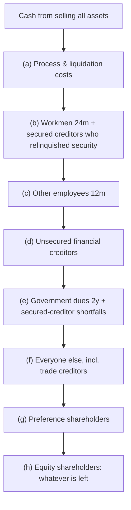
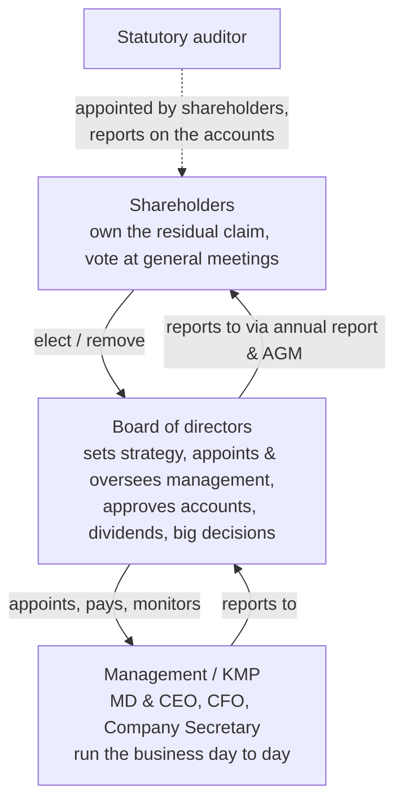
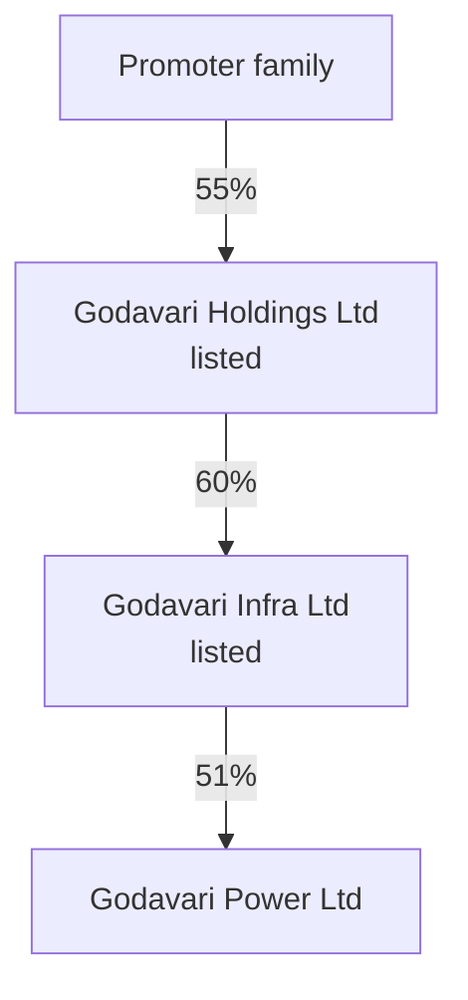

# 01.1 · What a company is

> **Why this matters:** when you buy a share you are not buying a ticker or a chart — you are buying a slice of a
> legal person, with a specific place in a queue of claimants, governed by people whose interests may not match
> yours. Every later lesson (accounting, valuation, forensics) assumes you know who owns what, who decides what,
> and who gets paid first.

**Learning objectives** — after this lesson you can:

- Explain what "separate legal personality" and "limited liability" mean, and why limited liability turns equity
  into a call option on the company's assets.
- Rank the claimants on a company (lenders, employees, government, trade creditors, preference and equity
  shareholders) and run a liquidation waterfall by hand.
- Read the share-capital lines of an Indian balance sheet and explain why face value tells you nothing about what a
  share is worth.
- Distinguish promoter-controlled from professionally managed companies, private from public from listed, and
  subsidiaries from associates — and compute look-through economic interest in a group.
- Work out what a controlling shareholder can and cannot pass on their own (ordinary vs special resolutions,
  related-party votes).
- Identify the three kinds of agency problem, and quantify how much a related-party overcharge moves from minority
  shareholders to a promoter.

**Prerequisites:** [00.1 What fundamental investing is](../00-orientation/01-what-is-fundamental-investing.md)  ·  **Time:** ~90 min

---

## 1. A company is a legal person

Start with the one idea that makes everything else possible. When a business is **incorporated** (registered as a
company under the Companies Act, 2013 in India), the law creates a new person — not a human being, but a
**legal person** (also called a *body corporate*): an entity the law treats as able to own property, sign
contracts, borrow, employ people, sue and be sued, and pay tax **in its own name**.

Compare the ways a business can be organised in India:

| Form | Who owns the assets? | Who is liable for the debts? | Can ownership be sold easily? | Typical use |
|:--|:--|:--|:--|:--|
| **Sole proprietorship** | The owner personally | The owner, without limit | No — you sell the business, not a share of it | Kirana shops, small traders |
| **Partnership firm** | The partners jointly | Every partner, without limit, for all firm debts | Only with other partners' consent | Family trading firms, older CA/law firms |
| **LLP** (limited liability partnership) | The LLP | The LLP; partners' liability limited to their contribution | Only per the LLP agreement | Professional firms, small investment vehicles |
| **Private limited company** | The company | The company; shareholders lose at most their investment | Restricted by the articles | Most unlisted businesses, subsidiaries, start-ups |
| **Public limited company** (may be listed) | The company | The company; shareholders lose at most their investment | Freely transferable; listed shares trade on an exchange | Everything you will analyse in this course |

The last two rows are the subject of this course. Four consequences of legal personality matter to an investor:

1. **The company's assets are not the shareholders' assets.** If you own 1% of Kaveri Pumps & Motors Ltd (our
   fictional running example), you do not own 1% of its Coimbatore factory. You own 1% of the *shares*; the company
   owns the factory. You cannot walk in and take a pump.
2. **The company's debts are not the shareholders' debts.** A bank that lent Kaveri ₹92 Cr of term loans has a
   claim on Kaveri, not on you.
3. **Perpetual succession.** Shareholders die, sell, or change; the company continues. That is what allows a
   business to have a life longer than any owner — and what allows a share to be valued as a claim on cash flows
   stretching decades into the future.
4. **Transferability.** Because ownership is sliced into standardised units (shares), strangers can buy and sell
   slices without renegotiating anything with the company. Stock markets are only possible because of this.

The foundational case is the English House of Lords decision *Salomon v A Salomon & Co Ltd* (1897). Aron Salomon
turned his boot-making business into a company, owned almost all the shares himself and also lent it money
secured by debentures. When the company failed, unsecured creditors argued that the company was really just
Salomon. The Lords disagreed: a properly incorporated company is a different person from its shareholders, even
when one shareholder owns nearly all of it, and Salomon as a *secured creditor* was paid ahead of the unsecured
ones. Indian company law inherited this principle. ([Wikipedia summary of the case](https://en.wikipedia.org/wiki/Salomon_v_A_Salomon_%26_Co_Ltd))

Courts can **"lift the corporate veil"** — ignore the separate personality — in narrow cases such as fraud, sham
structures set up to evade the law, or tax evasion. For an investor the practical lesson runs the other way:
promoters sometimes treat a listed company as if it were their personal property. The law says it is not, and much
of Indian corporate-governance regulation exists to enforce that.

Nearly every company you will analyse is a **company limited by shares**: members' liability is limited to the
amount unpaid on their shares. (The Companies Act also allows companies limited by guarantee and unlimited
companies; you will essentially never meet them as a listed-equity investor.)

## 2. Limited liability: the most important asymmetry in finance

**Limited liability** means a shareholder can lose at most what they paid for their shares (or, for *partly paid*
shares, what they paid plus the unpaid amount they are still bound to pay when the company calls it). If the
company goes bust owing ₹1,000 Cr more than its assets are worth, the shareholders' shares become worthless — but no
creditor can send them a bill for the shortfall.

Why this matters enormously:

- **It makes passive, diversified investing possible.** If every shareholder were personally liable for the debts
  of every company they held, nobody sane would own 40 stocks, let alone an index fund of 500. You would have to
  monitor every company as if your house depended on it — because it would.
- **It shifts downside risk onto creditors.** The losses beyond the equity cushion land on lenders, suppliers and
  (sometimes) employees and the government. Creditors know this, so they protect themselves: they ask for
  **security** (a charge over specific assets), **covenants** (contractual limits on leverage, dividends, asset
  sales), guarantees from promoters, and a higher interest rate for weaker borrowers.
- **It creates a payoff that is floored at zero.** The shareholder's payoff is "whatever is left after everyone
  else is paid, or zero if nothing is left". That shape — zero on the downside, open-ended on the upside — is
  exactly the payoff of a call option.

!!! tip "Trader's lens — equity is a call on the firm"
    Let $A$ be the value of the company's assets at some future date and $D$ the face value of everything that
    ranks ahead of the equity. Limited liability gives shareholders
    $$\text{Equity payoff} = \max(0,\ A - D)$$
    — a European call on the assets struck at the debt. Creditors, symmetrically, hold riskless debt **minus** a put:
    $\min(A, D) = D - \max(0, D - A)$. This is Merton's (1974) structural model, and it gives you three intuitions
    you will reuse all course: (1) equity of a highly levered company behaves like a far out-of-the-money call —
    small in value, huge in percentage moves; (2) shareholders of a company near distress are *long vega* — they
    gain from risk-taking that creditors pay for (see §9, "Type III" agency); (3) a lender's credit spread is the
    premium on the put it has written. We return to Merton properly in
    [06.7 Other valuation methods](../06-valuation/07-other-valuation-methods.md).

## 3. Who has a claim on the company: equity vs debt and the priority of claims

A company has many **claimants** — parties to whom it owes money or a share of value. It helps to sort them by the
nature of their claim:

| Claimant | Nature of claim | Fixed or residual? | Typical protection |
|:--|:--|:--|:--|
| Secured lenders (banks, secured NCD holders) | Contractual interest + principal | Fixed | Charge on assets, covenants |
| Unsecured financial creditors (unsecured bonds, inter-corporate deposits) | Contractual interest + principal | Fixed | Covenants, rating, price |
| Employees | Wages, gratuity, provident fund | Fixed | Labour law, statutory priority |
| Government | Taxes, duties | Fixed | Statute |
| Trade creditors (suppliers) | Unpaid invoices | Fixed | Short credit periods, credit insurance, walking away |
| Preference shareholders | Fixed dividend (if declared) + capital | Fixed-ish (but ranks after all debt) | Terms of issue |
| **Equity shareholders** | **Whatever is left** | **Residual** | Votes, disclosure, law |

The crucial word is **residual**. Every other party has a *contractually fixed* claim: they are owed a number.
Equity shareholders are owed nothing specific; they own what is left after all fixed claims are met — every year
(profit after interest and tax belongs to them) and at the end (in a liquidation they are paid last). This is why:

- Equity is riskier than debt of the same company, so investors demand a higher expected return on it
  (you will quantify this as the *cost of equity* in [06.2](../06-valuation/02-cost-of-capital.md)).
- Equity captures all the upside. A lender to a company that becomes ten times bigger still receives only interest
  and principal; the shareholders receive the rest.
- Shareholders are the natural owners of **control** — the right to vote, elect the board and make decisions —
  because they bear the residual risk of those decisions. (Creditors get control only when the equity is wiped out,
  which is precisely what an insolvency process does.)

You will meet this same split in the **accounting equation** in [02.1](../02-accounting/01-the-accounting-equation.md):

$$\text{Assets} = \text{Liabilities} + \text{Equity} \quad\Longleftrightarrow\quad \text{Equity} = \text{Assets} - \text{Liabilities}$$

Equity is defined as a *leftover*. On the balance sheet it is a book-value leftover; in the market it is a
value leftover.

### The legal order of payment in India

When an Indian company is liquidated under the **Insolvency and Bankruptcy Code, 2016 (IBC)**, Section 53 fixes the
order in which the liquidator distributes the proceeds of selling the assets. Each class is paid in full before the
next receives anything; within a class, claimants rank equally (*pari passu*) and share pro rata if the money runs
out. As of September 2026 the order is ([IBC s.53 text](https://ibclaw.in/section-53-distribution-of-assets/)):

| Rank | Class under IBC s.53(1) |
|--:|:--|
| (a) | Insolvency resolution process costs and liquidation costs |
| (b) | Workmen's dues for the 24 months before liquidation, **and** debts of secured creditors who relinquish their security to the liquidation estate — ranking equally |
| (c) | Wages and unpaid dues of employees other than workmen, for 12 months |
| (d) | Financial debts owed to unsecured creditors |
| (e) | Government dues (for up to 2 years) **and** any shortfall owed to secured creditors who enforced their security themselves — ranking equally |
| (f) | Any remaining debts and dues (this is where most trade creditors / suppliers sit) |
| (g) | Preference shareholders |
| (h) | **Equity shareholders** |

Two surprises for newcomers: trade suppliers, who keep the factory running, rank *below* unsecured financial
creditors and government; and a secured lender can either enforce its security outside the queue (and join
rank (e) for any shortfall) or surrender it and rank at (b).

### Worked example 1 — a liquidation waterfall

*Tapti Textiles Ltd* (fictional, not a running-example company) is liquidated. Its claims, in ₹ Cr:

| Claim | ₹ Cr | IBC rank |
|:--|--:|:--|
| Liquidation and process costs | 12.0 | (a) |
| Workmen's dues (24 months) | 8.0 | (b) |
| Secured bank loans (security relinquished) | 150.0 | (b) |
| Salaries of other employees (12 months) | 6.0 | (c) |
| Unsecured financial debt (unsecured NCDs, inter-corporate deposits) | 60.0 | (d) |
| Government dues (2 years) | 20.0 | (e) |
| Trade creditors | 45.0 | (f) |
| Redeemable preference shares | 10.0 | (g) |
| **Total ranking ahead of equity** | **311.0** | |

**Case A: assets realise ₹240 Cr.** Pay down the queue:

- (a) 12.0 → ₹228.0 Cr left.
- (b) 8.0 + 150.0 = 158.0, paid in full → ₹70.0 Cr left.
- (c) 6.0 → ₹64.0 Cr left.
- (d) 60.0 → ₹4.0 Cr left.
- (e) government claims ₹20.0 Cr but only ₹4.0 Cr remains → **20% recovery**.
- (f) trade creditors: **zero**. (g) preference: **zero**. (h) equity: **zero**.

**Case B: assets realise ₹400 Cr.** All ₹311.0 Cr of prior claims are paid in full and equity receives
$400 - 311 = ₹89.0$ Cr.

**Case C: assets realise only ₹150 Cr.** After (a), ₹138.0 Cr is left for class (b), which is owed ₹158.0 Cr. The
class shares *pari passu*: each rupee of claim recovers $138/158 = 87.3\%$, so workmen get ₹6.99 Cr and the banks
₹131.01 Cr. Everyone below gets nothing.

Across all three cases, the equity payoff is exactly $\max(0, A - 311)$ — the call-option shape from §2.

!!! note "Going concern vs liquidation"
    Liquidation is the *worst case*, not the usual way equity gets paid. A healthy company pays its equity holders
    through dividends and buybacks out of ongoing cash flows, and the market prices the shares on those future
    cash flows. The priority of claims still matters in good times: it is why lenders accept lower returns than
    shareholders, and why equity value is so sensitive to how much debt sits ahead of it
    ([01.2](02-shares-market-cap-and-enterprise-value.md) makes this precise with enterprise value).

## 4. Share capital: authorised, issued, paid-up — and face value vs market price

Open the equity section of any Indian balance sheet and the first line is **equity share capital**. It is the
most misunderstood line in the statements, so let's pin down the vocabulary.

- **Authorised capital** — the maximum share capital the company's memorandum permits it to issue. A legal
  ceiling, raised by shareholder resolution when needed. Economically meaningless on its own.
- **Issued / subscribed capital** — shares actually issued to and taken up by shareholders.
- **Paid-up capital** — the amount actually paid on issued shares. For fully paid shares (almost all listed
  shares) subscribed = paid-up.
- **Face value** (also called **par value** or nominal value) — an arbitrary per-share number fixed in the
  memorandum: ₹1, ₹2, ₹5 and ₹10 are the common ones for Indian listed companies. **Share capital on the balance
  sheet = number of shares × face value.**
- **Securities premium** — when a company issues shares for more than face value, the excess goes to a reserve
  called securities premium (part of "other equity"). So cash raised = face value part + premium part.
- **Market price** — what the share trades at on NSE/BSE today. Determined by buyers and sellers, not by the
  company.
- **Book value per share** — total equity ÷ shares. An accounting number (see [02.4](../02-accounting/04-the-balance-sheet.md)).

### Worked example 2 — Kaveri's share capital, three prices of one share

Kaveri has **6.00 crore shares of ₹5 face value**. At 31-Mar-2026 (FY26):

| Item | Computation | Value |
|:--|:--|--:|
| Equity share capital | 6.00 Cr shares × ₹5 | ₹30.0 Cr |
| Other equity (reserves & surplus) | from the balance sheet | ₹676.1 Cr |
| Total equity (book) | 30.0 + 676.1 | ₹706.1 Cr |
| Book value per share | 706.1 ÷ 6.00 | ₹117.7 |
| Market price (18-Sep-2026) | NSE | ₹390 |
| Market capitalisation | 6.00 Cr × ₹390 | ₹2,340 Cr |
| Price-to-book | 2,340 ÷ 706.1 | 3.31x |

So one Kaveri share has three different "values" printed about it: **₹5** (face value), **₹117.7** (book value)
and **₹390** (market price). Only the last two carry economic information, and only the market price is what you
pay. Face value is a legal artefact from an era when shares were printed certificates.

Now suppose (hypothetically) Kaveri issued 0.50 Cr new shares at ₹390. It would receive $0.50 \times 390 = ₹195.0$
Cr of cash, booked as:

- Equity share capital: $0.50 \times 5 = ₹2.5$ Cr (face value part);
- Securities premium: $0.50 \times (390 - 5) = ₹192.5$ Cr.

Total equity rises by ₹195.0 Cr either way. If Kaveri's face value were ₹1 or ₹10 instead of ₹5, the split between
the two lines would change and nothing else would.

**Where face value still shows up** (so you are not confused):

- **Dividends announced as a percentage of face value.** Indian companies often say "the board recommends a
  dividend of 80%". That means 80% *of face value*: on Kaveri's ₹5 face value, 80% = ₹4.00 per share (Kaveri's
  actual FY26 dividend per share). It does **not** mean 80% of profits or an 80% yield — at ₹390, ₹4 is a
  1.03% yield.
- **Bonus issues and stock splits** are defined in face-value terms (a split of ₹5 shares into ₹1 shares);
  [01.3](03-raising-and-returning-capital.md) covers why they change nothing economically.
- **Legal formalities**, such as share-capital thresholds in company law.

### Kinds of shares

- **Equity (ordinary) shares** — one share, one vote, residual claim. What "a share" means unless stated otherwise.
- **Shares with differential voting rights (DVRs)** — equity with fewer (or more) votes per share, usually trading
  at a discount to the ordinary shares. Rare in India and tightly restricted.
- **Preference shares** — rank ahead of equity for dividends and capital, usually with a fixed dividend rate, and
  may be *cumulative* (unpaid dividends accumulate), *redeemable* (repaid at a fixed date — economically debt-like)
  or *convertible*. Venture-backed Indian start-ups raise money mostly via **CCPS** (compulsorily convertible
  preference shares), which convert to equity before an IPO.

## 5. Who runs the company: shareholders, the board, management — and promoters

Ownership and control are separated into three layers:

- **Shareholders** elect directors, appoint the auditor, and approve fundamental changes at **general
  meetings** (§8).
- The **board of directors** is the company's governing body. It appoints the **managing director (MD)/CEO** and
  the other **key managerial personnel (KMP)** — the CFO and the company secretary — approves the financial
  statements, declares interim dividends, and makes the big decisions (capital raising, acquisitions, major
  capex). Directors are **executive** (also employees, e.g., the MD) or **non-executive**; some non-executives are
  **independent directors**, who by law must have no material relationship with the company or its promoters.
- **Management** runs the business within the authority the board gives it.

For listed companies, the Companies Act (s.149) requires at least one-third of the board to be independent, and
SEBI's **Listing Obligations and Disclosure Requirements (LODR) Regulations, 2015**, Regulation 17, go further: at
least half the board must be non-executive, and at least half must be independent if the chair is an executive or
connected to the promoter (one-third if the chair is a non-executive, non-promoter director). Listed boards must
also have an **audit committee** (dominated by independent directors; it approves related-party transactions and
oversees the auditor), a **nomination & remuneration committee**, and a **stakeholders' relationship committee**;
larger companies also need a risk-management committee. The LODR is amended often (SEBI's
[regulations page](https://www.sebi.gov.in/sebiweb/home/HomeAction.do?doListing=yes&sid=1&ssid=3&smid=0) showed a
latest amendment dated 14-Jul-2026 when this lesson was written) — verify the current text of Regulation 17 there;
[05.6](../05-business-analysis/06-corporate-governance-india.md) covers board quality in depth.

### Promoters — the Indian twist

In the US or UK, most large listed companies have dispersed ownership: no single shareholder owns more than a few
per cent, and professional managers run the show. India is different. Most listed Indian companies have a
**promoter** — the founder, founding family, business group, parent company or government that set up or controls
the company. Legally, a promoter is a person named as such in an offer document or annual return, or who controls
the company's affairs directly or indirectly (Companies Act s.2(69); SEBI's ICDR Regulations use a similar
definition). The promoter and its relatives and affiliates form the **promoter group**, whose holding is disclosed
separately every quarter in the **shareholding pattern** (lesson [01.4](04-indian-market-structure.md)).

| Type of Indian listed company | Controlling owner | Example (verified from exchange shareholding patterns via Screener, quarter ended Jun-2026) |
|:--|:--|:--|
| Family/group-promoted | A family or business group | Kaveri (fictional): Raghunathan family 58.4% |
| Group company held via a holding company | A group holding company | TCS: promoter (Tata Sons) 71.77% |
| MNC subsidiary | Foreign parent | Many consumer and engineering companies (typically 50–75% parent) |
| Public sector undertaking (PSU) | Government of India / a state | Government is the promoter |
| Professionally managed, no promoter | Nobody — dispersed institutions | Larsen & Toubro, ITC, ICICI Bank and (since its 2023 merger with HDFC Ltd) HDFC Bank report no promoter holding |

Sources: [Screener — TCS](https://www.screener.in/company/TCS/consolidated/),
[L&T](https://www.screener.in/company/LT/consolidated/), [ITC](https://www.screener.in/company/ITC/consolidated/),
[ICICI Bank](https://www.screener.in/company/ICICIBANK/consolidated/),
[HDFC Bank](https://www.screener.in/company/HDFCBANK/consolidated/) (shareholding tables, accessed Sep-2026;
Screener compiles the quarterly filings made to NSE/BSE — verify against the exchange filing for anything
important).

A controlling promoter is a double-edged sword:

- **Good:** long horizons, owner mentality, "skin in the game", fast decisions, patient capital through cycles.
- **Bad:** the promoter can extract value from minority shareholders in ways a dispersed-ownership company's
  managers usually cannot — via related-party transactions, royalties, preferential share issues to themselves,
  loans to group companies, or simply by running the company for family objectives. Succession is often opaque.
  And a promoter who **pledges** shares to borrow personally can be forced into selling if the share price falls
  (Kaveri's promoters pledged 6% of their holding in Nov-2025 to fund a promoter-group real-estate venture — a
  yellow flag we will keep returning to).

This is why Indian analysts spend so much time judging the promoter; §9 formalises the problem.

## 6. Private vs public vs listed

The Companies Act, 2013 distinguishes:

- **Private company** (s.2(68)) — its articles restrict the right to transfer shares, cap the number of members at
  200 (excluding employees, and with a special one-person company variant), and prohibit any invitation to the
  public to subscribe for its securities. Name ends in "Private Limited". Kaveri's promoter-owned supplier
  *Kaveri Castings Pvt Ltd* (fictional) is one.
- **Public company** (s.2(71)) — any company that is not private. It *may* raise money from the public. Name ends
  in "Limited".
- **Listed company** (s.2(52)) — a company with any of its securities listed on a recognised stock exchange. Every
  listed company is public, but many public companies are unlisted.

A real illustration: Tata Sons — the holding company of the Tata group — converted from a public limited company to
a private limited company in 2017 and is unlisted, while many of the companies it controls are listed
([Wikipedia — Tata Sons](https://en.wikipedia.org/wiki/Tata_Sons)).

What changes when a company lists:

| | Unlisted (private or public) | Listed |
|:--|:--|:--|
| Price discovery | Negotiated, infrequent | Continuous, on NSE/BSE |
| Liquidity for owners | Low | High (for most large caps) |
| Disclosure | Annual filings with the Registrar of Companies (MCA21) | Quarterly results, shareholding pattern, material events, earnings calls, annual report under SEBI LODR |
| Minimum public float | None | 25% public shareholding (Securities Contracts (Regulation) Rules, rule 19A), with longer phase-in periods for very large new listings under amendments notified on 13-Mar-2026 ([AZB summary](https://www.azbpartners.com/bank/securities-contracts-regulation-amendment-rules-2026/)) |
| Governance rules | Companies Act only | Companies Act + SEBI LODR, insider-trading and takeover regulations |

As an analyst you will spend most time on listed companies, but you will constantly meet unlisted ones — as
subsidiaries, suppliers, customers and promoter vehicles. For those, the MCA21 filings are often the only primary
source ([03.1](../03-reading-filings/01-the-disclosure-universe.md)).

## 7. Group structures: holding, subsidiary, associate, joint venture

Large Indian businesses rarely live in one company. They sit in **groups**: a **holding company** owning stakes in
other companies, which may own stakes in others.

- **Subsidiary** — a company another company *controls*. Under the Companies Act (s.2(87)), control means
  controlling the composition of the board, or exercising or controlling more than one-half of the total voting
  power (alone or with other subsidiaries). The holding company **consolidates** a subsidiary: it adds 100% of the
  subsidiary's revenue, costs, assets and liabilities into its **consolidated** statements, and then shows the
  share belonging to outside shareholders as **non-controlling interest (NCI)**, also called minority interest.
  (The Companies Act also restricts how many layers of subsidiaries certain companies may have.)
- **Associate** — a company over which another has *significant influence* but not control, presumed at 20% or
  more of voting power. Accounted for by the **equity method**: one line on the balance sheet (the investment) and
  one line in the P&L (share of the associate's profit).
- **Joint venture** — joint control by two or more parties by contract (e.g., a 50:50 venture), usually also
  equity-accounted.

The full accounting (Ind AS 110, 28 and 111) is in
[02.8](../02-accounting/08-deeper-cuts-group-accounts-and-other.md). Here we need the economics.

**Real example.** Tata Sons (unlisted) is the holding company of the Tata group. As of 30-Jun-2025 it held about
**71.7% of TCS** (a subsidiary — more than half the votes) and about **20.8% of Titan** (a stake in the
20–50% zone where significant influence is presumed), among stakes in 15 listed companies. About **66%** of Tata
Sons itself is held by philanthropic trusts endowed by the Tata family
([Wikipedia — Tata Sons](https://en.wikipedia.org/wiki/Tata_Sons), citing company filings; the TCS stake was still
71.77% in the Jun-2026 shareholding pattern per [Screener](https://www.screener.in/company/TCS/consolidated/)).

### Worked example 3 — control vs economic interest in a pyramid

*Godavari Holdings Ltd* (fictional, listed) owns 60% of *Godavari Infra Ltd* (listed), which owns 51% of
*Godavari Power Ltd*.

- **Control.** Holdings controls Infra (60% > 50%); Infra controls Power (51% > 50%). So Holdings controls Power —
  Power is a subsidiary of a subsidiary, consolidated all the way up.
- **Economic interest.** Holdings' *look-through* share of Power's profits is $0.60 \times 0.51 = 30.6\%$. If Power
  earns ₹100 Cr PAT, Holdings' consolidated P&L shows ₹100 Cr of Power's profit inside group PAT, but only
  ₹30.6 Cr is **attributable to owners of Holdings**; ₹69.4 Cr belongs to non-controlling interests (Infra's
  outside shareholders' indirect share plus Power's direct outside shareholders).
- **Cash.** If Power pays out all ₹100 Cr as dividend, Infra receives ₹51 Cr; if Infra pays all of that on, Holdings
  receives $0.60 \times 51 = ₹30.6$ Cr. Cash can be "consolidated" on paper but trapped in the subsidiary in
  practice.
- **The promoter's leverage of control.** The family owns 55% of Holdings, so its look-through economic interest in
  Power is $0.55 \times 0.306 = 16.8\%$ — yet it controls 100% of Power's decisions. Pyramids let a family control
  large assets with little capital. The wider the gap between control and cash-flow rights, the stronger the
  temptation to move value toward the entities where the family's economic share is highest.

That last point is why Indian investors read both **standalone** and **consolidated** accounts, and why holding
companies often trade at a discount to the value of what they own
([07.5](../07-special-valuation/05-holdcos-conglomerates-psus-mncs.md)).

## 8. How shareholders actually "own" a company: rights and votes

Owning a share gives you a bundle of rights, not a key to the factory:

1. **Economic rights** — to dividends *when declared* (the board decides; you cannot demand one), to participate in
   buybacks and rights issues on equal terms, and to the residual in a liquidation.
2. **Voting rights** — one vote per equity share, on resolutions at general meetings.
3. **Information rights** — to the annual report, quarterly results, and all LODR disclosures; to attend and ask
   questions at the AGM.
4. **Pre-emptive rights** — new shares must first be offered to existing holders pro rata (a *rights issue*) unless
   shareholders approve otherwise by special resolution (e.g., for a preferential allotment or QIP) — see
   [01.3](03-raising-and-returning-capital.md).
5. **Legal remedies** — minority shareholders meeting thresholds in the Companies Act can petition the National
   Company Law Tribunal (NCLT) against *oppression and mismanagement* (ss.241–244), and class actions are possible
   (s.245). In practice these are slow and rare; your real remedy is usually to sell.

### General meetings and resolutions

- The **annual general meeting (AGM)** must be held within six months of the end of the financial year, with no more
  than 15 months between two AGMs (Companies Act s.96). For a March year-end company that means by 30 September —
  hence India's AGM season in July–September. Business at an AGM: adopting accounts, declaring the final dividend,
  appointing/reappointing directors and auditors, plus any special business.
- Other meetings are **extraordinary general meetings (EGMs)**; many decisions are also taken by **postal ballot**,
  and listed companies must offer **remote e-voting**.
- An **ordinary resolution** passes if votes cast in favour exceed votes cast against. A **special resolution**
  needs votes in favour of at least **three times** the votes against — i.e., at least 75% of votes *cast*
  (s.114). Note: *of votes cast*, not of all shares.

Typical special-resolution matters include altering the articles, issuing shares on a preferential basis or via a
QIP, buybacks above 10% of capital and free reserves, reducing share capital, and voluntary delisting-related
approvals.

### Worked example 4 — what can Kaveri's promoters pass alone?

Kaveri's shareholding (Mar-26): promoters 58.4%, mutual funds 14.2%, FPIs 7.9%, insurance 2.1%, retail & others
17.4% (sum = 100.0%).

**Ordinary resolution.** If the promoters vote their 58.4% in favour, the votes against can be at most 41.6%. Since
58.4 > 41.6, the promoters can pass any ordinary resolution alone, whatever everyone else does.

**Special resolution.** Needs $F \ge 3A$. With $F = 58.4$:

$$A_{\max} = \frac{58.4}{3} = 19.47\% \text{ of total shares}$$

So the resolution fails if more than 19.47% of Kaveri's shares vote against. Non-promoters hold 41.6%, so the
promoters win unless more than $19.47 / 41.6 = 46.8\%$ of the non-promoter shares turn out and vote no.

- If only the institutions (MFs + FPIs + insurers = 24.2%) vote, and all vote against: $58.4 / (58.4 + 24.2) = 70.7\%
  < 75\%$ → **the resolution fails**. Institutions alone can block.
- If institutions split or abstain and retail doesn't vote (retail turnout is typically low), the promoters pass it.

**Related-party transactions.** Under SEBI LODR Regulation 23, *material* related-party transactions need prior
approval by a shareholders' resolution, and **no related party may vote to approve it**. For such votes the
promoters' 58.4% is sidelined and the decision belongs to the other 41.6% — effectively a "majority of the
minority" test. For a company of Kaveri's size, a transaction with a related party is material if it exceeds 10% of
annual consolidated turnover (the absolute cap and tiers that apply to very large companies were revised by SEBI in
2025 — verify the current Regulation 23 text before relying on it; [05.6](../05-business-analysis/06-corporate-governance-india.md)
covers the rule in detail). Kaveri's FY26 purchases from Kaveri Castings were ₹89.2 Cr, against 10% of FY26 turnover
of ₹131.8 Cr — below the line, so the audit committee's approval sufficed. But those purchases grew at a 28.5% CAGR
from ₹25.5 Cr in FY21. At that pace, and with revenue following the house base case, FY28 purchases (≈₹147 Cr) would
exceed 10% of FY27 turnover (≈₹145 Cr) — at which point the minority shareholders would get a vote. Worth watching.

!!! info "India notes"
    - **Promoter ≠ majority.** A promoter with 30–50% usually has *de facto* control because the rest is dispersed
      and turnout is low. SEBI's takeover rules treat 25% as a key threshold (crossing it triggers an open offer)
      — [01.4](04-indian-market-structure.md) and [12.3](../12-macro-special-sits/03-special-situations.md).
    - **Institutional votes are public.** Mutual funds must disclose how they voted on each resolution, and proxy
      advisory firms (e.g., IiAS, InGovern, SES) publish recommendations — reading them before an AGM is a cheap
      governance check.
    - **"Dividend of 80%"** means 80% of *face value*, not of profits (§4).
    - **Standalone vs consolidated.** Indian companies publish both. Group structures (§7) make the difference
      material; read both.

## 9. Agency problems: when the people in charge are not the people who own

An **agency problem** arises when one party (the *agent*) acts on behalf of another (the *principal*) but has
different interests and better information. Jensen and Meckling (1976) put this at the centre of corporate finance.
For equity investors there are three versions.

**Type I — managers vs shareholders.** In dispersed-ownership companies, professional managers may pursue size over
returns (empire-building acquisitions), pay themselves generously, hoard cash, avoid risky-but-valuable projects that
could cost them their jobs, or manage reported numbers to hit bonus targets. Remedies: boards, performance-linked pay
and stock ownership, takeovers, activist investors.

**Type II — controlling shareholder vs minority shareholders.** The dominant problem in India. A promoter who
controls the company but owns only part of its cash flows can gain by **tunnelling** — moving value out of the
listed company to entities they own more of: overpriced purchases from promoter-owned suppliers, underpriced sales
to them, royalty or brand fees to a parent, loans or guarantees to group companies, share issues to themselves at
low prices, or lavish remuneration.

**Type III — shareholders vs creditors.** When a company is close to distress, shareholders (holding the call
option of §2) gain from *raising* risk: a long-shot bet that pays off saves the equity, while if it fails the loss
falls mostly on creditors. They may also pay out cash as dividends just before trouble. Creditors respond with
covenants.

### Worked example 5 — the arithmetic of tunnelling at Kaveri

Suppose (hypothetically — nothing in Kaveri's disclosures proves it) that Kaveri Castings' prices were 5% above
arm's length. On FY26 purchases of ₹89.2 Cr:

- Overcharge $= 89.2 \times \frac{0.05}{1.05} = ₹4.25$ Cr.
- Kaveri's PAT falls by the post-tax amount: $4.25 \times (1 - 0.2517) = ₹3.18$ Cr.
- Kaveri Castings' PAT rises by the same ₹3.18 Cr (assuming it also pays tax at 25.17%).

Now follow the money:

| Party | Share of Kaveri | Share of Kaveri Castings | Change, ₹ Cr |
|:--|--:|--:|--:|
| Promoter family | 58.4% | 100% | $+3.18 - 0.584 \times 3.18 = +1.32$ |
| Minority shareholders of Kaveri | 41.6% | 0% | $-0.416 \times 3.18 = -1.32$ |

The transfer is zero-sum: the promoter gains exactly what the minority loses. Per rupee of post-tax overcharge, the
promoter gains the fraction of Kaveri they *don't* own — here 41.6 paise. **The lower the promoter's stake in the
listed company, the stronger the incentive to tunnel**: a promoter with 30% keeps 70 paise of every post-tax rupee
moved.

What is it worth? The minority loses ₹1.32 Cr a year, or $1.32 / (6.00 \times 0.416) = ₹0.53$ per minority share
per year. Capitalised at Kaveri's P/E of 25.9x (₹2,340 Cr ÷ ₹90.5 Cr), the ₹3.18 Cr of lost annual profit is worth
≈₹82 Cr of market value, or ≈₹13.7 per Kaveri share — about 3.5% of the ₹390 share price, from a 5% overcharge on
10% of material costs. This is why the course keeps flagging the rising related-party share
(6.5% → 10.4% of material cost, FY21 → FY26) even though the company says pricing is at arm's length.

### Two real episodes

- **Satyam–Maytas (2008).** In December 2008 Satyam Computer Services' board approved buying Maytas Properties and
  Maytas Infra — companies controlled by the family of chairman B. Ramalinga Raju — for about US$1.6 billion.
  Investors revolted (Satyam's shares fell about 55% on the NYSE), the deal was dropped, and four directors
  resigned on 29-Dec-2008. On 7-Jan-2009 Raju confessed to years of falsified accounts. A cash-rich listed company
  proposing to pay its cash to promoter-family companies is Type II agency in its purest form
  ([Wikipedia — Satyam Computer Services](https://en.wikipedia.org/wiki/Satyam_Computer_Services); full case in
  [13 · I1](../13-case-studies/india/01-satyam-2009.md)).
- **Tata Sons–Cyrus Mistry (2016–2021).** In October 2016 the Tata Sons board removed its chairman, Cyrus Mistry,
  whose family firm held about 18.4% of Tata Sons. The NCLAT reinstated him in December 2019; the Supreme Court
  upheld his removal in March 2021 ([Wikipedia — Cyrus Mistry](https://en.wikipedia.org/wiki/Cyrus_Mistry)).
  Whatever one thinks of the merits, it shows how little an 18% minority stake can do against a holder of about
  two-thirds of the votes.

### What limits agency costs

Independent directors and the audit committee; majority-of-minority votes on material related-party transactions;
mandatory disclosure (related-party notes, shareholding patterns, pledge disclosures); institutional investors'
voting and engagement; SEBI enforcement; auditors; and, ultimately, the share price — companies with poor governance
tend to trade at lower multiples, which raises their cost of capital. None is perfect. Your job as an analyst is to
estimate how much value might leak and demand a discount for it — see
[05.5](../05-business-analysis/05-management-and-capital-allocation.md) and
[09.5](../09-forensics/05-governance-red-flags-india.md).

!!! tip "Trader's lens — risk-shifting is a vega trade"
    Equity near distress is a call close to (or below) the strike. Its value rises with the volatility of the
    underlying assets: $\partial C / \partial \sigma > 0$. A board acting purely for shareholders of a nearly
    insolvent company therefore has an incentive to *increase* asset volatility — a riskier project, a bigger
    acquisition, a bet-the-company tender — even at negative expected value, because the downside belongs to the
    creditors (who are short the put). This is Type III agency, and it is why bank-loan covenants restrict new
    debt, asset sales and dividends once leverage rises.

!!! warning "Common mistakes"
    - **Confusing face value with value.** A ₹10-face-value share is not "worth more" than a ₹1-face-value share.
      "Dividend of 200%" on ₹1 face value is ₹2 a share.
    - **Thinking you own the assets.** You own a residual claim on a legal person. The company's cash is not your
      cash until it is paid out — and in a group it may be trapped in a subsidiary.
    - **Reading consolidated profit as "the shareholders' profit".** Use PAT *attributable to owners of the
      parent*, not group PAT including NCI.
    - **Assuming 51% is needed for control, or that 51% gives total control.** A 35% promoter can control a
      dispersed company; a 58% promoter still cannot pass a special resolution if institutions turn out against it,
      and cannot vote on its own material related-party deals.
    - **Treating "professionally managed" as automatically better.** It replaces Type II agency risk with Type I;
      judge the incentives, not the label.
    - **Ignoring where you sit in the queue.** Preference shares, unsecured debt and trade creditors are all ahead
      of you; in distress, equity is usually worth zero long before the business is.

## Key terms

| Term | Meaning |
|:--|:--|
| **Legal person** | An entity (like a company) that the law treats as able to own property, contract, sue and be sued in its own name |
| **Limited liability** | A shareholder's maximum loss is what they paid (plus any unpaid amount on partly paid shares) |
| **Residual claim** | The claim on whatever remains after all fixed claims are met — the defining feature of equity |
| **Priority of claims** | The order in which claimants are paid; in Indian liquidation, fixed by IBC s.53 |
| **Pari passu** | Ranking equally; sharing pro rata if funds are insufficient |
| **Secured creditor** | A lender with a charge over specific assets |
| **Authorised / paid-up capital** | Legal ceiling on share capital / the amount actually paid on issued shares |
| **Face value (par)** | Nominal per-share amount; share capital = shares × face value |
| **Securities premium** | Excess of issue price over face value, held in other equity |
| **Book value per share** | Total equity ÷ number of shares |
| **Market capitalisation** | Shares outstanding × market price |
| **Preference share** | Share ranking ahead of equity for dividends and capital, usually fixed-rate |
| **Board of directors** | Governing body elected by shareholders; appoints and oversees management |
| **Independent director** | Non-executive director with no material relationship with the company or promoters |
| **KMP** | Key managerial personnel: MD/CEO, CFO, company secretary (and whole-time directors) |
| **Promoter / promoter group** | The controlling founder, family, group, parent or government, and persons connected to it |
| **Private / public / listed company** | Restricted-transfer company with ≤200 members / any non-private company / company with securities on a recognised exchange |
| **Subsidiary** | A company controlled by another (board control or >50% voting power); consolidated line by line |
| **Associate** | A company over which another has significant influence (presumed at ≥20% votes); equity-accounted |
| **Non-controlling interest (NCI)** | Outside shareholders' share of a consolidated subsidiary |
| **Look-through interest** | Product of ownership percentages down a chain of holdings |
| **AGM / EGM** | Annual / extraordinary general meeting of shareholders |
| **Ordinary / special resolution** | Passed by votes for > votes against / votes for ≥ 3 × votes against |
| **Related-party transaction (RPT)** | A transaction between the company and a party connected to it (promoters, directors, group companies) |
| **Agency problem** | Conflict of interest between a principal and the agent acting for them |
| **Tunnelling** | Transferring value from a listed company to entities owned more heavily by its controller |
| **Pledge** | Promoter shares given as collateral for a loan; a forced-selling risk if the price falls |

## Check your understanding

1. Why does limited liability make equity look like a call option? What is the "strike"?

    

Answer

    Shareholders receive whatever is left after all prior claims, but never less than zero because they are not
    liable for shortfalls. The payoff is $\max(0, A - D)$ where $A$ is asset value and $D$ is the total of claims
    ranking ahead of equity — a call on the assets struck at $D$.
    

2. *Tapti Textiles* (Worked example 1) realises ₹300 Cr instead of ₹240 Cr. How much do the government, the trade
   creditors, the preference holders and the equity holders each receive?

    

Answer

    After (a) 12.0, (b) 158.0, (c) 6.0 and (d) 60.0, ₹64.0 Cr is left. Government dues (e) take ₹20.0 Cr in full →
    ₹44.0 Cr left. Trade creditors (f) are owed ₹45.0 Cr and get ₹44.0 Cr (97.8% recovery). Preference and equity
    get nothing. Check: $\max(0, 300 - 311) = 0$.
    

3. A company has 12 crore shares of ₹2 face value trading at ₹640, and total equity of ₹1,920 Cr. What are its share
   capital, book value per share, market cap and P/B? If it announces a "dividend of 250%", how much is paid per
   share, and what is the yield?

    

Answer

    Share capital $= 12 \times 2 = ₹24$ Cr. BVPS $= 1{,}920 / 12 = ₹160$. Market cap $= 12 \times 640 = ₹7{,}680$ Cr.
    P/B $= 7{,}680 / 1{,}920 = 4.0$x. Dividend $= 250\% \times ₹2 = ₹5$ per share; yield $= 5/640 = 0.78\%$.
    

4. A promoter holds 45% and votes in favour of a special resolution. What percentage of *total* shares voting
   against would defeat it? If institutions holding 20% vote against and nobody else votes, does it pass?

    

Answer

    Needs $F \ge 3A$, so it fails if $A > 45/3 = 15\%$ of total shares. With 20% against: $45/(45+20) = 69.2\% <
    75\%$ → **fails**.
    

5. Holdings owns 70% of A; A owns 40% of B (an associate of A). B earns ₹50 Cr. How much of B's profit shows up in
   Holdings' consolidated profit, and how much is attributable to Holdings' owners?

    

Answer

    A equity-accounts B: A's P&L includes $0.40 \times 50 = ₹20$ Cr as "share of profit of associate". Holdings
    consolidates A fully, so the ₹20 Cr appears in Holdings' consolidated PAT; of that, $0.70 \times 20 = ₹14$ Cr is
    attributable to Holdings' owners and ₹6 Cr to A's non-controlling interest. Look-through: $0.70 \times 0.40 =
    28\%$ of ₹50 Cr = ₹14 Cr.
    

6. In Worked example 5, redo the tunnelling arithmetic for a promoter that owns 30% of the listed company (and 100%
   of the supplier). Per ₹1 of *post-tax* overcharge, how much does the promoter gain? Why does this matter for how
   you read promoter holdings?

    

Answer

    Promoter gains ₹1.00 via the supplier and loses $0.30 \times ₹1.00$ via the listed company: net **+₹0.70**; the
    minority loses ₹0.70. The smaller the promoter's stake in the listed entity (relative to its stake in the
    counterparty), the stronger the incentive to tunnel. A falling promoter stake combined with rising
    related-party dealings is a classic Type II warning sign.
    

7. Why do trade creditors often recover less than banks in an Indian liquidation, even though suppliers keep the
   business running?

    

Answer

    Under IBC s.53, secured creditors (who relinquish security) rank at (b) with workmen, unsecured *financial*
    creditors at (d) and government dues at (e), while most trade (operational) creditors fall into (f), "remaining
    debts". Banks also protect themselves with security and covenants; suppliers typically extend unsecured credit.
    

## Go deeper

- *Salomon v A Salomon & Co Ltd* [1897] AC 22 — the separate-personality case; a short read in any company-law
  casebook ([summary](https://en.wikipedia.org/wiki/Salomon_v_A_Salomon_%26_Co_Ltd)).
- Michael C. Jensen & William H. Meckling, "Theory of the Firm: Managerial Behavior, Agency Costs and Ownership
  Structure", *Journal of Financial Economics* 3(4), 1976 — the founding paper on agency costs.
- Robert C. Merton, "On the Pricing of Corporate Debt: The Risk Structure of Interest Rates", *Journal of Finance*
  29(2), 1974 — equity as a call on the firm; required reading for an options person.
- Reinier Kraakman et al., *The Anatomy of Corporate Law* (3rd ed., OUP, 2017) — the three agency problems and the
  legal strategies used against them, compared across countries.
- [IndiaCorpLaw](https://indiacorplaw.in/) — the best running commentary on Indian company and securities law
  (promoters, related-party rules, SEBI orders).

---
[← Previous: 00.3 The investor's map](../00-orientation/03-the-research-workflow-map.md) · [Module index](index.md) · [Next: 01.2 Shares, market cap & enterprise value →](02-shares-market-cap-and-enterprise-value.md)
