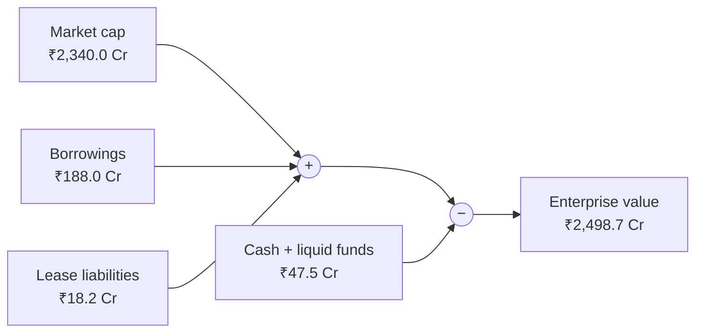

# 01.2 · Shares, market cap & enterprise value

> **Why this matters:** "Kaveri is a ₹2,340 Cr company" and "Kaveri trades at 13.7x EV/EBITDA" are two different
> statements about two different things — the price of the *equity* and the price of the *business*. Mixing them up
> is the single most common error in comparing companies, and getting share counts wrong quietly misprices
> everything you compute per share.

**Learning objectives** — after this lesson you can:

- Pick the right share count (basic, weighted-average, diluted) for the question you are asking, and explain free
  float and how NSE measures it.
- Compute market cap, EPS, book value per share, P/E and P/B for Kaveri from its reference statements.
- Build enterprise value from its components (debt, leases, preference, NCI, cash, non-operating assets) and state
  why each is added or subtracted.
- Apply the matching principle: pair EV with pre-interest measures and equity value with post-interest measures.
- Compute dilution from options and warrants with the treasury-stock method and from convertibles with the
  if-converted method — and explain what the treasury-stock method leaves out.
- Think per share: show when company-level growth fails to reach the shareholder.

**Prerequisites:** [01.1 What a company is](01-what-is-a-company.md)  ·  **Time:** ~90 min

---

## 1. Shares outstanding — and which count to use

**Shares outstanding** is the number of equity shares issued and held by investors. For Kaveri it is **6.00 crore**
— read straight off the share-capital line: ₹30.0 Cr of share capital ÷ ₹5 face value.

There is no single "right" share count; there is a right count *for each question*:

| Share count | What it is | Use it for |
|:--|:--|:--|
| **Period-end basic** | Shares in issue on the balance-sheet date | Book value per share; market cap *today* (with today's count) |
| **Weighted-average basic** | Shares in issue weighted by the fraction of the period each was outstanding | Basic EPS (a flow over the year, so the denominator is an average) |
| **Diluted (accounting)** | Weighted-average basic + potential shares from options, warrants and convertibles that would *reduce* EPS, computed under Ind AS 33 | Reported diluted EPS |
| **Fully diluted (valuation)** | Today's basic + all potential shares that are economically in the money (or the value of those claims deducted separately) | Value per share, per-share targets, takeover maths |

Where to find the numbers: the share-capital note in the annual report, the quarterly **shareholding pattern**
filed on NSE/BSE (it gives the total count), the EPS note (weighted-average and diluted counts), and the ESOP
disclosure in the Board's report (options outstanding and exercise prices).

!!! info "India notes — there is (almost) no treasury stock"
    In the US, companies that buy back shares often keep them as *treasury stock*, which must be subtracted from
    issued shares. Indian company law requires shares bought back to be **extinguished**, so issued ≈ outstanding.
    The one wrinkle is an **ESOP trust**: shares a company's employee-welfare trust holds for future grants are
    shown as a deduction from equity in the consolidated accounts and are excluded from the EPS denominator. Check
    the EPS note for the count the company itself uses.

## 2. Market capitalisation and free float

$$\text{Market capitalisation} = \text{shares outstanding} \times \text{share price}$$

Kaveri at ₹390 (18-Sep-2026): $6.00 \times 390 = ₹2{,}340$ Cr. This is the price of **100% of the equity** — what it
would cost to buy every share at today's price (ignoring the premium a buyer of control would pay, and the price
impact of trying).

Not all of those shares can actually be bought. **Free float** is the part of the equity available to ordinary
investors — excluding promoter holdings and other strategic, locked-up or insider holdings. Free float matters
because it decides **index weights** (Nifty indices are free-float weighted), how much stock mutual funds and FPIs can
realistically accumulate, and how easily a large order moves the price.

NSE Indices measures free float with an **Investible Weight Factor (IWF)**: the fraction of shares left after
excluding, where identifiable, holdings such as the promoter category, promoter families and trusts, associate and
group companies, employee welfare trusts, directors and key management personnel, board-nominating shareholders,
strategic corporate stakes, government holdings, foreign direct investment, private-equity and venture investors,
sovereign wealth funds, shares under lock-in and the IEPF. The IWF is computed from the quarterly shareholding
pattern and rounded to six decimals (NSE Indices, [Methodology Document for Equity Indices, September 2026](https://www.niftyindices.com/Methodology/Method_NIFTY_Equity_Indices.pdf),
section "Investible Weight Factors").

For Kaveri, promoters hold 58.4%, so the IWF can be **at most** 0.416 (lower if directors or KMP outside the promoter
group hold shares). Free-float market cap is therefore at most $0.416 \times 2{,}340 = ₹973$ Cr. A mutual fund
wanting a 5% position in a ₹20,000 Cr small-cap fund needs ₹1,000 Cr of stock — more than Kaveri's entire free
float. Small free floats are one reason small caps can move violently on flows
([01.4](04-indian-market-structure.md) covers index rules, SEBI's large/mid/small-cap buckets and flows).

## 3. Per-share accounting metrics: EPS and book value per share

**Earnings per share (EPS)** is the profit attributable to equity shareholders per share:

$$\text{Basic EPS} = \frac{\text{PAT attributable to owners of the parent (after preference dividends)}}{\text{weighted-average shares outstanding}}$$

**Book value per share (BVPS)** is accounting equity per share:

$$\text{BVPS} = \frac{\text{equity attributable to owners of the parent}}{\text{period-end shares outstanding}}$$

Divide price by each and you get the two most quoted multiples: **P/E** (price ÷ EPS) and **P/B** (price ÷ BVPS). The
inverse of P/E, **earnings yield** (EPS ÷ price), is a handy way to compare a stock with a bond yield — with the big
caveat that earnings are neither all paid out nor fixed.

### Worked example 1 — Kaveri per share (FY26 financials, price ₹390)

| Metric | Computation | Value |
|:--|:--|--:|
| Basic EPS | ₹90.5 Cr ÷ 6.00 Cr | ₹15.08 |
| Diluted EPS | ₹90.5 Cr ÷ 6.07 Cr | ₹14.91 |
| BVPS | ₹706.1 Cr ÷ 6.00 Cr | ₹117.68 |
| P/E (trailing, basic) | ₹390 ÷ ₹15.08 (= ₹2,340 Cr ÷ ₹90.5 Cr) | 25.9x |
| Earnings yield | ₹15.08 ÷ ₹390 | 3.9% |
| P/B | ₹390 ÷ ₹117.68 | 3.31x |

(The reference ratio table shows EPS to one decimal, ₹15.1; computing P/E from the unrounded ₹15.08 gives 25.9x, the
figure in Kaveri's peer table.)

**Weighted-average matters when the share count changes.** Kaveri's count was constant at 6.00 Cr from FY21 to FY26,
so period-end and weighted-average coincide. Nirmal Finance issued 1.0 Cr new shares in its FY24 QIP (10.0 → 11.0 Cr).
The reference ratio table computes FY24 EPS on year-end shares for simplicity: ₹169.0 Cr ÷ 11.0 = ₹15.36. Under Ind AS
33 the denominator is time-weighted: *if* the QIP shares had been issued at mid-year, the weighted average would be
10.5 Cr and basic EPS ₹169.0 ÷ 10.5 = ₹16.10. Same company, same year, 5% difference in EPS from the denominator
alone. Always check which count a data source uses.

## 4. Enterprise value: the price of the whole business

Imagine buying a house worth ₹1 crore that comes with a ₹60 lakh mortgage you must take over, and ₹5 lakh of cash
left in a drawer. You pay the seller ₹45 lakh for their equity. But the *house* cost you
$45 + 60 - 5 = ₹1$ crore: the equity price plus the debt you assumed, less the cash you found.

**Enterprise value (EV)** applies the same logic to a company. It is the value of the operating business —
factories, brands, working capital, customer relationships — to *all* capital providers together:

$$\text{EV} = \text{market cap} + \text{debt} + \text{lease liabilities} + \text{preference shares} + \text{NCI} - \text{cash \& liquid investments} - \text{non-operating assets}$$

| Component | Add or subtract | Why |
|:--|:--|:--|
| Market cap (equity) | + | The shareholders' claim on the business |
| Borrowings (short and long term, incl. current maturities) | + | Lenders' claim; an acquirer inherits it |
| Lease liabilities (Ind AS 116) | + | Debt-like fixed obligations for the use of assets (see "consistency" below) |
| Preference shares (held by outsiders) | + | A senior claim ahead of equity |
| Non-controlling interest (NCI) | + | Consolidated EBITDA includes 100% of subsidiaries; the outside owners' slice must be added to match |
| Cash and liquid investments | − | Not needed to run the business (beyond a small operating float); an acquirer could use it to repay debt |
| Non-operating assets (investments in associates, surplus land, stakes in other listed companies) | − | Their earnings are not in EBITDA, so their value must be taken out to keep numerator and denominator matched |

Read in reverse, the same identity is the **equity bridge** you will use in every DCF: value the business (EV),
subtract the other claims, and what is left is the equity ([06.3](../06-valuation/03-dcf-step-by-step.md)).



### Worked example 2 — Kaveri's EV at ₹390

From Kaveri's FY26 balance sheet (latest audited; ₹ Cr):

| Component | Source line | ₹ Cr |
|:--|:--|--:|
| Market cap | 6.00 Cr × ₹390 | 2,340.0 |
| + Borrowings – non-current (term loans) | balance sheet | 92.0 |
| + Borrowings – current (working capital + current maturities) | balance sheet | 96.0 |
| + Lease liabilities | balance sheet | 18.2 |
| − Cash & cash equivalents | balance sheet | (32.5) |
| − Current investments (liquid mutual funds) | balance sheet | (15.0) |
| **Enterprise value** | | **2,498.7** |
| *memo:* net debt = 92.0 + 96.0 − 32.5 − 15.0 | | *140.5* |

Kaveri has no preference shares, no subsidiaries with outside shareholders and no associates, so those lines are
zero. Now the enterprise multiples, each matched to a pre-interest measure:

| Multiple | Computation | Value |
|:--|:--|--:|
| EV / EBITDA | 2,498.7 ÷ 181.9 | 13.7x |
| EV / EBIT | 2,498.7 ÷ 134.1 | 18.6x |
| EV / Sales | 2,498.7 ÷ 1,318.0 | 1.90x |

Check against the reference: the peer table shows Kaveri at 13.7x EV/EBITDA, and at the 31-Mar-2026 price of ₹520 the
same build gives $6.00 \times 520 + 140.5 + 18.2 = ₹3{,}278.7$ Cr and $3{,}278.7 / 181.9 = 18.0$x — the FY26 figure in
the ratio table.

And against the house view: the reference valuation puts Kaveri's EV at **₹2,100 Cr** and equity at
$2{,}100 - 140.5 - 18.2 = ₹1{,}941.3$ Cr, or **₹320** per diluted share (6.07 Cr). On the same 6.07 Cr diluted shares,
the market's EV at ₹390 is $6.07 \times 390 + 140.5 + 18.2 = ₹2{,}526.0$ Cr — the market is paying about ₹426 Cr more
for the business than the base case says it is worth ([kaveri-valuation.md](../appendix/running-example/kaveri-valuation.md)).

### Consistency with leases

Since Ind AS 116 (FY20), most leases put a **right-of-use asset** and a **lease liability** on the balance sheet, and
the lease cost appears *below* EBITDA as depreciation of the ROU asset plus interest on the lease liability. Kaveri's
EBITDA of ₹181.9 Cr therefore excludes FY26 lease costs of ₹4.7 Cr (ROU amortisation) + ₹1.4 Cr (lease interest)
= ₹6.1 Cr. You have two consistent choices:

| Choice | EV | EBITDA | EV/EBITDA |
|:--|--:|--:|--:|
| Leases treated as debt (course convention) | 2,498.7 (incl. 18.2 of leases) | 181.9 (before lease costs) | 13.74x |
| Leases treated as operating costs | 2,480.5 (excl. leases) | 175.8 (after ₹6.1 Cr lease costs) | 14.11x |
| **Inconsistent mix** (EV excl. leases, EBITDA before lease costs) | 2,480.5 | 181.9 | 13.64x ← flattering |

The mix makes the stock look cheaper than either consistent version. For Kaveri the effect is small; for retailers,
airlines, hospitals and quick-service restaurants, where leases are large, it can be several turns of EBITDA
([02.7](../02-accounting/07-deeper-cuts-assets-and-expenses.md)).

## 5. Market cap prices the equity; EV prices the business

### Worked example 3 — same business, two capital structures

Two identical businesses each earn EBITDA of ₹100 Cr, with D&A of ₹20 Cr (so EBIT ₹80 Cr), a 25% tax rate, and
both are worth 10x EBITDA, i.e. EV = ₹1,000 Cr. *Alpha* has no debt. *Beta* has ₹400 Cr of debt at 9%.

| ₹ Cr | Alpha | Beta |
|:--|--:|--:|
| Enterprise value | 1,000.0 | 1,000.0 |
| Debt | 0.0 | 400.0 |
| **Equity value (market cap)** | **1,000.0** | **600.0** |
| EBIT | 80.0 | 80.0 |
| Interest (9% × debt) | 0.0 | 36.0 |
| PBT | 80.0 | 44.0 |
| PAT (× 0.75) | 60.0 | 33.0 |
| **EV / EBITDA** | **10.0x** | **10.0x** |
| **P/E** (equity ÷ PAT) | **16.7x** | **18.2x** |

Same business, same EV multiple, **different P/E** — purely because of financing. Comparing Alpha's P/E with Beta's
tells you nothing about which business is cheaper. Enterprise multiples strip out the capital structure; equity
multiples do not.

Now let EBITDA fall 20% to ₹80 Cr, with the market still paying 10x. EV falls to ₹800 Cr for both. Alpha's equity
falls from ₹1,000 Cr to ₹800 Cr (**−20%**); Beta's from ₹600 Cr to ₹400 Cr (**−33%**). The debt claim does not
shrink, so the whole loss lands on Beta's thinner equity. The multiplier is $\text{EV}/\text{Equity} = 1{,}000 / 600
= 1.67$, and $-20\% \times 1.67 = -33\%$.

!!! tip "Trader's lens — leverage is a delta multiplier"
    With riskless debt, a 1% move in EV moves equity by $\text{EV}/E$ per cent — Beta's equity has 1.67x the
    "delta" of its business. In beta terms, $\beta_E = \beta_A \times \text{EV}/E$ (the levered-beta relation you
    will derive in [06.2](../06-valuation/02-cost-of-capital.md)). Push leverage further and the equity stops being
    a leveraged linear claim and starts behaving like the out-of-the-money call from
    [01.1 §2](01-what-is-a-company.md#2-limited-liability-the-most-important-asymmetry-in-finance): convex, high-gamma,
    and worth something even when EV < debt, because of time value.

### The matching principle

A multiple is only meaningful if numerator and denominator refer to the **same claimants**:

| Numerator | Belongs to | Match with (denominator) |
|:--|:--|:--|
| **Enterprise value** | All capital providers (debt + equity + NCI + preference) | Revenue, gross profit, EBITDA, EBIT, NOPAT, free cash flow to the firm (FCFF), invested capital, operating capacity (tonnes, beds, stores) |
| **Equity value (market cap)** | Shareholders only | PAT attributable to owners, EPS, dividends, free cash flow to equity (FCFE), book equity |

Classic mismatches: "market cap / EBITDA" (ignores debt — makes a levered company look cheap), "EV / PAT" (interest
already deducted from the denominator, but the debt is in the numerator — double counts), "P/E of a holding company
whose PAT includes associates' profits, compared with an operating company's P/E" (different earnings streams).

### Worked example 4 — a fuller EV build with NCI, preference shares and an associate

*Tungabhadra Cements Ltd* (fictional) has 20 Cr shares at ₹250. Its consolidated balance sheet shows borrowings of
₹1,800 Cr, lease liabilities ₹120 Cr, redeemable preference shares held by a financial investor ₹200 Cr, NCI of ₹600
Cr (outside holders own 30% of a grinding-unit subsidiary), cash ₹450 Cr, liquid mutual funds ₹250 Cr, and a 26%
stake in a listed power company (an associate) whose market value is ₹1,500 Cr. Consolidated EBITDA (which includes
100% of the subsidiary and none of the associate) is ₹720 Cr.

| ₹ Cr | Correct build | Naive build (mcap + debt − cash) |
|:--|--:|--:|
| Market cap (20 × 250) | 5,000 | 5,000 |
| + Borrowings | 1,800 | 1,800 |
| + Lease liabilities | 120 | – |
| + Preference shares | 200 | – |
| + NCI | 600 | – |
| − Cash | (450) | (450) |
| − Liquid mutual funds | (250) | – |
| − Associate stake at market value | (1,500) | – |
| **Enterprise value** | **5,520** | **6,350** |
| **EV / EBITDA (₹720 Cr)** | **7.7x** | **8.8x** |

The naive build overstates the multiple by 15%, mostly because it ignores the ₹1,500 Cr associate stake — an asset the
shareholders own but whose profits are not in EBITDA. Two judgement calls hide in this table:

- **NCI at book or at market?** Book NCI (₹600 Cr) is an accounting number. If the subsidiary earns PAT of ₹80 Cr and
  similar businesses trade at 15x earnings, the minority's 30% slice is worth $0.30 \times 80 \times 15 = ₹360$ Cr;
  using that, EV becomes ₹5,280 Cr. Market value is conceptually right; book is the common shortcut.
- **Associate at market or book?** Use market value if the associate is listed, and consider a tax/holding discount if
  the stake could not be sold without friction ([07.5](../07-special-valuation/05-holdcos-conglomerates-psus-mncs.md)).

### Other debt-like and cash-like items (judgement required)

The formula above is the skeleton. Real balance sheets contain items that behave like debt or like cash without
being labelled so. A careful analyst considers:

- **Debt-like:** unfunded employee-benefit obligations (gratuity, pensions); provisions for known liabilities
  (litigation, decommissioning); **contingent liabilities** likely to crystallise (Kaveri's ₹38.0 Cr GST demand under
  appeal: if you judged a 50% chance of paying, a ₹19 Cr debt-like adjustment is ₹3.1 per diluted share); deferred
  consideration for acquisitions; supplier-finance or "acceptances" that are really short-term bank debt.
- **Not debt (usually):** bank guarantees (Kaveri's ₹96 Cr of performance guarantees become debt only if invoked);
  ordinary trade payables (part of working capital).
- **Cash that isn't free:** minimum operating cash, cash trapped in overseas subsidiaries or restricted by lenders
  (margin money, deposits under lien), customer advances sitting in the bank.

These are covered properly in the DCF equity bridge ([06.3](../06-valuation/03-dcf-step-by-step.md)) and in the
forensic lessons (a company reporting large cash *and* large debt is a classic warning — [09.4](../09-forensics/04-cash-flow-games.md)).

## 6. Basic vs diluted shares: ESOPs, warrants and convertibles

Shares outstanding today are not the only claims on the equity. **Potential shares** come from:

- **Employee stock options (ESOPs)** and restricted stock units (RSUs) granted to employees;
- **Warrants** — options issued by the company to investors (in India, very often to promoters in a preferential
  allotment — see [01.3](03-raising-and-returning-capital.md));
- **Convertible securities** — compulsorily or optionally convertible debentures and preference shares, foreign
  currency convertible bonds (FCCBs).

Each gives its holder the right (or obligation) to receive new shares, usually for a payment. Ignoring them overstates
value per share.

### The treasury-stock method (TSM) for options and warrants

The TSM assumes that holders of in-the-money options exercise them, pay the exercise price $K$ to the company, and the
company uses that cash to buy back shares at the market price $P$. For $n$ options, the net new shares are

$$\Delta N = n - \frac{nK}{P} = n\left(1 - \frac{K}{P}\right) \quad \text{if } P > K, \text{ else } 0.$$

Ind AS 33 uses the **average market price during the period** for $P$ when computing diluted EPS, and ignores options
that would increase EPS (anti-dilutive ones). For valuation, analysts usually use the current price or their own value
per share.

A neat identity: the TSM's cost to existing holders, $\Delta N \times P = n(P - K)$, is exactly the options'
**intrinsic value**.

### Worked example 5 — Kaveri's ESOPs

Kaveri's reference data say only that ESOPs were granted in FY24 and that the FY26 diluted share count is 6.07 Cr. For
this example we add **fictional grant terms consistent with that figure**: 10 lakh options (0.10 Cr) outstanding with
an exercise price of ₹200.

**Accounting (FY26 diluted EPS).** Suppose Kaveri's average share price in FY26 was ₹650 (it was ₹780 at the start
of the year and ₹520 at the end):

$$\Delta N = 0.10 \times \left(1 - \frac{200}{650}\right) = 0.0692 \text{ Cr} \Rightarrow 6.00 + 0.07 = 6.07 \text{ Cr}$$

— the reference diluted count, giving diluted EPS of ₹14.91.

**Valuation today (price ₹390).** The dilution is smaller at a lower price:
$\Delta N = 0.10 \times (1 - 200/390) = 0.0487$ Cr → 6.049 Cr. Its value cost is the intrinsic value,
$0.10 \times (390 - 200) = ₹19.0$ Cr.

Now compare three ways of turning the reference equity value of ₹1,941.3 Cr into a per-share value:

| Method | Computation | ₹ per share |
|:--|:--|--:|
| Reference convention (FY26 diluted count) | 1,941.3 ÷ 6.07 | 319.8 |
| TSM at today's price | 1,941.3 ÷ 6.049 | 320.9 |
| Option-value method (Black–Scholes value deducted, see lens below) | (1,941.3 − 22.3) ÷ 6.00 | 319.8 |

Small differences here, because Kaveri's options are only ~1.7% of its shares. For companies with ESOP pools of 5–10%
of equity — common among Indian new-age technology companies — the method matters a great deal
([07.4](../07-special-valuation/04-high-growth-and-loss-making.md)).

!!! tip "Trader's lens — TSM prices options at intrinsic value"
    The TSM charges existing shareholders exactly $n(P - K)$: intrinsic value, zero time value. An option trader
    knows that is wrong for anything but an option at expiry. Price Kaveri's options with Black–Scholes — $S =
    ₹390$, $K = ₹200$, three years to expiry, volatility 40%, risk-free rate 6.5%, dividend yield 1.0% — and each is
    worth about **₹222.9**, versus ₹190 intrinsic: ₹32.9 of time value. Total claim: $0.10 \times 222.9 = ₹22.3$ Cr,
    versus ₹19.0 Cr under TSM. The gap is worst for **at-the-money** grants: a four-year option struck at ₹390 is
    worth about ₹145 under the same inputs, yet the TSM counts **zero** dilution because it has no intrinsic value.
    Deducting option value from equity value (and dividing by basic shares) is the more rigorous approach; the
    caveats are the usual ones — vesting, forfeiture, early exercise, and the dilution feedback on the share price.

### Convertibles: the if-converted method

For a convertible, assume conversion: add the new shares to the denominator and add back the post-tax interest (or
preference dividend) that would no longer be paid to the numerator.

### Worked example 6 — accounting anti-dilution vs economic dilution

*Narmada Chemicals Ltd* (fictional) has 10 Cr shares trading at ₹400 and PAT of ₹60 Cr (basic EPS ₹6.00). It has
₹150 Cr of **optionally convertible debentures** paying 8%, convertible at ₹300 per share (0.5 Cr new shares); tax
rate 25.17%.

- Interest saved on conversion: $150 \times 8\% = ₹12.0$ Cr, post-tax $12.0 \times (1 - 0.2517) = ₹8.98$ Cr.
- If-converted EPS: $(60 + 8.98) / (10 + 0.5) = ₹6.57$.

Because ₹6.57 > ₹6.00 basic, conversion would *raise* EPS — it is **anti-dilutive** and Ind AS 33 excludes it:
reported diluted EPS stays ₹6.00. (The test: each new share "brings" ₹8.98 ÷ 0.5 = ₹17.96 of added earnings, more than
the ₹6.00 existing shares earn.)

But the conversion right is deep in the money: 0.5 Cr shares at ₹400 are worth ₹200 Cr against a ₹150 Cr face value.
For **valuation**, suppose Narmada's EV is ₹5,000 Cr and its other net debt ₹200 Cr. Test both treatments and keep
the self-consistent one:

| Treatment | Equity value ÷ shares | Value/share | Consistent? |
|:--|:--|--:|:--|
| As equity (converts) | (5,000 − 200) ÷ 10.5 | ₹457.1 | Yes — ₹457 > ₹300, so holders convert |
| As debt (repaid) | (5,000 − 200 − 150) ÷ 10.0 | ₹465.0 | No — at ₹465 holders would convert, not take ₹150 Cr back |

The right answer is ₹457.1: the convertible costs existing shareholders ₹7.9 a share even though accounting diluted
EPS shows no dilution at all. At an EV of ₹3,000 Cr the logic flips — "as debt" gives ₹265.0, below the ₹300 conversion
price, so holders take repayment and the debt treatment is the consistent one. (Strictly, an optionally convertible
bond is debt plus a call option on the shares; valuing that option is the rigorous approach, as with ESOPs.)

## 7. Per-share thinking

A shareholder does not own "the company's profit"; they own *their share* of it. Company-level growth only matters to
the extent it survives the division by the share count.

### Worked example 7 — growth that never reaches the shareholder

*Kosi Roll-up Ltd* (fictional) has 10 Cr shares at ₹200 (P/E 20x) and PAT of ₹100 Cr (EPS ₹10.00). It buys a
competitor earning ₹60 Cr, paying 25x earnings (₹1,500 Cr) in **new shares** issued at ₹200: $1{,}500 / 200 = 7.5$ Cr
new shares.

| | Before | After | Change |
|:--|--:|--:|--:|
| PAT, ₹ Cr | 100.0 | 160.0 | +60.0% |
| Shares, Cr | 10.0 | 17.5 | +75.0% |
| EPS, ₹ | 10.00 | 9.14 | **−8.6%** |

Headline: "profits up 60%". Per share: down 8.6% — because the company paid a higher multiple (25x) with its own
shares than the market paid for its shares (20x). Acquisitive companies should always be judged on per-share metrics
and on the share count's history, not on consolidated growth ([05.5](../05-business-analysis/05-management-and-capital-allocation.md)).

Two running-example contrasts:

- **Kaveri** kept 6.00 Cr shares throughout FY21–FY26, so its 22.5% PAT CAGR (₹32.8 Cr → ₹90.5 Cr) is also its
  basic-EPS CAGR (₹5.47 → ₹15.08). Only the small ESOP dilution separates the two.
- **Nirmal Finance** grew FY24 PAT 33.3% (₹126.8 Cr → ₹169.0 Cr), but year-end-share EPS only 21.2% (₹12.68 → ₹15.36)
  because of the QIP. Its book value per share, however, jumped 38.8% (₹85.3 → ₹118.4), because it issued shares at
  3.5x book. Whether a share issue helps or hurts existing holders depends on the price — the subject of
  [01.3](03-raising-and-returning-capital.md).

The general per-share value identity you will use in every valuation:

$$\text{Value per share} = \frac{\text{EV} - \text{debt} - \text{leases} - \text{preference} - \text{NCI} + \text{cash} + \text{non-operating assets} - \text{other claims}}{\text{fully diluted shares}}$$

!!! example "Try it on a real company (Python)"
    The course tools will wrap this as `tools/fi/data.py::fetch_price_info` and `fetch_statements`
    (see [tools SPEC](../appendix/tools.md)). Until then, a raw `yfinance` version — disable any VPN first, as
    Yahoo often blocks VPN traffic:

    ```python
    import sys, io
    sys.stdout = io.TextIOWrapper(sys.stdout.buffer, encoding="utf-8")
    import yfinance as yf

    t = yf.Ticker("ASIANPAINT.NS")            # any NSE ticker with the .NS suffix
    info, bs = t.info, t.balance_sheet        # balance sheet: annual, latest column first
    col = bs.columns[0]
    get = lambda row: float(bs.loc[row, col]) if row in bs.index else 0.0
    cr = 1e7                                  # 1 crore = 10 million

    mcap = info["marketCap"] / cr
    debt = get("Total Debt") / cr             # Yahoo's figure usually includes lease liabilities
    cash = get("Cash Cash Equivalents And Short Term Investments") / cr
    nci  = get("Minority Interest") / cr
    ev   = mcap + debt + nci - cash
    print(f"{col.date()}: mcap ₹{mcap:,.0f} Cr, EV ₹{ev:,.0f} Cr "
          f"(Yahoo's own EV: ₹{info.get('enterpriseValue', float('nan'))/cr:,.0f} Cr)")
    ```

    Then check every input against the company's latest annual report: vendors differ in what they call "debt"
    and "cash", mix consolidated and standalone data, and lag new filings.

!!! info "India notes"
    - Screener.in, exchange websites and brokers quote **full** market cap; index providers weight by **free-float**
      market cap. SEBI's large/mid/small-cap classification uses average full market cap (see
      [01.4](04-indian-market-structure.md)).
    - Indian companies disclose ESOP schemes (options granted, exercised, lapsed, exercise prices) in an annexure to
      the Board's report under SEBI's share-based benefits regulations — the place to find the inputs for the TSM.
    - Watch for **partly paid shares** (from rights issues): for EPS they count as a fraction of a share to the extent
      they share in dividends (typically in proportion to the amount paid up), and they carry an obligation to pay
      the rest when the company calls it.
    - "Net cash" companies (common among Indian IT and consumer leaders) have EV **below** market cap; comparing them on
      P/E with leveraged peers understates how cheap or expensive the business itself is.

!!! warning "Common mistakes"
    - **Mixing equity and enterprise measures** — market cap / EBITDA, EV / PAT, "P/E" on EBITDA.
    - **Forgetting leases, preference shares, NCI or associates** in EV, or treating leases inconsistently between
      EV and EBITDA.
    - **Subtracting all cash** when part is operating float, trapped or restricted; or forgetting liquid mutual-fund
      investments, which Indian companies often use instead of bank deposits.
    - **Using the wrong share count** — period-end for EPS, basic for per-share value, or a stale count after a bonus,
      split, QIP or buyback.
    - **Trusting reported diluted EPS as the measure of economic dilution** — anti-dilution rules can hide deep
      in-the-money convertibles, and the TSM ignores the time value of options.
    - **Quoting free float as "promoter holding subtracted"** — NSE's IWF excludes many more categories.
    - **Celebrating consolidated growth funded by issuing shares** without checking EPS and value per share.

## Key terms

| Term | Meaning |
|:--|:--|
| **Shares outstanding** | Shares issued and held by investors; in India ≈ shares issued, since bought-back shares are extinguished |
| **Weighted-average shares** | Share count weighted by time outstanding in the period; the basic-EPS denominator |
| **Diluted shares** | Shares plus potential shares from options, warrants and convertibles |
| **Market capitalisation** | Shares outstanding × share price: the market value of the equity |
| **Free float** | Shares available to ordinary investors, excluding promoter, strategic, insider and locked-in holdings |
| **IWF** | NSE's Investible Weight Factor — free-float shares ÷ total shares, used to weight indices |
| **EPS (basic / diluted)** | PAT attributable to equity holders ÷ weighted-average basic / diluted shares |
| **BVPS** | Equity attributable to owners ÷ period-end shares |
| **P/E, P/B, earnings yield** | Price ÷ EPS; price ÷ BVPS; EPS ÷ price |
| **Enterprise value (EV)** | Value of the operating business to all capital providers: market cap + debt + leases + preference + NCI − cash − non-operating assets |
| **Net debt** | Borrowings − cash and liquid investments (lease liabilities shown separately in this course) |
| **Equity bridge** | The walk from EV to equity value, subtracting non-equity claims and adding non-operating assets |
| **Matching principle** | Pair EV with pre-interest measures and equity value with post-interest measures |
| **Treasury-stock method (TSM)** | Dilution from options = $n(1 - K/P)$ for in-the-money options |
| **If-converted method** | Diluted EPS assuming conversion: add new shares; add back post-tax interest |
| **Anti-dilutive** | A potential share whose inclusion would raise EPS; excluded from reported diluted EPS |
| **ESOP** | Employee stock option: the right to buy shares at a fixed exercise price after vesting |
| **Warrant** | A company-issued option to subscribe to new shares at a fixed price |
| **Convertible** | Debt or preference capital that converts (compulsorily or optionally) into equity |

## Check your understanding

1. *Sutlej Foods* has 50 Cr shares at ₹120, borrowings of ₹900 Cr, lease liabilities of ₹60 Cr, cash of ₹300 Cr,
   liquid mutual funds of ₹100 Cr, EBITDA (post-Ind AS 116) of ₹1,000 Cr and PAT of ₹420 Cr. Compute market cap, EV,
   EV/EBITDA and P/E.

    <details markdown="1"><summary>Answer</summary>
    Market cap $= 50 \times 120 = ₹6{,}000$ Cr. EV $= 6{,}000 + 900 + 60 - 300 - 100 = ₹6{,}560$ Cr.
    EV/EBITDA $= 6{,}560 / 1{,}000 = 6.6$x. P/E $= 6{,}000 / 420 = 14.3$x.
    </details>

2. A company with 40 Cr basic shares has 2 Cr options outstanding at an exercise price of ₹150. Its average share
   price for the year was ₹250. What is the TSM diluted share count? What if the average price had been ₹120?

    <details markdown="1"><summary>Answer</summary>
    $\Delta N = 2 \times (1 - 150/250) = 0.8$ Cr → **40.8 Cr** diluted. At ₹120 the options are out of the money
    ($P < K$), so $\Delta N = 0$ and diluted = 40.0 Cr — though the options still have time value.
    </details>

3. Why is the market value of an associate stake *subtracted* in computing EV, while NCI is *added*?

    <details markdown="1"><summary>Answer</summary>
    Matching. Consolidated EBITDA includes 100% of subsidiaries' EBITDA, but the parent's shareholders own only part;
    adding NCI puts the outside owners' claim into the numerator so both sides refer to 100% of the subsidiary. An
    associate's profits are *not* in EBITDA (only a share of its PAT appears lower down), yet its value is inside the
    market cap; subtracting it leaves an EV that matches the operating EBITDA.
    </details>

4. Two companies in the same industry trade at 9x EV/EBITDA. One has a P/E of 14x, the other 22x. Give two
   possible reasons that have nothing to do with business quality.

    <details markdown="1"><summary>Answer</summary>
    (i) Different leverage: interest sits between EBITDA and PAT and debt sits between EV and market cap, so
    financing changes P/E but not EV/EBITDA (Worked example 3). (ii) Different D&A intensity or tax rates, or
    items that hit PAT but not EBITDA — treasury income on a large cash pile, associates' profits, one-off gains or
    losses. Enterprise multiples neutralise capital structure; P/E does not.
    </details>

5. A company has 10 Cr shares at ₹800. The promoter holds 62%, a strategic foreign investor (FDI) 8%, an employee
   welfare trust 1.5%, and directors 0.5%. Estimate its IWF and free-float market cap.

    <details markdown="1"><summary>Answer</summary>
    IWF $= 1 - 0.62 - 0.08 - 0.015 - 0.005 = 0.28$. Market cap $= 10 \times 800 = ₹8{,}000$ Cr; free-float market cap
    $= 0.28 \times 8{,}000 = ₹2{,}240$ Cr.
    </details>

6. A company's PAT grows 25% in a year in which its share count rises from 20 Cr to 24 Cr (all new shares issued at
   the start of the year). By how much does EPS grow?

    <details markdown="1"><summary>Answer</summary>
    EPS growth $= 1.25 / 1.20 - 1 = 4.2\%$. Most of the profit growth went to the new shareholders.
    </details>

7. Kaveri sells surplus land for ₹100 Cr of cash, and the share price rises by exactly ₹100 Cr ÷ 6.00 Cr shares.
   What happens to its market cap, net debt, EV and EV/EBITDA?

    <details markdown="1"><summary>Answer</summary>
    Market cap rises by ₹100 Cr; net debt falls by ₹100 Cr (more cash); EV is unchanged; EV/EBITDA is unchanged.
    The business didn't change — only the equity's cash pile. (P/E would rise, because market cap rises but
    operating PAT doesn't — another reason to prefer EV multiples for comparing businesses.)
    </details>

## Go deeper

- Tim Koller, Marc Goedhart & David Wessels (McKinsey), *Valuation: Measuring and Managing the Value of Companies*
  (7th ed., Wiley, 2020) — the chapters on the enterprise-to-equity bridge and on multiples are the clearest
  treatment of what belongs in EV.
- Aswath Damodaran, *Investment Valuation* (3rd ed., Wiley, 2012) — chapters on cash, cross-holdings and employee
  options; his free datasets and papers at [pages.stern.nyu.edu/~adamodar](https://pages.stern.nyu.edu/~adamodar/)
  include an employee-options valuation note.
- IFRS Foundation, [IAS 33 *Earnings per Share*](https://www.ifrs.org/issued-standards/list-of-standards/ias-33-earnings-per-share/)
  — Ind AS 33 follows it; read the treasury-stock and anti-dilution paragraphs.
- NSE Indices, [Methodology Document for Equity Indices](https://www.niftyindices.com/Methodology/Method_NIFTY_Equity_Indices.pdf)
  (September 2026) — how free float and index weights are actually computed.

---
[← Previous: 01.1 What a company is](01-what-is-a-company.md) · [Module index](index.md) · [Next: 01.3 How companies raise and return capital →](03-raising-and-returning-capital.md)
