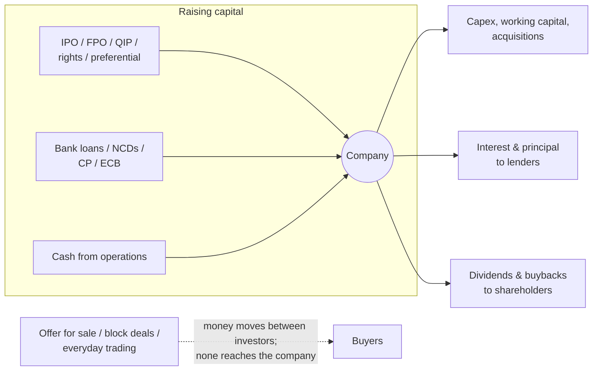

# 01.3 · How companies raise and return capital

> **Why this matters:** every share issue, buyback, dividend, bonus and split changes either the number of shares or
> the cash in the company — and sometimes moves value from one group of shareholders to another. If you can't do
> the dilution arithmetic in your head, you can't tell a value-creating QIP from a giveaway, or a smart buyback from
> an expensive one.

**Learning objectives** — after this lesson you can:

- Distinguish primary from secondary transactions, and fresh issue from offer for sale, and say where the money goes.
- Describe how Indian companies raise equity (IPO, FPO, QIP, rights issue, preferential allotment and warrants) and
  debt (bank loans, NCDs, commercial paper), with the key SEBI rules as of September 2026.
- Work out the effect of any share issue on ownership, EPS, book value per share and intrinsic value per share, and
  identify when it transfers wealth between old and new shareholders.
- Compute a rights issue's theoretical ex-rights price and the value of a rights entitlement.
- Explain dividends (interim/final, record and ex-dates), buybacks (tender vs open market) and their current tax
  treatment, and show when a buyback creates value per share and when it merely raises EPS.
- Explain why bonus issues and stock splits change nothing fundamental.

**Prerequisites:** [01.1 What a company is](01-what-is-a-company.md), [01.2 Shares, market cap & enterprise value](02-shares-market-cap-and-enterprise-value.md)  ·  **Time:** ~100 min

---

## 1. The capital cycle: where a company's money comes from and goes

A company funds itself from three sources:

1. **Internal accruals** — cash generated by the business (cash flow from operations) and retained rather than paid
   out. For most mature companies this is by far the largest source.
2. **Debt** — borrowing from banks or bond investors; a fixed claim (01.1).
3. **Equity** — issuing new shares; a residual claim.

And it uses money to invest (capex, working capital, acquisitions) or to **return capital** to its providers:
interest and principal to lenders; dividends and buybacks to shareholders.

The dashed line is the most important distinction in this lesson:

- In a **primary** transaction the company issues new securities and **receives the cash** (a fresh issue of shares,
  a new loan, a bond issue).
- In a **secondary** transaction *existing* securities change hands between investors and the company **receives
  nothing** (every trade on NSE, block deals, and an **offer for sale** by existing shareholders).

A classic misconception is that an IPO always "raises money for the company". It only does so to the extent of its
fresh-issue component.

### Worked example 1 — Kaveri's sources and uses of cash, FY21–FY26

Adding up six years of Kaveri's cash-flow statements (₹ Cr) shows how it actually funded itself:

| Sources | ₹ Cr | Uses | ₹ Cr |
|:--|--:|:--|--:|
| Cash flow from operations (after tax) | 395.7 | Capex on PP&E incl. CWIP (Hosur plant) | 398.0 |
| Proceeds from sale of land (FY25) | 18.0 | Purchase of intangibles | 18.0 |
| Net sale of liquid mutual funds | 25.0 | Interest paid on borrowings | 61.0 |
| Treasury income received | 33.9 | Lease payments | 30.1 |
| Net term loans raised | 57.0 | Dividends paid | 90.0 |
| Net working-capital loans raised | 66.0 | | |
| **Total sources** | **595.6** | **Total uses** | **597.1** |

Net change in cash $= 595.6 - 597.1 = -1.5$ Cr, which is exactly the fall in cash from ₹34.0 Cr (31-Mar-2020) to
₹32.5 Cr (31-Mar-2026). Three observations you will build on for the rest of the course:

- **No equity was raised.** Share capital stayed at ₹30.0 Cr (6.00 Cr shares) throughout. All growth was funded by
  internal accruals and debt.
- **The Hosur plant was debt-funded at the margin**: capex of ₹248.0 Cr in FY23–FY24 coincided with ₹112.0 Cr of new
  term loans.
- **Working-capital loans funded the receivables build-up**: receivables rose ₹250.7 Cr over the six years (₹96.0 Cr →
  ₹346.7 Cr), and ₹66.0 Cr of the funding came from net short-term bank borrowing — all of it in FY25 (+₹28.0 Cr) and
  FY26 (+₹38.0 Cr), after the solar business took off; FY21–FY24 net working-capital borrowing was zero. Total
  borrowings went from ₹65.0 Cr to ₹188.0 Cr.

## 2. Raising equity (1): the IPO

An **initial public offering (IPO)** is a company's first sale of shares to the public, followed by listing on
NSE/BSE. An IPO can have two components:

- **Fresh issue** — new shares issued by the company. The company receives the money (less fees). The share count
  rises: existing holders are diluted.
- **Offer for sale (OFS)** — existing shareholders (promoters, private-equity funds, the government) sell part of
  their holding. The *sellers* receive the money. The share count does not change.

Most Indian IPOs combine the two; many are dominated by OFS, which is why the "objects of the issue" section of the
offer document is the first thing to read ([03.5](../03-reading-filings/05-other-documents.md)). The largest example
of a pure OFS: the **LIC IPO (May 2022)** raised roughly ₹21,000 Cr — all of it an offer for sale by the Government of
India of about 3.5% of the company. LIC itself received nothing
([Wikipedia — Life Insurance Corporation](https://en.wikipedia.org/wiki/Life_Insurance_Corporation)).

### How an Indian mainboard IPO works (rules as of Sep-2026)

1. **DRHP → SEBI.** The company files a draft red herring prospectus with SEBI; SEBI issues observations.
2. **RHP and price band.** The red herring prospectus is filed with the Registrar of Companies, with a price band
   whose cap may be at most 120% of the floor.
3. **Anchor book.** The day before the issue opens, the company can allot up to 60% of the QIB portion to anchor
   investors (large institutions). Anchor shares are locked in — 50% for 30 days, 50% for 90 days. Since 30-Nov-2025,
   40% of the anchor book is reserved for domestic mutual funds, life insurers and pension funds (earlier, one-third
   for mutual funds) ([SEBI ICDR Third Amendment 2025, summary](https://taxguru.in/sebi/sebi-issue-capital-disclosure-requirements-third-amendment-regulations-2025.html)).
4. **Bidding** (usually three working days) via ASBA/UPI, in three categories. For a profitable issuer (ICDR
   Regulation 6(1)): up to **50% QIBs** (qualified institutional buyers — mutual funds, insurers, banks, FPIs…), at
   least **15% non-institutional investors** (individuals and others applying above ₹2 lakh), and at least **35%
   retail individual investors** (applications up to ₹2 lakh). A 2025 proposal to cut the retail share of very large
   IPOs was withdrawn ([Cyril Amarchand Mangaldas client alert, 16-Sep-2025](https://www.cyrilshroff.com/wp-content/uploads/2025/09/Client-Alert-IPO-Amendments-and-Proposals-1.pdf)).
   Companies that do not meet the profitability track record list under Regulation 6(2), where at least 75% must go
   to QIBs.
5. **Allotment and listing on T+3** (T = issue closing day), mandatory since 1-Dec-2023
   ([Business Standard, Aug-2023](https://www.business-standard.com/markets/news/shorter-ipo-timeline-to-become-effective-from-december-1-says-sebi-123080900620_1.html)).
6. **Lock-ins.** Promoters must lock in a minimum contribution of 20% of post-issue capital, generally for 18 months
   (three years if most of the fresh issue funds capex); anchor and pre-IPO lock-in expiries are dates when supply
   can hit the market.
7. **Minimum public offer.** Securities Contracts (Regulation) Rules require the public to hold at least 25%; smaller
   IPOs must offer 25% up front, while larger ones may offer less and reach 25% over time. Tiers by post-issue market
   cap: under ₹1,600 Cr — 25%; ₹1,600–4,000 Cr — at least ₹400 Cr; ₹4,000–50,000 Cr — 10%; above ₹50,000 Cr — lower
   percentages with 5–10 year glide paths under the amendment notified on 13-Mar-2026
   ([AZB & Partners summary](https://www.azbpartners.com/bank/securities-contracts-regulation-amendment-rules-2026/)).

The SME platforms (NSE Emerge, BSE SME) have separate, lighter rules and a history of abuse
([09.5](../09-forensics/05-governance-red-flags-india.md)).

### Worked example 2 — a fresh issue plus an OFS

*Palar Valves Ltd* (fictional) has 8.0 Cr shares before its IPO: promoters 5.6 Cr (70%), a private-equity fund 2.4 Cr
(30%). It prices its IPO at ₹250: a **fresh issue of ₹300 Cr** plus an **OFS of 1.2 Cr shares by the PE fund**.

| | Computation | Result |
|:--|:--|--:|
| New shares from fresh issue | 300 ÷ 250 | 1.2 Cr |
| OFS proceeds (to the PE fund) | 1.2 × 250 | ₹300 Cr |
| Total issue size | 300 + 300 | ₹600 Cr |
| Post-issue shares | 8.0 + 1.2 | 9.2 Cr |
| Pre-money equity value | 8.0 × 250 | ₹2,000 Cr |
| Post-money market cap | 9.2 × 250 | ₹2,300 Cr |
| Promoter holding post-IPO | 5.6 ÷ 9.2 | 60.9% |
| PE fund post-IPO | (2.4 − 1.2) ÷ 9.2 | 13.0% |
| Public post-IPO | (1.2 + 1.2) ÷ 9.2 | 26.1% |

The post-issue market cap of ₹2,300 Cr sits in the ₹1,600–4,000 Cr bucket, so the offer must be at least ₹400 Cr; at
₹600 Cr it complies, and the public already holds more than 25%.

**EPS dilution.** If Palar's PAT is ₹80 Cr, EPS falls from $80/8.0 = ₹10.00$ to $80/9.2 = ₹8.70$ (−13.0%) on day one,
and the post-issue P/E is $250 / 8.70 = 28.75$x. The new cash has to earn something to close the gap: if the ₹291 Cr of
net proceeds (after, say, 3% issue expenses) merely sits in liquid funds at 7% pre-tax, it adds
$291 \times 7\% \times (1 - 0.2517) = ₹15.2$ Cr of PAT, and EPS becomes $(80 + 15.2)/9.2 = ₹10.35$. Whether the IPO is
good for pre-IPO holders depends on what the money earns once deployed — and on whether ₹250 was a fair price.

## 3. Raising equity (2): once listed — FPO, QIP, rights and preferential issues

A listed company that needs equity has four main routes. All require shareholder approval of some kind; all are
governed by SEBI's **Issue of Capital and Disclosure Requirements (ICDR) Regulations, 2018**.

| Route | Who can buy | Pricing | Speed | Typical user |
|:--|:--|:--|:--|:--|
| **FPO** (follow-on public offer) | The public, like an IPO | Book-built or fixed | Weeks–months | Large raises needing retail reach |
| **QIP** (qualified institutions placement) | QIBs only | Floor = average of the weekly highs and lows of the closing price over the two weeks before the relevant date; up to 5% discount allowed | Days | Banks, NBFCs, growth companies — the Indian workhorse |
| **Rights issue** | Existing shareholders, pro rata (rights tradable) | Set by the company, usually at a discount | ~23 working days from board approval (since the April-2025 reforms) | Distressed or promoter-backed raises; companies that want to avoid diluting non-participants |
| **Preferential allotment** (shares or warrants) | Named investors — often promoters, strategic investors | Floor (frequently traded shares) = higher of the 90- and 10-trading-day VWAP before the relevant date | 1–2 months | Promoter infusions, strategic stakes |

Sources: QIP pricing — ICDR Reg. 176 ([summary](https://npahilwani.com/qip-pricing-formula-regulation-176-sebi-icdr/));
rights-issue timeline effective 7-Apr-2025 ([Moneylife](https://www.moneylife.in/article/rights-issues-sebi-reduces-timeline-to-23-working-days-from-average-of-317-days/76623.html));
preferential pricing, lock-ins and warrants ([Vinod Kothari FAQ](https://vinodkothari.com/2022/10/faqs-on-preferential-issue-of-equity-shares-and-convertible-securities-under-sebi-icdr/)).
SEBI's [regulations page](https://www.sebi.gov.in/sebiweb/home/HomeAction.do?doListing=yes&sid=1&ssid=3&smid=0)
showed the ICDR as last amended on 21-Mar-2026 when this lesson was written (Sep-2026) — verify the current text
before relying on any detail.

### The one formula behind every share issue

Let $V$ be the intrinsic value of the equity *before* the issue, $N$ the shares before, and suppose the company
issues $n$ new shares at price $P$, raising $nP$ in cash (ignore fees). If the cash is worth its face value inside
the company, the value per share afterwards is

$$v_{\text{post}} = \frac{V + nP}{N + n}$$

Compare with $v_{\text{pre}} = V/N$. A little algebra shows $v_{\text{post}} > v_{\text{pre}} \iff P > V/N$.

- **Issue above intrinsic value per share → accretive** to existing holders (the new investors overpay).
- **Issue at intrinsic value → neutral**, whatever happens to EPS or ownership percentages.
- **Issue below intrinsic value → a wealth transfer** from existing to new shareholders.

Two corollaries: ownership dilution by itself is not a loss (you own a smaller slice of a bigger pie), and what the
company *does* with the money comes on top — invested at returns above the cost of capital it adds value; hoarded or
wasted it destroys some.

### Worked example 3 — Nirmal Finance's FY24 QIP

Nirmal issued 1.0 Cr shares at ₹300 in a QIP in FY24, raising ₹300 Cr. At 31-Mar-2023 it had 10.0 Cr shares and net
worth of ₹853.4 Cr.

| | Computation | Result |
|:--|:--|--:|
| BVPS before (FY23) | 853.4 ÷ 10.0 | ₹85.34 |
| Issue price as a multiple of book | 300 ÷ 85.34 | 3.52x |
| BVPS immediately after the QIP | (853.4 + 300) ÷ 11.0 | ₹104.85 |
| Accretion to BVPS from the QIP alone | 104.85 ÷ 85.34 − 1 | +22.9% |
| Holder of 10 lakh shares: stake before → after | 0.10 ÷ 10.0 → 0.10 ÷ 11.0 | 1.000% → 0.909% |
| Check: FY24 net worth | 853.4 + 300.0 + PAT 169.0 − dividends 20.0 | ₹1,302.4 Cr ✓ |

Issuing at 3.5x book lifted book value per share for everyone. For a lender, equity is also *raw material*: RBI
capital rules cap how much an NBFC can lend per rupee of capital, so the QIP funded the loan-book growth from ₹3,790 Cr
to ₹4,700 Cr (and its capital adequacy ratio rose from 25.6% to 30.5%). Whether it was good for existing holders turns
on whether ₹300 exceeded intrinsic value per share — a question for [07.1](../07-special-valuation/01-banks-and-nbfcs.md).
Note that RoE dipped only slightly (15.9% → 15.7%) despite the extra equity.

### Worked example 4 — the same algebra on Kaveri (hypothetical)

Kaveri has not issued equity, but suppose it raised ₹300 Cr via a QIP. Use the house view: equity value ₹1,941.3 Cr on
6.07 Cr diluted shares, i.e. ₹319.8 a share ([kaveri-valuation.md](../appendix/running-example/kaveri-valuation.md)).

| Issue price | New shares (300 ÷ P) | Value per share after | Change | New investors receive (shares × value) | Transfer to (−) / from (+) new investors |
|--:|--:|--:|--:|--:|--:|
| ₹370 (≈5% below ₹390 CMP) | 0.811 Cr | ₹325.7 | +1.8% | ₹264.1 Cr | −₹35.9 Cr |
| ₹320 (≈ intrinsic) | 0.938 Cr | ₹319.8 | 0.0% | ₹299.9 Cr | ≈0 |
| ₹250 (distressed) | 1.200 Cr | ₹308.3 | −3.6% | ₹370.0 Cr | +₹70.0 Cr |

At ₹370 the new investors pay ₹300 Cr for shares worth ₹264.1 Cr — the existing holders gain ₹35.9 Cr. At ₹250 the
new investors pay ₹300 Cr for ₹370.0 Cr of value, and the existing holders' stake falls from ₹1,941.3 Cr to ₹1,871.3 Cr.
If you think a stock is *overvalued*, you should cheer when management issues shares; if undervalued, a deep-discount
issue to outsiders is a direct loss.

### Rights issues: the discount that doesn't matter (if you act)

In a **rights issue** every shareholder gets **rights entitlements (REs)** in proportion to their holding — say 1 new
share for every 5 held, at a subscription price below market. REs are credited to demat accounts and trade on the
exchange; holders can subscribe, sell (**renounce**) them, or ignore them. Since the 2025 reforms, promoters can also
renounce in favour of named "specific investors", and unsubscribed shares can go to identified investors.

The price at which the shares should trade after the issue is the **theoretical ex-rights price (TERP)**: the value of
the old shares plus the cash paid, divided by the new share count. For $r$ old shares per new share at subscription
price $S$ and cum-rights price $P_0$:

$$\text{TERP} = \frac{r P_0 + S}{r + 1}, \qquad \text{value of one RE} = \text{TERP} - S$$

### Worked example 5 — a 1-for-5 rights issue (hypothetical Kaveri)

Kaveri (price ₹390) offers 1 new share for every 5 at ₹300 → 1.2 Cr new shares, raising ₹360 Cr.

$$\text{TERP} = \frac{5 \times 390 + 300}{6} = ₹375, \qquad \text{RE value} = 375 - 300 = ₹75$$

An investor with 500 shares (worth ₹1,95,000 before) receives 100 REs:

| Choice | Position after | Net wealth |
|:--|:--|--:|
| Subscribe (pay 100 × ₹300 = ₹30,000) | 600 shares × ₹375 = ₹2,25,000, minus ₹30,000 paid | ₹1,95,000 |
| Sell the REs (100 × ₹75 = ₹7,500) | 500 shares × ₹375 + ₹7,500 | ₹1,95,000 |
| Ignore them | 500 shares × ₹375 | ₹1,87,500 (−₹7,500, −3.8%) |

The deeper the discount, the more the rights issue looks like a bonus issue bundled with a fair-price issue — and the
more a shareholder who does nothing loses. Deep discounts also make the issue almost certain to be fully subscribed,
which is why distressed companies and promoters who plan to take up their own rights like them.

### Preferential allotments and warrants

A **preferential allotment** issues shares (or convertible securities) to specific, named investors, approved by a
special resolution. Key ICDR rules (verify current text):

- **Pricing floor** for frequently traded shares: the higher of the 90-trading-day and 10-trading-day VWAPs before the
  **relevant date** (30 days before the shareholder meeting).
- **Lock-in**: shares allotted to promoters are locked in for 18 months; to others, 6 months.
- **Warrants**: the right to subscribe to shares later at the fixed price; at least **25% of the price upfront**, tenure
  at most **18 months**, and the upfront money is **forfeited** if not exercised.

Warrants to promoters are a recurring governance question in India. The economics are an option trade.

### Worked example 6 — warrants to the promoter (fictional *Sarayu Industries*)

*Sarayu Industries* (10 Cr shares at ₹200; promoter holds 50%) issues **0.6 Cr warrants** to its promoter at the
floor price of ₹200. The promoter pays 25% upfront — ₹50 a warrant, ₹30 Cr in total — and has 18 months to pay the
remaining ₹150 (₹90 Cr in total) and receive a share.

- If the share is at ₹320 in 18 months, the promoter pays ₹90 Cr for shares worth $0.6 \times 320 = ₹192$ Cr: net
  profit after the upfront payment $= 0.6 \times (320 - 150 - 50) = ₹72$ Cr.
- If the share is at ₹120, the promoter walks away and forfeits ₹30 Cr.
- On exercise the promoter's stake rises from 50.0% to $5.6 / 10.6 = 52.8\%$ — kept within the 5%-a-year
  creeping-acquisition allowance of SEBI's takeover regulations, so no open offer is triggered.

!!! tip "Trader's lens — a preferential warrant is a call option sold cheap"
    The warrant is a call on Sarayu struck at ₹150 (the unpaid balance), expiring in 18 months, for which the
    promoter pays a ₹50 premium. Price it with Black–Scholes — $S = ₹200$, $K = ₹150$, $T = 1.5$ years,
    volatility 40%, risk-free rate 6.5%, no dividends — and it is worth about **₹73.7**. The promoter pays ₹50 for
    ₹73.7 of optionality: a transfer of ≈₹23.7 per warrant, **≈₹14.2 Cr** in total, from the other shareholders
    (before the extra dilution effect a proper warrant model would include). At 30% volatility the gift is still
    ≈₹18.5 a warrant. The ICDR floor price protects against issuing *below market*; it does nothing about the
    option's time value. Whenever you see warrants in a notice of a general meeting, price the option.

### Offer for sale through the stock exchange

After listing, promoters and large holders (at least 10%) can sell a block through the exchanges' **OFS mechanism**:
the seller announces a floor price the evening before; non-retail investors bid on day T, retail investors (bids up
to ₹2 lakh, at least 10% of the offer reserved for them) on T+1; at least 25% is reserved for mutual funds and
insurers; minimum size ₹25 Cr with exceptions ([SEBI circular, Jan-2023](https://www.sebi.gov.in/legal/circulars/jan-2023/comprehensive-framework-on-offer-for-sale-ofs-of-shares-through-stock-exchange-mechanism_67157.html)).
The Government of India uses it for disinvestment in PSUs; promoters use it to meet minimum public shareholding. The
company receives nothing; the effects are a larger free float and, often, a short-term price overhang. Bulk and block
deals are covered in [01.4](04-indian-market-structure.md).

## 4. Raising debt

Debt is cheaper than equity for the company (lenders take less risk, and interest is tax-deductible), does not dilute
ownership, and imposes discipline — at the price of fixed obligations that can kill a company in a downturn
([04.5](../04-financial-analysis/05-leverage-solvency-liquidity.md)).

| Instrument | What it is | Who uses it | What to watch |
|:--|:--|:--|:--|
| **Term loan** | Bank loan for a fixed period (typically 3–10 years), usually secured on the assets it funds, repaid in instalments | Capex | Repayment schedule ("current maturities"), covenants, security |
| **Working-capital facilities** (cash credit, overdraft, working-capital demand loans, bill discounting) | Revolving short-term bank lines secured on inventories and receivables; limits set by "drawing power" | Funding inventory and receivables | Utilisation creeping towards the limit; rising short-term debt alongside rising receivables |
| **Non-convertible debentures (NCDs)** | Bonds, secured or unsecured, rated; public issue or (usually) private placement; listed under SEBI's NCS Regulations, 2021 | Large companies; NBFCs (Nirmal: 24% of borrowings) | Coupon vs government bonds (credit spread), rating, covenants, maturity wall |
| **Commercial paper (CP)** | Unsecured short-term promissory notes (up to one year) under RBI directions; must be rated | Top-rated corporates, NBFCs | Refinancing (rollover) risk — the IL&FS/DHFL story ([13 · I4](../13-case-studies/india/04-ilfs-dhfl-2018.md)) |
| **ECBs, FCCBs** | Foreign-currency loans and convertible bonds | Exporters, large groups | Currency mismatch; convertibles are equity in waiting (01.2) |
| **Securitisation / direct assignment, sub-debt** | Selling pools of loans; subordinated bonds counted as Tier-2 capital | NBFCs (Nirmal: securitisation 11%, sub-debt 3%) | Off-balance-sheet risk, cost |

Kaveri's borrowing is typical of an Indian mid-cap manufacturer: term loans for the Hosur plant (+₹50 Cr in FY23,
+₹62 Cr in FY24, since being repaid at ₹20 Cr a year) and working-capital loans that grew as receivables piled up
(+₹28 Cr in FY25, +₹38 Cr in FY26). Its implied borrowing cost in FY26 was finance costs on borrowings of ₹15.6 Cr ÷
average borrowings of ₹179.0 Cr ((170.0 + 188.0) ÷ 2) = **8.7%**, close to the 8.9% pre-tax cost of debt in the house
valuation. Nirmal, as a lender, borrows far more relative to its equity — 58% bank term loans, 24% NCDs, 11%
securitisation, 4% CP and 3% sub-debt — which is why its analysis focuses on funding cost and asset–liability matching.

CP eligibility, tenor and rating rules are set by RBI's *Master Direction — Commercial Paper and Non-Convertible
Debentures of original or initial maturity up to one year, 2024* (issued 3-Jan-2024); verify the current version on the
[RBI Master Directions page](https://www.rbi.org.in/Scripts/BS_ViewMasterDirections.aspx) before relying on specific
thresholds.

## 5. Returning capital (1): dividends

A **dividend** is a cash distribution to shareholders out of profits (current or accumulated) under the Companies Act
(s.123).

- **Interim dividend** — declared by the **board** during the year.
- **Final dividend** — **recommended** by the board after the year ends and **declared** by shareholders at the AGM.
  Shareholders can reduce it but not increase it.
- Once declared, a dividend is a debt of the company and must be paid within **30 days** (s.127).
- Top listed companies must publish a **dividend distribution policy** (SEBI LODR) — useful for predicting payouts.

### The dates

| Date | Meaning |
|:--|:--|
| Announcement / declaration date | Board announces (interim) or AGM declares (final) |
| **Record date** | The company pays whoever is on the register of members at the end of this day |
| **Ex-date** | First trading day on which a buyer does *not* get the dividend. With India's T+1 settlement (fully in place since January 2023), exchanges generally set the ex-date **on the record date** itself — so you must buy by the trading day before the ex-date |
| Payment date | Cash hits bank accounts (within 30 days of declaration) |

On the ex-date the price should drop by about the dividend: the company is poorer by the cash paid out. Pre-tax,
shareholders are no richer: they swap ₹4 of share value for ₹4 of cash. Dividends do not create value; the profits
that fund them do. (This is Miller and Modigliani's 1961 dividend-irrelevance result — true in a frictionless world,
and a good default until taxes, signalling or governance get involved.)

### Tax on dividends (as of Sep-2026)

India abolished the company-level dividend distribution tax from FY21; dividends are now taxed **in the shareholder's
hands at their slab rate**. Companies deduct TDS at 10% for resident individuals whose dividends from the company
exceed **₹10,000** in a year (threshold raised from ₹5,000 by the Finance Act 2025). From 1-Apr-2026 the provision sits
in section 393 of the new **Income-tax Act, 2025**, which replaced the 1961 Act; the rate and threshold were unchanged
([Tax2win guide](https://tax2win.in/guide/income-tax-on-dividend); [TDSMAN, May-2026](https://blog.tdsman.com/2026/05/tds-on-dividend-section-3931-section-194/)).
For a top-bracket individual, dividends are taxed at 30% plus 4% cess (31.2%, before any surcharge) — far more than
the 12.5% on long-term capital gains. That gap drives Indian companies' choice between dividends and buybacks.

### Worked example 7 — Kaveri's dividend

Kaveri paid ₹4.00 per share (₹24.0 Cr) during FY26, against FY26 PAT of ₹90.5 Cr:

| Metric | Computation | Value |
|:--|:--|--:|
| Payout ratio | 24.0 ÷ 90.5 | 26.5% (guidance: "~25%") |
| Dividend yield at ₹390 | 4.00 ÷ 390 | 1.03% |
| Theoretical ex-dividend price | 390 − 4 | ₹386 |
| Post-tax dividend for a 31.2% taxpayer | 4.00 × (1 − 0.312) | ₹2.75 |
| "Dividend %" as Indian companies announce it | 4.00 ÷ ₹5 face value | 80% |
| TDS applies once dividends exceed ₹10,000 — at ₹4 a share, a holding above | 10,000 ÷ 4 | 2,500 shares |

Over FY21–FY26 Kaveri paid out ₹90.0 Cr of cumulative PAT of ₹417.0 Cr (21.6%) — a low payout that let it fund
growth internally, as Worked example 1 showed.

## 6. Returning capital (2): buybacks

A **buyback** is the company purchasing its own shares and extinguishing them. It returns cash to the selling
shareholders and raises the remaining holders' percentage ownership. Two routes exist in India:

- **Tender offer.** The company offers to buy a fixed number of shares at a fixed price (usually a premium) from all
  holders on a record date, **proportionately**. At least **15%** of the buyback is reserved for **small shareholders**
  (holding shares worth up to ₹2 lakh on the record date). Promoters may participate. Because more shares are usually
  tendered than the company will buy, each holder's **acceptance ratio** is uncertain.
- **Open market through the stock exchange.** The company buys on the exchange at market prices over a period.
  SEBI **discontinued** this route from 1-Apr-2025 (it let a few sellers capture most of the buyback and interacted
  badly with the then tax rules), then **restored** it from **1-Aug-2026** under amendments notified on 1-Jul-2026:
  size capped below 15% of paid-up capital and free reserves, completion within 66 working days, at least 40% of the
  amount used in the first half of the period, and promoters' shares frozen during the window
  ([SEBI Buy-back Amendment Regulations 2026](https://www.sebi.gov.in/legal/regulations/jul-2026/securities-and-exchange-board-of-india-buy-back-of-securities-amendment-regulations-2026_102624.html);
  [Moneylife, Jul-2026](https://www.moneylife.in/article/sebi-restores-open-market-share-buybacks-for-companies-through-stock-exchanges-from-1st-august/80991.html)).

Company-law limits (Companies Act s.68): a buyback may not exceed 25% of paid-up capital plus free reserves (up to 10%
needs only a board resolution; above that, a special resolution), post-buyback debt may not exceed twice paid-up
capital plus free reserves, there must be a gap between buybacks, and a buyback may not push public shareholding
below the 25% minimum.

**A real tender offer.** Wipro's 2026 buyback bought up to **60 Cr shares (5.72% of its equity) at ₹250**, a total of
**₹15,000 Cr**, from holders on the record date of 5-Jun-2026. Entitlements: small shareholders **11 shares for every
56** held (19.6%); everyone else **10 for every 197** (5.1%). The promoter group, holding 72.53%, stated its intention
to participate. The price was ≈23% above the previous NSE close of ₹203.11
([Wipro letter of offer](https://www.wipro.com/content/dam/nexus/en/investor/buy-back/buyback2026/wipro-letter-of-offer-for-buyback.pdf);
[BusinessToday, 16-Apr-2026](https://www.businesstoday.in/markets/stocks/story/wipro-buyback-2026-confirmed-check-share-repurchase-price-record-date-premium-per-stock-526008-2026-04-16)).
The small-shareholder reservation is why the small-holder entitlement is almost four times the general one.

### Buyback taxation: three regimes in three years

| Period | Who pays | How |
|:--|:--|:--|
| Up to 30-Sep-2024 | **The company** | Buyback tax (s.115QA of the 1961 Act) at 20% plus surcharge and cess (effective 23.296%) on the amount paid over the original issue price; shareholders exempt |
| 1-Oct-2024 to 31-Mar-2026 | **Shareholders** | Entire buyback proceeds taxed as a **deemed dividend** at slab rates; the cost of the shares allowed as a capital loss to set off elsewhere |
| From 1-Apr-2026 (Finance Act 2026; s.69 of the Income-tax Act, 2025) | **Shareholders** | Taxed as **capital gains** on (price − cost): for listed shares 12.5% long-term (with the ₹1.25 lakh annual exemption) or 20% short-term, plus surcharge and cess. **Promoters** (and holders of more than 10%, for unlisted companies) pay an additional tax taking the effective rate to **22%** for domestic-company promoters and **30%** for other promoters |

Sources: [KPMG, Feb-2026](https://kpmg.com/in/en/blogs/2026/02/taxation-of-buy-back-a-merry-go-around.html);
[Vinod Kothari, Feb-2026](https://vinodkothari.com/2026/02/buyback-taxation-rationalised-with-limited-relief-to-promoter-shareholders/);
the tax section of the Wipro letter of offer (June 2026). Check your own position with a tax adviser; this is a summary,
not advice.

For a minority shareholder the 2026 change is large. Take 100 shares bought two years ago at ₹300 and tendered at ₹450:

- **Deemed-dividend regime (Oct-2024 to Mar-2026):** the full ₹45,000 taxed at 31.2% = ₹14,040, with a ₹30,000
  capital loss to use elsewhere.
- **Capital-gains regime (from Apr-2026):** only the ₹15,000 gain is taxed, at 12.5% + 4% cess = ₹1,950 (ignoring the
  annual exemption); ₹3,120 if held for 12 months or less (20% + cess).

### Worked example 8 — when does a buyback create value? (hypothetical Kaveri)

Suppose Kaveri spends ₹90 Cr on a tender buyback. Using the house equity value (₹1,941.3 Cr, 6.07 Cr diluted shares,
₹319.8 a share), the remaining holders' value per share is $(1{,}941.3 - 90)/(6.07 - 90/P)$:

| Buyback price | Shares bought | Value per remaining share | Change vs ₹319.8 |
|--:|--:|--:|--:|
| ₹450 | 0.200 Cr | ₹315.4 | −1.4% |
| ₹320 | 0.281 Cr | ₹319.8 | 0.0% |
| ₹250 | 0.360 Cr | ₹324.2 | +1.4% |

The same rule as for share issues, reversed: **buying back below intrinsic value transfers wealth from the sellers to
the holders who stay; buying back above it does the opposite.**

Now look at EPS. Kaveri has net debt, so assume the ₹90 Cr is borrowed at its 8.9% pre-tax cost of debt: extra
interest of $90 \times 8.9\% \times (1 - 0.2517) = ₹5.99$ Cr after tax. At ₹450, basic EPS goes from $90.5 / 6.00 =
₹15.08$ to $(90.5 - 5.99)/(6.00 - 0.20) = ₹14.57$ (−3.4%). A buyback raises EPS only if the **earnings yield at the
buyback price** exceeds the **after-tax cost of the money used**: here $15.08 / P > 6.66\%$, i.e. $P < ₹226$. At ₹250 the
buyback *adds* value per share (+1.4%) yet still *reduces* EPS slightly (to ₹14.98). EPS accretion and value creation
are different tests; managements love to quote the first.

!!! tip "Trader's lens — a tender offer is a lottery ticket on the acceptance ratio"
    Buying shares to tender in a buyback is an event trade with payoff $a(B - P_0) + (1-a)(P_1 - P_0)$, where $B$ is
    the buyback price, $P_0$ your entry price, $P_1$ where the unaccepted shares trade afterwards, and $a$ the
    acceptance ratio. With illustrative numbers — $P_0 = ₹230$, $B = ₹250$, $P_1 = ₹210$ — the trade breaks even only
    at $a = 50\%$; at a 19.6% entitlement it loses ₹12.2 a share. The market prices the expected acceptance, just as
    it prices the probability in a merger-arbitrage spread; the edge, if any, lies in estimating how many holders will
    *not* tender (which pushes actual acceptance above the entitlement). Special situations are covered in
    [12.3](../12-macro-special-sits/03-special-situations.md).

## 7. Bonus issues and stock splits

A **bonus issue** gives existing shareholders free additional shares in proportion to their holding (say 1:1 — one
new share for each held) by transferring an amount from reserves (free reserves, securities premium or capital
redemption reserve — not revaluation reserves) into share capital. A **stock split** divides each share into several
of lower face value (₹5 → ₹1). Neither involves cash; neither changes the company's assets, profits or total equity.

### Worked example 9 — Kaveri bonus vs split (hypothetical)

| | Actual FY26 | After a 1:1 bonus | After a 5-for-1 split (₹5 → ₹1) |
|:--|--:|--:|--:|
| Shares, Cr | 6.00 | 12.00 | 30.00 |
| Face value, ₹ | 5 | 5 | 1 |
| Equity share capital, ₹ Cr | 30.0 | 60.0 | 30.0 |
| Other equity, ₹ Cr | 676.1 | 646.1 | 676.1 |
| **Total equity, ₹ Cr** | **706.1** | **706.1** | **706.1** |
| Share price (theoretical), ₹ | 390 | 195 | 78 |
| Market cap, ₹ Cr | 2,340 | 2,340 | 2,340 |
| EPS, ₹ | 15.08 | 7.54 | 3.02 |
| BVPS, ₹ | 117.68 | 58.84 | 23.54 |
| P/E | 25.9x | 25.9x | 25.9x |

The bonus moves ₹30 Cr from "other equity" to "share capital" — a relabelling within equity. The split doesn't even do
that. Everything per share scales; every multiple is unchanged.

Why do companies bother? Lower nominal prices can improve liquidity and retail participation, a bonus can signal
management's confidence (it permanently capitalises reserves), and F&O lot sizes are adjusted. Share prices often react
to the announcement — as information about management's outlook, not because anything changed. Two practical
cautions: historical per-share data must be **adjusted** for bonuses and splits (Screener and exchanges adjust; some
data sources and older reports do not), and for tax purposes bonus shares have a zero cost of acquisition while a
split apportions the original cost.

## 8. Summary: what each action does per share

| Action | Cash into (+) / out of (−) the company | Shares | Book value per share | Intrinsic value per share | Wealth transfer? |
|:--|:--|:--|:--|:--|:--|
| IPO fresh issue / FPO / QIP | + | ↑ | ↑ if issued above BVPS | ↑ if $P > V/N$, ↓ if below | Between old and new holders, via the price |
| IPO offer for sale / exchange OFS | none | = | = | = | Between buyers and sellers only |
| Rights issue | + | ↑ | depends on price | = for those who subscribe or sell REs | From holders who ignore REs |
| Preferential shares / warrants | + | ↑ | depends on price | ↓ if priced below value or if warrant time value is given away | To allottees (often promoters) |
| Debt raised | + (with a matching claim) | = | = | depends on use; adds risk | Possibly from creditors (Type III agency) |
| Dividend | − | = | ↓ | ↓ by the dividend (price drops on ex-date) | None pre-tax |
| Buyback | − | ↓ | ↓ if bought above BVPS | ↑ if bought below $V/N$, ↓ if above | Between sellers and remaining holders |
| Bonus / split | none | ↑ | ↓ proportionally | ↓ proportionally (value per *holding* unchanged) | None |

!!! info "India notes"
    - **Read the objects of the issue.** An IPO that is mostly OFS is an *exit*, not a growth financing — fine, but
      know which it is.
    - **QIPs are the dominant follow-on route** because they are fast and price close to market; frequent QIPs by a
      company claiming to be "cash-rich" are a forensic flag ([09.5](../09-forensics/05-governance-red-flags-india.md)).
    - **Warrants to promoters** show up in AGM/EGM notices and postal ballots — price the option (Worked example 6).
    - **Tax drives payout choices.** The FY21 move to shareholder-level dividend tax, the October-2024 deemed-dividend
      rule for buybacks, and the April-2026 return to capital-gains treatment each shifted companies between
      dividends and buybacks. Check the regime in force at the date you are analysing.
    - **Promoters and buybacks.** Promoter participation in tender offers, the higher promoter tax rate from
      FY27, and the freeze on promoter shares in open-market buybacks are all worth checking in the letter of offer.

!!! warning "Common mistakes"
    - **Assuming an IPO or OFS funds the company.** Only the fresh issue does.
    - **Equating dilution with value destruction.** Issuing shares above intrinsic value helps existing holders;
      what matters is the price relative to value, and what the money earns.
    - **Treating a buyback as good because EPS rises.** EPS can rise while value per share falls (buying above
      value with cheap debt), and vice versa (Worked example 8).
    - **Ignoring rights entitlements.** Doing nothing in a deep-discount rights issue is a real loss.
    - **Calling bonus shares or splits "free money"**, or comparing per-share figures across a bonus/split without
      adjusting.
    - **Confusing record date and ex-date**, or assuming the old T+2 timing.
    - **Using out-of-date tax rules** for dividends and buybacks — three buyback regimes applied between 2024 and 2026.
    - **Reading the promoter's warrant subscription as "confidence"** without asking what the option was worth.

## Key terms

| Term | Meaning |
|:--|:--|
| **Primary / secondary transaction** | New securities issued, cash to the company / existing securities traded between investors |
| **IPO** | Initial public offering: first sale of shares to the public and listing |
| **Fresh issue** | New shares issued by the company; proceeds to the company |
| **Offer for sale (OFS)** | Existing holders sell shares; proceeds to the sellers |
| **DRHP / RHP** | Draft / red herring prospectus — the IPO offer document before / with the price band |
| **Anchor investor** | Large institution allotted shares the day before an IPO opens, subject to lock-in |
| **QIB** | Qualified institutional buyer (mutual funds, insurers, banks, FPIs, etc.) |
| **FPO** | Follow-on public offer by a listed company |
| **QIP** | Qualified institutions placement: fast share issue to QIBs only |
| **Rights issue / rights entitlement (RE)** | Pro-rata offer of new shares to existing holders / the tradable right to subscribe |
| **Renunciation** | Selling or transferring a rights entitlement |
| **TERP** | Theoretical ex-rights price: $(rP_0 + S)/(r + 1)$ |
| **Preferential allotment** | Issue of shares or convertibles to named investors, approved by special resolution |
| **Warrant** | Right to subscribe to a share at a fixed price; in India ≥25% paid upfront, ≤18 months |
| **Term loan / working-capital loan** | Long-term secured bank loan for capex / revolving short-term bank facility for inventories and receivables |
| **NCD** | Non-convertible debenture: a bond |
| **Commercial paper (CP)** | Unsecured, rated short-term (≤1 year) money-market borrowing |
| **Interim / final dividend** | Declared by the board during the year / recommended by the board and declared at the AGM |
| **Record date / ex-date** | Date the register is fixed for entitlement / first trading day without the entitlement |
| **Payout ratio / dividend yield** | Dividends ÷ PAT / dividend per share ÷ price |
| **Buyback (tender / open market)** | Company repurchases and extinguishes its shares, proportionately at a fixed price / on the exchange over time |
| **Acceptance ratio** | Fraction of shares tendered that the company actually buys |
| **Bonus issue** | Free shares issued by capitalising reserves |
| **Stock split** | Subdivision of shares into more shares of lower face value |
| **Accretive / dilutive** | Raises / lowers a per-share measure (EPS, BVPS or value per share — say which) |

## Check your understanding

1. An IPO of ₹1,200 Cr consists of a ₹400 Cr fresh issue and an ₹800 Cr OFS by a PE fund, at ₹400 a share. Before the
   IPO the company had 15 Cr shares. How many shares are outstanding after the IPO, what is the post-issue market cap,
   and how much cash does the company receive (before fees)?

    

Answer

    New shares $= 400 / 400 = 1.0$ Cr → 16.0 Cr outstanding. Post-issue market cap $= 16.0 \times 400 = ₹6{,}400$ Cr.
    The company receives ₹400 Cr; the PE fund receives ₹800 Cr (2.0 Cr of its shares).
    

2. A company with intrinsic value ₹5,000 Cr and 10 Cr shares issues 2 Cr shares at ₹400 in a QIP. What is the value
   per share after the issue? Who gains, and how much in total?

    

Answer

    Before: ₹500 a share. After: $(5{,}000 + 800)/12 = ₹483.3$. New investors pay ₹800 Cr for
    $2 \times 483.3 = ₹966.7$ Cr of value — they gain ₹166.7 Cr; existing holders lose the same amount
    ($10 \times (500 - 483.3)$). Issuing below intrinsic value transfers wealth to the new investors.
    

3. A stock trades at ₹180 and announces a 2-for-7 rights issue (2 new shares for every 7 held) at ₹117. Compute the
   TERP and the value of one rights entitlement.

    

Answer

    Per 7 old shares you get 2 REs. TERP $= (7 \times 180 + 2 \times 117)/9 = (1{,}260 + 234)/9 = ₹166$.
    RE value $= 166 - 117 = ₹49$.
    

4. Kaveri declares a final dividend of "60%". How much is paid per share, and what is the total cash outflow?

    

Answer

    60% of the ₹5 face value = ₹3.00 per share; $6.00 \text{ Cr} \times ₹3 = ₹18.0$ Cr.
    

5. A company earning EPS of ₹20 buys back shares at ₹400 using cash that earns 7% pre-tax (tax rate 25%). Is the
   buyback EPS-accretive? Does that tell you whether it creates value?

    

Answer

    Earnings yield at the buyback price $= 20/400 = 5.0\%$; after-tax yield on the cash given up $= 7\% \times 0.75 =
    5.25\%$. Since 5.0% < 5.25%, the buyback **reduces** EPS (slightly). That says nothing about value: the buyback
    creates value for remaining holders only if ₹400 is below intrinsic value per share.
    

6. Why did SEBI's April-2026 buyback tax change make it easier to restore open-market buybacks?

    

Answer

    Under the earlier regimes, the tax burden fell on the company (pre-Oct-2024) or on the entire proceeds as a deemed
    dividend (Oct-2024 to Mar-2026), so selling into a buyback was taxed very differently from selling to another
    investor on the exchange — and an anonymous open-market buyback could not treat sellers equally. From 1-Apr-2026
    sellers pay capital-gains tax on their actual gain, the same as an ordinary sale, removing that distortion; SEBI
    restored the route from 1-Aug-2026 with a 15% cap and promoter shares frozen.
    

7. A company announces a 1:4 bonus (one new share for every four held). Before it, the share was ₹1,000, EPS ₹40 and
   BVPS ₹250. What are the theoretical price, EPS, BVPS and P/E afterwards?

    

Answer

    Shares rise by a factor of 1.25. Price $= 1{,}000/1.25 = ₹800$; EPS $= 40/1.25 = ₹32$; BVPS $= 250/1.25 = ₹200$;
    P/E $= 800/32 = 25$x — unchanged.
    

8. A promoter is issued warrants at ₹500, pays 25% upfront, and can exercise within 18 months. Describe the payoff as
   an option, and name two inputs that increase the value transferred to the promoter.

    

Answer

    A call struck at ₹375 (the unpaid 75%) with a ₹125 premium already paid, expiring in 18 months; the premium is
    forfeited if the share ends below ₹375. The transfer (option value − ₹125) rises with higher volatility and longer
    time to expiry (also with a higher share price relative to the issue price at allotment and higher interest
    rates).
    

## Go deeper

- SEBI, [ICDR Regulations, 2018](https://www.sebi.gov.in/sebiweb/home/HomeAction.do?doListing=yes&sid=1&ssid=3&smid=0)
  and the [Buy-back Amendment Regulations, 2026](https://www.sebi.gov.in/legal/regulations/jul-2026/securities-and-exchange-board-of-india-buy-back-of-securities-amendment-regulations-2026_102624.html)
  — the primary rules; skim the chapter headings so you know where to look.
- Wipro's [2026 buyback letter of offer](https://www.wipro.com/content/dam/nexus/en/investor/buy-back/buyback2026/wipro-letter-of-offer-for-buyback.pdf)
  — a real tender offer end to end: entitlements, promoter participation, and the new tax section.
- Merton H. Miller & Franco Modigliani, "Dividend Policy, Growth, and the Valuation of Shares", *Journal of Business*
  34(4), 1961 — why payouts don't create value in a frictionless world, and hence where to look for frictions.
- Richard Brealey, Stewart Myers & Franklin Allen, *Principles of Corporate Finance* — the chapters on payout policy
  and on how corporations issue securities.
- [Chittorgarh.com](https://www.chittorgarh.com/) — Indian IPO, rights, OFS and buyback data (subscription levels,
  entitlement ratios); verify against the offer documents.

---
[← Previous: 01.2 Shares, market cap & enterprise value](02-shares-market-cap-and-enterprise-value.md) · [Module index](index.md) · [Next: 01.4 Indian market plumbing →](04-indian-market-structure.md)
