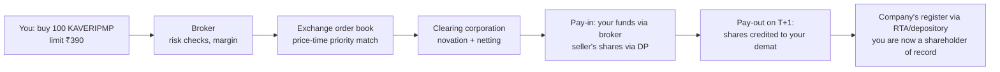

# 01.4 · Indian market plumbing

> **Why this matters:** every thesis you ever form has to pass through this machinery: exchanges, clearing
> corporations, depositories, index rules, surveillance filters and disclosure deadlines. The plumbing also
> produces free, high-quality data (shareholding patterns, pledges, insider trades, bulk deals) that most
> investors never read. It imposes hard constraints too (circuits, bans, illiquidity, index flows) that can
> hurt a correct thesis.

**Learning objectives**: after this lesson you can:

- Trace a buy order from your broker to shares in your demat account, name each institution involved and
  explain what T+1 settlement means for you (including why ex-date now equals record date).
- Place any Indian stock in the right index family and SEBI size bucket, and explain why the bucket decides
  who is *allowed* to own it.
- Read a shareholding pattern; compute free float, pledged shares as a % of equity, and the price at which a
  promoter's pledge triggers a margin call.
- List what a listed company must disclose and by when (results, material events, shareholding, insider and
  takeover-code trades, earnings-call records), and work out the deadlines for a given quarter.
- Explain price bands, market-wide circuit breakers, ASM/GSM/ESM and the F&O ban, and compute a
  market-wide position limit and its ban/exit thresholds.
- Explain how index events, FPI flows and SIP flows move prices independently of fundamentals, and size a
  flow in "days of volume".

**Prerequisites:** [01.1 What a company is](01-what-is-a-company.md),
[01.2 Shares, market cap & enterprise value](02-shares-market-cap-and-enterprise-value.md),
[01.3 How companies raise and return capital](03-raising-and-returning-capital.md)  ·  **Time:** ~100 min

!!! note "Facts in this lesson are dated"
    Market rules change often. Every rule, threshold and statistic below carries an "as of" date and a
    source. Rules were checked in **September 2026**. Before you rely on a number for a real decision,
    re-check it at the linked primary source (SEBI, NSE, BSE, AMFI, MSCI).

---

## 1. The cast: who does what

Four kinds of institution sit between you and the company whose shares you own:

1. **The regulator (SEBI).** The **Securities and Exchange Board of India** writes and enforces the rules
   for exchanges, brokers, depositories, mutual funds, listed companies and takeovers. It was set up in 1988
   and got statutory powers under the SEBI Act, 1992. Other regulators appear at the edges. The **RBI**
   regulates banks and NBFCs and foreign-exchange rules. The **Ministry of Corporate Affairs (MCA)**
   administers the Companies Act, 2013. IRDAI regulates insurers.
2. **Market infrastructure institutions (MIIs).** These are the exchanges (**NSE** and **BSE**; NSE was
   incorporated in 1992 and began equity trading in November 1994
   ([NSE, Wikipedia summary](https://en.wikipedia.org/wiki/National_Stock_Exchange_of_India)); BSE dates
   from 1875), the **clearing corporations** (NSE Clearing Ltd, Indian Clearing Corporation Ltd for BSE) and
   the **depositories** (NSDL and CDSL).
3. **Intermediaries.** **Stock brokers** (full-service and discount), **depository participants (DPs)**, who are
   usually your broker or bank, **registrars and share-transfer agents (RTAs)**, custodians for institutions,
   and **mutual funds** (AMCs).
4. **Issuers.** These are the listed companies, which carry continuing disclosure obligations under SEBI's
   **LODR** (Listing Obligations and Disclosure Requirements) Regulations, 2015.

| Institution | What it does | Why you, a fundamental investor, care |
|:--|:--|:--|
| SEBI | Rule-maker and enforcer | Its orders are primary data on misconduct ([09.5](../09-forensics/05-governance-red-flags-india.md)); its rule changes move whole sectors |
| NSE / BSE | Run the order books; list companies; publish filings | Corporate announcements, results, shareholding patterns, bulk/block deals all live on their sites |
| Clearing corporation | Becomes buyer to every seller and seller to every buyer (**novation**); guarantees settlement | Counterparty risk on an exchange trade is negligible. Your risk is the company, not the trade |
| Depository (NSDL/CDSL) | Holds shares electronically in **demat** accounts; records pledges | Pledge creation and invocation are recorded here, which is why pledge data exists at all |
| Broker / DP | Your gateway; holds your demat account | Costs, margin, and whether your shares are pledged for *broker* margin |
| RTA | Maintains the register of members for the company | Handles corporate actions (dividends, bonus, buyback tenders) |

The scale is now large. CDSL alone had about **18.0 crore demat accounts** at 31-Mar-2026, and NSDL about
**4.5 crore** in May-2026. NSDL still holds roughly 87% of the *value* in custody
([Outlook Money, 16-Jun-2026](https://www.outlookmoney.com/invest/nsdl-adds-59-lakh-demat-accounts-in-fy26-records-highest-ever-annual-expansion)).
NSE reported **over 13 crore unique registered investors** as of April 2026. Account counts exceed investor
counts because many people hold several accounts
([NSE Market Pulse via press summary](https://sahyadristartups.com/news/india-inc-ownership-tracker-dii-ownership-hits-record-high-as-fpi-share-falls-to-17-year-low/)).

## 2. The life of a trade, and T+1

**Trading sessions.** A **pre-open call auction** runs from **9:00 to 9:15 am**. Orders are entered for the
first 8 minutes, then matched at a single price, which damps opening gaps
([SEBI Master Circular for stock exchanges, Ch. 1 §17, Oct-2023](https://www.sebi.gov.in/sebi_data/commondocs/oct-2023/Chapter-1-Trading_p.pdf)).
Continuous trading follows until 3:30 pm. In continuous trading, orders match on **price-time priority**: the
best price first, and at equal price, the earliest order first.

**Novation and netting.** Once your order matches, the clearing corporation steps in as the counterparty to
both sides and nets each broker's obligations. If the seller's broker defaults, the clearing corporation's
settlement guarantee fund covers it. For a fundamental investor, this means **settlement risk is not a
factor in Indian exchange-traded equities**.

**T+1 settlement.** India moved every listed security to **T+1** by the end of January 2023. Trade on day *T*
and the shares reach your demat account on the next working day
([Citi, "Navigating India's T+0"](https://www.citigroup.com/global/insights/navigating-india-t-0)). An
**optional T+0** cycle has run in parallel since a March-2024 beta. SEBI's 10-Dec-2024 circular widened it,
but the deadline for large brokers to offer it was extended past 1-Nov-2025, with the revised date "to be
communicated" ([Taxmann summary](https://www.taxmann.com/post/blog/sebi-extends-timeline-for-qsbs-to-enable-optional-t0-settlement-systems)).
*As of September 2026, T+1 remains the default. Check SEBI's circulars for current T+0 coverage.*

**Why T+1 matters to you: ex-date = record date.** A company pays its dividend to shareholders *on its
register at the end of the record date*. Under T+1, if you buy on the record date your shares arrive the day
after, too late. So the last day to buy *with* the dividend is the trading day **before** the record date,
and the stock trades **ex-dividend on the record date itself**. (Under the old T+2 cycle, the ex-date was one
day earlier than the record date.) The same logic applies to bonus, split, rights and buyback entitlements
([01.3](03-raising-and-returning-capital.md)).

**Costs.** A delivery trade in India carries brokerage (often zero at discount brokers), **Securities
Transaction Tax (STT)**, exchange transaction charges, a SEBI turnover fee, stamp duty, GST on the
brokerage and charges, and a DP charge when you sell. None of these is large for a long-term investor, but
together they make frequent trading expensive. Rates change in Budgets, so current STT and capital-gains
rules are covered, with sources, in [11.5 Monitoring & selling](../11-process/05-monitoring-and-selling.md).

## 3. Indices: the market's measuring sticks

An **index** is a rule-based basket of stocks whose value is published continuously. Indian equity indices
are almost all **free-float market-capitalisation weighted**:

$$
w_i = \frac{P_i \times N_i \times \text{IWF}_i}{\sum_j P_j \times N_j \times \text{IWF}_j}
$$

where $P_i$ is the price, $N_i$ the shares outstanding and $\text{IWF}_i$ the **investible weight factor**,
the fraction of shares that is **free float** (roughly, shares not held by promoters, the government in a
controlling capacity, or other locked-in holders). In words: a stock's weight is its share of the *tradable*
market value, not of the total market value. A company with 75% promoter holding has an IWF of about 0.25,
so it gets a quarter of the weight its full market cap would suggest.

### The Nifty family (NSE Indices Ltd)

Definitions below are from the NSE Indices methodology document dated **September 2026**
([Method_NIFTY_Equity_Indices.pdf](https://www.niftyindices.com/Methodology/Method_NIFTY_Equity_Indices.pdf)):

| Index | Constituents | How chosen |
|:--|--:|:--|
| Nifty 500 | 500 | Top 500 companies by **full** market cap from an eligible universe (≥10% free float or a size test, traded ≥90% of days, impact cost ≤1%, top-800 by turnover and market cap) |
| Nifty 100 | 100 | Top 100 of the Nifty 500 by full market cap ("large caps") |
| Nifty 50 | 50 | Selected from the Nifty 100 by free-float market cap; must have **F&O contracts on NSE** and an average **impact cost ≤ 0.50%** on a ₹10 Cr basket for 90% of observations |
| Nifty Next 50 | 50 | Nifty 100 minus Nifty 50 |
| Nifty Midcap 150 | 150 | Ranks **101–250** of the Nifty 500 by full market cap |
| Nifty Smallcap 250 | 250 | Ranks **251–500** |
| Nifty Microcap 250 | 250 | The next tier below the Nifty 500 (see methodology) |

**Impact cost** is the percentage by which the average execution price of a trade of a given size (here
₹10 Cr) differs from the mid-price. It is a liquidity test. The Nifty 50 has a base value of 1,000 on
3-Nov-1995.

**Reviews.** Broad-market Nifty indices are reviewed **semi-annually, using six months of data ending 31
January and 31 July**. Changes take effect from the last trading day of March and September, and Nifty 50
replacements are announced four weeks in advance. Weights of capped indices are also realigned quarterly.
These dates matter because index funds must trade on the effective date (§11).

### The Sensex (BSE)

The **BSE Sensex** has **30** stocks, is free-float weighted, has a base value of **100 in 1978–79** (base
date 1-Apr-1979), and has been published since 1-Jan-1986. It is operated by Asia Index Pvt Ltd
([summary with sources](https://en.wikipedia.org/wiki/BSE_SENSEX)). Because the Sensex base goes back to
1979, it is the index people use for long-horizon Indian return statistics. We compute its CAGR in
[01.5](05-time-value-and-returns-math.md).

**Price index vs total-return index.** A price index (PRI) ignores dividends. A **total return index (TRI)**
assumes dividends are reinvested. Over decades the gap compounds to a large number, so compare a fund
with the *TRI* of its benchmark, never the PRI. Otherwise the fund gets credit for dividends the index
"forgot".

## 4. Size buckets: SEBI's large / mid / small classification

In October 2017 SEBI standardised what "large cap" means for mutual funds
([SEBI circular SEBI/HO/IMD/DF3/CIR/P/2017/114, 6-Oct-2017](https://www.sebi.gov.in/legal/circulars/oct-2017/categorization-and-rationalization-of-mutual-fund-schemes_36199.html)):

- **Large cap** = 1st–100th company by **full** market capitalisation
- **Mid cap** = 101st–250th
- **Small cap** = 251st onwards

**AMFI** (the MF industry body) publishes the ranked list **every six months**, using the **average full market
cap over the preceding six months**, averaged across exchanges. The list effective 1-Jan-2026 used Jul–Dec
2025 data, and the list effective July 2026 used Jan–Jun 2026. Scheme mandates hang on these buckets: a
large-cap fund must hold at least 80% in large caps, and mid-cap and small-cap funds at least 65% in their
buckets ([Oquilia explainer](https://www.oquilia.com/news/amfi-large-mid-small-list-may26)).

**Cutoffs.** In the **July 2026** list, the 100th company had a six-month average market cap of about
**₹1,06,300 Cr** and the 250th about **₹33,500 Cr**. **5,177** companies were classed small cap
([Mata Securities note on the AMFI list, 6-Jul-2026](https://matasec.com/wp-content/uploads/2026/07/AMFI-Latest-Stocks-Categorisation-July-2026.pdf)).
"Small cap" is a huge and very uneven bucket. From AMFI's own spreadsheet for the six months to
31-Dec-2025 ([AMFI file](https://www.amfiindia.com/Themes/Theme1/downloads/AverageMarketCapitalization31Dec2025.xlsx)):

| Rank by average full market cap (Jul–Dec 2025) | Market cap, ₹ Cr | Bucket |
|--:|--:|:--|
| 1 | 19,70,797 | Large |
| 100 | 1,05,174 | Large (cutoff) |
| 250 | 34,758 | Mid (cutoff) |
| 500 | 12,093 | Small |
| 1,000 | 3,050 | Small |
| 1,500 | 1,015 | Small |
| 2,000 | 401 | Small |

The 251st company (≈₹34,699 Cr) is more than 80 times the size of the 2,000th, yet both are "small caps".

### Worked example 1: where does Kaveri sit, and why does it matter?

Kaveri Pumps (fictional; [reference data](../appendix/running-example/kaveri-pumps.md)) has 6.00 Cr shares.
At ₹390 on 18-Sep-2026:

$$
\text{Market cap} = 6.00\text{ Cr shares} \times ₹390 = ₹2{,}340\text{ Cr}
$$

Promoters hold 58.4%, so ignoring any other locked-in holders the IWF is $1 - 0.584 = 0.416$ and

$$
\text{Free-float market cap} = 2{,}340 \times 0.416 = ₹973.4\text{ Cr}
$$

Dropped into the Dec-2025 AMFI ranking, ₹2,340 Cr would rank about **1,117th**. That makes it a small cap,
far outside the Nifty 500 (whose 500th member was about ₹12,093 Cr). To reach the mid-cap cutoff of about
₹33,500 Cr, Kaveri's market cap would have to rise $33{,}500 / 2{,}340 \approx 14.3\times$. To reach
rank 500 it would need about $5.2\times$.

What follows from this:

- **No large-cap or index-fund money can own it.** Its institutional holders are small-cap and flexi-cap funds.
- **Liquidity is thin.** Suppose (fictional assumption, not in the reference data) Kaveri trades ₹6 Cr a day
  on average. Its mutual-fund holders own 14.2% = 0.852 Cr shares ≈ ₹332.3 Cr. If a fund complex can
  sell at most 20% of daily volume without crushing the price, exiting takes
  $332.3 / (0.2 \times 6) \approx 277$ trading days, more than a year. That is why small-cap funds face
  liquidity stress tests, and why forced selling in small caps (redemptions, a governance scare) produces
  price gaps far larger than any change in fundamentals.
- **Analyst coverage is thin**, so mispricing is more likely. That is the opportunity. The liquidity is the
  cost of taking it.

## 5. Who owns the company: the shareholding pattern

Every listed company files a **shareholding pattern (SHP)** with the exchanges **within 21 days of each
quarter-end** under LODR Regulation 31
([LODR Reg 31 text](https://ca2013.com/lodr-regulation-31/)). The standard format splits holders into:

- **Promoter & promoter group**: the controlling family or parent and its entities. The SHP also shows
  how many of *their* shares are **pledged or otherwise encumbered**.
- **Public**, subdivided into:
    - **Institutions (domestic)**: mutual funds, insurance companies, banks, provident and pension funds, AIFs
    - **Institutions (foreign)**: foreign portfolio investors (**FPIs**, Category I/II) and foreign direct investors
    - **Central/state government** (where not the promoter)
    - **Non-institutions**: resident individuals (split by holdings up to and above ₹2 lakh nominal share
      capital), NRIs, bodies corporate, HUFs, trusts, clearing members and so on
- **Non-promoter non-public**: e.g., shares held by employee benefit trusts

Taken together, domestic institutions are called **DIIs**. Kaveri's pattern at 31-Mar-2026, laid out the way
you would see it (fictional, from the reference page):

| Category (Kaveri, 31-Mar-2026) | % of equity | Shares (lakh) | Value at ₹390 (₹ Cr) |
|:--|--:|--:|--:|
| Promoter & promoter group (Raghunathan family) | 58.4 | 350.40 | 1,366.6 |
| &nbsp;&nbsp;*of which pledged (6% of promoter shares)* | *3.5* | *21.02* | *82.0* |
| Mutual funds | 14.2 | 85.20 | 332.3 |
| Insurance companies | 2.1 | 12.60 | 49.1 |
| FPIs | 7.9 | 47.40 | 184.9 |
| Retail & others | 17.4 | 104.40 | 407.2 |
| **Total** | **100.0** | **600.00** | **2,340.0** |

**The market as a whole.** As of **31-Mar-2026**, across NSE-listed companies, promoters owned about 50%,
**DIIs 19.6%** (a record) and **FPIs 15.8%** (a 17-year low). Domestic mutual funds held 11.4% and individuals
directly 9.1%. FPIs recorded net outflows of US$19.6 bn in FY26
([NSE report, via Asianet Newsable, 22-May-2026](https://newsable.asianetnews.com/business/fpi-ownership-in-nselisted-firms-hits-17year-low-in-fy26-report-articleshow-en7tuyx);
[NSE Market Pulse summary](https://sahyadristartups.com/news/india-inc-ownership-tracker-dii-ownership-hits-record-high-as-fpi-share-falls-to-17-year-low/)).
DIIs have out-owned FPIs since around the turn of 2025. Prime Database dates the first crossover to the
March-2025 quarter, and NSE's series differs slightly. This structural change comes back in §11.

**What to look for in an SHP.** Track it over at least 8 quarters. A single snapshot tells you little.

1. **Promoter stake level and direction.** High and stable means control and alignment. Creeping *up*
   through open-market buys is often a confidence signal. Steady *selling* needs an explanation.
2. **Pledged / encumbered promoter shares** (§6). Any non-zero number rising quarter on quarter is a flag.
3. **Institutional ownership trend.** Rising MF/FPI stakes usually mean research coverage and "discovery".
   Falling stakes mean someone with more information may be leaving. High FPI ownership also means
   exposure to global risk-off selling that has nothing to do with the company.
4. **Retail-heavy registers.** A company whose public float is mostly individuals, with little
   institutional ownership, tends to be more volatile and more often lands under surveillance (§10).
5. **Oddities.** Look for large "bodies corporate" holders with no obvious business reason, holders just
   below the 1% or 5% disclosure lines, and holdings that move in lockstep with promoter needs. These are
   classic signs of promoter-linked "public" holdings, covered in
   [09.5](../09-forensics/05-governance-red-flags-india.md).
6. **The 75% ceiling.** Listed companies must keep **minimum public shareholding** of 25% (Rule 19A of the
   Securities Contracts (Regulation) Rules), so promoters can hold at most 75% on a continuing basis. A
   promoter near 75% cannot keep buying. Going higher means a delisting offer, or any excess must be sold
   back down. (The glide path to 25% for newly listed, very large companies has been revised over time;
   verify the current rule on SEBI's site.)

## 6. Promoter pledges

A **pledge** is a loan against shares. The promoter (or a promoter-group company) borrows from a bank, NBFC or
other lender and pledges shares as collateral. The pledge is recorded in the depository. The loan agreement
sets a **cover ratio**: collateral value ÷ loan. If the price falls and the cover drops below a threshold,
the promoter must **top up** (pledge more shares or repay part of the loan). If they cannot, the lender
**invokes** the pledge and sells the shares in the market.

**Disclosure.** Under **Regulation 31 of the SEBI Takeover Code (SAST)**, promoters must disclose the creation,
invocation or release of an **encumbrance** within **seven working days**
([SAST Reg 31](https://ca2013.com/toc-regulation-31/)). "Encumbrance" includes pledges, liens and
non-disposal undertakings. Since an August 2019 SEBI circular, promoters must also give **detailed reasons**
once combined encumbrance reaches **50% of their holding or 20% of the company's share capital**
([SEBI circular SEBI/HO/CFD/DCR1/CIR/P/2019/90, 7-Aug-2019](https://www.sebi.gov.in/legal/circulars/aug-2019/disclosure-of-reasons-for-encumbrance-by-promoter-of-listed-companies_43837.html)).
The quarterly SHP also shows pledged shares, and the exchanges publish Reg 31 disclosures.

**Why investors care.** A pledge links the promoter's personal balance sheet to the share price, which makes
it a forced seller at the worst possible moment. It also signals that the promoter needs cash outside the
listed company. Kaveri's pledge, created in November 2025 "for a promoter-group real-estate venture", is the
textbook case.

### Worked example 2: when does Kaveri's pledge bite?

From the reference data: promoters hold 58.4% of 6.00 Cr shares, and 6% of those are pledged.

$$
\text{Pledged shares} = 6.00\text{ Cr} \times 0.584 \times 0.06 = 0.21024\text{ Cr} = 21.02\text{ lakh shares}
= 3.5\%\text{ of equity}
$$

The reference page does not disclose the loan terms, so assume (fictional, for illustration) a loan of
**₹40 Cr**, a **top-up trigger at 2.0× cover** and **invocation at 1.5× cover**.

| Price | Collateral value (₹ Cr) | Cover (collateral ÷ ₹40 Cr) | Status |
|--:|--:|--:|:--|
| ₹812 (peak, Jan-2025) | 170.7 | 4.27× | Comfortable (the pledge did not exist yet) |
| ₹520 (31-Mar-2026) | 109.3 | 2.73× | Comfortable |
| ₹390 (18-Sep-2026) | 82.0 | 2.05× | Just above the top-up trigger |

Trigger prices, from $\text{price} = \text{cover} \times \text{loan} / \text{pledged shares}$:

$$
P_{\text{top-up}} = \frac{2.0 \times 40\text{ Cr}}{21.024\text{ lakh}} = ₹380.5 \qquad
P_{\text{invoke}} = \frac{1.5 \times 40\text{ Cr}}{21.024\text{ lakh}} = ₹285.4
$$

The top-up trigger is only **2.4%** below ₹390. If the stock falls to ₹350, restoring 2.0× cover needs
collateral of ₹80 Cr, i.e. $80\text{ Cr} / 350 = 22.86$ lakh shares. The promoter must pledge **1.83 lakh
more shares** (taking the pledge to 6.5% of their holding) or repay part of the loan. At ₹300 the required
pledge is 26.67 lakh shares (7.6% of promoter holding). Every leg down *increases* the pledge, which the
market sees in the next disclosure and reads as further stress. That is the reflexive loop.

!!! tip "Trader's lens: a pledge is a short put the promoter wrote on their own company"
    Economically, the promoter who borrows against shares has sold downside protection to the lender: below
    the invocation price the lender sells and the promoter loses control of those shares. Near the triggers
    the *market* is effectively short gamma to the promoter's margin calls. Forced, price-insensitive selling
    arrives exactly when the price is falling, like a dealer delta-hedging a large short put position. When
    you see a meaningful pledge, look up the price at which the lender's cover triggers bite. It is the same
    exercise as mapping where large open-interest strikes sit.

## 7. What a listed company must tell you, and when (LODR)

The LODR Regulations make a listed company a continuous discloser. The deadlines that matter most:

| What | Rule | Deadline (as of Sep-2026) |
|:--|:--|:--|
| Quarterly results (Q1–Q3), with auditor's limited review | LODR Reg 33 | **45 days** from quarter-end |
| Q4 and full-year audited results | LODR Reg 33 | **60 days** from year-end |
| Shareholding pattern | LODR Reg 31 | **21 days** from quarter-end |
| Outcome of a board meeting (e.g., results, dividend, fund-raise) | LODR Reg 30 | **30 minutes** after the meeting closes |
| Material event originating *inside* the company | LODR Reg 30 | **12 hours** |
| Material event originating *outside* (e.g., a tax demand, a court order) | LODR Reg 30 | **24 hours** |
| Earnings-call audio recording | LODR Reg 46 | Before the next trading day or within 24 hours, whichever is earlier |
| Earnings-call transcript (website + exchanges) | LODR Reg 46 | **5 working days** |

Sources: results deadlines per NSE's
[FAQ on Reg 33 (Nov-2025)](https://nsearchives.nseindia.com/web/mediaattachment/2025-11/FAQs_on_submission_of_financial_results_as_per_Regulation_33_of_SEBI_LODR_Regulations_2015_20251117171024.pdf);
Reg 30 timelines and materiality from the June-2023 LODR amendment, effective 14-Jul-2023
([ELP update](https://elplaw.in/wp-content/uploads/2023/09/ELP-Update-SEBI-tightens-compliances-and-disclosures-for-listed-entities-Amends-LODR-Regulations.pdf),
[Vinod Kothari](https://vinodkothari.com/2023/06/getting-material-on-material-events-and-information/));
earnings calls per [LODR Reg 46](https://ca2013.com/lodr-regulation-46/) (video within 48 hours; audio kept
online for 2 years, transcripts for 5).

**What counts as "material"?** Some events are **deemed material** whatever their size (Schedule III Part
A of LODR). They include acquisitions, fund-raising, changes in directors, KMP or auditor (with the
**auditor's reasons for resigning**), credit-rating revisions, fraud or default by the company or its
promoters/KMP, and one-time settlements. Other events are judged by a **quantitative test** introduced in
2023: an event is material if its value or expected impact exceeds the **lower of 2% of turnover, 2% of net
worth, or 5% of the three-year average absolute PAT**. Before 2023, companies could hide behind "not
material in our opinion". The numeric test largely removed that option.

### Worked example 3: Kaveri's disclosure calendar

- **Q4 FY26** (quarter ending 31-Mar-2026): audited results due within 60 days, i.e. by **30-May-2026**.
  The FY26 Q4 call happened in May 2026 ([reference §9](../appendix/running-example/kaveri-pumps.md)), so
  the transcript was due within 5 working days of the call.
- **Q1 FY27** (quarter ending 30-Jun-2026): SHP due by **21-Jul-2026**, results by **14-Aug-2026**.
  Kaveri reported on **8-Aug-2026**, 39 days after quarter-end and inside the deadline.
- **The ₹38 Cr GST demand** disclosed in the FY26 notes as a contingent liability came from outside the
  company. When it was served, Kaveri would have had to test it against the materiality thresholds. With FY26
  turnover of ₹1,318 Cr, 2% is ₹26.4 Cr. With net worth of ₹706.1 Cr, 2% is ₹14.1 Cr. The three-year average PAT
  (FY24–FY26) is $(86.4 + 97.4 + 90.5)/3 = ₹91.4$ Cr, and 5% of that is ₹4.6 Cr. The lowest threshold is
  **₹4.6 Cr**, so a ₹38 Cr demand is comfortably material and needed a disclosure **within 24 hours**. If you
  cannot find such a filing on the exchange website, that is itself a finding.

Where to read all of this, document by document, is the subject of
[03.1 Where information lives](../03-reading-filings/01-the-disclosure-universe.md). How to read results and
calls is covered in [03.4](../03-reading-filings/04-quarterly-results-and-concalls.md).

## 8. Insider trading and takeover disclosures (PIT and SAST)

Two sets of SEBI regulations produce the best "who is buying and selling" data in India.

### Insider trading: SEBI (Prohibition of Insider Trading) Regulations, 2015 ("PIT")

- **UPSI** (unpublished price-sensitive information) is information not generally available that would
  likely move the price materially: results, dividends, M&A, fund-raising, major management changes and
  similar. Trading while in possession of UPSI is prohibited. So is passing it on. This binds *you* too:
  if a contact at a company tells you next quarter's numbers before they are published, you cannot trade on
  them (more in [05.7](../05-business-analysis/07-scuttlebutt-and-primary-research.md)).
- **Trading window.** Companies close the trading window for designated persons (directors, KMP and others
  with UPSI access) from the **end of each quarter until 48 hours after the results are published**
  ([Vinod Kothari compliance guide](https://vinodkothari.com/wp-content/uploads/2021/01/Compliance-requirement-under-PIT-Regulations.pdf)).
- **Continual disclosure (Reg 7(2)).** Promoters, promoter-group members, directors and designated persons
  must report trades to the company **within two trading days** once their trades in a calendar quarter exceed
  **₹10 lakh** in value. The company then tells the exchange within two trading days
  ([PIT Reg 7](https://ca2013.com/pit-regulation-7/)).

### Takeovers: SEBI (Substantial Acquisition of Shares and Takeovers) Regulations, 2011 ("SAST")

- **Reg 29(1)**: anyone (with persons acting in concert) reaching **5%** must disclose.
  **Reg 29(2)**: every subsequent change of **2%** or more must be disclosed. Both within **two working days**
  ([SAST Reg 29](https://ca2013.com/toc-regulation-29/)).
- **Reg 3(1)**: acquiring **25%** or more of voting rights triggers a mandatory **open offer** to public
  shareholders. **Reg 3(2)**: a holder already between 25% and the maximum permitted non-public holding
  (75%) can "creep" up by at most **5% per financial year** without an open offer
  ([SAST Reg 3](https://ca2013.com/toc-regulation-3/)). Open offers are a special-situation opportunity
  covered in [12.3](../12-macro-special-sits/03-special-situations.md).
- **Reg 31**: promoter encumbrances (pledges), as in §6.

**How to use these disclosures.** Clusters of insider *buying* with the insiders' own money, particularly by
several insiders and after a price fall, have historically carried more information than insider selling,
which has many innocent motives (tax, diversification, a house). A new holder crossing 5% tells you
someone did work on the stock. A promoter creeping up by nearly 5% a year is buying at prices they
presumably think are cheap.

### Worked example 4: Kaveri's disclosure thresholds in rupees

At ₹390 and 6.00 Cr shares:

| Threshold | Rule | Shares | Value at ₹390 |
|:--|:--|--:|--:|
| Insider must report | PIT: > ₹10 lakh traded in a calendar quarter | ~2,564 | ₹10 lakh |
| **Bulk deal** reported | > 0.5% of equity in one day (§9) | 3.00 lakh | ₹11.7 Cr |
| **Block deal** minimum size | ₹25 Cr per order (§9) | 6.41 lakh (1.07% of equity) | ₹25.0 Cr |
| SAST continuing change | 2% change for a ≥5% holder | 12.00 lakh | ₹46.8 Cr |
| SAST first disclosure | 5% | 30.00 lakh | ₹117.0 Cr |
| Mandatory open offer | 25% | 1.50 Cr | ₹585.0 Cr |
| Pledge reasons required | 50% of promoter holding pledged = 29.2% of equity, *or* 20% of equity | — | — |

Two things stand out. In a stock of Kaveri's size, *any* block deal is at least 1.07% of the company, more
than double the bulk-deal line, so a block trade will also be visible to anyone checking the bulk/block data
that evening. And Kaveri's 6% pledge is far below the 50%/20% lines that would force it to explain its
reasons. The small pledge came with a one-line explanation, and that is all the rules require.

## 9. Bulk and block deals

- A **bulk deal** is any client's total trading in a stock on one day, in the normal market, that exceeds
  **0.5% of the company's listed shares**. The broker reports it immediately, and the exchange publishes the
  client name, quantity and price **the same day after market hours**
  ([SEBI Master Circular, Ch. 1 §1.1](https://www.sebi.gov.in/sebi_data/commondocs/oct-2023/Chapter-1-Trading_p.pdf)).
- A **block deal** is a single large trade executed in a separate window: **8:45–9:00 am** (reference price:
  previous close) and **2:05–2:20 pm** (reference: VWAP of 1:45–2:00 pm). Under SEBI's circular of
  **8-Oct-2025**, effective **7-Dec-2025**, the **minimum order is ₹25 Cr** (up from ₹10 Cr) and orders must be
  within **±3%** of the reference price (up from ±1%). Every block trade must result in delivery
  ([SEBI circular SEBI/HO/MRD/POD-III/CIR/P/2025/134](https://www.sebi.gov.in/legal/circulars/oct-2025/review-of-block-deal-framework_97145.html);
  [Taxmann summary](https://www.taxmann.com/post/blog/sebi-revises-block-deal-framework-minimum-order-size-rs-25-crore)).

**Reading them.** Block deals are how PE funds, early investors and promoters sell large stakes. The questions
to ask are: *who sold, who bought, at what discount, and is more coming?* A PE fund selling half its stake at
a 3% discount to a long-only MF is a very different signal from a promoter-group entity selling to an
unknown trading firm. Pre-IPO investors whose lock-ins expire create an **overhang**, a known supply of
shares that caps rallies until it clears.

## 10. Surveillance and trading restrictions

Indian exchanges intervene in trading far more than US exchanges do. A fundamental investor needs to know
the rules because they decide whether you *can* trade.

### Price bands (circuit filters)

Stocks **without** derivatives carry a daily **price band** of 2%, 5%, 10% or 20% either side of the
previous close. The exchange sets the band by the stock's category and volatility and revises it
periodically. At the band limit, orders beyond the limit are not accepted: the stock is "locked" at an
**upper circuit** or **lower circuit**. Stocks **with** F&O contracts have no fixed band. Instead they get a
**dynamic price band** (operating range) of 10%, which the exchange can flex in 5% steps after a 15-minute
cooling-off period if the market is trending
([SEBI Master Circular, Ch. 1 §2.3–2.5](https://www.sebi.gov.in/sebi_data/commondocs/oct-2023/Chapter-1-Trading_p.pdf)).

For Kaveri (not in F&O) at a previous close of ₹390:

| Band | Lower circuit | Upper circuit |
|:--|--:|--:|
| 2% | ₹382.20 | ₹397.80 |
| 5% | ₹370.50 | ₹409.50 |
| 10% | ₹351.00 | ₹429.00 |
| 20% | ₹312.00 | ₹468.00 |

A stock locked at its lower circuit has sellers queued and **no buyers at the limit price**. Your stop-loss
does not execute and you cannot exit. On bad news, a small cap in a 5% band can hit lower circuit day after
day, and the "price" you see is not a price at which anyone can sell.

### Market-wide circuit breakers

If the **Nifty 50 or the Sensex** (whichever breaches first) moves 10%, 15% or 20% from the previous close,
**all equity and equity-derivative trading halts** nationwide. Halt lengths include a 15-minute pre-open
call auction on resumption:

| Index move | Before 1:00 pm | 1:00–2:30 pm | After 2:30 pm |
|:--|:--|:--|:--|
| 10% | 1 hour halt | 30 min halt (1:00–2:30) | No halt |
| 15% | 2 hour halt | 1 hour halt if 1:00–2:00 pm; rest of day if after 2:00 pm | Rest of day |
| 20% | Rest of day | Rest of day | Rest of day |

Source: [SEBI Master Circular, Ch. 1 §2.1–2.4](https://www.sebi.gov.in/sebi_data/commondocs/oct-2023/Chapter-1-Trading_p.pdf).
With the Nifty 50 at 23,346.40 (close, 18-Sep-2026, Yahoo Finance `^NSEI`), the 10% trigger was 2,334.64
points away: 21,011.76 on the downside and 25,681.04 on the upside. The limits are recalculated daily from
the previous close.

### ASM, GSM, ESM and trade-for-trade

The exchanges run graded surveillance frameworks that move a stock into progressively stricter regimes when
its price or volume behaves abnormally, or when its fundamentals look fragile:

- **ASM (Additional Surveillance Measure)**, short-term and long-term. Triggered by price and volume
  patterns (large moves, concentration of trading among a few clients, high volatility).
- **GSM (Graded Surveillance Measure)**. Aimed at stocks whose price looks disconnected from their financial
  health, historically including suspected shell companies.
- **ESM (Enhanced Surveillance Measure)**. Aimed at micro and small companies.

The measures escalate by stage: higher upfront margins (up to 100%, i.e. no leverage), narrower price
bands, **trade-for-trade settlement** (every trade must be settled by delivery, with no intraday netting)
and, at the harshest stages, trading restricted to periodic call auctions. *We could not verify the current
stage-by-stage parameters and eligibility thresholds from a primary source for this lesson. They are revised
by exchange circular. Check the "Surveillance" sections of NSE's and BSE's websites for the current lists
and rules.* For analysis, remember that a surveillance tag is not a verdict on the company, but a stock that
keeps landing in ASM/GSM usually has a trading story that has overtaken its business story.

### The F&O ban

Only a minority of large, liquid stocks have single-stock futures and options. For each one, the clearing
corporations set a **market-wide position limit (MWPL)**: a cap on the total open position across all
participants. From **1-Oct-2025**, following SEBI's circular of 29-May-2025
([SEBI/HO/MRD/TPD-1/P/CIR/2025/79](https://www.sebi.gov.in/legal/circulars/may-2025/measures-for-enhancing-trading-convenience-and-strengthening-risk-monitoring-in-equity-derivatives_94293.html)),
the rules per the NSE Clearing SOP (circular 119/2025, 8-Sep-2025;
[copy](https://s3.ap-south-1.amazonaws.com/staticassets.zerodha.net/support-portal/2025/12/08/Article/L6BZMU3O_9HzL3rJBQCzzoF4C1765166744.pdf)) are:

$$
\text{MWPL} = \max\Big(\min\big(15\% \times \text{free-float shares},\; 65 \times \text{ADDV (shares)}\big),\; 10\% \times \text{free-float shares}\Big)
$$

where **ADDV** is the market-wide average daily *delivery* volume over the preceding three months. MWPL is
recomputed quarterly. Open interest is measured as **future-equivalent (FutEq) OI**, meaning option
positions count at their **delta** rather than their notional. A stock enters the **ban period** from the
next day if FutEq OI exceeds **95% of MWPL**, and leaves it only when OI falls to **80%**. During a ban,
participants may only trade in ways that reduce their FutEq exposure.

**Worked mini-example (fictional stock, Tapti Cables Ltd):** 50 Cr shares, promoters 50% ⇒ free float
25 Cr shares; three-month ADDV = 4 lakh shares.

- 15% of free float = 3.75 Cr shares; 65 × ADDV = 2.60 Cr shares; floor = 10% of free float = 2.50 Cr.
- MWPL = max(min(3.75, 2.60), 2.50) = **2.60 Cr shares**.
- Ban entry above 95% × 2.60 = **2.47 Cr** FutEq shares; exit once at or below 80% × 2.60 = **2.08 Cr**.
- A long call on 1 lakh shares with delta 0.30 counts as **30,000** FutEq shares toward that limit, not 1 lakh.

Why a fundamental investor should care: the cash-delivery link means stocks with heavy derivatives
speculation relative to genuine delivery-based buying hit the ban more often. Ban-list membership is a quick
read on how much of a stock's trading is leverage rather than ownership. Derivative strategies around
fundamental views are in [11.7](../11-process/07-fundamentals-meets-derivatives.md).

## 11. Flows: why prices move without news

Fundamentals decide value over years. Flows decide price over weeks, sometimes months. Three flows matter
most in India.

### Index events

When a stock enters an index, every fund tracking that index must buy it at (or near) the closing price of
the effective date, **whatever the price**. When it leaves, they must sell. The demand is:

$$
\text{Forced buying} \approx \text{AUM tracking the index} \times \text{new weight of the stock}
$$

and the useful way to size it is in **days of average daily volume (ADV)**.

**Worked example 5 (all numbers illustrative).** Suppose ₹3,00,000 Cr of index funds and ETFs track an
index, and a newly added stock gets a 0.5% weight. Forced buying = $3{,}00{,}000 \times 0.005 = ₹1{,}500$ Cr.
If the stock's ADV is ₹300 Cr, that is **5 days of volume** to be bought at one closing auction. Some of it is
pre-positioned by arbitrageurs who buy early and sell to the index funds on the day, which is why
inclusion stocks tend to run up *before* the effective date and often drift back after it. Predicting
Nifty and Sensex changes from the published rules (§3) is a whole sub-industry. Index-event trading is
covered in [12.3](../12-macro-special-sits/03-special-situations.md).

**Global indices.** Foreign passive money mostly tracks **MSCI** and **FTSE** indices. MSCI reviews its
indices quarterly, in February, May, August and November, with the May and November reviews being the larger
semi-annual ones (confirm exact dates on MSCI's index-review calendar). A change in a stock's *foreign
inclusion factor*, for example when FPI headroom opens up or closes, changes its weight and triggers flows
exactly as an inclusion does. India's weight in the **MSCI Emerging Markets Index was 11.25% on
31-Aug-2026**, behind Taiwan (27.44%), South Korea (20.84%) and China (20.62%)
([MSCI EM factsheet, 31-Aug-2026](https://www.msci.com/documents/10199/c0db0a48-01f2-4ba9-ad01-226fd5678111)).
A falling country weight means foreign benchmarked funds need to own *less* India, all else equal.

### FPI flows

FPIs are the most price-*insensitive* large sellers in India. Their decisions are made at the level of
"EM vs DM" or "India vs Taiwan", driven by the dollar, US rates and relative momentum. FY26 saw record net FPI
outflows of **US$19.6 bn**, of which US$14.2 bn came in Q4 FY26 alone (NSE report, cited in §5). When FPIs
sell, the stocks with the highest FPI ownership (often the large, liquid index heavyweights) tend to fall
regardless of their quarterly numbers.

### SIP flows: the domestic bid

A **SIP** (systematic investment plan) is a standing instruction to invest a fixed amount in a mutual fund
every month. SIPs have become the single most important structural force in Indian equities:

- **₹32,297 Cr** of SIP contributions in **August 2026**, an all-time high, from **10.02 crore** contributing
  SIP accounts. SIP AUM ≈ ₹18.62 lakh Cr, about 21.4% of industry AUM of **₹87.08 lakh Cr**. Equity
  fund net inflows were ₹29,329 Cr that month
  ([AMFI data via Cafemutual, 11-Sep-2026](https://cafemutual.com/news/industry/38772-amfi-monthly-mf-aum-scales-to-rs-8708-lakh-crore-sip-inflows-hit-rs-32297-crore-in-august)).
- In rupee terms that is roughly ₹3.9 lakh Cr a year of mostly price-insensitive monthly buying
  ($32{,}297 \times 12 \approx 3.88$ lakh Cr at the August run-rate), which fund managers must deploy.

Consequences you should expect:

1. **Sell-offs driven by FPIs tend to be absorbed faster** than they were before about 2020. This dampens
   drawdowns in large caps but also slows the "washout" that creates bargains.
2. **Domestic money concentrates in what funds can buy**: stocks with enough liquidity and in the right AMFI
   bucket. That can hold mid- and small-cap valuations above what fundamentals alone would justify, and
   it reverses violently when redemptions come (see [12.2](../12-macro-special-sits/02-market-cycles-and-sentiment.md)).
3. **Ownership is shifting.** DIIs (19.6%) now own more of India Inc than FPIs (15.8%), as of Mar-2026 (§5).

!!! tip "Trader's lens: flows are supply and demand for risk, like structured-product vega"
    In vol markets you learned that price is not only expectation. It is also who *must* trade. Retail
    structured products supply vega every month regardless of level, and implied vol is structurally cheaper
    because of it. SIP money is the equity analogue: a steady, price-insensitive bid that lifts the level and
    compresses risk premia. Index rebalances are the equivalent of expiry-driven hedging flows: predictable
    in size and timing, and front-run by people who read the rules. A fundamental investor's edge is to
    *know* these flows exist and ask whether today's price reflects the business or the flow.

!!! info "India notes"
    - **SME platforms** (NSE Emerge, BSE SME) list smaller companies under a lighter regime. Lot sizes,
      disclosure frequency and migration rules differ. Be especially careful there. SME stocks feature
      prominently in SEBI orders on price manipulation ([09.5](../09-forensics/05-governance-red-flags-india.md)).
    - **Promoter** is a legal category in India (defined in SEBI's regulations), not just "the founder". It
      carries obligations: lock-ins after IPOs, disclosure of encumbrances, open-offer rules. Most Indian
      listed companies are promoter-controlled. In the US, "controlling shareholder" is the exception, not the
      rule.
    - Exchange websites are the **primary source**. Aggregators (Screener.in, Trendlyne, Tijori) are excellent
      for speed, but verify any number you act on against the NSE/BSE filing.
    - Many Indian stocks trade on both NSE and BSE. Liquidity is concentrated on NSE, and ISINs are the same
      on both. Some small companies are listed only on BSE.

!!! warning "Common mistakes"
    - **Treating a lower-circuit "price" as a tradable price.** If the stock is locked limit-down, the mark on
      your screen is where nobody will buy.
    - **Confusing full market cap with free-float market cap.** SEBI/AMFI size buckets use *full* market cap.
      Index weights use *free-float* market cap. Kaveri is ₹2,340 Cr by the first and ₹973 Cr by the second.
    - **Assuming "small cap" means small.** The AMFI small-cap bucket runs from about ₹33,500 Cr down to
      companies worth a few crore.
    - **Reading one quarter's shareholding pattern.** The signal is in the trend over 8+ quarters.
    - **Ignoring the pledge trigger arithmetic.** A pledge of "only 6%" can still produce forced selling if the
      loan is large relative to the pledged value. Work out the trigger price.
    - **Buying on the record date to capture a dividend.** Under T+1, ex-date = record date. You need to buy
      the trading day before.
    - **Confusing a bulk deal with a block deal.** Bulk = over 0.5% of shares in a day, in the normal market.
      Block = one trade of at least ₹25 Cr, in a special window.
    - **Assuming a stock move needs news.** Index changes, FPI outflows and MF redemptions move prices with no
      change in the business.

## Key terms

| Term | Meaning |
|:--|:--|
| **SEBI** | Securities and Exchange Board of India, the capital-markets regulator |
| **LODR** | SEBI (Listing Obligations and Disclosure Requirements) Regulations, 2015: a listed company's continuing disclosure rules |
| **Clearing corporation / novation** | The entity that becomes counterparty to both sides of every exchange trade and guarantees settlement |
| **Depository (NSDL, CDSL) / demat** | Electronic registries of share ownership. A demat account is your account with one of them, via a DP |
| **T+1** | Settlement on the next working day after the trade. It makes the ex-date the same as the record date |
| **Free float / IWF** | Shares available for trading (non-promoter, not locked in). IWF is the free-float fraction used in index weights |
| **Impact cost** | % difference between the execution price of a trade of a given size and the mid-price. A liquidity measure |
| **Large / mid / small cap** | SEBI buckets by full market-cap rank: 1–100, 101–250, 251+. AMFI publishes the list semi-annually |
| **Shareholding pattern (SHP)** | Quarterly breakdown of ownership by category, filed within 21 days of quarter-end |
| **Promoter** | The controlling person/group of an Indian company, with specific legal obligations |
| **FPI / DII** | Foreign portfolio investors / domestic institutional investors (MFs, insurers, banks, pension funds) |
| **Pledge / encumbrance** | Shares given as collateral for a loan (encumbrance also covers liens and non-disposal undertakings). Disclosed under SAST Reg 31 |
| **Cover ratio / invocation** | Collateral value ÷ loan. Invocation is the lender selling pledged shares when cover is breached |
| **Material event (Reg 30)** | An event the company must disclose within 30 min / 12 h / 24 h, deemed material or above the 2%/2%/5% thresholds |
| **UPSI** | Unpublished price-sensitive information. Trading on it is insider trading |
| **Trading window** | Period (quarter-end until 48 h after results) when designated persons cannot trade |
| **SAST open offer** | Mandatory offer to public shareholders when an acquirer crosses 25% (or creeps more than 5% a year above 25%) |
| **Bulk deal** | A client's trades in one stock on one day exceeding 0.5% of listed shares. Published the same evening |
| **Block deal** | A single trade of at least ₹25 Cr in a dedicated window at within ±3% of a reference price |
| **Price band / circuit** | Maximum permitted daily move for a non-F&O stock (2/5/10/20%) |
| **Market-wide circuit breaker** | Nationwide halt when Nifty 50 or Sensex moves 10/15/20% |
| **ASM / GSM / ESM** | Exchange surveillance frameworks imposing higher margins, tighter bands, trade-for-trade settlement or call auctions |
| **MWPL / FutEq OI / F&O ban** | Market-wide position limit; delta-adjusted open interest; a ban on new F&O positions when OI exceeds 95% of MWPL |
| **SIP** | Systematic investment plan: a fixed monthly mutual-fund investment |

## Check your understanding

1. You buy a stock on Tuesday. Its dividend record date is Wednesday. Do you get the dividend? What if you had
   bought on Wednesday?

    

Answer

    Under T+1, a Tuesday purchase settles on Wednesday, so you are on the register at the end of Wednesday
    (the record date) and **you get the dividend**. A Wednesday purchase settles Thursday, after the record
    date, so **you do not**. The stock trades ex-dividend on Wednesday: ex-date = record date under T+1.

    

2. A company has 20 Cr shares at ₹600; promoters hold 70%, and an employee trust holds a further 2% that is
   locked in. Compute full market cap, the IWF and free-float market cap. Which number decides its SEBI size
   bucket, and which decides its Nifty weight?

    

Answer

    Full market cap = 20 Cr × ₹600 = **₹12,000 Cr**. IWF = 1 − 0.70 − 0.02 = **0.28**. Free-float market cap
    = 12,000 × 0.28 = **₹3,360 Cr**. The SEBI/AMFI bucket uses the (six-month average) **full** market cap. Index
    weights use **free-float** market cap. (At ₹12,000 Cr it would sit near rank 500, a small cap.)

    

3. A promoter holds 40% of a company with 10 Cr shares and pledges a quarter of that holding for a ₹150 Cr
   loan. The lender demands top-up at 2.0× cover and invokes at 1.4×. The stock is at ₹900. Compute the
   current cover and both trigger prices. Does the company need to disclose detailed reasons for the pledge?

    

Answer

    Pledged shares = 10 Cr × 0.40 × 0.25 = 1.0 Cr shares. Collateral at ₹900 = ₹900 Cr, so cover = 900/150 =
    **6.0×**. Top-up trigger = 2.0 × 150 Cr / 1.0 Cr = **₹300**. Invocation = 1.4 × 150 / 1.0 = **₹210**. The
    pledge is 25% of the promoter's holding and 10% of share capital, below both the 50% and 20% thresholds,
    so SAST Reg 31 disclosure is required (within 7 working days) but the *detailed-reasons* requirement is
    not triggered.

    

4. A company has FY26 turnover ₹5,000 Cr, net worth ₹2,000 Cr, and PAT of ₹300 Cr, ₹360 Cr and ₹420 Cr for
   FY24–FY26. It receives a ₹30 Cr tax demand from an external authority. Is this material under the 2023
   quantitative test, and what is the disclosure deadline?

    

Answer

    Thresholds: 2% × 5,000 = ₹100 Cr; 2% × 2,000 = ₹40 Cr; 5% × average PAT (300+360+420)/3 = 5% × 360 =
    **₹18 Cr**. The lowest is ₹18 Cr, and ₹30 Cr exceeds it, so **it is material**. It did not originate from
    within the company, so it must be disclosed **within 24 hours**.

    

5. Kaveri is at ₹390 with a 5% price band. Bad news breaks before the open. What is the lowest price at which
   it can trade today? Why might a holder with a stop-loss at ₹380 still be holding shares at the close?

    

Answer

    Lowest price = 390 × 0.95 = **₹370.50** (lower circuit). If sellers overwhelm buyers the stock locks at
    ₹370.50 with no buyers. A stop-loss order at ₹380 converts to a sell order but cannot be matched when
    there is no bid, so the holder may still own the shares at the close and face another circuit the next day.

    

6. For a fictional F&O stock: free float 40 Cr shares, three-month ADDV 10 lakh shares. Compute the MWPL and
   the FutEq OI levels at which it enters and exits the ban. If ADDV were only 5 lakh shares, what would
   change?

    

Answer

    15% × 40 Cr = 6.0 Cr; 65 × 10 lakh = 6.5 Cr; the lower is **6.0 Cr**, above the 10% floor of 4.0 Cr, so
    MWPL = 6.0 Cr shares. Ban above 95% = **5.7 Cr**; exit at 80% = **4.8 Cr**. With ADDV of 5 lakh: 65 × 5
    lakh = 3.25 Cr, which is below the floor of 4.0 Cr, so MWPL = **4.0 Cr** (ban at 3.8 Cr, exit at 3.2 Cr).
    Lower delivery volume therefore means a lower limit, and bans become more likely.

    

7. An index with ₹50,000 Cr of passive AUM tracking it adds a stock at a 1.2% weight. The stock's ADV is
   ₹40 Cr. How much must passive funds buy, in rupees and in days of volume? What pattern would you expect in
   the price around the effective date, and why?

    

Answer

    Forced buying = 50,000 × 0.012 = **₹600 Cr** = 600/40 = **15 days of ADV**. Expect a run-up between the
    announcement and the effective date as arbitrageurs pre-buy to sell to index funds at the close. Expect
    heavy volume at the effective-date close, and often some give-back afterwards once the forced buying
    is done and the pre-positioned holders exit.

    

8. The SHP shows MF holding in a mid-cap rising from 6% to 13% over six quarters while FPI holding falls from
   18% to 11%. Give two interpretations and name one piece of additional data you would look at.

    

Answer

    (a) A structural domestic-for-foreign rotation. SIP-funded MFs are absorbing FPI selling driven by
    global allocation, not company news. (b) Domestic funds may know or believe something about the
    business that foreign holders do not, or the reverse (FPIs exiting on a governance or valuation concern).
    Additional data: which funds bought or sold (MF monthly portfolios, bulk/block deals), whether FPI selling
    was market-wide in the same quarters (NSE ownership tracker), results and management commentary over the
    period, and any change in the stock's AMFI bucket that forced mandate-driven buying.

    

## Go deeper

- **SEBI (LODR) Regulations, 2015**, current consolidated text on
  [sebi.gov.in → Legal → Regulations](https://www.sebi.gov.in/legal/regulations.html). Read Regulations 30,
  31, 33 and 46 and Schedule III once in full. They are shorter than you think.
- **NSE Indices methodology document** ([PDF, Sep-2026](https://www.niftyindices.com/Methodology/Method_NIFTY_Equity_Indices.pdf)):
  the rules that decide index inclusions. Pages 7–15 cover the broad-market indices.
- **NSE Market Pulse** (monthly) and its quarterly **India Ownership Tracker**
  ([NSE research](https://www.nseindia.com/static/research/publications-reports-nse-market-pulse)): the best
  free source for who owns Indian equities and how flows are shifting.
- **AMFI stock categorisation list and monthly data**
  ([amfiindia.com](https://www.amfiindia.com/)): the size-bucket list and the SIP/AUM numbers.
- **Zerodha Varsity, Module 1 "Introduction to Stock Markets"** ([zerodha.com/varsity](https://zerodha.com/varsity/)):
  a free, India-specific primer on market participants, orders and settlement.

---
[← Previous: 01.3 How companies raise and return capital](03-raising-and-returning-capital.md) · [Module index](index.md) · [Next: 01.5 Time value of money & returns math →](05-time-value-and-returns-math.md)
