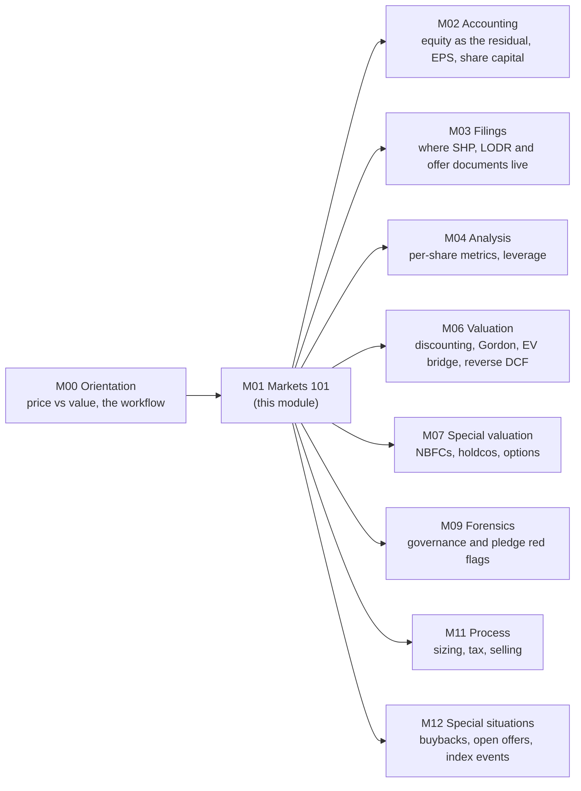

# Module 01 · Money, Companies & Markets 101

> **Why this module matters:** before you can read a balance sheet or build a DCF you need to know what you are
> actually buying when you buy a share: a residual claim on a legal person, sliced into a share count that
> changes, priced by a market with its own plumbing, flows and rules, and worth the present value of cash that
> arrives over decades. Every later module assumes this vocabulary and this arithmetic.

This module takes you from "a stock has a price" to the working vocabulary of an Indian equity analyst. You learn
who owns a company and who controls it (not always the same people). You learn why market capitalisation prices the
equity while enterprise value prices the business, and how share issues, buybacks, dividends, bonuses and splits
move value per share. You also learn how NSE, BSE, SEBI and the depositories turn a buy order into shares in your
demat account, and what the disclosures they produce tell you. The module ends with the maths that runs through the
rest of the course: compounding, discounting, perpetuities, IRR/XIRR, real returns, TSR decomposition and
volatility drag.

Two fictional companies carry the numbers through every lesson and exercise:
[Kaveri Pumps & Motors](../appendix/running-example/kaveri-pumps.md) (a Coimbatore pump maker with a solar-receivables
problem and a promoter pledge) and [Nirmal Finance](../appendix/running-example/nirmal-finance.md) (a vehicle/MSME
NBFC that raised a QIP in FY24). Where a lesson values Kaveri, it quotes the
[reference valuation](../appendix/running-example/kaveri-valuation.md): ₹320 a share in the base case, against a
market price of ₹390 on 18-Sep-2026.

---

## Lessons

| # | Lesson | What you will be able to do | Time |
|:--|:--|:--|--:|
| 01.1 | [What a company is](01-what-is-a-company.md) | Explain legal personality and limited liability (equity as a call on the assets); run an IBC s.53 liquidation waterfall; read share capital, face value and securities premium; tell promoters from professional managers and subsidiaries from associates; work out what a controlling shareholder can pass alone; put a number on tunnelling | ~90 min |
| 01.2 | [Shares, market cap & enterprise value](02-shares-market-cap-and-enterprise-value.md) | Choose the right share count; compute market cap, free float, EPS, BVPS, P/E and P/B; build EV (debt, leases, preference, NCI, cash, non-operating assets) and pair it with the right denominator; measure dilution with the treasury-stock and if-converted methods; think per share | ~90 min |
| 01.3 | [How companies raise and return capital](03-raising-and-returning-capital.md) | Separate fresh issue from offer for sale; work through IPOs, QIPs, rights issues (TERP), preferential allotments and warrants, and debt; handle dividend dates and tax; test whether a buyback creates value or only lifts EPS; show why bonuses and splits change nothing | ~100 min |
| 01.4 | [Indian market plumbing](04-indian-market-structure.md) | Trace a trade through T+1 settlement; place a stock in its index family and SEBI size bucket; read a shareholding pattern; compute pledge trigger prices; use the LODR, PIT and SAST disclosure deadlines; work with price bands, circuit breakers and the F&O ban; size index and SIP flows | ~100 min |
| 01.5 | [Time value of money & returns math](05-time-value-and-returns-math.md) | Compound, discount and annualise correctly; derive and use the Gordon formula; compute EMIs, IRR and XIRR; convert nominal to real; decompose TSR into EPS growth, P/E change and dividend yield; explain log returns, drawdown arithmetic and volatility drag | ~100 min |
| — | [Exercises](exercises.md) · [Solutions](solutions.md) | 39 problems in four tiers (8 warm-up, 22 core, 5 stretch, 4 real-world tasks) covering every lesson | ~3–4 h |

**Total:** about 8 hours of lessons plus 3–4 hours of exercises. The [study plan](../00-orientation/02-how-to-use-this-course.md)
budgets 9.3 hours, assuming 1.25 hours per lesson, and spreads the module across weeks 1–2. The lessons' own
estimates are a little longer, so allow for it.

**Suggested order:** straight through. 01.4 relies on 01.2's free-float and market-cap ideas. 01.5 uses EPS and P/E
from 01.2 and the dividend data behind 01.3. If you already know TVM maths cold, skim 01.5 and go straight to its
worked example 5 (TSR decomposition) and §11 (volatility drag).

---

## How this module connects to the rest of the course

**Coming from:** [00.1 What fundamental investing is](../00-orientation/01-what-is-fundamental-investing.md) (a share
as a claim on future cash flows), [00.2 How to use this course](../00-orientation/02-how-to-use-this-course.md)
(toolkit and study plan) and [00.3 The investor's map](../00-orientation/03-the-research-workflow-map.md).

**Where each idea is used next:**

| Idea from this module | Where it comes back |
|:--|:--|
| Equity as a residual claim; Assets = Liabilities + Equity | [02.1 The accounting equation](../02-accounting/01-the-accounting-equation.md), [02.4 The balance sheet](../02-accounting/04-the-balance-sheet.md) |
| Share capital, EPS (basic/diluted), weighted-average shares | [02.3 The income statement](../02-accounting/03-the-income-statement.md), [04.6 Per-share metrics & ratio dashboard](../04-financial-analysis/06-per-share-metrics-and-ratio-dashboard.md) |
| Subsidiaries, associates, NCI, look-through interest | [02.8 Group accounts](../02-accounting/08-deeper-cuts-group-accounts-and-other.md), [07.5 Holdcos, conglomerates, PSUs, MNCs](../07-special-valuation/05-holdcos-conglomerates-psus-mncs.md) |
| Shareholding patterns, LODR disclosures, pledges, offer documents | [03.1 The disclosure universe](../03-reading-filings/01-the-disclosure-universe.md), [03.4 Quarterly results & concalls](../03-reading-filings/04-quarterly-results-and-concalls.md), [03.5 Other documents](../03-reading-filings/05-other-documents.md) |
| Leverage as a delta multiplier; net debt | [04.5 Leverage, solvency & liquidity](../04-financial-analysis/05-leverage-solvency-liquidity.md), [06.2 Cost of capital](../06-valuation/02-cost-of-capital.md) |
| Promoters, related-party transactions, agency costs | [05.5 Management & capital allocation](../05-business-analysis/05-management-and-capital-allocation.md), [05.6 Corporate governance — India](../05-business-analysis/06-corporate-governance-india.md), [09.5 Governance red flags](../09-forensics/05-governance-red-flags-india.md) |
| Discounting, Gordon, EV→equity bridge, fully diluted shares | [06.1 What value is](../06-valuation/01-what-is-value.md), [06.3 DCF step by step](../06-valuation/03-dcf-step-by-step.md), [06.5 Relative valuation](../06-valuation/05-relative-valuation-and-multiples.md) |
| "Implied" thinking (IRR, Gordon rearranged, reverse DCF) | [06.6 Reverse DCF & expectations](../06-valuation/06-reverse-dcf-and-expectations.md) |
| Options inside equity (ESOPs, warrants, convertibles, Merton) | [06.7 Other valuation methods](../06-valuation/07-other-valuation-methods.md), [07.4 High-growth & loss-making](../07-special-valuation/04-high-growth-and-loss-making.md) |
| QIP economics for lenders; EMIs and flat rates | [07.1 Banks & NBFCs](../07-special-valuation/01-banks-and-nbfcs.md) |
| Volatility drag, drawdowns, Kelly | [11.4 Position sizing](../11-process/04-position-sizing-and-portfolio-construction.md) |
| Tax on dividends, buybacks and capital gains | [11.5 Monitoring & selling](../11-process/05-monitoring-and-selling.md) |
| Buybacks, open offers, index inclusions as events | [12.3 Special situations](../12-macro-special-sits/03-special-situations.md) |

---

## You're ready to move on when you can…

- [ ] Explain, without notes, why a shareholder's payoff is $\max(0, A - D)$ and what that implies for highly levered equity.
- [ ] Run an IBC s.53 waterfall for any asset value, including pro-rata sharing within a class.
- [ ] Compute share capital, securities premium and dividend-per-share from a "dividend of X%" announcement.
- [ ] Say whether a promoter can pass an ordinary resolution, a special resolution and a material related-party transaction alone.
- [ ] Compute look-through economic interest in a pyramid and the promoter's gain per rupee tunnelled.
- [ ] Build Kaveri's EV at ₹390 (₹2,498.7 Cr) from its balance sheet and explain every add and subtract.
- [ ] Name the right denominator for EV and for market cap, and spot a mismatched multiple.
- [ ] Compute diluted shares with the treasury-stock method and test a convertible for anti-dilution and for economic dilution.
- [ ] Tell whether a share issue or buyback transfers wealth, using $v_{\text{post}} = (V + nP)/(N + n)$.
- [ ] Compute a TERP and a rights-entitlement value, and the loss from ignoring a rights issue.
- [ ] Give today's dividend-date rule under T+1 and the tax treatment of dividends and buybacks as of September 2026.
- [ ] Place any Indian stock in its SEBI/AMFI size bucket and index family, and compute its free-float market cap.
- [ ] Compute a promoter pledge's top-up and invocation prices and the extra shares needed after a fall.
- [ ] State the main LODR, PIT and SAST deadlines and thresholds, and apply the Reg 30 materiality test to a company.
- [ ] Compute CAGR (with the right number of periods), a Rule-of-72 estimate, a PV, a Gordon value and an EMI.
- [ ] Compute an XIRR for irregular cash flows and explain why it differs from the absolute return.
- [ ] Decompose a stock's return into EPS growth, P/E change and dividend yield, multiplicatively and in logs.
- [ ] Estimate the gap between arithmetic and geometric returns from volatility ($\approx \sigma^2/2$).

If three or more boxes stay unticked, redo the Core exercises for those lessons before starting Module 02.

---

## Which mock tests this module

No mock is dedicated to Module 01. Its material is tested in three places in [Module 14](../14-mocks/index.md):

- **[Drill — speed ratios & mental math](../14-mocks/08-drills-speed-and-mental-math.md)**, whose first pass the study
  plan puts in week 2, right after this module: CAGR, perpetuity values, multiples and dilution, against the clock.
- **[Mock 3 — Valuation](../14-mocks/03-mock-valuation.md)**: its multiples and DCF problems assume the EV bridge,
  share-count and discounting mechanics from 01.2 and 01.5.
- **[Final exam — "The Analyst Exam"](../14-mocks/05-final-exam.md)**, which covers M00–M12.

---
[← Previous: 00.3 The investor's map](../00-orientation/03-the-research-workflow-map.md) · [Next: 01.1 What a company is →](01-what-is-a-company.md)
