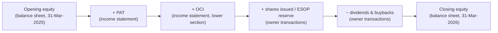
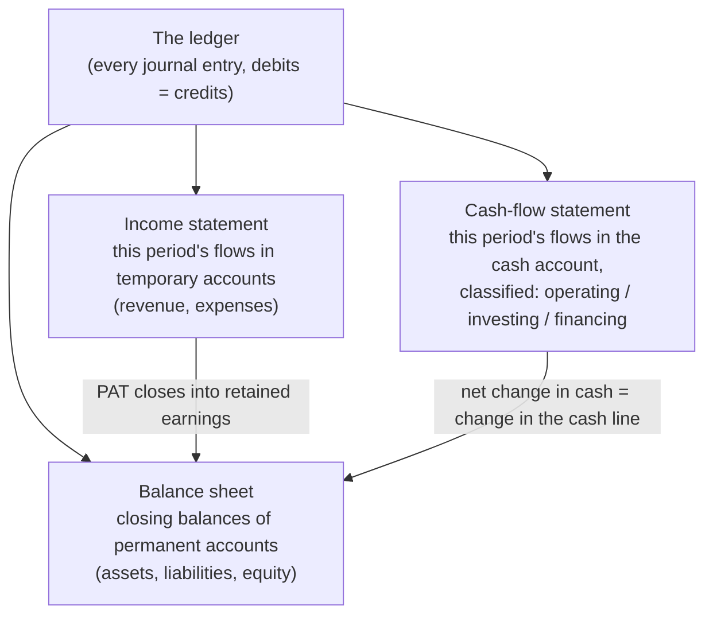

# 02.1 · The accounting equation & double entry

> **Why this matters:** Every number in every annual report you will ever read comes from one identity, *assets = liabilities + equity*, applied to millions of transactions. If you can push any business event through that identity, you can read financial statements as a record of *what actually happened*, work out what management must have done to produce a number, and notice when a number has no plausible "other side".

**Learning objectives** — after this lesson you can:

- Explain why financial accounting exists, who relies on it, and why its numbers have legal consequences (dividends, tax, loan covenants), not just analytical ones.
- Define asset, liability and equity precisely and classify any balance-sheet item, including the awkward ones (customer advances, guarantees, disputed tax demands).
- Post any transaction to the accounting equation, write it as a debit/credit journal entry and trace it through T-accounts to a trial balance.
- Build an income statement, a balance sheet and a cash summary from a list of raw transactions, and explain exactly why profit and cash differ.
- Explain retained earnings as the bridge between the income statement and the balance sheet, and reconcile Kaveri Pumps' reserves from FY24 to FY26 to the rupee.

**Prerequisites:** [01.1 What a company is](../01-markets-101/01-what-is-a-company.md), [01.2 Shares, market cap & enterprise value](../01-markets-101/02-shares-market-cap-and-enterprise-value.md)  ·  **Time:** ~100 min

---

## 1. Why accounting exists

A company is a separate legal person ([01.1](../01-markets-101/01-what-is-a-company.md)). The people who own it (shareholders) are usually not the people who run it (management). Plenty of others also have a claim on it or an interest in it: lenders, suppliers, employees, the tax department, regulators. None of them can walk into the factory and count everything. They need a **standardised, periodic, audited report** of what the company owns, what it owes and how it performed. That report is **financial accounting**.

It helps to separate three kinds of accounting that share a vocabulary but have different jobs:

| Kind | Audience | Rules | What it is for |
|:--|:--|:--|:--|
| **Financial accounting** | Outsiders: shareholders, lenders, regulators | Ind AS / IFRS / US GAAP, company law, audit | Comparable reports on position and performance |
| **Management accounting** | Insiders | None; whatever helps decisions | Budgets, product costing, plant-level margins |
| **Tax accounting** | Income-tax department | Tax law | Computing taxable income; it differs from book profit, which is why "deferred tax" exists ([02.3](03-the-income-statement.md)) |

This course is almost entirely about financial accounting. It does three jobs, and an analyst should keep all three in mind:

1. **Stewardship.** Did management look after the owners' money? The annual report is, legally, the board reporting to shareholders.
2. **Contracting.** Accounting numbers are written into law and contracts. In India a company may pay dividends only out of the profits of the year (after depreciation) or out of undistributed profits of earlier years ([Companies Act, 2013, s.123](https://indiankanoon.org/doc/177696877/)). Loan agreements carry covenants such as "net debt / EBITDA below 3.0x". Management bonuses are tied to profit targets. Tax is computed starting from book profit. So **a profit number has consequences**, and whatever has consequences attracts people who want to shape it. Forensic accounting ([Module 09](../09-forensics/01-why-and-how-numbers-lie.md)) starts from that point.
3. **Decision-usefulness.** Investors use the statements to estimate future cash flows. That is our job, and the statements were not designed mainly for it, which is why analysts spend so much time re-arranging them.

A useful mental model for an engineer: **accounting is a lossy compression algorithm.** Millions of invoices, payments, shipments and estimates are compressed into three statements of perhaps 60 lines each. The compression follows published rules, so you can partly decompress it. The *notes to accounts* are the side-channel where some of the lost information is kept ([03.3](../03-reading-filings/03-notes-to-accounts.md)).

The method is old. The double-entry system described in this lesson was used by Italian merchants in the Renaissance, and the first widely circulated printed description of it appeared in Luca Pacioli's *Summa de arithmetica*, published in Venice in 1494 ([Wikipedia summary](https://en.wikipedia.org/wiki/Luca_Pacioli)). The mechanics have barely changed since. What has changed enormously is the set of *judgements* layered on top: when to recognise revenue, how to value assets, what to estimate. Later lessons in this module cover those.

It also helps to be clear about what accounting is **not**: it is not valuation. Kaveri Pumps' book equity at 31-Mar-2026 was ₹706.1 Cr. At ₹390 a share its market capitalisation is ≈ ₹2,340 Cr (6.00 Cr shares × ₹390), so the market pays about **3.3x book** (₹390 ÷ book value per share ₹117.7). The gap is the market's view of things accounting mostly does not record: the dealer network, the brand, the engineering know-how, and above all the expected future profits. [02.4](04-the-balance-sheet.md) looks at what is and is not on the balance sheet.

## 2. The accounting equation

Three definitions, paraphrased from the conceptual framework that underlies Ind AS and IFRS ([IFRS Foundation, Conceptual Framework](https://www.ifrs.org/issued-standards/list-of-standards/conceptual-framework/)):

- An **asset** is a present economic resource *controlled* by the company as a result of *past events*. An economic resource is a right that can produce economic benefits: cash, a machine, a receivable, inventory, a right to use a leased building.
- A **liability** is a present *obligation* to transfer an economic resource, arising from *past events*: a bank loan, an unpaid supplier invoice, tax owed, or pumps a dealer has paid for but not yet received.
- **Equity** is the residual interest in the assets after deducting all liabilities. It is whatever is left for the owners.

The last definition is the accounting equation, written the other way round:

$$\text{Assets} = \text{Liabilities} + \text{Equity} \qquad\Longleftrightarrow\qquad \text{Equity} = \text{Assets} - \text{Liabilities}$$

In words: **everything the company controls was financed either by someone it owes (liabilities) or by its owners (equity).** The left side lists *what the resources are*; the right side lists *who has a claim on them*. Equity is defined by subtraction. It is not a pile of cash, and a company with large equity can be short of cash (you will see this in the worked example).

Three words in those definitions matter a lot in practice:

- **Controlled, not owned.** A factory leased for ten years is not owned, but the right to use it is controlled, so under Ind AS 116 it appears as a *right-of-use asset* with a matching *lease liability* (Kaveri shows ₹16.5 Cr and ₹18.2 Cr at FY26; details in [02.7](07-deeper-cuts-assets-and-expenses.md)).
- **Past event.** A signed purchase order from a customer is not yet an asset. Once the pumps are delivered, the right to be paid is (a trade receivable).
- **Obligation, not debt.** A dealer's cash advance for pumps not yet shipped is a liability even though Kaveri owes no money. It owes pumps. If it fails to deliver, it must refund.

### Kaveri Pumps FY26 in equation form

Here is Kaveri's consolidated balance sheet at 31-Mar-2026 ([reference data](../appendix/running-example/kaveri-pumps.md)), arranged as the equation:

| Assets (₹ Cr) | FY26 | Liabilities & equity (₹ Cr) | FY26 |
|:--|--:|:--|--:|
| Net block (PP&E) | 495.3 | Borrowings – non-current | 92.0 |
| Capital work-in-progress | 2.0 | Borrowings – current | 96.0 |
| Right-of-use assets | 16.5 | Lease liabilities | 18.2 |
| Intangible assets | 8.0 | Trade payables | 143.4 |
| Inventories | 188.1 | Other current liabilities & provisions | 65.9 |
| Trade receivables | 346.7 | Deferred tax liability (net) | 22.0 |
| Other current assets | 39.5 | **Total liabilities** | **437.5** |
| Current investments | 15.0 | Equity share capital | 30.0 |
| Cash & cash equivalents | 32.5 | Other equity | 676.1 |
| | | **Total equity** | **706.1** |
| **Total assets** | **1,143.6** | **Total liabilities + equity** | **1,143.6** |

₹437.5 Cr + ₹706.1 Cr = ₹1,143.6 Cr. Liabilities fund 38.3% of the assets and equity 61.7%. The two sides *must* be equal, and not because anyone checks and adjusts them: the way transactions are recorded (Section 3) makes it impossible for them to differ. If a spreadsheet model of Kaveri does not balance, the model has a bug; the company does not have a "gap". [02.6](06-linking-the-three-statements.md) is about hunting those bugs.

### Classifying the awkward items

Most items are obvious. The ones below come up again and again in Indian annual reports, and misclassifying them causes real analytical errors:

| Item | Asset, liability, equity, or none? | Why |
|:--|:--|:--|
| Pumps finished and sitting in the warehouse | Asset (inventory) | Controlled resource, expected to be sold |
| Money owed by a state nodal agency for solar pumps delivered | Asset (trade receivable) | Right to cash from a past delivery. Whether it will actually be collected is a separate question (impairment, [02.4](04-the-balance-sheet.md)) |
| Cash advance received from a dealer for pumps not yet shipped | Liability (contract liability / advance from customers) | Obligation to deliver goods or refund |
| Advance paid to a copper supplier | Asset (advance to suppliers) | Right to receive copper |
| March wages, paid on 7 April | Liability (accrued expense) | Obligation from work already done |
| Rent paid in March for April–June | Asset (prepaid expense) | Right to use premises in future |
| Income tax on this year's profit, not yet paid | Liability (current tax liability) | Obligation from this year's profit |
| A new factory still under construction | Asset (capital work-in-progress, CWIP) | Controlled resource; depreciation starts once it is ready for use |
| Share capital subscribed by the promoters | Equity | Owners' contribution |
| Profits kept in the business over 30 years | Equity (retained earnings, inside "other equity") | Owners' residual claim |
| The "Kaveri" brand built over 30 years | **None** | Internally generated brands are not recognised as assets under Ind AS |
| Bank guarantees given to state agencies for tender performance (₹96.0 Cr at FY26) | **None** (disclosed only) | No present obligation to pay unless Kaveri defaults; shown in the notes as a commitment or contingency |
| GST demand of ₹38.0 Cr under appeal | **None** (contingent liability, disclosed) | Recognised only if an outflow becomes *probable*; otherwise disclosed ([02.8](08-deeper-cuts-group-accounts-and-other.md)) |

The last three rows are the reason you cannot stop reading at the face of the balance sheet. Kaveri's ₹96.0 Cr of guarantees and ₹38.0 Cr GST dispute together are about 19% of its book equity, and neither appears in the equation.

### The expanded equation

Equity changes for only two kinds of reason: **transactions with owners** (they put money in, or the company pays them dividends or buys back shares) and **performance** (the company earns income or incurs expenses). Splitting equity into its parts gives the *expanded* equation:

$$
\text{Assets} = \text{Liabilities} + \underbrace{\text{Share capital} + \text{Opening retained earnings} + \text{Revenue} - \text{Expenses} - \text{Dividends}}_{\text{Equity at the end of the period}}
$$

(Ind AS adds other comprehensive income and some reserves to this; see [02.3](03-the-income-statement.md) and [02.8](08-deeper-cuts-group-accounts-and-other.md).)

This gives the precise meaning of two words people use loosely:

- **Revenue/income** is an increase in equity that does not come from the owners putting money in.
- **Expense** is a decrease in equity that is not a payment to the owners.

So a dividend is *not* an expense (it is a distribution to owners), and money raised in an IPO is *not* income (it is a contribution from owners). Both change equity, but neither touches profit.

## 3. The nine ways a transaction can move the equation

Every transaction changes at least two things, and the changes always keep the equation balanced. There are only nine basic patterns. Learn them once and you can place any business event:

| # | Effect | Example | Touches profit? |
|:--|:--|:--|:--|
| 1 | Asset ↑, Liability ↑ | Borrow from a bank; buy raw material on credit | No |
| 2 | Asset ↑, Equity ↑ | Issue shares for cash (no profit); make a sale (profit) | Only if it is a sale |
| 3 | Asset ↑, another Asset ↓ | Buy a machine for cash; collect a receivable | No |
| 4 | Asset ↓, Liability ↓ | Repay a loan; pay a supplier | No |
| 5 | Asset ↓, Equity ↓ | Pay wages (expense); record depreciation (expense); pay a dividend (not an expense) | Only if it is an expense |
| 6 | Liability ↑, Equity ↓ | Accrue unpaid salaries; provide for income tax | Yes (expense) |
| 7 | Liability ↓, Equity ↑ | Deliver goods a customer paid for in advance (revenue); reverse an old provision | Yes (income) |
| 8 | Liability ↑, another Liability ↓ | Refinance a loan; move a supplier's invoice to a bank's supplier-finance programme | No |
| 9 | Equity ↑, other Equity ↓ | Bonus issue (reserves become share capital) | No |

Two points to take from the table:

- **Four of the nine patterns never touch profit** (1, 3, 4, 8), and two more (2, 5) touch it only sometimes. A large share of what a company does in a year (buying assets, borrowing, repaying, collecting, paying suppliers) has *no* effect on profit. This is why profit and cash differ so much, and why you need all three statements.
- Pattern 8 looks harmless, but it is where some cash-flow games happen. A supplier invoice turned into a bank liability under a "supplier finance" arrangement leaves total liabilities unchanged but can move the payment out of operating cash flow. We return to this in [09.4](../09-forensics/04-cash-flow-games.md).

## 4. Worked example 1: starting a pump workshop

Meena Subramaniam (fictional) leaves a large pump maker and on 1-Apr-2025 starts **Meena Pump Works Pvt Ltd** in Coimbatore. We follow her first financial year, FY26 (1-Apr-2025 to 31-Mar-2026), through ten transactions, aggregated for the year. Amounts are in **₹ lakh** (1 lakh = 100,000).

**The ten transactions**

- **T1.** Meena subscribes ₹20.0 lakh for shares in the new company.
- **T2.** The company takes a ₹10.0 lakh term loan from a bank at 10% a year.
- **T3.** It buys a lathe and test bench for ₹12.0 lakh in cash. Expected life 10 years, no residual value.
- **T4.** It buys castings, copper wire and stampings worth ₹15.0 lakh on 60-day credit.
- **T5.** A dealer in Erode pays a ₹3.0 lakh advance for pumps to be delivered in FY27.
- **T6.** It sells pumps for ₹30.0 lakh. Customers pay ₹18.0 lakh during the year and owe ₹12.0 lakh at year-end. The materials used in the pumps sold cost ₹12.0 lakh.
- **T7.** It pays wages of ₹6.0 lakh, power and rent of ₹3.0 lakh, and loan interest of ₹1.0 lakh, all in cash (₹10.0 lakh in total).
- **T8.** It pays suppliers ₹11.0 lakh.
- **T9.** At year-end it records depreciation: ₹12.0 lakh ÷ 10 years = ₹1.2 lakh.
- **T10.** It provides for income tax at an assumed flat 25% of profit before tax. The tax is payable after year-end. (Actual Indian corporate tax rates are in [02.3](03-the-income-statement.md).)

**Each transaction's effect on the equation** (₹ lakh; brackets are decreases):

| # | Transaction | Cash | Receiv. | Inventory | PP&E | Borrow. | Payables | Cust. advance | Tax payable | Share cap. | Retained earnings | Total assets | Total L + E |
|:--|:--|--:|--:|--:|--:|--:|--:|--:|--:|--:|--:|--:|--:|
| T1 | Owner invests | 20.0 | | | | | | | | 20.0 | | 20.0 | 20.0 |
| T2 | Bank loan | 10.0 | | | | 10.0 | | | | | | 30.0 | 30.0 |
| T3 | Machine for cash | (12.0) | | | 12.0 | | | | | | | 30.0 | 30.0 |
| T4 | Materials on credit | | | 15.0 | | | 15.0 | | | | | 45.0 | 45.0 |
| T5 | Dealer advance | 3.0 | | | | | | 3.0 | | | | 48.0 | 48.0 |
| T6a | Sale: revenue | 18.0 | 12.0 | | | | | | | | 30.0 | 78.0 | 78.0 |
| T6b | Sale: materials consumed | | | (12.0) | | | | | | | (12.0) | 66.0 | 66.0 |
| T7 | Wages, power, rent, interest | (10.0) | | | | | | | | | (10.0) | 56.0 | 56.0 |
| T8 | Pay suppliers | (11.0) | | | | | (11.0) | | | | | 45.0 | 45.0 |
| T9 | Depreciation | | | | (1.2) | | | | | | (1.2) | 43.8 | 43.8 |
| T10 | Tax provision | | | | | | | | 1.7 | | (1.7) | 43.8 | 43.8 |
| | **Closing, 31-Mar-2026** | **18.0** | **12.0** | **3.0** | **10.8** | **10.0** | **4.0** | **3.0** | **1.7** | **20.0** | **5.1** | **43.8** | **43.8** |

After every single row, total assets equal liabilities plus equity. Now look at what each transaction teaches:

- **T1 and T2** (patterns 2 and 1) bring in ₹30.0 lakh of cash from owners and lenders. Neither is income. Raising money does not make you richer; it gives you more resources *and* an equal claim against them.
- **T3** (pattern 3) is a **swap**: cash becomes a machine. Buying the machine is *not* an expense. The ₹12.0 lakh becomes an expense slowly, through depreciation, as the machine is used up (T9). This is called **capitalising** a cost. Whether a cost should be capitalised or expensed is one of the biggest judgement areas in accounting ([02.7](07-deeper-cuts-assets-and-expenses.md)).
- **T4** (pattern 1) creates inventory and a matching obligation to the supplier. Nothing has been earned or spent yet in the profit sense.
- **T5** (pattern 1) brings in cash but **no revenue**. Meena owes the dealer pumps. The ₹3.0 lakh is a liability until the pumps are delivered next year, at which point it becomes revenue (pattern 7). [02.2](02-accrual-accounting-and-revenue-recognition.md) is devoted to this distinction.
- **T6** is the heart of the business, and a sale always has **two legs**. The revenue leg (T6a, pattern 2) records the value delivered to customers, ₹30.0 lakh, whether or not they have paid. The cost leg (T6b, pattern 5) records the inventory given up, ₹12.0 lakh. Profit on the sales is ₹18.0 lakh. Of the ₹30.0 lakh, ₹12.0 lakh is still a receivable, a promise rather than cash.
- **T7** (pattern 5) is ordinary expenses. Note that **interest** is an expense, but repaying the loan *principal* would not be (pattern 4).
- **T8** (pattern 4) settles part of the supplier balance. Cash falls and so does the liability. Profit is unaffected.
- **T9** (pattern 5) is **depreciation**: an asset and equity both fall and no cash moves. It is the "matching" of the machine's cost to the periods that benefit from it.
- **T10** (pattern 6) records an obligation to the tax department. Profit before tax is ₹6.8 lakh, so tax is 25% × 6.8 = ₹1.7 lakh. Nothing is paid yet.

### The three statements for Meena Pump Works

From the ten transactions we can now write the statements. The profit and loss statement collects every change in retained earnings that came from operations:

| Income statement, FY26 | ₹ lakh |
|:--|--:|
| Revenue from operations | 30.0 |
| Cost of materials consumed | (12.0) |
| Employee benefits expense | (6.0) |
| Other expenses (power, rent) | (3.0) |
| **EBITDA** | **9.0** |
| Depreciation | (1.2) |
| **EBIT** | **7.8** |
| Finance costs (interest) | (1.0) |
| **Profit before tax (PBT)** | **6.8** |
| Tax expense | (1.7) |
| **Profit after tax (PAT)** | **5.1** |

The balance sheet is simply the closing row of the big table:

| Balance sheet at 31-Mar-2026 | ₹ lakh | | ₹ lakh |
|:--|--:|:--|--:|
| PP&E (cost 12.0 less depreciation 1.2) | 10.8 | Share capital | 20.0 |
| Inventories | 3.0 | Retained earnings | 5.1 |
| Trade receivables | 12.0 | **Total equity** | **25.1** |
| Cash | 18.0 | Borrowings | 10.0 |
| | | Trade payables | 4.0 |
| | | Advance from customers | 3.0 |
| | | Current tax liability | 1.7 |
| **Total assets** | **43.8** | **Total equity & liabilities** | **43.8** |

And the cash summary collects everything that touched the cash column:

| Cash summary, FY26 | ₹ lakh |
|:--|--:|
| Received from customers (T6) | 18.0 |
| Advance received from dealer (T5) | 3.0 |
| Paid to suppliers (T8) | (11.0) |
| Paid for wages, power and rent (T7) | (9.0) |
| **Cash from operations before interest** | **1.0** |
| Interest paid (T7) | (1.0) |
| Purchase of machine (T3) | (12.0) |
| Shares issued (T1) | 20.0 |
| Loan taken (T2) | 10.0 |
| **Net increase in cash** | **18.0** |

**The key observation.** Meena earned a profit of ₹5.1 lakh, yet her operating cash flow was about zero: ₹1.0 lakh before interest, nil after. Where did the profit go? We can reconcile the two exactly:

$$
\underbrace{5.1}_{\text{PAT}} + \underbrace{1.2}_{\text{depreciation}} + \underbrace{1.7}_{\text{tax not yet paid}} - \underbrace{12.0}_{\text{receivables}} - \underbrace{3.0}_{\text{inventory}} + \underbrace{4.0}_{\text{payables}} + \underbrace{3.0}_{\text{advance}} = 0.0
$$

The profit is tied up in receivables (₹12.0 lakh) and unsold materials (₹3.0 lakh). Some of that is funded by suppliers (₹4.0 lakh unpaid) and by the dealer's advance (₹3.0 lakh). The ₹18.0 lakh in the bank is mostly Meena's and the bank's money, not profit. This gap between profit and cash is **working capital**. It is the single most common reason a growing, profitable company runs out of cash, and Kaveri Pumps has exactly this problem at a much larger scale (its receivables rose from ₹146.1 Cr in FY23 to ₹346.7 Cr in FY26). [02.5](05-the-cash-flow-statement.md) formalises this reconciliation and [04.4](../04-financial-analysis/04-working-capital-and-cash-conversion.md) analyses it.

!!! tip "Trader's lens"
    Double entry is the same discipline as a trading desk's position-keeping. Every fill books two legs, the position and the cash (or the margin), and the end-of-day reconciliation checks that *yesterday's equity + today's P&L + capital flows = today's positions at marks + cash*. A break means an unbooked or mis-booked trade, and nobody goes home until it is found. A company's books work the same way: the equity roll-forward (Section 7) is its P&L attribution, and a balance sheet that "doesn't balance" is a reconciliation break, never a real-world phenomenon.

## 5. Debits and credits: the bookkeeper's sign convention

Accountants don't write "cash +20, share capital +20". They write a **journal entry** using **debits** (Dr) and **credits** (Cr). This notation confuses many newcomers because in everyday banking language "credit" sounds good and "debit" sounds bad. In accounting they mean only **left** and **right**.

### The rule

Move everything to one side of the expanded equation so that all terms are positive:

$$
\underbrace{\text{Assets} + \text{Expenses} + \text{Dividends}}_{\text{increase with a DEBIT}} \;=\; \underbrace{\text{Liabilities} + \text{Share capital} + \text{Retained earnings} + \text{Revenue}}_{\text{increase with a CREDIT}}
$$

- Accounts on the **left** (assets, expenses, dividends) **increase with a debit** and decrease with a credit.
- Accounts on the **right** (liabilities, equity, revenue) **increase with a credit** and decrease with a debit.
- Every journal entry must have **total debits = total credits**. That single rule is what keeps the equation balanced.

A common mnemonic is **DEALER**: **D**ividends, **E**xpenses, **A**ssets are debit-normal; **L**iabilities, **E**quity, **R**evenue are credit-normal.

It also explains the banking confusion. When you deposit money, your bank "credits your account" because, *in the bank's books*, your deposit is a liability: the bank owes you. Your own books would debit cash.

### The signed-vector view (for engineers)

If you prefer linear algebra, assign debit = +1 and credit = −1. Then:

- Each transaction is a vector $\Delta \in \mathbb{R}^n$ over the $n$ accounts with $\sum_i \Delta_i = 0$.
- The ledger is the running sum of those vectors, and the **trial balance** (the list of all account balances) must also sum to zero.

That zero-sum property is a **checksum**. It catches arithmetic and posting errors. It does *not* catch judgement errors. If a company records ₹50 Cr of routine repair costs as "Dr PP&E 50 / Cr Cash 50" instead of "Dr Repairs expense 50 / Cr Cash 50", the books balance perfectly and profit is overstated by ₹50 Cr. **A balanced trial balance proves the books are consistent, not that they are right.** Most accounting manipulation is perfectly balanced.

### Meena's ten transactions as journal entries (₹ lakh)

| # | Account debited | Dr | Account credited | Cr |
|:--|:--|--:|:--|--:|
| T1 | Cash | 20.0 | Share capital | 20.0 |
| T2 | Cash | 10.0 | Borrowings | 10.0 |
| T3 | Plant & machinery | 12.0 | Cash | 12.0 |
| T4 | Inventory (raw materials) | 15.0 | Trade payables | 15.0 |
| T5 | Cash | 3.0 | Advance from customers | 3.0 |
| T6a | Cash Trade receivables | 18.0 12.0 | Revenue from operations | 30.0 |
| T6b | Cost of materials consumed | 12.0 | Inventory | 12.0 |
| T7 | Employee benefits expense Other expenses Finance costs | 6.0 3.0 1.0 | Cash | 10.0 |
| T8 | Trade payables | 11.0 | Cash | 11.0 |
| T9 | Depreciation expense | 1.2 | Accumulated depreciation | 1.2 |
| T10 | Tax expense | 1.7 | Current tax liability | 1.7 |

Note T9: depreciation is credited to a separate **accumulated depreciation** account rather than directly to the machine. The balance sheet shows *gross block* (original cost, ₹12.0 lakh) less *accumulated depreciation* (₹1.2 lakh) = *net block* (₹10.8 lakh). Kaveri reports exactly this: gross block ₹830.0 Cr less accumulated depreciation ₹334.7 Cr = net block ₹495.3 Cr at FY26.

### T-accounts

A **T-account** is the ledger page for one account, drawn as a "T": debits on the left, credits on the right. Here is Meena's cash account for the year:

| Cash — Dr (in) | ₹ lakh | Cash — Cr (out) | ₹ lakh |
|:--|--:|:--|--:|
| T1 Shares issued | 20.0 | T3 Machine | 12.0 |
| T2 Bank loan | 10.0 | T7 Wages, power, rent, interest | 10.0 |
| T5 Dealer advance | 3.0 | T8 Suppliers | 11.0 |
| T6a Customer receipts | 18.0 | | |
| **Total debits** | **51.0** | **Total credits** | **33.0** |
| **Closing debit balance** | **18.0** | | |

And the inventory account:

| Inventory — Dr | ₹ lakh | Inventory — Cr | ₹ lakh |
|:--|--:|:--|--:|
| T4 Purchases | 15.0 | T6b Consumed in pumps sold | 12.0 |
| | | **Closing debit balance** | **3.0** |

The inventory T-account is the most useful one to remember, because it is an identity you will use constantly:

$$\text{Opening inventory} + \text{Purchases} - \text{Consumed} = \text{Closing inventory}$$

Given any three terms you can solve for the fourth. The Schedule III income statement is built on it ("cost of materials consumed", "changes in inventories"; see [02.3](03-the-income-statement.md)).

### The trial balance

List every account's closing balance (before the year-end "closing" step below):

| Account | Debit balances | Credit balances |
|:--|--:|--:|
| Cash | 18.0 | |
| Trade receivables | 12.0 | |
| Inventory | 3.0 | |
| Plant & machinery (gross) | 12.0 | |
| Accumulated depreciation | | 1.2 |
| Borrowings | | 10.0 |
| Trade payables | | 4.0 |
| Advance from customers | | 3.0 |
| Current tax liability | | 1.7 |
| Share capital | | 20.0 |
| Revenue from operations | | 30.0 |
| Cost of materials consumed | 12.0 | |
| Employee benefits expense | 6.0 | |
| Other expenses | 3.0 | |
| Finance costs | 1.0 | |
| Depreciation expense | 1.2 | |
| Tax expense | 1.7 | |
| **Total** | **69.9** | **69.9** |

Debits equal credits (₹69.9 lakh each). The checksum passes.

### Closing the books

Revenue and expense accounts are **temporary**. They accumulate one period's performance and are then reset to zero. At year-end the bookkeeper "closes" them into retained earnings:

| Closing entry | Dr | Cr |
|:--|--:|--:|
| Revenue from operations | 30.0 | |
| Cost of materials consumed | | 12.0 |
| Employee benefits, other expenses, finance costs | | 10.0 |
| Depreciation expense | | 1.2 |
| Tax expense | | 1.7 |
| **Retained earnings** (the balancing figure = PAT) | | **5.1** |

After closing, only the **permanent** accounts (assets, liabilities, equity) carry balances into FY27. That is the balance sheet. **The income statement is the detailed history of one period's change in retained earnings.** Keep that sentence in mind; it is the key to Section 7.

### Why analysts rarely need debits and credits, and when they do

You will almost never write a journal entry as an investor. Published statements are already aggregated, and you reason at the level of line items and their effects on the equation. Nobody asks an analyst to prepare a trial balance.

But the vocabulary shows up in documents you *will* read:

- Accounting-policy and transition notes say things like "the cumulative effect was **debited to retained earnings**" (equity fell) or "**credited to OCI**" (other comprehensive income rose).
- Indian formats show accumulated losses as a "**debit balance** of the statement of profit and loss", presented as a negative figure within other equity (per the ICAI Guidance Note on Schedule III, Division II).
- GST-era commercial language uses **credit notes** (issued to a customer, reducing revenue, e.g. for rebates or returns) and **debit notes**.

More important is the *habit* that double entry teaches: **for every number, ask "what was the other leg?"** If revenue jumped, did cash rise, or receivables? If the company spent ₹200 Cr and profit didn't fall, which asset went up instead? If cash is "large" but interest income is tiny, what is the other leg of that cash balance (the Satyam question, [09.4](../09-forensics/04-cash-flow-games.md))? Most forensic work is this question asked persistently.

## 6. Periods: stocks, flows and why the calendar matters

Look again at the three statements for Meena. Their headings differ in a way that matters:

- The **balance sheet** is "as at 31 March 2026": a **stock**, a snapshot at an instant.
- The **income statement** and **cash-flow statement** are "for the year ended 31 March 2026": **flows** over a period.

In trading terms, the balance sheet is your *position* and the income statement is your *P&L*. You would never divide a day's P&L by the closing position without thinking about what happened intraday; for the same reason, ratios that mix a flow and a stock (return on equity, receivable days) usually use the **average** of the opening and closing balance sheets ([04.3](../04-financial-analysis/03-returns-on-capital.md)).

**The accounting period.** Businesses run continuously, but reports cut them into periods. In India the financial year runs 1 April to 31 March: FY26 = April 2025 to March 2026. Listed companies also report quarterly: Q1 = April–June, Q2 = July–September, Q3 = October–December, Q4 = January–March ([03.4](../03-reading-filings/04-quarterly-results-and-concalls.md)). Kaveri's FY26 quarters sum exactly to its annual figures (revenue ₹355.9 + 263.6 + 290.0 + 408.5 = ₹1,318.0 Cr).

**Why periods create judgement.** If every transaction started and finished within one period (buy for cash, sell for cash, same day) accounting would be trivial. The difficulty is that the period boundary cuts through transactions:

- A machine bought this year serves for ten years. How much of its cost belongs to this year? (Depreciation, [02.7](07-deeper-cuts-assets-and-expenses.md).)
- A solar pump delivered in March but installed in April: which year's revenue? ([02.2](02-accrual-accounting-and-revenue-recognition.md).)
- A warranty given on pumps sold this year will cost money over the next two years. How much should be charged to this year? (Provisions, [02.8](08-deeper-cuts-group-accounts-and-other.md).)

**Cut-off**, meaning deciding which side of the period boundary a transaction falls on, is where many aggressive accounting choices live: shipping extra goods on 31 March, delaying a supplier invoice to 1 April. Accrual accounting, the subject of [02.2](02-accrual-accounting-and-revenue-recognition.md), is the set of rules for making those allocations.

## 7. Retained earnings: the bridge between the P&L and the balance sheet

The closing entry in Section 5 showed that the year's profit ends up in retained earnings. Written as a roll-forward:

$$\text{Retained earnings}_{\text{close}} = \text{Retained earnings}_{\text{open}} + \text{PAT} - \text{Dividends}$$

This is the **bridge** between the two main statements. The income statement explains *why* retained earnings changed. The balance sheet shows the *level* at the end. When every change in equity other than owner transactions passes through the income statement, accountants call it **clean surplus**. Ind AS is *almost* clean surplus: some gains and losses go to **other comprehensive income (OCI)** instead of profit and reach equity by a side door ([02.3](03-the-income-statement.md)), and a few other items (such as share-based payment reserves) also move equity directly.

Under Ind AS the full roll-forward is a primary statement in its own right, the **statement of changes in equity (SOCE)**. In the Indian (Schedule III, Division II) balance sheet, retained earnings sit inside a heading called **"other equity"**, along with other reserves such as the securities premium, general reserve and share-based payment reserve.

### Worked example 2: Kaveri Pumps' other equity, FY24 → FY26

Using only Kaveri's reference income statement, cash-flow statement and balance sheets (₹ Cr):

| ₹ Cr | FY24 | FY25 | FY26 |
|:--|--:|--:|--:|
| Opening other equity (previous year-end balance sheet) | 456.6 | 528.8 | 607.2 |
| Add: profit after tax (income statement) | 86.4 | 97.4 | 90.5 |
| Less: dividends paid (cash-flow statement) | (15.0) | (21.0) | (24.0) |
| Add: share-based payment reserve (ESOP charge, non-cash) | 0.8 | 2.0 | 2.4 |
| **Closing other equity (computed)** | **528.8** | **607.2** | **676.1** |
| Closing other equity (reported balance sheet) | 528.8 | 607.2 | 676.1 |

The FY26 arithmetic is 607.2 + 90.5 − 24.0 + 2.4 = 676.1. It ties to the rupee in every year; the same check works for FY21–FY23 (for example FY23: 406.0 + 62.6 − 12.0 = 456.6).

What the tie tells you:

1. **Kaveri's reported OCI is nil** in the reference data. Nothing else moved equity. (For a real company, you would expect small OCI items such as gratuity remeasurements; if the roll-forward *didn't* tie, the SOCE would show you what else happened.)
2. **The ESOP line is subtle.** The ₹2.4 Cr share-based payment charge is an expense inside "employee benefits" in FY26, so it reduces PAT and therefore retained earnings. The matching credit goes to the share-based payment reserve, *also* in other equity. Net effect on total equity: zero. No cash moves either. Yet the cost is real: it is paid by existing shareholders through dilution when options are exercised (Kaveri's diluted share count is 6.07 Cr against 6.00 Cr basic). This is why "adjusted" profit that adds back ESOP costs deserves suspicion ([02.8](08-deeper-cuts-group-accounts-and-other.md)).
3. **Dividends bypass the income statement.** They are a distribution of profit, not a cost of earning it.

A practical point about **when** dividends appear. A final dividend is proposed by the board after the year-end and approved by shareholders at the AGM, months later. It is not a liability at the balance-sheet date, because no obligation exists until it is declared. IAS 10 (paragraph 12), mirrored in Ind AS 10, says dividends declared after the reporting period are *not* recognised as a liability at that period end ([IAS 10 text](https://www.ifrs.org/issued-standards/list-of-standards/ias-10-events-after-the-reporting-period/)). So the ₹24.0 Cr Kaveri paid *in* FY26 includes the final dividend for FY25. Match cash-flow "dividends paid" with the equity roll-forward, not with the year's profit.

### Worked example 3: Kaveri's FY25 land sale, through the equation

In FY25 Kaveri sold a land parcel carried at ₹4.0 Cr for ₹18.0 Cr cash. Land is not depreciated, so its carrying amount was its original cost.

| Effect (₹ Cr) | Assets | Liabilities | Equity |
|:--|--:|--:|--:|
| Cash received | +18.0 | | |
| Land removed from gross block | (4.0) | | |
| Gain on sale (exceptional item in the P&L) | | | +14.0 |
| **Net** | **+14.0** | **0.0** | **+14.0** |

The equation balances: assets up ₹14.0 Cr, equity up ₹14.0 Cr. Tax on the gain then reduces equity further. The reference data applies Kaveri's 25.17% rate throughout, so tax is ≈ ₹3.5 Cr and the after-tax gain is ≈ ₹10.5 Cr (14.0 × (1 − 0.2517) = 10.48).

The disposal is also visible in the fixed-asset roll-forward. FY25 capex was ₹54.0 Cr, of which ₹4.0 Cr went into CWIP (CWIP rose from 0.0 to 4.0), so ₹50.0 Cr was added to gross block:

$$\underbrace{734.0}_{\text{gross block FY24}} + \underbrace{50.0}_{\text{additions}} - \underbrace{4.0}_{\text{land sold}} = \underbrace{780.0}_{\text{gross block FY25}}$$

Accumulated depreciation rose by exactly the FY25 PP&E depreciation charge (258.1 + 37.0 = 295.1), because land carries none.

Two lessons for later modules. First, the ₹18.0 Cr of cash is an *investing* inflow, not operating cash flow, and the ₹14.0 Cr gain must be *removed* from profit when reconciling to operating cash flow; otherwise it would be counted twice ([02.5](05-the-cash-flow-statement.md)). Second, the gain inflates FY25 profit: reported PAT fell 7.1% from ₹97.4 Cr (FY25) to ₹90.5 Cr (FY26), but excluding the land gain, profit *rose*. [02.3](03-the-income-statement.md) computes the adjusted figures.

## 8. The three statements are three views of one ledger

Everything so far fits into one picture. There is a single set of books, the **ledger**. Each statement is a different query on it:

Because all three come from the same ledger, they must agree: PAT must reconcile to the change in retained earnings, and the net cash flow must equal the change in the balance-sheet cash line. The full set of linkages is the subject of [02.6](06-linking-the-three-statements.md). For now, remember that **you can never understand a company from one statement alone**, and that the links between them are checks you can run on any company's numbers.

!!! tip "Trader's lens"
    Equity is a *residual claim*: owners get whatever is left after every liability is paid, and (with limited liability) never less than zero. That is the payoff of a call option on the firm's assets struck at the face value of its debt, which is Merton's insight, developed in [06.7](../06-valuation/07-other-valuation-methods.md). Book equity is simply the accounting *mark* of that residual, using mostly historical-cost marks for the assets. So a P/B of 3.3x for Kaveri is like an option trading well above its "intrinsic" value on stale marks: the premium is the market's estimate of what the accounting leaves out.

!!! info "India notes"
    - **Accrual and double entry are legally required.** Section 128 of the Companies Act, 2013 requires every company to keep books of account "on accrual basis and according to the double entry system of accounting" ([text](https://indiankanoon.org/doc/134672468/); verified Sep-2026). Pure cash-basis books are not an option for a company.
    - **Dividends only out of profits.** Section 123 restricts dividends to the year's profits (after depreciation) or undistributed profits of earlier years ([text](https://indiankanoon.org/doc/177696877/)), which is why retained earnings matter legally, not just analytically.
    - **Vocabulary.** Older Indian reports (and today's non-Ind AS companies under Schedule III, Division I) say "reserves and surplus" where Ind AS reports say "other equity". Older texts call receivables "sundry debtors" and payables "sundry creditors". Indian press and bankers often say "net worth" for book equity. Company accounts use "journal vouchers", and GST invoicing uses "credit notes" and "debit notes".
    - **Format.** Ind AS companies present statements in the Schedule III, Division II format ([ICAI Guidance Note on Division II](https://bcasonline.org/wp-content/uploads/2023/04/GN_on_Sch_III-Division-II.pdf)). Accumulated losses show as a negative "debit balance of profit and loss" within other equity, not as an asset.
    - **Periods.** Indian companies overwhelmingly use an April–March financial year; quarterly results follow the Q1 = Apr–Jun convention. Always check whether a figure is quarterly, year-to-date (YTD) or annual.

!!! warning "Common mistakes"
    - **Treating equity as cash.** Meena has ₹25.1 lakh of equity and ₹18.0 lakh of cash, and most of that cash belongs, in claim terms, to the bank and the dealer. Kaveri has ₹706.1 Cr of equity and ₹32.5 Cr of cash.
    - **Treating an asset purchase as an expense (or the reverse).** Buying a machine is a swap (pattern 3); only depreciation hits profit.
    - **Treating dividends as an expense or equity raised as income.** Owner transactions never touch profit.
    - **Treating customer advances as revenue.** Cash received is not revenue until the goods or services are delivered.
    - **Believing a balanced trial balance means the accounts are right.** Every manipulation that shifts a cost into an asset balances perfectly.
    - **Mixing stocks and flows carelessly.** Dividing a year's profit by a year-end balance, or comparing a quarter's revenue with an annual figure.
    - **Stopping at the face of the balance sheet.** Guarantees, contingent liabilities and internally generated brands are not in the equation; the notes carry them.
    - **Reading "credit" with the banking meaning.** In a journal entry, credit simply means the right-hand side.

## Key terms

| Term | Meaning |
|:--|:--|
| **Financial accounting** | Standardised, periodic, audited reporting of a company's position and performance to outsiders |
| **Asset** | Present economic resource controlled by the company as a result of past events |
| **Liability** | Present obligation to transfer an economic resource, arising from past events |
| **Equity** | Residual interest in assets after deducting liabilities; the owners' claim |
| **Accounting equation** | Assets = Liabilities + Equity; holds after every transaction |
| **Revenue / income** | Increase in equity other than from owner contributions |
| **Expense** | Decrease in equity other than distributions to owners |
| **Double entry** | Recording every transaction as equal debits and credits in at least two accounts |
| **Debit (Dr) / Credit (Cr)** | Left / right side of an entry; debits increase assets, expenses and dividends; credits increase liabilities, equity and revenue |
| **Journal entry** | The record of one transaction as debits and credits |
| **Ledger / T-account** | The collection of accounts / one account's page, debits on the left and credits on the right |
| **Trial balance** | List of all ledger balances; debits must equal credits (a checksum, not a proof of correctness) |
| **Capitalise** | Record a cost as an asset to be expensed over time (e.g. through depreciation) rather than immediately |
| **Depreciation** | Systematic allocation of a fixed asset's cost to the periods that use it |
| **Gross block / net block** | Original cost of PP&E / cost less accumulated depreciation |
| **Contract liability (advance from customers)** | Cash received for goods or services not yet delivered |
| **Temporary vs permanent accounts** | Income-statement accounts reset each period / balance-sheet accounts carried forward |
| **Closing entries** | Year-end entries transferring revenue and expense balances into retained earnings |
| **Retained earnings** | Cumulative profits kept in the business; the bridge between the P&L and the balance sheet |
| **Other equity** | Ind AS balance-sheet heading for all reserves, including retained earnings, securities premium, ESOP reserve and OCI reserves |
| **Statement of changes in equity (SOCE)** | The roll-forward of every equity component from opening to closing |
| **Clean surplus** | The property that all non-owner changes in equity pass through the income statement |
| **Stock vs flow** | A balance at an instant (balance sheet) vs an amount over a period (P&L, cash flow) |
| **Cut-off** | Assigning transactions to the correct period |

## Check your understanding

**1.** Classify each as asset, liability, equity or not recognised, and say why: (a) a ₹5 Cr advance Kaveri paid to a copper supplier; (b) a ₹5 Cr advance Kaveri received from a state agency; (c) March's unpaid electricity bill; (d) a ₹38 Cr GST demand Kaveri is contesting and expects to win.

Answer

(a) **Asset.** Kaveri has a right to receive copper (an advance to suppliers, usually in other current assets). (b) **Liability.** Kaveri owes goods or services (a contract liability). (c) **Liability.** An accrued expense for power already consumed. (d) **Not recognised.** A contingent liability is disclosed in the notes; it becomes a provision (a liability) only if an outflow becomes probable and can be estimated ([02.8](08-deeper-cuts-group-accounts-and-other.md)).

**2.** In FY27 Meena Pump Works delivers the pumps the Erode dealer paid ₹3.0 lakh for in advance. The materials in those pumps cost ₹1.2 lakh. Show the effect on the equation and write the journal entries.

Answer

Revenue leg (pattern 7): advance from customers −3.0 (liability ↓), retained earnings +3.0 (revenue). Entry: **Dr Advance from customers 3.0 / Cr Revenue 3.0.** No cash moves; the cash came last year.

Cost leg (pattern 5): inventory −1.2, retained earnings −1.2. Entry: **Dr Cost of materials consumed 1.2 / Cr Inventory 1.2.**

Profit on the delivery: ₹1.8 lakh before tax, recognised in FY27 even though the cash arrived in FY26.

**3.** A company repays ₹50 Cr of a term loan and pays ₹8 Cr of interest on it. What happens to (a) profit, (b) the balance sheet, (c) cash?

Answer

(a) Profit falls by ₹8 Cr before tax (interest is an expense); the ₹50 Cr repayment does not touch profit. (b) Borrowings fall by ₹50 Cr; cash falls by ₹58 Cr; equity falls by ₹8 Cr before tax (via retained earnings). Check: assets −58 = liabilities −50 + equity −8. (c) Cash falls by ₹58 Cr. The repayment is a financing outflow; interest paid is classified as operating or financing depending on policy (Kaveri classifies it in financing, [02.5](05-the-cash-flow-statement.md)).

**4.** A company's retained earnings were ₹200 Cr at the start of the year and ₹260 Cr at the end. It paid dividends of ₹30 Cr and had no other equity movements. What was its PAT? If you also learn it booked an OCI loss of ₹5 Cr that was transferred to retained earnings, what was PAT?

Answer

Without OCI: 260 = 200 + PAT − 30, so **PAT = ₹90 Cr**. With the OCI loss also flowing into retained earnings: 260 = 200 + PAT − 5 − 30, so **PAT = ₹95 Cr**. This is why you check the statement of changes in equity before inferring profit from balance-sheet movements.

**5.** Verify Kaveri's FY22 other-equity roll-forward from the reference data. What does it tell you about FY22 OCI and share-based payments?

Answer

Opening other equity (FY21) 367.8 + PAT 47.2 − dividends 9.0 = **406.0**, exactly the reported FY22 figure. So there were no OCI items and no ESOP charge in FY22, consistent with the reference data (ESOPs were first granted in FY24, and the share-based payment line is nil before FY24).

**6.** Why does a trial balance that balances not prove the accounts are correct? Give a journal entry that balances but overstates profit.

Answer

The debit = credit rule only checks internal consistency. It cannot tell *which* accounts should have been used. Example: routine maintenance of ₹10 Cr recorded as **Dr Plant & machinery 10 / Cr Cash 10** instead of **Dr Repairs expense 10 / Cr Cash 10**. Both balance. The first overstates this year's profit by ₹10 Cr (less the small depreciation charge later), overstates assets by ₹10 Cr, and moves the cash outflow from operating to investing activities.

**7.** Suppose Meena had expensed the ₹12.0 lakh machine immediately instead of capitalising it (ignore tax on losses). What would FY26 PBT, equity and total assets be? Does the equation still balance?

Answer

Expense ₹12.0 lakh instead of depreciation ₹1.2 lakh, so PBT = 6.8 − 10.8 = **(4.0) lakh**. With a loss there is no tax provision, so PAT = (4.0). Equity = 20.0 − 4.0 = **₹16.0 lakh**. Assets = cash 18.0 + receivables 12.0 + inventory 3.0 + PP&E 0 = **₹33.0 lakh**. Liabilities = 10.0 + 4.0 + 3.0 = ₹17.0 lakh. 17.0 + 16.0 = 33.0: it balances. The *cash* is identical under both policies; only the timing of the expense, and therefore profit and equity, changes. This is the pattern behind most "accounting choices".

**8.** A company makes a 1:1 bonus issue, capitalising ₹30 Cr from reserves. Which of the nine patterns is this, and what happens to total equity, book value per share and the share price (in theory)?

Answer

Pattern 9: equity ↑ (share capital +30) and equity ↓ (other equity −30). Total equity is unchanged; no asset or liability moves. The share count doubles, so book value per share halves, and in theory the share price halves too: nothing economic happened ([01.3](../01-markets-101/03-raising-and-returning-capital.md)).

## Go deeper

- Thomas R. Ittelson, *Financial Statements: A Step-by-Step Guide to Understanding and Creating Financial Reports* (any recent edition): builds all three statements transaction by transaction, the same approach as this lesson, at greater length.
- IFRS Foundation, [Conceptual Framework for Financial Reporting](https://www.ifrs.org/issued-standards/list-of-standards/conceptual-framework/): the source of the definitions of asset, liability, equity, income and expense on which Ind AS is built.
- ICAI, [Guidance Note on Division II – Ind AS Schedule III](https://bcasonline.org/wp-content/uploads/2023/04/GN_on_Sch_III-Division-II.pdf) (2017 edition): the authoritative commentary on how Indian Ind AS statements are laid out; worth skimming now and using as a reference in 02.3–02.4.
- Jacob Soll, *The Reckoning: Financial Accountability and the Rise and Fall of Nations* (Basic Books, 2014): a readable history of double entry from Italian merchants onwards, and of why societies that kept honest books tended to prosper.
- [Companies Act, 2013 – Section 128](https://indiankanoon.org/doc/134672468/): the legal requirement for accrual, double-entry books in India.

---
[← Previous: 01.5 Time value of money & returns math](../01-markets-101/05-time-value-and-returns-math.md) · [Module index](index.md) · [Next: 02.2 Accrual accounting & revenue recognition →](02-accrual-accounting-and-revenue-recognition.md)
