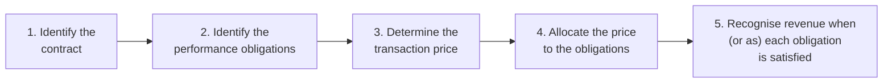

# 02.2 · Accrual accounting & revenue recognition

> **Why this matters:** Revenue is the first line of the income statement, usually the biggest number in it, and the one where *timing* depends most on judgement. Most accounting frauds, and many honest but flattering presentations, start with revenue. If you understand *when* and *how much* revenue a company is allowed to recognise, you can tell real growth from growth that has only been pulled forward in time.

**Learning objectives** — after this lesson you can:

- Contrast cash-basis and accrual-basis accounting and reconcile one to the other for a simple business.
- Name the four kinds of accruals and deferrals, and find each on an Indian balance sheet.
- Apply Ind AS 115's five-step model to sales of goods, services delivered over time, bundled contracts, variable consideration, and principal-versus-agent situations.
- Compute revenue, receivables, contract assets and contract liabilities for a multi-element contract across several reporting periods.
- Explain how revenue timing differs for software licences, SaaS subscriptions and real-estate projects, and measure how much a single judgement can move reported revenue.
- Use balance-sheet evidence (receivables, unbilled revenue, deferred revenue) to test whether reported revenue is turning into cash, applied to Kaveri Pumps FY21–FY26.

**Prerequisites:** [02.1 The accounting equation & double entry](01-the-accounting-equation.md)  ·  **Time:** ~120 min

---

## 1. Cash basis vs accrual basis

There are two ways to decide *when* an event affects profit.

- **Cash basis:** record revenue when cash comes in and expenses when cash goes out. Your personal bank statement works like this.
- **Accrual basis:** record revenue when it is **earned** (goods or services delivered) and expenses when they are **incurred** (resources used up to earn that revenue), whenever the cash moves.

Companies in India must use the accrual basis: Section 128 of the Companies Act, 2013 requires books to be kept "on accrual basis" ([text](https://indiankanoon.org/doc/134672468/)). So do Ind AS, IFRS and US GAAP. The cash basis survives in the cash-flow statement ([02.5](05-the-cash-flow-statement.md)), which re-tells the same year's story in cash.

### Worked example 1: Meena Pump Works on both bases

Take Meena Pump Works' first year from [02.1](01-the-accounting-equation.md) (₹ lakh). On a pure cash basis, every rupee in or out of the business from operations and asset purchases counts toward "profit":

| Cash basis, FY26 | ₹ lakh |
|:--|--:|
| Received from customers | 18.0 |
| Advance received from a dealer | 3.0 |
| Paid to suppliers | (11.0) |
| Paid for wages, power, rent and interest | (10.0) |
| Paid for the machine | (12.0) |
| **Cash-basis "profit" (before tax)** | **(12.0)** |

On the accrual basis, profit before tax was **₹6.8 lakh**. The ₹18.8 lakh gap is not an error; it is explained item by item:

| Reconciliation: cash result → accrual PBT | ₹ lakh | Reason |
|:--|--:|:--|
| Cash-basis result | (12.0) | |
| Machine capitalised, not expensed (12.0 − 1.2 depreciation) | 10.8 | The machine serves 10 years; only 1/10 of its cost belongs to FY26 |
| Sales earned but not yet collected (receivables) | 12.0 | Revenue belongs to the year of delivery |
| Advance received for next year's pumps | (3.0) | Cash received, nothing delivered: not FY26 revenue |
| Materials consumed (12.0) exceed materials paid for (11.0) | (1.0) | Expense follows usage, not payment |
| **Accrual PBT** | **6.8** | |

Which number is "true"? Both, for different questions. The accrual figure answers *how did the business perform this year?*: Meena made and sold pumps at a good margin. The cash figure answers *what happened to the bank balance?* The machine purchase drained cash, but it is a ten-year asset, not a one-year loss. A cash-basis P&L would make Meena look like a disaster in year 1 and a star in years 2–10. That is why companies report on an accrual basis.

The accrual basis has a cost: **it needs estimates and judgement.** How long will the machine last? Will the ₹12.0 lakh of receivables be collected? When exactly was a sale "earned"? Cash is a fact; accruals are opinions, disciplined by rules. The difference between accrual profit and operating cash flow, summed up as **accruals**, is one of the most-studied signals in accounting research, and persistently large accruals are a warning sign ([04.7](../04-financial-analysis/07-quality-of-earnings.md)).

## 2. Matching, and the four accruals and deferrals

The **matching principle** says expenses should be recognised in the same period as the revenue they helped earn. There are three common ways to do the matching:

1. **Direct matching.** The cost of materials in pumps sold this year is expensed this year (cost of materials consumed). Materials still in the warehouse stay on the balance sheet as inventory.
2. **Systematic allocation.** A machine's cost is spread over its useful life (depreciation), because it helps earn revenue in many periods ([02.7](07-deeper-cuts-assets-and-expenses.md)).
3. **Period costs.** Costs with no clear link to specific revenue (office rent, most salaries, advertising) are expensed in the period incurred.

Whenever cash and the accounting event fall in different periods, a balance-sheet account holds the difference. There are exactly four cases:

| | **Revenue side** | **Expense side** |
|:--|:--|:--|
| **Accounting event first, cash later** (accrual) | **Accrued income / unbilled revenue / trade receivable** — goods delivered or service performed, not yet paid (asset) | **Accrued expense / payable** — resource used, not yet paid, e.g. March wages paid in April (liability) |
| **Cash first, accounting event later** (deferral) | **Deferred revenue / advance from customers / contract liability** — paid in advance, not yet delivered (liability) | **Prepaid expense** — e.g. annual insurance paid upfront, not yet used (asset) |

Every one of these balances *reverses*. A receivable becomes cash, a prepaid becomes an expense, a customer advance becomes revenue. That makes them useful for forecasting: an Indian SaaS company's deferred revenue at 31 March is revenue that is already contracted for the following year. It also makes them useful for detecting trouble: a receivable that never turns into cash was probably never revenue.

Two refinements in modern standards are worth knowing now:

- **Costs of obtaining a contract** (for example a sales commission payable only if a contract is won) are *capitalised* as an asset and amortised over the contract's life if the company expects to recover them. As a practical expedient they can be expensed immediately if the amortisation period would be one year or less (IFRS 15 paras 91–94; Ind AS 115 is the same).
- **Warranties** come in two kinds. A standard "assurance-type" warranty (the pump works as specified for a year) is a cost of the sale: the company estimates the expected repair cost and books a **provision** at the time of sale (Ind AS 37, [02.8](08-deeper-cuts-group-accounts-and-other.md)). An extended warranty the customer can buy separately is a **service**, and part of the price is deferred and recognised over the warranty period.

## 3. Ind AS 115 in one page

Until FY18, Indian companies on Ind AS recognised revenue under Ind AS 18 (*Revenue*) and Ind AS 11 (*Construction Contracts*). The Ministry of Corporate Affairs notified **Ind AS 115, Revenue from Contracts with Customers** on 28-Mar-2018, effective for periods beginning on or after **1-Apr-2018** (i.e. from FY19). It replaced Ind AS 11 and 18, and for Ind AS companies it withdrew the ICAI's 2016 Guidance Note on real-estate transactions ([KPMG IFRS Notes, Apr-2018](https://assets.kpmg.com/content/dam/kpmgsites/in/pdf/2018/04/ifrsnotes-ind-as-115-revenue-contracts-customers.pdf)). Ind AS 115 is largely converged with IFRS 15, which in turn was developed jointly with the US standard ASC 606, so the same logic applies to most listed companies worldwide.

The core principle, paraphrased: *recognise revenue to show the transfer of promised goods or services to customers, in the amount of consideration the company expects to be entitled to in exchange.* The standard puts it into practice through five steps:

**Step 1 — Identify the contract.** A contract is an agreement that creates *enforceable* rights and obligations. It can be written, oral or implied by business practice. It qualifies only if the parties have approved it, each party's rights and the payment terms can be identified, it has commercial substance, and **collection of the consideration is probable**. The last condition matters for companies that sell to weak counterparties, including, as we will see, some state agencies.

**Step 2 — Identify the performance obligations.** A **performance obligation (PO)** is a promise to transfer a **distinct** good or service. A good or service is distinct if (a) the customer can benefit from it on its own or with readily available resources, *and* (b) it is separately identifiable from the other promises in the contract (it is not, for example, an input into a combined output the customer actually wants). A pump and a separately priced five-year maintenance contract are two POs. The steel, labour and paint that go into the pump are not separate POs.

**Step 3 — Determine the transaction price.** This is the amount the company expects to be entitled to, **excluding amounts collected on behalf of third parties**, such as GST, which the company collects for the government. It must allow for:

- **variable consideration** (rebates, discounts, bonuses, penalties, returns), estimated and then *constrained* (Section 4.4);
- a **significant financing component** if payment and delivery are far apart. As a practical expedient this can be ignored if the gap is a year or less;
- **non-cash consideration** at fair value, and **consideration payable to the customer** (for example slotting fees paid to a retailer), which normally *reduces* revenue rather than being an expense.

**Step 4 — Allocate the price** to each PO in proportion to its **stand-alone selling price (SSP)**, the price at which the company would sell that item separately. If SSP isn't directly observable, it is estimated: adjusted market assessment, expected cost plus a margin, or (only in limited cases) a residual approach. Any bundle discount is normally spread across all POs in proportion.

**Step 5 — Recognise revenue when (or as) each PO is satisfied**, which means when **control** of the good or service passes to the customer. A PO is satisfied **over time** if *any one* of three criteria is met (Ind AS 115 / IFRS 15 para 35):

- **(a)** the customer receives and consumes the benefit as the company performs (cleaning, maintenance, a subscription);
- **(b)** the company's work creates or enhances an asset the customer controls as it is built (construction on the customer's land);
- **(c)** the company's work creates an asset with **no alternative use** to the company **and** the company has an **enforceable right to payment for performance completed to date** (bespoke equipment, some real-estate contracts).

If none applies, the PO is satisfied **at a point in time**, and the standard lists indicators of when control passes: the company has a present right to payment, the customer has legal title, physical possession, the significant risks and rewards of ownership, and has accepted the asset.

For over-time POs the company measures **progress** using either an **output method** (units delivered, milestones reached, surveys of work done) or an **input method**, most commonly **cost-to-cost**:

$$
\text{Cumulative revenue}_t = \text{Contract price} \times \frac{\text{Costs incurred to date}_t}{\text{Total estimated costs}}, \qquad \text{Revenue in period } t = \text{Cumulative}_t - \text{Cumulative}_{t-1}
$$

The formula makes one danger obvious: revenue depends on the *denominator*, an estimate. Understate the total cost of a project and revenue (and margin) is pulled forward. When the estimate is later corrected, the catch-up hits a single quarter.

## 4. The five situations every analyst meets

### 4.1 Selling goods: point in time

Kaveri's dealer business is the simple case. A dealer orders 200 submersible pumps; Kaveri ships them; the dealer pays in 60 days. One PO (the pumps); a fixed price, less any rebates (Section 4.4); revenue at the point **control** passes. When exactly that is depends on the delivery terms:

- If pumps are sold **ex-works** (the dealer collects them, or title and risk pass when the goods are handed to the dealer's transporter), control typically passes on **dispatch**.
- If pumps are sold on a **delivered** basis (Kaveri bears transit risk until the dealer's godown), control typically passes on **delivery**. Pumps dispatched on 30 March and delivered on 2 April are then Q1 revenue of the new year, not Q4 revenue of the old one.

That distinction is the mechanism behind **quarter-end cut-off** games. So are a few arrangements the standard deals with explicitly:

- **Consignment.** Pumps placed with a dealer who can return unsold stock and doesn't owe anything until he sells them are *not* sold; control has not passed. No revenue until the dealer sells.
- **Bill-and-hold.** The customer is invoiced but asks the seller to keep the goods. Revenue is allowed only if the arrangement is substantive (the customer asked for it), the goods are separately identified as the customer's, ready for transfer, and cannot be used for or sent to anyone else (IFRS 15 para B81). An unexplained rise in bill-and-hold sales near a quarter-end is a classic red flag ([09.2](../09-forensics/02-revenue-red-flags.md)).
- **Right of return.** If dealers can return pumps, revenue is recognised only for the pumps *not* expected to come back, with a **refund liability** for the rest.

### 4.2 Services over time

Kaveri also sells annual maintenance contracts (AMCs) for industrial pumps. Suppose a sugar mill signs a ₹12 lakh AMC on 1-Jan-2026, billed and paid upfront, covering calendar 2026. The customer consumes the service as it is delivered (criterion (a)), so revenue is recognised **over time**, here straight-line because the service is a "stand-ready" obligation spread evenly:

- FY26 revenue (January–March, 3 months): 12 × 3/12 = **₹3 lakh**.
- Contract liability at 31-Mar-2026: **₹9 lakh**, recognised in FY27.

On 1 January the cash (₹12 lakh) arrives with a matching contract liability; each month ₹1 lakh moves from the liability to revenue. A business model built on upfront billing (subscriptions, AMCs, education fees, airline tickets) therefore carries a large contract liability, which is effectively an interest-free loan from customers. When that liability is growing, it is a sign of strength, not weakness.

### 4.3 Multi-element contracts — Worked example 2: a solar-pump tender

This is the case that matters for Kaveri, whose solar pumping business (₹355.9 Cr of FY26 revenue, 27% of the total) sells mainly into state-government tenders under the PM-KUSUM scheme. The contract below is **fictional**: it is an illustration consistent with Kaveri's reference data but not separately disclosed in it. Real tenders set their own scope, milestones and maintenance terms, and you must read them.

**The contract (fictional).** In January 2026 a state nodal agency awards Kaveri an order for **2,000 standalone solar pumping systems at ₹2.40 lakh each (excluding GST): ₹48.0 Cr in total.** The price covers:

1. supply of the system (panels, structure, controller, pump-motor set) to each farmer's site;
2. installation and commissioning;
3. a **five-year comprehensive maintenance contract (CMC)** from the date of commissioning.

Terms: title and risk pass to the agency on acknowledged delivery at site; Kaveri bills **60% of the unit price on delivery** and **40% on commissioning**; the CMC is included in the price and is not billed separately. Installation is standard work that other empanelled installers could perform, so we treat it as **distinct** (we test this judgement below).

**Steps 1–2.** A contract exists (approved, enforceable, identifiable terms; we assume collection is judged probable). There are **three performance obligations**: hardware, installation, CMC.

**Step 3.** The transaction price is ₹48.0 Cr (GST is excluded; it belongs to the government). Two complications we set aside for simplicity. The CMC is paid for years in advance, which could imply a financing component, but it is small here. The tender's liquidated-damages clause for delay is variable consideration (Section 4.4).

**Step 4 — allocate by stand-alone selling prices.** From Kaveri's (fictional) price lists: system ₹2.20 lakh, installation ₹0.15 lakh, five-year CMC ₹0.15 lakh, a total of ₹2.50 lakh. The tender price of ₹2.40 lakh is a **4.0% bundle discount**, spread proportionally (allocation factor 2.40 / 2.50 = 0.96):

| Performance obligation | SSP per system (₹ lakh) | Allocated per system (₹ lakh) | × 2,000 systems (₹ Cr) | When recognised |
|:--|--:|--:|--:|:--|
| Hardware (supply) | 2.200 | 2.112 | 42.24 | Point in time: on delivery |
| Installation & commissioning | 0.150 | 0.144 | 2.88 | Point in time: on commissioning |
| Five-year CMC | 0.150 | 0.144 | 2.88 | Over time: straight-line over 60 months |
| **Total** | **2.500** | **2.400** | **48.00** | |

**Step 5 — execution.** All 2,000 systems are delivered in February–March 2026 (Q4 FY26). By 31-Mar-2026, **1,200 are commissioned**; the other **800 are commissioned on 30-Jun-2026** (Q1 FY27). For simplicity, the 1,200 systems' CMC starts on 31-Mar-2026, so none of it is earned in FY26. The agency has paid **₹20.0 Cr** by 31-Mar-2026.

**FY26 (year to 31-Mar-2026):**

| ₹ Cr | Calculation | Amount |
|:--|:--|--:|
| Revenue: hardware | 2,000 × ₹2.112 lakh | 42.240 |
| Revenue: installation | 1,200 × ₹0.144 lakh | 1.728 |
| Revenue: CMC | nil (starts at year-end) | 0.000 |
| **FY26 revenue from this contract** | | **43.968** |
| Billed: 60% on delivery | 2,000 × 60% × ₹2.40 lakh | 28.800 |
| Billed: 40% on commissioning | 1,200 × 40% × ₹2.40 lakh | 11.520 |
| **Total billed** | | **40.320** |
| Collected | | 20.000 |
| **Trade receivable** (billed − collected) | 40.320 − 20.000 | **20.320** |
| **Contract asset, net** (revenue − billed) | 43.968 − 40.320 | **3.648** |

Why is there a contract asset? Look at the two groups of systems:

- **800 delivered but not commissioned:** revenue ₹2.112 lakh each (hardware), billed ₹1.44 lakh each (60%). Kaveri has earned ₹0.672 lakh per system that it cannot yet invoice, because the right to bill depends on commissioning, which is a condition other than the passage of time. 800 × 0.672 = **₹5.376 Cr contract asset**.
- **1,200 commissioned:** billed ₹2.40 lakh each, but revenue only ₹2.256 lakh (hardware + installation). The ₹0.144 lakh CMC portion has been billed but not earned. 1,200 × 0.144 = **₹1.728 Cr contract liability**.

A single contract is presented as one **net** position: 5.376 − 1.728 = **₹3.648 Cr contract asset**. The receivable (₹20.32 Cr) is separate, because that right to cash is *unconditional*: Kaveri needs only to wait (and chase).

**FY27 onwards.** The 800 remaining systems are commissioned on 30-Jun-2026, earning installation revenue of 800 × ₹0.144 lakh = ₹1.152 Cr and triggering the final 40% billing (800 × 40% × ₹2.40 lakh = ₹7.68 Cr). CMC revenue accrues at ₹0.144 lakh ÷ 5 = ₹0.0288 lakh per system per year:

| ₹ Cr | FY26 | FY27 | FY28 | FY29 | FY30 | FY31 | FY32 | Total |
|:--|--:|--:|--:|--:|--:|--:|--:|--:|
| Hardware | 42.240 | – | – | – | – | – | – | 42.240 |
| Installation | 1.728 | 1.152 | – | – | – | – | – | 2.880 |
| CMC: 1,200 systems (from 31-Mar-26) | – | 0.346 | 0.346 | 0.346 | 0.346 | 0.346 | – | 1.728 |
| CMC: 800 systems (from 30-Jun-26) | – | 0.173 | 0.230 | 0.230 | 0.230 | 0.230 | 0.058 | 1.152 |
| **Revenue** | **43.968** | **1.670** | **0.576** | **0.576** | **0.576** | **0.576** | **0.058** | **48.000** |

(Rounded to three decimals; the row totals are exact.) By 31-Mar-2027 all ₹48.0 Cr is billed and ₹45.638 Cr is recognised, so the contract has flipped to a **₹2.362 Cr contract liability**: the unearned CMC, which is released over FY28–FY32.

**The judgement test.** Suppose the auditor concludes that installation is *not* distinct: the systems must be integrated and commissioned by Kaveri to function, so the customer's real purchase is a working, commissioned pumping system. Hardware and installation then form **one PO, satisfied on commissioning**, and FY26 revenue from this contract falls to 1,200 × (2.112 + 0.144) lakh = **₹27.072 Cr**, from ₹43.968 Cr.

That single judgement moves **₹16.9 Cr** of revenue from FY26 into FY27. It is 4.7% of Kaveri's FY26 solar segment revenue and 1.3% of total revenue, from one ₹48 Cr contract. Nothing about the cash changes. This is why an analyst of any project business reads the revenue-recognition policy note line by line ([03.3](../03-reading-filings/03-notes-to-accounts.md)).

**Connecting to Kaveri's real problem.** The mechanics above show how solar revenue can be recognised quickly while cash waits for commissioning certificates, milestone billing and, ultimately, state budgets. Kaveri's solar revenue grew 38.1% in FY26, its receivables rose from ₹269.7 Cr to ₹346.7 Cr, and receivables overdue by more than six months doubled from ₹31.0 Cr to ₹62.4 Cr, "mostly from two state nodal agencies". Section 7 asks whether this is aggressive accounting or simply credit risk.

### 4.4 Variable consideration — Worked example 3

Many contracts don't have a fixed price. Ind AS 115 requires the company to **estimate** variable consideration using whichever of two methods better predicts the outcome:

- the **expected value**: the probability-weighted sum of possible amounts, suited to a large portfolio of similar contracts;
- the **most likely amount**: the single most probable outcome, suited to binary outcomes such as "bonus or no bonus".

It must then apply the **constraint**: include variable consideration only to the extent that it is **highly probable that a significant reversal of cumulative revenue will not occur** when the uncertainty resolves. The constraint is asymmetric on purpose. The standard is more worried about revenue that later has to be reversed than about revenue recognised late.

**(a) Dealer volume rebates — expected value.** Suppose Kaveri sells ₹150 Cr of agricultural pumps to dealers in a quarter under a scheme that gives a 2% year-end rebate to any dealer whose annual purchases exceed a target. From years of history, about 55% of dealer volume ends up qualifying. With ~1,800 dealers, the expected-value method fits:

$$\text{Expected rebate} = 150 \times 2\% \times 55\% = ₹1.65 \text{ Cr} \quad\Rightarrow\quad \text{Revenue} = 150 - 1.65 = ₹148.35 \text{ Cr}$$

The ₹1.65 Cr sits as a **refund liability** until the rebates are settled (usually by issuing credit notes). Rebates are a *reduction of revenue*, not a marketing expense. A company that books rebates as "other expenses" inflates revenue and gross margin even though profit is unaffected.

**(b) An early-completion bonus — most likely amount and the constraint.** Suppose the ₹48.0 Cr solar tender also offered a 3% bonus (₹1.44 Cr) if all 2,000 systems were commissioned by 31 May, and Kaveri estimates a 60% chance of earning it. The outcome is binary, so:

| Method | Estimate | Comment |
|:--|--:|:--|
| Expected value | 60% × ₹1.44 Cr = ₹0.864 Cr | Never actually the outcome of a binary bet |
| Most likely amount | ₹1.44 Cr | The appropriate *method* for a binary outcome |
| **After the constraint** | **₹0.0** | A 40% chance of reversing the whole bonus is not "highly probable" of no significant reversal |

So Kaveri recognises **nothing** for the bonus until the uncertainty is resolved. (As it happens, in our example 800 systems slip to 30 June, so the bonus would have been lost; recognising it would have meant reversing revenue in Q1 FY27.)

**(c) Penalties and liquidated damages (LDs).** Government tenders usually impose LDs for late delivery. Under IFRS 15, penalties that reduce the consideration are variable consideration. Note an India-specific wrinkle: Ind AS 115 as notified in March 2018 **carved penalties out** of variable consideration and prescribed a separate treatment ([KPMG, Apr-2018](https://assets.kpmg.com/content/dam/kpmgsites/in/pdf/2018/04/ifrsnotes-ind-as-115-revenue-contracts-customers.pdf)). We could not verify online whether that carve-out still stands as of September 2026. Check paragraph 51 and the "carve-outs" appendix of the current Ind AS 115 text on the MCA/ICAI websites before relying on either treatment, and in practice read the company's policy note for how it accounts for LDs.

!!! tip "Trader's lens"
    Two analogies make revenue recognition feel familiar. **Deferred revenue is unearned premium.** When you sell an option you receive cash upfront, but you have not "earned" it until the risk has passed: the premium decays into P&L as theta over the option's life. An AMC or a CMC works the same way: cash on day one, revenue released as the service period elapses. **The constraint is marking at the bid, not the mid.** For uncertain consideration the standard deliberately makes you use a conservative mark (include only what is highly unlikely to reverse), in the same way a risk manager marks an illiquid position where it can actually be exited rather than at model value. The expected value is the mean of the distribution, the most likely amount is its mode, and the constraint is a haircut sized to the left tail.

### 4.5 Principal vs agent: gross or net revenue — Worked example 4

When a third party is involved in delivering a good or service, the company must decide whether it is the **principal** (it controls the good or service before it passes to the customer) or an **agent** (it arranges for someone else to provide it). A principal reports the **gross** amount as revenue and the supplier's cost as an expense. An agent reports only its **net** fee or commission as revenue. The standard's indicators that a company is the principal (IFRS 15 paras B34–B38) are that it is **primarily responsible** for fulfilling the promise, bears **inventory risk**, and has **discretion to set the price**.

**Worked example.** "PumpBazaar" (fictional) sells ₹100 Cr of third-party pumps a year online. Pump makers receive ₹85 Cr; PumpBazaar's own operating costs are ₹10 Cr. Compare two versions of the same business:

| ₹ Cr | Model A: buys and holds stock (principal) | Model B: marketplace commission (agent) |
|:--|--:|--:|
| Revenue | 100.0 | 15.0 |
| Cost of goods sold | (85.0) | – |
| Gross profit | 15.0 | 15.0 |
| Operating costs | (10.0) | (10.0) |
| **EBIT** | **5.0** | **5.0** |
| Gross margin | 15.0% | 100.0% |
| EBIT margin | 5.0% | 33.3% |
| EV/Sales if the business is worth ₹50 Cr | 0.5x | 3.3x |

Profit and cash are identical. Revenue differs by a factor of 6.7, margins look completely different, and a naive EV/Sales comparison would call Model A "cheap" and Model B "expensive". **Whenever you compare revenue, margins or sales multiples across companies, check that they are on the same side of the principal/agent line.** This matters for Indian e-commerce and quick-commerce platforms that run both marketplace and inventory models, for travel companies (commission vs merchant models), for staffing firms, for commodity traders and for IT resellers.

**A real example: Groupon (2011).** In its IPO filing of August 2011, Groupon reported 2010 revenue of **USD 713.4 million**, presenting the full price customers paid for vouchers as revenue and the merchants' share as cost of revenue ([S-1/A, 10-Aug-2011](https://www.sec.gov/Archives/edgar/data/1490281/000104746911007178/a2204399zs-1a.htm)). Its amended filing of 23-Sep-2011 restated revenue "on a net basis for all periods presented", and 2010 revenue became **USD 312.9 million** ([S-1/A, 23-Sep-2011](https://www.sec.gov/Archives/edgar/data/1490281/000104746911008207/a2205238zs-1a.htm)), a 56% reduction in the headline number with no change in the underlying business.

**GST is the everyday case of agency.** Indian companies collect GST from customers on behalf of the government. Because the company is an agent for that amount, it is excluded from the transaction price. Revenue from operations is reported *net of GST* (IFRS 15 para 47: amounts "collected on behalf of third parties" are excluded).

## 5. Contract balances: reading the revenue side of the balance sheet

Every revenue contract leaves footprints on the balance sheet. Ind AS 115 uses precise words for them, and Indian annual reports use a mix of old and new labels:

| Balance | Arises when… | Labels you will see in Indian reports | Typical Schedule III location |
|:--|:--|:--|:--|
| **Trade receivable** | Performance done and the right to payment is **unconditional** (only the passage of time is needed) | Trade receivables; "unbilled receivables" when only the invoice is pending | Financial assets (current or non-current) |
| **Contract asset** | Performance done but the right to payment is **conditional** on something other than time (a milestone, commissioning, acceptance) | Contract assets; unbilled revenue; "amounts due from customers" | Other current assets |
| **Contract liability** | Cash received (or due) **before** performance | Advance from customers; deferred revenue; income received in advance; unearned revenue | Other current / non-current liabilities |
| **Refund liability** | Expected rebates, returns or price concessions | Provision for sales returns / rebates / discounts; "refund liabilities" | Other financial liabilities / provisions |

Ind AS 115 also requires disclosures that are gold for analysts ([03.3](../03-reading-filings/03-notes-to-accounts.md) shows where to find them):

- **Disaggregation of revenue** by product, geography, customer type or timing (point in time vs over time).
- **Contract-balance movements**, including how much of the opening contract liability became revenue this year.
- **Remaining performance obligations**: the transaction price allocated to unsatisfied obligations and when it is expected to become revenue, effectively an audited order book. Kaveri discloses an unexecuted solar order book of ₹410 Cr at FY26 (₹290 Cr at FY25).
- An India-specific addition: a **reconciliation of revenue recognised with the contracted price**, showing each adjustment (discounts, rebates, etc.). This is one of Ind AS 115's carve-ins relative to IFRS 15 ([KPMG, Apr-2018](https://assets.kpmg.com/content/dam/kpmgsites/in/pdf/2018/04/ifrsnotes-ind-as-115-revenue-contracts-customers.pdf)).

**How to use them.** Compare the growth rate of each balance with the growth rate of revenue:

- **Receivables or contract assets growing much faster than revenue:** revenue is being recognised before customers are paying. The cause may be innocent (a shift to government customers, a big contract near year-end) or not (pulled-forward or fictitious sales).
- **Contract liabilities (deferred revenue) growing faster than revenue** in a subscription or advance-paid business: future revenue is building up. This is usually good news.
- **Contract liabilities shrinking while revenue grows** in such a business: customers are paying later or signing shorter contracts, and future revenue may slow.

## 6. Timing case studies: software and real estate

### 6.1 Software: licence vs subscription — Worked example 5

"Deccan Soft" (fictional, Pune) signs a contract on 1-Jan-2026 with a manufacturer for ₹4.20 Cr, covering:

- a **perpetual licence** to its plant-scheduling software, installed on the customer's servers;
- **implementation** services over six months (January–June 2026);
- **three years of support and updates** (January 2026 – December 2028).

SSPs: licence ₹3.00 Cr, implementation ₹0.60 Cr, support ₹0.90 Cr (₹0.30 Cr a year), a total of ₹4.50 Cr. The ₹4.20 Cr price is a 6.67% discount, so the allocation factor is 4.20 / 4.50 = 0.9333: licence ₹2.80 Cr, implementation ₹0.56 Cr, support ₹0.84 Cr.

For licences, Ind AS 115 asks whether the customer gets a **right to use** the software as it exists when granted, which is recognised at a **point in time**, or a **right to access** software the vendor keeps changing, which is recognised **over time** (IFRS 15 paras B52–B63). A perpetual on-premise licence is a right to use. Support is a service over time. Implementation, if it is ordinary configuration, is a service recognised as performed.

Now compare the same ₹4.20 Cr sold three ways:

| ₹ Cr | FY26 (Jan–Mar) | FY27 | FY28 | FY29 (Apr–Dec) | Total |
|:--|--:|--:|--:|--:|--:|
| **(i) On-premise, implementation distinct** | 3.15 | 0.56 | 0.28 | 0.21 | 4.20 |
| **(ii) On-premise, heavy customisation (licence + implementation = one PO over 6 months)** | 1.75 | 1.96 | 0.28 | 0.21 | 4.20 |
| **(iii) SaaS subscription, 36 months** | 0.35 | 1.40 | 1.40 | 1.05 | 4.20 |

How the figures are built: in (i), FY26 = licence 2.80 + half the implementation (0.28) + 3 months of support (0.84 × 3/36 = 0.07). In (ii), the combined licence-plus-implementation obligation of 3.36 is spread over six months, 1.68 in each year, plus support. In (iii), 4.20 × 3/36 = 0.35 in FY26 and 1.40 in each full year.

Same customer, same cash, same total. Yet **FY26 revenue ranges from ₹0.35 Cr to ₹3.15 Cr**, a factor of nine. If the customer paid everything upfront, the contract liability at 31-Mar-2026 would be ₹1.05 Cr under (i) but ₹3.85 Cr under (iii). This is why:

- a software company moving from licences to SaaS sees revenue *fall* for a few years even as the business improves (the "SaaS transition trough");
- SaaS investors watch **annual recurring revenue (ARR)**, **deferred revenue** and **remaining performance obligations** as closely as reported revenue ([07.4](../07-special-valuation/04-high-growth-and-loss-making.md));
- a licence vendor that suddenly reclassifies customisation as "distinct" can report a jump in revenue with no change in its business.

### 6.2 Real estate: over time or at possession — Worked example 6

Indian residential developers sell flats years before they are built. The buyer signs an agreement and pays in instalments linked to construction stages, and possession comes at completion. Under Ind AS 115 the developer must decide whether each flat is a PO satisfied **over time** or at a **point in time**. The answer turns on criterion (c): a specific flat has **no alternative use** to the developer once contracted, but does the developer have an **enforceable right to payment for work completed to date** if the buyer walks away? That depends on the agreement's cancellation terms and the applicable law. Developers reach different conclusions, so you must read each developer's revenue-recognition policy.

**The project (fictional).** "Sahyadri Homes" builds a 200-flat tower in Pune at ₹1.00 Cr per flat (₹200 Cr if all are sold). Total estimated cost (land + construction) is ₹140 Cr, incurred 30% / 40% / 30% over FY26–FY28. Bookings: 120 flats in FY26, 60 in FY27, 20 in FY28, so the tower is sold out by completion. Buyers pay in line with construction progress, and possession is given at the end of FY28.

| ₹ Cr | FY26 | FY27 | FY28 | Total |
|:--|--:|--:|--:|--:|
| Construction progress (cumulative, cost-to-cost) | 30% | 70% | 100% | |
| Flats sold in the year (pre-sales, ₹ Cr) | 120.0 | 60.0 | 20.0 | 200.0 |
| Collections in the year | 36.0 | 90.0 | 74.0 | 200.0 |
| **Over time (cost-to-cost on sold flats)**: revenue | 36.0 | 90.0 | 74.0 | 200.0 |
| — cost recognised | (25.2) | (63.0) | (51.8) | (140.0) |
| — **profit** | **10.8** | **27.0** | **22.2** | **60.0** |
| **Point in time (at possession)**: revenue | – | – | 200.0 | 200.0 |
| — cost recognised | – | – | (140.0) | (140.0) |
| — **profit** | **–** | **–** | **60.0** | **60.0** |

How the over-time figures are built: cumulative revenue = flats sold to date × ₹1 Cr × % complete, so FY27 = 180 × 70% − 36 = 90. Cumulative cost = (flats sold ÷ 200) × cost incurred to date, so FY27 = 0.9 × 98 − 25.2 = 63.0. For simplicity, collections equal cumulative revenue on the over-time basis. That is true only because we assumed payments track construction exactly.

Observations:

- **Lifetime profit is identical (₹60 Cr); only the timing differs.** Under the point-in-time policy, reported profit is **zero for two years** and then lumpy, even though the business sold out and collected ₹126 Cr by end-FY27.
- Under point-in-time recognition the ₹126 Cr collected by end-FY27 sits on the balance sheet as **advances from customers** (a contract liability) against **inventory/work-in-progress** of ₹98 Cr of costs. Developers on this policy therefore show huge "inventory" and "advances", and a P&L that tells you little about current activity.
- That is why the Indian real-estate sector's key operating numbers are non-GAAP: **pre-sales (bookings)** and **collections**, which companies report in investor presentations ([07.6](../07-special-valuation/06-real-estate-infra-utilities-telecom.md), [08.9](../08-sectors/09-real-estate-infra-logistics.md)). Pre-sales are *not* revenue, and they are unaudited.
- The Real Estate (Regulation and Development) Act, 2016 (RERA) adds a cash constraint that accounting does not show: 70% of amounts realised from allottees must be deposited in a separate account and used only for that project's construction and land cost ([s.4(2)(l)(D)](https://indiankanoon.org/doc/85057004/)). So 70% of Sahyadri's FY26 collections (₹25.2 Cr of ₹36 Cr) must go through the RERA project account. Cash collected is not freely available to the developer.

## 7. Why revenue recognition is the #1 place for aggressive accounting

Revenue attracts manipulation for four reasons that reinforce one another:

1. **It is the top line.** Every margin, growth rate and sales multiple is computed from it. Markets reward revenue growth, sometimes on its own (young companies valued on EV/Sales).
2. **It is judgement-dense.** Look back at the five steps: distinctness, SSP estimates, variable-consideration estimates, the constraint, over-time criteria, progress measurement, principal/agent. Each is a dial.
3. **Timing is easy to move.** A shipment on 31 March instead of 2 April, a milestone certified early, a cost-to-complete estimate trimmed: each moves revenue between periods without changing lifetime totals, so it can be presented as "just timing".
4. **Its other leg is a soft asset.** Recognising revenue without cash creates a receivable or contract asset, and those can stay on the balance sheet for a long time before anyone is forced to write them off.

Studies of enforcement cases and restatements have consistently found revenue to be the most frequently manipulated line. COSO's 2010 study *Fraudulent Financial Reporting 1998–2007* is the standard reference. We could not retrieve the report online while writing this lesson, so check its figures on the COSO website before quoting them.

### The spectrum, with the revenue tool for each level

| Level | Revenue technique | Legal? |
|:--|:--|:--|
| Conservative | Recognise at the later of delivery or acceptance; generous refund liabilities; constrain aggressively | Yes |
| Neutral | Apply Ind AS 115 in good faith with central estimates | Yes |
| Aggressive | Optimistic SSPs that front-load revenue; treating customisation as "distinct"; optimistic cost-to-complete; ship-ahead at quarter-end with extended credit or return rights (**channel stuffing**); booking rebates as expenses; gross presentation where net is arguable | Often within the rules, but misleading |
| Fraudulent | Side letters with undisclosed return rights; **bill-and-hold** without substance; **round-tripping** (selling to a party that is secretly funded by you); fictitious invoices | No |

The far end is not hypothetical. In April 2011 the US SEC charged Satyam Computer Services with a financial fraud in which, it said, managers had created more than 6,000 fake invoices and fabricated bank statements, inflating revenue, income and cash by more than USD 1 billion over five years ([SEC press release 2011-81](https://www.sec.gov/news/press/2011/2011-81.htm)); see the full case in [I1 Satyam](../13-case-studies/india/01-satyam-2009.md).

### Worked example 7: is Kaveri's revenue turning into cash?

The simplest test compares revenue with the cash actually coming in from customers. A rough proxy is **revenue minus the increase in trade receivables** (ignoring GST, contract assets and bad-debt write-offs, which Kaveri's reference data does not break out). The increase in receivables comes straight from Kaveri's cash-flow statement:

| ₹ Cr | FY21 | FY22 | FY23 | FY24 | FY25 | FY26 |
|:--|--:|--:|--:|--:|--:|--:|
| Revenue from operations | 612.0 | 758.0 | 874.0 | 1,006.0 | 1,172.0 | 1,318.0 |
| Less: increase in trade receivables | (11.3) | (11.1) | (27.7) | (46.8) | (76.8) | (77.0) |
| **Approximate cash collected from customers** | **600.7** | **746.9** | **846.3** | **959.2** | **1,095.2** | **1,241.0** |
| Collected ÷ revenue | 98.2% | 98.5% | 96.8% | 95.3% | 93.4% | 94.2% |
| Revenue growth | – | 23.9% | 15.3% | 15.1% | 16.5% | 12.5% |
| Receivables growth | 11.8% | 10.3% | 23.4% | 32.0% | 39.8% | 28.6% |

(FY21 receivables growth uses the FY20 opening balance of ₹96.0 Cr.)

What the table says:

- From FY23, **receivables grew roughly twice as fast as revenue**, every year.
- Between FY23 and FY26 revenue rose by ₹444 Cr, while receivables rose by ₹200.6 Cr. **About 45% of the incremental revenue since FY23 has not been collected.**
- Receivables overdue by more than six months rose from ₹31.0 Cr (11.5% of receivables) to ₹62.4 Cr (18.0%), against an expected-credit-loss allowance of only ₹4.0 Cr (6.4% of the overdue bucket).

**Aggressive, or merely risky?** The evidence so far fits a *credit-risk* story: sales to state agencies that pay slowly, concentrated in the solar segment that grew 38.1% in FY26. It does not by itself prove premature or fictitious revenue. The questions that separate the two are all answerable from documents:

1. Was collection *probable* when the contracts were signed (Step 1)? What is the payment track record of the two states concerned ([05.7](../05-business-analysis/07-scuttlebutt-and-primary-research.md))?
2. When exactly does Kaveri recognise solar revenue: on delivery, on installation, on commissioning? Has the policy wording changed in the last three annual reports?
3. Are there contract assets or "unbilled revenue" balances hidden in other current assets (₹39.5 Cr at FY26)?
4. Is the ECL allowance adequate, and did the auditor raise a Key Audit Matter on receivables ([03.6](../03-reading-filings/06-annotated-walkthroughs.md))?
5. Did the Q1 FY27 shortfall ("delayed tender finalisation") coincide with a quarter of *lower* receivables growth? If so, revenue timing and cash are behaving consistently.

[09.2](../09-forensics/02-revenue-red-flags.md) returns to this exact example with the full forensic toolkit.

### Ten questions to ask of any revenue line

1. What exactly is sold, to whom, and what are the performance obligations?
2. Point in time or over time, and what event triggers recognition?
3. Has the policy note changed? (Compare the wording year on year.)
4. Gross or net? Would a competitor present the same business the other way?
5. What variable consideration exists (rebates, returns, penalties, bonuses), and where is the refund liability?
6. How fast are receivables, contract assets and unbilled revenue growing relative to revenue?
7. How fast are contract liabilities and remaining performance obligations growing relative to revenue?
8. How concentrated is revenue in Q4, and in the last weeks of each quarter?
9. Are there related-party customers ([05.6](../05-business-analysis/06-corporate-governance-india.md))?
10. Did the auditor flag revenue as a Key Audit Matter, and what did it test?

!!! info "India notes"
    - **Effective date and history.** Ind AS 115 applies from 1-Apr-2018 (notified 28-Mar-2018), replacing Ind AS 11 and 18 ([KPMG IFRS Notes, Apr-2018](https://assets.kpmg.com/content/dam/kpmgsites/in/pdf/2018/04/ifrsnotes-ind-as-115-revenue-contracts-customers.pdf)). Companies not on Ind AS follow the older Indian GAAP standards (AS 9 on revenue and AS 7 on construction contracts), whose logic is closer to "risks and rewards" than "control" ([02.9](09-ind-as-ifrs-us-gaap.md)).
    - **Carve-outs from IFRS 15** (as notified in 2018, per KPMG): separate presentation of excise duty included in revenue; an extra **reconciliation of revenue with contracted price**; additional guidance on unconditional rights of return; and a different treatment of **penalties**. We could not verify whether the penalties carve-out survives in the current text (see Section 4.4); check the current standard before relying on it.
    - **GST and the FY18 base effect.** GST replaced central excise duty and other indirect taxes on 1-Jul-2017 ([overview](https://en.wikipedia.org/wiki/Goods_and_Services_Tax_(India))). Before GST, reported revenue included excise duty (Schedule III still asks for "sale of products (including excise duty)"); after GST, revenue is shown net of GST. FY18 revenue growth for manufacturers is therefore distorted, and companies typically disclosed "revenue net of excise/GST" for comparison. GST rates were rationalised again with effect from 22-Sep-2025 (per the same source); a rate change on a product changes the gross invoice but not revenue, which excludes GST.
    - **Government customers.** Revenue from state and central agencies (EPC, defence, railways, solar tenders) often involves milestone billing, retention money, LDs and slow payment. Expect contract assets and long receivable days, and read the ageing schedule ([03.3](../03-reading-filings/03-notes-to-accounts.md)).
    - **Real estate.** Pre-sales and collections are the sector's operating KPIs and are not revenue. RERA requires 70% of collections to go through a project-specific account ([s.4(2)(l)(D)](https://indiankanoon.org/doc/85057004/)).

!!! warning "Common mistakes"
    - **Equating cash received with revenue** (customer advances, upfront subscriptions) or **revenue with cash** (receivables, contract assets).
    - **Comparing revenue or margins across companies on different sides of the principal/agent line**, e.g. a marketplace against an inventory-led retailer.
    - **Ignoring GST/excise effects** in pre- and post-2017 comparisons.
    - **Treating pre-sales, order inflows or bookings as revenue.** They are commitments, not performance, and usually unaudited.
    - **Reading only the P&L for a subscription or project business.** Deferred revenue, contract assets and remaining performance obligations often tell you more about next year than this year's revenue does.
    - **Assuming a policy is fixed.** A change from "commissioning" to "delivery" as the recognition point can create a one-off revenue jump.
    - **Calling every receivables build-up "fraud".** Slow-paying customers are a credit risk, not necessarily an accounting problem. Establish which before concluding.

## Key terms

| Term | Meaning |
|:--|:--|
| **Accrual basis** | Recognising revenue when earned and expenses when incurred, whenever cash moves |
| **Cash basis** | Recognising revenue and expenses only when cash is received or paid |
| **Matching principle** | Recognising expenses in the same period as the revenue they help earn |
| **Accruals (as a signal)** | The gap between accrual profit and operating cash flow |
| **Performance obligation (PO)** | A promise to transfer a distinct good or service; the unit of account for revenue |
| **Distinct** | Capable of benefiting the customer on its own and separately identifiable within the contract |
| **Transaction price** | Consideration the company expects to be entitled to, excluding amounts collected for third parties (e.g. GST) |
| **Stand-alone selling price (SSP)** | Price at which an item would be sold separately; the basis for allocating a bundle's price |
| **Variable consideration** | Price elements that depend on future events: rebates, bonuses, penalties, returns |
| **Constraint** | Include variable consideration only if a significant reversal is highly improbable |
| **Over time / point in time** | Revenue recognised progressively as work is performed / at the moment control transfers |
| **Input / output method** | Measuring progress by effort or cost incurred (cost-to-cost) / by results delivered |
| **Trade receivable** | Unconditional right to consideration (only time must pass) |
| **Contract asset (unbilled revenue)** | Right to consideration for work done that is conditional on something other than time |
| **Contract liability (deferred revenue, advance from customers)** | Consideration received or due before the company performs |
| **Refund liability** | Expected rebates, returns or price concessions owed to customers |
| **Principal / agent** | Controls the good before transfer and reports gross / arranges for another party and reports net |
| **Bill-and-hold** | Customer invoiced but goods kept by the seller; revenue only if strict criteria are met |
| **Consignment** | Goods placed with a dealer who has not bought them; no revenue until onward sale |
| **Channel stuffing** | Pushing excess stock into distribution before period-end to inflate revenue |
| **Remaining performance obligations** | Contracted revenue not yet recognised; an audited order book |
| **Pre-sales / bookings** | Value of units contracted for sale in a period (real estate); an operating KPI, not revenue |

## Check your understanding

**1.** Why is a customer's advance payment a liability rather than revenue? When would a sharp rise in advances from customers be *good* news, and when might it be a warning?

Answer

It is an obligation to deliver goods or services (or refund the money); nothing has been earned yet. A rise is usually good news in businesses where customers pay ahead (subscriptions, education, real estate on a completion basis, capital goods with advance-backed orders): it signals demand and funds working capital for free. It can be a warning if advances are unusually large relative to deliverable capacity (can the company actually perform?), if they come from related parties (disguised financing), or, in real estate, if the underlying projects are stalled and advances may have to be refunded.

**2.** On 1-Oct-2025 Kaveri signs a two-year AMC worth ₹24 lakh, paid fully upfront. What is FY26 revenue from it, and how is the contract liability at 31-Mar-2026 split between current and non-current?

Answer

Straight-line over 24 months = ₹1 lakh a month. FY26 covers October–March = 6 months, so **revenue = ₹6 lakh**. Contract liability at 31-Mar-2026 = 24 − 6 = **₹18 lakh**: **₹12 lakh current** (to be earned in FY27) and **₹6 lakh non-current** (April–September 2027, in FY28).

**3.** Rework Worked example 2 assuming the state agency pays **100% on commissioning** (nothing on delivery), with the same deliveries, commissionings and ₹20.0 Cr collected by 31-Mar-2026. What are FY26 revenue, the receivable and the net contract asset?

Answer

Revenue is unchanged at **₹43.968 Cr**, because recognition follows performance, not billing. Billed = 1,200 × ₹2.40 lakh = ₹28.80 Cr. **Receivable** = 28.80 − 20.00 = **₹8.80 Cr**. **Net contract asset** = 43.968 − 28.80 = **₹15.168 Cr**. The contract asset is now much larger, and it is a *conditional* right: if commissioning of the 800 systems stalls, it is at risk. This is why analysts of project businesses look at receivables *plus* contract assets, not receivables alone.

**4.** An online travel company sells ₹500 Cr of air tickets in a year, earns a 6% commission and has ₹20 Cr of operating costs. It does not take inventory risk on seats. What are its revenue and EBIT margin? What would the margins look like if it (wrongly) presented revenue gross?

Answer

It is an agent: **revenue = 6% × 500 = ₹30 Cr**, EBIT = 30 − 20 = ₹10 Cr, **EBIT margin 33.3%**. Presented gross: revenue ₹500 Cr, cost of tickets ₹470 Cr, EBIT still ₹10 Cr, EBIT margin **2.0%**. Same profit, radically different optics and sales multiples.

**5.** A consumer-durables maker sells ₹80 Cr to distributors in Q4 under a scheme paying a 5% rebate to distributors who hit annual targets. Historically 40% of volume qualifies. It also has an unrelated ₹2 Cr export bonus it has a 70% chance of earning. How much revenue should it recognise, and why might the two items use different methods?

Answer

Rebate, many distributors, so **expected value**: 80 × 5% × 40% = ₹1.6 Cr; revenue from the sales = **₹78.4 Cr**, with a ₹1.6 Cr refund liability. Export bonus, binary, so **most likely amount** = ₹2 Cr, but a 30% chance of full reversal fails the "highly probable" constraint, so **recognise nil** until the uncertainty resolves. Total Q4 revenue from these items: ₹78.4 Cr. The methods differ because a portfolio of similar outcomes is best estimated by its mean, while a single binary outcome is best described by its mode, and then both are subject to the constraint.

**6.** A listed developer switches its revenue policy from over time to point in time (at possession). What happens to reported revenue and profit in the next two years if its projects are mid-construction? What would you track instead?

Answer

Reported revenue and profit fall sharply (possibly to near zero) until the first projects complete, then jump in completion years. On transition, previously recognised profit on incomplete projects would be reversed through equity. Nothing about sales, collections or project economics has changed. Track **pre-sales (value and volume), collections, construction progress, net debt and the advances-from-customers balance**, and treat reported earnings as a lagging, lumpy indicator.

**7.** Using Kaveri's reference data, compute the FY24 ratio of approximate cash collected to revenue, and explain in one sentence what changed between FY22 and FY24.

Answer

FY24: 1,006.0 − 46.8 = ₹959.2 Cr; 959.2 / 1,006.0 = **95.3%**. In FY22 the ratio was 98.5%. Between FY22 and FY24 receivables went from growing more slowly than revenue (10.3% vs 23.9%) to growing about twice as fast (32.0% vs 15.1%), coinciding with the solar segment (sold to state agencies) growing from ₹30.3 Cr to ₹140.8 Cr.

**8.** Which of these are revenue red flags, and why? (a) Unbilled revenue grows 60% while revenue grows 15%. (b) A SaaS company's deferred revenue falls while revenue grows 25%. (c) The recognition point changes from "delivery" to "dispatch". (d) Advances from customers rise 40% at a capital-goods maker with a record order book.

Answer

(a) **Red flag**: revenue is running well ahead of billing rights; investigate milestones and progress estimates. (b) **Red flag** for *future* revenue: customers may be moving to shorter or monthly contracts, or bookings are slowing. (c) **Red flag**: it accelerates recognition by the transit time and can create a one-off boost; check disclosure of the change and its impact. (d) **Usually not**: advances rising with a record order book is consistent with genuine demand, but check execution capacity and whether any advances come from related parties.

## Go deeper

- IFRS Foundation, [IFRS 15 Revenue from Contracts with Customers](https://www.ifrs.org/issued-standards/list-of-standards/ifrs-15-revenue-from-contracts-with-customers/): the standard and its Illustrative Examples (licences, bill-and-hold, principal/agent) apply almost unchanged to Ind AS 115; the examples are the best way to build intuition.
- KPMG India, [IFRS Notes: Ind AS 115 applicable from 1 April 2018](https://assets.kpmg.com/content/dam/kpmgsites/in/pdf/2018/04/ifrsnotes-ind-as-115-revenue-contracts-customers.pdf) (Apr-2018): a concise summary of the five steps, the sectors most affected and the Indian carve-outs.
- Howard Schilit, Jeremy Perler and Yoni Engelhart, *Financial Shenanigans* (4th ed., 2018): the revenue chapters catalogue every trick in Section 7, with real cases.
- US SEC, [press release 2011-81 on Satyam](https://www.sec.gov/news/press/2011/2011-81.htm): a short, primary-source account of fictitious-revenue fraud at an Indian company.
- Groupon's [S-1/A of 23-Sep-2011](https://www.sec.gov/Archives/edgar/data/1490281/000104746911008207/a2205238zs-1a.htm): read the revenue note to see a gross-to-net restatement in the company's own words.

---
[← Previous: 02.1 The accounting equation & double entry](01-the-accounting-equation.md) · [Module index](index.md) · [Next: 02.3 The income statement, line by line →](03-the-income-statement.md)
