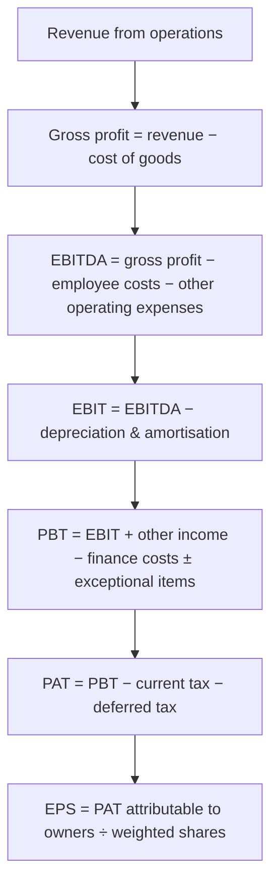

# 02.3 · The income statement, line by line

> **Why this matters:** the income statement is the page everyone quotes — "profit up 20%" — and the page most
> easily shaped by management. If you can read every line and know which are hard cash facts, which are estimates,
> and which are choices, you can tell a good quarter from a well-presented one.

**Learning objectives** — after this lesson you can:

- Walk down an Indian Schedule III (Division II) statement of profit and loss and explain what each line contains
  and where the detail lives in the notes.
- Compute EBITDA, EBIT, PBT, PAT, EPS (basic and diluted) and total comprehensive income from raw lines, and say
  which of them is defined by the standard and which is an analyst's convention.
- Separate recurring from non-recurring profit (other income, exceptional items) and produce an "adjusted" EPS
  with the tax effect handled correctly.
- Explain the difference between standalone and consolidated statements and why Indian investors read both.
- Read Kaveri Pumps' FY26 income statement fully annotated and reproduce every subtotal.

**Prerequisites:** [02.1 The accounting equation](01-the-accounting-equation.md),
[02.2 Accrual accounting & revenue recognition](02-accrual-accounting-and-revenue-recognition.md)  ·  **Time:** ~90 min

---

## 1. What the income statement measures

The **income statement** (Schedule III calls it the *Statement of Profit and Loss*; the US says *income statement*;
everyone says *P&L*) measures the change in shareholders' wealth generated by operations over a period — a quarter
or a year — under accrual rules. It is a *flow* (a video), unlike the balance sheet (a photograph).

Its logic is a subtraction ladder. Start with what customers were charged, subtract the costs of serving them in
layers, and each layer's remainder tells you something different:



Two things to hold on to from the start:

1. **Only revenue, expenses and tax are defined by accounting standards.** EBITDA, EBIT, "operating profit" and
   "core PAT" are analyst conventions. Two data providers will give you two EBITDAs for the same company (one
   includes other income, one does not). Always check the definition before comparing.
2. **Every line is an accrual estimate except cash taxes and interest paid.** Revenue depends on recognition
   policy; costs depend on inventory valuation; depreciation depends on useful lives; tax depends on positions taken.
   The cash-flow statement ([02.5](05-the-cash-flow-statement.md)) is where you check the estimates against reality.

## 2. The Indian format (Schedule III, Division II)

Companies reporting under Ind AS present the P&L in a prescribed order (Schedule III to the Companies Act, 2013,
Division II). Learn the order; it is the same in every annual report and quarterly filing.

| Line (Schedule III) | What it contains | Where the detail is |
|:--|:--|:--|
| I. Revenue from operations | Sale of products, sale of services, other operating revenue (scrap, export incentives, job work) | Revenue note; disaggregation by product/geography (Ind AS 115) |
| II. Other income | Interest, dividends, gains on investments, FX gains, rent, write-backs, profit on asset sales | Other income note |
| III. Total income | I + II | — |
| IV. Expenses: | | |
| (a) Cost of materials consumed | Raw materials used = opening stock + purchases − closing stock | Materials note |
| (b) Purchases of stock-in-trade | Goods bought for resale without processing | — |
| (c) Changes in inventories of finished goods, WIP and stock-in-trade | (Opening − closing) inventory of made goods: a *negative* number means stock built up, which lowers expense | — |
| (d) Employee benefits expense | Salaries, PF/gratuity contributions, staff welfare, **share-based payments** | Employee note; Ind AS 19 & 102 disclosures |
| (e) Finance costs | Interest on borrowings, interest on lease liabilities, other borrowing costs, FX differences treated as interest | Finance-cost note |
| (f) Depreciation and amortisation expense | PP&E depreciation, right-of-use amortisation, intangible amortisation | PP&E, lease and intangibles notes |
| (g) Other expenses | Everything else: power & fuel, freight, advertising, repairs, rent (short-term), professional fees, CSR, audit fees, provisions, bad debts | Other-expenses note — often the most revealing page |
| V. Profit before exceptional items and tax | III − IV | — |
| VI. Exceptional items | Material one-offs the company chooses to show separately (VRS, impairment, asset-sale gains, settlements) | Exceptional-items note — read the justification |
| VII. Profit before tax (PBT) | V ± VI | — |
| VIII. Tax expense: current tax; deferred tax | Tax on this year's taxable income; movement in deferred tax balances | Tax note incl. **effective-rate reconciliation** |
| IX. Profit for the period (PAT) | VII − VIII | — |
| X. Other comprehensive income (OCI) | Items that bypass profit: remeasurement of defined-benefit plans, FVOCI investment gains, cash-flow hedge reserve, FX translation | OCI note |
| XI. Total comprehensive income | IX + X | — |
| XII. Earnings per share | Basic and diluted, on profit attributable to owners of the parent | EPS note |

Consolidated statements add two splits below PAT: **profit attributable to owners of the parent** vs
**non-controlling interests** (NCI — the share of subsidiary profits belonging to outside shareholders), and the
**share of profit of associates and joint ventures** just above PBT.

!!! info "India notes"
    - Indian companies classify expenses **by nature** (materials, employees, depreciation), not by function
      (cost of sales, selling, admin) as US companies do. So there is no "cost of goods sold" line; you build gross
      margin yourself from (a)+(b)+(c), and "SG&A" from employee + other expenses. This matters when you use US
      forensic models like Beneish ([09.6](../09-forensics/06-forensic-scoring-models.md)).
    - Quarterly results filed under SEBI LODR Regulation 33 use the same line order but with less detail, and only
      the consolidated statement need be *reviewed* by auditors each quarter ("limited review"); the standalone
      quarterly is also filed. See [03.4](../03-reading-filings/04-quarterly-results-and-concalls.md).
    - Amounts are usually in ₹ crore or ₹ lakh; some companies (many IT firms) use ₹ million. Check the header.

## 3. Kaveri Pumps FY26 — the annotated statement

The [running example](../appendix/running-example/kaveri-pumps.md) gives Kaveri's consolidated P&L. Here is FY26
(₹ Cr) with FY25 alongside, and a comment on every line.

| ₹ Cr | FY25 | FY26 | Comment |
|:--|--:|--:|:--|
| Revenue from operations | 1,172.0 | 1,318.0 | +12.5%. Segment note: agri 606.2, industrial 355.9, solar 355.9 — solar is now 27% of sales (7% in FY23). Growth is coming from the segment with the worst receivables. |
| Cost of materials consumed (incl. change in inventories) | 754.8 | 858.0 | 65.1% of revenue vs 64.4%: gross margin slipped 70 bps. Copper/steel prices and mix (solar systems carry bought-in panels at thin margin). ₹89.2 Cr (10.4% of this line) is bought from a promoter-owned casting company — related-party note. |
| Employee benefits expense | 103.1 | 117.3 | 8.9% of sales, flat. Includes ₹2.4 Cr **share-based payment**, a non-cash charge for ESOPs granted in FY24. |
| Other expenses | 141.8 | 160.8 | 12.2% of sales. Power, freight, warranty, dealer incentives, tender/BG charges. |
| **EBITDA** (excl. other income) | **172.3** | **181.9** | Margin 13.8% vs 14.7%. Not a Schedule III line — we define it as revenue − materials − employees − other expenses. |
| Depreciation – PP&E | 37.0 | 39.6 | Stepped up in FY25 when the ₹186 Cr Hosur plant moved from CWIP into gross block. |
| Amortisation – right-of-use | 4.3 | 4.7 | Leased warehouses/offices under Ind AS 116 — the "rent" now sits here and in finance costs, not in other expenses. |
| Amortisation – intangibles | 3.0 | 3.5 | ERP and design software. |
| **EBIT** (excl. other income) | **128.0** | **134.1** | Margin 10.2% vs 10.9%. |
| Other income | 4.5 | 3.9 | Treasury income on cash and liquid funds. Falling because cash fell — a tell that working capital is absorbing money. |
| Finance costs – borrowings | 14.9 | 15.6 | Average debt ~₹179 Cr at ~8.7%. Working-capital borrowings rose from ₹58 Cr to ₹96 Cr. |
| Finance costs – lease interest | 1.4 | 1.4 | The interest component of lease payments. |
| Exceptional items | +14.0 | 0.0 | FY25 had a ₹14 Cr **gain on sale of land** (proceeds ₹18 Cr, book value ₹4 Cr). One-off; must be stripped out to compare years. |
| **Profit before tax** | **130.2** | **121.0** | Down 7% reported — but ex-exceptional, FY25 PBT was 116.2, so underlying PBT is up 4%. |
| Current tax | 31.8 | 29.5 | Cash-type tax on taxable profit. |
| Deferred tax | 1.0 | 1.0 | Timing differences (tax depreciation faster than book depreciation) — non-cash. |
| **Profit after tax** | **97.4** | **90.5** | Effective tax rate 25.2% both years — matches the 25.17% Sec. 115BAA rate, so no tax anomalies to chase. |
| EPS (basic), ₹ | 16.2 | 15.1 | PAT ÷ 6.00 Cr shares. |
| EPS (diluted), ₹ | 16.1 | 14.9 | PAT ÷ 6.07 Cr shares (ESOPs). |

Reproduce the subtotals yourself once — it is the fastest way to make the structure stick:

```python
rev, mat, emp, oth = 1318.0, 858.0, 117.3, 160.8
ebitda = rev - mat - emp - oth                      # 181.9
ebit = ebitda - (39.6 + 4.7 + 3.5)                  # 134.1
pbt = ebit + 3.9 - (15.6 + 1.4) + 0.0               # 121.0
pat = pbt - (29.5 + 1.0)                            # 90.5
print(ebitda, round(ebit, 1), round(pbt, 1), round(pat, 1), round(pat / 6.0, 2), round(pat / 6.07, 2))
# 181.9 134.1 121.0 90.5 15.08 14.91
```

### 3.1 Margins as a common-size statement

Dividing every line by revenue turns the P&L into percentages — the **common-size** statement — and makes years
and companies comparable at a glance ([04.2](../04-financial-analysis/02-margins-and-cost-structure.md) goes deep).

| % of revenue | FY21 | FY22 | FY23 | FY24 | FY25 | FY26 |
|:--|--:|--:|--:|--:|--:|--:|
| Materials | 64.0 | 67.0 | 65.8 | 63.2 | 64.4 | 65.1 |
| Employees | 10.2 | 9.2 | 9.1 | 9.0 | 8.8 | 8.9 |
| Other expenses | 12.8 | 11.8 | 12.0 | 12.4 | 12.1 | 12.2 |
| EBITDA margin | 13.0 | 12.0 | 13.1 | 15.4 | 14.7 | 13.8 |
| EBIT margin | 8.7 | 8.3 | 9.7 | 12.1 | 10.9 | 10.2 |
| PAT margin | 5.4 | 6.2 | 7.2 | 8.6 | 8.3 | 6.9 |

The story in one line: FY24 was the margin peak; since then materials have crept up (solar mix), depreciation
stepped up (new plant), and the FY25 PAT margin was flattered by the land sale.

## 4. The lines that need the most care

### 4.1 Revenue from operations vs other income

"Total income" in Indian filings **includes other income**. Headlines saying "total income up 15%" can hide flat
sales plus a treasury gain. Always quote **revenue from operations** for growth. Then ask how much of PBT is other
income: for Kaveri, 3.9 / 121.0 = 3.2% — negligible. For a cash-rich IT company it can be 10–15%; for a holding
company it can be everything.

Also check what "other operating revenue" holds. Export incentives (RoDTEP), scrap sales and government grants are
revenue-like but low quality if they are policy-dependent.

### 4.2 Cost of materials and the inventory adjustment

Three lines together give the cost of goods:

$$\text{COGS} = \text{materials consumed} + \text{purchases of stock-in-trade} + \text{(opening − closing) inventories of FG \& WIP}$$

The third line confuses beginners. If the company *made more than it sold*, closing finished-goods inventory is
higher than opening, the line is **negative**, and reported expense falls — because the cost of unsold goods is
parked on the balance sheet as inventory. That is correct matching. It becomes a red flag when finished-goods
inventory grows much faster than sales for several quarters: profit is being supported by production that nobody
has bought yet ([09.3](../09-forensics/03-expense-and-asset-red-flags.md)).

Kaveri's running-example table combines all three into one line ("cost of materials consumed (incl. change in
inventories)") for simplicity.

### 4.3 Employee costs and share-based payments

Under Ind AS 102, the fair value of ESOPs at grant is expensed over the vesting period. It is a real cost (the
company is paying staff with shareholders' dilution) but it is non-cash and is added back in the cash-flow
statement. Many companies present "EBITDA excluding ESOP cost". Treat that adjustment with suspicion: the dilution
is real, and the expense is a reasonable estimate of it. [02.8](08-deeper-cuts-group-accounts-and-other.md) covers
the mechanics.

### 4.4 Other expenses — the note you must open

"Other expenses" is a single line that can be 10–30% of revenue. The note behind it lists twenty or more items:
power and fuel, consumption of stores, freight, advertising and sales promotion, warranty, legal and professional,
travel, rates and taxes, provision for doubtful debts, bad debts written off, loss on asset sales, CSR expenditure,
donations, auditor's remuneration. Read it every year for:

- **Provision for doubtful receivables** — Kaveri's expected-credit-loss allowance rose from ₹3.1 Cr to ₹4.0 Cr while
  receivables overdue more than six months doubled to ₹62.4 Cr. The provision is 6% of the overdue bucket. That is a
  judgement call that flatters profit by perhaps ₹10–20 Cr if those state dues are genuinely at risk.
- **Advertising** for consumer companies (is growth being bought?).
- **"Miscellaneous expenses"** that are large and unexplained.
- **Donations / political contributions**, unusual consultancy fees, payments to related parties.

### 4.5 Depreciation and amortisation

D&A is the systematic spreading of the cost of long-lived assets. It is non-cash *now* but represents cash spent
*earlier* — which is why EBITDA is not free money: the plant will need replacing. Kaveri's D&A jumped from ₹32.9 Cr
(FY24) to ₹44.3 Cr (FY25) when Hosur was commissioned. Compare D&A with capex over a cycle: capex persistently
above D&A means growth investment (or inflation); capex persistently below D&A for a manufacturer means
under-investment. [02.7](07-deeper-cuts-assets-and-expenses.md) covers useful lives, methods and impairment.

### 4.6 Finance costs

Interest on borrowings plus interest on lease liabilities plus other borrowing costs (processing fees, LC/BG charges)
plus, under Ind AS, any FX loss on foreign-currency borrowings that is regarded as an adjustment to interest. Two
checks:

1. **Implied interest rate** = finance cost on borrowings ÷ average borrowings. Kaveri: 15.6 ÷ ((170 + 188)/2) =
   8.7%. If the implied rate is far below what a company of its rating should pay, either debt was raised late in
   the year or interest is being capitalised into CWIP (allowed under Ind AS 23 for qualifying assets — but it moves
   cost out of the P&L).
2. **Interest cover** = EBIT ÷ finance costs = 134.1 ÷ 17.0 = 7.9x. Comfortable; below 3x starts to worry lenders.

### 4.7 Exceptional items

Ind AS has no "extraordinary items"; **exceptional items** are ordinary items that are material and disclosed
separately by management's choice. Common ones: voluntary retirement schemes, impairment charges, gains/losses on
sale of businesses or land, litigation settlements, one-time tax credits, insurance claims. Read the note and ask:

- Is it cash or non-cash? (Kaveri's FY21 VRS cost of ₹7.5 Cr was cash; its FY25 land gain was cash *in*, in CFI.)
- Is it really non-recurring? A company with an "exceptional" restructuring charge every year has a recurring cost.
- What is the tax effect? A ₹14 Cr gain taxed at 25.17% adds ₹10.5 Cr to PAT, not ₹14 Cr.

**Adjusted EPS for Kaveri FY25:** reported PAT 97.4; less land gain after tax 14.0 × (1 − 0.2517) = 10.5; adjusted
PAT 86.9; adjusted EPS 86.9 ÷ 6.0 = ₹14.5 (the running-example ratio page shows the same). So underlying FY25→FY26
EPS growth was 14.5 → 15.1 = +4%, not the −7% the reported numbers show.

### 4.8 Tax: current, deferred and the effective-rate reconciliation

- **Current tax** is this year's charge under the Income-tax Act on *taxable* profit (which differs from book profit:
  tax depreciation rates, disallowances, exempt income).
- **Deferred tax** is the accounting entry that smooths those timing differences: if tax depreciation is faster than
  book depreciation, the company pays less tax now and more later, so it books a deferred tax *expense* now and a
  deferred tax *liability* on the balance sheet. It is non-cash.
- **Effective tax rate** = total tax ÷ PBT. India's headline corporate rate under Section 115BAA is 22% plus 10%
  surcharge plus 4% cess = **25.168%** for companies that opted in (most large ones did); the older regime and
  15%/17.16% rates for new manufacturing companies under 115BAB also exist (verify current rates on the Income Tax
  Department site; the Income-tax Act, 2025 replaces the 1961 Act from 1-Apr-2026 but was framed as a
  simplification without rate changes — check the notified provisions).

The **tax reconciliation note** explains the gap between the statutory and effective rate. A very low effective
rate (tax holidays, losses carried forward, SEZ units) is fine if explained and will eventually normalise — model it.
A low rate with no explanation is a forensic flag ([09.7](../09-forensics/07-the-forensic-checklist.md)).

### 4.9 OCI and total comprehensive income

Some gains and losses skip the P&L and go to **other comprehensive income**: actuarial remeasurements of gratuity
plans, fair-value changes on equity investments designated FVOCI, the effective part of cash-flow hedges, and
foreign-subsidiary translation differences. **Total comprehensive income** = PAT + OCI. For most industrial companies
OCI is small noise; for companies with big investment portfolios or overseas subsidiaries, it is where large
swings hide. Equity on the balance sheet moves by total comprehensive income (less dividends, plus share issues),
not by PAT.

### 4.10 EPS: basic and diluted

$$\text{Basic EPS} = \frac{\text{PAT attributable to owners of the parent}}{\text{weighted-average shares outstanding}}$$

Diluted EPS adds the shares that *would* exist if all in-the-money options, warrants and convertibles were
exercised (treasury-stock method for options; if-converted method for convertibles — see
[01.2](../01-markets-101/02-shares-market-cap-and-enterprise-value.md)). Kaveri: 90.5 ÷ 6.00 = ₹15.08 basic;
90.5 ÷ 6.07 = ₹14.91 diluted. Ind AS 33 requires both on the face of the P&L. Bonus issues and splits are applied
retrospectively to prior-year EPS so growth rates stay comparable.

## 5. Standalone vs consolidated

Indian listed companies publish two full sets of statements:

- **Standalone** — the legal entity alone. Subsidiaries appear only as *investments* on the balance sheet and as
  *dividends received* in other income.
- **Consolidated** — the parent plus all subsidiaries line by line (100% of their revenue and costs, with outsiders'
  share of profit shown as NCI), plus the group's share of associates' and JVs' profit as one line.

Use **consolidated** for valuation and analysis — it is the economic entity. Read **standalone** for forensic
reasons: (i) dividends to you are paid from standalone profits and cash; (ii) a large gap between standalone and
consolidated profit tells you where the business really is (and whether cash is trapped in subsidiaries you cannot
see); (iii) loans and guarantees from the parent to subsidiaries appear in the standalone related-party note.
[02.8](08-deeper-cuts-group-accounts-and-other.md) covers consolidation mechanics.

## 6. A worked second example — a fictional services company

To see how the same structure looks without materials, take **Meru Software Services Ltd** (fictional), FY26, ₹ Cr:

| Line | ₹ Cr | Notes |
|:--|--:|:--|
| Revenue from operations | 2,400.0 | 92% export; billed in USD |
| Other income | 96.0 | interest on ₹1,200 Cr of cash & bonds (8.0%); FX gain 12 |
| Employee benefits expense | 1,560.0 | 65% of revenue — the "materials" of a services firm; includes ESOP cost 48 |
| Other expenses | 384.0 | subcontractors, travel, software licences, facilities |
| Depreciation & amortisation | 72.0 | laptops, ROU offices |
| Finance costs | 9.6 | lease interest only; no debt |
| Exceptional items | (30.0) | impairment of goodwill on a 2023 acquisition |
| Tax | 107.9 | effective 24.5% — one SEZ unit still partly exempt |

```python
rev, emp, oth, da, oi, fin, exc = 2400.0, 1560.0, 384.0, 72.0, 96.0, 9.6, -30.0
ebitda = rev - emp - oth                   # 456.0  (19.0%)
ebit = ebitda - da                         # 384.0  (16.0%)
pbt = ebit + oi - fin + exc                # 440.4
tax = 107.9; pat = pbt - tax               # 332.5
adj_pat = pat + 30.0 * (1 - 0.245)         # 355.15  (add back the impairment net of tax at the same ETR, for simplicity)
print(ebitda, ebit, pbt, pat, round(adj_pat, 1), round(oi / pbt, 3))
# 456.0 384.0 440.4 332.5 355.2 0.218
```

Three observations you should be able to make instantly: (1) other income is **22% of PBT** — a fifth of "profit"
is treasury yield, which deserves a bond multiple, not a software multiple; (2) the ESOP cost of ₹48 Cr is inside
employee costs — "EBITDA ex-ESOP" would be 21%, but the dilution it represents is real; (3) the goodwill impairment
is a non-cash admission that a past acquisition was overpaid for — it should be excluded from run-rate earnings
*and* remembered when you judge capital allocation.

!!! tip "Trader's lens"
    Think of the P&L subtotals as different strikes on the same payoff. EBITDA is the deepest in-the-money view of
    the business (before the capital it consumes); EPS is the residual claim after everyone senior has been paid.
    Leverage — operating (fixed costs) and financial (interest) — is the gamma: the further down the ladder you go,
    the more a 5% move in revenue is amplified. Kaveri's FY26 revenue rose 12.5% and EBITDA 5.6%, but PAT fell 7%:
    negative gamma from margin slippage and the loss of a one-off. [04.2](../04-financial-analysis/02-margins-and-cost-structure.md)
    makes this precise with the degree of operating leverage.

!!! warning "Common mistakes"
    - Quoting "total income" growth as sales growth (it includes other income).
    - Comparing EBITDA across sources without checking whether other income is inside it.
    - Treating exceptional gains as profit — and forgetting the tax effect when stripping them out.
    - Reading standalone numbers for a company whose business sits in subsidiaries (or the reverse: valuing a holdco
      on consolidated numbers it cannot upstream).
    - Ignoring the inventory-change line and concluding that a negative expense is an error.
    - Assuming deferred tax is cash. It is not; only current tax approximates cash tax (and even that lags).
    - Forgetting that EPS is on **weighted-average** shares: a QIP in March barely dents this year's EPS but fully
      dents next year's.

## Key terms

| Term | Meaning |
|:--|:--|
| **Revenue from operations** | Sales of goods and services plus other operating revenue; excludes other income |
| **Other income** | Non-operating income: interest, dividends, investment gains, FX gains, asset-sale profits |
| **Cost of materials consumed** | Raw materials used in the period = opening stock + purchases − closing stock |
| **Change in inventories** | (Opening − closing) finished goods/WIP; negative when stock is built, reducing expense |
| **EBITDA** | Earnings before interest, tax, depreciation and amortisation — an analyst convention, not a standard line |
| **EBIT** | EBITDA less depreciation and amortisation; "operating profit" |
| **PBT / PAT** | Profit before / after tax |
| **Exceptional item** | A material, separately disclosed one-off within ordinary activities (Ind AS has no "extraordinary" items) |
| **Current vs deferred tax** | Tax on this year's taxable profit vs the accounting smoothing of timing differences (non-cash) |
| **Effective tax rate** | Total tax expense ÷ PBT; compare with the statutory 25.17% |
| **OCI** | Other comprehensive income — gains/losses that bypass the P&L and go straight to equity |
| **Total comprehensive income** | PAT + OCI; the amount by which equity grows before dividends and share issues |
| **NCI** | Non-controlling interest — outside shareholders' share of subsidiaries' profit and equity |
| **Basic / diluted EPS** | PAT to owners ÷ weighted shares; diluted adds shares from options/convertibles |
| **Common-size statement** | Every line expressed as a percentage of revenue |
| **Standalone / consolidated** | The legal parent alone / the parent plus all subsidiaries line by line |

## Check your understanding

1. Kaveri's FY26 "total income" is ₹1,321.9 Cr. What is revenue growth, and why is the total-income figure the wrong
   base?
<details><summary>Answer</summary>Revenue from operations grew 1,318.0 / 1,172.0 − 1 = 12.5%. Total income adds
other income (₹3.9 Cr, treasury interest), which is unrelated to sales; FY25 total income was 1,176.5, so growth on
that base (12.4%) happens to be close here, but for cash-rich companies the difference is large and the two must
not be mixed.</details>

2. A company reports a change-in-inventories line of ₹(45) Cr. What does the bracket mean and when would it worry you?
<details><summary>Answer</summary>Closing finished-goods/WIP inventory exceeded opening by ₹45 Cr; the company
produced more than it sold, and that cost is deferred on the balance sheet rather than expensed. It worries you
when FG inventory grows much faster than sales for several periods — profit is being propped up by unsold
production, which risks write-downs.</details>

3. Recompute Kaveri's FY25 adjusted EPS excluding the land gain, and the underlying EPS growth into FY26.
<details><summary>Answer</summary>After-tax gain = 14.0 × (1 − 0.2517) = 10.48. Adjusted PAT = 97.4 − 10.48 = 86.9;
adjusted EPS = 86.9 / 6.0 = ₹14.49. FY26 EPS ₹15.08 → growth ≈ +4.1% (vs −6.9% reported).</details>

4. Why is "EBITDA excluding ESOP expense" a questionable adjustment?
<details><summary>Answer</summary>The ESOP charge is non-cash, but it measures a real transfer of value from
shareholders to employees through dilution. Removing it overstates the profit available to existing shareholders;
if you add it back, you must at least use the fully diluted share count.</details>

5. Meru Software's other income is 22% of PBT. Why does this matter for valuation?
<details><summary>Answer</summary>Treasury income deserves a bond-like valuation (roughly its cash balance), not the
growth multiple applied to software earnings. Value the operating business on EBIT/operating PAT and add the cash
separately; otherwise you capitalise interest income at 30x.</details>

6. A company's effective tax rate is 9% with no explanation in the tax note. List two benign and two worrying explanations.
<details><summary>Answer</summary>Benign: SEZ/tax-holiday units; brought-forward losses being used; new-manufacturing
15% regime; large exempt dividend/agricultural income. Worrying: profits booked in the accounts that the tax
authorities never see (fictitious revenue — cf. Satyam), or aggressive positions likely to reverse with penalties.
Either way, the reconciliation note should say which; silence is itself the flag.</details>

7. Standalone PAT ₹500 Cr, consolidated PAT ₹120 Cr. What would you check first?
<details><summary>Answer</summary>Whether the standalone figure includes large dividends or gains from subsidiaries
(already inside consolidated) — or whether subsidiaries are loss-making (consolidated absorbs their losses; the
parent's standalone number ignores them until it impairs its investment). Read the standalone other-income note and
the consolidated segment/subsidiary note (AOC-1).</details>

## Go deeper

- Schedule III to the Companies Act, 2013 (Division II) — the actual format; skim it once so nothing in an annual
  report surprises you (available on mca.gov.in).
- Ind AS 1 *Presentation of Financial Statements* and Ind AS 33 *Earnings per Share* — the rules behind the face of
  the statement (mca.gov.in / ICAI).
- Howard Schilit, *Financial Shenanigans* — chapters on earnings manipulation; the P&L lines above are the ones he
  shows being bent.
- Any Nifty 500 manufacturer's latest annual report: read the P&L, then the other-expenses and exceptional-items notes,
  and rebuild EBITDA yourself.

---
[← Previous: 02.2 Accrual accounting & revenue recognition](02-accrual-accounting-and-revenue-recognition.md) · [Module index](index.md) · [Next: 02.4 The balance sheet, line by line →](04-the-balance-sheet.md)
