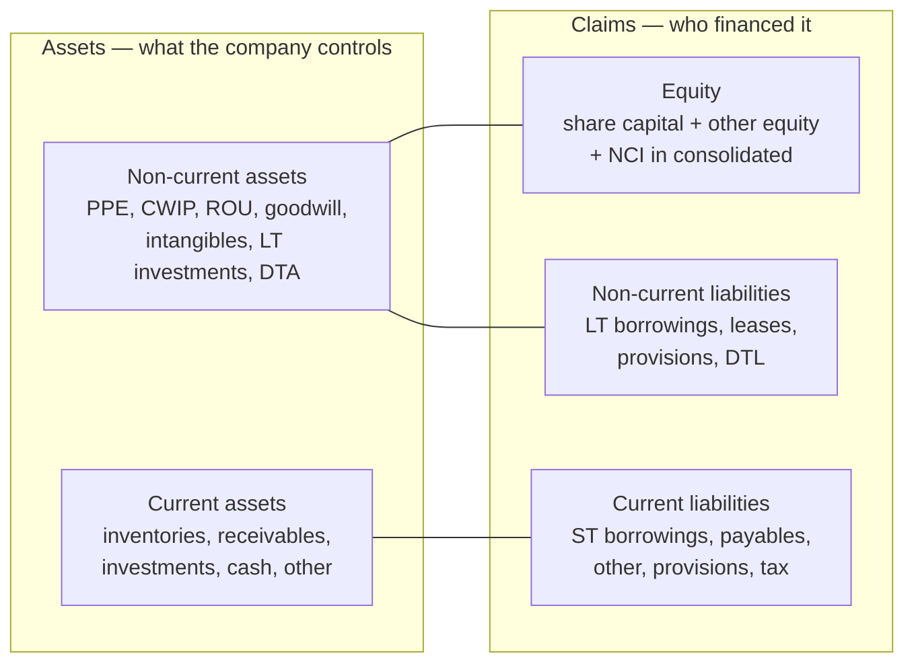

# 02.4 · The balance sheet, line by line

> **Why this matters:** the income statement tells you what a company earned; the balance sheet tells you what it
> had to tie up to earn it, who financed that, and what could go wrong. Every return-on-capital ratio, every
> leverage test and every equity-value bridge in a DCF starts from this one page.

**Learning objectives** — after this lesson you can:

- Read a Schedule III (Division II) balance sheet top to bottom and say, for every line, what it is, how it is
  measured and which note holds the detail.
- Classify an item as current or non-current, and as operating or financing, and compute net working capital,
  net debt, capital employed, invested capital and book value per share for Kaveri Pumps FY26.
- Roll forward PP&E, CWIP, right-of-use assets, intangibles and other equity between two balance sheets and
  explain what moved each one.
- Explain which assets sit at historical cost and which at fair value under Ind AS, and estimate what a
  cost-based number might be hiding.
- List what is *not* on the balance sheet (home-grown brands, people, contingent liabilities, guarantees,
  promoter-level risks) and size those items for Kaveri from its notes.
- Explain the MSME-dues split in trade payables and why it matters for cash tax.

**Prerequisites:** [02.1 The accounting equation & double entry](01-the-accounting-equation.md),
[02.3 The income statement, line by line](03-the-income-statement.md)  ·  **Time:** ~100 min

---

## 1. What a balance sheet is — and three ways to read it

A **balance sheet** (Ind AS calls it the *balance sheet*; IFRS says *statement of financial position*) is a
photograph of a company at one instant — for Indian companies, usually midnight on 31 March. It lists what the
company controls (**assets**), what it owes to outsiders (**liabilities**) and the residual that belongs to
shareholders (**equity**). You met the identity in [02.1](01-the-accounting-equation.md):

$$\text{Assets} = \text{Liabilities} + \text{Equity}$$

The single most useful mental model is **stocks versus flows**. The income statement and cash-flow statement are
*flows* — water running in and out over a year. The balance sheet is a *stock* — the level of water in the tank at
the moment you look. Two balance sheets a year apart, plus the flows in between, must reconcile exactly; that is the
whole subject of [02.6](06-linking-the-three-statements.md).

There are three ways to read the same page, and a good analyst switches between them without thinking.

**Reading 1 — resources and claims.** The left side is what the company owns or controls; the right side is who
has a claim on it and in what order. Lenders and suppliers come first; shareholders get whatever is left.

**Reading 2 — uses and sources of money.** The right side is where money came from (shareholders' capital and
retained profits, banks, bondholders, suppliers who gave credit); the left side is where it was put (factories,
inventory, money owed by customers, cash).

**Reading 3 — operating versus financing (the analyst's reading).** Split every line into *operating* (needed to
run the business: plant, inventory, receivables, minus the free credit that suppliers and customers give) and
*financing* (debt, cash, liquid investments, equity). Then

$$\underbrace{\text{Net operating assets}}_{\text{invested capital}} \;=\; \underbrace{\text{Net debt} + \text{Equity} + \text{other financing claims}}_{\text{how it was financed}}$$

This reformulation is what you will use for ROIC in [04.3](../04-financial-analysis/03-returns-on-capital.md) and for
the equity bridge in [06.3](../06-valuation/03-dcf-step-by-step.md). For Kaveri at 31-Mar-2026 (all ₹ Cr, from the
[running example](../appendix/running-example/kaveri-pumps.md)):

| Operating side | ₹ Cr | Financing side | ₹ Cr |
|:--|--:|:--|--:|
| Net block (PP&E) | 495.3 | Total equity | 706.1 |
| CWIP | 2.0 | Borrowings (92.0 + 96.0) | 188.0 |
| Right-of-use assets | 16.5 | Lease liabilities | 18.2 |
| Intangible assets | 8.0 | Deferred tax liability | 22.0 |
| Net working capital (see §9) | 365.0 | Less: cash & cash equivalents | (32.5) |
| | | Less: current investments | (15.0) |
| **Invested capital** | **886.8** | **Financing, net** | **886.8** |

Both columns come to ₹886.8 Cr — not a coincidence but the accounting identity rearranged. (We park the deferred
tax liability with financing because it is a non-interest-bearing claim of the tax authority; other conventions
exist, and [04.3](../04-financial-analysis/03-returns-on-capital.md) discusses them.)



## 2. The Schedule III format

Indian companies do not choose their own layout. Section 129 of the Companies Act, 2013 requires financial
statements in the form set out in **Schedule III**, which has three divisions:

- **Division I** — companies still on the older Indian GAAP (the Companies (Accounting Standards) Rules; mostly
  smaller unlisted companies — see [02.9](09-ind-as-ifrs-us-gaap.md)).
- **Division II** — companies on **Ind AS** other than NBFCs. This is what almost every listed non-financial
  company you will analyse uses, and what this lesson follows.
- **Division III** — NBFCs on Ind AS (lenders present a different balance sheet — loans, borrowings, ECL — which
  [07.1](../07-special-valuation/01-banks-and-nbfcs.md) covers using Nirmal Finance).

Unlike a US 10-K (which lists current assets first, in order of liquidity), the Indian format starts with
**non-current assets**, then current assets; on the other side, **equity** first, then non-current and current
liabilities. Division II prescribes these captions (source: Schedule III Division II, as reproduced by
[ComplianceIndia](https://complianceindia.co.in/schedule-iii-general-instruction-for-preparation-of-balance-sheet-statement-of-profit-loss-of-a-company-division-ii/);
verified Sep-2026):

| Block | Captions, in order |
|:--|:--|
| Non-current assets | Property, plant and equipment · Capital work-in-progress · Investment property · Goodwill · Other intangible assets · Intangible assets under development · Biological assets other than bearer plants · Financial assets (investments, trade receivables, loans, others) · Deferred tax assets (net) · Other non-current assets |
| Current assets | Inventories · Financial assets (investments, trade receivables, cash and cash equivalents, bank balances other than cash and cash equivalents, loans, others) · Current tax assets (net) · Other current assets |
| Equity | Equity share capital · Other equity (plus non-controlling interests in consolidated statements) |
| Non-current liabilities | Financial liabilities (borrowings, lease liabilities, trade payables, other financial liabilities) · Provisions · Deferred tax liabilities (net) · Other non-current liabilities |
| Current liabilities | Financial liabilities (borrowings, lease liabilities, trade payables — split into dues of micro & small enterprises and others — other financial liabilities) · Other current liabilities · Provisions · Current tax liabilities (net) |

Three things about this format trip up newcomers.

**"Financial" vs "other".** A **financial asset** is, roughly, a contractual right to receive cash (a receivable, a
loan given, a deposit, an investment); a **financial liability** is a contractual obligation to pay cash (a loan, a
payable). They are separated from "other" assets and liabilities — such as an advance paid to a supplier (you expect
goods, not cash) or GST input credit — because Ind AS 109 measures financial items differently. When an old report
or an aggregator says "**loans and advances**", it is using the pre-Ind AS vocabulary of Division I, which lumped
financial loans and non-financial advances together.

**Current vs non-current.** Under Ind AS 1, an asset is **current** if it will be realised, sold or consumed within
the company's normal **operating cycle** or within 12 months, is held for trading, or is cash. A liability is current
if it is due within 12 months (or within the operating cycle) or the company has no right to defer settlement beyond
12 months. The operating cycle can exceed a year: a real-estate developer's four-year project inventory is still a
current asset. Note what this does to ratios — a builder can show a spectacular current ratio built on flats that
will not be sold for years.

**Where the detail lives.** Every caption carries a note number. The face of the balance sheet is a table of
contents; the notes are the book ([03.3](../03-reading-filings/03-notes-to-accounts.md) teaches you to read them in
order of importance).

!!! info "India notes"
    - **2021 amendments to Schedule III.** The MCA notification of 24-Mar-2021 (effective for financial years
      starting on or after 1-Apr-2021) added, among others: ageing schedules for trade receivables, trade payables,
      CWIP and intangibles under development; promoter shareholding and its changes; title deeds of immovable
      property not held in the company's name; loans to promoters, directors, KMP and related parties; eleven
      ratios with explanations for any change above 25%; relationships with struck-off companies; wilful-defaulter
      status; and current maturities of long-term debt shown within current borrowings
      ([Vinod Kothari Consultants summary](https://vinodkothari.com/2021/03/mca-introduces-a-cartload-of-additional-disclosures-in-the-financial-statements/),
      verified Sep-2026). These ageing schedules are gold for analysts — Kaveri's ">6 months overdue" receivables
      number comes from exactly this kind of disclosure.
    - **Half-yearly balance sheets.** A listed company must include a statement of assets and liabilities as at the
      half-year end, as a note to its half-yearly results — SEBI LODR Regulation 33(3)(f)
      ([text via CAIRR](https://ca2013.com/lodr-regulation-33/), verified Sep-2026). So you get a balance sheet in
      the Q2 (September) and Q4 (March) results, not every quarter.

## 3. Non-current assets, line by line

### 3.1 Property, plant and equipment (PP&E)

**PP&E** is tangible assets used for more than a year to produce goods or services: land, buildings, plant and
machinery, furniture, vehicles, computers. Three numbers matter:

- **Gross block** — the historical cost of everything still owned (purchase price + import duties + installation
  and commissioning + borrowing costs capitalised during construction, a topic for
  [02.7](07-deeper-cuts-assets-and-expenses.md)).
- **Accumulated depreciation** — the total depreciation charged on those assets since they were bought.
- **Net block** = gross block − accumulated depreciation (− any impairment). This is what the face of the Ind AS
  balance sheet shows; the note shows the full movement.

Land is not depreciated (it does not wear out). Kaveri FY26: gross block ₹830.0 Cr, accumulated depreciation
₹334.7 Cr, net block ₹495.3 Cr. The ratio of accumulated depreciation to the *depreciable* gross block is a crude
**age indicator**: Kaveri's land is ₹18.0 Cr at cost (₹22.0 Cr at 31-Mar-2020 less the ₹4.0 Cr parcel sold in
FY25), so 334.7 / (830.0 − 18.0) = 41.2% of the depreciable asset base has already been written off. A ratio creeping
towards 70–80% tells you the plant is old and a replacement capex cycle may be coming.

### 3.2 Capital work-in-progress (CWIP)

**CWIP** is capex on assets that are not yet ready for use — a factory under construction, a machine being
installed. It is **not depreciated** (the asset is not in use), and when the asset is commissioned the amount is
transferred into gross block, after which depreciation starts.

Kaveri shows the whole life cycle. CWIP rose to ₹68.0 Cr at FY23 while the Hosur motors plant was being built; at
end-FY24 the plant was commissioned (cost ~₹190 Cr), CWIP fell to ₹0.0 and gross block jumped from ₹518.0 Cr to
₹734.0 Cr (+₹216.0 Cr, of which the plant is the bulk). PP&E depreciation then stepped up from ₹25.8 Cr in FY24 to
₹37.0 Cr in FY25 — the first full year of depreciating Hosur.

Two things to watch. First, the CWIP ageing schedule: a project stuck in CWIP for three years either has a problem
or is a place to park costs that should have been expensed ([09.3](../09-forensics/03-expense-and-asset-red-flags.md)).
Second, CWIP earns nothing yet, so a big CWIP balance depresses return on capital today and flatters depreciation;
analysts often exclude it from capital employed when judging the *existing* business.

### 3.3 Investment property

Land or buildings held to earn rent or for capital appreciation, not for use in the business. Under **Ind AS 40**
only the **cost model** is allowed (IFRS also permits a fair-value model), but the fair value must be disclosed in the
notes ([MCA, Ind AS 40](https://www.mca.gov.in/Ministry/pdf/IndAS40_2019.pdf); verified Sep-2026). That note is one
of the few places a cost-based Indian balance sheet tells you what something is actually worth.

### 3.4 Right-of-use (ROU) assets

Since **Ind AS 116** (notified 30-Mar-2019, applicable from 1-Apr-2019, i.e. FY20), a lessee recognises almost every
lease longer than 12 months on its balance sheet: an **ROU asset** (the right to use the shop, warehouse or vehicle)
and a matching **lease liability** (the present value of the rent it has promised to pay). Kaveri: ROU assets
₹16.5 Cr, lease liabilities ₹18.2 Cr. The ROU asset is amortised (₹4.7 Cr in FY26); the liability accrues interest
(₹1.4 Cr) and is paid down by rent. Why this rule changed EBITDA for retailers and airlines is covered in
[02.7](07-deeper-cuts-assets-and-expenses.md); for now, note that a lease liability is debt in all but name and
belongs in net debt for valuation (the [reference valuation](../appendix/running-example/kaveri-valuation.md)
deducts Kaveri's ₹18.2 Cr in the equity bridge).

### 3.5 Goodwill and other intangible assets

**Intangible assets** are identifiable non-physical assets the company controls and that will produce future
benefits: software, licences, patents, acquired brands and trademarks, acquired customer relationships. Kaveri's are
small (₹8.0 Cr, mostly software). **Intangible assets under development** is the intangible equivalent of CWIP.

**Goodwill** is different: it arises *only* when a company buys another business, and equals the price paid minus
the fair value of the identifiable net assets acquired. It is what you paid for things you cannot separately
identify — synergies, an assembled workforce, market position. Under Ind AS it is **not amortised**; instead it is
tested for impairment at least annually ([02.7](07-deeper-cuts-assets-and-expenses.md) and
[02.8](08-deeper-cuts-group-accounts-and-other.md)). Kaveri has no goodwill line, which suggests it has never bought
a business for more than its identifiable net assets.

The single most important rule about intangibles: **brands, customer lists and know-how that a company builds
itself are not recognised** (Ind AS 38). Only *acquired* ones are. This creates a striking asymmetry.

!!! example "Worked example 1 — HUL: the brands you buy versus the brands you build"
    On 1-Apr-2020 Hindustan Unilever (HUL) completed its all-equity merger with GlaxoSmithKline Consumer
    Healthcare (GSK CH), issuing 4.39 HUL shares per GSK CH share, and separately bought the Indian Horlicks
    intellectual-property rights for cash. Source: [HUL Integrated Annual Report 2020-21](https://www.hul.co.in/files/92ui5egz/production/deffeb1a406d0dda5445caa3d5731b849a137bf1.pdf),
    standalone balance sheet and Notes 4 and 40 (₹ crore).

    | HUL standalone, ₹ Cr | 31-Mar-2020 | 31-Mar-2021 |
    |:--|--:|--:|
    | Goodwill | 36 | 17,316 |
    | Other intangible assets | 395 | 27,925 |
    | Total assets | 19,602 | 68,116 |
    | Other equity | 7,815 | 47,199 |
    | Deferred tax liabilities (net) | – | 5,986 |

    Note 40 allocates the ₹40,242 Cr of net assets acquired in the merger: right to use the Horlicks brand
    ₹19,274 Cr, Boost trademark ₹4,800 Cr, other identifiable assets less liabilities (including a ₹6,132 Cr
    deferred tax liability), and **goodwill of ₹17,265 Cr**. The Horlicks IPR purchase added a further ₹3,136 Cr to
    intangibles (a ₹3,045 Cr price plus ₹91 Cr of transaction costs).

    Arithmetic: goodwill plus other intangibles = 17,316 + 27,925 = ₹45,241 Cr = **66.4%** of total assets. Almost
    two-thirds of HUL's balance sheet became brands and goodwill overnight.

    The lesson: brands HUL built itself over decades carry essentially nothing on the balance sheet, while the
    brands it *bought* sit at their acquisition-date fair values. Two companies with identical economics can
    show wildly different book values, ROE and ROCE depending on whether they grew organically or by acquisition.
    When you compute returns for an acquirer, compute them both with and without goodwill and acquired
    intangibles ([04.3](../04-financial-analysis/03-returns-on-capital.md)).

### 3.6 Biological assets other than bearer plants

Living animals or plants held for agricultural activity (livestock, growing produce). **Bearer plants** that
merely produce crops year after year — tea bushes, rubber trees — are treated as PP&E instead; the tea leaves
growing on them are the biological asset. Relevant only for plantation and agri companies.

### 3.7 Non-current financial assets

- **Investments** — in a *standalone* balance sheet, investments in subsidiaries, associates and joint ventures are
  usually carried **at cost**; other equity investments are carried at **fair value** (through profit or loss, or
  through OCI if the company so elects). Large "investments in subsidiaries" in a standalone balance sheet are a
  signal to read the consolidated statements ([02.8](08-deeper-cuts-group-accounts-and-other.md)).
- **Loans** — money lent to subsidiaries, group companies, employees. Loans to promoter-group entities are a classic
  leak of minority shareholders' money ([05.6](../05-business-analysis/06-corporate-governance-india.md)).
- **Other financial assets** — security deposits (e.g., with landlords and electricity boards), bank deposits with
  more than 12 months to maturity, derivative assets.

### 3.8 Deferred tax assets (net) and other non-current assets

**Deferred tax assets/liabilities** arise when the tax books and the accounting books recognise the same income or
expense in different years — [02.8](08-deeper-cuts-group-accounts-and-other.md) builds the intuition. Kaveri shows a
net **deferred tax liability** of ₹22.0 Cr on the other side; in Indian manufacturers this typically comes from tax
depreciation running faster than book depreciation (the reference page does not give Kaveri's breakdown).

**Other non-current assets** is a bucket that deserves a glance every year: **capital advances** (money paid to
equipment suppliers before delivery — legitimate for a company in a capex cycle, suspicious if large, old and paid
to related parties), balances with government authorities (for example, taxes paid under protest), and long-term
prepaid expenses.

## 4. Current assets, line by line

| Caption | What it is | How it is measured | What to look for |
|:--|:--|:--|:--|
| **Inventories** | Raw materials, work-in-progress, finished goods, stock-in-trade (goods bought for resale), stores & spares | Lower of cost and **net realisable value** (expected selling price less costs to complete and sell) | Growth vs sales; the split (finished goods piling up = demand problem); write-downs. Kaveri: ₹188.1 Cr = 80 days of material cost |
| **Current investments** | Short-term treasury holdings — in India typically liquid/overnight debt mutual funds | Fair value through profit or loss | Is it genuinely liquid? Kaveri: ₹15.0 Cr of liquid funds, down from ₹30.0 Cr |
| **Trade receivables** | Amounts customers owe for goods/services already invoiced | Invoice amount less an **expected credit loss (ECL) allowance** | Growth vs revenue; ageing; disputed dues; concentration. Kaveri: ₹346.7 Cr, +28.6% vs revenue +12.5% |
| **Cash and cash equivalents** | Cash, demand deposits, and highly liquid investments with an original maturity of ≤3 months | Face value | Whether it is actually available (see next row) |
| **Bank balances other than cash & cash equivalents** | Fixed deposits of 3–12 months; earmarked balances (unpaid-dividend accounts); **margin money** held against bank guarantees or letters of credit | Face value | Earmarked and margin-money deposits are *not free cash* — exclude them from net debt |
| **Loans** (current) | Short-term loans given (employees, group companies) | Amortised cost less ECL | Loans to related parties |
| **Other financial assets** | Interest accrued, security deposits, derivative assets, sometimes unbilled revenue | Mostly amortised cost; derivatives at fair value | Rising unbilled revenue ([02.2](02-accrual-accounting-and-revenue-recognition.md)) |
| **Current tax assets (net)** | Advance tax paid in excess of the tax provision | Amount paid | Large refunds stuck with the tax department |
| **Other current assets** | Advances to suppliers, prepaid expenses, GST input-tax credit, contract assets | Cost | A fast-growing "other" bucket is a soft asset ([09.3](../09-forensics/03-expense-and-asset-red-flags.md)). Kaveri: ₹39.5 Cr |
| **Assets held for sale** | Assets the company has decided to sell within a year | Lower of carrying amount and fair value less costs to sell | Signals a disposal or exit |

Two measurement ideas deserve a sentence each. **Net realisable value** exists so that a company cannot keep
obsolete stock at cost — if a motor model is discontinued and will sell only at a discount, inventory must be written
down. **Expected credit loss** means the receivable is shown net of the losses the company expects on it, not just
losses that have already happened. Kaveri's ECL allowance at FY26 is ₹4.0 Cr. Schedule III balance sheets show
receivables net of this allowance, so we read Kaveri's ₹346.7 Cr as net; gross receivables are then ≈₹350.7 Cr. Of
the gross, ₹62.4 Cr (17.8%) is overdue by more than six months, mostly from two state nodal agencies, and the
allowance covers only 4.0 / 62.4 = 6.4% of that bucket. That single comparison is one of the central questions of the
Kaveri story ([09.2](../09-forensics/02-revenue-red-flags.md)).

## 5. Equity

**Equity** is the shareholders' residual claim: assets minus liabilities. It has two captions.

**Equity share capital** is the number of shares issued multiplied by their **face value** (a nominal legal amount,
unrelated to the market price). Kaveri: 6.00 crore shares × ₹5 = ₹30.0 Cr. The note distinguishes *authorised*
capital (the ceiling in the company's charter), *issued* and *subscribed*, and *paid-up* capital, and — since the 2021
amendments — shows the promoters' shareholding and how it changed during the year.

**Other equity** is everything else, and its components tell different stories:

| Component | Where it comes from | Why you care |
|:--|:--|:--|
| **Securities premium** | Shares issued above face value: the excess over face value | Contributed capital, not earned. Section 52 of the Companies Act restricts its use (e.g., bonus issues, buybacks, share-issue expenses) — it cannot fund a normal dividend |
| **Retained earnings** (surplus in P&L) | Cumulative PAT minus dividends and transfers | The bridge between P&L and balance sheet ([02.1](01-the-accounting-equation.md)); distributable reserves |
| **General reserve** | Legacy transfers from profit (once customary in India) | Economically the same as retained earnings |
| **Capital redemption reserve** | Created when shares are bought back out of free reserves | Signals past buybacks |
| **Capital reserve** | Gains of a capital nature (e.g., bargain purchase on an acquisition) | Usually not distributable |
| **Share options outstanding** | Cumulative ESOP expense not yet exercised | The equity side of the non-cash ESOP charge |
| **OCI reserves** | Fair-value changes on FVOCI equity investments, cash-flow-hedge reserve, foreign-currency translation reserve, revaluation surplus | Gains and losses that bypassed profit ([02.3](03-the-income-statement.md), [02.8](08-deeper-cuts-group-accounts-and-other.md)) |
| **Money received against share warrants** | Upfront money (typically 25%) on warrants, often issued to promoters | Future dilution ([01.3](../01-markets-101/03-raising-and-returning-capital.md)) |

Kaveri's reference page does not split its ₹676.1 Cr of other equity, but you can reconstruct how it grew. Share
capital was unchanged at ₹30.0 Cr through FY21–FY26, so no new equity was raised; other equity rose from ₹344.0 Cr
(31-Mar-2020) to ₹676.1 Cr, an increase of ₹332.1 Cr = cumulative PAT 416.9 − dividends 90.0 + share-based payment
expense 5.2 (0.8 + 2.0 + 2.4 in FY24–FY26). A real note would show that ₹5.2 Cr as "share options outstanding", and
might reveal that part of the opening ₹344.0 Cr is securities premium from the IPO era.

**Reserves are not cash.** This is the most common beginner error in Indian markets, where headlines say "company
X has reserves of ₹Y crore". A reserve is a *claim* on the right-hand side; the money was long ago spent on plant,
inventory or receivables. HUL makes the point vividly: in FY21 its other equity rose by 47,199 − 7,815 =
₹39,384 Cr, of which ≈₹40,200 Cr came from shares issued for the GSK CH merger (after adding back the year's
dividends and removing PAT and OCI) — while its cash and cash equivalents actually *fell*, from ₹3,130 Cr to
₹1,740 Cr.

**Non-controlling interests (NCI)** appear only in consolidated statements: the share of a subsidiary's net assets
owned by outside shareholders (if the parent owns 70%, the other 30% is NCI). Ind AS presents NCI inside equity, but
for valuation it is a claim that does not belong to *your* shares and is deducted in the equity bridge
([01.2](../01-markets-101/02-shares-market-cap-and-enterprise-value.md)). Kaveri has none.

**Book value per share** = total equity attributable to owners ÷ shares outstanding. Kaveri FY26: 706.1 / 6.00 =
₹117.7. At ₹390 the stock trades at 390 / 117.7 = **3.3× book**. Equity movements over the year are shown in the
**statement of changes in equity**, a fourth primary statement that most beginners skip and should not.

## 6. Liabilities, line by line

### 6.1 Borrowings

**Non-current borrowings** are debt due after 12 months: term loans from banks, **non-convertible debentures
(NCDs)**, external commercial borrowings (ECBs, foreign-currency loans). **Current borrowings** include
working-capital facilities (**cash credit/overdraft**, working-capital demand loans, packing credit for exporters),
commercial paper, bills discounted with recourse, and — per the 2021 amendment — the **current maturities** of
long-term debt. The borrowings note gives security (which assets are charged), interest rates, repayment schedules
and covenants; [04.5](../04-financial-analysis/05-leverage-solvency-liquidity.md) shows how to use it.

Kaveri FY26: term loans ₹92.0 Cr (down ₹20.0 Cr as it repaid Hosur debt) and current borrowings ₹96.0 Cr (up ₹38.0 Cr,
+65.5%). Short-term debt is now 51% of total debt, up from 34% a year earlier. Short-term borrowing rising while
long-term debt is repaid, in a year when receivables jumped ₹77.0 Cr, says the working-capital lines are funding
customers who are paying slowly.

### 6.2 Lease liabilities

Present value of future lease payments (§3.4). Division II asks for a split between the non-current and current
portions; Kaveri's reference page shows one line of ₹18.2 Cr, and we keep it in the non-current block for simplicity.

### 6.3 Trade payables — and the MSME split

**Trade payables** are amounts owed to suppliers for goods and services received. They are free financing — the
supplier is funding your inventory — which is why payables *reduce* working capital. Kaveri: ₹143.4 Cr, 61 days of
material cost.

Schedule III requires payables to be split into **"total outstanding dues of micro enterprises and small
enterprises"** and **"others"**, with an ageing schedule. HUL's FY21 standalone balance sheet, for example, shows
₹64 Cr owed to micro and small enterprises (MSEs) against ₹8,563 Cr to others
([HUL AR 2020-21](https://www.hul.co.in/files/92ui5egz/production/deffeb1a406d0dda5445caa3d5731b849a137bf1.pdf)).
The split matters for three reasons:

1. **The MSMED Act, 2006.** Section 15 requires a buyer to pay an MSE supplier within the agreed period and never
   later than **45 days** from acceptance (15 days if there is no written agreement); Section 16 imposes compound
   interest at three times the RBI bank rate on late payments; Section 22 requires the unpaid principal and interest
   to be disclosed in the audited accounts; and Section 23 makes that interest non-deductible for tax
   ([IBC Laws, s.22](https://ibclaw.in/section-22-requirement-to-specify-unpaid-amount-with-interest-in-the-annual-statement-of-accounts/),
   [IBC Laws, s.23](https://ibclaw.in/section-23-interest-not-to-be-allowed-as-deduction-from-income/); verified Sep-2026).
2. **Cash tax.** Since FY24, an amount owed to a registered micro or small enterprise and not paid within the MSMED
   time limit is deductible only in the year it is actually paid (old Section 43B(h) of the Income-tax Act, 1961).
   The Income-tax Act, 2025 replaced the 1961 Act from 1-Apr-2026
   ([Wikipedia](https://en.wikipedia.org/wiki/Income-tax_Act,_2025)); secondary sources report the MSE rule carried
   into **Section 37(2)(g)** of the new Act ([Busy](https://busy.in/accounting/section-43bh-msme-payment-rule-and-45-day-limit-explained/),
   Sep-2026). Verify the section number on the Income Tax Department's site before relying on it.
3. **Analytical signal.** A company that stretches small suppliers beyond 45 days is either cash-strapped or
   exploiting bargaining power — and pays a tax cost for it.

*Mini-example.* A manufacturer taxed at 25.17% owes ₹12.0 Cr to MSE suppliers that is more than 45 days old at
31 March. The ₹12.0 Cr is added back to taxable income this year: extra current tax = 12.0 × 25.17% = **₹3.02 Cr**,
recovered (as a deduction) in the year the suppliers are paid. Profit is barely affected (a deferred tax asset is
recognised); cash is. A trade-payables number that falls sharply in the March quarter of FY24 and later can simply be
companies paying MSEs before year-end to protect the deduction — a working-capital effect you should not
extrapolate.

### 6.4 Other financial liabilities, provisions, deferred tax, other liabilities

- **Other financial liabilities** — capital creditors (amounts owed for capex already received), interest accrued,
  unpaid dividends, security deposits taken from dealers, derivative liabilities.
- **Provisions** — liabilities of uncertain timing or amount that meet the Ind AS 37 test (a present obligation from
  a past event, an outflow that is *probable*, and a reliable estimate): employee benefits (gratuity, leave
  encashment), product warranties, restoration obligations. A provision released back to profit is a lever
  management can pull ([09.3](../09-forensics/03-expense-and-asset-red-flags.md)).
- **Deferred tax liabilities (net)** — tax that will become payable later because of timing differences (§3.8).
- **Other current liabilities** — **advances from customers** and **contract liabilities** (cash received before
  revenue is earned — see [02.2](02-accrual-accounting-and-revenue-recognition.md)), statutory dues (GST, TDS,
  provident fund), deferred government grants.
- **Current tax liabilities (net)** — tax provision in excess of advance tax paid.

Kaveri's reference page combines the operating items into "Other current liabilities & provisions" (₹65.9 Cr) and
shows no tax payable line, which is why its current tax (₹29.5 Cr) equals tax paid in the cash-flow statement.

## 7. How the numbers are measured: historical cost versus fair value

A balance sheet is not a valuation. It is a **mixed-attribute** document — different lines use different yardsticks:

| Item | Measurement basis under Ind AS | Consequence |
|:--|:--|:--|
| PP&E | Cost less depreciation and impairment (revaluation model permitted but rare) | Land bought decades ago sits at a fraction of its value |
| Investment property | Cost only; fair value disclosed in notes | Read the note |
| Goodwill, indefinite-life brands | Cost less impairment; not amortised | Stays until written down — often late |
| Inventories | Lower of cost and NRV | Conservative, asymmetric |
| Trade receivables, loans | Amortised cost less expected credit loss | Depends on management's loss estimates |
| Liquid mutual funds, most equity investments | Fair value (through P&L or OCI) | Marked to market |
| Derivatives | Fair value | Marked to market or to model |
| Borrowings | Amortised cost (effective interest method) | Not marked to market when rates move |
| Provisions | Best estimate, discounted if material | Judgement-heavy |

Why keep historical cost at all? Because it is *verifiable* — an invoice exists — and it stops managements from
writing up assets to flatter equity. The price is that the balance sheet goes stale. **Ind AS 101** allowed companies
adopting Ind AS (in India, from FY17 onwards) to use fair value as the **deemed cost** of PP&E on transition; some
companies revalued land once at that point, permanently lifting book value and depressing ROE. When a company's equity
jumps in its Ind AS transition year, read the reconciliation note before comparing ROE across the break.

!!! example "Worked example 2 — the land Kaveri still owns"
    In FY25 Kaveri sold a land parcel with a book value of ₹4.0 Cr for ₹18.0 Cr, booking a ₹14.0 Cr exceptional
    gain. Proceeds were 18.0 / 4.0 = **4.5×** book value.

    Kaveri's remaining land is ₹22.0 − 4.0 = **₹18.0 Cr** at cost. *What if* (an illustration, not a fact about
    the land) the rest were worth the same 4.5× book?

    - Implied value = 18.0 × 4.5 = ₹81.0 Cr; hidden surplus = 81.0 − 18.0 = **₹63.0 Cr** before tax on the gain.
    - Per share: 63.0 / 6.00 = **₹10.5**, about 2.7% of the ₹390 price.

    Or suppose a valuer says the land is worth ₹90.0 Cr. Adjusted book value = 706.1 + (90.0 − 18.0) = ₹778.1 Cr,
    or ₹129.7 per share, and P/B at ₹390 falls from 3.3× to 3.0×. Useful context, but it changes little: Kaveri is
    valued on its earnings, not its land. Where land *is* the thesis (old textile mills, some PSUs, real estate),
    this adjustment becomes the main event ([06.7](../06-valuation/07-other-valuation-methods.md)).

!!! tip "Trader's lens"
    Treat the balance sheet as an end-of-day position report with **inconsistent marks**. Some positions are
    marked to market (liquid funds, derivatives), some to model (ECL allowance, goodwill impairment tests,
    gratuity actuarial valuations), and the biggest ones are held at cost (plant, land). You would never
    aggregate such a book without re-marking it; do the same here. And remember it is a *single timestamp*: a
    company can collect hard in the last week of March, delay supplier payments and pay down its cash-credit line
    on 31 March, then redraw on 1 April — the quarter-end window-dressing that fund NAVs are also accused of.
    Average balances and half-yearly balance sheets help you see through it.

## 8. What is *not* on the balance sheet

Much of what makes a business valuable — or dangerous — never appears on the face of the balance sheet.

**Home-grown intangibles.** Brands, distribution networks, customer relationships, software built in-house,
know-how and people. Research spending is expensed (development can be capitalised only under strict conditions —
[02.7](07-deeper-cuts-assets-and-expenses.md)). This is why the market value of good businesses runs far above book:
Kaveri at ₹390 has a market capitalisation of 390 × 6.00 = ₹2,340 Cr against book equity of ₹706.1 Cr — ₹1,633.9 Cr
of value the market ascribes to things the accountants do not record (or, the sceptic says, ₹1,633.9 Cr of optimism).

**Contingent liabilities.** Under Ind AS 37, a **contingent liability** is a *possible* obligation whose existence
depends on uncertain future events (a tax demand under appeal, a lawsuit), or a present obligation where an outflow
is not probable or cannot be measured. It is **disclosed in the notes, not recognised**. Kaveri FY26:

| Kaveri off-balance-sheet items (FY26 notes) | ₹ Cr | Per share (₹) | vs equity 706.1 |
|:--|--:|--:|--:|
| GST demand under appeal (solar rate classification) | 38.0 | 6.3 | 5.4% |
| Income-tax disputes | 11.0 | 1.8 | 1.6% |
| **Contingent liabilities** | **49.0** | **8.2** | **6.9%** |
| Bank guarantees given (performance/tender) | 96.0 | 16.0 | 13.6% |

The GST dispute is new in FY26 and tied to the solar business; an analyst would read the note, estimate a
probability of losing and treat the expected amount as quasi-debt in valuation.

**Guarantees and commitments.** Performance **bank guarantees** (Kaveri: ₹96.0 Cr, growing with solar tenders) are
not liabilities unless invoked, but they consume the company's non-fund bank limits and are usually backed by margin
money. **Capital commitments** (contracts signed for capex not yet delivered) show what is coming. Guarantees given for
group companies' loans are a governance flag even when their accounting value is small.

**Off-balance-sheet funding.** Receivables sold to a bank or factor *without recourse* leave the balance sheet;
**supplier finance** (reverse factoring) can make payables look like ordinary trade credit when they are really bank
funding. Ind AS 7 now requires specific supplier-finance disclosures (paragraphs 44F–44H, for periods beginning on or
after 1-Apr-2025; [Taxmann](https://www.taxmann.com/post/blog/enhanced-disclosure-rules-for-supplier-finance-arrangements-under-ind-as-7),
verified Sep-2026). [04.5](../04-financial-analysis/05-leverage-solvency-liquidity.md) and
[09.4](../09-forensics/04-cash-flow-games.md) go deeper.

**Things that belong to the promoters.** A **promoter pledge** (Kaveri: 6% of promoter shares, created Nov-2025) is
the promoters' borrowing, not the company's — but a margin call can crash the share price and change control.
Assets inside promoter-owned entities are also invisible: Kaveri Castings Pvt Ltd supplies 10.4% of Kaveri's
material cost, so part of Kaveri's real production capacity sits in a company minority shareholders do not own.

**Economic assets the rules ignore.** Kaveri's unexecuted solar order book of ₹410 Cr (1.15× FY26 solar revenue) is
valuable information and appears nowhere in the balance sheet.

## 9. The annotated Kaveri FY26 balance sheet

Everything above, applied to one real-looking document. The table re-orders Kaveri's reference balance sheet into
the Schedule III sequence (₹ Cr; % = share of FY26 total assets).

| Schedule III caption | FY25 | FY26 | Change | % of TA | What to notice |
|:--|--:|--:|--:|--:|:--|
| **Non-current assets** | | | | | |
| Property, plant & equipment (net block) | 484.9 | 495.3 | 10.4 | 43.3% | Gross block 830.0 less acc. dep. 334.7; Hosur plant inside |
| Capital work-in-progress | 4.0 | 2.0 | (2.0) | 0.2% | No big project under way — capex is maintenance + automation |
| Right-of-use assets | 15.2 | 16.5 | 1.3 | 1.4% | Leased depots/vehicles; mirrors lease liability |
| Other intangible assets | 7.5 | 8.0 | 0.5 | 0.7% | Software; no goodwill → no acquisitions |
| **Current assets** | | | | | |
| Inventories | 161.3 | 188.1 | 26.8 | 16.4% | +16.6% vs revenue +12.5%; 80 days of material cost |
| Current investments (liquid funds) | 30.0 | 15.0 | (15.0) | 1.3% | Treasury halved to fund working capital |
| Trade receivables (net of ECL 4.0) | 269.7 | 346.7 | 77.0 | 30.3% | **The line of the year**: +28.6%, 96 days; ₹62.4 Cr >6 months |
| Cash & cash equivalents | 28.0 | 32.5 | 4.5 | 2.8% | Some of this may back bank guarantees (check note) |
| Other current assets | 35.2 | 39.5 | 4.3 | 3.5% | Advances, prepaid, GST credit — tracks revenue |
| **Total assets** | **1,035.8** | **1,143.6** | **107.8** | **100.0%** | |
| **Equity** | | | | | |
| Equity share capital | 30.0 | 30.0 | 0.0 | 2.6% | 6.00 Cr shares × ₹5 |
| Other equity | 607.2 | 676.1 | 68.9 | 59.1% | = 607.2 + PAT 90.5 − dividends 24.0 + ESOP 2.4 |
| **Non-current liabilities** | | | | | |
| Borrowings (term loans) | 112.0 | 92.0 | (20.0) | 8.0% | Hosur loan amortising |
| Lease liabilities | 16.7 | 18.2 | 1.5 | 1.6% | Debt-like; in net debt for valuation |
| Deferred tax liabilities (net) | 21.0 | 22.0 | 1.0 | 1.9% | = FY26 deferred tax charge of 1.0 |
| **Current liabilities** | | | | | |
| Borrowings (WC + current maturities) | 58.0 | 96.0 | 38.0 | 8.4% | +65.5%: funding the receivables |
| Trade payables | 132.3 | 143.4 | 11.1 | 12.5% | 61 days, *down* from 64 — suppliers not stretched further |
| Other current liabilities & provisions | 58.6 | 65.9 | 7.3 | 5.8% | Statutory dues, advances, warranty etc. |
| **Total equity & liabilities** | **1,035.8** | **1,143.6** | **107.8** | **100.0%** | |

**Roll-forwards — checking that every change is explained.** No asset was sold in FY26, so:

- *PP&E + CWIP:* additions to gross block = 830.0 − 780.0 = ₹50.0 Cr; CWIP fell by ₹2.0 Cr; so cash capex on PP&E =
  50.0 − 2.0 = **₹48.0 Cr** — exactly the "purchase of PP&E incl. CWIP" line in the cash-flow statement.
  Accumulated depreciation: 295.1 + 39.6 = 334.7 ✓.
- *ROU assets:* 15.2 + new leases − amortisation 4.7 = 16.5 → new leases = **₹6.0 Cr** (a non-cash addition).
- *Intangibles:* 7.5 + 4.0 purchased − 3.5 amortised = 8.0 ✓.
- *Other equity:* 607.2 + 90.5 − 24.0 + 2.4 = 676.1 ✓ (dividend paid = ₹4.0/share × 6.00 Cr shares).
- *Deferred tax liability:* 21.0 + 1.0 = 22.0 ✓.

**Derived numbers you will use in every later module** (verified in Python):

| Metric | Definition used in this course | FY25 | FY26 |
|:--|:--|--:|--:|
| Net working capital (NWC), ₹ Cr | Inventories + receivables + other current assets − payables − other current liabilities | 275.3 | 365.0 |
| NWC as % of revenue | | 23.5% | 27.7% |
| Net debt, ₹ Cr | Borrowings − cash − current investments | 112.0 | 140.5 |
| Net debt incl. leases, ₹ Cr | + lease liabilities | 128.7 | 158.7 |
| Capital employed, ₹ Cr | Equity + borrowings + lease liabilities | 823.9 | 912.3 |
| Invested capital, ₹ Cr | Net block + CWIP + ROU + intangibles + NWC | 786.9 | 886.8 |
| Current ratio | Current assets ÷ current liabilities | 2.11× | 2.04× |
| Debt / equity | Borrowings ÷ equity | 0.27× | 0.27× |
| Book value per share, ₹ | Equity ÷ 6.00 Cr shares | 106.2 | 117.7 |

**The story the balance sheet tells.** Total assets grew ₹107.8 Cr. Of that, receivables alone took ₹77.0 Cr and
inventories ₹26.8 Cr. The company paid for it by drawing ₹38.0 Cr more on working-capital lines and selling
₹15.0 Cr of liquid funds, while repaying ₹20.0 Cr of term debt. NWC jumped from 23.5% to 27.7% of revenue; net debt
rose from ₹112.0 Cr to ₹140.5 Cr despite a profitable year. None of this is visible in a P&L that shows ₹90.5 Cr of
profit — which is exactly why you read the balance sheet. [02.5](05-the-cash-flow-statement.md) shows the same story
from the cash side, and [04.4](../04-financial-analysis/04-working-capital-and-cash-conversion.md) turns it into days
and cash-conversion ratios.

```python
# Reproduce the derived table from the course data (runs offline)
import pandas as pd
k = pd.read_csv("tools/data/kaveri_pumps_annual.csv", index_col="line_item")  # same frame as tools/fi/data.py::load_kaveri()
for fy in ["FY25", "FY26"]:
    c = k[fy]
    nwc = c.inventory + c.receivables + c.oca - c.payables - c.ocl
    net_debt = c.lt_debt + c.st_debt - c.cash - c.cur_inv
    ic = c.net_block + c.cwip + c.rou + c.intangibles + nwc
    print(fy, round(nwc, 1), round(nwc / c.rev, 3), round(net_debt, 1), round(ic, 1), round(c.equity / 6.0, 1))
```

!!! warning "Common mistakes"
    - **Treating reserves as cash.** "Other equity" is a claim, not a bank balance. Look at the asset side to see
      where the money is.
    - **Taking every rupee of "cash" as free.** Margin money, earmarked unpaid-dividend accounts and deposits
      lien-marked to lenders are restricted. Read the cash and bank-balances notes before netting cash against debt.
    - **Forgetting lease liabilities (and other debt-like items) in net debt.** Also consider unpaid capital
      creditors, big customer advances that are really financing, and contingent liabilities you expect to crystallise.
    - **Comparing book values across organic growers and acquirers.** HUL's FY21 book value is two-thirds acquired
      brands and goodwill; a company that built its brands shows none of that.
    - **Reading one balance-sheet date for a seasonal business.** Kaveri's March balance sheet sits at the end of
      its peak Q4 season; averages or half-yearly balance sheets give a truer picture.
    - **Mixing standalone and consolidated numbers**, for example consolidated revenue with standalone receivables.
    - **Ignoring the notes.** The face of the balance sheet is a table of contents; the ageing schedules,
      borrowings terms and contingent liabilities live in the notes.

## Key terms

| Term | Meaning |
|:--|:--|
| **Balance sheet** | Snapshot of assets, liabilities and equity at a date; Assets = Liabilities + Equity |
| **Schedule III** | The Companies Act, 2013 format for financial statements; Division II for Ind AS non-financial companies |
| **Current / non-current** | Realised or settled within 12 months or the operating cycle, or not |
| **Operating cycle** | Time from buying inputs to collecting cash from customers |
| **Gross block / net block** | Historical cost of PP&E / cost less accumulated depreciation and impairment |
| **CWIP** | Capital work-in-progress: capex on assets not yet ready for use; not depreciated |
| **Right-of-use (ROU) asset** | A lessee's right to use a leased asset, recognised under Ind AS 116 |
| **Lease liability** | Present value of future lease payments; debt-like |
| **Goodwill** | Price paid for an acquired business minus fair value of its identifiable net assets |
| **Intangible asset** | Identifiable non-physical asset (software, acquired brand); home-grown brands are not recognised |
| **Investment property** | Property held for rent or appreciation; cost model only under Ind AS 40 |
| **Net realisable value (NRV)** | Estimated selling price less costs to complete and sell; inventory cap |
| **Expected credit loss (ECL) allowance** | Deduction from receivables for losses expected over their life |
| **Cash equivalents** | Highly liquid investments with original maturity ≤3 months |
| **Margin money** | Bank deposit pledged against guarantees or letters of credit; restricted cash |
| **Securities premium** | Amount received for shares above face value; restricted use under Section 52 |
| **Retained earnings** | Cumulative profits not paid out as dividends |
| **Non-controlling interest (NCI)** | Outside shareholders' share of a subsidiary's equity (consolidated only) |
| **Book value per share** | Equity attributable to owners ÷ shares outstanding |
| **MSE dues** | Trade payables owed to micro and small enterprises; 45-day rule under the MSMED Act |
| **Contingent liability** | Possible obligation disclosed in notes but not recognised |
| **Net working capital (NWC)** | Operating current assets minus operating current liabilities |
| **Invested capital** | Operating assets net of operating liabilities; equals net financing claims |
| **Deemed cost** | Ind AS 101 option to use fair value as the cost of PP&E at transition |

## Check your understanding

1. Compute Kaveri's FY25 invested capital two ways — from the operating side and from the financing side — and show
   they agree.
<details><summary>Answer</summary>
Operating: net block 484.9 + CWIP 4.0 + ROU 15.2 + intangibles 7.5 + NWC (161.3 + 269.7 + 35.2 − 132.3 − 58.6 = 275.3)
= <b>₹786.9 Cr</b>. Financing: equity 637.2 + borrowings (112.0 + 58.0) 170.0 + leases 16.7 + DTL 21.0 − cash 28.0 −
current investments 30.0 = <b>₹786.9 Cr</b>. They agree because the identity A = L + E has simply been rearranged:
move cash and investments to the right-hand side and operating liabilities to the left.
</details>

2. Kaveri's CWIP was ₹68.0 Cr at FY23 and ₹0.0 at FY24, while gross block rose from ₹518.0 Cr to ₹734.0 Cr. Explain
   what happened and why PP&E depreciation rose in FY25 rather than FY24.
<details><summary>Answer</summary>
The Hosur motors plant was under construction in FY23 (in CWIP, not depreciated). It was commissioned at end-FY24:
its cost was transferred from CWIP to gross block (together with FY24's further spending), so gross block rose
₹216.0 Cr and CWIP fell to zero. Because commissioning happened at year-end, FY24 carried almost no depreciation on
the plant; FY25 was the first full year, so PP&E depreciation stepped up from ₹25.8 Cr to ₹37.0 Cr.
</details>

3. A news story says: "Company Z has reserves and surplus of ₹4,000 crore, so it can easily pay a ₹1,000 crore special
   dividend." What two things must you check before believing this?
<details><summary>Answer</summary>
(1) <b>Cash, not reserves</b>: reserves are a claim on the right-hand side; you need cash, liquid investments or
borrowing capacity on the left. Check cash, current investments, restricted balances and debt. (2) <b>Which reserves
are distributable</b>: dividends must come from profits (retained earnings/free reserves), not from securities
premium, capital reserve or revaluation surplus. A large part of Z's "reserves" may be premium from share issues —
as with HUL, whose FY21 other equity rose ≈₹40,200 Cr from a share-for-share merger while its cash fell.
</details>

4. Why do Horlicks and Boost appear on HUL's balance sheet at ₹19,274 Cr and ₹4,800 Cr while HUL's own long-established
   brands carry almost nothing? What does this do to HUL's ROE and ROCE after FY21?
<details><summary>Answer</summary>
Ind AS 38 recognises only acquired intangibles (at fair value on acquisition); internally generated brands are
never capitalised — their building costs were expensed as advertising and salaries over decades. The merger brought
₹41,339 Cr of brands and goodwill (19,274 + 4,800 + 17,265) onto the balance sheet. Standalone equity went from
216 + 7,815 = ₹8,031 Cr to 235 + 47,199 = ₹47,434 Cr (5.9×) while PAT rose only 18% (₹6,738 Cr → ₹7,954 Cr), so
reported ROE and ROCE <i>must</i> fall mechanically, even though returns on the <i>tangible</i> capital that runs the
business did not collapse. Compute returns both including and excluding acquired intangibles and goodwill.
</details>

5. Classify each item (financial or other; current or non-current; operating or financing): (a) advance received from
   a customer for pumps to be delivered next quarter; (b) advance paid to a machine supplier for equipment due in
   14 months; (c) a fixed deposit held as margin money against a tender bank guarantee, maturing in 8 months;
   (d) units of a liquid mutual fund; (e) a security deposit paid to a landlord under a 9-year lease;
   (f) GST input-tax credit.
<details><summary>Answer</summary>
(a) Other (non-financial — settled by delivering goods) current liability; operating (a contract liability).
(b) Other non-current asset (capital advance); operating/capex — watch its size and counterparty.
(c) Financial current asset, shown under "bank balances other than cash and cash equivalents"; financing in nature
but <i>restricted</i> — exclude from net-debt cash. (d) Financial current asset (current investment at FVTPL);
financing/treasury — include in net debt as cash-like. (e) Financial non-current asset (other financial assets);
operating. (f) Other current asset (a statutory receivable, not contractual); operating.
</details>

6. Kaveri's ECL allowance is ₹4.0 Cr against ₹62.4 Cr of receivables overdue by more than six months. If the auditor
   insisted on a 50% allowance against that bucket, what would happen to FY26 PAT and book value per share? (Tax
   25.17%.)
<details><summary>Answer</summary>
Required allowance = 50% × 62.4 = ₹31.2 Cr, so an extra charge of 31.2 − 4.0 = ₹27.2 Cr pre-tax. Post-tax =
27.2 × (1 − 0.2517) = <b>₹20.4 Cr</b>, or 22.5% of FY26 PAT of ₹90.5 Cr. Equity falls to 706.1 − 20.4 = ₹685.7 Cr and
book value per share from ₹117.7 to <b>₹114.3</b>. Cash is unaffected today — but the provision would be admitting
that some cash will never arrive.
</details>

7. A company owes ₹12.0 Cr to micro and small enterprise suppliers that is more than 45 days old at year-end and pays
   it three weeks after year-end. Tax rate 25.17%. What is the effect on this year's current tax and on reported PAT?
<details><summary>Answer</summary>
The ₹12.0 Cr is not deductible this year (it becomes deductible next year, when paid), so current tax rises by
12.0 × 25.17% = <b>₹3.02 Cr</b> this year. Reported PAT is essentially unchanged, because a deferred tax asset of
₹3.02 Cr is recognised for the timing difference (deferred tax credit offsets current tax charge). Cash tax is
higher this year and lower next year. Late-payment interest under the MSMED Act would also be payable and is not
tax-deductible.
</details>

## Go deeper

- [HUL Integrated Annual Report 2020-21](https://www.hul.co.in/files/92ui5egz/production/deffeb1a406d0dda5445caa3d5731b849a137bf1.pdf) — read the standalone balance sheet and Notes 4 and 40 to see a large acquisition hit every line discussed here.
- [ICAI Guidance Note on Division II – Ind AS Schedule III](https://bcasonline.org/wp-content/uploads/2023/04/GN_on_Sch_III-Division-II.pdf) (copy hosted by BCAS) — the authoritative line-by-line explanation of every caption; check for a later ICAI edition.
- Stephen Penman, *Financial Statement Analysis and Security Valuation* (McGraw-Hill) — the classic treatment of reformulating balance sheets into operating and financing components.
- Martin Fridson & Fernando Alvarez, *Financial Statement Analysis: A Practitioner's Guide* (Wiley) — readable on what balance-sheet numbers do and do not mean.
- [MCA — Ind AS 40, Investment Property](https://www.mca.gov.in/Ministry/pdf/IndAS40_2019.pdf) — a short standard that shows the Indian "cost model plus fair-value disclosure" approach.

---
[← Previous: 02.3 The income statement, line by line](03-the-income-statement.md) · [Module index](index.md) · [Next: 02.5 The cash-flow statement →](05-the-cash-flow-statement.md)
