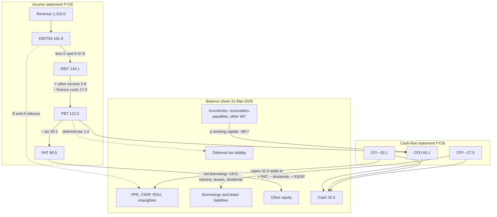
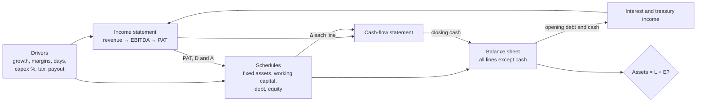

# 02.6 · How the three statements link

> **Why this matters:** the income statement, balance sheet and cash-flow statement are not three documents but
> one double-entry system seen from three angles. If you can push a transaction through all three and tie two
> balance sheets to a cash-flow statement, you can build a model, audit someone else's, and notice when a company's
> numbers do not add up.

**Learning objectives** — after this lesson you can:

- State the core linkages — profit to equity, D&A and capex to fixed assets, working capital, debt and interest,
  leases, tax, cash — and draw them as a flow diagram.
- Post any transaction through the P&L, balance sheet and cash-flow statement at once, keeping
  Assets = Liabilities + Equity after every step.
- Rebuild Kaveri's FY26 operating, investing and financing cash flows from its P&L and two balance sheets (the
  "tie-out drill"), stating every assumption you make.
- Answer "what happens to all three statements if…" questions, including the tax subtleties.
- Diagnose why a model does not balance from the size and pattern of the error.

**Prerequisites:** [02.1 The accounting equation & double entry](01-the-accounting-equation.md),
[02.3 The income statement](03-the-income-statement.md), [02.4 The balance sheet](04-the-balance-sheet.md),
[02.5 The cash-flow statement](05-the-cash-flow-statement.md)  ·  **Time:** ~120 min

---

## 1. One system, three views

Think of a company as a set of accounts (bank, receivables, inventory, machines, loans, equity…). The **balance
sheet** lists the balances at the start and end of the year. Everything that happened in between is a flow, and the
other two statements are two different summaries of those flows:

- The **income statement** summarises the flows that change **equity through operations** — revenue and expenses.
  Its bottom line (profit after tax) is the main reason retained earnings change.
- The **cash-flow statement** summarises the flows that change **one particular asset, cash** — sorted into
  operating, investing and financing.

So each statement "explains" a change in a balance-sheet line: the P&L explains most of the change in retained
earnings, and the CFS explains all of the change in cash. The two are connected because almost every P&L item
eventually becomes cash, and the timing difference between the two sits on the balance sheet as working capital,
fixed assets, provisions and deferred tax.

A three-line derivation makes this precise. Split assets into cash and non-cash assets:

$$\text{Cash} + \text{Non-cash assets} = \text{Liabilities} + \text{Equity}$$

Take the change over the year:

$$\Delta\text{Cash} = \Delta\text{Liabilities} + \Delta\text{Equity} - \Delta\text{Non-cash assets}$$

That is the whole cash-flow statement. Every line of it is the change in some other balance-sheet line (with the sign
flipped for assets), re-sorted into three buckets, with the change in retained earnings replaced by its detailed
explanation — profit, adjusted for its non-cash items, less dividends. The CFS contains no information that is not in
the two balance sheets plus the P&L and a few notes. Which means you can rebuild it (§4), and a model that gets it
wrong will not balance (§6).



## 2. The linkages, one at a time — Kaveri FY25 → FY26

Here is every line of Kaveri's balance sheet, the change during FY26, and where that change came from. This is the
single most useful table in the module: once you can fill it in for any company, you understand its accounts.
(₹ Cr; source: the [Kaveri running example](../appendix/running-example/kaveri-pumps.md).)

| Balance-sheet line | FY25 | FY26 | Change | Explained by | In the P&L | In the CFS |
|:--|--:|--:|--:|:--|:--|:--|
| PP&E (net block) + CWIP | 488.9 | 497.3 | 8.4 | + capex 48.0 − depreciation 39.6 | Depreciation 39.6 | Capex (48.0) in CFI; depreciation added back in CFO |
| Right-of-use assets | 15.2 | 16.5 | 1.3 | + new leases 6.0 − amortisation 4.7 | ROU amortisation 4.7 | Amortisation added back in CFO; new leases non-cash |
| Intangible assets | 7.5 | 8.0 | 0.5 | + purchases 4.0 − amortisation 3.5 | Amortisation 3.5 | Purchase (4.0) in CFI; amortisation added back |
| Inventories | 161.3 | 188.1 | 26.8 | Bought more than consumed | Material cost includes Δ inventory | (26.8) in CFO |
| Trade receivables | 269.7 | 346.7 | 77.0 | Billed more than collected | Revenue 1,318.0 | (77.0) in CFO |
| Other current assets | 35.2 | 39.5 | 4.3 | Advances, prepaid, GST credit up | — | (4.3) in CFO |
| Current investments | 30.0 | 15.0 | (15.0) | Liquid funds sold | Treasury income 3.9 (in other income) | +15.0 in CFI |
| Cash & cash equivalents | 28.0 | 32.5 | 4.5 | The net result of everything | — | Net change +4.5 |
| **Total assets** | **1,035.8** | **1,143.6** | **107.8** | | | |
| Share capital | 30.0 | 30.0 | 0.0 | No issue or buyback | — | — |
| Other equity | 607.2 | 676.1 | 68.9 | + PAT 90.5 − dividends 24.0 + ESOP 2.4 | PAT 90.5; ESOP inside employee cost | Dividends (24.0) in CFF; ESOP added back in CFO |
| Borrowings — non-current | 112.0 | 92.0 | (20.0) | Term-loan repayment | Interest 15.6 on all borrowings | (20.0) in CFF; interest paid (15.6) in CFF |
| Borrowings — current | 58.0 | 96.0 | 38.0 | Working-capital drawdown | (as above) | +38.0 in CFF |
| Lease liabilities | 16.7 | 18.2 | 1.5 | + new leases 6.0 + interest 1.4 − payments 5.9 | Lease interest 1.4 | Payments (5.9) in CFF |
| Trade payables | 132.3 | 143.4 | 11.1 | Suppliers' credit up | — | +11.1 in CFO |
| Other current liabilities & provisions | 58.6 | 65.9 | 7.3 | Statutory dues, advances, accruals | — | +7.3 in CFO |
| Deferred tax liability | 21.0 | 22.0 | 1.0 | Deferred tax charge | Deferred tax 1.0 | None (non-cash); current tax 29.5 paid in CFO |
| **Total equity & liabilities** | **1,035.8** | **1,143.6** | **107.8** | | | |

Read the table as a list of linkages you must never break:

1. **Profit → equity.** PAT flows into retained earnings; dividends come out; other equity movements (ESOP reserve,
   OCI, share issues) are shown in the statement of changes in equity. *Check: 607.2 + 90.5 − 24.0 + 2.4 = 676.1.*
2. **D&A → fixed assets; capex → fixed assets.** Opening net fixed assets + capex − D&A − book value of disposals =
   closing. *Check: 488.9 + 48.0 − 39.6 = 497.3.*
3. **Working capital → CFO.** Every operating asset or liability that changes shows up, with the sign rule of
   [02.5](05-the-cash-flow-statement.md), in CFO.
4. **Debt and interest.** The P&L carries the interest *expense*; the balance sheet carries the principal (and any
   interest accrued but unpaid); CFF carries interest *paid* and principal drawn or repaid.
5. **Leases.** New leases add to both ROU assets and lease liabilities without cash; amortisation and lease interest
   hit the P&L; payments hit CFF.
6. **Tax.** Tax expense (30.5) = current tax (29.5, paid in cash here because no tax payable or refund balance
   moved) plus deferred tax (1.0, which increased the deferred tax liability and never touched cash).
7. **Cash.** CFO + CFI + CFF = change in balance-sheet cash. *Check: 65.1 − 33.1 − 27.5 = 4.5 = 32.5 − 28.0.*

## 3. Worked example 1 — twelve transactions through all three statements

Kaveri is too big to follow transaction by transaction, so we use a small **fictional** business: *Noyyal Rewinding
Works Pvt Ltd*, a motor-rewinding and pump-repair shop in Tiruppur. Amounts are in **₹ lakh** (1 lakh = 100,000);
the year is FY26 (1-Apr-2025 to 31-Mar-2026); tax is a flat 25% for simplicity. The opening balance sheet:

| Noyyal, 1-Apr-2025, ₹ lakh | | | |
|:--|--:|:--|--:|
| Cash | 10.0 | Trade payables | 10.0 |
| Trade receivables | 12.0 | Term loan | 25.0 |
| Inventory (copper wire, bearings, spares) | 15.0 | Share capital + securities premium (10.0 + 5.0) | 15.0 |
| Equipment: gross 60.0 − acc. dep. 12.0 | 48.0 | Retained earnings | 35.0 |
| **Total assets** | **85.0** | **Total liabilities & equity** | **85.0** |

The twelve transactions of the year, and what each one does to each statement:

| # | Transaction | P&L | Balance sheet | Cash-flow statement |
|:--|:--|:--|:--|:--|
| T1 | Issue 20,000 shares of ₹10 face value at ₹100 | — | Cash +20.0; share capital +2.0; securities premium +18.0 | CFF +20.0 |
| T2 | Buy a winding machine for 30.0: pay 24.0 now, 6.0 due in 60 days | — | Equipment +30.0; cash −24.0; capital creditors +6.0 | CFI −24.0 (the 6.0 is non-cash until paid) |
| T3 | Buy materials on credit, 40.0 | — | Inventory +40.0; trade payables +40.0 | — |
| T4 | Sales of 90.0 (60.0 cash, 30.0 on credit); materials consumed 38.0 | Revenue 90.0; cost of materials 38.0 | Cash +60.0; receivables +30.0; inventory −38.0; retained earnings +52.0 | CFO +60.0 |
| T5 | Collect 25.0 from customers | — | Cash +25.0; receivables −25.0 | CFO +25.0 |
| T6 | Pay suppliers 35.0 | — | Cash −35.0; trade payables −35.0 | CFO −35.0 |
| T7 | Employee cost 20.0: 18.0 paid, 2.0 year-end bonus accrued | Employee cost 20.0 | Cash −18.0; accrued liabilities +2.0; retained earnings −20.0 | CFO −18.0 |
| T8 | Pay 8.0 of rent and power, of which 1.0 is April's rent paid in advance | Other expenses 7.0 | Cash −8.0; prepaid expenses +1.0; retained earnings −7.0 | CFO −8.0 |
| T9 | Depreciation for the year, 9.0 | Depreciation 9.0 | Accumulated depreciation +9.0 (net equipment −9.0); retained earnings −9.0 | — (non-cash) |
| T10 | Loan instalment 7.0 = interest 2.0 + principal 5.0 | Finance cost 2.0 | Cash −7.0; term loan −5.0; retained earnings −2.0 | CFF −5.0 (principal), CFF −2.0 (interest, Ind AS 7) |
| T11 | Tax at 25% on PBT of 14.0 = 3.5; advance tax paid 2.5 | Tax 3.5 | Cash −2.5; tax payable +1.0; retained earnings −3.5 | CFO −2.5 |
| T12 | Pay a dividend of 3.0 | — (not an expense) | Cash −3.0; retained earnings −3.0 | CFF −3.0 |

**The running balance sheet.** After every transaction the two totals must agree. (Retained earnings include the
current year's P&L as it accrues; "Accruals & tax" = accrued bonus + tax payable.)

| After | Cash | Receivables | Inventory | Prepaid | Net equip. | **Total assets** | Payables | Capital creditors | Accruals & tax | Term loan | Share cap. + premium | Retained earnings | **Total L + E** |
|:--|--:|--:|--:|--:|--:|--:|--:|--:|--:|--:|--:|--:|--:|
| Opening | 10.0 | 12.0 | 15.0 | 0.0 | 48.0 | **85.0** | 10.0 | 0.0 | 0.0 | 25.0 | 15.0 | 35.0 | **85.0** |
| T1 | 30.0 | 12.0 | 15.0 | 0.0 | 48.0 | **105.0** | 10.0 | 0.0 | 0.0 | 25.0 | 35.0 | 35.0 | **105.0** |
| T2 | 6.0 | 12.0 | 15.0 | 0.0 | 78.0 | **111.0** | 10.0 | 6.0 | 0.0 | 25.0 | 35.0 | 35.0 | **111.0** |
| T3 | 6.0 | 12.0 | 55.0 | 0.0 | 78.0 | **151.0** | 50.0 | 6.0 | 0.0 | 25.0 | 35.0 | 35.0 | **151.0** |
| T4 | 66.0 | 42.0 | 17.0 | 0.0 | 78.0 | **203.0** | 50.0 | 6.0 | 0.0 | 25.0 | 35.0 | 87.0 | **203.0** |
| T5 | 91.0 | 17.0 | 17.0 | 0.0 | 78.0 | **203.0** | 50.0 | 6.0 | 0.0 | 25.0 | 35.0 | 87.0 | **203.0** |
| T6 | 56.0 | 17.0 | 17.0 | 0.0 | 78.0 | **168.0** | 15.0 | 6.0 | 0.0 | 25.0 | 35.0 | 87.0 | **168.0** |
| T7 | 38.0 | 17.0 | 17.0 | 0.0 | 78.0 | **150.0** | 15.0 | 6.0 | 2.0 | 25.0 | 35.0 | 67.0 | **150.0** |
| T8 | 30.0 | 17.0 | 17.0 | 1.0 | 78.0 | **143.0** | 15.0 | 6.0 | 2.0 | 25.0 | 35.0 | 60.0 | **143.0** |
| T9 | 30.0 | 17.0 | 17.0 | 1.0 | 69.0 | **134.0** | 15.0 | 6.0 | 2.0 | 25.0 | 35.0 | 51.0 | **134.0** |
| T10 | 23.0 | 17.0 | 17.0 | 1.0 | 69.0 | **127.0** | 15.0 | 6.0 | 2.0 | 20.0 | 35.0 | 49.0 | **127.0** |
| T11 | 20.5 | 17.0 | 17.0 | 1.0 | 69.0 | **124.5** | 15.0 | 6.0 | 3.0 | 20.0 | 35.0 | 45.5 | **124.5** |
| T12 | 17.5 | 17.0 | 17.0 | 1.0 | 69.0 | **121.5** | 15.0 | 6.0 | 3.0 | 20.0 | 35.0 | 42.5 | **121.5** |

**The three finished statements.**

*Income statement, FY26 (₹ lakh):* revenue 90.0 − materials 38.0 − employee cost 20.0 − other expenses 7.0 =
**EBITDA 25.0**; − depreciation 9.0 = **EBIT 16.0**; − finance cost 2.0 = **PBT 14.0**; − tax 3.5 = **PAT 10.5**.

*Retained earnings:* 35.0 + PAT 10.5 − dividend 3.0 = **42.5** ✓ (matches the last row).

*Fixed assets:* 48.0 + purchases 30.0 − depreciation 9.0 = **69.0** ✓.

*Cash-flow statement, indirect method (Ind AS 7 presentation):*

| Noyyal FY26, ₹ lakh | Amount | Source |
|:--|--:|:--|
| Profit before tax | 14.0 | P&L |
| Add: depreciation | 9.0 | T9 |
| Add: finance cost (interest paid goes to CFF) | 2.0 | T10 |
| **Operating profit before working-capital changes** | **25.0** | = EBITDA, as expected |
| (Increase) in inventory | (2.0) | 15.0 → 17.0 |
| (Increase) in receivables | (5.0) | 12.0 → 17.0 |
| (Increase) in prepaid expenses | (1.0) | 0.0 → 1.0 |
| Increase in trade payables | 5.0 | 10.0 → 15.0 |
| Increase in accrued bonus | 2.0 | 0.0 → 2.0 |
| Income tax paid | (2.5) | Tax expense 3.5 − increase in tax payable 1.0 |
| **Cash flow from operations** | **21.5** | |
| Purchase of equipment | (24.0) | 30.0 bought − 6.0 still owed (capital creditors are *not* working capital) |
| **Cash flow from investing** | **(24.0)** | |
| Issue of shares | 20.0 | T1 |
| Repayment of term loan | (5.0) | T10 |
| Interest paid | (2.0) | T10 |
| Dividend paid | (3.0) | T12 |
| **Cash flow from financing** | **10.0** | |
| **Net change in cash** | **7.5** | = 17.5 − 10.0 ✓ |

*Direct-method check:* receipts from customers 60.0 + 25.0 = 85.0; paid to suppliers 35.0, employees 18.0, rent
and power 8.0, tax 2.5; CFO = 85.0 − 35.0 − 18.0 − 8.0 − 2.5 = **21.5** ✓.

**What the example teaches.**

- **Three different "bottom lines".** PAT 10.5, CFO 21.5, change in cash 7.5. Each answers a different question
  (was the year profitable? did operations generate cash? did the bank balance go up?).
- **Accruals move profit and cash apart in both directions.** The bonus accrual (T7) cut profit by 2.0 without
  cash; the prepaid rent (T8) cut cash by 1.0 without profit; credit sales (T4) booked profit without cash.
- **Non-cash investing.** The 6.0 owed for the machine sits in "capital creditors", which is a financing-like
  liability of the investing activity, not trade payables. Put it in working capital by mistake and you overstate
  CFO by 6.0 and capex by 6.0 at the same time — cash still ties, so the error is invisible to the balance check.
  That is exactly the kind of misclassification [09.4](../09-forensics/04-cash-flow-games.md) warns about.
- **Tax paid ≠ tax expense.** 3.5 expensed, 2.5 paid; the 1.0 difference sits in tax payable.
- **Dividends are not expenses.** They reduce equity and cash, never profit.

!!! tip "Trader's lens"
    The balance check is the accountant's **P&L explain**. On a desk, every change in a position's value must be
    attributed to trades (cash moving) or marks (P&L); anything left over is "unexplained P&L" and means a booking
    error. In a three-statement model, the balance sheet is the position report, the P&L is the marks, the CFS is
    the trade blotter, and "Assets − (Liabilities + Equity)" is the unexplained residual. It must be exactly zero,
    and — like unexplained P&L — the *size* and *persistence* of a non-zero residual usually tell you which trade
    was mis-booked (§6).

## 4. Worked example 2 — the tie-out drill: rebuild Kaveri FY26 cash flows

Pretend Kaveri's cash-flow statement is missing. Using only the FY26 P&L, the FY25 and FY26 balance sheets and two
facts from the notes, rebuild CFO, CFI and CFF. This is how you check a company's CFS, how you build historical cash
flows when a data vendor garbles them, and how every forecast model works.

**Facts from the notes.** (a) Dividend paid in FY26: ₹4.0 per share on 6.00 Cr shares = ₹24.0 Cr. (b) No PP&E was
sold in FY26. We also assume, as the reference page states, that other income is entirely treasury income received in
cash, and that there are no interest-accrued or tax-payable balances.

**Step 1 — CFO, starting from PAT (the analyst's route).**

| Step | ₹ Cr | Where it comes from |
|:--|--:|:--|
| PAT | 90.5 | P&L |
| + Depreciation & amortisation | 47.8 | P&L (39.6 + 4.7 + 3.5) |
| + Deferred tax (non-cash part of tax) | 1.0 | Δ deferred tax liability 21.0 → 22.0 |
| + Share-based payment (non-cash) | 2.4 | Δ other equity 68.9 − PAT 90.5 + dividends 24.0 |
| + Finance costs (belong in CFF) | 17.0 | P&L |
| − Treasury income (belongs in CFI) | (3.9) | P&L |
| − Increase in inventories | (26.8) | Balance sheets |
| − Increase in trade receivables | (77.0) | Balance sheets |
| − Increase in other current assets | (4.3) | Balance sheets |
| + Increase in trade payables | 11.1 | Balance sheets |
| + Increase in other current liabilities | 7.3 | Balance sheets |
| **CFO** | **65.1** | ✓ matches the reported figure |

Kaveri's own statement starts from PBT (121.0) and deducts taxes *paid* (29.5); we started from PAT, which is after
the full tax *expense* (30.5), and added back the non-cash deferred portion (1.0). The two routes must agree:
PAT + tax expense − tax paid = 90.5 + 30.5 − 29.5 = 91.5 = PAT + deferred tax. Note also that the ESOP charge was
*derived* from the equity roll-forward — you did not need to be told it.

**Step 2 — CFI.**

| Step | ₹ Cr | Derivation |
|:--|--:|:--|
| Capex on PP&E incl. CWIP | (48.0) | Δ(net block + CWIP) + depreciation + book value of disposals = (497.3 − 488.9) + 39.6 + 0 |
| Purchase of intangibles | (4.0) | Δ intangibles + amortisation = (8.0 − 7.5) + 3.5 |
| Sale of current investments | 15.0 | 30.0 → 15.0 |
| Treasury income received | 3.9 | = other income (assumed received in cash) |
| **CFI** | **(33.1)** | ✓ |

**Step 3 — CFF.**

| Step | ₹ Cr | Derivation |
|:--|--:|:--|
| Net term-loan repayment | (20.0) | 112.0 → 92.0 |
| Net working-capital borrowing | 38.0 | 58.0 → 96.0 |
| Interest paid on borrowings | (15.6) | = finance cost on borrowings (no interest-accrued balance) |
| Lease payments | (5.9) | New leases = 16.5 − 15.2 + 4.7 = 6.0 (from the ROU roll-forward); payments = 16.7 + 6.0 + 1.4 − 18.2 = 5.9 |
| Dividends paid | (24.0) | Note (a); cross-check: PAT 90.5 + ESOP 2.4 − Δ other equity 68.9 = 24.0 |
| **CFF** | **(27.5)** | ✓ |

**Step 4 — the tie.** 65.1 − 33.1 − 27.5 = **4.5** = 32.5 − 28.0 ✓. Every number in Kaveri's CFS has been rebuilt from
the other statements.

```python
# The tie-out drill in code (runs offline on the course data)
import pandas as pd
k = pd.read_csv("tools/data/kaveri_pumps_annual.csv", index_col="line_item")  # = tools/fi/data.py::load_kaveri()
c, p = k["FY26"], k["FY25"]
dividends = 4.0 * 6.0                                   # DPS paid x shares, from the notes
sbc = (c.other_equity - p.other_equity) - c.pat + dividends
d_wc = -(c.inventory - p.inventory) - (c.receivables - p.receivables) - (c.oca - p.oca) \
       + (c.payables - p.payables) + (c.ocl - p.ocl)
cfo = c.pat + c.da + (c.dtl - p.dtl) + sbc + c.fin_cost - c.other_income + d_wc
capex = (c.net_block + c.cwip) - (p.net_block + p.cwip) + c.dep_ppe   # no disposals in FY26
intang = (c.intangibles - p.intangibles) + c.int_amort
cfi = -capex - intang - (c.cur_inv - p.cur_inv) + c.other_income
new_leases = c.rou - p.rou + c.rou_amort
lease_pay = p.lease_liab + new_leases + c.lease_int - c.lease_liab
cff = (c.lt_debt - p.lt_debt) + (c.st_debt - p.st_debt) - c.debt_int - lease_pay - dividends
print(round(cfo, 1), round(cfi, 1), round(cff, 1), round(cfo + cfi + cff, 1), round(c.cash - p.cash, 1))
# -> 65.1 -33.1 -27.5 4.5 4.5
```

**Why real tie-outs rarely close to the rupee.** On a real company the rebuilt CFS usually differs from the reported
one, and the differences are themselves information. The usual reasons:

- **Acquisitions and disposals of subsidiaries.** The acquired company's receivables, inventory and debt arrive on
  the balance sheet without passing through working capital; the CFS shows a single "acquisition, net of cash" line.
- **Foreign-currency translation.** Overseas subsidiaries' balances change with the exchange rate, not with cash.
- **Non-cash items hiding in "other".** Provisions, write-offs, fair-value changes, unrealised FX.
- **Capital creditors and capital advances.** Capex accrued but unpaid (or paid in advance) sits in other
  liabilities/assets; mix them into working capital and CFO and capex both move.
- **Capitalised interest.** Interest paid exceeds the P&L finance cost when part of it was added to CWIP.
- **Reclassifications and restatements.** Last year's balance sheet as reported last year may differ from the
  comparative in this year's report. Always use the comparative column from the *current* report.

A small, explained difference is normal. A large, unexplained one — especially one that consistently flatters
CFO — is a question for the company ([09.4](../09-forensics/04-cash-flow-games.md)).

## 5. "What happens to the three statements if…?"

These chains are the fastest way to test your understanding (and a staple of analyst interviews). Assume a 25% tax
rate.

**(a) Depreciation is ₹10 higher — and it is tax-deductible.** P&L: EBIT −10, tax −2.5, PAT −7.5. CFS: PAT −7.5,
add back depreciation +10, CFO **+2.5** (the tax saved). Balance sheet: net PP&E −10, cash +2.5 → assets −7.5;
retained earnings −7.5 ✓.

**(b) Book depreciation is ₹10 higher but tax depreciation is unchanged** (the usual case when a company shortens a
book useful life — [02.7](07-deeper-cuts-assets-and-expenses.md)). P&L: PBT −10; current tax unchanged; *deferred*
tax −2.5 (a credit); PAT −7.5. CFS: CFO **unchanged** (PAT −7.5 + depreciation +10 − deferred-tax credit 2.5 = 0).
Balance sheet: PP&E −10; deferred tax liability −2.5; equity −7.5 → assets −10 = liabilities −2.5 + equity −7.5 ✓.
Accounting choices move profit, not cash.

**(c) An inventory write-down of ₹20, tax-deductible.** P&L: PAT −15. CFS: PAT −15; inventory fell by 20, which the
indirect method records as a +20 working-capital release; CFO **+5** (tax saved). Balance sheet: inventory −20, cash
+5, equity −15 ✓.

**(d) A customer pays a ₹5 advance for next year's order.** P&L: nothing (revenue is not yet earned —
[02.2](02-accrual-accounting-and-revenue-recognition.md)). Balance sheet: cash +5; contract liability (other current
liabilities) +5. CFS: CFO **+5**, via the increase in other current liabilities.

**(e) The company borrows ₹100 on 31 March and buys a machine with it the same day.** P&L: nothing this year. Balance
sheet: PP&E +100, borrowings +100. CFS: CFI −100, CFF +100, net 0. Next year: depreciation and interest start.

**(f) A state agency pays Kaveri ₹50 Cr of overdue receivables on 1 April instead of 31 March.** FY26 P&L: identical.
FY26 balance sheet: receivables ₹50 Cr higher and cash ₹50 Cr lower (or working-capital debt ₹50 Cr higher). FY26 CFO:
₹50 Cr lower. One day's timing moves CFO/PAT from 127% to 72% — which is why you judge cash conversion over several
years, and why year-end collection drives are the oldest window-dressing trick there is.

(For (f): (65.1 + 50) / 90.5 = 127%; 65.1 / 90.5 = 72%.)

## 6. What breaks when a model doesn't balance

A three-statement model is built so that it *cannot* balance unless every linkage is right: all balance-sheet lines
except cash are driven by schedules (fixed assets, working capital, debt, equity), the CFS is computed from those
lines, and closing cash = opening cash + CFS. Then the **balance check** — total assets minus total liabilities and
equity — must be zero in every year. (Many models instead make a revolving credit line the plug when cash would go
negative; the principle is the same.)

When it is not zero, the error is almost always one of a handful of broken links. The size and pattern of the
imbalance point to the culprit:

| Symptom | Likely cause | Kaveri FY26 illustration |
|:--|:--|:--|
| Imbalance equals one line item exactly | That item is in one statement but not the other (e.g., added back in CFO but not recorded in equity) | Forget to add back the ₹2.4 Cr ESOP charge in CFO while crediting equity → cash too low, assets short by **2.4** |
| Imbalance equals **twice** a line item | Sign error on that item | Record the receivables increase as +77.0 instead of (77.0) → assets over by **154.0** |
| Liabilities + equity exceed assets by the dividend | Dividend deducted from cash (CFF) but not from retained earnings — or vice versa | L + E over by **24.0** |
| Imbalance equals capex | Capex deducted from cash but not added to PP&E | Assets short by **48.0** |
| Imbalance equals depreciation, growing every year | D&A added back in CFO and charged in P&L, but not deducted from PP&E | Assets over by **39.6** in FY26, more each year |
| Imbalance zero in year 1, then growing | A roll-forward uses the wrong opening balance (e.g., opening debt ≠ last year's closing) | — |
| Imbalance in the first forecast year only | Opening balance sheet doesn't balance, or historical cash ≠ model cash | — |
| Model balances but cash is implausible | Classification error that nets out (capital creditors in working capital; interest in two places) | See the Noyyal capital-creditors point in §3 |
| Numbers change on every recalculation | Circular reference (interest on average debt ↔ debt depends on cash ↔ cash depends on interest) | — |

**A debugging routine that works:**

1. Find the **first year** with a non-zero check. Everything before it is fine.
2. Note the **size** of the imbalance. Search the model for a line item equal to it, or to half of it (sign error).
3. Check whether it is **constant or growing** across years. Constant → a one-off or opening-balance problem.
   Growing by a steady amount → a recurring flow (D&A, a working-capital item, a dividend) missing from one statement.
4. Check the **cash tie** separately: does closing cash on the CFS equal cash on the balance sheet? If yes, the
   error is in a non-cash line's roll-forward; if no, it is in the CFS.
5. Walk the **linkage table of §2** line by line: for each balance-sheet line, is the change explained by exactly one
   CFS line (or a P&L line plus a CFS line)?
6. Only then look for **circularity** and rounding.

**Circularity.** Interest expense depends on debt; debt (or a revolver) depends on cash; cash depends on profit, which
depends on interest. Excel users switch on iterative calculation; the course's Python engine,
`tools/fi/model.py::project`, avoids the loop by charging interest on *opening* debt, and returns a `checks` frame with
the balance and cash checks for every projected year. [10.4](../10-modeling/04-scenarios-sensitivities-qa.md) turns
this section into a full model-review checklist.

## 7. The three-statement model, in one picture

Everything in this lesson runs backwards when you forecast. You choose drivers, and the linkages generate the
statements:



[10.3](../10-modeling/03-forecasting-drivers.md) builds these schedules for Kaveri FY27–FY29 consistent with the
[reference valuation](../appendix/running-example/kaveri-valuation.md), and
[10.5](../10-modeling/05-build-along-kaveri-model.md) implements the whole thing in Python.

!!! info "India notes"
    - **Start point.** Indian cash-flow statements under Ind AS 7 typically start from profit before tax and deduct
      income taxes paid; many global (IFRS) statements start from profit after tax, and IFRS 18 / Ind AS 118 will move the
      starting point to operating profit (for India, proposed from FY28 — see [02.5](05-the-cash-flow-statement.md)).
      The tie-out logic is identical; only the first few lines move.
    - **Statement of changes in equity.** Ind AS requires it as a primary statement. Use it to get dividends,
      ESOP reserves, OCI and share issues directly rather than deriving them as we did in §4.
    - **Tax payable is usually small.** Indian companies pay advance tax in instalments during the year, so current
      tax and tax paid are close; big gaps come from refunds, disputes and prior-year assessments.
    - **Classification is fixed for non-financial companies.** Interest paid sits in CFF and interest received in
      CFI (Ind AS 7), so Indian CFO is "pre-interest" — keep that in mind when you compare with US or IFRS peers.
    - **Standalone vs consolidated.** Tie out the set you are analysing; mixing a consolidated P&L with a standalone
      balance sheet is the most common reason an Indian tie-out fails. Aggregators (Screener, etc.) sometimes
      reclassify items such as other income; tie out against the annual report.

!!! warning "Common mistakes"
    - **Treating dividends as an expense**, or forgetting to deduct them from retained earnings.
    - **Using tax expense as tax paid.** Deferred tax is not cash; tax payable moves the timing further.
    - **Putting capital creditors or capital advances into working capital.** It shifts cash between CFO and CFI.
    - **Using the prior year's *originally reported* balance sheet** rather than the comparative restated in the
      current report.
    - **Forgetting non-cash additions** — new leases, assets acquired in business combinations, share-settled
      payments — when rolling forward fixed assets or debt.
    - **Fixing an imbalance with a plug** ("other liabilities" balancing figure). The plug hides the broken link and
      the model will be wrong in every scenario.
    - **Double counting interest** — once in CFO (from PAT) and again in CFF — or omitting it from both.

## Key terms

| Term | Meaning |
|:--|:--|
| **Linkage** | A rule tying a line in one statement to a line in another (e.g., PAT → retained earnings) |
| **Roll-forward** | Opening balance + additions − deductions = closing balance, for a balance-sheet line |
| **Tie-out** | Rebuilding one statement from the others and reconciling the differences |
| **Balance check** | Total assets − (total liabilities + equity); must be zero |
| **Cash check** | Closing cash per the cash-flow statement = cash on the balance sheet |
| **Plug** | The line a model uses to force balance — should be cash or a revolver, never an arbitrary "other" |
| **Revolver** | A revolving credit facility used in models to fund any cash shortfall |
| **Capital creditors** | Amounts owed for capex already received; investing-related, not working capital |
| **Non-cash transaction** | A transaction with no cash movement (new lease, share-funded acquisition, capex on credit) |
| **Deferred tax** | Tax expense not currently payable (or recoverable), arising from timing differences |
| **Statement of changes in equity (SOCE)** | Primary statement reconciling opening and closing equity by component |
| **Circularity** | A loop in a model (interest ↔ debt ↔ cash) that needs iteration or an opening-balance convention |
| **Accrual** | An expense or revenue recognised before the related cash moves (e.g., bonus accrued) |
| **Prepaid expense** | Cash paid before the expense is recognised; an asset until used |

## Check your understanding

1. On 31-Mar-2026 Noyyal also received a ₹5.0 lakh advance from a customer for pumps to be repaired in April. Restate
   Noyyal's FY26 PAT, CFO, closing cash and total assets.
<details><summary>Answer</summary>
PAT is unchanged at ₹10.5 lakh — no revenue is earned yet. The advance is a contract liability (other current
liability) of ₹5.0 lakh. CFO rises by 5.0 to <b>₹26.5 lakh</b> (increase in other current liabilities); closing cash
rises to <b>₹22.5 lakh</b>; total assets become 121.5 + 5.0 = <b>₹126.5 lakh</b>, matched by liabilities of +5.0.
</details>

2. Rebuild Kaveri's FY25 capex on PP&E from the balance sheets. (FY24: net block 475.9, CWIP 0.0; FY25: net block
   484.9, CWIP 4.0; FY25 PP&E depreciation 37.0; a land parcel with book value ₹4.0 Cr was sold.)
<details><summary>Answer</summary>
Closing (net block + CWIP) = opening + capex − depreciation − book value of disposals. So capex = (484.9 + 4.0) −
(475.9 + 0.0) + 37.0 + 4.0 = 13.0 + 37.0 + 4.0 = <b>₹54.0 Cr</b> ✓ — matching the "purchase of PP&E incl. CWIP" line.
Forgetting the land disposal gives ₹50.0 Cr, a ₹4.0 Cr error.
</details>

3. Kaveri decides to shorten the useful life of its motors plant, raising FY27 book depreciation by ₹8.0 Cr. Tax
   depreciation is unchanged. What happens to FY27 EBITDA, PAT, CFO, net block and the deferred tax liability? (Tax
   rate 25.17%.)
<details><summary>Answer</summary>
EBITDA: unchanged. PBT −8.0; current tax unchanged; deferred tax credit of 8.0 × 25.17% = 2.0; PAT falls by
8.0 × (1 − 0.2517) = <b>₹6.0 Cr</b>. CFO: <b>unchanged</b> (PAT −6.0 + depreciation +8.0 − deferred-tax credit 2.0).
Net block −8.0; deferred tax liability −2.0; equity −6.0; the balance sheet still balances. (If the higher depreciation
were also tax-deductible, current tax would fall by 2.0 and CFO would rise by 2.0.)
</details>

4. Your Kaveri model balances in FY26 but in FY27 total assets exceed liabilities plus equity by exactly ₹154.0 Cr.
   What is your first hypothesis, and why?
<details><summary>Answer</summary>
An imbalance of exactly twice a line item suggests a sign error on that item. ₹154.0 Cr = 2 × 77.0, the size of an
increase-in-receivables line — so check whether the FY27 change in receivables (or another working-capital item of
₹77.0 Cr) has been added in CFO instead of deducted. More generally, search for items equal to the imbalance and to
half of it.
</details>

5. Derive Kaveri's FY26 dividends paid in two independent ways, and the FY26 ESOP charge, using only the balance sheets,
   the P&L and the per-share data.
<details><summary>Answer</summary>
(1) Per-share data: DPS paid in FY26 ₹4.0 × 6.00 Cr shares = <b>₹24.0 Cr</b>. (2) Equity roll-forward: dividends =
PAT + other credits to equity − Δ other equity; if you know the ESOP charge (₹2.4 Cr, disclosed inside employee cost),
90.5 + 2.4 − 68.9 = <b>₹24.0 Cr</b>. Conversely, knowing dividends, ESOP = 68.9 − 90.5 + 24.0 = <b>₹2.4 Cr</b>. You
need one of the two from the notes; the statement of changes in equity gives both.
</details>

6. On 31-Mar-2026 Kaveri takes delivery of a ₹10.0 Cr machine on 90-day credit. Show the effect on the FY26 and FY27
   statements. What goes wrong if an analyst includes the amount owed in "other current liabilities" when computing
   working capital?
<details><summary>Answer</summary>
FY26: PP&E +10.0; capital creditors (other financial liabilities) +10.0; no P&L or cash effect. FY27: cash −10.0 in CFI
(capex) when paid; depreciation begins. If the ₹10.0 Cr is lumped into working-capital liabilities, FY26 CFO is
overstated by 10.0 (a liability "increase") and FY26 capex overstated by 10.0 — cash still ties, so the balance check
won't catch it; then in FY27 CFO is understated by 10.0. Always strip capital creditors out of working capital.
</details>

7. Explain why Kaveri's CFO is the same whether you start from PBT (deducting taxes paid) or from PAT (adding back
   deferred tax).
<details><summary>Answer</summary>
PAT = PBT − current tax − deferred tax. The PBT route deducts taxes paid (29.5), which here equals current tax
because no tax payable or refund balance moved. The PAT route has already deducted current tax (29.5) and deferred tax
(1.0); adding back the non-cash deferred portion leaves exactly the current tax deducted. Numerically, 121.0 − 29.5 =
91.5 = 90.5 + 1.0. If tax payable had changed, both routes would need the same extra adjustment.
</details>

8. A model's balance check is zero in the first forecast year and then off by an amount that grows each year by
   roughly the depreciation charge. Where do you look?
<details><summary>Answer</summary>
A recurring flow booked in some statements but not others. The pattern matches D&A: probably depreciation is charged
in the P&L and added back in CFO, but the fixed-asset schedule doesn't deduct it (assets overstated, growing each
year by that year's D&A) — or the fixed-asset schedule deducts it but the CFO add-back is missing (cash understated).
Check the fixed-asset roll-forward first, then the CFO add-back.
</details>

## Go deeper

- Simon Benninga, *Financial Modeling* (MIT Press) — the classic spreadsheet treatment of pro-forma statements, the cash/debt plug and circularity.
- Stephen Penman, *Financial Statement Analysis and Security Valuation* (McGraw-Hill) — reformulated statements and why the linkages matter for valuation.
- [Ind AS 7, *Statement of Cash Flows*](https://ca2013.com/indian-accounting-standard-ind-7/) — read paragraphs 43–44E on non-cash transactions and the reconciliation of financing liabilities.
- `tools/fi/model.py::project` and its `checks` frame — run the course's projection engine on Kaveri and deliberately break a linkage to see the balance check react (see [10.5](../10-modeling/05-build-along-kaveri-model.md)).

---
[← Previous: 02.5 The cash-flow statement](05-the-cash-flow-statement.md) · [Module index](index.md) · [Next: 02.7 Deeper cuts I: assets & expenses →](07-deeper-cuts-assets-and-expenses.md)
