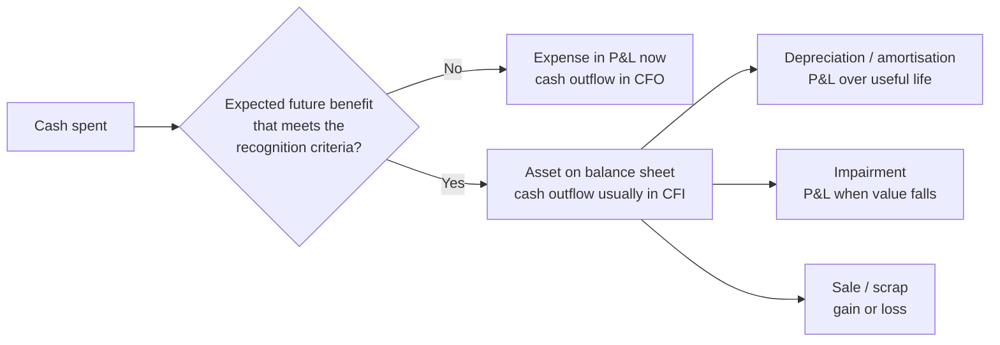

# 02.7 · Deeper cuts I: assets & expenses

> **Why this matters:** two companies with identical cash flows can report very different profits, depending on how
> they cost inventory, depreciate plant, test for impairment, treat development spending, account for leases and
> book grants. None of these choices changes the cash; all of them change *when* profit shows up. If you can't see
> the choices, you will mistake accounting timing for business performance.

**Learning objectives** — after this lesson you can:

- Compute cost of goods sold and closing inventory under FIFO and weighted average (and LIFO, for US comparisons), and explain why Ind AS does not allow LIFO.
- Calculate depreciation under straight-line and written-down-value methods, read Schedule II useful lives, estimate a company's implied asset life and age from its statements, and quantify the profit effect of a useful-life change.
- Run a simple Ind AS 36 impairment test (value in use vs carrying amount) and show how sensitive it is to the discount rate.
- Decide whether a cost should be capitalised or expensed (development, software, borrowing costs, pre-operative costs), and trace the effect through all three statements, including the shift from CFO to CFI.
- Build a lease liability and right-of-use schedule under Ind AS 116 and restate EBITDA to a pre-Ind AS 116 basis.
- Explain grant accounting under Ind AS 20, and demonstrate that each of these choices moves profit between periods without changing total cash.

**Prerequisites:** [02.3 The income statement](03-the-income-statement.md), [02.4 The balance sheet](04-the-balance-sheet.md),
[02.5 The cash-flow statement](05-the-cash-flow-statement.md), [02.6 How the three statements link](06-linking-the-three-statements.md)  ·  **Time:** ~150 min

---

## 1. The one idea: cash is spent once; accounting decides when it becomes expense

Every rupee a company spends ends up as an expense *eventually*, apart from land and anything it sells on. The
accounting question is **when**. There are only two routes:

- **Expense it now.** The cost hits the P&L in the period it is incurred.
- **Capitalise it.** The cost goes onto the balance sheet as an **asset**: a resource the company controls and expects to
  produce future economic benefits. The asset is then turned into expense over time through **depreciation** (for
  tangible assets), **amortisation** (for intangibles and right-of-use assets) or **impairment** (a one-off write-down
  when the asset turns out to be worth less than its book value).

Two facts follow, and they drive the rest of this lesson.

**The timing identity.** Over the full life of an asset, ignoring tax and residual value,

$$\sum_{t} \text{expense}_t \;=\; \sum_{t} \text{cash spent}_t .$$

Choices about lives, methods, capitalisation and impairment change the *path* of expense, not the total. A policy that
raises profit today lowers it later. In a growing company "later" keeps getting pushed back, which is why aggressive
policies can flatter profit for years.

**The cash-flow classification shift.** Expensed spending sits in **cash flow from operations (CFO)**. Capitalised
spending usually sits in **cash flow from investing (CFI)**. So capitalising a cost raises reported profit *and*
reported CFO in the same year, even though the bank balance is identical. This is how WorldCom famously turned
ordinary line costs into "capital expenditure"; forensic detail is in [09.4 Cash-flow games](../09-forensics/04-cash-flow-games.md).
The lesson for now: **free cash flow (CFO − capex) is immune to this trick; CFO alone is not.**

| Lever | What management chooses | Profit now | Profit later | Cash |
|:--|:--|:--|:--|:--|
| Inventory cost formula | FIFO vs weighted average | Higher with FIFO when input prices rise | Reverses when prices fall | Same (tax aside) |
| Useful life / residual value | Longer life, higher residual | Higher | Lower | Same |
| Depreciation method | Straight-line vs WDV | Higher with SLM in early years | Lower | Same |
| Impairment | Timing and size of write-downs | Lower in the "big bath" year | Higher afterwards | Same |
| Capitalise vs expense | Development, software, interest, pre-operative | Higher if capitalised | Lower (amortisation) | Same; CFO higher |
| Leases (Ind AS 116) | Not a choice, but it reshuffles lines | EBITDA higher; PAT slightly lower early | PAT higher late | Same; CFO higher |
| Grants | Net against asset vs deferred income | Same PAT; EBITDA differs | Same | Same |

We now take each lever in turn.

---

## 2. Inventory: what it costs, and which cost you sell

### 2.1 What goes into inventory cost

**Inventory** is goods held for sale, work in progress, and raw materials and stores to be used in production. Ind AS 2
(*Inventories*) says inventory is carried at **cost**, which includes:

- **purchase costs**: price, import duties, non-refundable taxes and freight, *less* trade discounts. Recoverable GST input
  credit is **not** part of cost, because the government refunds it through the input-credit mechanism;
- **conversion costs**: direct labour plus a systematic allocation of **production overheads**, both variable (power,
  consumables) and fixed (factory depreciation, supervisors' salaries);
- **other costs** incurred to bring the inventory to its present location and condition.

Excluded, and expensed immediately: abnormal wastage, storage (unless it is part of production, as with maturing whisky
or cheese), administrative overheads, and selling costs.

One rule matters a lot for analysts. **Fixed production overheads are allocated on the basis of *normal* capacity.**
If a plant runs below normal capacity, the fixed overhead per unit is **not** inflated to absorb the shortfall.
The **unabsorbed overhead** is expensed in the period. Kaveri's Hosur motors plant ran at 48% utilisation in FY25 and
57% in FY26. A plant that runs well below normal capacity throws unabsorbed fixed cost straight into the P&L, and that
cost falls away as utilisation climbs. It is one mechanical source of the **operating leverage** you will quantify in
[04.2 Margins & cost structure](../04-financial-analysis/02-margins-and-cost-structure.md).

### 2.2 Cost formulas: which unit did you sell?

When identical items are bought at different prices, the company needs a rule to decide which cost goes to **cost of
goods sold (COGS)** and which stays in closing inventory. Ind AS 2 allows:

- **Specific identification**, for items that are not interchangeable (a custom industrial pump built to order).
- **FIFO (first-in, first-out).** The oldest costs go to COGS first, so closing inventory carries the most recent prices.
- **Weighted average cost (WAC).** Every unit carries the average cost of the pool, recomputed periodically or after each
  purchase ("moving average").

**LIFO (last-in, first-out)**, where the newest costs go to COGS first, is **not permitted** under Ind AS 2 or IAS 2.
The IASB removed it in the 2003 revision of IAS 2 ([KPMG, *Inventory accounting: IFRS vs US GAAP*, 2026](https://kpmg.com/us/en/articles/2026/inventory-accounting-ifrs-accounting-standards-vs-us-gaap.html);
[IFRS Community on cost formulas](https://ifrscommunity.com/knowledge-base/fifo-lifo-weighted-average-cost/)).
US GAAP still allows it, which matters when you compare with US peers ([02.9](09-ind-as-ifrs-us-gaap.md)).

A company must use the same formula for all inventories of a similar nature and use. Changing formula is a change in
accounting policy under Ind AS 8. It must be justified, applied retrospectively and disclosed.

#### Worked example 1 — copper for a motor maker, in a rising market

A fictional motor maker, **Bhavani Motors**, uses copper winding wire. Copper prices rise through the year. Quantities
are in tonnes (t) and prices in ₹ lakh per tonne (1 crore = 100 lakh).

| Lot | Tonnes | Price (₹ lakh/t) | Cost (₹ lakh) |
|:--|--:|--:|--:|
| Opening inventory | 100 | 8.0 | 800 |
| Q1 purchase | 150 | 8.4 | 1,260 |
| Q2 purchase | 150 | 8.8 | 1,320 |
| Q3 purchase | 150 | 9.2 | 1,380 |
| Q4 purchase | 150 | 9.6 | 1,440 |
| **Available** | **700** | | **6,200 (= ₹62.0 Cr)** |

It consumes 600 t, so 100 t remain at year-end. To isolate the effect, treat copper as the only cost and assume the
motors sold bring in revenue of ₹70.0 Cr.

- **FIFO:** the 100 t left are the latest lot, 100 × 9.6 = 960 lakh = ₹9.6 Cr. COGS = 62.0 − 9.6 = **₹52.4 Cr**.
- **Weighted average (periodic):** average cost = 6,200 / 700 = ₹8.857 lakh/t. Closing = 100 × 8.857 = ₹8.86 Cr.
  COGS = 62.0 − 8.86 = **₹53.1 Cr**.
- **LIFO (US GAAP only):** the 100 t left are "the oldest", 100 × 8.0 = ₹8.0 Cr. COGS = 62.0 − 8.0 = **₹54.0 Cr**.

| ₹ Cr | FIFO | Weighted avg. | LIFO (US only) |
|:--|--:|--:|--:|
| Revenue | 70.0 | 70.0 | 70.0 |
| COGS | (52.4) | (53.1) | (54.0) |
| **Gross profit** | **17.6** | **16.9** | **16.0** |
| Gross margin | 25.1% | 24.1% | 22.9% |
| Tax at 25.17% on this gross profit | 4.4 | 4.2 | 4.0 |
| Closing inventory on balance sheet | 9.6 | 8.9 | 8.0 |
| Cash paid to suppliers in the year | 54.0 | 54.0 | 54.0 |

What to notice:

1. **Cash is identical**: ₹54.0 Cr of purchases in every column. Only the split between COGS and closing inventory
   changes.
2. In a rising market **FIFO reports the highest profit**. Part of its gross profit (₹1.6 Cr more than LIFO) is really an
   **inventory holding gain**: copper bought cheap early was "sold" at prices set when copper was dear. Replacing the
   600 t at the year-end price would cost 600 × 9.6 = ₹57.6 Cr, *more* than any of the COGS figures. FIFO profit is
   partly unrepeatable if prices stop rising.
3. LIFO COGS here equals the year's purchases (₹54.0 Cr) because quantities were stable. That is why LIFO is said to
   match "current costs" against current revenue, and why US companies like it for tax: lower profit means lower tax
   when prices rise.
4. When prices *fall* all of this reverses. FIFO then pushes old, expensive costs into COGS and margins look worse than
   the business is.

**Analyst's takeaway.** For commodity-heavy manufacturers (copper and steel for pump makers, crude for refiners, cotton for
spinners), part of the gross-margin swing in any quarter is inventory timing, not pricing power. Management calls it
"inventory gains/losses" on the concall. Strip it out before extrapolating.

### 2.3 Why LIFO is banned under Ind AS / IFRS

The IASB's objections, in plain terms:

- **The balance sheet becomes fiction.** Under LIFO, inventory can sit at costs that are decades old. A US company that
  has used LIFO since the 1970s may carry steel at 1970s prices.
- **LIFO liquidation profits.** If a LIFO company runs inventory down, very old, cheap layers flow into COGS and profit
  jumps for no economic reason. Management can time purchases to manage this.
- **It is not a faithful model of physical flow** for almost any business (nobody sells the freshest milk first).

The US kept LIFO largely because of the **LIFO conformity rule**: a US company that uses LIFO for tax must also use it in
its financial statements. [02.9](09-ind-as-ifrs-us-gaap.md) shows how to convert a US LIFO company to FIFO using its
disclosed **LIFO reserve**.

### 2.4 Lower of cost and net realisable value

Inventory is carried at the **lower of cost and net realisable value (NRV)**. NRV is the estimated selling price less
the costs to complete and sell. If finished pumps can only be sold at a loss, they are written down to NRV and the
write-down is an expense.

Two details:

- **Raw materials are not written down** just because their market price fell, *as long as* the finished products they
  go into are still expected to sell at or above cost.
- **Reversals are allowed** under Ind AS 2 (up to original cost) when circumstances improve. US GAAP forbids reversal of
  inventory write-downs.

In the notes you will see "provision for slow-moving / obsolete inventory". A shrinking provision while inventory days
rise is a yellow flag: management may be releasing provisions to protect margins. See
[09.3 Expense & asset red flags](../09-forensics/03-expense-and-asset-red-flags.md).

---

## 3. Depreciation: allocating cost, not measuring value

### 3.1 What depreciation is (and is not)

**Depreciation** is the systematic allocation of the **depreciable amount** of a tangible asset (cost − residual value)
over its **useful life**. It is *not* an estimate of how much the asset's market value fell. A 10-year-old CNC machine
can be worth more than its book value, or nothing at all.

The main methods under Ind AS 16 (*Property, Plant and Equipment*):

- **Straight-line method (SLM):** equal charge each year, $\;D = \dfrac{\text{Cost} - \text{Residual}}{\text{Life}}$.
  This is by far the most common in Indian consolidated accounts.
- **Written-down value (WDV)** (declining balance): a fixed *percentage* of the opening book value each year. That gives
  high charges early and low charges later. The rate that takes cost down to residual value $R$ in $n$ years is
  $\;r = 1 - (R/\text{Cost})^{1/n}$.
- **Units of production:** charge proportional to use (machine hours, tonnes mined). Used in mining and oil & gas.

Two further rules:

- **Component accounting.** If a significant part of an asset has a different life from the rest (a furnace's
  refractory lining, an aircraft's engines), that part is depreciated separately. Schedule II made this mandatory in
  India from 1-Apr-2015 ([Schedule II text, ca2013.com](https://ca2013.com/schedule/schedule-ii/)).
- **Land is not depreciated**, because its life is treated as indefinite. Kaveri's gross block includes land, so you must
  strip it out when you compute implied lives.

### 3.2 Schedule II: India's reference lives

**Schedule II of the Companies Act, 2013** sets out indicative useful lives (Part C) and a residual-value norm of **not
more than 5% of original cost**. A company may use a different life or residual value, but must disclose that and
justify it with technical advice ([Schedule II, Part A](https://ca2013.com/schedule/schedule-ii/); as of Sep-2026).

| Asset class (Schedule II, Part C) | Indicative useful life |
|:--|--:|
| Factory buildings | 30 years |
| Buildings other than factory (RCC frame) | 60 years |
| Plant & machinery — general | 15 years |
| Continuous process plant | 25 years |
| Electrical installations | 10 years |
| Furniture & fittings (general) | 10 years |
| Motor cars (not in hire business) | 8 years |
| Office equipment | 5 years |
| Computers — end-user devices | 3 years |
| Computers — servers & networks | 6 years |

Schedule II also provides **extra-shift depreciation**: for assets not marked "no extra shift depreciation", the charge
goes up by 50% for periods of double-shift working and 100% for triple-shift.

Income-tax depreciation is a *separate* system of block-wise WDV rates. The gap between book and tax depreciation is
what creates the deferred tax liability you will meet in [02.8](08-deeper-cuts-group-accounts-and-other.md).

#### Worked example 2 — Kaveri's Hosur plant

Kaveri commissioned its Hosur motors plant at end-FY24 at a cost of about ₹190 Cr. For illustration, treat all of it
as general plant & machinery with a 5% residual value (₹9.5 Cr).

| Policy | Annual charge (₹ Cr) | Arithmetic |
|:--|--:|:--|
| SLM, 15 years (Schedule II) | 12.03 | (190 − 9.5) / 15 |
| SLM, 20 years (technical estimate) | 9.03 | (190 − 9.5) / 20 |
| WDV at 18.1% (reaches 5% in 15 yrs) — year 1 | 34.40 | 190 × 18.1%; rate = 1 − 0.05^(1/15) |
| WDV — year 2 | 28.17 | (190 − 34.4) × 18.1% |
| WDV — year 3 | 23.07 | 127.43 × 18.1% |

Choosing 20 years instead of 15 raises PBT by ₹3.0 Cr a year. Choosing WDV over SLM cuts year-1 PBT by ₹22.4 Cr. On a
company whose FY26 PBT was ₹121.0 Cr, that is a big number. Total depreciation over the plant's life is ₹180.5 Cr under
every policy.

**A change of estimate mid-life.** Suppose Kaveri uses 15 years, and after two years (net book value
190 − 2 × 12.03 = ₹165.93 Cr) decides, with an engineer's report, that the plant will last 20 years in total. A change in
useful life is a **change in accounting estimate** under Ind AS 8. It is applied **prospectively**: the remaining
depreciable amount is spread over the new remaining life, and prior years are *not* restated.

- Old path: (165.93 − 9.5) / 13 remaining years = ₹12.03 Cr a year.
- New path: (165.93 − 9.5) / 18 remaining years = ₹8.69 Cr a year.
- PBT uplift = **₹3.34 Cr a year**, which is 2.8% of FY26 PBT. After tax at 25.17% that is ₹2.50 Cr, or about **₹0.42 of
  EPS** on 6.00 Cr shares, against FY26 basic EPS of ₹15.1.

No cash moved and the plant is the same plant. Nearly 3% of "earnings growth" came from a spreadsheet.

### 3.3 Reading a company's depreciation from the outside

You rarely know each asset's life, but three ratios tell you a lot. Here they are on Kaveri FY26, with numbers from the
[reference page](../appendix/running-example/kaveri-pumps.md).

Land was ₹22.0 Cr at FY20 and a parcel with book value ₹4.0 Cr was sold in FY25, so land ≈ ₹18.0 Cr (assuming no other
land transactions). Depreciable gross block = 830.0 − 18.0 = ₹812.0 Cr.

| Ratio | Formula | Kaveri FY26 | Reading |
|:--|:--|--:|:--|
| Implied average useful life | Depreciable gross block / PP&E depreciation | 812.0 / 39.6 = **20.5 yrs** | Longer than the 15-year Schedule II norm for plant, but the block also contains buildings (30 years), so plausible |
| Average age of assets | Accumulated depreciation / depreciation | 334.7 / 39.6 = **8.5 yrs** | The asset base is roughly 40% through its life |
| Net block / gross block | Net block / gross block | 495.3 / 830.0 = **59.7%** | The same idea: how much life is left |
| Depreciation rate | Depreciation / average gross block | 39.6 / 805.0 = **4.9%** | Track the trend; a falling rate with no change in mix suggests lives were lengthened |

A second check is the **step-up after commissioning**. PP&E depreciation jumped from ₹25.8 Cr (FY24) to ₹37.0 Cr (FY25),
+₹11.2 Cr, the year after Hosur (~₹190 Cr) moved from CWIP to gross block. If Hosur alone explained the whole step-up,
the implied life would be 190 × 0.95 / 11.2 ≈ 16 years, consistent with plant & machinery lives. (FY25's own additions
also add a little, so this is approximate.) The statements tie out: FY24 gross block 518.0 + capex 148.0 + CWIP released
68.0 = 734.0; FY26 accumulated depreciation 295.1 + 39.6 = 334.7.

!!! tip "Trader's lens"
    Think of depreciation policy as the **choice of theta decay schedule** on a premium you have already paid. The capex
    cheque is the premium: sunk and fixed. Straight-line is linear decay, WDV is front-loaded decay, and a useful-life
    extension is simply re-marking the time to expiry. Over the full round trip the total decay equals the premium,
    whatever the schedule. Only the quarterly P&L path changes, so judge the *policy*, not the smoothness of the path it
    produces.

### 3.4 Changing useful lives: a lever that moves billions

Extending useful lives is legal, often defensible, and powerful. Real examples from US filings:

- **Alphabet (2023).** After a January 2023 review, Alphabet extended the estimated useful life of its servers (from
  four to six years) and certain network equipment (from five to six years). It expected this to cut 2023 depreciation by
  ≈USD 3.4 bn ([Alphabet, Q1-2023 reporting note filed with the SEC](https://www.sec.gov/Archives/edgar/data/1652044/000165204423000034/googex991q12023blogpost.htm)).
- **Amazon (2024, then back in 2025).** Amazon lengthened server lives from five to six years from 1-Jan-2024, which
  lowered 2024 D&A by ≈USD 3.2 bn. From 1-Jan-2025 it *shortened* the life of a subset of servers and networking
  equipment from six to five years, citing the faster pace of AI-related technology change. The 2025 effect was ≈USD 1.4 bn
  of extra D&A ([Amazon Form 10-K for FY2025, SEC](https://www.sec.gov/Archives/edgar/data/1018724/000101872426000004/amzn-20251231.htm)).

Neither company did anything improper. The changes were disclosed and justified. The lesson is that **a single
estimate can swing operating income by billions**, and a reversal can hurt as much. In India, look for the phrase
"change in accounting estimate" in the PP&E note and the significant accounting policies. Also watch any company whose
depreciation rate (depreciation / average gross block) drifts down while its asset mix is unchanged.

---

## 4. Impairment: when the asset is worth less than the books say

### 4.1 The test

Depreciation spreads cost over time. **Impairment** is the one-off write-down when an asset's carrying amount exceeds what
it can recover. Under Ind AS 36 (*Impairment of Assets*):

- **Recoverable amount** = the *higher* of
  - **fair value less costs of disposal (FVLCD)**, what a buyer would pay, net of selling costs; and
  - **value in use (VIU)**, the present value of the cash flows the asset will generate if kept, using a **pre-tax**
    discount rate and cash flows that exclude financing and tax.
- If carrying amount > recoverable amount, the difference is an **impairment loss** in the P&L.
- Most assets don't generate cash on their own, so the test is run on a **cash-generating unit (CGU)**: the smallest group
  of assets that produces largely independent cash inflows (a plant, a brand's business, a retail region).

**When to test:**

- For PP&E and finite-life intangibles, only when there is an **indicator**: a market decline, adverse change in
  technology or regulation, rising interest rates, physical damage, underperformance against budget, or the company's
  **market capitalisation falling below its book value**.
- For **goodwill**, **indefinite-life intangibles** and **intangibles not yet in use**, **every year**, indicator or not.

**Allocating the loss:** first to goodwill in the CGU, then pro rata to the other assets, though no asset is written
below the highest of its FVLCD, VIU or zero.

**Reversals:** allowed for assets other than goodwill, up to what the carrying amount would have been without the
impairment. **Goodwill impairment is never reversed.** US GAAP forbids all reversals ([02.9](09-ind-as-ifrs-us-gaap.md)).

#### Worked example 3 — a snacks brand that disappointed

Fictional **Tungabhadra Foods** bought a regional snacks business. The CGU now carries:

| Carrying amount of the CGU | ₹ Cr |
|:--|--:|
| Goodwill | 80.0 |
| Brand (intangible) | 40.0 |
| PP&E | 180.0 |
| Working capital | 50.0 |
| **Total** | **350.0** |

Sales have missed the acquisition plan. Management's cash-flow forecast for the CGU for the next five years is ₹30, 32,
33, 34 and 35 Cr, growing 4% a year thereafter. The pre-tax discount rate is 13%. A broker indicates the business could
be sold for about ₹290 Cr net of costs (FVLCD).

Value in use:

$$\text{VIU} = \sum_{t=1}^{5} \frac{CF_t}{1.13^t} + \frac{1}{1.13^5}\cdot\frac{35 \times 1.04}{0.13 - 0.04}$$

- PV of years 1–5: 26.55 + 25.06 + 22.87 + 20.85 + 19.00 = **₹114.3 Cr**
- Terminal value at year 5: 36.4 / 0.09 = ₹404.4 Cr, whose PV is 404.4 / 1.8424 = **₹219.5 Cr**
- **VIU = ₹333.8 Cr**. Recoverable amount = max(290.0, 333.8) = ₹333.8 Cr.
- Impairment = 350.0 − 333.8 = **₹16.2 Cr**, charged entirely to goodwill (80.0 → 63.8).

Now the uncomfortable part, the sensitivity:

| Pre-tax discount rate | VIU (₹ Cr) | Impairment (₹ Cr) |
|:--|--:|--:|
| 12% | 375.4 | 0.0 |
| 13% | 333.8 | 16.2 |
| 14% | 300.6 | 49.4 |

The break-even rate is about **12.6%**. At 13% the terminal value is 66% of VIU. Whether the company reports a
₹16 Cr hit, a ₹49 Cr hit or nothing turns on a one-point change in a rate that management picks. That is why Ind AS 36
requires disclosure of key assumptions (discount rate, growth rate, forecast period) and of how much headroom exists
before an impairment.

!!! tip "Trader's lens"
    An impairment test is a **mark-to-model where the seller supplies the model**. Management chooses the cash flows, the
    growth rate and the discount rate, then marks its own book. You would never accept a counterparty's mark on an
    illiquid option without checking the vol surface they used. Treat goodwill the same way: take the disclosed discount
    rate and terminal growth, compare them with your own WACC ([06.2](../06-valuation/02-cost-of-capital.md)) and with
    what the market cap implies, and ask how much headroom is left.

### 4.2 How impairments get timed

The standard is principles-based and the inputs are judgements, so the *timing* of impairments is partly discretionary:

- **The big bath.** A new CEO writes everything down in year one. The loss gets blamed on the predecessor, and future
  depreciation and amortisation fall, so later profits look better. Watch for large impairments in the first year of a new
  management team.
- **The lagging confession.** Management avoids impairing an acquisition that has plainly failed, because that would be
  admitting a mistake. The market often prices it in long before the accounts do. A market cap persistently below book
  value, with no impairment, is worth a question.
- **"Exceptional items" that recur.** Impairments are usually shown as exceptional items. A company with "one-off"
  write-downs every other year has a capital-allocation problem, not bad luck ([04.7](../04-financial-analysis/07-quality-of-earnings.md)).

Impairment has **no cash effect**. The cash was lost when the company overpaid for the asset. The impairment is the
accounts catching up, which is why analysts usually add it back to measure *current* operating performance but never
forget it when judging *management's capital allocation* ([05.5](../05-business-analysis/05-management-and-capital-allocation.md)).

---

## 5. Capitalise or expense?

### 5.1 The general test

A cost can be capitalised only if it creates an **asset**. The resource must be controlled by the company, future
economic benefits must be probable, and the cost must be reliably measurable. Ind AS 16 adds that PP&E cost includes the
purchase price and **directly attributable costs** to bring the asset to working condition: site preparation, delivery,
installation, professional fees, testing. It excludes general overheads, administration, and the costs of opening a new
facility, introducing a new product, advertising, or relocating and training staff. Those are expensed.

A small but important rule: since the 2022 amendment to Ind AS 16, **sale proceeds of items produced while testing a
plant** (for example, the first batch of pumps from a new line) go to the P&L with their related cost. They no longer
reduce the asset's cost.

### 5.2 Research and development (Ind AS 38)

Ind AS 38 (*Intangible Assets*) splits internal projects into two phases:

- **Research** (original investigation for new knowledge) is **always expensed**.
- **Development** (applying knowledge to a plan or design for new or substantially improved products or processes) is
  **capitalised if, and only if**, the company can demonstrate *all six*:
    1. technical feasibility of completing the asset;
    2. intention to complete it and use or sell it;
    3. ability to use or sell it;
    4. how it will generate probable future economic benefits (a market for the output, or usefulness if used internally);
    5. adequate technical, financial and other resources to complete it;
    6. ability to measure the development spending reliably.

Capitalised development appears as "intangible assets" and, while incomplete, as **intangible assets under development**.
Since 2021 Schedule III requires an **ageing schedule** for these, like the one for CWIP. It is amortised over the
product's useful life once available for use, and tested for impairment annually until then.

Judgement enters at the boundary: *when* does research become development, and when is feasibility "demonstrated"?
Two pharma companies with identical labs can report very different profits depending on where they draw the line.

#### Worked example 4 — capitalising development in a growing company

Fictional **Nandi Diagnostics** spends on development: ₹20 Cr in year 1, rising by ₹4 Cr a year to ₹40 Cr in year 6,
then flat at ₹40 Cr. Compare (A) expensing everything with (B) capitalising everything and amortising each year's spend
straight-line over 5 years, starting the year after it is incurred.

| Year | Spend (₹ Cr) | Amortisation under (B) | PBT uplift of (B) over (A) = spend − amortisation | Capitalised asset at year-end |
|:--|--:|--:|--:|--:|
| 1 | 20 | 0.0 | 20.0 | 20.0 |
| 2 | 24 | 4.0 | 20.0 | 40.0 |
| 3 | 28 | 8.8 | 19.2 | 59.2 |
| 4 | 32 | 14.4 | 17.6 | 76.8 |
| 5 | 36 | 20.8 | 15.2 | 92.0 |
| 6 | 40 | 28.0 | 12.0 | 104.0 |
| 7 | 40 | 32.0 | 8.0 | 112.0 |
| 8 | 40 | 35.2 | 4.8 | 116.8 |
| 9 | 40 | 37.6 | 2.4 | 119.2 |
| 10 | 40 | 39.2 | 0.8 | 120.0 |
| 11 onward | 40 | 40.0 | 0.0 | 120.0 |

What to notice:

- **While spending grows, capitalising flatters profit every single year.** The uplift only fades once spending levels
  off, and never turns negative here, because spending never falls.
- **The capitalised asset (₹120 Cr) is exactly the cumulative profit pulled forward.** Sum the uplift column: 120.0. The
  balance sheet is storing expenses that have not yet hit the P&L.
- **If spending ever falls** (the pipeline dries up), amortisation of past spending exceeds current spending and profit
  under (B) drops *below* (A). The capitalising company then reports a margin squeeze that is purely accounting.
- **Cash is identical**, but under (B) the ₹40 Cr a year shows up in **CFI**, so CFO is ₹40 Cr higher. EBITDA is higher
  too, because amortisation sits below EBITDA.

For valuation, many analysts (following Damodaran) capitalise R&D for *every* company, including the ones that expense it,
so that ROIC is measured on the true invested capital. That adjustment is in [04.3](../04-financial-analysis/03-returns-on-capital.md).

### 5.3 Software and the cloud

- **Purchased software licences** and the directly attributable cost of implementing them (an ERP rollout) are
  capitalised as intangibles.
- **Internally developed software** follows the research/development split above.
- **Cloud (SaaS) arrangements** usually give the customer a *service*, not an asset it controls. Configuration and
  customisation costs are then generally **expensed**, as the IFRS Interpretations Committee concluded in an April 2021
  agenda decision. Indian practice under Ind AS follows the same logic. A company still capitalising large "software"
  balances for what is really a subscription deserves a closer look.

### 5.4 Borrowing costs (Ind AS 23)

If a company borrows to build a **qualifying asset** (one that necessarily takes a substantial period to get ready: a
plant, a power project, a real-estate development held as inventory), the **interest during construction is capitalised**
into the asset's cost instead of being expensed. Capitalisation starts when spending, borrowing and construction
activity are all under way. It is suspended during long idle periods and stops when the asset is substantially ready.

**Mini-example.** A company builds a ₹200 Cr plant over two years, funded partly by a ₹150 Cr specific loan at 9%.
Interest = 13.5 a year, ₹27.0 Cr over two years, all capitalised. The plant goes on the books at ₹227 Cr. Once
operating, it depreciates at 227 × 0.95 / 15 instead of 200 × 0.95 / 15, which is ₹1.71 Cr a year more, for 15 years.

During construction, suppose EBIT is ₹40 Cr and other interest ₹5 Cr:

- **Interest coverage with capitalisation:** 40 / 5 = **8.0×**.
- **Coverage on total interest *incurred*:** 40 / (5 + 13.5) = **2.2×**.

The second number is the one a lender cares about. Two checks:

- the finance-cost note usually discloses "borrowing costs capitalised" (compare it with the P&L finance cost);
- the cash-flow statement shows **interest *paid***, which includes capitalised interest, against the P&L's **finance
  cost**, which excludes it.

A persistent gap is a sign of long construction periods, or worse, of "never-ending CWIP" ([09.3](../09-forensics/03-expense-and-asset-red-flags.md)).

Kaveri's reference statements expense all finance costs (a simplification of the course's data generator). A real company
building Hosur with a term loan in FY23–FY24 would have capitalised the construction-period interest into CWIP.

### 5.5 A quick reference: capitalise or expense?

| Cost | Usual treatment (Ind AS) | Where it goes |
|:--|:--|:--|
| New machine, freight, installation, testing | Capitalise | PP&E; CFI |
| Routine repairs and maintenance | Expense | Other expenses; CFO |
| Major overhaul that extends life (e.g., relining a furnace) | Capitalise as a component | PP&E; CFI |
| Research | Expense | P&L; CFO |
| Development meeting all six criteria | Capitalise | Intangibles / IAUD; CFI |
| Advertising, brand building, training, start-up / pre-opening costs | Expense | P&L; CFO |
| Interest on loans funding a qualifying asset during construction | Capitalise | CWIP / PP&E; interest paid often shown in CFF |
| SaaS configuration (no control of software) | Usually expense | P&L; CFO |
| Internally generated brands, customer lists, goodwill | Never capitalise | — |

The last row explains why balance sheets miss the most valuable assets of consumer companies ([02.4](04-the-balance-sheet.md)).

---

## 6. Leases under Ind AS 116

### 6.1 What changed on 1-Apr-2019

Before FY20, Indian companies split leases in two. **Finance leases** (which transfer substantially all risks and rewards)
were on balance sheet. **Operating leases** (most property, retail stores, many aircraft) were off balance sheet, and the
rent simply ran through "other expenses".

**Ind AS 116** (*Leases*), effective for periods beginning 1-Apr-2019, removed that split for **lessees**. With narrow
exemptions for **short-term leases** (12 months or less) and **low-value assets**, every lease now brings onto the
balance sheet:

- a **lease liability**: the present value of the fixed lease payments over the lease term (including renewal options the
  lessee is reasonably certain to exercise), discounted at the rate implicit in the lease or, usually, the lessee's
  **incremental borrowing rate**;
- a **right-of-use (ROU) asset**: initially the same amount, adjusted for prepaid rent, initial direct costs and
  restoration obligations.

In the P&L the rent line disappears for these leases. It is replaced by:

- **depreciation of the ROU asset** (usually straight-line), and
- **interest on the lease liability**, which is high early and falls as the liability is paid down.

**Variable payments** that don't depend on an index or rate, such as revenue-share rents in malls, stay outside the
liability and remain in operating expenses.

In the cash-flow statement, the principal portion of lease payments moves to **financing (CFF)**. The interest portion
goes to CFF or CFO depending on the company's interest-paid policy. Kaveri shows total lease payments (₹5.9 Cr in FY26)
in CFF.

#### Worked example 5 — one store lease, start to finish

A fictional QSR chain signs a 10-year store lease at ₹10 Cr a year, paid at each year-end, with an incremental borrowing
rate of 9%.

$$\text{Lease liability}_0 = 10 \times \frac{1 - 1.09^{-10}}{0.09} = ₹64.18 \text{ Cr} = \text{ROU asset}_0$$

ROU depreciation = 64.18 / 10 = ₹6.42 Cr a year. Interest = 9% × opening liability.

| Year | Interest | ROU depreciation | Total P&L charge | Old-style rent | Closing liability |
|:--|--:|--:|--:|--:|--:|
| 1 | 5.78 | 6.42 | 12.19 | 10.00 | 59.95 |
| 2 | 5.40 | 6.42 | 11.81 | 10.00 | 55.35 |
| 3 | 4.98 | 6.42 | 11.40 | 10.00 | 50.33 |
| 4 | 4.53 | 6.42 | 10.95 | 10.00 | 44.86 |
| 5 | 4.04 | 6.42 | 10.45 | 10.00 | 38.90 |
| 6 | 3.50 | 6.42 | 9.92 | 10.00 | 32.40 |
| 7 | 2.92 | 6.42 | 9.33 | 10.00 | 25.31 |
| 8 | 2.28 | 6.42 | 8.70 | 10.00 | 17.59 |
| 9 | 1.58 | 6.42 | 8.00 | 10.00 | 9.17 |
| 10 | 0.83 | 6.42 | 7.24 | 10.00 | 0.00 |
| **Total** | **35.82** | **64.18** | **100.00** | **100.00** | |

What changes for this single lease:

- **EBITDA rises by ₹10 Cr every year**, because rent was an operating expense and neither depreciation nor interest
  sits above EBITDA.
- **EBIT rises by the interest amount** (₹5.78 Cr in year 1).
- **PBT falls in years 1–5** (charge above ₹10 Cr) and **rises in years 6–10**. Total P&L cost over the life is
  identical: ₹100 Cr.
- **Net debt rises** by the lease liability (₹64.18 Cr on day one) if you include leases, and **CFO rises** because the
  payments move to CFF.
- For a *portfolio* of staggered leases, the front-loading partly averages out. For a fast-growing chain full of young
  leases, reported PAT is structurally a little lower than under the old rules.

### 6.2 The real thing: Jubilant FoodWorks, Q1 FY20

Jubilant FoodWorks (Domino's franchisee in India) adopted Ind AS 116 from 1-Apr-2019 using the modified retrospective
approach, which does not restate comparatives. Helpfully, it also published Q1 FY20 on the old basis. Standalone,
₹ Cr (converted from ₹ million):

| Q1 FY20, standalone | With Ind AS 116 | Without Ind AS 116 |
|:--|--:|--:|
| Revenue from operations | 940.1 | 940.1 |
| Rent expense | 21.0 | 92.1 |
| **EBITDA** | **219.1** | **147.2** |
| EBITDA margin | 23.3% | 15.7% |
| Depreciation | 80.8 | 37.8 |
| Interest cost | 39.5 | 0.3 |
| PBT | 114.1 | 124.4 |
| PAT | 74.8 | 81.5 |

Source: [Jubilant FoodWorks Q1 FY20 earnings presentation, July 2019](https://www.jubilantfoodworks.com/Uploads/Files/440akmfile-3.EarningsPresentation.pdf).

Nothing changed in the pizza business that quarter. But **EBITDA rose 49% and the margin jumped ~760 bps**, while **PAT
fell 8%** because of front-loaded interest on a young lease book. Every retailer, QSR chain, airline and multiplex saw
some version of this. Anyone screening on "EBITDA growth FY20 vs FY19" found a lot of false positives. Airlines, with
large fleets on operating leases, saw some of the biggest balance-sheet effects.

### 6.3 Undoing Ind AS 116 on Kaveri

Kaveri is not lease-heavy, but the mechanics are the same. FY26:

- Reported EBITDA ₹181.9 Cr (13.8% margin). Lease payments ₹5.9 Cr.
- **EBITDA on a pre-Ind AS 116 basis ("EBITDA after rent")** ≈ 181.9 − 5.9 = **₹176.0 Cr (13.4%)**.
- P&L lease charges = ROU amortisation 4.7 + lease interest 1.4 = ₹6.1 Cr, slightly more than the ₹5.9 Cr of cash. That
  is the front-loading from worked example 5.
- **CFO after lease payments** = 65.1 − 5.9 = ₹59.2 Cr. For a consistent FCF figure, deduct lease payments, since they
  are as unavoidable as rent ever was.

### 6.4 Rules for leases in analysis

1. **Be consistent between numerator and denominator.** If EBITDA *includes* the lease add-back (post-Ind AS 116),
   EV must *include* lease liabilities. Kaveri's reference EV/EBITDA does exactly this, and its equity bridge subtracts
   lease liabilities of ₹18.2 Cr ([kaveri-valuation](../appendix/running-example/kaveri-valuation.md)). If you use EBITDA
   *after rent*, exclude lease liabilities from EV. Mixing the two understates the multiple. More in
   [01.2](../01-markets-101/02-shares-market-cap-and-enterprise-value.md) and [06.5](../06-valuation/05-relative-valuation-and-multiples.md).
2. **Compare across the FY20 break with care.** Ten-year Screener series mix old and new bases. Restate either the old
   years or the new ones.
3. **Compare with US peers with care.** Under US GAAP (ASC 842), *operating* leases go on the balance sheet but the P&L
   still shows a single straight-line lease cost in operating expenses, so US EBITDA is **not** boosted ([02.9](09-ind-as-ifrs-us-gaap.md)).
4. **Leverage ratios**: net debt / EBITDA with leases in both, or in neither ([04.5](../04-financial-analysis/05-leverage-solvency-liquidity.md)).

---

## 7. Government grants (Ind AS 20)

Governments give companies capital subsidies for plants in backward regions, interest subventions, export incentives,
and, since 2020, **Production-Linked Incentives (PLI)**. Ind AS 20 says a grant is recognised only when there is
**reasonable assurance** that the company will comply with the conditions and that the grant will be received. It is
then recognised in P&L **systematically over the periods in which the related costs are expensed**.

- **Grants related to income** (a PLI payment linked to incremental sales, an interest subvention) are shown as income
  ("other operating revenue" or "other income") or deducted from the related expense. Presentation varies across Indian
  companies, so read the note before comparing margins.
- **Grants related to assets** (a capital subsidy on a plant) can be presented either
  - as **deferred income**, released to P&L over the asset's life, or
  - by **deducting the grant from the asset's carrying amount**, so depreciation is lower.

The second option, and the option to record non-monetary grants (such as land given free) at a **nominal amount**, were
brought into Ind AS 20 by an amendment notified in September 2018, effective from 1-Apr-2018
([PwC ReportingInBrief on the Ind AS 20 amendments](https://www.pwc.in/research-insights/2018/reportinginbrief-amendments-to-ind-as-20.html)).

#### Worked example 6 — same subsidy, two presentations

A plant costs ₹100 Cr and attracts a capital subsidy of ₹20 Cr. It has a 10-year life with nil residual and generates
EBITDA of ₹25 Cr a year before any grant accounting. Revenue is ₹150 Cr.

| Year 1, ₹ Cr | Deferred-income method | Net-off method |
|:--|--:|--:|
| Gross block | 100.0 | 80.0 |
| Deferred grant income (liability) | 20.0 | – |
| EBITDA (grant release counted as operating income) | 27.0 | 25.0 |
| Depreciation | (10.0) | (8.0) |
| **EBIT** | **17.0** | **17.0** |
| EBIT / opening gross asset | 17.0% | 21.3% |
| Revenue / gross block | 1.5× | 1.9× |

**PAT and cash are identical.** EBITDA, the asset base, asset turnover and a naive ROCE are not. When you compare a
subsidised plant with an unsubsidised peer, put both on the same basis. And remember that a subsidy is a gift of cash that
won't recur on the next plant, which matters for estimating *incremental* returns on new capacity. A tax holiday is not an
Ind AS 20 grant. It shows up as a low effective tax rate, which also lapses.

---

## 8. Putting it together: the profit-shifting map

Every lever in this lesson obeys the timing identity from §1. A summary you can keep beside you when reading notes:

| Lever | Where to look in the annual report | What moves | The analyst's check |
|:--|:--|:--|:--|
| Inventory formula, NRV | Accounting policies; inventory note | Gross margin; inventory days | Commodity price trend vs gross margin; provision for obsolescence vs inventory growth |
| Useful lives, residual values | PP&E policy; "change in estimate" disclosures | Depreciation; EBIT | Depreciation / average gross block trend; implied life; average age |
| Impairment | Goodwill & intangibles note; exceptional items | EBIT (one-off); future D&A | Discount rate and growth used vs your WACC; headroom; market cap vs book |
| Development capitalised | Intangibles note; IAUD ageing | EBITDA, EBIT, CFO | Capitalised / total R&D ratio trend; amortisation vs spend |
| Borrowing costs capitalised | Finance-cost note; CWIP note | Finance cost; interest coverage | Interest paid (CFS) vs finance cost (P&L); CWIP ageing |
| Leases | Leases note; ROU and lease-liability schedules | EBITDA, EBIT, net debt, CFO | Restate to a single basis; consistent EV and EBITDA |
| Grants | Government-grant policy; other operating revenue note | EBITDA, asset base | Recurring or not; gross vs net presentation |

!!! info "India notes"
    - **Schedule II** (Companies Act, 2013) gives the reference lives and the ≤5% residual norm. Deviations need
      disclosed technical justification. Component accounting has been mandatory since 1-Apr-2015. Extra-shift
      depreciation (+50% / +100%) applies to eligible assets ([Schedule II](https://ca2013.com/schedule/schedule-ii/)).
    - **Book vs tax depreciation.** Income-tax depreciation uses block-wise WDV rates. It is usually faster than
      Schedule II SLM early on, which builds the **deferred tax liability** (Kaveri's DTL grows every year; see
      [02.8](08-deeper-cuts-group-accounts-and-other.md)). From 1-Apr-2026 the Income-tax Act, 2025 replaced the 1961
      Act, and section numbers changed. Check the current depreciation rules rather than old section references.
    - **Schedule III ageing tables** (added by the 2021 amendment) for **CWIP** and **intangible assets under
      development** show how long projects have been stuck. They are the fastest way to spot "never-ending CWIP".
    - **The FY20 Ind AS 116 break** runs through every Indian time series for retailers, QSR, airlines, hospitals,
      multiplexes and logistics companies. Screener and other aggregators generally don't restate.
    - **PLI incentives** are grants related to income. Where they sit (revenue, other income, cost reduction) varies,
      and they are time-bound, so model their expiry.
    - **Ind AS transition (FY16–FY17).** Many companies elected **fair value as deemed cost** for land and some PP&E at
      transition. That raised equity (and depressed ROE) with no change in the business. Check the Ind AS 101
      reconciliation in the first Ind AS annual report.

!!! warning "Common mistakes"
    - Treating a margin jump in a commodity upcycle as pricing power when part of it is FIFO inventory gains.
    - Comparing EBITDA across the FY20 Ind AS 116 break, or comparing an Indian retailer's EBITDA with a US retailer's
      without adjusting for leases.
    - Putting lease liabilities in EV but using "EBITDA after rent", or the reverse.
    - Reading CFO growth as better business when capitalised development or interest has simply moved outflows into CFI.
      Use FCF.
    - Assuming depreciation equals maintenance capex. In an inflationary, growing company, historical-cost depreciation
      understates the cost of replacing assets ([04.4](../04-financial-analysis/04-working-capital-and-cash-conversion.md)).
    - Treating impairments as "non-cash, ignore". They are non-cash *now*. The cash was destroyed earlier, and the
      impairment is evidence about capital allocation.
    - Forgetting that land in gross block is not depreciated when computing implied useful lives.
    - Missing a useful-life change because it is applied prospectively with no restatement. Read the PP&E policy every
      year and compare it with last year's.

## Key terms

| Term | Meaning |
|:--|:--|
| **Capitalise** | Record a cost as an asset on the balance sheet rather than as an expense, then expense it over time |
| **FIFO / weighted average / LIFO** | Cost formulas deciding which purchase costs go to COGS; LIFO is not permitted under Ind AS/IFRS |
| **Net realisable value (NRV)** | Estimated selling price less costs to complete and sell; inventory is carried at the lower of cost and NRV |
| **Normal capacity** | The production level expected on average; fixed overhead is absorbed into inventory on this basis, and the unabsorbed part is expensed |
| **Depreciable amount** | Cost minus residual value |
| **Useful life** | The period over which an asset is expected to be used; Schedule II gives indicative lives |
| **SLM / WDV** | Straight-line (equal charge) vs written-down value (fixed percentage of opening book value) depreciation |
| **Component accounting** | Depreciating significant parts of an asset separately over their own lives |
| **Change in accounting estimate** | A revision (e.g., useful life) applied prospectively without restating prior years (Ind AS 8) |
| **Impairment** | Write-down when carrying amount exceeds recoverable amount (Ind AS 36) |
| **Recoverable amount** | Higher of fair value less costs of disposal and value in use |
| **Value in use (VIU)** | PV of future pre-tax cash flows from an asset or CGU, at a pre-tax discount rate |
| **Cash-generating unit (CGU)** | Smallest group of assets generating largely independent cash inflows |
| **Development costs** | Spending on applying research to new products or processes; capitalised only if the six Ind AS 38 criteria are met |
| **Qualifying asset** | An asset that takes a substantial period to get ready; borrowing costs on it are capitalised (Ind AS 23) |
| **Right-of-use (ROU) asset** | Lessee's asset representing the right to use a leased item (Ind AS 116) |
| **Lease liability** | PV of future fixed lease payments, discounted at the implicit rate or incremental borrowing rate |
| **Government grant** | Assistance from government in return for compliance with conditions (Ind AS 20); related to assets or to income |
| **Timing identity** | Over an asset's life, total expense equals total cash spent; accounting choices only move the timing |

## Check your understanding

**1.** A pump maker's gross margin rose 180 bps in a year when copper prices rose 20%, while its selling prices rose only 4%.
It uses FIFO. Give an accounting explanation for part of the margin rise and say what you'd expect if copper prices
fall next year.

Answer

Under FIFO in a rising market, COGS carries older, cheaper copper while revenue reflects current prices, so part of
the margin is an **inventory holding gain** (worked example 1: FIFO gross profit ₹1.6 Cr above LIFO on the same
cash). It is not pricing power. If copper falls, FIFO pushes the older, expensive layers into COGS and the margin
will fall *more* than the economics warrant, until the costly inventory is used up. Ask management on the concall
for the inventory gain or loss, and compare gross margin with the copper price lagged by roughly one inventory
cycle (Kaveri's inventory days are about 80).

**2.** Kaveri's FY26 PP&E depreciation was ₹39.6 Cr, gross block ₹830.0 Cr (including ≈₹18 Cr of land) and accumulated
depreciation ₹334.7 Cr. Compute the implied average useful life and average age. If next year depreciation is
₹38.0 Cr despite ₹48 Cr of capex, what would you check?

Answer

Implied life = (830.0 − 18.0) / 39.6 = **20.5 years**. Average age = 334.7 / 39.6 = **8.5 years**. Depreciation
*falling* while gross block grows would mean the depreciation rate (depreciation / average gross block) dropped
sharply from 4.9%. Check:

- the PP&E accounting policy and notes for a **change in useful lives or residual values** (applied prospectively,
  so there is no restatement);
- whether large assets became fully depreciated (possible, but you can test it with the gross block ageing);
- whether capex went into CWIP rather than gross block.

**3.** In worked example 3, management switches the pre-tax discount rate from 13% to 12%, citing "lower interest rates".
What happens to the impairment, and what would you check?

Answer

VIU rises from ₹333.8 Cr to ₹375.4 Cr, above the ₹350 Cr carrying amount, so the **₹16.2 Cr impairment disappears**.
The break-even rate is ~12.6%. Check:

- whether the rate is consistent with the company's own cost of capital and with market rates (was there really a
  100 bp fall?);
- whether cash-flow forecasts were also changed;
- the headroom disclosure;
- whether the market cap implies a much lower value for the business than VIU does.

A cut in the discount rate in the very year an impairment would otherwise be needed is a yellow flag.

**4.** A company capitalises ₹60 Cr of development spending this year and amortises ₹35 Cr from past years. Its reported CFO
is ₹300 Cr. What would CFO, EBITDA and PBT be if it expensed all development?

Answer

- **CFO:** the ₹60 Cr would move from CFI into CFO, so CFO = 300 − 60 = **₹240 Cr**. FCF is unchanged.
- **EBITDA:** falls by ₹60 Cr (amortisation sits below EBITDA; the full spend would now be an operating expense).
- **PBT:** falls by 60 − 35 = **₹25 Cr** (expense ₹60 Cr instead of amortisation ₹35 Cr).

Tax effects aside, cash is identical.

**5.** A 10-year lease has annual payments of ₹10 Cr in arrears and an incremental borrowing rate of 9%. What are the
initial lease liability, the year-1 P&L charge and the year-1 EBITDA effect versus the old rent accounting?

Answer

- Liability = 10 × (1 − 1.09⁻¹⁰) / 0.09 = **₹64.18 Cr** (= ROU asset).
- Year-1 charge = depreciation 6.42 + interest 5.78 = **₹12.19 Cr**, versus ₹10 Cr of rent before, so PBT is lower
  by ₹2.19 Cr.
- **EBITDA is ₹10 Cr higher**, since no part of the charge is above EBITDA.
- Over 10 years the total charge is exactly ₹100 Cr.

**6.** During construction, a company's EBIT is ₹40 Cr, its P&L finance cost ₹5 Cr, and the cash-flow statement shows
interest paid of ₹18.5 Cr. What is going on, and which interest-coverage ratio would you use?

Answer

The ₹13.5 Cr gap is most likely **interest capitalised** into CWIP under Ind AS 23 (qualifying asset under
construction). Reported coverage (40 / 5 = 8.0×) flatters debt-service capacity. A lender or equity analyst should use
coverage on interest *incurred*: 40 / 18.5 ≈ **2.2×**. Confirm with the "borrowing costs capitalised" disclosure and
the CWIP ageing schedule.

**7.** Two identical plants cost ₹100 Cr each; one got a ₹20 Cr capital subsidy and nets it off, the other got nothing. Both
report EBIT of ₹17 Cr. Which has the better economics, and how would a naive ROCE comparison mislead?

Answer

The subsidised plant earns ₹17 Cr on ₹80 Cr of shareholders' money, so economically it is better *for this plant*.
But the subsidy is a one-off gift. A naive "ROCE" of 21.3% (17/80) on the subsidised plant versus 17.0% on the other
overstates the **operating** superiority. EBIT is actually the same, and the next plant probably won't get a subsidy.
To judge the business's ability to earn on new capital, compare on gross cost (17%) and treat the subsidy separately
as a non-recurring benefit.

**8.** True or false, with a one-line reason: "Over the full life of an asset, a longer useful-life assumption increases total
profit."

Answer

**False.** The timing identity: total depreciation over the asset's life equals cost minus residual value whatever
the assumed life. A longer life raises profit in early years and lowers it later (or shows up as a loss on disposal
if the asset is scrapped before the assumed life ends).

## Go deeper

- [Schedule II, Companies Act, 2013 (ca2013.com)](https://ca2013.com/schedule/schedule-ii/): the full list of useful lives and the Part A rules, worth reading once in full.
- Ind AS 2, 16, 20, 23, 36, 38 and 116: the standards themselves, free on the [MCA website](https://www.mca.gov.in/) and ICAI's Ind AS pages; the "Illustrative Examples" appendices are excellent.
- Howard Schilit, Jeremy Perler & Yoni Engelhart, *Financial Shenanigans* (4th ed., 2018): chapters on shifting current expenses to later periods and on capitalisation tricks.
- Aswath Damodaran, "Research and Development Expenses: Implications for Profitability Measurement and Valuation" (NYU Stern working paper): why and how to capitalise R&D for every company.
- IASB, *IFRS 16 Leases — Effects Analysis* (January 2016): the standard-setter's own estimate of how lease capitalisation changes EBITDA, leverage and ratios across industries.

---
[← Previous: 02.6 How the three statements link](06-linking-the-three-statements.md) · [Module index](index.md) · [Next: 02.8 Deeper cuts II — group accounts, tax, provisions →](08-deeper-cuts-group-accounts-and-other.md)
