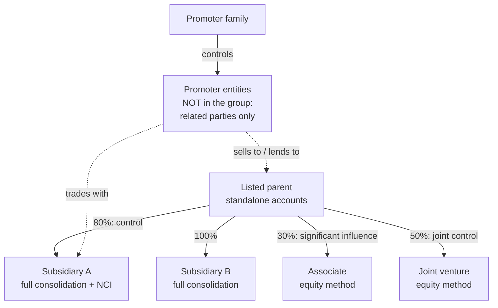
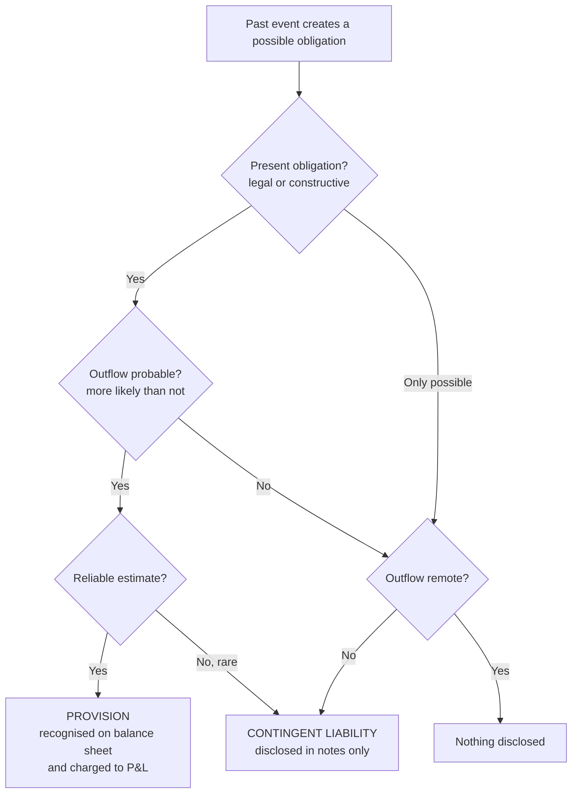

# 02.8 · Deeper cuts II: group accounts, tax, provisions

> **Why this matters:** an Indian listed company is usually a *group*. There is a listed parent, subsidiaries, associates
> and joint ventures, and promoter-owned entities trading with all of them. Where the cash sits in that group, what the
> tax line really means, which liabilities are only in the notes, and how much of "profit" belongs to someone else
> decide whether reported earnings are *your* earnings.

**Learning objectives** — after this lesson you can:

- Classify an investee as a subsidiary, associate, joint venture or joint operation, and state how each is accounted for.
- Compute goodwill and non-controlling interest on an acquisition (partial and full goodwill methods), and split consolidated profit between owners and NCI.
- Explain why Indian investors read both standalone and consolidated statements, and list what each can hide.
- Explain deferred tax assets and liabilities as timing differences, compute a DTL from book vs tax depreciation, read Kaveri's tax line, and describe the MAT legacy including the Finance Act 2026 change.
- Distinguish provisions, contingent liabilities and contingent assets under Ind AS 37, and size Kaveri's contingent liabilities per share.
- Measure ESOP cost under Ind AS 102 and explain why "adjusted EBITDA excluding ESOP" is suspect; explain FX translation, basic hedge accounting, OCI and related-party disclosures.

**Prerequisites:** [02.3 The income statement](03-the-income-statement.md), [02.4 The balance sheet](04-the-balance-sheet.md),
[02.6 How the three statements link](06-linking-the-three-statements.md), [02.7 Deeper cuts I](07-deeper-cuts-assets-and-expenses.md)  ·  **Time:** ~150 min

---

## 1. Group accounts: who is inside the fence?

A **group** is a parent and the entities it controls. The accounting for each investee depends on how much power the
investor has over it, not on a fixed ownership percentage.

| Relationship | Test (Ind AS) | Typical holding | Accounting in consolidated statements |
|:--|:--|:--|:--|
| **Subsidiary** | **Control** (Ind AS 110): power over the investee, exposure to variable returns, and the ability to use that power to affect those returns | > 50% voting, or less with de facto control | **Full consolidation**: 100% of assets, liabilities, revenue and expenses line by line; the outside shareholders' share shown as **non-controlling interest (NCI)** |
| **Associate** | **Significant influence** (Ind AS 28): power to participate in policy decisions, without control | 20–50% presumed | **Equity method**: one line on the balance sheet ("investments accounted for using the equity method") and one line in the P&L ("share of profit of associates") |
| **Joint venture** | **Joint control** (Ind AS 111), with rights to the *net assets* | Often 50:50 | Equity method, as for an associate |
| **Joint operation** | Joint control, with rights to specific *assets* and obligations for specific *liabilities* | Varies | Recognise *your share* of each asset, liability, revenue and expense |
| **Financial investment** | None of the above | Usually < 20% | Fair value, through P&L or through OCI (Ind AS 109) |

**Control** is about substance. A 45% holder with the right to appoint most of the board, where the other 55% is
scattered among thousands of retail holders, may control the investee. A 51% holder whose partner has veto rights over
the budget may not. The significant judgements note tells you which calls were made. Read it whenever a company
consolidates something it owns less than half of, or fails to consolidate something it owns more than half of.

The bottom of that diagram matters most in India. **Promoter-owned entities are outside the group.** Transactions with
them are *disclosed* as related-party transactions (§10), not consolidated. Kaveri Castings Pvt Ltd, owned by Kaveri's
promoters, is one of these.

---

## 2. Consolidation mechanics

To consolidate a subsidiary, the accountant:

1. **Adds** the parent's and subsidiary's statements line by line (100% of the subsidiary, even if the parent owns 80%).
2. **Eliminates** the parent's "investment in subsidiary" against the subsidiary's equity at acquisition, recognising
   **goodwill** and **NCI** (§2.1).
3. **Eliminates intra-group transactions and balances**: sales between group companies, loans, interest, dividends and
   **unrealised profit** on goods still held within the group at year-end. The group cannot make a profit by selling to
   itself.
4. **Allocates** profit and equity between **owners of the parent** and **NCI**.

Because step 1 adds 100%, **consolidated revenue, EBITDA, debt and cash include 100% of every subsidiary**, while only
the owners' share of profit belongs to you. Two consequences:

- EV must add NCI, or your EV/EBITDA is too low ([01.2](../01-markets-101/02-shares-market-cap-and-enterprise-value.md)).
- EPS is always "PAT attributable to owners of the parent" ÷ shares.

### 2.1 Worked example 1: Tapti Industries buys 80% of Sindhu Polymers

Fictional **Tapti Industries** buys 80% of **Sindhu Polymers** on 1-Apr-2025 for **₹400 Cr** in cash. Sindhu's book
net assets are ₹300 Cr. In the **purchase price allocation (PPA)**, Tapti identifies customer relationships worth ₹50 Cr
that are not on Sindhu's books (to be amortised over 10 years). The uplift has no tax base, so a **deferred tax
liability** arises on it at 25.17%.

**Step 1: fair value of identifiable net assets**

| ₹ Cr | |
|:--|--:|
| Sindhu's net assets at book value | 300.00 |
| + Customer relationships (fair-value uplift) | 50.00 |
| − Deferred tax liability on uplift (50 × 25.17%) | (12.58) |
| **= Fair value of identifiable net assets** | **337.42** |

**Step 2: goodwill and NCI.** Ind AS 103 lets the acquirer measure NCI either at its **proportionate share of
identifiable net assets** ("partial goodwill") or at **fair value** ("full goodwill").

$$\text{Goodwill} = \text{Consideration} + \text{NCI} - \text{FV of identifiable net assets}$$

| ₹ Cr | Partial goodwill | Full goodwill |
|:--|--:|--:|
| Consideration paid | 400.00 | 400.00 |
| NCI | 67.48 (= 20% × 337.42) | 95.00 (fair value of the 20%) |
| Less: FV of identifiable net assets | (337.42) | (337.42) |
| **Goodwill** | **130.07** | **157.58** |

The partial method gives the familiar short-cut: goodwill = 400 − 80% × 337.42 = 130.07. The full method also grosses
up goodwill for the NCI's share.

**Step 3: year-1 profit (FY26).** Sindhu earns PAT of ₹60 Cr on its own books and pays a ₹20 Cr dividend (₹16 Cr to
Tapti, ₹4 Cr to the minority). Tapti's own PAT, excluding the dividend, is ₹120 Cr.

| FY26, ₹ Cr | Tapti standalone | Tapti consolidated |
|:--|--:|--:|
| Tapti's own PAT | 120.00 | 120.00 |
| Dividend from Sindhu (80% × 20) | 16.00 | eliminated |
| Sindhu's PAT (own books) | – | 60.00 |
| Amortisation of customer relationships (50 / 10) | – | (5.00) |
| Deferred tax credit on that amortisation (5 × 25.17%) | – | 1.26 |
| **PAT** | **136.00** | **176.26** |
| attributable to NCI (20% × 56.26) | – | 11.25 |
| **attributable to owners of Tapti** | **136.00** | **165.01** |

NCI on the balance sheet at 31-Mar-2026 = 67.48 + 11.25 − 4.00 dividend = **₹74.73 Cr**.

What to notice:

- **The standalone P&L counts only the cash that came up as a dividend** (₹16 Cr). The consolidated P&L counts the
  owners' share of everything Sindhu earned, cash or not.
- **The PPA creates a recurring non-cash charge** (₹5 Cr amortisation a year). Management may exclude this in an
  "adjusted PAT". That is more defensible than excluding ESOP costs (§8), but still check it.
- **Goodwill is not amortised.** It sits at ₹130.07 Cr until an impairment test says otherwise ([02.7 §4](07-deeper-cuts-assets-and-expenses.md)).
- **Changes in ownership that keep control** (say Tapti later buys the remaining 20%) are **equity transactions**.
  No gain, no loss, no new goodwill; the difference goes straight to equity. **Losing control** triggers a remeasurement
  of any retained stake at fair value, with the gain in P&L. That is why a "stake sale" can produce a large one-off
  profit in one company and nothing in another.

### 2.2 Associates and joint ventures: the equity method

Tapti also owns 30% of **Godavari Coatings**, bought for ₹90 Cr. In FY26 Godavari earns PAT of ₹40 Cr and pays dividends
of ₹10 Cr.

| Equity-method investment in Godavari, ₹ Cr | |
|:--|--:|
| Opening carrying amount | 90.0 |
| + Share of profit (30% × 40) — shown in P&L below operating profit | 12.0 |
| − Dividend received (30% × 10) — reduces the investment | (3.0) |
| **Closing carrying amount** | **99.0** |

The consolidated P&L shows **one line**, "share of profit of associates and joint ventures: ₹12.0 Cr". None of Godavari's
revenue, EBITDA or debt appears anywhere in Tapti's consolidated statements. If Godavari has ₹200 Cr of debt, Tapti's
economic share (₹60 Cr) is invisible in Tapti's net debt. Two analyst rules:

- **Exclude associate income from operating metrics** (EBITDA, EBIT, operating ROCE) and value associates separately,
  for example at market value if listed or at a multiple of the share of profit.
- **Look through to associates' and JVs' balance sheets** (summarised financial information is disclosed in the notes)
  when a big part of the group's economics runs through them. Indian groups with large JVs with foreign partners
  (autos, insurance, chemicals) need this.

---

## 3. Standalone vs consolidated: why Indians read both

In the US, investors essentially read only consolidated statements. In India, **listed companies publish both standalone
(parent only) and consolidated statements**, in the annual report and in quarterly results. Experienced Indian analysts
read both, because each hides things the other shows.

| Question | Where to look | Why |
|:--|:--|:--|
| Is the group's cash where the listed shareholders can reach it? | Consolidated cash vs standalone cash; subsidiary-wise AOC-1 | Cash in a subsidiary (especially overseas or with minority partners) can only reach the parent as dividends, loan repayments or buybacks, often with tax leakage or partner consent |
| Is the parent funding loss-making subsidiaries? | **Standalone**: loans to subsidiaries, investments, guarantees given | Consolidation *eliminates* intra-group loans, so the consolidated balance sheet never shows them |
| Are subsidiaries borrowing against parent guarantees? | Standalone contingent liabilities ("corporate guarantees given on behalf of subsidiaries") | The parent's shareholders bear that risk |
| Is profit growth coming from the core company or from acquisitions? | Standalone growth vs consolidated growth | A flat standalone business dressed up by acquired subsidiaries is a different story |
| Where are the related-party flows? | Standalone and each subsidiary's RPT disclosures | Money can leave the group through a subsidiary rather than through the listed parent |
| What does the auditor say about the subsidiaries? | Consolidated audit report: "other auditors", unaudited components | Material subsidiaries audited by small firms, or not audited at all, reduce reliance |

**A real example of why this matters: Coffee Day Enterprises.** In January 2023 SEBI found that ₹3,535 Cr had been
diverted from **seven subsidiaries** of Coffee Day Enterprises Ltd to Mysore Amalgamated Coffee Estates Ltd (MACEL), an
entity related to the promoter. It imposed a ₹26 Cr penalty and directed the company to pursue recovery. Only
≈₹110.75 Cr had been recovered by 30-Sep-2022 ([ThePrint, 24-Jan-2023](https://theprint.in/economy/sebi-slaps-rs-26-crore-fine-on-coffee-day-enterprises/1332783/);
[Business Standard](https://www.business-standard.com/amp/article/markets/market-regulator-sebi-imposes-rs-26-crore-penalty-on-coffee-day-enterprises-123012401334_1.html)).
The flows ran through the *subsidiaries*, not the listed parent. An analyst reading only the parent's standalone
statements, or only the headline consolidated numbers, would have had to dig into subsidiary-level receivables and
related-party balances to see it. This is a regulatory finding, not an allegation. More in [09.5](../09-forensics/05-governance-red-flags-india.md).

---

## 4. Business combinations and goodwill

Ind AS 103 (*Business Combinations*) uses the **acquisition method**. The acquirer measures the identifiable assets
acquired and liabilities assumed at **fair value** on the acquisition date, recognises intangibles the target never
recorded (customer relationships, brands, technology, order backlog), and books the residual as **goodwill**.

Goodwill represents what the acquirer paid for things that cannot be separately identified: synergies, the assembled
workforce, expected growth, and any overpayment. Under Ind AS:

- **Goodwill is not amortised.** It is tested for impairment **annually** at the level of the CGUs expected to benefit
  ([02.7 §4](07-deeper-cuts-assets-and-expenses.md)). Old Indian GAAP amortised goodwill, so pre-Ind AS earnings were
  depressed by goodwill amortisation that no longer exists ([02.9](09-ind-as-ifrs-us-gaap.md)).
- **Bargain purchase gains** (paying less than the fair value of net assets) go to **capital reserve** (through OCI or
  directly in equity), not the P&L. This is an Indian carve-out from IFRS 3 ([BCAJ](https://bcajonline.org/journal/ind-as-carve-out-recognition-of-bargain-purchase-gain-and-common-control-transactions/)).
- **Common-control combinations** (merging two companies owned by the same promoter group) are accounted for by
  **pooling of interests** at book values under Ind AS 103 Appendix C. No goodwill, no fair-value step-up. Many Indian
  group restructurings fall here.
- **Tax.** Since the Finance Act 2021, goodwill has not been a depreciable asset for Indian income tax. We could not
  re-verify how the Income-tax Act, 2025 words this, so check the current rules. Book goodwill and tax goodwill therefore
  often differ, which affects deferred tax.

**Analyst checks.** Compute goodwill and acquired intangibles as a % of equity. Compute ROIC both *including* goodwill
(did the acquirer earn a return on what it paid?) and *excluding* goodwill (how good is the underlying business?). See
[04.3](../04-financial-analysis/03-returns-on-capital.md). A serial acquirer whose ROIC including goodwill is well below its
WACC is destroying value however fast EPS grows.

---

## 5. Deferred tax: the timing differences

### 5.1 The intuition

A company keeps two sets of books by law, not by fraud. One follows Ind AS, for shareholders. The other follows the
Income-tax Act, for the tax department. They disagree on *timing*. Tax depreciation is faster than book depreciation,
some provisions are deductible only when paid, and losses can be carried forward.

**Deferred tax** makes the P&L tax charge reflect the tax that *belongs* to this year's accounting profit, whenever it is
actually paid:

$$\text{Tax expense (P\&L)} = \text{current tax (payable this year)} + \text{deferred tax (change in DTL} - \text{DTA)}$$

- A **deferred tax liability (DTL)** arises when the tax books are *ahead* of the accounts in claiming deductions.
  Classic case: accelerated tax depreciation. You have paid less tax so far, and will pay more later when book
  depreciation catches up.
- A **deferred tax asset (DTA)** arises when the company has paid tax *early*, or has future deductions banked:
  provisions (warranty, ECL on receivables, gratuity) deductible only when paid, carried-forward tax losses, and MAT
  credit (§5.4).

Ind AS 12 uses the **balance-sheet approach**: compare each asset's and liability's **carrying amount** with its **tax
base**. The difference × the enacted tax rate is the deferred tax balance. DTAs are recognised only to the extent that
future taxable profit is **probable**. Deferred tax is **not discounted**.

### 5.2 Worked example 2: a machine's DTL, year by year

A machine costs ₹100 Cr. Book: straight-line over 15 years (the Schedule II norm for general plant), 5% residual, so
₹6.33 Cr a year. Tax: for illustration, 15% written-down value a year (check the current income-tax depreciation rules
for any real asset). Tax rate 25.17%.

| Year | Book depreciation | Tax depreciation | Book value | Tax base | Temporary difference | DTL (× 25.17%) | Deferred tax expense in the year |
|:--|--:|--:|--:|--:|--:|--:|--:|
| 1 | 6.33 | 15.00 | 93.67 | 85.00 | 8.67 | 2.18 | 2.18 |
| 3 | 6.33 | 10.84 | 81.00 | 61.41 | 19.59 | 4.93 | 1.13 |
| 6 | 6.33 | 6.66 | 62.00 | 37.71 | 24.29 | 6.11 | 0.08 |
| 10 | 6.33 | 3.47 | 36.67 | 19.69 | 16.98 | 4.27 | (0.72) |
| 15 | 6.33 | 1.54 | 5.00 | 8.74 | (3.74) | (0.94) = DTA | (1.21) |

In year 1, if the business using the machine earns PBT of ₹20 Cr:

- taxable income = 20 + 6.33 (add back book depreciation) − 15.00 (deduct tax depreciation) = ₹11.33 Cr;
- **current tax** = 11.33 × 25.17% = ₹2.85 Cr, which is the cash;
- **deferred tax** = (15.00 − 6.33) × 25.17% = ₹2.18 Cr, which is the build-up of the DTL;
- **total tax expense** = ₹5.03 Cr = 25.17% × 20, so the P&L shows the "normal" rate even though cash tax was lower.

The DTL builds while tax depreciation runs ahead (to year 6) and then unwinds. **For a growing company that keeps
buying machines, the DTL never unwinds in aggregate.** New purchases keep replenishing it. That is why many analysts treat a
stable or growing DTL as quasi-equity rather than debt.

### 5.3 Reading Kaveri's tax line

| ₹ Cr | FY21 | FY24 | FY25 | FY26 |
|:--|--:|--:|--:|--:|
| PBT | 43.8 | 115.5 | 130.2 | 121.0 |
| Current tax | 10.0 | 26.1 | 31.8 | 29.5 |
| Deferred tax | 1.0 | 3.0 | 1.0 | 1.0 |
| Effective tax rate (total tax / PBT) | 25.1% | 25.2% | 25.2% | 25.2% |
| Current tax / PBT (≈ cash tax rate) | 22.8% | 22.6% | 24.4% | 24.4% |
| Closing DTL | 15.0 | 20.0 | 21.0 | 22.0 |

What the numbers say:

- The effective rate sits on the statutory 25.17%, as it should for a company under the concessional regime (22% +
  10% surcharge + 4% cess = 25.168%).
- Kaveri pays a bit less in cash than it expenses, and the difference builds the DTL by about ₹1 Cr a year.
- The FY24 jump to ₹3.0 Cr lines up with the Hosur plant going into service: accelerated tax depreciation on a
  ₹190 Cr asset.
- The FY26 DTL of ₹22.0 Cr implies cumulative timing differences of about 22.0 / 25.17% ≈ **₹87.4 Cr**, mostly the gap
  between book and tax written-down values of plant.
- Kaveri's cash-flow statement shows "income taxes paid" equal to current tax. That is a simplification; real companies
  have advance-tax and refund timing differences too.

**When the effective rate is *not* close to statutory, find out why.** The tax reconciliation note ([03.3](../03-reading-filings/03-notes-to-accounts.md))
lists the reasons. Typical ones are tax-exempt income, tax holidays (SEZ units), non-deductible expenses, losses in
subsidiaries with no DTA recognised, prior-year adjustments, and **changes in tax rates**. When a rate changes, all
deferred tax balances are remeasured and the difference hits P&L in one go. When companies moved to the 22% regime from
FY20, many booked one-off deferred-tax gains on remeasured DTLs. Treat such items as exceptional.

### 5.4 The MAT legacy, and what changed in 2026

**Minimum Alternate Tax (MAT)** is a floor tax on **book profit**. It exists because some companies showed large
accounting profits but little taxable income, thanks to incentives and accelerated depreciation. Such a company paid MAT
instead of normal tax. The excess of MAT over normal tax became a **MAT credit**, usable against normal tax in later years
(within 15 years) and typically carried as a **deferred-tax-type asset** on the balance sheet.

The regime has changed twice:

- **2019:** the concessional regime (22% base rate, Sec. 115BAA of the 1961 Act) exempted opting companies from MAT, but
  they **forfeited** unused MAT credit. Companies with large MAT credit balances often delayed switching.
- **Finance Act 2026** (notified 30-Mar-2026; effective from tax year 2026-27, i.e. income of FY27 onward). MAT becomes
  a **final tax at 14%** of book profit (down from 15%) for companies staying in the old regime. **No new MAT credit** is
  generated. MAT credit accumulated up to 31-Mar-2026 can be used **only if the company moves to the new regime**, capped
  at **25% of that year's tax liability**, within the original 15-year window. The provisions now sit in Section 206 of
  the Income-tax Act, 2025, which corresponds to the old Sections 115JB/115JAA ([summary of the Finance Act 2026 MAT
  amendment, Vishnu Daya & Co](https://vishnudaya.com/amendment-to-minimum-alternate-tax-mat-under-finance-act-2026/);
  [Mondaq analysis](https://www.mondaq.com/india/corporate-tax/1744034/minimum-alternate-tax-mat-amendments-in-union-budget-2026-a-critical-analysis);
  [Finance Act 2026 notified, TeamLease RegTech](https://www.teamleaseregtech.com/updates/article/54218/finance-act-2026-notified/); as of Sep-2026).

**Illustration (assumed rates, for a company with income above ₹10 Cr: 12% surcharge, 4% cess).** Book profit ₹100 Cr,
taxable income ₹20 Cr thanks to incentives.

- **Before FY27:** normal tax 20 × 34.94% = ₹6.99 Cr; MAT 100 × 17.47% = ₹17.47 Cr. The company pays ₹17.47 Cr and books a
  MAT credit asset of ₹10.48 Cr, so its P&L tax charge looked like ~₹7 Cr.
- **From FY27, staying in the old regime:** MAT 100 × 16.31% = **₹16.31 Cr, final**. No credit asset, so the P&L tax charge
  is now ~₹16 Cr. Old credit balances can only be used if the company switches regimes; otherwise they must be written off.

**Analyst implications for FY27 results:**

- Capital-intensive companies still on the old regime (power, infrastructure, some manufacturers with incentives) may show
  higher effective tax rates.
- Watch for **MAT credit write-offs** or **regime switches** with one-off deferred-tax effects.

Kaveri is already on the concessional regime at 25.17% (Sec. 115BAA of the 1961 Act; Section 200 of the Income-tax Act,
2025, as reported by [eztax.in](https://eztax.in/section-115baa-tax-rate-explained)), so it is unaffected.

---

## 6. Provisions, contingent liabilities and contingent assets (Ind AS 37)

### 6.1 The decision tree

- A **provision** is a liability of uncertain timing or amount. Examples: product warranties, restructuring (only once
  there is a detailed formal plan and those affected expect it), onerous contracts, legal claims the company expects to
  lose, and site-restoration / decommissioning obligations. The last are **discounted**, and the unwinding of the discount
  appears in finance costs. Provisions are measured at the **best estimate** of the amount needed to settle.
- A **contingent liability** is disclosed, not recognised. Indian notes list them under headings such as "claims against
  the company not acknowledged as debts", "disputed income-tax / GST / customs demands under appeal", "guarantees
  given" and "letters of credit". **Capital commitments** (contracts for capex not yet executed) are disclosed alongside.
- A **contingent asset** (a claim the company expects to win) is never recognised until virtually certain, and is
  disclosed only if an inflow is probable.
- **No provisions for future operating losses.** Provisions cannot be used to smooth profits, though in practice
  estimates give room to do exactly that.

### 6.2 The cookie jar

Provisions are estimates, so they can be tuned. The classic pattern: in a strong year the company **over-provides**
(for warranties, bad debts, inventory obsolescence, litigation), lowering profit that nobody will miss. In a weak year it
**releases** the excess, lifting profit. Look for provision balances that fall as a % of the underlying exposure
(warranty provision vs sales, ECL allowance vs overdue receivables) just when growth slows. Kaveri shows the mirror-image
risk, **under-provision**: its ECL allowance is ₹4.0 Cr against ₹62.4 Cr of receivables overdue more than six months,
only 6.4% cover (10.0% in FY25). See [04.7](../04-financial-analysis/07-quality-of-earnings.md) and [09.3](../09-forensics/03-expense-and-asset-red-flags.md).

### 6.3 Worked example 3: sizing Kaveri's contingent liabilities

From Kaveri's FY26 notes:

| Contingent item, ₹ Cr | FY25 | FY26 |
|:--|--:|--:|
| GST demand under appeal (solar systems classification: 5% vs 12%/18%) | 0.0 | 38.0 |
| Income-tax disputes (old assessment years) | 9.0 | 11.0 |
| Bank guarantees given (performance / tender) | 58.0 | 96.0 |

**Step 1: scale the tax disputes.** GST + income tax = 38.0 + 11.0 = **₹49.0 Cr**.

| Measure | Arithmetic | Result |
|:--|:--|--:|
| % of FY26 equity (₹706.1 Cr) | 49.0 / 706.1 | 6.9% |
| % of FY26 PAT (₹90.5 Cr) | 49.0 / 90.5 | 54.1% |
| Per diluted share (6.07 Cr) | 49.0 / 6.07 | ₹8.07 |
| % of CMP ₹390 | 8.07 / 390 | 2.1% |

**Step 2: probability-weight it.** You have to form a view. Suppose a 40% chance of losing the GST case and 30% on the
income-tax cases: 0.4 × 38.0 + 0.3 × 11.0 = **₹18.5 Cr**, or ≈₹3.05 per share. That is small against a ₹390 share price
(and ignores interest and penalties, which can be material in Indian tax disputes).

**Step 3: ask whether it is a one-off or a run-rate problem.** This is the step most people skip. The GST dispute is
about the *rate* on solar systems. If Kaveri loses and its state-agency tender prices are fixed *inclusive* of GST, the
issue isn't just ₹38 Cr of past tax. The same GST-inclusive price would carry a lower taxable value on every future sale.
On FY26 solar revenue of ₹355.9 Cr (27% of revenue), a 5% → 12% rate change on a fixed GST-inclusive price
(355.9 × 1.05 = ₹373.7 Cr) would cut revenue to 373.7 / 1.12 = ₹333.7 Cr, about **₹22 Cr a year**, and at 18% by about
**₹39 Cr a year**. Whether tender contracts allow a pass-through of GST changes is the question to put to management.
This is a hypothetical built on the disclosure, not a known fact about Kaveri's contracts.

**Step 4: guarantees.** Bank guarantees of ₹96 Cr (13.6% of equity, up 65.5% in a year) are not debt. They become cash
outflows only if Kaveri fails to perform on tenders. But they grow with solar exposure and use up banking limits,
so include them in any stress test of the solar business ([04.5](../04-financial-analysis/05-leverage-solvency-liquidity.md)).

---

## 7. Share-based payments (Ind AS 102)

### 7.1 The mechanics

An **ESOP** (employee stock option plan) gives employees the right to buy shares at a fixed **exercise price** after a
**vesting period**, usually subject to staying employed (and sometimes to performance targets). Ind AS 102 treats this as
compensation:

- **Equity-settled** awards (options or shares): measure the **fair value at grant date**, using an option-pricing model
  (Black-Scholes or a binomial/Monte-Carlo model for market conditions). Expense it over the **vesting period**, with the
  credit to equity ("share options outstanding account"). The grant-date value is **not re-marked** afterwards. The
  expected number of awards that will vest is trued up for forfeitures (non-market conditions), but not for share-price
  moves.
- **Cash-settled** awards (stock appreciation rights paid in cash) are a **liability**, remeasured at fair value at every
  reporting date until settled.
- **Graded vesting** (for example, 25% vests each year for four years) is treated as four separate awards, each expensed
  over its own vesting period. That **front-loads** the expense.
- The dilution shows up in **diluted EPS** via the treasury-stock method (see [01.2](../01-markets-101/02-shares-market-cap-and-enterprise-value.md)).

#### Worked example 4: pricing and expensing a grant

Fictional **Vaigai Software** grants 10 lakh options at an exercise price of ₹500 when the share price is ₹500. Inputs:
expected life 4 years, volatility 35%, risk-free rate 6.5%, dividend yield 0.5%.

$$C = S e^{-qT}N(d_1) - K e^{-rT} N(d_2),\qquad d_1 = \frac{\ln(S/K) + (r - q + \tfrac{1}{2}\sigma^2)T}{\sigma\sqrt{T}},\quad d_2 = d_1 - \sigma\sqrt{T}$$

With these inputs, $d_1 = 0.693$, $d_2 = -0.007$, $N(d_1) = 0.756$, $N(d_2) = 0.497$, giving **₹178.75 per option**.
Management expects 10% forfeitures.

Total expected cost = 10,00,000 × 178.75 × 0.90 = **₹16.09 Cr**.

| Vesting pattern | Year 1 | Year 2 | Year 3 | Year 4 | Total |
|:--|--:|--:|--:|--:|--:|
| Cliff vesting after 3 years | 5.36 | 5.36 | 5.36 | – | 16.09 |
| Graded 25%/yr over 4 years | 8.38 | 4.36 | 2.35 | 1.01 | 16.09 |

Under graded vesting, 52% of the total cost lands in year 1. The volatility input matters too: at 25% vol the option is
worth ₹148.23, at 45% ₹209.33. That ±10-point range moves the total expense by roughly ±17%.

!!! tip "Trader's lens"
    An ESOP grant is the company's shareholders **writing call options** to employees. The accounting marks that short
    call once, at inception, using a vol the company picks, and then amortises the premium over the vesting period. It
    never re-marks, however far the stock moves. No derivatives desk would be allowed to book a written option that way.
    The economic cost to existing shareholders is the *current* value of the options they are short, and the **dilution**
    when they're exercised is the delta finally being delivered. That is why the P&L charge is a floor, not a ceiling,
    on the true cost in a rising market.

### 7.2 Why "adjusted EBITDA excluding ESOP" is suspect

Many Indian new-age companies headline a profit measure that adds back share-based payment expense. Examples:

- Paytm (One 97 Communications) presented **"EBITDA before ESOP cost"**. It turned positive, at about ₹31 Cr (~2% of
  revenue), in Q3 FY23, a quarter in which the company's consolidated **net loss was about ₹392 Cr**
  ([Q3 FY23 earnings call transcript, AlphaStreet](https://alphastreet.com/india/one97-communication-ltd-paytm-q3-fy23-earnings-concall-transcript/);
  [Business Standard, Feb-2023](https://www.business-standard.com/amp/article/news-cm/paytm-spurts-after-q3-net-loss-narrows-to-rs-392-cr-123020600310_1.html)).
  The gap between the two measures reflects ESOP cost *and* D&A, finance cost, other income and tax. It is not all ESOP.
- Zomato (now Eternal) has defined "Adjusted EBITDA" as EBITDA **plus share-based payment expense minus rent paid on
  Ind AS 116 leases** ([company overview deck, May-2024](https://b.zmtcdn.com/investor-relations/Zomato_overview_deck_May24.pdf)).
  Deducting rent to undo Ind AS 116 is a sensible, conservative adjustment. Adding back ESOP is not.

The argument against the ESOP add-back is simple. **Stock compensation is compensation.** If the options weren't granted,
employees would demand cash to stay. "Non-cash" does not mean "not a cost": the shareholders pay through dilution
instead of through the bank account. Two consistent ways to treat it:

1. **Treat ESOP expense as if it were cash** (keep it in EBITDA and FCF) and use the *basic* share count, or
2. **Exclude the expense but count the dilution in full** (all outstanding and expected future grants in the share
   count). This is harder to do well.

Do not do both: excluding the expense *and* using the undiluted share count counts the benefit twice. For Kaveri the
issue is small. Share-based payment was ₹2.4 Cr in FY26, 1.3% of EBITDA, and diluted shares (6.07 Cr) are 1.2% above
basic (6.00 Cr). For some loss-making tech companies it has been the single largest cost line. More in
[07.4](../07-special-valuation/04-high-growth-and-loss-making.md).

---

## 8. Foreign currency and hedge accounting (the basics)

### 8.1 Transactions and translation (Ind AS 21)

Every entity has a **functional currency**, the currency of its primary economic environment (₹ for Kaveri). Two
different things get called "forex impact":

- **Transactions in foreign currency.** An export invoice in USD, an import payable in EUR, a USD loan. **Monetary items**
  (receivables, payables, loans, cash) are retranslated at the **closing rate** every balance-sheet date, and the
  differences go to **P&L**. Non-monetary items (inventory, PP&E) stay at historical rates.
- **Translation of foreign operations.** A US subsidiary's USD statements are translated into ₹ for consolidation. Assets
  and liabilities go at the closing rate and income and expenses at average rates. The difference goes to **OCI**, into
  the **foreign currency translation reserve (FCTR)**, and is recycled to P&L only when the foreign operation is sold.

Where the FX gains/losses sit in the P&L varies. Some go in other income or other expenses; exchange differences on
foreign-currency borrowings, to the extent they are an adjustment to interest cost, are treated as **finance costs**
(Ind AS 23). Always find them before judging "operating" margins.

**A legacy quirk.** Companies that used the old AS 11 option (paragraph 46A) to spread exchange differences on long-term
foreign-currency loans over the loan's life may continue to do so for loans taken before their Ind AS transition. This is
an Ind AS carve-out ([taxguru, carve-outs](https://taxguru.in/finance/carve-outs-ind.html)). Look for an "FCMITDA"
(foreign currency monetary item translation difference account) balance in older infrastructure and power companies.

### 8.2 Hedge accounting (Ind AS 109)

Derivatives (forwards, swaps, options) are always carried at **fair value**, with changes in **P&L** by default. The
problem is that the thing being hedged is often *not* marked to market in the same way. The hedge then creates P&L
volatility instead of removing it. **Hedge accounting** is an optional, documentation-heavy regime that realigns them:

- **Cash-flow hedge** (hedging a *future* cash flow, such as next quarter's export sales): the effective portion of the
  derivative's gain or loss goes to **OCI** (the **cash-flow hedge reserve**) and is **recycled to P&L when the hedged
  sale hits P&L**. Any ineffective portion goes to P&L immediately.
- **Fair-value hedge** (hedging a recognised asset or liability's value): both the derivative and the hedged item are
  marked through P&L, so they offset.
- **Net-investment hedge** (hedging a foreign subsidiary): gains or losses go to OCI alongside the FCTR.

#### Worked example 5: an exporter's USD 10 million

Fictional **Palar Textiles** (functional currency ₹, year-end 31 March) invoices a US customer USD 10 million on 1-Jan,
when the spot rate is ₹86.0/USD. It books revenue of ₹86.0 Cr and a receivable. The same day it sells USD 10 million
forward for 30-Apr delivery at ₹86.4.

| ₹ Cr | FY (to 31-Mar) | Next FY (April) | Total |
|:--|--:|--:|--:|
| Receivable: spot 86.0 → 84.5 at 31-Mar → 84.0 on 30-Apr | (1.5) | (0.5) | (2.0) |
| Forward: 86.4 vs forward rate 84.7 at 31-Mar, settled vs spot 84.0 | 1.7 | 0.7 | 2.4 |
| **Net FX in P&L** | **0.2** | **0.2** | **0.4** |

Both legs are monetary or derivative items marked through P&L, so they offset **without** hedge accounting. The company
receives 10m × ₹86.4 = ₹86.4 Cr, the locked rate.

Now suppose instead that on 1-Jan Palar sells forward USD 10 million of *next quarter's forecast* exports, not yet
invoiced, for 30-Jun delivery at ₹86.4. At 31-Mar the 30-Jun forward rate is ₹85.2, so the forward is worth
10m × (86.4 − 85.2) = **₹1.2 Cr**. There is no receivable to offset it.

- **Without hedge accounting**, ₹1.2 Cr of "FX gain" lands in *this* year's P&L, and the matching lower revenue lands next
  year.
- **With cash-flow hedge accounting**, the ₹1.2 Cr sits in the cash-flow hedge reserve in OCI and is recycled into
  revenue when the June sale is booked. Revenue then reflects the hedged rate.

!!! tip "Trader's lens"
    This is the familiar problem of a hedged book where one leg is marked and the other isn't: the P&L shows noise that
    the economics don't have. Hedge accounting is simply the accounting permission to report the package, not the legs.
    The cash-flow hedge reserve is the "unrealised P&L on the hedge, parked until the hedged flow arrives". When a company
    moves big amounts through that reserve, read its hedge note like a risk report: notional, tenor, rates locked, and
    what happens if the forecast exports don't materialise (then the reserve is recycled to P&L at once).

---

## 9. Other comprehensive income (OCI)

**OCI** collects gains and losses that Ind AS keeps out of profit, usually because they are unrealised, long-horizon or
volatile. **Total comprehensive income (TCI) = PAT + OCI.** Schedule III splits OCI into two buckets:

| OCI item | Recycled to P&L later? | Where you'll meet it |
|:--|:--|:--|
| Remeasurement of defined-benefit plans (actuarial gains/losses on gratuity) | **No** | Almost every Indian company; driven by discount-rate and salary-growth assumptions |
| Fair-value changes on equity investments designated at FVOCI | **No** (gain/loss on sale stays in equity) | Holdcos, groups holding strategic stakes |
| Revaluation surplus on PP&E (revaluation model) | **No** | Rare in India |
| Foreign currency translation reserve (FCTR) | **Yes**, on disposal of the foreign operation | Companies with overseas subsidiaries |
| Cash-flow hedge reserve (effective portion) | **Yes**, when the hedged item hits P&L | Exporters, importers, companies with foreign-currency loans |
| Fair-value changes on debt instruments at FVOCI | **Yes**, on sale | Insurers, NBFCs, treasuries |
| Share of OCI of associates and JVs | Split between the two buckets | Groups with large associates |

Why it matters:

- **Equity (and book value per share) moves with OCI**, not just with PAT, so ROE computed on book value inherits OCI noise.
- A company whose OCI is persistently negative (recurring actuarial losses, FVOCI losses) is reporting a PAT that
  overstates the growth in shareholders' wealth.
- Items that are never recycled **never touch EPS**, so a loss on a strategic stake can quietly erode book value
  without appearing in any P&L. Always check the TCI line against PAT.

---

## 10. Related-party transactions (Ind AS 24)

A **related party** includes persons who control, jointly control or significantly influence the company, **key
management personnel (KMP)** and their close family members, and entities those persons control. It also covers group
companies, associates, joint ventures and post-employment benefit plans. Ind AS 24 requires disclosure of each
relationship, the transactions (purchases, sales, loans, guarantees, rent, royalties, remuneration) and the outstanding
balances. It does not stop them happening.

In India, related-party transactions (RPTs) are central to governance analysis because promoters often own businesses
that trade with the listed company. Approvals come from two sources:

- **Companies Act, 2013 (Sec. 188):** board or shareholder approval for RPTs outside the ordinary course of business or
  not at arm's length.
- **SEBI LODR (Reg. 23):** audit-committee approval of all RPTs, and shareholder approval for **material** RPTs. The
  materiality threshold used to be the lower of ₹1,000 Cr or 10% of annual consolidated turnover. The LODR (Fifth
  Amendment) Regulations, 2025 replaced it with a **scale-based** threshold: 10% of turnover up to ₹20,000 Cr turnover,
  then tapering, capped at ₹5,000 Cr. The change took effect in December 2025
  ([Fox Mandal summary](https://foxmandal.in/sebis-fifth-lodr-amendment-2025/);
  [Lexplosion](https://lexplosion.in/sebi-issues-sebi-lodr-fifth-amendment-regulations-2025-introduces-new-thresholds-for-determination-of-materiality-of-related-party-transactions/);
  verify the current text before relying on it). Governance detail is in [05.6](../05-business-analysis/06-corporate-governance-india.md).

#### Worked example 6: Kaveri Castings

Kaveri buys castings from **Kaveri Castings Pvt Ltd**, owned by the promoter family. The audit committee approves the
purchases as "at arm's length".

| ₹ Cr | FY21 | FY22 | FY23 | FY24 | FY25 | FY26 |
|:--|--:|--:|--:|--:|--:|--:|
| Purchases from Kaveri Castings | 25.5 | 35.6 | 43.1 | 52.1 | 68.7 | 89.2 |
| Material cost | 391.7 | 507.9 | 575.1 | 635.8 | 754.8 | 858.0 |
| RPT as % of material cost | 6.5% | 7.0% | 7.5% | 8.2% | 9.1% | 10.4% |

- **Growth:** RPT purchases grew at a **28.5% CAGR** over FY21–FY26 against 17.0% for total material cost. The promoter's
  private company is taking a rising share of Kaveri's spending.
- **Leak sensitivity.** If prices were just 5% above true arm's length, the overcharge would be 89.2 × 5 / 105 =
  **₹4.25 Cr** pre-tax. That is 3.5% of FY26 PBT, or ₹3.18 Cr after tax, ≈ **₹0.53 per share** against EPS of ₹15.1.
  Small per year. But it compounds with volume, and the benefit goes to one group of shareholders at the expense of the
  others.
- **Approval threshold.** Kaveri's turnover (₹1,318 Cr) is well below ₹20,000 Cr, so the materiality threshold is 10% of
  turnover under both old and new rules: ₹131.8 Cr for FY27. FY26 purchases were 68% of that. As an extrapolation, not a
  forecast: if RPT purchases kept growing at 28.5% while revenue followed the reference base case, they would cross the
  shareholder-approval threshold in **FY28** (≈₹147 Cr vs ≈₹145 Cr). Tracking that line is part of monitoring the thesis.

What to ask: does Kaveri benchmark Kaveri Castings' prices against independent foundries (and disclose it)? Are the
payment terms the same as for other suppliers? Is any capacity at Kaveri Castings being funded by Kaveri's advances? The
forensic treatment is in [09.4](../09-forensics/04-cash-flow-games.md) and [09.5](../09-forensics/05-governance-red-flags-india.md).

---

!!! info "India notes"
    - **Both sets of results.** Listed Indian companies publish standalone and consolidated statements, and Reg 33 of
      LODR requires both in quarterly results. **AOC-1** in the annual report summarises each subsidiary, associate and
      JV (see [03.2](../03-reading-filings/02-anatomy-of-an-annual-report.md)).
    - **Income-tax Act, 2025** replaced the 1961 Act from 1-Apr-2026. Section numbers changed (e.g., the concessional
      corporate rate formerly in Sec. 115BAA is reported to sit in Section 200; MAT in Section 206). Old annual reports
      and much commentary use the old numbers ([Wikipedia overview](https://en.wikipedia.org/wiki/Income-tax_Act,_2025)).
    - **Finance Act 2026**: MAT is a 14% final tax for old-regime companies from tax year 2026-27, with no new credit.
      Old credit is usable only on switching regime, capped at 25% of tax liability a year. Expect write-offs and
      regime switches in FY27 accounts.
    - **RPT thresholds** under LODR became scale-based from December 2025 (lower of ₹1,000 Cr / 10% of turnover before).
      Section 188 approvals under the Companies Act run in parallel.
    - **Contingent liabilities** in Indian reports are dominated by **tax disputes** (income tax, GST, customs), often
      running for a decade. Track the *trend*, the forum (CIT(A), ITAT, High Court) and whether the company has lost at
      lower levels.
    - **ESOPs** for listed companies are governed by the SEBI (Share Based Employee Benefits and Sweat Equity)
      Regulations, 2021. ESOP trusts that buy shares in the market are treated as part of the company, so the shares
      they hold are deducted from equity.

!!! warning "Common mistakes"
    - Using consolidated PAT instead of **PAT attributable to owners** for EPS or P/E, or forgetting NCI in EV.
    - Adding associate income into EBITDA or operating ROCE.
    - Reading only consolidated statements and missing parent-level loans and guarantees to subsidiaries (eliminated on
      consolidation), or reading only standalone and missing losses and debt in subsidiaries.
    - Treating a growing DTL as debt that is about to be paid. For a growing capex-heavy company it rarely unwinds in
      aggregate.
    - Treating contingent liabilities as zero because they are "only disclosed". Probability-weight them, and ask whether
      the dispute is a one-off or a run-rate issue.
    - Accepting "adjusted EBITDA excluding ESOP" and then also using the basic share count.
    - Ignoring OCI: book value and ROE move with actuarial losses, FVOCI marks and FCTR.
    - Assuming "approved by the audit committee as arm's length" means the pricing has been independently benchmarked.

## Key terms

| Term | Meaning |
|:--|:--|
| **Control** | Power over an investee, exposure to its variable returns, and the ability to use that power to affect them (Ind AS 110) |
| **Subsidiary / associate / joint venture** | Investee that is controlled / significantly influenced (≈20–50%) / jointly controlled with rights to net assets |
| **Non-controlling interest (NCI)** | The share of a subsidiary's equity and profit belonging to shareholders other than the parent |
| **Equity method** | One-line accounting for associates and JVs: cost + share of profit − dividends received |
| **Purchase price allocation (PPA)** | Assigning the acquisition price to identifiable assets and liabilities at fair value; the residual is goodwill |
| **Goodwill** | Consideration + NCI − fair value of identifiable net assets; not amortised under Ind AS, tested annually for impairment |
| **Common-control combination** | Combination of entities controlled by the same party; accounted for by pooling at book values (Ind AS 103 App. C) |
| **Standalone vs consolidated** | Parent-only statements vs the whole group's statements |
| **AOC-1** | The annual-report form summarising each subsidiary, associate and JV |
| **Deferred tax liability / asset** | Future tax payable / recoverable arising from timing differences between book and tax (Ind AS 12) |
| **Tax base** | The amount attributed to an asset or liability for tax purposes |
| **MAT / MAT credit** | Minimum Alternate Tax on book profit; the credit for MAT paid above normal tax (no new credit from FY27) |
| **Provision** | A recognised liability of uncertain timing or amount (Ind AS 37) |
| **Contingent liability** | A possible obligation, or one not probable or measurable, disclosed in notes but not recognised |
| **Equity-settled share-based payment** | ESOPs or shares valued at grant-date fair value and expensed over vesting; not re-marked |
| **Graded vesting** | Awards vesting in tranches; each tranche is expensed separately, which front-loads cost |
| **Functional currency** | Currency of an entity's primary economic environment |
| **FCTR** | Foreign currency translation reserve: OCI balance from translating foreign operations |
| **Cash-flow hedge reserve** | OCI balance holding the effective portion of hedges of future cash flows until they hit P&L |
| **Other comprehensive income (OCI)** | Gains and losses kept out of profit; TCI = PAT + OCI |
| **Related party** | A person or entity with control, joint control, significant influence or KMP status, or a group member (Ind AS 24) |

## Check your understanding

**1.** Company A owns 45% of B; the remaining 55% is spread across 40,000 retail shareholders, and A appoints five of B's
seven directors. Company C owns 55% of D, but D's other shareholder must approve D's annual budget and all capex. How is
each investee accounted for, and why?

Answer

**B is likely A's subsidiary** (full consolidation, 55% NCI). A has *de facto* control: it directs the relevant activities
through board appointments, and the dispersed holders are unlikely to coordinate against it. **D is likely a joint
venture** of C (equity method, if C has rights to net assets). The partner's veto over budget and capex means decisions on
relevant activities need unanimous consent, i.e., joint control. Ownership percentage is evidence, not the test.

**2.** Tapti pays ₹400 Cr for 80% of a company with fair-value identifiable net assets of ₹337.42 Cr. What are goodwill
and NCI under the partial method? If NCI's fair value is ₹95 Cr, what is goodwill under the full method?

Answer

- **Partial method:** NCI = 20% × 337.42 = **₹67.48 Cr**; goodwill = 400 + 67.48 − 337.42 = **₹130.07 Cr**.
- **Full method:** goodwill = 400 + 95 − 337.42 = **₹157.58 Cr**.

**3.** A parent's standalone balance sheet shows ₹600 Cr of "loans to subsidiaries" and ₹900 Cr of "corporate guarantees
given on behalf of subsidiaries" in contingent liabilities. Neither appears in the consolidated balance sheet. Why not,
and why should you care?

Answer

Intra-group loans are **eliminated** on consolidation: the parent's receivable offsets the subsidiary's payable. The
subsidiaries' external borrowings (which the guarantees back) *are* in consolidated debt, but the guarantee itself is
intra-group. You should care because:

- the parent's shareholders are funding and underwriting the subsidiaries;
- if the subsidiaries are loss-making or have minority partners, the value may be stuck or lost;
- rating agencies and lenders look at the standalone parent's exposure.

Check the subsidiaries' profitability in AOC-1 and whether the loans earn interest.

**4.** Kaveri's FY26 deferred tax expense was ₹1.0 Cr and its closing DTL ₹22.0 Cr. Roughly what cumulative timing
difference does the DTL represent, and why did FY24 show ₹3.0 Cr of deferred tax?

Answer

22.0 / 25.17% ≈ **₹87.4 Cr** of cumulative taxable temporary differences, mostly book written-down value of plant
exceeding its tax written-down value. FY24's larger charge (₹3.0 Cr, implying ≈₹11.9 Cr of new timing difference)
coincides with the ~₹190 Cr Hosur plant going into service. Accelerated tax depreciation on a large new asset widens the
book–tax gap quickly.

**5.** A company in the old tax regime carries ₹150 Cr of MAT credit on its balance sheet at 31-Mar-2026 and has no plan
to move to the new regime. What does the Finance Act 2026 imply for this asset and for its FY27 tax charge?

Answer

MAT credit accumulated up to 31-Mar-2026 is usable **only if the company moves to the new regime** (capped at 25% of the
year's tax liability, within 15 years). If it stays in the old regime, the credit cannot be used, so the asset is not
recoverable and must be **written off**, a one-off charge. Going forward, MAT at 14% is a **final** tax with no credit.
Its effective tax rate rises whenever MAT exceeds normal tax, because the old "credit" that kept the P&L tax charge low
no longer exists.

**6.** Kaveri has a ₹38 Cr GST demand under appeal and ₹11 Cr of income-tax disputes. Compute the total per diluted share
and as a % of the ₹390 share price. Then give one reason the GST dispute could matter more than the ₹38 Cr suggests.

Answer

49.0 / 6.07 = **₹8.07 per share**, 2.1% of ₹390. The GST dispute concerns the **rate** on solar systems. If lost and tender
prices are fixed inclusive of GST, the higher rate would reduce the taxable value (revenue) on every future solar sale.
On FY26 solar revenue that is ≈₹22 Cr a year at 12% or ≈₹39 Cr at 18%, unless contracts allow pass-through. A disclosed
one-off may hide a run-rate margin issue.

**7.** A company reports "EBITDA before ESOP" of ₹120 Cr, ESOP expense of ₹90 Cr and reported EBITDA of ₹30 Cr. Its
diluted share count is 8% above basic. A colleague values it on ₹120 Cr × an EBITDA multiple and divides by basic shares.
What's wrong?

Answer

It **double-counts the benefit**: it excludes the compensation cost *and* ignores the dilution that is the form the cost
takes. ESOPs are real compensation; had they not been granted, employees would need cash. Either keep the ₹90 Cr as a
cost (EBITDA ₹30 Cr) with basic shares, or exclude it and use a fully diluted share count that includes current *and
expected future* grants. The first is usually more robust.

**8.** An exporter's OCI shows a large cash-flow hedge reserve loss this year, while PAT is up. Where will that loss go,
and what would make it hit P&L all at once?

Answer

The effective portion of losses on forwards hedging **future** exports is parked in the cash-flow hedge reserve. It will
be **recycled into P&L (typically revenue) when the hedged exports are recognised**, lowering future reported revenue
toward the hedged rate. If the forecast exports are no longer expected to occur, the accumulated amount is **reclassified
to P&L immediately**. Book value already reflects the loss. Future PAT does not yet.

## Go deeper

- Ind AS 110, 28, 111, 103, 12, 37, 102, 21, 109 (hedging chapter) and 24: the standards, free on the [MCA website](https://www.mca.gov.in/). Read the application guidance on "control" (Ind AS 110 Appendix B).
- SEBI's order in the matter of Coffee Day Enterprises Ltd (January 2023), available on [sebi.gov.in](https://www.sebi.gov.in/) under Enforcement → Orders: a case study in how money moves through subsidiaries.
- Warren Buffett, Berkshire Hathaway shareholder letters (notably 1992), free at [berkshirehathaway.com](https://www.berkshirehathaway.com/letters/letters.html): the classic argument that stock options are compensation and belong in the income statement.
- Howard Schilit, Jeremy Perler & Yoni Engelhart, *Financial Shenanigans* (4th ed., 2018): chapters on key-metric manipulation, "adjusted" earnings and acquisition accounting.
- ICAI's *Indian Accounting Standards (Ind AS): An Overview* and the Ind AS Technical Facilitation Group bulletins ([icai.org](https://www.icai.org/)): practical Indian interpretations, including MAT and deferred-tax questions.

---
[← Previous: 02.7 Deeper cuts I — assets & expenses](07-deeper-cuts-assets-and-expenses.md) · [Module index](index.md) · [Next: 02.9 Ind AS vs IFRS vs US GAAP →](09-ind-as-ifrs-us-gaap.md)
