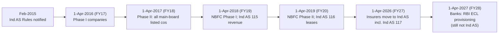

# 02.9 · Ind AS vs IFRS vs US GAAP (and old Indian GAAP)

> **Why this matters:** a ten-year Indian time series crosses at least three accounting breaks: old Indian GAAP → Ind AS,
> excise → GST, and operating leases → Ind AS 116. A global peer comparison crosses frameworks too. Numbers that look
> comparable often aren't. This lesson is the translator: which rulebook a number was produced under, and how to put two
> numbers on the same basis before you compare them.

**Learning objectives** — after this lesson you can:

- Place any Indian entity in the right framework (Ind AS, old Indian GAAP, the bank and insurer regimes) and say when it switched.
- List the main Ind AS carve-outs from IFRS and say which ones matter for analysis.
- Spot old-GAAP and transition artefacts in pre-FY17 data, and correct a growth rate for the excise-to-GST break.
- Adjust US GAAP financials for LIFO, R&D, leases and other differences before comparing them with an Ind AS peer.
- Explain IRAC vs ECL provisioning, the April 2027 transition for Indian banks, and the Ind AS 117 status of insurers (as of Sep-2026).
- Translate Indian annual-report vocabulary into US 10-K vocabulary and back.

**Prerequisites:** [02.3](03-the-income-statement.md)–[02.8](08-deeper-cuts-group-accounts-and-other.md) of this module  ·  **Time:** ~100 min

---

## 1. Three questions before you compare any two numbers

Before comparing a margin, a growth rate or a multiple, ask:

1. **Which rulebook?** Ind AS, old Indian GAAP (the "AS" standards), IFRS, US GAAP, or a regulator-prescribed format
   (banks, insurers)?
2. **Which year?** Did the rulebook, or a major standard within it, change between the two periods you are comparing?
3. **Which entity?** Standalone or consolidated ([02.8](08-deeper-cuts-group-accounts-and-other.md))? Same fiscal
   year-end?

Most comparison errors in Indian equity research are not arithmetic errors. They come from getting one of these three
questions wrong.

!!! tip "Trader's lens"
    You already do this with volatility. An implied vol quoted on a 252-trading-day basis and one quoted on a 365-calendar-
    day basis are different numbers for the same option. So are vols with and without event days, or with different
    holiday calendars. Nobody on a desk compares them raw: you normalise the convention first. Accounting frameworks are
    conventions for turning the same cash flows into reported numbers. Normalise the convention, *then* compare.

---

## 2. The family tree

- **IFRS** (International Financial Reporting Standards) is issued by the IASB in London and used for listed companies in
  most of the world outside the US. Older standards are numbered **IAS 1–41** and newer ones **IFRS 1–18**.
- **Ind AS** (Indian Accounting Standards) are **converged with IFRS**, not identical to it. They are notified by the
  Central Government (Ministry of Corporate Affairs) under the Companies Act, 2013, on the recommendation of ICAI's
  Accounting Standards Board after review by NFRA. The numbering mirrors IFRS: **Ind AS 1–41 ↔ IAS 1–41** and
  **Ind AS 101–118 ↔ IFRS 1–18** (for example, Ind AS 115 ↔ IFRS 15, Ind AS 116 ↔ IFRS 16).
- **Old Indian GAAP** is the "Accounting Standards" **AS 1–32** framework notified under the Companies (Accounting
  Standards) Rules. It is still used by smaller unlisted companies, SME-exchange companies and (with RBI formats) banks.
- **US GAAP** is issued by the FASB and organised as the **Accounting Standards Codification (ASC)**, with topics such as
  ASC 606 (revenue) and ASC 842 (leases). The SEC requires it for US domestic registrants.

---

## 3. Who uses what in India (as of September 2026)

| Entity | Framework | Since | Notes |
|:--|:--|:--|:--|
| Companies (listed or unlisted) with net worth ≥ ₹500 Cr, plus their holding, subsidiary, JV and associate companies | Ind AS | Periods from 1-Apr-2016 (Phase I) | Comparatives for FY16 restated; FY15 and earlier on old GAAP |
| All other companies listed (or in the process of listing) on a main board, and unlisted companies with net worth ≥ ₹250 Cr, plus group companies | Ind AS | Periods from 1-Apr-2017 (Phase II) | Sources: [Taxmann](https://www.taxmann.com/post/blog/analysis-ind-as-applicability-for-non-financial-companies); [ClearTax](https://cleartax.in/s/applicability-ind-as) |
| NBFCs (incl. HFCs) with net worth ≥ ₹500 Cr | Ind AS (Schedule III, Division III) | 1-Apr-2018 | |
| Listed NBFCs and unlisted NBFCs with net worth ₹250–500 Cr | Ind AS | 1-Apr-2019 | Smaller unlisted NBFCs may stay on old GAAP |
| Companies listed **only on an SME exchange** | Old Indian GAAP (Ind AS optional) | — | Exempt from mandatory Ind AS; a company migrating to the main board comes under Ind AS |
| Smaller unlisted companies (below thresholds, not part of an Ind AS group) | Old Indian GAAP (Schedule III, Division I) | — | Most private companies you'll find on MCA21 |
| Scheduled commercial banks | Old Indian GAAP + RBI formats (Third Schedule, Banking Regulation Act) + IRAC | — | Ind AS deferred "till further notice" by RBI in March 2019; **ECL provisioning from 1-Apr-2027** (§7) |
| Insurers (life, general, health, reinsurers) | **Ind AS from 1-Apr-2026**, with 2 years of parallel reporting and up to 1 year of forbearance on request | FY27 | IRDAI regulations notified 30-Mar-2026 (§7.3) |

Rules worth remembering:

- **Once in, always in.** A company that has applied Ind AS cannot go back, even if its net worth later falls below the
  threshold.
- **The group pulls you in.** A small private subsidiary of an Ind AS company must also use Ind AS.
- **Schedule III has three divisions:** Division I (old GAAP companies), Division II (Ind AS, non-financial) and
  Division III (Ind AS NBFCs). The format tells you the framework at a glance.

---

## 4. Ind AS vs IFRS: the carve-outs

Ind AS adopts IFRS with a small number of **carve-outs**: deliberate departures made for Indian conditions. The ones
still relevant:

| Area | IFRS | Ind AS | Does it matter for analysis? |
|:--|:--|:--|:--|
| Bargain purchase gain (Ind AS 103) | Recognised in P&L | Recognised in OCI / directly in equity as **capital reserve** | Yes, mildly: an "acquisition gain" won't flatter Indian PAT |
| Common-control combinations | Outside IFRS 3's scope; practice varies | Ind AS 103 Appendix C: **pooling of interests** at book values | Yes: promoter-group mergers create no goodwill or fair-value step-ups |
| Investment property (Ind AS 40) | Cost model or fair-value model | **Cost model only**; fair value disclosed | Yes, for real estate and holdcos: read the fair-value note, since the balance sheet understates |
| Long-term foreign-currency loans taken before Ind AS transition | Exchange differences to P&L | Option to continue the old AS 11 treatment (capitalise or amortise via FCMITDA) | For older power, infra and telecom balance sheets |
| FCCB conversion option (Ind AS 32) | Option in a foreign currency is a derivative liability at fair value | Treated as **equity** if the conversion price is fixed in any currency | Removes MTM swings from Indian PAT |
| Discount rate for employee benefits (Ind AS 19) | High-quality corporate bond yields | **Government bond** yields | Affects gratuity obligations and OCI |
| Associates' accounting policies (Ind AS 28) | Uniform policies required | Uniform policies "unless impracticable" | Associates' numbers may be on different policies |
| Covenant breach on long-term loans (Ind AS 1) | Reclassify to current unless waiver obtained by period-end | Not current if the lender agrees, after period-end but before approval of the accounts, not to demand payment | Can make an Indian balance sheet look less stressed at year-end |

Sources: [taxguru — carve-outs in Ind AS](https://taxguru.in/finance/carve-outs-ind.html);
[BCAJ on bargain purchase and common control](https://bcajonline.org/journal/ind-as-carve-out-recognition-of-bargain-purchase-gain-and-common-control-transactions/).
Several early carve-outs (for example on real-estate revenue under the old Ind AS 18 / 11) disappeared when Ind AS 115 and
Ind AS 109 replaced the older standards. In 2018 the Ind AS 20 amendment realigned grant accounting with IAS 20
([PwC](https://www.pwc.in/research-insights/2018/reportinginbrief-amendments-to-ind-as-20.html)).

**The other difference is timing.** India adopts new IFRSs with a lag:

- **IFRS 17** (insurance contracts) was issued by the IASB in 2017 and effective in 2023. Its Indian twin, **Ind AS 117**,
  was notified in August 2024, and insurers move to it only from FY27 (§7.3).
- **IFRS 18** (*Presentation and Disclosure in Financial Statements*, issued April 2024, effective 1-Jan-2027) replaces
  IAS 1. It adds defined **operating profit** and **profit before financing and income taxes** subtotals, and requires
  disclosure of **management-defined performance measures** ([IFRS Foundation](https://www.ifrs.org/issued-standards/list-of-standards/ifrs-18-presentation-and-disclosure-in-financial-statements/)).
  As of our check we could not confirm that an Ind AS equivalent has been notified. Watch MCA and ICAI announcements,
  because it will change how Indian P&Ls are laid out when it comes.

For most non-financial companies, **Ind AS and IFRS numbers are comparable after minor checks**. The big gaps are with
old Indian GAAP and with US GAAP.

---

## 5. Old Indian GAAP vs Ind AS: reading pre-FY17 reports

When you pull ten years of data from Screener or an annual-report archive, the early years were prepared under a
different rulebook. What changed at transition:

| Item | Old Indian GAAP (pre-Ind AS) | Ind AS | Effect on your time series |
|:--|:--|:--|:--|
| Revenue and indirect taxes | Revenue often shown **gross of excise duty**, with excise deducted below | Excise duty (while it existed) included in revenue; **GST excluded** after 1-Jul-2017 | Revenue and margins break in FY18 (worked example 1) |
| Proposed dividend | Accrued as a liability at year-end (until the 2016 amendment) | Recognised only when approved by shareholders | Equity and "provisions" shift by a year's dividend |
| Goodwill | Amalgamation goodwill amortised (AS 14, typically over ≤5 years) | Not amortised; impairment-tested | Old PAT was depressed by amortisation |
| Leases | Operating leases off balance sheet (AS 19) | Ind AS 17 until FY19, then **Ind AS 116** from FY20 | EBITDA and net debt break in FY20 ([02.7](07-deeper-cuts-assets-and-expenses.md)) |
| Investments | Long-term at cost less "permanent" diminution; current at lower of cost or fair value | Fair value (FVTPL / FVOCI) or amortised cost | Treasury income and book value more volatile under Ind AS |
| Receivables | "Provision for doubtful debts", typically incurred-loss | **Expected credit loss** model | Allowances generally earlier and larger |
| Derivatives | No comprehensive fair-value standard | Fair value through P&L unless hedge-accounted | Hidden MTM losses under old GAAP |
| Deferred tax | Income-statement approach on timing differences (AS 22) | Balance-sheet approach on temporary differences (Ind AS 12) | Deferred tax on items like fair-value uplifts |
| Extraordinary and prior-period items | Separate categories (AS 5) | No extraordinary items; errors corrected retrospectively; Schedule III shows "exceptional items" | Old "extraordinary" lines don't map neatly |
| OCI | Did not exist | Actuarial gains/losses, FVOCI, FCTR, hedge reserves go through OCI | Book value moves without PAT |
| Share-based payment | Often intrinsic value (near zero for at-the-money options) | Fair value at grant (Ind AS 102) | ESOP cost appears or jumps in FY17/FY18 |

**Transition artefacts** show up in the first Ind AS annual report (FY17 or FY18), which contains **Ind AS 101
reconciliations** of equity and profit from old GAAP to Ind AS. Read them once for every company you follow long term.
Look especially for **fair value as deemed cost** elections on land and plant (a one-time jump in equity that lowers ROE
thereafter) and for large reclassifications between revenue and expenses.

#### Worked example 1: the excise-to-GST growth illusion

GST replaced excise duty and most other indirect taxes on **1-Jul-2017**, a quarter into FY18. Under the Ind AS practice
of the time, excise duty was included in revenue, whereas GST is not. So FY18 revenue contained three months "gross" and
nine months "net".

Fictional **Yamuna Cables** has net sales (excluding indirect tax) of ₹1,000 Cr in FY17, growing a true 10% to ₹1,100 Cr
in FY18, spread evenly across quarters. Assume excise at 12.5% of net sales (illustrative).

| ₹ Cr | FY17 | FY18 |
|:--|--:|--:|
| Q1 revenue (Apr–Jun), incl. excise | 281.3 | 309.4 (= 275.0 × 1.125) |
| Q2–Q4 revenue | 843.8 (incl. excise) | 825.0 (net of GST) |
| **Reported revenue** | **1,125.0** | **1,134.4** |
| **Reported growth** | | **0.8%** |
| True growth in net sales | | 10.0% |
| EBITDA (₹150 Cr in FY17, ₹165 Cr in FY18) | 150.0 | 165.0 |
| Reported EBITDA margin | 13.3% | 14.5% |
| True EBITDA margin (on net sales) | 15.0% | 15.0% |

Two illusions at once: **growth looks like 0.8%** instead of 10.0%, and the **margin appears to expand 120 bps** when it
was flat. Most Indian manufacturers disclosed "revenue net of excise/GST" or "comparable growth" figures in FY18.
Aggregator data usually doesn't adjust. Any FY17→FY18 comparison for an excise-paying manufacturer must be done on
net-of-tax revenue.

---

## 6. US GAAP vs Ind AS: the differences that matter to analysts

US GAAP and IFRS have converged on revenue (ASC 606 / IFRS 15) and, largely, on business combinations. The differences
that still move numbers:

| Topic | Ind AS / IFRS | US GAAP | Analyst action |
|:--|:--|:--|:--|
| Inventory cost formula | FIFO or weighted average; **LIFO banned** | **LIFO allowed** (tax-conformity rule) | Convert LIFO to FIFO with the LIFO reserve (6.1) |
| Inventory write-down reversal | Allowed (up to cost) | Prohibited | Minor |
| Development costs | Capitalised if six criteria met (Ind AS 38) | **R&D expensed** (ASC 730); only certain software costs capitalised | Put both on one basis (6.2) |
| Impairment reversal (non-goodwill assets) | Allowed | **Prohibited** | Indian/IFRS profits can include write-backs |
| Impairment test for long-lived assets | One step: carrying amount vs recoverable amount | Recoverability test on *undiscounted* cash flows first, then fair value | US impairments tend to come later and bigger |
| Lessee accounting | Single model: all leases → depreciation + interest | **Operating** leases: single straight-line lease cost in operating expenses; finance leases like Ind AS | US EBITDA is **not** boosted by operating leases (6.3) |
| Extraordinary items | Prohibited; Schedule III has "exceptional items" | Eliminated by ASU 2015-01; "unusual or infrequent items" shown within continuing operations | Check what is inside Indian "exceptional items" |
| Contingent liabilities | Provide if **more likely than not** (>50%); use the best estimate | Accrue if **probable** (a higher bar, generally read as "likely to occur"); if no best estimate in a range, accrue the **low end** | US provisions can be smaller and later |
| Interest and dividends in the cash-flow statement | Choice (Kaveri: interest paid in CFF, interest received in CFI) | Interest paid and received, and dividends received, in **CFO**; dividends paid in CFF | Normalise CFO before comparing FCF conversion |
| PP&E revaluation | Revaluation model permitted | Not permitted | Rare in India; check land |
| Component depreciation | Required | Permitted, not required | Minor |
| Stock comp, graded vesting | Each tranche expensed separately (front-loaded) | Straight-line allowed for service-only awards; forfeitures can be recognised as they occur | Similar totals, different timing |
| Consolidation | Single control model | Voting-interest model **plus variable-interest-entity (VIE)** model | VIEs are the Enron lesson ([G4](../13-case-studies/global/04-enron-2001.md)) |
| Credit losses on loans | Three-stage ECL: 12-month in stage 1, lifetime in stages 2–3 | **CECL**: lifetime expected loss from day one | US bank allowances are front-loaded |
| Non-GAAP / adjusted metrics | IFRS 18 (from 2027) requires disclosure of management-defined measures; Ind AS equivalent not yet confirmed | SEC Regulation G / Reg S-K Item 10(e): reconciliation to GAAP, no undue prominence | Treat Indian "adjusted" metrics with extra care |
| Government grants | Ind AS 20 | Historically no dedicated US standard for business entities (companies analogised to IAS 20); check the current ASC | Rarely material for US peers |

### 6.1 LIFO → FIFO (worked example 2)

A fictional US valve maker, **Ohio Valve Corp**, reports under LIFO (USD million):

| USD m | Reported (LIFO) | Adjustment | FIFO basis |
|:--|--:|:--|--:|
| Inventory (year-end) | 400 | + LIFO reserve at year-end (110) | 510 |
| COGS | 2,000 | − increase in LIFO reserve (110 − 80 = 30) | 1,970 |
| Revenue | 2,600 | | 2,600 |
| Gross margin | 23.1% | | 24.2% |
| Pre-tax profit | | + 30 | |
| Net income (tax 21%) | | + 23.7 | |
| Equity | | + 110 × (1 − 0.21) = + 86.9 (plus a deferred-tax liability of 23.1) | |

The **LIFO reserve**, disclosed in the inventory note, is the gap between FIFO (or current) cost and LIFO carrying
value. Its *change* is the year's COGS difference. Note what you are doing: you are putting the US company on the
basis an Indian company is *required* to use.

### 6.2 R&D: capitalised vs expensed (worked example 3)

An Ind AS company capitalises development costs of ₹60 Cr this year and amortises ₹35 Cr of past development within its
D&A of ₹60 Cr. Its US GAAP competitor expenses all R&D. To compare them, restate the Indian company on an expense basis:

| ₹ Cr | Ind AS as reported | US-GAAP-style (expense all development) |
|:--|--:|--:|
| Revenue | 1,000 | 1,000 |
| EBITDA | 220 (22.0%) | 220 − 60 = **160 (16.0%)** |
| D&A | 60 | 60 − 35 = 25 |
| EBIT | 160 (16.0%) | 160 − 60 + 35 = **135 (13.5%)** |

A 6-point EBITDA-margin "lead" over the US peer can be entirely a capitalisation choice. For valuation you can go the
other way and capitalise the US peer's R&D (Damodaran's approach; see [04.3](../04-financial-analysis/03-returns-on-capital.md)).
Either direction is fine as long as both companies end up on the same basis.

### 6.3 Leases across the Atlantic (worked example 4)

An Indian retailer (Ind AS 116) and a US retailer (ASC 842, all operating leases), both with revenue of ₹5,000 Cr
equivalent:

| ₹ Cr | Indian retailer | US retailer |
|:--|--:|--:|
| Reported EBITDA | 750 (15.0%) | 520 (10.4%) — after straight-line lease cost of 240 |
| Lease cost / payments | Cash lease payments 250 (sitting in CFF, not in EBITDA) | 240 inside operating expenses |
| **EBITDA after rent** | 750 − 250 = **500 (10.0%)** | **520 (10.4%)** |
| **EBITDAR (before rent)** | **750 (15.0%)** | 520 + 240 = **760 (15.2%)** |

The Indian retailer's apparent 460 bp margin advantage becomes a 40 bp *disadvantage* on either consistent basis. The
same logic applies to EV: include lease liabilities in EV only when using the Ind AS-style EBITDA
([02.7 §6](07-deeper-cuts-assets-and-expenses.md)).

### 6.4 Three more that trip people up

- **"Probable" means different things.** A lawsuit a US company judges 60% likely to lose may not be accrued (below
  "probable"). Under Ind AS it would be provided. When comparing litigation-heavy sectors (pharma, telecom), read both
  companies' contingency notes, not just the balance sheets.
- **CFO is not like-for-like.** A US company's CFO is *after* interest paid. Kaveri's is *before* interest paid, because
  Kaveri classifies interest paid in CFF. To compare, move interest paid into CFO for the Indian company: Kaveri FY26 CFO
  65.1 − interest on borrowings 15.6 = ₹49.5 Cr on a US-style basis. Lease interest (₹1.4 Cr inside the ₹5.9 Cr of lease
  payments) would also sit in CFO under US GAAP.
- **Exceptional ≠ extraordinary.** Indian "exceptional items" are a Schedule III presentation line for items of such size
  or nature that separate disclosure helps. They are not a GAAP category of "things to ignore". Every one needs a look
  ([04.7](../04-financial-analysis/07-quality-of-earnings.md)).

---

## 7. Banks, NBFCs and insurers: the special regimes

### 7.1 NBFCs: Ind AS 109 expected credit loss

Ind AS NBFCs (like Nirmal Finance) provide for credit losses under **Ind AS 109's three-stage ECL model**:

- **Stage 1**: performing loans with no significant increase in credit risk since origination. Allowance = **12-month**
  expected loss.
- **Stage 2**: significant increase in credit risk (30 days past due is the standard rebuttable presumption). Allowance =
  **lifetime** expected loss.
- **Stage 3**: credit-impaired (generally 90+ days past due; the NPA equivalent). Allowance = lifetime expected loss.

Expected loss is conceptually $\text{PD} \times \text{LGD} \times \text{EAD}$ (probability of default × loss given
default × exposure at default), adjusted for forward-looking macro scenarios. Nirmal FY26 ([reference page](../appendix/running-example/nirmal-finance.md)):

| ₹ Cr | FY26 |
|:--|--:|
| Gross loans | 6,920.0 |
| Stage-3 loans (GNPA) | 200.7 |
| Stage-3 ECL | 110.4 → provision coverage 55.0% |
| Performing loans (stage 1 + 2) | 6,719.3 |
| Stage 1 + 2 ECL | 60.5 → 0.90% of performing loans |
| **Total ECL** | **170.9** (2.47% of gross loans) |

RBI layers prudential rules on top. NBFCs follow RBI's asset-classification norms, and where the Ind AS impairment
allowance is lower than the provision RBI's income recognition, asset classification and provisioning (IRAC) norms would
require, the shortfall is appropriated from profit to an "impairment reserve". This comes from RBI's circular of
13-Mar-2020; we could not re-verify its current form, so check it. Lending analysis in depth is in [07.1](../07-special-valuation/01-banks-and-nbfcs.md).

### 7.2 Banks: IRAC today, ECL from 1-Apr-2027

Banks have **not** moved to Ind AS. RBI deferred it "till further notice" in March 2019, pending amendments to the Banking
Regulation Act. They prepare accounts in the Banking Regulation Act formats under old Indian GAAP, and provide for loans
under RBI's **IRAC norms**. IRAC is an *incurred-loss* regime: a loan becomes an NPA at **90 days past due**, and minimum
provisions rise with how long it has been an NPA. The long-standing minimums, from RBI's Master Circular on IRAC, are:

- ~0.40% on standard assets (varies by sector);
- 15% on sub-standard assets (NPA ≤ 12 months);
- 25% / 40% / 100% on the secured portion of doubtful assets by age, and 100% on the unsecured portion;
- 100% on loss assets.

Verify the current percentages in the latest master circular on [rbi.org.in](https://www.rbi.org.in/).

**The change:** on **27-Apr-2026** RBI issued final **Expected Credit Loss directions**, effective **1-Apr-2027**.

- **Scope:** commercial banks, excluding small finance banks, payments banks, local area banks and regional rural banks.
- **Design:** banks must classify exposures into three stages and provide forward-looking expected losses, subject to
  RBI-specified **prudential floors**.
- **Transition:** the day-1 impact can be spread over four years, FY28 to FY31.

Sources: [Business Standard, 27-Apr-2026](https://www.business-standard.com/finance/news/rbi-to-roll-out-ecl-based-provisioning-framework-from-april-2027-126042701330_1.html);
[KPMG India, May 2026](https://kpmg.com/in/en/insights/2026/05/expected-credit-loss.html);
[Regnology summary](https://www.regnology.net/en/resources/regulatory-topics/reserve-bank-of-indias-ecl-directions/).

This is a change in **provisioning rules within the existing bank accounting framework**. It is not a move to Ind AS.

#### Worked example 5: the same loan book under IRAC vs ECL (illustrative)

Suppose Nirmal's FY26 book sat in a bank under IRAC. We don't have an ageing of Nirmal's stage-3 loans, so *assume* 60% is
sub-standard, 30% doubtful-1 (secured) and 10% in older buckets, provided at 100% for simplicity:

| Bucket | Balance (₹ Cr) | Rate | IRAC provision (₹ Cr) |
|:--|--:|--:|--:|
| Standard assets | 6,719.3 | 0.40% | 26.9 |
| Sub-standard (60% of 200.7) | 120.4 | 15% | 18.1 |
| Doubtful-1 (30%) | 60.2 | 25% | 15.1 |
| Older / loss (10%) | 20.1 | 100% | 20.1 |
| **Total IRAC** | | | **80.1** |
| **Nirmal's actual Ind AS ECL** | | | **170.9** |

For this book the forward-looking ECL is about **twice** the IRAC minimum:

- stage-3 coverage is 55% vs ~27% under IRAC here;
- stage-2 loans carry lifetime losses;
- performing loans carry 0.90% rather than 0.40%.

The ₹90.8 Cr difference is about 1.4% of average loans, larger than a year of Nirmal's credit cost. That is the kind of
**day-1 hit** that made RBI allow a four-year glide path for banks. When comparing an NBFC's provision coverage with a
bank's before FY28, you are comparing an expected-loss number with an incurred-loss number.

!!! tip "Trader's lens"
    IRAC is marking a credit book on *realised* defaults. ECL is marking it on *expected* defaults, closer to marking to an
    implied hazard rate. Moving from one to the other is a one-time re-mark (the day-1 adjustment), after which provisions
    track the forward-looking expectation and so move *earlier* in a downturn. Bank earnings will become more pro-cyclical
    in timing but less backloaded, much as a book marked to implied vol shows losses the day the surface moves, not the
    day the realised vol arrives.

### 7.3 Insurers: Ind AS 117 arrives

MCA notified **Ind AS 117** (the Indian equivalent of IFRS 17, *Insurance Contracts*) in August 2024. IRDAI then notified
the IRDAI (Actuarial, Finance and Investment Functions of Insurers) (Amendment) Regulations, 2026 on **30-Mar-2026**
(IRDAI/Reg/2/216/2026). The regulations require **all insurers** (life, general, health, reinsurers) to prepare financial
statements under **Ind AS from 1-Apr-2026**, with:

- **two years of parallel reporting** to IRDAI under the old framework as well;
- a **forbearance of up to one year** for insurers that applied by 30-Apr-2026 with a board-approved action plan and
  monthly progress reports.

Sources: [taxguru — IRDAI amendment regulations 2026](https://taxguru.in/corporate-law/irdai-actuarial-finance-investment-functions-insurers-amendment-regulations-2026.html);
[Taxmann](https://www.taxmann.com/post/blog/irdai-proposes-ind-as-implementation-for-insurers). As of Sep-2026, check each
listed insurer's Q1 FY27 filing to see whether it reported under Ind AS or availed forbearance.

What changes for an analyst is *how profit emerges*. Under Ind AS 117 an insurer measures groups of contracts as:

$$\text{PV of future cash outflows} - \text{PV of premiums} + \text{risk adjustment} + \text{contractual service margin (CSM)}$$

The **CSM** is the unearned profit, released over the coverage period. Mini-example (worked example 6):

- A group of policies has PV premiums of ₹1,000 Cr, PV claims and expenses of ₹850 Cr and a risk adjustment of ₹50 Cr.
  The CSM is therefore **₹100 Cr**. No day-1 profit is recognised; about ₹10 Cr a year is released over a 10-year
  coverage period (if coverage units are even).
- If PV outflows were ₹1,080 Cr, the group would be **onerous**, and the ₹130 Cr loss is recognised **immediately**.

"Insurance revenue" under Ind AS 117 is not gross premium, so historical premium-based ratios break in FY27. Indian life
insurers have long been valued on **embedded value** and **value of new business** ([07.2](../07-special-valuation/02-insurers-amcs-exchanges.md)).
Those remain the key metrics, but the P&L and book value will look different from FY27.

---

## 8. The translator: Indian annual report ↔ US 10-K

### 8.1 Vocabulary

| Indian annual report (Ind AS, Schedule III) | US 10-K (US GAAP) | Note |
|:--|:--|:--|
| Revenue from operations (incl. "other operating revenue") | Net sales / Revenues | Indian other operating revenue includes export incentives, scrap sales and PLI in some cases |
| Other income | Other income (expense), net; interest income | Exclude from operating metrics in both |
| Cost of materials consumed + purchases of stock-in-trade + changes in inventories | Cost of goods sold / cost of revenues | Indian P&L is **by nature**; US P&L is **by function** |
| Employee benefits expense | Spread across COGS, SG&A and R&D | Total staff cost isn't on the face of a US P&L; find it in the notes, if disclosed at all |
| Other expenses | Selling, general & administrative (and parts of COGS) | |
| Finance costs | Interest expense | |
| Exceptional items | Unusual or infrequent items; restructuring charges | No "extraordinary items" in either |
| Profit before tax / Profit after tax (PAT) | Income before income taxes / Net income | |
| PAT attributable to owners / to non-controlling interests | Net income attributable to the company / to noncontrolling interests | |
| Other comprehensive income; other equity reserves | OCI; accumulated other comprehensive income (AOCI) | |
| Equity share capital + securities premium | Common stock (par value) + additional paid-in capital (APIC) | |
| Retained earnings, general reserve | Retained earnings (accumulated deficit); treasury stock | Indian buybacks are extinguished; US companies often hold treasury stock |
| Property, plant & equipment; capital work-in-progress | Property and equipment, net; construction in progress | |
| Right-of-use assets; lease liabilities | Operating lease ROU assets and liabilities; finance lease assets and liabilities | |
| Trade receivables (net of ECL allowance) | Accounts receivable, net of allowance for credit losses | |
| Trade payables (with MSME dues disclosure) | Accounts payable | MSME disclosure is India-specific |
| Borrowings, non-current / current | Long-term debt; current portion of long-term debt; short-term borrowings | |
| Contingent liabilities and commitments (note) | Commitments and contingencies (note) | Different recognition thresholds (§6) |
| Standalone financial statements | No equivalent (only limited parent-only information) | Indian-specific second set |
| Board's Report; Management Discussion & Analysis | Item 7 — MD&A | Filings map in [03.5](../03-reading-filings/05-other-documents.md) |
| Key Audit Matters (SA 701); CARO report | Critical Audit Matters (PCAOB AS 3101); no CARO equivalent | |
| ₹ crore (10 million) and lakh (0.1 million) | USD thousands or millions | Convert units before computing multiples |
| FY26 = April 2025 – March 2026 | Fiscal year often = calendar year | Calendarise before comparing growth |

### 8.2 Standards map

| Topic | Ind AS | IFRS / IAS | US GAAP (ASC) | Old Indian GAAP (AS) |
|:--|:--|:--|:--|:--|
| Inventories | Ind AS 2 | IAS 2 | 330 | AS 2 |
| Cash-flow statement | Ind AS 7 | IAS 7 | 230 | AS 3 |
| Income taxes | Ind AS 12 | IAS 12 | 740 | AS 22 |
| PP&E | Ind AS 16 | IAS 16 | 360 | AS 10 |
| Employee benefits | Ind AS 19 | IAS 19 | 715 | AS 15 |
| Government grants | Ind AS 20 | IAS 20 | (none dedicated historically) | AS 12 |
| Foreign currency | Ind AS 21 | IAS 21 | 830 | AS 11 |
| Borrowing costs | Ind AS 23 | IAS 23 | 835-20 | AS 16 |
| Related parties | Ind AS 24 | IAS 24 | 850 | AS 18 |
| Associates | Ind AS 28 | IAS 28 | 323 | AS 23 |
| EPS | Ind AS 33 | IAS 33 | 260 | AS 20 |
| Impairment | Ind AS 36 | IAS 36 | 350 / 360 | AS 28 |
| Provisions and contingencies | Ind AS 37 | IAS 37 | 450 | AS 29 |
| Intangibles, R&D | Ind AS 38 | IAS 38 | 350 / 730 | AS 26 |
| Share-based payment | Ind AS 102 | IFRS 2 | 718 | ICAI Guidance Note |
| Business combinations | Ind AS 103 | IFRS 3 | 805 | AS 14 |
| Segments | Ind AS 108 | IFRS 8 | 280 | AS 17 |
| Financial instruments, credit losses, hedging | Ind AS 109 (+ 32, 107) | IFRS 9 | 320 / 321 / 326 / 815 | AS 13 (investments) |
| Consolidation | Ind AS 110 | IFRS 10 | 810 | AS 21 |
| Joint arrangements | Ind AS 111 | IFRS 11 | 323 / 808 | AS 27 |
| Revenue | Ind AS 115 | IFRS 15 | 606 | AS 9 (and AS 7) |
| Leases | Ind AS 116 | IFRS 16 | 842 | AS 19 |
| Insurance contracts | Ind AS 117 | IFRS 17 | 944 | IRDAI regulations |

---

## 9. A comparability checklist

Before you put two companies (or two years) side by side, tick these:

1. **Framework and year.** Old GAAP vs Ind AS (pre/post FY17)? US GAAP vs Ind AS?
2. **Entity.** Consolidated vs standalone? Are big associates excluded from one and not the other?
3. **Calendar.** March vs December year-end? Calendarise with quarterly data.
4. **Revenue basis.** Gross vs net of excise/GST (FY18); principal vs agent (gross vs net revenue, [02.2](02-accrual-accounting-and-revenue-recognition.md)).
5. **Leases.** Pre/post FY20; Ind AS 116 vs ASC 842 operating leases. Pick one basis for EBITDA *and* EV.
6. **R&D and other capitalisation.** Development, software, borrowing costs.
7. **Inventory.** LIFO reserve for US peers.
8. **Non-recurring items.** What is in "exceptional items" or "unusual items", and does it recur?
9. **Stock comp and "adjusted" metrics.** Same treatment for both companies ([02.8 §7](08-deeper-cuts-group-accounts-and-other.md)).
10. **Units and currency.** ₹ crore vs USD millions; average vs closing FX for P&L vs balance-sheet items.

!!! info "India notes"
    - **Ind AS roadmap:** Phase I from 1-Apr-2016 (net worth ≥ ₹500 Cr); Phase II from 1-Apr-2017 (all main-board listed
      companies and unlisted companies with net worth ≥ ₹250 Cr); NBFCs from 1-Apr-2018 and 1-Apr-2019; group companies
      follow their parent; no reversion once adopted.
    - **SME-exchange companies** are exempt from mandatory Ind AS and typically report under old Indian GAAP. Watch the
      framework change when they migrate to the main board.
    - **Banks** remain on old GAAP formats and IRAC. RBI's ECL directions (27-Apr-2026) apply from 1-Apr-2027 with a
      four-year transition for the day-1 impact. Excluded: SFBs, payments banks, local area banks and RRBs.
    - **Insurers** move to Ind AS (including Ind AS 117) from 1-Apr-2026 under IRDAI's 30-Mar-2026 regulations, with
      parallel reporting and possible one-year forbearance.
    - **Data vendors** rarely restate across the FY17 (Ind AS), FY18 (GST) and FY20 (Ind AS 116) breaks. Screener's
      ten-year tables are a starting point, not a consistent series.
    - **Income-tax Act, 2025** (from 1-Apr-2026) renumbered tax sections. Accounting frameworks are unaffected, but tax
      notes in FY27 reports will cite new section numbers.

!!! warning "Common mistakes"
    - Computing a ten-year revenue CAGR straight across the FY18 excise/GST break, or an EBITDA CAGR across FY20.
    - Comparing an Indian retailer's post-Ind AS 116 EBITDA margin with a US retailer's ASC 842 EBITDA margin.
    - Comparing CFO or FCF conversion without aligning where interest paid is classified.
    - Ignoring the LIFO reserve when comparing gross margins and inventory days with US peers.
    - Treating a bank's provision coverage (IRAC, incurred loss) and an NBFC's (Ind AS ECL, expected loss) as the same
      measure, and forgetting that banks' numbers will re-base from FY28.
    - Using FY27 insurer P&Ls as if they were comparable with FY26 premium-based figures.
    - Assuming Ind AS = IFRS in every detail, or that US GAAP "probable" means the same as Ind AS "more likely than not".

## Key terms

| Term | Meaning |
|:--|:--|
| **IFRS / IAS** | International standards issued by the IASB; IAS 1–41 (older) and IFRS 1–18 (newer) |
| **Ind AS** | Indian Accounting Standards, converged with IFRS; notified under the Companies Act, 2013 |
| **Old Indian GAAP (AS)** | The pre-Ind AS Accounting Standards (AS 1–32), still used by smaller unlisted companies, SME-exchange companies and banks |
| **US GAAP / ASC** | US generally accepted accounting principles, organised in the FASB's Accounting Standards Codification |
| **Carve-out** | A deliberate departure in Ind AS from the corresponding IFRS |
| **Schedule III Divisions I / II / III** | Financial-statement formats for old-GAAP companies / Ind AS non-financial companies / Ind AS NBFCs |
| **Ind AS 101 reconciliation** | The first-time-adoption bridge from old GAAP to Ind AS equity and profit |
| **Deemed cost** | A transition election to use fair value (or previous carrying amount) as the "cost" of PP&E at transition |
| **LIFO reserve** | Difference between FIFO (current) and LIFO inventory values; used to convert LIFO to FIFO |
| **IRAC norms** | RBI's Income Recognition, Asset Classification and Provisioning rules for banks (incurred-loss based) |
| **Expected credit loss (ECL)** | Forward-looking loss allowance (PD × LGD × EAD); three-stage under Ind AS 109 |
| **CECL** | US GAAP's current expected credit loss model: lifetime losses from day one |
| **Contractual service margin (CSM)** | Under Ind AS 117 / IFRS 17, the unearned profit on insurance contracts, released over coverage |
| **Management-defined performance measure** | Under IFRS 18, a non-GAAP subtotal used in public communications that must be disclosed and reconciled |
| **Critical / key audit matters** | Auditor's disclosure of the most significant audit judgements (PCAOB CAMs in the US; KAMs under SA 701 in India) |

## Check your understanding

**1.** Name the framework each entity would most likely use in FY27: (a) a main-board listed pump maker with ₹150 Cr net
worth; (b) an SME-exchange-listed packaging company; (c) an unlisted, wholly owned subsidiary (₹20 Cr net worth) of a
Nifty 50 company; (d) a private-sector bank; (e) a listed life insurer.

Answer

(a) **Ind AS**: all main-board listed companies are covered regardless of net worth (Phase II).
(b) **Old Indian GAAP**, unless it voluntarily adopted Ind AS: SME-exchange companies are exempt.
(c) **Ind AS**: subsidiaries of Ind AS companies follow the parent.
(d) **Old Indian GAAP in RBI formats with IRAC provisioning**, with ECL provisioning from 1-Apr-2027. Ind AS for banks is
deferred.
(e) **Ind AS (including Ind AS 117) from 1-Apr-2026** under IRDAI's 2026 regulations, unless it obtained up to one year of
forbearance, with two years of parallel reporting to IRDAI.

**2.** A manufacturer's reported revenue grew 1% in FY18 while management claimed "double-digit growth". Who is right,
and how would you check?

Answer

Possibly both. GST replaced excise on 1-Jul-2017. FY17 revenue (and FY18 Q1) included excise duty, whereas FY18 Q2–Q4
revenue excluded GST. In worked example 1, true 10% growth shows up as 0.8% reported growth. Check the results filing or
annual report for "revenue net of excise duty / GST" or "comparable growth", or subtract the disclosed excise duty from
FY17 and FY18 Q1 revenue and recompute.

**3.** A US industrial company reports inventory of USD 400m under LIFO with a LIFO reserve that rose from 80m to 110m.
COGS is 2,000m. Restate inventory and COGS on a FIFO basis and give the after-tax effect on net income at 21%.

Answer

- FIFO inventory = 400 + 110 = **USD 510m**.
- FIFO COGS = 2,000 − (110 − 80) = **USD 1,970m**.
- Pre-tax profit +30m, so net income +30 × (1 − 0.21) = **+USD 23.7m**.
- Cumulative equity uplift = 110 × 0.79 = USD 86.9m, with a deferred-tax liability of 23.1m.

**4.** An Indian retailer reports a 15.0% EBITDA margin (Ind AS 116); a US retailer reports 10.4% (ASC 842, operating
leases, straight-line lease cost of 4.8% of revenue). The Indian retailer's cash lease payments are 5.0% of revenue. Put
them on a comparable basis.

Answer

On an **after-rent** basis: Indian 15.0% − 5.0% = **10.0%** vs US **10.4%**. On a **before-rent (EBITDAR)** basis: Indian
15.0% vs US 10.4% + 4.8% = **15.2%**. Either way the US retailer is slightly ahead. The Indian retailer's apparent
460 bp lead is an artefact of Ind AS 116. Match EV accordingly: include lease liabilities in EV only for the before-rent
basis.

**5.** Why did RBI allow banks to spread the day-1 ECL impact over four years, and what does worked example 5 suggest
about its size for a riskier retail book?

Answer

Moving from incurred-loss IRAC to forward-looking ECL requires lifetime provisions on stage-2 loans and generally higher
provisions on performing loans. That produces a one-time increase in allowances, which hits capital. In worked example 5,
the illustrative IRAC provision is ₹80.1 Cr against ₹170.9 Cr under ECL, a difference of ~1.4% of average loans, more than
a year's credit cost. A four-year glide path (FY28–FY31) spreads the capital impact.

**6.** An Ind AS company capitalises ₹60 Cr of development and amortises ₹35 Cr; its US competitor expenses R&D. What
adjustments put the Indian company's EBITDA and EBIT on the US basis?

Answer

- **EBITDA:** subtract the full capitalised amount (₹60 Cr), because under US GAAP it would be an operating expense.
- **EBIT:** subtract ₹60 Cr and add back the ₹35 Cr amortisation already deducted, a net −₹25 Cr.

In worked example 3, the margins move from 22.0% / 16.0% to 16.0% / 13.5%.

**7.** Kaveri's FY26 CFO is ₹65.1 Cr, with interest paid on borrowings (₹15.6 Cr) and lease payments (₹5.9 Cr, including
₹1.4 Cr of interest) in CFF. Estimate Kaveri's CFO on a US GAAP-style classification.

Answer

Under US GAAP, interest paid sits in CFO, so move both interest items there: 65.1 − 15.6 − 1.4 = **₹48.1 Cr**. Treasury
income received (₹3.9 Cr, in Kaveri's CFI) would also move to CFO under US GAAP: 48.1 + 3.9 = **₹52.0 Cr**. The exact
figure depends on which items you align. The point is to align them before comparing FCF conversion with a US peer. The
principal part of lease payments (₹4.5 Cr) stays in financing under both.

**8.** True or false: "Because Ind AS is converged with IFRS, an Indian company's goodwill impairment can be reversed if
the business recovers."

Answer

**False.** Neither Ind AS 36 nor IAS 36 permits reversing a goodwill impairment. Impairments of *other* assets can be
reversed under Ind AS/IFRS (up to the carrying amount that would have existed without the impairment). US GAAP permits no
impairment reversals at all.

## Go deeper

- [IFRS Foundation — IFRS 18](https://www.ifrs.org/issued-standards/list-of-standards/ifrs-18-presentation-and-disclosure-in-financial-statements/) and the IFRS Foundation's jurisdiction profile for India: how IFRS changes are coming and how India's adoption is characterised.
- KPMG, *IFRS compared to US GAAP* (annual handbook), and PwC, *IFRS and US GAAP: similarities and differences*: both free online; the standard desk references for cross-framework work.
- ICAI's Ind AS resources ([icai.org](https://www.icai.org/)): the carve-outs/carve-ins document, Ind AS Technical Facilitation Group bulletins, and the Ind AS–AS comparisons.
- RBI's Expected Credit Loss directions (27-Apr-2026) and the IRAC master circular on [rbi.org.in](https://www.rbi.org.in/): read the stage definitions and prudential floors before modelling any bank from FY28.
- IRDAI (Actuarial, Finance and Investment Functions of Insurers) (Amendment) Regulations, 2026 ([summary on taxguru](https://taxguru.in/corporate-law/irdai-actuarial-finance-investment-functions-insurers-amendment-regulations-2026.html)): the Ind AS roadmap for insurers.

---
[← Previous: 02.8 Deeper cuts II — group accounts, tax, provisions](08-deeper-cuts-group-accounts-and-other.md) · [Module index](index.md) · [Next: Module 02 exercises →](exercises.md)
