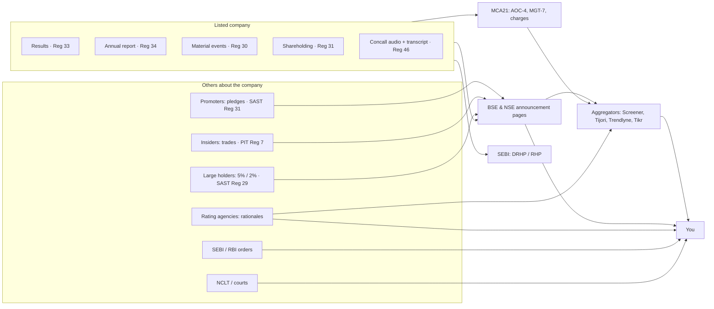

# 03.1 · Where information lives

> **Why this matters:** every conclusion you will ever reach about a listed Indian company rests on a document
> someone was legally obliged to publish. Knowing *which* document holds *which* fact, *when* it must appear and
> *who is liable* for it is what separates analysis from rumour — and it is the fastest way to stop wasting hours on
> aggregator screenshots.

**Learning objectives** — after this lesson you can:

- Draw the map of Indian corporate disclosure: what the company files with the exchanges, SEBI and the Ministry of
  Corporate Affairs, what third parties (rating agencies, regulators, courts) publish about it, and where each lives.
- State the key deadlines — quarterly results (LODR Reg 33), material events (Reg 30), shareholding pattern (Reg 31),
  earnings-call recordings and transcripts (Reg 46), takeover and insider disclosures (SAST, PIT) — and build a
  company's disclosure calendar.
- Compute whether an event is "material" for a specific company under Reg 30's quantitative test.
- Translate an analytical question ("is the promoter under financial pressure?") into the primary document that
  answers it.
- Use aggregators (Screener, Tijori, Trendlyne, Tikr) for speed, and know the failure modes that make you verify
  against the primary source.

**Prerequisites:** [01.4 Indian market plumbing](../01-markets-101/04-indian-market-structure.md);
[02.3 The income statement](../02-accounting/03-the-income-statement.md) helps but is not essential  ·  **Time:** ~90 min

---

## 1. The disclosure universe in one picture

A listed company is a machine that is legally required to leak information on a schedule. Almost everything you
need falls into four buckets:

1. **Company-authored, mandatory, exchange-filed** — quarterly results, annual report, material-event announcements,
   shareholding pattern, earnings-call recordings and transcripts, investor presentations. The company and its
   directors are liable for these. *This is your primary source.*
2. **Company-related, filed elsewhere** — offer documents with SEBI, statutory filings with the Registrar of
   Companies (RoC) through the Ministry of Corporate Affairs (MCA) portal, and disclosures by *other people* about the
   company (promoters' pledge filings, insiders' trades, large holders' stake changes).
3. **Third-party judgements about the company** — credit-rating rationales, regulator orders (SEBI, RBI), court and
   tribunal orders (NCLT, High Courts), auditors' reports (which sit inside the annual report but are written by
   someone else).
4. **Context data** — regulators' and industry bodies' statistics (RBI, SIAM, CEA, AMFI, VAHAN…), which tell you
   about the industry the company lives in.

Everything else — Screener, Tijori, Trendlyne, broker notes, news, Twitter/X threads — is **derived** from these.

**The reliability ladder.** Weight a piece of information by (a) how close it is to the source and (b) who goes to
jail or pays a penalty if it is false.

| Tier | Example | Who is liable if it is wrong | How to treat it |
|:--|:--|:--|:--|
| Audited statements + auditor's report | Annual report financials | Board, CFO, auditor (Companies Act, SEBI, NFRA) | Starting point; still needs reading (see [03.3](03-notes-to-accounts.md)) |
| Reviewed / filed statements | Quarterly results with limited review | Board, auditor (lighter review) | Reliable for numbers, lighter on judgement |
| Filed but unaudited narrative | Investor presentation, concall, MD&A | Company (misstatement rules apply, but "outlook" is soft) | Useful; test against numbers |
| Third-party professional view | Rating rationale | Rating agency (SEBI-regulated) | Often the best-informed outside view |
| Derived data | Screener ratios, broker models | Nobody, in practice | Speed tool; verify anything you rely on |
| Commentary | News, social media | Nobody | Leads to documents, never a substitute |

!!! tip "Trader's lens"
    Think of this as market-data hygiene. Exchange filings are the **tape**: timestamped, authoritative, sometimes
    messy. Aggregators are a **vendor's cleaned bar data**: convenient, occasionally wrong in ways you cannot see
    (a bad split adjustment, a standalone number spliced into a consolidated series). No trader would run a
    volatility surface off an unchecked vendor feed; no analyst should size a position off an unchecked Screener
    ratio.

---

## 2. The exchanges: the company's official noticeboard

Almost every obligation in this section comes from the **SEBI (Listing Obligations and Disclosure Requirements)
Regulations, 2015** — universally called **LODR** — the rulebook a company accepts when it lists. Filings go to BSE
and NSE, which publish them on their corporate-filings pages:

- NSE: [Corporate filings → Announcements](https://www.nseindia.com/companies-listing/corporate-filings-announcements),
  [Annual reports](https://www.nseindia.com/companies-listing/corporate-filings-annual-reports),
  [Insider trading](https://www.nseindia.com/companies-listing/corporate-filings-insider-trading),
  [SAST Reg 31 (encumbrance)](https://www.nseindia.com/companies-listing/corporate-filings-regulation-31).
- BSE: [Corporate announcements](https://www.bseindia.com/corporates/ann.html) (search by company; filter by
  category such as "Result", "Board Meeting", "Company Update", "AGM/EGM", "Insider Trading / SAST").

NSE notes that filings are displayed as uploaded by the company, without verification by the exchange. The exchange
is a noticeboard, not an auditor.

### 2.1 Material events — LODR Regulation 30

**Regulation 30** requires disclosure of "material events or information" — anything that could move the price or
that a reasonable investor would want to know. Schedule III of LODR splits events into two lists:

- **Part A — deemed material** (disclose regardless of size): acquisitions and disposals of specified kinds, issue or
  buyback of securities, changes in directors, KMP (key managerial personnel), auditors, credit-rating revisions,
  outcome of board meetings (results, dividends, fund-raising), fraud or default by the company or its promoters/KMP,
  schedule and presentations of analyst/institutional-investor meetings, resignation of auditors (with reasons),
  among others.
- **Part B — material only if they pass the materiality test**: e.g., capacity additions, new product launches,
  significant contracts *not in the normal course of business*, litigation, disruptions (strikes, fire), regulatory
  actions, guarantees and indemnities.

**The quantitative materiality test.** Since the June-2023 amendment, an event is material if its value (or expected
impact) exceeds the **lowest** of:

$$\text{Threshold} = \min\left(2\%\times\text{Turnover},\; 2\%\times\text{Net worth},\; 5\%\times\overline{|\text{PAT}|}_{3\text{y}}\right)$$

where turnover and net worth come from the last audited consolidated statements and the third term is 5% of the
average of the *absolute* profit-or-loss after tax over the last three audited years. Qualitative materiality (would
omitting it change the market's view?) can override the numbers, and each board adopts a written materiality policy.
Source: [LODR Reg 30 text, CAIRR (as amended to Dec-2024; checked 21-Sep-2026)](https://ca2013.com/lodr-regulation-30/);
[PwC regulatory insight on the 2023 amendment](https://www.pwc.in/assets/pdfs/news-alert/regulatory-insights/2023/pwc_regulatory_insights_21_june_2023_sebi_amends_sebi_listing_obligations_and_disclosure_requirements_regulations_2015_highlights.pdf).

**Timelines** (Reg 30(6), as of Sep-2026):

| Event type | Disclose within |
|:--|:--|
| Decision taken at a board meeting (results, dividend, fund-raise) | 30 minutes of the meeting's close (3 hours if the meeting ends after market hours and ≥3 hours before the next open) |
| Event emanating from within the company | 12 hours |
| Event not emanating from within the company (e.g., a tax demand received, a customer default) | 24 hours |

#### Worked example 1 — is the GST demand material for Kaveri?

Kaveri Pumps' FY26 annual report shows a new **contingent liability** (a possible obligation that depends on a future
event — here, the outcome of an appeal) of ₹38.0 Cr: a GST demand in a classification dispute on solar systems
([reference page §8](../appendix/running-example/kaveri-pumps.md)). Would receipt of that demand have required a
Reg 30 disclosure?

Using the last audited consolidated numbers at the time (FY26: turnover ₹1,318.0 Cr, net worth ₹706.1 Cr; PAT FY24–26
₹86.4 / 97.4 / 90.5 Cr):

| Test | Arithmetic | ₹ Cr |
|:--|:--|--:|
| 2% of turnover | 0.02 × 1,318.0 | 26.36 |
| 2% of net worth | 0.02 × 706.1 | 14.12 |
| 5% of 3-year average \|PAT\| | 0.05 × (86.4 + 97.4 + 90.5) / 3 = 0.05 × 91.43 | 4.57 |
| **Threshold (lowest)** | | **4.57** |

A ₹38.0 Cr demand is more than eight times the threshold. It is an event "not emanating from within" the company, so
the 24-hour clock applies from receipt. **Lesson:** for a company of Kaveri's size, almost any tax demand, lawsuit or
lost contract above ~₹5 Cr should show up on the exchange page. If you later find a large dispute in the annual
report's contingent-liability note that *never* appeared as an announcement, ask why.

The third test is designed so that small, profitable companies have low thresholds: materiality scales with the
earnings base, not just size. Note also that ordinary solar tender wins, being in the normal course of business, need
not be announced — which is why companies that *do* trumpet every routine order are telling you something about
their investor-relations style.

### 2.2 Quarterly and annual results — LODR Regulation 33

**Regulation 33** requires financial results:

- **within 45 days** of the end of each of the first three quarters, and
- **within 60 days** of the financial year-end for the audited annual results (the Q4 numbers are derived as
  full-year minus nine months).

Results come as standalone and (where there are subsidiaries) consolidated statements, with a **limited review
report** (a lighter-touch review than an audit: the auditor says nothing has come to their attention suggesting
material misstatement) for quarters, or an **audit report** for the year, plus a statement of the impact of any audit
qualifications. SME-platform companies report half-yearly instead of quarterly. Sources:
[LODR Reg 33, CAIRR](https://ca2013.com/lodr-regulation-33/);
[SEBI LODR FAQs (Apr-2025)](https://www.sebi.gov.in/sebi_data/faqfiles/apr-2025/1745399101865.pdf).

Since the quarter ended 31-Dec-2024, SEBI has bundled periodic filings into two **integrated filings**: a
*Governance* filing (corporate-governance compliance, investor grievances, etc.) due within 30 days of quarter-end,
and a *Financial* filing (results, related-party transaction disclosures and similar) on the Reg 33 timeline of
45/60 days. Source: SEBI circular of 31-Dec-2024, summarised in
[NSE circular NSE/CML/2025/02](https://nsearchives.nseindia.com/web/sites/default/files/inline-files/NSE%20Circular%20facilitating%20ease%20of%20doing%20business%20for%20listed%20entities-%20Integrated%20Filing.pdf)
and [Business Standard, 1-Jan-2025](https://www.business-standard.com/markets/news/sebi-mandates-compliance-for-listed-entities-with-integrated-filing-125010100386_1.html).
How to read a results filing line by line is the subject of [03.4](04-quarterly-results-and-concalls.md).

### 2.3 Shareholding pattern — LODR Regulation 31

Within **21 days** of each quarter-end the company files its **shareholding pattern**: promoter and promoter group
(with the number of shares pledged or otherwise encumbered), and public shareholders split into institutions
(mutual funds, insurers, FPIs — foreign portfolio investors, banks) and non-institutions (retail, HNIs, bodies
corporate). Source: [LODR Reg 31, CAIRR](https://ca2013.com/lodr-regulation-31/). This is the quarterly census of
who owns the company; the trend matters more than the level (mutual funds going from 14% to 9% over three quarters
is a vote).

### 2.4 Annual report and AGM — Regulation 34 and the Companies Act

The **annual report** (dissected in [03.2](02-anatomy-of-an-annual-report.md)) must be submitted to the exchanges no
later than the day it starts being dispatched to shareholders (Reg 34). The AGM (annual general meeting) must be held
within six months of the financial year-end — so **30 September** for March year-ends — under Section 96 of the
Companies Act, 2013; the top 100 listed companies by market cap must hold it within **five months** (Reg 44(5)).
Sources: [Reg 34, CAIRR](https://ca2013.com/lodr-regulation-34/); [Reg 44, CAIRR](https://ca2013.com/lodr-regulation-44/).

Two website obligations under **Regulation 46** are gold for analysts:

- The company must host the **separate audited financial statements of each subsidiary** on its website (at least
  21 days before the AGM). This is how you see a loss-making subsidiary that the consolidated numbers hide.
- The company must post **analyst/investor presentations** and **earnings-call recordings and transcripts** (next
  section).

### 2.5 Investor presentations and earnings calls

Under Schedule III (Part A) and **Reg 46(2)(oa)** (inserted June 2023, effective 14-Jul-2023):

| Item | Deadline (as of Sep-2026) |
|:--|:--|
| Schedule of an analyst / institutional-investor meeting | Disclosed in advance |
| Presentation to be used at the meeting | Before the meeting begins |
| **Audio recording** of the earnings call | Before the next trading day or within 24 hours, whichever is earlier |
| Video recording (if any) | Within 48 hours |
| **Transcript** | Within 5 working days |
| Retention on website | Audio/video ≥ 2 years; transcripts ≥ 5 years |

Source: [LODR Reg 46, CAIRR](https://ca2013.com/lodr-regulation-46/) (checked 21-Sep-2026).

This rule changed Indian equity research. Before 2023, many small caps held "closed" calls whose content leaked
selectively to a few funds; now everyone can hear the same words, and — crucially — you can go back **five years**
and compare what management promised with what they delivered (the "say-do ratio" of
[05.5](../05-business-analysis/05-management-and-capital-allocation.md)).

### 2.6 Other exchange filings worth knowing

- **Board-meeting intimations** (advance notice that results or fund-raising will be considered) — the calendar of
  scheduled information events.
- **Voting results and scrutiniser's report** after every general meeting — how minority shareholders voted on each
  resolution; a large "against" vote from institutions on a related-party resolution is a red flag others saw.
- **Corporate-governance report** (quarterly, in the Governance integrated filing) and the **annual secretarial
  compliance report** (Reg 24A).
- **Statement of deviation** in the use of fund-raising proceeds (Reg 32) — did the IPO/QIP money go where the offer
  document said?
- **Credit-rating actions** — any rating revision must be disclosed under Reg 30; NSE introduced system-driven
  disclosure of rating changes in 2025 (per the CAIRR note on Reg 30).

#### Worked example 2 — Kaveri's disclosure calendar for FY27

Assume today is 21-Sep-2026. Which filings should already exist for Kaveri, and when is the next batch due? Dates
computed by adding the regulatory windows to quarter-ends (calendar days unless stated; exchanges' holiday rules can
shift "working day" deadlines).

| Filing | Period | Rule | Deadline | Status on 21-Sep-2026 |
|:--|:--|:--|:--|:--|
| Audited FY26 results | Year to 31-Mar-2026 | Reg 33: 60 days | 30-May-2026 | Filed (Q4 call held May-2026) |
| Shareholding pattern Q1 FY27 | 30-Jun-2026 | Reg 31: 21 days | 21-Jul-2026 | Filed |
| Integrated filing (Governance) Q1 | 30-Jun-2026 | 30 days | 30-Jul-2026 | Filed |
| Q1 FY27 results | 30-Jun-2026 | Reg 33: 45 days | 14-Aug-2026 | Filed 8-Aug-2026, six days early |
| Q1 concall transcript (if call held Mon 10-Aug) | — | Reg 46: 5 working days | 17-Aug-2026 | Should be on website |
| AGM for FY26 | — | Sec 96: 6 months | 30-Sep-2026 | Due within 9 days; notice already out |
| Shareholding pattern Q2 FY27 | 30-Sep-2026 | 21 days | 21-Oct-2026 | Next |
| Q2 FY27 results | 30-Sep-2026 | 45 days | 14-Nov-2026 | Next |

The AGM notice must reach shareholders at least 21 *clear* days before the meeting (Companies Act Sec 101), so for an
AGM on, say, 25-Sep-2026 the notice (with the annual report) had to go out by 3-Sep-2026. If the FY26 annual report is
*not* on the exchange page by mid-September, that is itself information.

Two quick checks with this calendar in hand. First, **was the Q1 FY27 transcript posted on time and in full?**
Kaveri's Q1 investor presentation showed a receivables bar chart without numbers (reference page §7) — the
transcript is where you look for whether an analyst asked for the number and what the answer was. Second, **did
anything arrive between results?** The November-2025 promoter pledge (next section) was disclosed under the
takeover code, not in the results — an investor who only reads quarterly results would have missed it.

---

## 3. Ownership, insiders and big trades

These filings are made by *people* (promoters, insiders, large holders) rather than by the company's finance team,
but they land on the same exchange pages. They tell you about incentives and pressure — the things financial
statements cannot show.

### 3.1 Substantial acquisitions — SAST Regulation 29

Under the **SEBI (Substantial Acquisition of Shares and Takeovers) Regulations, 2011** ("SAST" or the takeover code):

- anyone whose holding (with persons acting in concert) reaches **5%** must disclose;
- anyone holding 5% or more must disclose every change of **2%** or more (even if it takes them below 5%);
- deadline: **two working days**.

Source: [SAST Reg 29, CAIRR](https://ca2013.com/toc-regulation-29/). These filings show a mutual fund or FPI building
or dumping a position between quarterly shareholding patterns.

### 3.2 Pledges and encumbrances — SAST Regulation 31

A promoter who **pledges** shares (uses them as collateral for a loan) or otherwise encumbers them must disclose
creation, invocation (the lender seizing and selling) or release within **seven working days**. If total encumbrance
reaches **50% of the promoter group's holding or 20% of the company's share capital**, the promoter must also give
detailed reasons. Sources: [SAST Reg 31, CAIRR](https://ca2013.com/toc-regulation-31/);
[Taxguru summary of the SEBI circular on encumbrance reasons](https://taxguru.in/sebi/disclosure-requirements-encumbrance-shares-promoters-listed-companies.html).

Why you care: a pledge converts a fall in the share price into a **margin call** on the promoter. If the promoter
cannot top up collateral, the lender sells — into a falling market — and the promoter may lose control. Pledges are
also a clue that the promoter family needs cash outside the listed company. Module 09 covers the forensic angle
([09.5](../09-forensics/05-governance-red-flags-india.md)).

### 3.3 Insider trades — PIT Regulation 7

Under the **SEBI (Prohibition of Insider Trading) Regulations, 2015** ("PIT"), promoters, promoter-group members,
directors and designated employees must report trades to the company within **two trading days** once their trading
value in a calendar quarter exceeds **₹10 lakh**; the company passes it to the exchanges within two trading days.
Source: [PIT Reg 7, CAIRR](https://ca2013.com/pit-regulation-7/). Insider *buying* in the open market is one of the
few signals with a reasonable academic track record; insider *selling* has many innocent reasons (tax, diversification,
a house).

### 3.4 Bulk and block deals

- A **bulk deal** is a client's trading in a stock on one day totalling more than **0.5%** of the company's listed
  shares; brokers report it and the exchanges publish names and prices after market hours. (This long-standing
  threshold dates from a 2004 SEBI circular; I could not retrieve the primary text live when writing — confirm on the
  exchange's bulk/block-deal page.)
- A **block deal** is a large negotiated trade executed in a separate trading window. SEBI's
  [circular of 8-Oct-2025](https://www.mehta-mehta.com/sebi-circular-review-of-block-deal-framework-8th-october-2025/)
  raised the minimum order size from ₹10 Cr to **₹25 Cr**, widened the price band to **±3%** around a reference price,
  and set two windows (8:45–9:00 am, referenced to the previous close; 2:05–2:20 pm, referenced to a VWAP), effective
  December 2025; deals are published after market hours.

#### Worked example 3 — what these thresholds mean for Kaveri, in shares

Kaveri has 6.00 Cr shares, trades at ₹390 (18-Sep-2026), and the promoter family holds 58.4%, of which 6% is pledged.

| Item | Arithmetic | Result |
|:--|:--|--:|
| Bulk-deal trigger | 0.5% × 6.00 Cr shares | 3,00,000 shares ≈ ₹11.7 Cr |
| Minimum block-deal size | ₹25 Cr ÷ ₹390 | 6,41,026 shares = 1.07% of equity |
| PIT reporting trigger (per quarter) | ₹10 lakh ÷ ₹390 | ≈ 2,564 shares |
| Promoter shares | 58.4% × 6.00 Cr | 3.504 Cr shares |
| Pledged shares | 6% × 3.504 Cr | 21.02 lakh shares = 3.50% of equity ≈ ₹82.0 Cr |
| "Reasons" trigger A: 50% of promoter holding | 0.5 × 3.504 Cr | 1.752 Cr shares |
| "Reasons" trigger B: 20% of share capital | 0.2 × 6.00 Cr | 1.200 Cr shares |

Readings: (1) The pledge is far below either "reasons" trigger, so the only public explanation is the one the
promoter volunteered (a promoter-group real-estate venture). (2) A single block deal in Kaveri would move more than 1%
of the company — so block deals will be rare and bulk deals are the ones to watch. (3) A director buying even ~2,600
shares must report it: insider trades are visible in near-real time.

!!! tip "Trader's lens"
    Ownership filings are the equity analyst's version of **positioning data** — open interest, the COT report, dealer
    gamma. A pledge is literally a short put the promoter has written on his own stock: below some price the lender's
    margin call forces selling, and that selling is **pro-cyclical**. When you see a pledged promoter, ask the
    options-desk question: *where is the strike?* Loan-to-value terms are rarely disclosed, but a 25% fall (as Kaveri
    had from March to September 2026) is exactly the move that tests them.

---

## 4. Credit-rating rationales

Banks and bond investors demand a rating on a company's loans, and SEBI requires rating agencies to publish a
**rating rationale** (press release) for each rating action. SEBI's register listed nine **credit rating agencies
(CRAs)** as on 20-Sep-2026: CRISIL Ratings, ICRA, CARE Ratings, India Ratings and Research (Fitch group), Acuité,
Infomerics, Brickwork, and two newer entrants, Acer Credit Rating and CredStone Ratings
([SEBI register of CRAs](https://www.sebi.gov.in/sebiweb/other/OtherAction.do?doRecognisedFpi=yes&intmId=7)).
Brickwork's registration was cancelled by SEBI in October 2022, but the Securities Appellate Tribunal set that order
aside in June 2023 ([Business Standard, 6-Jun-2023](https://www.business-standard.com/markets/news/relief-for-brickwork-ratings-sat-sets-aside-sebi-order-cancelling-licence-123060600575_1.html)).

Why equity analysts love rationales:

- The analyst who wrote it had **access you do not**: management meetings, bank statements, projections, loan
  covenants, sometimes monthly working-capital data. The rationale is a regulated summary of that view.
- They state things companies soft-pedal: **liquidity** (cash vs. debt due in the next year, utilisation of
  working-capital limits), **group support or group drag**, **key rating sensitivities** (explicit triggers like
  "net debt/EBITDA above 2.5x could lead to a downgrade"), and customer concentration.
- They cover **unlisted group companies**. The promoter-owned supplier, the private holding company that borrowed
  against pledged shares — if they have bank loans, they are probably rated somewhere.
- A rating marked **"Issuer Not Cooperating"** means the company stopped giving the agency information. Few things
  are more informative for the price of zero.

Where: each agency's website (search by company name); the company's Reg 30 announcements (rating actions); and
Screener's "Credit ratings" list under *Documents*. For Kaveri, the long-term bank facilities are rated "A / Stable";
the rationale would be the place to read about the working-capital limits funding the solar receivables. Deep dive
in [03.5](05-other-documents.md).

---

## 5. Offer documents: DRHP, RHP and other letters of offer

When a company raises money from the public, SEBI's ICDR regulations require an **offer document**:

- **DRHP** (Draft Red Herring Prospectus) — filed with SEBI and put up for public comments; lists on
  [SEBI → Filings → Public Issues](https://www.sebi.gov.in/sebiweb/home/HomeAction.do?doListing=yes&sid=3&ssid=15&smid=10)
  (2,209 draft documents listed, the latest dated 18-Sep-2026, when checked on 21-Sep-2026).
- **RHP** (Red Herring Prospectus) — the near-final version filed with the RoC before the issue opens, without the
  final price; then the **prospectus**.
- Cousins: **placement documents** for QIPs, **letters of offer** for rights issues, buybacks and open offers,
  **schemes of arrangement** for mergers/demergers (with the NCLT-approved scheme and valuation report).

Even for a company listed years ago, the offer document is the single most detailed description of the business,
its risks, litigation and related parties ever published — and it is never updated. Read it once, early. The
walkthrough is in [03.5](05-other-documents.md).

---

## 6. MCA21: the registry behind the listed company

Every Indian company — listed or not — files with the Registrar of Companies through the MCA21 portal:
**AOC-4** (financial statements), **MGT-7** (annual return: shareholders, directors), **charge filings** (every loan
secured on the company's assets), director appointments and more. MCA completed the migration of the annual-filing
forms to its **V3** portal in July 2025 ([CorpLawUpdates summary](https://www.corplawupdates.in/glossary/mca21)).
Anyone can buy access via *Document Related Services → View Public Documents (V3)* for a fee of **₹100 per company**
per a practitioner guide checked on 21-Sep-2026
([CS Pratik K Shah learning centre](https://learn.cspratik.com/docs/technical-guide/mca-website/download-access-company-llp-documents-mca/);
the [MCA page itself](https://www.mca.gov.in/content/mca/global/en/mca/document-related-services/view-public-documents-v3.html)
blocked automated access — confirm the fee there).

Why listed-company analysts use it:

- **Unlisted related parties.** Kaveri buys ₹89.2 Cr a year of castings from **Kaveri Castings Pvt Ltd**, owned by
  the promoters (10.4% of material cost in FY26). Kaveri Castings' AOC-4 would show its revenue, margins and balance
  sheet. If its revenue were, say, ₹110 Cr, Kaveri would be ~80% of its sales and its margins would tell you whether
  "arm's length" pricing is plausible. (The ₹110 Cr is hypothetical — the point is what you would compute.)
- **Subsidiaries and step-downs** not individually disclosed in detail.
- **Charges register** — who has lent against what; a new charge on promoter-group assets can precede a pledge.
- **Director networks** — the other boards a director sits on (search by DIN, the Director Identification Number).

Filings are often late, scanned, and in formats that fight you. Budget an hour per entity.

---

## 7. Regulators, courts and industry data

Your company's numbers only make sense against its industry's. Useful public sources (all free unless noted; URLs
current as of Sep-2026):

| Source | What it gives you | Typical use |
|:--|:--|:--|
| [SEBI orders](https://www.sebi.gov.in/sebiweb/home/HomeAction.do?doListing=yes&sid=2&ssid=9&smid=0) and SAT | Enforcement orders against companies, promoters, auditors | Governance checks; see [09.5](../09-forensics/05-governance-red-flags-india.md) |
| [RBI DBIE](https://data.rbi.org.in) | Rates, credit growth by sector, banking statistics | Lenders, rate-sensitive sectors |
| [NCLT](https://nclt.gov.in) / [IBBI](https://ibbi.gov.in) | Insolvency admissions, resolution plans, schemes of arrangement | Customer/supplier distress; mergers |
| [eCourts](https://ecourts.gov.in) / High Court sites | Litigation status | Checking a contingent liability's progress |
| [SIAM](https://www.siamindia.com), [FADA](https://fada.in), [VAHAN](https://vahan.parivahan.gov.in/vahan4dashboard/) | Vehicle production, dealer sales, registrations | Autos, vehicle finance (Nirmal) |
| [CEA](https://cea.nic.in) | Power generation, capacity, demand | Utilities, capital goods |
| [AMFI](https://www.amfiindia.com) | Mutual-fund AUM, flows, SIP data | AMCs; flows into small caps |
| [IRDAI](https://irdai.gov.in), [TRAI](https://www.trai.gov.in), [DGCA](https://www.dgca.gov.in), [PPAC](https://ppac.gov.in) | Insurance premiums; telecom subscribers; air traffic; fuel data | Sector KPIs |
| Ministry / scheme portals (e.g., MNRE for PM-KUSUM) | Scheme targets, state-wise progress | Kaveri's solar demand and state payment behaviour |

Sector-by-sector detail lives in [Module 08](../08-sectors/01-banks-and-lending.md); using such data for
scuttlebutt is [05.7](../05-business-analysis/07-scuttlebutt-and-primary-research.md). The full, maintained list is
in the [data-sources appendix](../appendix/data-sources.md).

---

## 8. Question → document: the map you will actually use

The syllabus promised a table; this is the one to print. "Primary" is where the authoritative answer lives;
"Also" is where to cross-check.

| Question you have | Primary document | Also |
|:--|:--|:--|
| What does the company actually sell, to whom? | Annual report: MD&A, segment note | DRHP (if listed in last ~10 yrs); investor presentation |
| How fast is it growing and are margins holding? | Quarterly results (Reg 33) | Concall transcript for the "why" |
| Is profit turning into cash? | Annual report: cash-flow statement and notes | Rating rationale (liquidity section) |
| What did management promise last year? | Old concall transcripts; old investor presentations | Annual-report chairman's letter |
| Who owns it and is that changing? | Shareholding pattern (Reg 31) | SAST Reg 29 filings; bulk/block deals |
| Is the promoter under financial pressure? | SAST Reg 31 encumbrance disclosures | Shareholding-pattern pledge columns; ratings of promoter entities; MCA charges |
| Are insiders buying or selling? | PIT Reg 7 disclosures | Bulk deals |
| How much debt, at what cost, with what covenants? | Borrowings note (annual report) | Rating rationale; MCA charge filings |
| What could blow up? | Contingent-liabilities note; auditor's KAMs | Reg 30 litigation disclosures; court/NCLT orders |
| Is it dealing with the promoter's other businesses? | Related-party note; AOC-2 | AGM notice (RPT approvals); MCA filings of the counterparty |
| Are subsidiaries hiding losses or cash? | AOC-1; subsidiary financials on website (Reg 46) | Standalone vs consolidated comparison |
| Did the IPO/QIP money go where promised? | Reg 32 statement of deviation; monitoring-agency report | Offer document "objects of the issue" |
| Has the auditor raised concerns? | Auditor's report (opinion, KAMs, CARO) | Reg 30 auditor-resignation disclosure with reasons |
| Has a regulator acted? | SEBI / RBI orders | Reg 30 disclosures of regulatory action |
| How is the industry doing? | Regulator / industry-body data (§7) | Peer results and concalls |
| What is the lender's view? | Rating rationale | Borrowings note; covenants |
| How were minorities treated in votes? | Voting results / scrutiniser's report (Reg 44) | Proxy-advisor reports |

---

## 9. Aggregators — and why you verify against the primary source

Aggregators turn thousands of PDFs into tables. Use them — for screening, for 10-year histories, for peer
comparisons — but know what they are:

- **[Screener.in](https://www.screener.in)** — the Indian default. Ten-plus years of standardised statements, ratios,
  custom screens, and a *Documents* section linking announcements, annual reports, credit ratings and concall
  transcripts. The page footer credits the financial data to a vendor (C-MOTS Internet Technologies), i.e., it is a
  standardisation of company filings, not the filings themselves (checked 21-Sep-2026).
- **[Tijori Finance](https://www.tijorifinance.com)** — strong on business segments, operational KPIs and
  industry-level data.
- **[Trendlyne](https://trendlyne.com)** — screens, broker-target aggregation, insider/bulk-deal feeds, alerts.
- **[Tikr](https://www.tikr.com)** — global coverage with consensus estimates; useful for comparing an Indian company
  with foreign peers.
- **Python:** `tools/fi/data.py::fetch_statements` pulls statements via OpenBB/yfinance. Vendor data for Indian
  tickers is patchier than for US ones (disable any VPN before running yfinance scripts).

### Where aggregated data goes wrong

1. **Standalone vs consolidated** spliced into one series (common when a company starts consolidating a new
   subsidiary).
2. **Classification choices**: "operating profit" including or excluding other income; exceptional items folded
   into "other income"; leases missing from "borrowings".
3. **Restatements**: the vendor keeps the originally reported number while the company restated it (or vice versa).
4. **Corporate actions**: per-share data not adjusted for bonuses and splits; stale share counts after a QIP.
5. **Units and periods**: lakh vs crore; December year-end subsidiaries; a 15-month transition year.
6. **TTM arithmetic** on seasonal businesses or around one-offs.

#### Worked example 4 — the same stock at 48x or 54x?

On 31-Mar-2025 Kaveri traded at ₹780. FY25 reported PAT was ₹97.4 Cr, including a one-off ₹14.0 Cr pre-tax gain on
selling land (reference page §2). An aggregator that divides price by reported EPS shows one P/E; an analyst who reads
the exceptional-items line shows another.

| Step | Arithmetic | Result |
|:--|:--|--:|
| Reported EPS | ₹97.4 Cr ÷ 6.00 Cr shares | ₹16.23 |
| Post-tax land gain | ₹14.0 Cr × (1 − 25.17%) | ₹10.48 Cr |
| Adjusted PAT | 97.4 − 10.48 | ₹86.92 Cr |
| Adjusted EPS | 86.92 ÷ 6.00 | ₹14.49 |
| P/E on reported EPS | 780 ÷ 16.23 | **48.0x** |
| P/E on adjusted EPS | 780 ÷ 14.49 | **53.8x** |

Same price, same company, a 12% difference in the multiple — from one line in the P&L. (These match the reference
page: P/E 48.0x; adjusted EPS ₹14.5.) The aggregator is not "wrong"; it answered a different question. Your job is to
know which question you are asking.

**The "trust but tie" protocol.** Before relying on any aggregated series for a decision:

1. Tie **three anchors** per year to the audited annual report: revenue, PAT attributable to owners, total equity.
2. Confirm the **basis** (consolidated vs standalone) and the **share count** (basic vs diluted, post-bonus).
3. For any ratio you will quote, recompute it yourself from primary numbers once; after that, trust the aggregator
   only for that same definition.

It takes ten minutes a company and saves you from the classic error of a thesis built on a data artefact.

---

!!! info "India notes"
    - **Two exchanges, one filing.** Most companies file identical documents on BSE and NSE; some older or
      smaller companies are listed only on BSE. If a document is missing on one, check the other.
    - **SME platform companies** (NSE Emerge, BSE SME) file results half-yearly and have lighter governance
      obligations — less information, higher uncertainty.
    - **Newspapers still matter a little.** Results extracts and AGM notices are published in an English and a
      regional-language daily; for a few small companies the regional paper carries notices you will not find
      elsewhere quickly.
    - **Integrated filings** (from the Dec-2024 quarter) mean some items you used to find as separate
      announcements (related-party transaction statements, governance reports) now sit inside bundled filings —
      search the "Integrated Filing" category.
    - **PSUs and banks** add their own disclosures (government holdings, RBI-mandated Pillar 3 disclosures for
      banks); NBFCs such as Nirmal Finance also publish liquidity-risk disclosures required by RBI.

!!! warning "Common mistakes"
    - Treating the investor presentation as the source of truth. It is marketing with numbers; the results filing
      and the annual report are the legal record.
    - Reading only results and missing everything that arrives between them (pledges, insider sales, rating
      actions, tax demands).
    - Quoting a Screener ratio in your notes without knowing its definition, or mixing consolidated and standalone
      periods.
    - Ignoring rating rationales because "I'm an equity investor". The lender's view is often the most informed
      outside view you will get.
    - Forgetting unlisted related parties: the listed company's disclosures stop at its boundary, and the
      interesting transactions often cross it. Use MCA21.
    - Assuming the exchange has checked a filing. It is a noticeboard.

## Key terms

| Term | Meaning |
|:--|:--|
| **LODR** | SEBI (Listing Obligations and Disclosure Requirements) Regulations, 2015 — the continuous-disclosure rulebook for listed companies |
| **Reg 30** | LODR rule requiring disclosure of material events (Schedule III Part A deemed material; Part B subject to materiality test) |
| **Reg 33** | LODR rule on financial results: 45 days after each of Q1–Q3; 60 days after year-end (audited) |
| **Limited review** | A lighter assurance on quarterly results than an audit; the auditor reports whether anything suggests material misstatement |
| **Integrated filing** | SEBI's bundling (from the Dec-2024 quarter) of periodic governance (30 days) and financial (45/60 days) filings |
| **Shareholding pattern** | Quarterly breakdown of ownership by category, including pledged promoter shares (Reg 31, 21 days) |
| **SAST** | SEBI Substantial Acquisition of Shares and Takeovers Regulations, 2011 — includes 5%/2% holding disclosures (Reg 29) and pledge disclosures (Reg 31) |
| **Encumbrance / pledge** | Using shares as collateral; a price fall can trigger margin calls and forced sales |
| **PIT** | SEBI Prohibition of Insider Trading Regulations, 2015 — insiders report trades above ₹10 lakh per quarter within two trading days |
| **Bulk deal / block deal** | Bulk: a client's trades in a day >0.5% of listed shares; block: a negotiated trade in a special window (minimum ₹25 Cr since Dec-2025) |
| **Rating rationale** | A credit-rating agency's published explanation of a rating action |
| **DRHP / RHP** | Draft / final (pre-pricing) offer document for a public issue |
| **MCA21** | The Ministry of Corporate Affairs' filing portal; source of AOC-4 (financials), MGT-7 (annual return) and charge filings for every company |
| **Materiality threshold** | Under Reg 30: lowest of 2% of turnover, 2% of net worth, 5% of 3-year average absolute PAT |
| **Aggregator** | A service that standardises filings into tables (Screener, Tijori, Trendlyne, Tikr) — derived, not primary, data |

## Check your understanding

**1.** A company files its Q2 results (quarter ended 30-Sep) on 20-Nov. Is it compliant? What about Q4 results filed
on 25-May for a March year-end?

Answer

The Q2 deadline is 45 days after 30-Sep, i.e., 14-Nov — filing on 20-Nov is late. The annual (Q4) deadline is 60 days
after 31-Mar, i.e., 30-May — 25-May is compliant. Late filings attract exchange fines and, repeated, are a governance
signal.

**2.** Nirmal Finance's FY26 consolidated income from operations (interest + fees) is ₹1,124.0 Cr, net worth ₹1,695.3 Cr,
and PAT for FY24–FY26 was ₹169.0 / 208.4 / 239.5 Cr. Compute its Reg 30 quantitative materiality threshold. Would a
₹12 Cr fraud at a branch need disclosure?

Answer

2% × 1,124.0 = ₹22.48 Cr; 2% × 1,695.3 = ₹33.91 Cr; average PAT = (169.0 + 208.4 + 239.5)/3 = ₹205.63 Cr, 5% = ₹10.28 Cr.
Threshold = lowest = **₹10.28 Cr**. A ₹12 Cr fraud exceeds it, so it passes the quantitative test. (Separately, fraud
involving the company, its promoters, directors or KMP is a Part A deemed-material item regardless of size.) Turnover
here is taken as interest income ₹1,073.2 Cr + fee and other operating income ₹50.8 Cr from the
[Nirmal reference page](../appendix/running-example/nirmal-finance.md).

**3.** Why is a credit-rating rationale often more informative than the company's own investor presentation on the
subject of liquidity?

Answer

The rating analyst has non-public access (bank statements, projections, covenant terms, limit utilisation) and is
regulated by SEBI; the rationale must discuss liquidity and rating sensitivities explicitly. The presentation is
written by the company to persuade and has no obligation to show debt maturities against cash or limit utilisation.

**4.** Kaveri's promoter pledges a further 50 lakh shares. Recompute the pledged share of promoter holding and say
whether the "detailed reasons" requirement is triggered.

Answer

Existing pledge 21.02 lakh + 50 lakh = 71.02 lakh shares. Promoter holding 3.504 Cr = 350.4 lakh shares, so
71.02/350.4 = **20.3%** of promoter holding, and 71.02/600 = **11.8%** of share capital. Triggers are 50% of promoter
holding or 20% of share capital — **not triggered**. The new pledge itself must still be disclosed within seven
working days.

**5.** You want to know whether a listed auto-parts company's unlisted, promoter-owned sister company (a major
supplier) is profitable. Name two places to look.

Answer

(a) MCA21 public documents for the sister company's AOC-4 financial statements (and charge filings); (b) a credit
rating rationale for its bank facilities, if it has one. The listed company's related-party note and AOC-2 tell you
the size of transactions but not the counterparty's profitability.

**6.** An aggregator shows a company's ROCE jumping from 14% to 22% in one year while revenue grew 5%. List three
data explanations to rule out before believing it.

Answer

Any three of: a switch between standalone and consolidated data; an exceptional gain or other income included in the
numerator; a change in capital-employed definition (e.g., leases or cash treatment); a restatement not reflected in
the prior year; a large year-end cash outflow (dividend, buyback) depressing closing capital employed when the ratio
uses closing rather than average capital. Then tie the numbers to the annual report.

**7.** Why did the 2023 requirement to publish earnings-call audio within ~24 hours and transcripts within five
working days matter for small-cap investors in particular?

Answer

Small caps have thin sell-side coverage, so management's words on calls were the main source of guidance and colour,
and previously they could reach a few participants selectively. Mandatory, fast, archived publication levels the
field and creates a five-year searchable record for tracking guidance against delivery.

## Go deeper

- [SEBI's list of all regulations (updated)](https://www.sebi.gov.in/sebiweb/home/HomeAction.do?doListing=yes&sid=1&ssid=3&smid=0) — open the latest consolidated LODR text —
  read Reg 30, 31, 33, 34, 46 and Schedule III once in the original; it takes an hour and pays for years.
- [SEBI FAQs on LODR (April 2025)](https://www.sebi.gov.in/sebi_data/faqfiles/apr-2025/1745399101865.pdf) — SEBI's own
  answers to the edge cases.
- [NSE corporate-filings hub](https://www.nseindia.com/companies-listing/corporate-filings-announcements) — spend 30
  minutes clicking through every filing category for one company you know.
- Any SEBI-registered agency's rating-criteria pages (e.g., CRISIL Ratings' published methodologies) — to learn what
  rating analysts measure before you read your first rationale.
- The course's [data-sources appendix](../appendix/data-sources.md) — the maintained list of every source with URLs
  and caveats.

---
[← Previous: 02.9 Ind AS vs IFRS vs US GAAP](../02-accounting/09-ind-as-ifrs-us-gaap.md) · [Module index](index.md) · [Next: 03.2 Anatomy of an Indian annual report →](02-anatomy-of-an-annual-report.md)
