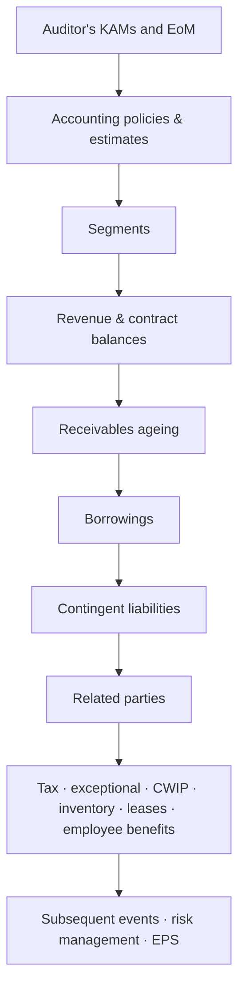

# 03.3 · Notes to accounts: where the bodies are buried

> **Why this matters:** the face of the financial statements gives you ~80 numbers; the notes give you ~2,000 and,
> more importantly, the *assumptions* behind the 80. Almost every accounting problem that has ever blown up an Indian
> stock — receivables that were never going to be collected, debt parked in an associate, a related party siphoning
> margin, a tax dispute that turned into a demand — was disclosed, at least partly, in a note that few people read.

**Learning objectives** — after this lesson you can:

- Navigate the notes of an Indian (Ind AS, Schedule III) annual report and read them in order of importance, not
  order of printing.
- Extract the decision-relevant numbers from each high-value note: accounting policies and estimates, segments,
  revenue and contract balances, receivables ageing, borrowings, contingent liabilities, related parties, CWIP ageing,
  inventories, employee benefits, leases, tax, exceptional items, subsequent events and going concern.
- Roll balances forward (leases, borrowings, PP&E) and tie them back to the three statements.
- Convert note-level risks into rupees and per-share amounts: under-provisioned receivables, contingent liabilities,
  related-party leakage, covenant headroom, actuarial sensitivity.
- Annotate Kaveri Pumps' FY26 notes and explain what each item implies for earnings quality and valuation.

**Prerequisites:** [03.2 Anatomy of an Indian annual report](02-anatomy-of-an-annual-report.md);
[02.2 Revenue recognition](../02-accounting/02-accrual-accounting-and-revenue-recognition.md);
[02.7](../02-accounting/07-deeper-cuts-assets-and-expenses.md) and
[02.8 Deeper cuts](../02-accounting/08-deeper-cuts-group-accounts-and-other.md)  ·  **Time:** ~150 min

---

## 1. How the notes are organised — and the order to read them

Indian financial statements prepared under **Ind AS** (Indian Accounting Standards, converged with IFRS) and presented
in the format of **Schedule III, Division II** of the Companies Act follow a predictable layout:

1. **Note 1 — corporate information**; **Note 2 — basis of preparation, material accounting policies, and critical
   accounting estimates and judgements**.
2. **One note per line item**, in the order they appear on the balance sheet and P&L (PP&E, CWIP, investments,
   inventories, trade receivables, cash, borrowings, … revenue, other income, expenses, tax).
3. **"Other disclosures"** — segments, related parties, contingent liabilities and commitments, employee benefits,
   leases, financial instruments and risk management, share-based payments, EPS, events after the reporting period —
   and the **"additional regulatory information"** that Schedule III has required since 1-Apr-2021 (ageing schedules,
   ratios, title deeds, wilful-defaulter status, reconciliation of quarterly statements filed with banks, CSR shortfall,
   promoter shareholding, among others; [MCA notification G.S.R. 207(E) of 24-Mar-2021, summarised by Vinod Kothari
   Consultants](https://vinodkothari.com/2021/03/mca-introduces-a-cartload-of-additional-disclosures-in-the-financial-statements/)).

A mid-cap's notes run to 60–120 pages per set (standalone and consolidated). You will not read them linearly. Read
them in order of **where value and risk concentrate**:

| Tier | Note | Question it answers | Time |
|:--|:--|:--|--:|
| **0** | **Going concern** (if any language beyond boilerplate) | Will the company survive the next 12 months? | Read first if present |
| 1 | Accounting policies and **changes**; critical estimates | Which levers exist, and were any pulled this year? | 5 min |
| 1 | **Segment information** | Which business is actually growing / earning? | 3 min |
| 1 | **Revenue** disaggregation and **contract balances** | How is revenue recognised; is unbilled revenue building? | 3 min |
| 1 | **Trade receivables and ageing** | Is revenue turning into cash? | 3 min |
| 1 | **Borrowings** | Who has lent, at what cost, secured on what, due when, with what covenants? | 4 min |
| 1 | **Contingent liabilities and commitments** | What could hit the balance sheet that is not on it? | 3 min |
| 1 | **Related-party transactions** | Is value leaking to the promoter group? | 4 min |
| 2 | Tax reconciliation | Is the tax rate sustainable? | 2 min |
| 2 | Exceptional items | Which profits are one-off? | 1 min |
| 2 | CWIP and intangibles-under-development ageing | Is capex being completed, or is cost being parked? | 2 min |
| 2 | Inventories | What kind of inventory, and is it building? | 1 min |
| 2 | Leases | How much debt-like obligation is in "lease liabilities"? | 1 min |
| 2 | Employee benefits | Are pension/gratuity assumptions reasonable? | 1 min |
| 3 | Subsequent events, financial risk management, fair-value hierarchy, share-based payments, EPS | Context and edge cases | skim |

That is ~35 minutes of focused reading — the "critical notes" block of the 2-hour protocol in
[03.2](02-anatomy-of-an-annual-report.md#7-the-2-hour-annual-report-read).

The rest of this lesson walks through each note in that order, using Kaveri Pumps' FY26 numbers wherever they exist.
Where a note needs detail that the [reference page](../appendix/running-example/kaveri-pumps.md) does not give, the
detail is **fictional, labelled as such, and constructed so that it ties to the reference statements exactly**.

---

## 2. Accounting policies — and changes to them

**What the note contains.** How each significant item is recognised and measured: revenue (when control passes),
PP&E (cost, useful lives, depreciation method), intangibles, impairment, inventories (cost formula — FIFO or weighted
average; LIFO is not permitted under Ind AS), financial instruments and expected credit loss, provisions, employee
benefits, leases, government grants, foreign currency, and consolidation. Alongside sits a list of **critical
accounting estimates and judgements** — the areas where management's assumptions most affect the numbers.

**What to look for:**

- **Revenue trigger words.** "On dispatch", "on delivery", "on installation and commissioning", "over time by input
  method". For Kaveri's solar systems, the difference between recognising revenue on *dispatch* of pumps and on
  *commissioning* at the farm is months of revenue.
- **Useful lives versus Schedule II** of the Companies Act (which gives indicative lives; companies may use different
  lives if technically justified). Longer lives than peers mean lower depreciation.
- **Changes.** Under Ind AS 8, a **change in accounting policy** is applied retrospectively (comparatives restated);
  a **change in estimate** (useful life, ECL rates, warranty rates) is applied prospectively, with no restatement —
  which makes it quieter and easier to miss; a **prior-period error** is corrected by restatement.
- **Match to the KAMs.** The critical-estimates list and the auditor's Key Audit Matters should broadly overlap. If the
  auditor has a KAM on something management does not list as a critical estimate, ask why.

#### Worked example 1 — the quiet lever: a change in useful life (hypothetical)

*Hypothetical, not in the reference data:* suppose that in FY27 Kaveri extends the useful life of the ~₹190 Cr Hosur
plant from 15 to 20 years, straight line, as a change in estimate.

| Step | Arithmetic | ₹ Cr |
|:--|:--|--:|
| Annual depreciation at 15 years | 190 ÷ 15 | 12.67 |
| Annual depreciation at 20 years | 190 ÷ 20 | 9.50 |
| Pre-tax profit uplift | 12.67 − 9.50 | 3.17 |
| Post-tax uplift at 25.17% | 3.17 × (1 − 0.2517) | 2.37 |
| As % of FY26 PAT (₹90.5 Cr) | 2.37 ÷ 90.5 | 2.6% |

No cash changes; profit rises 2.6% forever after, with no restated comparatives. The only place you would see it is
one sentence in the policies note ("During the year, the Company reassessed the useful life of…") and perhaps a line
in the PP&E note. That is why you diff the policies note year on year ([03.2 §8](02-anatomy-of-an-annual-report.md#8-comparing-35-years-of-reports)).

---

## 3. Segment information (Ind AS 108)

**What the note contains.** Operating segments as reviewed by the chief operating decision-maker (CODM): segment
revenue, segment result (usually EBIT or PBT before unallocable items), segment assets and liabilities, capex and
depreciation by segment; geographic split; and — importantly — disclosure when revenue from **a single customer is
10% or more** of total revenue.

**What to look for:** which segment drives growth and profit; **segment assets growing faster than segment revenue**
(capital or working capital being consumed); large "unallocable" costs; re-segmentation (a new segment structure can
bury a weak business); single-customer concentration.

#### Worked example 2 — Kaveri's segments: growth is one business

Segment revenue from the reference page (₹ Cr):

| Segment | FY23 | FY25 | FY26 | Growth FY26 | CAGR FY23–26 | Share FY26 |
|:--|--:|--:|--:|--:|--:|--:|
| Agricultural & domestic pumps | 550.6 | 586.0 | 606.2 | 3.4% | 3.3% | 46.0% |
| Industrial pumps & motors | 262.2 | 328.2 | 355.9 | 8.4% | 10.7% | 27.0% |
| Solar pumping systems | 61.2 | 257.8 | 355.9 | 38.1% | 79.8% | 27.0% |
| **Total** | **874.0** | **1,172.0** | **1,318.0** | **12.5%** | **14.7%** | **100.0%** |
| Total excluding solar | 812.8 | 914.2 | 962.1 | **5.2%** | **5.8%** | 73.0% |

*Arithmetic:* ex-solar FY26 growth = (606.2 + 355.9) ÷ (586.0 + 328.2) − 1 = 962.1 ÷ 914.2 − 1 = 5.2%; solar CAGR =
(355.9 ÷ 61.2)^(1/3) − 1 = 79.8%. Solar was 3.0% of revenue in FY21 (18.4 ÷ 612.0) and 27.0% in FY26.

**Reading:** Kaveri's "14.7% growth company" story is really a ~6% core business plus a solar business growing at
~80% a year — sold to state agencies that pay slowly (next sections). The segment note turns one growth rate into two
very different ones with different risk. With the major-customer disclosure you would also learn whether any single
state agency crosses 10% of revenue — for a company whose overdue receivables are "mostly from two state nodal
agencies", that is a question worth checking.

---

## 4. Revenue disaggregation and contract balances (Ind AS 115)

**What the note contains.** Revenue split by product, geography, customer type and **timing** (point in time vs over
time); reconciliation of contract price to revenue (discounts, rebates, returns); **contract assets** (revenue
recognised but not yet billable — often called *unbilled revenue*); **contract liabilities** (advances from customers,
deferred revenue); and **remaining performance obligations** (the unexecuted portion of contracts, an audited cousin of
the "order book").

**What to look for:** contract assets growing faster than revenue; advances from customers shrinking (lost bargaining
power); large variable-consideration estimates; revenue recognised "over time" in businesses that do not obviously
transfer control over time.

Kaveri's reference page gives its solar **order book** — ₹290 Cr (FY25) and ₹410 Cr (FY26), typically executed in
6–12 months. That is 410 ÷ 355.9 = 1.15 years (≈13.8 months) of FY26 solar revenue: good visibility, but visibility of
revenue from customers who pay slowly is visibility of more receivables.

#### Worked example 3 — a contract-asset roll-forward (fictional company)

**Sahyadri Infra Ltd** (fictional, self-contained) recognises project revenue over time. Its note shows:

| ₹ Cr | Amount |
|:--|--:|
| Contract assets, opening | 120.0 |
| Add: revenue recognised in the year (up 12% on ₹803.6 Cr) | 900.0 |
| Less: amounts billed (transferred to trade receivables) | (850.0) |
| **Contract assets, closing** | **170.0** |
| Contract liabilities (customer advances): opening → closing | 60.0 → 45.0 |

| Metric | Last year | This year |
|:--|--:|--:|
| Contract assets in days of revenue | 120.0 ÷ 803.6 × 365 = 54.5 | 170.0 ÷ 900.0 × 365 = 68.9 |
| Advances in days of revenue | 60.0 ÷ 803.6 × 365 = 27.3 | 45.0 ÷ 900.0 × 365 = 18.3 |
| Billing as % of revenue recognised | — | 850 ÷ 900 = 94.4% |

Revenue grew 12%; unbilled revenue grew 41.7%; customer advances fell 25%. The company recognised ₹50 Cr more than it
could bill, and customers are pre-paying less. Each could be innocent (milestone timing); together they are the
pattern that precedes write-downs in project businesses ([09.2](../09-forensics/02-revenue-red-flags.md)).

---

## 5. Trade receivables and the ageing schedule

**What the note contains.** Since the Schedule III amendment effective 1-Apr-2021, trade receivables must be aged
from the **due date** into buckets — less than 6 months, 6 months–1 year, 1–2 years, 2–3 years, more than 3 years —
split into undisputed and disputed, and within each into *considered good*, *significant increase in credit risk*
and *credit impaired*; unbilled dues are shown separately ([Taxguru summary of the amendment](https://taxguru.in/company-law/amendments-schedule-iii-companies-act-2013-effective-fy-2021-22.html)).
The note also shows the **expected credit loss (ECL) allowance** — the provision under Ind AS 109 for amounts not
expected to be collected — and, usually in the financial-risk note, the provision matrix used.

On the balance sheet, receivables are shown **net** of the allowance. Kaveri's ₹346.7 Cr (FY26) is net; adding back the
₹4.0 Cr ECL allowance gives gross receivables of ₹350.7 Cr.

#### Worked example 4 — Kaveri's ageing schedule, ECL and the time value of "fully recoverable"

*The bucket split below is fictional; the totals (net receivables, >6-month overdue, ECL) are from the reference page
and tie exactly.*

| ₹ Cr (undisputed, considered good unless stated) | FY25 | FY26 | Change |
|:--|--:|--:|--:|
| Not yet due | 150.0 | 176.0 | 17.3% |
| Overdue < 6 months | 91.8 | 112.3 | 22.3% |
| Overdue 6 months – 1 year | 22.4 | 44.6 | 99.1% |
| Overdue 1 – 2 years | 6.9 | 14.8 | 114.5% |
| Overdue 2 – 3 years | 1.2 | 2.1 | 75.0% |
| Overdue > 3 years | 0.5 | 0.9 | 80.0% |
| **Gross trade receivables** | **272.8** | **350.7** | 28.6% |
| Less: ECL allowance | (3.1) | (4.0) | |
| **Net trade receivables (balance sheet)** | **269.7** | **346.7** | 28.6% |
| *Memo: overdue > 6 months* | *31.0* | *62.4* | *101.3%* |

Four readings, each one line of arithmetic:

| Test | FY25 | FY26 | Reading |
|:--|--:|--:|:--|
| Overdue > 6 months ÷ gross | 31.0 ÷ 272.8 = 11.4% | 62.4 ÷ 350.7 = **17.8%** | Mix is ageing |
| ECL ÷ gross | 3.1 ÷ 272.8 = 1.14% | 4.0 ÷ 350.7 = **1.14%** | Allowance kept flat as % of gross despite the ageing |
| ECL ÷ overdue > 6 months | 10.0% | **6.4%** | Cover on the risky bucket fell |
| Receivable days (closing, on revenue) | 269.7 ÷ 1,172.0 × 365 = 84 | 346.7 ÷ 1,318.0 × 365 = **96** | Revenue +12.5%, receivables +28.6% |

**A provision-matrix cross-check.** Ind AS 109 lets companies use a *provision matrix* — a loss rate per ageing
bucket. Apply an **illustrative** matrix (0.2% not due; 0.5% <6m; 3% 6m–1y; 10% 1–2y; 40% 2–3y; 100% >3y) to FY26:

$$0.002(176.0) + 0.005(112.3) + 0.03(44.6) + 0.10(14.8) + 0.40(2.1) + 1.00(0.9) = 0.35 + 0.56 + 1.34 + 1.48 + 0.84 + 0.90 = 5.47$$

Even these modest rates give ₹5.47 Cr against ₹4.0 Cr booked. The rates are assumptions — state agencies rarely
default outright — which is precisely management's argument ("elevated but fully recoverable").

**But "recoverable" is not "worth face value".** A rupee collected late is worth less. If the ₹62.4 Cr overdue bucket is
collected 1.5 years late and Kaveri's marginal funding cost is ~9% (its working-capital loans; pre-tax cost of debt
8.9% in the [reference valuation](../appendix/running-example/kaveri-valuation.md)):

$$\text{PV cost of delay} = 62.4 \times \left(1 - \frac{1}{1.09^{1.5}}\right) = 62.4 \times 0.121 = ₹7.57\text{ Cr}$$

(₹5.15 Cr for a 1-year delay; ₹9.88 Cr for 2 years.) Ind AS 109's ECL is meant to reflect the time value of expected
cash shortfalls; a ₹4.0 Cr allowance covers roughly half of the delay cost alone, before any actual default.
Meanwhile Kaveri borrows to carry these receivables — working-capital loans doubled (next section) and finance costs
rose. The receivables note, the borrowings note and the cash-flow statement are telling one story.

!!! tip "Trader's lens"
    A receivable from a slow-paying state agency is a zero-coupon bond of uncertain maturity. The company books it at
    par; you should mark it at a discount for **duration** (the delay) plus a small **credit spread** (the chance
    of haircut or dispute). "Fully recoverable" is a claim about the credit spread; the ageing schedule is data on the
    duration. The market, which discounts at a rate above 9%, is marking these at a discount whether or not the
    accounts do.

---

## 6. Borrowings

**What the note contains.** Borrowings split into non-current and current (including **current maturities of
long-term debt**); secured vs unsecured; lender types (banks, NCDs — non-convertible debentures, commercial paper,
external commercial borrowings, related parties); **security** (which assets are charged); interest rates (fixed or
floating, benchmark and spread); **repayment schedule**; and, since 2021, Schedule III disclosures on any **defaults**,
**wilful-defaulter** status, and whether **quarterly statements of current assets filed with banks agree with the
books**. Financial covenants appear in the note sometimes, and in the credit-rating rationale more often
([03.5](05-other-documents.md)).

**What to look for:** the short-term share of debt; the repayment "wall"; floating-rate exposure; promoter or
group guarantees; loans from promoters or group companies; any breach or waiver of covenants; differences between
bank statements and books.

#### Worked example 5 — reconstructing Kaveri's borrowings and testing covenant headroom

The reference balance sheet gives non-current and current borrowings, and the cash-flow statement gives *net* term-loan
and working-capital flows. *Fictional note detail, constructed to tie exactly:* Kaveri's term loans amortise at
**₹20.0 Cr a year**, so "current borrowings" contains ₹20.0 Cr of current maturities every year; the rest is
working-capital (cash credit / WCDL) borrowing.

| ₹ Cr | FY21 | FY22 | FY23 | FY24 | FY25 | FY26 |
|:--|--:|--:|--:|--:|--:|--:|
| Non-current borrowings (reference) | 28.0 | 20.0 | 70.0 | 132.0 | 112.0 | 92.0 |
| Current borrowings (reference) | 36.0 | 42.0 | 38.0 | 30.0 | 58.0 | 96.0 |
| Term loans = non-current + ₹20.0 current maturities | 48.0 | 40.0 | 90.0 | 152.0 | 132.0 | 112.0 |
| Working-capital loans = current − 20.0 | 16.0 | 22.0 | 18.0 | 10.0 | 38.0 | 76.0 |
| Change in term loans vs CFS "term loans (net)" | (7.0) ✓ | (8.0) ✓ | 50.0 ✓ | 62.0 ✓ | (20.0) ✓ | (20.0) ✓ |
| Change in WC loans vs CFS "working-capital loans (net)" | 6.0 ✓ | 6.0 ✓ | (4.0) ✓ | (8.0) ✓ | 28.0 ✓ | 38.0 ✓ |

(FY20 opening: non-current 35.0 + 20.0 = term loans 55.0; current 30.0 − 20.0 = WC loans 10.0.) Every year ties to the
cash-flow statement — a useful habit: **if you cannot reconcile a borrowings note to the cash-flow statement, you do
not yet understand the debt.**

The FY26 note would then read (fictional detail): term loans ₹112.0 Cr from two banks, secured by a first charge on
the Hosur plant, floating rate linked to the banks' benchmark, repayable ₹20.0 Cr a year FY27–FY31 and ₹12.0 Cr in
FY32; working-capital facilities ₹76.0 Cr, secured by hypothecation of inventories and receivables, renewable
annually; covenants: net debt/EBITDA ≤ 2.0x and DSCR ≥ 1.3x.

| Test | Arithmetic | Result |
|:--|:--|--:|
| Average cost of borrowings | 15.6 ÷ ((170.0 + 188.0) ÷ 2) | 8.7% |
| Short-term share of debt | FY25: 58.0 ÷ 170.0 · FY26: 96.0 ÷ 188.0 | 34.1% → **51.1%** |
| Net debt / EBITDA (FY26) | 140.5 ÷ 181.9 | 0.77x |
| EBITDA at which 2.0x is breached (net debt unchanged) | 140.5 ÷ 2.0 | ₹70.3 Cr (−61.4%) |
| Net debt at which 2.0x is breached (EBITDA unchanged) | 2.0 × 181.9 | ₹363.8 Cr |
| DSCR = (PAT + D&A + interest on borrowings) ÷ (interest + scheduled principal) | (90.5 + 47.8 + 15.6) ÷ (15.6 + 20.0) = 153.9 ÷ 35.6 | 4.32x |

**Reading:** solvency is comfortable — covenants have wide headroom, and the reference page's A/Stable rating fits.
The change is in **composition**: working-capital debt doubled from ₹38.0 Cr to ₹76.0 Cr in one year, and more than half
of all debt now re-prices or rolls within a year. That debt is funding the receivables in §5. The risk is not a
covenant breach; it is that working-capital lenders tighten limits if the state dues stay stuck — which is exactly the
kind of sentence a rating rationale's "liquidity" section would contain.

---

## 7. Contingent liabilities and commitments (Ind AS 37)

**The three-way split.** Under Ind AS 37:

- a **provision** is recognised (on the balance sheet, through P&L) when an outflow is *probable* and can be reliably
  estimated;
- a **contingent liability** is only **disclosed** when an outflow is *possible* but not probable, or cannot be measured
  reliably;
- nothing is disclosed when the outflow is *remote*.

Management decides which bucket a dispute falls into — so the contingent-liabilities note is a list of things
management has judged "possible but not probable". Typical items: tax demands under appeal ("claims against the
company not acknowledged as debts"), customs/excise/GST disputes, guarantees given for others, legal claims.
**Commitments** — capital contracts signed but not executed, purchase obligations — are disclosed alongside.

**What to look for:** size relative to net worth and PAT; growth; the forum and stage of each dispute; whether any
amount has been **paid under protest** (sitting in "other assets" — which would need writing off if the company loses);
guarantees for related parties; cross-check with CARO clause (vii) (disputed dues by forum) and Reg 30 disclosures.

#### Worked example 6 — sizing Kaveri's contingencies

Reference page §8 (FY26): GST demand under appeal ₹38.0 Cr (new), income-tax disputes ₹11.0 Cr (FY25: ₹9.0 Cr), bank
guarantees given (performance/tender) ₹96.0 Cr (FY25: ₹58.0 Cr).

| Step | Arithmetic | Result |
|:--|:--|--:|
| Tax-type contingencies | 38.0 + 11.0 | ₹49.0 Cr |
| …as % of net worth (₹706.1 Cr) | 49.0 ÷ 706.1 | 6.9% |
| …as % of FY26 PAT (₹90.5 Cr) | 49.0 ÷ 90.5 | 54.1% |
| Including bank guarantees | (49.0 + 96.0) ÷ 706.1 | 20.5% of net worth |
| Expected loss: 30% × GST + 20% × income tax (assumed probabilities) | 0.3 × 38.0 + 0.2 × 11.0 | ₹13.6 Cr |
| …per diluted share (6.07 Cr) | 13.6 ÷ 6.07 | ₹2.24 |
| …post-tax, if deductible | 13.6 × 0.7483 ÷ 6.07 | ₹1.68 |
| …vs base-case value ₹320/share | 2.24 ÷ 320 | 0.7% |

**Reading:** on an expected-value basis the contingencies are small relative to the ₹320 base-case value from the
[reference valuation](../appendix/running-example/kaveri-valuation.md). Two things keep them on the watch list. First,
the **GST dispute is about the tax rate on Kaveri's fastest-growing product**: if Kaveri loses, the demand is not a
one-off — future solar margins fall unless prices rise, and tender prices are fixed. Second, **bank guarantees grow
with solar tenders** (+66% in a year); they are not liabilities unless invoked, but they consume banking limits that
the working-capital loans also need. Valuation practice for such items is covered in the DCF equity bridge
([06.3](../06-valuation/03-dcf-step-by-step.md)).

!!! tip "Trader's lens"
    A contingent liability is a **short out-of-the-money option** the company has written: nothing on the balance
    sheet while it is out of the money, a sudden liability if it finishes in the money. Probability × severity is the
    right first cut, but — as with any short-option book — the risk is correlation. Contingencies tend to crystallise
    together (a regulator that loses patience, a sector-wide tax interpretation), and they crystallise when the company
    is already weak.

---

## 8. Related-party transactions (Ind AS 24)

**What the note contains.** A list of related parties by relationship — holding company, subsidiaries, associates,
joint ventures, key managerial personnel (KMP) and their relatives, and entities they control or significantly
influence — then transactions by type and counterparty (sales, purchases, rent, royalty, loans given/taken, interest,
guarantees, remuneration) and year-end balances. KMP compensation is shown by category.

**What to look for** (in rough order of concern):

1. **Loans, advances and guarantees to promoter-group entities** — cash leaving the listed company.
2. **Sales to related parties** — revenue that may not be arm's length or even real.
3. **Purchases from related parties growing faster than the business** — margin that may be leaking.
4. **Royalties, brand fees, rent** to the promoter or parent — a perpetual claim on revenue.
5. Balances outstanding (are related parties paid faster than other suppliers?), write-offs of related-party
   receivables, new names in the list.

Cross-check with AOC-2 and the AGM notice ([03.2 §5](02-anatomy-of-an-annual-report.md#5-aoc-2-related-party-contracts))
and, for the counterparty's own accounts, MCA21 ([03.1 §6](01-the-disclosure-universe.md#6-mca21-the-registry-behind-the-listed-company)).

#### Worked example 7 — how much could Kaveri Castings be worth to the promoters?

Purchases from promoter-owned Kaveri Castings Pvt Ltd rose from ₹25.5 Cr (6.5% of material cost) in FY21 to ₹89.2 Cr
(10.4%) in FY26 — a 28.5% CAGR against 17.0% for total material cost:

$$\left(\tfrac{89.2}{25.5}\right)^{1/5} - 1 = 28.5\%, \qquad \left(\tfrac{858.0}{391.7}\right)^{1/5} - 1 = 17.0\%$$

The note says pricing is "at arm's length" and approved by the audit committee. You cannot test that from the listed
company's accounts, but you can **size** it. If castings were priced 5% above what an independent supplier would
charge:

| Step | Arithmetic | Result |
|:--|:--|--:|
| Overpayment embedded in ₹89.2 Cr | 89.2 × 0.05 ÷ 1.05 | ₹4.25 Cr |
| Post-tax cost to Kaveri | 4.25 × (1 − 0.2517) | ₹3.18 Cr |
| As % of FY26 PAT | 3.18 ÷ 90.5 | 3.5% |
| Per share (6.00 Cr) | 3.18 ÷ 6.00 | ₹0.53 |

Small per year; but it compounds with the growth of the relationship, it is a transfer from minority shareholders to
the promoter (who owns ~100% of the supplier but 58.4% of Kaveri), and it sits alongside a new promoter pledge that
signals a cash need elsewhere in the group. The analytical question is not "is this fraud?" (nothing suggests it) but
"why is a growing share of Kaveri's inputs routed through an entity the minorities do not own?" — a scuttlebutt
question for dealers and ex-employees ([05.7](../05-business-analysis/07-scuttlebutt-and-primary-research.md)).

---

## 9. CWIP and intangibles under development — ageing

**What the note contains.** Since 2021, capital work-in-progress (**CWIP** — assets under construction, not yet
depreciated) and intangible assets under development must be aged (< 1 year, 1–2, 2–3, > 3 years) and split into
*projects in progress* and *projects temporarily suspended*; for projects that are **overdue or over budget**, a
completion schedule is required.

**What to look for:** CWIP that keeps rolling over (> 2 years) without capitalisation — costs, including interest
capitalised under Ind AS 23, are being parked where they do not hit the P&L ("never-ending CWIP",
[09.3](../09-forensics/03-expense-and-asset-red-flags.md)); suspended projects; overruns.

#### Worked example 8 — the Hosur plant through the notes

Kaveri's CWIP was ₹68.0 Cr at end-FY23 (the Hosur motors plant; *fictional ageing:* ₹62.0 Cr < 1 year, ₹6.0 Cr 1–2
years, all "in progress", expected completion Q4 FY24). In FY24 it fell to zero. Does the PP&E note tie?

| ₹ Cr | FY23 | FY24 | FY25 | FY26 |
|:--|--:|--:|--:|--:|
| Capex (cash-flow statement) | 100.0 | 148.0 | 54.0 | 48.0 |
| Change in CWIP | +62.0 | (68.0) | +4.0 | (2.0) |
| Disposals at book value (land sold in FY25) | 0.0 | 0.0 | (4.0) | 0.0 |
| **Implied additions to gross block** = capex − ΔCWIP − disposals | **38.0** | **216.0** | **46.0** | **50.0** |
| Actual change in gross block (balance sheet) | 518.0 − 480.0 = 38.0 | 734.0 − 518.0 = 216.0 | 780.0 − 734.0 = 46.0 | 830.0 − 780.0 = 50.0 |

Everything ties: the ₹68.0 Cr of CWIP plus ₹148.0 Cr of FY24 capex was capitalised as ₹216.0 Cr of new gross block, and
PP&E depreciation stepped up from ₹25.8 Cr (FY24) to ₹37.0 Cr (FY25). Land is not depreciated, which is why FY25
accumulated depreciation (₹295.1 Cr = 258.1 + 37.0) is unaffected by the land sale. **This is what a clean capex cycle
looks like in the notes**: CWIP builds, capitalises within ~2 years, depreciation follows. Compare the motors capacity
utilisation of 57% (reference §8): the plant is built and depreciating, but the revenue it was built for is still
ramping — a drag on ROCE until utilisation rises.

---

## 10. Inventories

**What the note contains.** Components (raw materials and components, work-in-progress, finished goods, stock-in-trade,
stores and spares, goods in transit), valuation basis (lower of cost and net realisable value), cost formula,
write-downs recognised or reversed, and inventory pledged as security.

*Fictional FY26 split, tying to the reference ₹188.1 Cr:* raw materials and components ₹92.4 Cr (49.1%), WIP ₹21.3 Cr,
finished goods ₹66.8 Cr (35.5%), stores and spares ₹7.6 Cr. For a pump maker, a finished-goods build-up at 31-March is
normal — Q1 (April–June) is peak season. What would matter is finished goods rising faster than the next quarter's
sales, write-downs of obsolete models, or raw-material stockpiling ahead of copper price moves (a margin bet disguised
as inventory). Inventory days are analysed in [04.4](../04-financial-analysis/04-working-capital-and-cash-conversion.md).

---

## 11. Employee benefits (Ind AS 19) — reading the gratuity note

**Background.** Indian employers pay **gratuity** — a lump sum on leaving after qualifying service, computed as 15
days' wages for each year of service. It is a **defined-benefit** obligation: the employer bears the investment and
actuarial risk, so it is measured by an actuary as the present value of expected future payments, the **defined
benefit obligation (DBO)**. Provident fund contributions, by contrast, are usually **defined-contribution** (pay and
forget).

The rules changed recently. India's four **labour codes** took effect on **21-Nov-2025**. Under the Code on Social
Security, excluded allowances may not exceed 50% of total remuneration (the excess is deemed "wages"), fixed-term
employees become eligible for pro-rata gratuity after one year, and the gratuity ceiling — ₹20 lakh — is now set by
the central government rather than fixed in the statute
([Fisher Phillips, 3-Mar-2026](https://www.fisherphillips.com/en/insights/insights/indias-new-labor-codes-expand-gratuity-payment-rules);
[KPMG India, Dec-2025](https://kpmg.com/in/en/blogs/2025/12/implementation-of-labour-codes-what-changes-and-road-ahead.html)).
The wider wage base raised DBOs overnight; companies recognised the increase as **past service cost** in Q3 FY26. TCS
reported a one-time impact of ₹2,128 Cr and Infosys ₹1,289 Cr in their December-2025-quarter results
([ThePrint, 14-Jan-2026](https://theprint.in/economy/after-tcs-infosys-sees-one-time-hit-from-new-labour-codes-in-q3/2827104/)).
For labour-intensive businesses, the employee-benefits note moved from boilerplate to material in one quarter.

**What the note contains:** a reconciliation of the DBO (opening; current service cost; interest cost; past service
cost; benefits paid; actuarial gains/losses from changes in financial or demographic assumptions; closing), the same
for plan assets (usually an insurer-managed fund), the net liability, the split between P&L (service and interest cost)
and **OCI** (remeasurements), the **assumptions** (discount rate, salary escalation, attrition, mortality), a
**sensitivity analysis**, and the maturity profile / weighted-average duration.

#### Worked example 9 — how much does a discount-rate change matter?

*Fictional FY26 note for Kaveri (not on the reference page):* DBO ₹21.6 Cr; plan assets ₹17.9 Cr (82.9% funded); net
liability ₹3.7 Cr (inside "other current liabilities & provisions"); discount rate 6.8%; salary escalation 8.0%;
attrition 10%; weighted-average duration 6.2 years.

The sensitivity of a liability to its discount rate is approximately its duration:

$$\Delta\text{DBO} \approx -D \times \Delta r \times \text{DBO} = -6.2 \times 0.005 \times 21.6 = -₹0.67\text{ Cr} \quad(-3.1\%)$$

for a 50 bp rise in the discount rate (and roughly +₹0.67 Cr for a 50 bp fall). Immaterial against PAT of ₹90.5 Cr — for
Kaveri. What to check in any company's note:

- **Discount rate vs government-bond yields** of similar duration (Ind AS 19 requires market yields on government
  bonds in India) — a rate well above peers lowers the liability.
- **Salary escalation vs actual pay rises** (the remuneration disclosures in [03.2](02-anatomy-of-an-annual-report.md))
  — assuming 5% escalation while paying 9% raises understates the DBO.
- **Attrition assumptions** in industries with rising churn.
- **Unfunded** amounts — a net liability is debt-like and belongs in the equity bridge for labour-heavy companies.

!!! tip "Trader's lens"
    The DBO is a **short bond position**: duration 6.2 means a DV01 of about 21.6 × 6.2 × 0.0001 ≈ ₹0.013 Cr per basis
    point. The plan assets are the long leg; the net funded status is the hedge error. Actuarial gains and losses run
    through OCI, not P&L — the accounting equivalent of keeping hedge P&L in a reserve.

---

## 12. Leases (Ind AS 116)

**What the note contains.** Right-of-use (ROU) assets by class with a roll-forward (additions, depreciation, disposals);
lease liabilities (current / non-current) and a **maturity analysis** of undiscounted payments; interest on lease
liabilities; expense on short-term and low-value leases (not capitalised); total cash outflow for leases.

#### Worked example 10 — Kaveri's lease roll-forward, and EBITDA before Ind AS 116

From the reference statements (FY26): ROU assets 15.2 → 16.5; lease liabilities 16.7 → 18.2; ROU amortisation 4.7;
lease interest 1.4; lease payments (principal + interest, in CFF) 5.9. The note must reconcile — solve for additions:

| Lease liability roll-forward, ₹ Cr | | ROU asset roll-forward, ₹ Cr | |
|:--|--:|:--|--:|
| Opening | 16.7 | Opening | 15.2 |
| Add: new leases (solved) | 6.0 | Add: new leases | 6.0 |
| Add: interest accrued | 1.4 | Less: amortisation | (4.7) |
| Less: payments | (5.9) | | |
| **Closing** | **18.2** ✓ | **Closing** | **16.5** ✓ |

Payments of 5.9 = interest 1.4 + principal 4.5. Before Ind AS 116 (i.e., before FY20), the whole 5.9 would have been
rent in "other expenses". So:

- EBITDA on a pre-116 basis ≈ 181.9 − 5.9 = **₹176.0 Cr** (margin 13.4% vs 13.8% reported);
- EBIT ≈ 134.1 + 4.7 − 5.9 = ₹132.9 Cr;
- ₹4.5 Cr of what used to be operating cash outflow now sits in financing, flattering CFO by the same amount.

For Kaveri the effect is small; for retailers, airlines, hospitals and QSR chains it is large, which is why you check
whether peers' EBITDA is pre- or post-Ind AS 116 before comparing multiples ([02.7](../02-accounting/07-deeper-cuts-assets-and-expenses.md)).

---

## 13. Tax — the effective-rate reconciliation (Ind AS 12)

**What the note contains.** Current and deferred tax; a **reconciliation from tax at the statutory rate to the actual
tax expense**; components of deferred tax assets and liabilities; unrecognised deferred tax assets (e.g., on losses of
subsidiaries); and uncertain tax positions.

**The statutory rate.** Most Indian companies have opted for the concessional regime at 22% plus 10% surcharge and 4%
cess:

$$22\% \times 1.10 \times 1.04 = 25.168\%$$

This regime was Section 115BAA of the Income-tax Act, 1961; the **Income-tax Act, 2025** came into force on
**1-Apr-2026**, replacing the 1961 Act from tax year 2026-27, with the concessional regime carried forward (as section
200 of the new Act) at the same rate ([PIB release, 1-Apr-2026](https://www.pib.gov.in/PressReleasePage.aspx?PRID=2248005&reg=3&lang=2);
[TaxTMI section mapping](https://www.taxtmi.com/manuals?id=1890)). Expect FY27 notes to cite the new section numbers.

#### Worked example 11a — Kaveri: nothing to see (which is the point)

| ₹ Cr | FY24 | FY25 | FY26 |
|:--|--:|--:|--:|
| PBT | 115.5 | 130.2 | 121.0 |
| Tax at 25.168% | 29.07 | 32.77 | 30.45 |
| Actual tax (current + deferred) | 26.1 + 3.0 = 29.1 | 31.8 + 1.0 = 32.8 | 29.5 + 1.0 = 30.5 |
| Difference (rounding / minor items) | 0.03 | 0.03 | 0.05 |
| **Effective tax rate** | **25.2%** | **25.2%** | **25.2%** |

A company paying its statutory rate every year needs no further thought. The analyst's job starts when it does not.

#### Worked example 11b — a 14% tax rate, decomposed (fictional company)

**Palar Chemicals Ltd** (fictional) reports PBT of ₹200.0 Cr and a tax expense of ₹28.0 Cr — an effective rate of 14.0%.
Its reconciliation (the capital-gains rate of 12.5% is an assumption for this illustration):

| Reconciling item, ₹ Cr | Arithmetic | Effect |
|:--|:--|--:|
| Tax at statutory rate | 200.0 × 25.168% | 50.34 |
| Capital gain taxed at a lower rate | −40.0 × (25.168% − 12.5%) | (5.07) |
| Share of profit of associates (already post-tax) | −30.0 × 25.168% | (7.55) |
| Deferred tax asset recognised on a subsidiary's past losses (one-off) | | (12.00) |
| CSR spend not deductible | +4.0 × 25.168% | 1.01 |
| Subsidiary losses on which no DTA is recognised | +8.0 × 25.168% | 2.01 |
| Others | balancing | (0.74) |
| **Tax expense** | | **28.00** |

Normalise: remove the one-off DTA recognition and the tax rate is (28.0 + 12.0) ÷ 200.0 = **20.0%**; measure it on PBT
excluding the associates' post-tax profit and it is 40.0 ÷ 170.0 = **23.5%**. The capital gain is also one-off. A
forecast that carries 14% forward overstates next year's EPS by roughly 10–12%. Rule: **never forecast a tax rate
below statutory without a durable, identified reason.**

---

## 14. Exceptional items

Ind AS does not define "exceptional"; Schedule III simply provides a line, and companies choose what goes in it
(typically items whose size or nature needs separate disclosure: restructuring, asset sales, impairments, litigation
settlements, one-time regulatory costs). The note explains each.

Kaveri's two:

- **FY21:** ₹7.5 Cr **cash** VRS (voluntary retirement scheme) cost on closing an old foundry line. Adjusted PAT =
  32.8 + 7.5 × 0.7483 = ₹38.41 Cr → adjusted EPS **₹6.40** (reported ₹5.47).
- **FY25:** ₹14.0 Cr **gain** on selling a land parcel (book value ₹4.0 Cr, proceeds ₹18.0 Cr). Adjusted PAT = 97.4 −
  14.0 × 0.7483 = ₹86.92 Cr → adjusted EPS **₹14.49** (reported ₹16.23).

Both match the reference page's adjusted EPS (₹6.4, ₹14.5). And the labour-code charges above are a textbook
legitimate exceptional item: one-time, externally caused, disclosed. **What to watch:** "exceptional" losses that
recur (restructuring every year is an operating cost), exceptional *gains* buried in other income, and items moved
into or out of the exceptional line to manage the "adjusted" number. Earnings quality is [04.7](../04-financial-analysis/07-quality-of-earnings.md).

---

## 15. Subsequent events and going concern

**Events after the reporting period (Ind AS 10).** Between the balance-sheet date (31-March) and the date the board
approves the statements (typically May), things happen. **Adjusting events** give evidence about conditions that
existed at the year-end — a customer that goes insolvent in April confirms the receivable was impaired at 31-March — and
change the numbers. **Non-adjusting events** reflect new conditions — a fire in May, an acquisition, a dividend
proposed — and are only disclosed. The Board's report separately lists material changes affecting the financial
position after year-end. Read both; for a fast-moving company, they can be more current than the statements.

**Going concern (Ind AS 1).** Statements are prepared on the assumption that the company will continue operating;
management must assess this for at least twelve months from the reporting date and disclose **material
uncertainties**. Boilerplate says "prepared on a going concern basis". Anything longer is tier 0 — read it before
anything else. Warning language includes: current liabilities exceeding current assets; defaults or covenant breaches
"under discussion with lenders"; reliance on "continued financial support from the promoter" or on a pending
restructuring, asset sale or fund-raise; negative net worth. Pair the note with the auditor's going-concern
paragraph (SA 570) and CARO clause (xix) ([03.2 §3](02-anatomy-of-an-annual-report.md#3-the-auditors-report-the-most-important-five-pages)).
The course's case studies on IL&FS/DHFL, Vodafone Idea and the airlines
([Module 13](../13-case-studies/india/04-ilfs-dhfl-2018.md)) show how these notes read before a collapse.

---

## 16. Putting it together: Kaveri's FY26 notes, annotated

The reference page's notes table (§8), with where each item lives and what it means:

| Item | FY25 | FY26 | Where you find it | What it tells you | Flag |
|:--|--:|--:|:--|:--|:--|
| Receivables overdue > 6 months, ₹ Cr | 31.0 | 62.4 | Trade-receivables note (ageing) | Doubled; mostly two state solar agencies; 17.8% of gross receivables | Yellow |
| ECL allowance on receivables, ₹ Cr | 3.1 | 4.0 | Receivables note; financial-risk note | 6.4% cover on the >6m bucket, down from 10.0%; flat 1.14% of gross | Yellow |
| Contingent liability — GST demand, ₹ Cr | 0.0 | 38.0 | Contingent-liabilities note; CARO (vii) | New; hits the growth product's tax rate; a Reg 30 disclosure should exist | Yellow |
| Contingent liability — income tax, ₹ Cr | 9.0 | 11.0 | Contingent-liabilities note | Old assessment years; routine size | Green |
| Bank guarantees given, ₹ Cr | 58.0 | 96.0 | Contingent-liabilities / commitments note | Scale with solar tenders; use banking limits | Watch |
| Promoter shares pledged (% of promoter holding) | 0% | 6% | *Not a note* — SAST Reg 31 filings; shareholding pattern | Cash need in the promoter group; margin-call risk | Yellow |
| Related-party purchases, % of material cost | 9.1% | 10.4% | Related-party note; AOC-2 | 28.5% CAGR vs 17.0% for materials; arm's length asserted | Yellow |
| Solar order book, ₹ Cr | 290 | 410 | MD&A / investor presentation (RPO note if disclosed) | ~13.8 months of solar revenue; more receivables coming | Context |
| Employees (nos.) | 2,310 | 2,480 | Board's report; BRSR | Employee cost per head ₹4.73 lakh; gratuity note scale | Context |
| Pumps capacity / utilisation | 9.0 lakh / 71% | 9.0 lakh / 78% | MD&A | Headroom before new capex | Green |
| Motors capacity / utilisation | 3.5 lakh / 48% | 3.5 lakh / 57% | MD&A | Hosur still ramping; ROCE drag | Watch |

Four yellow flags from the notes — receivables and solar concentration, rising related-party purchases, the pledge
(via exchange filings), and (from the cash-flow statement) CFO/PAT below 75% — are exactly the conclusions the forensic
checklist reaches in [09.7](../09-forensics/07-the-forensic-checklist.md). The notes did the work; the checklist just
formalises it. Practise annotating fictional excerpts in [03.6](06-annotated-walkthroughs.md).

---

!!! info "India notes"
    - **Standalone and consolidated notes differ.** Loans to subsidiaries, guarantees for them and investments at cost
      appear only in the standalone notes; subsidiaries' debt and contingencies only in the consolidated ones.
    - **Schedule III "additional regulatory information"** (since FY22) is a uniquely Indian checklist: title deeds not
      in the company's name, wilful-defaulter status, reconciliation of quarterly statements filed with banks,
      ratios with explanations for large changes, CSR shortfall, promoter shareholding. It sits at the back of the notes
      and is worth two minutes.
    - **MSME dues.** The payables note separately discloses dues to micro and small enterprises (with interest on
      delayed payments); large or rising overdue MSME payables can signal a company stretching weak suppliers.
    - **NBFCs and banks** (e.g., Nirmal Finance) have entirely different critical notes: stage-wise ECL, asset
      classification, ALM (asset-liability maturity) buckets, capital adequacy — covered in
      [07.1](../07-special-valuation/01-banks-and-nbfcs.md).
    - **Tax law renumbering.** From FY27 notes will refer to the Income-tax Act, 2025; comparisons across years need a
      section-mapping table.

!!! warning "Common mistakes"
    - Reading notes in printed order and running out of time before the related-party and contingent-liability notes.
    - Taking "fully recoverable" at face value — ignoring the time value of delayed collections and the ageing trend.
    - Treating contingent liabilities as either zero or 100%. Size them with probabilities, then think about
      correlation and what a loss would do to *future* margins.
    - Forecasting a below-statutory tax rate because the last year had one — without reading the reconciliation.
    - Comparing EBITDA across companies without checking lease accounting (pre- vs post-Ind AS 116) and exceptional
      items.
    - Accepting "arm's length" as a conclusion rather than a claim; size the leakage and ask why the structure exists.
    - Ignoring the going-concern note because the auditor's opinion is unmodified.

## Key terms

| Term | Meaning |
|:--|:--|
| **Material accounting policies** | Note describing how items are recognised and measured; changes are applied retrospectively (Ind AS 8) |
| **Change in estimate** | A revision of an assumption (useful life, ECL rate) applied prospectively, without restating prior years |
| **Operating segment** | A component reviewed separately by the chief operating decision-maker (Ind AS 108) |
| **Contract asset / unbilled revenue** | Revenue recognised but not yet billable (Ind AS 115) |
| **Contract liability** | Consideration received before performance — advances, deferred revenue |
| **Remaining performance obligations** | Unexecuted portion of contracts; an audited cousin of the order book |
| **Receivables ageing schedule** | Schedule III (2021) breakdown of receivables by time overdue, disputed/undisputed, credit quality |
| **ECL allowance / provision matrix** | Ind AS 109 provision for expected credit losses; a matrix applies loss rates by ageing bucket |
| **Current maturities of long-term debt** | Portion of term loans repayable within 12 months, shown in current borrowings |
| **DSCR** | Debt service coverage ratio: cash available for debt service ÷ interest + scheduled principal |
| **Covenant** | Lender-imposed condition (e.g., net debt/EBITDA ≤ 2.0x) whose breach allows the lender to act |
| **Provision vs contingent liability** | Probable and measurable → recognised; possible (or unmeasurable) → disclosed only (Ind AS 37) |
| **Related party** | Entities/persons that control, are controlled by, or significantly influence the company, and KMP and their relatives (Ind AS 24) |
| **CWIP ageing** | Schedule III ageing of capital work-in-progress, with completion schedules for overdue/over-budget projects |
| **DBO** | Defined benefit obligation — actuarial present value of promised benefits such as gratuity (Ind AS 19) |
| **Past service cost** | Change in DBO from a plan amendment or law change (e.g., the 2025 labour codes), recognised in P&L |
| **Effective tax rate (ETR)** | Tax expense ÷ PBT; reconciled to the statutory rate in the tax note (Ind AS 12) |
| **Adjusting / non-adjusting event** | Post-year-end event that changes the numbers / is only disclosed (Ind AS 10) |
| **Material uncertainty (going concern)** | Disclosed doubt about the company's ability to continue for at least 12 months |

## Check your understanding

**1.** Why do we read the contingent-liabilities and related-party notes *before* the inventories and leases notes,
even though they appear later in the report?

Answer

Because the reading order follows where value and risk concentrate. Contingent liabilities and related-party
transactions can transfer large amounts of value away from minority shareholders or create off-balance-sheet claims;
inventories and leases, for most companies, affect working capital and ratios at the margin. Time is finite; spend it
where a surprise would change the thesis.

**2.** In FY27 Kaveri's >6-month overdue receivables rise to ₹80.0 Cr and the ECL allowance to ₹5.0 Cr. Compute the
cover ratio and the PV cost of a 2-year collection delay on the overdue bucket at 9%. Compare the two.

Answer

Cover = 5.0 ÷ 80.0 = **6.25%** (vs 6.4% in FY26). PV cost of delay = 80.0 × (1 − 1/1.09²) = 80.0 × 0.1583 =
**₹12.67 Cr**. The allowance covers about 39% of the time-value cost alone, before any credit loss — the provisioning is
not keeping pace with the ageing.

**3.** Using the reconstructed borrowings (term loans amortise ₹20.0 Cr/yr), suppose FY27 working-capital loans rise
to ₹110.0 Cr, term loans fall to ₹92.0 Cr, cash and liquid investments total ₹40.0 Cr, and EBITDA is ₹192.8 Cr (the
reference base case). Compute net debt/EBITDA and the short-term share of debt (current maturities included).

Answer

Total debt = 110.0 + 92.0 = ₹202.0 Cr; net debt = 202.0 − 40.0 = ₹162.0 Cr; net debt/EBITDA = 162.0 ÷ 192.8 = **0.84x**.
Current borrowings = 110.0 + 20.0 = ₹130.0 Cr; short-term share = 130.0 ÷ 202.0 = **64.4%**. Covenants are fine; the
funding mix keeps shortening.

**4.** A company's effective tax rate falls from 25% to 17%. Name four explanations you would look for in the tax
reconciliation, and say which are durable.

Answer

(a) One-off recognition of a deferred tax asset on past losses — not durable; (b) gains taxed at lower rates (capital
gains) — usually not durable; (c) share of associates' post-tax profit growing — durable only as long as the associate
earns it, and it is not "tax saving" at all; (d) tax holidays or incentives (e.g., units in special zones, if the
company is on the old regime) — durable until expiry, which the note should state; (e) reversal of provisions for
uncertain tax positions — not durable. Forecast the statutory rate unless the reason is durable and identified.

**5.** Kaveri's lease note for FY27 shows opening lease liabilities ₹18.2 Cr, new leases ₹3.0 Cr, interest ₹1.5 Cr and
payments ₹6.2 Cr. What is the closing liability, and how much of the ₹6.2 Cr reduced CFF rather than CFO?

Answer

Closing = 18.2 + 3.0 + 1.5 − 6.2 = **₹16.5 Cr**. Under Kaveri's policy (interest paid and lease payments in financing),
all ₹6.2 Cr is in CFF; the principal portion is 6.2 − 1.5 = ₹4.7 Cr. Before Ind AS 116 the whole ₹6.2 Cr would have
been an operating expense reducing EBITDA and CFO.

**6.** A company discloses a ₹150 Cr contingent liability for a customs dispute and ₹40 Cr "paid under protest"
within other non-current assets. It loses the case. What happens to the P&L and cash?

Answer

The full ₹150 Cr becomes a liability and an expense (plus any interest/penalty). The ₹40 Cr already paid is no longer
recoverable, so the asset is written off — it is part of the ₹150 Cr expense, not additional. Cash outflow at the time
of losing is the remaining ₹110 Cr (plus interest), since ₹40 Cr left earlier. Analysts often miss that "paid under
protest" balances are assets whose value depends on winning.

**7.** Kaveri's gratuity DBO is ₹21.6 Cr with a duration of 6.2 years. A company in IT services has a DBO of ₹4,000 Cr
with a duration of 9 years. Compute each one's approximate loss from a 50 bp fall in the discount rate, and explain why
the 2025 labour codes mattered more to the second.

Answer

Kaveri: 21.6 × 6.2 × 0.005 = **₹0.67 Cr**. IT company: 4,000 × 9 × 0.005 = **₹180 Cr**. The labour codes widened the
*wage base* on which gratuity is computed; for a company whose cost base is mostly people (and whose allowances were a
large share of pay), the DBO jumped, producing one-time past-service charges of the order TCS (₹2,128 Cr) and Infosys
(₹1,289 Cr) reported in Q3 FY26. For a manufacturer like Kaveri, employee cost is ~9% of revenue and the effect is small.

## Go deeper

- [Ind AS standards (MCA)](https://www.mca.gov.in/content/mca/global/en/acts-rules/ebooks/accounting-standards.html) — read
  the *disclosure* sections of Ind AS 24, 37, 108, 115 and 116; they are the checklists the notes follow.
- ICAI, *Guidance Note on Division II — Ind AS Schedule III to the Companies Act, 2013* — the authoritative
  explanation of every Schedule III disclosure, including the 2021 additions.
- Howard Schilit, Jeremy Perler & Yoni Engelhart, *Financial Shenanigans* (4th ed.) — organised by the tricks that
  notes reveal.
- Charles Mulford & Eugene Comiskey, *Creative Cash Flow Reporting* — how working-capital, leasing and classification
  choices shift cash flows; pairs with §§5, 6 and 12.
- [Vinod Kothari Consultants on the 2021 Schedule III amendments](https://vinodkothari.com/2021/03/mca-introduces-a-cartload-of-additional-disclosures-in-the-financial-statements/)
  — a practitioner's line-by-line guide to the ageing schedules and additional regulatory information.

---
[← Previous: 03.2 Anatomy of an Indian annual report](02-anatomy-of-an-annual-report.md) · [Module index](index.md) · [Next: 03.4 Quarterly results, earnings season & conference calls →](04-quarterly-results-and-concalls.md)
