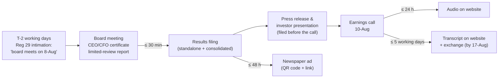

# 03.4 · Quarterly results, earnings season & conference calls

> **Why this matters:** four times a year every listed Indian company publishes a dense two-to-ten-page results
> filing and, usually, talks to analysts about it. The filing tells you *what happened*; the call tells you what
> management *wants you to believe will happen next*. Tracking the gap between those two, quarter after quarter, is
> one of the cheapest and highest-signal habits in fundamental investing.

**Learning objectives** — after this lesson you can:

- State the SEBI deadlines and the sequence of documents in an Indian results cycle, and find each one on the day.
- Read every part of a Regulation 33 results filing: the column layout, standalone vs consolidated, segment results,
  the notes and the auditor's limited-review report.
- Choose the right comparison (YoY, QoQ, YTD, TTM) for a seasonal business and avoid the annualisation trap.
- Normalise a quarter for one-offs, build a profit bridge, and judge a "beat" or "miss" — including whether the
  consensus it is measured against means anything.
- Read an earnings-call transcript efficiently: extract guidance, decode management language, and keep a say-vs-do
  ledger.
- Do all of the above on Kaveri Pumps' Q1 FY27 results and judge how much of the FY27 guidance is still alive.

**Prerequisites:** [02.3 The income statement](../02-accounting/03-the-income-statement.md),
[02.4 The balance sheet](../02-accounting/04-the-balance-sheet.md),
[03.1 Where information lives](01-the-disclosure-universe.md)  ·  **Time:** ~100 min

---

## 1. The quarterly cycle: what gets filed, and by when

Indian listed companies follow the **Indian financial year** (FY27 = 1-Apr-2026 to 31-Mar-2027), so the quarters are
Q1 = Apr–Jun, Q2 = Jul–Sep, Q3 = Oct–Dec, Q4 = Jan–Mar. The rules that govern the results cycle sit in SEBI's
**LODR Regulations** (Listing Obligations and Disclosure Requirements, 2015). The key provisions, checked against the
consolidated text **as amended up to 14-Jul-2026** ([SEBI](https://www.sebi.gov.in/legal/regulations/jul-2026/securities-and-exchange-board-of-india-listing-obligations-and-disclosure-requirements-regulations-2015-last-amended-on-july-14-2026-_102974.html)):

| Step | Rule | What it means in practice |
|:--|:--|:--|
| Board-meeting intimation | Reg 29(1)(a) | The company must tell the exchanges **at least two working days in advance** (excluding the day of intimation and the day of the meeting) that the board will consider results. This is how you know results are coming. |
| Board approves results | Reg 33(2) | The CEO and CFO certify to the board that the results contain nothing false or misleading; the auditor's limited-review report is placed before the same meeting. |
| Results hit the exchange | Reg 30(6) and Schedule III | Within **30 minutes** of the board meeting closing. If the meeting ends after market hours but more than three hours before the next open, the company gets up to **three hours**. |
| Deadline — Q1, Q2, Q3 | Reg 33(3)(a) | Within **45 days** of quarter-end, standalone *and* (if there are subsidiaries) consolidated, Reg 33(3)(b). |
| Deadline — Q4 and full year | Reg 33(3)(d) | Audited annual results within **60 days** of year-end. |
| Analyst/investor call | Schedule III Part A para A(15) | Schedule disclosed at least two working days ahead; the **presentation must be filed before the call starts**; **audio** on the website before the next trading day or within 24 hours, whichever is earlier; video (if any) within 48 hours; **transcript within five working days**, filed with the exchanges too. |
| Newspaper advertisement | Reg 47(1) | Within 48 hours of the board meeting — since the December-2024 amendment it may be just a **QR code and web link** to the full results rather than the full table. |
| Website archive | Reg 46(2)(oa) | Audio/video kept on the website for at least **two years**; transcripts for at least **five years**. |

Since the quarter ended 31-Dec-2024, the results and some related statements (related-party transactions for the
half-year, deviation in use of issue proceeds) are also bundled into a quarterly **Integrated Filing (Financial)**
with the same 45/60-day deadlines, under SEBI circular SEBI/HO/CFD/CFD-PoD-2/CIR/P/2024/185 of 31-Dec-2024 — see
[NSE's implementation circular NSE/CML/2025/02](https://nsearchives.nseindia.com/web/sites/default/files/inline-files/NSE%20Circular%20facilitating%20ease%20of%20doing%20business%20for%20listed%20entities-%20Integrated%20Filing.pdf).

The deadlines translate into an **earnings season**: 30-Jun + 45 days = **14-Aug**; 30-Sep + 45 = **14-Nov**;
31-Dec + 45 = **14-Feb**; 31-Mar + 60 = **30-May**. Large caps tend to report in the first three or four weeks after
quarter-end; many small caps cluster near the deadline. Kaveri reported Q1 FY27 on **8-Aug-2026**, within the window.



!!! info "India notes"
    - **Where to look:** the exchange announcement pages (BSE "Corporate Announcements", NSE "Corporate Filings →
      Financial Results") carry the PDFs the moment they are filed; the company's investor-relations page usually
      follows. Screener.in and similar aggregators scrape the numbers within hours — useful for scanning, but read
      the PDF for notes and the review report (see [03.1](01-the-disclosure-universe.md) on verifying against
      primary sources).
    - **Calls are not mandatory; publishing them is.** LODR does not force a company to hold a call. It forces a
      company that *does* hold one to publish the schedule, presentation, audio and transcript. Many small caps
      hold no call at all — which is itself information.
    - **Banks and NBFCs** use a different results format (interest earned, provisions, asset-quality notes). The
      reading method in this lesson still applies; the line items are covered in
      [07.1 Banks & NBFCs](../07-special-valuation/01-banks-and-nbfcs.md).

---

## 2. Anatomy of a Regulation 33 results filing

A results PDF typically contains, in this order: a cover letter to the exchanges; the **statement of results**
(standalone, then consolidated); **segment information**; **notes**; for Q2 and Q4, a **statement of assets and
liabilities** and a **cash-flow statement**; and the auditor's **limited-review report** (Q1–Q3) or **audit report**
(Q4/annual). Some companies also attach a press release; the investor presentation is a separate filing.

### 2.1 The columns — the single most useful thing to understand

The SEBI-prescribed format puts several periods side by side. Once you know the layout you can read any company's
results in seconds.

| Filing for | Columns you will see (left to right) |
|:--|:--|
| **Q1** | Current quarter · preceding quarter (Q4 — the balancing figure, usually labelled "refer note") · same quarter last year · previous full year |
| **Q2** | Current quarter · preceding quarter · same quarter last year · **half-year (YTD) current** · **half-year last year** · previous full year |
| **Q3** | Current quarter · preceding quarter · same quarter last year · **nine months (YTD) current** · **nine months last year** · previous full year |
| **Q4** | Q4 · Q3 · Q4 last year · **full year (audited)** · previous full year (audited) |

Two quirks worth knowing:

- **Q4 is a balancing figure.** Q4 numbers are the audited full-year figure minus the published nine-month
  year-to-date figure, and the filing must say so in a note (Reg 33(3)(e)). Any year-end true-up —
  a provision, an inventory write-down, an actuarial adjustment — therefore lands entirely in Q4. Kaveri's
  Q4 FY26 revenue is exactly 1,318.0 − 909.5 = **₹408.5 Cr**.
- **Half-year filings carry a balance sheet and cash-flow statement** (Reg 33(3)(f) and (g)). For most Indian
  companies, the Q2 filing (published by mid-November) is therefore the *only* balance sheet you get between
  annual reports. If you want to track receivables, inventory and debt, the Q2 filing is where you do it.

### 2.2 Kaveri's Q1 FY27 statement, laid out as filed

Below is Kaveri's consolidated statement in the Schedule III order a results filing uses. Kaveri's reference data
gives operating costs only as a total (revenue − EBITDA), so we show them on one line; a real filing splits them
into cost of materials consumed, purchases of stock-in-trade, change in inventories, employee benefits and other
expenses. Note that **EBITDA is not a line in the filing** — you compute it.

| ₹ Cr | Q1 FY27 (30-Jun-26, unaudited) | Q4 FY26 (31-Mar-26, balancing figure) | Q1 FY26 (30-Jun-25, unaudited) | FY26 (audited) |
|:--|--:|--:|--:|--:|
| I. Revenue from operations | 368.2 | 408.5 | 355.9 | 1,318.0 |
| II. Other income | 0.8 | 0.9 | 1.0 | 3.9 |
| **III. Total income (I + II)** | **369.0** | **409.4** | **356.9** | **1,321.9** |
| Operating expenses (materials, employees, other) | 321.8 | 347.4 | 305.1 | 1,136.1 |
| Finance costs | 5.1 | 4.4 | 4.2 | 17.0 |
| Depreciation & amortisation | 12.3 | 12.1 | 11.9 | 47.8 |
| **IV. Total expenses** | **339.2** | **363.9** | **321.2** | **1,200.9** |
| **V. Profit before tax (III − IV)** | **29.8** | **45.5** | **35.7** | **121.0** |
| Tax expense (current + deferred) | 7.5 | 11.5 | 9.0 | 30.5 |
| **VI. Profit after tax** | **22.3** | **34.0** | **26.7** | **90.5** |
| Paid-up equity (face value ₹5) | 30.0 | 30.0 | 30.0 | 30.0 |
| EPS — basic, ₹ (not annualised) | 3.72 | 5.67 | 4.45 | 15.08 |
| *Memo: EBITDA = I − operating expenses* | *46.4* | *61.1* | *50.8* | *181.9* |
| *Memo: EBITDA margin* | *12.6%* | *15.0%* | *14.3%* | *13.8%* |

Two small things on the face of the statement deserve a habit. First, "EPS not annualised" — quarterly EPS is for
the quarter only; do not compare it with an annual EPS. Second, check the **paid-up equity** line every quarter:
a change means shares were issued (ESOPs, a QIP, a preferential allotment) and per-share numbers need restating.

### 2.3 Standalone vs consolidated

The **standalone** statement covers the listed legal entity alone; the **consolidated** statement adds subsidiaries
line by line and associates/joint ventures via the equity method ([02.8](../02-accounting/08-deeper-cuts-group-accounts-and-other.md)).
The default is to analyse **consolidated** — it is the economic group you own. Read standalone as well when:

- a large share of profit sits in subsidiaries with minority shareholders (look at "profit attributable to
  non-controlling interests");
- the parent lends to, guarantees or invests in subsidiaries — a standalone "other income" line full of interest
  from subsidiaries is not income from the outside world;
- the gap between the two moves sharply without an acquisition — something happened in a subsidiary.

The course uses Kaveri's consolidated figures throughout.

### 2.4 Segment results

If a company has more than one reportable segment under Ind AS 108, the results filing includes a segment table:
**segment revenue, segment results (usually profit before interest and tax), segment assets and segment
liabilities**. From that you can compute segment margins and a rough segment return on capital employed — often the
most revealing numbers in the whole filing, because a consolidated average hides a good business subsidising a bad
one. Kaveri's reference data gives segment *revenue* by year; its mix shift is the story of the last three years:

| ₹ Cr | FY24 | FY25 | FY26 | FY26 growth | FY26 share of revenue |
|:--|--:|--:|--:|--:|--:|
| Agricultural & domestic pumps | 573.5 | 586.0 | 606.2 | 3.4% | 46.0% |
| Industrial pumps & motors | 291.7 | 328.2 | 355.9 | 8.4% | 27.0% |
| Solar pumping systems | 140.8 | 257.8 | 355.9 | 38.1% | 27.0% |
| **Total** | **1,006.0** | **1,172.0** | **1,318.0** | **12.5%** | **100.0%** |

When the segment table also shows segment assets, divide: a segment whose assets (mainly receivables, for Kaveri's
solar business) grow faster than its revenue is consuming capital — the thread that runs through
[04.4 Working capital](../04-financial-analysis/04-working-capital-and-cash-conversion.md).

### 2.5 The notes: where the quarter's real news hides

Notes to quarterly results are short, but LODR Schedule IV Part A forces some useful disclosures. Read every note;
it takes two minutes. What to look for:

| Note type | Why it matters |
|:--|:--|
| Exceptional items (Schedule IV A-F) | One-offs to strip out — and "exceptional" items that recur every year. |
| Seasonality (Schedule IV A-H) | Companies with material seasonality must say so, and may add rolling twelve-month figures. |
| Change in accounting policy / restated comparatives | Compare like with like; ask why the policy changed. |
| Q4 balancing-figure note; prior-period adjustments in Q4 (Reg 33(3)(i)) | Year-end catch-ups concentrated in one quarter. |
| Modified audit opinion and its impact (Schedule IV A-B, A-C) | How an earlier qualification was resolved — or why not. |
| Subsequent events, litigation, tax demands, fund-raising | Material facts that are not yet in the numbers. |
| "Figures regrouped/reclassified" | Harmless usually; occasionally a quiet reclassification of costs between lines or segments. |

### 2.6 The limited-review report

Quarterly results (Q1–Q3) are usually **unaudited but reviewed**. A **limited review** (under the ICAI's Standard
on Review Engagements, SRE 2410) is mainly enquiry and analytical procedures; the auditor does not test transactions
the way an audit does. The conclusion is therefore phrased as **negative assurance**: roughly, "nothing has come to
our attention that causes us to believe the statement is materially misstated." Contrast with the positive assurance
of an audit opinion ("gives a true and fair view").

What to check, in ten seconds:

1. **Is the conclusion unmodified?** A *qualified conclusion*, *adverse conclusion* or *disclaimer of conclusion* is
   rare and serious. So is a limited-review report that simply does not appear.
2. **Any Emphasis of Matter or "Other Matter" paragraph?** These do not modify the conclusion but point to something
   the auditor wants you to read — a going-concern note, a large tax dispute, a regulatory order.
3. **Coverage of the group.** Reg 33(3)(h) requires that at least 80% of consolidated revenue, assets and profits be
   audited or reviewed. The review report lists subsidiaries reviewed by *other* auditors or *not reviewed at all*;
   if a material subsidiary is unreviewed, you are reading management's numbers with no auditor involvement.
4. **Who signed it,** and is it the same firm as last quarter? A mid-year change of auditor is an event in its own
   right ([09.5 Governance red flags](../09-forensics/05-governance-red-flags-india.md)).

---

## 3. Comparing periods: YoY, QoQ, YTD, TTM — and seasonality

Four comparisons, four different questions:

| Comparison | Question it answers | Use it when | Trap |
|:--|:--|:--|:--|
| **YoY** (year-on-year: this quarter vs same quarter last year) | "Is the business growing, net of seasonality?" | Always, first. | One-offs in either quarter; a weak or strong base. |
| **QoQ** (quarter-on-quarter, "sequential") | "What changed since last quarter?" | Non-seasonal businesses (IT services, many lenders); tracking a turnaround. | Meaningless for seasonal businesses. |
| **YTD** (year-to-date vs same period last year) | "How is the year going against guidance?" | Q2/Q3, and whenever guidance is annual. | Hides a deteriorating latest quarter inside a good cumulative number. |
| **TTM** (trailing twelve months) | "What is the current annual run-rate?" | Valuation multiples between annual reports; smoothing. | Lags turning points by up to three quarters. |

### Worked example 1 — Kaveri Q1 FY27: YoY, QoQ, TTM and the annualisation trap

**Step 1: YoY and QoQ.**

| ₹ Cr | Q1 FY27 | Q1 FY26 | YoY | Q4 FY26 | QoQ |
|:--|--:|--:|--:|--:|--:|
| Revenue | 368.2 | 355.9 | 3.5% | 408.5 | (9.9%) |
| EBITDA | 46.4 | 50.8 | (8.7%) | 61.1 | (24.1%) |
| PBT | 29.8 | 35.7 | (16.5%) | 45.5 | (34.5%) |
| PAT | 22.3 | 26.7 | (16.5%) | 34.0 | (34.4%) |
| EBITDA margin | 12.6% | 14.3% | (167 bps) | 15.0% | |

The QoQ column looks like a collapse and means almost nothing: Kaveri's Q4 (Jan–Mar) is its peak season. The YoY
column is the real news: revenue barely grew while every profit line fell by double digits.

**Step 2: a PBT bridge (Q1 FY26 → Q1 FY27).** Walk from last year's profit to this year's, one line at a time:

$$
\underbrace{35.7}_{\text{PBT Q1 FY26}} \;-\; \underbrace{4.4}_{\Delta\text{EBITDA}} \;-\; \underbrace{0.4}_{\Delta\text{D\&A}} \;-\; \underbrace{0.2}_{\Delta\text{other income}} \;-\; \underbrace{0.9}_{\Delta\text{finance costs}} \;=\; \underbrace{29.8}_{\text{PBT Q1 FY27}}
$$

Most of the damage (₹4.4 Cr of ₹5.9 Cr) is operating: revenue rose ₹12.3 Cr but operating costs rose ₹16.7 Cr
(from 305.1 to 321.8, +5.5%). Of the remaining ₹1.5 Cr, ₹0.4 Cr is higher depreciation and ₹1.1 Cr is
balance-sheet driven — higher finance costs from larger working-capital borrowings (+₹0.9 Cr) and lower treasury
income on a smaller cash pile (−₹0.2 Cr). That balance-sheet part will not reverse until receivables are collected. Note the **operating leverage**: a 3.5% revenue change produced an 8.7% EBITDA fall and a
16.5% PAT fall, the "gamma" of fixed costs you will meet properly in
[04.2 Margins & cost structure](../04-financial-analysis/02-margins-and-cost-structure.md).

**Step 3: TTM.** TTM = last full year − the year-ago quarter + the latest quarter:

$$\text{TTM revenue} = 1{,}318.0 - 355.9 + 368.2 = 1{,}330.3 \qquad \text{TTM EBITDA} = 181.9 - 50.8 + 46.4 = 177.5$$

$$\text{TTM PAT} = 90.5 - 26.7 + 22.3 = 86.1 \;\Rightarrow\; \text{TTM EPS} = 86.1 / 6.00 = \text{₹}14.35$$

At ₹390 the stock trades on 390 / 15.08 = **25.9×** FY26 EPS but **27.2×** TTM EPS: the multiple on the latest
numbers is *higher* than the one on the annual report, because earnings are going the wrong way. (Kaveri also has
6.07 Cr diluted shares; using them moves these multiples by about 1%.)

**Step 4: the annualisation trap.** A tempting shortcut is "Q1 × 4". Kaveri's FY26 quarters show why that fails:

| FY26 | Q1 | Q2 | Q3 | Q4 |
|:--|--:|--:|--:|--:|
| Share of annual revenue | 27.0% | 20.0% | 22.0% | 31.0% |
| Share of annual EBITDA | 27.9% | 17.6% | 20.8% | 33.6% |
| EBITDA margin | 14.3% | 12.2% | 13.1% | 15.0% |

- Naive: 368.2 × 4 = **₹1,472.8 Cr** — implying 11.7% growth.
- Seasonally adjusted, assuming Q1 is again 27.0% of the year: 368.2 / 0.270 = **₹1,363.6 Cr** — implying 3.5%
  growth, i.e., exactly the YoY rate, which is the point.
- For profit the gap is wider: 22.3 × 4 = ₹89.2 Cr vs 22.3 / (26.7 / 90.5) = **₹75.6 Cr**.

Seasonal share is a noisy estimate (one year of history here; use three to five in practice), but it is far better
than assuming four identical quarters. Margins are seasonal too: Q2 and Q3 carry the same fixed costs on less
revenue, so a Q2 margin below Q1 is normal for Kaveri and is not, by itself, a deterioration.

!!! tip "Trader's lens"
    Seasonality in quarterly results is the fundamental cousin of the volatility smile you see around known events:
    it is predictable structure, not signal. Just as you would never compare an implied vol on an earnings-week
    expiry with a quiet-week expiry without adjusting for the event, never compare Kaveri's Q2 with its Q1. Strip
    the known pattern first; what is left is the surprise.

---

## 4. Normalising one-offs

A single quarter is small, so one-offs matter more than in annual numbers. Common distortions, roughly in order of
frequency:

1. **Exceptional items** — gains on asset sales, VRS costs, impairments, litigation settlements. Shown separately,
   so easy to strip; the judgement is whether they are truly non-recurring.
2. **Other income swings** — treasury gains when bond yields fall, dividends from subsidiaries, interest on tax
   refunds. Not "exceptional", so they sit above PBT and flatter it quietly.
3. **Tax-rate noise** — a deferred-tax true-up, a regime change, a reversal of an old provision. Compare PBT growth
   with PAT growth; if PAT grew much faster, find out why.
4. **Inventory and commodity effects** — a raw-material price fall lifts margins temporarily for a company holding
   cheap inventory and selling at old prices; the reverse also happens.
5. **Q4 catch-ups** — year-end actuarial valuations, bonus accruals, provisions booked only at the audit.
6. **Provision write-backs** — releasing an earlier provision (for doubtful debts, warranties, litigation) into
   profit. Often buried in "other income" or netted within "other expenses".
7. **One-time price increases or pre-buying** — customers stocking up ahead of a price hike borrow demand from the
   next quarter.

### Worked example 2 — Normalising Kaveri's reported earnings

Kaveri booked two exceptional items in six years: a ₹7.5 Cr **VRS cost** in FY21 and a ₹14.0 Cr **gain on sale of
land** in FY25. Strip each out after tax at Kaveri's 25.17% rate (the course simplifies by using the normal
corporate rate; in reality a land gain may be taxed as a capital gain at a different rate):

$$\text{Adjusted PAT}_{FY25} = 97.4 - 14.0 \times (1 - 0.2517) = 97.4 - 10.5 = \text{₹}86.9 \text{ Cr} \;\Rightarrow\; \text{EPS} = 86.9/6.00 = \text{₹}14.5$$

$$\text{Adjusted PAT}_{FY21} = 32.8 + 7.5 \times (1 - 0.2517) = 32.8 + 5.6 = \text{₹}38.4 \text{ Cr} \;\Rightarrow\; \text{EPS} = \text{₹}6.4$$

Both match the "adjusted EPS" line in Kaveri's ratio table. Now the FY26 story reads differently:

| ₹ Cr | FY25 | FY26 | Growth |
|:--|--:|--:|--:|
| PAT as reported | 97.4 | 90.5 | (7.1%) |
| PAT excluding the land gain | 86.9 | 90.5 | 4.1% |
| PBT excluding exceptional items | 116.2 | 121.0 | 4.1% |

"Profit fell 7%" (the headline) and "profit rose 4%" (the underlying) are both true. The analyst's job is to know
which one describes the business — here, the second, and 4% is itself a poor number for a company growing revenue at
12.5%. Normalisation cuts both ways: it removed a flattering gain from FY25, but it does not rescue FY26.

For Q1 FY27 there are no exceptional items, but the *drivers* still separate cleanly: operating (EBITDA −₹4.4 Cr)
versus balance-sheet (finance costs +₹0.9 Cr, other income −₹0.2 Cr). The second group is a direct consequence of
the receivables build-up — a reminder that "one-off" is a claim to be tested, not a label to be accepted.

---

## 5. Beat, miss and the consensus problem

**Consensus** is the average (or median) of published sell-side analysts' forecasts for a line item — revenue,
EBITDA, PAT, EPS — compiled by data vendors. A **beat** is actual > consensus; a **miss** is actual < consensus. The
market reacts to the *surprise* relative to what was expected, not to the level of the number.

Three things make "vs consensus" less useful than financial media suggest, especially in India:

1. **Coverage is thin below the large caps.** As an illustration, Yahoo Finance's analyst-count field (pulled via
   `yfinance` on 21-Sep-2026) showed 41 analyst opinions for HDFC Bank, 42 for Infosys and 26 for Reliance
   Industries — but 2 for KSB (market cap ≈ ₹14,000 Cr), 1 for Shakti Pumps (≈ ₹5,800 Cr) and no count at all
   for Kirloskar Brothers (≈ ₹14,300 Cr) or Roto Pumps (≈ ₹1,200 Cr), where the field was empty. Vendor counts are
   incomplete and differ between Yahoo, Bloomberg and LSEG, so treat the numbers as indicative. The point is the
   shape: deep coverage at the top, thin or absent coverage lower down, where "consensus" may be one or two
   people, or nobody.
2. **Dispersion matters more than the mean.** Three estimates that disagree by 25% are not a consensus.
3. **The relevant expectation may be unpublished** — the buy-side's "whisper" number, or the price action in the
   week before results.

You can check coverage yourself (disable any VPN first; `yfinance` fails behind some):

```python
import sys, io
sys.stdout = io.TextIOWrapper(sys.stdout.buffer, encoding="utf-8")
import yfinance as yf

for t in ["HDFCBANK.NS", "KSB.NS", "SHAKTIPUMP.NS", "ROTO.NS"]:
    info = yf.Ticker(t).info
    print(t, info.get("marketCap"), info.get("numberOfAnalystOpinions"), info.get("targetMeanPrice"))
```

The course wrapper `tools/fi/data.py::fetch_price_info(ticker)` returns the same analyst fields.

### Worked example 3 — Did Kaveri "miss", and by how much?

Suppose (fictional detail, for this example only) three brokers covered Kaveri going into Q1 FY27:

| Estimates, ₹ Cr | Broker A | Broker B | Broker C | Mean | Std. dev. | Actual | Surprise vs mean |
|:--|--:|--:|--:|--:|--:|--:|--:|
| Revenue | 398.0 | 410.0 | 398.0 | 402.0 | 6.9 | 368.2 | (8.4%) |
| EBITDA | 57.0 | 61.5 | 57.0 | 58.5 | 2.6 | 46.4 | (20.7%) |
| PAT | 30.0 | 36.0 | 28.5 | 31.5 | 4.0 | 22.3 | (29.2%) |

Computation for PAT: mean = (30.0 + 36.0 + 28.5)/3 = 31.5; surprise = 22.3/31.5 − 1 = −29.2%; the range
(36.0 − 28.5 = 7.5) is 23.8% of the mean. Even with a wide range, the actual is 2.3 standard deviations below the
mean on PAT and about 4.7–4.9 on revenue and EBITDA (with three estimates, a "standard deviation" is a crude
yardstick, but the conclusion survives any reasonable measure). This is a genuine miss on every line — not noise.

Now grade the *quality* of the miss, which matters more than its size:

- **Revenue miss (−8.4%)**: the demand/execution story — here, solar tenders delayed in two states.
- **Margin miss (EBITDA −20.7% on revenue −8.4%)**: the cost structure could not absorb the shortfall.
- **Below-EBITDA drag**: higher finance costs from working-capital debt — a symptom of the receivables problem.

A company that misses on revenue but holds margins is having a bad quarter; one that misses on revenue, margins
*and* cash (rising working-capital debt) may be having a bad business. The reverse applies to beats: a PAT beat
driven by other income or a low tax rate is worth much less than one driven by gross margin.

!!! tip "Trader's lens"
    Consensus is the market's *implied* number and the reported figure is the *realised* one. As with implied vs
    realised vol, the P&L comes from the difference — and from how the market reprices the *forward* expectation
    (guidance, next year's EPS), not from the realised print alone. For F&O-eligible stocks the options market also
    tells you how big a move is priced for results day; [11.7 Fundamentals × derivatives](../11-process/07-fundamentals-meets-derivatives.md)
    shows how to read the pre-results straddle as an implied move. Kaveri, a small cap, has no listed options —
    another way of saying nobody is pricing its surprise for you.

---

## 6. Guidance and the say-do ledger

**Guidance** is management's stated expectation for a future period — revenue growth, margin, capex, sometimes
specific KPIs. Indian companies are not required to give it; many do, in the call rather than in a filing. Guidance
is a forward promise, so treat it the way you would a counterparty's quote: useful, but priced against their track
record. The practical tool is a **say-do ledger**: a table of every quantified statement management makes, the date,
and what actually happened. Maintained over two or three years it is the best single measure of management
credibility you will have ([05.5 Management & capital allocation](../05-business-analysis/05-management-and-capital-allocation.md)
formalises the "say-do ratio").

### Worked example 4 — How alive is Kaveri's FY27 guidance after Q1?

On the Q4 FY26 call (May-2026) Kaveri guided FY27 **revenue growth of 15–18%** and an **EBITDA margin of 14–15%**.
Q1 delivered revenue of ₹368.2 Cr and an EBITDA margin of 12.6%. What must Q2–Q4 deliver?

**Revenue.** FY27 target = 1,318.0 × 1.15 = ₹1,515.7 Cr (low end) to 1,318.0 × 1.18 = ₹1,555.2 Cr (high end).
Subtract Q1:

$$\text{Needed in Q2–Q4 (₹ Cr)} = 1{,}515.7 - 368.2 = 1{,}147.5 \text{ (low end)}; \quad 1{,}555.2 - 368.2 = 1{,}187.0 \text{ (high end)}$$

Last year's Q2–Q4 revenue was 263.6 + 290.0 + 408.5 = ₹962.1 Cr, so the remaining three quarters must grow
1,147.5 / 962.1 − 1 = **19.3%** (low end) to 1,187.0 / 962.1 − 1 = **23.4%** (high end) — after a quarter that grew
3.5%.

**Margin.** At the low-end revenue, a 14.0% full-year margin needs EBITDA of 0.14 × 1,515.7 = ₹212.2 Cr. Q1 supplied
₹46.4 Cr, so Q2–Q4 must earn ₹165.8 Cr on ₹1,147.5 Cr of revenue — a **14.45%** margin, against **13.6%** in the same
three quarters of FY26 (131.1 / 962.1). Hitting the *top* of the margin band would need about 15.8%.

**Compare with the course's reference valuation**, which already cut FY27 to 10% growth at a 13.3% margin
([kaveri-valuation.md](../appendix/running-example/kaveri-valuation.md)): FY27 revenue ₹1,449.8 Cr and EBITDA
₹192.8 Cr. That needs Q2–Q4 revenue of ₹1,081.6 Cr (+12.4% YoY) at a 13.5% margin — demanding, but not heroic.

| Scenario for FY27 | Q2–Q4 revenue growth needed | Q2–Q4 EBITDA margin needed |
|:--|--:|--:|
| Guidance, low end (15% growth, 14% margin) | 19.3% | 14.45% |
| Guidance, high end (18% growth, 15% margin) | 23.4% | 15.7% |
| Course base case (10% growth, 13.3% margin) | 12.4% | 13.5% |
| FY26 actual, same three quarters | — | 13.6% |

Conclusion: after one quarter, the guidance survives only if the delayed solar tenders are finalised *and* executed
*and* margins expand — three things that have to go right at once. When management does not cut guidance in this
position, the call transcript becomes important: listen for softened language (section 7.3).

The same arithmetic tests the working-capital promise. Management said receivable days would "normalise towards
75–80 by end-FY27". At the midpoint of 77.5 days on the course's FY27 revenue of ₹1,449.8 Cr, year-end receivables
would be 1,449.8 × 77.5 / 365 = ₹307.8 Cr, a release of about ₹39 Cr from the ₹346.7 Cr at end-FY26. The Q1 filing
did not disclose receivables and the presentation showed an unlabelled bar chart — so the promise cannot yet be
tracked. Record that in the ledger too: *what was not disclosed* is a data point.

| Date | Source | Statement | Measurable? | Outcome so far |
|:--|:--|:--|:--|:--|
| May-2026 | Q4 FY26 call | FY27 revenue growth 15–18% | Yes | Q1 +3.5%; needs 19–23% for rest of year |
| May-2026 | Q4 FY26 call | FY27 EBITDA margin 14–15% | Yes | Q1 12.6% |
| May-2026 | Q4 FY26 call | Receivable days to 75–80 by end-FY27 | Only at H1/FY | Not disclosed at Q1 |
| May-2026 | Q4 FY26 call | Capex ₹45–50 Cr | Yes (H1 cash flow) | Check in Q2 filing |

---

## 7. Reading an earnings-call transcript

### 7.1 Structure

A typical Indian transcript runs 15–30 pages: an operator's introduction and **safe-harbour** disclaimer
("forward-looking statements…"); **opening remarks** by the CEO/MD and CFO (5–15 minutes, often read from a
script that mirrors the presentation); then **Q&A** with analysts (40–60 minutes); a closing statement. The
participants list matters: a call where the promoter-chairman does all the talking and the CFO never speaks is
different from one where the CFO answers the numbers questions crisply.

### 7.2 A reading protocol (about 40 minutes per transcript)

1. **Before reading:** open last quarter's transcript and your say-do ledger. Write down the three things you most
   want to learn (for Kaveri: solar tender status, receivables, guidance).
2. **Opening remarks:** skim. Note every number and every *new* phrase. Scripted remarks are where language shifts
   first — "strong" becomes "resilient", "15–18%" becomes "mid-teens".
3. **Q&A — the main event:** for each question, note (a) who asked, (b) whether the question was *answered*,
   *deflected* or *answered a different question*, and (c) any number given.
4. **After reading:** update the ledger; list the questions nobody asked; compare the tone with the last two calls.

### 7.3 Decoding management speak

Management language is a compressed code. A few phrases, with the reading an experienced analyst would give them
(these are tendencies, not laws — always test against the numbers):

| Phrase | Often means | What to check |
|:--|:--|:--|
| "We remain cautiously optimistic" | The recent past was bad; no evidence yet that it is improving. | Order intake, next-quarter guidance. |
| "Calibrated / measured growth" | Growth is slowing; framed as a choice. | Was the slowdown announced *before* or *after* the miss? |
| "One-offs" / "transitory" | Costs that management hopes you will exclude. | Did the same "one-off" appear last year? |
| "Headwinds" | External factors blamed for a shortfall. | Did peers facing the same headwinds do better? |
| "Temporary delay in collections" | Receivables are building. | Receivable days, ageing, ECL provision, debt. |
| "Fully recoverable" | Not yet provided for. | ECL allowance vs overdue bucket. |
| "Strategic investment in working capital" | Cash is tied up. | CFO vs EBITDA. |
| "We don't give quarterly guidance, but directionally…" | A number is coming; decide whether it is a commitment. | Record it in the ledger anyway. |
| "Mid-teens" (after guiding 15–18%) | The top of the range is gone; the bottom is at risk. | Required run-rate (section 6). |
| "Robust pipeline" / "healthy order enquiries" | Not orders. | Order *book* and *inflow*, conversion rates. |
| "Normalised" / "adjusted" / "like-for-like" | A metric excluding something. | Exactly what is excluded, and is it consistent across periods? |
| "H2 will be stronger" | Guidance depends on a back-ended recovery. | What specifically happens in H2 — contracted, or hoped? |
| "We are evaluating inorganic opportunities" | An acquisition may be coming. | Balance-sheet capacity; past acquisition record. |
| "That's a promoter's personal matter" | A question about pledges or related parties is being closed down. | SAST/pledge filings; related-party notes. |
| "We'll take that offline" | Not answering on the public record. | Whether it gets answered in a later filing. |

Research supports the instinct that *how* executives talk carries information: Larcker and Zakolyukina (2012)
found that linguistic features of CEO/CFO answers on US calls (for example, fewer self-references and more
general-knowledge phrases) helped predict later financial restatements. Treat such cues as prompts for questions,
never as proof.

### 7.4 The questions analysts ask — and don't

Sell-side analysts need continued access to management, and their clients mostly want next quarter's number. So
calls are dominated by questions about **near-term margins, volumes, pricing and guidance**. Questions that tend to
be *under-asked* on Indian calls: promoter pledges and their purpose; related-party transactions and their pricing;
auditor changes and remarks (CARO, Emphasis of Matter); receivables ageing and provisions; contingent liabilities;
cash conversion; capital allocation track record. When a question you care about is never asked, find the answer in
the filings ([03.3 Notes to accounts](03-notes-to-accounts.md)) — and note that the market may not be pricing it.

### 7.5 An annotated excerpt — Kaveri Q1 FY27 call (fictional)

!!! quote "Kaveri Pumps & Motors Ltd — Q1 FY27 earnings conference call, 10-Aug-2026 (fictional excerpt)"
    **[1] CFO, opening remarks:** "Revenue for the quarter was ₹368 crore, up 3.5% year-on-year. EBITDA margin was
    12.6%, impacted by an adverse mix as solar execution was lower, and by copper prices, which were higher through
    the quarter. Finance costs increased as we utilised working-capital lines to support our state-government
    customers."

    **[2] MD, opening remarks:** "Our core agri franchise remains robust. In solar, tender finalisation was delayed
    in two states, which is a timing issue. The pipeline is healthy and we remain cautiously optimistic about a much
    stronger second half."

    **[3] Analyst (Nariman Point Research):** "Could you give us receivable days as of June, and the overdue amount
    from the two state agencies?"

    **[4] CFO:** "We don't report balance-sheet numbers quarterly. Directionally, receivables remain elevated but are
    fully recoverable — these are government counterparties. We expect normalisation over the year."

    **[5] Analyst (a portfolio manager):** "Are you still guiding 15–18% for FY27?"

    **[6] MD:** "We are not changing guidance at this point. We'd rather be calibrated — mid-teens growth is very
    much achievable given the order book, with H2 carrying most of it."

    **[7] Analyst:** "On the promoter pledge created last November — what is it for, and is there any margin-call
    risk?"

    **[8] MD:** "That is a personal matter of the promoter family and has nothing to do with the company's
    operations. The pledge is well covered."

    **[9] Analyst:** "Purchases from Kaveri Castings have gone from 6.5% to over 10% of material cost. How is
    arm's-length pricing established?"

    **[10] CFO:** "All transactions are approved by the audit committee and benchmarked against third-party
    quotes. Kaveri Castings gives us assured supply and quality."

<details markdown="1"><summary>Annotations — try your own first, then compare</summary>

| Ref | What was said | Reading | Check / follow-up |
|:--|:--|:--|:--|
| [1] | "Utilised working-capital lines to support our state-government customers" | Honest about the mechanism — finance costs up ₹0.9 Cr YoY — but framed as a favour to customers. It is Kaveri financing its customers' delays. | Q2 filing: borrowings and receivables in the half-year balance sheet; CFO in the half-year cash flow. |
| [2] | "Robust", "timing issue", "cautiously optimistic", "much stronger second half" | Three softeners in one paragraph. "Timing" is an assertion; the order book is not the same as collections. | Ask which two states and whether tenders are *awarded* or merely *expected*. |
| [3]–[4] | Receivable days refused; "fully recoverable"; "government counterparties" | A deflection. The company publishes annual receivables, so it has the number; it chooses not to give it. "Government counterparty" speaks to *eventual* recovery, not timing or the cost of waiting. | Receivables > 6 months doubled to ₹62.4 Cr in FY26 with only ₹4.0 Cr ECL ([03.3](03-notes-to-accounts.md)). Track at H1. |
| [5]–[6] | "Not changing guidance" + "mid-teens" + "H2 carrying most of it" | Guidance **softened without being cut**: 15–18% has become "mid-teens", and it is now back-ended. Section 6 showed Q2–Q4 need 19–23% growth for the old range. | Ledger entry: "10-Aug-2026: guidance language moved to mid-teens". |
| [7]–[8] | "Personal matter", "well covered" | A shut-down. Promoter pledges are *not* purely personal: forced selling on a margin call hits every shareholder. No number given for cover. | Pledge % from SAST disclosures (6% of promoter holding); watch for increases as the price falls. |
| [9]–[10] | "Approved by the audit committee", "benchmarked" | A process answer, not an evidence answer — no numbers on price comparison. The share of material cost bought from a promoter company has risen every year for five years. | Related-party note; audit committee composition; compare gross margin trend with peers. |
| — | What nobody asked | Contingent GST demand (₹38.0 Cr), bank guarantees (₹96.0 Cr), capex vs the ₹45–50 Cr guide, dividend policy with rising debt. | Your own list of questions for the IR team. |

**Overall:** the numbers questions got qualitative answers, and every governance question got a process answer.
Individually each is defensible; together they form a pattern worth weighting in your view of management.

</details>

---

## 8. Putting it together: a 45-minute quarterly review

Run this on results day for every company you follow; record the output in one page.

1. **(5 min) Headline table:** revenue, EBITDA, margin, PBT, PAT — YoY and YTD; QoQ only if the business is
   not seasonal.
2. **(5 min) Bridge:** walk last year's PBT to this year's; label each driver operating vs non-operating.
3. **(5 min) Notes and review report:** exceptional items, tax, subsequent events; conclusion unmodified? coverage?
4. **(5 min) Segments:** growth and margin by segment; mix shift.
5. **(5 min) Expectations:** vs consensus (if meaningful), vs guidance (required run-rate), vs your own model.
6. **(15 min) Transcript/presentation:** language changes, deflected questions, new numbers; update the say-do
   ledger.
7. **(5 min) Verdict:** thesis intact / weakened / broken; what to watch next quarter (see
   [11.5 Monitoring & selling](../11-process/05-monitoring-and-selling.md)).

A few lines of Python do step 1 for Kaveri from the course data:

```python
import sys, io
sys.stdout = io.TextIOWrapper(sys.stdout.buffer, encoding="utf-8")
import pandas as pd

q = pd.read_csv("tools/data/kaveri_pumps_quarterly.csv", index_col="line_item")
lines = ["rev", "ebitda", "pbt", "pat"]

yoy = (q["Q1 FY27"] / q["Q1 FY26"] - 1).loc[lines] * 100      # same quarter, last year
qoq = (q["Q1 FY27"] / q["Q4 FY26"] - 1).loc[lines] * 100      # previous quarter
fy26 = q[["Q1 FY26", "Q2 FY26", "Q3 FY26", "Q4 FY26"]].sum(axis=1)
ttm = fy26 - q["Q1 FY26"] + q["Q1 FY27"]                      # trailing twelve months

print(pd.DataFrame({"YoY %": yoy.round(1), "QoQ %": qoq.round(1),
                    "FY26 ₹ Cr": fy26.loc[lines].round(1), "TTM ₹ Cr": ttm.loc[lines].round(1)}))
print(f"TTM EBITDA margin: {ttm['ebitda'] / ttm['rev']:.1%}")
```

(Run from the repository root. `tools/fi/data.py::load_kaveri("quarterly")` loads the same table.)

!!! warning "Common mistakes"
    - **Comparing QoQ for a seasonal business** and calling Kaveri's Q1 a "10% sequential decline".
    - **Annualising a single quarter** (Q1 × 4) without adjusting for seasonality.
    - **Comparing quarterly EPS with annual EPS**, or a trailing P/E with a forward one.
    - **Reading only the press release.** Press releases are marketing; the notes and the review report are not.
    - **Treating "exceptional" as automatically non-recurring** — or ignoring non-exceptional one-offs sitting in
      other income or tax.
    - **Taking a beat at face value** without asking where it came from (other income? tax? a provision
      write-back?).
    - **Treating a one-analyst "consensus" as a market expectation.**
    - **Letting guidance ratchet silently.** If you do not write guidance down with a date, you will not notice
      when "15–18%" becomes "mid-teens".
    - **Ignoring the Q4 balancing figure** — year-end adjustments concentrate there, so Q4 margins are the least
      comparable of the four.
    - **Missing the Q2 balance sheet**, the only interim look at working capital and debt most Indian companies
      give you.

## Key terms

| Term | Meaning |
|:--|:--|
| **Regulation 33 (LODR)** | The SEBI rule governing the preparation, approval, review and filing of quarterly and annual results. |
| **Limited review** | A review of interim results by the statutory auditor (SRE 2410), mainly enquiry and analytics, giving negative assurance. |
| **Negative assurance** | "Nothing has come to our attention…" — weaker than an audit's positive "true and fair" opinion. |
| **Balancing figure (Q4)** | Q4 results derived as audited full year minus nine-month YTD; absorbs year-end adjustments. |
| **YoY / QoQ / YTD / TTM** | Year-on-year; quarter-on-quarter (sequential); year-to-date; trailing twelve months. |
| **Seasonality** | Predictable within-year pattern in revenue and margins (e.g., Kaveri's Q4/Q1 peak). |
| **Normalisation** | Adjusting reported profit for one-offs to estimate underlying, recurring earnings. |
| **Profit bridge** | A walk from one period's profit to another's, line by line. |
| **Consensus** | The mean or median of published analysts' forecasts for a metric. |
| **Beat / miss / surprise** | Actual above / below consensus; surprise = actual ÷ consensus − 1. |
| **Guidance** | Management's stated expectations for future periods. |
| **Say-do ledger** | A dated record of management's quantified statements and actual outcomes. |
| **Integrated Filing (Financial)** | The quarterly bundle of results and related statements filed with exchanges since the Dec-2024 quarter. |
| **Safe harbour** | The disclaimer at the start of a call noting that forward-looking statements are uncertain. |

## Check your understanding

**1.** A company's board meets on a Thursday to approve Q2 results, and the meeting ends at 17:30, after market close.
What is the latest time the results can reach the exchange, and what is the deadline for the call transcript if
the call is held on the Friday?

<details markdown="1"><summary>Answer</summary>
The meeting closed after trading hours and more than three hours before the next day's open, so Reg 30(6)
allows up to **three hours**: 20:30 that evening. The transcript is due **within five working days** of the call
— the following Friday, if there are no holidays in between. (The audio must be on the website before the next
trading day's open or within 24 hours, whichever is earlier.)
</details>

**2.** Why is Kaveri's QoQ revenue change in Q1 FY27 (−9.9%) not evidence of weakness, while its YoY change (+3.5%)
is?

<details markdown="1"><summary>Answer</summary>
Q4 (Jan–Mar) is Kaveri's peak season: 31.0% of FY26 revenue versus 27.0% in Q1. A Q1 below Q4 is expected every
year. YoY compares Q1 with Q1, cancelling seasonality; +3.5% against a 15–18% annual guide is the real signal.
</details>

**3.** Compute Kaveri's TTM EBITDA margin at end-Q1 FY27 and explain why it is below the FY26 margin.

<details markdown="1"><summary>Answer</summary>
TTM revenue = 1,318.0 − 355.9 + 368.2 = 1,330.3; TTM EBITDA = 181.9 − 50.8 + 46.4 = 177.5; margin =
177.5 / 1,330.3 = **13.3%** vs 13.8% in FY26. The new quarter (12.6% margin) replaced a stronger one (14.3%).
</details>

**4.** Company X reports quarterly PAT up 30% YoY against consensus of +12%. Revenue grew 8%, EBITDA grew 6%, other
income tripled and the effective tax rate fell from 25% to 18%. Is this a quality beat?

<details markdown="1"><summary>Answer</summary>
No. Operating profit grew 6% — slower than revenue, so margins fell. The PAT beat comes from other income and a
lower tax rate, both typically non-recurring or non-operating. Normalise both before comparing with consensus;
the underlying result is probably a slight miss.
</details>

**5.** On the Q4 call a CEO guided 20% revenue growth for the year. H1 revenue grew 12% on a base where H1 was 45% of
last year's revenue. What growth is needed in H2 to meet guidance?

<details markdown="1"><summary>Answer</summary>
Let last year's revenue be 100: H1 = 45, H2 = 55. Target = 120. H1 this year = 45 × 1.12 = 50.4. Needed H2 =
120 − 50.4 = 69.6, i.e., 69.6 / 55 − 1 = **26.5%** growth in H2 — more than double the H1 rate.
</details>

**6.** Kaveri's CFO says receivables are "fully recoverable — these are government counterparties". Give two reasons
this answer does not settle the analyst's concern.

<details markdown="1"><summary>Answer</summary>
(i) Eventual recovery is not timely recovery: waiting costs interest (finance costs are already rising) and ties
up capital that earns nothing. (ii) The accounting question is the ECL allowance: ₹4.0 Cr against ₹62.4 Cr
overdue more than six months. "Recoverable" in management's view is not evidence; the ageing and the provision
are. A third: the answer refused the number actually asked for (receivable days).
</details>

**7.** Why might a Q2 results filing be more valuable to an analyst than a Q1 or Q3 filing for an Indian manufacturer?

<details markdown="1"><summary>Answer</summary>
Half-year results must include a statement of assets and liabilities and a cash-flow statement (Reg 33(3)(f),
(g)). For most Indian companies that is the only interim balance sheet — the only chance between annual reports
to see receivables, inventories, debt and operating cash flow.
</details>

**8.** A limited-review report on a company's consolidated Q3 results says that subsidiaries representing 25% of
consolidated revenue were neither reviewed by the auditor nor by other auditors. What rule is relevant, and how
should it change your reading?

<details markdown="1"><summary>Answer</summary>
Reg 33(3)(h) requires that at least 80% of consolidated revenue, assets and profits be audited or reviewed; 75%
coverage would breach it. Even if coverage were at the limit, a quarter of revenue with no auditor involvement
means those numbers are management-only — treat that part of the result with extra scepticism and ask why.
</details>

## Go deeper

- [SEBI LODR Regulations, 2015 (as amended up to 14-Jul-2026)](https://www.sebi.gov.in/legal/regulations/jul-2026/securities-and-exchange-board-of-india-listing-obligations-and-disclosure-requirements-regulations-2015-last-amended-on-july-14-2026-_102974.html)
  — read Regulation 33, Regulation 47 and Schedule III Part A para A(15) once in the original.
- [SEBI Master Circular for compliance with LODR (Jan-2026)](https://www.sebi.gov.in/legal/master-circulars/jan-2026/master-circular-for-compliance-with-the-provisions-of-the-securities-and-exchange-board-of-india-listing-obligations-and-disclosure-requirements-regulations-2015-by-listed-entities_99432.html)
  — contains the prescribed results formats and filing mechanics.
- Larcker, D. and Zakolyukina, A. (2012), "Detecting Deceptive Discussions in Conference Calls", *Journal of
  Accounting Research* 50(2) — the evidence behind reading tone and language on calls.
- Mauboussin, M. and Rappaport, A., *Expectations Investing* (revised ed., 2021) — why the market reacts to
  changes in expectations rather than to reported numbers.
- Pick one Nifty 50 company and one small cap you know; read their last four transcripts back to back and build a
  say-do ledger. No book teaches this as fast.

---
[← Previous: 03.3 Notes to accounts](03-notes-to-accounts.md) · [Module index](index.md) · [Next: 03.5 Rating rationales, offer documents, broker reports & US filings →](05-other-documents.md)
