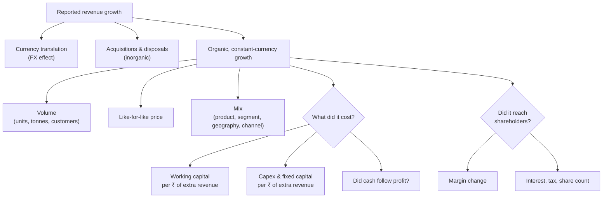

# 04.1 · Growth analysis

> **Why this matters:** "revenue grew 15%" is the most quoted number in any results season and among the least
> informative. The same 15% can come from customers buying more, from price increases that will not repeat, from
> an acquisition, from a weaker rupee, or from selling on credit to customers who pay late. Each has a different
> value. Growth analysis takes the headline apart, finds the source of each rupee, and asks what the growth cost.

**Learning objectives** — after this lesson you can:

- Choose the right growth measure (YoY, QoQ, TTM, CAGR) for a question, and spot base effects and endpoint games,
  including the FY21 COVID base.
- Decompose revenue growth into **volume, price and mix** with an exact additive bridge, and say which parts are
  likely to persist.
- Separate **organic** growth from acquisitions, disposals and **currency**, and compute constant-currency organic
  growth from a company's disclosures.
- Attribute growth to **segments** in percentage points and explain how a mix shift changes future growth and risk
  (Kaveri's solar vs agri).
- Measure **what growth cost**: the working capital and fixed capital consumed per ₹ of extra revenue, and whether
  cash kept up with profit.
- Decompose **EPS growth** into revenue, margin, tax, financing and share-count effects, and explain why EPS can
  outgrow revenue for a while but not for ever.

**Prerequisites:** [01.5 Time value & returns math](../01-markets-101/05-time-value-and-returns-math.md),
[02.3 The income statement](../02-accounting/03-the-income-statement.md),
[02.5 The cash-flow statement](../02-accounting/05-the-cash-flow-statement.md),
[03.3 Notes to accounts](../03-reading-filings/03-notes-to-accounts.md)  ·  **Time:** ~100 min

---

## 1. The question tree

A headline growth rate is the *output* of a stack of drivers. Growth analysis runs the stack backwards. The order
matters: strip out the things that tell you nothing about customer demand (currency, acquisitions) before you
interpret what is left.



Three questions organise the lesson:

1. **How fast, really?** Measuring growth without being fooled by the base or the endpoints (§2).
2. **From where?** Volume, price, mix; organic vs acquired vs FX; which segments (§3–§5).
3. **At what cost, and for whom?** Capital consumed (§6) and the path from revenue to EPS (§7).

## 2. Measuring growth without fooling yourself

### 2.1 The basic measures

| Measure | Definition | Use it for | Trap |
|:--|:--|:--|:--|
| **YoY** (year-on-year) | This period ÷ same period last year − 1 | Quarterly results of seasonal businesses | One-offs and base effects in the prior-year period |
| **QoQ** (quarter-on-quarter) | This quarter ÷ previous quarter − 1 | Sequential momentum in non-seasonal businesses (IT services) | Meaningless for seasonal businesses: Kaveri's Q1 FY27 revenue fell 9.9% QoQ and rose 3.5% YoY ([03.4](../03-reading-filings/04-quarterly-results-and-concalls.md)) |
| **TTM** (trailing twelve months) | Last four quarters summed | A current annual run-rate that updates every quarter | Hides a turn inside the year |
| **CAGR** | $(V_{\text{end}}/V_{\text{start}})^{1/n}-1$ | Multi-year growth | Endpoint choice; says nothing about the path |
| **Arithmetic mean of YoY rates** | Average of annual rates | Almost nothing | Overstates compound growth when growth is volatile |
| **Log growth** | $\ln(V_t/V_{t-1})$ | Adding growth across years or across factors | Unfamiliar to most readers; convert back before quoting |

Lesson [01.5](../01-markets-101/05-time-value-and-returns-math.md) derived the CAGR and showed that the arithmetic
mean exceeds the geometric mean by about $\sigma^2/2$. For Kaveri's revenue the gap is trivial, because growth was
steady: five-year CAGR 16.58% against a 16.64% average. For a business hit by a shock the gap is enormous.

### 2.2 Base effects: the COVID year

A **base effect** is growth that comes from an abnormal prior period rather than from the current one. The
cleanest Indian example is FY21 (April 2020 to March 2021), which contained the national lockdown.

!!! example "Worked example 1: IndiGo's revenue through the COVID base"
    InterGlobe Aviation (IndiGo) consolidated revenue from operations, ₹ Cr (≈; from
    [Screener.in's consolidated P&L](https://www.screener.in/company/INDIGO/consolidated/), checked Sep-2026; the
    FY20 and FY21 figures match the company's results as reported by
    [Business Today](https://www.businesstoday.in/latest/economy-politics/story/indigo-fy21-net-loss-widens-to-rs-5806-crore-revenue-declines-59-298305-2021-06-05)).
    This is an illustration of method, not a view on the stock.

    | ₹ Cr | FY20 | FY21 | FY22 | FY23 | FY24 | FY25 | FY26 |
    |:--|--:|--:|--:|--:|--:|--:|--:|
    | Revenue from operations | 35,756 | 14,641 | 25,931 | 54,446 | 68,904 | 80,803 | 84,962 |
    | YoY growth | – | (59.1%) | 77.1% | 110.0% | 26.6% | 17.3% | 5.1% |
    | Level vs FY20 | 100% | 41% | 73% | 152% | 193% | 226% | 238% |

    Three readings of the same data:

    - **FY22's +77.1% was still a contraction.** Revenue was 25,931 ÷ 35,756 − 1 = **−27.5%** below the
      pre-COVID level. A headline "IndiGo revenue up 77%" told you the lockdown ended, not that the business grew.
    - **Choose a clean base.** The three-year CAGR from the pre-shock year FY20 to FY23 is
      (54,446 ÷ 35,756)^(1/3) − 1 = **15.0%**. The two-year CAGR from the depressed FY21 base is
      (54,446 ÷ 14,641)^(1/2) − 1 = **92.8%**. Both are arithmetically correct; only the first describes the business.
    - **The arithmetic mean is useless here.** The six YoY rates FY21–FY26 average **29.5%**, while the six-year
      CAGR FY20→FY26 is (84,962 ÷ 35,756)^(1/6) − 1 = **15.5%**. The −59% and +110% years dominate the mean.

**Practical defences against base effects:**

- **Compare with a clean base.** For anything touching FY21, compute growth versus FY20 (or the "two-year stacked"
  growth: the product of two YoY factors) as well as YoY.
- **Move the endpoints.** Recompute a CAGR with the start year moved one year either way. If the answer swings,
  the endpoints are doing the work.
- **Know the calendar of accounting breaks.** Indian revenue has several one-time level shifts that are not
  growth (see *India notes*): GST in July 2017, Ind AS transition for listed companies from FY17 (earlier Indian
  GAAP comparatives), mergers and demergers, and changes of financial year that produce 15-month or 9-month periods.

### 2.3 Endpoint sensitivity: Kaveri's deceleration

Kaveri's revenue CAGR depends on where you start ([reference data](../appendix/running-example/kaveri-pumps.md)):

| Window | Calculation | CAGR |
|:--|:--|--:|
| FY21 → FY26 (5 years) | (1,318.0 ÷ 612.0)^(1/5) − 1 | 16.6% |
| FY21 → FY24 (3 years) | (1,006.0 ÷ 612.0)^(1/3) − 1 | 18.0% |
| FY22 → FY26 (4 years) | (1,318.0 ÷ 758.0)^(1/4) − 1 | 14.8% |
| FY23 → FY26 (3 years) | (1,318.0 ÷ 874.0)^(1/3) − 1 | 14.7% |
| FY24 → FY26 (2 years) | (1,318.0 ÷ 1,006.0)^(1/2) − 1 | 14.5% |
| FY26 (1 year) | 1,318.0 ÷ 1,172.0 − 1 | 12.5% |
| Q1 FY27 YoY | 368.2 ÷ 355.9 − 1 | 3.5% |

Read the table from top to bottom and the trend is obvious: every shorter, more recent window is slower. FY22's
23.9% (partly a rebound from FY21) flatters any window that starts in FY21. The reference valuation's reverse DCF
([06.6](../06-valuation/06-reverse-dcf-and-expectations.md)) compares the market's implied 14.1% with the FY23–26
CAGR of 14.7%. Against the most recent year (12.5%) and quarter (3.5%), 14.1% looks much more demanding.

!!! tip "Trader's lens: growth decomposition is P&L attribution"
    A desk explains a day's option P&L as delta × spot move + vega × vol move + theta + a cross term. Revenue
    growth decomposes the same way: volume effect + price effect + mix effect + FX + M&A, with interaction terms
    because revenue is a *product* ($q \times p$). As with a Greeks attribution, the order in which you apply the
    moves decides where the cross term lands, so a good bridge states its convention. And as on a desk, the
    unexplained residual is where the interesting questions are.

## 3. Volume, price and mix

### 3.1 The algebra

Revenue is quantity times price, summed over products:

$$R = \sum_i q_i\,p_i = Q \cdot \bar P, \qquad Q = \sum_i q_i,\quad \bar P = R/Q$$

where $\bar P$ is the **average selling price (ASP)**. The ASP moves for two different reasons: the price of each
product changes (**price**), or customers buy a different blend of cheap and expensive products (**mix**). An
exact additive bridge from year 0 to year 1 is:

$$
\underbrace{R_1 - R_0}_{\text{total change}} =
\underbrace{(Q_1 - Q_0)\,\bar P_0}_{\text{volume}} +
\underbrace{\Big(\sum_i q_{1,i}\,p_{0,i} - Q_1 \bar P_0\Big)}_{\text{mix}} +
\underbrace{\sum_i q_{1,i}\,(p_{1,i} - p_{0,i})}_{\text{price}}
$$

In words: volume is the extra units at last year's average price; mix is what this year's units would have earned at
last year's prices, minus the same units at last year's *average* price; price is this year's units times the change
in each product's price. The three terms add up to the change in revenue exactly, because the middle terms cancel.

The multiplicative version is often easier to quote: $(1+g) = (1+v)(1+m)(1+p)$, where $v = Q_1/Q_0 - 1$,
$m$ = change in the ASP at constant prices, and $p$ = change in revenue from this year's volumes at this year's vs
last year's prices.

### 3.2 A worked bridge

!!! example "Worked example 2: Tapti Fans (fictional) — the ASP rose 10.8%, but prices barely moved"
    Tapti Fans Ltd is a small self-contained fictional company that sells two ceiling fans: an economy induction
    fan and a premium BLDC (brushless DC, energy-efficient) fan. Units in lakh; price in ₹ per fan; revenue in ₹ Cr
    (lakh units × ₹ ÷ 100).

    | | Units Y0 | Price Y0 (₹) | Revenue Y0 | Units Y1 | Price Y1 (₹) | Revenue Y1 |
    |:--|--:|--:|--:|--:|--:|--:|
    | Economy | 40.0 | 1,500 | 600.0 | 38.0 | 1,560 | 592.8 |
    | BLDC premium | 10.0 | 3,500 | 350.0 | 16.0 | 3,400 | 544.0 |
    | **Total** | **50.0** | **1,900 (ASP)** | **950.0** | **54.0** | **2,105 (ASP)** | **1,136.8** |

    Headline growth: 1,136.8 ÷ 950.0 − 1 = **19.7%**. The bridge:

    | Effect | Calculation | ₹ Cr | Share of Y0 revenue |
    |:--|:--|--:|--:|
    | Volume | (54.0 − 50.0) × ₹1,900 ÷ 100 | 76.0 | 8.0 pp |
    | Mix | Y1 units at Y0 prices: (38.0 × 1,500 + 16.0 × 3,500) ÷ 100 = 1,130.0; minus 54.0 × 1,900 ÷ 100 = 1,026.0 | 104.0 | 10.9 pp |
    | Price | 38.0 × (1,560 − 1,500) ÷ 100 + 16.0 × (3,400 − 3,500) ÷ 100 = 22.8 − 16.0 | 6.8 | 0.7 pp |
    | **Total** | | **186.8** | **19.7 pp** |

    Multiplicatively: volume +8.0%, mix +10.1% (ASP at Y0 prices 1,130.0 ÷ 54.0 = ₹2,093 vs ₹1,900), price +0.6%
    (1,136.8 ÷ 1,130.0 − 1); and 1.080 × 1.101 × 1.006 − 1 = 19.7%. ✓

    **Reading it.** Management will say "ASP up 10.8%" (₹2,105 vs ₹1,900) and let you hear "pricing power". In
    fact like-for-like prices rose 4.0% on economy fans and *fell* 2.9% on BLDC fans. Almost all of the ASP gain is mix:
    customers trading up to BLDC, which may reflect a genuine shift (energy-efficiency rules, electricity prices) or
    a promotion that cut BLDC prices to buy share. Economy volumes *fell* 5%. The questions for the call write
    themselves: what is the BLDC gross margin at ₹3,400, and is the economy decline share loss or category decline?

**Which component persists?**

- **Volume** is the purest evidence that customers want the product. It is also capacity-bound: a plant at 95%
  utilisation cannot grow volume 20% without capex.
- **Price** splits into *inflation pass-through* (a cost went up and the company passed it on, which says little
  about competitive position; see [04.2](02-margins-and-cost-structure.md)) and *real pricing* (prices up faster
  than costs and than competitors). Real price growth is finite: raise prices far enough and volume falls. The
  See's Candies case ([13, global 01](../13-case-studies/global/01-sees-candies-1972.md)) shows unit volume
  falling as prices outran value, which is the early warning.
- **Mix** can persist for years (premiumisation) or reverse quickly (a one-off large order, a promotion). Mix gains
  from moving into a *lower-margin* product raise revenue and lower margins at the same time.

### 3.3 What companies disclose

Few Indian companies publish a full price–volume–mix bridge, but many publish enough to build one:

- **FMCG** companies report volume growth alongside value growth. Hindustan Unilever reported FY26 **underlying
  sales growth (USG) of 5%** with **underlying volume growth (UVG) of 4%**, implying roughly 1.05 ÷ 1.04 − 1 ≈ 1%
  from price and mix ([HUL FY26 results release](https://www.hul.co.in/news/press-releases/2026/march-quarter-and-financial-year-2026-results/);
  cross-checked with [ICICI Direct's Q4 FY26 note](https://www.icicidirect.com/mailcontent/idirect_hul_q4fy26.pdf),
  Sep-2026). Both figures are rounded to whole percentages, so the price/mix residual is approximate.
- **Global consumer companies** use the same template. Nestlé's 2025 **organic growth of 3.5%** was **real internal
  growth (RIG, i.e. volume and mix) of 0.8%** plus **pricing of 2.8%**; reported sales *fell* 2.0% to CHF 89.5bn
  because foreign exchange subtracted 5.7% (net acquisitions/disposals +0.1%)
  ([Nestlé full-year 2025 results](https://www.nestle.com/media/pressreleases/allpressreleases/full-year-results-2025),
  checked Sep-2026). Components are rounded and combine approximately: 0.8 + 2.8 ≈ 3.5; 3.5 − 5.7 + 0.1 ≈ −2.0.
  A business with 2.8% pricing and 0.8% volume is passing through cost inflation (the release cites coffee and
  cocoa), not winning customers.
- **Autos, two-wheelers, cement, steel** publish volumes (units, tonnes). Revenue ÷ volume gives **realisation per
  unit**, whose change mixes price and product mix.
- **Industrials** publish order inflow and order book instead (§5).

!!! example "Worked example 3: what Kaveri's capacity note implies about volume"
    Kaveri does not disclose units sold, but its FY26 notes give capacity and utilisation
    ([reference, §8](../appendix/running-example/kaveri-pumps.md)). Treating utilisation as production ÷ capacity:

    | | FY25 | FY26 | Change |
    |:--|--:|--:|--:|
    | Pumps produced (lakh units) = 9.0 × utilisation | 9.0 × 71% = 6.39 | 9.0 × 78% = 7.02 | +9.9% |
    | Motors produced (lakh units) = 3.5 × utilisation | 3.5 × 48% = 1.68 | 3.5 × 57% = 2.00 | +18.8% |
    | Revenue: agri & domestic pumps (₹ Cr) | 586.0 | 606.2 | +3.4% |
    | Revenue: industrial pumps & motors (₹ Cr) | 328.2 | 355.9 | +8.4% |
    | Revenue: solar pumping systems (₹ Cr) | 257.8 | 355.9 | +38.1% |

    Pump output grew ~10% while agri-and-domestic pump revenue grew 3.4%. Three explanations are consistent with
    the numbers, and they imply different things:

    1. **Units went into solar systems** (a solar pumping system contains a pump), so the extra volume shows up in
       solar revenue. Then agri volume may be flat or falling.
    2. **Agri prices or mix fell** (discounting to dealers, or a shift to smaller pumps), so volume grew and ASP fell.
    3. **Production ran ahead of sales.** Inventory rose ₹26.8 Cr in FY26 (161.3 → 188.1), so some of the output
       sits in the warehouse.

    None of these is provable from outside, which is the point: a 10% production increase against 3.4% revenue
    growth is a question for the concall and for dealers ([05.7](../05-business-analysis/07-scuttlebutt-and-primary-research.md)),
    not a conclusion. (Production is not sales, and "utilisation" definitions vary by company, so treat this as a
    proxy.)

## 4. Organic, acquired and currency growth

### 4.1 Definitions

- **Organic growth**: growth from the businesses the company owned in both periods, at constant exchange rates.
- **Inorganic (acquired) growth**: revenue from businesses bought during the last twelve months. An acquisition
  closed on 1-Oct stays inorganic until the following 30-Sep, because only then is there a full prior-year
  comparable. In year two the *first half* is still inorganic.
- **Disposals** work in reverse: remove the sold business's revenue from the base year, or your organic growth is
  understated.
- **FX (translation) effect**: revenue earned in foreign currencies is translated into rupees at each period's
  exchange rates ([02.8](../02-accounting/08-deeper-cuts-group-accounts-and-other.md)). A weaker rupee raises
  reported revenue with no change in the business. **Constant-currency (CC)** growth restates the current period at
  the prior period's rates.

$$
g_{\text{organic, CC}} = \frac{R_1 - R_1^{\text{acq}} - \text{FX}_1}{R_0 - R_0^{\text{disposed}}} - 1,
\qquad \text{FX}_1 = R_1^{\text{foreign}} - \frac{R_1^{\text{foreign}}}{1+\Delta_{\text{FX}}}
$$

where $\Delta_{\text{FX}}$ is the average change in the rupee value of the foreign currency.

!!! example "Worked example 4: Sahyadri Instruments (fictional) — 25% reported, 16% organic"
    Sahyadri Instruments Ltd (fictional) reports FY26 revenue of ₹1,250 Cr against ₹1,000 Cr in FY25: **+25.0%**.
    The notes disclose:

    - A test-equipment division contributing **₹40 Cr** in FY25 was sold on 31-Mar-2025 (zero in FY26).
    - A German company was acquired on 1-Oct-2025 and contributed **₹120 Cr** in its six months of FY26.
    - **₹300 Cr** of FY26 organic revenue was invoiced in US dollars; the rupee averaged **5% weaker** against the
      dollar than in FY25.

    Step by step:

    | Step | ₹ Cr |
    |:--|--:|
    | FY25 reported revenue | 1,000.0 |
    | Less: disposed division | (40.0) |
    | **Like-for-like base** | **960.0** |
    | FY26 reported revenue | 1,250.0 |
    | Less: acquisition | (120.0) |
    | Organic revenue at actual rates | 1,130.0 |
    | Less: FX effect = 300.0 − 300.0 ÷ 1.05 | (14.3) |
    | **Organic revenue at constant currency** | **1,115.7** |

    Organic constant-currency growth = 1,115.7 ÷ 960.0 − 1 = **16.2%**. The same bridge in percentage points of FY25
    revenue: organic +15.6, FX +1.4, acquisition +12.0, disposal −4.0 = **+25.0** ✓.

    Two follow-ups: (i) in FY27 the acquisition's April–September revenue is *still* inorganic, so FY27's reported
    growth will again flatter the organic rate; (ii) a 16% organic grower that bought a business equal to ~12% of its
    revenue has also changed its capital base. Check the price paid against the target's earnings before
    celebrating the combined growth ([04.3](03-returns-on-capital.md) on ROIC including goodwill).

### 4.2 Currency: three growth rates for one company

Indian IT services firms earn most revenue in dollars, euros and pounds and report in rupees, so they publish three
growth rates. **TCS, FY26** (year to 31-Mar-2026): revenue **+4.6% in rupees** (to ≈ ₹2.67 lakh crore),
**−0.5% in US dollars** (to $30,017m) and **−2.4% in constant currency**
([TCS Q4 FY26 release](https://www.tcs.com/who-we-are/newsroom/press-release/tcs-financial-results-q4-fy-2026);
figures as reported by [Forbes India](https://www.forbesindia.com/article/news/tcs-reports-2-3-billion-ai-revenue-as-growth-stabilizes-in-fy26/2993004/1),
checked Sep-2026). Unpack them:

- **Dollar vs constant currency.** 0.995 ÷ 0.976 − 1 ≈ **+1.9%** came from other currencies (euro, pound and so on)
  strengthening against the dollar. None of it was new business.
- **Rupee vs dollar.** 1.046 ÷ 0.995 − 1 ≈ **+5.1%** is the implied effect of the rupee weakening against the dollar
  over the year.
- **The business** shrank 2.4% in constant currency. The rupee P&L showed growth; the customers bought less.

For an Indian company the rupee column is what flows into EPS and dividends, so currency is not "noise" to a
shareholder. But it is not *repeatable* growth, and it cuts both ways. Model it separately
([08.2](../08-sectors/02-it-services-and-software.md) covers IT-sector conventions).

The Valeant case ([13, global 08](../13-case-studies/global/08-valeant-2015.md)) is the extreme version of §4: a
company whose reported growth was mostly acquisitions and price increases on old drugs, with volume on the existing
portfolio doing much less. Break growth into its parts before paying for it.

## 5. Segment growth and mix shift

### 5.1 Contribution to growth

Lesson [03.3](../03-reading-filings/03-notes-to-accounts.md) used Kaveri's segment note to show that its
"14.7% grower" is a ~6% core plus an ~80% solar business. Growth analysis adds two tools.

**Contribution to growth** (in percentage points) = segment's change in revenue ÷ total prior-year revenue. It equals
the segment's growth rate × its prior-year weight, and the contributions add up to total growth.

| Contribution to Kaveri's growth, pp | FY22 | FY23 | FY24 | FY25 | FY26 |
|:--|--:|--:|--:|--:|--:|
| Agricultural & domestic pumps | 15.8 | 6.6 | 2.6 | 1.2 | 1.7 |
| Industrial pumps & motors | 6.2 | 4.6 | 3.4 | 3.6 | 2.4 |
| Solar pumping systems | 1.9 | 4.1 | 9.1 | 11.6 | 8.4 |
| **Total revenue growth** | **23.9** | **15.3** | **15.1** | **16.5** | **12.5** |
| Growth excluding solar | 22.6% | 11.7% | 6.5% | 5.7% | 5.2% |

*Arithmetic (FY26):* agri (606.2 − 586.0) ÷ 1,172.0 = 1.7 pp; industrial (355.9 − 328.2) ÷ 1,172.0 = 2.4 pp; solar
(355.9 − 257.8) ÷ 1,172.0 = 8.4 pp. FY25's rows sum to 16.4 because of rounding (unrounded: 1.24 + 3.63 + 11.63 =
16.50).

Solar has supplied more than half of Kaveri's growth every year since FY24 and two-thirds of all revenue added
between FY23 and FY26 (₹294.7 Cr of ₹444.0 Cr). Meanwhile the core business decelerated from 22.6% to 5.2%.

**Incremental share.** Of the ₹706.0 Cr of revenue added between FY21 and FY26, solar supplied ₹337.5 Cr (47.8%),
agri ₹202.3 Cr (28.7%) and industrial ₹166.2 Cr (23.5%). Solar was 3.0% of FY21 revenue.

### 5.2 Why mix shift changes the forecast

A company's growth rate is a revenue-weighted average of its segments' growth rates, and the weights move. Once solar
is 27% of revenue (FY26), its swings dominate. Three FY27 sketches using only FY26 data:

| FY27 scenario | Core (agri + industrial) | Solar | Total growth |
|:--|--:|--:|--:|
| Solar repeats FY26 (+38.1%), core repeats FY26 (+5.2%) | 1,012.1 | 491.5 | 14.1% |
| Solar flat, core at its FY23–26 CAGR (+5.8%) | 1,017.9 | 355.9 | 4.2% |
| Solar −20% (stuck tenders), core +5.8% | 1,017.9 | 284.7 | (1.2%) |

*Arithmetic (row 2):* (962.1 × 1.058 + 355.9) ÷ 1,318.0 − 1 = 4.2%. The spread between rows is almost entirely
solar, a business sold to state agencies whose tenders and payments are political and lumpy.

**Order book and book-to-bill.** For tender-driven revenue, the leading indicator is orders, not last year's
growth. Kaveri's unexecuted solar order book rose from ₹290 Cr to ₹410 Cr in FY26. Orders received =
revenue executed + change in order book = 355.9 + (410 − 290) = **₹475.9 Cr**, so the **book-to-bill ratio**
(orders ÷ revenue) was 475.9 ÷ 355.9 = **1.34**. Above 1 means the backlog is growing. Against that, orders
only become revenue when states finalise tenders (Q1 FY27: "delayed tender finalisation in two states"), and only
become *cash* when they pay (§6).

**How much guidance is left.** Management guided FY27 growth of 15–18%. With Q1 FY27 at ₹368.2 Cr, the remaining
three quarters must deliver 1,318.0 × 1.15 − 368.2 = ₹1,147.5 Cr at the bottom of the range, against ₹962.1 Cr in
Q2–Q4 FY26: **+19.3%**, after a +3.5% first quarter. The top of the range needs +23.4%. The reference valuation's
FY27 assumption of +10% needs +12.4%. That arithmetic, not the adjectives on the call, is how you judge whether
guidance is alive ([03.4](../03-reading-filings/04-quarterly-results-and-concalls.md)).

## 6. Growth quality: is growth consuming capital?

### 6.1 Growth has a price

A business needs capital to grow: inventory and receivables that rise with sales, and plant to make the units.
The capital a company must invest for each extra rupee of revenue determines how much of the new profit reaches
investors as cash. Two companies with identical growth and margins can have opposite free cash flows.

!!! example "Worked example 5: same growth, different cost"
    Two fictional companies, A and B, each have revenue of ₹1,000 Cr growing 15% next year and a NOPAT
    (after-tax operating profit) margin of 10%. A needs ₹30 of extra capital per ₹100 of extra revenue; B needs ₹80.

    | Next year, ₹ Cr | A | B |
    |:--|--:|--:|
    | Revenue (1,000 × 1.15) | 1,150.0 | 1,150.0 |
    | NOPAT (10%) | 115.0 | 115.0 |
    | Extra revenue | 150.0 | 150.0 |
    | Reinvestment = extra revenue × capital intensity | 45.0 | 120.0 |
    | **Free cash flow = NOPAT − reinvestment** | **70.0** | **(5.0)** |
    | Incremental return = extra NOPAT ÷ reinvestment = 15.0 ÷ reinvestment | 33.3% | 12.5% |

    Same headline, same margins, same EPS. A converts 61% of its profit into free cash; B consumes more cash than it
    makes, and earns 12.5% on the capital that growth required, roughly Kaveri's cost of capital (12.19% in the
    [reference valuation](../appendix/running-example/kaveri-valuation.md)). Lesson [04.3](03-returns-on-capital.md)
    formalises this as *growth = reinvestment rate × return on new capital*, and
    [06.1](../06-valuation/01-what-is-value.md) shows that growth only adds value when that return exceeds the cost
    of capital.

### 6.2 Kaveri: what did its growth cost?

Use **invested capital** from [02.4](../02-accounting/04-the-balance-sheet.md): net block + CWIP + right-of-use
assets + intangibles + net working capital (NWC = inventories + receivables + other current assets − payables −
other current liabilities).

!!! example "Worked example 6: Kaveri's capital cost of growth (₹ Cr)"
    | | FY21 → FY26 | FY23 → FY26 | FY25 → FY26 |
    |:--|--:|--:|--:|
    | Extra revenue | 706.0 | 444.0 | 146.0 |
    | Extra net working capital | 252.7 | 214.4 | 89.7 |
    | Extra fixed capital (net block, CWIP, ROU, intangibles) | 236.3 | 149.0 | 10.2 |
    | **Extra invested capital** | **489.0** | **363.4** | **99.9** |
    | Capital per ₹100 of extra revenue | ₹69.3 | ₹81.8 | ₹68.4 |
    | …of which working capital | ₹35.8 | ₹48.3 | ₹61.4 |

    *Arithmetic (FY23 → FY26):* NWC FY23 = 119.7 + 146.1 + 26.2 − 97.7 − 43.7 = 150.6; FY26 = 188.1 + 346.7 + 39.5
    − 143.4 − 65.9 = 365.0; change 214.4. Invested capital 523.4 → 886.8, change 363.4; 363.4 ÷ 444.0 = ₹81.8 per
    ₹100.

    Compare with the *average* capital intensity: FY26 invested capital was 886.8 ÷ 1,318.0 = ₹67 per ₹100 of
    revenue, and NWC was 27.7% of revenue (18.3% in FY21). Each recent rupee of growth has needed *more* capital than
    the business as a whole, and the difference is almost all working capital. From FY23 to FY26 revenue rose 50.8%
    and trade receivables rose 137.3% (146.1 → 346.7). The fixed capital (the Hosur plant) was a one-time step, and
    motors ran at 57% utilisation in FY26, so the plant has room to grow into. The receivables have no such excuse:
    they are tied to the solar segment's customers.

    The cash-flow statement confirms it. FY22–FY26 cumulative PAT was ₹384.1 Cr, cumulative CFO ₹344.9 Cr, capex
    ₹398.0 Cr, and cumulative free cash flow **−₹53.1 Cr** ([02.5](../02-accounting/05-the-cash-flow-statement.md)).

**Signs of low-quality growth:**

- Receivables (or unbilled revenue) growing much faster than revenue: the company is *financing* its customers, or
  booking revenue it may not collect ([09.2](../09-forensics/02-revenue-red-flags.md)).
- Inventory growing faster than revenue: production ahead of demand, or stuffing the channel.
- Growth concentrated in one customer type, segment or geography with weaker credit (Kaveri's state agencies).
- Growth that needs a price cut or longer credit terms. Ask on the call: "Were credit terms to dealers changed?"
- Growth bought by acquisitions at prices that cannot earn the cost of capital (§4).
- CFO persistently below PAT during a growth phase, with no clear point at which it catches up
  ([04.4](04-working-capital-and-cash-conversion.md), [04.7](07-quality-of-earnings.md)).

**Signs of high-quality growth:** volume-led, at stable or rising gross margins, with working capital growing no
faster than revenue (or funded by suppliers and customer advances), and capex running near maintenance levels
because existing capacity has room.

## 7. EPS growth vs revenue growth

### 7.1 The identity

Earnings per share is revenue times margin divided by shares:

$$
\text{EPS} = \frac{R \times m_{\text{PAT}}}{N}
\quad\Rightarrow\quad
\ln\frac{\text{EPS}_1}{\text{EPS}_0} = \ln\frac{R_1}{R_0} + \ln\frac{m_1}{m_0} - \ln\frac{N_1}{N_0}
$$

In log terms EPS growth is exactly revenue growth plus margin change minus share-count growth. You can split the
PAT margin further into operating margin, interest, other income, exceptional items and tax (the DuPont chain in
[04.3](03-returns-on-capital.md)). The identity makes one point unavoidable: **over long periods, EPS cannot grow
faster than revenue unless margins rise or the share count falls, and margins cannot rise for ever.**

!!! example "Worked example 7: Kaveri's EPS vs revenue"
    Kaveri's share count was constant at 6.00 Cr basic shares, so EPS growth = PAT growth.

    | FY21 → FY26 | FY21 | FY26 | CAGR |
    |:--|--:|--:|--:|
    | Revenue, ₹ Cr | 612.0 | 1,318.0 | 16.6% |
    | Reported PAT, ₹ Cr | 32.8 | 90.5 | 22.5% |
    | Adjusted PAT (ex-exceptional, post-tax), ₹ Cr | 38.4 | 90.5 | 18.7% |
    | Adjusted PAT margin | 6.28% | 6.87% | |

    FY21 adjusted PAT adds back the ₹7.5 Cr VRS cost after tax: 32.8 + 7.5 × (1 − 25.17%) = 38.4.

    - **Reported** EPS grew 22.5% a year, 6 points faster than revenue. About 4 of those points come from a
      *base effect*: FY21 profit was depressed by a one-off charge.
    - **Adjusted** EPS grew 18.7% a year. In logs: ln(90.5 ÷ 38.4) = 0.857 = ln(2.154) revenue 0.767 + ln(1.094)
      margin 0.090. About **90% of the EPS growth was revenue growth** and 10% margin expansion.

    **FY25 → FY26:** revenue +12.5%, reported EPS **−7.1%** (PAT 97.4 → 90.5), adjusted EPS **+4.1%** (86.9 → 90.5,
    after removing FY25's ₹14.0 Cr land gain). A per-share bridge of adjusted EPS, each item after tax at 25.17% on
    6.00 Cr shares:

    | Adjusted EPS bridge | ₹/share |
    |:--|--:|
    | FY25 adjusted EPS | 14.49 |
    | EBIT +₹6.1 Cr (128.0 → 134.1) | +0.76 |
    | Other income −₹0.6 Cr (4.5 → 3.9) | (0.07) |
    | Finance costs +₹0.7 Cr (16.3 → 17.0) | (0.09) |
    | **FY26 EPS** | **15.08** |

    Revenue grew 12.5%, EBIT grew only 4.8%, and the balance sheet (less treasury income, more interest on
    working-capital debt) took a little more. The reason EBIT lagged revenue is the subject of
    [04.2](02-margins-and-cost-structure.md).

### 7.2 Five ways EPS outgrows revenue, and when to discount them

| Source | Mechanism | Durable? |
|:--|:--|:--|
| **Operating margin expansion** | Operating leverage, pricing, mix | Bounded: margins mean-revert ([04.2](02-margins-and-cost-structure.md)) |
| **Base effects** | Recovery from a depressed or one-off-hit year | No: one-time |
| **Lower tax rate** | E.g. the optional 22% regime introduced on 20-Sep-2019 (Sec. 115BAA; 25.168% with surcharge and cess; [ClearTax](https://cleartax.in/s/section-115-baa-tax-rate-domestic-companies)). A company whose effective rate fell from ≈35% to 25.17% saw PAT rise (1 − 0.2517) ÷ (1 − 0.35) − 1 ≈ **15%** with no change in the business | One-time level shift. Under the Income-tax Act, 2025 (in force from 1-Apr-2026) the regime continues as Section 200 ([TaxTMI section map](https://www.taxtmi.com/manuals?id=1890); confirm the current rate before modelling) |
| **Buybacks** | Fewer shares | Only value-creating if bought below value ([01.3](../01-markets-101/03-raising-and-returning-capital.md)); debt-funded buybacks add risk |
| **Leverage** | Debt replaces equity; interest is cheaper than the earnings yield | Raises EPS and risk together ([04.3](03-returns-on-capital.md), [04.5](05-leverage-solvency-liquidity.md)) |

The reverse also happens: EPS lags revenue when margins fall, when interest costs rise (Kaveri FY26), when
treasury income shrinks as cash is consumed (Kaveri FY24–FY26), and when **dilution** from ESOPs, QIPs,
preferential allotments or convertibles raises the share count. Kaveri's diluted share count of 6.07 Cr is about
1.2% above the basic 6.00 Cr, a small but real drag. For per-share value, always grow the **diluted** count
([01.2](../01-markets-101/02-shares-market-cap-and-enterprise-value.md)).

**Link to returns.** Lesson [01.5](../01-markets-101/05-time-value-and-returns-math.md) decomposed shareholder
returns into EPS growth + change in P/E + dividend yield. This lesson decomposes the EPS term. The P/E term is where
the *market's* view of growth quality shows up: investors pay more for volume-led, capital-light growth than for
the same growth bought with receivables.

## 8. Putting it together: "growth at what cost?"

A disciplined growth review answers seven questions in order. For Kaveri FY26:

| # | Question | Kaveri FY26 answer |
|:--|:--|:--|
| 1 | Headline growth, and against which base? | 12.5% YoY; 14.7% FY23–26 CAGR; decelerating in every recent window; Q1 FY27 +3.5% |
| 2 | Currency and M&A? | None disclosed: all organic, all rupee |
| 3 | Volume, price or mix? | Unknown directly; capacity data suggest ~10% more pumps produced against +3.4% agri revenue. Ask |
| 4 | Which segments? | Solar supplied 8.4 of 12.5 pp; core grew 5.2% |
| 5 | What did it cost? | ₹68 of capital per ₹100 of extra revenue in FY26, 90% of it working capital; receivables +28.6% vs revenue +12.5% |
| 6 | Did cash follow? | CFO/PAT 71.9%; FCF ₹13.1 Cr on PAT ₹90.5 Cr |
| 7 | Did it reach shareholders? | Adjusted EPS +4.1%, reported −7.1% |

The verdict is not "bad company". The core business grows at mid-single digits, the plant has spare capacity, and
solar is a real opportunity. But the fast part of the growth is the part that consumes capital and depends on state
governments paying. When you value it ([06.6](../06-valuation/06-reverse-dcf-and-expectations.md)), the question is
not "will Kaveri grow 14%?" but "will Kaveri grow 14% *and* collect the cash?"

A short Python check reproduces the growth windows and the capital-per-rupee figures (run from the repository root;
see [tools](../appendix/tools.md)):

```python
import io, sys
sys.stdout = io.TextIOWrapper(sys.stdout.buffer, encoding="utf-8")  # lets Windows print ₹
sys.path.insert(0, "tools")                                          # run from the repo root

from fi.data import load_kaveri, kaveri_opening_balance
from fi.ratios import invested_capital

df = load_kaveri()                                   # line items x FY21..FY26, ₹ crore
rev = df.loc["rev"]

def cagr(a, b):                                      # CAGR between two FY labels
    n = int(b[2:]) - int(a[2:])
    return (rev[b] / rev[a]) ** (1 / n) - 1

for a, b in [("FY21", "FY26"), ("FY22", "FY26"), ("FY23", "FY26"), ("FY24", "FY26")]:
    print(f"{a}->{b}: {cagr(a, b):.1%}")             # 16.6%, 14.8%, 14.7%, 14.5%

# Capital consumed by growth: change in invested capital per ₹ of extra revenue
ic = {y: invested_capital(df[y]) for y in df.columns}
ic["FY20"] = invested_capital(kaveri_opening_balance())
for a, b in [("FY21", "FY26"), ("FY23", "FY26")]:
    d_rev, d_ic = rev[b] - rev[a], ic[b] - ic[a]
    print(f"{a}->{b}: extra revenue ₹{d_rev:,.1f} Cr, extra capital ₹{d_ic:,.1f} Cr, "
          f"₹{100 * d_ic / d_rev:.1f} of capital per ₹100 of revenue")   # ₹69.3 and ₹81.8
```

!!! info "India notes"
    - **Financial years and seasonality.** FY26 = April 2025 to March 2026. Many Indian businesses are seasonal
      (pumps and ACs peak before summer; consumer goods around festivals; construction slows in the monsoon), so
      quarterly growth is read YoY, and a shifted festival date (Diwali in October one year and November the next)
      moves revenue between quarters.
    - **GST was a one-time level shift in revenue.** Before 1-Jul-2017, excise duty collected from customers was
      included in revenue (and shown as an expense); GST is excluded from revenue. FY18 revenue therefore mixed three
      months "gross of excise" with nine months "net of GST", and reported growth for excise-heavy businesses was
      understated ([BCAJ on the Ind AS treatment](https://bcajonline.org/journal/questions-on-gst/), checked Sep-2026).
      Companies disclosed revenue "net of excise" comparisons; use them when you study FY17–FY18.
    - **FY21 is a contaminated base** for almost every company (lockdown), and FY22 growth rates are rebounds. Use
      FY20 as the reference year when a long series crosses COVID.
    - **Segment reporting (Ind AS 108)** is in the annual-report notes and in the quarterly Reg 33 results filing,
      but segments are defined by management and can be redrawn. Restated comparatives are sometimes given for only
      one year ([03.3](../03-reading-filings/03-notes-to-accounts.md)).
    - **Volume data sources:** monthly unit sales from automakers, industry data (SIAM, cement and steel volumes),
      and government data (GST collections, vehicle registrations) help you estimate volume when a company does
      not disclose it ([05.7](../05-business-analysis/07-scuttlebutt-and-primary-research.md)).
    - **Consolidation changes** (mergers under common control, demergers, a subsidiary becoming an associate) move
      revenue between entities with no economic change. Read the "basis of preparation" note when growth jumps.

!!! warning "Common mistakes"
    - **Quoting growth off a depressed base** (FY21, a strike year, a year with a plant shutdown) without comparing
      with the pre-shock level.
    - **Averaging YoY growth rates** instead of computing a CAGR, especially for volatile series.
    - **Reading ASP growth as pricing power.** ASP mixes price and mix; a like-for-like price can fall while ASP
      rises.
    - **Counting acquired revenue as growth**, forgetting that an acquisition stays inorganic for twelve months, or
      forgetting to remove disposals from the base.
    - **Treating currency gains as operating performance.** For IT and export companies, look at constant currency first.
    - **Extrapolating a segment's growth rate while ignoring its growing weight.** A 38% grower that is 27% of revenue
      drives the total; a slowdown there is a slowdown everywhere.
    - **Ignoring what growth cost.** Revenue growth funded by receivables, or requiring ₹80 of capital per ₹100 of
      revenue, can destroy value.
    - **Assuming EPS growth can stay above revenue growth** for a decade. It needs ever-rising margins or a
      shrinking share count.

## Key terms

| Term | Meaning |
|:--|:--|
| **YoY / QoQ** | Growth versus the same period last year / versus the previous period |
| **TTM** | Trailing twelve months: the sum of the last four quarters |
| **CAGR** | Compound annual growth rate: $(V_{\text{end}}/V_{\text{start}})^{1/n}-1$ |
| **Base effect** | Growth caused by an abnormal comparison period rather than by the current one |
| **Volume effect** | Revenue change from selling more or fewer units, at base-year average price |
| **Price effect** | Revenue change from like-for-like price changes on each product |
| **Mix effect** | Revenue change from a shift in the blend of products (or segments, channels, geographies) sold |
| **ASP** | Average selling price = revenue ÷ units; moves with both price and mix |
| **Organic growth** | Growth from businesses owned in both periods, usually at constant currency |
| **Inorganic growth** | Revenue from acquisitions made in the last twelve months |
| **Constant currency (CC)** | Current-period revenue restated at prior-period exchange rates |
| **Contribution to growth** | A segment's revenue change ÷ total prior-year revenue, in percentage points |
| **Book-to-bill** | Orders received ÷ revenue executed; above 1 means the order book is growing |
| **Capital intensity of growth** | Extra invested capital needed per ₹ of extra revenue |
| **Adjusted EPS** | EPS excluding exceptional items, after tax |
| **Dilution** | Increase in share count (ESOPs, new issues, conversions) that reduces per-share figures |

## Check your understanding

1. A company's revenue over five years was ₹200, 300, 210, 315 and 330 Cr. Compute the four YoY growth rates, their
   arithmetic mean and the CAGR. Which would you quote, and why?
<details><summary>Answer</summary>
YoY: +50.0%, −30.0%, +50.0%, +4.8%. Arithmetic mean = <b>18.7%</b>. CAGR = (330 ÷ 200)^(1/4) − 1 = <b>13.3%</b>.
Quote the CAGR: it is the constant rate that turns 200 into 330. The arithmetic mean is inflated by volatility
(the +50% and −30% years do not cancel: 1.5 × 0.7 = 1.05, not 1.20). Also note the endpoint problem: the series
peaks and dips, so check the CAGR from other start years before concluding anything.
</details>

2. Ghataprabha Tiles (fictional) sold 100 lakh m² of standard tiles at ₹400/m² and 20 lakh m² of premium tiles at
   ₹900/m² last year. This year it sold 95 lakh m² of standard at ₹410/m² and 30 lakh m² of premium at ₹880/m².
   Build the volume–mix–price bridge (₹ Cr).
<details><summary>Answer</summary>
Revenue: last year 100 × 400 ÷ 100 + 20 × 900 ÷ 100 = 400 + 180 = ₹580.0 Cr; this year 95 × 410 ÷ 100 + 30 × 880 ÷ 100
= 389.5 + 264.0 = ₹653.5 Cr; growth <b>12.7%</b>. Base ASP = 580.0 ÷ 120 lakh m² = ₹483.3/m².<br>
Volume: (125 − 120) × 483.3 ÷ 100 = <b>₹24.2 Cr</b> (4.2 pp).<br>
Mix: this year's volumes at last year's prices = 95 × 400 ÷ 100 + 30 × 900 ÷ 100 = 380 + 270 = 650.0; minus 125 × 483.3
÷ 100 = 604.2; mix = <b>₹45.8 Cr</b> (7.9 pp).<br>
Price: 95 × 10 ÷ 100 + 30 × (−20) ÷ 100 = 9.5 − 6.0 = <b>₹3.5 Cr</b> (0.6 pp).<br>
Total 24.2 + 45.8 + 3.5 = 73.5 = 653.5 − 580.0 ✓. ASP rose 8.2%, but the like-for-like price effect is only 0.6 pp and
premium prices fell. Growth is premium mix, with standard volumes down 5%.
</details>

3. A company reports revenue of ₹640 Cr against ₹500 Cr (+28%). It acquired a business during the year that
   contributed ₹45 Cr. ₹200 Cr of this year's revenue was earned in foreign currency, and the rupee was on average
   4% *stronger* against those currencies than last year. There were no disposals. What is organic
   constant-currency growth?
<details><summary>Answer</summary>
Organic at actual rates = 640 − 45 = 595. A stronger rupee <i>reduced</i> the rupee value of foreign revenue: at last
year's rates the ₹200 Cr would have been 200 ÷ 0.96 = ₹208.3 Cr, so the FX effect is −₹8.3 Cr. Organic CC revenue =
595 + 8.3 = ₹603.3 Cr. Organic CC growth = 603.3 ÷ 500 − 1 = <b>20.7%</b>, against 28% reported. Here currency
<i>hid</i> some organic growth, and the acquisition added the rest of the headline.
</details>

4. Using Kaveri's FY26 segment revenues, estimate FY27 total growth if solar revenue is flat and agri + industrial
   grow 5.8%. What does this say about the FY27 guidance of 15–18%?
<details><summary>Answer</summary>
Core FY26 = 606.2 + 355.9 = 962.1; FY27 core = 962.1 × 1.058 = 1,017.9. Solar flat = 355.9. Total = 1,373.8; growth
= 1,373.8 ÷ 1,318.0 − 1 = <b>4.2%</b>. Guidance of 15–18% therefore needs solar to grow strongly again (roughly the
FY26 pace of +38% gets you to ~14%) <i>and</i> the core to hold up. After a Q1 of +3.5% with solar tenders delayed,
the remaining quarters must grow about 19–23%. Guidance is a bet on solar tenders.
</details>

5. Revenue grew 20%. Trade receivables grew 45%, inventory 25%, payables 10%. CFO fell although PAT rose 18%. Give
   two benign and two worrying explanations, and the documents you would read to tell them apart.
<details><summary>Answer</summary>
Benign: (a) a large, creditworthy order was delivered in the last weeks of the year and is collected in the next
quarter (check the receivables ageing: is the jump in "not due"?); (b) a planned move into a segment with
structurally longer credit, priced to earn a return on the extra capital (check segment margins and management's
stated terms). Worrying: (c) extended credit or channel stuffing to hit targets (check dealer-level scuttlebutt,
Q1 of next year's sales returns, receivable days by quarter); (d) slow- or non-paying customers (check the ageing
schedule's >6-month bucket, ECL allowance, auditor's key audit matters, related-party receivables). Documents: the
receivables ageing note (Schedule III), the revenue and contract-balances note, the cash-flow statement, the
auditor's report, the concall transcript. Payables growing only 10% means suppliers are not funding the growth.
</details>

6. A company's revenue grows 10%, its PAT margin rises from 8.0% to 9.0%, and ESOP exercises raise the share count
   by 2%. Compute EPS growth and say which part is least repeatable.
<details><summary>Answer</summary>
EPS ratio = 1.10 × (9.0 ÷ 8.0) ÷ 1.02 = 1.10 × 1.125 ÷ 1.02 = 1.213, so EPS growth = <b>21.3%</b>. The margin
expansion (12.5% more profit per rupee of revenue) is the least repeatable: a margin cannot rise one point every
year. The dilution is a recurring cost if ESOP grants continue. The sustainable part is roughly the 10% revenue
growth less ongoing dilution.
</details>

7. IndiGo's FY22 revenue grew 77.1%. Was the business bigger than before COVID? Compute the growth figure you would
   use instead, and name the general technique.
<details><summary>Answer</summary>
No. FY22 revenue (₹25,931 Cr) was still 27.5% below FY20 (₹35,756 Cr): 25,931 ÷ 35,756 − 1 = −27.5%. Use growth
against the pre-shock base: the two-year change FY20→FY22 is −27.5% (−14.8% a year: (25,931 ÷ 35,756)^(1/2) − 1),
and the three-year CAGR FY20→FY23 is 15.0%. The technique is comparing with a clean base (or "stacked" two-year
growth) to remove the base effect of FY21.
</details>

## Go deeper

- Tim Koller, Marc Goedhart & David Wessels (McKinsey), *Valuation: Measuring and Managing the Value of Companies*
  (7th ed., Wiley, 2020), chapter "Analyzing Performance" — how professionals decompose revenue growth (currency,
  M&A, accounting changes, organic) before forecasting.
- [Nestlé, Full-year results 2025](https://www.nestle.com/media/pressreleases/allpressreleases/full-year-results-2025) —
  a clean real example of organic growth, RIG, pricing, FX and M&A reported side by side; compare with any Indian
  FMCG release.
- Michael Mauboussin, Dan Callahan & Darius Majd, *The Base Rate Book* (Credit Suisse, September 2016) — the
  historical distribution of corporate sales growth rates; use it to sanity-check any forecast of sustained
  high growth.
- Aswath Damodaran, *Investment Valuation* (3rd ed., Wiley, 2012), chapter on estimating growth — historical,
  analyst and "fundamental" (reinvestment × return) growth, the bridge to [04.3](03-returns-on-capital.md).
- Case study: [Valeant 2015](../13-case-studies/global/08-valeant-2015.md) — what happens when nobody decomposes
  growth into acquisitions, price and volume.

---
[← Previous: 03.6 Annotated walkthroughs](../03-reading-filings/06-annotated-walkthroughs.md) · [Module index](index.md) · [Next: 04.2 Margins & cost structure →](02-margins-and-cost-structure.md)
