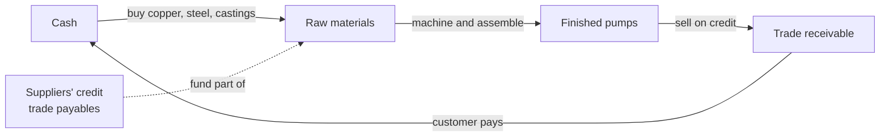

# 04.4 · Working capital & cash conversion

> **Why this matters:** a company books profit when it makes a sale, but the cash arrives only when the customer
> pays. Until then the business carries the inventory and the customer credit itself. Between FY22 and FY26 Kaveri
> Pumps' cash conversion cycle stretched from 71 to 115 days. The extra receivables alone, ₹140.8 Cr, almost exactly
> equal its ₹140.5 Cr of net debt. Working-capital analysis is how you see a gap like that before it becomes a
> problem.

**Learning objectives**: after this lesson you can:

- Compute inventory, receivable and payable days and the cash conversion cycle under a stated convention, and
  attribute a change in the cycle to its drivers (Kaveri FY22 → FY26: 71 → 115 days).
- Convert days into rupees: the cash tied up by a change in days, what it costs to finance, and what it does to value.
- Measure net working capital as a % of sales, split a change in it into a *growth* effect and an *intensity*
  effect, and compute the growth rate a company can fund from its own cash.
- Explain how negative-working-capital businesses (FMCG, subscription platforms) turn growth into cash, why DMart
  deliberately is not one, and what can go wrong with "float".
- Compute CFO/EBITDA, CFO/PAT, FCF conversion and capex intensity over sensible windows, and state what conversion
  you should *expect* given a company's growth.
- Estimate maintenance versus growth capex with the depreciation proxy, Greenwald's method and the asset-turnover
  method, and explain when each one fails.

**Prerequisites:** [02.4 The balance sheet](../02-accounting/04-the-balance-sheet.md),
[02.5 The cash-flow statement](../02-accounting/05-the-cash-flow-statement.md),
[03.3 Notes to accounts](../03-reading-filings/03-notes-to-accounts.md) (the receivables ageing schedule),
[04.1 Growth analysis](01-growth-analysis.md)  ·  **Time:** ~120 min

---

## 1. What working capital is, and why it eats cash

Every manufacturer runs an **operating cycle**. It buys copper, steel and castings, turns them into pumps, holds
the pumps until a dealer or a state agency orders them, sells on credit, and eventually collects. Suppliers fund
part of this cycle by giving the company credit. The company funds the rest.



Three definitions, which people often mix up:

- **Operating net working capital (NWC)** = inventories + trade receivables + other operating current assets −
  trade payables − other operating current liabilities. It **excludes cash, liquid investments and borrowings**
  because those are financing items. This is the course definition, the one used in
  [02.4](../02-accounting/04-the-balance-sheet.md), in the
  [reference valuation](../appendix/running-example/kaveri-valuation.md) and in `tools/fi/ratios.py`
  (`invested_capital`). Kaveri FY26: 188.1 + 346.7 + 39.5 − 143.4 − 65.9 = **₹365.0 Cr**, or 27.7% of revenue.
- **Trade working capital** = inventories + receivables − payables. It is the core of NWC and the part the days
  ratios describe. Kaveri FY26: 188.1 + 346.7 − 143.4 = **₹391.4 Cr**.
- **Accounting working capital** = current assets − current liabilities. It *includes* cash and short-term debt, so it
  measures liquidity rather than operating investment. It belongs to
  [04.5](05-leverage-solvency-liquidity.md).

NWC is an investment in exactly the same sense as a machine. A rise in NWC is a use of cash: it appears as the
working-capital lines of the cash-flow statement (Kaveri FY26: −₹89.7 Cr,
[02.5 §3](../02-accounting/05-the-cash-flow-statement.md)), and the DCF deducts it from free cash flow
([06.3](../06-valuation/03-dcf-step-by-step.md)). A company that doubles its sales must roughly double its NWC
unless something about its terms of trade changes.

## 2. The days ratios and the cash conversion cycle

Three ratios turn the balance-sheet items into time:

$$
\text{DIO} = \frac{\text{Inventory}}{\text{COGS}}\times 365,\qquad
\text{DSO} = \frac{\text{Trade receivables}}{\text{Revenue}}\times 365,\qquad
\text{DPO} = \frac{\text{Trade payables}}{\text{COGS}}\times 365
$$

$$
\text{CCC} = \text{DIO} + \text{DSO} - \text{DPO}
$$

- **Inventory days (DIO, days inventory outstanding)**: how many days of production cost sit on the shelf.
- **Receivable days (DSO, days sales outstanding)**: how many days of sales have not yet been collected.
- **Payable days (DPO, days payable outstanding)**: how many days of purchases have not yet been paid for.
- **Cash conversion cycle (CCC)**: the number of days between paying for inputs and collecting from customers.
  During that time the company's own money is tied up in each sale.

Each ratio is simple, but the conventions are not standard. Before you compare two numbers, check four choices:

| Choice | Course convention | Alternatives you will meet | Why it matters |
|:--|:--|:--|:--|
| Balance used | Closing (31 March) | Average of opening and closing | For a growing company closing > average, so days look higher |
| Cost base for DIO and DPO | Cost of materials consumed incl. change in inventories | Revenue; COGS incl. conversion costs; purchases (for DPO) | Kaveri FY26 DIO is 80 on material cost but 52 on revenue |
| Days in the year | 365 | 360 | A 1.4% difference, small but annoying |
| Receivables | Net of the ECL allowance, as on the balance sheet | Gross (Kaveri FY26: ₹350.7 Cr) | Matters when the allowance is large |

!!! note "Why 'material cost' in India"
    Indian P&Ls under Schedule III classify expenses **by nature** (materials, employees, other expenses), not by
    function, so there is no "cost of goods sold" line ([02.3](../02-accounting/03-the-income-statement.md)).
    Cost of materials consumed, adjusted for the change in inventories, is the closest proxy. It understates true
    COGS because factory wages and power sit in other lines, which makes DIO and DPO a little *higher* than a US
    analyst would compute. Screener.in also computes inventory days and days payable on material cost
    ([Screener changelog, Aug-2021](https://www.screener.in/docs/changelog/New-feature-Aug-2021/), checked
    21-Sep-2026); its other quirks are in [04.6](06-per-share-metrics-and-ratio-dashboard.md).

!!! example "Worked example 1: Kaveri's cash conversion cycle, FY21–FY26"
    All figures come from the [Kaveri reference page](../appendix/running-example/kaveri-pumps.md) (₹ Cr, closing
    balances). FY26 arithmetic:

    - DIO = 188.1 ÷ 858.0 × 365 = **80.0**
    - DSO = 346.7 ÷ 1,318.0 × 365 = **96.0**
    - DPO = 143.4 ÷ 858.0 × 365 = **61.0**
    - CCC = 80.0 + 96.0 − 61.0 = **115.0 days**

    | Days | FY21 | FY22 | FY23 | FY24 | FY25 | FY26 |
    |:--|--:|--:|--:|--:|--:|--:|
    | DIO (inventory ÷ material cost) | 82 | 74 | 76 | 75 | 78 | 80 |
    | DSO (receivables ÷ revenue) | 64 | 57 | 61 | 70 | 84 | 96 |
    | DPO (payables ÷ material cost) | 66 | 60 | 62 | 63 | 64 | 61 |
    | **CCC** | **80** | **71** | **75** | **82** | **98** | **115** |

    **Attribution, FY22 → FY26 (+44 days).** ΔCCC = ΔDIO + ΔDSO − ΔDPO = (+6) + (+39) − (+1) = **+44**.
    Receivables explain 39 of the 44 days (89%), inventory 6, and slightly longer supplier credit gave back 1.

    **Why receivables?** The mix changed. Solar pumping systems, sold mainly to state agencies, grew from 4.0% of
    revenue in FY22 (30.3 ÷ 758.0) to 27.0% in FY26 (355.9 ÷ 1,318.0). Suppose the agricultural, domestic and
    industrial business still collects at FY22's 57.0 days. Then its receivables would be
    (606.2 + 355.9) × 57.0 ÷ 365 = ₹150.3 Cr, which leaves 346.7 − 150.3 = ₹196.4 Cr of receivables for the solar
    business. That is 196.4 ÷ 355.9 × 365 ≈ **201 days** of solar sales, against a company average of 96. This
    is an inference that rests on the stated assumption, not a disclosed number. But it matches the notes: overdue
    receivables above six months doubled from ₹31.0 Cr to ₹62.4 Cr, "mostly from two state nodal agencies"
    ([03.3 §5](../03-reading-filings/03-notes-to-accounts.md)).

You can reproduce the table with the course tools (run from the repository root):

```python
import io, sys
sys.stdout = io.TextIOWrapper(sys.stdout.buffer, encoding="utf-8")
sys.path.insert(0, "tools")                       # run from the repository root

from fi.data import load_kaveri
from fi.ratios import working_capital_days

df = load_kaveri()
for fy in df.columns:
    y = df[fy]
    d = working_capital_days(y["rev"], y["mat"], y["inventory"], y["receivables"], y["payables"])
    nwc = y["inventory"] + y["receivables"] + y["oca"] - y["payables"] - y["ocl"]
    print(f"{fy}: DIO {d['dio']:.0f}  DSO {d['dso']:.0f}  DPO {d['dpo']:.0f}  CCC {d['ccc']:.0f}  "
          f"NWC {nwc / y['rev']:.1%}  CFO/EBITDA {y['cfo'] / y['ebitda']:.1%}")

# rupees per day of receivables, and the cost of the extra days since FY22
fy22, fy26 = df["FY22"], df["FY26"]
dso22 = working_capital_days(fy22["rev"], fy22["mat"], fy22["inventory"], fy22["receivables"], fy22["payables"])["dso"]
excess = fy26["receivables"] - fy26["rev"] * dso22 / 365
print(f"₹{fy26['rev'] / 365:.2f} Cr per day of DSO; excess receivables vs FY22 DSO ₹{excess:.1f} Cr; "
      f"carrying cost at 8.9% ₹{excess * 0.089:.1f} Cr a year")
# FY21: DIO 82  DSO 64  DPO 66  CCC 80  NWC 18.3%  CFO/EBITDA 63.8%
# ...
# FY26: DIO 80  DSO 96  DPO 61  CCC 115  NWC 27.7%  CFO/EBITDA 35.8%
# ₹3.61 Cr per day of DSO; excess receivables vs FY22 DSO ₹140.8 Cr; carrying cost at 8.9% ₹12.5 Cr a year
```

## 3. From days to rupees

Days are a good way to compare companies, but you pay interest in rupees. Convert every change in days into money:

- One day of DSO is one day of revenue: 1,318.0 ÷ 365 = **₹3.61 Cr** for Kaveri in FY26.
- One day of DIO or DPO is one day of material cost: 858.0 ÷ 365 = **₹2.35 Cr**.

!!! example "Worked example 2: what 39 extra receivable days cost Kaveri"
    **Cash tied up.** If Kaveri had kept its FY22 DSO of 57.0 days, FY26 receivables would have been
    1,318.0 × 57.0 ÷ 365 = ₹205.9 Cr. Actual receivables were ₹346.7 Cr, so the excess is
    346.7 − 205.9 = **₹140.8 Cr**. Kaveri's FY26 net debt (borrowings − cash − liquid funds) was **₹140.5 Cr**.
    Every rupee of Kaveri's net debt is, in effect, financing receivables that FY22 collection terms would not
    have created.

    The other two drivers matter much less. Inventory at FY22's 74.0 days would have been 858.0 × 74.0 ÷ 365 =
    ₹174.0 Cr, so there is ₹14.1 Cr of extra stock. Payables at 60.0 days would have been ₹141.1 Cr, so slightly
    longer credit from suppliers returned ₹2.3 Cr.

    **Carrying cost.** At the reference valuation's 8.9% pre-tax cost of debt, ₹140.8 Cr costs 140.8 × 8.9% =
    **₹12.5 Cr a year**. That is 80% of Kaveri's FY26 finance cost on borrowings (₹15.6 Cr). After tax,
    12.5 × (1 − 25.17%) = ₹9.4 Cr, about **10.4% of FY26 PAT** (₹90.5 Cr), is lost to slow collection each year.

    **Value.** The [reference DCF](../appendix/running-example/kaveri-valuation.md) assumes NWC falls from 27.7% of
    revenue to 25% in FY27, 23% in FY28 and 22% after that. Using `fi.valuation.dcf_from_drivers` with every other
    base-case driver unchanged:

    | NWC assumption | Value per share |
    |:--|--:|
    | Base case (25% → 23% → 22%) | ₹320 |
    | Base case + 10 extra receivable days every year (+2.74% of revenue) | ₹308 |
    | NWC stays at 27.7% for ten years | ₹297 |

    The effect is smaller than you might expect, because the terminal value is driven by the RONIC reinvestment
    rule rather than by working capital. The real damage in the bear case (₹168) comes from the growth and margin
    losses that usually travel with stuck government receivables.

**Traps in measuring days.** Three effects distort the headline number, and all three flatter Kaveri:

1. **Closing versus average.** On average FY26 receivables ((269.7 + 346.7) ÷ 2 = ₹308.2 Cr), DSO is
   308.2 ÷ 1,318.0 × 365 = **85 days**, not 96. For a company whose receivables are growing fast, closing
   balances overstate the days that applied through the year. Use one convention consistently, and look at both.
2. **Seasonality.** Q4 (January–March) is Kaveri's peak quarter: ₹408.5 Cr, or 31% of FY26 revenue. Receivables
   at 31 March reflect Q4 billing, so an annual denominator overstates collection time. On Q4 revenue annualised,
   DSO = 346.7 ÷ (408.5 × 4) × 365 = **77 days**. But FY25 was also measured at 31 March after a peak Q4, and the
   trend (70 → 84 → 96 on the same basis) is what matters. The ageing schedule settles the question: the
   ">6 months overdue" bucket doubled, and a seasonal effect cannot create six-month-old receivables.
3. **Window dressing.** Year-end collection drives, delaying supplier payments into April, and selling receivables
   just before 31 March all lower the year-end days. The half-yearly balance sheet (LODR Reg 33(3)(f),
   [03.4](../03-reading-filings/04-quarterly-results-and-concalls.md)) gives you a second observation point each
   year. Kaveri's Q1 FY27 presentation showed a receivables chart *without numbers*
   ([reference page §7](../appendix/running-example/kaveri-pumps.md)), so the 30-Sep-2026 balance sheet, due with
   the Q2 results by mid-November, is the next hard data point.

!!! tip "Trader's lens"
    Working capital is **initial margin that scales with notional**. A desk that doubles its positions must post
    twice the collateral, however good the trades are. A company that doubles its sales must fund twice the
    inventory and receivables. Kaveri did something worse: it raised the *margin rate* itself, from 16% of notional
    (NWC/sales in FY22) to 28%, by moving its book towards a counterparty that settles slowly. Growth at a constant
    margin rate is a funding question. A rising margin rate on the same book is a credit question: what is the
    counterparty's real settlement behaviour?

## 4. NWC as a percentage of sales: growth versus intensity

Days describe the trade cycle. **NWC ÷ revenue** summarises the whole operating investment in one number. This is
the number models forecast ([10.3](../10-modeling/03-forecasting-drivers.md)).

| ₹ Cr | FY21 | FY22 | FY23 | FY24 | FY25 | FY26 |
|:--|--:|--:|--:|--:|--:|--:|
| Revenue | 612.0 | 758.0 | 874.0 | 1,006.0 | 1,172.0 | 1,318.0 |
| Operating NWC | 112.3 | 122.7 | 150.6 | 193.7 | 275.3 | 365.0 |
| NWC ÷ revenue | 18.3% | 16.2% | 17.2% | 19.3% | 23.5% | 27.7% |

A **marginal** ratio is more informative than the average one:

$$\frac{\Delta \text{NWC}}{\Delta \text{Revenue}}\Big|_{FY21\to FY26} = \frac{365.0 - 112.3}{1{,}318.0 - 612.0} = \frac{252.7}{706.0} = 35.8\%$$

Each extra ₹100 of revenue since FY21 has needed ₹35.8 of working capital, compared with an average of ₹27.7. When
the marginal ratio is above the average, the *new* business is more capital-hungry than the old one. Here the new
business is solar. A forecast that holds NWC at the historical average quietly assumes the new business behaves like
the old.

**Growth versus intensity.** Any change in NWC splits exactly into two parts, where $n$ is NWC ÷ revenue and $S$ is
revenue:

$$\Delta \text{NWC}_t = \underbrace{n_{t-1}\,\Delta S_t}_{\text{growth effect}} + \underbrace{S_t\,\Delta n_t}_{\text{intensity effect}}$$

The **growth effect** is the investment that growth would need even if terms of trade stayed the same. The
**intensity effect** is the extra (or released) investment because terms got worse (or better). The first is a
normal cost of growing. The second calls for an explanation.

| ₹ Cr | FY22 | FY23 | FY24 | FY25 | FY26 | FY22–FY26 |
|:--|--:|--:|--:|--:|--:|--:|
| Growth effect | 26.8 | 18.8 | 22.7 | 32.0 | 34.3 | 134.6 |
| Intensity effect | (16.4) | 9.1 | 20.4 | 49.6 | 55.4 | 118.1 |
| **ΔNWC** (= cash-flow statement) | **10.4** | **27.9** | **43.1** | **81.6** | **89.7** | **252.7** |

*FY26 arithmetic:* growth = 23.5% × (1,318.0 − 1,172.0) = 0.2349 × 146.0 = 34.3; intensity =
1,318.0 × (27.69% − 23.49%) = 55.4; total 89.7, which matches the working-capital change in the cash-flow statement.
In FY25–FY26 intensity took more cash than growth did. That points to collections, not to growth.

**How fast can a company grow on its own cash?** Let $m$ be operating cash margin (EBITDA less cash tax, as a % of
revenue) and $c$ capex as a % of revenue. Pre-financing free cash flow is then
$FCF_t = (m - c)S_t - n\,\Delta S_t$. It stays non-negative as long as

$$\frac{g}{1+g} \le \frac{m-c}{n}\quad\Longleftrightarrow\quad g^{*} = \frac{x}{1-x},\;\; x = \frac{m-c}{n}$$

For Kaveri FY26, $m$ = (181.9 − 29.5) ÷ 1,318.0 = 11.6%, $c$ = 52.0 ÷ 1,318.0 = 3.9% and $n$ = 27.7%, so
$x$ = 27.5% and **g\* ≈ 38%**. If you also deduct dividends, interest and lease payments net of treasury income
((24.0 + 15.6 + 5.9 − 3.9) ÷ 1,318.0 = 3.2% of revenue), $x$ = 16.1% and **g\* ≈ 19%**. At a *constant* 27.7%
intensity, Kaveri could have funded its 12.5% growth, and its dividend, without borrowing. Growth was not the
problem. The rising intensity was. This one line separates a healthy growth story from a collections story.

## 5. Negative working capital: when customers and suppliers fund you

If a company collects from customers before it pays suppliers, its NWC is **negative**. Then $\Delta \text{NWC} =
n\,\Delta S$ is itself negative, and every rupee of growth *releases* cash. Three Indian patterns show how this works,
and one of them shows the limits of the idea:

| Company (type) | What the numbers show | Source (checked 21/22-Sep-2026) |
|:--|:--|:--|
| **Hindustan Unilever** (FMCG) | FY26 CCC ≈ **−89 days** on Screener's basis (DSO 19, DIO 61, DPO 169; FY25 −72, FY24 −70). On Yahoo's cost-of-revenue basis ≈ −76 days (inventory ₹4,789 Cr, receivables ₹3,379 Cr, payables ₹13,325 Cr). The sign is robust. The level depends on the cost base | [Screener.in, HUL consolidated](https://www.screener.in/company/HINDUNILVR/consolidated/); Yahoo Finance via `fi.data.fetch_statements` |
| **Info Edge** (online classifieds; subscriptions billed in advance) | Deferred sales revenue ₹1,498 Cr at 31-Mar-2026, equal to **179 days** of FY26 standalone revenue (₹3,052 Cr). FY26 billings ₹3,178 Cr ran ahead of revenue. Cash from operations before tax ₹1,469 Cr was 1.29× operating profit (₹1,138 Cr) | [Info Edge Q4 FY26 earnings presentation](https://www.infoedge.in/pdfs/corporatePresentations_pdfs/Info-Edge-May26-Presentation.pdf) |
| **Avenue Supermarts / DMart** (grocery retail) | Positive CCC ≈ **+29 days** (FY26, Screener: DIO 37, DPO 8). Its own BRSR reports accounts-payable days of **7.1** for FY24 (6.3 for FY23) | [Screener.in, DMART consolidated](https://www.screener.in/company/DMART/consolidated/); [DMart Annual Report FY24](https://api.dmartindia.com/corporate/content/file/v1/6/KhDFKqO1CnIL85k4TBXcxnhy1721903509/Annual%20Report%202023-24.pdf) (BRSR, Principle 1) |

The mechanisms differ:

- **FMCG leaders** sell through distributors who pay quickly or in advance, and they buy from thousands of suppliers
  who have little bargaining power. Suppliers finance the inventory, and often more than the inventory.
- **Subscription platforms** bill annual packages upfront and recognise revenue over the subscription term
  ([02.2](../02-accounting/02-accrual-accounting-and-revenue-recognition.md)). The unearned part is a liability,
  deferred revenue, which the customer has already paid in cash. Info Edge's billings exceeded revenue by ₹126 Cr
  in FY26, and deferred revenue rose ₹141 Cr. That is why its operating cash exceeds its operating profit.
- **DMart is the instructive exception.** It pays suppliers in about a week and describes its strategy as
  "everyday low cost, everyday low price", built on low procurement and operating cost (Annual Report FY24). The
  economic logic is a deliberate trade: a supplier paid in 7 days instead of 45–60 can afford a lower price. DMart
  gives up the float that most retailers enjoy in exchange for gross margin, and funds the ~30-day cycle from its
  own profits. A "DMart-style" retailer is therefore not a negative-working-capital business. It has *low* working
  capital by choice ([case I13](../13-case-studies/india/13-dmart-avenue-supermarts.md)). Amazon, whose cycle was
  about −47 days in 2001, is the global template for float at scale
  ([case G5](../13-case-studies/global/05-amazon-1997-2015.md)).

!!! example "Worked example 3: the same P&L, opposite working capital"
    Two fictional companies each have revenue of ₹1,000 Cr, grow 15% a year for five years, earn an operating cash
    margin (EBITDA − cash tax) of 11% and spend 4% of revenue on capex. The only difference is NWC: **Kaveri-like
    Ltd** carries +27.7% of revenue, and **Mahanadi Home Care Ltd** (an FMCG maker) carries −10%.

    | ₹ Cr | Kaveri-like (NWC +27.7%) | Mahanadi (NWC −10%) |
    |:--|--:|--:|
    | Year-5 revenue (1,000 × 1.15⁵) | 2,011.4 | 2,011.4 |
    | Year-5 ΔNWC (= n × ΔS = n × 262.3) | 72.7 | (26.2) |
    | Year-5 FCF (= 7% × 2,011.4 − ΔNWC) | 68.1 | 167.0 |
    | **Cumulative FCF, years 1–5** | **262.6** | **643.9** |
    | Year 6, revenue *falls* 10% to 1,810.2: ΔNWC | (55.7) | 20.1 |
    | Year 6 FCF (= 7% × 1,810.2 − ΔNWC) | 182.4 | 106.6 |

    Growth made Mahanadi ₹381.3 Cr richer than its twin over five years. That is why negative-working-capital
    businesses earn very high returns on invested capital ([04.3](03-returns-on-capital.md)). But look at year 6.
    When revenue shrinks, the positive-NWC firm *releases* cash, which cushions the downturn. Mahanadi has to hand
    its float back just when business is bad, and its FCF margin drops from 8.3% to 5.9% of revenue.

!!! tip "Trader's lens"
    Negative working capital is like **selling premium**. You collect cash upfront (customer advances, supplier
    credit), and the pile grows as long as the book grows. The float is not profit. It is a liability that has to
    be paid back when volumes fall, when distributors destock, or when suppliers shorten terms. That is short
    gamma to the business's own volume. Price it that way: a business whose float depends on continued growth
    deserves a haircut on "cash-rich" in a downturn scenario.

Three cautions when you meet negative working capital:

1. **It is not distributable cash.** Cash that comes from payables is owed to suppliers. A company that pays
   dividends or buys back shares out of float is borrowing from suppliers to do it.
2. **Stretched payables may be distress, not strength.** A rising DPO at a weak company can mean it cannot pay. In
   India, dues to micro and small suppliers have a legal ceiling (India notes below).
3. **Watch billings, not just revenue.** For a subscription platform, slower billing growth shows up in cash and
   deferred revenue a quarter or two before it reaches revenue.

## 6. Cash conversion: CFO/EBITDA, CFO/PAT, FCF conversion and capex intensity

Four ratios test whether profit becomes cash:

- **CFO/EBITDA**: how much operating profit survives tax and working capital. Under Ind AS, interest paid and
  received sit outside CFO ([02.5 §6](../02-accounting/05-the-cash-flow-statement.md)), and EBITDA also excludes
  them, so the numerator and denominator are consistent.
- **CFO/PAT**: easy to compare with reported earnings. For a capital-intensive company it is naturally above 100%,
  because D&A is added back in CFO but deducted in PAT.
- **FCF conversion** = (CFO − capex) ÷ PAT, or ÷ NOPAT. This is the strict test: profit left after the business has
  paid for its own reinvestment.
- **Capex intensity**: capex ÷ revenue, and capex ÷ (depreciation + amortisation). For the second ratio, leave out
  right-of-use amortisation, because new leases do not go through capex
  ([02.5 §7](../02-accounting/05-the-cash-flow-statement.md)).

| Kaveri | FY21 | FY22 | FY23 | FY24 | FY25 | FY26 | FY21–26 | FY24–26 |
|:--|--:|--:|--:|--:|--:|--:|--:|--:|
| CFO / EBITDA | 63.8% | 72.2% | 58.2% | 55.9% | 35.3% | 35.8% | 49.8% | 41.8% |
| CFO / PAT | 154.9% | 139.2% | 106.4% | 100.2% | 62.5% | 71.9% | 94.9% | 77.5% |
| FCF = CFO − capex, ₹ Cr | 32.8 | 31.7 | (36.4) | (64.4) | 2.9 | 13.1 | (20.3) | (48.4) |
| FCF / PAT | 100.0% | 67.2% | (58.1%) | (74.5%) | 3.0% | 14.5% | (4.9%) | (17.6%) |
| Capex / revenue | 2.9% | 4.5% | 11.8% | 15.0% | 4.9% | 3.9% | | |
| Capex / (depreciation + intangible amortisation) | 0.8x | 1.4x | 3.9x | 5.2x | 1.4x | 1.2x | | |

(Capex = PP&E incl. CWIP + intangibles. The multi-year columns are sums: for example, FY24–26 CFO/PAT =
(86.6 + 60.9 + 65.1) ÷ (86.4 + 97.4 + 90.5) = 212.6 ÷ 274.3 = 77.5%.)

**Read ratios over windows, not single years.** Working capital is lumpy, and capex comes in projects. The FY23–FY24
negative FCF is the Hosur plant (capex 11.8% and 15.0% of revenue). That is a deliberate investment, and it is
visible in capex/D&A of 3.9x and 5.2x. The FY25–FY26 weakness is different: capex is back to 1.2–1.4x
depreciation, yet CFO/EBITDA has halved. When conversion is poor while capex is normal, look at working capital.

!!! example "Worked example 4: what conversion *should* Kaveri have had in FY26?"
    **The waterfall.** From EBITDA to CFO, as a share of EBITDA (₹181.9 Cr = 100%):

    | Step | ₹ Cr | % of EBITDA |
    |:--|--:|--:|
    | EBITDA | 181.9 | 100.0% |
    | + Non-cash ESOP expense | 2.4 | 1.3% |
    | − Income taxes paid | (29.5) | (16.2%) |
    | − Increase in NWC | (89.7) | (49.3%) |
    | **= CFO** | **65.1** | **35.8%** |

    **The benchmark.** A growing company *must* invest in working capital. The question is how much. If intensity had
    stayed at FY25's 23.5%, the working-capital term as a share of EBITDA would have been

    $$\frac{n\,g}{(1+g)\,m} = \frac{0.2349 \times 0.1246}{1.1246 \times 0.1380} = 18.9\%$$

    where $g$ = 12.46% is revenue growth and $m$ = 13.80% is the EBITDA margin. **Expected CFO/EBITDA** =
    100% + 1.3% − 16.2% − 18.9% = **66.2%**. Actual: 35.8%. The 30.5-point gap equals the intensity effect in §4
    (55.4 ÷ 181.9 = 30.5%). The whole shortfall comes from worse terms of trade. None of it comes from growth, tax
    or capex.

    This is the right way to use conversion ratios. A 36% CFO/EBITDA is alarming at a no-growth FMCG company and
    unremarkable at a 40%-growth project company. Compare the ratio with what the company's growth and historical
    intensity imply, not with a universal threshold. As a working rule this course flags a manufacturer whose
    cumulative CFO/PAT over three to five years is below about 75–80% *and* whose actual conversion falls well
    short of the expected level. Kaveri FY24–26 fails both tests (77.5%, and 35.8% against an expected 66.2%).

## 7. Maintenance versus growth capex

Capex has two jobs. **Maintenance capex** keeps the existing business at its current volume and competitive
position: replacing worn machines, keeping up with regulation, basic automation. **Growth capex** adds capacity
or new capabilities. The split matters for three reasons:

- **Owner earnings.** Warren Buffett's *owner earnings* (1986 letter, [02.5 §8](../02-accounting/05-the-cash-flow-statement.md))
  deduct only maintenance capex. It measures what an owner could take out while keeping the business intact.
- **Valuation of mature businesses.** Earnings-power approaches value the no-growth cash flow separately from growth.
- **Judging reinvestment.** Incremental ROIC ([04.3](03-returns-on-capital.md)) should be measured on *growth*
  capital.

Companies rarely report the split. Some Indian managements give guidance: Kaveri's FY27 guidance is capex of ₹45–50 Cr
for "maintenance + automation". You therefore estimate it, and you should use more than one method.

**Method 1: the depreciation proxy.** Maintenance capex ≈ depreciation of PP&E + amortisation of intangibles
(leave out right-of-use amortisation). Kaveri FY26: 39.6 + 3.5 = **₹43.1 Cr**. The logic is that depreciation
spreads the cost of today's assets over their lives, so replacing them should cost about the same each year. The
weaknesses: depreciation is at **historical cost**, and replacements cost today's prices. It also depends on
useful-life choices ([02.7](../02-accounting/07-deeper-cuts-assets-and-expenses.md)), and a lumpy asset base (a new
plant alongside a 30-year-old one) distorts it. A rough inflation adjustment: the depreciation-weighted average age
of assets ≈ accumulated depreciation ÷ annual depreciation = 334.7 ÷ 39.6 = 8.5 years. At an *assumed* 4% a year
capital-goods inflation, replacement cost ≈ 39.6 × 1.04^8.45^ + 3.5 = **₹58.7 Cr**. Treat that as an upper bound:
the Hosur assets are new and already at current prices.

**Method 2: Greenwald's method** (Greenwald, Kahn, Sonkin & van Biema, *Value Investing: From Graham to Buffett
and Beyond*, 2001). Compute the average ratio of net PP&E to sales over the past five years. Multiply by this
year's increase in sales to get **growth capex**. Subtract that from total capex to get **maintenance capex**:

$$\text{Growth capex}_t = \overline{\left(\tfrac{\text{PP\&E}}{\text{Sales}}\right)}_{5\,\text{yr}} \times \Delta\text{Sales}_t,
\qquad \text{Maintenance}_t = \text{Capex}_t - \text{Growth capex}_t$$

For Kaveri, net fixed assets (net block + CWIP + intangibles) ÷ revenue for FY21–FY25 were 0.447, 0.374, 0.412,
0.480 and 0.424, an average of **0.427**.

- *Single year, FY26:* growth capex = 0.427 × 146.0 = ₹62.4 Cr, which is *more* than total capex of ₹52.0 Cr. So
  maintenance comes out at **−₹10.4 Cr**. That is nonsense, and the reason is instructive. Kaveri's FY26 growth came
  from filling the Hosur plant built in FY23–FY24, not from new assets. The method assumes capital grows smoothly
  with sales, but real capacity arrives in lumps.
- *Full cycle, FY22–FY26:* capex = ₹398.0 Cr, Δsales = 706.0, so growth capex = 0.427 × 706.0 = ₹301.7 Cr and
  maintenance = ₹96.3 Cr, or **₹19.3 Cr a year**. That is too low next to average depreciation plus amortisation of
  ₹32.5 Cr a year over the same period. The second flaw: nominal sales growth includes **price inflation**, which
  needs no new capacity. Deflate the sales growth at an assumed 4% a year: FY21 sales in FY26 prices =
  612.0 × 1.04⁵ = 744.6, so real Δsales = 573.4, growth capex = ₹245.0 Cr and maintenance = ₹153.0 Cr, or
  **₹30.6 Cr a year**.

**Method 3: the asset-turnover (capacity) method.** Growth capex is the revenue that capacity cannot absorb,
divided by the fixed-asset turnover that new capacity will achieve. While there is spare capacity, growth capex is
zero.

- *Mechanically*, with gross-block turnover (FY25: 1,172.0 ÷ 780.0 = 1.50x), FY26 growth capex would be
  146.0 ÷ 1.50 = ₹97.2 Cr. That is again more than total capex, and it fails for the same reason as Greenwald.
- *Capacity-aware:* the reference page gives capacity and utilisation. Pump capacity was unchanged at 9.0 lakh units
  and utilisation rose from 71% to 78% (volume +9.9%). Motor capacity was unchanged at 3.5 lakh and utilisation rose
  from 48% to 57% (volume +18.8%). No new capacity was needed, so FY26 growth capex ≈ 0 and **all ₹52.0 Cr was
  maintenance plus automation**. Over the whole cycle, the one capacity project was Hosur (~₹190 Cr), so
  (398.0 − 190.0) ÷ 5 = **₹41.6 Cr a year** of non-expansion capex.
- *Looking forward:* assume about 4 points of annual revenue growth is price. Then the base case's 10% and 14%
  growth in FY27–FY28 means pump volume grows about 5.8% and 9.6%, and pump utilisation goes from 78% to
  **≈82.5% (FY27)** and **≈90.4% (FY28)**. The reference valuation holds capex at 3.5% of revenue, which implicitly
  assumes debottlenecking rather than a new pump plant. Ask management about that before FY28.

**Triangulate.**

| Method | Period | Maintenance capex, ₹ Cr a year |
|:--|:--|--:|
| Depreciation + intangible amortisation (historical cost) | FY26 | 43.1 |
| Same, inflation-adjusted (4%, average age 8.5 years) | FY26 | 58.7 |
| Greenwald, single year | FY26 | (10.4), fails |
| Asset turnover on gross block, single year | FY26 | (45.2), fails |
| Greenwald, full cycle, nominal sales | FY22–26 average | 19.3 |
| Greenwald, full cycle, real sales (4% price) | FY22–26 average | 30.6 |
| Capacity method: cycle capex − Hosur | FY22–26 average | 41.6 |
| Capacity method: no capacity added in FY26 | FY26 | ≤ 52.0 |
| Management guidance ("maintenance + automation") | FY27 | 45–50 |

Compare the cycle averages with *average* depreciation over the cycle (₹32.5 Cr), not with FY26's ₹43.1 Cr, because
the business was smaller in earlier years. A defensible FY26–FY27 range is **₹40–50 Cr, about 3.0–3.8% of revenue**.
That is consistent with the reference valuation's 3.5%.

What the range buys you: maintenance-level cash earnings ≈ NOPAT + depreciation and intangible amortisation −
maintenance capex = 100.3 + 43.1 − 45.0 ≈ **₹98 Cr**. Reported FCF was ₹13.1 Cr. Almost the entire gap is the
₹89.7 Cr that went into working capital, and ₹55.4 Cr of that was the intensity effect. The Kaveri debate is not
about capex. It is about whether that ₹55.4 Cr comes back.

## 8. Cash-flow-based quality checks

The checks below take ten minutes with a cash-flow statement, two balance sheets and the receivables note. They do
not prove anything. They tell you where to dig. The accrual-based tests (Sloan, balance-sheet accruals) are in
[04.7](07-quality-of-earnings.md), and the manipulations they catch are in
[09.2](../09-forensics/02-revenue-red-flags.md) and [09.4](../09-forensics/04-cash-flow-games.md).

| # | Check | Kaveri FY26 reading | Verdict |
|:--|:--|:--|:--|
| 1 | Cumulative CFO/PAT over 3–5 years | FY24–26: 77.5%; FY25–26: 67.1% | Flag |
| 2 | Actual vs expected CFO/EBITDA given growth (§6) | 35.8% vs 66.2% | Flag |
| 3 | Receivables growth vs revenue growth | +28.6% vs +12.5% (FY22–26 CAGR 30.8% vs 14.8%) | Flag |
| 4 | ΔNWC split into growth and intensity | Intensity ₹55.4 Cr of ₹89.7 Cr | Flag |
| 5 | Receivables ageing and ECL cover ([03.3](../03-reading-filings/03-notes-to-accounts.md)) | >6-month overdue ₹31.0 → ₹62.4 Cr; ECL covers 6.4% of that bucket | Flag |
| 6 | Cash taxes vs current tax in the P&L | Equal (₹29.5 Cr); no build-up of tax payable | OK |
| 7 | FCF vs dividends | FCF ₹13.1 Cr vs dividends ₹24.0 Cr; paid for by working-capital loans (+₹38.0 Cr) | Flag |
| 8 | Capex vs depreciation | 1.2x, normal after the Hosur build | OK |
| 9 | Payables: stretching, MSME dues, supplier finance (Ind AS 7 paras 44F–44H) | DPO steady at 61; no supplier finance disclosed | OK; confirm in the notes |
| 10 | Receivables sold (factoring, bill discounting, TReDS) | None disclosed; ask. Selling receivables cuts DSO and lifts CFO without better collection | Open question |
| 11 | Half-year vs year-end days | 30-Sep-2026 balance sheet not yet published | Pending |

Six flags from one company is a lot. Note what kind of flags they are, though. Every one traces back to the same
fact: slow-paying state agencies in the solar segment. There are no signs of fictitious revenue: taxes are paid in
cash, capex is ordinary, and suppliers are not being squeezed. [09.2](../09-forensics/02-revenue-red-flags.md)
takes up the question this leaves open: aggressive, or merely risky?

!!! info "India notes"
    - **Schedule III ratio note.** Since FY22 (MCA notification of 24-Mar-2021), companies must disclose in the
      notes the inventory turnover, trade receivables turnover, trade payables turnover and net capital turnover
      ratios, among eleven ratios. They must explain any change of more than 25% and state what goes into each
      numerator and denominator ([Taxguru summary](https://taxguru.in/company-law/amendments-schedule-iii-companies-act-2013-effective-fy-2021-22.html),
      checked 21-Sep-2026). Always read the definitions: a company's "receivables turnover" may use average balances
      or gross receivables.
    - **Receivables ageing from the due date** (Schedule III, from FY22) is the single best check on DSO
      ([03.3 §5](../03-reading-filings/03-notes-to-accounts.md)).
    - **The 45-day rule for small suppliers.** The MSMED Act caps payment terms to micro and small enterprises at
      45 days. Since FY24 the income-tax deduction for such dues has depended on paying on time: old Section 43B(h),
      carried into the Income-tax Act, 2025. Verify the new section number before relying on it; see
      [02.4 §6.3](../02-accounting/04-the-balance-sheet.md). A falling DPO at a March year-end may be compliance,
      not weakness.
    - **TReDS.** The MSME Ministry's notification of 7-Nov-2024 requires companies with turnover above ₹250 Cr to
      register on a TReDS platform, where MSME suppliers can discount a buyer's accepted invoices. The deadline was
      31-Mar-2025 ([Business Standard, Mar-2025](https://www.business-standard.com/companies/news/firms-with-rs-250-cr-turnover-rush-to-join-treds-before-march-31-deadline-125032300331_1.html)).
      Kaveri, at ₹1,318 Cr turnover, would be covered. Discounting on TReDS finances the *supplier*, and the buyer
      still pays on the due date. Buyer-arranged programmes that lengthen the buyer's terms are supplier finance
      ([04.5](05-leverage-solvency-liquidity.md)).
    - **Half-yearly balance sheets** (LODR Reg 33(3)(f)) give a September observation of every days ratio. For
      seasonal businesses, compare H1 with the previous H1, not with March.
    - **BRSR payable days.** The Business Responsibility and Sustainability Report asks for "number of days of
      accounts payables", which gives you a company-computed DPO (DMart FY24: 7.1 days). Check which cost base the
      company used.
    - **Government counterparties.** Solar-pump schemes, EPC, defence and railway suppliers are paid by state or
      central agencies. Payment behaviour depends on budgets and approvals, not on the customer's solvency. Read the
      ageing schedule and the "retention money" or "unbilled revenue" lines as well as DSO
      ([08.5](../08-sectors/05-industrials-capital-goods-defence.md)).

!!! warning "Common mistakes"
    - **Mixing conventions**: revenue-based days for one company and cost-based for another, or closing balances
      in one year and averages in the next.
    - **Stopping at days.** Always convert a change in days into rupees and compare it with net debt, FCF and PAT.
    - **Treating the average NWC % as the marginal one.** When new business is slower-paying, a forecast at the
      historical average understates the cash that growth will need.
    - **Calling float "cash-rich".** Cash that comes from payables or customer advances has to be returned when
      volumes fall.
    - **Judging CFO/PAT or CFO/EBITDA from one year**, or against a universal threshold instead of against what
      growth and intensity imply.
    - **Assuming depreciation equals maintenance capex** without checking inflation, asset vintages and capacity
      utilisation.
    - **Running Greenwald on a single year after a lumpy capex cycle**, or on nominal sales in an inflationary
      economy.
    - **Missing financing that changes the days**: receivables sold, bills discounted, supplier finance. These
      improve the ratios without improving the business ([04.5](05-leverage-solvency-liquidity.md)).

## Key terms

| Term | Meaning |
|:--|:--|
| **Operating cycle** | The loop cash → inventory → receivable → cash |
| **Operating net working capital (NWC)** | Inventories + receivables + other operating current assets − payables − other operating current liabilities; excludes cash and debt |
| **Trade working capital** | Inventories + receivables − payables |
| **DIO (inventory days)** | Inventory ÷ COGS (in India: material cost) × 365 |
| **DSO (receivable days)** | Trade receivables ÷ revenue × 365 |
| **DPO (payable days)** | Trade payables ÷ COGS (material cost) × 365 |
| **Cash conversion cycle (CCC)** | DIO + DSO − DPO: days of the company's own money tied up per sale |
| **Marginal NWC ratio** | ΔNWC ÷ Δrevenue over a period; the working capital that each extra rupee of sales needed |
| **Growth effect / intensity effect** | The split of ΔNWC into the part due to higher sales at old terms, and the part due to changed terms |
| **Self-funding growth rate (g\*)** | The fastest growth at which pre-financing FCF stays non-negative, given margin, capex and NWC intensity |
| **Negative working capital / float** | NWC below zero: customers and suppliers fund the business; growth releases cash |
| **Deferred revenue** | Cash billed and collected before revenue is recognised; a liability |
| **CFO/EBITDA, CFO/PAT** | Cash-conversion ratios; judge over several years and against expected conversion |
| **FCF conversion** | (CFO − capex) ÷ PAT or ÷ NOPAT |
| **Capex intensity** | Capex ÷ revenue; capex ÷ (depreciation + intangible amortisation) |
| **Maintenance capex** | Capex needed to keep existing volume and competitive position |
| **Growth capex** | Capex that adds capacity or capabilities |
| **Greenwald's method** | Growth capex = average (PP&E ÷ sales) × Δsales; maintenance = capex − growth capex |
| **Asset-turnover (capacity) method** | Growth capex = revenue beyond existing capacity ÷ turnover of new capacity; zero while there is spare capacity |

## Check your understanding

1. Using the reference data, attribute Kaveri's CCC change from FY24 (82 days) to FY25 (98 days) to DIO, DSO and
   DPO, and convert the change in DSO into rupees on FY25 revenue.
<details><summary>Answer</summary>
FY24: DIO 75, DSO 70, DPO 63. FY25: DIO 78, DSO 84, DPO 64. ΔCCC = (+3) + (+14) − (+1) = <b>+16 days</b>, of which
receivables explain 14. In rupees: at FY24's DSO of 70.0 days, FY25 receivables would have been
1,172.0 × 70.0 ÷ 365 = ₹224.7 Cr. Actual receivables were ₹269.7 Cr, so the extra days tied up
<b>≈ ₹45.0 Cr</b> in one year. That was more than half the ₹81.6 Cr NWC build in FY25.
</details>

2. Kaveri's marginal NWC ratio over FY21–FY26 was 35.8%, against an FY26 average of 27.7%. What does the gap tell
   you, and how should it change the way you forecast working capital?
<details><summary>Answer</summary>
The business added since FY21 (mostly solar sold to state agencies) needs more working capital per rupee than the
old agri and industrial business. If solar keeps growing faster than the rest, the average NWC % will keep drifting
<i>up</i> towards the marginal ratio, not stay flat. A forecast should model NWC by segment or by days (receivable
days by customer type), or at least test the marginal ratio as a scenario. The reference valuation instead assumes
normalisation to 22%. That is the bull-leaning assumption at the centre of the Kaveri debate.
</details>

3. A fictional FMCG company has revenue of ₹2,000 Cr and operating NWC of −8% of revenue. Revenue grows 12% in year
   1 and then falls 5% in year 2. How much cash does working capital release or absorb in each year?
<details><summary>Answer</summary>
Year 1: revenue rises by 240 to 2,240; ΔNWC = −8% × 240 = −19.2, so working capital <b>releases ₹19.2 Cr</b>.
Year 2: revenue falls by 5% of 2,240 = 112, to 2,128; ΔNWC = −8% × (−112) = +8.96, so working capital
<b>absorbs ≈ ₹9.0 Cr</b>. The float has to be repaid when volumes shrink.
</details>

4. A fictional manufacturer's net PP&E ÷ sales averaged 0.50 over the past five years. This year sales rose by
   ₹80 Cr and capex was ₹70 Cr, with depreciation of ₹35 Cr. Estimate maintenance capex with Greenwald's method
   and with the depreciation proxy, and give one reason each might be wrong.
<details><summary>Answer</summary>
Greenwald: growth capex = 0.50 × 80 = ₹40 Cr, so maintenance = 70 − 40 = <b>₹30 Cr</b>. Depreciation proxy:
<b>₹35 Cr</b>. Greenwald may be wrong if part of the ₹80 Cr is price inflation (growth capex overstated, maintenance
understated) or if the company was filling spare capacity. The depreciation proxy may be wrong because it is at
historical cost (understates replacement cost in an inflationary economy) and depends on useful-life choices. The
two methods roughly agree here, which gives some confidence. Also check utilisation and management's own split.
</details>

5. Why would a retailer choose to pay suppliers in 7 days instead of 45? Test the trade with fictional numbers:
   purchases of ₹1,000 Cr a year, a 9% cost of funds, and a 1.5% price discount for prompt payment.
<details><summary>Answer</summary>
Paying 38 days earlier ties up 1,000 × 38 ÷ 365 = ₹104.1 Cr of extra working capital. At 9% that costs
₹9.4 Cr a year. The discount is worth 1.5% × 1,000 = <b>₹15.0 Cr</b> a year in gross margin. So prompt payment
earns roughly 15.0 ÷ 104.1 ≈ 14% on the capital it ties up, above the cost of funds. This is the DMart logic:
working capital deliberately swapped for purchase price, and funded from its own cash. It only works for a company
with the balance sheet to fund it and the volume to make suppliers care.
</details>

6. A fictional company has NWC at 20% of revenue, revenue growth of 15%, an EBITDA margin of 12% and cash taxes
   equal to 15% of EBITDA. What CFO/EBITDA should you expect if intensity is constant? It reports 40%. What does
   the gap suggest?
<details><summary>Answer</summary>
Working-capital term = n·g ÷ ((1 + g)·m) = 0.20 × 0.15 ÷ (1.15 × 0.12) = 21.7% of EBITDA. Expected CFO/EBITDA ≈
100% − 15% − 21.7% = <b>63.3%</b>. The reported 40% is about 23 points lower, which means NWC intensity rose
sharply (or something non-operating is hitting CFO). Decompose ΔNWC into growth and intensity and read the
receivables and inventory notes. Growth alone does not explain it.
</details>

7. Management expects Kaveri's receivable days to "normalise towards 75–80 by end-FY27". On the reference
   valuation's FY27 revenue of ₹1,449.8 Cr, how much cash would a DSO of 78 days release compared with FY26's
   receivables? What if DSO stays at 96?
<details><summary>Answer</summary>
At 78 days: 1,449.8 × 78 ÷ 365 = ₹309.8 Cr of receivables, a <b>release of ≈ ₹36.9 Cr</b> against ₹346.7 Cr. At 96
days: 1,449.8 × 96 ÷ 365 = ₹381.3 Cr, an <b>absorption of ≈ ₹34.6 Cr</b>. The swing between the two outcomes is
≈ ₹71.5 Cr, about half of FY26 net debt. That is why the next half-yearly balance sheet matters more than the next
quarter's EBITDA.
</details>

## Go deeper

- Bruce Greenwald, Judd Kahn, Paul Sonkin & Michael van Biema, *Value Investing: From Graham to Buffett and Beyond*
  (Wiley, 2001): the source of the maintenance-capex method and of "earnings power value", which uses it.
- [Berkshire Hathaway 1986 shareholder letter](https://www.berkshirehathaway.com/letters/1986.html): the appendix
  on owner earnings explains why "cash flow" figures that ignore maintenance capex mislead.
- [Damodaran Online, current data](https://pages.stern.nyu.edu/~adamodar/New_Home_Page/datacurrent.html):
  "Working Capital Requirements by Industry Sector", with India and emerging-market versions (last full update
  Jan-2026). Useful for sanity-checking a company's NWC % against its sector.
- [Info Edge Q4 FY26 earnings presentation](https://www.infoedge.in/pdfs/corporatePresentations_pdfs/Info-Edge-May26-Presentation.pdf):
  a clear primary-source example of billings, deferred revenue and cash from operations moving differently from
  revenue.
- [Case G5: Amazon (1997–2015)](../13-case-studies/global/05-amazon-1997-2015.md): negative working capital at scale,
  and why it is safest while the company is growing.

---
[← Previous: 04.3 Returns on capital: ROE, ROCE, ROIC](03-returns-on-capital.md) · [Module index](index.md) · [Next: 04.5 Leverage, solvency & liquidity →](05-leverage-solvency-liquidity.md)
