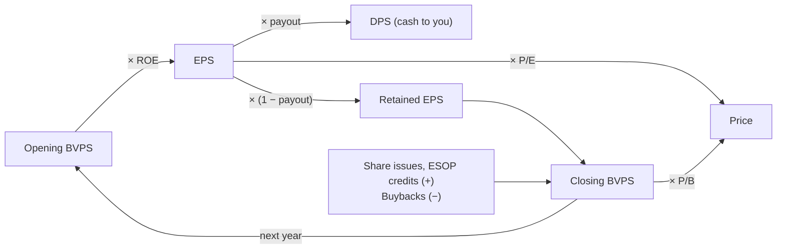
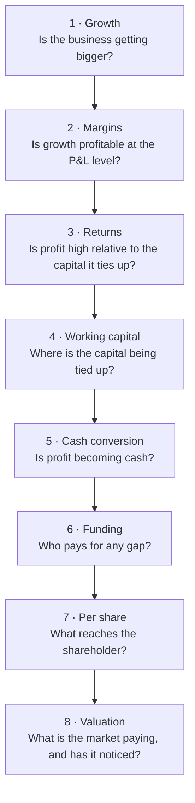

# 04.6 · Per-share metrics & building a ratio dashboard

> **Why this matters:** you own a slice of a company, not the company, so a company-level number only matters to you
> after it has been divided by the share count. And one ratio on its own tells you almost nothing. Thirty ratios
> across six years, read in the right order, tell you a company's story in ten minutes. This lesson builds both
> habits: per-share thinking, and a dashboard you read from top to bottom.

**Learning objectives** — after this lesson you can:

- Compute and reconcile basic, diluted, adjusted, trailing-twelve-month and "cash" EPS, and say which one a quoted
  P/E is built on.
- Break book-value-per-share growth into retained profit, ESOP credits and share issuance, and link EPS growth to
  BVPS growth and ROE.
- Compute DPS, payout ratio (paid basis and declared basis), dividend yield, buyback yield and shareholder yield, and
  spot a buyback that only offsets ESOP dilution.
- Build Kaveri's six-year, 28-row ratio dashboard with `tools/fi/ratios.py` and read it from top to bottom as one
  causal story.
- Build a peer dashboard on consistent definitions and say what it cannot tell you.
- Reproduce Screener.in's headline numbers from an annual report and name the definitional quirks that make them
  differ from yours.

**Prerequisites:** [01.2 Shares, market cap & enterprise value](../01-markets-101/02-shares-market-cap-and-enterprise-value.md),
[04.3 Returns on capital](03-returns-on-capital.md), [04.4 Working capital & cash conversion](04-working-capital-and-cash-conversion.md),
[04.5 Leverage, solvency & liquidity](05-leverage-solvency-liquidity.md)  ·  **Time:** ~120 min

---

## 1. Per-share thinking, and the engine that links the per-share numbers

[01.2](../01-markets-101/02-shares-market-cap-and-enterprise-value.md) defined **earnings per share (EPS)**, profit
attributable to equity holders divided by the weighted-average share count, and **book value per share (BVPS)**,
equity attributable to owners divided by period-end shares. It also showed that "profits up 60%" can mean "EPS down
8.6%" once an acquisition is paid for in shares. This lesson treats the per-share numbers as a *system*. They are
linked by identities, and the identities are what let you read them together.

For a constant share count $N$, write opening equity as $E_{t-1}$:

$$
\text{EPS}_t=\frac{\text{PAT}_t}{N}=\underbrace{\frac{\text{PAT}_t}{E_{t-1}}}_{\text{ROE on opening equity}}\times\underbrace{\frac{E_{t-1}}{N}}_{\text{opening BVPS}}
$$

In words: **this year's EPS is last year's book value per share times the return earned on it.** Three more links
complete the engine:

- **DPS = payout ratio × EPS.** DPS is dividend per share; the **payout ratio** is the share of profit paid out.
- **BVPS grows by retained EPS**, plus anything that adds equity (share issues, ESOP credits) and minus anything that
  removes it (buybacks).
- **Price = P/E × EPS = P/B × BVPS.** The market's multiples sit on top of the accounting engine.



The engine gives the decomposition you will use most:

$$
1+g_{\text{EPS}}=\big(1+g_{\text{opening BVPS}}\big)\times\frac{\text{ROE}_t}{\text{ROE}_{t-1}}
$$

EPS can only grow if book value grows (by retaining profit) or if the return on that book rises. A company that keeps
growing EPS faster than BVPS must be *raising* its ROE. That can't go on for ever, so find out why it is happening:
better margins, faster asset turns, more leverage ([04.3](03-returns-on-capital.md)), or buybacks shrinking $N$.

## 2. EPS: four honest versions and one misleading one

| Version | Numerator | Denominator | Where you find it | Use it for |
|:--|:--|:--|:--|:--|
| **Basic EPS** | PAT attributable to owners of the parent | Weighted-average shares outstanding | Face of the P&L (Schedule III requires it) and the EPS note | The reported number; trailing P/E |
| **Diluted EPS** | Same, adjusted for convertibles' interest | Basic + dilutive potential shares (Ind AS 33) | Same | A conservative accounting per-share figure |
| **Adjusted EPS** | PAT excluding one-offs, post-tax | Basic (or diluted) | Your own work; sometimes the company's presentation | Comparing years; forecasting |
| **TTM EPS** | Sum of the last four quarters' PAT | Shares | Quarterly results ([03.4](../03-reading-filings/04-quarterly-results-and-concalls.md)) | Up-to-date P/E for a seasonal business |
| **Forward EPS** | Forecast PAT (yours or consensus) | Shares | Broker notes, data vendors | Forward P/E; thin for Indian small caps |
| "Cash EPS" | PAT + depreciation & amortisation | Shares | Indian broker reports | Almost nothing (see §2.4) |

### 2.1 Basic and diluted

Section 6 of [01.2](../01-markets-101/02-shares-market-cap-and-enterprise-value.md) covers the mechanics: weighted-average
counts, the treasury-stock method and anti-dilution. For Kaveri the `tools` market data (`fi.data.kaveri_market_data()`)
carries a diluted count for each year after the FY24 ESOP grant: **6.02 Cr (FY24), 6.05 Cr (FY25), 6.07 Cr (FY26)**
against 6.00 Cr basic. The gap is about 1%, small enough to ignore for most purposes. For a company whose ESOP pool is
5–10% of equity it is not ([07.4](../07-special-valuation/04-high-growth-and-loss-making.md)).

### 2.2 Adjusted EPS

**Adjusted EPS** removes items you judge to be non-recurring, **after tax**. Kaveri has two:

$$
\text{Adj. EPS}_{FY25}=\frac{97.4-14.0\times(1-0.2517)}{6.00}=\frac{86.92}{6.00}=₹14.49\quad(\text{reported } ₹16.23)
$$

$$
\text{Adj. EPS}_{FY21}=\frac{32.8+7.5\times(1-0.2517)}{6.00}=\frac{38.41}{6.00}=₹6.40\quad(\text{reported } ₹5.47)
$$

Three rules keep adjusted EPS honest.

1. **Adjust symmetrically.** Take out one-off *gains* as readily as one-off losses. Management presentations tend to
   remove only the losses. The FY25 land gain flatters reported EPS by ₹1.74; an "adjusted" number that kept it would
   be pure marketing.
2. **Tax-effect the adjustment.** A ₹14.0 Cr pre-tax gain is worth ₹10.5 Cr to shareholders at 25.17%. The course uses
   the normal corporate rate for simplicity. In reality a land gain may be taxed as a capital gain at a different rate,
   so check the tax note ([03.3](../03-reading-filings/03-notes-to-accounts.md)).
3. **Use the same share count as the reported figure.** IAS 33 (paragraph 73) lets a company present extra per-share
   amounts based on another component of profit, provided it uses the standard's weighted-average share count, shows
   basic and diluted amounts with equal prominence *in the notes*, and states the basis of the numerator. Ind AS 33
   follows IAS 33 here. We could not retrieve the MCA-notified Ind AS 33 text online on 21-Sep-2026, so check the
   notified standard if the point matters ([IFRS Foundation, IAS 33](https://www.ifrs.org/issued-standards/list-of-standards/ias-33-earnings-per-share/)).

Whether an item really is non-recurring is a judgement. [04.7](07-quality-of-earnings.md) gives the tests.

### 2.3 TTM and forward EPS

**TTM (trailing twelve months) EPS** adds up the last four reported quarters. After Kaveri's Q1 FY27 results on
8-Aug-2026, TTM PAT was Q2 FY26 + Q3 FY26 + Q4 FY26 + Q1 FY27 = 12.7 + 17.1 + 34.0 + 22.3 = ₹86.1 Cr, so TTM EPS was
**₹14.35**, below the FY26 figure of ₹15.08 because Q1 FY27 profit fell 16.5% year on year. For a seasonal business
TTM is the right trailing measure: it always holds one of each quarter, whereas annualising a single quarter (×4)
builds the season into the answer.

**Forward EPS** is a forecast, and a forecast is only as good as whoever made it. For large caps, consensus
(the average of analysts' forecasts) is a usable anchor. For small caps like Kaveri, coverage is often one or two
brokers or nobody ([03.4](../03-reading-filings/04-quarterly-results-and-concalls.md)). Then the forward P/E is your own
forecast dressed up as a market number.

### 2.4 "Cash EPS": the one to distrust

Indian broker reports often quote **cash EPS** = (PAT + depreciation & amortisation) ÷ shares, sometimes adding
deferred tax and other non-cash charges. It adds back the cost of *using up* assets but never subtracts the cash
spent *replacing* them (capex), and it ignores working capital completely. Cash EPS relates to free cash flow the way
"adjusted EBITDA" relates to profit. It is always the flattering version.

!!! example "Worked example 1 — the Kaveri EPS ladder, and six P/Es for one price"
    All ₹ per share; shares 6.00 Cr basic; diluted 6.02 / 6.05 / 6.07 Cr; tax 25.17%.

    | ₹ per share | FY24 | FY25 | FY26 | Construction |
    |:--|--:|--:|--:|:--|
    | Basic EPS | 14.40 | 16.23 | 15.08 | PAT ÷ 6.00 |
    | Diluted EPS | 14.35 | 16.10 | 14.91 | PAT ÷ diluted count |
    | Adjusted EPS (basic) | 14.40 | 14.49 | 15.08 | (PAT − exceptional × 0.7483) ÷ 6.00 |
    | Adjusted diluted EPS | 14.35 | 14.37 | 14.91 | same ÷ diluted count |
    | "Cash EPS" | 19.88 | 23.62 | 23.05 | (PAT + D&A) ÷ 6.00 |
    | Free cash flow per share | (10.73) | 0.48 | 2.18 | (CFO − capex) ÷ 6.00 |

    **Growth.** Reported EPS *fell* 7.1% in FY26 (16.23 → 15.08); adjusted EPS *rose* 4.1% (14.49 → 15.08). Over two
    years the two agree, because FY24 and FY26 have no one-offs: +4.7% in total, a 2.3% compound annual growth rate,
    while revenue grew 31.0%.

    **P/E at ₹390.** The same price gives six different multiples:

    | P/E built on | EPS, ₹ | P/E |
    |:--|--:|--:|
    | FY26 basic EPS (what the peer table uses) | 15.08 | 25.9x |
    | FY26 diluted EPS | 14.91 | 26.2x |
    | TTM EPS to Q1 FY27 | 14.35 | 27.2x |
    | FY26 "cash EPS" | 23.05 | 16.9x |
    | FY26 FCF per share (P/FCF) | 2.18 | 178.6x |

    The one to remember is the last. On FY26 cash, ₹390 buys a 0.56% free-cash-flow yield (13.1 ÷ 2,340). The 16.9x
    "cash P/E" looks cheap only because it ignores the ₹52.0 Cr of capex and the ₹89.7 Cr of working capital that the
    business consumed. Whenever someone quotes a P/E, ask *which EPS*, and for how many shares.

### 2.5 Bonus issues and splits: restate the history

A 1:1 **bonus issue** (one free share for each share held) doubles the share count and changes nothing economically
([01.3](../01-markets-101/03-raising-and-returning-capital.md)). EPS for *all* periods shown is restated retrospectively,
as if the new count had always existed (IAS 33 paragraph 64, which also covers bonuses and splits between the year-end
and the date the accounts are approved). If Kaveri made a 1:1 bonus in FY27, its FY26 EPS would be re-presented as
₹7.54, BVPS as ₹58.84 and DPS paid as ₹2.00. The share price would halve to about ₹195, and the P/E would stay at 25.9x.
The trap is in *your* spreadsheet: mixing a pre-bonus EPS history with a post-bonus price, or the reverse. Aggregators
generally restate past per-share data; old annual reports and your own notes do not.

## 3. Book value per share and its growth

**BVPS** is equity attributable to owners ÷ period-end shares. **Tangible BVPS** also deducts goodwill and other
intangible assets, which a lender or acquirer might not treat as capital. Kaveri's only intangibles are ₹8.0 Cr of
software, so its FY26 tangible BVPS is (706.1 − 8.0) ÷ 6.00 = ₹116.35, barely below ₹117.68. For an acquisitive
company or a bank the gap can be large (P/ABV for lenders is in [07.1](../07-special-valuation/01-banks-and-nbfcs.md)).

Book value per share is built by an exact roll-forward:

$$
E_t = E_{t-1} + \text{PAT}_t - \text{Dividends}_t + \text{Share issues}_t - \text{Buybacks}_t + \text{ESOP credit}_t \pm \text{OCI}_t
$$

The **ESOP credit** is the share-based payment expense credited back to equity (the expense reduced PAT; the credit
adds it back to reserves, so on its own it leaves equity unchanged, but it shows the value handed to employees).
**OCI** (other comprehensive income) is gains and losses that bypass the P&L, such as actuarial losses on gratuity or
translation differences ([02.8](../02-accounting/08-deeper-cuts-group-accounts-and-other.md)).

!!! example "Worked example 2 — Kaveri's book value, rolled forward and decomposed"
    Opening equity at 31-Mar-2020 was ₹374.0 Cr (share capital 30.0 + other equity 344.0). Kaveri issued no shares,
    bought none back and has no OCI in the reference data, so the roll-forward has only three moving parts (₹ Cr):

    | ₹ Cr | FY21 | FY22 | FY23 | FY24 | FY25 | FY26 |
    |:--|--:|--:|--:|--:|--:|--:|
    | Opening equity | 374.0 | 397.8 | 436.0 | 486.6 | 558.8 | 637.2 |
    | + PAT | 32.8 | 47.2 | 62.6 | 86.4 | 97.4 | 90.5 |
    | − Dividends paid | (9.0) | (9.0) | (12.0) | (15.0) | (21.0) | (24.0) |
    | + ESOP credit (share-based payment) | 0.0 | 0.0 | 0.0 | 0.8 | 2.0 | 2.4 |
    | **Closing equity** | **397.8** | **436.0** | **486.6** | **558.8** | **637.2** | **706.1** |
    | BVPS (6.00 Cr shares), ₹ | 66.30 | 72.67 | 81.10 | 93.13 | 106.20 | 117.68 |
    | Book-value growth | 6.4% | 9.6% | 11.6% | 14.8% | 14.0% | 10.8% |
    | ROE on opening equity | 8.8% | 11.9% | 14.4% | 17.8% | 17.4% | 14.2% |
    | Retention (1 − dividends ÷ PAT) | 72.6% | 80.9% | 80.8% | 82.6% | 78.4% | 73.5% |
    | ROE × retention | 6.4% | 9.6% | 11.6% | 14.7% | 13.7% | 10.4% |

    Every column ties to the balance sheet exactly. Book-value growth equals ROE × retention, plus the ESOP credit
    (FY26: 10.4% + 2.4 ÷ 637.2 = 10.4% + 0.4% = 10.8%). Note that the ROE here is on *opening* equity, which is why it
    is higher than the dashboard's ROE on *average* equity (14.2% vs 13.5% in FY26).

    **EPS vs BVPS.** From FY21 to FY26 basic EPS compounded at **22.5%** a year (₹5.47 → ₹15.08) but BVPS at only
    **12.2%** (₹66.30 → ₹117.68). By the identity in §1, the gap had to come from ROE, which rose from 8.8% to 14.2% on
    opening equity. FY26 shows the identity working in reverse:

    $$
    1+g_{\text{EPS}} = \frac{106.20}{93.13}\times\frac{14.20\%}{17.43\%} = 1.140\times0.815 = 0.929 \;\Rightarrow\; -7.1\%
    $$

    Opening book value grew 14.0%, but ROE fell by a fifth, so EPS fell 7.1%. (FY25's ROE was flattered by the land
    gain. On adjusted numbers the FY26 fall in ROE is milder.)

**Book-value growth as a speed limit.** $g = \text{ROE} \times b$, where $b$ is the retention ratio, is the
**sustainable growth rate**: the rate at which equity, and so a business with constant asset intensity and leverage,
can grow without new shares or extra borrowing. Kaveri's FY26 figure is 10.4% (10.8% with the ESOP credit), but revenue
grew 12.5% and working capital grew much faster. The gap was filled with debt: net debt rose ₹28.5 Cr in FY26 (112.0 →
140.5). When growth runs ahead of ROE × retention, look at the balance sheet to see who is paying for it
([04.5](05-leverage-solvency-liquidity.md)).

**Share issues move book value per share too.** Nirmal Finance's FY24 QIP issued 1.0 Cr shares at ₹300, which was 3.5
times its opening BVPS of ₹85.3. Its equity rolled forward as 853.4 + 169.0 − 20.0 + 300.0 = ₹1,302.4 Cr. Without the
QIP, BVPS would have been (853.4 + 169.0 − 20.0) ÷ 10.0 = ₹100.24. With it, BVPS was 1,302.4 ÷ 11.0 = ₹118.40. Selling
shares well above book lifted every existing holder's book value by ₹18.16 while diluting their EPS (₹16.90 on 10.0 Cr
shares vs ₹15.36 on 11.0 Cr). An issue *below* book does the opposite. For a lender, whose value is anchored on book,
this is a first-order effect ([07.1](../07-special-valuation/01-banks-and-nbfcs.md)).

**Book value is a scorecard with a known flaw.** For decades Warren Buffett opened Berkshire Hathaway's letter with
the change in per-share book value. In his [2018 letter](https://www.berkshirehathaway.com/letters/2018ltr.pdf) he
dropped the practice, calling it "a metric that has lost the relevance it once had". His reasons generalise:
operating businesses sit in book value at far below their worth, and buybacks above book but below intrinsic value
*lower* BVPS while *raising* intrinsic value per share. For a lender or a holding company, BVPS growth plus dividends
is still a good scorecard. For a capital-light compounder it understates value creation, and ROE and the P/B
multiple carry the message instead (justified P/B = (ROE − g)/(r − g) is derived in
[06.5](../06-valuation/05-relative-valuation-and-multiples.md)).

## 4. Cash returned to shareholders: DPS, payout and yields

### 4.1 DPS and the timing trap

**Dividend per share (DPS)** comes in two flavours, and mixing them produces nonsense:

- **Declared for the year**: interim dividends paid during the year plus the final dividend the board recommends
  after the year-end, which shareholders approve at the AGM months later. This is what companies announce and what
  Screener's "Dividend Payout %" uses (§8).
- **Paid in the year**: cash that left in the financial year, which is what the cash-flow statement shows. For a
  company that pays mostly final dividends, this is largely *last* year's final dividend.

Kaveri's dashboard row is **DPS paid in the year**. Look at what happens to the payout ratio under each lens:

| ₹ Cr | FY21 | FY22 | FY23 | FY24 | FY25 | FY26 |
|:--|--:|--:|--:|--:|--:|--:|
| Dividends paid | 9.0 | 9.0 | 12.0 | 15.0 | 21.0 | 24.0 |
| PAT, same year | 32.8 | 47.2 | 62.6 | 86.4 | 97.4 | 90.5 |
| Payout, paid ÷ same-year PAT | 27.4% | 19.1% | 19.2% | 17.4% | 21.6% | 26.5% |
| Payout, paid ÷ *previous*-year PAT | – | 27.4% | 25.4% | 24.0% | 24.3% | 24.6% |

The same-year ratio swings from 17.4% to 27.4%. The lagged ratio sits between 24.0% and 25.4% from FY23 onwards, in
line with management's stated "~25%" payout. We infer that Kaveri pays roughly a quarter of each year's profit as a
final dividend in the following year. The reference data don't say so explicitly, but the numbers fit that and nothing
else. The general lesson: **before computing a payout ratio, work out when the dividend relating to a year's profit is
actually paid.**

### 4.2 Payout, and what pays for it

The **payout ratio** can be measured against PAT, adjusted PAT, or free cash flow. The last is the one that tells you
whether the dividend is *earned in cash*:

- FY21–FY26 cumulative: dividends ₹90.0 Cr against PAT of ₹416.9 Cr, a **21.6%** payout, which looks conservative.
- Against cumulative free cash flow of **−₹20.3 Cr** ([02.5, worked example 1](../02-accounting/05-the-cash-flow-statement.md)),
  every rupee of dividend was borrowed or came from the treasury.
- FY26 alone: dividends ₹24.0 Cr, FCF ₹13.1 Cr, so FCF covered **0.55x** the dividend.

Meanwhile DPS paid rose 60% from FY24 to FY26 (₹2.50 → ₹4.00), against EPS growth of 4.7%. A rising dividend reads as
confidence. Funded by working-capital debt, it is a choice worth questioning ([05.5](../05-business-analysis/05-management-and-capital-allocation.md)).

### 4.3 Dividend yield

**Dividend yield** = DPS ÷ price. Trailing yield uses the last twelve months' DPS; forward yield uses expected DPS.
Kaveri's trailing yield on 31-March prices was 0.71%, 0.47%, 0.56%, 0.41%, 0.45% and 0.77% for FY21–FY26 (₹1.50 ÷ ₹210
… ₹4.00 ÷ ₹520). At ₹390 it is **1.03%**, or 0.71% after tax for a shareholder paying 31.2%
([01.3](../01-markets-101/03-raising-and-returning-capital.md) covers dividend tax as of Sep-2026). Compare that with the
6.5% ten-year G-sec yield in the reference valuation. For a stock like this the dividend is a rounding error. The return
has to come from growth in value per share. A high dividend yield matters for mature, low-growth companies, where it is
most of the return, and there you check it against FCF, not PAT.

### 4.4 Buyback yield, net issuance and shareholder yield

Companies also return cash by **buying back** shares, and they take cash (or give value) back by **issuing** shares to
employees, acquirees or investors. Three measures capture the net effect:

$$
\text{Buyback yield}=\frac{\text{Cash spent on buybacks}}{\text{Market cap}},\qquad
\text{Shareholder yield}=\frac{\text{Dividends}+\text{Buybacks}-\text{Cash from share issues}}{\text{Market cap}}
$$

and the one that cannot be dressed up: the **net change in the share count**. Kaveri has done no buybacks, so we use a
fictional company.

!!! example "Worked example 3 — Tapti Infotech (fictional): a 3% buyback that shrank the share count 1.7%"
    Tapti starts the year with **100.0 Cr** shares at **₹400** (market cap ₹40,000 Cr) and earns PAT of ₹2,400 Cr
    (EPS ₹24.00). During the year it:

    - pays a dividend of ₹8.00 a share: **₹800 Cr**;
    - buys back **2.5 Cr** shares by tender at **₹480**, a 20% premium: **₹1,200 Cr**;
    - issues **0.8 Cr** shares to employees exercising ESOPs at ₹100: **₹80 Cr** received.

    | Measure | Computation | Value |
    |:--|:--|--:|
    | Dividend yield | 800 ÷ 40,000 | 2.0% |
    | Gross buyback yield | 1,200 ÷ 40,000 | 3.0% |
    | Net buyback yield (cash) | (1,200 − 80) ÷ 40,000 | 2.8% |
    | **Shareholder yield** | (800 + 1,200 − 80) ÷ 40,000 | **4.8%** |
    | Total payout ratio | (800 + 1,200) ÷ 2,400 | 83.3% |
    | Year-end shares | 100.0 − 2.5 + 0.8 | 98.3 Cr |
    | **Net share-count reduction** | 1.7 ÷ 100.0 | **1.7%** |

    The company spent 2.8% of its market value, net, but the share count fell only 1.7%. Had it bought *and* issued
    at ₹400, the same cash would have retired 3.0 Cr and issued 0.2 Cr shares, a net 2.8%. The 1.1-point leak comes
    from buying at a premium and issuing at a deep discount. In value terms, the tender premium paid 2.5 × (480 − 400)
    = ₹200 Cr to shareholders who sold, and the ESOP exercises transferred 0.8 × (400 − 100) = ₹240 Cr to employees
    (at the ₹400 market price). Much of the "buyback" was simply mopping up employee dilution.

    **What happens to EPS?** Suppose the ₹1,200 Cr had been earning 7% pre-tax in liquid funds. After tax at 25.17%
    that is ₹62.9 Cr a year of lost other income. Next year's EPS on unchanged operating profit would be
    (2,400 − 62.9) ÷ 98.3 = **₹23.78**, 0.9% *below* ₹24.00. Without the ESOP issuance it would be (2,400 − 62.9) ÷ 97.5 =
    ₹23.97, roughly flat. The reason is the rule from [01.3](../01-markets-101/03-raising-and-returning-capital.md): a
    buyback raises EPS only if the earnings yield at the buyback price (24 ÷ 480 = 5.0%) beats the after-tax yield on
    the cash used (7% × 0.7483 = 5.24%). At 20x earnings it doesn't.

Three habits follow. **Track the share count over five to ten years**, not the buyback headlines. **Add ESOP
issuance to the dilution side** before crediting a company with "returning capital". And remember that a buyback
creates value for the holders who stay only if it is done *below* intrinsic value. EPS accretion is a different and
weaker test.

## 5. Building the ratio dashboard

A **ratio dashboard** is a fixed-format table of ratios across years, in a fixed order, with fixed definitions. Its
job is to make change visible. Design rules:

1. **Fixed row order, grouped by question**: growth → margins → returns → working capital → cash conversion →
   funding → per share → valuation. §6 explains why this order.
2. **Definitions travel with the table.** Averages or closing balances? Is other income in ROCE's numerator? Days on
   revenue or on cost? Write it down once (the course conventions are in [tools appendix §3.2](../appendix/tools.md)
   and `tools/fi/ratios.py`).
3. **One basis.** Consolidated *or* standalone, the same for every year and every peer.
4. **Six years at least**, ideally ten. It takes that long to see a cycle, a capex programme and its payoff.
5. **Levels and changes.** Add a "what changed" view (latest year vs a reference year) to force your eye to the
   inflections.
6. **Flag one-offs** in the per-share rows (reported *and* adjusted EPS).
7. **Units in every label**: %, x, days, ₹ Cr, ₹ per share.
8. **A source line**: which annual reports, which data vendor, and the price date for the valuation rows.

With the course tools this is a few lines. Run from the repository root:

```python
import io, sys
sys.stdout = io.TextIOWrapper(sys.stdout.buffer, encoding="utf-8")  # Windows: lets you print ₹
sys.path.insert(0, "tools")                                          # run from the repository root

import pandas as pd
from fi.data import load_kaveri
from fi.ratios import ratio_dashboard, format_dashboard

pd.set_option("display.width", 200)
df = load_kaveri()                 # line items x FY21..FY26, ₹ crore (+ prices, DPS, shares in df.attrs)
dash = ratio_dashboard(df)         # 28 ratios x 6 years: decimals, multiples, days, ₹
print(format_dashboard(dash).to_string())

# The "what changed" view: FY24 (the peak) against FY26
key = ["ebitda_margin", "roce", "rec_days", "ccc", "cfo_to_pat", "fcf", "net_debt", "adj_eps", "bvps", "pe"]
change = pd.DataFrame({"FY24": dash.loc[key, "FY24"], "FY26": dash.loc[key, "FY26"]})
change["change"] = change["FY26"] - change["FY24"]
print(change.round(3).to_string())
```

`ratio_dashboard` needs no extra arguments for Kaveri because `load_kaveri()` carries the FY20 opening balance sheet
(for FY21's averages), the 31-March prices, DPS paid and the share count in `df.attrs`. For your own company, pass
`opening=`, `prices=`, `dps=` and `shares=` explicitly. The script `tools/examples/kaveri_ratio_dashboard.py` prints
the same table plus a DuPont split and the working-capital days. The output, grouped into blocks:

| Kaveri Pumps (fictional) | FY21 | FY22 | FY23 | FY24 | FY25 | FY26 |
|:--|--:|--:|--:|--:|--:|--:|
| ***Growth & margins*** | | | | | | |
| Revenue growth | – | 23.9% | 15.3% | 15.1% | 16.5% | 12.5% |
| Gross margin | 36.0% | 33.0% | 34.2% | 36.8% | 35.6% | 34.9% |
| EBITDA margin | 13.0% | 12.0% | 13.1% | 15.4% | 14.7% | 13.8% |
| EBIT margin | 8.7% | 8.3% | 9.7% | 12.1% | 10.9% | 10.2% |
| PAT margin | 5.4% | 6.2% | 7.2% | 8.6% | 8.3% | 6.9% |
| ***Returns*** | | | | | | |
| ROE (PAT / avg equity) | 8.5% | 11.3% | 13.6% | 16.5% | 16.3% | 13.5% |
| ROCE ((EBIT + other income) / avg capital employed) | 12.5% | 14.1% | 16.4% | 19.2% | 17.0% | 15.9% |
| ROIC (NOPAT / avg invested capital) | 10.1% | 11.6% | 13.4% | 15.1% | 13.0% | 12.0% |
| ***Working capital (days, closing balances)*** | | | | | | |
| Inventory days (on material cost) | 82 | 74 | 76 | 75 | 78 | 80 |
| Receivable days (on revenue) | 64 | 57 | 61 | 70 | 84 | 96 |
| Payable days (on material cost) | 66 | 60 | 62 | 63 | 64 | 61 |
| Cash conversion cycle | 80 | 71 | 75 | 82 | 98 | 115 |
| ***Cash conversion*** | | | | | | |
| CFO / EBITDA | 63.8% | 72.2% | 58.2% | 55.9% | 35.3% | 35.8% |
| CFO / PAT | 154.9% | 139.2% | 106.4% | 100.2% | 62.5% | 71.9% |
| Free cash flow (CFO − capex), ₹ Cr | 32.8 | 31.7 | (36.4) | (64.4) | 2.9 | 13.1 |
| ***Funding*** | | | | | | |
| Net debt (debt − cash − liquid inv.), ₹ Cr | (27.8) | (47.0) | 5.9 | 95.9 | 112.0 | 140.5 |
| Net debt / EBITDA | −0.3x | −0.5x | 0.1x | 0.6x | 0.7x | 0.8x |
| Interest cover (EBIT / finance costs) | 7.8x | 10.0x | 10.1x | 9.0x | 7.9x | 7.9x |
| Debt / equity | 0.2x | 0.1x | 0.2x | 0.3x | 0.3x | 0.3x |
| Asset turnover (revenue / total assets) | 1.0x | 1.2x | 1.1x | 1.1x | 1.1x | 1.2x |
| ***Per share (₹)*** | | | | | | |
| EPS (basic) | 5.5 | 7.9 | 10.4 | 14.4 | 16.2 | 15.1 |
| Adjusted EPS (ex-exceptional, post-tax) | 6.4 | 7.9 | 10.4 | 14.4 | 14.5 | 15.1 |
| Book value per share | 66.3 | 72.7 | 81.1 | 93.1 | 106.2 | 117.7 |
| Dividend per share paid in year | 1.5 | 1.5 | 2.0 | 2.5 | 3.5 | 4.0 |
| ***Valuation (31-March prices)*** | | | | | | |
| Share price at 31-March, ₹ | 210 | 320 | 360 | 610 | 780 | 520 |
| P/E (trailing, on reported EPS) | 38.4x | 40.7x | 34.5x | 42.4x | 48.0x | 34.5x |
| P/B | 3.2x | 4.4x | 4.4x | 6.5x | 7.3x | 4.4x |
| EV/EBITDA (EV incl. lease liabilities) | 15.6x | 20.7x | 19.0x | 24.3x | 27.9x | 18.0x |

This is exactly the ratio table on the [Kaveri reference page](../appendix/running-example/kaveri-pumps.md) (§6); the
test suite checks that the function reproduces it.

## 6. Reading the dashboard from top to bottom

Read a dashboard the way you'd read a chain of cause and effect. Each block answers a question, and the answer to
one question tells you what to look for in the next. Don't start with valuation. The multiple is the market's
*conclusion*, and you want your own before you look at it.



Kaveri, block by block:

1. **Growth.** Revenue compounded at **16.6%** from FY21 to FY26 (612.0 → 1,318.0), and 14.7% over FY23–FY26. FY22's
   23.9% was partly a recovery from a COVID-hit FY21 base ([04.1](01-growth-analysis.md)). Growth slowed to 12.5% in
   FY26, and the dashboard can't show what came next: Q1 FY27 revenue grew 3.5% year on year.
2. **Margins.** Everything peaks in **FY24**: gross margin 36.8%, EBITDA margin 15.4%, EBIT margin 12.1%. By FY26
   they are 34.9%, 13.8% and 10.2%. EBIT margin fell further than EBITDA margin because D&A jumped 45% (₹32.9 Cr →
   ₹47.8 Cr) once the Hosur plant started depreciating while running at 57% utilisation
   ([04.2](02-margins-and-cost-structure.md)).
3. **Returns.** ROE, ROCE and ROIC also peak in FY24 (16.5%, 19.2%, 15.1%) and fall to 13.5%, 15.9% and **12.0%**. Put
   the last number next to the reference **WACC of 12.19%**: at the margin, Kaveri now earns about its cost of capital
   on the capital in the business ([04.3](03-returns-on-capital.md)). Growth at ROIC ≈ WACC creates no value.
4. **Working capital.** Inventory days (74–82) and payable days (60–66) are stable. **Receivable days** are not: 57 in
   FY22, 70, 84, then **96**, and the cash conversion cycle goes from 71 to 115 days. The capital is going into
   receivables, and the segment table says where: solar systems sold to state agencies
   ([04.4](04-working-capital-and-cash-conversion.md)).
5. **Cash conversion.** CFO/EBITDA halves (72.2% in FY22 → 35.8% in FY26); CFO/PAT falls from 139.2% to 71.9%. Profit
   is being booked much faster than it is collected. [04.7](07-quality-of-earnings.md) asks whether that is risk or
   worse.
6. **Funding.** FCF was negative in the Hosur years (FY23–FY24), which was expected. Afterwards it recovered only to
   ₹2.9 Cr and ₹13.1 Cr, below dividends of ₹21.0 Cr and ₹24.0 Cr. Net debt went from ₹47.0 Cr of net cash (FY22) to
   **₹140.5 Cr** of net debt. Leverage is still modest (0.8x EBITDA, interest cover 7.9x), so this is a trend, not a
   crisis ([04.5](05-leverage-solvency-liquidity.md)).
7. **Per share.** Adjusted EPS went 14.4 → 14.5 → 15.1: two years of near-stagnation while revenue grew 31%. BVPS rose
   26% (₹93.1 → ₹117.7) because profits were retained, but much of that book is now receivables. DPS paid rose 60%.
8. **Valuation.** At its FY25 peak the market paid 48.0x reported EPS (53.8x on adjusted EPS of ₹14.49) and 27.9x
   EBITDA. It then de-rated to 34.5x and 18.0x at ₹520, and to 25.9x and 13.7x at ₹390. The market noticed. The
   question for [Module 06](../06-valuation/01-what-is-value.md) is whether it has noticed *enough*: the house DCF says
   ₹320.

**The story in one paragraph.** Kaveri grew well and profitably until FY24, when the new motors plant, a margin peak
and a growing solar business came together. Since then growth has continued but has turned into receivables rather
than cash: margins and returns have slipped back to the cost of capital, cash conversion has halved, and the company
has borrowed to keep paying a rising dividend. Per-share earnings have gone nowhere for two years. The market has cut
the multiple by almost half. Whether the stock is now cheap depends on one question the dashboard can't answer:
**will the state agencies pay?**

That is what a dashboard is for. It doesn't give you the answer. It tells you which question to take to the notes,
the concall and the scuttlebutt. Here: the receivables ageing note (overdue > 6 months doubled to ₹62.4 Cr), the
state-wise payment record of PM-KUSUM tenders, and management's "75–80 days by end-FY27" promise
([03.3](../03-reading-filings/03-notes-to-accounts.md), [05.7](../05-business-analysis/07-scuttlebutt-and-primary-research.md)).

The "what changed" view from the code makes the inflection impossible to miss:

| FY24 → FY26 | FY24 | FY26 | Change |
|:--|--:|--:|--:|
| EBITDA margin | 15.4% | 13.8% | −1.6 pts |
| ROCE | 19.2% | 15.9% | −3.3 pts |
| Receivable days | 70 | 96 | +26 days |
| Cash conversion cycle | 82 | 115 | +33 days |
| CFO / PAT | 100.2% | 71.9% | −28.3 pts |
| Free cash flow, ₹ Cr | (64.4) | 13.1 | +77.5 |
| Net debt, ₹ Cr | 95.9 | 140.5 | +44.6 |
| Adjusted EPS, ₹ | 14.40 | 15.08 | +0.68 |
| BVPS, ₹ | 93.13 | 117.68 | +24.55 |
| P/E (31-March) | 42.4x | 34.5x | −7.9x |

Only FCF improved. That is because FY24 was the capex peak, which is why a "change" row always needs its context.

!!! tip "Trader's lens — the dashboard is a risk report"
    A desk head reads the morning risk report in a fixed order: P&L, then positions, then Greeks, then limits, then
    what moved overnight. They look for *changes* and *inconsistencies* more than levels: a book whose P&L is up
    while its cash margin posted is ballooning gets a phone call. A ratio dashboard is the same instrument for a
    company. Growth and margins are the P&L. Working capital is the collateral the business has had to post.
    Cash conversion is settlement. Net debt is the funding line. The valuation rows are the market's implied view.
    Kaveri's report shows P&L steady, collateral posted up 60% in two years (receivables 192.9 → 346.7), and funding
    drawn to cover it. No risk manager would sign that off without asking who the counterparty is and when it pays.

## 7. The peer dashboard

A single company's dashboard tells you how it has changed. A **peer dashboard** tells you how it compares. The rules
are stricter, because definitions that are consistent within one company's history are often inconsistent across
companies:

- **Same definitions, rebuilt from primary data** where you can. Two vendors' "ROCE" figures are rarely comparable.
- **Same fiscal period and basis**: consolidated FY26 for all, with the market-data date stated.
- **Medians, not means.** With four or five peers, one outlier moves a mean a lot.
- **Choose peers by economics**, not by label: same end-markets, customers, capital intensity and business model
  ([06.5](../06-valuation/05-relative-valuation-and-multiples.md) covers peer selection in depth).
- **Add the columns that matter for *this* thesis**, even if you have to build them by hand.

!!! example "Worked example 4 — Kaveri against its (fictional) peers"
    From the [reference peer table](../appendix/running-example/kaveri-pumps.md) (§10; market data as of
    18-Sep-2026, Kaveri at ₹390), plus three derived columns:

    | Company (fictional) | EBITDA margin | PAT margin* | ROCE | Rev CAGR FY23–26 | ND/EBITDA | P/E | EV/EBITDA | PEG** |
    |:--|--:|--:|--:|--:|--:|--:|--:|--:|
    | Nilgiri Pumps | 16.8% | 10.5% | 24% | 13% | −0.4x | 39.8x | 24.5x | 3.1 |
    | Deccan Flow Systems | 11.5% | 5.9% | 14% | 9% | 1.2x | 36.2x | 20.1x | 4.0 |
    | Sabarmati Motors & Drives | 15.2% | 9.8% | 21% | 17% | 0.1x | 33.1x | 21.4x | 1.9 |
    | Konkan Solar Pumps | 12.1% | 6.8% | 18% | 38% | 0.9x | 29.6x | 17.8x | 0.8 |
    | **Peer median (excl. Kaveri)** | **13.7%** | **8.3%** | **19.5%** | **15%** | **0.5x** | **34.7x** | **20.8x** | **2.5** |
    | **Kaveri (at ₹390)** | **13.8%** | **6.9%** | **16%** | **15%** | **0.8x** | **25.9x** | **13.7x** | **1.7** |

    \*PAT ÷ revenue from the reference table. \*\*P/E ÷ revenue CAGR in percentage points. A true PEG uses expected
    *EPS* growth. The peer table has only historical revenue growth, so treat this column as a rough cross-check.

    **Reading it.** Kaveri is middle of the pack on EBITDA margin (3rd of 5) and growth (3rd), below the median on
    ROCE (4th) and PAT margin, a little more levered, and **the cheapest on both multiples**: 25% below the peer median
    P/E and 34% below the median EV/EBITDA.

    **A cross-sectional sketch.** Fit EV/EBITDA against ROCE across the four peers:

    $$\text{EV/EBITDA} \approx 11.8 + 0.48 \times \text{ROCE (in \%)} \quad\Rightarrow\quad \text{at ROCE } 16\%:\; 19.4\text{x}$$

    At 19.4x FY26 EBITDA of ₹181.9 Cr, Kaveri's EV would be ₹3,529.5 Cr, its equity (less net debt ₹140.5 Cr and
    leases ₹18.2 Cr) ₹3,370.8 Cr, or **≈₹555 per diluted share**. The house DCF says ₹320 and the market says ₹390.

    **Reconciling the three.** Either the peer group is expensive (34.7x median P/E for 15% growth and ~20% ROCE is not
    a bargain, and relative valuation will happily tell you a stock is cheap against an expensive group), or Kaveri's
    discount reflects something that isn't in the peer table. Both are probably true. The table has no column for
    **cash conversion** (Kaveri's CFO/EBITDA is 35.8%), **receivable days** (96), **customer concentration** (state
    agencies), **related-party purchases** or the **promoter pledge**. Add those columns and Kaveri stops looking
    like the cheapest stock in the group and starts looking like the riskiest. (Four data points also give you
    almost nothing: the fit's R² is 0.53, and one peer moved would change the slope a lot.)

The same analysis in code (runs offline):

```python
import io, sys
sys.stdout = io.TextIOWrapper(sys.stdout.buffer, encoding="utf-8")
import numpy as np
import pandas as pd

# kaveri-pumps.md §10 (fictional peers, market data as of 18-Sep-2026; Kaveri at ₹390)
peers = pd.DataFrame(
    {"mcap": [6850, 2100, 3900, 1450, 2340], "rev": [1640, 980, 1210, 720, 1318],
     "ebitda_m": [0.168, 0.115, 0.152, 0.121, 0.138], "pat": [172, 58, 118, 49, 90.5],
     "roce": [0.24, 0.14, 0.21, 0.18, 0.16], "rev_cagr": [0.13, 0.09, 0.17, 0.38, 0.15],
     "nd_ebitda": [-0.4, 1.2, 0.1, 0.9, 0.8], "pe": [39.8, 36.2, 33.1, 29.6, 25.9],
     "ev_ebitda": [24.5, 20.1, 21.4, 17.8, 13.7]},
    index=["Nilgiri", "Deccan", "Sabarmati", "Konkan", "Kaveri"])

peers["pat_m"] = peers["pat"] / peers["rev"]                 # derived: PAT margin
peers["peg"] = peers["pe"] / (100 * peers["rev_cagr"])       # P/E per point of *revenue* growth
others = peers.drop("Kaveri")
med = others.median()
print(pd.DataFrame({"Kaveri": peers.loc["Kaveri"], "peer median": med,
                    "Kaveri vs median": peers.loc["Kaveri"] / med - 1}).round(3).to_string())

# Cross-sectional fit: EV/EBITDA against ROCE across the four peers (n = 4: a sketch, not a model)
slope, intercept = np.polyfit(100 * others["roce"], others["ev_ebitda"], 1)
fit = intercept + slope * 16                                 # Kaveri's ROCE ≈ 16%
print(f"EV/EBITDA ≈ {intercept:.1f} + {slope:.2f} × ROCE%  →  fitted {fit:.1f}x vs actual 13.7x")
# ... EV/EBITDA ≈ 11.8 + 0.48 × ROCE%  →  fitted 19.4x vs actual 13.7x
```

## 8. Screener.in: using its ratio pages without being fooled

[Screener.in](https://www.screener.in/) is where most Indian investors meet these numbers first
([00.2 §4.1](../00-orientation/02-how-to-use-this-course.md) introduces the page). It is fast, free and generally
careful. It also has its own definitions, which are documented only partly and in more than one place. Reproduce
its numbers once for a company you know, and you'll know how far to trust it everywhere else.

### 8.1 What Screener's rows mean

Sources: Screener's knowledge-base article
[*Reconciling numbers and reporting the errors*](https://support.screener.in/article/11-reconciling-numbers)
(dated 25-Feb-2022) and its guide
[*Optimizations in calculating numbers*](https://www.screener.in/guides/optimizations/), both read on 21-Sep-2026,
tested against the Asian Paints consolidated page on the same day.

| Screener label | How it is built (documented or reproduced) | Difference from this course |
|:--|:--|:--|
| **Sales** | Revenue from operations | Same |
| **Expenses** | Total operating expenses (materials, employees, other) | Same |
| **Operating Profit / OPM %** | Sales − Expenses, *before* other income | = our EBITDA excl. other income. A company's own "EBITDA" line may *include* other income (Asian Paints' does) |
| **Other Income** | Other income **plus exceptional items** (KB), and (reproduced) the share of associates' profit | We keep all three separate. One-offs vanish into this row |
| **Net Profit** | Profit after tax **including** non-controlling interests (reproduced) | Use profit attributable to owners for EPS and P/E |
| **EPS in Rs** | Profit attributable to owners ÷ shares in issue (reproduced) | Close to, but not the same as, the reported Ind AS 33 figure |
| **Tax %** | Total tax ÷ PBT | Same |
| **Dividend Payout %** | Dividend *declared for the year* ÷ EPS (reproduced) | Our dashboard's DPS is *paid in the year* (§4.1) |
| **Debtor Days** | Closing trade receivables ÷ sales × 365 (reproduced; the KB wording mentions an average) | Same as ours |
| **Inventory Days** | On a cost-of-goods basis per the KB; we could not reproduce Asian Paints' figure | Ours: closing inventory ÷ material cost × 365. Don't compare the two |
| **ROCE %** | EBIT ÷ average capital employed; EBIT = PBT + interest, excluding exceptional items; capital employed = share capital + reserves + borrowings (incl. lease liabilities) (KB) | Very close to ours: (EBIT + other income) ÷ average (equity + borrowings + leases) |
| **ROE %** | Net profit ÷ average (share capital + reserves) (KB) | Same idea |
| **Stock P/E** | Market cap ÷ trailing-twelve-month profit, excluding extraordinary items (guide) | TTM, not last fiscal year |
| **Book Value** | (Share capital + reserves) ÷ shares | Same |
| **Dividend Yield** | Uses the higher of the latest interim dividend and last year's dividend (KB) | Check it against the actual declared amount |

### 8.2 A reproduction on a real company

!!! example "Worked example 5 — Asian Paints FY25: Screener vs the annual report"
    *Method illustration only; not a view on the stock.* Screener's consolidated page
    ([link](https://www.screener.in/company/ASIANPAINT/consolidated/), accessed 21-Sep-2026) against the consolidated
    statements in the [Integrated Annual Report 2024-25](https://www.asianpaints.com/content/dam/annual-folder-2425/pdf/Consolidated.pdf)
    (₹ Cr):

    | Screener row (FY25) | Screener | Rebuilt from the annual report | Check |
    |:--|--:|:--|:--|
    | Sales | 33,906 | Products 33,626.82 + services 170.54 + other operating revenue 108.26 = 33,905.62 | ✓ |
    | Expenses | 27,899 | Total expenses 27,899.41 | ✓ |
    | Operating Profit | 6,006 | 33,905.62 − 27,899.41 = 6,006.21. The company's own "EBITDA" line is **6,578.82** because it includes other income of 572.61 | ✓ (and a trap) |
    | Other Income | 350 | Other income 572.61 + share of profit of associates 140.71 − **exceptional loss 363.10** = 350.22 | ✓ |
    | Net Profit | 3,710 | PAT 3,709.71, of which owners 3,667.23 and non-controlling interests 42.48 | ✓ incl. NCI |
    | EPS in Rs | 38.23 | Owners' profit 3,667.23 ÷ 95.92 Cr shares (share capital ₹95.92 Cr at ₹1 face value) = 38.23. The reported basic EPS is **38.25** | ✓ (not the reported figure) |
    | Tax % | 27% | 1,393.36 ÷ 5,103.07 = 27.3% | ✓ |
    | Dividend Payout % | 65% | FY25 dividend declared ₹24.80 (interim ₹4.25 + final ₹20.55; [BusinessToday, 8-May-2025](https://www.businesstoday.in/markets/stocks/story/asian-paints-q4-results-net-profit-slumps-45-to-rs-692-crore-rs-2055-per-share-dividend-announced-475279-2025-05-08)) ÷ EPS 38.23 = 64.9% | ✓ declared basis |
    | Debtor Days | 46 | Current trade receivables 4,313.65 ÷ 33,905.62 × 365 = 46.4 (on the average balance it would be 49.5) | ✓ closing |
    | Borrowings (balance sheet) | 2,290 | Borrowings 259.62 + 604.13 + lease liabilities 1,123.30 + 303.24 = 2,290.29 | ✓ incl. leases |
    | Reserves (balance sheet) | 19,304 | Other equity 19,303.89. Non-controlling interests (659.24) are *not* in it | ✓ excl. NCI |

    **What the reproduction teaches.**

    - **The FY25 "Other Income" row is net of a ₹363 Cr exceptional loss.** Screener shows other income of 821, 350 and
      728 for FY24–FY26. The dip is not a treasury problem; it is White Teak and Causeway goodwill impairments and a loss
      on exiting Indonesia, all folded into one row. For a company with an exceptional *gain* the same row would
      flatter PBT, as Kaveri's FY25 land sale would (its Screener "Other Income" would read 4.5 + 14.0 = ₹18.5 Cr;
      [00.2 worked example 3](../00-orientation/02-how-to-use-this-course.md)).
    - **"Net Profit" and "EPS" are on different bases.** Net profit includes the minority's share, EPS does not. A P/E
      computed as market cap ÷ Screener "Net Profit" is slightly understated for any company with NCI.
    - **The payout is on the declared basis.** That is sensible for a dividend policy, but it is not comparable with a
      cash-flow-statement payout.

### 8.3 Reproducing Screener's ROCE, and a documentation trap

Screener's two help pages describe capital employed differently. The KB says **share capital + reserves +
borrowings**. The *Optimizations* guide says capital *not deployed in the business* (CWIP, investments and non-current
assets) is **excluded**. They give very different answers for Asian Paints, which carries large investments and CWIP:

| Asian Paints | Screener shows | KB definition (average CE = equity + reserves + borrowings) | Guide definition (CE excl. CWIP & investments) |
|:--|--:|--:|--:|
| FY24 | 38% | 38.6% | 56.9% |
| FY25 | 26% | 26.5% (after adding back the ₹363 Cr exceptional loss; 24.9% without) | 36.0–38.4% |
| FY26 | 26% | 26.4% (from Screener's own table; exceptional items not checked) | 38.6% |

(EBIT = PBT + interest from Screener's own P&L; capital employed from Screener's own balance sheet; FY25 inputs match
the annual report as shown above.) The displayed numbers follow the **KB definition** to within about a percentage
point in the years we tested. Across FY16–FY26 the gap is at most about 2.5 points, which we could not explain from the
page alone (unseen reclassifications and rounding of inputs are likely). Two consequences:

- **Screener's ROCE includes treasury.** Cash and investments sit in capital employed and their income in EBIT, so
  for a cash-rich company Screener's ROCE is a blend of the operating return and a ~7% treasury return. That blend
  *understates* the operating business's return. The course's ROIC ([04.3](03-returns-on-capital.md)) strips treasury
  out. For Kaveri, which has little cash, the two ROCEs coincide: FY26 (121.0 + 17.0) ÷ 868.1 = 15.9% either way.
- **Never quote a vendor ratio you haven't reproduced once.** The documentation itself was inconsistent on the day we
  checked (21-Sep-2026). Screener's definitions may change, so reproduce them again when it matters.

Screener's cash-flow block also shows a **"CFO/OP"** row. For Asian Paints FY25 it reads 97%, but CFO ÷ Operating
Profit from the same page is 4,424 ÷ 6,006 = 74%. We could not find its definition on 21-Sep-2026. Until you can
reproduce it, don't use it.

### 8.4 A safe workflow

1. **Toggle to consolidated** (the `/consolidated/` URL) unless you specifically want the parent alone, and use the
   same basis for every peer.
2. **Screen and browse on Screener; rebuild the dashboard from the annual report** for anything you'll act on
   ([10.2](../10-modeling/02-historicals-and-data.md)). Screener's Excel export is a fine starting point, but check the
   exceptional items and other income rows first.
3. **Split "Other Income"** into treasury income, share of associates and exceptional items using the P&L and the notes.
4. **Use owners' profit** for EPS and P/E, not "Net Profit".
5. **Check the dividend basis** (declared vs paid) before computing yields and payouts.
6. **Reproduce ROCE once per company**, then decide whether you want ROCE (a blend) or ROIC (operations only).

!!! info "India notes"
    - **EPS on the face of the P&L.** Schedule III (Division II, for Ind AS companies) requires basic and diluted EPS
      on the statement of profit and loss. The EPS note gives the weighted-average share counts and the potential
      shares. Read it whenever the count changed (QIP, ESOPs, bonus, merger).
    - **"Dividend %" is on face value.** Indian announcements often say "a dividend of 80%": ₹4.00 on a ₹5 share, as in
      Kaveri's case. It says nothing about yield. Always convert to ₹ per share and divide by the price.
    - **Dividend distribution policy.** The top 1,000 listed companies by market capitalisation must adopt a dividend
      distribution policy and publish it on their website, with a link in the annual report (SEBI LODR Reg 43A, in
      the [text amended to 22-Jan-2026](https://www.sebi.gov.in/sebi_data/attachdocs/jun-2026/1780915347745.pdf),
      checked 21-Sep-2026). Read it before forecasting DPS. Many are vague, but some state a payout range.
    - **Final dividends are paid after the AGM**, so a year's "dividend paid" in the cash-flow statement is mostly the
      previous year's final dividend (§4.1).
    - **Buybacks.** The tax treatment changed three times between 2024 and 2026 and the open-market route was restored
      from 1-Aug-2026. The current position and sources (as of Sep-2026) are in
      [01.3](../01-markets-101/03-raising-and-returning-capital.md). Tax changes move companies between dividends
      and buybacks, so shareholder yield is the comparable measure across regimes.
    - **Promoter participation** in tender buybacks raises the promoter's percentage holding; check the post-buyback
      shareholding pattern ([01.4](../01-markets-101/04-indian-market-structure.md)).
    - **Consolidated vs standalone EPS** can differ a lot for groups with listed or loss-making subsidiaries. Screener
      shows both, so be clear which one you are comparing.

!!! warning "Common mistakes"
    - **Quoting a P/E without saying which EPS**: basic, diluted, adjusted, TTM or forward, and on how many shares.
    - **Adjusting out one-off losses but not one-off gains**, or forgetting to tax-effect the adjustment.
    - **Mixing pre- and post-bonus per-share data** in one series.
    - **Computing payout on the wrong year**: dividends paid in FY26 against FY26 PAT when they mostly relate to FY25.
    - **Treating "cash EPS" as cash.** It ignores capex and working capital. Use FCF per share.
    - **Crediting buybacks without netting ESOP issuance**, or judging a buyback by EPS accretion instead of price vs
      intrinsic value.
    - **Reading the valuation rows first.** You'll end up hunting for evidence to support the multiple.
    - **Comparing peers on vendor ratios with different definitions**, or using means with four peers.
    - **Taking Screener's "Other Income" and "Net Profit" at face value** when exceptional items or NCI exist.

## Key terms

| Term | Meaning |
|:--|:--|
| **Basic EPS** | PAT attributable to owners ÷ weighted-average shares outstanding (Ind AS 33) |
| **Diluted EPS** | Basic EPS adjusted for dilutive potential shares (options, warrants, convertibles) |
| **Adjusted EPS** | EPS excluding items judged non-recurring, after tax; your own construction unless disclosed in the notes |
| **TTM EPS** | Sum of the last four quarters' EPS; the right trailing measure for seasonal businesses |
| **Cash EPS** | (PAT + D&A) ÷ shares; ignores capex and working capital. Not a cash measure |
| **BVPS / tangible BVPS** | Owners' equity ÷ shares; tangible also deducts goodwill and intangibles |
| **Equity roll-forward** | Opening equity + PAT − dividends + issues − buybacks + ESOP credit ± OCI = closing equity |
| **Sustainable growth rate** | ROE × retention ratio: growth fundable from retained earnings at constant leverage |
| **DPS (paid vs declared)** | Dividend per share paid in cash during the year, vs declared in respect of the year |
| **Payout ratio** | Dividends ÷ PAT (or ÷ FCF, to test cash cover) |
| **Dividend yield** | DPS ÷ share price |
| **Buyback yield** | Cash spent on buybacks ÷ market cap |
| **Shareholder yield** | (Dividends + buybacks − cash from share issues) ÷ market cap |
| **Ratio dashboard** | A fixed-order, fixed-definition table of ratios across years, read as a causal chain |
| **Peer dashboard** | The same ratios across comparable companies for one period, on consistent definitions |
| **Operating Profit (Screener)** | Sales − Expenses, before other income, D&A and interest (= EBITDA excl. other income) |
| **ROCE (Screener)** | (PBT + interest, excl. exceptional items) ÷ average (share capital + reserves + borrowings incl. leases) |

## Check your understanding

1. Kaveri's FY26 basic EPS is ₹15.08 and its FY25 ROE on opening equity was 17.43%. Using only BVPS (FY24 ₹93.13, FY25
   ₹106.20) and ROE on opening equity (FY26 14.20%), show that FY26 EPS growth was −7.1%. What does this say about the
   *source* of the fall?
<details><summary>Answer</summary>
EPS = ROE on opening equity × opening BVPS. FY26: 14.20% × 106.20 = ₹15.08 ✓. Growth: (106.20 ÷ 93.13) × (14.20 ÷ 17.43)
= 1.140 × 0.815 = 0.929, i.e. <b>−7.1%</b>. Book value per share grew 14.0%, so the whole fall came from a lower return on
that book. Part of it is FY25's land gain inflating the base: on adjusted FY25 PAT (86.92) ROE on opening equity was
15.6%, and adjusted EPS actually rose 4.1%. The rest is the margin and asset-turn deterioration seen in the dashboard.
</details>

2. On 8-Aug-2026 a broker note says "Kaveri trades at 25.9x earnings"; a second says 27.2x; a third says 16.9x. At
   ₹390, which EPS is each using, and which is the most useful? Why is the third misleading?
<details><summary>Answer</summary>
25.9x = FY26 basic EPS ₹15.08; 27.2x = TTM EPS to Q1 FY27, ₹86.1 Cr ÷ 6.00 = ₹14.35; 16.9x = FY26 "cash EPS" (PAT + D&A)
÷ shares = ₹23.05. For a seasonal business the TTM figure is the most current fair trailing measure. The diluted FY26
P/E (26.2x) is the conservative accounting version. Cash EPS adds back ₹47.8 Cr of D&A but deducts none of the ₹52.0 Cr
of capex or the ₹89.7 Cr of working-capital build. On actual FCF (₹2.18 a share) the price is 179x.
</details>

3. A company reports PAT of ₹500 Cr, including a ₹60 Cr pre-tax profit on selling a building and a ₹20 Cr pre-tax
   restructuring charge it says is "one-off". It has 50 Cr shares and pays tax at 25.17%. Management's presentation
   shows "adjusted EPS" of ₹10.30. What is the correct adjusted EPS, and what did management do?
<details><summary>Answer</summary>
Net one-offs pre-tax = +60 − 20 = +40; after tax 40 × 0.7483 = 29.93. Adjusted PAT = 500 − 29.93 = 470.07; adjusted EPS =
<b>₹9.40</b>. Management's ₹10.30 = (500 + 20 × 0.7483) ÷ 50 = 514.97 ÷ 50 = ₹10.30: it added back the loss and kept the gain.
Reported EPS is ₹10.00; the honest adjusted figure is 6% lower, not 3% higher. (And check whether "restructuring"
recurs; see <a href="07-quality-of-earnings.md">04.7</a>.)
</details>

4. Nirmal Finance's FY26 equity is ₹1,695.3 Cr and FY25's is ₹1,485.8 Cr. FY26 PAT was ₹239.5 Cr and dividends paid
   ₹30.0 Cr. Does the roll-forward tie? Compute BVPS growth and the sustainable growth rate, and compare with loan
   growth of 19.7% (5,780 → 6,920).
<details><summary>Answer</summary>
1,485.8 + 239.5 − 30.0 = 1,695.3 ✓ (no issues or other items). BVPS: 135.07 → 154.12 (11.0 Cr shares), <b>+14.1%</b>. ROE on
opening equity = 239.5 ÷ 1,485.8 = 16.12%; retention = 1 − 30.0 ÷ 239.5 = 87.47%; sustainable growth = 16.12% × 87.47% =
<b>14.1%</b>, equal to BVPS growth. Loans grew 19.7%, faster than equity, so leverage has to rise (total assets ÷ equity went
from 4.2x to 4.4x on the reference ratios) or capital adequacy falls. Nirmal's CRAR fell from 28.7% to 27.6%. A lender
growing faster than ROE × retention will eventually need equity (as in its FY24 QIP).
</details>

5. Tapti Infotech (worked example 3) announces next year's plan: the same ₹800 Cr dividend, a ₹1,200 Cr buyback at
   ₹400 (no premium), and 1.5 Cr ESOP shares issued at ₹100. Market cap ₹40,000 Cr, 98.3 Cr shares at the start.
   Compute the shareholder yield (cash basis) and the net share-count change. What would you tell a client who
   describes this as "a 3% buyback"?
<details><summary>Answer</summary>
ESOP cash = 1.5 × 100 = ₹150 Cr. Shareholder yield = (800 + 1,200 − 150) ÷ 40,000 = <b>4.6%</b>. Shares bought = 1,200 ÷ 400 =
3.0 Cr; net change = −3.0 + 1.5 = −1.5 Cr, i.e. <b>−1.5%</b> of 98.3 Cr. Half the buyback just offsets employee
issuance. The 3% headline is gross; what reaches continuing shareholders is a 1.5% reduction in the share count, and the
₹450 Cr (1.5 × (400 − 100)) of value transferred to employees is real compensation cost that sits in "buyback" cash.
</details>

6. In Kaveri's dashboard, ROIC is 12.0% in FY26 and the reference WACC is 12.19%. Revenue grew 12.5%. A colleague
   says, "Growth is good, ROE is 13.5%, so value is being created." Respond using two rows of the dashboard and one
   identity from this lesson.
<details><summary>Answer</summary>
Value is created only when the return on the capital invested exceeds its cost. ROIC (12.0%) is at or just below WACC
(12.19%), so FY26's growth was roughly value-neutral at best. ROE of 13.5% is a return to equity helped by leverage (net
debt is up to ₹140.5 Cr) and is not compared with the 12.8% cost of equity *per unit of risk taken*. The growth also
consumed cash: CFO/PAT 71.9%, FCF ₹13.1 Cr against ₹24.0 Cr of dividends. And the sustainable growth rate (ROE on opening
equity 14.2% × retention 73.5% = 10.4%) is below the 12.5% revenue growth, so the gap was borrowed. Growth that needs
borrowing to fund receivables at ROIC ≈ WACC does not create value.
</details>

7. Screener shows a company's FY26 "Other Income" at ₹210 Cr against ₹60 Cr in each of the previous three years, and
   ROCE of 22%. What would you check before using either number?
<details><summary>Answer</summary>
Screener's "Other Income" includes exceptional items and (from our reproduction) share of associates' profit. Open the
P&L and notes to split the ₹210 Cr into treasury income, associates and exceptional items: a ₹150 Cr jump is probably
an exceptional gain (asset sale, fair-value gain) or an associate's one-off. Screener says it excludes exceptional items
from ROCE and P/E, but other rows (Net Profit, OPM-based views, "Other Income") still carry them. For ROCE, check whether
the company has large cash/investments (which Screener's capital employed includes) and whether it has NCI (profit
includes it, reserves exclude it). Then recompute ROCE and ROIC yourself on consistent definitions.
</details>

8. Build a peer-dashboard column list for a thesis on a solar-pump company selling to state governments. Name six
   columns that are *not* in the standard peer table, and say where you would find each.
<details><summary>Answer</summary>
For example: (1) CFO/EBITDA and CFO/PAT over three years (cash-flow statements); (2) receivable days and the ageing
schedule's > 6-month bucket (receivables note, Schedule III ageing); (3) share of revenue from government/state agencies
(segment note, MD&A, concall); (4) order book and its state-wise mix (investor presentation, concall); (5) ECL allowance
as a % of overdue receivables (financial-instruments note); (6) promoter pledge % (shareholding pattern, SAST Reg 31
disclosures); (7) related-party purchases as % of material cost (related-party note); (8) contingent liabilities, e.g.,
GST classification disputes (contingent-liabilities note). Any six with correct sources.
</details>

## Go deeper

- [Berkshire Hathaway 2018 shareholder letter](https://www.berkshirehathaway.com/letters/2018ltr.pdf): Buffett explains
  why he stopped using per-share book value as the scorecard. Useful for thinking about BVPS vs intrinsic value.
- [IFRS Foundation, IAS 33 *Earnings per Share*](https://www.ifrs.org/issued-standards/list-of-standards/ias-33-earnings-per-share/):
  the standard Ind AS 33 follows. Read the paragraphs on retrospective adjustment and additional per-share amounts.
- Screener's [*Reconciling numbers*](https://support.screener.in/article/11-reconciling-numbers) and
  [*Optimizations*](https://www.screener.in/guides/optimizations/) pages: read them yourself, then reproduce one
  company's page as in §8.
- `tools/examples/kaveri_ratio_dashboard.py` and the [tools appendix](../appendix/tools.md): the dashboard code, a
  DuPont split and working-capital days, ready to point at your own company's numbers.
- Aswath Damodaran, *Investment Valuation* (3rd ed., Wiley, 2012), the chapters on relative valuation: how multiples
  relate to fundamentals, and why peer comparisons need the fundamentals alongside the multiples.

---
[← Previous: 04.5 Leverage, solvency & liquidity](05-leverage-solvency-liquidity.md) · [Module index](index.md) · [Next: 04.7 Quality of earnings →](07-quality-of-earnings.md)
