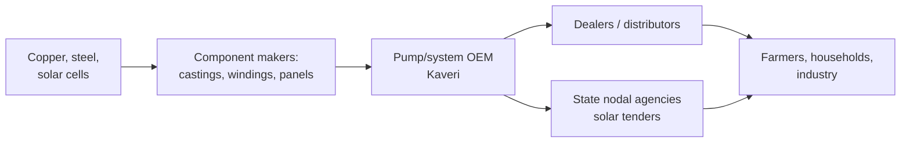

# 05.1 · Business models & unit economics

> **Why this matters:** financial statements aggregate millions of small transactions into a few lines. To forecast
> those lines you have to go the other way — down to the *unit* (a pump, a store, a customer, a loan) and ask how
> much money each one makes and why anyone buys it. An investor who cannot describe how a company makes money in
> three sentences has no business forecasting its cash flows.

**Learning objectives** — after this lesson you can:

- Classify a business by how it monetises (product, service, recurring, transactional, project, platform/take-rate,
  subscription, licensing) and explain what that implies for growth, margins, capital needs and risk.
- Place a company in its value chain and identify who captures the profit and why.
- Compute unit economics — contribution per unit, CAC, LTV, payback, cohort retention — for a manufactured product,
  a retail store, a D2C brand and a loan.
- Assess customer concentration and its consequences.
- Pass the "three-sentence test" for Kaveri Pumps and Nirmal Finance.

**Prerequisites:** [04.2 Margins & cost structure](../04-financial-analysis/02-margins-and-cost-structure.md),
[04.3 Returns on capital](../04-financial-analysis/03-returns-on-capital.md)  ·  **Time:** ~90 min

---

## 1. The three-sentence test

Before any ratio, write three sentences:

1. **What** the company sells and **to whom** (the customer who pays, which is not always the user).
2. **Why** that customer chooses this company over alternatives (the source of the sale).
3. **How** the money flows — when the company gets paid, what it must spend first, and what it keeps.

For Kaveri Pumps: *(1) It makes agricultural, domestic and industrial pumps and motors sold through ~1,800 dealers
to farmers, households and factories, plus solar pumping systems sold directly to state agencies under tenders.
(2) Farmers buy on dealer recommendation, brand familiarity and service availability; state agencies buy on tender
price and empanelment. (3) Dealers pay in ~60 days; state agencies pay in 6–12 months; Kaveri must buy copper,
steel and solar panels up front and keep 80 days of inventory, so growth ties up cash before it produces profit.*

If you cannot write sentence 3 from the annual report, you are not ready to build a model. Sentence 2 is the
subject of [05.3](03-moats-and-competitive-advantage.md).

## 2. Monetisation models and what they imply

| Model | Examples (India) | Revenue character | Margin & capital pattern | What to watch |
|:--|:--|:--|:--|:--|
| **Product sale** | Pumps, cars, FMCG, pharma | Transactional; repeat depends on consumption or replacement cycle | Gross margin set by brand and input costs; working capital and plant intensity vary | Volume, price, mix; inventory and receivables |
| **Service (time & materials)** | IT services, staffing, consulting, hospitals | Billed per hour/bed/project; utilisation-driven | People cost 55–70% of revenue; low capital; margins depend on pricing power and pyramid | Utilisation, realisation, attrition |
| **Recurring / subscription** | SaaS, telecom, DTH, gyms, insurance renewals | Contracted or habitual repeat; high visibility | Front-loaded acquisition cost, then high incremental margin | Churn, ARPU, net revenue retention |
| **Project / EPC** | Infra contractors, defence, shipyards, real estate | Lumpy; milestone-based; order-book driven | Thin margins, heavy working capital (retention, BGs), execution risk | Order book/revenue, unbilled revenue, cost overruns |
| **Platform / take-rate** | Exchanges, marketplaces, payments, food delivery | % of gross transaction value (GTV/GMV) | Near-zero marginal cost once built; network effects; regulation | Take rate, GMV growth, contribution margin per order |
| **Licensing / royalty / brand** | Music labels, franchisors, MNC parents charging Indian subsidiaries, pharma out-licensing | Passive % of someone else's sales | Extremely high margin, no capital | Contract terms, renewal risk |
| **Lending (spread)** | Banks, NBFCs, HFCs | Interest spread on borrowed money | Leverage is the business; credit cost is the swing factor | NIM, credit cost, ALM, capital adequacy ([07.1](../07-special-valuation/01-banks-and-nbfcs.md)) |
| **Float / asset-gathering** | Insurers, AMCs, exchanges' clearing | Fees on assets managed or float invested | Operating leverage on AUM; regulation caps fees | AUM flows, yield on AUM, TER rules |
| **Razor-and-blade / installed base** | Printers & cartridges, elevators & maintenance, aircraft engines, diagnostics machines & reagents | Low-margin hardware, high-margin consumables/service | Recurring stream valued higher than the hardware | Installed base, attach rate, contract renewal |

Two implications matter for every valuation you will do. **Recurring revenue deserves a higher multiple** than
transactional revenue because it is more predictable and cheaper to serve. And **capital intensity determines how
much of profit reaches shareholders**: a platform can grow 30% with no new capital; a pump maker growing 12% has to
reinvest 94% of NOPAT ([04.3](../04-financial-analysis/03-returns-on-capital.md)).

## 3. Value chain: who keeps the profit?

Draw the chain from raw material to end customer and ask, at each link, how concentrated the players are and what
the switching costs are. Profit pools sit where bargaining power sits.



- **Upstream**: copper and steel are global commodities — Kaveri is a price taker; castings come partly from a
  promoter-owned supplier (a captive link, which raises related-party questions rather than pricing power).
- **OEM**: the brand, the design and the dealer relationships sit here; this is where the ~35% gross margin lives.
- **Dealers**: fragmented, dependent on the OEM for margin schemes; the OEM holds the power (but must fund their
  credit).
- **State agencies**: concentrated, tender-driven, slow-paying. Here Kaveri is the weak party — and that shows up
  as 96 receivable days. Value chains explain working capital as much as they explain margins.

Generalise: in autos the OEM captures brand value but ancillaries with proprietary technology (e.g., fuel injection)
earn more than commodity stampers; in pharma the innovator captures the patent rent while generic makers compete on
cost and regulatory speed; in e-commerce the platform earns the take rate while sellers compete away their margin.

## 4. Unit economics — four worked examples

**Unit economics** is the profit arithmetic of one unit — chosen so that the business is a multiple of it. Pick the
unit the company itself manages by: a pump, a store, a customer, a loan, a tonne, a seat-kilometre, a bed.

### 4.1 A manufactured product: one Kaveri pump

Fictional detail consistent with the running example: average realisation per agricultural pump ₹9,000; materials
65.1% of price; the variable share of employee and other costs (40% of 21.1%) ≈ 8.4% of price.

```python
price = 9000
materials = price * 0.651            # 5,859
variable_overhead = price * 0.211 * 0.4   # 760
contribution = price - materials - variable_overhead   # 2,381  → 26.5%
print(round(materials), round(variable_overhead), round(contribution), round(contribution / price, 3))
```

Each pump contributes ~₹2,380 towards fixed costs of ~₹215 Cr — so the company must sell roughly 900,000 pump-equivalents
a year to break even (matching the ₹811 Cr break-even revenue in [04.2](../04-financial-analysis/02-margins-and-cost-structure.md)).
Growth levers at the unit level: price (brand, mix toward industrial), materials (design, scale purchasing,
copper hedging) and volume per rupee of fixed cost (utilisation, 78% for pumps).

### 4.2 A retail store: the QSR outlet from 04.2

Per store per year: revenue ₹240 lakh, contribution ₹142.8 lakh (59.5%), fixed store costs ₹120 lakh, store EBIT
₹22.8 lakh. Add the capital: fit-out and equipment ₹150 lakh, security deposit ₹20 lakh.

$$\text{Store-level ROIC} = \frac{22.8 \times (1 − 0.25)}{170} = 10.1\%; \qquad
\text{Payback} = \frac{170}{22.8 + 18 \text{ (depreciation)}} = 4.2 \text{ years}$$

A 10% store ROIC does not clear a 12% cost of capital: this chain should not be opening stores until same-store
sales rise. Every QSR investor presentation shows "store payback of 2–3 years"; recompute it with *your* revenue
assumption and *all* the capital (including deposits and pre-opening losses), and check it against the reported
company-level ROIC — the two must reconcile once corporate overhead is added.

### 4.3 A customer: a D2C brand

**Aravalli Naturals** (fictional) sells skincare online. Customer acquisition cost (CAC — marketing spend ÷ new
customers) ₹900; average order value ₹1,800; gross margin 55%; fulfilment and payment costs ₹250 per order; a new
customer places on average 2.2 orders in year 1, 1.1 in year 2 and 0.7 in year 3, then is assumed lost.

```python
cac, aov, gm, fulfil = 900, 1800, 0.55, 250
contrib_per_order = aov * gm - fulfil                  # 740
orders = [2.2, 1.1, 0.7]; r = 0.15                      # discount at 15%
ltv = sum(o * contrib_per_order / (1 + r) ** (i + 0.5) for i, o in enumerate(orders))   # ≈ 2,543
print(contrib_per_order, round(ltv), round(ltv / cac, 2), round(cac / (2.2 * contrib_per_order / 12), 1))
# 740  2543  LTV/CAC 2.83  payback 6.6 months
```

**LTV/CAC of 2.8x** and a **payback of ~7 months** are healthy (the usual rules of thumb: LTV/CAC > 3x good, < 1.5x
unsustainable; payback < 12 months). But note what the model assumes: retention. If year-2 orders fall from 1.1 to
0.6, LTV drops to ~₹2,240 and the ratio to 2.5x. **Cohort analysis** — tracking each acquisition month's customers
over time — is how you check the assumption; a company that will not disclose cohorts is asking you to take LTV on
faith. [07.4](../07-special-valuation/04-high-growth-and-loss-making.md) builds a full path-to-profitability on this.

### 4.4 A loan: Nirmal Finance

Per ₹1,000 of loans, using Nirmal's FY26 ratios from the [running example](../appendix/running-example/nirmal-finance.md):
yield 16.9%, cost of funds 8.7% on the ~80% of assets funded by borrowings, fees 0.8%, opex 3.8%, credit cost 1.9%,
tax 25.17%.

```python
loan = 1000
nii = loan * 0.169 - loan * 0.80 * 0.087      # 99.4
ppop = nii + loan * 0.008 - loan * 0.038      # 69.4
pbt = ppop - loan * 0.019                     # 50.4
pat = pbt * (1 - 0.2517)                      # 37.7  → RoA 3.8%
roe = pat / (loan * 0.20)                     # 18.9% on the 20% equity slice
print(nii, ppop, round(pbt, 1), round(pat, 1), round(pat / loan, 4), round(roe, 3))
```

The unit tells you the whole story of a lender: a 3.8% return on assets becomes a ~19% return on equity only because
each ₹1,000 loan is funded with ₹800 of borrowed money. Raise credit cost from 1.9% to 4.9% (a bad year) and PAT per
₹1,000 falls to ₹15 — RoE 7.5%. The unit economics *are* the risk analysis.

## 5. Customer concentration

Concentration is a business-model attribute, not a footnote. Where to find it: the Ind AS 115 revenue note
("customers contributing more than 10% of revenue"), segment note (geographies), MD&A, DRHP risk factors.

| Concentration | Implication |
|:--|:--|
| Top customer > 25% of revenue | The customer sets prices and terms; a loss is existential; valuation discount warranted |
| Top 10 customers > 50% (typical in auto ancillaries, IT services, contract manufacturing) | Manageable if relationships are sticky (multi-year programmes, embedded processes); watch for one customer's own troubles |
| Government / PSU customers > 30% | Payment delays, policy risk, tender pricing; receivables and BGs balloon |
| Highly fragmented (FMCG, pumps via dealers) | Pricing power with customers, but distribution cost and dealer credit become the working-capital burden |

Kaveri: agri sales via 1,800 dealers are fragmented (good), but solar — 27% of revenue — goes to a handful of state
agencies, two of which hold most of the ₹62 Cr of >6-month overdues. Concentration in the *growing* segment is the
under-appreciated risk in its model.

## 6. Putting it together: a business-model summary sheet

For every company you study, fill one table before opening a spreadsheet:

| Question | Kaveri Pumps | Nirmal Finance |
|:--|:--|:--|
| Unit | A pump / a solar system | A ₹5–15 lakh used-CV or MSME loan |
| Who pays | Dealers (farmers) / state agencies | Borrower EMIs |
| Why they buy | Brand, dealer service, price / tender empanelment | Speed, local presence, willingness to lend where banks won't |
| Recurring? | Replacement cycle 7–10 years; no | Loan tenor ~3 years; repeat borrowers ~40% |
| Contribution per unit | ~26% of price | RoA ~3.8% of loan |
| Capital per unit | Working capital ~28% of sales; plant | 20% equity per loan (leverage 5x) |
| Concentration | Fragmented dealers; concentrated state buyers in solar | Granular; regional (four states) |
| Key sensitivity | Copper/steel price; state payment cycles; monsoon | Credit cost; cost of funds; CV cycle |
| Growth needs | Working capital and dealers | Equity and borrowing lines |

!!! tip "Trader's lens"
    Unit economics are the Greeks of a business. Contribution per unit is delta (how much P&L per unit of volume);
    fixed costs make it convex (gamma); CAC is the premium paid up front for a stream of future contribution whose
    length is uncertain (a long-dated call on retention); a loan's spread is carry against a short credit put. You
    would never hold a position without knowing its Greeks — do not hold a stock without knowing its unit economics.

!!! info "India notes"
    - The Ind AS 115 note requires **disaggregation of revenue** (by product, geography, timing) and disclosure of
      contract balances (receivables, contract assets/unbilled, contract liabilities/advances) — the raw material for
      unit economics and concentration.
    - DRHPs contain a **Key Performance Indicators** section (SEBI ICDR requirement for new-age companies) with
      operational metrics — GMV, take rate, contribution margin, AUM, cohorts — that later investor presentations
      often stop disclosing. Save the DRHP.
    - Management-defined "contribution margin" for platforms (Zomato/Eternal, Swiggy, Nykaa) excludes different
      costs at different companies; rebuild it yourself from the P&L before comparing.

!!! warning "Common mistakes"
    - Describing the product instead of the economics ("it makes pumps" is not a business model).
    - Confusing the user with the customer (advertising-funded media; government-paid healthcare; dealer-sold goods).
    - Accepting management's store-payback or LTV/CAC without recomputing with full capital and realistic retention.
    - Ignoring concentration because it sits in a note rather than on the P&L.
    - Valuing project revenue like recurring revenue — an order book is a backlog, not an annuity.

## Key terms

| Term | Meaning |
|:--|:--|
| **Business model** | How a company creates, delivers and captures value — who pays, for what, and what it keeps |
| **Unit economics** | The revenue, cost and capital of one representative unit (product, store, customer, loan) |
| **Contribution per unit** | Price − variable costs per unit |
| **Value chain** | The sequence of activities from raw material to end customer, and who captures profit at each step |
| **Take rate** | A platform's revenue as a percentage of the transaction value it intermediates |
| **GMV / GTV** | Gross merchandise/transaction value flowing through a platform |
| **CAC** | Customer acquisition cost: sales & marketing spend ÷ new customers acquired |
| **LTV** | Lifetime value: discounted contribution expected from a customer over their life |
| **Payback period (customer/store)** | Time for cumulative contribution to recover CAC or store capital |
| **Cohort analysis** | Tracking a group of customers acquired in the same period over time (retention, spend) |
| **Churn / retention** | Share of customers lost / kept per period |
| **ARPU** | Average revenue per user |
| **Order book** | Contracted but unexecuted revenue in a project business |
| **Customer concentration** | Share of revenue from the largest customers |
| **Installed base** | Units in the field that generate consumables or service revenue |

## Check your understanding

1. Write the three-sentence description for Nirmal Finance.
<details><summary>Answer</summary>(1) It lends ₹5–15 lakh to used-commercial-vehicle owners, tractor buyers and
small businesses in tier-3/4 towns across four western/central states, funded 80% by bank loans, NCDs and
securitisation. (2) Borrowers choose it because banks won't lend to them quickly on informal incomes and it has 410
local branches that can assess them. (3) It earns a ~17% yield against ~9% cost of funds, spends ~4% on branches and
staff and loses ~2% to defaults, keeping ~3.8% of assets as profit — which becomes ~19% on equity because each loan
is five-times levered.</details>

2. A QSR chain claims 2.5-year store payback. Its stores do ₹300 lakh revenue at 18% store EBITDA and cost ₹200 lakh
   to open including deposit and pre-opening loss. What is the payback, and what did management probably exclude?
<details><summary>Answer</summary>Store EBITDA = ₹54 lakh; payback = 200/54 = 3.7 years. Management likely quoted
capex excluding deposits and pre-opening losses (say ₹135 lakh → 2.5 years). Always use all capital.</details>

3. Recompute Aravalli's LTV/CAC if CAC rises to ₹1,300 (competition for ad inventory) with retention unchanged.
<details><summary>Answer</summary>LTV unchanged at ~₹2,543; LTV/CAC = 1.96x; payback = 1300/(2.2×740/12) = 9.6
months. Still positive but below the 3x comfort line — growth is now barely value-accretive.</details>

4. Why does a project company's ₹5,000 Cr order book not justify a recurring-revenue multiple?
<details><summary>Answer</summary>The backlog converts to revenue once, at uncertain margins, with execution and
payment risk, and must be replenished by winning new tenders; recurring revenue renews itself at near-zero
acquisition cost. Value the order book as a pipeline (book-to-bill, margin, execution period), not an annuity.</details>

5. Kaveri's solar segment is 27% of revenue and growing fastest. Using the value-chain view, why might a higher solar
   share reduce the company's value even if it raises revenue?
<details><summary>Answer</summary>In the solar chain Kaveri is the weak party: concentrated state buyers set tender
prices (lower gross margin, ~22–24%), pay in 6–12 months (receivables, working-capital debt) and require bank
guarantees. More solar means more revenue with lower contribution per rupee and more capital per rupee — the
reinvestment identity says that combination lowers, not raises, value unless ROIC on that capital exceeds WACC,
which the FY24–26 incremental ROIC (4.6%) says it does not.</details>

## Go deeper

- Philip Fisher, *Common Stocks and Uncommon Profits* — the fifteen points; the original "understand the business"
  checklist.
- Any DRHP's "Key Performance Indicators" and "Our Business" sections (SEBI website) — the best free unit-economics
  disclosures in India.
- Hamilton Helmer, *7 Powers* — read for [05.3](03-moats-and-competitive-advantage.md), but its business-model
  framing starts here.
- Bill Gurley, "All Revenue Is Not Created Equal" (Above the Crowd blog, 2011) — why revenue quality drives
  multiples.

---
[← Previous: 04.7 Quality of earnings](../04-financial-analysis/07-quality-of-earnings.md) · [Module index](index.md) · [Next: 05.2 Industry analysis →](02-industry-analysis.md)
