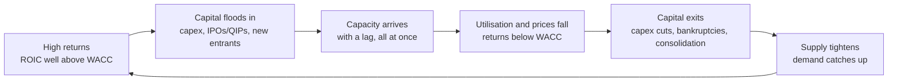

# 05.4 · The capital cycle

> **Why this matters:** most investors forecast demand, but it is usually supply that destroys returns. High
> profits attract capacity. The capacity arrives late and all at once, and the returns that attracted it disappear.
> That is why booming industries so often make poor investments, and why the best time to look at a cyclical
> business is often when capital is leaving it. Supply is also easier to see coming than demand, because it is
> announced, financed and built in public.

**Learning objectives:** after this lesson you can:

- Describe the capital-cycle loop, and use a lagged-supply model to show why an industry with perfectly steady
  demand can still swing between boom and bust.
- Compute how the profits of a capacity-heavy business respond to utilisation, and the price at which *new*
  capacity earns its cost of capital (replacement-cost economics and Tobin's q).
- Build an industry capacity tracker from announced additions and back out the demand growth needed to hold
  utilisation. This is the supply-side version of a reverse DCF.
- Explain, with dated Indian examples (airlines, the 2016–19 telecom war, cement, specialty chemicals 2021–24,
  solar modules, EVs), why fast industry growth and good shareholder returns so often fail to coincide.
- Spot capital-cycle signals in filings and public data, and apply them to Kaveri Pumps' solar business.

**Prerequisites:** [05.2 Industry analysis](02-industry-analysis.md),
[05.3 Moats & competitive advantage](03-moats-and-competitive-advantage.md),
[04.2 Margins & cost structure](../04-financial-analysis/02-margins-and-cost-structure.md),
[04.3 Returns on capital](../04-financial-analysis/03-returns-on-capital.md)  ·  **Time:** ~100 min

---

## 1. Demand is a story; supply is a schedule

The usual way to analyse an industry starts with demand: how big the market is, how fast it grows, and how many
Indians will one day buy the product. That is the "India story", and it fills IPO prospectuses. The trouble is that
demand growth, even when you forecast it correctly, does not decide what an industry *earns*. Returns depend on
how fast **capacity** grows relative to demand. An industry whose demand grows 15% a year while capacity grows 25%
will see utilisation, prices and returns fall. An industry whose demand is flat while capacity shrinks can see
returns rise.

The London fund manager Marathon Asset Management built an investment approach on this observation and called it
**capital-cycle analysis**. Its reports were collected by Edward Chancellor in *Capital Account* (2004) and
*Capital Returns: Investing Through the Capital Cycle* (Palgrave Macmillan, 2016). The book describes the approach
as a blend of industrial economics, Michael Porter's competitive analysis and behavioural finance
([Edward Chancellor, book page](https://www.edwardchancellor.com/books/capital-returns);
[CFA Institute review](https://blogs.cfainstitute.org/investor/2016/08/28/book-review-capital-returns/)). The
core claims are:

1. **High returns attract capital, and the capital competes the returns away.** Low returns repel capital, and
   the shrinking supply restores them.
2. **Supply is easier to forecast than demand.** New plants are announced, get environmental clearances, raise
   debt or equity, order equipment and take years to build, all of which is public. Demand forecasts are usually
   extrapolations with a narrative attached.
3. **Investors and managers extrapolate.** When returns are high, both assume they will stay high, so capital
   floods in at exactly the wrong moment. The market prices the demand story and ignores the capacity schedule.



The phases leave recognisable fingerprints:

| Phase | What you see in the numbers | What the market and management say | Typical valuation |
|:--|:--|:--|:--|
| 1. High returns | ROIC ≫ WACC, utilisation high, prices firm | "Structural demand story", "supercycle" | Rising P/E on peak earnings |
| 2. Capital inflow | Capex/D&A ≫ 1 across the industry, new entrants, sector IPOs and QIPs | "We must add capacity to protect share" | High multiples; EV above replacement cost |
| 3. Capacity arrives | CWIP converts to gross block; utilisation starts to slip | "Temporary demand softness" | Multiples still high, earnings about to fall |
| 4. Bust | Utilisation low, price war, ROIC < WACC, receivable days stretch | "Irrational competition", "dumping" | Low price, but P/E high on depressed earnings |
| 5. Capital exit | Capex/D&A < 1, bankruptcies, M&A below replacement cost | "Consolidation is overdue" | EV below replacement cost; P/B lows |
| 6. Recovery | Utilisation rising with little new supply | "Disciplined industry" | Re-rating starts before earnings recover |

The investing conclusion is uncomfortable. The best moment to *study* a cyclical industry is often phase 5, when
the news is worst. The most dangerous moment is phases 1–2, when the story is best.
[07.3 Cyclicals & commodities](../07-special-valuation/03-cyclicals-and-commodities.md) covers how to value
companies across the cycle (normalised earnings, the P/E paradox). This lesson is about reading the cycle itself.

## 2. Why supply overshoots: the lag machine

If companies added capacity exactly when demand needed it, there would be no cycle. Five features of real
industries make supply overshoot:

1. **Lead times.** A plant decided today produces in two to four years. CRISIL puts the gestation of an integrated
   cement plant at 3–4 years, against 1–2 years for a split grinding unit
   ([CRISIL Ratings, 12-Nov-2025](https://www.crisilratings.com/en/home/newsroom/press-releases/2025/11/indias-cement-capacity-addition-to-see-75-percent-jump-over-fiscals-2026-28.html)).
   An aircraft ordered in a boom may be delivered in the next downturn.
2. **Lumpiness.** Capacity comes in minimum efficient sizes: a kiln, a fab line, a spectrum band, an aircraft. You
   cannot add 2% of a plant.
3. **Competition neglect.** Each company plans its expansion against its own demand forecast and implicitly
   assumes its rivals won't expand too. Experimental economists call this *reference-group neglect* (Camerer &
   Lovallo, "Overconfidence and Excess Entry", *American Economic Review*, 1999). Add up the market-share
   ambitions in any industry's investor presentations and they usually come to well over 100%.
4. **Capital is cheapest when returns are highest.** IPO windows open, QIPs get oversubscribed and banks lend
   freely when the sector's recent returns are high. The cost of capital is pro-cyclical, which amplifies
   capacity decisions.
5. **Exit is slow.** Plants are sunk costs. A plant keeps running as long as price covers *cash* cost, even when it
   earns nothing on capital. Bankrupt capacity rarely disappears. It is sold cheaply to a new owner who, with a
   lower cost base, competes even harder. State support and lender forbearance delay exit further.

### Worked example 1 — a boom and bust with perfectly steady demand

Here is a deliberately simple model. Demand grows at a steady **7% a year**, with no shocks at all. Returns rise
with utilisation: ROIC = 12% (the cost of capital) when utilisation is 80%, plus about one percentage point for
every point of utilisation above or below that. Whenever ROIC exceeds the 12% cost of capital, the industry
orders new capacity in proportion to the excess, and that capacity takes **three years** to arrive.

```python
import io, sys
sys.stdout = io.TextIOWrapper(sys.stdout.buffer, encoding="utf-8")

WACC, LAG, YEARS = 0.12, 3, 16
capacity, demand = 100.0, 85.0            # year-0 capacity and demand (units)
pipeline = [0.0] * LAG                    # capacity ordered but not yet built
print(f"{'Yr':>2} {'Cap':>6} {'Demand':>7} {'Util':>6} {'ROIC':>6} {'Ordered':>8}")
for yr in range(YEARS):
    capacity += pipeline.pop(0)                    # orders placed LAG years ago arrive
    util = min(demand / capacity, 0.95)
    roic = WACC + 1.0 * (util - 0.80)              # returns rise ~1pp per pp of utilisation
    ordered = capacity * max(0.0, 1.5 * (roic - WACC))  # build when returns beat WACC
    pipeline.append(ordered)
    print(f"{yr:>2} {capacity:6.1f} {demand:7.1f} {util:6.1%} {roic:6.1%} {ordered:8.1f}")
    demand *= 1.07                                 # demand compounds at a steady 7%
```

Output (units of capacity; utilisation is capped at 95%):

| Year | Capacity | Demand | Utilisation | ROIC | Capacity ordered |
|--:|--:|--:|--:|--:|--:|
| 0 | 100.0 | 85.0 | 85.0% | 17.0% | 7.5 |
| 1 | 100.0 | 91.0 | 91.0% | 22.9% | 16.4 |
| 2 | 100.0 | 97.3 | 95.0% | 27.0% | 22.5 |
| 3 | 107.5 | 104.1 | 95.0% | 27.0% | 24.2 |
| 4 | 123.9 | 111.4 | 89.9% | 21.9% | 18.4 |
| 5 | 146.4 | 119.2 | 81.4% | 13.4% | 3.1 |
| 6 | 170.6 | 127.6 | 74.8% | 6.8% | 0.0 |
| 7 | 189.0 | 136.5 | 72.2% | 4.2% | 0.0 |
| 8 | 192.1 | 146.0 | 76.0% | 8.0% | 0.0 |
| 9 | 192.1 | 156.3 | 81.3% | 13.3% | 3.8 |
| 10 | 192.1 | 167.2 | 87.0% | 19.0% | 20.2 |
| 11 | 192.1 | 178.9 | 93.1% | 25.1% | 37.8 |
| 12 | 196.0 | 191.4 | 95.0% | 27.0% | 44.1 |
| 13 | 216.2 | 204.8 | 94.7% | 26.7% | 47.8 |
| 14 | 254.0 | 219.2 | 86.3% | 18.3% | 24.0 |
| 15 | 298.1 | 234.5 | 78.7% | 10.7% | 0.0 |

Read it slowly:

- **No demand shock was needed.** Demand rose 7% every single year, yet utilisation swung between 72% and 95%
  and ROIC between 4% and 27%. The cycle is created by the supply response, not by the economy.
- **Orders peak when returns peak** (years 2–3 and 12–13), because that is when everyone can justify a new plant.
- **Returns bottom out three to four years after the ordering peak** (year 7), which is exactly the construction
  lag. Anyone who extrapolated year-3 returns bought at the top.
- **Longer lags mean bigger swings.** Rerunning the same model with different lags gives utilisation ranges
  (years 4–15) of: 1-year lag, flat at 84.7%, with no cycle at all; 2-year lag, 78.7–91.5%; 3-year lag,
  72.2–95.0%; 4-year lag, 70.7–95.0%. Industries with long build times and lumpy additions (steel, aircraft,
  semiconductors, integrated cement) are the most cyclical.

The model is a descendant of the economist's **cobweb model** (the "hog cycle"). Producers set this period's
supply from last period's price. If supply responds strongly enough to price, relative to how strongly price
responds to supply, prices oscillate instead of settling. In the simulation, the "1.5" in the ordering rule is that
response strength. Cut it, or shorten the lag, and the cycle damps out.

!!! tip "Trader's lens — delta-hedging on a stale delta"
    The industry behaves like a hedger who rebalances on a delta that is three days old. The longer the lag and
    the more aggressively they rebalance (the "gain", 1.5 here), the more the position overshoots and oscillates.
    Stability needs a short lag or a low gain. That is why short-build industries (split grinding units, software)
    and disciplined oligopolies (low gain: nobody wants to be the one who adds capacity) are less cyclical than
    fragmented industries with long build times.

## 3. Utilisation: the state variable of a capital-heavy business

**Capacity utilisation** is actual output divided by installed capacity. In a capital-heavy business it is the
single most important number, for two reasons:

- **Fixed costs.** Depreciation, salaried staff, maintenance and overheads do not fall when volume falls, so profit
  swings more than volume. This is operating leverage
  ([04.2](../04-financial-analysis/02-margins-and-cost-structure.md)).
- **Price depends on utilisation.** When plants are full, no one needs to cut price to win volume. When a quarter
  of capacity is idle, every producer's marginal tonne is worth selling at anything above variable cost, so
  prices fall. Profit is therefore *convex* in utilisation: volume and price move together.

India has an economy-wide measure. The RBI's quarterly **Order Books, Inventories and Capacity Utilisation Survey
(OBICUS)** of manufacturers put utilisation at about 75.6% in Oct–Dec 2025 (Q3 FY26), up from 74.3% the quarter
before. We could only confirm these figures through a data vendor's compilation, not the RBI release itself, so
check the [RBI OBICUS page](https://www.rbi.org.in/Scripts/QuarterlyPublications.aspx?head=Quarterly+Order+Books%2C+Inventories+and+Capacity+Utilisation+Survey)
for the latest round. Aggregate utilisation is a macro signal for private capex. For stock analysis you need the
utilisation of *your* industry, from company disclosures, industry bodies or rating-agency reports.

### Worked example 2 — Vindhya Cement: utilisation, price and the return on new capacity

*Vindhya Cement is fictional, and its cost figures are illustrative assumptions, not industry data.* It builds a
new 10 million tonne-per-annum (MTPA) plant at **₹7,000 per tonne of capacity**, i.e. ₹7,000 Cr. Net realisation
is ₹5,200/tonne and variable cost (power, fuel, freight, raw materials) is ₹3,500/tonne, so contribution is
₹1,700/tonne. Fixed cash costs are ₹550 Cr a year. Depreciation is 3% of gross block (₹210 Cr) and tax is 25.17%.

| Utilisation | Volume (MT) | EBITDA (₹ Cr) | EBITDA/tonne (₹) | EBIT (₹ Cr) | Pre-tax return on ₹7,000 Cr | Post-tax return |
|--:|--:|--:|--:|--:|--:|--:|
| 60% | 6.0 | 470 | 783 | 260 | 3.7% | 2.8% |
| 70% | 7.0 | 640 | 914 | 430 | 6.1% | 4.6% |
| 80% | 8.0 | 810 | 1,013 | 600 | 8.6% | 6.4% |
| 90% | 9.0 | 980 | 1,089 | 770 | 11.0% | 8.2% |

Arithmetic at 70%: 7.0 MT × ₹1,700 = ₹1,190 Cr contribution; − ₹550 Cr fixed = ₹640 Cr EBITDA, or ₹914 a tonne;
− ₹210 Cr depreciation = ₹430 Cr EBIT; × (1 − 0.2517) = ₹322 Cr NOPAT; ÷ ₹7,000 Cr = **4.6%**. For scale, ICRA
estimated industry EBITDA at a cyclical low of ₹810/tonne in FY25 and projected ₹900–950/tonne for FY26
([ICRA via The Tribune, 30-Dec-2025](https://www.tribuneindia.com/news/business/cement-volumes-to-grow-6-7-in-fy27-industry-to-add-85-90-mtpa-capacity-icra/)),
so our 70% case is in a realistic range.

Three lessons follow.

**(a) Price is the bigger lever.** At 70% utilisation, a ₹250/tonne price cut (4.8%) removes 7.0 × 250 = ₹175 Cr
of EBITDA, taking it from ₹640 Cr to ₹465 Cr, a **27.3%** fall. Idle capacity leads to exactly this kind of
price cut.

**(b) What price does new capacity need?** To earn a post-tax return equal to a 12.19% cost of capital (we borrow
the course's reference WACC for convenience), the plant needs NOPAT of 0.1219 × 7,000 = ₹853.3 Cr. That means
EBIT of 853.3 / (1 − 0.2517) = ₹1,140.3 Cr and EBITDA of ₹1,350.3 Cr. At 75% utilisation (7.5 MT) the required
contribution is (1,350.3 + 550) / 7.5 = ₹2,534 a tonne, so the required price is **₹6,034**, 16.0% above today's
₹5,200. At 85% utilisation the required price is ₹5,736 (+10.3%). At 70% it is ₹6,215 (+19.5%). Economically,
new plants should be built only when prices are well above today's level. If capacity keeps arriving at ₹5,200,
the builders are not being paid for it. That tells you something about their motives (market share, empire
building, a plan to consolidate), and you should find out what.

**(c) Book ROCE flatters incumbents and lures entrants.** Suppose an old plant in the same market, bought at 55%
of today's replacement cost, has been depreciated to a book value of 40% of it (₹2,800 Cr), with depreciation of
₹115.5 Cr on historical cost. At 70% utilisation its EBIT is 640 − 115.5 = ₹524.5 Cr, and its **post-tax ROCE on
book is 14.0%**, comfortably above WACC. An analyst who reads that 14% as "the industry earns its cost of capital"
will cheer capacity additions that actually earn 4.6%. Reported returns on depreciated assets say little about the
return on the *next* rupee invested.

### Replacement cost and Tobin's q

**Tobin's q** is the market value of a company's assets divided by the cost of replacing them. In capacity
businesses you can estimate it directly: enterprise value per tonne of capacity, divided by the cost of building a
new tonne (the EV/tonne metric of [07.3](../07-special-valuation/03-cyclicals-and-commodities.md)).

- If listed cement companies trade at **₹15,000 EV per tonne** and a new tonne costs **₹7,000**, then q = 2.1.
  The market pays more than twice what it costs to build, so every promoter has an incentive to build and every
  investment banker has a sector IPO to sell. This is phase 2.
- If they trade at **₹6,000 per tonne**, q = 0.86. Buying capacity is cheaper than building it, so the sensible
  move is acquisition and closure rather than greenfield expansion. Consolidation is the signature of phase 5.

Marathon's rule of thumb follows directly: be wary where q is high and capital is pouring in, and look where q is
low and capital is leaving.

## 4. The supply-side reverse DCF: forward utilisation from announced capacity

A reverse DCF ([06.6](../06-valuation/06-reverse-dcf-and-expectations.md)) asks what growth the share price
implies. The supply-side equivalent asks: **given the capacity already announced, what demand growth is needed to
stop utilisation falling?** Compare that with a sensible demand forecast and you know whether pricing power is
likely to improve or erode.

### Worked example 3 — Indian cement, FY25 → FY28

Inputs, all from [CRISIL Ratings (12-Nov-2025)](https://www.crisilratings.com/en/home/newsroom/press-releases/2025/11/indias-cement-capacity-addition-to-see-75-percent-jump-over-fiscals-2026-28.html):
installed grinding capacity **668 MT** at 31-Mar-2025; capacity additions of **160–170 MT** expected over
FY26–FY28, 75% more than the 95 MT added over the previous three years, costing about ₹1.2 lakh crore; utilisation
about **70%**. Two simplifications: FY25 volume ≈ 0.70 × 668 = 467.6 MT (utilisation is usually measured on
average rather than closing capacity, so treat this as approximate), and we take the 165 MT midpoint.

**Required demand growth.** FY28 capacity = 668 + 165 = 833 MT. Holding 70% utilisation needs FY28 volume of
0.70 × 833 = 583.1 MT, so

$$g_{\text{required}} = \left(\frac{583.1}{467.6}\right)^{1/3} - 1 = 7.6\% \text{ a year}$$

(7.4% at 160 MT of additions, 7.9% at 170 MT). Now compare that with demand forecasts. CRISIL itself expects
annual demand additions of 30–40 MT. ICRA projected volume growth of 6.5–7.5% in FY26 and 6–7% in FY27 (Tribune
link above). If demand grows at 6.5% instead:

| Demand growth, FY26–FY28 | FY28 volume (MT) | FY28 utilisation on 833 MT |
|--:|--:|--:|
| 5.0% | 541.3 | 65.0% |
| 6.0% | 556.9 | 66.9% |
| 6.5% | 564.8 | 67.8% |
| 7.0% | 572.8 | 68.8% |
| 8.0% | 589.0 | 70.7% |

**Phasing matters.** Capacity arrives through the year, so utilisation on *average* capacity runs above
utilisation on closing capacity. With an assumed phasing of 55 / 60 / 50 MT and 6.5% demand growth:

```python
import io, sys
sys.stdout = io.TextIOWrapper(sys.stdout.buffer, encoding="utf-8")

def implied_demand_cagr(cap0, util0, additions, target_util):
    """Annual demand growth needed for utilisation to reach target_util once `additions` are built."""
    demand0 = util0 * cap0
    cap_end = cap0 + sum(additions)
    return (target_util * cap_end / demand0) ** (1 / len(additions)) - 1

def utilisation_path(cap0, util0, additions, g):
    """Yield (closing capacity, demand, utilisation on average capacity, on closing capacity)."""
    cap, demand = cap0, util0 * cap0
    for add in additions:
        avg_cap = cap + add / 2            # assume new capacity arrives evenly through the year
        cap += add
        demand *= 1 + g
        yield cap, demand, demand / avg_cap, demand / cap

adds = [55, 60, 50]                        # MT; FY26-FY28 phasing (assumed), total 165
print(f"Demand CAGR needed to hold 70%: {implied_demand_cagr(668, 0.70, adds, 0.70):.1%}")
for cap, d, u_avg, u_close in utilisation_path(668, 0.70, adds, g=0.065):
    print(f"capacity {cap:4.0f} MT  demand {d:5.1f} MT  utilisation {u_avg:.1%} (avg cap)  {u_close:.1%} (closing cap)")
# Demand CAGR needed to hold 70%: 7.6%
# capacity  723 MT  demand 498.0 MT  utilisation 71.6% (avg cap)  68.9% (closing cap)
# capacity  783 MT  demand 530.4 MT  utilisation 70.4% (avg cap)  67.7% (closing cap)
# capacity  833 MT  demand 564.8 MT  utilisation 69.9% (avg cap)  67.8% (closing cap)
```

**Interpretation.** On these inputs, utilisation stays flat to slightly down through FY28. That is not a collapse,
but it leaves no room for broad-based price increases. ICRA's own forecast was somewhat kinder, at 70–71%
utilisation in FY27, and noted that the south already had a capacity overhang. In September 2026 the financial
press was reporting "near-term concerns of supply overhang"
([Business Standard, 15-Sep-2026](https://www.business-standard.com/industry/news/cement-capacity-additions-raise-near-term-concerns-of-supply-overhang-126091500858_1.html)).
Two features moderate the risk:

- **Short lags.** About two-thirds of the new capacity is split grinding units with 1–2-year gestation (CRISIL).
  Section 2's simulation shows why shorter lags mean smaller overshoots: supply can respond to prices faster.
- **Consolidation.** The two largest groups are racing to add capacity, but also to buy it. The Adani group
  completed its acquisition of Holcim's stakes in Ambuja Cements and ACC on 16-Sep-2022, then 67.5 MTPA of
  capacity, and stated an ambition to be the largest cement maker by 2030
  ([Adani press release](https://www.adani.com/newsroom/media-releases/adani-becomes-indias-second-largest-cement-player)).
  UltraTech's acquisition of India Cements received Competition Commission approval in December 2024
  ([Business Standard](https://www.business-standard.com/companies/news/cci-green-signals-ultratech-cement-s-acquisition-of-india-cements-124122000975_1.html)).
  A market dominated by a few large players can behave with a lower "gain" than a fragmented one, although a
  race for share between two leaders can also *raise* it. Which of the two is happening is the key judgement in
  Indian cement today. [08.7](../08-sectors/07-metals-cement-chemicals.md) develops the sector playbook.

The method generalises. Replace "MT of cement" with GW of solar modules, aircraft seats, hospital beds, warehouse
square feet or data-centre megawatts, and the same two functions apply.

## 5. Why fast growth and good returns rarely coexist

The value-driver formula of [06.1](../06-valuation/01-what-is-value.md) gives the logic in one line:

$$V = \frac{NOPAT_1\,(1 - g/ROIC)}{WACC - g}$$

The term $g/ROIC$ is the share of profits that must be reinvested to grow at $g$. Take NOPAT of 100, growth of 8%
and WACC of 12.19%:

| ROIC on new investment | Reinvestment rate $g/ROIC$ | Value |
|--:|--:|--:|
| 8.0% | 100% | 0 |
| 12.19% (= WACC) | 66% | 820 |
| 20.0% | 40% | 1,432 |
| *No growth, for reference* | *0%* | *100 / 0.1219 = 820* |

Growth at a return equal to WACC is worth exactly the same as no growth, and growth below WACC destroys value.
In a crowded industry the capital cycle pushes incremental ROIC towards (or below) WACC. So an industry can grow
quickly for a decade and create little value for shareholders, while consuming a great deal of capital.

The same pattern appears at the level of whole economies. Jay Ritter found that across countries the correlation
between real stock returns and per-capita GDP growth over 1900–2002 was *negative*: fast growth accrues to
workers, consumers and new entrants, not necessarily to existing shareholders ("Economic Growth and Equity
Returns", *Pacific-Basin Finance Journal*, 2005;
[author's PDF](https://site.warrington.ufl.edu/ritter/files/2015/04/Economic-growth-and-equity-returns-2005.pdf)).
Warren Buffett's 2007 letter makes the industry version of the point about airlines: investors were "attracted by
growth when they should have been repelled by it"
([Berkshire Hathaway 2007 letter](https://www.berkshirehathaway.com/letters/2007ltr.pdf)).

Growth is not competed away in two situations:

- **Barriers to supply.** A moat ([05.3](03-moats-and-competitive-advantage.md)) is precisely what stops the
  capital cycle. Network effects, switching costs, brands, cornered resources, licences and scale economies all
  prevent new capacity from reaching the customer on equal terms, however much capital is available.
- **Capital discipline.** A consolidated industry whose players refuse to add capacity ahead of demand, for
  example because of a credible market leader, high minimum efficient scale or regulation, can keep returns above
  WACC for long periods even without a classic moat.

When neither holds, assume that high returns are temporary and that the market's extrapolation is the
opportunity, or the trap.

## 6. Indian case files

Facts below are dated and sourced. The interpretation is ours.

### 6.1 Airlines: growth without returns

Indian air travel has been one of the world's great growth stories, yet the industry's history is a list of
failures: Kingfisher Airlines collapsed in 2012, Jet Airways suspended operations in April 2019, and Go First filed
for voluntary insolvency in May 2023, with about half its fleet grounded by engine problems
([IBC Laws review of aviation insolvencies](https://ibclaw.in/a-decade-of-aviation-insolvency-in-india-lessons-from-kingfisher-to-go-first-by-aditya-pratap-singh/)).
The survivors are now highly concentrated. In January–June 2026, IndiGo carried 64.3% of domestic passengers and
the Air India group 25.7%, out of 864.04 lakh passengers, up just 1.44% year on year, according to DGCA data
([Indian Aviation News, Jul-2026](https://www.indianaviationnews.net/home/2026/07/domestic-air-passenger-traffic-rises-1-44-in-h1-2026-indigo-strengthens-market-lead.html)).

**Capital-cycle reading.** Supply in aviation is unusually easy to add: aircraft can be leased, so a new airline
needs little equity. It is lumpy (aircraft arrive in batches ordered years earlier) and slow to exit, because
grounded aircraft return to lessors and fly again for someone else. Costs such as fuel and dollar-denominated
leases are outside the airline's control. Growth attracted capacity faster than it attracted profits. The lesson
is not that airlines can never earn returns; a low-cost leader in a consolidated market may. It is that "traffic
will double" says nothing about whether *returns* will. See [case I11](../13-case-studies/india/11-jet-kingfisher-airlines.md).

### 6.2 Telecom 2016–19: a price war that rebuilt the industry

Reliance Jio launched in early September 2016 with free voice and data, a promotion that ran until 31-Dec-2016 and
was then extended to 31-Mar-2017. TRAI data showed industry turnover falling by about ₹10,000 Cr (INR 100 bn)
between June 2016 and March 2017, and ARPU dropping from around ₹120 to ₹82.7 by March 2017
([TeleGeography](https://resources.telegeography.com/the-jio-effect-how-the-newcomer-made-an-impact-in-india)).
A market of around a dozen operators consolidated. Telenor and Aircel exited or were absorbed, and Vodafone India
and Idea Cellular completed their merger on 31-Aug-2018
([Vodafone Idea, Wikipedia](https://en.wikipedia.org/wiki/Vodafone_Idea)). The industry's first major tariff
increases came only in December 2019, with prepaid prices up by as much as 40%
([Business Standard, Dec-2019](https://www.business-standard.com/article/companies/airtel-voda-idea-and-jio-to-hike-mobile-data-tariffs-by-up-to-40-119120100572_1.html)).
In between, on 24-Oct-2019, the Supreme Court upheld the government's wide definition of adjusted gross revenue,
exposing operators to roughly ₹92,000 Cr of dues
([ThePrint](https://theprint.in/judiciary/supreme-court-centre-recover-rs-92000-crore-from-airtel-vodafone-other-telecoms/310682/)).

**Capital-cycle reading.** This was an *entry* shock rather than an organic capacity build. A deep-pocketed entrant
with a different objective function (building a digital platform, not maximising near-term telecom returns) added
enormous capacity and priced for share. The incumbents' high-return period ended overnight. Returns recovered
only once capital had exited and the market had shrunk to three private operators plus the state-owned
BSNL/MTNL, after which pricing discipline became possible. An investor who understood the capital cycle would have
treated the 2016–18 bust as the *exit phase* and focused on which balance sheets could survive it.
[Case I10](../13-case-studies/india/10-vodafone-idea-telecom-war.md) follows one of those balance sheets in detail.

### 6.3 Cement: consolidation meets a capex wave

Section 4 covered the numbers. The point to add is that cement shows *both* forces of the capital cycle at once:
a large capex wave (₹1.2 lakh crore over FY26–28 per CRISIL) and continuing consolidation by the two leading
groups. Whether the next three years look like phase 2 (a race for capacity) or phase 6 (disciplined recovery)
depends on how the leaders behave. The tracker in section 4 is how you monitor it: every quarter, update
announced capacity and actual volume growth, and recompute required demand growth.

### 6.4 Specialty chemicals 2021–24: the China+1 capex boom

In FY22, revenue of the specialty-chemical companies CRISIL rates grew **41%**, driven by strong demand, supply
disruptions in China and the "China+1" sourcing narrative. Companies responded with a capex surge of about
**₹22,000 Cr over FY23–24, roughly 50% above pre-pandemic levels**. Then Chinese producers, facing weak domestic
demand under zero-Covid, cut export prices. Revenue growth fell to about 11% in FY23 and operating margins
contracted by **300–350 basis points**
([CRISIL Ratings, 18-Jul-2023](https://www.crisilratings.com/en/home/newsroom/press-releases/2023/07/specialty-chemicals-on-domestic-drive-revenue-seen-growing-6-7-percent.html);
sample of 121 companies, about a third of a ~₹4 lakh crore industry). By July 2026 CRISIL expected the sector to
cut capex to about ₹16,500 Cr for the year, with operating margins contracting a further 150–200 basis points to
14–14.5%, citing weak exports and Chinese pricing pressure
([BusinessToday, 2-Jul-2026](https://www.businesstoday.in/industry/story/specialty-chemical-firms-pare-capex-as-margins-come-under-pressure-540640-2026-07-02)).

**Capital-cycle reading.** The relevant supply was *global*. Indian companies analysed Indian capacity and export
demand, but the price-setter was Chinese capacity built in the previous cycle and looking for a home. The 2021
narrative ("India will take share from China") was about demand. The risk was on the supply side, and the
capacity being built simultaneously by dozens of Indian companies to serve the same export markets added to it.
Capex coming down, as CRISIL now expects, is what phase 5 starts to look like.

### 6.5 Solar modules 2024–26: a policy-made capacity wave

India protects domestic module makers through the **Approved List of Models and Manufacturers (ALMM)**:
government-linked projects must use enlisted modules. Enlisted module capacity was **48.1 GW across 90
manufacturers** in May 2024
([JMK Research, Jun-2024](https://jmkresearch.com/72-of-pv-modules-enlisted-in-the-latest-almm-list-are-of-high-efficiency-technologies/))
and **217.1 GW** by the 4-Aug-2026 update
([Energetica India](https://www.energetica-india.net/news/almm-update-solar-module-capacity-surpasses-217-gw-in-august-2026)),
rising to about 225 GW by mid-September
([Mercom, 17-Sep-2026](https://www.mercomindia.com/solar-module-capacity-under-almm-rises-to-228-gw)). ICRA
compares this with projected annual solar installations of **55–60 GWdc**, expects prices to stay under pressure
and overcapacity to "accelerate consolidation", hurting smaller pure-play module makers. It also notes that cell
capacity is only about 35 GW (August 2026), expected to reach 100 GW by December 2027, now that ALMM requirements
have extended to cells from June 2026
([ICRA's Rachit Mehta in pv magazine India, 16-Sep-2026](http://www.pv-magazine-india.com/2026/09/16/overcapacity-in-modules-underdeveloped-upstream-the-next-challenge-for-solar-manufacturing/)).

**Capital-cycle reading.** Policy protection created a high-return niche. Module assembly is quick and cheap to set
up, so capacity roughly quadrupled in about two years. The protected margin is now moving *upstream* to cells,
which is where the next capacity wave is forming. When the policy gradient moves, capital follows it.

### 6.6 Electric vehicles: many entrants, one market

Electric two-wheelers show the entry side of the cycle. Ola Electric, which led the Indian e-scooter market with a
share of about 30% in 2023, raised ₹5,500 Cr in its August 2024 IPO while still loss-making (FY24 revenue
₹5,009 Cr, net loss ₹1,584 Cr) ([Wikipedia summary](https://en.wikipedia.org/wiki/Ola_Electric)). Established
two-wheeler makers with national dealer networks entered the same market, alongside dozens of start-ups. We have
not verified current market shares for this lesson; pulling them from the government's VAHAN registration
dashboard is a good exercise (see [05.7](07-scuttlebutt-and-primary-research.md)). The pattern to test is whether
fast category growth is turning into returns above the cost of capital for *any* player, or is being competed
away by capacity and subsidised pricing.

!!! tip "Trader's lens — excess returns are rich implied vol"
    A high ROIC is like implied volatility trading well above what you expect to realise: it is a premium, and
    premiums attract sellers. New capacity is the vol seller, and it keeps selling until the premium is gone.
    The premium persists only where selling is constrained. In options that means margin requirements, balance
    sheet or borrow. In business it means licences, network effects, brands and scale. So when you see a high
    ROIC, the first question is not "how long does demand last?" but "what stops someone else from supplying it?"

## 7. Reading capex announcements across an industry

A capacity tracker is a spreadsheet with one row per plant or project:

| Company | Location | Capacity added | Status | Expected start | Funding | Source / date |
|:--|:--|--:|:--|:--|:--|:--|

Grade each project by **status**, because announcements are cheap: *announced* → *land acquired* → *environmental
clearance received* → *orders placed / financial closure* → *under construction* (CWIP growing) →
*commissioned*. How much weight to give an early-stage announcement is your judgement, and it is worth calibrating
against the industry's history of announcements that were never built.

**Where to find it in India:**

- Investor presentations and earnings calls ("we are adding X MTPA by FY28"). Record the date so you can track
  slippage (the say-do ledger of [03.4](../03-reading-filings/04-quarterly-results-and-concalls.md)).
- Annual-report notes: CWIP and its ageing schedule, and capital commitments
  ([03.3](../03-reading-filings/03-notes-to-accounts.md)). Rising commitments are future capacity.
- Credit-rating rationales, which describe project cost, funding and timelines, often in more detail than the
  company does.
- Offer documents: the "objects of the issue" in a DRHP/RHP and QIP placement documents. Clusters of sector IPOs
  and QIPs are a phase-2 signal in their own right.
- Stock-exchange announcements of board approvals for capex, and environmental-clearance records on the
  government's PARIVESH portal.
- Industry and government data: ALMM lists (solar), DGCA fleet and traffic data (airlines), CEA (power),
  rating-agency sector reports (cement, chemicals). Paid databases such as CMIE's CapEx track projects across
  the economy.

**Signals to aggregate:**

| Late-boom signals (phases 1–2) | Late-bust signals (phases 5–6) |
|:--|:--|
| Industry capex/D&A well above 1 for most players, for several years | Capex/D&A near or below 1; projects deferred |
| New entrants, especially from unrelated industries ("diversification") | Exits, bankruptcies, plants closed or mothballed |
| Sector IPOs and QIPs clustering; oversubscription | No equity raising; rights issues to repair balance sheets |
| EV/replacement cost (q) well above 1 | q below 1; acquisitions priced below replacement cost |
| Capex justified as "strategic", "to protect share" | Management talks about "discipline" and actually cuts capex |
| ROIC falling while capex rises | ROIC depressed but stabilising as utilisation rises |
| Customers gaining terms: longer credit, lower tender prices | Suppliers regaining terms: advances, shorter credit |

The last row is easy to miss. In many industries the price war shows up not in the list price but in the
**terms of trade**: credit periods, performance guarantees, free installation or bundled service. That leads to
our running example.

## 8. Kaveri and the solar-pump capital cycle

Kaveri Pumps & Motors ([reference page](../appendix/running-example/kaveri-pumps.md)) sells solar pumping systems
mainly into state-government tenders under the PM-KUSUM scheme. The segment has been the growth engine:

| ₹ Cr | FY21 | FY22 | FY23 | FY24 | FY25 | FY26 |
|:--|--:|--:|--:|--:|--:|--:|
| Solar pumping systems revenue | 18.4 | 30.3 | 61.2 | 140.8 | 257.8 | 355.9 |
| …as % of total revenue | 3.0% | 4.0% | 7.0% | 14.0% | 22.0% | 27.0% |
| Trade receivables (whole company) | 107.3 | 118.4 | 146.1 | 192.9 | 269.7 | 346.7 |
| Receivable days (whole company) | 64 | 57 | 61 | 70 | 84 | 96 |

Solar revenue compounded at **80.8% a year** over FY21–FY26. The notes show the other side: receivables overdue
by more than six months doubled from ₹31.0 Cr to ₹62.4 Cr in FY26, mostly from two state nodal agencies, against
an expected-credit-loss allowance of only ₹4.0 Cr (6.4% of the overdue bucket). Bank guarantees given for tenders
rose 65.5% from ₹58.0 Cr to ₹96.0 Cr. The fictional peer Konkan Solar Pumps grew revenue at 38% a year over
FY23–26.

**Supply-side view.** Assembling a solar pumping system (panel, controller, pump, mounting) needs little capital
and little time, so entry is easy. A government scheme with a fixed benchmark cost and lowest-bidder (L1) tenders
is a textbook recipe for a fast capital cycle. Many bidders arrive, price competition follows, and the buyer, a
state agency, can dictate terms. Here the cycle shows up less in prices than in **payment terms**.

### Worked example 4 — slow payment is a price cut

Kaveri does not disclose receivables by segment, so we estimate them. *Assume* agricultural, domestic and
industrial customers pay in about 60 days (the company-wide level of FY22–FY23, before solar grew large).

- Non-solar revenue FY26 = 606.2 + 355.9 = ₹962.1 Cr → non-solar receivables ≈ 962.1 × 60 / 365 = ₹158.2 Cr.
- Implied solar receivables = 346.7 − 158.2 = ₹188.5 Cr → solar receivable days ≈ 188.5 / 355.9 × 365 ≈
  **193 days**.
- The extra ≈133 days of credit (193 − 60) is financed with working-capital debt costing Kaveri about 8.9% pre-tax
  (the reference valuation's cost of debt). The cost is 8.9% × 133 / 365 = **3.25% of solar revenue**, about
  ₹11.6 Cr a year.

Kaveri's EBITDA margin is 13.8%, so the extended credit alone removes roughly **a quarter of the margin**
(3.25 / 13.8 ≈ 24%) before any credit loss. If the non-solar customers actually pay in 65 days, the estimate
becomes 180 solar days, 2.80% of revenue and ₹10.0 Cr (20% of the margin). The exact figure is uncertain; the
direction is not. The buyer has extracted a price cut through the payment terms, which is what an oversupplied,
tender-driven market does. A second view gives the same message: from FY24 to FY26 revenue rose ₹312.0 Cr and
receivables rose ₹153.8 Cr, so **49 paise of every incremental rupee of revenue** stayed with customers, against
about 16 paise at FY22's 57 receivable days.

Two more capital-cycle features apply to Kaveri:

- **Scheme-dependent demand has a cliff.** The MNRE scheme page (checked Sep-2026) shows PM-KUSUM running "till
  31.03.2026", with a Component B target of 14 lakh standalone solar pumps and 30% central financial assistance in
  most states ([MNRE](https://mnre.gov.in/en/pradhan-mantri-kisan-urja-suraksha-evam-utthaan-mahabhiyaan-pm-kusum/)).
  We could not confirm the status of any successor phase as of Sep-2026, so verify it before modelling FY27–FY28
  solar volumes. Capacity and working capital built for a scheme can be stranded when the scheme's budget pauses.
  Kaveri's Q1 FY27 "delayed tender finalisation in two states" is at least consistent with that risk.
- **Kaveri's own capacity decisions.** The Hosur motors plant (~₹190 Cr, commissioned end-FY24) ran at 57%
  utilisation in FY26. Unused capacity lowers returns on capital until demand catches up. That is one reason
  Kaveri's ROIC slipped from 15.1% in FY24 to 12.0% in FY26, just below the 12.19% WACC.
  [05.5](05-management-and-capital-allocation.md) measures the incremental return on that capital.

**What would tell you the solar cycle is turning?** Fewer bidders per tender; tender prices rising relative to the
benchmark cost; payment-security mechanisms (letters of credit, escrow) appearing in tender terms; small
integrators exiting; and Kaveri's receivable days actually falling towards the "75–80 by end-FY27" management
promised. [05.7](07-scuttlebutt-and-primary-research.md) designs the channel checks, and
[09.2](../09-forensics/02-revenue-red-flags.md) asks whether the receivables are aggressive accounting or merely
risky business.

!!! info "India notes"
    - **Policy creates capital cycles.** Production-linked incentives, ALMM-type approved lists, customs duties and
      subsidy schemes with sunset dates all raise returns in a protected niche and invite a capacity wave. Read the
      policy's *end date* and *eligibility cap* as carefully as its incentive rate.
    - **Utilisation data sources:** RBI OBICUS (manufacturing, quarterly); rating-agency sector reports (CRISIL,
      ICRA, CARE, India Ratings); CEA (power), DGCA (aviation), MNRE (ALMM lists); company disclosures. Many Indian
      companies disclose installed capacity and utilisation in the annual report; Kaveri does (§8 of its reference
      page).
    - **Promoter-led capex.** In promoter-controlled companies a capacity decision can reflect group ambitions
      (keeping up with a rival family group, entering a "sunrise" sector) as much as returns. Ask who benefits if
      the new capacity earns only its cost of debt ([05.5](05-management-and-capital-allocation.md),
      [05.6](06-corporate-governance-india.md)).
    - **Government customers.** State agencies and PSUs as buyers bring tender pricing, performance guarantees and
      slow payment. A capital cycle in these markets shows up first in receivables and bank guarantees.

!!! warning "Common mistakes"
    - **Forecasting demand and ignoring supply.** "Demand will grow 12% for a decade" is irrelevant if announced
      capacity grows 18%.
    - **Reading book ROCE as the return on new capacity.** Old, depreciated plants make the industry look more
      profitable than a new plant at replacement cost will be (Worked example 2(c)).
    - **Extrapolating peak returns.** The year when every company is announcing capacity is usually close to the
      peak in returns (Worked example 1).
    - **Adding up only domestic capacity** when the price is set globally (specialty chemicals, solar, steel).
    - **Treating consolidation as automatically good.** A leader buying rivals *and* racing to add capacity can
      prolong the bust.
    - **Missing the cycle in terms of trade.** Longer credit periods, bigger guarantees and free services are
      price cuts that never appear in the list price.
    - **Counting every announcement as capacity.** Grade by status; some announced plants are never built.

## Key terms

| Term | Meaning |
|:--|:--|
| **Capital cycle** | The loop in which high returns attract capacity, capacity depresses returns, and low returns drive capacity out again |
| **Capital-cycle analysis** | Investment approach (associated with Marathon Asset Management) that focuses on industry supply rather than demand |
| **Capacity utilisation** | Actual output ÷ installed capacity; the key state variable for capital-heavy businesses |
| **Lead time (gestation)** | Time from the decision to build capacity until it produces |
| **Competition (reference-group) neglect** | Planning expansion as if rivals will not expand too |
| **Cobweb model** | Model in which supply responds to last period's price; oscillates when supply is very price-sensitive |
| **Replacement cost** | Cost of building an equivalent unit of capacity today |
| **Tobin's q** | Market value of assets ÷ replacement cost; q > 1 encourages building, q < 1 favours buying |
| **EV/tonne (EV per unit of capacity)** | Enterprise value divided by installed capacity; compare with replacement cost per unit |
| **Capacity tracker** | Project-by-project table of announced additions, graded by status, used to forecast utilisation |
| **Required (implied) demand growth** | Demand growth needed to keep utilisation constant once announced capacity arrives |
| **Split grinding unit** | Cement grinding plant near markets, fed by clinker from elsewhere; shorter gestation than an integrated plant |
| **ALMM** | Approved List of Models and Manufacturers, MNRE's list of eligible solar modules (and now cells) for government-linked projects |
| **L1 tender** | Government tender awarded to the lowest bidder |
| **OBICUS** | RBI's quarterly survey of manufacturers' order books, inventories and capacity utilisation |
| **Terms of trade** | Credit period, guarantees, advances and other non-price terms of a sale |

## Check your understanding

1. In Worked example 1, demand grew 7% every year. Explain in three sentences why returns still fell to 4.2% in
   year 7, and why the ordering peak came *before* the returns trough.
<details><summary>Answer</summary>
Orders are placed on the basis of current returns, which were highest in years 2–3 (27%), but the capacity took
three years to arrive, so it landed in years 5–7 all at once. Capacity jumped from 107.5 in year 3 to 189.0 in year
7 (+76%) while demand grew about 31% (104.1 → 136.5), so utilisation fell from 95% to 72.2% and ROIC to 4.2%. The
trough follows the ordering peak by roughly the construction lag, because the lag is what separates the decision
from its consequence.
</details>

2. Using Vindhya Cement's assumptions (₹7,000/t capacity cost, ₹3,500/t variable cost, ₹550 Cr fixed costs,
   depreciation 3% of gross block, tax 25.17%), what price per tonne does a new 10 MTPA plant need at **80%**
   utilisation to earn a 12.19% post-tax return?
<details><summary>Answer</summary>
Required NOPAT = 0.1219 × 7,000 = ₹853.3 Cr; EBIT = 853.3 / 0.7483 = ₹1,140.3 Cr; EBITDA = 1,140.3 + 210 = ₹1,350.3 Cr;
contribution needed = 1,350.3 + 550 = ₹1,900.3 Cr on 8.0 MT = <b>₹2,375/t</b>; price = 3,500 + 2,375 = <b>₹5,875/t</b>,
about 13.0% above the current ₹5,200.
</details>

3. An industry has 200 units of capacity at 75% utilisation. Companies have announced 40 units of additions to be
   completed over the next two years. What annual demand growth keeps utilisation at 75%? At 5% demand growth,
   what is utilisation on closing capacity after two years?
<details><summary>Answer</summary>
Demand now = 150. Capacity after two years = 240; holding 75% needs demand of 180, so g = (180/150)^(1/2) − 1 =
<b>9.5% a year</b>. At 5%: demand = 150 × 1.05² = 165.4, utilisation = 165.4 / 240 = <b>68.9%</b>.
</details>

4. Listed companies in an industry trade at an EV of ₹9,000 per unit of capacity and a new unit costs ₹12,000 to
   build. Compute Tobin's q. What would you expect to see in the industry's corporate actions over the next few
   years, and why?
<details><summary>Answer</summary>
q = 9,000 / 12,000 = <b>0.75</b>. Buying existing capacity is 25% cheaper than building it, so rational managers
should favour acquisitions, mergers and closures over greenfield projects. Expect consolidation, falling capex/D&A
and possibly exits. If companies nevertheless announce greenfield plants, ask why (strategic, subsidised or
empire-building motives), because the market is saying the new capacity will not earn its cost.
</details>

5. Kaveri's FY26 receivables were ₹346.7 Cr. Recompute Worked example 4 assuming non-solar customers pay in
   **55 days**. What does the extended solar credit cost as a percentage of solar revenue, at an 8.9% cost of
   debt?
<details><summary>Answer</summary>
Non-solar receivables = 962.1 × 55 / 365 = ₹145.0 Cr; solar receivables = 346.7 − 145.0 = ₹201.7 Cr; solar days =
201.7 / 355.9 × 365 ≈ <b>207 days</b>; extra days ≈ 152; cost = 8.9% × 152 / 365 ≈ <b>3.7% of solar revenue</b>
(≈₹13.2 Cr). The lower the assumed non-solar days, the worse the solar picture.
</details>

6. A company in an industry with q ≈ 2 announces a 30% capacity expansion, funded by a QIP, "to capture the
   structural demand opportunity". Its current ROCE is 22%. List four questions a capital-cycle analyst would ask
   before extrapolating that ROCE.
<details><summary>Answer</summary>
Any four of: (1) What are competitors adding over the same period, and what utilisation does the industry reach
once everything is built (capacity tracker)? (2) What return does *new* capacity earn at replacement cost, as
opposed to ROCE on depreciated book? (3) How long is the lead time, and will the capacity arrive in a downturn?
(4) Is the price set locally or globally (imports, Chinese capacity)? (5) What stops new entrants: is there a
moat, a licence or scale? (6) Are sector IPOs and QIPs clustering, suggesting phase 2? (7) Are customers already
winning better terms (credit, guarantees)?
</details>

7. Why did the 2016–19 telecom price war *end*, in capital-cycle terms, and why is "demand grew strongly
   throughout" not a sufficient explanation?
<details><summary>Answer</summary>
Data demand grew explosively throughout the war, yet returns collapsed, so demand growth cannot explain either the
bust or the recovery. The war ended when capital exited: operators left or merged (Telenor, Aircel, the
Vodafone–Idea merger in Aug-2018) until three private players remained, and the survivors' balance-sheet stress
(including the AGR ruling in Oct-2019) made further price cuts unaffordable. Only then did coordinated tariff
increases (Dec-2019) stick. Supply discipline, not demand, restored pricing.
</details>

## Go deeper

- Edward Chancellor (ed.), *Capital Returns: Investing Through the Capital Cycle — A Money Manager's Reports
  2002–15* (Palgrave Macmillan, 2016). The primary source on capital-cycle analysis, with dozens of industry
  examples. Its predecessor, *Capital Account* (2004), covers the dot-com and telecom bust.
- Warren Buffett, [Berkshire Hathaway 2007 shareholder letter](https://www.berkshirehathaway.com/letters/2007ltr.pdf).
  The "great, good and gruesome" businesses section is a compact statement of why capital-hungry growth
  destroys value.
- Jay R. Ritter, ["Economic Growth and Equity Returns"](https://site.warrington.ufl.edu/ritter/files/2015/04/Economic-growth-and-equity-returns-2005.pdf),
  *Pacific-Basin Finance Journal* 13(5), 2005. Why GDP growth does not translate into shareholder returns.
- [CRISIL Ratings on cement capacity additions (Nov-2025)](https://www.crisilratings.com/en/home/newsroom/press-releases/2025/11/indias-cement-capacity-addition-to-see-75-percent-jump-over-fiscals-2026-28.html).
  A model of how rating agencies present industry capacity and utilisation; the same agencies publish similar
  notes for most capital-heavy sectors.
- Michael E. Porter, *Competitive Strategy* (Free Press, 1980), the chapters on capacity expansion and industry
  evolution. They explain the game theory behind pre-emptive capacity and overbuilding.

---
[← Previous: 05.3 Moats & competitive advantage](03-moats-and-competitive-advantage.md) · [Module index](index.md) · [Next: 05.5 Management & capital allocation →](05-management-and-capital-allocation.md)
