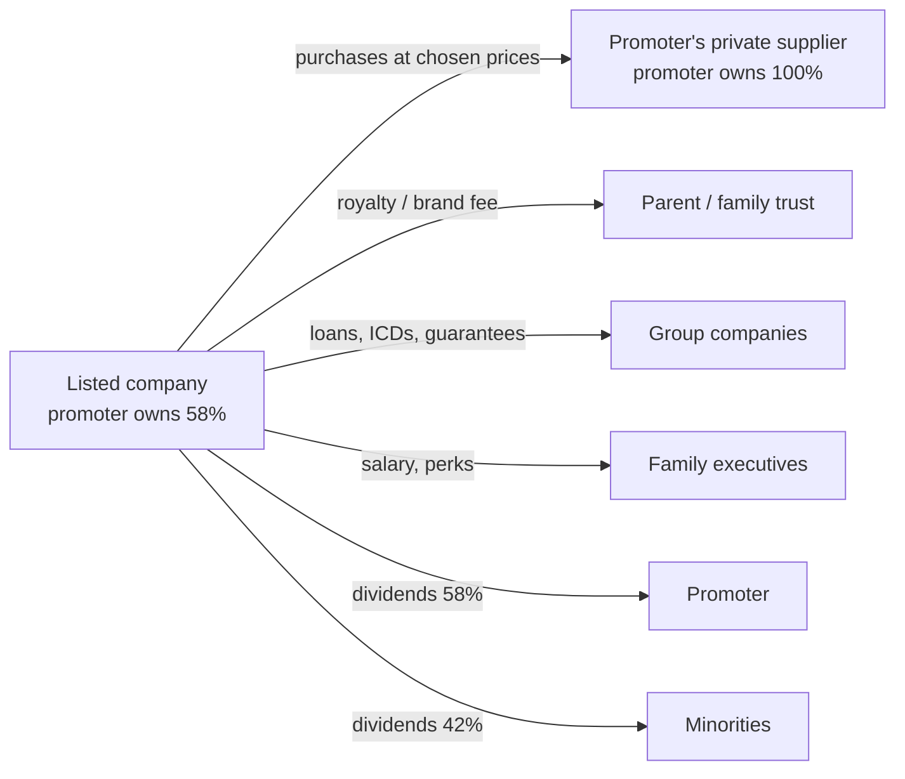

# 05.6 · Corporate governance — the India edition

> **Why this matters:** in most listed Indian companies a promoter family or group controls the board, appoints
> the auditor, sets the related-party terms and decides what minority shareholders are told. Your rights are
> whatever the law enforces plus whatever the promoter chooses to give you. Governance analysis is the discipline
> of estimating how much of the value you compute will actually reach you — and the Indian market's long list of
> Satyams, DHFLs, Manpasands and Vakrangees says that estimate is sometimes zero.

**Learning objectives** — after this lesson you can:

- Explain the promoter model, why it differs from dispersed-ownership governance, and where minority shareholders
  are exposed.
- Read related-party disclosures and apply the current SEBI thresholds for audit-committee and shareholder
  approval.
- Identify value leakage through royalties, brand fees, group structures, inter-corporate deposits and guarantees.
- Interpret pledges, board composition, auditor changes, remuneration and preferential issues as signals.
- Use SEBI enforcement history as data.
- Score a company on the "can I trust these numbers and these people?" checklist, and score Kaveri Pumps.

**Prerequisites:** [03.2 Anatomy of an annual report](../03-reading-filings/02-anatomy-of-an-annual-report.md),
[05.5 Management & capital allocation](05-management-and-capital-allocation.md)  ·  **Time:** ~100 min

---

## 1. The promoter model

Indian company law and SEBI regulations use the word **promoter** for the person or group that controls a company
(formally: named in the offer document, or in control of management or policy, or on whose advice the board acts).
Roughly three-quarters of NSE-listed companies are promoter-controlled, with median promoter holdings around 50%;
the rest are professionally managed (banks like HDFC and ICICI, ITC, L&T, Infosys after the founders) or
government-controlled (PSUs) or subsidiaries of multinationals.

Concentrated ownership solves the classic agency problem — managers wasting shareholders' money — because the
owner *is* the manager. It creates a different one: the **controlling shareholder versus minority shareholders**.
The promoter's incentives diverge from yours wherever they can capture value that does not flow through the listed
company's per-share earnings:

Every rupee that leaves through the top four arrows is 100% the promoter's; every rupee that reaches the bottom
two is shared 58/42. The arithmetic of divergence is that simple, and it is why the disclosures below exist.

## 2. Related-party transactions (RPTs)

A **related party** (Ind AS 24; Companies Act s.2(76); LODR Reg 2(1)(zb)) includes promoters and promoter group,
directors and KMP and their relatives, subsidiaries, associates, JVs, and entities they control or significantly
influence. The **RPT note** in the annual report lists transactions and balances by type and party.

### 2.1 The rules (as of September 2026)

| Rule | Requirement | Source |
|:--|:--|:--|
| Audit-committee approval | Every RPT of the listed entity, and RPTs of subsidiaries above thresholds, needs prior approval of the audit committee (independent directors only may vote); omnibus approvals allowed for a year | LODR Reg 23(2)–(3) |
| **Material RPT → shareholder approval** (related parties abstain) | Materiality is now **turnover-slabbed** under the SEBI (LODR) (Fifth Amendment) Regulations, 2025, effective 18-Nov-2025: consolidated turnover up to ₹20,000 Cr → 10% of turnover; ₹20,000–40,000 Cr → ₹2,000 Cr + 5% of turnover above ₹20,000 Cr; above ₹40,000 Cr → ₹3,000 Cr + 2.5% of the excess, capped at ₹5,000 Cr. Before this the test was the lower of ₹1,000 Cr or 10% of consolidated turnover | [SEBI board memorandum, Sep-2025](https://www.sebi.gov.in/sebi_data/meetingfiles/sep-2025/1758537908918_1.pdf); [Lexplosion summary](https://lexplosion.in/sebi-issues-sebi-lodr-fifth-amendment-regulations-2025-introduces-new-thresholds-for-determination-of-materiality-of-related-party-transactions/) |
| Subsidiary RPTs | Audit-committee approval where the transaction exceeds ₹1 Cr and the lower of 10% of the subsidiary's standalone turnover or the parent's materiality threshold | same |
| Brand/royalty payments | Payments to related parties for brand usage or royalty above 5% of consolidated turnover are material RPTs needing shareholder approval | LODR Reg 23(1A) |
| Disclosure | Half-yearly RPT disclosures to exchanges in SEBI's format; annual RPT note; AOC-2 in the Board's report for arm's-length exceptions | LODR Reg 23(9); Companies Act s.188 |

Verify these against the current LODR text on sebi.gov.in when you use them — RPT rules were amended in 2021, 2022
and 2025 and will be again.

### 2.2 Reading the note

For each material related party ask: *what* (goods, services, loans, guarantees, rent, royalty), *how much* relative
to the relevant base (revenue, costs, net worth), *trend* over five years, *pricing* ("at arm's length" is an
assertion, not evidence — compare margins with third-party equivalents), and *balances* (receivables from related
parties that never get collected are loans in disguise).

Kaveri: purchases from Kaveri Castings Pvt Ltd (100% promoter-owned) were ₹89.2 Cr in FY26, 10.4% of material cost
and 6.8% of revenue, up from 6.5% of material cost in FY21. Below the materiality threshold (10% of turnover ≈
₹132 Cr), so audit-committee approval suffices and shareholders never vote. The five-year trend is the point:
promoter-owned supply is growing faster than the company. Two legitimate explanations (captive quality, Hosur's
motor castings) and one illegitimate one (margin migration to the private entity) fit the same data; the concall
question is "what is Kaveri Castings' EBITDA margin, and would you disclose it?"

## 3. Where value leaks

| Channel | Mechanism | Where to see it | Red-flag threshold |
|:--|:--|:--|:--|
| **Royalty / brand / technical fees to parent** | MNC subsidiaries (and some Indian groups) pay the parent a % of sales for brand and technology | RPT note; Reg 23(1A) resolutions | Rising as % of sales; > 3–5% of sales; increases without new technology; note SEBI's 2023–24 push for shareholder votes |
| **Group structures & cross-holdings** | Listed company holds stakes in group companies or is held through layers of holding companies | Investments note; shareholding pattern; AOC-1 | Investments in unlisted group entities growing; circular holdings; holding-company discounts |
| **Inter-corporate deposits (ICDs) and loans to related parties** | Cash lent to group companies at low rates, often never repaid | Loans note; RPT note; CARO clause on loans to related parties | Any material ICD to a promoter entity; interest rate below the company's own cost of funds |
| **Corporate guarantees** | Listed company guarantees group-company debt | Contingent liabilities; RPT note | Any guarantee for a non-subsidiary group entity |
| **Purchases/sales with promoter entities** | Transfer pricing | RPT note | > 5% of costs/revenue, or rising trend (Kaveri) |
| **Rent, leases, aircraft, property** | Company rents premises or assets from promoters | RPT note | Above-market rents; leases of promoter property funded by company capex |
| **Family employment and remuneration** | Multiple family members as executives | Board's report remuneration table | Aggregate family pay > 5% of PAT; increases in loss years |
| **Preferential allotments and warrants to promoters** | Promoters subscribe to shares/warrants at a fixed price (SEBI floor based on recent VWAP) and exercise if the price rises, letting them lapse if not — a free call option (25% upfront, 75% on exercise for warrants) | Announcements; ICDR pricing | Warrants issued before good news; repeated allotments; allotments at prices far below your valuation |
| **Delisting / open-offer timing** | Promoter buys out minorities when the stock is depressed | Announcements | Delisting attempt after a bad year with a low floor price |

!!! info "India notes — MNC royalties"
    SEBI's 2023 consultation on royalty payments found many MNC subsidiaries paying rising royalties without
    obvious benefit; the response was to require shareholder approval for related-party royalty/brand payments
    above 5% of turnover (LODR Reg 23(1A)) and, from 2024, more granular disclosure. Compare royalty as a % of
    sales across MNC subsidiaries in the same sector — differences of 1–3 pp are direct transfers of value.

## 4. Signals: pledges, boards, auditors, pay, issuances

### 4.1 Promoter pledges

A **pledge** (or other "encumbrance") is promoter shares given as collateral for a loan — usually to the promoter or a
promoter entity, not to the listed company. Under SAST Reg 31 promoters must disclose creation, invocation or release
of encumbrances within seven working days, and must give **detailed reasons** where encumbered shares reach 50% of
their holding or 20% of the company's share capital; an annual declaration of no undisclosed encumbrance is also
required ([SEBI circular, Aug-2019](https://www.sebi.gov.in/legal/circulars/aug-2019/disclosure-of-reasons-for-encumbrance-by-promoter-of-listed-companies_43837.html);
[NSE Reg 31 filings](https://www.nseindia.com/companies-listing/corporate-filings-regulation-31)).

Why it matters: a pledged stock has a **margin-call feedback loop** — a price fall triggers lender selling, which
lowers the price, which triggers more selling. And the reason for the pledge tells you about the promoter's
liquidity: borrowing against the listed company to fund a private venture (Kaveri: a real-estate project) means the
promoter's private balance sheet now depends on the listed stock staying up. Thresholds used by practitioners:

| Pledge as % of promoter holding | Reading |
|:--|:--|
| 0% | Clean |
| < 10% | Note it; ask why |
| 10–30% | Meaningful; model the margin-call price if the lender's LTV is disclosed or assumable (typically 50% LTV on shares) |
| > 30% | Serious; the promoter is a forced seller in a drawdown; many collapses started here (Zee, Emami, Apollo Hospitals' promoters in 2019 deleveraged from ~75% pledges) |

### 4.2 Board composition

LODR requires at least one-third independent directors (half if the chair is an executive or a promoter), at least
one woman independent director for the top 1,000 companies, an audit committee with a majority of independents
chaired by one, and limits on the number of directorships. Compliance is universal; **effectiveness** is what you
assess:

- Independent directors' backgrounds: retired bureaucrats and the promoter's college friends vs people with domain
  and financial expertise who could actually challenge the CFO.
- Tenure: independents who have served two five-year terms are as independent as the law allows and often less so
  in practice.
- Resignations of independent directors before the end of a term — the reasons must now be disclosed
  (LODR 2019 amendment); "personal reasons" from two directors in a quarter is a signal.
- Attendance and the audit committee's minutes (not public, but the Board's report gives meeting counts).

### 4.3 Auditors

- **Who:** a Big-4 affiliate or large Indian firm auditing a large company is normal; a two-partner firm auditing a
  ₹5,000 Cr-revenue company is a question.
- **Rotation:** mandatory every 10 years (two five-year terms) for listed companies under the Companies Act, 2013 —
  rotation itself is not a signal (Kaveri's FY25 change was rotation).
- **Resignation mid-term:** since SEBI's October 2019 circular (now in the LODR master circular), a resigning auditor
  must give detailed reasons in a prescribed format, state whether information was withheld, and the company must
  disclose the reasons within 24 hours and the audit committee's views ([Vinod Kothari summary](https://vinodkothari.com/2019/11/sebi-on-resignation-of-auditors/);
  [SEBI LODR FAQs, Apr-2025](https://www.sebi.gov.in/sebi_data/faqfiles/apr-2025/1745399101865.pdf)). Read the
  disclosed reasons; "pre-occupation" and "unable to obtain sufficient information" mean different things.
  Manpasand and Vakrangee ([case I14](../13-case-studies/india/14-manpasand-vakrangee-small-cap-flags.md)) are the
  reference cases.
- **Opinions:** qualified opinions, emphasis-of-matter on going concern, adverse CARO remarks, and internal-controls
  weaknesses ([03.2](../03-reading-filings/02-anatomy-of-an-annual-report.md)).
- **Fees:** audit fee relative to company size and to non-audit fees paid to the same firm.

### 4.4 Remuneration, CFO/CS churn, disclosures

Managerial pay is capped at 11% of net profit unless shareholders approve more ([05.5](05-management-and-capital-allocation.md));
watch pay in loss years, pay increases outpacing profit, and family aggregates. Departures of the **CFO** or
**company secretary** — especially two within a year or just before results — precede many accounting problems;
LODR requires disclosure of KMP changes.

### 4.5 Preferential allotments and warrants

Promoters issuing themselves warrants at the regulatory floor price just before a run-up is a well-worn pattern;
so is a "strategic investor" preferential issue to an entity that turns out to be promoter-connected. Tests: was the
issue price below your valuation? Was there news within months that the promoter plausibly knew? Did the promoter
let warrants lapse when the price fell (an option they were given for 25% of the exercise price)?

## 5. The small-cap/SME "operator" pattern

Some listed companies exist mainly as vehicles for price manipulation. SEBI orders in 2023–26 have described the
mechanics repeatedly: a low-float company; promoters and connected entities trading among themselves to create
volume and price ("circular trading"); stock tips spread via Telegram/YouTube/social media; preferential allotments
to connected parties at low prices; announcements of orders, MoUs or "AI/EV/defence" pivots with no substance; then
distribution to retail followed by collapse. SME-exchange listings (BSE SME, NSE Emerge) with tiny floats have been
particularly affected, prompting SEBI's 2024–25 tightening of SME listing and migration rules (verify current norms).

Defensive tests: promoter holding trend and who the non-promoter large holders are (unknown private companies?);
delivery volumes vs traded volumes; whether announced orders show up in receivables and revenue; whether the
auditor is anyone you have heard of; whether the company appears in SEBI's orders or the exchanges' surveillance
lists (ASM/GSM — [01.4](../01-markets-101/04-indian-market-structure.md)).

## 6. SEBI enforcement history as data

SEBI publishes every order (adjudication, settlement, interim, final) on sebi.gov.in, searchable by entity name.
Before investing, search the company, its promoters and its group entities. Read what you find with care: a
settlement order is not an admission; an interim order is not a finding; a consent order from 2011 about a
disclosure lapse is different from a 2024 order about fund diversion. But a pattern of orders across group entities
is the single most under-used public data set in Indian equity analysis. The same goes for NCLT records (insolvency
petitions against the company or its group), the Registrar of Companies (MCA21: charges registered against assets,
unlisted group companies' financials), and the exchanges' fines for LODR non-compliance (listed on NSE/BSE sites).

## 7. The checklist: "Can I trust these numbers and these people?"

Score 0 (clean), 1 (watch), 2 (concern), 3 (disqualifying). Any 3, or a total above ~12, means do not invest until
resolved; 6–12 means a governance discount in the valuation (higher WACC or lower terminal multiple) and heavier
weighting of the bear case.

| # | Item | Test | Kaveri |
|:--|:--|:--|:--|
| 1 | Promoter holding and trend | Falling holding without a stated reason: 1–2; below 26% (loses special-resolution veto): watch | 58.4%, stable: 0 |
| 2 | Pledge | 0% → 0; < 10% → 1; 10–30% → 2; > 30% → 3 | 6%, new, for a private venture: 1 |
| 3 | RPT magnitude and trend | < 3% of costs/revenue: 0; 3–10% stable: 1; rising or > 10%: 2; opaque pricing of material RPTs: 3 | 10.4% of materials, rising five years, private entity margins undisclosed: 2 |
| 4 | Loans/ICDs/guarantees to group entities | None: 0; any material: 2–3 | None: 0 |
| 5 | Royalty/brand fees | None: 0; < 2% sales: 1; > 3% or rising: 2 | None: 0 |
| 6 | Board independence in substance | Domain-expert independents, chair separate: 0; box-ticking: 1; recent independent resignations with vague reasons: 2 | Not in the running example — read the report |
| 7 | Auditor | Large firm, rotation only: 0; small firm for a large company: 1; mid-term resignation: 2–3; qualified opinion: 2–3 | Mid-sized firm, rotated on schedule; KAM on receivables: 1 |
| 8 | CFO / CS changes | None: 0; one, explained: 1; two in 24 months: 2 | None disclosed: 0 |
| 9 | Managerial remuneration | < 3% of PAT: 0; 3–8%: 1; > 8% or up in a loss year: 2 | Not in the running example |
| 10 | Preferential issues / warrants to promoters | None in 5 years: 0; one at fair price: 1; repeated or before news: 2–3 | None: 0 |
| 11 | Disclosure quality | Consistent KPIs, honest calls: 0; KPIs dropped when bad: 1–2 | Receivable days withdrawn in Q1 FY27: 1 |
| 12 | SEBI / regulatory / NCLT history | Clean: 0; minor procedural: 1; substantive order against promoters: 3 | Clean (fictional): 0 |
| 13 | Capital allocation vs minority interest | Dividends from FCF, buybacks below value: 0; buybacks at peaks, dividends funding promoter needs: 1–2 | 25% payout from CFO: 0 |
| 14 | Contingent liabilities and disputes | Small, explained: 0; material tax disputes: 1; regulatory disputes about the business model: 2 | GST classification dispute ₹38 Cr (42% of PAT): 1 |
| | **Total (of items scorable from the running example)** | | **7 → governance discount, not disqualification** |

The practical translation for Kaveri: the reference valuation's WACC of 12.19% is the *market* cost of capital for
a company of its risk; a governance-adjusted analyst might use 13% or weight the bear case 35% rather than 25%.
The reverse DCF in [06.6](../06-valuation/06-reverse-dcf-and-expectations.md) shows what those changes do to the
implied growth.

!!! tip "Trader's lens"
    Governance risk is a jump process, not a diffusion. It does not show up in daily vol until the day it does —
    an auditor resignation, a SEBI order, a pledge invocation — and then the stock gaps 20–60% with no liquidity to
    exit. That is why it cannot be hedged after the fact and why it belongs in position sizing before entry
    ([11.4](../11-process/04-position-sizing-and-portfolio-construction.md)): a small position in a governance-flagged
    name is a tail-risk premium you are collecting, and you should size it like one.

!!! warning "Common mistakes"
    - Treating "at arm's length" in the RPT note as verified.
    - Ignoring a small pledge because it is small — the *reason* is the information.
    - Assuming a Big-4 auditor guarantees the numbers (Satyam had PwC; Wirecard had EY).
    - Reading only the listed company's filings and not the group's (MCA21, SEBI orders, NCLT).
    - Applying a governance discount and then forgetting it in the terminal value.
    - Confusing compliance (every LODR box ticked) with governance.

## Key terms

| Term | Meaning |
|:--|:--|
| **Promoter / promoter group** | The controlling person(s) of a company and their connected entities, as defined by SEBI |
| **Minority shareholders** | Public shareholders without control |
| **Related party / RPT** | Persons or entities connected to the company's controllers; transactions with them |
| **Material RPT** | An RPT above SEBI's turnover-slabbed threshold, requiring shareholder approval with related parties abstaining |
| **Arm's length** | Terms equivalent to those with an unrelated party — asserted by the company, to be tested by you |
| **Royalty / brand fee** | Payment by a subsidiary to its parent for technology or brand use |
| **Inter-corporate deposit (ICD)** | A loan from one company to another, often within a group |
| **Corporate guarantee** | A company's promise to cover another entity's debt |
| **Pledge / encumbrance** | Promoter shares given as loan collateral; disclosed under SAST Reg 31 |
| **Invocation** | The lender selling pledged shares after a margin call |
| **Independent director** | A board member with no material relationship to the company or promoters, as defined by LODR |
| **Key managerial personnel (KMP)** | CEO/MD, CFO, company secretary, whole-time directors |
| **Preferential allotment / warrants** | Issue of shares or share-purchase rights to selected investors at a regulated floor price |
| **AOC-1 / AOC-2** | Companies Act forms listing subsidiaries' financials / non-arm's-length RPTs |
| **ASM / GSM** | Exchange surveillance frameworks that restrict trading in suspect stocks |

## Check your understanding

1. A company with ₹8,000 Cr consolidated turnover proposes ₹700 Cr of annual purchases from a promoter entity. Who
   must approve, under the 2025 rules?

Answer
The materiality threshold is 10% of turnover = ₹800 Cr; ₹700 Cr is below it, so
audit-committee approval (independent directors) suffices and shareholders do not vote. Under the pre-Nov-2025 rule
(lower of ₹1,000 Cr or 10% = ₹800 Cr) the answer was the same — but at ₹900 Cr both rules would require a
shareholder vote with the promoter abstaining.

2. Why is a 6% pledge for a promoter's private real-estate venture more informative than a 15% pledge to fund a
   rights-issue subscription in the listed company?

Answer
The second puts the promoter's borrowed money *into* the company alongside
minorities — aligned. The first pulls value out of the listed stock's collateral capacity to support an
unrelated venture; if that venture needs more money, the promoter's next moves (higher dividends, RPTs, more pledges)
diverge from minority interests. Size matters less than direction.

3. An auditor resigns citing "pre-occupation with other assignments" two weeks before annual results. What do you do?

Answer
Read the mandatory resignation format the company must file (detailed reasons; whether
any information was sought and not provided; efforts made) and the audit committee's views (both within 24 hours).
Timing before results and a generic reason together are a strong red flag; treat as a 2–3 on the checklist and do
not rely on the next set of accounts until a reputable replacement signs them.

4. Give three ways a listed company's cash can end up supporting a promoter's private business, and where each is
   disclosed.

Answer
Purchases from a promoter-owned supplier at generous prices (RPT note); loans/ICDs
or advances to group entities (loans note, RPT note, CARO); corporate guarantees for group debt (contingent
liabilities, RPT note). A fourth: dividends sized to the promoter's debt service — visible only by combining payout
trend with the promoter's pledge disclosures.

5. How should a governance score of 7 change a valuation, mechanically?

Answer
Through the probability weights and the discount rate, not by hand-waving: e.g.,
raise WACC 50–100 bps (12.19% → ~13%) to reflect the higher required return, and/or shift scenario weights toward
the bear case (25% → 35%). For Kaveri, the WACC change alone moves the base value from ₹320 toward ~₹280 (see the
sensitivity grid in the reference valuation) — a quantified governance discount.

6. Why does compliance with every LODR requirement not establish good governance?

Answer
LODR sets minimums (board ratios, committee structures, disclosure timelines) that
every listed company meets on paper. Governance is whether the independent directors challenge, whether the
auditor is capable, whether RPTs are priced fairly, whether minorities' interests drive capital allocation. Satyam
was fully compliant, with a celebrated board, until January 2009.

## Go deeper

- SEBI (LODR) Regulations, 2015 as amended — Regulations 17–27 (board, committees, RPTs) and Schedule XIII
  (RPT materiality, 2025); the primary text on sebi.gov.in.
- SEBI (SAST) Regulations, 2011, Regulation 31 and the August 2019 circular on encumbrance reasons.
- Institutional investor advisory reports (IiAS, SES, InGovern) on AGM resolutions — professional proxy analysis of
  Indian RPTs, remuneration and issuances; many are free.
- Case studies [I1 Satyam](../13-case-studies/india/01-satyam-2009.md), [I14 Manpasand & Vakrangee](../13-case-studies/india/14-manpasand-vakrangee-small-cap-flags.md),
  [I9 Adani–Hindenburg](../13-case-studies/india/09-adani-hindenburg-2023.md).
- Sources for this lesson: [SEBI board memorandum on RPT amendments (Sep-2025)](https://www.sebi.gov.in/sebi_data/meetingfiles/sep-2025/1758537908918_1.pdf);
  [Vinod Kothari on the 2025 RPT relaxations](https://vinodkothari.com/2025/11/sebi-approves-relaxed-norms-on-rpts/);
  [SEBI circular on encumbrance reasons (Aug-2019)](https://www.sebi.gov.in/legal/circulars/aug-2019/disclosure-of-reasons-for-encumbrance-by-promoter-of-listed-companies_43837.html);
  [SEBI LODR FAQs (Apr-2025)](https://www.sebi.gov.in/sebi_data/faqfiles/apr-2025/1745399101865.pdf).

---
[← Previous: 05.5 Management & capital allocation](05-management-and-capital-allocation.md) · [Module index](index.md) · [Next: 05.7 Scuttlebutt & primary research →](07-scuttlebutt-and-primary-research.md)
