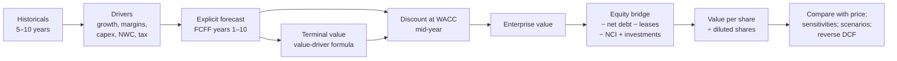

# 06.3 · DCF step by step

> **Why this matters:** a discounted-cash-flow model is the only valuation method that forces you to write down
> every assumption — growth, margins, reinvestment, risk, duration — and see what they add up to. Its output is
> less important than its discipline. This lesson builds the Kaveri Pumps reference DCF line by line so that you can
> reproduce ₹320 per share, understand where each rupee of that value comes from, and then build your own for any
> company.

**Learning objectives** — after this lesson you can:

- Choose between FCFF and FCFE and explain what each discounts.
- Build a driver-based forecast (revenue, margins, D&A, capex, working capital, tax) with an explicit period and
  a fade.
- Compute terminal value correctly with the value-driver form (reinvestment = g/RONIC), and explain why an exit
  multiple smuggles in relative valuation.
- Apply mid-year discounting and build the equity bridge (net debt, leases, minorities, investments, dilution).
- Reproduce the Kaveri reference valuation with `tools/fi/valuation.py` and decompose its value by source.

**Prerequisites:** [06.1 What value is](01-what-is-value.md), [06.2 Cost of capital](02-cost-of-capital.md),
[04.4 Working capital & cash conversion](../04-financial-analysis/04-working-capital-and-cash-conversion.md)  ·  **Time:** ~120 min

---

## 1. The architecture



Six steps. Every one has a conventional choice and a trap; the sections below take them in order using Kaveri.

## 2. Step 1 — FCFF or FCFE?

| | FCFF (free cash flow to the firm) | FCFE (free cash flow to equity) |
|:--|:--|:--|
| Cash flow | NOPAT + D&A − capex − ΔNWC | PAT + D&A − capex − ΔNWC + net borrowing |
| Discount rate | WACC | Cost of equity |
| Result | Enterprise value → subtract net debt to get equity | Equity value directly |
| Use when | Capital structure is stable or changing predictably; most industrials | Leverage is the business (banks — but use dividends/residual income there), or the debt schedule is the point (LBO-style) |
| Trap | Forgetting the bridge items | Net borrowing assumptions drive the answer and are easy to game |

The course uses **FCFF** for non-financials and equity-side methods for lenders ([07.1](../07-special-valuation/01-banks-and-nbfcs.md)).
The two must give the same equity value if the assumptions are consistent; when they differ, the debt assumptions
are inconsistent.

$$\text{FCFF}_t = \underbrace{\text{EBIT}_t(1 − t)}_{\text{NOPAT}} + \text{D\&A}_t − \text{Capex}_t − \Delta\text{NWC}_t$$

Note what is *not* subtracted: interest (it is in WACC), dividends (a distribution, not an operating flow), and
other income (excluded from EBIT; the cash and investments that produce it are added in the bridge).

## 3. Step 2 — the forecast drivers

A forecast is a set of drivers, not a set of numbers. For Kaveri the reference case (valuation date 31-Mar-2026,
base year FY26) uses:

| Driver | FY27 | FY28 | FY29 | FY30 | FY31 | FY32 | FY33 | FY34 | FY35 | FY36 | Reasoning |
|:--|--:|--:|--:|--:|--:|--:|--:|--:|--:|--:|:--|
| Revenue growth | 10% | 14% | 14% | 13% | 12% | 11% | 10% | 9% | 8% | 7% | FY27 cut below the 15–18% guidance after the weak Q1; recovery as solar dues clear and Hosur ramps; fade toward nominal GDP |
| EBITDA margin | 13.3% | 14.2% | 14.8% | 15.2% | 15.5% | 15.5% | 15.5% | 15.5% | 15.5% | 15.5% | Recovery from 13.8% (FY26) toward the FY24 peak as motors utilisation rises and mix stabilises; capped at the best peer's level |
| D&A / revenue | 3.4% | ← constant | | | | | | | | | FY26 actual 3.6%; slight decline as revenue grows on a fixed asset base |
| Capex / revenue | 3.5% | ← constant | | | | | | | | | ≈ D&A + modest growth capex; Hosur at 57% utilisation means no new plant this decade |
| NWC / revenue | 25% | 23% | 22% | ← constant | | | | | | | FY26 actual 27.7%; assumes receivable days fall from 96 toward ~80 as state dues normalise — the single most important operating assumption |
| Tax rate | 25.17% | ← constant | | | | | | | | | Section 115BAA |

Principles behind the choices:

- **Anchor on history, then explain every departure.** FY26 EBITDA margin was 13.8%; forecasting 15.5% requires a
  reason (utilisation, mix) and a ceiling (best peer 16.8%).
- **Fade toward the economy.** No company grows 14% for ever; by year 10 growth is at nominal GDP (6–7%). The fade
  should be visible and gradual.
- **Reinvestment must be consistent with growth.** Capex and NWC drivers imply a reinvestment rate; check it
  against the growth using $g = \text{RR} \times \text{ROIC}$ ([04.3](../04-financial-analysis/03-returns-on-capital.md)).
  A model with 14% growth and 2% capex is claiming a return on new capital that should make you suspicious.
- **Ten years, not five,** for a company whose growth is well above the terminal rate — the fade needs room, and a
  short explicit period pushes too much value into the terminal assumption.

## 4. Step 3 — the explicit forecast

Running the drivers through the arithmetic (₹ Cr; this is the table on the
[reference page](../appendix/running-example/kaveri-valuation.md), produced by `tools/running_example/valuation.py`):

| ₹ Cr | FY27 | FY28 | FY29 | FY30 | FY31 | FY32 | FY33 | FY34 | FY35 | FY36 |
|:--|--:|--:|--:|--:|--:|--:|--:|--:|--:|--:|
| Revenue | 1,449.8 | 1,652.8 | 1,884.2 | 2,129.1 | 2,384.6 | 2,646.9 | 2,911.6 | 3,173.6 | 3,427.5 | 3,667.4 |
| EBITDA | 192.8 | 234.7 | 278.9 | 323.6 | 369.6 | 410.3 | 451.3 | 491.9 | 531.3 | 568.5 |
| D&A | 49.3 | 56.2 | 64.1 | 72.4 | 81.1 | 90.0 | 99.0 | 107.9 | 116.5 | 124.7 |
| EBIT | 143.5 | 178.5 | 214.8 | 251.2 | 288.5 | 320.3 | 352.3 | 384.0 | 414.8 | 443.8 |
| NOPAT = EBIT × 0.7483 | 107.4 | 133.6 | 160.7 | 188.0 | 215.9 | 239.7 | 263.6 | 287.4 | 310.3 | 332.1 |
| Capex | 50.7 | 57.8 | 65.9 | 74.5 | 83.5 | 92.6 | 101.9 | 111.1 | 120.0 | 128.4 |
| Net working capital | 362.5 | 380.1 | 414.5 | 468.4 | 524.6 | 582.3 | 640.5 | 698.2 | 754.0 | 806.8 |
| Increase in NWC | (2.6) | 17.7 | 34.4 | 53.9 | 56.2 | 57.7 | 58.2 | 57.6 | 55.9 | 52.8 |
| **FCFF** | **108.5** | **114.2** | **124.5** | **132.0** | **157.3** | **179.3** | **202.5** | **226.5** | **251.1** | **275.6** |

FY26 NWC is 188.1 + 346.7 + 39.5 − 143.4 − 65.9 = ₹365.0 Cr (27.7% of revenue). FY27's target of 25% *releases*
₹2.6 Cr of cash even as revenue grows — the working-capital normalisation is doing real work in the early years.
Check FY27: 107.4 + 49.3 − 50.7 + 2.6 = 108.6 ≈ 108.5 (rounding). FCFF is ~₹109 Cr against FY26 reported FCF of
₹13 Cr; the whole difference is the assumption that receivables stop growing faster than sales. If that assumption
is wrong, so is the valuation — which is why [06.4](04-dcf-in-practice.md) stresses it.

```python
from fi.valuation import dcf_from_drivers, kaveri_base_drivers
base = dcf_from_drivers(**kaveri_base_drivers())
print(base["projection"].round(1))          # the table above
print(round(base["per_share"]))             # 320
```

## 5. Step 4 — terminal value

After FY36 the model assumes steady state: growth $g$ = 5.5% for ever (≈ 4% inflation + 1.5% real; below nominal
GDP, as a perpetuity must be), and a return on new invested capital **RONIC = 18%** — above the 12.19% WACC,
reflecting a modest brand/dealer advantage in the core business ([05.3](../05-business-analysis/03-moats-and-competitive-advantage.md)).

The reinvestment needed to grow at 5.5% with an 18% return is $g/\text{RONIC}$ = 30.6% of NOPAT:

$$\text{FCFF}_{FY37} = \text{NOPAT}_{FY36}(1+g)\left(1 − \frac{g}{\text{RONIC}}\right) = 332.1 \times 1.055 \times 0.694 = 243.3$$

$$\text{TV}_{FY36} = \frac{\text{FCFF}_{FY37}}{\text{WACC} − g} = \frac{243.3}{0.1219 − 0.055} = 3{,}638.7$$

```python
from fi.valuation import terminal_value
tv = terminal_value(nopat_next=332.1 * 1.055, r=0.1219, g=0.055, ronic=0.18)   # 3638.7
```

Two ways to get this wrong:

- **Growing FCFF instead of NOPAT.** Taking FY36 FCFF (275.6) × 1.055 / (WACC − g) = ₹4,347 Cr assumes the FY36
  reinvestment rate (17%) persists — but a 17% reinvestment at 18% return only supports ~3% growth, not 5.5%. The
  value-driver form keeps growth and reinvestment consistent; the naive form gives a free lunch worth ~₹37/share here (the extra ₹708 Cr of terminal value, discounted ten years).
- **Exit multiples.** "Apply 12x EBITDA to FY36 EBITDA" = 568.5 × 12 = ₹6,822 Cr — nearly double. An exit multiple
  imports today's market pricing (a relative valuation) into a supposedly intrinsic model, and typically assumes the
  company is still a growth stock in year 10. Use it only as a cross-check: the reference TV implies an exit multiple
  of 3,638.7 / 568.5 = **6.4x EBITDA** — which *is* what a 5.5%-growth, 15.5%-margin industrial should trade at.

## 6. Step 5 — discounting

The valuation date is 31-Mar-2026. Cash flows arrive through each year, not at its end, so the **mid-year
convention** discounts year $t$ at $(1+\text{WACC})^{t−0.5}$:

| | FY27 | FY28 | FY29 | FY30 | FY31 | FY32 | FY33 | FY34 | FY35 | FY36 |
|:--|--:|--:|--:|--:|--:|--:|--:|--:|--:|--:|
| Discount factor | 0.9441 | 0.8416 | 0.7502 | 0.6687 | 0.5960 | 0.5313 | 0.4736 | 0.4221 | 0.3763 | 0.3354 |
| PV of FCFF | 102.4 | 96.1 | 93.4 | 88.3 | 93.8 | 95.3 | 95.9 | 95.6 | 94.5 | 92.4 |

Sum of PV of explicit FCFF = **₹947.7 Cr**. The terminal value sits at end-FY36 and is discounted a full ten years:
3,638.7 / 1.1219¹⁰ = **₹1,152.3 Cr**.

```python
from fi.valuation import dcf_fcff
fcffs = [108.5, 114.2, 124.5, 132.0, 157.3, 179.3, 202.5, 226.5, 251.1, 275.6]
d = dcf_fcff(fcffs, r=0.1219, tv=3638.7, mid_year=True)
print(round(d["pv_explicit"], 1), round(d["pv_tv"], 1), round(d["ev"], 1), round(d["tv_share"], 2))
# 947.7  1152.3  2100.0  0.55
```

**Enterprise value = 947.7 + 1,152.3 = ₹2,100.0 Cr**, of which 55% is terminal value. For a company growing 10–14%
for a decade, 50–65% is normal; above 75% means the explicit forecast is doing little and the valuation is really a
bet on the terminal assumptions.

## 7. Step 6 — the equity bridge and per-share value

Enterprise value is the value of the *operations*. Shareholders get what is left after every other claim, plus any
assets the operations do not use:

| Item | ₹ Cr | Source and treatment |
|:--|--:|:--|
| Enterprise value | 2,100.0 | |
| − Borrowings (non-current + current) | (188.0) | Balance sheet, 31-Mar-2026 |
| + Cash and current investments | 47.5 | Excluded from invested capital, so added back here; "net debt" = 188.0 − 47.5 = 140.5 |
| − Lease liabilities | (18.2) | Debt-like; EBIT was struck after ROU amortisation but before lease interest, so leases must come out here |
| − Non-controlling interests | 0 | None at Kaveri; if present, subtract at market or book value |
| + Non-operating investments (associates, land, stakes) | 0 | Kaveri's ₹18 Cr land sale is gone; any surplus land or associate stake would be added at value |
| − Probability-weighted contingent liabilities | 0 in the reference | An analyst might subtract ~50% of the ₹38 Cr GST demand (₹19 Cr, ≈ ₹3/share) |
| − Provisions/unfunded pension | 0 | If material, treat as debt |
| **Equity value** | **1,941.3** | |
| ÷ Diluted shares (Cr) | 6.07 | 6.00 basic + ESOPs (treasury-stock method) |
| **Value per share** | **₹320** | vs ₹390 market price (18-Sep-2026): −18% |

```python
from fi.valuation import equity_bridge
eq = equity_bridge(ev=2100.0, net_debt=140.5, leases=18.2)      # 1941.3
print(round(eq / 6.07))                                           # 320
```

Timing note: the valuation date is 31-Mar-2026 but the price is from September. Rolling the value forward six
months at the cost of equity gives ≈ ₹338 — still 13% below the price. The reference page ignores the roll-forward
for simplicity; mention it when the gap between valuation date and price date is material.

## 8. Where the value comes from — a decomposition

A DCF is more useful taken apart than whole:

| Source | ₹ Cr | Share of EV | Per share |
|:--|--:|--:|--:|
| PV of FCFF, FY27–FY31 (the "visible" years) | 474.0 | 23% | ₹78 |
| PV of FCFF, FY32–FY36 | 473.7 | 23% | ₹78 |
| PV of terminal value | 1,152.3 | 55% | ₹190 |
| **EV** | **2,100.0** | | |
| Less net debt and leases | (158.7) | | (₹26) |
| **Equity** | **1,941.3** | | **₹320** |

And by assumption (each one changed alone, everything else at base):

| If instead… | Value / share | Δ |
|:--|--:|--:|
| NWC stays at 27.7% of revenue for ever (receivables never normalise) | ≈ ₹297 | −₹23 |
| EBITDA margin plateaus at 14.0% not 15.5% | ≈ ₹277 | −₹43 |
| RONIC 12.19% (= WACC; no moat in the terminal) | ≈ ₹280 | −₹40 |
| WACC 12.74% (today's 7.07% G-sec) | ≈ ₹293 | −₹27 |
| Growth path 3 pp higher every year | ≈ ₹389 | +₹69 |

```python
d = kaveri_base_drivers()
print(round(dcf_from_drivers(**{**d, "nwc_pct": [0.277] * 10})["per_share"]))
print(round(dcf_from_drivers(**{**d, "ebitda_margin": [0.133, 0.138, 0.14] + [0.14] * 7})["per_share"]))
print(round(dcf_from_drivers(**{**d, "ronic": d["wacc"]})["per_share"]))
print(round(dcf_from_drivers(**{**d, "wacc": 0.1274})["per_share"]))
print(round(dcf_from_drivers(**{**d, "growth": [g + 0.03 for g in d["growth"]]})["per_share"]))
```

Margin and the moat assumption (RONIC) are the largest levers, then the cost of capital, then working capital —
roughly the order in which [Modules 04–05](../05-business-analysis/index.md) told you to spend research time. A DCF that ends with one
number has told you less than one that ends with this table.

!!! tip "Trader's lens"
    A DCF is a pricing model, and like any pricing model its value is in the Greeks, not the price. The
    decomposition above is the equivalent of vega, delta and theta: how much value moves per unit of each input.
    Trade the inputs you have a view on (receivables normalisation, margin recovery); hedge or avoid the ones you
    don't (WACC drift). And remember the model's convexity: value is convex in growth and in (WACC − g), so
    symmetric input errors produce asymmetric valuation errors — sensitivity tables, not point estimates.

!!! info "India notes"
    - Indian annual reports give you the March balance sheet; the valuation date is normally 31-March. Roll forward
      to the current date at the cost of equity, or restate net debt from the latest quarterly balance sheet (only
      half-yearly balance sheets are mandatory under LODR — verify what the company publishes).
    - Lease liabilities under Ind AS 116 are in the bridge; do not also add lease payments back to FCFF.
    - Dilution: use the ESOP note (SBEB disclosures) for the treasury-stock count; for companies with promoter
      warrants outstanding, add those shares and the exercise cash.
    - Contingent liabilities (tax disputes) are unusually large for many Indian companies; decide explicitly whether
      to probability-weight them into the bridge.

!!! warning "Common mistakes"
    - g ≥ WACC in the terminal (infinite value), or g above long-run nominal GDP.
    - Terminal FCFF grown from the last explicit FCFF without resetting reinvestment to g/RONIC.
    - Exit multiples as the primary terminal method.
    - Forgetting mid-year discounting (understates value ~6%), or applying it to the terminal value twice.
    - Subtracting gross debt but forgetting cash; or netting off cash that is not really available.
    - Ignoring leases, minorities, or dilution in the bridge.
    - A five-year explicit period for a company growing 14% — the fade never happens and the terminal carries 80%.
    - Presenting a point estimate without the decomposition and sensitivities.

## Key terms

| Term | Meaning |
|:--|:--|
| **DCF** | Discounted cash flow: value = PV of forecast cash flows plus PV of terminal value |
| **FCFF / FCFE** | Free cash flow to the firm (all capital providers) / to equity holders |
| **Explicit forecast period** | The years modelled driver by driver before steady state |
| **Fade** | The gradual decline of growth and returns toward long-run levels across the explicit period |
| **Terminal value** | Value at the end of the explicit period of all subsequent cash flows |
| **Value-driver terminal** | $\text{NOPAT}_{n+1}(1 − g/\text{RONIC})/(\text{WACC} − g)$ |
| **Exit multiple** | Terminal value set as a multiple of year-n EBITDA/EBIT — a relative-valuation shortcut |
| **Mid-year convention** | Discounting each year's cash flow by $t − 0.5$ years to reflect intra-year receipt |
| **Enterprise value (DCF)** | PV of FCFF + PV of terminal value; the value of operations |
| **Equity bridge** | EV − net debt − leases − NCI − other claims + non-operating assets |
| **Treasury-stock method** | Diluted share count from options: shares issued minus shares repurchasable with the exercise proceeds |
| **Roll-forward** | Adjusting a valuation from its date to today at the cost of equity |
| **Value decomposition** | Attribution of value to periods and to individual assumptions |

## Check your understanding

1. Reproduce the FY30 FCFF from the drivers (revenue ₹2,129.1 Cr).
<details><summary>Answer</summary>EBITDA = 2,129.1 × 15.2% = 323.6; D&A = 3.4% × 2,129.1 = 72.4; EBIT = 251.2; NOPAT =
251.2 × 0.7483 = 188.0; capex = 3.5% × 2,129.1 = 74.5; NWC = 22% × 2,129.1 = 468.4, up 53.9 from FY29's 414.5;
FCFF = 188.0 + 72.4 − 74.5 − 53.9 = 132.0 ✓.</details>

2. Recompute the terminal value with g = 5.5% but RONIC = 12.19% (no excess return). Why does the per-share value
   fall to ~₹280?
<details><summary>Answer</summary>Reinvestment = 5.5/12.19 = 45.1% of NOPAT; FCFF₃₇ = 350.4 × 0.549 = 192.3; TV =
192.3 / 0.0669 = 2,874 (vs 3,639); the PV of the terminal falls by ~₹242 Cr → ≈ ₹40/share less, i.e. ≈ ₹280. With RONIC = WACC, growth adds nothing — the terminal is worth 1/WACC × NOPAT.</details>

3. What is the implied exit EV/EBITDA multiple of the reference terminal value, and is it reasonable?
<details><summary>Answer</summary>3,638.7 / 568.5 = 6.4x FY36 EBITDA. For a mature industrial growing at 5.5% with
15.5% margins and RONIC 18%, 6–8x is reasonable; today's 22x is a growth multiple that cannot persist into a
perpetuity.</details>

4. Kaveri's FY26 FCF was ₹13 Cr; the model's FY27 FCFF is ₹109 Cr. Name the two assumptions that account for the
   jump and how you would test them.
<details><summary>Answer</summary>(1) NWC falling from 27.7% to 25% of revenue (releases ~₹2.6 Cr instead of
absorbing ~₹90 Cr): test via receivable days each quarter and the >6-month ageing bucket. (2) Capex at 3.5% of revenue
(₹51 Cr) vs FY26's ₹52 Cr with revenue 10% higher — modest. Almost all of the jump is working capital; if FY27
receivable days stay at 96, FCFF is closer to ₹40–50 Cr.</details>

5. Why does the bridge subtract lease liabilities even though the model already charged ROU amortisation?
<details><summary>Answer</summary>Because EBIT (and hence FCFF) is before lease *interest* — leases are treated as
debt financing, consistent with Ind AS 116. The amortisation is the operating cost of using the asset; the liability
is the financing. Subtracting it is the same logic as subtracting borrowings.</details>

6. Explain in one sentence why the reference DCF says ₹320 while the price is ₹390, without using the word "wrong".
<details><summary>Answer</summary>The price requires either faster growth (~14% for ten years), a higher terminal
return, a lower cost of capital or a faster working-capital recovery than the base case assumes — and the next
lesson's sensitivity and the reverse DCF in [06.6](06-reverse-dcf-and-expectations.md) say exactly which.</details>

## Go deeper

- McKinsey, *Valuation*, Part Two (Core Valuation Techniques) — the reference for every step here.
- Aswath Damodaran, *The Dark Side of Valuation* — DCFs for difficult companies (young, cyclical, financial).
- `tools/running_example/valuation.py` and `tools/examples/kaveri_dcf_and_reverse_dcf.py` — read the code; every
  number on this page comes from it.
- [Module 10](../10-modeling/index.md) — building the same forecast as a full three-statement model.

---
[← Previous: 06.2 Cost of capital](02-cost-of-capital.md) · [Module index](index.md) · [Next: 06.4 DCF in practice →](04-dcf-in-practice.md)
