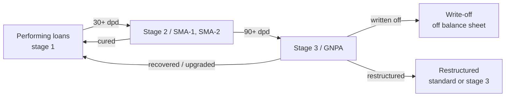

# 07.1 · Banks & NBFCs

> **Why this matters:** lenders are a third of India's market capitalisation and most of its financial history —
> HDFC Bank's compounding, Yes Bank's collapse, Bajaj Finance's re-rating, DHFL's default. None of it can be
> understood with the tools of Modules 04–06, because for a lender debt is not financing, it is raw material; there
> is no EBITDA, no free cash flow to the firm and no meaningful enterprise value. This lesson rebuilds the toolkit
> for the balance sheet that *is* the business, using Nirmal Finance as the worked example.

**Learning objectives** — after this lesson you can:

- Explain why EV/EBITDA and FCFF-DCF fail for lenders and what replaces them.
- Read a lender's P&L and balance sheet: NII, NIM, yield, cost of funds, CASA, cost-to-income, credit cost, PPOP.
- Analyse asset quality: GNPA/NNPA, provision coverage, slippages, write-offs, restructuring, stage 1/2/3 under ECL;
  and state where Indian banks and NBFCs stand on ECL as of 2026.
- Assess capital (CRAR, Tier-1), liquidity (LCR) and asset-liability management.
- Build the RoA tree and convert it to RoE via leverage.
- Value a lender by justified P/B, residual income and P/ABV, and do it for Nirmal Finance at ₹402.

**Prerequisites:** [06.5 Relative valuation](../06-valuation/05-relative-valuation-and-multiples.md),
[06.7 Other valuation methods](../06-valuation/07-other-valuation-methods.md)  ·  **Time:** ~120 min

---

## 1. Why the industrial toolkit breaks

| Industrial concept | Why it fails for a lender | Replacement |
|:--|:--|:--|
| Revenue | Interest income is gross of the cost of the money lent; a bank that borrows at 6% and lends at 9% has "revenue" of 9% but earns 3% | **Net interest income** (interest earned − interest paid) |
| EBITDA | Interest expense is the cost of goods, not financing; excluding it is meaningless | **Pre-provision operating profit (PPOP)** |
| Free cash flow | Loan growth is an "investing" outflow that *is* the business; CFO swings with deposit flows | Earnings, book value, and the capital the regulator requires |
| Enterprise value / net debt | Deposits and borrowings are operating liabilities; "net debt" is the whole balance sheet | **Equity value and P/B** |
| WACC | No meaningful split between operating and financing capital | **Cost of equity** only |
| Working capital | Not applicable | **ALM** (matching the tenor of assets and liabilities) |

Everything about a lender is on its balance sheet: a book of loans (assets) funded by deposits or borrowings
(liabilities) and a thin slice of equity, with regulation setting how thin. Profit is a small spread on a large
book; risk is the chance that the spread is eaten by credit losses or that the funding disappears.

## 2. The lender's statements — Nirmal Finance FY26

From the [running example](../appendix/running-example/nirmal-finance.md) (₹ Cr):

| P&L line | FY25 | FY26 | As % of avg assets (FY26) | What it is |
|:--|--:|--:|--:|:--|
| Interest income | 901.3 | 1,073.2 | 15.7% | Yield on loans (16.9% of avg loans) |
| Interest expense | 376.5 | 442.1 | 6.5% | Cost of funds (8.7% of avg borrowings) |
| **Net interest income (NII)** | **524.8** | **631.1** | **9.2%** | The spread; NIM = NII / avg loans = 9.9% |
| Fees & other income | 41.9 | 50.8 | 0.7% | Processing fees, insurance distribution |
| Operating expenses | 204.4 | 241.3 | 3.5% | Branches, staff, collections, tech; cost-to-income = 241.3 / 681.9 = 35.4% |
| **PPOP** | **362.3** | **440.6** | **6.4%** | Profit before credit losses — the "underwriting cushion" |
| Impairment (credit cost) | 83.8 | 120.6 | 1.8% | ECL provisions + write-offs; 1.9% of avg loans |
| PBT | 278.5 | 320.0 | 4.7% | |
| Tax | 70.1 | 80.5 | 1.2% | |
| **PAT** | **208.4** | **239.5** | **3.5%** | **= RoA** |

| Balance sheet (31-Mar-2026) | ₹ Cr | Notes |
|:--|--:|:--|
| Gross loans (AUM, on-book) | 6,920.0 | +20% YoY; used CV 55%, tractors 20%, MSME LAP 25% |
| Less ECL allowance | (170.9) | Stage 1+2: 60.5; stage 3: 110.4 |
| Net loans | 6,749.1 | |
| Cash, bank, liquid investments | 560.0 | Liquidity buffer ≈ 10% of borrowings |
| Other assets | 124.6 | |
| **Total assets** | **7,433.7** | |
| Borrowings | 5,565.4 | Bank term loans 58%, NCDs 24%, securitisation 11%, CP 4%, sub-debt 3% |
| Other liabilities | 173.0 | |
| **Equity** | **1,695.3** | Leverage (assets/equity) 4.4x |

For a **bank** the same structure holds with deposits replacing borrowings, plus: **CASA** (current and savings
account deposits — low-cost, sticky funding; the single biggest determinant of a bank's cost of funds and hence its
franchise value), the **statutory pre-emptions** (CRR held with the RBI unremunerated, SLR in government bonds),
**treasury income** (MTM on the bond book, rate-sensitive), and **fee income** from payments, cards, distribution
and forex that can be 25–35% of net revenue.

!!! info "India notes — the regulatory map"
    - **Banks**: RBI-licensed; universal, small finance, payments; asset classification under RBI's IRAC (income
      recognition and asset classification) norms — a loan is an NPA at 90 days past due — with provisioning by
      age bucket. **ECL for banks**: after years of consultation, RBI issued final *Expected Credit Loss Framework
      for Scheduled Commercial Banks Directions, 2026* in April 2026, effective **1-Apr-2027** with a glide path
      to March 2031 for the transition impact ([Business Standard](https://www.business-standard.com/industry/banking/rbi-finalises-expected-credit-loss-norms-rollout-set-for-april-2027-126042700937_1.html);
      [KPMG](https://kpmg.com/in/en/insights/2026/05/expected-credit-loss.html)). Until then bank provisions are
      incurred-loss; after, they move to forward-looking stage 1/2/3 — expect a one-time step-up in provisions and
      lower reported book value for banks with large unsecured or stage-2 books.
    - **NBFCs**: already on Ind AS 109 ECL since FY19 (stage 1: performing; stage 2: significant increase in credit
      risk, typically 30+ days past due; stage 3: credit-impaired, 90+ dpd), with RBI's *scale-based regulation*
      (base/middle/upper/top layers) setting capital, governance and concentration norms; RBI's IRAC floor still
      applies via a "prudential floor" comparison. Nirmal is a middle-layer NBFC-ICC.
    - **HFCs** are regulated by RBI (since 2019, previously NHB) with their own liquidity and capital norms.
    - Priority-sector lending, risk weights (RBI raised weights on unsecured retail and NBFC exposures in
      Nov-2023 and partly rolled them back in 2025 — verify current), and the LCR framework for banks all shape
      returns; read the latest RBI master directions before modelling.

## 3. Asset quality

The credit cost line is where lenders live or die. Understand the vocabulary and the flow:



| Metric | Definition | Nirmal FY26 | How to read it |
|:--|:--|--:|:--|
| **Gross NPA / stage-3 ratio** | Stage-3 loans ÷ gross loans | 2.9% (up from 2.5% in FY24) | The stock of bad loans; trend matters more than level |
| **Net NPA ratio** | (Stage 3 − stage-3 provisions) ÷ net loans | 1.3% | Unprovided bad loans relative to the book; compare with equity: NNPA/equity = 90.3/1,695 = 5.3% |
| **Provision coverage ratio (PCR)** | Stage-3 provisions ÷ stage-3 loans | 55% | How much of the bad book is already expensed; 50–60% is typical for secured vehicle lending, 70%+ for banks |
| **Slippages** | Loans newly turning stage 3 in the period ÷ opening loans | Derive: Δstage-3 + write-offs + recoveries | The *flow* of new bad loans — the leading indicator |
| **Write-offs** | Loans removed from the book as uncollectible (provisions consumed) | 84.6 | Watch write-offs that *reduce* GNPA without recoveries: the ratio looks better while losses are real |
| **Credit cost** | Impairment charge ÷ avg loans | 1.9% (1.3% in FY24) | The P&L expression of asset quality; through-the-cycle averages by segment: housing 0.2–0.5%, vehicle 1.5–3%, MFI 2–5%+ in stress, unsecured personal 3–6% |
| **Stage 2 / SMA** | 30–89 dpd | Disclose in notes | The pipeline into stage 3 |
| **Restructured book** | Loans whose terms were eased (COVID schemes 2020–21) | Disclosed | Often re-slips |
| **Collection efficiency** | Collections ÷ demand in the month | Disclosed monthly in stress periods | Real-time asset quality |

Three habits:

1. **Reconcile the roll-forward.** Opening stage 3 + slippages − recoveries/upgrades − write-offs = closing
   stage 3. If the company does not give slippages, back them out; a falling GNPA ratio driven by write-offs and
   loan growth ("denominator effect") is not improvement.
2. **Compare credit cost with PPOP.** PPOP/avg loans is the cushion: Nirmal's 6.9% PPOP on loans absorbs a credit
   cost of 1.9% with room; a bank with 2.5% PPOP/loans and 1.5% credit cost has one bad year of headroom.
3. **Ask what the book looked like when it was written.** Growth of 20%+ a year means half the book is under two
   years old and has not been tested; vehicle loans season at 12–24 months. Rapid growth *always* flatters current
   asset quality ([case I5 Yes Bank](../13-case-studies/india/05-yes-bank-2018-2020.md)).

## 4. Capital, liquidity and ALM

| Metric | Definition | Nirmal | Regulatory minimum (verify current) |
|:--|:--|--:|:--|
| **CRAR (capital adequacy)** | (Tier-1 + Tier-2 capital) ÷ risk-weighted assets | 27.6% | NBFCs 15%; banks 9% + capital conservation buffer 2.5% = 11.5% (plus D-SIB add-ons) |
| **Tier-1 ratio** | Core equity ÷ RWA | 25.5% | NBFCs 10%; banks CET-1 ≥ 8% incl. buffer |
| **Leverage** | Total assets ÷ equity | 4.4x | Banks 12–18x; NBFCs 4–8x; HFCs up to 8–10x |
| **LCR** (banks; large NBFCs) | High-quality liquid assets ÷ 30-day net outflows | — | 100% |
| **ALM gap** | Cumulative mismatch of asset and liability maturities by bucket | Assets ~34 months vs liabilities ~30 months: near-matched | RBI limits on negative gaps in short buckets |
| **Funding mix / CP dependence** | Share of short-term wholesale funding | CP 4% | The IL&FS lesson: CP > 15–20% funding long assets is fragile |

Capital sets the growth ceiling: with a 15% CRAR floor and 20% loan growth, Nirmal needs equity to grow ~20% too —
from a 15% RoE with a 12% payout it can self-fund ~13%, so continued 20% growth will require another QIP within
two or three years (dilution is part of the model). Nirmal's 27.6% CRAR is a large cushion; a bank at 12% CRAR
growing 18% a year has none, and its "growth" is really an equity-raise schedule.

**ALM** is the risk the ratios miss. A lender that funds three-year loans with 90-day CP earns a higher spread and
dies when the CP market closes — IL&FS (Sept 2018), DHFL (2019) ([case I4](../13-case-studies/india/04-ilfs-dhfl-2018.md)).
Read the ALM statement in the annual report: cumulative gaps in the 1-month, 3-month and 1-year buckets, and the
share of funding that must be rolled within a year.

## 5. The RoA tree and RoE

Everything above collapses into one identity:

$$\text{RoA} = \underbrace{\text{NIM}}_{\text{spread}} + \underbrace{\text{fees}}_{\text{}} − \underbrace{\text{opex}}_{\text{}} − \underbrace{\text{credit cost}}_{\text{}} − \text{tax}
\qquad\qquad \text{RoE} = \text{RoA} \times \frac{\text{Assets}}{\text{Equity}}$$

| Nirmal FY26 (% of average total assets) | | Comment |
|:--|--:|:--|
| Net interest income | 9.24 | High-yield secured lending; a bank runs 3–4% |
| + Fees | 0.74 | |
| − Operating expenses | (3.53) | Branch-heavy; falling with scale (cost-income 43% → 35% over 5 years) |
| = PPOP | 6.45 | |
| − Credit cost | (1.77) | Rising from 1.3% (FY24) |
| − Tax | (1.18) | |
| **= RoA** | **3.51** | |
| × Leverage (avg assets / avg equity) | 4.29x | Conservative; peers run 5–7x |
| **= RoE** | **15.1%** | |

```python
from fi.data import load_nirmal
n = load_nirmal()
avg_ta = (n.loc["total_assets", "FY25"] + n.loc["total_assets", "FY26"]) / 2
for line in ["nii", "fees", "opex", "ppop", "credit_cost", "tax", "pat"]:
    print(line, round(n.loc[line, "FY26"] / avg_ta * 100, 2))
```

The tree tells you where a lender's RoE comes from and therefore what could break it:

- **Nirmal**: a high-NIM, high-opex, moderate-credit-cost model with low leverage. Its RoE rises if it levers up
  (cheap, but risky) or cuts opex further (scale); it falls if credit costs revert to the FY21 level (3.6%). Stress
  test: credit cost 4.0% → PBT ₹187 Cr, PAT ₹140 Cr, **RoE 8.8%** — survivable, thanks to the 6.45% PPOP cushion.
- **A large private bank** (illustrative): NIM 3.5–4%, fees 1.2%, opex 2%, credit cost 0.5%, tax 0.5% → RoA ~1.8–2%,
  leverage 9–10x → RoE 16–18%. Its franchise is the *funding side* (CASA) and the *fee* line; a 50-bp move in credit
  cost is a quarter of its RoA.
- **An MFI or unsecured lender**: NIM 10–12%, opex 5–6%, credit cost 2–8% depending on the cycle → RoA 1–4% swinging
  to negative; leverage 4–6x. The credit-cost line is the whole story.

!!! tip "Trader's lens"
    A lender is a carry trade with leverage: long a book of loans at 17%, short funding at 9%, 4–5x levered, with
    a short credit put embedded in the loans. RoA is the carry; leverage is the position size; credit cost is the
    realised put P&L; ALM is the funding-rollover risk (the trade's financing can be pulled). Judge a lender the way
    you would judge a carry desk: what is the carry after all costs, what is the tail of the put, how stable is
    the funding, and is the desk sized (leverage) so that one bad year does not blow the book?

## 6. Valuation

### 6.1 Justified P/B

From [06.5](../06-valuation/05-relative-valuation-and-multiples.md): $P/B = (\text{RoE} − g)/(k_e − g)$. Nirmal at
$k_e$ 13% (an NBFC of "AA−" rating with regional concentration deserves a premium over a large bank's ~12%):

| RoE \ g | 5% | 7% | 9% |
|:--|--:|--:|--:|
| 13% (= $k_e$) | 1.00x | 1.00x | 1.00x |
| 15% | 1.25x | 1.33x | 1.50x |
| 17% | 1.50x | 1.67x | 2.00x |
| 20% | 1.88x | 2.17x | 2.75x |

At ₹402 the stock trades at **2.61x FY26 book (₹154.1/share)**. Using the implied-RoE formula from
[06.6](../06-valuation/06-reverse-dcf-and-expectations.md): $\text{RoE}_{implied} = g + P/B \times (k_e − g) = 8 + 2.61 \times 5 = 21\%$
(with g 8%). The market is paying for a lender that earns 21% on equity indefinitely; Nirmal earns 15%. That gap —
six points of RoE — is the expectation to test. It could close through leverage (4.4x → 6x would lift RoE to
~20% with unchanged RoA), through lower credit cost, or not at all.

### 6.2 Residual income, two-stage

Book value ₹1,695 Cr; RoE 15.5% for two years then 15% for three, with book growing ~11–13% (retained earnings plus
no new equity), then a terminal RoE of 14% and g of 6%:

```python
ke, B, pv = 0.13, 1695.3, 0.0
for t, (roe, g) in enumerate(zip([0.155, 0.155, 0.15, 0.15, 0.15], [0.13, 0.13, 0.12, 0.12, 0.11]), 1):
    pv += (roe - ke) * B / (1 + ke) ** t
    B *= 1 + g
pv += (0.14 - ke) * B / (ke - 0.06) / (1 + ke) ** 5
value = 1695.3 + pv
print(round(value), round(value / 11.0))      # ≈ 2,093 Cr → ≈ ₹190/share, 1.23x book
```

Residual income says ~₹190; the price is ₹402. As with the justified P/B, the model's message is that the price
embeds a much better lender than the one on the page. A bull case would need: RoE rising to 19–20% (leverage to
6x, credit cost back to 1.3%, cost-income to 30%), book growing 18%+ for a decade, and a cost of equity nearer
11.5% — which, run through the same code, gets you to the ₹350–400 range. That is the reverse-engineered thesis
the buyer at ₹402 is implicitly holding.

### 6.3 P/ABV and the adjustments

**Adjusted book value** subtracts what the balance sheet overstates: net NPAs not covered by provisions, deferred
tax assets that may not be realised, investments marked above fair value, and any capital the regulator will force
the lender to raise. Nirmal: book 1,695.3 − net stage-3 90.3 = ₹1,605 Cr adjusted (₹146/share); P/ABV at ₹402 =
2.75x. For a bank with 70% PCR and low NNPA the adjustment is trivial; for a stressed lender with 30% PCR it is the
whole analysis.

### 6.4 The P/B–RoE map

The practical relative-valuation tool for lenders is a scatter of P/B against RoE across peers: the fitted line is
the market's price of RoE, and the residual is the premium or discount for franchise quality, growth, asset-quality
risk and governance. Nirmal at 2.6x for 15% RoE would sit *above* a line through typical vehicle-finance peers
(illustratively 2–3x for 15–18% RoE), i.e. richly priced for its returns — unless the market is rewarding its low
leverage and clean ALM. Build the map with real data via `fi.data.fetch_price_info` and the P&L tabs on Screener
(taking care that Screener's ROE for lenders is on closing equity).

## 7. Reading a lender: the checklist

| Question | Where | Red flag |
|:--|:--|:--|
| Where does the RoA come from — spread, fees, low opex, low credit cost? | RoA tree | RoA dependent on treasury gains or one-off recoveries |
| How fast has the book grown and how much is unseasoned? | AUM history; vintage disclosures | > 25% growth for 3+ years with flat GNPA |
| What is the slippage trend and stage-2 pipeline? | Notes; investor presentation | Rising stage 2; GNPA falling only via write-offs |
| Is provisioning adequate? | PCR; ECL model assumptions | PCR falling as GNPA rises; "management overlay" releases |
| How stable is the funding? | ALM statement; funding mix | CP > 15%; bank lines concentrated; negative 1-year gap |
| How much capital, and when is the next raise? | CRAR; growth vs internal accrual | CRAR within 2 pp of the floor while growing 20% |
| Concentration | Top-20 borrowers (corporate lenders); geography; product | Top-20 > 15% of loans; one state > 40% |
| Governance | Promoter/CEO tenure; RBI actions; auditor; related-party lending | RBI divergence reports; forced management changes; evergreening allegations |
| Regulatory events pending | RBI circulars; risk weights; ECL transition (banks, Apr-2027) | Unprovided transition impact |

!!! warning "Common mistakes"
    - Using EV/EBITDA, FCFF or "net debt" for a lender.
    - Reading a low P/B as cheap without RoE and asset quality (it is usually cheap because the book is doubtful).
    - Extrapolating credit costs from a benign year (FY23–24 was one).
    - Treating growth as free — it needs capital, and the equity raise is part of the valuation.
    - Ignoring ALM because the ratios look fine.
    - Missing the bank ECL transition (April 2027) in bank models.
    - Confusing NIM definitions (on loans vs on total assets vs on interest-earning assets) across companies.

## Key terms

| Term | Meaning |
|:--|:--|
| **NII / NIM** | Net interest income = interest earned − paid; NIM = NII ÷ average interest-earning assets (or loans) |
| **Yield / cost of funds** | Interest income ÷ average loans; interest expense ÷ average borrowings (or deposits) |
| **CASA** | Current + savings account deposits; a bank's low-cost funding base |
| **Cost-to-income** | Operating expenses ÷ (NII + fees) |
| **PPOP** | Pre-provision operating profit |
| **Credit cost** | Provisions and write-offs ÷ average loans |
| **GNPA / NNPA / stage 3** | Gross / net non-performing assets; Ind AS 109 credit-impaired loans (90+ dpd) |
| **Stage 1 / 2** | Performing / significant increase in credit risk (30+ dpd) under ECL |
| **PCR** | Provision coverage ratio: stage-3 provisions ÷ stage-3 loans |
| **Slippages** | Loans newly classified as NPA in a period |
| **Write-off** | Removal of an uncollectible loan from the book |
| **ECL** | Expected credit loss: forward-looking provisioning (NBFCs since FY19; banks from Apr-2027) |
| **IRAC** | RBI's income recognition and asset classification norms for banks |
| **CRAR / Tier-1 / CET-1** | Capital adequacy ratios against risk-weighted assets |
| **LCR** | Liquidity coverage ratio |
| **ALM** | Asset-liability management: maturity matching of loans and funding |
| **RoA tree** | Decomposition of return on assets into spread, fees, opex, credit cost and tax |
| **P/B, P/ABV** | Price ÷ book value; price ÷ adjusted (for NNPA etc.) book value |
| **Implied RoE** | g + P/B × ($k_e$ − g) |

## Check your understanding

1. Nirmal's GNPA ratio rose from 2.5% to 2.9% while write-offs were ₹84.6 Cr. Estimate FY26 slippages.
<details><summary>Answer</summary>Roll-forward: closing stage 3 (200.7) = opening (150.3) + slippages − recoveries −
write-offs (84.6). Ignoring recoveries, slippages ≈ 200.7 − 150.3 + 84.6 = ₹135 Cr ≈ 2.1% of average loans — higher
than the 1.9% credit cost suggests, because write-offs consumed existing provisions.</details>

2. Rebuild Nirmal's RoE if leverage rises to 6.0x with RoA unchanged, and explain what else changes.
<details><summary>Answer</summary>RoE = 3.51% × 6.0 = 21.1%. Cost of funds would likely rise (more borrowing, lower
rating headroom), CRAR would fall toward ~20%, and the equity's sensitivity to credit cost would increase: at 6x, a
credit-cost spike to 4% cuts RoE to ~13% instead of ~9% at 4.3x — the same shock, a bigger swing per unit of equity.</details>

3. A bank has CRAR 12.5%, grows loans 18%, RoE 14%, payout 20%. When does it need capital?
<details><summary>Answer</summary>Internal capital generation ≈ 14% × 0.8 = 11.2% a year vs RWA growth ~18%; CRAR
falls ~0.7 pp a year (12.5 × (1.112/1.18) ≈ 11.8% after one year), hitting the 11.5% floor within about two years.
The model must include a dilutive raise or slower growth.</details>

4. Why is a rapidly growing lender's GNPA ratio a poor guide to its underwriting?
<details><summary>Answer</summary>New loans are performing by construction; with 20%+ growth, a large share of the
book is too young to have defaulted, and the denominator grows faster than the numerator. Look at vintage curves
(delinquency by origination cohort) and slippages on seasoned loans.</details>

5. Using the justified P/B table, what P/B does Nirmal deserve at RoE 17%, g 7%, and what price is that?
<details><summary>Answer</summary>1.67x × ₹154.1 = ₹257. To justify ₹402 (2.61x) at g 7% you need RoE = 7 + 2.61 × 6
≈ 22.7%.</details>

6. What changes for Indian banks on 1-Apr-2027, and how should a bank model handle it?
<details><summary>Answer</summary>Provisioning moves from incurred-loss (IRAC) to expected-credit-loss (stage
1/2/3), with the transition impact spread to March 2031. Model a one-time increase in provisions (larger for banks
with big unsecured/stage-2 books), lower book value, and possibly higher steady-state credit cost; check each bank's
disclosed ECL impact estimates as they appear.</details>

## Go deeper

- RBI, *Expected Credit Loss Framework for Scheduled Commercial Banks Directions, 2026* and the ECL discussion
  papers — primary source for the transition ([RBI Governor's statement, Oct-2025](https://www.business-standard.com/amp/finance/news/ecl-framework-proposed-to-be-implemented-from-april-1-2027-rbi-guv-125100100511_1.html)).
- RBI's *Scale-Based Regulation* master direction for NBFCs (2023, as amended) — capital, layers, concentration.
- Aswath Damodaran, *Investment Valuation*, chapter on valuing financial service firms.
- Any Indian bank's *Basel III Pillar 3 disclosures* (on its website) — capital, RWA, exposures, in detail.
- Case studies [I3 Bajaj Finance](../13-case-studies/india/03-bajaj-finance-2008-2019.md), [I5 Yes Bank](../13-case-studies/india/05-yes-bank-2018-2020.md),
  [I7 HDFC Bank](../13-case-studies/india/07-hdfc-bank-consistency.md), [I4 IL&FS/DHFL](../13-case-studies/india/04-ilfs-dhfl-2018.md).

---
[← Previous: 06.8 Margin of safety & expected value](../06-valuation/08-margin-of-safety-and-expected-value.md) · [Module index](index.md) · [Next: 07.2 Insurers, AMCs, exchanges & brokers →](02-insurers-amcs-exchanges.md)
