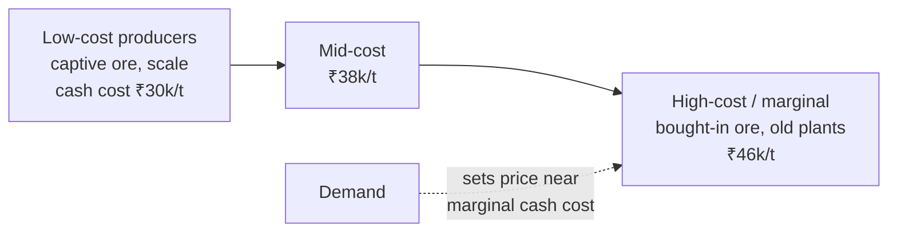

# 07.3 · Cyclicals & commodities

> **Why this matters:** steel, cement, metals, chemicals, sugar, shipping, refining — a large part of the Indian
> market earns its profit in bursts. Valuing a cyclical on last year's earnings is how investors buy at the top
> (when the P/E looks lowest) and sell at the bottom (when it looks highest or infinite). The tools here —
> normalised earnings, mid-cycle margins, EV per tonne, replacement cost, the cost curve — exist to see through the
> cycle, and the trader's instinct for regimes is an advantage.

**Learning objectives** — after this lesson you can:

- Explain the P/E paradox for cyclicals and why trailing multiples invert their usual meaning.
- Build normalised (mid-cycle) earnings from a through-cycle margin or EBITDA-per-unit history.
- Use P/B, EV/replacement cost and EV/tonne (or EV/MW, EV/room) at cycle troughs.
- Read a cost curve and identify the marginal producer that sets the price.
- Build a commodity price deck and translate it into earnings sensitivity.
- Apply the toolkit to a fictional steel company and know where to check the real Indian names.

**Prerequisites:** [04.2 Margins & cost structure](../04-financial-analysis/02-margins-and-cost-structure.md),
[05.4 The capital cycle](../05-business-analysis/04-capital-cycle-and-competition.md),
[06.7 Other valuation methods](../06-valuation/07-other-valuation-methods.md)  ·  **Time:** ~90 min

---

## 1. What makes a business cyclical

Earnings are cyclical when **demand swings** (autos, capital goods, housing) and/or **price swings** (commodities:
steel, aluminium, crude, sugar, chemicals) meet **high fixed costs and long-lived capacity** (operating leverage,
[04.2](../04-financial-analysis/02-margins-and-cost-structure.md)) and **lagged supply** (the capital cycle,
[05.4](../05-business-analysis/04-capital-cycle-and-competition.md)). Price-takers in commodities are the purest case:
the product is identical everywhere, so profit is set by the gap between a global price and the company's cost,
and both move.

The consequences for analysis:

- Any single year's earnings is a draw from a wide distribution, not an estimate of "earning power".
- Margins mean-revert violently; the reversion is the thesis, not the noise.
- The balance sheet must survive the trough; leverage that looks modest at the peak is lethal at the bottom.
- The right multiples are the ones anchored to things that do not cycle: book value, capacity, replacement cost,
  normalised earnings.

## 2. The P/E paradox

At the **top** of the cycle, earnings are at their highest and the market — knowing they will fall — pays a low
multiple: the stock looks cheapest exactly when it is most dangerous. At the **bottom**, earnings are minimal or
negative and the P/E is enormous or meaningless: the stock looks most expensive when it is cheapest. The old
rule: *buy cyclicals at high P/Es, sell them at low P/Es.*

**Narmada Steel** (fictional): 7 MT capacity, market cap ₹30,000 Cr, net debt ₹12,000 Cr, equity ₹20,000 Cr.

| FY | EBITDA/tonne (₹) | Volume (MT) | EBITDA (₹ Cr) | PAT (₹ Cr) | P/E at ₹30,000 Cr mcap |
|:--|--:|--:|--:|--:|--:|
| FY17 | 3,200 | 4.0 | 1,280 | (720) | n/m |
| FY18 | 4,500 | 4.2 | 1,890 | (110) | n/m |
| FY19 | 6,800 | 4.5 | 3,060 | 832 | 36x |
| FY20 | 9,500 | 4.8 | 4,560 | 1,920 | 16x |
| FY21 | 12,500 | 5.0 | 6,250 | 3,188 | 9x |
| **FY22 (peak)** | **15,000** | 5.5 | **8,250** | **4,688** | **6.4x** |
| FY23 | 7,000 | 5.8 | 4,060 | 1,395 | 22x |
| **FY24 (trough)** | **4,200** | 6.0 | **2,520** | **15** | **2,000x** |
| FY25 | 5,500 | 6.2 | 3,410 | 570 | 53x |
| FY26 | 8,000 | 6.5 | 5,200 | 1,875 | 16x |

(EBITDA = ₹/t × MT ÷ 10 gives ₹ Cr; PAT = (EBITDA − D&A − interest) × 0.75 with D&A rising from ₹900 to ₹1,800 Cr
as capacity was added and interest ₹650–1,100 Cr.) At the FY22 peak the stock was "cheap" at 6.4x; two years later
earnings had fallen 99.7%. An investor who bought the 6.4x P/E bought the top.

## 3. Normalised earnings

**Normalised (mid-cycle) earnings** replace the current year's margin with a through-cycle average, holding current
volume and cost structure:

$$\text{Normalised EBITDA} = \text{Current volume} \times \overline{\text{EBITDA/tonne}}_{\text{cycle}}$$

Narmada: ten-year average EBITDA/tonne = ₹7,620 (median ₹6,900); at FY26 volume of 6.5 MT → normalised EBITDA
₹4,953 Cr; less D&A 1,800 and interest 900 → PBT 2,253 → normalised PAT ≈ **₹1,690 Cr**; **normalised P/E = 17.8x**.
FY26's actual (₹1,875 Cr PAT, 16x) is close to mid-cycle — neither peak nor trough — which is the useful
conclusion: the stock is roughly fairly priced on through-cycle earnings, and a bet on it is a bet on the *next*
phase of the cycle, not on cheapness.

Choices that matter:

- **Which average?** A full cycle (peak to peak or trough to trough), not "the last five years". Ten years usually
  spans one; check that it includes at least one bad year.
- **Mean or median?** The mean is pulled up by super-cycles (FY21–22 above); the median is more conservative.
  Report both.
- **Has the structure changed?** New capacity at lower cost, a captive mine, a tariff regime, China's export
  behaviour — any of these shifts the mid-cycle level. Normalise the *unit economics*, then adjust for known structural
  change, and say which.
- **Volume is not the current year's either** if capacity utilisation is cyclical (cement at 65% vs 85%).

Multiples on normalised earnings: EV/normalised EBITDA (Narmada: 42,000 / 4,953 = 8.5x) and P/normalised E are the
cyclical analyst's working multiples; compare with the company's own through-cycle history and with peers at the
same cycle stage.

## 4. Asset-anchored multiples at troughs

When earnings are near zero, value the assets:

| Multiple | Narmada | Reading |
|:--|--:|:--|
| **P/B** | 30,000 / 20,000 = 1.5x | Through a cycle, commodity producers oscillate roughly between 0.5–0.8x book at troughs and 2–3x at peaks (India-specific bands differ by sector — verify on Screener for steel/cement). 1.5x is mid-range, consistent with the normalised-earnings read |
| **EV / tonne of capacity** | (30,000 + 12,000) / 7 MT = **₹6,000 Cr/MT** | Compare with replacement cost: a greenfield integrated steel plant in India has cost roughly ₹7,000–9,000 Cr per MT in recent projects (verify against announced capex — e.g., recent JSW/Tata/AM-NS expansions); at ₹6,000 Cr/MT the market values Narmada's capacity below what it would cost to build, a mild trough signal |
| **EV / replacement cost** | ≈ 0.7–0.85x | Below 1x: no rational entrant builds new capacity at these prices → supply tightens → prices recover (the capital-cycle mechanism). Above 1.5x: everyone builds |
| **EV / EBITDA (peak)** | 42,000 / 8,250 = 5.1x | The "cheap" peak multiple — a warning, not an invitation |

For **cement** the same logic runs on EV/tonne (₹ Cr per MT of capacity) against a replacement cost that has
risen with land and limestone costs; for **power** EV/MW; **hotels** EV/room; **shipping** EV vs fleet
scrap/newbuild value; **oil & gas** EV/boe of reserves. In every case the question is the same: *is the market
pricing this capacity below what it would cost to replace, and if so, why?*

## 5. The cost curve and the marginal producer

For a commodity, price is set where demand meets the **cost curve** — producers ranked from lowest to highest
cash cost. In a downturn, price falls to the cash cost of the marginal producer needed to meet demand; the high-cost
tail loses money and closes; the low-cost producers keep earning. In an upturn, price rises until the highest-cost
producer needed is profitable.

What this means for a stock:

- **Position on the curve is the moat.** A first-quartile producer (captive raw materials, scale, logistics) earns
  through the cycle; a fourth-quartile producer earns only at peaks and may not survive troughs. Coal India and NMDC
  sit low on their curves because of reserve quality; some Indian steelmakers moved down the curve by acquiring
  captive iron ore mines in the 2020 auctions (verify).
- **Price floors are analysable.** If the marginal producer's cash cost is ₹46k/t and the price is ₹44k/t, capacity is
  closing and the floor is near; if the price is ₹60k/t, the whole curve is profitable and capacity is coming.
- **China sets many curves.** For steel, aluminium and chemicals, Chinese capacity and export policy define the
  global marginal producer; Indian tariffs (safeguard duties, anti-dumping) move the domestic price relative to it.
  A view on Chinese exports is a view on Indian steel margins.

## 6. Price decks and sensitivity

A **price deck** is the set of commodity price assumptions a model uses by year. Build it from forward curves where
they exist (LME for base metals, Brent), broker/consultant consensus where they don't (steel, cement realisation),
and always show the sensitivity:

$$\Delta\text{EBITDA} \approx \Delta\text{Price} \times \text{Volume} \times (1 − \text{pass-through to costs})$$

Narmada: a ₹1,000/t change in realisation on 6.5 MT with ~15% of it absorbed by cost linkages (input prices move with
output prices) changes EBITDA by ≈ 1,000 × 6.5 / 10 × 0.85 = **₹553 Cr**, or ~11% of FY26 EBITDA and ~22% of PAT
(operating and financial leverage stacked). Present the sensitivity per ₹1,000/t, per $10/t or per 1% of price, and
show what price the market is implying (a reverse DCF on the price deck — [06.6](../06-valuation/06-reverse-dcf-and-expectations.md)).

## 7. Indian sectors and where to look

| Sector | Cycle driver | Unit metric | Anchor multiple | Representative listed names (for study; verify facts) |
|:--|:--|:--|:--|:--|
| Steel | Global price (China), domestic demand, iron ore/coking coal | EBITDA/tonne; cash cost/tonne | EV/tonne; P/B | Tata Steel, JSW Steel, SAIL, Jindal Steel |
| Aluminium, zinc, copper | LME price, power cost, captive mines | EBITDA/tonne; cost curve position | EV/tonne; EV/EBITDA on LME deck | Hindalco, Vedanta, Hindustan Zinc, NALCO |
| Iron ore / coal mining | Reserve quality, government pricing, volumes | Realisation/tonne; cost/tonne | P/E on normalised; dividend yield (cash-rich PSUs) | NMDC, Coal India |
| Cement | Regional demand/supply, utilisation, fuel (petcoke/coal) | EBITDA/tonne; utilisation | EV/tonne | UltraTech, Ambuja, Shree, Dalmia |
| Refining & petrochemicals | GRMs, crack spreads, polymer margins | GRM $/bbl | EV/EBITDA on mid-cycle GRM | Reliance, IOC, BPCL, HPCL |
| Commodity chemicals | Chinese capacity, crude derivatives, capex waves (2021–24 specialty chemicals) | Spread over feedstock | EV/EBITDA normalised; P/B at troughs | Verify current names and cycle stage |
| Sugar | Cane pricing (FRP/SAP), ethanol policy, monsoon | Recovery %, realisation | P/B; EV/tonne of crushing | Regulated pricing dominates |
| Shipping, ports | Freight rates (Baltic indices), trade volumes | TCE $/day | EV vs fleet value; NAV | Verify |
| Autos, capital goods (demand cyclicals) | Interest rates, incomes, capex cycle | Volume, utilisation | Normalised P/E; mid-cycle margin | [08.5](../08-sectors/05-industrials-capital-goods-defence.md), [08.6](../08-sectors/06-autos-and-ancillaries.md) |

!!! tip "Trader's lens"
    Cyclicals are regime trades, and the multiple is the regime indicator read backwards: low trailing P/E = the
    market pricing a regime shift down; high P/E = pricing a shift up. The useful analogy is vol of vol — you are
    not trading the level of earnings but the *change* in the level, and the entry signals are the ones vol traders
    know: extremes relative to a long history, capacity (supply) behaviour, and positioning. Normalised earnings are
    the long-run mean; the capital cycle is the mean-reversion mechanism; the cost curve tells you where the floor
    is. Position sizing must respect that the floor is only approximate and the path to it can bankrupt the levered.

!!! info "India notes"
    - Government pricing intrudes: coal (Coal India's notified prices and e-auction premia), iron ore (NMDC's
      monthly prices), sugar (FRP/SAP), ethanol, fertiliser (subsidy), fuel (OMC marketing margins). Model the
      policy as a driver, with a scenario for change.
    - Duties move the domestic price relative to the global cost curve: safeguard duties on steel (2025), export
      duties (2022), anti-dumping on chemicals — check the current schedule for any sector you model.
    - PSU miners and metals companies pay large dividends at cycle peaks; the dividend yield at the peak is not
      sustainable and should not anchor valuation.

!!! warning "Common mistakes"
    - Buying a cyclical because its trailing P/E is low.
    - Normalising over a period that is all peak or all trough.
    - Ignoring balance-sheet survival: the trough is where the equity option can expire worthless
      ([06.7](../06-valuation/07-other-valuation-methods.md), Merton).
    - Treating EV/tonne as a valuation rather than a cross-check (capacity ≠ cash).
    - Forgetting that structural changes (captive mines, new low-cost capacity, tariffs) move the mid-cycle.
    - Extrapolating a super-cycle (FY21–22) into "the new normal".

## Key terms

| Term | Meaning |
|:--|:--|
| **Cyclical** | A business whose earnings swing with demand and/or commodity prices |
| **Price-taker** | A producer of an undifferentiated product sold at a market price it cannot influence |
| **Normalised / mid-cycle earnings** | Earnings at through-cycle average margins on current volumes |
| **P/E paradox** | Cyclicals show low P/Es at earnings peaks and high P/Es at troughs |
| **EV/tonne (EV/MW, EV/room)** | Enterprise value per unit of physical capacity |
| **Replacement cost** | Cost to build equivalent capacity today; EV below it signals a trough |
| **Cost curve** | Industry producers ranked by unit cash cost; sets the marginal price |
| **Marginal producer** | The highest-cost producer needed to meet demand; its cash cost anchors the price floor |
| **Cash cost** | Cost per unit excluding depreciation and financing |
| **Price deck** | The commodity price assumptions by year in a model |
| **Realisation** | Average selling price per unit achieved |
| **GRM** | Gross refining margin ($/bbl): product prices minus crude cost |
| **Super-cycle** | An extended period of above-mid-cycle prices driven by structural demand or supply shocks |

## Check your understanding

1. Narmada Steel's FY22 P/E was 6.4x and FY24's was ~2,000x. Which year was the better time to buy, and what
   metric would have said so?

Answer
FY24. EV/tonne (well below replacement cost), P/B (≈1x or below at the FY24 price,
if the price had fallen with earnings), and normalised P/E (which uses ₹1,690 Cr of mid-cycle PAT, not ₹15 Cr) all
pointed to a trough; the 2,000x trailing P/E was the paradox at work.

2. Compute Narmada's normalised PAT using the *median* EBITDA/tonne instead of the mean, and the normalised P/E.

Answer
Median ₹6,900/t × 6.5 MT ÷ 10 = ₹4,485 Cr EBITDA; PBT = 4,485 − 1,800 − 900 =
1,785; PAT ≈ 1,339; P/E ≈ 22.4x. The choice of mean vs median moves the normalised P/E from 17.8x to 22.4x — report
the range.

3. Steel is at ₹52,000/t; the marginal producer's cash cost is ₹46,000/t; new capacity announcements have surged.
   What does the cost curve predict?

Answer
The whole curve is profitable, so capacity is being added; when it arrives, price
falls toward the marginal cash cost (~₹46,000) or below it temporarily until high-cost capacity closes. Margins for
mid-curve producers compress by ~₹6,000/t; only first-quartile producers keep earning well.

4. Why does a cyclical need a stronger balance sheet than a stable business with the same average profit?

Answer
Its cash flow is intermittent: debt service is fixed but EBITDA can fall 70% in a
trough (Narmada FY22→FY24). Leverage that is 1.5x EBITDA at the peak becomes 5x at the trough, covenants trip, and
the equity — a call option on the assets — can expire worthless before the cycle turns.

5. A cement company trades at EV/tonne of ₹4,500 Cr/MT while recent acquisitions were at ₹8,000–10,000 Cr/MT. List
   two reasons it might *not* be cheap.

Answer
Its capacity may be poorly located (high freight to markets), old and inefficient
(high cost per tonne), or under-utilised in an oversupplied region; and acquisition prices include control premia and
synergies a minority shareholder does not get. EV/tonne must be read with utilisation, cost and regional pricing.

## Go deeper

- Edward Chancellor (ed.), *Capital Returns: Investing Through the Capital Cycle* (Marathon Asset Management) —
  the supply-side discipline applied to commodities and cyclicals.
- Peter Lynch, *One Up on Wall Street* — the chapter on cyclicals and the P/E paradox.
- Company "cost curve" slides in Hindalco/Vedanta/Tata Steel investor presentations, and Wood Mackenzie/CRU curves
  cited in DRHPs — learn to read where a producer sits.
- [Case I15 Tata Motors & JLR](../13-case-studies/india/15-tata-motors-jlr.md) — a demand cyclical with acquisition
  leverage through two full cycles.

---
[← Previous: 07.2 Insurers, AMCs, exchanges & brokers](02-insurers-amcs-exchanges.md) · [Module index](index.md) · [Next: 07.4 High-growth & loss-making companies →](04-high-growth-and-loss-making.md)
