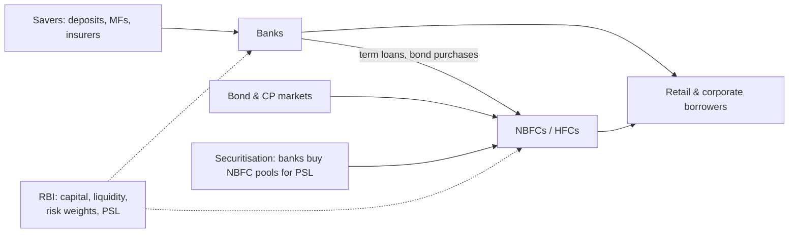

# 08.1 · Banks & lending

> **Sector playbook.** How lenders make money → value chain → KPIs → what drives earnings and multiples →
> accounting quirks → red flags → how to value → representative companies → checklist. [07.1](../07-special-valuation/01-banks-and-nbfcs.md)
> gives the analytical machinery; this page is the field guide to the Indian lending landscape as of September 2026.
> Facts about real companies and the cycle are dated and should be re-verified before use.

**Time:** ~75 min · **Prerequisites:** [07.1 Banks & NBFCs](../07-special-valuation/01-banks-and-nbfcs.md)

---

## 1. How the industry makes money

A lender borrows (deposits for banks; bank loans, bonds, securitisation and CP for NBFCs), lends at a spread,
pays for branches, people and technology, absorbs credit losses, and keeps the remainder on a thin equity base.
The **RoA tree** from 07.1 is the whole P&L; leverage converts RoA to RoE within regulatory capital limits.

| Segment | Funding | Typical NIM | Typical credit cost (cycle) | Leverage | RoA / RoE (good operator) |
|:--|:--|:--|:--|:--|:--|
| Large private banks | Deposits (CASA 35–45%) | 3.5–4.5% | 0.4–1.0% | 9–11x | 1.7–2.0% / 15–18% |
| PSU banks | Deposits (CASA ~40%, sticky) | 2.8–3.3% | 0.5–1.5% (higher in stress) | 12–16x | 0.9–1.3% / 12–18% (FY24–26 were peak years) |
| Small finance banks | Deposits (lower CASA, higher cost) | 6–9% | 1.5–4% | 7–9x | 1.5–2.5% / 12–20%, volatile |
| Housing finance (HFCs) | Bank loans, NCDs, NHB refinance | 2.5–4% (prime) / 6–8% (affordable) | 0.2–0.5% / 0.8–2% | 6–8x | 1.8–3.5% / 12–18% |
| Vehicle finance NBFCs | Bank loans, NCDs, securitisation | 7–10% | 1.5–3% | 4–6x | 2.5–3.8% / 14–20% |
| Gold loans | Bank loans, NCDs | 10–13% | 0.2–1% (secured by gold) | 3–5x | 4–6% / 18–25% |
| Microfinance (MFI) | Bank loans, securitisation | 10–13% | 2–8% (cyclical, event-driven) | 4–6x | 1–4% swinging negative |
| Consumer / unsecured (fintech-led) | Bank partnerships, NCDs | 12–20% | 4–10% | 3–5x | Volatile |
| Diversified NBFCs (e.g., Bajaj Finance) | All of the above | 9–11% | 1.5–2.5% | 5–7x | 4–5% / 18–22% |

## 2. Value chain and structure

Banks sit at the centre: they hold the deposit franchise, fund NBFCs, and buy NBFC loan pools to meet
priority-sector targets. NBFCs are specialists in segments banks under-serve (used vehicles, MSME, gold, rural)
and depend on banks and bond markets for funding — the vulnerability exposed in 2018–19. Structure: ~12 large
private banks, 12 PSU banks (post-2020 mergers), ~10 SFBs, and several thousand NBFCs of which ~50 matter.

## 3. KPIs and where to find them

| KPI | Where | Notes |
|:--|:--|:--|
| Loan growth by segment; deposit growth; CASA ratio; credit-deposit ratio | Quarterly investor presentation | Banks: watch the CD ratio (system ~80–82% in FY26) — deposit growth caps loan growth |
| NIM; yield; cost of funds | Presentation; notes | Definitions vary (on assets vs on loans); NIMs compressed ~20 bps in FY26 as repo-linked loans repriced after the RBI's 2025 cuts ([BCG 9M FY26 roundup](https://web-assets.bcg.com/f2/42/3099132d4f64a777ffe93fc64969/banking-sector-roundup-9mfy26.pdf)) |
| Cost-to-income | Presentation | Banks 40–50%; NBFCs 30–45% |
| GNPA, NNPA, PCR, slippages, recoveries, write-offs, restructured book, SMA-2 | Presentation; Pillar 3; notes | System GNPA fell to ~1.8% by March 2026, a multi-decade low ([India Macro Indicators](https://indiamacroindicators.co.in/resources/blogs/india-banking-sector-performance-fy26-fy27)) — a benign base for forecasting credit cost, i.e. a warning |
| Credit cost (annualised) | Presentation | Through-cycle averages by segment (§1), not last year's |
| CRAR, CET-1, Tier-1; RWA density | Presentation; Pillar 3 | Floors per RBI (banks 11.5% incl. buffer; NBFCs 15%) |
| LCR; ALM buckets; funding mix; CP share | Notes; ALM statement | |
| RoA, RoE; book value per share | Compute | On average balances |
| Vintage/early-bucket delinquencies (30+ dpd by origination cohort) | Sometimes in presentations; ask on calls | The leading indicator for retail books |

## 4. What drives earnings and multiples

- **The credit cycle**: credit cost is the swing factor; benign years (FY23–26) compress it to record lows and
  multiples expand; stress (FY16–20 corporate; FY21 COVID; unsecured/MFI stress in FY25–26) reverses both.
- **Rates**: cuts compress NIMs for banks with repo-linked books faster than deposit costs fall (FY26); hikes do
  the opposite. NBFCs with fixed-rate books and floating funding are squeezed in hikes.
- **Deposit competition**: household savings shifting to mutual funds (SIPs) and equities raise the cost of
  deposits and cap growth; CASA ratios have drifted down across banks.
- **Regulation**: RBI risk-weight changes (unsecured retail and NBFC exposures, Nov-2023; partial rollback 2025),
  PSL, the ECL transition for banks (April 2027), scale-based rules for NBFCs, and RBI's enforcement actions
  (business restrictions on individual lenders in 2023–25 — verify which are current).
- **Growth vs capital**: 15–20% growth needs equity; dilution is part of the model.
- **Multiples**: large private banks 2–3x book at 15–18% RoE; PSU banks re-rated from ~0.5x to ~1–1.5x book in
  2022–25 as RoE recovered and the PSU-bank index outperformed private banks for stretches
  ([Business Standard](https://www.businessworld.in/article/psbs-extend-winning-streak-as-credit-growth-outpaces-private-banks-612799));
  high-RoE NBFCs 3–5x; stressed lenders below book. The P/B–RoE map ([07.1 §6.4](../07-special-valuation/01-banks-and-nbfcs.md)) is the tool.

## 5. Accounting quirks

- Banks: IRAC incurred-loss provisioning until April 2027; "provision coverage" includes technical write-offs
  in some disclosures; treasury MTM through OCI vs P&L by portfolio (HTM/AFS/HFT — RBI's 2023 investment
  classification norms); interest reversal on NPAs.
- NBFCs: ECL stage 1/2/3 with management overlays (watch overlay releases into profit); assignment income
  (upfront gain on selling loans via direct assignment); co-lending and off-book AUM (AUM ≠ balance-sheet loans —
  ask what share is off-book and who bears the credit risk).
- Both: restructured loans classified as standard; evergreening through fresh loans to stressed borrowers
  (RBI has acted on this); fee income booked upfront vs amortised.

## 6. Red flags

Rapid growth in a new segment; GNPA falling only via write-offs; PCR falling as GNPA rises; management overlay
releases; CP-funded long books; CD ratio well above system; concentrated corporate exposures (top-20 borrowers);
RBI divergence reports (bank's NPA vs RBI's assessment — Yes Bank 2017–19); auditor or CFO changes; promoter
lending to group entities (NBFCs); regulatory actions; RoE above peers with no visible reason (usually leverage or
under-provisioning).

## 7. How to value

Justified P/B and residual income on the cost of equity; P/ABV for stressed books; the P/B–RoE map vs peers; DDM
for high-payout PSU banks; never EV/EBITDA. Scenario the credit cycle explicitly. See [07.1 §6](../07-special-valuation/01-banks-and-nbfcs.md).

## 8. Representative listed companies (for study, not recommendation; verify all facts)

| Segment | Companies | Study for |
|:--|:--|:--|
| Large private banks | HDFC Bank, ICICI Bank, Axis Bank, Kotak Mahindra Bank, IndusInd Bank | Deposit franchise; the HDFC merger ([case I7](../13-case-studies/india/07-hdfc-bank-consistency.md)); IndusInd's 2025 derivative-accounting disclosures as a governance case |
| PSU banks | SBI, Bank of Baroda, PNB, Canara Bank | The 2022–25 re-rating; government ownership dynamics ([07.5](../07-special-valuation/05-holdcos-conglomerates-psus-mncs.md)) |
| Small finance banks | AU SFB, Ujjivan, Equitas | Transition from NBFC to bank; deposit build |
| Housing finance | LIC Housing, PNB Housing, Aptus, Home First, Aavas, Bajaj Housing | Prime vs affordable economics; the DHFL lesson ([case I4](../13-case-studies/india/04-ilfs-dhfl-2018.md)) |
| Vehicle finance | Shriram Finance, Cholamandalam, Mahindra Finance, Sundaram Finance | Nirmal Finance's real-world peers |
| Gold loans | Muthoot Finance, Manappuram | Collateral-driven credit cost; gold-price sensitivity; RBI's 2025 gold-loan directions |
| Microfinance | CreditAccess Grameen, Fusion, Spandana | Event risk (Andhra 2010, demonetisation, COVID, Karnataka 2025 ordinance) |
| Diversified | Bajaj Finance ([case I3](../13-case-studies/india/03-bajaj-finance-2008-2019.md)), Jio Financial | Cross-sell engine; the entrant with a balance sheet |
| Infrastructure/power finance | REC, PFC, IREDA | Government-linked lending; PSU valuation |

## 9. The 10-question sector checklist

1. Where does the RoA come from, and which line is at a cyclical extreme?
2. How much of the book is unseasoned (originated < 2 years), and what do vintage curves show?
3. What is the through-cycle credit cost for this segment mix, and what is being provided now?
4. Funding: CASA/deposit trend (banks) or funding mix, CP share and ALM gaps (NBFCs)?
5. Capital: CRAR headroom vs growth; when is the next raise?
6. Regulation pending: risk weights, ECL (banks), RBI actions, PSL, scale-based rules?
7. Concentration: segment, geography, top borrowers?
8. Disclosure quality: slippages, SMA, vintages, overlays — given or hidden?
9. Governance: management tenure, RBI relationship, related-party lending, auditor?
10. Valuation: where does it sit on the P/B–RoE map, and what RoE does the price imply?

---
[← Previous: 07.6 Real estate, infra, utilities & telecom](../07-special-valuation/06-real-estate-infra-utilities-telecom.md) · [Module index](index.md) · [Next: 08.2 IT services & software →](02-it-services-and-software.md)
