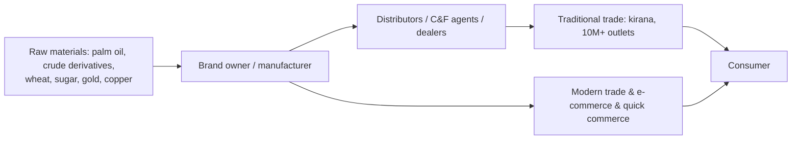

# 08.3 · Consumer: FMCG, retail, QSR, apparel, jewellery, durables, paints

> **Sector playbook.** Consumer companies are where India's structural story — rising incomes, formalisation,
> premiumisation — meets the market's highest multiples and, since 2023, its most contested assumptions: rural
> versus urban demand, quick commerce versus traditional distribution, and the entry of deep-pocketed rivals into
> categories that had been oligopolies for decades. This page covers the sub-sectors, their unit economics and the
> questions that matter in September 2026.

**Time:** ~80 min · **Prerequisites:** [04.2 Margins](../04-financial-analysis/02-margins-and-cost-structure.md), [05.3 Moats](../05-business-analysis/03-moats-and-competitive-advantage.md)

---

## 1. How the industry makes money

| Sub-sector | Model | Gross margin | EBITDA margin | Capital intensity | Moat source |
|:--|:--|:--|:--|:--|:--|
| **FMCG** (soaps, foods, beverages, personal care) | Branded packaged goods sold through 10+ million outlets via distributors; volume × price × mix | 45–60% | 18–28% | Very low; negative working capital | Brand + distribution reach + scale in A&P |
| **Paints** | Branded decorative paints via dealers with tinting machines; industrial coatings | 40–45% | 15–22% (pre-2024 ~20%) | Low-moderate | Distribution + brand + supply chain ([case I2](../13-case-studies/india/02-asian-paints-compounder.md)) |
| **Grocery / value retail** | Own stores selling third-party and private-label goods at low prices; fast inventory turns | 14–16% (DMart) to 25–30% (fashion) | 7–9% (grocery) / 10–15% (fashion, post-Ind AS 116) | High (owned stores) or lease-heavy | Cost leadership, location, scale ([case I13](../13-case-studies/india/13-dmart-avenue-supermarts.md)) |
| **QSR** (pizza, burgers, chicken, cafés) | Franchised global brands (Jubilant/Domino's, Devyani & Sapphire/KFC-Pizza Hut, Westlife/McDonald's) or own brands; store economics | 70–75% (food cost 25–30%) | 15–22% post-Ind AS 116 (10–14% pre) | Moderate (store capex ₹1.5–3 Cr) | Brand + delivery density + real estate; store payback |
| **Apparel & footwear** | Brands and retailers; franchise vs company-owned; e-commerce | 45–60% | 10–20% | Inventory-heavy; seasonal | Brand; store network; markdown discipline |
| **Jewellery** | Organised retail of gold jewellery (making charges = the margin) plus studded; franchise expansion | 12–15% | 7–9% | Inventory of gold (hedged via gold loans/leases) | Trust + brand (Titan/Tanishq); formalisation from unorganised |
| **Durables & appliances** | Fans, ACs, kitchen appliances, wires; contract-manufactured or own; dealer channel | 25–35% | 8–14% | Low-moderate | Brand + distribution + service; seasonal (summer ACs) |
| **Alcohol, tobacco** | Regulated, state-taxed; premiumisation | 40–70% | 15–35% | Low | Licences, brands, distribution (state-by-state) |

## 2. Value chain

The 2023–26 shift: **quick commerce** (Blinkit ~45–50% share, Instamart and Zepto ~20–25% each — verify) grew to
a meaningful share of urban FMCG sales and pulled volume from modern trade and kirana; it also changed the
economics (higher trade margins to the platform, private-label threat, promotional intensity) and the data
(brands see real-time sell-through). Rural demand outgrew urban for seven consecutive quarters to mid-2026
(rural volumes +5.3% vs urban +5.2% in Apr–Jun 2026 — [NIQ](https://nielseniq.com/global/en/insights/report/2026/india-fmcg-quarterly-snapshot-q1-2026/)),
reversing the 2022–24 pattern; the industry guided to high-single-digit volume growth for 2026 with margin recovery
([Business Standard](https://www.business-standard.com/industry/news/fmcg-industry-eyes-high-single-digit-volume-growth-in-2026-better-margins-125122200220_1.html)).

## 3. KPIs by sub-sector

| Sub-sector | KPIs | Where |
|:--|:--|:--|
| FMCG | Volume growth (underlying, ex-price); price/mix; gross margin vs input basket (palm oil, crude, milk); A&P as % of sales; distribution reach (direct outlets); rural/urban split; e-commerce + quick-commerce share; market share by category (Nielsen/Kantar cited in presentations) | Quarterly presentations; concalls |
| Paints | Volume growth; value growth (mix); gross margin vs TiO₂/crude; dealer count; tinting machines; market share; industrial vs decorative | Presentations; the Grasim/Birla Opus disclosures for the entrant's share (>10% of decorative by early 2026 — [Business Standard](https://www.business-standard.com/industry/news/birla-s-big-paints-bet-hits-asian-paints-market-share-in-just-one-year-125051300402_1.html)) |
| Retail | Same-store sales growth (SSSG/LFL); revenue per sq ft; store count and additions; gross margin; inventory days; store-level EBITDA and payback; bill cuts; average bill value | Presentations |
| QSR | SSSG; average daily sales per store; new stores; delivery share; food cost %; store EBITDA margin; payback | Presentations |
| Apparel | SSSG; full-price sell-through; inventory days; markdowns; store productivity; franchise vs owned mix | Presentations |
| Jewellery | Same-store growth; studded ratio (higher margin); gold price and hedging; franchise (FOCO/COCO) mix; customs-duty and GST changes | Presentations; gold price |
| Durables | Volume/value growth by category; gross margin vs copper/aluminium/steel; channel inventory; seasonality (summer); PLI/BIS effects | Presentations; SIAM-like trade bodies (CEAMA) |

## 4. What drives earnings and multiples

- **Volume growth** is the scarce variable: Indian FMCG volumes have grown 3–8% a year over long periods; price
  and mix add the rest. Multiples follow volume trajectories.
- **Input costs and pricing power**: crude/palm/agri commodity cycles move gross margins 200–500 bps; the leaders
  recover with a lag ([04.2](../04-financial-analysis/02-margins-and-cost-structure.md)).
- **Channel shifts**: quick commerce rewards brands with strong urban premium portfolios and penalises those
  dependent on kirana push; private label on platforms is the medium-term threat.
- **Competition and entry**: paints (Birla Opus, 2024–; also JSW Paints' acquisition of Akzo Nobel India in 2025 —
  verify), tea/coffee, snacks (D2C and regional players), jewellery (new organised entrants). The moat test of
  [05.3](../05-business-analysis/03-moats-and-competitive-advantage.md) is being run live.
- **Formalisation**: GST and e-invoicing shifted share from unorganised to branded players in jewellery, apparel,
  footwear, tiles, plywood — a multi-year tailwind that is now largely priced.
- **Regulation and tax**: GST rate changes (the September 2025 GST rate rationalisation cut rates on many
  consumer categories — verify the schedule), excise on alcohol/tobacco, gold import duty, price controls on
  none.
- **Multiples**: FMCG leaders 40–60x earnings at their 2021–22 peak, de-rated toward 35–50x through 2024–26 on
  slow volumes; paints from 70–80x to 40–50x after the entrant; DMart 80–100x compressing on growth
  deceleration and quick-commerce competition; QSR on EV/EBITDA and store-count growth; jewellery (Titan) at
  a premium for consistent 15–20% growth. These are growth-and-quality multiples; the justified-P/E logic of
  [06.5](../06-valuation/05-relative-valuation-and-multiples.md) says they require long growth runways at high ROIC,
  and they compress fast when either falters.

## 5. Accounting quirks

Ind AS 116 (leases) inflates EBITDA for retailers and QSR — compare EBIT or pre-116 EBITDA; A&P spend is expensed
(brands are not on the balance sheet, so ROCE is very high); channel inventory is not disclosed — infer from
distributor conversations ([05.7](../05-business-analysis/07-scuttlebutt-and-primary-research.md)); jewellers' gold
on lease and hedge accounting; franchise-model retailers report revenue net of franchisee margin (compare like
with like); royalty payments to MNC parents (HUL, Nestlé, Colgate, P&G — [07.5](../07-special-valuation/05-holdcos-conglomerates-psus-mncs.md));
cash piles and treasury income at FMCG majors.

## 6. Red flags

Volume growth disclosed only as "mid-single digit" when it slows; rising trade schemes/discounts in other
expenses; distributor inventory build before quarter-end (channel stuffing — [09.2](../09-forensics/02-revenue-red-flags.md));
SSSG negative while store count grows (retail/QSR); gross margin gains from "mix" that are really input-cost
tailwinds; A&P cut to protect margins; market-share loss disclosed by competitors but not by the company; franchise
receivables rising (jewellery, apparel); royalty increases at MNC subsidiaries.

## 7. How to value

DCF with explicit volume/price/mix drivers and a long fade (these are the companies where a 15–20-year competitive
advantage period is at least arguable — and where the Birla Opus example shows the fade can arrive early);
justified P/E and P/E vs growth against own history and peers; store-economics-based valuation for retail/QSR
(value per store × store count, plus growth optionality); EV/EBITDA on pre-116 numbers across retail formats;
reverse DCF at every entry point, because these are the stocks where the price most often embeds the bull case.

## 8. Representative companies (for study; verify)

HUL, Nestlé India, ITC ([case I12](../13-case-studies/india/12-itc-value-trap-or-not.md)), Britannia, Dabur,
Marico, Godrej Consumer, Colgate, Emami, Tata Consumer, Varun Beverages (FMCG); Asian Paints, Berger, Kansai
Nerolac, Indigo Paints, Grasim's Birla Opus (paints); Avenue Supermarts/DMart, Trent, V-Mart, Vishal Mega Mart
(retail); Jubilant FoodWorks, Devyani, Sapphire, Westlife, Restaurant Brands Asia (QSR); Titan, Kalyan Jewellers,
Senco (jewellery); Havells, Voltas, Blue Star, Crompton, Polycab, Dixon (durables/EMS); United Spirits, United
Breweries, Radico (alcohol); Page Industries, Aditya Birla Fashion, Arvind Fashions (apparel).

## 9. The 10-question sector checklist

1. What is underlying volume growth, and how does it split rural/urban and by channel?
2. Gross margin vs the input basket: is the company recovering cost inflation, and how fast?
3. A&P as % of sales — rising to defend or falling to flatter?
4. Market-share trend by category, from an independent source?
5. Channel: quick-commerce/e-commerce share, and what it does to trade margins and private-label risk?
6. Who is the new entrant, and what is their balance sheet (Birla Opus test)?
7. Retail/QSR: SSSG, store payback with full capital, and pre-Ind AS 116 margins?
8. Working capital: distributor credit, channel inventory, jewellery gold hedging?
9. Governance: royalty (MNCs), promoter actions, related-party retail entities?
10. What growth and fade does the multiple imply, and has a competitor's entry changed the fade?

---
[← Previous: 08.2 IT services & software](02-it-services-and-software.md) · [Module index](index.md) · [Next: 08.4 Pharma & healthcare →](04-pharma-and-healthcare.md)
