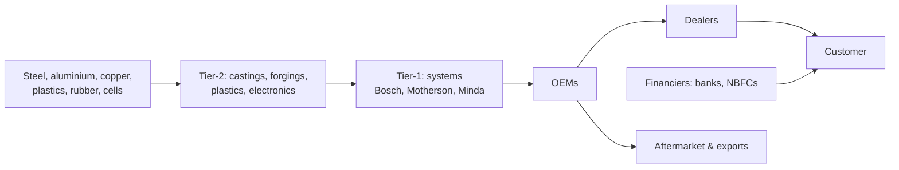

# 08.6 · Autos & ancillaries

> **Sector playbook.** Autos are the most *measurable* sector in India — monthly wholesale (SIAM), retail (FADA)
> and registration (VAHAN) data by segment, maker and state — and the one where the demand cycle, the EV
> transition and commodity costs interact most visibly. FY26 was a record year (28 million units, +7%; tractors
> +19%; EV registrations 3.5 million). This page covers OEMs by segment, the component supply chain and what
> to watch as the cycle matures.

**Time:** ~75 min · **Prerequisites:** [04.2 Margins](../04-financial-analysis/02-margins-and-cost-structure.md), [07.3 Cyclicals](../07-special-valuation/03-cyclicals-and-commodities.md)

---

## 1. How the industry makes money

| Segment | Economics | EBITDA margin | Cycle driver | Leaders (verify) |
|:--|:--|:--|:--|:--|
| **Two-wheelers** | Volume game; 20+ million units; exports 15–25% of volumes; financing penetration rising | 12–20% (Bajaj, TVS, Hero, Eicher/Royal Enfield 25%+) | Rural incomes, financing, fuel prices; EV penetration (6.5% of 2W in FY26 — [BusinessToday](https://www.businesstoday.in/auto/story/indian-auto-industry-clocks-record-cv-sales-ev-registrations-surge-to-3-5-million-in-fy26-siam-553054-2026-09-03)) | Hero MotoCorp, Bajaj Auto, TVS, Eicher ([case I6](../13-case-studies/india/06-eicher-motors-royal-enfield.md)), Ola Electric, Ather |
| **Passenger vehicles** | 4.7 million units FY26; SUV mix > 55%; premiumisation | 10–15% | Urban incomes, interest rates, model launches; EV 4.3% share | Maruti Suzuki, Tata Motors PV, M&M, Hyundai India |
| **Commercial vehicles** | Most cyclical: freight demand, infra capex, replacement; 1 million+ units FY26 | 8–14% | GDP/IIP, fleet-operator economics, financing (Nirmal Finance's customers), scrappage policy | Tata Motors CV, Ashok Leyland, Eicher (VECV) |
| **Tractors** | Rural/monsoon-linked; 1 million+ units FY26 (+19%) | 15–20% | Monsoon, crop prices, rural credit, government support | M&M, Escorts Kubota, Sonalika (unlisted) |
| **Three-wheelers & small CVs** | EV penetration highest (e-rickshaws) | | Last-mile logistics | Bajaj, Piaggio, Mahindra |
| **Components** | Tier-1/2 suppliers; content per vehicle; OEM programmes; exports and aftermarket | 10–18% (commodity parts lower; technology/proprietary higher) | OEM volumes; content per vehicle (EV, safety, emissions); exports; commodity pass-through with 1–2 quarter lag | Bosch, Motherson, Bharat Forge, Sona BLW, Uno Minda, Endurance, Schaeffler, Sundram Fasteners, Exide/Amara Raja (batteries) |
| **Auto software / ER&D** | Engineering services to global OEMs | 15–20% | Software-defined vehicles | KPIT, Tata Elxsi, Tata Technologies ([08.2](02-it-services-and-software.md)) |

## 2. Value chain and structure

Two-wheelers and PVs are oligopolies (top 3–4 hold 70–80%); CVs a duopoly-plus; tractors a duopoly-plus;
components fragmented by product with global competition. OEMs hold the power over Tier-1s (annual price-downs,
pass-through clauses) except where the supplier has proprietary technology.

## 3. KPIs

| KPI | Where | Notes |
|:--|:--|:--|
| **Volumes** by segment, model, geography; wholesale (SIAM) vs retail (FADA) vs registrations (VAHAN) | Monthly; company releases | Wholesale > retail for months = dealer inventory build (a classic pre-downturn signal); FADA publishes dealer inventory days |
| **Market share** | SIAM/FADA/VAHAN | By segment and by fuel (EV vs ICE) |
| **Realisation per vehicle** | Revenue ÷ volumes | Mix (SUVs, premium 2W), price increases |
| **EBITDA per vehicle** | | The unit-economics metric; compare across OEMs |
| **Gross margin vs commodity basket** | Steel, aluminium, precious metals (catalysts), rubber | 1–2 quarter lag; OEM pass-through to consumers via price hikes |
| **Capacity utilisation; capex; new plants** | | Capital cycle: PV capacity additions announced in 2024–26 |
| **Order book / waiting periods (PVs)** | Concalls | A demand signal that reverses sharply |
| **Dealer inventory days** | FADA | > 30 days (2W) / > 40 days (PV) is a warning |
| **Financing penetration; NPA trends at auto NBFCs** | Lenders' disclosures | Demand's credit engine |
| **Content per vehicle (components)** | Presentations | The EV/premiumisation lever |
| **Export volumes and geographies** | | Africa/LatAm for 2W; Europe for components |
| **EV metrics** | Penetration by segment; battery cost; subsidy (PM E-DRIVE) status; charging | Policy-sensitive |

## 4. What drives earnings and multiples

- **The demand cycle**: PVs and CVs track incomes, rates and infrastructure; 2W and tractors track rural incomes
  and the monsoon. FY26 was a peak year across segments (record retail 2.97 crore units, +13% — [FADA](https://fada.in/images/press-release/169d329fc83770FADA%20releases%20FY%202026%20and%20March%202026%20Vehicle%20Retail%20Data.pdf));
  the base effect makes FY27 growth harder, and August 2026 retail (+18%) suggests the cycle is still running
  ([Business Standard](https://www.business-standard.com/industry/auto/india-auto-retail-sales-august-2026-fada-passenger-vehicles-two-wheelers-126090700263_1.html)).
- **Commodities**: steel/aluminium/precious metals swing gross margins by 200–400 bps; OEMs pass through with lags
  and lose volume when they raise prices into weak demand.
- **Regulation**: emission norms (BS-VI, CAFE), safety mandates, GST (the September 2025 GST cut on small cars
  and two-wheelers — verify — was a demand catalyst), scrappage policy, EV subsidies and localisation rules.
- **EV transition**: 2W and 3W first; PVs slower; CVs slowest. It changes the component pie (engines, exhausts and
  transmissions lose; batteries, motors, electronics gain), the competitive set (new entrants), and margins during
  the transition. Model content-per-vehicle by powertrain for component companies.
- **Multiples**: OEMs 15–30x P/E through the cycle (Maruti/M&M at the top on growth and mix; Tata Motors on
  SOTP post-demerger — [case I15](../13-case-studies/india/15-tata-motors-jlr.md)); premium 2W (Eicher) 25–35x;
  components 20–40x for technology leaders, 10–20x for commodity parts. Use normalised margins for CVs and
  mid-cycle volumes for OEMs ([07.3](../07-special-valuation/03-cyclicals-and-commodities.md)).

## 5. Accounting quirks

Finance subsidiaries consolidated into OEMs (Tata Motors Finance, M&M Finance associate) — separate the industrial
and finance businesses for leverage and valuation; development costs capitalised (Ind AS 38 — Tata Motors/JLR
capitalises heavily; Maruti expenses); warranty and recall provisions; export incentives; PLI for auto components;
JLR consolidation and currency (GBP, USD, EUR); dealer incentives netted from revenue; inventory of finished
vehicles at quarter-end.

## 6. Red flags

Wholesale far above retail for consecutive months; dealer inventory > 45 days; discounts rising while "demand is
strong"; capitalised development costs rising faster than R&D disclosure; finance-subsidiary NPAs rising while
OEM volumes grow (financed demand); a component supplier's top customer losing share; EV start-ups' unit
economics (subsidy-dependent gross margins, warranty costs, cash burn — the 2024–26 experience of listed EV 2W
makers); promoter-group related-party transactions in dealerships or components.

## 7. How to value

OEMs: mid-cycle EBITDA per vehicle × normalised volumes → EV/EBITDA and P/E with the cycle stated; SOTP for
groups with finance arms, JLR or listed subsidiaries. Components: P/E vs growth with content-per-vehicle and
customer-mix drivers, EV-transition scenarios. EV start-ups: [07.4](../07-special-valuation/04-high-growth-and-loss-making.md).
Always cross-check with VAHAN data for the last three months before believing a volume forecast.

## 8. Representative companies (for study; verify)

Maruti Suzuki, Tata Motors (PV and CV entities post-demerger), M&M, Hyundai Motor India, Bajaj Auto, Hero
MotoCorp, TVS Motor, Eicher Motors, Ashok Leyland, Escorts Kubota, Ola Electric, Ather Energy (OEMs); Bosch,
Samvardhana Motherson, Bharat Forge, Sona BLW, Uno Minda, Endurance, Schaeffler India, Sundram Fasteners,
Balkrishna Industries, Apollo Tyres, MRF, Exide, Amara Raja (components); Bajaj Finance, Cholamandalam, Shriram,
Mahindra Finance (financiers — [08.1](01-banks-and-lending.md)).

## 9. The 10-question sector checklist

1. Where in the cycle are volumes (vs 5-year average and vs last peak), by segment?
2. Wholesale vs retail vs registrations — is the channel filling?
3. Realisation and EBITDA per vehicle trend; commodity pass-through lag?
4. Regulatory calendar: emissions, safety, GST, subsidies, scrappage?
5. EV: penetration in the segment, the company's position, and content-per-vehicle exposure (components)?
6. Capacity and capex vs demand — is the industry adding too much?
7. Financing: penetration and lender asset quality in the segment?
8. Exports: share, geographies, currency, tariffs?
9. Group structure: finance arm, overseas subsidiaries, listed subsidiaries, related parties?
10. What volumes and margins does the multiple imply, and are they mid-cycle or peak?

---
[← Previous: 08.5 Industrials, capital goods & defence](05-industrials-capital-goods-defence.md) · [Module index](index.md) · [Next: 08.7 Metals, cement & chemicals →](07-metals-cement-chemicals.md)
