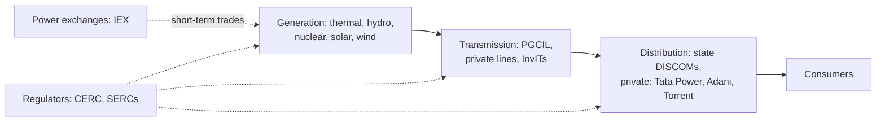

# 08.8 · Energy & utilities

> **Sector playbook.** Oil and gas is a policy-and-price business (crude above $100 in 2026 is squeezing
> marketing companies while lifting upstream); power is in the middle of a transition in which renewables reached
> 54% of installed capacity while electricity demand contracted for the first time since the pandemic. Regulated
> returns, government pricing, PPAs and policy schemes (ALMM, PM-KUSUM — Kaveri's solar customer) define the
> economics more than competition does. As of September 2026.

**Time:** ~75 min · **Prerequisites:** [07.6 Real estate, infra, utilities & telecom](../07-special-valuation/06-real-estate-infra-utilities-telecom.md), [07.3 Cyclicals](../07-special-valuation/03-cyclicals-and-commodities.md)

---

## 1. Oil & gas

| Segment | How it makes money | Key metrics | Policy lever | Companies (verify) |
|:--|:--|:--|:--|:--|
| **Upstream** (exploration & production) | Sell crude at global prices (Brent-linked) and gas at government-administered or formula prices | Production (mmboe), realisation ($/bbl net of windfall tax), finding & development cost, reserves replacement | Windfall/special additional excise duty on crude (imposed 2022, varied since — verify current), gas pricing formula (APM linked to Indian crude basket with floor/ceiling) | ONGC, Oil India, Reliance (KG-D6), Cairn/Vedanta |
| **Refining** | Gross refining margin (GRM, $/bbl) = product prices − crude cost; complexity (ability to process heavy crude) | GRM vs Singapore benchmark; throughput; Nelson complexity; Russian crude discounts (2022–26) | Export duties; product pricing | Reliance (world-scale, high complexity), IOC, BPCL, HPCL, MRPL, Chennai Petroleum |
| **Marketing (OMCs)** | Retail petrol/diesel/LPG margins = retail price − refinery-gate price − costs; retail prices are de facto administered | Marketing margin per litre (diesel margins negative when crude spikes and pump prices are frozen — [Business Standard, Sep-2026](https://www.business-standard.com/economy/news/crude-oil-above-100-omc-margins-hpcl-bpcl-iocl-126091100369_1.html)); LPG under-recoveries and compensation | Government control of pump prices; LPG subsidy compensation | IOC, BPCL, HPCL |
| **City gas distribution** | Regulated monopoly per geographical area (PNGRB) for a period; sell CNG/PNG at a margin over gas cost | Volumes (CNG, domestic/industrial PNG), gas cost mix (APM allocation vs spot LNG), EBITDA per scm, GA expansion | APM gas allocation cuts (2024–25 reduced priority allocation, raising costs — verify), excise/VAT on CNG | IGL, MGL, Gujarat Gas, Adani Total Gas |
| **Gas transmission / LNG** | Pipeline tariffs (PNGRB-regulated); LNG regasification tariffs | Volumes, tariff orders, utilisation | Unified tariff | GAIL, Petronet LNG, GSPL |

**Drivers**: crude and gas prices, the INR, government pricing decisions (the OMC "margin" is a policy variable
in election years and crude spikes), refining spreads (global capacity, Russian crude), and the energy transition
(EVs erode petrol/diesel volumes slowly; CNG substitutes). **Valuation**: upstream on EV/boe and DCF on a price
deck net of windfall tax; refiners on mid-cycle GRM; OMCs on normalised marketing margins with a policy
scenario (their profits swing from ₹1 lakh Cr combined in a good year to losses); CGD on volume growth DCF with
gas-cost scenarios; PSU adjustments per [07.5](../07-special-valuation/05-holdcos-conglomerates-psus-mncs.md).

## 2. Power

| Segment | Economics | Key metrics | Companies (verify) |
|:--|:--|:--|:--|
| **Regulated thermal/hydro generation** | RoE 15.5% on regulated equity (CERC 2024–29) + incentives; fuel cost passed through | Regulated equity base, PLF/availability, capex adding to base, DISCOM receivables | NTPC, NHPC, SJVN |
| **Merchant / IPP thermal** | Sell into exchanges or short-term PPAs at market prices | Merchant realisation, PLF, coal cost/linkage | Adani Power, JSW Energy, Tata Power (partly) |
| **Renewables (solar, wind, hybrid, storage)** | 25-year PPAs at bid tariffs (₹2.5–3.5/kWh solar); returns depend on capex/MW, PLF, financing cost; FDRE/storage tenders | Capacity (GW), pipeline, PLF, tariff, capex per MW, counterparty (SECI/NTPC/DISCOM), receivable days | Adani Green, NTPC Green, ReNew, JSW Energy, Tata Power Renewables, Suzlon/Inox Wind (equipment), Waaree/Premier (modules) |
| **Transmission** | RoE 15% regulated (CERC) or tariff-based competitive bidding (TBCB) with 35-year contracts | Capex pipeline, project wins, availability | PGCIL, Adani Energy Solutions, Sterlite/PowerGrid InvIT |
| **Distribution** | Regulated (state) with AT&C loss targets; private franchisees outperform | AT&C losses, tariff orders, regulatory assets (unrecovered costs) | Tata Power (Mumbai, Delhi, Odisha), Torrent Power, CESC |
| **Exchanges** | Transaction fees on traded volumes | Volumes, market share, regulation (market coupling) | IEX ([07.2](../07-special-valuation/02-insurers-amcs-exchanges.md)) |

**The 2026 state of play**: record renewable additions (51 GW in FY26; 288 GW RE capacity by June 2026, 54% of
total — [PV Tech](https://www.pv-tech.org/india-hits-288gw-renewables-capacity-with-56-solar/)) coincided with a
demand contraction (weather, slower industrial demand — [S&P Global](https://www.spglobal.com/energy/en/news-research/blog/energy-transition/043026-indias-power-and-renewables-market-demand-stalls-capacity-rises)),
pushing down merchant prices and PLFs; thermal capex is nonetheless being added for peak/firm demand; storage
(BESS) tenders are the new growth pocket; module manufacturing overshot (ALMM-protected but oversupplied).
Kaveri's solar-pump customers (state agencies under PM-KUSUM) sit in this ecosystem — their payment behaviour is a
DISCOM/state-finance question.

**Drivers**: demand growth (GDP, weather, electrification), fuel (coal availability and price, gas), tariffs and
regulatory resets, DISCOM finances (late-payment surcharge rules improved discipline after 2022), renewable
tender pipeline and bid tariffs, module/cell prices and ALMM/duty policy, transmission connectivity (the
bottleneck for renewables), interest rates (project IRRs are rate-sensitive). **Valuation**: regulated businesses on
regulated-equity × justified P/B ([07.6 §3](../07-special-valuation/06-real-estate-infra-utilities-telecom.md));
renewables on project DCFs (equity IRR 12–16% target) and EV/MW; merchant on mid-cycle realisations; equipment
makers on the capital-cycle lens ([05.4](../05-business-analysis/04-capital-cycle-and-competition.md)).

## 3. KPIs to pull every quarter

| KPI | Source |
|:--|:--|
| Crude (Brent), Indian basket, INR; gas (Henry Hub, JKM, APM price) | PPAC, exchanges |
| GRMs (Singapore benchmark; company-reported) | Company; Reuters |
| OMC marketing margins per litre (petrol, diesel), LPG under-recovery | Broker estimates; PPAC |
| Power demand (CEA monthly), peak demand, PLF by fuel, exchange prices (IEX DAM) | CEA; IEX |
| Renewable additions (MNRE monthly), tender awards and tariffs (SECI), module prices | MNRE; Mercom |
| DISCOM dues to generators (PRAAPTI portal) | Government |
| Regulatory orders (CERC tariff, PNGRB tariffs, gas allocation) | Regulators |

## 4. Accounting quirks

Regulatory assets/deferred tariff income at utilities (revenue recognised on regulatory entitlement before cash);
DISCOM receivables and late-payment surcharge income; capitalised borrowing costs during plant construction;
decommissioning provisions; upstream: successful-efforts vs full-cost exploration accounting, depletion, abandonment
provisions; OMCs: inventory gains/losses on crude price moves (strip from "core" GRM), government compensation
receivables (LPG) booked when notified; CGD: gas cost mix and take-or-pay contracts; renewables: PPA accounting,
viability-gap funding, ESOP-heavy new listings; PSU dividend policy.

## 5. Red flags

Merchant exposure sold as "contracted"; PPAs with weak DISCOMs and rising receivables; renewable capacity targets
far beyond financing capacity; equipment makers booking orders from group projects (related-party demand);
regulatory assets growing faster than revenue at distributors; OMCs' "core" earnings excluding inventory losses
every quarter; upstream reserve write-downs; group-level leverage at private power conglomerates (the
[Adani case](../13-case-studies/india/09-adani-hindenburg-2023.md)).

## 6. The 10-question sector checklist

1. What is the price/tariff regime for each revenue line — regulated, contracted, merchant, administered?
2. What policy decision most affects the next two years' profit (pump prices, windfall tax, gas allocation, tariff reset)?
3. Counterparties: DISCOM/state exposure, receivable days, late-payment surcharge income?
4. Capex pipeline: regulated (value-creating by construction) vs merchant/competitive (return depends on bids)?
5. For renewables: tariff vs capex per MW vs PLF — what is the project equity IRR, and at what interest rate?
6. Balance sheet at the group level, not just the listed entity?
7. Commodity sensitivity: EBITDA per $10/bbl or per ₹1/kWh?
8. Accounting: inventory gains, regulatory assets, capitalised interest — what is core?
9. PSU considerations: dividend policy, OFS, cross-subsidy risk?
10. Multiples vs regulated-equity justified P/B, EV/MW or EV/boe benchmarks — and what does the price assume about policy?

---
[← Previous: 08.7 Metals, cement & chemicals](07-metals-cement-chemicals.md) · [Module index](index.md) · [Next: 08.9 Real estate, infra & logistics →](09-real-estate-infra-logistics.md)
