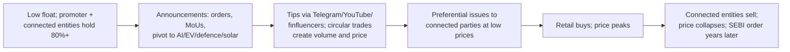

# 09.5 · Governance red flags in India

> **Why this matters:** [05.6](../05-business-analysis/06-corporate-governance-india.md) gave you the governance
> *framework* — the promoter model, the rules, the checklist. This lesson is the *forensic* view: the specific
> events and patterns that, in India, have preceded losses for minority shareholders often enough to be treated as
> signals in their own right. Most of them are public, dated and free to find. The skill is knowing they matter and
> looking before you buy.

**Learning objectives** — after this lesson you can:

- Read promoter pledging, auditor resignations, qualified opinions, KMP churn, related-party structures, preferential
  issuances and fund-raising patterns as forensic signals with base rates.
- Recognise the "operator" and SME-exchange manipulation patterns.
- Distinguish stated from actual promoter holdings.
- Use SEBI orders, exchange surveillance actions and NFRA findings as data.
- Rank Kaveri's governance signals.

**Prerequisites:** [05.6 Corporate governance — the India edition](../05-business-analysis/06-corporate-governance-india.md)  ·  **Time:** ~70 min

---

## 1. The signals, ranked by how often they precede trouble

The ordering below is a practitioner's judgement from Indian cases of the last fifteen years, not a statistic;
treat it as a prior to update.

| Rank | Signal | Why it predicts | Base-rate comment |
|:--|:--|:--|:--|
| 1 | **Auditor resignation mid-term**, especially before results or citing information not provided | An auditor with a reputation walks away from fees only when the risk of signing is intolerable | Manpasand (Deloitte, 2018), Vakrangee (Price Waterhouse, 2018), several 2018–19 mid-caps; most were followed by 50%+ declines |
| 2 | **Qualified / adverse / disclaimer opinion, or "material uncertainty" on going concern** | The auditor has stated a problem in writing | Rare for large companies; common before defaults (DHFL's FY19 accounts carried qualifications) |
| 3 | **Promoter pledge > 30% of holding, or rising rapidly** | Promoter liquidity stress + margin-call feedback | Zee (2019), Emami/Apollo Hospitals (2019, deleveraged), Reliance Capital group (2019), many small caps; pledges below 10% are usually benign |
| 4 | **CFO or company secretary resigning** — two in 24 months, or one just before results | The people who sign the numbers leaving | Frequently precedes restatements or disputes |
| 5 | **Loans/ICDs/guarantees to promoter or group entities** | Cash leaving for the promoter's benefit | The DHFL/IL&FS mechanism; common in mid-cap groups |
| 6 | **Related-party transactions rising faster than revenue** | Margin migration | Kaveri Castings (6.5% → 10.4% of materials) |
| 7 | **Preferential allotments / warrants to promoters or "strategic investors"** at the floor price before positive news | Option grants to insiders at your expense | A well-worn small-cap pattern; SEBI's 2021–22 floor-price changes reduced but did not remove it |
| 8 | **Frequent fund-raising despite reported cash** | The cash isn't real or isn't available | The Satyam signature; also seen in NBFCs raising equity while showing liquidity |
| 9 | **Restatement, "clarification" or delayed results** | The numbers were wrong or contested | LODR requires results within 45/60 days; delays are disclosed |
| 10 | **SEBI/exchange action**: interim orders, forensic audits ordered, ASM/GSM inclusion, trading suspensions | The regulator is already looking | The order text is public and detailed |
| 11 | **Independent-director resignations with vague reasons** | Directors who could see the books leaving | LODR requires reasons; "personal" from two in a quarter is informative |
| 12 | **Frequent auditor changes to smaller firms** | Shopping for a compliant opinion | Distinct from mandatory rotation |
| 13 | **Promoter selling** while the company projects growth; or **promoter buying** funded by pledges | Actions vs words | Insider-trading disclosures (PIT Reg 7) |
| 14 | **Group-company stress** (a sibling defaulting; group-level debt) | Contagion via guarantees and support | IL&FS, Essel, Anil Ambani groups (2018–19) |
| 15 | **Complex structures**: many unlisted subsidiaries, overseas entities, trusts, LLPs with related names | Room for round-tripping and extraction | Read AOC-1 and the MCA21 filings of the entities |

## 2. Stated vs actual promoter holding

The shareholding pattern shows "promoter" and "public". Some holdings classified as public are, in substance,
promoter-controlled: entities with addresses at the company's registered office, investment companies with common
directors, employees' trusts, "friends and family" who never sell. Why it matters: (i) the true float is smaller
(manipulation is easier); (ii) the promoter may be above 75% in reality (a minimum-public-shareholding breach);
(iii) "public" buying by these entities is used to support the price. Tests: the top public shareholders list
(quarterly), their addresses and directors (MCA21), whether they trade; SEBI orders in manipulation cases routinely
name such "connected entities".

## 3. The operator pattern

A recognisable sequence, documented in dozens of SEBI orders (2020–26) on small caps and SME listings:

Defensive tests: delivery volume as a share of traded volume (churn without delivery = circular); the
announcement-to-revenue ratio (orders announced vs revenue that appears); the auditor (unknown two-partner firm);
the board (family and friends); the fund-raising history (repeated preferential issues); the exchange surveillance
status; whether the company or promoters appear in SEBI orders; and — for SME-exchange stocks — the special rules
(lot sizes, migration thresholds, SEBI's 2024–25 tightening of SME IPO norms — verify).

!!! warning "Finfluencers and 'research' channels"
    SEBI's 2024–25 rules restrict unregistered investment advice and the use of finfluencers by regulated entities;
    several orders have targeted stock-tip channels. A stock being promoted on social media is a red flag in itself,
    not because promotion proves manipulation, but because the base rate is terrible.

## 4. Reading SEBI orders, NFRA findings and exchange actions

| Source | What it gives you | How to use |
|:--|:--|:--|
| **SEBI orders** (sebi.gov.in → Enforcement → Orders; searchable by entity) | Interim, final, adjudication and settlement orders; detailed fact patterns naming connected entities, trades and mechanisms | Search the company, promoters, group entities and top "public" holders before investing; read the *facts* section, not just the penalty |
| **SEBI-ordered forensic audits** | Disclosed by the company under LODR Reg 30 (since 2020) when initiated | The disclosure itself is the signal; the outcome is often years away |
| **NFRA orders** (nfra.gov.in) | Audit-quality inspections and penalties on auditors and partners | If a company's auditor has been penalised for another engagement, ask what that means for this one |
| **Exchange surveillance** (NSE/BSE: ASM, GSM, ESM lists; price-band changes; trading suspensions; fines for LODR non-compliance) | Real-time flags | Check the current lists; a stock's history of ASM inclusion is on the exchange sites |
| **RBI actions** (for lenders) | Business restrictions, penalties, divergence disclosures | Read the press release, not the company's summary |
| **NCLT/NCLAT filings** | Insolvency petitions by creditors against the company or group entities | A petition admitted against a group company is a leverage and contagion signal |
| **MCA21** | Charges registered on assets; unlisted subsidiaries' financials; directors' other companies | Map the group |

## 5. Kaveri — the governance signals ranked

| Signal | Kaveri | Rank / severity |
|:--|:--|:--|
| Promoter pledge | 6% of holding, created Nov-2025 for a real-estate venture | Low severity now; direction and purpose warrant monitoring; a rise above 15% would change the assessment |
| Related-party purchases | Kaveri Castings at 10.4% of materials, rising five years; pricing "arm's length" per audit committee | Moderate; the only signal with a five-year trend; ask for the supplier's margins |
| Auditor | Mid-sized firm, mandatory rotation FY25; KAM on receivables | Low; rotation is not a signal; the KAM is the auditor doing its job |
| KMP churn | None disclosed | Clean |
| Disclosure withdrawal | Receivable days dropped from Q1 FY27 materials | Low-moderate; a behavioural tell |
| Fund-raising | None; ESOPs modest | Clean |
| SEBI/exchange | None (fictional) | Clean |
| Group structure | Single listed entity; one promoter-owned supplier | Simple; the supplier is the structure to watch |

Combined with the [05.6 checklist score of 7](../05-business-analysis/06-corporate-governance-india.md), the
forensic governance read is: *no disqualifying signal; two trend signals (RPT purchases, pledge) that point the
same way — toward the promoter's private interests — and should be monitored quarterly.*

!!! tip "Trader's lens"
    Governance signals are order-flow from insiders. A promoter pledging, a CFO resigning, an auditor walking —
    these are informed parties reducing their exposure to the company's numbers. You would not fade a market-maker
    pulling their quotes; do not fade the people who sign the accounts.

!!! info "India notes"
    - LODR Reg 30 (material events) and its 2023 amendments require disclosure of auditor and KMP resignations
      with reasons, forensic audits, and much else within 24 hours or 12 hours; the exchange announcement feed for
      a company is the forensic timeline.
    - SAST Reg 31 pledge disclosures within 7 working days; PIT Reg 7 insider trades within 2 days; both on the
      exchange sites — set alerts for holdings you own.
    - The Companies Act's s.185/186 limits loans to directors and inter-corporate loans; CARO clauses iii–iv
      report compliance — read them every year.

!!! warning "Common mistakes"
    - Treating mandatory auditor rotation as a resignation signal.
    - Ignoring a small pledge's *purpose*.
    - Reading only the company's summary of a regulatory action.
    - Assuming a large auditor or a famous independent director settles the governance question.
    - Not searching SEBI orders for the promoters' *other* companies.

## Key terms

| Term | Meaning |
|:--|:--|
| **Auditor resignation disclosure** | LODR/SEBI 2019 requirement: detailed reasons, within 24 hours |
| **Qualified / adverse / disclaimer opinion** | Audit opinions indicating misstatement or inability to obtain evidence |
| **Material uncertainty related to going concern** | Auditor's flag that the company may not continue |
| **Pledge invocation** | Lender selling pledged promoter shares |
| **Connected entities** | Shareholders or counterparties that act in concert with promoters, often classified as public |
| **Minimum public shareholding (MPS)** | SEBI's 25% public float requirement |
| **Operator** | A market participant who manipulates thinly traded stocks through coordinated trading and promotion |
| **ASM / GSM / ESM** | Exchange surveillance frameworks restricting trading in flagged stocks |
| **Forensic audit (SEBI-ordered)** | Investigation into a listed company's accounts, disclosable under LODR |
| **NFRA** | Audit regulator; publishes inspection findings and penalties |

## Check your understanding

1. Rank these by severity: (a) auditor rotation after 10 years; (b) CFO resignation two weeks before results;
   (c) 8% promoter pledge for a rights-issue subscription; (d) auditor resignation citing "non-receipt of
   information".

Answer
(d) highest — an information-denial resignation is the strongest single signal;
(b) high — timing before results; (c) low — small and aligned purpose; (a) none — mandatory rotation.

2. A small cap's traded volume is 50 lakh shares a day but delivery volume is 2 lakh; three "public" shareholders
   share the company's registered address. What is the likely situation?

Answer
Circular/operator trading creating apparent liquidity, with promoter-connected
entities classified as public. The true float is small, the price is managed, and SEBI orders in similar cases
suggest eventual collapse. Avoid; check SEBI's order database for the names.

3. Why is a company raising equity while reporting ₹1,000 Cr of cash a forensic signal rather than a capital-
   allocation question?

Answer
Because it suggests the cash cannot be used — trapped, pledged, borrowed against,
or not real. A capital-allocation question would be "why raise expensive equity?"; the forensic question is "does
the cash exist?", answered by the interest-income test ([09.4](04-cash-flow-games.md)) and the standalone statements.

4. Where would you find whether a promoter's other company has been the subject of a SEBI order?

Answer
SEBI's orders database (search by promoter name and entity names from the
shareholding pattern and MCA21 director listings); also exchange announcements and NCLT cause lists for group
entities.

5. Kaveri's 6% pledge: what specific developments would move it from "monitor" to "concern"?

Answer
Pledge rising above 15–20% of holding; the real-estate venture needing more
money (further pledges, RPT changes, dividend increases); disclosure of pledge reasons under the 50%/20% SAST
thresholds; any invocation; or the promoter's private entities appearing as counterparties in new transactions.

## Go deeper

- SEBI enforcement orders (sebi.gov.in) — pick three recent small-cap manipulation orders and read the fact
  patterns in full.
- NFRA audit-quality reports and orders (nfra.gov.in).
- SEBI (LODR) Regulation 30 and Schedule III (material events), as amended 2023 — what must be disclosed and when.
- [Case I14 Manpasand & Vakrangee](../13-case-studies/india/14-manpasand-vakrangee-small-cap-flags.md) and
  [case I5 Yes Bank](../13-case-studies/india/05-yes-bank-2018-2020.md).

---
[← Previous: 09.4 Cash-flow games](04-cash-flow-games.md) · [Module index](index.md) · [Next: 09.6 Forensic scoring models →](06-forensic-scoring-models.md)
