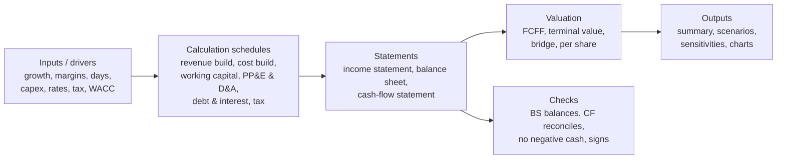

# 10.1 · Model architecture

> **Why this matters:** a financial model is a machine for turning assumptions into statements and statements
> into value — and, more importantly, for showing *how* one becomes the other so that anyone (including you in six
> months) can audit it. Most models fail not on arithmetic but on architecture: inputs scattered everywhere,
> hard-coded numbers inside formulas, no checks, no way to run a scenario. This lesson sets the conventions the
> build-along in [10.5](05-build-along-kaveri-model.md) follows, in Excel or in Python.

**Learning objectives** — after this lesson you can:

- Lay out a model as inputs → calculations → statements → valuation → outputs, with one direction of flow.
- Apply the conventions: inputs in one place, colour coding, sign conventions, one row one formula, checks.
- Choose between Excel and Python for a given task and explain the trade-offs.
- Keep a model hygienic and under version control.

**Prerequisites:** [02.6 Linking the three statements](../02-accounting/06-linking-the-three-statements.md),
[06.3 DCF step by step](../06-valuation/03-dcf-step-by-step.md)  ·  **Time:** ~60 min

---

## 1. The flow

Rules that follow from the flow:

1. **One direction.** Inputs feed calculations feed statements feed valuation. Nothing points backwards. The only
   exception is the deliberate circularity of interest on average debt, which you either break (interest on
   *opening* debt) or control (iteration with a switch).
2. **Historicals on the same rows as forecasts.** Every line has actual columns (FY21–FY26) and forecast columns
   (FY27–FY36) in one row; the formulas change at the boundary, the layout does not. This is what makes the
   forecast auditable against history.
3. **Drivers, not numbers.** Revenue FY27 is not "1,450"; it is FY26 revenue × (1 + growth FY27) where growth is
   an input cell. A forecast is a set of drivers you can defend, not a set of numbers you typed.
4. **Cash is the plug — once.** The balance sheet balances because cash (or a revolver when cash goes negative)
   absorbs the difference between sources and uses computed by the cash-flow statement. No other line is ever
   plugged. If the balance sheet does not balance, the model is wrong, not the plug.

## 2. Conventions

| Convention | Rule | Why |
|:--|:--|:--|
| **Inputs in one place** | One sheet (or one `Assumptions` object) holds every hard-coded number; calculations reference it | You can see and change every assumption; scenario switches are trivial |
| **Colour coding (Excel)** | Blue font = hard-coded input; black = formula; green = link to another sheet; red = check/warning | The industry standard; a reviewer can spot a hard-code inside a formula block instantly |
| **Sign convention** | Pick one and never mix: *expenses positive, subtract in subtotals* (this course) or *expenses negative, sum* | Half of all model errors are sign errors at the boundary between conventions |
| **One row, one formula** | The formula in a row is identical across all forecast columns; copied right | Any column-specific tweak is a hidden hard-code |
| **Units in the header** | ₹ Cr, %, days, x, ₹/share — stated on every block | Unit errors (lakh vs crore, shares in crore vs units) are the second-commonest error |
| **Time axis** | One row of period labels used everywhere; FY end dates; flag actual vs forecast columns | Formulas can test the flag to switch behaviour |
| **Checks row/sheet** | Balance-sheet check = total assets − total liabilities − equity (must be 0); cash-flow check = closing cash from CFS − cash on BS (0); minimum cash ≥ 0; interest cover; sum of quarters = year | A model without checks is a model with unknown errors |
| **No hard-codes in formulas** | `=B5*(1+C12)` not `=B5*1.1` | Every number should have a home in Inputs |
| **No macros for logic** | Formulas, not VBA (Excel); functions, not notebooks with hidden state (Python) | Auditability |
| **Named ranges / named variables** | `tax_rate`, `wacc` | Readability |
| **Version and date** | File name or header: `Kaveri_model_v07_2026-09-22`; change log | You will want v06 back |

## 3. The calculation schedules

Each schedule is a small, self-contained block that turns drivers into a statement line:

| Schedule | Inputs | Outputs to statements |
|:--|:--|:--|
| **Revenue build** | Volume × price; segments; capacity × utilisation; order-book conversion; SSSG × stores | Revenue (P&L) |
| **Cost build** | Gross margin or material % ; employee and other costs as % of sales or fixed + variable | COGS, opex (P&L) |
| **Working capital** | Inventory, receivable, payable days (or % of sales); other current assets/liabilities % | BS balances; ΔNWC (CFS) |
| **PP&E & D&A** | Capex (₹ or % of sales or capacity × cost/unit); useful life or D&A % of opening gross block; disposals | Net block (BS), D&A (P&L), capex (CFS) |
| **Leases** | New leases, amortisation, interest, payments | ROU, lease liability (BS), amortisation & interest (P&L), payments (CFS) |
| **Debt & interest** | Opening balance, repayments, new draws (or revolver logic), rate | Borrowings (BS), interest (P&L), flows (CFS) |
| **Cash & treasury** | Opening cash + net cash flow; yield on cash | Cash (BS), other income (P&L) |
| **Tax** | PBT × rate; deferred tax movement | Tax (P&L), DTL (BS), taxes paid (CFS) |
| **Equity** | PAT − dividends + issuance + SBC | Other equity (BS); dividends (CFS) |
| **Share count** | Basic; dilution (treasury-stock) | EPS; per-share value |

[10.3](03-forecasting-drivers.md) covers each in depth; the point here is that *every statement line comes from
exactly one schedule*, so an error can be traced.

## 4. Excel or Python?

| | Excel | Python (pandas) |
|:--|:--|:--|
| Strengths | Universal; visual; instant recalculation; easy for a reader to inspect a cell; data tables and charts | Reproducible; version-controlled with git; scenario loops and Monte Carlo trivial; reusable across companies; tests |
| Weaknesses | Hard-codes creep in; circularity and errors hide; no tests; painful to run 10,000 scenarios; version control by file name | Harder for non-programmers to inspect; requires discipline to keep it readable; less immediate |
| Best for | Presenting a model to others; one-off deep dives; anything a reviewer must click through | Systematic screens across many companies; scenario/sensitivity engines; models you rerun every quarter |
| This course | Conventions above apply; the build-along gives the Excel layout | `tools/fi/model.py` implements the same architecture: `Assumptions` (inputs) → `project()` (schedules and statements) → `checks` → `fcff_from_projection()` → `valuation` |

A useful hybrid: build and audit the logic in Python (tests, checks), export the statements to Excel for
presentation; or build in Excel and use Python to run the sensitivities on its outputs. What matters is that the
architecture is the same in either tool.

## 5. Model hygiene and version control

- **Start from the template**, not from last year's model of a different company (inherited hard-codes are the
  commonest contamination).
- **Build the historicals first** and make them tie ([10.2](02-historicals-and-data.md)) before forecasting a single
  line.
- **Add the checks before the valuation.** A model that values a company whose balance sheet doesn't balance is
  producing noise with confidence.
- **Freeze inputs when you commit a view.** The assumptions that produced ₹320 for Kaveri are recorded with the
  valuation date; changing them later is a new version, not an edit.
- **Version control**: Python files in git (the casebook repo); Excel files with versioned names and a change log
  sheet; never "final_v2_really_final.xlsx".
- **Document the mapping** from reported lines to model lines (what went into "other expenses", where leases sit,
  which items were reclassified) on a Notes sheet or in the module docstring.
- **Peer review**: the QA checklist in [10.4](04-scenarios-sensitivities-qa.md) — run it on your own model before
  anyone else does.

!!! tip "Trader's lens"
    A model is a pricing library. You would not deploy a pricer with hard-coded vols inside the Black–Scholes
    call, without unit tests, without a version tag, or with a circular reference between the price and the
    vol. The same standards apply: inputs isolated, logic tested (checks), outputs versioned, and a clear map from
    market data (historicals) to parameters (drivers) to price (value).

!!! warning "Common mistakes"
    - Forecasting before the historicals tie.
    - Plugging the balance sheet with something other than cash/revolver (or plugging it twice).
    - Hard-coded numbers inside formulas; column-specific formula edits.
    - Mixing sign conventions between the P&L and the cash-flow statement.
    - Circular interest with no switch; iterative calculation left on so errors propagate silently.
    - No checks; checks that exist but are not on the summary page.

## Key terms

| Term | Meaning |
|:--|:--|
| **Driver** | An input assumption (growth rate, margin, days) from which a statement line is computed |
| **Schedule** | A calculation block for one area (working capital, PP&E, debt) |
| **Plug** | The balancing item; in a well-built model, cash or the revolver, once |
| **Revolver** | A modelled short-term borrowing that draws when cash would fall below a minimum and repays when cash is surplus |
| **Circularity** | A formula that depends (directly or indirectly) on itself, e.g. interest on average debt where debt depends on cash which depends on interest |
| **Check** | A formula that must evaluate to zero/true if the model is consistent |
| **Colour coding** | Blue inputs, black formulas, green links, red checks |
| **Data table** | Excel's built-in two-way sensitivity tool |
| **Version control** | Tracking changes to a model over time (git for code; versioned files and change logs for Excel) |

## Check your understanding

1. Why is cash the right plug and receivables the wrong one?

Answer
Cash is the residual of all other flows by construction (sources − uses), so
letting it absorb the difference is the accounting identity, not a fudge. Plugging receivables would silently
create or destroy revenue-linked assets to hide an error.

2. A model computes interest on average debt, and debt is drawn to cover cash shortfalls that depend on interest.
   Name two ways to handle it.

Answer
Break it: compute interest on opening debt (or opening + scheduled repayments)
so no dependency runs back; or control it: enable iterative calculation with a circularity switch (a cell that
zeroes the interest term when set to 0, so the model can be reset if it explodes).

3. What does "one row, one formula" prevent?

Answer
Column-specific edits — a hard-coded override in FY29's margin, say — that make
one period behave differently from the others without any visible input. If the formula is identical across
columns, every difference between periods comes from the inputs sheet.

4. You inherit a 40-sheet Excel model with no checks. What is the first thing you do?

Answer
Add a checks block: total assets − liabilities − equity for every period; CFS
closing cash − BS cash; and look at whether they are zero. If not, the model's outputs cannot be trusted until the
error is found — that is the only work worth doing first.

## Go deeper

- Paul Pignataro, *Financial Modeling and Valuation* — a full Excel three-statement build with conventions close to
  these.
- The FAST Standard (fast-standard.org) — a published modelling standard (Flexible, Appropriate, Structured,
  Transparent); worth reading once even if you don't adopt every rule.
- `tools/fi/model.py` — the course's Python implementation of this architecture; read `Assumptions` and `project()`.
- Microsoft's Excel documentation on data tables and iterative calculation — for [10.4](04-scenarios-sensitivities-qa.md).

---
[← Previous: 09.7 The forensic checklist](../09-forensics/07-the-forensic-checklist.md) · [Module index](index.md) · [Next: 10.2 Building the historicals →](02-historicals-and-data.md)
