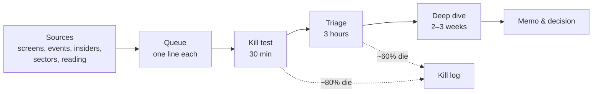

# 11.1 · Idea generation

> **Why this matters:** analysis is expensive; ideas are cheap, but *good* ideas are not. A deep dive takes
> weeks, so what you choose to dive into decides your returns more than how well you dive. This lesson is about
> building a funnel — many candidates in, few survivors out — from screens, events, insider behaviour, sector
> work and reading, inside a circle of competence you can actually defend.

**Learning objectives** — after this lesson you can:

- Run quantitative screens (quality, value, growth, magic formula, coffee-can, net-net) on Screener.in with
  concrete queries, and know what each finds and misses.
- Use event-driven sources: 52-week lows/highs, corporate actions (spin-offs, demergers, buybacks, open offers),
  insider and promoter buying, index changes.
- Generate ideas from sector work, reading and other investors' disclosures.
- Define your circle of competence and keep a funnel and watchlist with kill criteria.

**Prerequisites:** [04.6 Ratio dashboard](../04-financial-analysis/06-per-share-metrics-and-ratio-dashboard.md),
[06.5 Multiples](../06-valuation/05-relative-valuation-and-multiples.md)  ·  **Time:** ~70 min

---

## 1. The funnel

Base rates from practitioners: of 100 ideas queued, 15–20 survive a kill test, 5–8 survive triage, 2–3 become
positions. A funnel that does not kill is not a funnel. The kill log — *why* each idea died — is how you learn
whether your sources are any good.

## 2. Quantitative screens

Screens are hypotheses about where mispricing lives, expressed as filters. Screener.in's query language (free
with an account) is the practical tool in India; the queries below run as written (adjust thresholds).

| Screen | Hypothesis | Screener query (illustrative) | Finds | Misses / traps |
|:--|:--|:--|:--|:--|
| **Quality** | High, stable returns on capital persist and are under-priced by impatient investors | `Return on capital employed > 20 AND Average return on capital employed 5Years > 18 AND Debt to equity < 0.5 AND Sales growth 5Years > 10 AND Market Capitalization > 500` | Compounders; moated businesses | Usually expensive; peak-cycle ROCE for cyclicals; ignores governance |
| **Value** | Low multiples mean-revert | `Price to Earning < 15 AND Price to book value < 2 AND Return on equity > 12 AND Dividend yield > 1` | Cheap, profitable, paying companies | Value traps (cheap for a reason); PSUs and cyclicals dominate; peak earnings |
| **Growth at a reasonable price** | Growth not fully priced | `Sales growth 3Years > 15 AND Profit growth 3Years > 15 AND Price to Earning < 25 AND Return on capital employed > 15` | Mid-caps in early re-rating | Growth bought with capital or credit; check CFO |
| **Magic formula** (Greenblatt) | Rank by earnings yield and ROIC together | Compute EBIT/EV and EBIT/(NWC + net fixed assets); rank each; sum ranks; top 30 | Cheap *and* good | Needs your own EV/ROIC computation; excludes financials/utilities by design |
| **Coffee can** (Saurabh Mukherjea's Indian version) | Consistent growers held for a decade | `Sales growth 10Years > 10 AND Average return on capital employed 10Years > 15` with a year-by-year consistency check on the export | Consistent compounders | Survivorship; fully priced; the 2021–24 experience shows multiples matter |
| **Net-net** (Graham) | Below liquidation value | `Market Capitalization < (Current assets − Total liabilities)` — build from the export; Screener's fields differ | Deep distress; tiny companies | In India, IBC waterfall leaves equity nothing; often governance disasters; illiquid |
| **Cash-flow quality** | CFO backs profit | `Cash from operations last year / Net profit last year > 0.8 AND Return on capital employed > 15 AND Debt to equity < 1` | Honest profits | — |
| **Dividend + buyback yield** | Shareholder returns as a signal of surplus cash | `Dividend yield > 2 AND Return on equity > 15` plus buyback history | Cash-rich, disciplined | Ex-growth; PSUs |
| **Piotroski high-F, low-P/B** | Improving fundamentals in cheap stocks | Build with `fi.forensics.piotroski_f` on a Screener export; P/B < 1.5, F ≥ 7 | Turning value names | Governance overlay essential ([09.5](../09-forensics/05-governance-red-flags-india.md)) |
| **Forensic exclusion** | Remove the dangerous | Exclude: promoter pledge > 20%; CFO/PAT 3-yr < 50%; auditor resignation; ASM/GSM | — | Run on every list, not as an idea source |

Practical rules: screen on **three-to-five-year averages** not single years; export to Excel and add columns
the screener lacks (CFO/PAT, pledge, RPT share); rerun monthly and watch *entrants and exits* rather than the
static list; and remember that every screen is run by thousands of others — the edge is in what you do next, not
in the query.

## 3. Event-driven sources

| Source | Why it produces mispricing | Where |
|:--|:--|:--|
| **52-week lows** (with reason) | Forced or emotional selling; the question is whether the reason is permanent | Screener/exchange lists; check the news and the numbers before the narrative |
| **52-week highs / breakouts** | Momentum with fundamentals (post-earnings drift) | Same; fundamental confirmation needed |
| **Demergers and spin-offs** | Spun entities are sold by index funds and holders who didn't want them; get their own multiples later | Scheme announcements (exchanges); NCLT approvals; [12.3](../12-macro-special-sits/03-special-situations.md) |
| **Buybacks** (tender offers) | Signal of surplus cash and management's price view; arbitrage in the acceptance ratio | Announcements |
| **Open offers / delisting** | Price floors and premiums | SAST filings |
| **Rights issues** | Renunciation mispricing; forced participation | Announcements |
| **Promoter / insider buying** | Informed buyers | PIT Reg 7 disclosures; SAST creeping acquisition |
| **Institutional 13F-like data** | India: mutual-fund monthly portfolios (AMFI/AMC sites), bulk/block deals, superstar-investor holdings (shareholding pattern > 1%) | Follow *changes*, with a lag discount |
| **Index inclusion/exclusion** | Forced flows | Index-provider announcements ([12.3](../12-macro-special-sits/03-special-situations.md)) |
| **IPOs / QIPs / OFS** | Supply events; pricing set by bankers | SEBI DRHP list; underperformance base rates ([03.5](../03-reading-filings/05-other-documents.md)) |
| **Regulatory changes** | Winners and losers repriced slowly | SEBI/RBI/ministry circulars; budget documents |
| **Results season** | Post-earnings-announcement drift; guidance changes | Exchange filings; concalls ([03.4](../03-reading-filings/04-quarterly-results-and-concalls.md)) |

## 4. Sector rotation and reading

- **Sector work** ([Module 08](../08-sectors/index.md)): a sector map yields the two or three companies best
  placed for the next phase (the capital-cycle turn; the regulatory change); ideas from structure, not screens.
- **Competitors' concalls**: the best free source on any company is its rival's call; also the source of "who
  is taking share".
- **Reading widely**: annual reports of companies you don't own (Buffett's method); trade journals; the
  business press for *facts*, not conclusions; SEBI orders for what to avoid; other investors' letters and
  memos for frameworks (never for tips).
- **Idea journals**: write down every idea with its source and the date; review quarterly which sources
  produced positions and which produced kills.

## 5. Circle of competence

Buffett's phrase; the practical version: *the set of businesses whose economics, KPIs and risks you can explain
to a sceptic without notes, and for which you know what would prove you wrong.* Draw it explicitly:

| Inside (for a vol trader turned fundamental investor, illustrative) | Edge | Outside (for now) |
|:--|:--|:--|
| Exchanges, brokers, AMCs, depositories | You understand the plumbing and the regulatory calculus from the inside | Pharma (regulatory science) |
| Lenders with disclosed unit economics | Carry-trade intuition; RoA tree | Real-estate NAV (land valuation judgement) |
| Industrials with clear KPIs (pumps, components) | Numerical; the course's running example | Biotech, defence electronics (technology judgement) |
| IT services (AI transition as a vol event) | Regime thinking | Media content |

The circle grows by doing case studies ([Module 13](../13-case-studies/index.md)) and capstones
([Module 15](../15-capstone/index.md)), one sector at a time. Ideas outside it go to the queue with a flag, not
to the deep dive.

## 6. The watchlist and kill criteria

Every idea that survives triage but is not bought (price too high, catalyst absent) goes on a **watchlist** with:
the price at which it becomes attractive (from [06.8](../06-valuation/08-margin-of-safety-and-expected-value.md)),
the event that would change the view, the date to revisit, and the kill criteria (what would remove it). Kaveri,
from this course's analysis: *watchlist; attractive below ₹260 with receivable days < 85; revisit at Q3 FY27
results; kill if the pledge exceeds 15% or the auditor qualifies.*

!!! tip "Trader's lens"
    Idea generation is signal research. Screens are factors with known crowding; events are catalysts with
    known base rates; insider buying is informed flow. The discipline that transfers is the log: record every
    signal, what you did, and what happened, and let the realised hit rate — not the story — decide which sources
    you keep.

!!! info "India notes"
    - Screener.in's fields and their definitions (ROCE, OPM) are on its site; export to Excel for anything
      beyond a first pass. Tijori, Trendlyne, Tikr and the exchanges' own screeners offer other fields
      (pledges, promoter holding changes, bulk deals).
    - Mutual-fund portfolio disclosures are monthly and free; superstar-investor tracking is a cottage industry
      — the base rate for following it is poor without your own work.
    - SME-exchange stocks and stocks under ASM/GSM should be excluded from screens by default
      ([09.5](../09-forensics/05-governance-red-flags-india.md)).

!!! warning "Common mistakes"
    - Screening on single-year numbers.
    - Buying the screen output instead of researching it.
    - Following famous investors' holdings without knowing their thesis, cost or exit.
    - No kill log — the same bad sources keep producing.
    - A circle of competence defined by what you *own* rather than what you *understand*.

## Key terms

| Term | Meaning |
|:--|:--|
| **Funnel** | The staged filtering of ideas from sources to positions |
| **Screen** | A quantitative filter applied to a universe of stocks |
| **Magic formula** | Greenblatt's joint ranking on earnings yield and return on capital |
| **Coffee-can investing** | Buying consistent compounders and holding for a decade |
| **Net-net** | Market cap below net current assets minus all liabilities |
| **Post-earnings-announcement drift** | Tendency of prices to continue moving after a surprise |
| **Circle of competence** | The businesses you understand well enough to know when you are wrong |
| **Watchlist** | Ideas that passed research but await a price or event |
| **Kill criteria / kill log** | Pre-set reasons to drop an idea; the record of dropped ideas and why |

## Check your understanding

1. Write a Screener query for "profitable, cash-generative, low-leverage mid-caps growing 15%+", then list two
   traps in its output.

Answer
`Market Capitalization > 2000 AND Market Capitalization < 30000 AND Sales growth 3Years > 15 AND Return on capital employed > 18 AND Debt to equity < 0.5 AND Cash from operations last year / Net profit last year > 0.8`.
Traps: cyclicals at peak (3-year growth from a trough); companies whose CFO/PAT is good this year but not over three
(add a 3-year check from the export); governance not captured (pledges, RPTs).

2. A stock hits a 52-week low after a promoter pledge invocation. Idea or kill?

Answer
Usually kill on governance grounds unless the business is sound and the promoter's
problem is separable — check who now holds the shares, whether the pledge is fully invoked, and the company's own
balance sheet. Forced selling can create bargains, but pledge invocations are mostly the start of a story, not
the end.

3. Why is a demerger a better idea source than a screen?

Answer
It creates a structural, temporary mispricing (forced selling by holders who
didn't choose the spun entity; no analyst coverage; no index membership) that screens cannot see because the
entity has no trading history — fewer competitors, more edge.

4. Your circle of competence excludes pharma. A friend's pharma idea looks compelling. What do you do?

Answer
Queue it, flagged "outside circle"; if the sector interests you, start the sector
work ([08.4](../08-sectors/04-pharma-and-healthcare.md)) and a case study before any position — or size it as a
speculative position with a hard max-loss, acknowledging you cannot judge the thesis-breakers.

## Go deeper

- Joel Greenblatt, *The Little Book That Beats the Market* — the magic formula and its logic.
- Saurabh Mukherjea, *Coffee Can Investing* — the Indian consistency screen and its caveats.
- Screener.in's query documentation and the "Export" feature; Tijori's pledge and promoter-change screens.
- Warren Buffett, 1996 Berkshire letter — the circle of competence passage.

---
[← Previous: 10.5 Build-along: the Kaveri model](../10-modeling/05-build-along-kaveri-model.md) · [Module index](index.md) · [Next: 11.2 The research process →](02-the-research-process.md)
