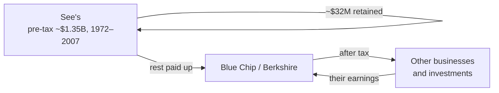

# G1 · See's Candies (1972): paying three times tangible book for a box of chocolates

> It is December 1971. A family-run West Coast chocolate maker is for sale. It earns about $2 million a year after
> tax on roughly $8 million of operating assets, sells for cash, and operates in an industry whose volume barely
> grows. The family wants about $30 million for the operating business. Warren Buffett, who made his name buying
> businesses for *less* than their assets were worth, will pay $25 million and not a cent more. His partner, Charlie
> Munger, thinks $30 million is fair. Inflation is above 4%, and federal price controls are in force. Is a candy
> company worth three to four times what its assets cost? Working out the answer teaches three ideas you will use for
> the rest of the course: **return on incremental capital**, **economic vs accounting goodwill**, and **why
> inflation punishes capital-heavy businesses**.

| | |
|:--|:--|
| **Period** | 1971 (decision) → 1983 (first review) → 2014 (Buffett's last detailed numbers) |
| **Decision date** | Mid-December 1971, just before Blue Chip Stamps signs the Stock Purchase Agreement of 21-Dec-1971 |
| **Sector** | Consumer: boxed chocolates made and sold through the company's own shops (US West Coast) |
| **Themes** | Pricing power · capital-light compounding · return on incremental capital · economic vs accounting goodwill · inflation · excess cash and EV · capital allocation |
| **Modules this case reinforces** | [01.2 Market cap & EV](../../01-markets-101/02-shares-market-cap-and-enterprise-value.md) · [01.5 Returns math](../../01-markets-101/05-time-value-and-returns-math.md) · [02.5 Cash flow & owner earnings](../../02-accounting/05-the-cash-flow-statement.md) · [02.8 Goodwill](../../02-accounting/08-deeper-cuts-group-accounts-and-other.md) · [04.1 Growth](../../04-financial-analysis/01-growth-analysis.md) · [04.3 Returns on capital](../../04-financial-analysis/03-returns-on-capital.md) · [04.4 Working capital](../../04-financial-analysis/04-working-capital-and-cash-conversion.md) · [05.3 Moats](../../05-business-analysis/03-moats-and-competitive-advantage.md) · [05.5 Capital allocation](../../05-business-analysis/05-management-and-capital-allocation.md) · [06.5 Multiples](../../06-valuation/05-relative-valuation-and-multiples.md) · [06.6 Reverse DCF](../../06-valuation/06-reverse-dcf-and-expectations.md) · [12.1 Macro](../../12-macro-special-sits/01-macro-for-equity-investors.md) |
| **Difficulty** | Intermediate (after Modules 04 and 06) |
| **Time** | ~2.5 hours (45 min on sections 1–3 before reading on) |

!!! note "How to use this case"
    Read sections 1–2, then **answer section 3 in writing before reading section 4**. Figures are in US dollars and
    1970s US accounting. Most come from Buffett's shareholder letters and Blue Chip Stamps' SEC filings
    ([Sources](#sources)). Buffett rounds the same 1972 figures slightly differently in different letters; section 2
    reconciles them instead of hiding the gaps.

---

## 1. The scene (as of December 1971)

### The business

Charles See founded See's Candies in Los Angeles in 1921, selling his mother Mary See's recipes from shops designed to
look like her kitchen ([Fortune 2012][fortune]; [IDCH][idch]; [2020 letter][l2020]). By 1960 See's had 124 shops across
California. By 1971 it had more than 150 in the western states and Hawaii ([IDCH][idch]). Candy was made in two
company-owned kitchens in Los Angeles and South San Francisco, about 220,000 sq ft in total. It was sold through
company-run shops, most of them in leased space ([Blue Chip 10-K FY72][bcs72]).

Three operating features drive the economics:

1. **Cash sales.** Customers paid at the counter, so there were essentially no **accounts receivable** (money owed by
   customers) ([2007 letter][l2007]).
2. **A short production-and-distribution cycle.** Fresh candy is made for immediate sale, so the company holds little
   **inventory** (stock held for sale). On Blue Chip's 4-Mar-1972 balance sheet, candy inventory was $1.46 M, about
   17 days of annual sales. March is a seasonal low, so read that as a floor ([10-K FY72][bcs72]).
3. **Heavy seasonality.** Later letters quantify it. In 1984, the four weeks before Christmas brought 40% of volume
   and about 75% of profit ([1984 letter][l1984]).

### The industry

Looking back in 2007, Buffett described boxed chocolates as an unexciting industry. Per-capita consumption was low
and flat, many once-important brands had disappeared, and only three companies had earned more than token profits in
forty years ([2007 letter][l2007]). A 1971 buyer would have seen flat industry volume. The hypothesis to test
(section 3) is that See's sells a gift, where brand, taste and service matter more than a few cents a pound.

### Management and sellers

Charles See died in 1949. His son Laurance ran the company until his own death in 1969. Laurance's brother Harry then
became president ([IDCH][idch]). The controlling family wanted to sell ([2014 letter][l2014]). The operating number two
was **Chuck Huggins**, 46, the executive vice-president, who had signed an employment agreement with See's on
15-Sep-1970 ([2005][l2005]; [1991][l1991]; [10-K FY72][bcs72] exhibits). See's filed its own Form 10-K for the year to Aug-1971
([10-K FY72][bcs72]).

### The buyer: a shrinking stamp company with a pile of float

**Blue Chip Stamps** sold trading stamps to about 20,000 retailers in California, Nevada, Oregon and Arizona.
Shoppers collected the stamps and redeemed them for merchandise ([10-K FY72][bcs72]). Retailers paid for the stamps
long before shoppers redeemed them, so Blue Chip held **float**: cash it holds today against obligations it pays
later. At March 1972 the liability for unredeemed stamps was $89.2 M, and Blue Chip held $134.7 M of marketable
securities ([Blue Chip AR FY73][bcs73]).

The core business was shrinking. Stamp revenue peaked at $125.9 M (year to Feb-1970) and slipped to $120.0 M (year to
Feb-1971), with the fall concentrated in the second half. Supermarkets were switching to discount pricing, and a
large rival had copied Blue Chip's low-price model. A 1967 antitrust consent decree also required Blue Chip to propose
selling a third of its California business ([10-K FY72][bcs72]). Buffett, Munger and Berkshire had major stakes;
Buffett later wrote that he and Munger controlled Blue Chip at the time ([2014][l2014]; [2007][l2007]). By February
1974 Buffett disclosed ≈ 13% personally and ≈ 50% with associates ([Blue Chip 10-K/A 1974][bcs74]). The See's lead came
to Munger through Robert Flaherty, an investment counsellor to Blue Chip ([Fortune 2012][fortune]).

### What the price said

The price that mattered was the family's ask. On a 100% basis they asked a **nominal $40 M**. See's held about
**$10 M of excess cash**, so the ask for the operating business was **$30 M**. Buffett saw about $7 M of tangible net
worth and capped his bid at **$25 M** ([1991 letter][l1991]). Munger thought $30 M was fair ([2014][l2014]). Ira
Marshall pushed them to pay up, and Munger later said the pair had been "too cheap" ([Fortune 2012][fortune]). Buffett
admitted that three times net tangible assets "made me gulp" ([2014][l2014]).

The macro backdrop, all known in December 1971:

- 10-year US Treasury yield: **5.93%** in Dec-1971 ([FRED GS10][fred]).
- S&P 500 at end-1971: 102.09 on trailing earnings of $5.57, a **P/E of ≈ 18.3×** (earnings yield 5.46%)
  ([Damodaran][dam-erp]).
- CPI inflation: **5.8% in 1970 and 4.3% in 1971** ([Minneapolis Fed][cpi]).
- **15-Aug-1971:** Nixon announced a 90-day wage and price freeze ([Fed History][frh-nixon]). Controls continued in
  phases until 1974 ([Fed History][frh-gi]), so anyone planning to raise prices faced a regulator.

---

## 2. The numbers then

### Table 2.1 — See's at the decision date

| Item | Value | Source / note |
|:--|--:|:--|
| Sales, fiscal year to Aug-1971 | just over $28 M | [IDCH][idch] |
| Candy sales, 1972 | $29–31.3 M | $29 M ([1991][l1991]); $30 M ([2007][l2007]); $31.3 M total revenue ([1983 table][l1983]) |
| Pre-tax earnings at purchase | ≈ $4.2 M | $4.2 M for 1972 ([1991][l1991]); "about $4 M" ([2014][l2014]); "less than $5 M" ([2007][l2007]) |
| After-tax earnings at purchase | ≈ $2.1 M | $2.083 M for 1972 ([1983 table][l1983]); "about $2 M" ([1983 appendix][l1983]) |
| Pounds of candy sold | ≈ 17.0 M | 16.954 M in 1972 ([1983 table][l1983]) |
| Shops | 150–167 | >150 in 1971 ([IDCH][idch]); 161 in mid-1972 ([10-K FY72][bcs72]); 167 at end-1972 ([1983][l1983]) |
| Operating net tangible assets (NTA) | $7–8 M | $7 M ([1991][l1991]); $8 M ([1983][l1983], [2007][l2007], [2014][l2014]); ≈ $7.6 M derived below |
| Excess cash | ≈ $10 M | [1991 letter][l1991] |
| Book equity including cash | ≈ $17.6 M | Derived: working capital $11.006 M + property $6.602 M at acquisition ([AR FY73][bcs73]) |
| Debt | Seasonal only | [1983 appendix][l1983]; [2007][l2007] |

!!! info "Reconciling 'net tangible assets'"
    **Net tangible assets (NTA)** are total assets minus intangibles minus liabilities: the physical and financial
    capital the business actually uses. Buffett counts receivables as tangible and, for operating analysis, leaves
    out cash the business doesn't need. Blue Chip's accounts let us rebuild the figure. At acquisition, See's brought
    working capital of $11.006 M and property of $6.602 M, so book equity was ≈ $17.6 M. Remove ≈ $10 M of excess cash
    and operating NTA is **≈ $7.6 M**, between Buffett's "$7 M" and "$8 M". The purchase accounting agrees. Blue Chip
    paid $34.661 M for 99%. Goodwill of $16.245 M + $0.978 M = $17.223 M, which implies net assets of $17.44 M for 99%,
    or $17.6 M for 100%. When sources disagree, reconcile them. Don't pick the number you like.

### Table 2.2 — Sellers' ask vs buyer's limit

"EV" here means **enterprise value**: the price of the operating business, net of cash it doesn't need
([01.2](../../01-markets-101/02-shares-market-cap-and-enterprise-value.md)). Multiples use 1972 earnings ($2.083 M
after tax, $4.2 M pre-tax) and operating NTA of $7–8 M.

| | Sellers' ask | Buffett's limit (= price paid) | Benchmark, Dec-1971 |
|:--|--:|--:|--:|
| Nominal equity price, 100% ($ M) | 40.0 | ≈ 35.0 ($34.661 M paid for 99%) | |
| Less excess cash ($ M) | (10.0) | (10.0) | |
| **Price of operating business, "EV" ($ M)** | **30.0** | **25.0** | |
| EV / after-tax earnings | 14.4× | 12.0× | S&P 500 P/E 18.3× |
| After-tax earnings yield | 6.9% | 8.3% | S&P 500 5.46%; 10-yr UST 5.93% |
| EV / pre-tax earnings | 7.1× | 6.0× | |
| Pre-tax earnings yield | 14.0% | 16.8% | |
| EV / operating NTA | 3.75–4.29× | 3.13–3.57× | |
| Nominal price / book incl. cash | 2.3× | 2.0× | |

### Table 2.3 — The buyer: Blue Chip Stamps (fiscal years ending about 1 March)

$ M, as reported in the FY72 Form 10-K ([10-K FY72][bcs72]).

| Fiscal year ended | Mar-1968 | Mar-1969 | Feb-1970 | Feb-1971 | Mar-1972* |
|:--|--:|--:|--:|--:|--:|
| Stamp service revenue | 91.8 | 108.4 | 125.9 | 120.0 | 102.5 |
| Interest & dividends | 2.2 | 2.8 | 4.7 | 6.2 | 6.4 |
| Pre-tax income (before securities gains/losses and extraordinary items) | 4.7 | 10.4 | 14.7 | 13.8 | 8.1 |
| Net income | 3.4 | 2.0 | 7.4 | 8.6 | 4.2 |

\*Reported in mid-1972, after the decision date. It includes two months of See's. Stamp revenue is 18.5% below the
FY70 peak. In December 1971 you would have had FY71 and the knowledge that the decline was accelerating.

### Derived ratios

| Ratio | Formula | Value | What it says |
|:--|:--|--:|:--|
| After-tax return on operating NTA | 2.083 / 7.6 | 27.4% | 25–30% on NTA of $7–8 M; Buffett's round figure is 25% ([1983 appendix][l1983]) |
| Pre-tax return on operating NTA | 4.2 / 7.6 | 55% | Buffett: 60% pre-tax on $8 M ([2007][l2007]) |
| ROE including idle cash | 2.083 / 17.6 | 11.8% | Ignores interest on the cash; idle cash hides the operating return ([04.3](../../04-financial-analysis/03-returns-on-capital.md)) |
| Effective tax rate | 1 − 2.083 / 4.2 | ≈ 50% | Half of each pre-tax dollar went in tax |
| Pre-tax margin | 4.2 / 29 to 4.2 / 31.3 | 13–15% | Returns come from capital efficiency, not margin |
| Revenue per pound | 31.337 / 16.954 | $1.85 | The "price" in volume × price ([04.1](../../04-financial-analysis/01-growth-analysis.md)) |
| Fixed-asset turnover | 31.3 / 6.6 | ≈ 4.7× | Light plant |
| Inventory days (seasonal low) | 1.459 / 31.337 × 365 | ≈ 17 | Fresh product, short cycle |

All ratios were checked in Python; the core script is at the end of section 7.

---

## 3. You are the analyst

Use **only** sections 1–2, and write your answers down before opening section 7.

1. **(Numerical: EV.)** Why do the $40 M ask and Buffett's $25 M limit measure different things? Compute P/E and
   EV/NTA at the $30 M net ask and at $25 M, using $2.083 M after-tax earnings and NTA of $7.6 M.
2. **(Numerical: justified multiple.)** Use the justified price-to-book formula from
   [06.5](../../06-valuation/05-relative-valuation-and-multiples.md), $P/B = (ROE - g)/(r - g)$, with ROE = 27.4%.
   Compute justified EV/NTA for $r$ = 9% and 10% and $g$ = 2%, 3% and 4%. Which prices does that range support?
3. **(Numerical: reverse DCF.)** If See's never needs extra capital, what perpetual nominal growth does a $25 M price
   imply at a 10% required return? What does $30 M imply? Compare both with 1970–71 inflation. Then redo $25 M
   assuming new earnings need capital at a 25% return (**RONIC**, return on new invested capital), using
   $V = E(1 - g/\text{RONIC})/(r - g)$.
4. **(Numerical: inflation.)** See's earns $2 M on $8 M of NTA. A "mundane" business earns $2 M on $18 M, so it is
   worth about its NTA. Suppose the price level doubles and unit volumes and margins stay the same. Each business must
   then double its NTA to double nominal earnings. How much new capital does each owner add? If each business keeps
   its original valuation basis, how much value does each new dollar create?
5. **(Numerical: accretion.)** Blue Chip signed a Bank of America loan agreement on 30-Dec-1971, between the
   purchase agreement and closing. The bank note stood at ≈ $32.7 M at 4-Mar-1972: $27.259 M long-term plus a
   $5.452 M current portion. Assume the loan funded the purchase. At a 6.5% interest rate and a 50% tax rate, estimate the net annual effect on Blue Chip's after-tax income and on
   earnings per share (5.116 M diluted shares). A deal is **accretive** if it raises the buyer's EPS.
6. **(Numerical: accounting.)** The deal creates ≈ $17 M of **goodwill**: price paid minus the fair value of net
   identifiable assets. Rules then required amortising goodwill in equal annual charges over at most 40 years, and the
   charge was not tax-deductible. Compute the annual charge and compare it with 1972 after-tax earnings. Should it
   enter your valuation?
7. **(Evidence.)** The thesis is **pricing power**: the ability to raise prices faster than costs without losing much
   volume. What could you gather in December 1971 to test it, and what would falsify it?
8. **(Risks.)** List the five biggest risks a sceptic would have raised in December 1971. Give one metric to monitor
   for each.
9. **(Judgement.)** State your maximum price with a bear, base and bull case. Would you have walked away at $30 M?

---

## 4. What happened

### Timeline

| Date | Event | Source |
|:--|:--|:--|
| 15-Aug-1971 | 90-day wage and price freeze; controls continue in phases to 1974 | [Fed History][frh-nixon]; [Fed History][frh-gi] |
| 21-Dec-1971 | Blue Chip signs the Stock Purchase Agreement | [10-K FY72][bcs72] (exhibit 13.8) |
| 30-Dec-1971 | Loan agreement with Bank of America | [10-K FY72][bcs72] (exhibit 13.9) |
| 3-Jan-1972 | Blue Chip buys 67% of See's; Huggins put in charge that day | [AR FY73][bcs73] Note 1; [1991][l1991]; [2005][l2005] |
| 4-Mar-1972 | 93% owned after a **tender offer** (a public offer to all holders) and purchases; 98.5% by 10-May-1972 | [10-K FY72][bcs72]; [AR FY73][bcs73] |
| 3-Mar-1973 | 99% owned for a total cost of $34.661 M; goodwill amortised over 40 years | [AR FY73][bcs73] Note 1 |
| 1973 | After-tax profit dips to $1.94 M; price per pound up only 6.5% | [1984 table][l1984] |
| 1974–75 | Price per pound up 17.2%, then 14.4%; after-tax profit rises from $3.0 M to $5.1 M | [1984 table][l1984] (derived) |
| 1979–83 | Same-store pounds fall ≈ 8% in total as prices rise | [1983 letter][l1983] |
| 1983 | After-tax profit $13.7 M on ≈ $20 M NTA. Berkshire, 60% owner of Blue Chip, merges it in. Goodwill appendix published | [1983 letter][l1983] |
| 1984 | Price increase held to 1.4% ($5.49/lb) to protect volume | [1984 letter][l1984] |
| 1986 | Capex runs $0.5–1 M a year above depreciation, simply to hold ground competitively | [1986 letter][l1986] |
| 1991 | Pre-tax margin a record 21.6%; ≈ 80% of sales in California, hit by recession and a new snack-food sales tax | [1991 letter][l1991] |
| 2002 | US GAAP stops requiring goodwill amortisation | [2001][l2001]; [2002][l2002] letters |
| End-2005 | Huggins hands over to Brad Kinstler after 34 years in charge | [2005 letter][l2005] |
| 1991–2014 | Profit and capital milestones | Table 4.2 |

### Table 4.1 — The first twelve years (volume × price)

Sales, profit, pounds and shops are from the [1984 letter][l1984]; $/lb and margin are derived; CPI is from the
[Minneapolis Fed][cpi]. Money figures in $ M.

| Year | Sales | After-tax profit | Pounds (M) | Shops | $/lb | Δ $/lb | CPI Δ | After-tax margin |
|:--|--:|--:|--:|--:|--:|--:|--:|--:|
| 1972 | 31.3 | 2.08 | 16.95 | 167 | 1.85 | — | 3.3% | 6.6% |
| 1973 | 35.1 | 1.94 | 17.81 | 169 | 1.97 | 6.5% | 6.2% | 5.5% |
| 1974 | 41.2 | 3.02 | 17.88 | 170 | 2.31 | 17.2% | 11.1% | 7.3% |
| 1975 | 50.5 | 5.13 | 19.13 | 172 | 2.64 | 14.4% | 9.1% | 10.2% |
| 1976 | 56.3 | 5.57 | 20.55 | 173 | 2.74 | 3.9% | 5.7% | 9.9% |
| 1977 | 62.9 | 6.15 | 20.92 | 179 | 3.01 | 9.7% | 6.5% | 9.8% |
| 1978 | 73.7 | 6.18 | 22.41 | 182 | 3.29 | 9.4% | 7.6% | 8.4% |
| 1979 | 87.3 | 6.33 | 23.99 | 188 | 3.64 | 10.7% | 11.3% | 7.2% |
| 1980 | 97.7 | 7.55 | 24.07 | 191 | 4.06 | 11.5% | 13.5% | 7.7% |
| 1981 | 112.6 | 10.78 | 24.05 | 199 | 4.68 | 15.3% | 10.3% | 9.6% |
| 1982 | 123.7 | 11.88 | 24.22 | 202 | 5.11 | 9.1% | 6.1% | 9.6% |
| 1983 | 133.5 | 13.70 | 24.65 | 207 | 5.42 | 6.1% | 3.2% | 10.3% |
| 1984 | 135.9 | 13.38 | 24.76 | 214 | 5.49 | 1.4% | 4.3% | 9.8% |

**Reading the table (1972–83):**

- Price per pound compounded at **10.3% a year**, against CPI at **8.2%**.
- Pounds grew **3.5%** a year and shops **2.0%**. Sales grew **14.1%** a year and after-tax profit **18.7%**.
- In real terms, profit rose ≈ 2.8× while price per pound rose only ≈ 1.23×. Inflation passed through, plus a small
  real price gain on a stable cost base, did most of the work.
- In 1979–80, price rises lagged inflation and after-tax margins sat at 7–8%, down from ≈ 10% in 1975–77.
- In 1981–83, price rises outran inflation and same-store volume fell ([1983][l1983]).

Pricing power was real. It also had limits.

### Table 4.2 — The long run

| Year | Sales ($ M) | Pre-tax profit ($ M) | Capital employed ($ M) | Cumulative pre-tax since 1972 ($ M) | Source |
|:--|--:|--:|--:|--:|:--|
| 1972 | 29–31 | 4.2 | 7–8 | — | [1991][l1991]; [1983][l1983] |
| 1983 | 133.5 | 27.4 | ≈ 20 (NTA) | — | [1983][l1983] |
| 1991 | 196 | 42.4 | 25 (net worth) | ≈ 428 ($410 M paid up + $18 M retained) | [1991][l1991] |
| 1999 | — | 74 (24% op. margin) | "very little additional" | 857 | [1999][l1999] |
| 2003 | — | 59 | — | — | [2003][l2003] |
| 2007 | 383 | 82 | 40 | 1,350 | [2007][l2007] |
| 2011 | — | 83 (record) | < 0 net of cash at year-end | 1,650 | [2011][l2011] |
| 2014 | — | — | +40 added since 1972 | 1,900 | [2014][l2014] |

**Derived from Table 4.2:**

- 2008–11 pre-tax averaged ≈ $75 M a year ($300 M cumulative); 2012–14 averaged ≈ $83 M ($250 M). Nominal profit was
  roughly flat from 2007 to 2014.
- From 1972 to 2007, pre-tax compounded at 8.9% nominal and ≈ 4.0% real. At 2007 prices, 1972's $4.2 M is ≈ $20.8 M.
- Pounds grew ≈ 1.9% a year (16 M → 31 M). Revenue per pound grew ≈ 5.6% a year, against CPI at 4.7%.

### The investment outcome

See's was never separately listed after 1972, so there is no share price to track. The outcome is the cash earned on
the $25 M paid for the operating business:

| Horizon | Year | After-tax profit ($ M) | Yield on $25 M | Cumulative after-tax profit ($ M) |
|:--|:--|--:|--:|--:|
| 1 year | 1972 | 2.08 | 8.3% | 2.1 |
| 3 years | 1974 | 3.02 | 12.1% | 7.0 |
| 5 years | 1976 | 5.57 | 22.3% | 17.7 |
| 12 years | 1983 | 13.70 | 54.8% | 80.3 |

By 2007 See's earned $82 M pre-tax a year, 3.3× the purchase price, with only $32 M reinvested ([2007][l2007]).

**An illustrative IRR** (internal rate of return: the discount rate at which the present value of the cash flows
equals the price; see [01.5](../../01-markets-101/05-time-value-and-returns-math.md)). Take 1972–83 after-tax profits
and subtract the ≈ $12 M NTA build-up, spread evenly across the years:

| Terminal value at end-1983 | IRR |
|:--|--:|
| None | 13.4% |
| NTA only ($20 M) | 15.7% |
| 12× after-tax earnings, the purchase multiple (≈ $164 M) | ≈ 24.5% |

For comparison, $25 M in the S&P 500 over 1972–83, with dividends reinvested, grew to ≈ $69 M. That is 8.9% a year,
or ≈ 0.6% a year after 8.2% CPI inflation ([Damodaran returns][dam-ret]).

Almost all of See's earnings left the business: first to Blue Chip, then to Berkshire, which used them to buy other
businesses ([2007][l2007]; [2014][l2014]).



---

## 5. Signals: knowable then vs hindsight

| Knowable in December 1971 | Visible only in hindsight |
|:--|:--|
| 25–30% after-tax return on operating NTA, with no debt ([1983 appendix][l1983]) | That the return would *rise* to 65% after tax on NTA by 1983 ([1983][l1983]) |
| Cash sales, low inventory, light plant: growth needs little capital | That 36 years of growth would need only $32 M ([2007][l2007]) |
| A brand built over 50 years ([2007][l2007]), sold through 150+ company-run shops ([IDCH][idch]) | That concentration (≈ 80% California by 1991) would bite in the 1991 recession ([1991][l1991]) |
| Inflation at 4–6%, which makes nominal pricing power valuable ([CPI][cpi]) | That inflation would reach 11.1% in 1974 and 13.5% in 1980 ([CPI][cpi]) |
| Price controls in force since Aug-1971 ([Fed History][frh-nixon]) | That controls would be gone by 1974–75, when price per pound rose 17% and then 14% |
| An internal successor (Huggins) under contract since 1970 ([10-K FY72][bcs72]) | That he would run See's for 34 years ([2005][l2005]) |
| Flat industry volume; See's at ≈ 17 M lb | Volume growth of only ≈ 2% a year to 2007, and falling same-store volume in 1979–83 when price was pushed |
| Blue Chip's shrinking core and float needing a home | That efforts to expand candy would be "largely futile" ([2014][l2014]) |

**The strongest bull case at the time** was Munger's and Marshall's, and it needed no hindsight:

- The business earns ≈ 25% after tax on capital it barely needs to grow.
- It sells a gift whose buyers care more about the brand than a few cents a pound, and its prices sit below what that
  loyalty would bear. Buffett's own diagnosis was "untapped" pricing power ([1991][l1991]).
- Inflation will lift nominal earnings with little new capital, and the buyer has float that needs a productive home.
- At 12–14× after-tax earnings, you pay *less* than the S&P 500's 18.3× for far higher returns. Section 3's reverse DCF
  makes the point: at $25 M, a 10% return needs under 2% a year of perpetual nominal growth, below the inflation of
  the day.

**The strongest bear case** was also real:

- You pay 3–4× the assets for a candy maker in a no-growth industry, concentrated in one state and exposed to sugar,
  cocoa and nut prices.
- The central assumption, raising prices, runs straight into federal price controls.
- The founding family is leaving.
- The buyer is borrowing ≈ $33 M against a shrinking, litigated stamp business.
- Paying up for intangibles cut against Buffett's own habit, by his account, of buying fair businesses at wonderful
  prices ([2014][l2014]). He nearly walked away.

!!! warning "Guarding against hindsight bias"
    - **Survivorship.** We study See's because it worked. Many once-important chocolate brands disappeared
      ([2007][l2007]). Ask what would have made *this* one fade: changing tastes, better rival shops, a quality slip.
    - **Outcome ≠ process.** Neither the 1973 dip nor the 1999–2003 fall in pre-tax profit ($74 M → $59 M) changed the
      long-run verdict. Judge the 1971 decision on section 2's evidence
      ([11.6](../../11-process/06-behavioural-finance-and-decision-journals.md)).
    - **The heroes nearly missed it.** Buffett nearly lost the deal over $5 M. Around the same time he passed on a TV
      station he knew was a See's-like business ([2007][l2007]). Price discipline is a virtue; anchoring on tangible
      book is not.
    - **Inflation flatters.** In real terms, profit grew ≈ 4% a year from 1972 to 2007. That is superb for a business
      needing almost no capital, but it is not magic.

---

## 6. Lessons

1. **Judge a business by the return on the capital it needs, and above all on the *next* dollar.**
   **Return on incremental capital** = Δ profit ÷ Δ capital employed.
    - 1972–83: after-tax profit rose $11.6 M on $12 M of extra NTA, ≈ **97%**.
    - 1972–2007: pre-tax profit rose ≈ $77 M on $32 M, ≈ **240%** pre-tax.
    - Contrast FlightSafety: $159 M of extra pre-tax on $509 M of incremental investment ([2007][l2007]).

    → [04.3](../../04-financial-analysis/03-returns-on-capital.md); [06.1](../../06-valuation/01-what-is-value.md).

2. **Economic goodwill is not accounting goodwill.**
    - **Accounting goodwill** is a balancing figure: price paid minus the fair value of net identifiable assets.
    - **Economic goodwill** is the capitalised value of returns above a normal rate.
    - See's accounting goodwill was written down by $425k a year while its economic goodwill grew
      ([1983 appendix][l1983]).
    - US GAAP stopped requiring amortisation in 2002 ([2002][l2002]); IFRS requires an annual impairment test
      ([IAS 36][ias36]). The accounting number records what was *paid*, not what the franchise is *worth*.

    → [02.8](../../02-accounting/08-deeper-cuts-group-accounts-and-other.md).

3. **Pricing power is the moat's fingerprint, and it is measurable.** Split growth into volume × price, then compare
   price with CPI and input costs. See's beat CPI by ≈ 2 points a year for 1972–83 while total volume still grew.
   → [05.3](../../05-business-analysis/03-moats-and-competitive-advantage.md);
   [04.2](../../04-financial-analysis/02-margins-and-cost-structure.md).
4. **Inflation taxes capital, so capital-light franchises are the real inflation hedge.** On 1972 numbers at 5%
   inflation, See's had to reinvest ≈ 20% of earnings just to stand still in real terms; the mundane business had to
   reinvest ≈ 45%. In Buffett's words, during inflation, goodwill "is the gift that keeps giving"
   ([1983 appendix][l1983]). → [12.1](../../12-macro-special-sits/01-macro-for-equity-investors.md);
   [04.4](../../04-financial-analysis/04-working-capital-and-cash-conversion.md).
5. **Separate the operating business from its cash.** The $40 M, $30 M and $25 M figures describe the same asset
   measured differently. A 12% ROE including idle cash hid a 27% operating return.
   → [01.2](../../01-markets-101/02-shares-market-cap-and-enterprise-value.md).
6. **Owner earnings, not reported earnings.** **Owner earnings** = reported profit + non-cash charges (e.g. goodwill
   amortisation) − the capex needed to maintain competitive position and volume. See's capex ran only $0.5–1 M a year
   above depreciation ([1986][l1986]). → [02.5](../../02-accounting/05-the-cash-flow-statement.md).
7. **A great business with a short reinvestment runway needs a great allocator for its cash.** See's couldn't usefully
   reinvest. The owner's gain came from moving the cash into other businesses without extra layers of tax or cost
   ([2014][l2014]). → [05.5](../../05-business-analysis/05-management-and-capital-allocation.md);
   [07.5](../../07-special-valuation/05-holdcos-conglomerates-psus-mncs.md).
8. **Pricing power is finite, so watch unit volume.** Same-store pounds fell ≈ 8% over 1979–83, and Buffett held the
   1984 increase to 1.4% ([1983][l1983]; [1984][l1984]). Falling same-store volume is the early warning that price has
   outrun value to the customer. → [04.1](../../04-financial-analysis/01-growth-analysis.md);
   [06.6](../../06-valuation/06-reverse-dcf-and-expectations.md).

!!! tip "Trader's lens: inflation as a rising margin requirement"
    Treat an asset-heavy business as a futures position whose initial margin scales with notional. When the price
    level rises, the owner must post more working capital and plant just to hold the same real position, and those
    top-ups earn nothing extra. See's held the same position on a far smaller margin: $8 M of capital per $2 M of
    earnings, against $18 M for the mundane business. Inflation hurts both, but the heavy-margin book more than twice
    as much.

!!! info "India notes: rebuilding 'operating NTA' from a Schedule III balance sheet"
    Start from total equity.

    1. Subtract goodwill, other intangible assets and intangibles under development.
    2. Subtract cash, bank balances and current investments beyond an operating buffer.
    3. Add borrowings if you want capital employed.
    4. Compute EBIT ÷ that figure over 5–10 years, and Δ EBIT ÷ Δ capital for the incremental return.

    Large treasury balances flatten reported ROE exactly as See's $10 M did. For Indian goodwill and impairment rules,
    see [02.7](../../02-accounting/07-deeper-cuts-assets-and-expenses.md) and
    [02.8](../../02-accounting/08-deeper-cuts-group-accounts-and-other.md).

---

## 7. Model answers

<details><summary>Q1 — Nominal vs net price; multiples</summary>

The $40 M is an **equity** price for 100% of See's, and it *includes* ≈ $10 M of cash the business didn't need.
Buffett's $25 M, like the family's $30 M, prices the **operating business**, so it is an EV-style number. Blue Chip
actually paid $34.661 M for 99%, ≈ $35.0 M for 100%. Deduct the cash and you get ≈ $25 M.

| | $30 M ask | $25 M |
|:--|--:|--:|
| P/E (EV / 2.083) | 14.4× | 12.0× |
| Earnings yield | 6.9% | 8.3% |
| EV / NTA (7.6) | 3.95× | 3.29× |

Both P/Es sit *below* the S&P 500's 18.3×. The deal only looks expensive against tangible assets.
</details>

<details><summary>Q2 — Justified EV/NTA</summary>

$P/B = (ROE - g)/(r - g)$ with ROE = 27.4%; EV = multiple × $7.6 M:

| | g = 2% | g = 3% | g = 4% |
|:--|--:|--:|--:|
| r = 9% | 3.63× → $27.6 M | 4.07× → $30.9 M | 4.68× → $35.6 M |
| r = 10% | 3.17× → $24.1 M | 3.49× → $26.5 M | 3.90× → $29.6 M |

- **$25 M** is supported by r = 10% with g a little above 2%, or by r = 9% with g = 2%.
- **$30 M** needs r = 9% with g = 3%, or r = 10% with g ≈ 4%.
- Nominal growth of 3–4% was *below* 1970–71 inflation, so even the family's price assumed no real growth.
- With Buffett's round 25% ROE, r = 10% and g = 3% give 3.14× → $23.9 M. The value is input-sensitive, so a range is
  better than a point estimate ([06.8](../../06-valuation/08-margin-of-safety-and-expected-value.md)).
</details>

<details><summary>Q3 — Reverse DCF</summary>

With no reinvestment, $V = E/(r - g)$, so $g = r - E/V$.

- $25 M, r = 10%: $g = 10\% - 8.33\% = 1.67\%$. At r = 9%: 0.67%.
- $30 M, r = 10%: $g = 10\% - 6.94\% = 3.06\%$. At r = 9%: 2.06%.

With RONIC = 25%, solving $25 = 2.083(1 - g/0.25)/(0.10 - g)$ gives **g ≈ 2.5%**. Every case sits below 1971
inflation of 4.3%. Either price implied *no real growth, ever*. The analyst's question was whether See's could at
least pass inflation through. If it could, the price was a bargain
([06.6](../../06-valuation/06-reverse-dcf-and-expectations.md)).
</details>

<details><summary>Q4 — Mundane business vs See's under inflation</summary>

This is Buffett's 1983 example ([1983 appendix][l1983]). Both businesses must double NTA to earn $4 M.

| | Mundane | See's |
|:--|--:|--:|
| Initial NTA ($ M) | 18 | 8 |
| New capital required ($ M) | 18 | 8 |
| Value before → after ($ M) | 18 → 36 | 25 → 50 |
| Value gained per $1 of new capital | $1.00 | $3.13 |

Now consider steady 5% inflation. Standing still in real terms needs 5% × NTA each year: $0.40 M (20% of earnings)
for See's and $0.90 M (45%) for the mundane business. Inflation hurts both; the capital-light business is hurt far
less.
</details>

<details><summary>Q5 — Accretion to Blue Chip</summary>

- After-tax interest = 32.711 × 6.5% × (1 − 0.5) = $1.06 M.
- Net gain = 2.083 − 1.06 ≈ **+$1.02 M**, ≈ **$0.20 per share** ($0.215 at a 6% rate, $0.183 at 7%).
- The FY73 annual report later disclosed a pro-forma (as-if) FY72 with 99% of See's owned all year. It showed income
  before securities losses of $6.754 M against $5.907 M (+$0.85 M), and EPS of $1.32 against $1.15 (+14.8%)
  ([AR FY73][bcs73], Note 1).

So the deal was accretive from day one, even after financing. The real value lay in growth that year-one earnings
couldn't show.
</details>

<details><summary>Q6 — Goodwill amortisation</summary>

- $17 M ÷ 40 = **$425,000 a year**. That is ≈ 20% of 1972 after-tax earnings, or ≈ $0.08 per Blue Chip share, and it
  hit net income in full because it wasn't tax-deductible.
- After 11 years the balance is 17 − 11 × 0.425 = $12.3 M; Buffett says "about $12.5 M" ([1983 appendix][l1983]).
- **Ignore the charge in valuation.** It isn't a cash cost and doesn't track the franchise, which grew.
- Buffett's two rules: judge the operating business on NTA excluding amortisation, and judge the acquisition on the
  full price paid.
</details>

<details><summary>Q7 — Testing pricing power in 1971</summary>

**Evidence to gather:**

- Price per pound against rival and premium chocolates.
- Past price rises and the volume response to each.
- Same-shop volume trends.
- Regional market share.
- The share of gift and quantity orders.
- Gross-margin stability through past sugar and cocoa swings.
- Customer loyalty, from scuttlebutt with staff and customers
  ([05.7](../../05-business-analysis/07-scuttlebutt-and-primary-research.md)).

**What would falsify the thesis:**

- Volume falling one-for-one with price rises.
- Rivals matching quality at lower prices.
- Customers complaining about value.
- Reliance on promotions.

The later record shows both confirmation (1974–75) and limits (1979–83).
</details>

<details><summary>Q8 — Five risks and what to monitor</summary>

| Risk | Metric to monitor |
|:--|:--|
| Price controls block increases | Regulatory rulings; realised $/lb vs CPI |
| Input-cost spike (sugar, cocoa, nuts) | Gross margin; raw-material cost per lb |
| Quality or service slips after the family exits | Same-store pounds; complaints; staff turnover |
| Geographic concentration (California) | Sales by state; state economy and taxes |
| Price pushed too far | Same-store pounds vs $/lb growth |

Secondary risks: key-person dependence, seasonal execution, and Blue Chip's leverage against a shrinking core.
</details>

<details><summary>Q9 — Rubric</summary>

Bracket value with the Q2/Q3 arithmetic:

- **Bear, ≈ $22 M:** no real growth, and price controls bind for years. ROE 25%, r = 10%, g = 2% gives 2.9× NTA.
- **Base, ≈ $25–27 M:** inflation passed through, ≈ 3% nominal growth, r = 10%.
- **Bull, ≥ $30 M:** some *real* pricing power, or a lower hurdle rate.

Paying $30 M is defensible: ≈ 14× earnings for a 27% business when the market sits at 18×. Walking away over $5 M,
when the bull case was knowable, would have been anchoring on tangible book. Buffett reached the same verdict on
himself ([2007][l2007]).

For full marks, an answer needs:

- the EV-vs-equity point;
- a range of values, not a single point;
- the inflation logic;
- at least two risks, each with a metric to monitor.
</details>

<details><summary>Python used for the arithmetic</summary>

```python
E, nta = 2.083, 7.6                                    # $ M
for ev in (25, 30): print(ev, ev/E, E/ev, ev/nta)      # P/E, yield, EV/NTA
for r in (0.09, 0.10):
    for g in (0.02, 0.03, 0.04): print(r, g, (0.274-g)/(r-g)*nta)
from scipy.optimize import brentq
print(brentq(lambda g: E*(1-g/0.25)/(0.10-g) - 25, -0.5, 0.0999))   # ~0.025
cagr = lambda a, b, n: (b/a)**(1/n) - 1
print(cagr(31.337/16.954, 133.531/24.651, 11), cagr(41.8, 99.6, 11))  # $/lb vs CPI
```
</details>

---

## 8. Discussion questions & extensions

1. **Monitoring a See's-like company today.** Design a one-page dashboard for a branded, capital-light consumer
   business. Include: volume vs price/mix, same-store volume, gross margin vs a raw-material index, capex ÷
   depreciation, ROCE excluding surplus cash, and regional concentration. Which metric would warn you first that
   pricing power is running out?
2. **Real-world task (India).** Take any listed Indian consumer company and any capital-heavy one (cement, steel,
   telecom). Using ten years of annual reports, compute for each Δ EBIT ÷ Δ capital employed and the share of
   cumulative CFO reinvested in capex and working capital. Which is "See's" and which "mundane"? This is a method
   exercise, not a recommendation.
3. **Standalone vs inside a group.** Buffett argues See's was worth more inside Berkshire, because its cash could move
   to other businesses without extra tax or frictional cost ([2014][l2014]). Square that with Indian holding-company
   discounts ([07.5](../../07-special-valuation/05-holdcos-conglomerates-psus-mncs.md)). When is a group a capital
   allocator, and when is it a trap for minority shareholders?
4. **Goodwill today.** An Indian acquirer's goodwill equals 40% of its capital employed. Compute ROCE with and without
   it, and explain what each version answers. Use Buffett's two perspectives: the operating business vs the
   acquisition decision.
5. **The plateau.** See's nominal pre-tax profit was roughly flat at $82–83 M from 2007 to 2014, a real decline. What
   would you have wanted to know in 2008 to foresee this? Would it change your value for a business that still needs
   almost no capital?

---

[← Module 13 index](../index.md) · [Next: G2 · Buffett buys Coca-Cola (1988) →](02-coca-cola-1988.md)

## Sources

All accessed 21-Sep-2026. Berkshire letters are primary documents from berkshirehathaway.com. The Blue Chip Stamps
filings are scanned SEC microfiche copies hosted by The Oracle's Classroom. Their OCR is poor, so every figure used
here was checked against each statement's internal totals.

1. Berkshire Hathaway, *1983 Chairman's Letter*, with the appendix "Goodwill and its Amortization: The Rules and The
   Realities" and the See's 1972–83 table. <https://www.berkshirehathaway.com/letters/1983.html>
2. Berkshire Hathaway, *1984 letter* (See's table 1972–84; $5.49/lb; seasonality).
   <https://www.berkshirehathaway.com/letters/1984.html>
3. Berkshire Hathaway, *1986 letter* (owner earnings; See's capex vs depreciation).
   <https://www.berkshirehathaway.com/letters/1986.html>
4. Berkshire Hathaway, *1987–1998 letters*, "Sources of Reported Earnings" tables (See's pre-tax by year), e.g.
   <https://www.berkshirehathaway.com/letters/1987.html>, <https://www.berkshirehathaway.com/letters/1997.html>
5. Berkshire Hathaway, *1991 letter*, "Twenty Years in a Candy Store". <https://www.berkshirehathaway.com/letters/1991.html>
6. Berkshire Hathaway, *1999 letter* (economic goodwill; $857 M cumulative; 24% margin).
   <https://www.berkshirehathaway.com/letters/1999htm.html>
7. Berkshire Hathaway, *2001* and *2002 letters* (end of goodwill amortisation under GAAP).
   <https://www.berkshirehathaway.com/letters/2001pdf.pdf>; <https://www.berkshirehathaway.com/letters/2002pdf.pdf>
8. Berkshire Hathaway, *2003 letter* (See's pre-tax $59 M). <https://www.berkshirehathaway.com/letters/2003ltr.pdf>
9. Berkshire Hathaway, *2005 letter* (Huggins aged 46 in 1972; 34-year tenure; Kinstler).
   <https://www.berkshirehathaway.com/letters/2005ltr.pdf>
10. Berkshire Hathaway, *2007 letter*, "Businesses – The Great, the Good and the Gruesome".
    <https://www.berkshirehathaway.com/letters/2007ltr.pdf>
11. Berkshire Hathaway, *2011 letter* (record $83 M; $1.65 B cumulative).
    <https://www.berkshirehathaway.com/letters/2011ltr.pdf>
12. Berkshire Hathaway, *2014 letter*, 50th-anniversary section. <https://www.berkshirehathaway.com/letters/2014ltr.pdf>
13. Berkshire Hathaway, *2020 letter* (See's centenary; Mary See). <https://www.berkshirehathaway.com/letters/2020ltr.pdf>
14. Blue Chip Stamps, *Form 10-K for the 53 weeks ended 4-Mar-1972*: business, five-year summary, See's ownership,
    and exhibits including the 21-Dec-1971 Stock Purchase Agreement and the 30-Dec-1971 Bank of America loan.
    <https://theoraclesclassroom.com/wp-content/uploads/2019/09/1972-Blue-Chip-Stamps-10K.pdf>
15. Blue Chip Stamps, *Form 10-K and Annual Report, year ended 3-Mar-1973*: Note 1 (67% → 93% → 99%; cost
    $34.661 M; pro forma), balance sheet, and changes in financial position.
    <https://theoraclesclassroom.com/wp-content/uploads/2019/09/1973-Blue-Chip-Stamps-10K.pdf>
16. Blue Chip Stamps, *10-K/A 1974*: Disclosure Inc. abstracts of 8-Ks, including Buffett's ownership.
    <https://theoraclesclassroom.com/wp-content/uploads/2019/09/1974-Blue-Chip-Stamps-10K-A.pdf>
17. D. Roberts, "The secrets of See's Candies", *Fortune*, 22-Aug-2012.
    <https://fortune.com/2012/08/22/the-secrets-of-sees-candies/>
18. A. Woodward, "See's Candies, Inc.", *International Directory of Company Histories*, via Encyclopedia.com.
    <https://www.encyclopedia.com/books/politics-and-business-magazines/sees-candies-inc>
19. S. K. Ghizoni, "Nixon Ends Convertibility of U.S. Dollars to Gold and Announces Wage/Price Controls", Federal
    Reserve History (2013). <https://www.federalreservehistory.org/essays/gold-convertibility-ends>
20. M. Bryan, "The Great Inflation", Federal Reserve History. <https://www.federalreservehistory.org/essays/great-inflation>
21. Board of Governors of the Federal Reserve System, 10-Year Treasury Constant Maturity Rate (GS10), via FRED.
    <https://fred.stlouisfed.org/data/GS10.txt>
22. A. Damodaran, "Historical Implied Equity Risk Premiums" (S&P 500 level and earnings, 1971), updated Jan-2026.
    <https://pages.stern.nyu.edu/~adamodar/New_Home_Page/datafile/histimpl.html>
23. A. Damodaran, "Historical Returns on Stocks, Bonds and Bills" (S&P 500 total returns 1972–83).
    <https://pages.stern.nyu.edu/~adamodar/New_Home_Page/datafile/histretSP.html>
24. Federal Reserve Bank of Minneapolis, "Consumer Price Index, 1913–" (annual averages and changes).
    <https://www.minneapolisfed.org/about-us/monetary-policy/inflation-calculator/consumer-price-index-1913->
25. IFRS Foundation, "IAS 36 Impairment of Assets" (annual impairment test for goodwill).
    <https://www.ifrs.org/issued-standards/list-of-standards/ias-36-impairment-of-assets/>

[l1983]: https://www.berkshirehathaway.com/letters/1983.html
[l1984]: https://www.berkshirehathaway.com/letters/1984.html
[l1986]: https://www.berkshirehathaway.com/letters/1986.html
[l1991]: https://www.berkshirehathaway.com/letters/1991.html
[l1999]: https://www.berkshirehathaway.com/letters/1999htm.html
[l2001]: https://www.berkshirehathaway.com/letters/2001pdf.pdf
[l2002]: https://www.berkshirehathaway.com/letters/2002pdf.pdf
[l2003]: https://www.berkshirehathaway.com/letters/2003ltr.pdf
[l2005]: https://www.berkshirehathaway.com/letters/2005ltr.pdf
[l2007]: https://www.berkshirehathaway.com/letters/2007ltr.pdf
[l2011]: https://www.berkshirehathaway.com/letters/2011ltr.pdf
[l2014]: https://www.berkshirehathaway.com/letters/2014ltr.pdf
[l2020]: https://www.berkshirehathaway.com/letters/2020ltr.pdf
[bcs72]: https://theoraclesclassroom.com/wp-content/uploads/2019/09/1972-Blue-Chip-Stamps-10K.pdf
[bcs73]: https://theoraclesclassroom.com/wp-content/uploads/2019/09/1973-Blue-Chip-Stamps-10K.pdf
[bcs74]: https://theoraclesclassroom.com/wp-content/uploads/2019/09/1974-Blue-Chip-Stamps-10K-A.pdf
[fortune]: https://fortune.com/2012/08/22/the-secrets-of-sees-candies/
[idch]: https://www.encyclopedia.com/books/politics-and-business-magazines/sees-candies-inc
[frh-nixon]: https://www.federalreservehistory.org/essays/gold-convertibility-ends
[frh-gi]: https://www.federalreservehistory.org/essays/great-inflation
[fred]: https://fred.stlouisfed.org/data/GS10.txt
[dam-erp]: https://pages.stern.nyu.edu/~adamodar/New_Home_Page/datafile/histimpl.html
[dam-ret]: https://pages.stern.nyu.edu/~adamodar/New_Home_Page/datafile/histretSP.html
[cpi]: https://www.minneapolisfed.org/about-us/monetary-policy/inflation-calculator/consumer-price-index-1913-
[ias36]: https://www.ifrs.org/issued-standards/list-of-standards/ias-36-impairment-of-assets/
