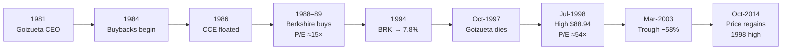

# G2 · Buffett buys Coca-Cola (1988)

> **The hook.** Between mid-1988 and the end of 1989, Berkshire Hathaway spent $1.02 billion (roughly 30% of its
> net worth) on shares of the best-known consumer brand in the world. Nothing about it was secret. Every analyst
> knew the brand, the margins and the history, and the stock sat at ≈15× earnings, a modest premium to a market at
> ≈12×. Ten years later Berkshire's stake was worth about ten times its cost, and the same company traded at
> ≈50× earnings. Then the share price went nowhere for sixteen years. The moat was the same both times and only
> the price had changed. In this case you do the 1988 analysis using only what was known in 1988, then do it
> again in mid-1998.

| | |
|:--|:--|
| **Period** | 1981 (Goizueta becomes CEO) → 1988–89 (Berkshire buys) → 1998 (valuation peak) → 2014 (price first regains the 1998 high) |
| **Decision date** | **31 January 1989**, the day Coca-Cola published its FY1988 results. Berkshire already holds 14.2m shares, and the question is whether to keep buying. A second decision point, **15 July 1998**, is used for the counterpoint. |
| **Sector** | Consumer staples: soft-drink concentrate and syrups, plus minority stakes in bottlers |
| **Themes** | Moat + reinvestment runway + fair price; owner earnings; capital allocation (focus, buybacks, bottler restructuring); reverse DCF; valuation risk in great companies; earnings quality at a blue chip |
| **Modules this case reinforces** | [02.5 Cash-flow statement (owner earnings)](../../02-accounting/05-the-cash-flow-statement.md) · [02.8 Group accounts (equity method)](../../02-accounting/08-deeper-cuts-group-accounts-and-other.md) · [04.3 Returns on capital](../../04-financial-analysis/03-returns-on-capital.md) · [04.7 Quality of earnings](../../04-financial-analysis/07-quality-of-earnings.md) · [05.3 Moats](../../05-business-analysis/03-moats-and-competitive-advantage.md) · [05.5 Capital allocation](../../05-business-analysis/05-management-and-capital-allocation.md) · [06.6 Reverse DCF](../../06-valuation/06-reverse-dcf-and-expectations.md) · [06.8 Margin of safety](../../06-valuation/08-margin-of-safety-and-expected-value.md) · [11.5 Monitoring & selling](../../11-process/05-monitoring-and-selling.md) |
| **Difficulty** | Intermediate ★★☆ |
| **Time** | ~2.5 hours (spend ~60 minutes on section 3 before reading on) |

!!! note "Conventions used in this case"
    - Figures are in **US$**. Coca-Cola ("KO", its NYSE ticker) reports on a calendar year.
    - **Share splits.** KO split 2-for-1 in May 1990, May 1992, May 1996 and August 2012
      ([Yahoo Finance split history][yf]; the 1992 and 1996 splits are confirmed in [KO's FY1996 10-K][ko96]; the
      1990 split shows up as Berkshire's holding doubling from 23.35m to 46.7m shares at unchanged cost
      [\[BRK 1989\]][brk89] [\[BRK 1990\]][brk90]). **One 1988 share = 16 shares today.** In Part A all per-share
      numbers are **per 1988 share**, which is how the stock traded then. Divide by 16 to compare with a modern,
      split-adjusted chart, where the 30-Dec-1988 close of $44.625 shows up as ≈$2.79.
    - **Financials for 1983–1988** come from the "Selected Financial Data" in KO's FY1993 10-K
      [\[KO 1993\]][ko93], the earliest KO annual filing on SEC EDGAR. These figures are *restated* on a
      continuing-operations basis. 1988 revenue was originally reported as ≈$8.3bn [\[UPI 1989\]][upi89] and appears
      as $8,065m in the restated series. Net income is unchanged ($1,045m, or $1,038m to common after preferred
      dividends). An analyst in January 1989 would have seen the unrestated version, which differs by a few percent.
    - Derived ratios are our own calculations, checked in Python. Approximations are marked ≈.

---

## 1. The scene (as of 31 January 1989)

### 1.1 What Coca-Cola actually sells

KO's main product is **concentrate**: the flavour base (and, for fountain customers, finished **syrup**) that
**bottlers** turn into a drink by adding water, sweetener and carbonation, then packaging, distributing and selling it
to shops. KO owns the trademarks and pays for consumer marketing. The bottlers own the plants, trucks and vending
equipment and do the local selling. This split explains most of the economics. The concentrate business earns high
margins on a small capital base, and the capital-heavy part of the system mostly sits with the bottlers.

KO's own filings describe three kinds of bottler: independent ones, ones in which KO holds a **non-controlling
stake** (typically 20–50%), and ones it controls [\[KO 1993\]][ko93] [\[KO 1998\]][ko98]. The largest was
**Coca-Cola Enterprises (CCE)**, a bottling group KO had built up and floated as a public company in 1986. Its
agreements with KO are dated 12 November 1986 [\[CCE FY2000 10-K\]][cce]. KO kept a large minority stake, about
43.5% by 1993 [\[KO 1993\]][ko93]. Because KO held less than 50%, it accounted for CCE under the **equity method**:
KO's share of CCE's profit appears as a single line ("equity income", $92m in 1988), and none of CCE's assets or
debt appear on KO's balance sheet (see [02.8](../../02-accounting/08-deeper-cuts-group-accounts-and-other.md)).
Keep this in mind whenever you read KO's return ratios.

By 1993 (the earliest 10-K on EDGAR), soft drinks were 87% of KO's revenue and 96% of its operating income. The rest
came from Coca-Cola Foods, a juice business [\[KO 1993\]][ko93].

### 1.2 The industry and the growth runway

In the US, KO had more than 40% of the carbonated soft-drink market in 1988, and its concentrate shipments rose 6%
while US operating income rose 9% [\[UPI 1989\]][upi89]. Growth was faster outside the US. International soft-drink
shipments rose 7% in 1988 and international operating income rose 21%, with the Pacific and Canada up 26% and
Europe/Africa up 17% [\[UPI 1989\]][upi89]. Buffett later described sales overseas as "virtually exploding"
[\[BRK 1989\]][brk89].

The core of the bull case was the gap in per-capita consumption. KO put numbers on it only in later filings. In 1993,
per-capita consumption of its products outside the US was 11% of the US level [\[KO 1993\]][ko93]. In 1997, China,
India, Indonesia and Russia held about 44% of the world's population but consumed less than 2% of the US per-capita
level [\[KO 1997\]][ko97]. A 1988 analyst could not quote those exact figures, but anyone who had travelled could see
that the gap existed.

### 1.3 Management: what Roberto Goizueta changed

Roberto Goizueta was elected chairman and CEO in August 1980, effective March 1981 [\[KO 1993\]][ko93]. Buffett
credits him and his partner Don Keough with making KO "a new company" after 1981, and describes Goizueta's
"truly rare blend of marketing and financial skills" [\[BRK 1989\]][brk89]. In the numbers, the changes look like
this:

1. **Focus.** Goizueta did not start as a purist. He approved the purchase of Columbia Pictures in 1982
   [\[NGE\]][nge]. He then reversed course. In KO's restated figures, net income differs from income from continuing
   operations in every year from 1983 to 1988 ($1,045m vs $1,089m in 1988). That gap reflects businesses later
   treated as discontinued, which we infer were mainly entertainment. In 1989 KO sold its stake in Columbia
   Pictures Entertainment to Sony for ≈$1.5bn [\[NGE\]][nge]. Together with the sale of its bottled-water
   business, that produced $604m of after-tax gains [\[KO 1993\]][ko93].
2. **An explicit hurdle rate.** KO ran the company on **economic profit**, defined as net operating profit after tax
   minus a charge for the capital employed. On the company's own numbers, economic profit rose from $138m in 1983 to
   $748m in 1988 [\[KO 1993\]][ko93], a 40% compound annual rate.
3. **Buybacks.** KO's share repurchases began in 1984 [\[KO 1993\]][ko93]. In 1988 alone it bought back 18.9m
   shares (≈5% of the average share count), bringing the total to 25.5m of a 40m-share authorisation
   [\[UPI 1989\]][upi89]. The average share count fell 10.8% between 1983 and 1988.
4. **Lower payout.** The dividend **payout ratio** (dividends ÷ net income) fell from 65% in 1983 to 42% in 1988,
   freeing cash for reinvestment and buybacks. The dividend per share still grew ≈6% a year.
5. **More debt.** Total debt rose from 15% of total capital in 1983 to 39% in 1988 (peaking at 48% in 1987).
6. **Bottler restructuring.** KO bought and reorganised bottlers, floated CCE (1986), and kept minority stakes so
   that bottling capital and debt stayed off KO's consolidated balance sheet.
7. **Fallibility.** "New" Coke replaced the original formula in April 1985 and was withdrawn within months, when the
   original returned as Coca-Cola Classic [\[NGE\]][nge]. Management made mistakes, but it reversed them quickly.

### 1.4 What the market believed, and the price

- **The crash.** KO closed at ≈$52 (per 1988 share) in late August 1987, fell ≈25% on 19 October 1987 (from
  $40.50 to $30.50), and ended 1988 at $44.625, still ≈14% below the 1987 high. During 1988 it closed between $35.25
  and $45.00 [\[Yahoo\]][yf].
- **The multiple.** At the 30-Dec-1988 close, KO's total market value was $15.8bn [\[KO 1996\]][ko96], or ≈15.7×
  1988 earnings per share. The S&P 500 traded at ≈11.6× trailing earnings [\[Shiller\]][shiller], and the 10-year US
  Treasury yielded 9.11% (December 1988 average) [\[FRED\]][fred]. The market was paying a quality premium of about
  a third over the index, but it was not paying for growth.
- **The perennial worry.** Investors had doubted Coke's growth for decades. Buffett's 1993 letter recalls a 1938
  *Fortune* article describing serious investors who admired Coke's record but concluded they were "looking too
  late", put off by fears of saturation and competition. That was fifty years before Berkshire bought
  [\[BRK 1993\]][brk93].
- **Guidance.** Presenting the 1988 results, Goizueta said he expected 1989 "earnings per share growth once again well
  into the mid-teens" [\[UPI 1989\]][upi89].
- **Berkshire so far.** Buffett had his first Coke in 1935 or 1936, then went 52 years without buying a share, until
  "the summer of 1988", when, in his words, "my brain finally establish contact with my eyes"
  [\[BRK 1989\]][brk89]. (His 2004
  letter dates the first purchase in the "Big Four" group to May 1988 [\[BRK 2004\]][brk04].) At 31-Dec-1988
  Berkshire held 14,172,500 KO shares at a cost of $592.5m [\[BRK 1988\]][brk88]. That is an average of ≈$41.81 per
  share, or ≈4.0% of KO's shares outstanding (our calculation from KO's year-end share count).

---

## 2. The numbers then

### Table 2.1 — Income statement, 1983–1988 (US$ m, restated continuing-operations basis)

Source: KO FY1993 10-K, Selected Financial Data [\[KO 1993\]][ko93]. Share counts converted to 1988 shares (the
10-K's figures ÷ 4).

| US$ m | 1983 | 1984 | 1985 | 1986 | 1987 | 1988 |
|:--|--:|--:|--:|--:|--:|--:|
| Net operating revenues | 5,056 | 5,442 | 5,879 | 6,977 | 7,658 | 8,065 |
| Cost of goods sold | (2,580) | (2,738) | (2,909) | (3,454) | (3,633) | (3,429) |
| **Gross profit** | 2,476 | 2,704 | 2,970 | 3,523 | 4,025 | 4,636 |
| Selling, admin & general | (1,648) | (1,855) | (2,163) | (2,626) | (2,701) | (3,038) |
| **Operating income** | 828 | 849 | 807 | 897 | 1,324 | 1,598 |
| Interest income − interest expense | 13 | 5 | (45) | (54) | (65) | (31) |
| Equity income (bottlers etc.) | 35 | 42 | 52 | 45 | 64 | 92 |
| Other income (deductions) | 2 | 13 | 69 | 35 | 0 | (33) |
| Gain on issuance of stock by subsidiaries | – | – | – | 375 | 40 | – |
| **Pre-tax income** | 878 | 909 | 883 | 1,298 | 1,363 | 1,626 |
| Income taxes | (374) | (360) | (314) | (471) | (496) | (537) |
| **Income from continuing operations** | 504 | 549 | 569 | 827 | 867 | 1,089 |
| **Net income** (after discontinued ops) | 559 | 629 | 722 | 934 | 916 | 1,045 |
| Average shares (m, per 1988 share) | 408.8 | 396.8 | 393.3 | 386.8 | 377.3 | 364.5 |

### Table 2.2 — Balance sheet, capex and KO's own return measures (US$ m)

Source: [\[KO 1993\]][ko93]. KO computes ROE and return on capital on income from continuing operations.

| US$ m | 1983 | 1984 | 1985 | 1986 | 1987 | 1988 |
|:--|--:|--:|--:|--:|--:|--:|
| Cash & marketable securities | 559 | 768 | 843 | 895 | 1,489 | 1,231 |
| Total debt | 520 | 1,310 | 1,280 | 1,848 | 2,995 | 2,124 |
| Share-owners' equity | 2,912 | 2,751 | 2,948 | 3,479 | 3,187 | 3,345 |
| Total capital (equity + debt) | 3,432 | 4,061 | 4,228 | 5,327 | 6,182 | 5,469 |
| Total assets | 4,540 | 5,241 | 6,341 | 7,675 | 8,606 | 7,451 |
| Depreciation | 111 | 119 | 130 | 151 | 152 | 167 |
| Capital expenditures | 324 | 300 | 412 | 346 | 304 | 387 |
| Total debt / total capital (%) | 15.2 | 32.3 | 30.3 | 34.7 | 48.4 | 38.8 |
| Return on common equity (%) | 17.7 | 19.4 | 20.0 | 25.7 | 26.0 | 34.7 |
| Return on capital (%) | 16.4 | 16.7 | 16.8 | 20.1 | 18.3 | 21.3 |
| Dividend payout (%) | 65.3 | 57.9 | 53.8 | 43.1 | 46.0 | 42.1 |
| Economic profit (US$ m) | 138 | 268 | 269 | 311 | 417 | 748 |

### Table 2.3 — Per share (per 1988 share) and valuation

Source: [\[KO 1993\]][ko93] per-share data × 4; P/E and yield are our calculations.

| Per 1988 share | 1983 | 1984 | 1985 | 1986 | 1987 | 1988 |
|:--|--:|--:|--:|--:|--:|--:|
| EPS, continuing operations ($) | 1.24 | 1.40 | 1.44 | 2.12 | 2.28 | 2.96 |
| EPS, net income ($) | 1.36 | 1.60 | 1.84 | 2.40 | 2.44 | 2.84 |
| Dividend per share ($) | 0.88 | 0.92 | 1.00 | 1.04 | 1.12 | 1.20 |
| Price at 31 December ($) | 17.84 | 20.80 | 28.16 | 37.76 | 38.12 | 44.64 |
| P/E on net EPS (×) | 13.1 | 13.0 | 15.3 | 15.7 | 15.6 | 15.7 |
| Dividend yield (%) | 4.9 | 4.4 | 3.6 | 2.8 | 2.9 | 2.7 |

### Table 2.4 — Derived ratios (our calculations from Tables 2.1–2.2)

**Owner earnings** is Buffett's measure of the cash a business could distribute each year without harming itself:
reported earnings + depreciation, amortisation and other non-cash charges − the average capital expenditure needed
to maintain the business's competitive position and unit volume (+ any extra working capital it needs). Buffett
stresses that the capex deduction "must be a guess" [\[BRK 1986\]][brk86]. In the table below we deduct *all*
capex, which is the conservative version. KO's summary table does not show amortisation separately, so it is left
out.

| | 1983 | 1984 | 1985 | 1986 | 1987 | 1988 |
|:--|--:|--:|--:|--:|--:|--:|
| Gross margin (%) | 49.0 | 49.7 | 50.5 | 50.5 | 52.6 | 57.5 |
| Operating margin (%) | 16.4 | 15.6 | 13.7 | 12.9 | 17.3 | 19.8 |
| Net margin (%) | 11.1 | 11.6 | 12.3 | 13.4 | 12.0 | 13.0 |
| Capex ÷ depreciation (×) | 2.92 | 2.52 | 3.17 | 2.29 | 2.00 | 2.32 |
| Owner earnings, all capex deducted (US$ m) | 346 | 448 | 440 | 739 | 764 | 825 |
| Owner earnings ÷ net income (%) | 62 | 71 | 61 | 79 | 83 | 79 |

**Growth, 1983→1988 (5-year compound annual rates):** revenue 9.8%; operating income 14.1%; income from
continuing operations 16.7%; EPS from continuing operations 19.0%; net EPS 15.9%; dividend per share 6.4%; average
share count −10.8% in total.

!!! info "Valuation snapshot at 30 December 1988 (the stock is ≈$46.75 on 31 January 1989)"
    | Measure | Value | Arithmetic |
    |:--|--:|:--|
    | Market value of equity | $15,834m | KO 10-K [\[KO 1996\]][ko96] |
    | Shares outstanding at year-end (per 1988 share) | ≈354.7m | $15,834m ÷ $44.64 |
    | P/E, per share | 15.7× | $44.64 ÷ $2.84 |
    | P/E, market value ÷ net income to common | 15.3× | 15,834 ÷ 1,038 |
    | Earnings yield | 6.6% | 1,038 ÷ 15,834 |
    | Enterprise value (EV) | ≈$16,727m | 15,834 + 2,124 debt − 1,231 cash |
    | EV / operating income (EBIT) | 10.5× | 16,727 ÷ 1,598 |
    | EV / sales | 2.1× | 16,727 ÷ 8,065 |
    | Owner-earnings yield (all capex deducted) | 5.2% | 825 ÷ 15,834 |
    | Owner-earnings yield (depreciation as maintenance capex) | 6.6% | 1,045 ÷ 15,834 |
    | Dividend yield | 2.7% | 1.20 ÷ 44.64 |
    | 10-year US Treasury (Dec-1988) | 9.11% | [\[FRED\]][fred] |
    | S&P 500 trailing P/E (Dec-1988) | ≈11.6× | [\[Shiller\]][shiller] |

    EV here does not credit KO for its stakes in bottlers (CCE and others), which would reduce the effective EV
    further. Their market value is not in our sources for 1988, so we leave them out.

### Table 2.5 — For the counterpoint: what an analyst could see on 15 July 1998

Source: KO FY1998 10-K, Selected Financial Data and Stock Prices [\[KO 1998\]][ko98] (FY1997 data was already
public in KO's FY1997 10-K [\[KO 1997\]][ko97]). Per-share figures are **per 1998 share** (after the 1996 split,
before the 2012 split). One 1998 share = 1/8 of a 1988 share = 2 shares today.

| US$ m unless stated | 1993 | 1994 | 1995 | 1996 | 1997 |
|:--|--:|--:|--:|--:|--:|
| Net operating revenues | 14,030 | 16,264 | 18,127 | 18,673 | 18,868 |
| Operating income | 3,099 | 3,637 | 4,026 | 3,915 | 5,001 |
| Other income (deductions) — net | 7 | (25) | 86 | 87 | 583 |
| Gains on issuances of stock by equity investees | 12 | – | 74 | 431 | 363 |
| Net income | 2,176 | 2,554 | 2,986 | 3,492 | 4,129 |
| Diluted EPS ($) | 0.83 | 0.98 | 1.17 | 1.38 | 1.64 |
| Dividend per share ($) | 0.34 | 0.39 | 0.44 | 0.50 | 0.56 |
| Depreciation | 333 | 382 | 421 | 442 | 384 |
| Capital expenditures | 800 | 878 | 937 | 990 | 1,093 |
| Owner earnings, all capex deducted | 1,709 | 2,058 | 2,470 | 2,944 | 3,420 |
| Return on common equity (%) | 51.8 | 52.1 | 56.4 | 60.8 | 61.6 |
| Price at 31 December ($) | 22.31 | 25.75 | 37.13 | 52.63 | 66.69 |
| P/E at year-end (×) | 26.9 | 26.3 | 31.7 | 38.1 | 40.7 |
| Market value at year-end | 57,905 | 65,711 | 92,983 | 130,575 | 164,766 |
| Owner-earnings yield at year-end (%) | 3.0 | 3.1 | 2.7 | 2.3 | 2.1 |

Growth 1993→1997: revenue 7.7% a year (**2.0% a year for 1995→1997**), operating income 12.7%, net income 17.4%,
diluted EPS 18.6%. Worldwide unit case volume (finished drinks sold by the system) grew 9% in 1997 to 14.9bn cases,
and the average foreign currency weakened ≈10% against the dollar in both 1996 and 1997 [\[KO 1997\]][ko97]
[\[KO 1998\]][ko98]. In 1998 the stock traded as high as $79.31 in Q1 and $86.81 in Q2, and hit $88.94 on
15 July [\[KO 1998\]][ko98] [\[Yahoo\]][yf]. The S&P 500 was at ≈30× trailing earnings [\[Shiller\]][shiller], and
the 10-year Treasury yielded ≈5.5% [\[FRED\]][fred].

---

## 3. You are the analyst

Answer these **before reading section 4**, using only the information above. Part A is set on 31 January 1989 and
Part B on 15 July 1998.

**Part A: 31 January 1989**

**A1.** Explain KO's business model in three sentences: who pays KO, for what, and who carries the capital. Which two
numbers in Tables 2.1–2.2 best show that the business is capital-light?

**A2. (Numerical)** Calculate gross and operating margins for 1983 and 1988, and pre-tax income excluding the
"gain on issuance of stock by subsidiaries" for 1985–1988, with year-on-year growth. What does the adjusted series
tell you about when the business actually accelerated? Name two possible drivers of the margin expansion.

**A3. (Numerical)** Estimate 1988 owner earnings in two ways: (i) deducting all capex, (ii) treating depreciation
as maintenance capex. Compute the owner-earnings yield on the $15.8bn market value under each method and compare it
with the 9.11% Treasury yield. What must be true for this to be a good investment?

**A4. (Numerical, reverse DCF)** Take owner earnings of $825m, a 10% discount rate, a 10-year period in which owner
earnings grow at *g*, then 5% a year forever. What value of *g* makes the present value equal $15.8bn? Repeat at 9%
and 12%. As a cross-check, compute the single-stage **Gordon growth** implied *g* (from $P = OE_1/(r-g)$). Compare
the results with Table 2.4's growth rates and with management's guidance.

**A5. (Numerical)** Build a capital-allocation scorecard for 1983–1988 covering share count, payout ratio,
debt/capital, interest cover (operating income ÷ interest expense) and economic-profit growth. Is the rise in debt a
red flag?

**A6.** KO reports ROE of 34.7% and return on capital of 21.3% for 1988. Roughly how much of the gap comes from
leverage? (Use 1988 debt/equity and an after-tax cost of debt estimated from the table.) Then explain how the
equity-method bottler structure affects *both* ratios, and name the documents you would read to see the whole
system's economics.

**A7.** Berkshire's eventual $1.02bn cost was ≈30% of its net worth at the start of 1989. Write a three-line
pre-mortem ("it is 1999, this lost money, because…") with one observable signal for each failure mode. As a crude
downside test, where would the stock trade at the market's P/E?

**Part B: 15 July 1998 (price ≈$88 per 1998 share; ≈2,466m shares)**

**B1. (Numerical)** Compute the P/E on 1997 diluted EPS. Then remove 1997's bottler gains ($508m of gains on selling
bottler stakes, included in other income, plus $363m of gains on issuances of stock by equity investees) at an
assumed 35% tax rate on ≈2,515m diluted shares, and recompute. Also compute the owner-earnings yield on 1997 owner
earnings.

**B2. (Numerical, reverse DCF)** Using the model from A4 with 1997 owner earnings ($3,420m), a market value of
≈$217bn, and discount rates of 8%, 9% and 10%, what 10-year growth rate is implied? Compare it with 1993–1997 revenue
and EPS growth. Which is the relevant comparison?

**B3.** Was the moat wider or narrower in 1998 than in 1988? If it was wider, can the stock still be a poor
investment from here? Use one sentence from Berkshire's 1996 letter to frame your answer.

---

## 4. What happened

### 4.1 Timeline

| Date | Event | Source |
|:--|:--|:--|
| Aug-1980 / Mar-1981 | Goizueta elected chairman & CEO, effective March 1981 | [KO 1993][ko93] |
| 1982 | Diet Coke launched; Columbia Pictures purchase approved | [NGE][nge] |
| 1984 | First share-repurchase programme | [KO 1993][ko93] |
| Apr-1985 | "New" Coke launched; withdrawn within months, Coca-Cola Classic returns | [NGE][nge] |
| 12-Nov-1986 | CCE agreements signed; CCE becomes public in 1986 | [CCE][cce] |
| 19-Oct-1987 | KO falls ≈25% in the crash ($40.50 → $30.50 per 1988 share) | [Yahoo][yf] |
| Mid-1988 | Berkshire begins buying ("summer of 1988"; first Big Four purchase May 1988) | [BRK 1989][brk89], [BRK 2004][brk04] |
| 31-Dec-1988 | Berkshire holds 14,172,500 shares; cost $592.5m; market $632.4m | [BRK 1988][brk88] |
| 31-Jan-1989 | FY1988: net income $1.04bn, EPS $2.85, ROE 33%; mid-teens EPS growth guided | [UPI 1989][upi89] |
| 1989 | Buffett joins KO's board; KO sells its Columbia Pictures Entertainment stake and bottled-water business ($604m after-tax gains) | [KO proxy 1994][koproxy], [KO 1993][ko93] |
| 31-Dec-1989 | Berkshire holds 23,350,000 shares; cost $1,023.9m; market $1,803.8m (35% of its equity portfolio) | [BRK 1989][brk89] |
| 1990–91 | Berkshire's look-through table shows a 7.0% stake; by 1991 the Coke stake is worth more than Berkshire's entire net worth three years earlier | [BRK 1991][brk91] |
| 1994 | Berkshire buys more: 100m shares (pre-1996-split), 7.8%, total cost $1,298.9m, which never changes afterwards | [BRK 1994][brk94] |
| 1996 | 2-for-1 split → 200m shares, 8.1%. Buffett's "Inevitables" essay warns you can "pay too much for even the best of businesses" | [BRK 1996][brk96] |
| Oct-1997 | Goizueta dies; Doug Ivester succeeds. Buffett writes that market prices have "materially eroded the 'margin of safety'" | [BRK 1997][brk97] |
| 15-Jul-1998 | Intraday high $88.94 (per 1998 share); ≈54× 1997 EPS | [KO 1998][ko98] |
| FY1998 | Diluted EPS −13% to $1.42; stronger dollar cuts operating income ≈9%; equity income falls to $32m; unit cases still +6% | [KO 1998][ko98] |
| 5-Dec-1999 | Ivester to retire; Doug Daft elected president (CEO from Feb-2000) | [KO 1999][ko99] |
| Jan-2000 | "Realignment" eliminating ≈6,000 positions; 8-K announces a worldwide cut in bottler concentrate inventory | [KO 1999][ko99], [SEC 2005][sec05] |
| 10-Mar-2003 | Share-price trough ≈$37 per 1998 share, −58% from the July-1998 closing high | [Yahoo][yf] |
| 18-Apr-2005 | SEC settled order: finds undisclosed "gallon pushing" in Japan, 1997–1999 (KO neither admitted nor denied) | [SEC 2005][sec05] |
| Aug-2012 | 2-for-1 split (Berkshire: 400m shares) | [Yahoo][yf] |
| 8-Oct-2014 | First close above the July-1998 closing high (split-adjusted); last close at or below it is 9-Jul-2020 | [Yahoo][yf] |
| 31-Dec-2025 | Berkshire: 9.3% of KO, cost $1,299m, market value $27,964m, 2025 dividends received $816m | [BRK 2025][brk25] |

### 4.2 Outcome from the decision date

Base: 30-Dec-1988 close of $44.625 per 1988 share. "TR" is total return with dividends reinvested, using Yahoo's
dividend-adjusted series [\[Yahoo\]][yf], so treat it as ≈.

| Horizon | Price at end | Price multiple | Price CAGR | TR multiple | TR CAGR |
|:--|--:|--:|--:|--:|--:|
| 1 year (Dec-1989) | $77.25 | 1.73× | 73.1% | ≈1.77× | ≈77.0% |
| 3 years (Dec-1991) | ≈$160.50 | 3.60× | 53.2% | ≈3.81× | ≈56.2% |
| 5 years (Dec-1993) | ≈$178.50 | 4.00× | 32.0% | ≈4.37× | ≈34.3% |
| 10 years (Dec-1998) | ≈$536 | 12.01× | 28.2% | ≈13.91× | ≈30.1% |

(Prices are per 1988 share: the Dec-1998 price of $67.00 per 1998 share × 8 = $536.) Berkshire's stake, with total
cost $1,299m after the 1994 additions, was worth $13.4bn at the end of 1998 [\[BRK 1998\]][brk98], about 10.3× cost.

**Where the 1988–1998 return came from** (using TSR ≈ EPS growth + change in P/E + dividends, from
[01.5](../../01-markets-101/05-time-value-and-returns-math.md)). Diluted EPS rose from $0.35 to $1.42 per 1998 share
[\[KO 1998\]][ko98], or **15.0% a year**. The year-end P/E rose from 15.9× to 47.2×, or **11.5% a year**. Price
rose 28.2% a year. In log terms, about **44% of the ten-year price gain came from the higher multiple** and 56% from
earnings.

### 4.3 The counterpoint: the same company after July 1998

Base: 14-Jul-1998 closing high, $87.94 per 1998 share ($43.97 split-adjusted) [\[Yahoo\]][yf].

| To | Years | Price change | TR change (≈) | TR CAGR (≈) |
|:--|--:|--:|--:|--:|
| Dec-1999 | 1.5 | −34% | −33% | −23.7% |
| Dec-2003 | 5.5 | −42% | −37% | −8.1% |
| Dec-2008 | 10.5 | −49% | −36% | −4.2% |
| Dec-2013 | 15.5 | −6% | +35% | +2.0% |
| Dec-2018 | 20.5 | +8% | +82% | +3.0% |
| Dec-2025 | 27.5 | +59% | +234% | +4.5% |

For context, the S&P 500 index (Shiller's monthly average, price only) fell ≈24% from July 1998 to December 2008
[\[Shiller\]][shiller]. The whole market was expensive in 1998, and KO did about twice as badly.

**What the business did, and what the multiple did** (per 1998 share; FY2003 and FY2008 10-Ks
[\[KO 2003\]][ko03] [\[KO 2008\]][ko08]):

| Year-end | Price ($) | Diluted EPS ($) | P/E (×) |
|:--|--:|--:|--:|
| 1998 | 67.00 | 1.42 | 47.2 |
| 2000 | 60.94 | 0.88 | 69.2 |
| 2003 | 50.75 | 1.77 | 28.7 |
| 2006 | 48.25 | 2.16 | 22.3 |
| 2008 | 45.27 | 2.49 | 18.2 |

From 1998 to 2008 EPS grew **5.8% a year** and net income 5.1% a year. The P/E fell by **9.1% a year** and the
price by 3.8% a year. The business kept growing and the moat did not break. The multiple went from ≈47× to ≈18×,
which is roughly where a very good but mature consumer franchise tends to settle.

---

## 5. Signals: knowable then vs hindsight

!!! warning "Guarding against hindsight bias"
    We study this case *because* it worked, which is survivorship bias in its purest form. Many "can't-miss"
    franchises of 1988 compounded far less. Two more traps: (1) **outcome ≠ process**. The 1998 buyer still earned
    ≈4.5% a year total return to 2025, which is a poor result but not ruin. (2) **Insider-edge myths.** Buffett
    joined KO's board in 1989 [\[KO proxy 1994\]][koproxy], *after* the 1988 purchases, which rested on public
    information. Everything in section 2 was available to anyone.

### 5.1 The 1988–89 decision

| Knowable in January 1989 | Visible only in hindsight |
|:--|:--|
| Margins, ROE, return on capital and economic profit had all risen sharply since 1983, and economic profit grew 5.4× in five years (Tables 2.2, 2.4) | That international growth would keep compounding for a decade (system unit cases reached 14.9bn in 1997 and 15.8bn in 1998) |
| International operating income was up 21% on 7% volume growth, which points to pricing power and mix abroad | That the P/E would triple (15.9× → 47.2×), supplying ≈44% of the decade's price gain |
| Capital-light: capex was 37% of net income, and owner earnings were ≈79% of net income even after deducting *all* capex | The 1989 Sony sale, the opening of Eastern Europe, the 1990s bull market |
| Management had publicly reversed its own mistakes (New Coke, entertainment) and ran the company on a cost-of-capital metric | That Goizueta would stay until 1997 and plan his succession well |
| Price: ≈15.7× EPS, only ≈1.3× the market multiple; the reverse DCF implied low growth | |
| **Risks you could see:** leverage up from 15% to 39% of capital; bottler debt off-balance-sheet; currency; PepsiCo; a maturing US market; a prior fondness for diversification | |

**Strongest bull case available in January 1989.** A global consumer monopoly-like franchise with rising returns,
little need for capital, and a long runway abroad. The management team had shown it would shrink the share count,
walk away from bad ideas and judge projects against a capital charge. The price only required mid-single-digit
growth, against a record of mid-to-high teens and management guidance of "mid-teens". The worst realistic case (a
de-rating to the market multiple) cost ≈26%, while the good case compounded for decades. That is a positively
skewed payoff.

**Strongest bear case in January 1989.** US soft drinks were mature and PepsiCo was fighting hard. The New Coke
episode showed the brand could be mishandled. Earnings were rising partly through leverage and a bottler
reshuffle that moved capital (and debt) off KO's books, so reported returns flattered the system. A 9% risk-free
rate made a 5–7% starting yield unattractive unless the growth actually came. And the stock had already risen from
≈$18 to ≈$45 in five years.

### 5.2 The 1998 decision

| Knowable in July 1998 | Visible only in hindsight |
|:--|:--|
| ≈54× trailing EPS, ≈62× excluding 1997 bottler gains; owner-earnings yield ≈1.6%, against a 5.5% 10-year Treasury | That KO had been "gallon pushing" in Japan from 1997 to 1999, adding ≈$0.01–0.02 to quarterly EPS and making the difference in 8 of 12 quarters between meeting and missing consensus (SEC findings, settled without admission, April 2005) |
| Revenue grew only ≈2% a year in 1995–97. Reported EPS growth leaned on margin mix (deconsolidating bottlers), gains, buybacks and a 1996 tax settlement | Ivester's short tenure (announced exit Dec-1999) and the January 2000 restructuring |
| 1997 pre-tax gains from bottler transactions of $871m (≈14% of pre-tax income), at least $343m of it non-cash | That EPS would compound at only ≈5.8% for the next decade |
| Currencies had weakened ≈10% a year for two years, and the Asian crisis had begun | The 2003 trough (−58%) |
| Goizueta, the architect, had died in October 1997 | |
| Berkshire's own letters (1996, 1997) warned in plain language about prices | |

**Strongest bull case in July 1998.** Buffett's "Inevitables" argument [\[BRK 1996\]][brk96]: no sensible observer
doubted that Coke would dominate its field worldwide for an investment lifetime. Unit cases grew 9% in 1997, ROE
was above 60%, and half the world's population lived in markets averaging fewer than 10 servings a year
[\[KO 1997\]][ko97]. All of this
was true. The flaw was that it was already in the price, and then some: at ≈$217bn, the market was asking for
≈16% annual owner-earnings growth for a decade (B2).

!!! tip "Trader's lens: implied vs realised growth"
    A reverse DCF works like reading implied volatility off an option price. The price is the input and the
    expectation is the output. In January 1989 KO's price implied ≈4% annual growth (at a 10% discount rate) for a
    business that had been delivering 14–19%, so you were buying "low implied" against "high realised". In July 1998
    the price implied ≈16% (at 9%) and the business went on to realise ≈5%. The underlying asset, the franchise,
    was the same in both years. Only the premium paid changed. A trader who buys 60-vol options on a stock that
    realises 25 loses money even though the stock "moved a lot", and the same logic applies here.

---

## 6. Lessons

1. **A great business is not automatically a great investment. You need moat, runway *and* price.** KO had the
   same brand in 1988 and 1998. The 1988 buyer earned ≈30% a year for a decade and the 1998 buyer ≈4.5% a year for
   27 years. → [05.3 Moats](../../05-business-analysis/03-moats-and-competitive-advantage.md),
   [06.1 What value is](../../06-valuation/01-what-is-value.md)
2. **Value the cash the owner can take out, not the headline profit.** Owner earnings (net income + depreciation −
   the capex needed to stand still) give a starting yield you can compare with bonds. Be explicit about the
   maintenance-capex guess. Be careful with company-defined "free cash flow". KO's own measure is cash from operations
   minus *net* cash used in investing, so disposal proceeds offset investment spending [\[KO 1998\]][ko98]. It
   came to $1,517m in 1988, well above net income of $1,045m [\[KO 1996\]][ko96]. → [02.5 Cash-flow statement](../../02-accounting/05-the-cash-flow-statement.md),
   [04.4 Working capital & cash conversion](../../04-financial-analysis/04-working-capital-and-cash-conversion.md)
3. **Always ask what the price implies.** A reverse DCF turns "is 15× cheap?" into "is ≈4% growth a sensible
   expectation for this business?", which is a question you can actually answer. →
   [06.6 Reverse DCF](../../06-valuation/06-reverse-dcf-and-expectations.md)
4. **Capital allocation multiplies a moat.** Focus, a capital charge, buybacks at ≈15× earnings, a lower payout and
   measured leverage, together with margin expansion, helped turn a 10% revenue grower into a 19% EPS grower in
   1983–88. →
   [05.5 Management & capital allocation](../../05-business-analysis/05-management-and-capital-allocation.md),
   [01.3 Raising and returning capital](../../01-markets-101/03-raising-and-returning-capital.md)
5. **Split returns into earnings growth and multiple change, and remember the multiple mean-reverts.** 44% of the
   1988–98 price gain came from re-rating, and 1998–2008 gave that back while EPS grew. →
   [01.5 Returns math](../../01-markets-101/05-time-value-and-returns-math.md),
   [06.5 Multiples](../../06-valuation/05-relative-valuation-and-multiples.md),
   [12.2 Market cycles](../../12-macro-special-sits/02-market-cycles-and-sentiment.md)
6. **Check earnings quality even at blue chips, and know where the consolidation boundary sits.** Bottler gains
   (1996–97), equity-method bottlers keeping capital off the balance sheet, and (as the SEC later found) end-of-quarter
   channel loading all shaped KO's reported numbers. → [04.7 Quality of earnings](../../04-financial-analysis/07-quality-of-earnings.md),
   [09.2 Revenue red flags](../../09-forensics/02-revenue-red-flags.md),
   [02.8 Group accounts](../../02-accounting/08-deeper-cuts-group-accounts-and-other.md),
   [04.3 Returns on capital](../../04-financial-analysis/03-returns-on-capital.md)
7. **Selling is a decision too.** Buffett later wrote of the bubble years: "I talked when I should have walked"
   [\[BRK 2004\]][brk04]. Size, taxes and signalling make selling hard for a large holder. Write your sell rules
   *before* the stock gets expensive. → [11.4 Position sizing](../../11-process/04-position-sizing-and-portfolio-construction.md),
   [11.5 Monitoring & selling](../../11-process/05-monitoring-and-selling.md),
   [11.6 Behavioural finance](../../11-process/06-behavioural-finance-and-decision-journals.md)

!!! info "India notes"
    Indian consumer franchises (paints, adhesives, FMCG MNC subsidiaries) have often traded at multiples like KO's
    in 1998, and the pattern in this case applies directly. Run the Part B reverse DCF on any of them with current
    data (see [06.6](../../06-valuation/06-reverse-dcf-and-expectations.md)), and compare the implied growth with
    what volume, price/mix and per-capita headroom can realistically deliver. Two India-specific adjustments:
    (1) for MNC subsidiaries, deduct the royalty paid to the parent before computing owner earnings (see
    [07.5](../../07-special-valuation/05-holdcos-conglomerates-psus-mncs.md)); (2) Indian nominal GDP growth and
    the cost of equity are both higher than in the US, so use INR-consistent discount and terminal growth rates.
    For a domestic parallel, see [I2 Asian Paints](../india/02-asian-paints-compounder.md). India appears in KO's
    own 1997 10-K as one of four emerging markets whose *combined* per-capita consumption was below 2% of the US
    level [\[KO 1997\]][ko97].

---

## 7. Model answers

<b>A1. Business model</b>

KO sells concentrate and syrup to bottlers and fountain customers and spends on marketing to create consumer
demand for its brands. The bottlers own the plants, trucks and coolers and carry most of the system's capital and
debt, often with KO holding a minority equity stake. KO earns high margins on little capital and grows by selling
more servings per person, mostly outside the US.

Evidence of capital-lightness: 1988 capex of $387m against net income of $1,045m (**37%**), and net PP&E of $1,759m
against revenue of $8,065m (**≈22%** of sales) [\[KO 1993\]][ko93]. Return on capital of 21.3% points the same way.

<b>A2. Margins and adjusted pre-tax growth</b>

- Gross margin: 2,476 ÷ 5,056 = **49.0%** (1983) → 4,636 ÷ 8,065 = **57.5%** (1988).
- Operating margin: 828 ÷ 5,056 = **16.4%** → 1,598 ÷ 8,065 = **19.8%**.
- Pre-tax income excluding gains on subsidiary stock issuance: 1985 $883m; 1986 $1,298m − $375m = $923m;
  1987 $1,363m − $40m = $1,323m; 1988 $1,626m. Growth: **+4.5%**, **+43.3%**, **+22.9%**.

Reported pre-tax income makes 1986 look like the breakout year (+47%). The adjusted series shows 1986 was nearly
flat and the real acceleration came in 1987–88. The 1986 gain coincides with the year CCE was floated, although the
10-K summary does not name the source of the gain. Always strip gains before measuring growth.

Two possible drivers of the margin expansion: (i) **mix**, as low-margin bottling revenue left the consolidated
figures after the bottler reorganisation, raising reported gross margin; (ii) **pricing power and international
growth**, since international operating income rose 21% in 1988 on 7% volume growth [\[UPI 1989\]][upi89]. A good
analyst notes that (i) is a one-off accounting shift, while (ii) is the durable part.

<b>A3. Owner earnings and the starting yield</b>

- (i) All capex deducted: 1,045 + 167 − 387 = **$825m** → 825 ÷ 15,834 = **5.2%**.
- (ii) Depreciation ≈ maintenance capex: 1,045 + 167 − 167 = **$1,045m** → **6.6%**.

The truth sits between the two, because part of the $387m was *growth* capex for international expansion. Either
way the starting yield is **below** the 9.11% Treasury. The investment only works if owner earnings grow fast and
for a long time. You need to believe roughly: (a) international per-capita consumption keeps rising, (b) KO's
pricing power holds, (c) management keeps reinvesting at high returns and returns the rest. That is Buffett's point
that the capex deduction "must be a guess" [\[BRK 1986\]][brk86]. Precision matters less than direction and
durability.

<b>A4. Reverse DCF at 31 January 1989</b>

Two-stage model: $V = \sum_{t=1}^{10} \frac{OE_0(1+g)^t}{(1+r)^t} + \frac{OE_{10}(1+g_\infty)}{(r-g_\infty)(1+r)^{10}}$
with $OE_0 = 825$, $g_\infty = 5\%$. Solving $V = 15{,}834$ (Python, `scipy.optimize.brentq`):

| Discount rate | Implied 10-year growth | Terminal value share of V |
|:--|--:|--:|
| 9% | 1.1% | 65% |
| 10% | **3.8%** | 62% |
| 12% | 8.4% | 56% |

Gordon single-stage, $g = (rP - OE)/(P + OE)$: 3.6% (9%), 4.6% (10%), 6.5% (12%).

**Interpretation.** Even at a demanding 12% discount rate, the price implied growth well below history (operating
income +14.1% and EPS +16–19% a year for 1983–88) and below management's mid-teens guidance. A reasonable
*non-hindsight* base case of 10% growth for a decade at a 10% discount rate gives ≈$25.6bn, or ≈$72 per 1988 share,
against a $44.6 price: a price/value ratio of ≈0.62, so a meaningful margin of safety. (With hindsight, owner earnings
actually grew ≈14% a year to 1998, which is worth $35bn at 10%.) In words: *you were paying for a slow-growth
utility and getting a global compounder.*

<b>A5. Capital-allocation scorecard (1983 → 1988)</b>

| Lever | 1983 | 1988 | Verdict |
|:--|--:|--:|:--|
| Average shares (m, per 1988 share) | 408.8 | 364.5 | −10.8%. Buybacks at ≈13–16× earnings, i.e. 6–8% earnings yields, when the business earns 20%+ on capital: accretive |
| Dividend payout | 65.3% | 42.1% | More cash kept for high-return uses; DPS still +6.4% a year |
| Total debt / total capital | 15.2% | 38.8% | Up, but see coverage |
| Interest cover (op. income ÷ interest expense) | — | 6.9× | 1,598 ÷ 230 |
| Net debt ÷ operating income | — | 0.56× | (2,124 − 1,231) ÷ 1,598 |
| Economic profit | $138m | $748m | +40% a year |

The leverage is **not a red flag** here. Coverage is comfortable, net debt is about half a year of operating
income, and the borrowing funded buybacks and bottler investments in a business with steady cash flows. It is a
**monitoring item**: you would want to see debt stop rising faster than operating income, and watch bottler debt
that sits outside KO's balance sheet.

<b>A6. ROE vs return on capital, and the equity method</b>

A leverage identity: $ROE \approx ROC + (ROC - k_d^{after\ tax}) \times D/E$.

- $D/E$ = 2,124 ÷ 3,345 = 0.63.
- Pre-tax cost of debt ≈ interest expense ÷ average debt = 230 ÷ ((2,995 + 2,124)/2) ≈ 9.0%. After tax at the 1988
  effective rate of 33% (537 ÷ 1,626) ≈ 6.0%.
- $ROE \approx 21.3\% + (21.3\% - 6.0\%) \times 0.63 \approx$ **31%**, against 34.7% reported. The rest comes from
  preferred stock, averaging choices and KO's precise definitions.

So roughly **10–13 points of the 34.7% ROE come from leverage.** The business itself earns about 21% on total
capital.

**Equity-method effect:** because CCE and other bottlers are under 50% owned, their capital-heavy assets and debt are
off KO's balance sheet, while KO books its share of their profit ($92m of equity income in 1988). Both ROE and ROC
therefore describe the concentrate business plus a financial stake, not the whole Coca-Cola *system*, which earns
lower returns. To see the system you would read CCE's own 10-K (debt, returns, dependence on KO's pricing and
marketing support), the equity-investee note in KO's accounts, and any related-party terms (see
[02.8](../../02-accounting/08-deeper-cuts-group-accounts-and-other.md) and
[04.3](../../04-financial-analysis/03-returns-on-capital.md)). The value of KO's moat is not in doubt. What the
equity method changes is how you read the 21% return.

<b>A7. Sizing and pre-mortem</b>

Three plausible failure modes, each with a signal to watch:

1. *International growth stalls or is eaten by currencies.* Signal: unit-case and gallon growth by region, and
   operating income in local currency vs US$.
2. *Management drifts back to diversification or overpays for bottlers.* Signal: acquisitions outside beverages,
   economic profit flat while the capital base grows, rising goodwill.
3. *Multiple compression from an already-premium level.* Signal: P/E vs market and the implied growth in your
   reverse DCF.

**Crude downside test:** at the market's ≈11.6× P/E on 1988 EPS of $2.84, the price would be ≈$32.9, about
**−26%**. That is a mark-to-market loss, not a permanent loss of capital, provided owner earnings keep growing.
Against upside that plausibly ran to multiples of the price (A4), the payoff was positively skewed. That skew, plus
very low odds of permanent loss, is what can justify a ≈30%-of-net-worth position for an investor with Berkshire's
long horizon and no leverage. For most people, whose estimates are noisier, fractional sizing is the right lesson
(see [11.4](../../11-process/04-position-sizing-and-portfolio-construction.md)).

<b>B1. The 1998 multiple, cleaned</b>

- P/E: $88 ÷ $1.64 = **53.7×** (54.2× at the $88.94 high).
- Bottler gains: $508m + $363m = $871m pre-tax, ≈14% of 1997 pre-tax income of $6,055m. After an assumed 35% tax,
  871 × 0.65 ÷ 2,515m shares ≈ **$0.23 per share**. Core EPS ≈ $1.64 − $0.23 = **$1.41** → P/E ≈ **62×**.
  (The 10-K notes these gains were taxed *above* KO's average rate, so 35% is a reasonable approximation
  [\[KO 1998\]][ko98].) Part of the gains was also non-cash: the $343m gain when Coca-Cola Amatil issued shares
  [\[KO 1997\]][ko97].
- Market value ≈ $88 × 2,465.5m ≈ $217bn. Owner-earnings yield = 3,420 ÷ 216,966 ≈ **1.6%**, against a ≈5.5%
  Treasury. Dividend yield ≈ 0.60 ÷ 88 ≈ 0.7%.

<b>B2. Reverse DCF at 15 July 1998</b>

Same model, $OE_0 = 3{,}420$, $V = 216{,}966$, $g_\infty = 5\%$:

| Discount rate | Implied 10-year owner-earnings growth |
|:--|--:|
| 8% | 12.2% |
| 9% | **16.0%** |
| 10% | 19.3% |

The relevant comparison is **revenue and unit growth**, not reported EPS growth. EPS growth of 18.6% (1993–97) was
flattered by gains, deconsolidation and buybacks, while revenue grew 7.7% a year and only 2.0% a year in 1995–97.
Sixteen percent compound growth in owner earnings for a decade, from a company already earning 22% net margins and
over 60% ROE, required something close to perfection.

What actually happened: owner earnings grew ≈4.7% a year from 1998 to 2008 (from $3,051m to $4,832m) and EPS 5.8%.
At that realised growth and a 9% discount rate, the 1998 value was ≈$78bn, so at $88 the price was ≈2.8× value.

<b>B3. Wider moat, worse investment</b>

By most measures the moat was **wider** in 1998: more countries, 15bn+ unit cases, anchor bottlers on every
continent, ROE above 60%. None of that saves an investment made at the wrong price. Buffett's 1996 letter said it in
one sentence: "You can, of course, pay too much for even the best of businesses" [\[BRK 1996\]][brk96]. He went on to
note that an investor who overpays may need a long stretch of business growth before value catches up with price,
and KO took 16 years to regain its 1998 price. The right 1998 answer was not "the moat is gone". It was "the price
already assumes the moat widens at 16% a year for a decade". Hold if you must (taxes, size), but do not buy, and be
honest that forward returns will be low.

---

## 8. Discussion questions & extensions

1. **Monitoring a mature franchise at a premium multiple.** List the six numbers you would track each quarter in a
   company like KO in 1998: e.g. unit volume vs price/mix, organic growth ex-currency, the share of profit from
   gains or refranchising, channel/bottler inventory, capex vs depreciation, payout plus buybacks vs owner earnings.
   Which of them would have flagged "gallon pushing" before the SEC did?
2. **Would you have sold in 1998?** At year-end 1998 Berkshire's unrealised gain was ≈$12.1bn ($13.4bn − $1.3bn). At
   the 35% US statutory corporate rate cited in KO's own 10-K [\[KO 1998\]][ko98], a sale would have cost
   ≈$4.2bn in tax. Build a rule: at what expected forward return on KO, and on the replacement asset, does selling
   beat holding after tax? How does this change for an Indian investor facing LTCG tax (verify the current rate in
   [11.5](../../11-process/05-monitoring-and-selling.md))?
3. **System-level ROIC.** Design a "Coca-Cola system" return on capital that combines KO with its equity-method
   bottlers. What data (bottler 10-Ks, equity-investee notes) would you need, and how would you allocate the system's
   profit between concentrate and bottling?
4. **Owner earnings vs FCFE.** Is owner earnings just free cash flow to equity under another name? Discuss how you
   would estimate *maintenance* capex for a company expanding into dozens of countries at once (see
   [04.4](../../04-financial-analysis/04-working-capital-and-cash-conversion.md)).
5. **India extension.** Pick an Indian consumer company trading above 50× earnings today. Run the B2 reverse DCF
   with current data using `tools/fi/valuation.py::reverse_dcf`, then write one paragraph: "What must be true for
   this price to be fair, and what is my evidence?" (This is a methods exercise, not a recommendation.)

---

## Sources

1. **[BRK 1986]** Berkshire Hathaway, Chairman's letter for 1986, appendix on purchase-price accounting (definition of
   owner earnings). <https://www.berkshirehathaway.com/letters/1986.html> (accessed 21-Sep-2026)
2. **[BRK 1988]** Berkshire Hathaway, Chairman's letter for 1988 (dated 28-Feb-1989): KO holding 14,172,500 shares,
   cost $592,540k, market $632,448k. <https://www.berkshirehathaway.com/letters/1988.html>
3. **[BRK 1989]** Berkshire Hathaway, Chairman's letter for 1989: 23,350,000 shares, cost $1,023,920k, market
   $1,803,787k; Buffett's history with Coke, "summer of 1988", Goizueta/Keough; 1989 net-worth gain $1.515bn (44.4%);
   equity portfolio total $5,188m. <https://www.berkshirehathaway.com/letters/1989.html>
4. **[BRK 1990]** Berkshire Hathaway, Chairman's letter for 1990: 46,700,000 shares (post-split), cost unchanged;
   "most valuable franchise in the world". <https://www.berkshirehathaway.com/letters/1990.html>
5. **[BRK 1991]** Berkshire Hathaway, Chairman's letter for 1991: 7.0% look-through ownership (1990–91); Coke stake
   worth more than Berkshire's net worth three years earlier. <https://www.berkshirehathaway.com/letters/1991.html>
6. **[BRK 1993]** Berkshire Hathaway, Chairman's letter for 1993: 1938 *Fortune* anecdote; 1919 IPO; Coke's ≈44%
   worldwide share. <https://www.berkshirehathaway.com/letters/1993.html>
7. **[BRK 1994]** Berkshire Hathaway, Chairman's letter for 1994: 100,000,000 shares, 7.8%, cost $1,298,888k.
   <https://www.berkshirehathaway.com/letters/1994.html>
8. **[BRK 1996]** Berkshire Hathaway, Chairman's letter for 1996: 200,000,000 shares, 8.1%; "The Inevitables" and the
   warning on price. <https://www.berkshirehathaway.com/letters/1996.html>
9. **[BRK 1997]** Berkshire Hathaway, Chairman's letter for 1997: Goizueta's death and succession; margin-of-safety
   warning. <https://www.berkshirehathaway.com/letters/1997.html>
10. **[BRK 1998]** Berkshire Hathaway, Chairman's letter for 1998: KO market value $13.4bn, cost $1,299m.
    <https://www.berkshirehathaway.com/letters/1998htm.html>
11. **[BRK 2004]** Berkshire Hathaway, Chairman's letter for 2004 (PDF): "Big Four" purchases May 1988–Oct 2003;
    bubble-era self-criticism. <https://www.berkshirehathaway.com/letters/2004ltr.pdf>
12. **[BRK 2025]** Berkshire Hathaway, 2025 annual letter (PDF): KO 9.3%, cost $1,299m, market $27,964m, 2025 dividends
    $816m. <https://www.berkshirehathaway.com/letters/2025ltr.pdf>
13. **[KO 1993]** The Coca-Cola Company, Form 10-K for FY1993 (filed 14-Mar-1994), incl. Selected Financial Data
    1983–1993, business description, share-repurchase history, economic-profit definition.
    <https://www.sec.gov/Archives/edgar/data/21344/0000950144-94-000600.txt>
14. **[KO 1996]** The Coca-Cola Company, Form 10-K405 for FY1996: Selected Financial Data 1986–1996 (total market
    value of common stock, KO-defined free cash flow), 1992/1996 split details, repurchase history.
    <https://www.sec.gov/Archives/edgar/data/21344/0000021344-97-000014.txt>
15. **[KO 1997]** The Coca-Cola Company, Form 10-K for FY1997: 1997 bottler gains, unit case volume, per-capita data.
    <https://www.sec.gov/Archives/edgar/data/21344/0000021344-98-000004.txt>
16. **[KO 1998]** The Coca-Cola Company, Form 10-K for FY1998: Selected Financial Data 1988–1998, 1998 quarterly stock
    prices, MD&A (currency, equity income, gains, tax rates).
    <https://www.sec.gov/Archives/edgar/data/21344/0000021344-99-000005.txt>
17. **[KO 1999]** The Coca-Cola Company, Form 10-K for FY1999: Daft/Ivester succession, 8-K of 6-Dec-1999, January
    2000 realignment. <https://www.sec.gov/Archives/edgar/data/21344/0000021344-00-000009.txt>
18. **[KO 2003]** The Coca-Cola Company, Form 10-K for FY2003: Selected Financial Data 1993–2003.
    <https://www.sec.gov/Archives/edgar/data/21344/000104746904005840/a2126594z10-k.htm>
19. **[KO 2008]** The Coca-Cola Company, Form 10-K for FY2008: Selected Financial Data 2004–2008.
    <https://www.sec.gov/Archives/edgar/data/21344/000104746909001875/a2190274z10-k.htm>
20. **[KO proxy 1994]** The Coca-Cola Company, DEF 14A proxy statement (filed 7-Mar-1994): Buffett "Director since
    1989"; Berkshire 93.4m shares (7.2%). <https://www.sec.gov/Archives/edgar/data/21344/0000950144-94-000565.txt>
21. **[CCE]** Coca-Cola Enterprises Inc., Form 10-K for FY2000: incorporated 1944 as a KO subsidiary, public company
    since 1986; agreements with KO dated 12-Nov-1986.
    <https://www.sec.gov/Archives/edgar/data/804055/000095010901500219/d10k.htm>
22. **[SEC 2005]** U.S. Securities and Exchange Commission, press release 2005-58 (18-Apr-2005), and Order, Securities
    Act Release No. 8569 / Exchange Act Release No. 51565: settled findings on Japanese "gallon pushing" 1997–1999.
    <https://www.sec.gov/news/press/2005-58.htm>; <https://www.sec.gov/litigation/admin/33-8569.pdf>
23. **[UPI 1989]** United Press International, "Coca-Cola reports earnings", 31-Jan-1989: FY1988 results, regional
    growth, buybacks, Goizueta's guidance.
    <https://www.upi.com/Archives/1989/01/31/Coca-Cola-reports-earnings/5652602226000/>
24. **[NGE]** New Georgia Encyclopedia, "Roberto Goizueta (1931–1997)": Diet Coke and Columbia Pictures (1982),
    New Coke (1985), sale of the Columbia stake to Sony (1989). Secondary source, used for the non-financial history.
    <https://www.georgiaencyclopedia.org/articles/business-economy/roberto-goizueta-1931-1997>
25. **[FRED]** Federal Reserve Bank of St. Louis, series GS10 (10-year Treasury constant maturity, monthly):
    Dec-1988 9.11%; Jun/Jul-1998 5.50%/5.46%. <https://fred.stlouisfed.org/series/GS10>
26. **[Shiller]** Robert J. Shiller, *U.S. Stock Markets 1871–Present* (ie_data.xls): S&P 500 price and trailing
    earnings; Dec-1988 P/E ≈11.6×, Jul-1998 ≈29.9×. <http://www.econ.yale.edu/~shiller/data.htm>
27. **[Yahoo]** Yahoo Finance, KO daily price, dividend and split history (retrieved with `yfinance` on
    21-Sep-2026); used for split dates, intra-year prices, total-return calculations and the 2003 trough and 2014
    recovery dates. Dividend-adjusted series are approximate. <https://finance.yahoo.com/quote/KO/history>

*Books for further reading (not used as sources for figures):* Robert Hagstrom, *The Warren Buffett Way* (the
standard secondary account of the Coke purchase); Alice Schroeder, *The Snowball*; Mark Pendergrast,
*For God, Country and Coca-Cola*.

---
[← Previous: G1 See's Candies (1972)](01-sees-candies-1972.md) · [Module index](../index.md) · [Next: G3 Cisco at the dot-com peak (2000) →](03-cisco-2000.md)

[brk86]: https://www.berkshirehathaway.com/letters/1986.html
[brk88]: https://www.berkshirehathaway.com/letters/1988.html
[brk89]: https://www.berkshirehathaway.com/letters/1989.html
[brk90]: https://www.berkshirehathaway.com/letters/1990.html
[brk91]: https://www.berkshirehathaway.com/letters/1991.html
[brk93]: https://www.berkshirehathaway.com/letters/1993.html
[brk94]: https://www.berkshirehathaway.com/letters/1994.html
[brk96]: https://www.berkshirehathaway.com/letters/1996.html
[brk97]: https://www.berkshirehathaway.com/letters/1997.html
[brk98]: https://www.berkshirehathaway.com/letters/1998htm.html
[brk04]: https://www.berkshirehathaway.com/letters/2004ltr.pdf
[brk25]: https://www.berkshirehathaway.com/letters/2025ltr.pdf
[ko93]: https://www.sec.gov/Archives/edgar/data/21344/0000950144-94-000600.txt
[ko96]: https://www.sec.gov/Archives/edgar/data/21344/0000021344-97-000014.txt
[ko97]: https://www.sec.gov/Archives/edgar/data/21344/0000021344-98-000004.txt
[ko98]: https://www.sec.gov/Archives/edgar/data/21344/0000021344-99-000005.txt
[ko99]: https://www.sec.gov/Archives/edgar/data/21344/0000021344-00-000009.txt
[ko03]: https://www.sec.gov/Archives/edgar/data/21344/000104746904005840/a2126594z10-k.htm
[ko08]: https://www.sec.gov/Archives/edgar/data/21344/000104746909001875/a2190274z10-k.htm
[koproxy]: https://www.sec.gov/Archives/edgar/data/21344/0000950144-94-000565.txt
[cce]: https://www.sec.gov/Archives/edgar/data/804055/000095010901500219/d10k.htm
[sec05]: https://www.sec.gov/news/press/2005-58.htm
[upi89]: https://www.upi.com/Archives/1989/01/31/Coca-Cola-reports-earnings/5652602226000/
[nge]: https://www.georgiaencyclopedia.org/articles/business-economy/roberto-goizueta-1931-1997
[fred]: https://fred.stlouisfed.org/series/GS10
[shiller]: http://www.econ.yale.edu/~shiller/data.htm
[yf]: https://finance.yahoo.com/quote/KO/history
