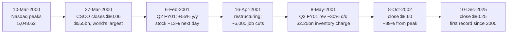

# G3 · Cisco at the dot-com peak (2000)

> **The hook.** On Monday 27 March 2000 Cisco Systems closed at $80.06 (split-adjusted). That made it worth
> $555.4bn, more than Microsoft and more than any other listed company in the world. It was a genuinely excellent
> business. Revenue had compounded at ~53% a year for four years, gross margins were 65%, it had no debt, and it held
> $14.9bn of cash and investments. Over the next 26 years Cisco more than tripled its revenue and grew earnings per
> share roughly nine-fold. Yet anyone who bought at that close was down 89% thirty months later, and the share price
> did not close above $80.06 again until 10 December 2025. What went wrong was the price, not the company. This case
> teaches you to read a price as a forecast and then decide whether you believe that forecast.

| | |
|:--|:--|
| **Period** | FY1995–FY2000 (set-up) · 27-Mar-2000 (decision) · 2000–2026 (outcome) |
| **Decision date** | Close of **27 March 2000**. You may use only what was public by then: the FY1999 10-K (Sep-1999), the restated FY1997–99 accounts (8-K/A, 3-Feb-2000), the Q2 FY2000 10-Q (14-Mar-2000), Cisco's press releases up to that day, and the Berkshire Hathaway letter dated 1-Mar-2000 |
| **Sector** | Networking equipment (US; Nasdaq: CSCO). Fiscal year ends on the last Saturday of July |
| **Themes** | Implied expectations; reverse DCF; great company ≠ great investment; equity duration; stock options and pooling accounting; cyclicality hidden in a growth story; inventory write-downs |
| **Modules this case reinforces** | [01.2 Market cap & EV](../../01-markets-101/02-shares-market-cap-and-enterprise-value.md) · [01.5 Returns math (TSR decomposition)](../../01-markets-101/05-time-value-and-returns-math.md) · [04.3 Returns on capital](../../04-financial-analysis/03-returns-on-capital.md) · [04.7 Quality of earnings](../../04-financial-analysis/07-quality-of-earnings.md) · [05.4 Capital cycle](../../05-business-analysis/04-capital-cycle-and-competition.md) · [06.1 What value is](../../06-valuation/01-what-is-value.md) · [06.6 Reverse DCF](../../06-valuation/06-reverse-dcf-and-expectations.md) · [09.3 Expense & asset red flags](../../09-forensics/03-expense-and-asset-red-flags.md) · [11.6 Behavioural finance](../../11-process/06-behavioural-finance-and-decision-journals.md) · [12.2 Market cycles](../../12-macro-special-sits/02-market-cycles-and-sentiment.md) |
| **Difficulty** | Intermediate. Do it after [06.3](../../06-valuation/03-dcf-step-by-step.md) and [06.6](../../06-valuation/06-reverse-dcf-and-expectations.md) |
| **Time** | ~3 hours (about 1.5 hours on sections 1–3 before you read on) |

!!! note "Conventions in this case"
    US GAAP, US dollars. "FY2000" means the year to 29-Jul-2000. **Per-share figures are adjusted for the 2-for-1
    split distributed on 22-Mar-2000** (and for earlier splits) unless marked "pre-split". Cisco's US filings are the
    10-K (annual report), 10-Q (quarterly report) and 8-K (current report on a material event). See
    [03.5](../../03-reading-filings/05-other-documents.md) for the US filing map. Figures marked "restated" come from
    Cisco's 8-K/A of 3-Feb-2000, which re-cut FY1997–99 history for later acquisitions (explained below).
    Share-price data are closing prices; total returns assume dividends are reinvested.

---

## 1. The scene (as of 27 March 2000)

### The business

Cisco made the equipment that moved data between computer networks. The product lines were **routers** (which direct
traffic between networks), **LAN and ATM switches** (which move traffic inside a network), dial-up **access servers**
and network-management software, all running Cisco's own operating system, **Cisco IOS**
([Q2 FY2000 10-Q, note 8][3]). In the quarter to 29-Jan-2000, sales were $1.69bn from routers, $1.70bn from switches,
$0.51bn from access products and $0.60bn from other products. The Americas generated 66% of revenue and no customer
accounted for 10% or more ([10-Q][3]). A Reuters profile that weekend described Cisco's gear as carrying roughly 80% of
Internet traffic ([Reuters via Indian Express][18]).

Growth was spectacular and accelerating again. Q2 FY2000 revenue was $4.35bn, up 52.9% on the year before, and
first-half revenue was up 51.8%. In the first half Asia/Pacific grew 81% and only Japan lagged, at 19%
([10-Q MD&A][3]). Q2 gross margin was 64.7%. The order **backlog** (confirmed orders not yet shipped) stood at $922m in September 1999 against $693m a year
earlier ([FY1999 10-K][1]). Headcount was about 21,000 at July 1999 ([FY1999 10-K][1]).

### Industry and competition

Two customer groups mattered. **Enterprises** were wiring offices and data centres. **Service providers**
(telecom carriers, ISPs and the new "competitive local exchange carriers", or **CLECs**, set up after US telecom
deregulation) were building Internet backbones. In its own 10-Q Cisco named 3Com, Alcatel, Cabletron, Ericsson, IBM,
Juniper, Lucent, Nortel and Siemens as competitors. It warned that moving into carrier markets meant fighting large
telecom-equipment makers and well-funded start-ups ([10-Q risk factors][3]).

**Juniper Networks** was the start-up to watch. Its 1999 revenue was $102.6m, all from one core router, the M40.
Quarterly revenue rose from $10.0m in Q1 1999 to $45.4m in Q4 1999, and two customers made up 58% of the year's sales
([Juniper FY1999 10-K405][16]). The 10-K405 was filed on 29-Mar-2000, two days after our decision date, but Juniper was
already a listed company and a competitor Cisco named itself.

### Management and the acquisition machine

John Chambers had been CEO since January 1995 ([FY2001 10-K][10]). His Cisco grew partly by buying start-ups and
paying in its own highly valued shares. Reuters counted more than 45 acquisitions since 1993 ([Reuters via Indian
Express][18]). The first half of FY2000 alone brought:

- **Poolings of interests.** StratumOne (≈$435m), TransMedia (≈$407m), **Cerent (≈$6.9bn, 98.1m pre-split shares)**,
  WebLine (≈$325m) and others. All were paid in stock ([10-Q note 3][3]).
- **Purchases.** Monterey Networks ($517m, of which $354m was expensed immediately as in-process R&D), MaxComm, Calista
  and Tasmania ([10-Q note 3][3]).
- **Pending or recently closed deals.** Aironet (≈$799m in stock, completed 15-Mar-2000), Pirelli's optical systems
  business (up to $2.15bn in stock, completed 16-Feb-2000), InfoGear and JetCell (≈$501m, agreed 16-Mar-2000), and
  Compatible Systems and Growth Networks (completed 24-Mar-2000) ([8-Ks][4]).

Two accounting rules shaped how all this looked in the numbers:

- **Pooling of interests** (allowed under US GAAP until the FASB's SFAS 141, issued in July 2001, required the
  purchase method for deals initiated after 30-Jun-2001 ([FY2001 10-K][10])). The two companies' book values were
  simply added together and history was restated as if they had always been one company. The market value of the
  shares Cisco issued never appeared on its balance sheet, so there was no goodwill and no amortisation.
- **In-process R&D (IPR&D) write-offs.** In deals accounted for as purchases, Cisco allocated a large slice of the price
  to research "in process" and expensed it at once ([10-Q note 3][3]). Cisco's reported "pro forma" earnings then
  excluded that charge ([FY2000 10-K, selected data][5]).

### What the market believed

At Friday's close on 24-Mar-2000, Reuters reported Cisco's market value as $579.2bn against Microsoft's $578.2bn.
Some analysts were already making Cisco their core large-cap tech holding. Others said it had a chance of becoming the
first company ever worth $1 trillion ([Reuters via Indian Express][18]). The next trading day CNET reported a close of
$80.06 and a market value of $555.4bn on all outstanding shares, against Microsoft's $541.6bn ([CNET][17]). The Nasdaq
Composite had closed at 5,048.62 on 10 March ([FRED NASDAQCOM][23]). You did not know that would be the top.

There were dissenters, and they were on the record. Warren Buffett's letter dated 1-Mar-2000 said Berkshire owned no
tech stocks because he could not tell which firms had durable advantages. He added that if investor expectations
normalised, "the market adjustment is apt to be severe" in the most speculative sectors ([Berkshire 1999 letter][20]).
On 14-Mar-2000 the *Wall Street Journal* ran an op-ed by Wharton's Jeremy Siegel titled "Big-Cap Tech Stocks Are a
Sucker Bet" ([Wikipedia summary; WSJ original paywalled][22]).

Cisco's own filings were candid too:

- The restated FY1999 accounts said future sales growth might be slower, and much less predictable, than in the past
  ([8-K/A][2]).
- The Q2 10-Q said gross margins were expected to keep falling as the product mix shifted to cheaper products.
- It said expenses were largely fixed in the short term, so a revenue shortfall would hurt results.
- It said sales to service providers were large and sporadic, and depended on those customers having funding.
- It said CLECs were asking for more customer financing and leasing ([10-Q risk factors][3]).

---

## 2. The numbers then

All figures below were available on 27-Mar-2000. We use the restated series from the 8-K/A (3-Feb-2000) so that
FY1997–99 are comparable with the H1 FY2000 10-Q.

**Table 2.1 — Five-year record (restated, as published Feb-2000)**

| FY (to July) | Revenue ($m) | Growth | Net income ($m) | Growth | Net margin | Diluted EPS, split-adj. ($) |
|:--|--:|--:|--:|--:|--:|--:|
| 1995 | 2,232 | — | 452 | — | 20.3% | 0.080 |
| 1996 | 4,101 | 83.7% | 915 | 102.4% | 22.3% | 0.150 |
| 1997 | 6,452 | 57.3% | 1,049 | 14.6% | 16.3% | 0.165 |
| 1998 | 8,489 | 31.6% | 1,340 | 27.7% | 15.8% | 0.205 |
| 1999 | 12,170 | 43.4% | 2,035 | 51.9% | 16.7% | 0.290 |
| **CAGR 1995–99** | | **52.8%** | | **45.7%** | | |

*Source: [8-K/A selected financial data][2]. EPS are the reported pre-March-2000-split figures ($0.16, $0.30, $0.33,
$0.41, $0.58) divided by 2.*

**Table 2.2 — Profitability, cash flow and earnings quality**

| $m (restated) | FY1997 | FY1998 | FY1999 | H1 FY2000 |
|:--|--:|--:|--:|--:|
| Revenue | 6,452 | 8,489 | 12,170 | 8,264 |
| Gross margin | 65.2% | 65.6% | 65.0% | 64.6% |
| R&D / revenue | 10.9% | 12.3% | 13.6% | 13.7% |
| Sales & marketing / revenue | 18.0% | 18.6% | 20.2% | 21.0% |
| Operating income (GAAP) | 1,626 | 2,085 | 2,894 | 1,721 |
| + In-process R&D written off | 508 | 594 | 471 | 424 |
| + Amortisation of goodwill & intangibles | 11 | 23 | 61 | 71 |
| **Adjusted EBIT** | 2,145 | 2,702 | 3,426 | 2,216 |
| Adjusted EBIT margin | 33.2% | 31.8% | 28.2% | 26.8% |
| Net income | 1,049 | 1,340 | 2,035 | 1,245 |
| Cash from operations (CFO) | 1,448 | 2,873 | 4,352 | 2,715 |
| — of which tax benefit from employee stock plans | 274 | 422 | 837 | 697 |
| Capex | (332) | (427) | (600) | (411) |
| Free cash flow (CFO − capex) | 1,116 | 2,446 | 3,752 | 2,304 |
| FCF margin | 17.3% | 28.8% | 30.8% | 27.9% |
| CFO / net income | 1.38× | 2.14× | 2.14× | 2.18× |
| Net income if options were expensed (SFAS 123 pro forma) | 895 | 1,083 | 1,503 | n/d |
| Option-expense "haircut" to net income | 14.7% | 19.2% | 26.1% | n/d |

*Sources: [8-K/A][2] (FY1997–99 statements and SFAS 123 note), [Q2 FY2000 10-Q][3]. Ratios computed by us.*

Three things in this table deserve a definition, because they are the case's hidden plot:

- **Tax benefit from employee stock plans.** When employees exercise options, the company gets a tax deduction for
  their gain. That cuts cash taxes and so raises CFO. The benefit grows with the share price, so it is **reflexive**:
  a rising stock inflates operating cash flow. It was 19% of CFO in FY1999 and 26% in H1 FY2000.
- **Option expense.** Under the rule then in force (APB 25), options granted at the market price cost nothing in the
  P&L. SFAS 123 only required the "pro forma" cost in a footnote. Cisco's own footnote cut FY1999 net income by 26%
  ([8-K/A note][2]). Cisco valued its FY1999 option grants using a 40.2% volatility assumption ([FY1999 10-K][1]).
- **Recurring "one-time" charges.** IPR&D write-offs appeared every year, equal to 23–48% of net income. A charge that
  recurs every year is part of the cost of how the company grows ([04.7](../../04-financial-analysis/07-quality-of-earnings.md)).

**Table 2.3 — Balance sheet and returns (restated)**

| $m | 25-Jul-1998 | 31-Jul-1999 | 29-Jan-2000 |
|:--|--:|--:|--:|
| Cash & short-term investments | 1,766 | 2,075 | 3,968 |
| Long-term + restricted investments | 4,017 | 8,112 | 10,926 |
| **Total cash & investments** | **5,783** | **10,187** | **14,894** |
| Accounts receivable | 1,304 | 1,249 | 1,711 |
| Inventories | 362 | 656 | 695 |
| Total assets | 9,023 | 14,846 | 21,391 |
| Borrowings | 0 | 0 | 0 |
| Shareholders' equity | 7,184 | 11,768 | 16,523 |
| — of which accumulated OCI (mostly unrealised gains) | 58 | 298 | 1,821 |
| **Operating invested capital** (equity + minority − cash & investments) | 1,444 | 1,625 | 1,674 |
| Receivable days (DSO) | 56.1 | 37.5 | 35.9* |
| Inventory days (on cost of sales) | 45.2 | 56.2 | 41.3* |
| ROE (net income / average equity) | 23.3% | 21.5% | — |
| ROIC (adj. EBIT × (1 − 36.9% tax) / average invested capital) | — | ≈141% | — |

*\*Annualised from Q2 FY2000. Sources: [8-K/A][2], [10-Q][3]. ROIC and ROE computed by us.*

The ROIC figure is not a typo. On **reported** capital Cisco was one of the most capital-efficient businesses ever
listed. Almost 70% of its assets were cash and securities, and its operating assets were largely funded by customers
and suppliers. The unrealised-gain line tells a second story: accumulated OCI jumped by $1.5bn in six months because
Cisco's equity stakes in other tech companies were themselves priced by the bubble ([10-Q note 5][3]). On 31-Jan-2000
Cisco also put ≈$1bn into KPMG Consulting preferred stock ([10-Q note 10][3]).

**Table 2.4 — Valuation at the close on 27-Mar-2000**

| Item | Value | How |
|:--|--:|:--|
| Share price (split-adjusted close) | $80.06 | [FY2000 10-K][5], [CNET][17] |
| Shares outstanding | 6,937.6m | 3,468.8m pre-split on 25-Feb-2000 ([10-Q cover][3]) × 2 |
| **Market capitalisation** | **$555.4bn** | matches [CNET][17] |
| Less: cash & investments (29-Jan-2000), no debt | ($14.9bn) | [10-Q][3] |
| **Enterprise value (EV)** | **≈$540.6bn** | |
| Trailing-12-month (TTM) revenue to Jan-2000 | $14,991m | FY1999 12,170 + H1 FY2000 8,264 − H1 FY1999 5,443 |
| TTM net income | $2,489m | 2,035 + 1,245 − 791 |
| TTM diluted EPS | ≈$0.345 | (0.58 + 0.34 − 0.23) ÷ 2 |
| **P/E (price ÷ TTM EPS)** | **≈232×** | market cap ÷ TTM net income gives ≈223× |
| P/E on the latest quarter's company-defined pro forma earnings, annualised | ≈155× | Q2 FY2000 pro forma net income $897m (as shown, restated, in the [FY2001 annual report's quarterly table][10]) × 4 |
| Price / sales | ≈37× | |
| EV / TTM adjusted EBIT | ≈133× | TTM adj. EBIT = 3,426 + 2,216 − 1,592 (H1 FY1999) = $4,050m |
| Price / book | ≈34× | |
| **Earnings yield (E/P)** | **≈0.45%** | vs **6.21%** on the 10-year US Treasury that day ([FRED DGS10](https://fred.stlouisfed.org/series/DGS10)) |

That last line is the whole case in one row. A risk-free government bond paid 6.21%. Cisco's owners were getting 0.45%
of the price in current earnings (and less after option costs). Everything else had to come from growth.

---

## 3. You are the analyst

Answer these **before reading section 4**, using only the information above. Show your arithmetic.

1. **(Numerical — the price tag.)** Rebuild Table 2.4. Compute Cisco's market cap, EV, trailing P/E, price/sales and
   earnings yield, and compare the earnings yield with the 10-year Treasury yield. On Friday 24 March Reuters reported
   a market value of $579.2bn at a close of $79.375, yet on Monday CNET reported $555.4bn at a *higher* price. Explain
   the gap.
2. **(Numerical — reverse DCF.)** Assume TTM revenue of $15.0bn and a **free-cash-flow margin of 25%** of revenue from
   year 1. This is generous: it roughly matches FY1999's FCF margin excluding option tax benefits, before any option
   cost. Discount at **11%**, which is 6.21% risk-free plus roughly 4.8 points of equity risk, low for a tech stock.
   Revenue grows at a constant rate *g* for 10 years, then 5% forever. Solve for the *g* that makes the DCF equal the
   EV of ≈$540.6bn. What revenue does Cisco need in year 10? What share of the value sits in the terminal value?
   Repeat for discount rates of 9–12% and margins of 20–30%.
3. **(Numerical — exit-multiple check.)** You want an 11% annual return over ten years, and Cisco pays no dividend. You
   think that by 2010 Cisco, as a mature giant, will trade at 25× earnings. What net income must Cisco report in FY2010?
   What annual growth rate from TTM $2.49bn does that imply?
4. **(Numerical — quality of earnings.)** For FY1999 and H1 FY2000, compute CFO/net income, the share of CFO that came
   from option tax benefits, and FCF margin with and without those benefits. Then compute a P/E on TTM earnings
   adjusted by the FY1999 SFAS 123 haircut.
5. **(Numerical — what did growth really cost?)** Compute FY1999 ROIC on reported invested capital. Then recompute it
   after adding back (a) FY1997–99 IPR&D write-offs and (b) the ≈$8.1bn of stock issued for the four H1 FY2000 poolings
   (StratumOne, TransMedia, Cerent, WebLine). Restating FY1999 for those four deals plus Fibex added only **$16m** of
   revenue and *reduced* net income by $61m (compare [FY1999 10-K][1] with [8-K/A][2]). What does that tell you?
6. **(Numerical — dilution.)** At 31-Jul-1999 Cisco had 442m options outstanding at a weighted-average exercise price
   of $22.43, both pre-split ([8-K/A][2]). Convert them to post-split terms. Compute their intrinsic value at $80.06 and
   the treasury-stock-method dilution ([01.2](../../01-markets-101/02-shares-market-cap-and-enterprise-value.md)).
7. **(Judgement — what must be true?)** List the three or four things that must all come true for $80 to earn a normal
   return. Which one expectation matters most? What in the filings bears on it?
8. **(Red flags.)** Name three items from the 10-Q and FY1999 accounts that you would monitor every quarter, and the
   threshold that would change your mind.
9. **(Decision.)** Write the strongest bull case in five lines. Then decide: own, avoid or short, and at what size? If
   you are an options trader, how would you express the view that *expectations* were too high, and what is the main
   risk to that trade? (Educational framing; see [11.7](../../11-process/07-fundamentals-meets-derivatives.md).)

---

## 4. What happened



| Date | Event | Source |
|:--|:--|:--|
| 22-Mar-2000 | 2-for-1 split distributed (record date 22-Feb) | [10-Q note 7][3] |
| 27-Mar-2000 | Close $80.06; market value $555.4bn; passes Microsoft | [CNET][17]; [FY2000 10-K][5] |
| 29-Jul-2000 | FY2000: revenue $18.93bn (+55.5%), net income $2.67bn (includes $1.37bn IPR&D and $531m of gains on minority investments); company "pro forma" net income $3.91bn; ~34,000 employees | [FY2000 10-K][5] |
| Q1 FY2001 (to 28-Oct-2000) | Revenue $6.52bn, a new record | [FY2001 annual report][10] |
| 6-Feb-2001 | Q2 FY2001: revenue $6.75bn (+55%), pro forma net income $1.33bn. Stock closes 13.1% lower next day | [8-K][6]; [Yahoo Finance][24] |
| 12-Mar-2001 | 10-Q for the quarter to 27-Jan-2001: inventories $2.53bn vs $1.23bn six months earlier (raw materials $941m vs $145m); 10-Q flags inventory above sales forecasts and long-term purchase commitments | [Q2 FY2001 10-Q][7] |
| 16-Apr-2001 | Restructuring announced: ~6,000 regular employees cut, excess facilities consolidated | [Q3 FY2001 10-Q][9] |
| 20-Apr-2001 | First shareholder class actions filed, alleging false and misleading statements (later consolidated; alleged class period 10-Nov-1999 to 6-Feb-2001) | [FY2001 10-K][10]; [FY2006 10-K][14] |
| 8-May-2001 | Q3 FY2001: revenue $4.73bn (−29.9% q/q, −4% y/y); **$2.25bn excess-inventory charge** (inventory above 12-month demand, including purchase commitments); $1.17bn restructuring and other charges, including $289m goodwill impairment (Monterey $108m); gross margin 6.9%; net loss $2.69bn | [8-K][8]; [10-Q][9] |
| 28-Jul-2001 | FY2001: revenue $22.29bn (+17.8%), net loss $1.01bn; doubtful-accounts allowance $43m → $288m; excess-inventory allowance $395m → $2,279m; ~38,000 employees | [FY2001 10-K][10] |
| Sep-2001 | First buyback authorised ($3bn); FY2002 repurchases ≈$1.9bn (124m shares) | [FY2002 10-K][11] |
| FY2002 | Revenue $18.92bn (−15.2%); net income $1.89bn; includes a $422m "excess inventory benefit" from selling or using stock previously written off | [FY2003 annual report][12] |
| 8/9-Oct-2002 | CSCO closes at $8.60 (−89.3% from peak); Nasdaq bottoms at 1,114.11 (−77.9%) | [Yahoo Finance][24]; [FRED][23] |
| FY2006 | Adopts SFAS 123(R): options now expensed ($617m after tax in FY2007) | [FY2007 annual report][13] |
| 18-Aug-2006 | Cisco announces a settlement of the class action: liability insurers to pay $91.75m, subject to court approval. Cisco had said the claims were without merit | [FY2006 10-K][14]; [FY2001 10-K][10] |
| FY2011 | First dividends ($0.12 per share for the year) | [SEC XBRL][15] |
| 2015 | Chuck Robbins succeeds Chambers as CEO | [Wikipedia][26] |
| 10-Dec-2025 | Close $80.25, first close above the 27-Mar-2000 record; market cap $317bn | [CNBC][19] |
| 13-May-2026 | Shares jump ≈15% after hours on AI-infrastructure orders; FY2026 AI-order target raised to $9bn | [CNBC][25] |
| 25-Jul-2026 | FY2026: revenue $63.3bn, net income $13.3bn, diluted shares 3,987m (EPS $3.33) | [SEC XBRL, FY2026 10-K][15] |

**Stock outcome for a buyer at $80.06 on 27-Mar-2000**

| Horizon | Date | Close ($) | Price change | Total return ≈ | Total return p.a. ≈ |
|:--|:--|--:|--:|--:|--:|
| +1 year | 27-Mar-2001 | 18.12 | −77.4% | −77.4% | −77.4% |
| +3 years | 27-Mar-2003 | 13.50 | −83.1% | −83.1% | −44.8% |
| +5 years | 28-Mar-2005 | 17.89 | −77.7% | −77.7% | −25.9% |
| +10 years | 26-Mar-2010 | 26.47 | −66.9% | −66.9% | −10.5% |
| +15 years | 27-Mar-2015 | 27.13 | −66.1% | −62.6% | −6.3% |
| +20 years | 27-Mar-2020 | 38.82 | −51.5% | −37.4% | −2.3% |
| +25 years | 27-Mar-2025 | 61.40 | −23.3% | +15.7% | +0.6% |
| Record regained | 10-Dec-2025 | 80.25 | +0.2% | +54.1% | +1.7% |
| Latest | 18-Sep-2026 | 109.51 | +36.8% | +113.3% | +2.9% |
| *S&P 500 (SPY), same start* | *18-Sep-2026* | | | *≈+700%* | *≈8.2%* |
| *Nasdaq-100 (QQQ), same start* | *18-Sep-2026* | | | *≈+627%* | *≈7.8%* |

*Split-adjusted closes and dividend-adjusted closes from [Yahoo Finance via yfinance][24], retrieved 21-Sep-2026.
Returns computed by us. Treat total returns as approximate; vendors' dividend adjustments differ slightly.*

**The business kept growing. The stock did not.**

| FY | Revenue ($bn) | Net income ($bn) | Diluted shares (m) | Diluted EPS ($) |
|:--|--:|--:|--:|--:|
| 2000 | 18.9 | 2.67 | 7,438 | 0.36 |
| 2005 | 24.8 | 5.74 | 6,612 | 0.87 |
| 2010 | 40.0 | 7.77 | 5,848 | 1.33 |
| 2015 | 49.2 | 8.98 | 5,146 | 1.75 |
| 2020 | 49.3 | 11.21 | 4,254 | 2.64 |
| 2025 | 56.7 | 10.18 | 3,998 | 2.55 |
| 2026 | 63.3 | 13.27 | 3,987 | 3.33 |

*Sources: [FY2000 10-K][5], [FY2007 annual report][13], [SEC XBRL company facts][15]. Figures from FY2006 onward
include option expense and FY2000's do not, so the comparison flatters FY2000.*

From FY2000 to FY2026, revenue rose 3.35× (4.8% a year) and net income 5.0× (6.4% a year). Buybacks cut the diluted
share count by 46%, so EPS rose 9.25× (8.9% a year). That is a creditable record for a large company. Now decompose
the share price from the peak to the day the record was regained (10-Dec-2025, 25.7 years;
[01.5](../../01-markets-101/05-time-value-and-returns-math.md)):

$$
\frac{P_{2025}}{P_{2000}} = \frac{\text{EPS}_{2025}}{\text{EPS}_{2000}} \times \frac{(P/E)_{2025}}{(P/E)_{2000}}
= \frac{2.55}{0.345} \times \frac{31.5}{232} = 7.39 \times 0.136 \approx 1.00
$$

EPS grew about 8.1% a year and the P/E shrank about 7.5% a year. Twenty-six years of real business progress were used
up just bringing the multiple back to earth. Note also that the market cap in Dec-2025 was $317bn, **43% below** 2000's
$555bn at the same share price. The per-share price recovered only because the share count had nearly halved.

---

## 5. Signals: knowable then vs hindsight

| Knowable on 27-Mar-2000 | Only in hindsight |
|:--|:--|
| The price implied ≈34% annual revenue growth for ten years from a $15bn base, reaching ≈$273bn of revenue by year 10. Even at a steady 5% growth rate the business was worth ≈$66bn, so ≈88% of the EV was a bet on growth above that (section 7, Q2) | The **timing and violence** of the turn: revenue fell 29.9% in one quarter, just 13 months after the peak |
| Earnings yield 0.45% vs Treasuries at 6.21%; ≈37× sales; ≈232× trailing earnings | The **size** of the inventory charge ($2.25bn). The purchase-commitment build-up only became visible in the Jan-2001 10-Q, filed in March 2001 |
| Cisco's own warnings: growth may slow, margins expected to fall, service-provider sales depend on funding, CLECs want financing | How deep the carrier and CLEC credit collapse would go (the doubtful-accounts allowance rose ~7× in FY2001) |
| Juniper's ramp in high-end routing, which Cisco's 10-Q counted among its higher-margin products (Juniper's quarterly revenue rose 4.5× during 1999) | That the P/E would spend most of the next two decades in the teens and twenties (≈20× in Mar-2010, ≈16× in Mar-2015, ≈15× in Mar-2020, each on the EPS of the fiscal year then in progress), and that revenue growth would average ~5% a year for 26 years |
| Earnings quality: 26% option-expense haircut; 19–26% of CFO from stock-price-dependent tax benefits; recurring IPR&D; ≈$8bn of acquisitions paid in stock kept off the balance sheet; bubble-priced equity stakes | That Cisco would survive, stay dominant in enterprise networking, pay dividends from 2011, and grow EPS ~9×. Hindsight cuts both ways: the *business* case was broadly right |
| Market context: Nasdaq up to 5,048 on 10-Mar; Buffett's and Siegel's public warnings | Whether 27-Mar-2000 was *the* top. Q1 FY2000's low close was $29.38 (10-Aug-1999; [FY2000 10-K][5], [Yahoo Finance][24]), so the stock had risen 172% in about seven and a half months. Someone short on valuation in late 1999 would have been badly hurt first |

!!! success "The strongest bull case that existed at the time"
    Cisco was the dominant supplier for the fastest-growing infrastructure market in history. It grew revenue ~53% a
    year with 65% gross margins and >100% ROIC on reported capital. It had net cash of $14.9bn, a proven
    acquire-and-integrate machine, switching costs built on IOS, and a CEO with a strong record. Buffett's own letter
    agreed that tech would transform society. Microsoft had shown that a dominant platform could compound for decades.
    And an overvalued share price was an *asset*: it let Cisco buy innovation (Cerent, Pirelli, Aironet) with paper.
    If the Internet build-out ran for another decade, 30%+ growth was not absurd.

    Why it still failed as an *investment case*: every clause above was about the **business**. The price required
    ≈34% growth for ten years *and then* a premium valuation. Q2 of section 7 shows that the growth Cisco actually
    achieved in the next decade (≈10% a year) was worth ≈$16/share on the same generous assumptions. Even 25% growth
    for a decade was worth ≈$44. The bull could be right about almost everything and still lose money.

!!! warning "Guard against hindsight bias"
    It is easy to say "the bubble was obvious". Many experienced investors owned Cisco on 27-Mar-2000, and anyone who
    shorted six months earlier (close $34.06 on 27-Sep-1999) had lost 135% of the short sale value by the peak. What you *could* know was the size of the bet the price required, not
    the date or the trigger of its failure. A fair grade for a 2000 analyst depends on whether they measured the implied
    expectations and sized the position accordingly, not on whether they called the top.
    ([11.6](../../11-process/06-behavioural-finance-and-decision-journals.md): process vs outcome.)

!!! tip "Trader's lens — implied vs realised growth"
    A reverse DCF is to a stock what implied volatility is to an option: price in, expectation out. At $80 you were
    effectively **buying growth at ≈34% implied** ([06.6](../../06-valuation/06-reverse-dcf-and-expectations.md)).
    Realised revenue growth over the next decade was about 10% (TTM $15.0bn → FY2010 $40.0bn). You can be long the right
    underlying (a great company) and still lose badly because you paid 34 "vols" for something that realised 10.

!!! tip "Trader's lens — duration"
    In the base-case reverse DCF, 78% of value sits in the terminal value beyond year 10. An equity like that behaves
    like a very long-dated bond with a growth option attached. Each 1-point change in the discount rate moves the
    required growth by about 3 points (section 7, Q2 grid). When the market's discount rate or growth belief shifts,
    long-duration equities move the most
    ([12.1](../../12-macro-special-sits/01-macro-for-equity-investors.md)).

!!! info "India notes"
    - **The same test, smaller numbers.** The course's running example, Kaveri Pumps at ₹390, implies ≈14.1% revenue
      growth for FY27–FY36 against 14.7% historical growth and a 10.8% base case
      ([Kaveri valuation](../../appendix/running-example/kaveri-valuation.md)). Cisco's price implied ≈34% against a
      ≈53% history. Both prices extrapolate the past. The difference is scale: Cisco needed to become a ≈$270bn-revenue
      company. Run a reverse DCF on any Indian stock trading above ~80× earnings before you discuss its "quality".
    - **Accounting has moved on, but the adjustments have not.** Ind AS 102 and Ind AS 103 are India's converged
      versions of IFRS 2 (which requires employee options to be expensed) and IFRS 3 (which requires the acquisition
      method) ([IFRS Foundation][27]). The APB 25 gap is closed. But "adjusted EBITDA excluding ESOP costs" in Indian
      new-age tech recreates it ([02.8](../../02-accounting/08-deeper-cuts-group-accounts-and-other.md),
      [07.4](../../07-special-valuation/04-high-growth-and-loss-making.md)).

---

## 6. Lessons

1. **A great company is not the same as a great investment. The return depends on what happens *relative to what was
   priced*.** Cisco's business beat most companies' records for 26 years and its stock still returned ~2–3% a year.
   → [06.1 What value is](../../06-valuation/01-what-is-value.md)
2. **Run the reverse DCF before the forward DCF.** Turn the price into revenue, margins and years, then ask whether the
   implied company (≈$273bn of revenue in a decade) could plausibly exist, and against which competitors.
   → [06.6 Reverse DCF](../../06-valuation/06-reverse-dcf-and-expectations.md)
3. **Multiple compression can cancel decades of growth.** TSR = EPS growth × change in P/E (+ dividends). Starting at
   ≈230× earnings, a 7.4× rise in EPS was only enough to break even on price once the P/E had fallen to ~31×.
   → [01.5 Returns math](../../01-markets-101/05-time-value-and-returns-math.md) ·
   [06.5 Multiples](../../06-valuation/05-relative-valuation-and-multiples.md)
4. **Compare the earnings yield with the risk-free rate.** A 0.45% earnings yield against a 6.2% bond yield means
   nearly all the value is long-dated growth, and extremely sensitive to rates and to belief.
   → [12.1 Macro](../../12-macro-special-sits/01-macro-for-equity-investors.md) ·
   [06.8 Margin of safety](../../06-valuation/08-margin-of-safety-and-expected-value.md)
5. **Price in the costs the P&L leaves out.** Option costs (a 26% haircut), stock-price-driven tax benefits in CFO,
   recurring IPR&D, and acquisitions paid in stock that pooling kept off the balance sheet all made Cisco look
   cheaper and more capital-light than it was.
   → [04.7 Quality of earnings](../../04-financial-analysis/07-quality-of-earnings.md) ·
   [02.8 Share-based payments](../../02-accounting/08-deeper-cuts-group-accounts-and-other.md)
6. **ROIC on reported capital can be an artefact.** 141% on book capital became ≈19% once the stock paid for
   acquisitions was counted. Judge capital allocation on what was *paid*, including shares, not on what was *booked*.
   → [04.3 Returns on capital](../../04-financial-analysis/03-returns-on-capital.md) ·
   [05.5 Capital allocation](../../05-business-analysis/05-management-and-capital-allocation.md)
7. **Look for the cycle hidden inside the growth story.** Cisco's customers were building capacity with borrowed and
   vendor-financed money. Cisco, facing component shortages, made long-term purchase commitments. When the customers'
   capex stopped, orders, inventory and receivables all turned at once. Watch customer funding, lead times, inventory
   and purchase commitments.
   → [05.4 Capital cycle](../../05-business-analysis/04-capital-cycle-and-competition.md) ·
   [04.4 Working capital](../../04-financial-analysis/04-working-capital-and-cash-conversion.md)
8. **Write-downs have a second act.** A $2.25bn inventory charge was followed by $187m (Q4 FY2001) and $422m (FY2002)
   of "excess inventory benefit" as written-off stock was used or sold. That raised later margins. Whenever there is a
   big bath, track what flows back.
   → [09.3 Expense & asset red flags](../../09-forensics/03-expense-and-asset-red-flags.md)

---

## 7. Model answers

<details markdown="1"><summary><strong>Q1 — The price tag</strong></summary>

Shares: 3,468,815,049 pre-split × 2 = **6,937.6m**. Market cap = 6,937.6m × $80.0625 = **$555.4bn**, which matches
CNET's figure.

EV = 555.4 − 14.894 (cash & investments at 29-Jan-2000; no debt) = **≈$540.6bn**. Strictly you should also update cash
for the two months since January, and add the shares issued for acquisitions closed in February and March. Neither
changes the conclusion.

TTM revenue = 12,170 + 8,264 − 5,443 = $14,991m. TTM net income = 2,035 + 1,245 − 791 = $2,489m.
TTM diluted EPS = (0.58 + 0.34 − 0.23)/2 = $0.345.

- P/E = 80.06 / 0.345 = **≈232×**. Market cap / net income gives 555.4/2.489 = ≈223×. The difference is basic vs
  diluted share counts.
- P/S = 555.4 / 14.991 = **≈37×**.
- Earnings yield = 2,489 / 555,400 = **0.45%**, one-fourteenth of the 6.21% Treasury yield.

**Why Reuters' $579.2bn differed from CNET's $555.4bn.** $579.2bn ÷ $79.375 implies ≈7.30bn shares, against
≈6.94bn outstanding. Reuters evidently used a larger share count. It could have been a diluted count, or one that
included shares for pending deals. "Market cap" is only as good as the share count behind it: always state basic vs
diluted ([01.2](../../01-markets-101/02-shares-market-cap-and-enterprise-value.md)).
</details>

<details markdown="1"><summary><strong>Q2 — Reverse DCF</strong></summary>

Model: $EV = \sum_{t=1}^{10} \frac{m\,R_0(1+g)^t}{(1+r)^t} + \frac{1}{(1+r)^{10}}\cdot\frac{m\,R_0(1+g)^{10}(1+g_T)}{r-g_T}$
with $R_0 = 14.991$, $m = 25\%$, $r = 11\%$, $g_T = 5\%$. Solving numerically (Python `brentq`) gives
**g ≈ 33.7% a year for ten years**.

- Year-10 revenue ≈ **$273bn** (FCF ≈ $68bn). That is 4.3× the revenue Cisco actually reported in FY2026, and 6.8× its
  FY2010 revenue.
- PV of years 1–10 FCF ≈ $120bn. PV of terminal value ≈ $422bn (TV ≈ $1,197bn). Terminal value is **≈78%** of the total.
- Value with no high-growth phase (5% growth from today) = 14.991 × 1.05 × 0.25 / (0.11 − 0.05) ≈ **$66bn**. So ≈88%
  of the EV was paying for growth above 5%.

**Implied 10-year revenue CAGR: sensitivity grid**

| Discount rate ↓ / FCF margin → | 20% | 25% | 30% |
|:--|--:|--:|--:|
| 9% | 29.8% | 26.8% | 24.4% |
| 10% | 33.6% | 30.4% | 27.9% |
| 11% | 36.9% | 33.7% | 31.1% |
| 12% | 39.9% | 36.6% | 33.9% |

Stretch the high-growth phase and the rate falls but the destination doesn't shrink. Fifteen years needs ≈24.8% a
year (revenue ≈$414bn in year 15). Twenty years needs ≈20.5% (≈$629bn). Another framing: at 50% growth, Cisco needed
between six and seven more years of it (value $473bn after six years, $644bn after seven) before fading to 5%.

**Forward check at the same assumptions.** 10% growth for ten years → EV ≈ $96bn ≈ **$16/share** (after adding back
$14.9bn cash, over 6.94bn shares). 20% → ≈$31/share. 25% → ≈$44/share. 30% → ≈$62/share.
</details>

<details markdown="1"><summary><strong>Q3 — Exit-multiple check</strong></summary>

Required market cap in 2010 = 555.4 × 1.11¹⁰ ≈ **$1,577bn**. At 25× earnings, FY2010 net income must be ≈ **$63.1bn**.
From $2.49bn that is a 25-fold increase, or **≈38% a year** for ten years. At 20× the requirement is $78.9bn (41% a
year). At 30× it is $52.6bn (36%).

What happened: FY2010 net income was **$7.77bn**, about 12% of the requirement. At 25× that would support a market
cap of ≈$194bn. Two independent methods (DCF and exit multiple) say the same thing: the price needed ~35–40% annual
growth for a decade. That agreement is the point of doing both ([06.4](../../06-valuation/04-dcf-in-practice.md)).
</details>

<details markdown="1"><summary><strong>Q4 — Quality of earnings</strong></summary>

| | FY1999 | H1 FY2000 |
|:--|--:|--:|
| CFO / net income | 4,352 / 2,035 = 2.14× | 2,715 / 1,245 = 2.18× |
| Option tax benefit / CFO | 837 / 4,352 = 19.2% | 697 / 2,715 = 25.7% |
| FCF margin (reported) | 3,752 / 12,170 = 30.8% | 2,304 / 8,264 = 27.9% |
| FCF margin excluding option tax benefits | (3,752 − 837) / 12,170 = 24.0% | (2,304 − 697) / 8,264 = 19.4% |

CFO far above net income normally reassures. Here it partly reflects the addback of non-cash IPR&D (itself paid in
stock) and tax benefits that exist only because the stock went up. Stock-option economics dress up both the
numerator and the denominator.

**Option-adjusted P/E.** The FY1999 SFAS 123 haircut is 1 − 1,503/2,035 = 26.1%. Applied to TTM net income:
2,489 × 0.739 ≈ $1,838m, so P/E ≈ 555.4/1.838 ≈ **≈302×**. Our 25% FCF margin in Q2 is therefore generous. After
option costs, the sustainable owner FCF margin was closer to 20% than 25%.
</details>

<details markdown="1"><summary><strong>Q5 — ROIC and the cost of growth</strong></summary>

FY1999 NOPAT = adjusted EBIT × (1 − tax rate) = 3,426 × (1 − 1,189/3,224) = 3,426 × 0.631 ≈ **$2,163m**.
Invested capital = equity + minority − cash & investments: 1,444 (FY1998), 1,625 (FY1999). Average 1,535 → **ROIC ≈ 141%**.

- Add back FY1997–99 IPR&D write-offs (508 + 594 + 471 = 1,573): capital 1,625 + 1,573 = 3,198 → ROIC ≈ **68%**.
- Also add the ≈$8,067m of stock issued for StratumOne, TransMedia, Cerent and WebLine: capital ≈ 11,265 → ROIC on
  FY1999 NOPAT ≈ **19%**.

Lesson: pooling and IPR&D write-offs kept the true cost of buying growth off the balance sheet. Restating FY1999 for
five pooled companies added $16m of revenue and *cut* net income by $61m. Cisco was buying *options on future
products* (Cerent's optical gear, for example), not current earnings. For existing Cisco holders this was not
necessarily bad. Paying with overvalued stock is a rational use of an expensive currency. But an analyst must count
it: incremental ROIC on all capital, including shares, was nowhere near 141%
([04.3](../../04-financial-analysis/03-returns-on-capital.md)).
</details>

<details markdown="1"><summary><strong>Q6 — Option dilution</strong></summary>

Post-split: 442 × 2 = **884m options** at 22.43 / 2 = **$11.22**. That is 13.1% of the 6,748m (post-split) shares
outstanding at 31-Jul-1999.

- Intrinsic value at $80.06 = 884m × (80.06 − 11.22) ≈ **$60.9bn**, about 11% of market cap. This was an economic
  liability of shareholders that appeared nowhere on the balance sheet.
- Treasury-stock method: net new shares = 884 × (1 − 11.22/80.06) ≈ **760m**, 11.0% dilution. Diluted market cap ≈
  (6,937.6 + 760) × 80.06 ≈ **$616bn**. The option data are eight months stale, so treat these numbers as indicative.
  New grants in FY2000 would add to them.
</details>

<details markdown="1"><summary><strong>Q7 — What must be true</strong></summary>

For $80 to earn roughly 11% a year, all of these had to hold together:

1. **Market growth.** Network-equipment spending keeps compounding at 30%+ for about a decade. That requires customers,
   especially service providers, to keep finding funding.
2. **Share.** Cisco holds its share against Juniper in core routing, telecom giants in carrier gear, and low-end rivals
   in access and switching.
3. **Margins.** ~65% gross margin and a ~25% owner-FCF margin survive a mix shift that Cisco itself said was pushing
   margins down.
4. **Valuation at the end.** In 2010 the market still pays a premium multiple (≈25×) for a company with ≈$270bn of
   revenue.

**The expectation that matters most is (1).** It is the largest lever and the one Cisco controlled least. The 10-Q
flagged it directly: service-provider purchases were sporadic and funding-dependent, and CLECs needed vendor
financing. A customer base that needs *you* to finance its purchases of *your* product is a leading indicator of a
capex cycle, not of a secular trend ([05.4](../../05-business-analysis/04-capital-cycle-and-competition.md)).
</details>

<details markdown="1"><summary><strong>Q8 — What to monitor</strong></summary>

Strong answers name a metric, a source and a trigger:

- **Customer financing and credit.** Lease receivables, loan commitments and the doubtful-accounts allowance (10-Q
  balance sheet, Schedule II). Trigger: financing growing faster than revenue, or the allowance jumping. It went from
  $43m to $288m in FY2001.
- **Inventory and purchase commitments vs orders.** Inventory days, raw materials, commitments disclosed in MD&A.
  Trigger: inventory growing much faster than revenue while management talks of component shortages. In the
  six months to Jan-2001 inventory doubled and raw materials rose 6.5×.
- **Sequential revenue and backlog.** Trigger: q/q growth decelerating while y/y still looks great. The 55% y/y
  growth in Q2 FY2001 masked a q/q growth rate of only 3.5% (6,748 vs 6,519).
- **Gross margin and competitive share in core routing** (Juniper's quarterly revenue). Trigger: gross margin below
  ~63% or Juniper's growth accelerating.
- **Earnings-quality spreads.** Pro forma vs GAAP net income, option tax benefits as a share of CFO. Trigger: a
  widening gap.
</details>

<details markdown="1"><summary><strong>Q9 — Decision (model reasoning, not advice)</strong></summary>

A disciplined 2000 analyst could admire the business and still **decline to own it at $80**. Even at a generous 9%
discount rate and 30% FCF margin, the price needed ≈24% growth for a decade, and the base case needed ≈34%. The
margin of safety was negative under every reasonable scenario
([06.8](../../06-valuation/08-margin-of-safety-and-expected-value.md)). Put it on a watchlist with a price at which the
implied growth becomes believable. Q2's forward grid suggests something like $30–45 (20–25% growth), and even that is
demanding.

**Shorting** on valuation alone was dangerous. The stock had risen 172% from its Q1 FY2000 low in about seven and a half
months, borrow and short squeezes were real, and nothing in the filings dated the turn. A trader expressing "expectations too
high" might use defined-risk structures, such as long-dated put spreads, rather than outright shorts. But premiums
were expensive in a stock with ~40% volatility (the figure Cisco used to value its own option grants). The main risk
is **timing**: a correct valuation view can lose money for quarters before it pays
([11.7](../../11-process/07-fundamentals-meets-derivatives.md)).
</details>

<details markdown="1"><summary><strong>Python used for the arithmetic</strong></summary>

```python
from scipy.optimize import brentq

R0, EV = 14.991, 540.6          # TTM revenue to Jan-2000 and EV at 27-Mar-2000, $bn

def dcf(g, m=0.25, r=0.11, N=10, gT=0.05):
    """FCF = m x revenue; g for N years, then gT forever (Gordon terminal value)."""
    pv, R = 0.0, R0
    for t in range(1, N + 1):
        R *= 1 + g
        pv += R * m / (1 + r) ** t
    tv = R * (1 + gT) * m / (r - gT)
    return pv + tv / (1 + r) ** N

g = brentq(lambda x: dcf(x) - EV, -0.5, 3.0)
print(f"implied g = {g:.1%}")                     # 33.7%
for r in (0.09, 0.10, 0.11, 0.12):               # sensitivity grid
    print(r, [round(brentq(lambda x: dcf(x, m=m, r=r) - EV, -0.5, 3) * 100, 1)
              for m in (0.20, 0.25, 0.30)])
for g in (0.10, 0.20, 0.25, 0.30):               # forward check, $/share
    print(g, round((dcf(g) + 14.894) / 6.9376, 2))
print(555.4 * 1.11 ** 10 / 25)                   # Q3: required FY2010 net income, 63.1
```

</details>

---

## 8. Discussion questions & extensions

1. **Monitoring a modern analogue.** Pick any current supplier of AI data-centre infrastructure (for study, not as a
   recommendation). Build the Q8 dashboard for it: how its customers fund capex, vendor financing, inventory and
   purchase commitments, customer concentration, stock-based compensation as a share of revenue, and the gap between
   GAAP and "non-GAAP" earnings. Which metric would have given you the earliest warning in Cisco's case?
2. **Was paying with stock good for Cisco's shareholders?** Cisco issued ≈$8bn of stock for companies with almost no
   revenue. The Cerent deal alone (≈$6.9bn for ≈99.9m pre-split shares and options) valued Cisco's stock at ≈$35 split-adjusted,
   about four times the 2002 low. Argue both sides: value destruction
   through dilution vs a cheap currency used to buy the next product cycle. How does your answer change if the
   acquired technology (e.g., Monterey, impaired in 2001) failed?
3. **The same price, a smaller company.** In Dec-2025 the share price matched 2000's, but the market cap was 43% lower.
   Recompute the Q2 reverse DCF for Cisco at $80.25 in Dec-2025 using FY2025 data. What growth does *that* price imply,
   and how does it compare with Cisco's recent history?
4. **Base rates.** How many companies in history have grown revenue at 30%+ a year for ten years *starting* from $15bn?
   Design a screen or a literature search to find out. How should that base rate change the probability you assign
   to the bull case ([11.6](../../11-process/06-behavioural-finance-and-decision-journals.md))?
5. **Time as a variable.** A buyer at the peak earned ≈2.9% a year to Sep-2026 with dividends reinvested, against
   ≈8.2% for the S&P 500. Express the opportunity cost in money on a ₹1 crore position over 26 years. When is "it
   eventually came back" a meaningful defence of a purchase?

---

## Sources

All accessed 21-Sep-2026. SEC documents were retrieved from EDGAR full-text archives. Share-price data came via
yfinance.

1. Cisco Systems, **Form 10-K405 for FY1999** (filed 28-Sep-1999), incl. Exhibit 13 (1999 Annual Report: selected
   data, SFAS 123 note, backlog, employees). <https://www.sec.gov/Archives/edgar/data/858877/0000891618-99-004365.txt>
2. Cisco Systems, **Form 8-K/A** (filed 3-Feb-2000): supplementary consolidated financial statements for FY1997–99
   restated for poolings (Fibex, GeoTel, StratumOne, TransMedia, Cerent, WebLine); SFAS 123 pro forma; risk factors.
   <https://www.sec.gov/Archives/edgar/data/858877/0000891618-00-000468.txt>
3. Cisco Systems, **Form 10-Q for the quarter ended 29-Jan-2000** (filed 14-Mar-2000): statements, notes on business
   combinations, split, segments, KPMG Consulting investment; MD&A and risk factors; share count on 25-Feb-2000.
   <https://www.sec.gov/Archives/edgar/data/858877/0000891618-00-001422.txt>
4. Cisco Systems, **Forms 8-K** of 17-Feb-2000 (Pirelli optical), 16-Mar-2000 (Aironet), 27-Mar-2000
   (InfoGear/JetCell), 28-Mar-2000 (Compatible Systems, Growth Networks).
   <https://www.sec.gov/Archives/edgar/data/858877/0000891618-00-001024.txt> ·
   <https://www.sec.gov/Archives/edgar/data/858877/0000891618-00-001512.txt> ·
   <https://www.sec.gov/Archives/edgar/data/858877/0000891618-00-001722.txt> ·
   <https://www.sec.gov/Archives/edgar/data/858877/0000891618-00-001763.txt>
5. Cisco Systems, **Form 10-K for FY2000** (filed 29-Sep-2000): quarterly high/low closing prices (split-adjusted),
   selected data FY1996–2000, employees. <https://www.sec.gov/Archives/edgar/data/858877/0001095811-00-003692.txt>
6. Cisco Systems, **Form 8-K** (filed 8-Feb-2001), press release on Q2 FY2001 results dated 6-Feb-2001.
   <https://www.sec.gov/Archives/edgar/data/858877/0001095811-01-000848.txt>
7. Cisco Systems, **Form 10-Q for the quarter ended 27-Jan-2001** (filed 12-Mar-2001): inventory detail and
   inventory risk commentary. <https://www.sec.gov/Archives/edgar/data/858877/0001095811-01-500424.txt>
8. Cisco Systems, **Form 8-K** (filed 11-May-2001), press release on Q3 FY2001 results dated 8-May-2001.
   <https://www.sec.gov/Archives/edgar/data/858877/0000891618-01-500638.txt>
9. Cisco Systems, **Form 10-Q for the quarter ended 28-Apr-2001** (filed 1-Jun-2001): restructuring, $2.25bn excess
   inventory charge, goodwill impairment, MD&A. <https://www.sec.gov/Archives/edgar/data/858877/0000891618-01-500994.txt>
10. Cisco Systems, **Form 10-K for FY2001** (filed 24-Sep-2001), incl. Exhibit 13 (2001 Annual Report: selected data,
    pro forma reconciliation, quarterly data and prices, Schedule II, SFAS 141/142 note, legal proceedings).
    <https://www.sec.gov/Archives/edgar/data/858877/0001095811-01-505065.txt>
11. Cisco Systems, **Form 10-K for FY2002** (filed 18-Sep-2002): stock repurchase programme.
    <https://www.sec.gov/Archives/edgar/data/858877/0000891618-02-004345.txt>
12. Cisco Systems, **2003 Annual Report** (Exhibit 13.1 to FY2003 10-K): FY1999–2003 selected data; FY2002 excess
    inventory benefit ($422m); FY2003 price ranges.
    <https://www.sec.gov/Archives/edgar/data/858877/000119312503047374/dex131.htm>
13. Cisco Systems, **2007 Annual Report** (Exhibit 13.1 to FY2007 10-K): FY2003–2007 selected data; SFAS 123(R).
    <https://www.sec.gov/Archives/edgar/data/858877/000119312507202552/dex131.htm>
14. Cisco Systems, **Form 10-K for FY2006** (filed 18-Sep-2006): legal proceedings (class-action settlement).
    <https://www.sec.gov/Archives/edgar/data/858877/000119312506192133/d10k.htm>
15. SEC, **XBRL company facts for Cisco (CIK 858877)**: FY2008–FY2026 revenue, net income, diluted shares, EPS,
    dividends per share, buybacks. FY2026 figures come from the 10-K filed 2-Sep-2026 (accession 0000858877-26-000132).
    <https://data.sec.gov/api/xbrl/companyfacts/CIK0000858877.json> ·
    <https://www.sec.gov/Archives/edgar/data/858877/000085887726000132/csco-20260725.htm>
16. Juniper Networks, **Form 10-K405 for 1999** (filed 29-Mar-2000) and **Form 10-K for 2000** (filed 27-Mar-2001).
    <https://www.sec.gov/Archives/edgar/data/1043604/0000891618-00-001805.txt> ·
    <https://www.sec.gov/Archives/edgar/data/1043604/0000891618-01-000244.txt>
17. CNET News, "Cisco ascends to most valuable company", 27-Mar-2000.
    <https://www.cnet.com/tech/mobile/cisco-ascends-to-most-valuable-company/>
18. Reuters, "Cisco replaces Microsoft as world's most valuable company", published in *The Indian Express*,
    26-Mar-2000 (archived copy).
    <https://web.archive.org/web/20130116101944/http://www.expressindia.com/ie/daily/20000326/ibu26043.html>
19. CNBC, "Cisco's stock closes at record for first time since dot-com peak in 2000", 10-Dec-2025.
    <https://www.cnbc.com/2025/12/10/ciscos-stock-closes-at-record-for-first-time-since-dot-com-peak-2000.html>
20. Berkshire Hathaway, **Chairman's Letter 1999** (dated 1-Mar-2000).
    <https://www.berkshirehathaway.com/letters/1999htm.html>
21. Berkshire Hathaway, **Chairman's Letter 2000** (dated 28-Feb-2001): the "bird in the hand" valuation framework and
    the bubble post-mortem (recommended reading after this case). <https://www.berkshirehathaway.com/letters/2000pdf.pdf>
22. Wikipedia, "Jeremy Siegel" (for the date and title of the 14-Mar-2000 WSJ op-ed). The original is paywalled and
    was not read: <https://www.wsj.com/articles/SB952997047343478041>. <https://en.wikipedia.org/wiki/Jeremy_Siegel>
23. Federal Reserve Bank of St. Louis, FRED: **DGS10** (10-year Treasury constant-maturity yield) and **NASDAQCOM**
    (Nasdaq Composite). <https://fred.stlouisfed.org/series/DGS10> · <https://fred.stlouisfed.org/series/NASDAQCOM>
24. Yahoo Finance historical prices for CSCO, SPY and QQQ (split-adjusted close and dividend-adjusted close), retrieved
    via the `yfinance` Python package on 21-Sep-2026. <https://finance.yahoo.com/quote/CSCO/history/>
25. CNBC, "Cisco's stock pops 15% on surging AI orders, as company says it's cutting almost 4,000 jobs", 13-May-2026.
    <https://www.cnbc.com/2026/05/13/cisco-csco-q3-earnings-report-2026.html>
26. Wikipedia, "Cisco" (CEO succession 2015; used only for this non-financial fact). <https://en.wikipedia.org/wiki/Cisco>
27. IFRS Foundation, summaries of **IFRS 2 Share-based Payment** and **IFRS 3 Business Combinations**.
    <https://www.ifrs.org/issued-standards/list-of-standards/ifrs-2-share-based-payment/> ·
    <https://www.ifrs.org/issued-standards/list-of-standards/ifrs-3-business-combinations/>

[1]: https://www.sec.gov/Archives/edgar/data/858877/0000891618-99-004365.txt
[2]: https://www.sec.gov/Archives/edgar/data/858877/0000891618-00-000468.txt
[3]: https://www.sec.gov/Archives/edgar/data/858877/0000891618-00-001422.txt
[4]: https://www.sec.gov/Archives/edgar/data/858877/0000891618-00-001763.txt
[5]: https://www.sec.gov/Archives/edgar/data/858877/0001095811-00-003692.txt
[6]: https://www.sec.gov/Archives/edgar/data/858877/0001095811-01-000848.txt
[7]: https://www.sec.gov/Archives/edgar/data/858877/0001095811-01-500424.txt
[8]: https://www.sec.gov/Archives/edgar/data/858877/0000891618-01-500638.txt
[9]: https://www.sec.gov/Archives/edgar/data/858877/0000891618-01-500994.txt
[10]: https://www.sec.gov/Archives/edgar/data/858877/0001095811-01-505065.txt
[11]: https://www.sec.gov/Archives/edgar/data/858877/0000891618-02-004345.txt
[12]: https://www.sec.gov/Archives/edgar/data/858877/000119312503047374/dex131.htm
[13]: https://www.sec.gov/Archives/edgar/data/858877/000119312507202552/dex131.htm
[14]: https://www.sec.gov/Archives/edgar/data/858877/000119312506192133/d10k.htm
[15]: https://data.sec.gov/api/xbrl/companyfacts/CIK0000858877.json
[16]: https://www.sec.gov/Archives/edgar/data/1043604/0000891618-00-001805.txt
[17]: https://www.cnet.com/tech/mobile/cisco-ascends-to-most-valuable-company/
[18]: https://web.archive.org/web/20130116101944/http://www.expressindia.com/ie/daily/20000326/ibu26043.html
[19]: https://www.cnbc.com/2025/12/10/ciscos-stock-closes-at-record-for-first-time-since-dot-com-peak-2000.html
[20]: https://www.berkshirehathaway.com/letters/1999htm.html
[22]: https://en.wikipedia.org/wiki/Jeremy_Siegel
[23]: https://fred.stlouisfed.org/series/NASDAQCOM
[24]: https://finance.yahoo.com/quote/CSCO/history/
[25]: https://www.cnbc.com/2026/05/13/cisco-csco-q3-earnings-report-2026.html
[26]: https://en.wikipedia.org/wiki/Cisco
[27]: https://www.ifrs.org/issued-standards/list-of-standards/ifrs-3-business-combinations/

---
[← Previous: G2 · Buffett buys Coca-Cola (1988)](02-coca-cola-1988.md) · [Module index](../index.md) · [Next: G4 · Enron (2001) →](04-enron-2001.md)
