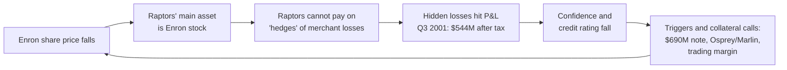

# G4 · Enron (2001): earnings from a model, cash from a loan

> **The hook.** In April 2001 Enron was the seventh-largest US company by revenue. It was rated investment grade, audited by Arthur Andersen, and priced at about 40 times "recurring" earnings even after falling a third from its August 2000 peak. Eight months later it was bankrupt. The fraud was hidden. A surprising amount of the rest was not. The FY2000 10-K showed a 7% return on capital, almost no operating cash for nine months, and three-quarters of operating profit coming from mark-to-market trading. It showed a CFO running partnerships that traded with the company, and financial contracts that would settle early if the share price or the credit rating fell far enough. In this case you stand on **2 April 2001** with only the public record and decide what you would have done.

| Item | Detail |
|:--|:--|
| **Period** | FY1996–FY2000 financials; collapse Oct–Dec 2001; legal aftermath to 2013 |
| **Decision date** | **2 April 2001**, the day Enron filed its FY2000 10-K. Share price ≈ $60 (§1.4) |
| **Sector** | US energy: gas pipelines, a power utility, wholesale energy trading, retail energy services, broadband |
| **Themes** | Mark-to-market earnings · SPEs and off-balance-sheet debt · prepays (loans dressed up as trades) · operating cash flow vs profit · a CFO on both sides of the table · rating and share-price triggers · gatekeeper failure |
| **Modules this case reinforces** | [02.2 Revenue recognition](../../02-accounting/02-accrual-accounting-and-revenue-recognition.md) · [02.5 Cash-flow statement](../../02-accounting/05-the-cash-flow-statement.md) · [02.8 Group accounts & related parties](../../02-accounting/08-deeper-cuts-group-accounts-and-other.md) · [03.3 Notes to accounts](../../03-reading-filings/03-notes-to-accounts.md) · [04.3 Returns on capital](../../04-financial-analysis/03-returns-on-capital.md) · [04.4 Cash conversion](../../04-financial-analysis/04-working-capital-and-cash-conversion.md) · [04.5 Leverage](../../04-financial-analysis/05-leverage-solvency-liquidity.md) · [04.7 Quality of earnings](../../04-financial-analysis/07-quality-of-earnings.md) · [05.6 Governance](../../05-business-analysis/06-corporate-governance-india.md) · [06.6 Reverse DCF](../../06-valuation/06-reverse-dcf-and-expectations.md) · [09.4 Cash-flow games](../../09-forensics/04-cash-flow-games.md) · [09.6 Forensic scores](../../09-forensics/06-forensic-scoring-models.md) |
| **Difficulty** | Advanced (★★★★☆). Assumes Modules 02–06 and 09 |
| **Time** | ≈ 3–4 hours, including ≈ 90 minutes on §3 before you read on |

All amounts are in US dollars. M = million, B = billion. Bracketed numbers point to the [Sources](#sources).

---

## 1. The scene (as of 2 April 2001)

### 1.1 The business

Enron was formed in 1985 by merging two gas-pipeline companies [[13]](#sources). Its FY2000 10-K reported five segments [[1]](#sources):

- **Transportation & Distribution.** Interstate gas pipelines and the Oregon utility Portland General Electric. These were steady, regulated assets.
- **Wholesale Services.** Buying, selling, delivering and hedging gas, power and a growing list of other commodities. EnronOnline, launched in late 1999, took Enron's side of every trade as principal, and wholesale volumes rose 59% in 2000. Wholesale earned **$2,260M of the $2,482M** of income before interest, minority interests and taxes (**IBIT**, Enron's operating-profit measure).
- **Retail Energy Services (EES).** Long-term energy-management contracts with commercial and industrial customers.
- **Broadband Services.** Bandwidth trading and content delivery. It lost $60M in 2000.
- **Corporate & Other.** Included the Azurix water business, wind power and MTBE plants.

The India link: Enron held **50% of the voting interest in Dabhol Power Company** in Maharashtra. Phase I (826 MW) began commercial operation in May 1999, and Phase II (1,624 MW) was due in late 2001. The plant sold power under a 20-year agreement with the Maharashtra State Electricity Board [[1]](#sources).

Three definitions you need before the numbers:

- **Mark-to-market (MTM) accounting**: a contract is carried at its estimated current fair value, and changes in that value go through profit. So does the estimated value of a newly signed contract. Enron booked unrealised gains on newly originated contracts as "Other revenues". The prices used reflected management's best estimate, including time value and volatility [[1]](#sources). For long-dated contracts with no liquid market, fair value means model value. Enron's **merchant investments** (stakes in energy and tech companies) were also marked to fair value.
- **Special purpose entity (SPE)**: a separate legal entity set up for a narrow purpose. Under the US rules of the time, a sponsor could keep an SPE off its balance sheet if an independent owner put in equity of at least **3% of the SPE's assets**, kept it at risk, and controlled the SPE [[9]](#sources).
- **Related-party transaction**: a deal between the company and an insider or an insider's entity. You cannot assume it was priced at arm's length ([02.8](../../02-accounting/08-deeper-cuts-group-accounts-and-other.md)).

### 1.2 Management, board and auditor

- **Kenneth Lay** had been CEO for 15 years and remained chairman. **Jeffrey Skilling**, president and COO since 1997, became CEO in February 2001 [[22]](#sources) [[15]](#sources).
- **Andrew Fastow** was CFO. On 28 June 1999 and 11 October 1999 the board approved his role as general partner of two private-equity partnerships, **LJM1** and **LJM2**. Each approval was a determination under Enron's Code of Conduct that his involvement would not harm Enron [[9]](#sources).
- The 2001 proxy, filed on 27 March 2001, named Fastow as managing member of LJM2's general partner. It disclosed 2000 derivatives with LJM2 of ≈ $2.1B notional, run through four "structured finance vehicles" [[6]](#sources).
- **Arthur Andersen** was the auditor. In 2000 it earned ≈ $25M in audit fees and ≈ $27M in consulting fees from Enron [[13]](#sources).

### 1.3 What the market believed, and who doubted it

The stock rose 56% in 1999 and 87% in 2000. It ended 2000 at $83.13: over $60B of market value, about 70 times earnings and 6 times book value. Fortune's Most Admired Companies survey rated Enron the most innovative large company in America [[13]](#sources). At the analyst conference on 25 January 2001, Skilling valued the shares at $126, of which $63 came from broadband and EES. The SEC later alleged these statements were misleading [[10]](#sources).

The bull story was that Enron was the market-maker for newly deregulated energy and could repeat the trick in any commodity. On management's measure, diluted "recurring" EPS rose from $0.87 in 1997 to $1.47 in 2000 [[7]](#sources).

The doubters:

- **Fortune, 5 March 2001.** Bethany McLean's "Is Enron Overpriced?" reported that the stock traded at about 55 times trailing earnings and estimated the return on invested capital at about 7%. It noted operating cash flow of $1.2B in 1999, down from $1.6B in 1998, and only $100M in the first nine months of 2000 [[12]](#sources). Fastow told her: "We don't want anyone to know what's on those books" [[12]](#sources).
- **James Chanos**, a hedge-fund manager, flagged the related-party disclosures and insider trading activity, went short in November 2000 and pointed Fortune to the story [[13]](#sources).
- **Cornell MBA students** had recommended selling back in spring 1998 [[30]](#sources).

### 1.4 The price on the decision date

The stock fell from over $80 in January 2001 to under $60 by 23 March [[10]](#sources). The Powers Report records $55 on 22 March and a market price of $61 at the late-March Raptor restructuring [[9]](#sources). We use **≈ $60**. Senior unsecured debt was rated **BBB+** by S&P and Fitch and **Baa1** by Moody's [[1]](#sources).

---

## 2. The numbers then

Everything here was public on 2 April 2001 [[1]](#sources)–[[6]](#sources). Per-share data are adjusted for the 2-for-1 split of August 1999. Cash flows use the latest presentation. Enron later moved merchant-investment flows *into* operating cash flow, restating 1997 CFO from $501M to $211M and 1996 CFO from $1,040M to $884M [[2]](#sources)–[[4]](#sources). A reclassification that makes CFO depend on asset sales is itself a finding.

**Table 2.1: Income statement summary (US$ M unless stated)**

| Item | FY1996 | FY1997 | FY1998 | FY1999 | FY2000 |
|:--|--:|--:|--:|--:|--:|
| Revenue | 13,289 | 20,273 | 31,260 | 40,112 | 100,789 |
| Cost of gas, power & other products | 10,478 | 17,311 | 26,381 | 34,761 | 94,517 |
| Gross margin | 2,811 | 2,962 | 4,879 | 5,351 | 6,272 |
| Gross margin (%) | 21.2 | 14.6 | 15.6 | 13.3 | 6.2 |
| IBIT | 1,238 | 565 | 1,582 | 1,995 | 2,482 |
| Interest & related charges | 274 | 401 | 550 | 656 | 838 |
| Net income | 584 | 105 | 703 | 893 | 979 |
| "Recurring" net income (company definition) | n/a | 515 | 698 | 957 | 1,266 |
| Diluted EPS (US$) | 1.08 | 0.16 | 1.01 | 1.10 | 1.12 |
| "Recurring" diluted EPS (US$) | n/a | 0.87 | 1.00 | 1.18 | 1.47 |
| Dividend per share (US$) | 0.43 | 0.46 | 0.48 | 0.50 | 0.50 |

Sources: [[1]](#sources) [[3]](#sources) [[7]](#sources). FY1997 includes a $463M after-tax contract-restructuring charge. FY2000 includes Enron's $326M share of an Azurix impairment.

**Table 2.2: Balance sheet and capital (US$ M, 31 December)**

| Item | 1996 | 1997 | 1998 | 1999 | 2000 |
|:--|--:|--:|--:|--:|--:|
| Total assets | 16,137 | 22,552 | 29,350 | 33,381 | 65,503 |
| Debt (short + long term) | 3,349 | 6,254 | 7,357 | 8,152 | 10,229 |
| Minority interests | 755 | 1,147 | 2,143 | 2,430 | 2,414 |
| Preferred securities of subsidiaries | 592 | 993 | 1,001 | 1,000 | 904 |
| Shareholders' equity | 3,723 | 5,618 | 7,048 | 9,570 | 11,470 |
| Total capitalisation | 8,419 | 14,012 | 17,549 | 21,152 | 25,017 |
| Debt / capitalisation (%) | 39.8 | 44.6 | 41.9 | 38.5 | 40.9 |
| (Debt + minorities + preferred) / capitalisation (%) | 55.8 | 59.9 | 59.8 | 54.8 | 54.2 |
| IBIT / interest (×) | 4.5 | 1.4 | 2.9 | 3.0 | 3.0 |
| Shares outstanding, year-end (M) | 510 | 622 | 662 | 716 | 752 |

Source: [[1]](#sources). The 40.9% for 2000 is the ratio Enron itself reported.

**Table 2.3: Cash flow (US$ M)**

| Item | FY1996 | FY1997 | FY1998 | FY1999 | FY2000 |
|:--|--:|--:|--:|--:|--:|
| Cash from operations (CFO) | 884 | 211 | 1,640 | 1,228 | 4,779 |
| Capital expenditure | (864) | (1,392) | (1,905) | (2,363) | (2,381) |
| Equity investments in affiliates | (619) | (700) | (1,659) | (722) | (933) |
| FCF after capex and equity investments | (599) | (1,881) | (1,924) | (1,857) | 1,465 |
| Dividends paid | (281) | (354) | (414) | (467) | (523) |
| CFO / net income (×) | 1.51 | 2.01 | 2.33 | 1.38 | 4.88 |

For the nine months to 30 September, CFO was **$100M against net income of $919M** in 2000, and **$(43)M against $634M** in 1999 [[5]](#sources). Sources: [[1]](#sources)–[[5]](#sources).

**Table 2.4: Valuation and derived ratios at the decision date (price ≈ $60)**

| Metric | Value | Working |
|:--|--:|:--|
| Shares outstanding (1 Mar 2001) | 754.3 M | 10-K cover [[1]](#sources) |
| Market capitalisation | ≈ 45.3 B | 754.3 M × 60 |
| Enterprise value (on-balance-sheet) | ≈ 58.6 B | + debt 10.2 + minorities 2.4 + subsidiary preferred 0.9 + preferred stock 1.1 − cash 1.4 |
| P/E on GAAP diluted EPS / on "recurring" EPS | 53.6× / 40.8× | 60 ÷ 1.12; 60 ÷ 1.47 |
| Price / book (common equity ≈ 10.35 B) | 4.4× | 45.3 ÷ 10.35 |
| EV / EBITDA (IBIT + D&A = 3,337 M) | 17.5× | 58.6 ÷ 3.34 |
| EV / NOPAT (IBIT × 0.65 = 1,613 M) | 36.3× | 58.6 ÷ 1.61 |
| ROE, FY2000 (net income / average equity) | 9.3% | 979 ÷ 10,520 |
| ROIC, FY2000 (NOPAT / average capitalisation) | 7.0% | 1,613 ÷ 23,084 |
| IBIT from price-risk-management (MTM) activities | 76.5% | 1,899 ÷ 2,482 [[1]](#sources) |
| *At year-end 2000 (US$ 83.13): P/E GAAP / recurring; P/B* | *74.2× / 56.6×; 6.1×* | *for comparison* |

**NOPAT** (net operating profit after tax) is IBIT taxed at the 35% US statutory rate. Every ratio was recomputed in Python from the filed figures.

### 2.5 What the notes said (paraphrased)

1. **Related parties (Note 16).** Enron dealt with limited partnerships whose general partner's managing member was "a senior officer of Enron". The 10-K does not name him; the proxy does [[6]](#sources). In 2000 Enron put ≈ $1.2B of assets into new "Entities" to hedge its merchant investments. The assets included Enron notes, 3.7M restricted Enron shares and a right to 18M more. Enron then booked **≈ $500M of revenue** from derivatives with those Entities, which offset losses elsewhere. It also paid $123M for "share-settled options" on 21.7M of its own shares, and booked a $67M gross margin on a $100M dark-fibre sale to the partnerships. Management called the terms reasonable compared with third-party deals [[1]](#sources).
2. **MTM (Notes 1 and 3).** Price-risk-management activities earned $1,899M before interest and tax. Commodity commitments ran up to 16 years. Net price-risk-management assets rose from ≈ $308M to ≈ $1,088M [[1]](#sources).
3. **Unconsolidated affiliates (Note 9).** Their combined long-term debt was **$9,717M**. JEDI and Whitewing carried investments at fair value, and JEDI supplied $197M of equity earnings. A Whitewing agreement obliged Enron to deliver extra shares if its stock fell below $48.55 [[1]](#sources).
4. **Triggers (MD&A).** Some financial contracts required early settlement, possibly by issuing more Enron shares, if the stock fell below levels between **$28.20 and $55.00** or the rating fell below investment grade. The 10-K called investment grade "critical" to the wholesale business [[1]](#sources).

---

## 3. You are the analyst

Use only §1–§2 and the filings they cite. Write your answers down before opening §7.

1. **(Numerical) Revenue quality.** Revenue grew 151% in 2000. Compute gross-margin dollars and percentages for 1999 and 2000, and the growth in gross-margin dollars. Which number is the business actually growing?
2. **(Numerical) Returns on capital.** Compute ROIC for 1998–2000 as NOPAT (IBIT × 0.65) over average total capitalisation. With a WACC of ≈ 10%, did growth create value, and how much a year?
3. **(Numerical) Cash conversion.** (a) Compute CFO/net income for the first nine months of 2000 and for Q4 2000, and the share of full-year CFO that arrived in Q4. (b) Compute cumulative 1996–2000 FCF after capex, equity investments and dividends. (c) Customers' deposits (a liability) rose from $44M to $4,277M, and deposits Enron paid (an asset) rose from $81M to $2,433M. How does that change your reading of 2000 CFO?
4. **(Numerical) Reverse DCF.** Assume a 12% cost of equity, a flat $0.50 dividend and recurring EPS of $1.47. After ten years Enron becomes a mature firm growing 4% a year with a 15% ROE. What 10-year EPS growth rate does $60 imply? Cross-check: what steady-state NOPAT does an EV of $58.6B imply at a 10% WACC, 4% growth and a 15% return on new capital?
5. **(Conceptual) MTM dependence.** About 76% of IBIT came from price-risk-management activities. Explain in cash terms what an MTM gain on a newly signed 10-year contract is, and what has to keep happening for such earnings to grow.
6. **(Reading) The related-party note.** Who was the counterparty in Note 16, and where did its ability to pay come from? What does ≈ $500M of revenue from "hedges" with it mean? What might $123M of "share-settled options" on Enron's own stock be?
7. **(Numerical) Leverage and triggers.** Compute debt/capitalisation as reported and including minorities and subsidiary preferred. Set it beside the $9.7B of affiliate debt and the $28.20–$55.00 triggers. How much headroom does a ≈ $55–61 price leave, and why does that matter more for Enron than for a pipeline company?
8. **(Judgement) Your call.** In at most 150 words: buy, avoid or short, and at what size? What would change your mind, and what could you *not* know from outside?

---

## 4. What happened

| Date | Event | Source |
|:--|:--|:--|
| 22–30 Mar 2001 | Stock at $55. Two Raptors lack credit capacity, and a pre-tax charge of more than $500M looms. Management instead moves more than $800M of contracts to receive Enron stock into the Raptors just before quarter-end, without telling the board | [[9]](#sources) |
| 2 Apr 2001 | FY2000 10-K filed (**decision date**) | [[1]](#sources) |
| 14 Aug 2001 | Skilling resigns after six months as CEO. Lay returns | [[22]](#sources) [[14]](#sources) |
| Mid–late Aug 2001 | Sherron Watkins warns Lay the firm could "implode in a wave of accounting scandals". A WSJ article on 28 Aug prompts an informal SEC inquiry | [[14]](#sources) [[13]](#sources) |
| Sep 2001 | Raptors terminated. Stock is $27, and Raptor liabilities (≈ $3.2B) exceed assets (≈ $2.5B) | [[9]](#sources) |
| 16 Oct 2001 | Q3 net loss of $618M after $1.01B of after-tax charges, $544M of them from ending the Raptors. A $1.2B cut to equity is mentioned on the call, not in the press release. Close: $33.84 | [[16]](#sources) [[17]](#sources) [[9]](#sources) |
| 22–24 Oct 2001 | SEC inquiry disclosed, and the stock falls $5.40 to $20.65. Fastow replaced as CFO on 24 Oct; close $16.41 | [[17]](#sources) [[18]](#sources) |
| Late Oct 2001 | Special committee under William Powers formed. Downgrades on 29 Oct and 1 Nov. Enron draws ≈ $3.0B from committed credit lines | [[7]](#sources) [[10]](#sources) [[8]](#sources) |
| 8 Nov 2001 | 1997–2000 restated: net income cut by $96M, $113M, $250M and $132M (**$591M in total**), and 2000 debt raised by $628M as Chewco and JEDI are consolidated. Enron says Fastow received more than $30M from LJM. Stock: $8.41 | [[7]](#sources) [[19]](#sources) |
| 9 Nov 2001 | Dynegy agrees to buy Enron for ≈ $9B in stock plus ≈ $13B of assumed debt | [[20]](#sources) |
| 12–19 Nov 2001 | A cut to BBB− means a $690M note becomes payable on demand on 27 Nov unless collateral is posted. The Q3 10-Q reveals ≈ $3.9B of Osprey/Marlin obligations triggered by a junk rating plus a stock price at or below $59.78 or $34.13. Stock: $9.00 on 16 Nov | [[8]](#sources) |
| 28 Nov 2001 | Junk rating. Dynegy walks away. Stock falls more than 85% to **$0.61** | [[21]](#sources) [[13]](#sources) |
| 2 Dec 2001 | Bankruptcy filing (Chapter 11) | [[10]](#sources) [[23]](#sources) |

The spiral was built into the structure:

**Stock-price outcome.** From the ≈ $60 decision price the stock was down 44% by 16 October ($33.84), 86% by 8 November ($8.41) and 99% by 28 November ($0.61). The 1-, 3- and 5-year outcomes are all effectively −100%. The July 2003 reorganisation plan offered most creditors 14.4–18.3 cents on the dollar against ≈ $67B of claims, and the stock had shrunk to pennies [[23]](#sources). Buyers at the year-end 2000 price ($83.13) or at the $90.75 peak [[1]](#sources) lost ≈ 99.3%.

**What the investigations found.** These are a board committee's findings and a regulator's, not a court's:

- **Chewco** lacked the 3% independent equity, so it and JEDI should have been consolidated from 1997. Kopper, who reported to Fastow, and a co-investor turned $125,000 into more than $10M [[9]](#sources).
- The **Raptors** were accounting hedges funded mainly with Enron's own stock. The Powers Report called this "hedging risk with itself". They supplied $532M of Q3–Q4 2000 pre-tax earnings, against $650M reported in total (82%). Reported earnings from Q3 2000 to Q3 2001 were almost $1B too high. Fastow reported LJM2 returns on the Raptors of 193%, 278%, 2,500% and a projected 125%. The 10-K's "share-settled options" were **puts on Enron stock**. The disclosures were "obtuse", and the arm's-length claim had no factual basis. Andersen billed $5.7M for LJM and Chewco work on top of its audit fees [[9]](#sources).
- **Prepays.** In a settled order, the SEC found that Enron booked Citigroup financings as commodity trades. The cash was reported as CFO and the repayment obligation as "price risk management liabilities", not debt. About $1B of 2000's $4.7B CFO came from such deals and Project Bacchus. Without them, 1999 CFO would have been an $800M outflow, not a $1.2B inflow. In the Q3 2000 report, a $475M prepay turned operating cash flow of −$375M into +$100M. Citigroup neither admitted nor denied the findings [[11]](#sources). The SEC separately alleged $3.9B of undisclosed prepays at 30 April 2001 [[10]](#sources).

**Legal and regulatory outcomes**

| Who | Outcome | Source |
|:--|:--|:--|
| Arthur Andersen | Indicted in March 2002 for obstruction (document destruction) and convicted by a jury. The Supreme Court reversed on **31 May 2005** because the jury instructions were defective. That was a ruling on the law, not on audit quality | [[14]](#sources) |
| Andrew Fastow | Pleaded guilty in 2004 to two counts of wire and securities fraud. Sentenced to six years in 2006 | [[27]](#sources) |
| Kenneth Lay | Convicted on **25 May 2006** on all six counts, plus four in a bench trial. Died in 2006 before sentencing | [[24]](#sources) [[27]](#sources) |
| Jeffrey Skilling | Convicted on 19 counts and acquitted on 9. Sentenced to 24 years 4 months in October 2006. In 2010 the Supreme Court limited "honest-services" fraud to bribes and kickbacks and vacated in part. In 2013 the sentence was cut to 14 years, and ≈ $42M went to victims | [[24]](#sources) [[25]](#sources) [[15]](#sources) [[26]](#sources) |
| Investors | Class action led by the University of California recovered ≈ $7B, which UC called the largest securities class-action settlement ever | [[28]](#sources) |
| Rules | **Sarbanes-Oxley Act** (30 Jul 2002): officer certification (§302), internal-control reports (§404), limits on auditors' non-audit services (§201), mandatory disclosure of material off-balance-sheet arrangements (§401) | [[29]](#sources) |

---

## 5. Signals: knowable then vs only in hindsight

!!! warning "Hindsight guard"
    Do not grade the April 2001 analyst against the Powers Report. The fair test is whether a careful reader could get to **"don't own this at this price"** from public documents. That is a far lower bar than proving fraud. Skeptics faced three questions in order: can I reject the valuation, can I reject the accounting, can I prove wrongdoing? Most never got past the first. The first was enough.

| Knowable on 2 April 2001 | Knowable only later |
|:--|:--|
| ROIC ≈ 7% vs WACC ≈ 10% for three years (Fortune printed ≈ 7%) | Chewco's failed 3% test and ≈ $628M of JEDI/Chewco debt [[7]](#sources) |
| 9M-2000 CFO of $100M vs net income of $919M; **97.9%** of FY2000 CFO arrived in Q4 | ≈ $1B of 2000 CFO was prepay/Bacchus borrowing; 1999 CFO was really an outflow [[11]](#sources) |
| Cumulative 1996–2000 FCF after capex, equity investments and dividends of **−$6.8B** | ≈ $3.9B of undisclosed prepays by April 2001 (SEC allegation) [[10]](#sources) |
| 76.5% of IBIT from MTM activities; contracts up to 16 years valued at "management's best estimate" | EES contracts overvalued and broadband failing internally (SEC allegations) [[10]](#sources) |
| CFO as LJM general partner (proxy); ≈ $500M of revenue from "hedges" funded with Enron stock (Note 16) | Raptors providing 82% of H2-2000 pre-tax earnings; the late-March credit fix [[9]](#sources) |
| Early-settlement triggers at $28.20–$55.00 plus a rating trigger, with the stock at ≈ $55–61 | The exact Osprey/Marlin triggers and the $690M note [[8]](#sources) |
| $9.7B of affiliate debt off the balance sheet; fair-valued affiliates feeding equity earnings | Fastow's > $30M, Kopper's > $10M and the self-dealing detail [[7]](#sources) [[9]](#sources) |
| Revenue +151% vs gross-margin dollars +17%; valuation implying ≈ 29% EPS growth for a decade (§7, Q4) | Size of the unrecognised losses in the "hedged" merchant portfolio [[9]](#sources) |

**The strongest bull case in April 2001 was not stupid.**

1. **A real franchise.** Enron was the leading North American gas and power market-maker. Wholesale volumes rose 59% and Wholesale IBIT 72%, from $1,317M to $2,260M [[1]](#sources).
2. **Compounding, on management's numbers.** Recurring EPS grew ≈ 19% a year over 1997–2000 [[7]](#sources).
3. **Hard assets underneath.** Pipelines and the utility produced ≈ $732M of IBIT [[1]](#sources).
4. **Every gatekeeper said yes.** An unqualified audit, investment-grade ratings, enthusiastic analysts and more than 60% institutional ownership [[13]](#sources). Goldman's analyst praised its "unique and extraordinary franchises" [[12]](#sources).
5. **The cash critique looked answered.** FY2000 CFO was 4.9× net income, and the Sloan accrual ratio was −7.7%, which reads as conservative accounting. That was the trap. The comfort came from one quarter and, as we now know, partly from borrowing.

!!! tip "Trader's lens: day-one P&L and wrong-way risk"
    MTM on 16-year energy contracts means marking an illiquid exotics book to model. The "profit" is the model value of margins not yet earned, so you are long model risk. Keeping that P&L growing needs ever more new origination, like a desk whose day-one P&L is not reserved. The Raptors were worse: Enron bought protection on its merchant portfolio from vehicles whose main collateral was **Enron stock**. That is maximal wrong-way risk, a put written by someone who defaults exactly when it pays. Add stock-price and rating triggers, and Enron was effectively short a digital option on its own share price, with its gamma most negative at the worst moment.

!!! info "India notes"
    - **Consolidation.** IFRS 10 (issued May 2011) makes *control* the basis for consolidation and absorbs the old SPE guidance, SIC-12 [[31]](#sources). India's counterpart is Ind AS 110 ([02.9](../../02-accounting/09-ind-as-ifrs-us-gaap.md)). A bright-line 3% test no longer decides consolidation, but you still need to read through group structures. See the SPV web in [I4 IL&FS/DHFL](../india/04-ilfs-dhfl-2018.md).
    - **Related parties.** Read the Ind AS 24 note, AOC-2 and the approvals required under LODR; check current thresholds in [05.6](../../05-business-analysis/06-corporate-governance-india.md). No approval process makes a CFO-run counterparty acceptable. Enron's board approved one, with controls, and the controls failed [[9]](#sources).
    - **Dabhol.** Enron's biggest Indian exposure was disclosed in the same 10-K [[1]](#sources). By August 2001 the US press listed it among Enron's problems [[22]](#sources).

---

## 6. Lessons

1. **Profit is an opinion, cash is a fact, but cash can also be borrowed.** Ask *when* CFO arrived, *from where* (collateral, asset sales, "other") and *whether it must be repaid*. → [02.5](../../02-accounting/05-the-cash-flow-statement.md), [04.4](../../04-financial-analysis/04-working-capital-and-cash-conversion.md), [09.4](../../09-forensics/04-cash-flow-games.md)
2. **Revenue reported gross measures activity, not value.** In trading businesses, track gross-margin dollars. → [02.2](../../02-accounting/02-accrual-accounting-and-revenue-recognition.md), [09.2](../../09-forensics/02-revenue-red-flags.md)
3. **Fair-value earnings are a claim on the future.** Split realised from unrealised profit, and watch net MTM assets and contract tenor. If most of the profit comes from a model, you are underwriting the model. → [04.7](../../04-financial-analysis/07-quality-of-earnings.md)
4. **Returns on capital beat narratives.** Three years of 7% ROIC below a 10% WACC means growth destroyed value. A 41× P/E needs a regime change you can name. → [04.3](../../04-financial-analysis/03-returns-on-capital.md), [06.1](../../06-valuation/01-what-is-value.md), [06.6](../../06-valuation/06-reverse-dcf-and-expectations.md)
5. **A CFO on both sides of a deal is a disqualifier, not a footnote.** So is a note you cannot understand after three readings. Opacity is information. → [03.3](../../03-reading-filings/03-notes-to-accounts.md), [05.6](../../05-business-analysis/06-corporate-governance-india.md), [09.5](../../09-forensics/05-governance-red-flags-india.md)
6. **Consolidate in your head.** Add minorities, preferreds, affiliate debt, and liabilities triggered by the rating or the share price. Those make a balance sheet reflexive. → [04.5](../../04-financial-analysis/05-leverage-solvency-liquidity.md), [02.8](../../02-accounting/08-deeper-cuts-group-accounts-and-other.md)
7. **Gatekeepers are not your due diligence.** Per a WSJ count cited by the Cornell Daily Sun, 15 of 17 analysts still rated Enron "buy" or "strong buy" six weeks before the bankruptcy [[30]](#sources). → [09.1](../../09-forensics/01-why-and-how-numbers-lie.md), [03.5](../../03-reading-filings/05-other-documents.md)
8. **Rejecting a valuation is not the same trade as shorting it.** Avoiding the stock needed only the 10-K. A short needed sizing for a stock that had risen 87% the year before. → [11.4](../../11-process/04-position-sizing-and-portfolio-construction.md), [11.6](../../11-process/06-behavioural-finance-and-decision-journals.md)

---

## 7. Model answers

<b>Q1 · Revenue quality</b>

Gross margin = revenue − cost of gas, electricity, metals and other products.

- 1999: 40,112 − 34,761 = **$5,351M**, or 13.3% of revenue.
- 2000: 100,789 − 94,517 = **$6,272M**, or 6.2%.
- Gross-margin dollars grew **17.2%** while revenue grew 151.3%. The 2000 net margin was 979 ÷ 100,789 = **0.97%**.

The business that grew is the spread on volume, at 17%. The "$100B company" came from reporting trading flows gross, the principal-versus-agent question in [02.2](../../02-accounting/02-accrual-accounting-and-revenue-recognition.md), so never value such a firm on revenue multiples. Even the 17% is not all cash. Unrealised MTM gains sit inside "Other revenues" ($7.2B in 2000 vs $5.3B in 1999) [[1]](#sources), so part of gross margin is model value (see Q5).

<b>Q2 · ROIC vs WACC</b>

| Year | NOPAT (US$ M) | Avg. capitalisation (US$ M) | ROIC |
|:--|--:|--:|--:|
| 1998 | 1,028 | 15,780 | 6.5% |
| 1999 | 1,297 | 19,350 | 6.7% |
| 2000 | 1,613 | 23,084 | 7.0% |

Strip out 2000's $146M of non-merchant asset gains and the $121M TNPC share-issue gain, and ROIC falls to **6.2%**. Healy and Palepu put the cost of equity at about 12%: 5% risk-free plus a 1.7 beta times a 4% premium [[13]](#sources). With roughly a quarter of market-value capital in debt-like claims, WACC ≈ 10%.

Economic profit = (0.070 − 0.10) × 23,084 ≈ **−$695M a year**. Capital nearly tripled from 1996 to 2000 (8.4B → 25.0B), and every reinvested dollar earned less than it cost. That is the value-driver identity of [06.1](../../06-valuation/01-what-is-value.md): when ROIC is below WACC, growth destroys value. This IBIT also *includes* the ≈ $500M of Raptor revenue, so the true ROIC was lower still.

<b>Q3 · Cash conversion</b>

(a) Nine months of 2000: 100 ÷ 919 = **0.11×**. Q4 2000: CFO of 4,779 − 100 = **$4,679M** against net income of 979 − 919 = **$60M**, so Q4 supplied **97.9%** of the year's CFO. Differencing the full-year and nine-month statements, Q4 working capital added ≈ $1.96B and the merchant-asset lines, mostly sale proceeds, ≈ $1.16B [[1]](#sources) [[5]](#sources). When one quarter supplies the whole year's operating cash, investigate that quarter.

(b) Over 1996–2000: CFO 8,742 − capex 8,905 − equity investments 4,633 = **−$4,796M**, and **−$6,835M** after $2,039M of dividends. Debt, ≈ $2.0B of new common stock in 1998–2000, subsidiary equity and asset "monetisations" filled the gap [[1]](#sources). The cumulative CFO/net income of 2.68× flatters, partly because of the reclassification.

(c) Net collateral received was (4,277 − 44) − (2,433 − 81) = **$1,881M**. Trading counterparties post cash collateral, a practice Enron itself describes [[8]](#sources). That cash goes back when prices fall or Enron's credit weakens. CFO excluding it was ≈ **$2.9B**. Take out the ≈ $1B the SEC later traced to prepays [[11]](#sources) and it is ≈ $1.9B, against $3.3B of capex plus equity investments. The Sloan accrual ratio of −7.7% looked clean, which is why you decompose CFO rather than trust one ratio ([09.4](../../09-forensics/04-cash-flow-games.md)).

<b>Q4 · Reverse DCF: what did $60 need?</b>

The terminal forward P/E at year 10 uses the justified-P/E formula from [06.5](../../06-valuation/05-relative-valuation-and-multiples.md):

$$\frac{P}{E_{11}}=\frac{1-g/\text{ROE}}{r-g}=\frac{1-0.04/0.15}{0.12-0.04}=9.17\times$$

Price = PV of ten dividends (0.50 × 5.650 = 2.83) + PV of \(E_{10}\times1.04\times9.17\). Solving numerically gives **≈ 28.9% EPS growth a year for ten years**, taking EPS from 1.47 to ≈ **18.6**. The answer is 27.7% at a $55 price and 33.4% at $83.13.

Cross-checks:

- At the 1997–2000 pace of 19.1%, the model gives ≈ **$28.7** a share. At zero growth it gives ≈ $7.3.
- Growing 29% a year on a ≈ 10% ROE means reinvesting more than 100% of earnings. That needs outside capital, and the resulting dilution raises the required growth further.
- **EV route.** The justified EV/NOPAT is (1 − 0.04/0.15) ÷ (0.10 − 0.04) = 12.2×, so $58.6B implies ≈ **$4.8B** of steady-state NOPAT, 3.0× the 2000 level. If new capital earns only 7%, the multiple falls to 7.1× and the implied NOPAT is ≈ $8.2B (5.1×).

Healy and Palepu found the $90 peak needed a 25% ROE forever and ≈ 60% annual revenue growth for a decade [[13]](#sources). The price was a bet on a different business from the one in the 10-K ([06.6](../../06-valuation/06-reverse-dcf-and-expectations.md)).

<b>Q5 · What an MTM gain is</b>

Enron signs a 10-year fixed-price contract, its model values it at X today, and X is booked as profit now. The cash margins arrive over ten years, if they arrive at all. Three consequences follow:

1. **Earnings run ahead of cash.** Net price-risk-management assets went from ≈ $0.3B to ≈ $1.1B in 2000.
2. **The inputs cannot be observed.** Long-dated forward curves, volatilities and reserves are set by management, so small changes move profit a lot.
3. **It is a treadmill.** Next year's *growth* needs even more new day-one value, because existing contracts only unwind.

At 76.5% of IBIT, most of Enron's profit was this kind. The questions to put to IR are: how much MTM income was realised in cash, what reserves are held, and what is the tenor profile of unrealised gains? The 10-K was silent on all three, and that silence is informative.

<b>Q6 · The related-party note</b>

The counterparty was LJM2 and its Entities (the "Raptors"). The proxy identified the "senior officer" as the CFO [[6]](#sources). The Entities' capacity to pay came from what Enron put in: Enron notes, restricted Enron shares and rights to more shares [[1]](#sources). When merchant investments fell, the "hedge" paid Enron out of Enron's own equity, which amounts to recognising gains on your own stock through the P&L. The ≈ $500M was 20% of IBIT and 35% of pre-tax income (500 ÷ 1,413). The hedges fail exactly when the investments and the stock fall together, as the Powers Report later spelled out [[9]](#sources).

The $123M of "share-settled options" were later revealed to be **puts on Enron stock** [[9]](#sources). In April 2001 you could not know that for sure. But a company paying a CFO-run vehicle for options on its own shares, calling the terms "reasonable" with no evidence and leaving the CFO's economics unquantified, fails the governance test whatever the accounting ([05.6](../../05-business-analysis/06-corporate-governance-india.md)).

<b>Q7 · Leverage and triggers</b>

- Reported debt/capitalisation: 10,229 ÷ 25,017 = **40.9%**. Including minorities and subsidiary preferred: 13,547 ÷ 25,017 = **54.2%**. Treat minorities as debt-like until shown otherwise. The SEC later described third-party "minority interests" in consolidated vehicles being used to present financing as something other than debt [[11]](#sources).
- Affiliate long-term debt of **$9.7B** equalled 95% of Enron's on-balance-sheet debt. Even a 50% look-through adds ≈ $4.9B.
- Interest cover was ≈ 3.0×, on an IBIT inflated by MTM and related-party gains.

**Triggers.** The top of the $28.20–$55.00 range was 0–10% below the ≈ $55–61 price. BBB+ is three notches above junk (BBB, BBB−, then BB+). In April 2001 an early settlement pointed to issuing shares at depressed prices. The Q3 2001 10-Q later showed that Enron owed cash for any shortfall if it could not sell enough equity [[8]](#sources). A pipeline company survives a downgrade. A trading house whose counterparties demand collateral, and whose own 10-K calls investment grade "critical", may not [[1]](#sources). Liabilities that depend on your own equity value make the balance sheet reflexive, and in November 2001 that was how Enron died.

<b>Q8 · A model verdict (one of several defensible answers)</b>

*Avoid; no long position at any size. A small short is defensible only with pre-set limits.* At ≈ $60 the price implies ≈ 29% EPS growth for a decade from a business earning 7% on capital below its cost. Its operating cash came almost entirely in one quarter. About three-quarters of profit is model-based MTM, and a material slice comes from hedges with a CFO-run partnership funded by Enron's own stock. Triggers sit near the share price. I cannot prove misstatement, and I don't need to: the valuation fails on management's own numbers. **What would change my mind:** realised vs unrealised MTM disclosed, full LJM terms and the CFO's take, the related-party structures unwound, and two quarters of CFO ≥ net income without year-end spikes. **What I cannot know from outside:** whether hedge counterparties were empty, whether any "sales" were really loans, and the true merchant losses.

*Rubric:* (i) a valuation argument, (ii) a cash-quality argument, (iii) a governance argument, (iv) sizing and risk limits for any short, and (v) a list separating what is known from what is unknowable. Deduct marks for "it's a fraud" without evidence, or for "the auditor signed off" as a reason to own.

---

## 8. Discussion questions and extensions

1. **A score that fired for the wrong reasons?** Compute the FY2000 Beneish M-score ([09.6](../../09-forensics/06-forensic-scoring-models.md); formula per [[32]](#sources)). *Check:* DSRI 1.37, GMI 2.14, AQI 0.77, SGI 2.51, DEPI 1.11, SGAI 0.42, LVGI 1.35 and TATA −0.058 give **M ≈ −0.56**, above the −1.78 threshold, so it flags. Set SGI and GMI to 1.0, since both are artefacts of gross reporting, and M ≈ −2.51, which does not flag. What does that say about scores as a substitute for reading the cash-flow statement?
2. **Today's analogues.** In an Indian NBFC, insurer or platform company, where could day-one fair-value gains, borrowing presented as operating cash (supplier finance, factoring, customer advances) or promoter-linked vehicles hide? Name the five disclosures you would track every quarter ([09.7](../../09-forensics/07-the-forensic-checklist.md)).
3. **Rewrite Note 16** in 200 words so that a reader understands the Raptors: name the person, the economics, the source of the counterparty's ability to pay, and the P&L effect.
4. **The trade.** You were short at $60. Where was your stop? Would you have covered on 16 October, when the stock *rose*? Compare shorting stock with buying puts, given what the triggers imply for the distribution of outcomes ([11.7](../../11-process/07-fundamentals-meets-derivatives.md)).
5. **Gatekeepers.** Andersen's 2000 consulting fees exceeded its audit fees, and banks earned large fees from Enron [[13]](#sources). For an Indian company you follow, find auditor remuneration, non-audit fees and the rating rationale. What would make you discount each? Compare [I1 Satyam](../india/01-satyam-2009.md) and [G9 Wirecard](09-wirecard-2020.md).

---

## Sources

Accessed 21 Sep 2026. EDGAR texts were downloaded directly. "Archived" means a web.archive.org copy.

1. Enron Corp., Form 10-K FY2000, filed 2 Apr 2001: <https://www.sec.gov/Archives/edgar/data/1024401/000102440101500010/ene10-k.txt>
2. Enron Corp., Form 10-K FY1999, filed 30 Mar 2000: <https://www.sec.gov/Archives/edgar/data/1024401/000102440100000002/0001024401-00-000002.txt>
3. Enron Corp., Form 10-K FY1998, filed 31 Mar 1999: <https://www.sec.gov/Archives/edgar/data/1024401/0001024401-99-000007.txt>
4. Enron Corp., Form 10-K FY1997, filed 31 Mar 1998: <https://www.sec.gov/Archives/edgar/data/1024401/0001024401-98-000009.txt>
5. Enron Corp., Form 10-Q Q3 2000, filed 14 Nov 2000: <https://www.sec.gov/Archives/edgar/data/1024401/000102440100500007/ene10-q.txt>
6. Enron Corp., proxy statement (DEF 14A), filed 27 Mar 2001: <https://www.sec.gov/Archives/edgar/data/1024401/000095012901001669/h84664ddef14a.txt>
7. Enron Corp., Form 8-K of 8 Nov 2001 (restatement) and Ex. 99.1: <https://www.sec.gov/Archives/edgar/data/1024401/000095012901503835/h91831e8-k.txt>; <https://www.sec.gov/Archives/edgar/data/1024401/000095012901503835/h91831ex99-1.txt>
8. Enron Corp., Form 10-Q Q3 2001, filed 19 Nov 2001: <https://www.sec.gov/Archives/edgar/data/1024401/000095012901504218/h92492e10-q.txt>
9. Powers Report: Report of Investigation by the Special Investigative Committee of the Board of Enron Corp., 1 Feb 2002 (Ex. 99.2 to an Enron 8-K). Findings, with limited access to some witnesses: <https://www.sec.gov/Archives/edgar/data/1024401/000090951802000089/big.txt>
10. SEC, amended complaint, *SEC v. Causey, Skilling and Lay* (S.D. Tex., 2004). Allegations: <https://www.sec.gov/files/litigation/complaints/comp18776.pdf>
11. SEC, *In the Matter of Citigroup, Inc.*, Release 34-48230, 28 Jul 2003. Settled; neither admitted nor denied: <https://www.sec.gov/litigation/admin/34-48230.htm>
12. B. McLean, "Is Enron Overpriced?", *Fortune*, 5 Mar 2001: <https://fortune.com/article/is-enron-overpriced-fortune-2001/>
13. P. Healy & K. Palepu, "The Fall of Enron", *Journal of Economic Perspectives* 17(2), 2003 (archived PDF): <https://web.archive.org/web/20110304062837/http://www-personal.umich.edu/~kathrynd/JEP.FallofEnron.pdf>
14. *Arthur Andersen LLP v. United States*, 544 U.S. 696 (2005): <https://www.law.cornell.edu/supct/html/04-368.ZO.html>
15. *Skilling v. United States*, 561 U.S. 358 (2010): <https://www.law.cornell.edu/supremecourt/text/08-1394>
16. *NYT*, Enron Q3 loss and charges, 17 Oct 2001 (archived): <https://web.archive.org/web/20120322151216/http://www.nytimes.com/2001/10/17/business/enron-reports-1-billion-in-charges-and-a-loss.html>
17. *NYT*, "Where did the value go at Enron?", 23 Oct 2001 (archived): <https://web.archive.org/web/20090916045704/http://www.nytimes.com/2001/10/23/business/the-markets-market-place-where-did-the-value-go-at-enron.html>
18. *NYT*, Enron ousts finance chief, 25 Oct 2001 (archived): <https://web.archive.org/web/20090916045725/http://www.nytimes.com/2001/10/25/business/enron-ousts-finance-chief-as-sec-looks-at-dealings.html>
19. *NYT*, Enron admits overstating profits, 9 Nov 2001 (archived): <https://web.archive.org/web/20120322151101/http://www.nytimes.com/2001/11/09/business/enron-admits-to-overstating-profits-by-about-600-million.html>
20. *NYT*, Dynegy to buy Enron, 10 Nov 2001 (archived): <https://web.archive.org/web/20120322145049/http://www.nytimes.com/2001/11/10/business/rival-to-buy-enron-top-energy-trader-after-financial-fall.html>
21. *NYT*, markets report on 28 Nov 2001, published 29 Nov 2001 (archived): <https://web.archive.org/web/20160302230123/http://www.nytimes.com/2001/11/29/business/the-markets-stocks-bonds-investors-pull-back-as-enron-drags-down-key-indexes.html>
22. *NYT*, Skilling quits, 15 Aug 2001 (archived): <https://web.archive.org/web/20120322144836/http://www.nytimes.com/2001/08/15/business/enron-s-chief-executive-quits-after-only-6-months-in-job.html>
23. *NYT*, Enron reorganisation plan, 12 Jul 2003 (archived): <https://web.archive.org/web/20120322145245/http://www.nytimes.com/2003/07/12/business/enron-s-plan-would-repay-a-fraction-of-dollars-owed.html>
24. CNNMoney, report on the Lay–Skilling verdict, 25 May 2006 (archived): <https://web.archive.org/web/20101013100825/http://money.cnn.com/2006/05/25/news/newsmakers/enron_verdict/index.htm>
25. *Washington Post*, report on Skilling's sentencing, 24 Oct 2006 (archived): <https://web.archive.org/web/20121108155518/http://www.washingtonpost.com/wp-dyn/content/article/2006/10/23/AR2006102300287_pf.html>
26. *NYT DealBook*, Skilling's sentence cut by 10 years, 21 Jun 2013: <https://dealbook.nytimes.com/2013/06/21/prison-sentence-of-ex-enron-ceo-skilling-cut-by-10-years-2/>
27. CNNMoney, Fastow nears prison release, 18 May 2011 (archived): <https://web.archive.org/web/20110521162935/http://money.cnn.com/2011/05/18/news/companies/fastow_enron_prison/>
28. University of California, release on the Enron class-action distribution, Dec 2008 (archived): <https://web.archive.org/web/20110613214025/http://www.universityofcalifornia.edu/news/article/19211>
29. Sarbanes-Oxley Act of 2002, Public Law 107-204: <https://www.govinfo.gov/content/pkg/PLAW-107publ204/pdf/PLAW-107publ204.pdf>
30. *Cornell Daily Sun*, "Business School Students Caught Enron Early", 29 Jan 2007: <https://cornellsun.com/2007/01/29/business-school-students-caught-enron-early/>
31. IFRS Foundation, IFRS 10 page: <https://www.ifrs.org/issued-standards/list-of-standards/ifrs-10-consolidated-financial-statements/>
32. Beneish M-score formula and −1.78 threshold, as summarised from Beneish (1999): <https://en.wikipedia.org/wiki/Beneish_M-score>. The course reference is lesson 09.6.

*Prices are nominal NYSE prices, split-adjusted for the August 1999 2-for-1 split. The ≈ $60 decision price is a round number inside the documented late-March range of $55–61 [[9]](#sources) [[10]](#sources). This is an educational case study, not a recommendation on any security.*

---
[← Previous: G3 · Cisco at the dot-com peak (2000)](03-cisco-2000.md) · [Module index](../index.md) · [Next: G5 · Amazon (1997–2015) →](05-amazon-1997-2015.md)
