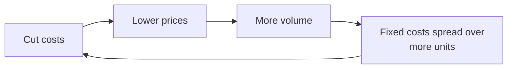

# G5 · Amazon (1997–2015): the compounder that P/E could not see

> In April 2002 Amazon had lost money in every full year since it was founded in 1994. It owed $2.1 billion, had
> **negative** shareholders' equity of $1.44 billion, and its shares were 87% below their 1999 high. Its convertible
> bonds had ended 2001 valued at about half of face. On a P/E screen the company did not exist. At the same time its suppliers
> were financing its growth, it had cut fixed costs to the point where one more year of growth would make it
> profitable, and its founder had written down, five years earlier, that he would manage for cash flow rather than for
> accounting earnings. From that April to the end of 2015 the stock rose about 46×. This case puts you in April 2002,
> with only the documents that were public then, and asks what you were looking at.

| | |
|:--|:--|
| **Period** | May-1997 (IPO) → April-2015 (AWS first reported as a segment), with results through FY2015 |
| **Decision date** | **Friday 19-Apr-2002.** The 2001 shareholder letter had been filed with the SEC the day before, and the 2001 Annual Report was mailed with the proxy. The case uses only documents filed by this date and ignores Q1-2002 results. Close: **$14.53** |
| **Sector** | Online retail / e-commerce, which later added cloud computing |
| **Themes** | Negative working capital; FCF vs GAAP EPS; operating leverage; reinvestment and optionality; balance-sheet survival; dilution and stock-based pay; long-duration value |
| **Modules this case reinforces** | [02.5 Cash-flow statement](../../02-accounting/05-the-cash-flow-statement.md) · [04.2 Margins & cost structure](../../04-financial-analysis/02-margins-and-cost-structure.md) · [04.4 Working capital & cash conversion](../../04-financial-analysis/04-working-capital-and-cash-conversion.md) · [04.5 Leverage & liquidity](../../04-financial-analysis/05-leverage-solvency-liquidity.md) · [04.7 Quality of earnings](../../04-financial-analysis/07-quality-of-earnings.md) · [05.5 Management & capital allocation](../../05-business-analysis/05-management-and-capital-allocation.md) · [06.1 What value is](../../06-valuation/01-what-is-value.md) · [06.5 Multiples](../../06-valuation/05-relative-valuation-and-multiples.md) · [06.6 Reverse DCF](../../06-valuation/06-reverse-dcf-and-expectations.md) · [06.7 Other methods (real options)](../../06-valuation/07-other-valuation-methods.md) · [07.4 High-growth & loss-making](../../07-special-valuation/04-high-growth-and-loss-making.md) · [11.4 Position sizing](../../11-process/04-position-sizing-and-portfolio-construction.md) |
| **Difficulty** | ★★★☆ Intermediate–advanced (needs M02, M04 and M06) |
| **Time** | ≈3.5 hours (about 90 min on sections 1–3 before you read on) |

!!! note "Price basis used in this case"
    Share prices are quoted **as printed in Amazon's 10-Ks from 2000 to 2021**. Those prices already reflect the
    2-for-1 split (June 1998), the 3-for-1 split (January 1999) and the 2-for-1 split (September 1999)
    [[7]](#sources)[[8]](#sources)[[9]](#sources). That makes 12 shares on our basis for each IPO share, so the
    **$18.00 IPO price becomes $1.50**. Amazon split its stock 20-for-1 again in 2022 (approved 25-May-2022
    [[24]](#sources)), so divide every price here by 20 to get today's basis ($18.00 IPO = $0.075). Daily closes come
    from Yahoo Finance [[23]](#sources), multiplied by 20 to match our basis, and were checked against the 10-K
    quarterly high/low tables. All amounts are US$.

---

## 1. The scene (as of 19-Apr-2002)

### 1.1 How we got here: 1997–1999

On **15-May-1997** Amazon sold 3,000,000 shares at **$18.00** ($54M gross), which left 23.86M shares outstanding.
That valued the company at ≈$0.43B [[5]](#sources)[[6]](#sources). In 1997 sales grew 838% to $147.8M, cumulative customer accounts
reached 1.51M, and the company ended the year with $125M of cash and investments [[1]](#sources).

The **1997 letter to shareholders** set out the terms on which Amazon would be run:

- **Market leadership first**, measured by customer and revenue growth, repeat purchases and brand. Leadership was
  expected to bring greater **capital velocity** (how fast each dollar of invested capital turns into sales) and a
  higher **ROIC**.
- Long-term leadership over short-term profit; "bold rather than timid" bets, measured analytically, with losers
  dropped; employees paid mainly in stock options.
- If forced to choose between how the **GAAP** accounts looked (GAAP: the US rulebook for reported profit) and the
  present value of future cash flows, "we'll take the cash flows" [[1]](#sources).

The letter was reprinted in every later annual report [[3]](#sources). Read it as a contract. Section 6 comes back to
it with a say–do test.

In 1998–1999 sales rose to $610M and then to $1.64B [[9]](#sources). Amazon bought companies with its own shares:
$774M of stock was issued for acquisitions and minority stakes in 1999 [[9]](#sources). It also borrowed through
**convertible bonds**, which pay interest and can be swapped for shares at a fixed conversion price. It raised
**$1.25B of 4.75% convertible subordinated notes due 2009** (February 1999, conversion price $78.03) and **€690M of
6.875% PEACS due 2010** (February 2000) [[9]](#sources). In Q4-1999 the stock traded as high as **$113.00**
[[8]](#sources). On the 345M shares outstanding at end-1999 that was ≈$39B, or ≈24× 1999 sales.

### 1.2 The bust: 2000–2001

The price fell to a Q4-2000 low of $14.88 and a Q3-2001 low of **$5.97** [[9]](#sources). That is **−94.7%** from
the $113 high. The Nasdaq Composite fell 77.9% from its March-2000 peak to its October-2002 trough
[[23]](#sources), so Amazon fell further than an index that itself lost more than three-quarters of its value. The
2000 net loss was $1.41B. It included $322M of goodwill and intangibles amortisation, $305M of losses on equity-method stakes in
other dot-coms and $200M of restructuring charges [[9]](#sources). Bezos opened the 2000 letter with "Ouch.", noted
that the shares were down more than 80% in a year, and wrote off the Pets.com and living.com bets, both of which had
shut down [[2]](#sources).

In January 2001 Amazon restructured. It cut ≈1,300 positions, closed its McDonough (Georgia) fulfilment centre and
closed customer-service centres [[9]](#sources). The target for 2001 was a **pro forma operating profit in Q4**
[[2]](#sources). **Pro forma** means management's own profit measure, which excluded stock-based pay, goodwill
amortisation, restructuring and investment gains and losses. Amazon hit the target: Q4-2001 pro forma operating
profit was $59M, and **GAAP net profit was $5.1M ($0.01/share)**, against a $545M loss a year earlier
[[10]](#sources).

### 1.3 The business in April 2002

Amazon reported four segments: US Books/Music/DVD, US Electronics/Tools/Kitchen, Services (third-party sellers,
partnerships such as Toysrus.com and Target) and International (UK, Germany, France, Japan) [[9]](#sources). The 2001
letter [[3]](#sources) reported:

- 25M customer accounts served in 2001 (20M in 2000).
- An American Customer Satisfaction Index score of 84 for the second year running.
- International sales up 74% and above a quarter of total sales.
- **Marketplace** (other sellers listing on Amazon's product pages, launched November 2000) at 15% of US orders in Q4.
- Inventory turns up from 12 to 16.

Pricing had become the strategy. In July 2001 Amazon cut 30% off books priced over $20. In January 2002 it made
shipping free on orders over $99 [[10]](#sources). The letter described the loop:

The stated goal for 2002 was **positive operating cash flow, "possibly" free cash flow**, with capex of at most $75M
[[9]](#sources)[[3]](#sources).

### 1.4 Management and owners

**Jeff Bezos** owned **29.79%** (111.8M shares). In 2001 he took a salary of **$81,840**, with no bonus and no
options [[11]](#sources). Legg Mason's advisory subsidiaries held 17.81%. **65.95M options** were outstanding,
≈17.7% of the 373.2M shares outstanding, at a weighted-average exercise price of $10.65 [[9]](#sources).
The 2001 letter set a target for net dilution from employee options of about 3% a year on average over the next five
years. It also laid out an explicit valuation framework: the value of a share depends on future cash flows and the
future share count, and because fixed costs would stay "largely fixed" Amazon expected "meaningful, sustained" free
cash flow [[3]](#sources).

### 1.5 What the market believed

| Valuation at the 19-Apr-2002 close | Value | Source / arithmetic |
|:--|--:|:--|
| Share price | $14.53 | Yahoo close [[23]](#sources) (≈$0.73 on today's basis) |
| Shares outstanding (10-Jan-2002) | 373.3M | 10-K cover [[9]](#sources) |
| Market capitalisation | ≈$5.42B | 14.53 × 373.3M |
| Debt at book (converts $1,249.8M + PEACS $608.8M + senior discount notes $231.8M + leases & other $26.8M) | ≈$2.12B | Note 7 [[9]](#sources) |
| Cash + marketable securities | $0.997B | [[9]](#sources) |
| **Enterprise value (EV)** | **≈$6.54B** | 5.42 + 2.12 − 1.00 |
| EV / 2001 sales | ≈2.1× | 6.54 / 3.12 |
| P/E (2001 GAAP EPS −$1.56) | n/m | Negative earnings |
| Fair value of 4.75% converts / principal (31-Dec-2001) | 50% | $625M / $1,250M [[9]](#sources) |
| Fair value of PEACS / carrying value (31-Dec-2001) | 51% | $310M / $609M [[9]](#sources) |
| Stockholders' equity | $(1.44)B | [[9]](#sources) |

The bond market was pricing a real chance of default. The 10-K's own risk factors warned that Amazon might "not be
able to meet our debt service obligations" [[9]](#sources). Sales growth had slowed to 13% in 2001, and the original
US books/music/video segment shrank 1% [[9]](#sources). The equity was valued at ≈1.7× sales for a retailer that had
never earned a full-year profit, and whose debt traded like a distressed credit.

---

## 2. The numbers then

All figures below were public on the decision date. 1999–2001 come from the 2001 10-K [[9]](#sources). The 1997–98
income-statement lines are as restated in that 10-K. The 1997–98 cash-flow and balance-sheet lines come from the
1998 10-K [[7]](#sources); the 1998 net loss is the same in both. The 1999 balance sheet comes from the 1999 10-K
[[8]](#sources). Ratios were computed in Python.

**Table 2.1 — Income statement (US$ M)**

| | 1997 | 1998 | 1999 | 2000 | 2001 |
|:--|--:|--:|--:|--:|--:|
| Net sales | 147.8 | 609.8 | 1,639.8 | 2,762.0 | 3,122.4 |
| Growth | 838.6% | 312.6% | 168.9% | 68.4% | 13.1% |
| Gross profit | 28.8 | 133.7 | 290.6 | 655.8 | 798.6 |
| Gross margin | 19.5% | 21.9% | 17.7% | 23.7% | 25.6% |
| GAAP operating loss | (32.6) | (109.1) | (605.8) | (863.9) | (412.3) |
| Operating margin | (22.1%) | (17.9%) | (36.9%) | (31.3%) | (13.2%) |
| Pro forma operating profit/(loss) | n/a | n/a | (352.4) | (317.0) | (45.0) |
| Pro forma operating margin | n/a | n/a | (21.5%) | (11.5%) | (1.4%) |
| Net loss | (31.0) | (124.5) | (720.0) | (1,411.3) | (567.3) |
| EPS, basic & diluted ($) | (0.12) | (0.42) | (2.20) | (4.02) | (1.56) |
| Weighted shares (M) | 260.7 | 296.3 | 326.8 | 350.9 | 364.2 |

**Table 2.2 — Cash flow vs accounting profit (US$ M)**. **Free cash flow (FCF)** = cash from operations (CFO) −
purchases of fixed assets (capex).

| | 1997 | 1998 | 1999 | 2000 | 2001 |
|:--|--:|--:|--:|--:|--:|
| CFO | 0.7 | 31.0 | (90.9) | (130.4) | (119.8) |
| Capex | (7.6) | (28.3) | (287.1) | (134.8) | (50.3) |
| **FCF** | (6.9) | 2.7 | (377.9) | (265.2) | (170.1) |
| FCF margin | (4.7%) | 0.4% | (23.0%) | (9.6%) | (5.4%) |
| Net loss | (31.0) | (124.5) | (720.0) | (1,411.3) | (567.3) |
| FCF − net loss | 24.1 | 127.2 | 342.0 | 1,146.1 | 397.2 |

Over five years the cumulative net loss was **$2.85B**. Cumulative FCF was **−$0.82B**.

**Table 2.3 — Working capital and balance sheet (year-end, US$ M).** Definitions:

- **DIO** (days inventory outstanding) = inventory / cost of sales × 365.
- **DPO** (days payable outstanding) = accounts payable / cost of sales × 365.
- **CCC** (cash conversion cycle) = DIO + DSO − DPO. Customers paid by card, and receivables were not reported
  separately, so we treat **DSO** (days sales outstanding) as ≈0.

| | 1997 | 1998 | 1999 | 2000 | 2001 |
|:--|--:|--:|--:|--:|--:|
| Inventory | 9.0 | 29.5 | 220.6 | 174.6 | 143.7 |
| Accounts payable | 33.0 | 113.3 | 463.0 | 485.4 | 444.7 |
| AP − inventory | 24.1 | 83.8 | 242.4 | 310.8 | 301.0 |
| … as % of sales | 16.3% | 13.7% | 14.8% | 11.3% | 9.6% |
| DIO (days) | 27.5 | 22.6 | 59.7 | 30.3 | 22.6 |
| DPO (days) | 101.3 | 86.8 | 125.3 | 84.1 | 69.9 |
| **CCC (days)** | **(73.8)** | **(64.2)** | **(65.6)** | **(53.9)** | **(47.3)** |
| Cash + marketable securities | 125.4 | 373.4 | 706.2 | 1,100.5 | 996.6 |
| Long-term debt | 76.7 | 348.1 | 1,466.3 | 2,127.5 | 2,156.1 |
| Stockholders' equity | 28.6 | 138.7 | 266.3 | (967.3) | (1,440.0) |

The 10-K explained the mechanism directly: vendor payment terms "extend beyond the amount of time necessary to collect
proceeds" [[9]](#sources).

**Other ratios the course teaches (2001):**

- **Invested capital was negative.** Operating working capital = inventory 143.7 + prepaid/other 67.6 − payables
  444.7 − accrued 305.1 − unearned revenue 88.0 = **−$626M (−20% of sales)**. Add fixed assets (271.8) and goodwill
  and intangibles (79.7) and operating invested capital comes to **≈−$275M**. ROIC is undefined here. ROE is
  meaningless because equity is negative. Accrued expenses include restructuring provisions, so treat the −20% as an
  upper bound on the float.
- **Fulfilment cost / sales** fell from 15.0% (2000) to 12.0% (2001). Gross margin rose 7.9 points from 1999 to
  2001.
- **Stock options.** Amazon then used the intrinsic-value method, which records almost no expense for at-the-money
  options. Its footnote disclosed that under fair-value accounting (SFAS 123) the 2001 net loss would have been
  **$963M, not $567M**. That is ≈$396M of option cost, 12.7% of sales, left out of both GAAP profit and FCF. The
  Black-Scholes volatility assumption behind that figure was **98%** [[9]](#sources).
- **Dilution.** Weighted shares rose 39.7% between 1997 and 2001, or 8.7% a year.
- **Coverage.** 2001 interest expense was $139M against a pro forma operating loss of $45M, so coverage was negative.

!!! tip "Trader's lens — negative working capital is carry paid by your counterparties"
    Amazon collected cash from customers within days and paid suppliers about 70 days later. That works like
    collecting option premium up front and settling the liability later: the business earns **carry** on money that
    is not its own. The catch is that the float is **short a growth put**. When sales stall, the payables balance
    shrinks and cash flows out. In 2001, with growth down to 13%, accounts payable fell by $44M, a use of cash
    [[9]](#sources). A negative-CCC business is safest when it is growing.

---

## 3. You are the analyst

Answer these using only sections 1–2, before you read section 4.

1. **(Numerical) Working-capital float.** Using Table 2.3, state the CCC for 1999–2001 and explain the sign. At
   2001 ratios, roughly how much cash does each extra $1B of sales release? What happens to the float if sales fall?
2. **(Numerical) FCF vs GAAP.** Reconcile 2001 FCF (−$170M) to the net loss (−$567M). Which of the two better
   describes the economics of the continuing business, and what does *neither* number include?
3. **(Numerical) Operating leverage.** Treat fulfilment as variable and marketing, technology & content and G&A as
   fixed. Compute the 2001 **contribution margin** (gross profit minus fulfilment, as % of sales), the fixed-cost
   base and the pro forma **breakeven sales**. Do the same for 2000. What did 2001 change?
4. **(Numerical, credit) Survival.** Set cash and securities against debt maturities and annual interest. The 4.75%
   converts were valued at 50% of face at 31-Dec-2001, with maturity on 1-Feb-2009. Compute their approximate yield
   to maturity and explain what it says about the market's view of default.
5. **(Numerical) Reverse DCF.** EV is ≈$6.54B. Assume FCF margin ramps linearly to a steady-state *m* by year 5,
   terminal growth is 4% after year 10, and the discount rate is 12% (test 10–14%). What 10-year sales CAGR does the
   price imply for *m* = 4%, 6% and 8%? Is that plausible?
6. **(Conceptual) Why P/E fails here.** One broker annualises Q4-2001 pro forma EPS ($0.09 × 4) and says "40× — too
   expensive". Another says "no earnings — uninvestable". What is wrong with each, and what should replace P/E?
7. **(Red-flag test)** List at least four red flags and four green flags you can find in the 10-K, the proxy and the
   2001 letter.
8. **(Numerical, judgement) Scenarios and sizing.** Build a bear/base/bull scenario set and find the probability of
   the bull case that the $14.53 price implies. How large a position would you take, and why?
9. **(Monitoring)** Name the six to eight KPIs you would track each quarter from 2002 to 2004 to tell whether the
   thesis is working.

---

## 4. What happened

**Table 4.1 — Timeline**

| Date | Event | Source |
|:--|:--|:--|
| FY2002 | First positive FCF: CFO $174M − capex $39M = **$135M**. First full-year GAAP operating profit ($64M). Net loss $149M after $143M of interest. Pro forma operating income $180M (4.6% of sales) | [[12]](#sources) |
| FY2003 | First full-year GAAP net profit, $35M. FCF $347M | [[14]](#sources) |
| FY2004 | Net income $588M, FCF $477M. The 2004 letter says more than $600M of convertible debt was repaid over the previous three years | [[4]](#sources)[[14]](#sources) |
| Apr-2005 | 2004 letter names **free cash flow per share** the "ultimate financial measure" and explains the negative operating cycle | [[4]](#sources) |
| 2005 | Amazon Prime introduced (free two-day shipping membership) | [[13]](#sources) |
| 14-Mar-2006 | Amazon S3 (cloud storage) launched | [[20]](#sources) |
| 25-Aug-2006 | Amazon EC2 (cloud compute) opens in limited beta | [[21]](#sources) |
| Q3-2006 | Stock falls to $26.07, **−56%** from its Q4-2003 high of $59.91. Operating income fell in 2006 ($389M vs $432M) despite 26% sales growth | [[13]](#sources)[[14]](#sources) |
| Q4-2008 | Stock falls to $35.03, **−65%** from its Q4-2007 high of $100.82 | [[15]](#sources) |
| FY2009 | FCF $2.92B, 11.9% of sales | [[16]](#sources) |
| FY2014 | Net loss $241M. Capex $4.89B. FCF $1.95B, but **FCF less lease principal only $529M** | [[17]](#sources)[[19]](#sources) |
| 23-Apr-2015 | **AWS reported as a segment for the first time.** Q1 sales $1,566M (+49%), segment operating income $265M (16.9% margin). Bezos called it "a $5 billion business and still growing fast" | [[18]](#sources) |
| 24-Apr-2015 | Stock rises **14.1%** ($389.99 → $445.10), ≈$25.7B of market value on 466M shares | [[18]](#sources)[[23]](#sources) |
| FY2015 | Sales $107.0B. Net income $596M. CFO $11.9B, FCF $7.3B. AWS: $7.88B sales, $1.86B segment operating income (41% of segment operating income). SBC expense $2.1B | [[19]](#sources) |

**Table 4.2 — Fundamentals after the decision date (US$ M)**

| | 2002 | 2003 | 2004 | 2006 | 2009 | 2011 | 2014 | 2015 |
|:--|--:|--:|--:|--:|--:|--:|--:|--:|
| Net sales | 3,933 | 5,264 | 6,921 | 10,711 | 24,509 | 48,077 | 88,988 | 107,006 |
| Operating income | 64 | 270 | 440 | 389 | 1,129 | 862 | 178 | 2,233 |
| Net income | (149) | 35 | 588 | 190 | 902 | 631 | (241) | 596 |
| CFO | 174 | 393 | 566 | 702 | 3,293 | 3,903 | 6,842 | 11,920 |
| Capex | (39) | (46) | (89) | (216) | (373) | (1,811) | (4,893) | (4,589) |
| **FCF** | **135** | **347** | **477** | **486** | **2,920** | **2,092** | **1,949** | **7,331** |
| FCF margin | 3.4% | 6.6% | 6.9% | 4.5% | 11.9% | 4.4% | 2.2% | 6.9% |

Sources: 2006 10-K [[14]](#sources) (2002–2004, 2006), 2011 10-K [[16]](#sources) (2009, 2011), 2014 and 2015 10-Ks
[[17]](#sources)[[19]](#sources). Sales compounded at **28.9% a year from 2002 to 2015**. Operating margin never went
above 6.4% in these years. The 2015 CCC (now including receivables) was still **−30 days**: DIO 52, DSO 22,
DPO 104 [[19]](#sources).

**Table 4.3 — Stock outcome from the decision date (closing prices, our basis)**

| Horizon | Date | AMZN | Return | S&P 500 (price only) |
|:--|:--|--:|--:|--:|
| Start | 19-Apr-2002 | $14.53 | — | — |
| 1 year | 21-Apr-2003 | $25.25 | +74% | −21% |
| 3 years | 19-Apr-2005 | $32.78 | +126% | +2% |
| 5 years | 19-Apr-2007 | $44.64 | +207% | +31% |
| 10 years | 19-Apr-2012 | $191.10 | +1,215% | +22% |
| ≈13.7 years | 31-Dec-2015 | $675.89 | **×46.5 (CAGR ≈32.3%)** | +82% (CAGR ≈4.5%) |

Source: Yahoo Finance [[23]](#sources). The path included drawdowns of −56% (2003–06) and −65% (2007–08). At the end
of 2015 the stock traded at **≈541× GAAP EPS** ($675.89 / $1.25) and ≈43× FCF [[19]](#sources). By the P/E measure
it looked "expensive" the whole way up.

---

## 5. Signals: knowable then vs hindsight

| Knowable on 19-Apr-2002 (from public documents) | Knowable only with hindsight |
|:--|:--|
| CCC of about −47 days and operating working capital of −20% of sales: growth *released* cash [[9]](#sources) | AWS (2006), Prime (2005) and the scale of Marketplace did not exist or were tiny. They were options the price could not reasonably value |
| Breakeven fell from ≈$6.4B to ≈$3.45B of sales in one year. Q4-2001 was already profitable at 5.3% pro forma [[9]](#sources)[[10]](#sources) | The *size* of the outcome: 2011 sales were $48B (31.5% CAGR from 2001), well above any sensible 2002 bull case |
| Debt maturities fell in 2008–2010, with ≈$1B of cash on hand. The near-term risk was losses, not refinancing [[9]](#sources) | That management would keep dilution to ≈1.6%/yr (basic shares 378M in 2002 → 467M in 2015) [[12]](#sources)[[19]](#sources) |
| Founder owned 29.8%, took an $81,840 salary and published an FCF-per-share framework [[11]](#sources)[[3]](#sources) | Survival through 2008, and that competitors would fail to copy the fulfilment network |
| **Against:** converts priced at 50% of face; negative equity; $396M fair-value option cost; 8.7%/yr dilution in 1997–2001; failed dot-com stakes; 13% growth [[9]](#sources) | That holding would have required sitting through −56% and −65% drawdowns *after* the thesis was clearly working |

**The strongest bull case available at the time**, built entirely from the 10-K and the letters: suppliers funded
growth through negative working capital; breakeven had halved, so modest growth would turn into profit; the low margin
was a pricing choice (the price-cut loop), not a structural limit; and the debt was cheap 4.75% paper maturing years
out. The bull case did **not** need AWS.

**The strongest bear case** was just as well documented: book retail is thin-margin and the core US segment was
shrinking; the float unwinds in a downturn, as 2001's fall in payables showed; options were a large real cost missing
from both GAAP and FCF; the credit market priced a high default probability; and Pets.com, living.com and the 1999
stock-funded acquisitions showed a poor capital-allocation record.

!!! warning "Guarding against hindsight bias"
    You know Amazon won, so every bull point looks obvious. Keep three things in mind:

    - **Survival was not a given.** Amazon's own 2000 letter records that two e-commerce companies it had backed,
      Pets.com and living.com, shut down in 2000 once financing for internet companies dried up [[2]](#sources).
    - **The market's view was not absurd.** The scenario maths in answer 8 shows the price implied only a ≈31% chance
      of a fairly modest bull case.
    - **You did not need a better forecast.** The edge was not predicting AWS. It was spotting that the *distribution*
      was skewed (roughly −93% in the bear case, +136% in the bull case) and sizing for that.

---

## 6. Lessons

1. **P/E fails when earnings are the wrong measure of value creation.** Amazon's GAAP losses mixed non-cash
   amortisation of past deals, restructuring and expensed growth spending (marketing, technology). Its cash economics
   were better, apart from stock options. Use FCF, owner earnings and unit economics, and check them against each
   other. → [02.5](../../02-accounting/05-the-cash-flow-statement.md), [04.7](../../04-financial-analysis/07-quality-of-earnings.md), [06.5](../../06-valuation/05-relative-valuation-and-multiples.md)
2. **Negative working capital is a funding source and a moat indicator, but it depends on growth.** Measure the
   float as % of sales and ask what happens when growth stops. → [04.4](../../04-financial-analysis/04-working-capital-and-cash-conversion.md), [05.3](../../05-business-analysis/03-moats-and-competitive-advantage.md)
3. **Do the breakeven arithmetic.** In a fixed-cost business, contribution margin and the fixed-cost base tell you
   more than the latest margin does. Amazon's breakeven fell by almost half in one year. → [04.2](../../04-financial-analysis/02-margins-and-cost-structure.md), [05.1](../../05-business-analysis/01-business-models-and-unit-economics.md)
4. **Value a reinvesting compounder on steady-state economics, then reverse-engineer the price.** Model growth,
   steady-state FCF margin and reinvestment. Ask what the price already assumes (≈19% CAGR at a 6% margin), not
   whether today's multiple looks high. → [06.1](../../06-valuation/01-what-is-value.md), [06.6](../../06-valuation/06-reverse-dcf-and-expectations.md), [07.4](../../07-special-valuation/04-high-growth-and-loss-making.md)
5. **Survival comes first.** Read the debt schedule and the bond price before the growth story. The equity was a call
   option whose value depended on getting to 2008–2010 without a restructuring. → [04.5](../../04-financial-analysis/05-leverage-solvency-liquidity.md), [06.7](../../06-valuation/07-other-valuation-methods.md), [11.7](../../11-process/07-fundamentals-meets-derivatives.md)
6. **Stock-based pay is a real cost that FCF leaves out.** It was $396M of fair-value cost in 2001 and $2.1B of
   expense in 2015 (≈29% of FCF). Deduct it, or count the dilution. Also watch changes in the definition: Amazon
   itself later reported FCF net of lease principal. → [02.8](../../02-accounting/08-deeper-cuts-group-accounts-and-other.md), [09.4](../../09-forensics/04-cash-flow-games.md)
7. **Read the letters and score say–do.** The 1997 principles, the 2001 targets (positive 2002 CFO, ≈3% dilution)
   and later delivery can all be checked. That record is data about management quality. → [05.5](../../05-business-analysis/05-management-and-capital-allocation.md)
8. **Optionality is real but cannot be modelled, so buy at a price that does not require it and size for the
   skew.** → [06.8](../../06-valuation/08-margin-of-safety-and-expected-value.md), [11.4](../../11-process/04-position-sizing-and-portfolio-construction.md), [11.6](../../11-process/06-behavioural-finance-and-decision-journals.md)

!!! info "India notes"
    - **Where the pattern shows up in India.** Look for businesses where customers pay upfront or in cash and
      suppliers extend credit: parts of FMCG, QSR, platforms, and education with advance fees.
    - **Checking the CCC.** Screener.in's *Ratios* section lists Debtor Days, Inventory Days, Days Payable and Cash
      Conversion Cycle for each company (checked September 2026 [[22]](#sources)). As always, verify against the
      annual report.
    - **Option cost under Ind AS.** Ind AS 102 expenses equity-settled employee share options at grant-date fair
      value, so the option cost that Amazon's 2001 P&L left out is inside an Indian company's P&L. It is still outside
      FCF (it is added back in CFO as a non-cash charge), so deduct it yourself.
    - **Leases.** Under Ind AS 116 the principal portion of lease payments sits in financing cash flow, so "FCF" can
      be flattered in the same way Amazon's was in 2014–15. See [04.4](../../04-financial-analysis/04-working-capital-and-cash-conversion.md)
      and [I13 DMart](../india/13-dmart-avenue-supermarts.md).

---

## 7. Model answers

<b>Q1 — Working-capital float</b>

CCC ≈ DIO − DPO (DSO ≈ 0 because customers paid by card):

| | 1999 | 2000 | 2001 |
|:--|--:|--:|--:|
| DIO (days) | 59.7 | 30.3 | 22.6 |
| DPO (days) | 125.3 | 84.1 | 69.9 |
| CCC (days) | (65.6) | (53.9) | (47.3) |

A negative CCC means Amazon sells the goods and collects the cash before it pays for them. On 2001 ratios,
payables minus inventory = 301.0 / 3,122.4 = **9.6% of sales**. Each extra **$1B of sales therefore releases ≈$96M**,
as long as supplier terms and inventory turns hold. The broader operating working capital (−20% of sales) suggests
more, but it includes restructuring accruals.

The CCC became *less* negative between 1999 and 2001 because DPO fell from 125 to 70 days. The 1999 year-end
figures were probably swollen by stocking up for the electronics, tools and kitchen categories launched in the second
half of 1999: inventory rose 7.5× that year [[8]](#sources)[[9]](#sources). It was still strongly negative.

If sales fall, the mechanism runs in reverse: payables shrink faster than inventory and cash flows out. 2001's
**−$44M** change in payables shows this [[9]](#sources).

<b>Q2 — FCF vs GAAP</b>

FCF − net loss = non-cash charges + working-capital change − capex
= 412.0 + 35.5 − 50.3 = **$397.2M**, which reconciles −567.3 to −170.1.

The non-cash charges were:

| Non-cash charge | US$ M |
|:--|--:|
| Goodwill and intangibles amortisation | 181.0 |
| Depreciation | 84.7 |
| Non-cash restructuring | 73.3 |
| Equity-method losses | 30.3 |
| Non-cash interest | 26.6 |
| Other | 16.0 |
| **Total** | **412.0** |

FCF is closer to the continuing economics. Most of the gap is amortisation of stock-funded 1999 acquisitions and
one-off restructuring. That value was destroyed in the past; it is not a recurring cost.

Neither number includes the **fair-value cost of employee options**. The SFAS 123 footnote puts it at ≈$396M,
although that figure also includes amortisation of expensive 1999–2000 grants. A fair "owner FCF" for 2001 was
therefore well below −$170M. Also note that 2001 FCF was *helped* by capex ($50M) running below depreciation ($85M)
after the 1999 build-out. That cannot last forever.

<b>Q3 — Operating leverage and breakeven</b>

| | 2000 | 2001 |
|:--|--:|--:|
| Gross profit − fulfilment (US$ M) | 241.3 | 424.3 |
| Contribution margin | 8.7% | 13.6% |
| Fixed costs: marketing + tech & content + G&A (US$ M) | 558.3 | 469.3 |
| Pro forma operating profit (US$ M) | (317.0) | (45.0) |
| **Breakeven sales = fixed / contribution margin** | **≈$6.39B** | **≈$3.45B** |

The model reproduces the reported pro forma figures exactly [[12]](#sources).

In one year Amazon raised its contribution margin by ≈5 points, mostly because fulfilment fell from 15.0% to 12.0%
of sales. It also cut fixed costs by $89M. Breakeven nearly halved.

At 2001 structure, each extra $1B of sales adds ≈$136M of pro forma operating profit. What actually happened in 2002:
contribution rose to 15.3%, fixed costs fell to $420M, and pro forma operating income was $180M, far above the ≈$65M
a static model would have forecast [[12]](#sources). Caveat: marketing and technology are not truly fixed, and price
cuts spend part of the contribution.

<b>Q4 — Survival and the credit market</b>

- **Liquidity.** $997M of cash and securities.
- **Maturities.** Scheduled principal was only $4.8M (2002), $4.5M (2003) and $2.0M (2004). Almost all of the ≈$2.12B
  fell due in 2008–2010 [[9]](#sources).
- **Interest.** $109.5M in 2002, rising to $135.9M a year from 2004, when the senior discount notes began paying
  cash from November 2003. Add ≈$61M of operating-lease payments.
- **Operating cash.** Guidance was for positive CFO, which under US GAAP is already *after* interest paid.

So the near-term risk was continued losses, not a refinancing wall. The real test was 2008–2010: repay or
refinance ≈$2.1B, either from accumulated FCF (≈$300M a year for seven years) or from a share price high enough to
make refinancing easy.

**Yield on the bond.** A 4.75% semi-annual bond at 50% of face (plus accrued interest), maturing 1-Feb-2009, yields
**≈17.2%**. Assume a 4.5% risk-free rate (Amazon's own 2001 option assumptions used 4.1% for ≈3-year terms
[[9]](#sources)) and 20–40% recovery. A constant-hazard model then implies a **risk-neutral cumulative default
probability of ≈70–90% by 2009**. That figure overstates the true probability because it includes risk and
illiquidity premia. The *direction* is the lesson: the credit market treated Amazon as a distressed credit.

<b>Q5 — Reverse DCF</b>

Model: $V=\sum_{t=1}^{10}\frac{S_0(1+g)^t\,m\min(t/5,1)}{(1+r)^t}+\frac{FCF_{10}(1+g_T)}{(r-g_T)(1+r)^{10}}$,
with $S_0$ = $3.12B, $g_T$ = 4%, solved for $g$ such that $V$ = $6.54B.

In words: value equals ten years of FCF, where FCF is sales growing at *g* times a margin that ramps to *m* by year 5,
plus a terminal value growing at 4% a year, all discounted at *r*.

| Discount rate *r* | *m* = 4% | *m* = 6% | *m* = 8% |
|:--|--:|--:|--:|
| 10% | 19.2% | 14.0% | 10.4% |
| 12% | 24.2% | 18.7% | 14.9% |
| 14% | 28.5% | 22.8% | 18.8% |

At 12% and a 6% FCF margin, the price implies **≈19% sales growth for ten years**, which is ≈$17B of sales by 2011.
Terminal value is ≈66% of EV.

**Sanity checks.**

- **Paying for growth.** With *g* = 0 the same business is worth only ≈$1.5B, so ≈$5B of the EV is a bet on growth.
- **Is the growth plausible?** Q4-2001 unit growth was 23%, international grew 74%, Marketplace was scaling, and
  Bezos's 2000 letter suggested about 15% of retail might move online [[2]](#sources)[[3]](#sources). Against that,
  2001 sales grew 13%.
- **Is the margin plausible?** A 6–8% FCF margin rests on negative working capital plus low capex needs (2001 capex
  was 1.6% of sales, and the 2002 plan was at most $75M [[3]](#sources)[[9]](#sources)).

**Verdict at the time:** demanding but reachable, not heroic. The outcome, a 31.5% sales CAGR to 2011 at a 3–12% FCF
margin, beat even the 14%-discount column, but you could not have known that.

<b>Q6 — Why P/E fails</b>

**The "40×" broker annualises the wrong quarter.** Q4 held 35.7% of 2001 sales (the holiday season), and Q1–Q3-2001
pro forma operating margins were −7%, −4% and −4%. Full-year 2001 pro forma EPS was **−$0.43** [[12]](#sources).

**The "uninvestable" broker confuses accounting losses with value destruction.** P/E breaks down for four reasons:

- Near-zero or negative earnings make the ratio explode or flip sign.
- Growth spending (marketing, technology) is expensed immediately, while the benefits arrive later.
- Non-cash amortisation of past deals depresses earnings without reflecting current economics.
- P/E ignores both the working-capital float and the balance-sheet risk.

**What should replace it:**

1. EV/Sales read *together with* a defensible steady-state margin.
2. A reverse DCF (Q5).
3. FCF yield on normalised FCF, after deducting option cost.
4. Unit economics (contribution margin, fixed-cost base).

→ [06.5](../../06-valuation/05-relative-valuation-and-multiples.md), [07.4](../../07-special-valuation/04-high-growth-and-loss-making.md).

<b>Q7 — Red and green flags</b>

**Red flags:** (1) stockholders' deficit of $1.44B, debt about 2× cash; (2) converts at 50% of face; (3) headline
"pro forma" profit excluded stock pay, amortisation, restructuring and investment losses; (4) ≈$396M fair-value option
cost not expensed, overhang 17.7% of shares; (5) weighted shares +8.7%/yr in 1997–2001; (6) some 2000
commercial-agreement revenue was paid in partners' equity ($106.8M of securities booked to unearned revenue
[[9]](#sources)); (7) $305M of 2000 equity-method losses and the Pets.com/living.com failures; (8) growth down to 13%,
core US segment −1%.

**Green flags:** (1) CCC ≈ −47 days; (2) inventory turns 12 → 16; (3) fulfilment cost down 3 points of sales;
(4) breakeven halved; (5) Q4 profitable on pro forma and GAAP bases; (6) no material maturities before 2008;
(7) founder owns 29.8% on an $81,840 salary; (8) a published FCF-per-share goal and dilution target; (9) ACSI 84 and
25M customer accounts; (10) capital-light Marketplace at 15% of US orders.

<b>Q8 — Scenarios, implied probability and sizing</b>

Use the Q5 model at a 12% discount rate. Equity value = EV − net debt ($1.12B), divided by 373.3M shares, with no
extra dilution.

| Scenario | Assumption | Equity / share |
|:--|:--|--:|
| Bear | Refinancing crisis or dilutive restructuring (judgement) | ≈$1 |
| Base | 15% growth, 5% FCF margin | ≈$8.05 |
| Bull | 25% growth, 8% FCF margin (2011 sales ≈$29B) | ≈$34.27 |

Fix the bear probability at 25% and solve 0.25×1 + (0.75 − p)×8.05 + p×34.27 = 14.53. That gives **p ≈ 31%** for the
bull case. With weights of 30/50/20 the expected value is ≈$11.2, below the price.

The payoff is strongly **skewed**: about −93% in the bear case against +136% in the bull case. Estimation error is
large and there is a real chance of near-total loss. A sensible answer is a **small starter position** (for example
1–3% of the portfolio), with a plan to add as the evidence arrives: positive 2002 CFO, sales reaccelerating, share
count held. Full Kelly on these inputs would be reckless, because the probabilities are themselves guesses. → [11.4](../../11-process/04-position-sizing-and-portfolio-construction.md)

In the event, 2011 sales ($48B) beat even the bull case. A small but held position would still have been
transformative. That is the argument for sizing by the skew rather than by conviction.

<b>Q9 — KPIs to monitor (2002–2004)</b>

1. Trailing-twelve-month CFO and FCF against the 2002 target.
2. Sales growth and unit growth, split into US and International.
3. Gross margin net of price cuts and free shipping.
4. Fulfilment cost as % of sales.
5. Growth in fixed costs (marketing, technology & content, G&A) against sales.
6. Inventory turns and DPO, which together give the CCC.
7. Marketplace share of units.
8. Share count plus options against the ≈3%/yr dilution target, and any debt repurchases.

Thesis-breakers: CFO turning negative, fixed costs growing faster than contribution, or a collapse in DPO.

!!! tip "Trader's lens — reading implied probabilities off the capital structure"
    The bond price, the equity price and Amazon's own 98% volatility assumption all say the same thing: the equity was
    a long-dated call on the enterprise with a knock-out barrier at insolvency. Solving for p(bull) ≈ 31% is backing
    risk-neutral probabilities out of an option surface. The edge is not a better point forecast but a view that the
    *realised* distribution is fatter on the right than the *implied* one. In April 2015 the AWS disclosure moved
    that distribution by ≈$26B in one day.

---

## 8. Discussion questions & extensions

1. **Monitoring today.** Pick a listed Indian business with a negative cash conversion cycle. What would you monitor
   each quarter to tell a *growth-funded float* from a *stretched-supplier* float (e.g., supplier-finance
   arrangements)? See [09.4](../../09-forensics/04-cash-flow-games.md).
2. **The 2015 checkpoint.** On 23-Apr-2015 AWS had ≈$5.2B of trailing sales and ≈$0.68B of trailing segment
   operating income, using the 2014 figures as later reported in the 2015 10-K. The whole company traded at ≈57×
   trailing FCF [[18]](#sources)[[19]](#sources)[[23]](#sources). Build a sum-of-the-parts. How much
   of the $26B jump was "new information" and how much was a change in the multiple applied to known information?
3. **Which FCF?** In 2014 FCF was $1.95B but FCF less lease principal was $0.53B, and SBC was $1.5B
   [[19]](#sources). Which measure would you capitalise, and why? Rework the Q5 table using "owner FCF" = FCF −
   SBC − lease principal.
4. **Would you have held?** Write a decision-journal entry dated Q3-2006, with the stock down 56% while operating
   income fell. What evidence would have justified holding and what would have justified selling? See
   [11.6](../../11-process/06-behavioural-finance-and-decision-journals.md).
5. **Compare with [G3 Cisco 2000](03-cisco-2000.md).** Great business at a bubble price vs a doubted business at a
   distressed price. What single metric would have told the two apart on their respective dates?

---

## Sources

All accessed 21-Sep-2026. SEC documents were read directly on EDGAR; Amazon letters on Amazon's investor-relations CDN.

1. Amazon.com, *1997 Letter to Shareholders* (1997 Annual Report). <https://s2.q4cdn.com/299287126/files/doc_financials/annual/Shareholderletter97.pdf>
2. Amazon.com, *2000 Letter to Shareholders*. <https://s2.q4cdn.com/299287126/files/doc_financials/annual/00ar_letter.pdf>
3. Amazon.com, *2001 Letter to Shareholders* (filed as Ex. 99.1 to Form 8-K, 18-Apr-2002). <https://s2.q4cdn.com/299287126/files/doc_financials/annual/2001_shareholderLetter.pdf>; 8-K index: <https://www.sec.gov/Archives/edgar/data/1018724/000103221002000654/0001032210-02-000654-index.htm>
4. Amazon.com, *2004 Letter to Shareholders* (April 2005). <https://s2.q4cdn.com/299287126/files/doc_financials/annual/2004_shareholderLetter.pdf>
5. Amazon.com, IPO prospectus (Form 424B1), 15-May-1997. <https://www.sec.gov/Archives/edgar/data/1018724/0000891020-97-000868.txt>
6. Amazon.com, Form 10-K for 1997 (filed 30-Mar-1998). <https://www.sec.gov/Archives/edgar/data/1018724/0000891020-98-000448.txt>
7. Amazon.com, Form 10-K for 1998 (filed 5-Mar-1999). <https://www.sec.gov/Archives/edgar/data/1018724/0000891020-99-000375.txt>
8. Amazon.com, Form 10-K for 1999 (filed 29-Mar-2000). <https://www.sec.gov/Archives/edgar/data/1018724/0000891020-00-000622.txt>
9. Amazon.com, Form 10-K405 for 2001 (filed 24-Jan-2002): financial statements, liquidity and commitments, Note 7 (debt and fair values), SFAS 123 note, risk factors. <https://www.sec.gov/Archives/edgar/data/1018724/000103221002000059/d10k405.htm>
10. Amazon.com, Q4-2001 results press release, 22-Jan-2002 (Ex. 99.1 to the 2001 10-K). <https://www.sec.gov/Archives/edgar/data/1018724/000103221002000059/dex991.htm>
11. Amazon.com, Definitive Proxy Statement (DEF 14A), filed 18-Apr-2002. <https://www.sec.gov/Archives/edgar/data/1018724/000103221002000653/ddef14a.htm>
12. Amazon.com, Form 10-K for 2002 (filed 19-Feb-2003). <https://www.sec.gov/Archives/edgar/data/1018724/000095014903000355/v87419ore10vk.htm>
13. Amazon.com, Form 10-K for 2004 (filed 11-Mar-2005). <https://www.sec.gov/Archives/edgar/data/1018724/000119312505047032/d10k.htm>
14. Amazon.com, Form 10-K for 2006 (filed 16-Feb-2007). <https://www.sec.gov/Archives/edgar/data/1018724/000119312507034081/d10k.htm>
15. Amazon.com, Form 10-K for 2008 (filed 30-Jan-2009). <https://www.sec.gov/Archives/edgar/data/1018724/000119312509014406/d10k.htm>
16. Amazon.com, Form 10-K for 2011 (filed 1-Feb-2012). <https://www.sec.gov/Archives/edgar/data/1018724/000119312512032846/d269317d10k.htm>
17. Amazon.com, Form 10-K for 2014 (filed 30-Jan-2015). <https://www.sec.gov/Archives/edgar/data/1018724/000101872415000006/amzn-20141231x10k.htm>
18. Amazon.com, Q1-2015 results press release, 23-Apr-2015 (Ex. 99.1 to Form 8-K). <https://www.sec.gov/Archives/edgar/data/1018724/000101872415000036/amzn-20150331xex991.htm>
19. Amazon.com, Form 10-K for 2015 (filed 29-Jan-2016). <https://www.sec.gov/Archives/edgar/data/1018724/000101872416000172/amzn-20151231x10k.htm>
20. Amazon.com press release, "Amazon Web Services Launches Amazon S3", 14-Mar-2006. <https://press.aboutamazon.com/news-releases/news-release-details/amazon-web-services-launches-amazon-s3-simple-storage-service>
21. J. Barr, "Amazon EC2 Beta", AWS News Blog, 25-Aug-2006. <https://aws.amazon.com/blogs/aws/amazon_ec2_beta/>
22. Screener.in company page (ratio labels only, checked Sep-2026). <https://www.screener.in/company/HINDUNILVR/consolidated/>
23. Yahoo Finance historical daily prices for AMZN, ^GSPC (S&P 500) and ^IXIC (Nasdaq Composite), retrieved with the `yfinance` Python package on 21-Sep-2026. AMZN closes multiplied by 20 to undo the 2022 split. S&P 500 figures are price-only, excluding dividends.
24. Amazon.com, Form 8-K filed 27-May-2022 (shareholder approval on 25-May-2022 of the 20-for-1 split; record date 27-May-2022). <https://www.sec.gov/Archives/edgar/data/1018724/000110465922065872/0001104659-22-065872.txt>

---
[← Previous: G4 Enron (2001)](04-enron-2001.md) · [Module index](../index.md) · [Next: G6 Lehman Brothers (2008) →](06-lehman-2008.md)
