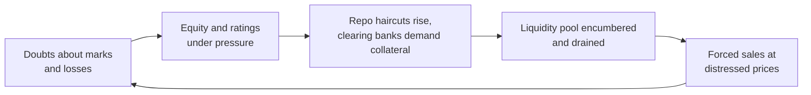

# G6 · Lehman Brothers (2008): thirty-to-one, funded overnight

> In January 2008 Lehman Brothers reported its fourth consecutive year of record earnings, a 20.8% return on equity and a
> share price near $60. Eight months later it filed the largest bankruptcy petition in US history. Nothing about the
> collapse required secret information to *suspect*: the leverage, the Level 3 assets, the commercial-property book and
> the dependence on overnight repo funding were all printed in the 10-K. What was hidden — and what the court-appointed
> examiner later dug out — was how much worse the true picture was. This case puts you at the desk on 16 June 2008, the
> day Lehman reported its first quarterly loss as a public company, and asks the question every analyst of a levered
> balance sheet must answer: *is this cheap, or is the book value an opinion?*

| | |
|:--|:--|
| **Period** | FY2003 – 15-Sep-2008 (aftermath to 2012–2025) |
| **Decision date** | **16-Jun-2008** — Q2 FY2008 results day, four days after Lehman closed a $6bn equity raise |
| **Sector** | US investment bank / securities broker-dealer |
| **Themes** | Gross vs net vs tangible leverage · Level 3 fair values · commercial real estate & Archstone · repo funding and liquidity pools · KPI definition changes · Repo 105 window-dressing · liquidity vs solvency |
| **Modules this case reinforces** | [04.5 Leverage, solvency & liquidity](../../04-financial-analysis/05-leverage-solvency-liquidity.md) · [04.3 Returns on capital](../../04-financial-analysis/03-returns-on-capital.md) · [04.7 Quality of earnings](../../04-financial-analysis/07-quality-of-earnings.md) · [07.1 Banks & NBFCs](../../07-special-valuation/01-banks-and-nbfcs.md) · [06.6 Reverse DCF & expectations](../../06-valuation/06-reverse-dcf-and-expectations.md) · [09.1 Why numbers lie](../../09-forensics/01-why-and-how-numbers-lie.md) · [09.4 Cash-flow games](../../09-forensics/04-cash-flow-games.md) · [05.5 Capital allocation](../../05-business-analysis/05-management-and-capital-allocation.md) · [03.5 US filings](../../03-reading-filings/05-other-documents.md) |
| **Difficulty** | Advanced — do it after M04, lesson 07.1 and M09 |
| **Time** | ~3.5 hours (about 90 minutes on Section 3 before you read on) |

!!! note "Conventions in this case"
    Lehman's fiscal year ended 30 November, so **Q2 FY2008 = March–May 2008**. All dollar figures are US$; "$bn" =
    billion. Per-share figures are as reported, i.e. already adjusted for the 2-for-1 stock split of 28-Apr-2006
    ([10-K FY2007](https://www.sec.gov/Archives/edgar/data/806085/000110465908005476/a08-3530_110k.htm), Item 5). Numbers
    in square brackets like [1] refer to the Sources list. Figures marked ≈ are rounded or estimated; every ratio not
    printed by Lehman was computed by us and checked in Python.

---

## 1. The scene (as of 16-Jun-2008)

**The business.** Lehman Brothers Holdings Inc. (NYSE: LEH), founded in 1850 and public since 1994, was the fourth-largest
US investment bank. A **broker-dealer** is a firm that trades securities for clients and for itself, underwrites new
issues and finances other investors' positions; Lehman reported three segments — Capital Markets (fixed income and
equities trading), Investment Banking (advisory and underwriting) and Investment Management (including Neuberger
Berman). FY2007 was a record: net revenues $19.3bn, net income $4.2bn, return on average common equity 20.8%, 50% of
revenue from outside the US, $282bn of assets under management and 28,556 employees [4]. The press release boasted of
being named Fortune's most admired securities firm [4].

Underneath the P&L was an extraordinary balance sheet: **$691bn of assets on $22.5bn of equity** at 30-Nov-2007 [1]. Two
growth lines stand out. Total assets rose 37.2% in FY2007 while equity rose 17.2%. And "real estate held for sale" — direct
property and property-company investments — more than doubled from $9.4bn to $21.9bn [1]. In October 2007 Lehman and
Tishman Speyer closed the take-private of **Archstone-Smith**, then the second-largest listed US apartment REIT, at $60.75 a
share; after an immediate property sale the enterprise value was ≈$22.2bn, of which only ≈$5.1bn was equity, and Lehman
held ≈$5.4bn of the capital structure (≈$2.4bn of it equity) at closing [15, pp. 364–367].

**How it was funded.** A broker-dealer finances most of its inventory with **repos** (sale-and-repurchase agreements:
you "sell" a bond for cash today and agree to buy it back tomorrow or next week at a fixed price — economically a
collateralised loan). The lender protects itself with a **haircut** (it lends, say, $95 against $100 of collateral).
At 30-Nov-2007 Lehman had $181.7bn of repos, $53.3bn of securities loaned and $23.0bn of other secured borrowings —
$258.0bn of collateralised financing, 37.3% of total assets — plus $28.1bn of short-term unsecured borrowings [1]. Its
stated policy was to fund illiquid positions with "cash capital" (equity plus liabilities with more than a year to run)
and to hold a **liquidity pool** at the holding company sized to survive twelve months without issuing unsecured debt;
the pool was ≈$34.9bn at year-end [1].

**The industry and the regulators.** The five large US investment banks (Goldman Sachs, Morgan Stanley, Merrill Lynch,
Lehman, Bear Stearns) had no deposit base to speak of and were supervised at group level only through the SEC's
*voluntary* Consolidated Supervised Entities (CSE) programme [20]. On 14–16 March 2008 Bear Stearns ran out of funding and
was sold to JPMorgan with Federal Reserve support; on Sunday 16 March the Fed created the **Primary Dealer Credit Facility
(PDCF)**, lending to dealers like Lehman against investment-grade collateral from 17 March [19]. Lehman's stock fell
almost 20% the day after Bear's rescue [18], closing at $31.75 on 17-Mar-2008 versus $62.19 on 2-Jan-2008 [14, p. 11].

**Management.** Richard S. Fuld Jr. was Chairman and CEO. On 12-Jun-2008 Lehman announced that Herbert (Bart) McDade
would replace Joseph Gregory as President and COO, and Ian Lowitt would replace Erin Callan as CFO [9].

**What the market believed.** Two stories competed.

- *Management's*: Lehman had reported a profit in every quarter through February 2008, including $489m in Q1 FY2008 in the
  week of Bear's collapse [8]. It raised $4bn of convertible preferred stock in April and, on 9-Jun-2008, pre-announced a
  $2.8bn Q2 loss together with a $6bn raise ($4bn of common stock, 143m shares at ≈$28, and $2bn of 8.75% mandatory
  convertible preferred with a $28.00 initial price) [5][6]. By 31 May it had cut gross assets by $147bn in a quarter,
  lifted the holding-company liquidity pool to $45bn and reported net leverage of 12.0x [8]. Fuld's line on 16 June was
  that the firm was taking the steps needed to restore its credibility [8].
- *The critics'*: David Einhorn of Greenlight Capital, short the stock, argued in public speeches on 8-Apr and 21-May-2008
  that Lehman's marks were too generous, its Level 3 accounting hard to reconcile, its Archstone stake under-written-down
  and its leverage — measured on tangible common equity — above 40x [17][18]. Barron's had written in January that on REIT
  prices "the value of the Archstone equity could be zero" (as quoted in [15, p. 204]), and a March 2008 Portfolio.com
  article accused Lehman of changing the definition of a key capital measure (quoted in [15, p. 206]).

**The price.** The stock closed at **$27.50 on 10-Jun-2008** [14, p. 11]; new investors bought $4bn of stock at ≈$28 [5][6].
We use **$28** as the decision price. On 11 June a Bloomberg columnist noted that Lehman's $19.2bn market capitalisation
was ≈$7bn below its $26bn book value (quoted in [15, p. 205]). In January 2008 the same shares had traded as high as $65.73
[14, p. 2] and at 1.5x book.

!!! tip "Trader's lens: short-dated funding of long-dated, illiquid assets"
    Lehman ran a gigantic **carry trade**: it owned assets that paid more than overnight repo costs and earned the spread,
    levered ~30x. The position is *short a put on its own credit*. On a normal day you collect carry; on the day
    counterparties refuse to roll, you must deliver cash you do not have, and the only assets you can sell quickly are
    the liquid ones — leaving the illiquid, hard-to-mark positions behind. The liquidity pool is your margin buffer; the
    haircut schedule is your margin model; your credit rating is the trigger that moves both. Ask of any levered
    lender — Indian NBFCs included — *what is the tenor of the funding versus the tenor (and liquidity) of the assets,
    and who can pull the plug on which day?*

---

## 2. The numbers then

Everything in this section was public on 16-Jun-2008 except where marked. Note the definitions Lehman used, because they
matter in Section 3:

- **Gross leverage** = total assets ÷ total stockholders' equity.
- **Net assets** (Lehman) = total assets − cash and securities segregated for regulatory purposes − collateralised
  lending (reverse repos, securities borrowed) − goodwill and intangibles.
- **Tangible equity capital, TEC** (Lehman) = stockholders' equity (including preferred) + junior subordinated notes −
  goodwill and intangibles. **Net leverage** = net assets ÷ TEC.
- **Tangible common equity, TCE** (ours, the conservative measure) = common stockholders' equity − goodwill and
  intangibles. No preferred, no hybrid debt.
- **Level 3 assets**: assets carried at fair value whose valuation relies on *unobservable* inputs, i.e. on management's
  models (US GAAP SFAS 157; the Ind AS/IFRS equivalent is the IFRS 13 hierarchy — see [02.9](../../02-accounting/09-ind-as-ifrs-us-gaap.md)).

**Table 2.1 — Five years of growth (FY ends 30-Nov; $bn unless stated)** — source [1], Selected Financial Data and cash-flow statement

| Item | FY03 | FY04 | FY05 | FY06 | FY07 |
|:--|--:|--:|--:|--:|--:|
| Net revenues | 8.6 | 11.6 | 14.6 | 17.6 | 19.3 |
| Net income | 1.7 | 2.4 | 3.3 | 4.0 | 4.2 |
| Diluted EPS ($) | 3.17 | 3.95 | 5.43 | 6.81 | 7.26 |
| Pre-tax margin (%) | 29.3 | 30.4 | 33.0 | 33.6 | 31.2 |
| Compensation ÷ net revenues (%) | 49.9 | 49.5 | 49.3 | 49.3 | 49.3 |
| Return on average common equity (%) | 18.2 | 17.9 | 21.6 | 23.4 | 20.8 |
| Total assets | 312.1 | 357.2 | 410.1 | 503.5 | 691.1 |
| Net assets (Lehman definition) | 163.2 | 175.2 | 211.4 | 268.9 | 373.0 |
| Total stockholders' equity | 13.2 | 14.9 | 16.8 | 19.2 | 22.5 |
| Tangible equity capital (Lehman) | 10.7 | 12.6 | 15.6 | 18.6 | 23.1 |
| Long-term borrowings | 35.9 | 49.4 | 53.9 | 81.2 | 123.2 |
| Gross leverage (x) | 23.7 | 23.9 | 24.4 | 26.2 | 30.7 |
| Net leverage (x) | 15.3 | 13.9 | 13.6 | 14.5 | 16.1 |
| Book value per share ($) | 22.09 | 24.66 | 28.75 | 33.87 | 39.44 |
| Cash flow from operations | — | — | (12.2) | (36.4) | (45.6) |

Growth FY03→FY07 (our calculation): net revenues CAGR 22.2%, net income 25.3%, total assets 22.0%, equity only 14.3%.
The gap between asset growth and equity growth *is* the rise in leverage.

**Table 2.2 — The broker-dealer balance sheet, 30-Nov-2007 ($bn)** — source [1], Consolidated Statement of Financial Condition and Note 3

| Assets | $bn | | Liabilities & equity | $bn |
|:--|--:|:--|:--|--:|
| Cash & equivalents | 7.3 | | Short-term borrowings (incl. current LTD) | 28.1 |
| Cash & securities segregated (regulatory) | 12.7 | | Short positions ("sold, not yet purchased") | 149.6 |
| **Inventory owned** ("financial instruments owned") | **313.1** | | Repos | 181.7 |
| — mortgage & asset-backed | 89.1 | | Securities loaned | 53.3 |
| — government & agency | 40.9 | | Other secured borrowings | 23.0 |
| — corporate debt | 54.1 | | Payables (brokers, customers, accrued) | 80.3 |
| — corporate equities | 58.5 | | Bank deposits | 29.4 |
| — real estate held for sale | 21.9 | | Long-term borrowings | 123.2 |
| — commercial paper | 4.0 | | **Total liabilities** | **668.6** |
| — derivatives (net) | 44.6 | | Preferred stock | 1.1 |
| Reverse repos | 162.6 | | Common equity | 21.4 |
| Securities borrowed | 138.6 | | **Total equity** | **22.5** |
| Receivables | 43.3 | | | |
| PP&E and other | 9.3 | | | |
| Goodwill & intangibles | 4.1 | | | |
| **Total assets** | **691.1** | | **Total liabilities & equity** | **691.1** |

Of the $291.2bn of assets carried at fair value, $42.0bn (13.4% of inventory) was Level 3; real estate held for sale was
carried separately at the lower of cost and fair value less costs to sell [1]. Level 3 had nearly tripled during FY2007
(net of derivative liabilities, from $13.6bn to $38.9bn), and $12.5bn of that increase — about half — came from
*transfers into* Level 3 rather than purchases [1].

!!! info "How to read a broker-dealer balance sheet in six passes"
    1. **Strip out the matched book.** Reverse repos and securities borrowed ($301.2bn) are loans *to* clients, largely
       funded by repos and securities loaned ($235.0bn). They are low-risk but huge — which is why gross leverage
       overstates risk and why firms invented "net assets".
    2. **Net the inventory.** $313.1bn long versus $149.6bn short (mostly government bonds and equities). The risk sits in
       what cannot be hedged or sold quickly: mortgages, property, leveraged loans, private equity.
    3. **Read the fair-value hierarchy note.** Level 1 (quoted), Level 2 (observable inputs), Level 3 (models). Track the
       Level 3 roll-forward: purchases, *transfers in*, and gains/losses recognised on Level 3 positions.
    4. **Map the funding by tenor.** Overnight/term repo, commercial paper and short-term debt, customer payables (prime
       brokerage cash can leave in a day), deposits, long-term debt, equity.
    5. **Decompose the equity.** Common vs preferred vs hybrid debt vs goodwill. Only tangible common equity absorbs
       losses without anyone's permission.
    6. **Look beyond the date.** Commitments to lend, derivative collateral triggers on a downgrade, off-balance-sheet
       vehicles — and whether the quarter-end balance sheet looks like the average one.

**Table 2.3 — Five quarters to the decision date ($bn unless stated)** — sources [4][8]; Level 3 [1][2]; liquidity pool [1][8]; exposures [8, Ex. 99.2]

| Item | May-07 (Q2 FY07) | Aug-07 (Q3) | Nov-07 (Q4) | Feb-08 (Q1 FY08) | May-08 (Q2 FY08) |
|:--|--:|--:|--:|--:|--:|
| Net revenues | 5.51 | 4.31 | 4.39 | 3.51 | (0.67) |
| Net income | 1.27 | 0.89 | 0.89 | 0.49 | (2.77) |
| Diluted EPS ($) | 2.21 | 1.54 | 1.54 | 0.81 | (5.14) |
| Total assets | 605.9 | 659.2 | 691.1 | 786.0 | 639.0 |
| Net assets | 337.7 | 357.1 | 373.0 | 396.7 | 326.9 |
| Total equity (incl. preferred) | 21.1 | 21.7 | 22.5 | 24.8 | 26.3 |
| — of which preferred | 1.1 | 1.1 | 1.1 | 3.0 | 7.0 |
| Tangible equity capital (Lehman) | 21.9 | 22.2 | 23.1 | 25.7 | 27.2 |
| Book value per share ($) | 37.15 | 38.29 | 39.44 | 39.45 | 34.21 |
| Gross leverage (x) | 28.7 | 30.3 | 30.7 | 31.7 | 24.3 |
| Net leverage (x) | 15.4 | 16.1 | 16.1 | 15.4 | 12.0 |
| Level 3 assets | — | — | 42.0 | 42.5 | n/a on 16-Jun ¹ |
| Holding-co liquidity pool | — | ≈36 | ≈35 | ≈34 | ≈45 |
| Residential mortgage exposure | — | — | 32.1 | 31.8 | 24.9 |
| Commercial real estate exposure ² | — | — | 51.7 | 49.0 | 39.8 |
| High-yield acquisition finance | — | — | 23.9 | 17.8 | 11.5 |

¹ The Q2 10-Q, filed 10-Jul-2008, later showed $41.3bn [3]. ² Commercial mortgages plus real estate held for sale (net
investment). In Q2 FY2008 Lehman took $4.0bn of gross mark-downs ($9.3bn gross in H1; $17.0bn gross from FY2007 through
May 2008, $9.3bn net of hedges), partly offset by $1.9bn of gains on its *own* debt as its credit spreads widened [8, Ex. 99.2].

**Table 2.4 — Derived ratios (our calculations)**

| Ratio | Nov-07 | Feb-08 | May-08 | May-08 pro forma ³ |
|:--|--:|--:|--:|--:|
| Tangible common equity, TCE ($bn) | 17.3 | 17.7 | 15.2 | 19.2 |
| Total assets ÷ TCE (x) | 40.0 | 44.3 | 42.1 | 33.6 |
| Level 3 assets ÷ TCE (x) | 2.43 | 2.40 | — | 2.22 ⁴ |
| Fall in Level 3 values that wipes out TCE (%) | 41.1 | 41.7 | — | 45.1 ⁴ |
| Resi + CRE + HY loans ÷ TCE (x) | 6.24 | 5.56 | 5.02 | 3.97 |
| Fall in those assets that wipes out TCE (%) | 16.0 | 18.0 | 19.9 | 25.2 |
| Hybrids (preferred + junior sub notes) ÷ TEC (%) | 25.3 | 31.0 | 44.1 | — |

³ Adding the June raise: +$4.0bn common equity, +$6.0bn total equity and cash; 143m new shares. Lehman's own pro forma
was 20.0x gross and 10.1x net [3]. ⁴ Using the Feb-08 Level 3 figure, the latest available on 16-Jun.

**Profitability and valuation (our calculations from [1][4][8]).** FY2007 return on average assets was 0.70% on average
leverage of 28.6x (≈20.0% on average total equity); in FY2006 it was 0.88% on 25.4x (≈22.3%). ROA fell; leverage rose to
hold ROE up. Interest expense absorbed 67.4% of FY2007 total revenues. At $28 the stock traded at 0.82x May-08 book
value ($34.21), ≈1.0x tangible book (≈$27.5 per share before and after the raise), 3.9x FY2007 EPS — and trailing-twelve-month
EPS was *negative* at −$1.25. On 28-Jan-2008 ($60.63) it had traded at 1.54x book, 1.87x tangible book and 8.4x
earnings.

!!! warning "Liquidity versus solvency"
    **Solvency** asks: at fair value, do assets exceed liabilities? **Liquidity** asks: can you pay what falls due today,
    tomorrow and next week? A solvent firm can die of illiquidity (the run comes first); an insolvent firm can stay
    liquid for months (nobody has noticed). For a dealer the two are coupled: doubts about the marks (solvency) make
    lenders raise haircuts and pull lines (liquidity), which forces sales at distressed prices that validate the doubts.
    Your job is to size *both* the equity cushion and the funding runway — and to notice when one is being used to
    reassure you about the other.

---

## 3. You are the analyst

Answer these using only Sections 1–2 (and, if you like, the three filings and two Einhorn speeches in the Sources, all
public by 16-Jun-2008). Write your answers down before opening Section 7.

1. **Leverage three ways.** Compute gross leverage, Lehman's net leverage and total assets ÷ TCE at Nov-07, Feb-08 and
   May-08 (and pro forma for the June raise). Which denominator would you use to judge solvency, and why do the three
   tell such different stories?
2. **Loss absorption.** What percentage fall in the value of Lehman's Level 3 assets would wipe out its TCE at Nov-07?
   Repeat for the "sticky" book (residential + commercial real estate + high-yield acquisition finance) at May-08, pro
   forma for the raise. Compare with the cumulative gross write-downs already taken.
3. **Archstone.** At closing, equity was ≈$5.1bn of a ≈$22.2bn capital structure. Einhorn said comparable REIT prices had
   fallen 20–30% since the deal was announced. Roughly how much of the equity survives a 20% fall in enterprise value?
   How big was Lehman's position relative to its TCE?
4. **The moving definition.** Until FY2007 Lehman capped preferred stock and junior subordinated notes at 25% of TEC;
   from FY2008 it dropped the cap (footnote in [8]). Estimate net leverage at Feb-08 and May-08 on the *old* definition.
   What do you infer?
5. **Where the ROE came from.** Decompose FY2006 and FY2007 ROE into ROA × leverage. Then: what does a 1% pre-tax
   write-down of Nov-07 total assets do to TCE?
6. **Funding map.** Using the Feb-08 balance sheet [2], compare the liquidity pool with short-term secured and unsecured
   funding, and long-term capital with obviously illiquid assets (Level 3 + real estate held for sale). Which comparison
   reassures you, which worries you, and what does the 10-K say happens to collateral on a two-notch downgrade?
7. **Price-implied expectations.** At $28 and ≈1.0x tangible book, what sustainable return on tangible equity (ROTE) is
   the market implying if the cost of equity is 12% and long-run growth 4%? Alternatively, if a "clean" Lehman deserved
   the 1.75x P/TBV implied by an 18% ROTE, what hidden loss is the price discounting?
8. **Earnings quality.** (a) FY2007 cash flow from operations was −$45.6bn against net income of +$4.2bn. Red flag? (b)
   Einhorn alleged that Q1 FY2008 Level 3 assets showed a $228m *gain* in the 10-Q versus an ≈$875m loss described on the
   earnings call, a $200m write-down on $6.5bn of newly disclosed CDOs, and a $400–600m gain on an Indian power company
   (KSK Energy Ventures). How would you test these claims yourself, and what is management's best defence?
9. **Decision.** Long, short or avoid at $28 — and with what position size and instrument? Write three things that would
   change your mind and the three numbers you would monitor weekly.

---

## 4. What happened

**Table 4.1 — Timeline**

| Date | Event | Source |
|:--|:--|:--|
| 29-May-2007 | Lehman and Tishman Speyer agree to buy Archstone-Smith at $60.75/share | [15, p. 365] |
| Aug-2007 | Lehman closes its BNC Mortgage subprime origination unit; Q3 FY07 transfers $9.9bn of mortgage assets into Level 3 | [4][2] |
| 5-Oct-2007 | Archstone deal closes (EV ≈$22.2bn after an immediate property sale) | [15, pp. 366–367] |
| 29-Nov-2007 | Einhorn presents on risk at the Value Investing Congress | [15, p. 204] |
| Jan-2008 | Dividend raised to $0.68/yr; buyback of up to 100m shares authorised; ≈$765m spent in Q1 at ≈$59/share | [1][2] |
| 16/17-Mar-2008 | Bear Stearns rescued; Fed opens the PDCF; LEH closes $31.75 on 17-Mar | [19][14] |
| 18-Mar-2008 | Q1 FY08 net income $489m | [8] |
| 8-Apr-2008 | Einhorn's Grant's speech: Lehman's marks and Archstone questioned | [17] |
| 21-May-2008 | Einhorn's Ira Sohn speech ("Accounting Ingenuity"); LEH closes down $2.44 | [18][15, pp. 714–715] |
| 9/12-Jun-2008 | Q2 loss of $2.8bn pre-announced; $6bn raise priced and closed | [5][6][7] |
| 12-Jun-2008 | President/COO and CFO replaced | [9] |
| 16-Jun-2008 | **Decision date:** Q2 results; liquidity pool $45bn, net leverage 12.0x | [8] |
| 1-Jul-2008 | LEH $20.96 | [14, p. 11] |
| 7–9-Sep-2008 | Fannie Mae and Freddie Mac placed in conservatorship (7-Sep); talks with Korea Development Bank end (9-Sep); LEH $7.79 | [15, p. 619][14] |
| 10-Sep-2008 | Q3 pre-announced: $3.9bn loss, $5.6bn net marks; plan to spin $25–30bn of CRE into "REI Global", sell a majority of investment management, cut dividend to $0.05; liquidity pool "$42bn"; LEH $7.25 | [10][14] |
| 12-Sep-2008 | LEH closes $3.65; FRBNY convenes Wall Street CEOs over the weekend | [14, pp. 11–12] |
| 14-Sep-2008 | Barclays deal collapses when UK shareholder-approval requirements are not waived | [14, p. 12] |
| 15-Sep-2008 | LBHI files for Chapter 11 at 1:45 a.m.; ≥$138bn of LBHI debt accelerated; ≈7,000 derivative master agreements affected; Dow −504 points | [11][14, p. 13] |
| 16-Sep-2008 | Reserve Primary Fund "breaks the buck" on Lehman paper; AIG rescued | [14, pp. 13–14] |
| 19/22-Sep-2008 | SIPA liquidation of the US broker-dealer (LBI); sale of US businesses to Barclays for $1.54bn closes 22-Sep | [12][21] |
| 26-Sep-2008 | SEC ends the voluntary CSE programme ("voluntary regulation does not work") | [20] |
| 11-Mar-2010 | Examiner Anton Valukas publishes his report, revealing Repo 105 | [14][16] |
| 21-Dec-2010 | New York Attorney General sues Ernst & Young, *alleging* it helped Lehman commit accounting fraud; E&Y says it will vigorously defend | [23] |
| 6-Mar-2012 | Chapter 11 plan effective; all common and preferred shares cancelled; no distributions expected to shareholders | [13] |
| 28-Sep-2022 | LBI liquidation closes: customers repaid $106bn in full; unsecured creditors of LBI recover ≈41.3% | [21] |

**How the run worked.** The examiner's summary is the best short description of the mechanism: Lehman held roughly
$700bn of mostly long-term assets on ≈$25bn of capital, funded largely short-term; it had to borrow tens or hundreds of
billions in repo every day, and the moment counterparties declined to roll, it could not open for business [14, p. 3].

By June 2008 significant parts of the reported liquidity pool had become hard to monetise — cash left with clearing
banks as "comfort" deposits that were later formally pledged — and by 12-Sep-2008, two days after the pool was publicly
reported at ≈$41–42bn, it held less than $2bn of readily monetisable assets, according to the examiner [14, pp. 9–10].
The government concluded that it could not inject capital and that Lehman's collateral could not support a loan large
enough to prevent collapse [14, p. 12].

**Stock-price outcome.**

| Date | LEH close ($) | vs $28 decision price | vs 2-Jan-2008 |
|:--|--:|--:|--:|
| 2-Jan-2008 | 62.19 | +122.1% | — |
| 10-Jun-2008 | 27.50 | (1.8%) | (55.8%) |
| 1-Jul-2008 | 20.96 | (25.1%) | (66.3%) |
| 9-Sep-2008 | 7.79 | (72.2%) | (87.5%) |
| 12-Sep-2008 | 3.65 | (87.0%) | (94.1%) |
| 6-Mar-2012 | shares cancelled | (100%) | (100%) |

Prices from the examiner's Morningstar series [14]; cancellation from [13]. For a June-2008 buyer the 1-, 3- and 5-year
outcome was a total loss (we have not verified any post-bankruptcy over-the-counter trading in the old shares). From the
FY2007 high of $86.18 (Dec-2006–Feb-2007 quarter [1]) the fall to $3.65 was 95.8%.

**What the examiner found — and did not find.** The report's conclusions are *findings of colourable claims* (enough
evidence for a claim to be brought), not court judgments:

- **Repo 105.** Lehman treated certain repos, over-collateralised at 105% (bonds) or 108% (equities), as *sales* rather
  than financings, used the cash to pay down other liabilities just before quarter-end, and reversed the trades days
  later. Quarter-end volumes were $38.6bn (Q4 FY07), $49.1bn (Q1 FY08) and $50.38bn (Q2 FY08). Without them, reported net
  leverage of 16.1x, 15.4x and 12.1x would have been 17.8x, 17.3x and 13.9x [16, pp. 739–748]. No US law firm would give a
  true-sale opinion; the programme ran through Lehman's London broker-dealer under an English-law opinion from Linklaters
  [16, p. 740]. The practice was not disclosed to investors, rating agencies, regulators or the board [14, pp. 7–8]. An
  April 2008 email from McDade, later President, called it "another drug we r on" [16, p. 742]. The examiner found
  colourable claims of breach of fiduciary duty against Fuld and three CFOs, and of professional malpractice against
  Ernst & Young [16, p. 750]. Fuld's lawyer said he did not know what the transactions were or how they were accounted
  for; E&Y said the FY2007 statements were fairly presented under GAAP [22].
- **Valuations.** The examiner found *insufficient* evidence that residential whole loan, RMBS, CDO or derivative
  valuations were unreasonable in Q2–Q3 FY2008, and insufficient evidence that the commercial mortgage book was
  unreasonably valued — but *sufficient* evidence that certain principal real-estate investments and the **Archstone
  bridge equity** were unreasonably valued from Q1 FY2008 onward. He found no colourable fiduciary-duty claim over
  valuations [15, pp. 214–215, 363].

---

## 5. Signals: knowable then vs hindsight

| Knowable on 16-Jun-2008 (public documents) | Only knowable in hindsight |
|:--|:--|
| Total assets ÷ TCE of 40x (Nov-07) and 44x (Feb-08); Einhorn published the arithmetic [1][2][17] | Repo 105 cut reported net leverage by 1.7–1.9 turns at each quarter-end [16] |
| Level 3 = 2.4x TCE, half its FY07 growth from *transfers in* [1] | The liquidity pool was partly encumbered from June; < $2bn readily monetisable by 12-Sep [14] |
| CRE exposure $39.8bn ≈ 2.1x pro forma TCE; Archstone bought at the top with 23% equity [8][15] | Examiner: Archstone bridge equity unreasonably valued from Q1 FY08 [15] |
| TEC definition changed in FY08; hybrids reached 44% of TEC — ≈16x net leverage on the old basis vs 12.0x reported (our estimate) [8] | Internal risk limits repeatedly exceeded in 2007–08 [14, p. 4] |
| Buybacks at ≈$59 in Q1 FY08, then $10bn of emergency capital at lower prices by June [2][5][8] | Paulson's private warnings to Fuld (Fuld does not recall them) [14, p. 10] |
| $258bn of collateralised financing + $28bn short-term debt vs a $35bn pool (Nov-07); +$4.6bn collateral on a two-notch downgrade [1] | Government's view that it lacked authority and collateral to lend [14, p. 12]; KDB and Barclays outcomes [14][15] |
| Einhorn's specific, checkable allegations on Level 3, CDOs and KSK [18]; CFO replaced [9] | Examiner: a subsidiary, Lehman Commercial Paper Inc., was insolvent or borderline from Sept-2007 [15, p. 215] |
| Stock at ≈1.0x tangible book: the market already doubted the marks [8] | — |

**The strongest bull case on 16-Jun-2008.** It was not stupid:

- *Liquidity had been fixed by policy.* After March, the Fed would lend to primary dealers against investment-grade
  collateral [19]. The Bear-style overnight run was supposed to be off the table. Lehman's pool had grown to $45bn,
  its long-term debt had a 7.1-year average maturity at Nov-07, and it had already completed its FY2008 unsecured funding
  plan [1][8].
- *Deleveraging was real.* Gross assets fell $147bn in one quarter; residential, commercial and leveraged-loan exposures
  were down 20–35%; pro forma leverage was 20.0x gross and 10.1x net [3][8].
- *Capital had been raised,* $6bn of it at ≈$28 by sophisticated investors who read the same filings [5][6].
- *Valuation:* 0.84x book, ≈1.0x tangible book and 3.9x FY2007 EPS for a franchise that had earned 20%+ ROE for three
  years, with a valuable asset-management arm (the September plan claimed a majority sale would add more than $3bn of
  tangible book value [10]).
- *The marks were hedged:* cumulative net write-downs were $9.3bn against $17.0bn gross [8]. And the examiner's later
  work suggests that the extreme bear view — *all* the marks were fiction — was too strong [15].

!!! warning "Guarding against hindsight bias"
    Merrill Lynch, Morgan Stanley and Goldman Sachs ran versions of the same model; the examiner notes no major
    investment bank survived *with that model* [14, p. 4], but two of them survived as institutions after converting
    into bank holding companies in September 2008 [14, p. 4 fn. 11]. A short at $28 was right; a short at $60 in January
    would have survived a March squeeze; a short in July 2008 had to live through a period when the SEC restricted
    certain short sales in financial stocks [15, p. 715]. The *analysis* — thin tangible equity, model-marked assets,
    overnight funding — was knowable. The *timing* and the policy response were not. Grade your answers on the former.

---

## 6. Lessons

1. **Measure leverage on the equity that absorbs losses, then translate it into a loss threshold.** "30x" is abstract;
   "a 16–20% fall in the property, mortgage and leveraged-loan book wipes out common equity" is a decision. →
   [04.5 Leverage, solvency & liquidity](../../04-financial-analysis/05-leverage-solvency-liquidity.md),
   [07.1 Banks & NBFCs](../../07-special-valuation/01-banks-and-nbfcs.md)
2. **Liquidity kills first; map asset liquidity against liability tenor.** A liquidity pool is only as good as its
   *unencumbered* part, measured against funding that can leave overnight — the same asset–liability mismatch that
   brought down IL&FS and DHFL. → [04.5](../../04-financial-analysis/05-leverage-solvency-liquidity.md),
   [08.1 Banks & lending](../../08-sectors/01-banks-and-lending.md), [Case I4 IL&FS & DHFL](../india/04-ilfs-dhfl-2018.md)
3. **When assets are Level 3, book value is management's opinion.** Test marks against observable proxies (indices,
   listed peers — Einhorn used REIT prices for Archstone) and watch transfers *into* Level 3 and gains recognised there.
   → [04.7 Quality of earnings](../../04-financial-analysis/07-quality-of-earnings.md),
   [09.3 Expense & asset red flags](../../09-forensics/03-expense-and-asset-red-flags.md)
4. **When a company redefines a KPI during stress, recompute the old one.** The TEC change alone was worth ≈4 turns of
   net leverage by May 2008. → [09.1 Why numbers lie](../../09-forensics/01-why-and-how-numbers-lie.md),
   [04.6 Ratio dashboards](../../04-financial-analysis/06-per-share-metrics-and-ratio-dashboard.md)
5. **Quarter-end is a photograph the subject can pose for.** Compare period-end with average balances, read the
   secured-funding notes, and distrust ratios that improve exactly at reporting dates. → [09.4 Cash-flow games](../../09-forensics/04-cash-flow-games.md),
   [03.3 Notes to accounts](../../03-reading-filings/03-notes-to-accounts.md), [Case G4 Enron](04-enron-2001.md)
6. **Capital allocation at the peak is a governance signal.** Buying Archstone in 2007, raising the dividend and buying
   back stock at ≈$59 in early 2008, then issuing equity at ≈$28 is value destruction you can see without any hidden
   information. → [05.5 Management & capital allocation](../../05-business-analysis/05-management-and-capital-allocation.md)
7. **For financials, "cheap on book" is a hypothesis about the marks.** Justified P/B = (ROE − g)/(r − g) only works if
   both ROE and B are real. → [06.5 Relative valuation](../../06-valuation/05-relative-valuation-and-multiples.md),
   [06.6 Reverse DCF](../../06-valuation/06-reverse-dcf-and-expectations.md)
8. **Treat critics' work as testable hypotheses, and go to primary documents — in any jurisdiction.** Einhorn checked
   Lehman's KSK Energy mark against a draft red herring prospectus filed in India; management fighting short sellers
   is not a rebuttal. → [03.1 The disclosure universe](../../03-reading-filings/01-the-disclosure-universe.md),
   [11.6 Behavioural finance](../../11-process/06-behavioural-finance-and-decision-journals.md)

!!! info "India notes"
    The Lehman pattern — long, illiquid, hard-to-value assets funded with short-term wholesale money whose providers
    watch ratings — is the template for Indian NBFC/HFC stress (IL&FS and DHFL in 2018–19, case I4) and for bank failures
    driven by concentrated lending (Yes Bank, case I5). When you read an Indian lender, find the ALM (maturity-bucket)
    disclosure, the share of commercial paper and short-term borrowings in funding, undrawn lines, and — under Ind AS —
    the fair-value hierarchy note for anything marked with unobservable inputs. RBI's liquidity rules for NBFCs were
    tightened after IL&FS; lesson [08.1](../../08-sectors/01-banks-and-lending.md) states the current rules with sources
    (verify there rather than relying on this note). For how repo-style "sales" are treated on derecognition under Ind AS
    109 (the IFRS 9 equivalent), see [02.9](../../02-accounting/09-ind-as-ifrs-us-gaap.md) and verify against the
    standard's application guidance before relying on it.

!!! tip "Trader's lens: equity as a deep, model-marked call"
    With ≈$645bn of assets and ≈$19bn of TCE (pro forma), Lehman's common stock was a call option on the balance sheet
    struck at ≈97% of asset value (Merton's view, lesson [06.7](../../06-valuation/07-other-valuation-methods.md)). Its
    delta to asset values was enormous — a 1% move in assets is a ≈34% move in TCE — and a big slice of the "underlying"
    was marked to model, like an exotics book marked to your own vol surface. The market was not pricing the call on
    Lehman's marks; it was pricing it on *its own* estimate of the marks, plus the jump risk of a funding run.

---

## 7. Model answers

<b>Q1 — Leverage three ways</b>

| $bn / x | Nov-07 | Feb-08 | May-08 | May-08 pro forma |
|:--|--:|--:|--:|--:|
| Total assets | 691.1 | 786.0 | 639.0 | 645.0 |
| Total equity | 22.5 | 24.8 | 26.3 | 32.3 |
| **Gross leverage** | **30.7** | **31.7** | **24.3** | **20.0** |
| Net assets ÷ TEC (Lehman) | 373.0 ÷ 23.1 = **16.1** | 396.7 ÷ 25.7 = **15.4** | 326.9 ÷ 27.2 = **12.0** | ≈10.1 |
| TCE = common equity − goodwill | 21.4 − 4.1 = 17.3 | 21.8 − 4.1 = 17.7 | 19.3 − 4.1 = 15.2 | 19.2 |
| **Total assets ÷ TCE** | **40.0** | **44.3** | **42.1** | **33.6** |

(Pro forma: +$6bn of cash to assets, +$6bn to total equity, +$4bn to common equity; Lehman's own pro forma was 20.0x and
10.06x [3].)

*Which denominator?* For solvency, TCE: it is the only layer that absorbs losses with no one's consent. Preferred
stock and junior subordinated notes absorb losses too, but only after common equity is gone. "Net" assets rightly strip
out the matched book, but net leverage also *adds* hybrids to the denominator — so between Nov-07 and May-08, as Lehman
issued $5.9bn of preferred, net leverage fell from 16.1x to 12.0x while TA/TCE barely moved (40.0x → 42.1x). The three
ratios tell different stories because two measure the size of the balance sheet and one measures the *quality* of the
capital behind it. A good answer notices that the headline "improvement" came from the denominator's composition.

<b>Q2 — Loss absorption</b>

Nov-07: TCE $17.27bn ÷ Level 3 $41.98bn = **41.1%**. A 41% average mark-down of the Level 3 book (pre-tax, ignoring
hedges and tax shields) erases common equity. That sounds like a lot — until you look at the sticky book.

May-08 pro forma: residential $24.9bn + CRE $39.8bn + HY acquisition finance $11.5bn = $76.2bn; TCE $19.18bn ÷ $76.2bn =
**25.2%**. Before the raise it was 19.9%; at Nov-07 16.0% ($17.27bn ÷ $107.7bn). CRE alone ($39.8bn) is 2.1x pro forma TCE.

Context: Lehman had already taken $17.0bn of gross ($9.3bn net) write-downs since FY2007 [8] — 89% of pro forma TCE in
gross terms. The residential market was falling; Einhorn cited a ≈10% fall in the AAA CMBS index in one quarter [18].
So "25% more" on a book that was mostly whole loans, mezzanine, equity stakes and land was not a tail scenario. Note
also the sign of the tax shield and hedges: they help, but hedges were described by Lehman itself as "ineffective" in
Q2 (losses on some hedges exceeded gains on others [8]).

<b>Q3 — Archstone</b>

Equity cushion ≈ $5.1bn ÷ $22.2bn ≈ **23%** of the capital structure [15, p. 367]. A 20% fall in enterprise value
($22.2bn × 20% ≈ $4.4bn) leaves ≈$0.7bn of equity — about 13% of the original $5.1bn; a 23% fall wipes it out; at 30% the
losses reach the most junior debt. This is crude (it ignores cash flows, debt terms and the time value of a long hold),
but it is the right *order of magnitude*: in a take-private at 77% debt, equity is a leveraged option on property values.

Lehman's share at closing: ≈$5.4bn of the $22.2bn (24%), including ≈$2.4bn of equity (47% of all equity) [15, p. 367].
Against Nov-07 TCE of $17.3bn, that is ≈31% of TCE in one deal (≈14% in the equity layer alone) — consistent with
Einhorn's "more than 20% of tangible common equity" [17]. The lesson is concentration: one late-cycle, highly levered
transaction consuming a third of the loss-absorbing capital. (Hindsight: the examiner found the bridge-equity marks
unreasonable from Q1 FY2008 [15].)

<b>Q4 — The moving definition</b>

Old rule: hybrids count only up to 25% of TEC, so if the cap binds, TEC = (common equity − goodwill) ÷ 0.75.

- Feb-08: 17.73 ÷ 0.75 = $23.6bn; net leverage = 396.7 ÷ 23.6 ≈ **16.8x** (reported 15.4x).
- May-08: 15.18 ÷ 0.75 = $20.2bn; net leverage = 327.8 ÷ 20.2 ≈ **16.2x** (reported 12.1x in the 10-Q; 12.0x in the
  release).
- Sanity check at Nov-07, when the old rule applied: 17.27 ÷ 0.75 = $23.0bn vs reported $23.1bn — the approximation works.

Hybrids were 25.3% of TEC at Nov-07, 31.0% at Feb-08 and 44.1% at May-08. On a like-for-like basis, *net leverage
did not fall at all* between November and May; the reported decline came from counting more preferred stock as equity.
(Adding back the undisclosed Repo 105 — hindsight — takes May-08 to ≈18.7x on the old definition.) Inference: when a
company changes a ratio's definition in the quarter it most needs the ratio to look good, recompute it the old way and
ask why. Changing definitions is legal and was disclosed in a footnote; it is still information.

<b>Q5 — Where the ROE came from</b>

| | FY2006 | FY2007 |
|:--|--:|--:|
| Net income ($bn) | 4.01 | 4.19 |
| Average total assets ($bn) | 456.8 | 597.3 |
| ROA (%) | 0.88 | 0.70 |
| Average assets ÷ average equity (x) | 25.4 | 28.6 |
| ROA × leverage ≈ ROE on total equity (%) | 22.3 | 20.0 |

Lehman earned 70 basis points on assets and multiplied it 28–29 times. ROA was falling; leverage filled the gap. That is
the DuPont signature of a business "reaching" for returns ([04.3](../../04-financial-analysis/03-returns-on-capital.md)).

A 1% pre-tax write-down of Nov-07 assets = $6.9bn; after tax at the FY2007 effective rate of 30.3% [4], $4.8bn — **1.15
years of record profits, 28% of TCE**. Einhorn's version: at 44x, a 1% fall in asset values costs about 44% of tangible
common equity pre-tax [17]. The volatility of 1% of the *asset* side becomes a very large volatility of equity.

<b>Q6 — Funding map</b>

Feb-08 [2]: repos $197.1bn + securities loaned $54.8bn + other secured $24.5bn + short-term borrowings $34.5bn = **$311.0bn**,
plus $72.8bn of payables to customers (largely prime-brokerage balances that can move). Liquidity pool ≈$34bn = **10.9%** of
the secured + short-term total (14.5% at the Q2 pool of $45bn).

Reassuring comparison: long-term capital $153.1bn vs Level 3 + real estate held for sale ($42.5bn + $22.6bn = $65.1bn)
→ **2.35x** coverage. On Lehman's own "cash capital" logic, illiquid assets were term-funded [1].

Worrying comparison: the model assumed that *Level 2* collateral — mortgage securities, corporate bonds, equities — could
always be financed in repo at stable haircuts [1]. In a run, haircuts on exactly those assets widen and lenders shorten
tenor or walk away; then "liquid" assets need cash capital too, and the pool must cover the gap. The 10-K itself quantified
the ratings trigger: ≈$2.4bn of collateral callable at Nov-07, a further $0.1bn on a one-notch downgrade and **$4.6bn on
two notches** [1]. And a pool held at the holding company does not help if cash is trapped in regulated subsidiaries or
posted to clearing banks. A good answer names the variable that matters most: *the haircut and willingness-to-roll on
$250bn+ of secured funding*, not the long-term debt maturity.

<b>Q7 — Price-implied expectations</b>

Pro forma TBVPS = $19.18bn ÷ 695.7m shares = **$27.57**; P/TBV at $28 = **1.02x**; P/B = 28 ÷ 33.47 = 0.84x.

Justified P/TBV = (ROTE − g) ÷ (r − g). With r = 12%, g = 4% (illustrative), P/TBV = 1.02 ⇒ ROTE = 4% + 1.02 × 8% ≈
**12.2%** — the market was pricing Lehman to earn roughly its cost of equity forever, against a FY2007 return on tangible
equity of 25.7% [4] (which would justify ≈2.7x).

Or flip it: assume the franchise is worth an 18% ROTE ⇒ justified 1.75x ⇒ "true" TBVPS = 28 ÷ 1.75 = $16.00. Hidden hole
= ($27.57 − $16.00) × 695.7m ≈ **$8.0bn after tax**, ≈$11.5bn pre-tax at 30% — ≈15% of the $76.2bn sticky book.

| Assumed sustainable ROTE | Justified P/TBV | Implied true TBVPS ($) | Implied pre-tax hole ($bn) | % of sticky book |
|:--|--:|--:|--:|--:|
| 12% | 1.00 | 28.00 | ≈0 | ≈0 |
| 15% | 1.38 | 20.36 | 7.2 | 9.4 |
| 18% | 1.75 | 16.00 | 11.5 | 15.1 |
| 20% | 2.00 | 14.00 | 13.5 | 17.7 |

The price was already discounting a further ≈10–15% write-down of the sticky assets *or* a permanently impaired
franchise. That is the expectations-investing move ([06.6](../../06-valuation/06-reverse-dcf-and-expectations.md)): a
long at $28 was a bet that losses would be *smaller* than that and funding would hold. Q2 said a 20–25% fall wipes out
TCE — so the payoff was skewed: modest upside if the marks were right, total loss if they were not *or* if funding ran.

<b>Q8 — Earnings quality</b>

(a) **Not by itself.** For a dealer, buying inventory is an *operating* cash outflow, financed by repo (a financing
inflow). CFO was −$12.2bn, −$36.4bn and −$45.6bn in FY2005–07 [1] — the cash-flow signature of a balance sheet growing
37% a year. The CFO/PAT test from [04.4](../../04-financial-analysis/04-working-capital-and-cash-conversion.md) does not
port to lenders and dealers; the right tests are asset growth vs equity growth, Level 3 growth, and funding tenor.

(b) **How to test Einhorn's claims** (they were allegations by a short seller with a position):

- Level 3: open the Q1 10-Q roll-forward [2]. It shows realised +$114m and unrealised +$114m — a **$228m gain** — made up
  of −$750m on mortgages (≈3% of the $25.0bn opening balance), +$695m unrealised on corporate equities (≈8% in a quarter
  when the S&P 500 fell) and +$204m on net derivatives. Compare with the ≈$875m write-down described on the call [18].
  Lehman told Einhorn the difference reflected re-categorisation between Level 2 and Level 3 [18].
- CDOs: the Q1 10-Q footnote to "other asset-backed securities" describes $6.5bn of CDO interests, ≈25% rated BB+ or lower,
  written down $200m (≈3%) [2][18].
- KSK: Einhorn compared Lehman's explanation (a new third-party round) with an Indian DRHP filed 12-Feb-2008 that, he
  said, showed Lehman leading a January restructuring [18]. You would pull the DRHP from SEBI's website and read the
  capital-structure and pre-IPO sections yourself ([03.5](../../03-reading-filings/05-other-documents.md)).

*Management's best defence:* Level 3 moves are shown before hedges held in other levels; transfers change category
totals without changing P&L; equity gains were real events; and the firm said it expected further losses in Q2 (which
came). *Our verdict on 16-Jun:* the explanations may each be defensible, but in aggregate the numbers moved in the
direction that flattered earnings in a quarter when markets fell. That pattern, not any single item, is the signal
([04.7](../../04-financial-analysis/07-quality-of-earnings.md), [09.1](../../09-forensics/01-why-and-how-numbers-lie.md)).

<b>Q9 — Decision and monitoring (rubric)</b>

A strong answer: **avoid, or a small short/put position sized for a fat left tail in *your* P&L too.** Reasons: tangible
leverage ≈34x even after the raise; a 20–25% fall in the sticky book erases common equity; the price already assumed
ROTE ≈ cost of equity, so upside was modest; the funding model depended on confidence and ratings (−$4.6bn on two
notches); earnings quality and KPI definitions were deteriorating; management turnover at the top. If you short, size
it as if the stock could double on a rescue or a buyer (it had short-squeeze risk and a possible sovereign investor —
the KDB talks later became public [15, p. 619]) and prefer defined-risk instruments
([11.4](../../11-process/04-position-sizing-and-portfolio-construction.md),
[11.7](../../11-process/07-fundamentals-meets-derivatives.md)).

*Would change my mind:* (1) a large, arm's-length sale of CRE or Archstone at or above carrying value; (2) a strategic
equity investor at a premium, not a discount; (3) term funding replacing overnight repo for mortgage collateral.

*Monitor weekly:* CDS spread and rating-agency outlooks (funding trigger); the stock's P/TBV and any transactions in
comparable assets (CMBS indices, REIT prices); disclosed liquidity-pool size *and composition*. A weak answer buys
because "it's below book" or shorts because "it's levered" without quantifying either.

---

## 8. Discussion questions & extensions

1. **Was Lehman insolvent or illiquid on 12-Sep-2008?** The government said its collateral was insufficient for a
   rescue loan [14]; the examiner found most — not all — of its marks reasonable [15]. Build the argument both ways,
   and say what evidence would settle it.
2. **Repo 105 was, the examiner said, possibly within the letter of SFAS 140 but materially misleading in effect [16].**
   Design three disclosure checks (for example, average vs period-end secured funding) that would catch
   quarter-end window-dressing at an Indian bank or NBFC today. Which notes and regulatory returns would you read?
3. **What would you monitor today in a similar company?** Pick an Indian NBFC or a global broker and fill in the
   Lehman dashboard: TA/TCE, Level 3 ÷ TCE, sticky assets ÷ TCE, funding due within 30 days vs unencumbered liquid
   assets, collateral on a two-notch downgrade, and any change in KPI definitions in the last eight quarters.
4. **Short sellers as information.** Einhorn's speeches were public, specific and checkable. Why did so few investors
   act on them? Relate your answer to social proof, authority bias and the costs of shorting
   ([11.6](../../11-process/06-behavioural-finance-and-decision-journals.md)).
5. **Extension.** Repeat Tables 2.3–2.4 for Bear Stearns (FY ending November 2007) and Goldman Sachs using their 10-Ks,
   and compare with [Case I4 IL&FS & DHFL](../india/04-ilfs-dhfl-2018.md). What distinguishes the survivors?

---

## Sources

All accessed 21-Sep-2026. EDGAR documents are Lehman Brothers Holdings Inc. filings (CIK 806085, now listed as the
LBHI Plan Trust).

1. Lehman Brothers Holdings Inc., **Form 10-K for FY ended 30-Nov-2007** (filed 29-Jan-2008) — Item 5 price ranges,
   Selected Financial Data, MD&A (liquidity pool, cash capital, ratings triggers), balance sheet, cash-flow statement,
   Notes 3–4 (inventory, fair-value hierarchy, Level 3 roll-forward).
   <https://www.sec.gov/Archives/edgar/data/806085/000110465908005476/a08-3530_110k.htm>
2. Lehman, **Form 10-Q for quarter ended 29-Feb-2008** (filed 9-Apr-2008) — balance sheet, Level 3 table and roll-forward,
   mortgage exposures, TEC/net leverage, buyback authorisation.
   <https://www.sec.gov/Archives/edgar/data/806085/000110465908023292/a08-10156_110q.htm>
3. Lehman, **Form 10-Q for quarter ended 31-May-2008** (filed 10-Jul-2008) — Level 3 at May-08, net leverage 12.06x,
   pro forma 20.00x/10.06x. <https://www.sec.gov/Archives/edgar/data/806085/000110465908045115/a08-18147_110q.htm>
4. Lehman, **Q4/FY2007 results press release** (8-K Ex. 99.1, 13-Dec-2007).
   <https://www.sec.gov/Archives/edgar/data/806085/000110465907088588/a07-30473_33ex99d1.htm>
5. Lehman, **Q2 FY2008 pre-announcement and capital raise** (8-K Ex. 99.1, 9-Jun-2008).
   <https://www.sec.gov/Archives/edgar/data/806085/000110465908038647/a08-16256_1ex99d1.htm>
6. Lehman, **Final term sheet, 8.75% Mandatory Convertible Preferred, Series Q** (FWP, 9-Jun-2008) — $28.00 initial price.
   <https://www.sec.gov/Archives/edgar/data/806085/000110465908038691/a08-16256_2fwp.htm>
7. Lehman, **Form 8-K on issuance of Series Q preferred** (12-Jun-2008).
   <https://www.sec.gov/Archives/edgar/data/806085/000110465908039456/a08-16256_38k.htm>
8. Lehman, **Q2 FY2008 results** (8-K Ex. 99.1 and Ex. 99.2 exposure attachments, 16-Jun-2008).
   <https://www.sec.gov/Archives/edgar/data/806085/000110465908039972/a08-15739_14ex99d1.htm> and
   <https://www.sec.gov/Archives/edgar/data/806085/000110465908039972/a08-15739_14ex99d2.htm>
9. Lehman, **Form 8-K on management changes** (event 12-Jun-2008).
   <https://www.sec.gov/Archives/edgar/data/806085/000110465908040477/a08-15739_168k.htm>
10. Lehman, **Preliminary Q3 FY2008 results and strategic restructuring** (8-K Ex. 99.1/99.2, 10-Sep-2008).
    <https://www.sec.gov/Archives/edgar/data/806085/000110465908057829/a08-22764_2ex99d1.htm>
11. Lehman, **Form 8-K, Item 1.03 Bankruptcy** (event 15-Sep-2008; filed 19-Sep-2008).
    <https://www.sec.gov/Archives/edgar/data/806085/000110465908059632/a08-22764_48k.htm>
12. Lehman, **Form 8-K on the Barclays asset purchase agreement** (filed 22-Sep-2008).
    <https://www.sec.gov/Archives/edgar/data/806085/000110465908059841/a08-22764_58k.htm>
13. LBHI, **Form 8-K on the Chapter 11 plan's effective date** (event 6-Mar-2012) — cancellation of common and preferred
    stock. <https://www.sec.gov/Archives/edgar/data/806085/000090951812000100/mm03-1212_8k.htm>
14. Anton R. Valukas, **Report of the Examiner, In re Lehman Brothers Holdings Inc., Vol. 1** (US Bankruptcy Court SDNY,
    11-Mar-2010) — introduction and executive summary; stock-price series pp. 2 and 11. Copy hosted by Stanford
    University: <https://web.stanford.edu/~jbulow/lehmandocs/VOLUME%201.pdf> (the original Jenner & Block site was not
    reachable on the access date).
15. Valukas, **Examiner's Report, Vol. 2** (valuation, Archstone, survival efforts; also quotes Barron's 21-Jan-2008,
    Portfolio.com 20-Mar-2008 and Bloomberg 11-Jun-2008). <https://web.stanford.edu/~jbulow/lehmandocs/VOLUME%202.pdf>
16. Valukas, **Examiner's Report, Vol. 3 — Section III.A.4: Repo 105**, pp. 732–750.
    <https://web.stanford.edu/~jbulow/lehmandocs/VOLUME%203.pdf>
17. David Einhorn, **"Private Profits and Socialized Risk"**, Grant's Spring Investment Conference, 8-Apr-2008.
    <https://foolingsomepeople.com/wp-content/uploads/2015/12/Grants-Conference-04-08-2008.pdf>
18. David Einhorn, **"Accounting Ingenuity"**, Ira W. Sohn Investment Research Conference, 21-May-2008.
    <https://foolingsomepeople.com/wp-content/uploads/2015/12/TCF-2008-Speech.pdf>
19. Board of Governors of the Federal Reserve System, **press release, 16-Mar-2008** (Primary Dealer Credit Facility).
    <https://www.federalreserve.gov/newsevents/pressreleases/monetary20080316a.htm>
20. US SEC, **Press release 2008-230, "Chairman Cox Announces End of Consolidated Supervised Entities Program"**,
    26-Sep-2008. <https://www.sec.gov/newsroom/press-releases/2008-230-chairman-cox-announces-end-consolidated-supervised-entities-program>
21. SIPC, **"Lehman Brothers Inc.'s 14-Year Liquidation Successfully Concludes"**, 28-Sep-2022.
    <https://www.sipc.org/news-and-media/news-releases/20220928>
22. CBS News/AP, **"Lehman Cooked Books before Collapse, Report Finds"**, 12-Mar-2010 — includes the responses of Fuld's
    lawyer and Ernst & Young. <https://www.cbsnews.com/news/lehman-cooked-books-before-collapse-report-finds/>
23. Kevin Reed, **"E&Y sued over Lehman's audit"**, Accountancy Age, 21-Dec-2010 (updated 22-Dec-2010).
    <http://www.accountancyage.com/aa/news/1934026/-sued-lehmans-audit>
24. LBHI, **Quarterly Financial Report as of 30-Jun-2025** (8-K Ex. 99.1, 28-Aug-2025) — shows the LBHI Chapter 11 case
    still open and being administered. <https://www.sec.gov/Archives/edgar/data/806085/000119312525191036/d11066dex991.htm>

**Further reading (not relied on for facts above):** David Einhorn, *Fooling Some of the People All of the Time* (Wiley;
later editions add the Lehman story); Financial Crisis Inquiry Commission, *Final Report* (2011), for the system-wide
context.

---
[← Previous: G5 Amazon (1997–2015)](05-amazon-1997-2015.md) · [Module index](../index.md) · [Next: G7 Nokia & BlackBerry →](07-nokia-blackberry-2007-2013.md)
