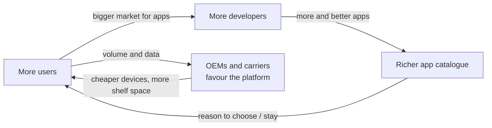

# G7 · Nokia & BlackBerry (2007–2013)

> **The hook.** In November 2007 Nokia sold almost four in every ten mobile phones in the world. Its handset business
> earned a 20% operating margin, and the company was worth ≈€110bn. In June 2008 Research In Motion (RIM), the maker
> of the BlackBerry, was worth ≈$83bn at ≈65× earnings. By **30 June 2011**, the date you stand at, both shares were
> more than 80% below those peaks, and both looked cheap. RIM traded at 4.6× trailing earnings, with a fifth of its
> market value in cash. Nokia traded at 8.8× earnings, with a 9% trailing dividend yield and net cash equal to 39% of
> its market value. Both still shipped tens of millions of phones a quarter. Were they bargains, or low multiples of
> earnings that were about to vanish? This case is about what happens to a moat when the platform under it moves, and
> why a low P/E on peak earnings is a question, not an answer.

| | |
|:--|:--|
| **Period** | 2007–2011 (set-up) · 30-Jun-2011 (decision) · 2011–2016 (outcome) |
| **Decision date** | US close on **30 June 2011**. You may use only what was public then: Nokia's 2010 Form 20-F (Mar-2011), its 11-Feb-2011 strategy releases, its Q1 2011 report and its 31-May-2011 profit warning; RIM's FY2011 annual filings (Mar-2011) and its 16-Jun-2011 Q1 FY2012 release; Apple's FY2010 10-K; Gartner's Feb-2011 market data |
| **Sector** | Mobile handsets and smartphone platforms (technology hardware). Nokia: Finland, IFRS, euros, calendar year. RIM: Canada, US GAAP, US dollars, fiscal year ending around 1 March |
| **Themes** | Moat erosion; platform shifts; ecosystems and network effects; value traps (low P/E on peak earnings); reverse DCF on a declining business; sum-of-the-parts floors; capital allocation under threat; guidance tracking |
| **Modules this case reinforces** | [04.2 Margins](../../04-financial-analysis/02-margins-and-cost-structure.md) · [04.4 Working capital](../../04-financial-analysis/04-working-capital-and-cash-conversion.md) · [03.4 Tracking guidance](../../03-reading-filings/04-quarterly-results-and-concalls.md) · [05.2 Industry analysis](../../05-business-analysis/02-industry-analysis.md) · [05.3 Moats](../../05-business-analysis/03-moats-and-competitive-advantage.md) · [05.5 Capital allocation](../../05-business-analysis/05-management-and-capital-allocation.md) · [06.5 Multiples](../../06-valuation/05-relative-valuation-and-multiples.md) · [06.6 Reverse DCF](../../06-valuation/06-reverse-dcf-and-expectations.md) · [06.7 Sum of the parts](../../06-valuation/07-other-valuation-methods.md) · [06.8 Margin of safety](../../06-valuation/08-margin-of-safety-and-expected-value.md) · [11.5 Monitoring & selling](../../11-process/05-monitoring-and-selling.md) · [11.6 Behavioural finance](../../11-process/06-behavioural-finance-and-decision-journals.md) |
| **Difficulty** | Intermediate–advanced. Do it after [06.6](../../06-valuation/06-reverse-dcf-and-expectations.md) |
| **Time** | ~3 hours (about 1.5 hours on sections 1–3 before you read on) |

!!! note "Conventions in this case"
    Nokia files a **Form 20-F** (the US annual report for foreign issuers) and RIM files a **Form 40-F** (the Canadian
    equivalent, with the annual information form (AIF), MD&A and audited accounts attached as exhibits). Interim news
    arrives on **Form 6-K**. RIM's "FY2011" is the year to 26-Feb-2011. Nokia's US-listed **ADR** (a depositary receipt
    traded in New York) represents exactly one share ([Nokia 6-K, 10-Feb-2011][7]). Prices are closing prices from
    Yahoo Finance ([35]). RIM's prices are adjusted for its 3-for-1 split of August 2007, and the ticker is BB today.
    Euro prices for Nokia are the ADR price ÷ the Federal Reserve noon rate (1.4523 $/€ on 30-Jun-2011, [36]). Totals
    marked ≈ are rounded or derived. All ratios were recomputed in Python from the cited filings.

---

## 1. The scene (as of 30 June 2011)

### The platform shift

On 9-Jan-2007 Apple announced the **iPhone**: a touchscreen phone at $499–599, launching in the US in June 2007 with
Cingular ([Apple][16]). On 5-Nov-2007 Google and 33 other firms formed the Open Handset Alliance to build **Android**,
an open software stack for phones ([OHA][18]). T-Mobile announced the first Android phone on 23-Sep-2008
([Google][19]). Apple's **App Store** opened on 10–11 July 2008 with more than 500 applications
([Apple][17]). Users downloaded more than 10m apps in its first weekend ([Apple][17]).

A **platform shift** is a change in the layer of technology where value is captured. Here it moved from hardware
(radios, battery life, manufacturing cost) to the **operating system and its ecosystem**. An **ecosystem** is the OS
plus the developers, apps, services and accessories built on it. Ecosystems show **network effects**: each extra user
makes the platform more valuable to developers, and each extra app makes it more valuable to users. Because two sides
reinforce each other, the market tends to consolidate on a few winners. **Switching costs** are the costs a customer
pays to leave: lost apps, retraining, IT integration.

Gartner's February 2011 release gave the scoreboard ([Gartner][15]). All mobile devices sold 1.6bn units in 2010, up
31.8%, and smartphones were 19% of them, up 72.1%. Nokia was still the largest vendor, with a 28.9% unit share, down
from 36.4%.

| Smartphone OS (sales to end users) | 2009 units (m) | 2009 share | 2010 units (m) | 2010 share |
|:--|--:|--:|--:|--:|
| Symbian (mostly Nokia) | 80.9 | 46.9% | 111.6 | 37.6% |
| Android | 6.8 | 3.9% | 67.2 | 22.7% |
| Research In Motion | 34.3 | 19.9% | 47.5 | 16.0% |
| iOS (Apple) | 24.9 | 14.4% | 46.6 | 15.7% |
| Microsoft | 15.0 | 8.7% | 12.4 | 4.2% |
| **Total smartphones** | **172.4** | | **296.6** | |

*Source: [Gartner, 9-Feb-2011][15]. Gartner added that Android outsold Nokia's own Symbian devices in Q4 2010, and that
RIM's smartphone share fell from 19.5% in Q4 2009 to 13.7% in Q4 2010.*

The economics of the winner were already public. Apple sold 40.0m iPhones for $25.2bn of revenue in FY2010 (year to
Sep-2010), an average selling price (**ASP**) of ≈$630 ([Apple 10-K][20]). RIM's device ASP was ≈$305 and Nokia's
smartphone ASP was €147 (section 2).

### Nokia

Nokia reported three segments ([20-F 2010][1]). **Devices & Services (D&S)** made the phones, from basic "mobile
phones" to Symbian smartphones. **NAVTEQ** made digital maps and was bought in July 2008 for a total cost of €5,342m
([20-F 2008][2]). **Nokia Siemens Networks (NSN)** was a telecom-equipment joint venture with Siemens, consolidated from
April 2007. Nokia's advantages were **scale and distribution**. It shipped 453m devices in 2010 and sold through
operators, distributors and retailers in every region. It claimed about 50% of the entry-level market and strong share in
India ([20-F 2008][2]). It also held over 10,000 patent families from ≈€43bn of cumulative R&D ([20-F 2010][1]).

Its smartphone software was the problem. Nokia bought Symbian Ltd in 2008 and set up the Symbian Foundation. It was
also building **MeeGo** with Intel ([20-F 2008][2], [20-F 2010][1]). On 21-Sep-2010 Stephen Elop, previously president
of Microsoft's Business Division, became CEO ([20-F 2010][1]). In early February 2011 an internal memo by Elop leaked.
It compared Nokia to a man on a "burning platform" and described the industry as a "war of ecosystems"
([Engadget][21]). On **11-Feb-2011** Nokia announced that Windows Phone would be its principal smartphone platform
([6-K][3]). Symbian became a "franchise platform", with ≈150m more Symbian devices expected, and D&S operating
expenses were to fall by €1bn by 2013. Elop called it "now a three-horse race" ([6-K][3]). The ADR fell 14.0% that day
([35]). The definitive agreement was signed on 21-Apr-2011. It promised Nokia payments from Microsoft "measured in the
billions of dollars" ([6-K][4]).

Q1 2011 looked fine. D&S sales were €7.1bn, the non-IFRS operating margin was 9.8%, and net cash was €6.4bn. (A
**non-IFRS** margin excludes items the company treats as special, such as restructuring charges.) But Nokia guided Q2
D&S sales down to €6.1–6.6bn ([Q1 report][5]). On **31-May-2011** it warned. Q2 sales would be "substantially below"
that range, the Q2 margin could be "around breakeven", and it withdrew its 2011 targets. It blamed competition in
China and Europe, a mix shift to cheaper phones, and pricing. The first Windows Phone device was expected in Q4 2011
([6-K][6]). The ADR fell 14.4% ([35]).

### Research In Motion (BlackBerry)

RIM introduced BlackBerry in 1999 ([BlackBerry AIF FY2014][30]). It was run by two co-CEOs, Jim Balsillie and Mike
Lazaridis, who were also co-chairs ([6-K, 22-Jan-2012][26]). Directors and officers together owned ≈10% of the
shares ([AIF FY2011][8]). It earned money in three ways ([MD&A FY2011][10]). Devices were 80% of revenue. Service
revenue, 16%, came from a monthly infrastructure access fee per subscriber, paid by carriers. Software, mainly the
**BlackBerry Enterprise Server (BES)**, connected phones to corporate email. The base grew from ≈8m subscribers
(FY2007) to more than 41m (FY2010) ([MD&A FY2009][11], [AIF FY2011][8]). By FY2011, 54.6% of users were outside North
America. RIM called BlackBerry the best-selling smartphone brand of 2010 in the US, Canada, Latin America and the UK
([AIF FY2011][8]). One detail is easy to miss: in FY2010, consumer-oriented BlackBerry Internet Service accounts
overtook BES accounts as a share of the base for the first time ([AIF FY2011][8]).

RIM's answer to the iPhone was a new platform. It bought QNX, a real-time operating system, and put it in the
**PlayBook** tablet, launched on 19-Apr-2011 ([AIF FY2011][8], [6-K][12]). The guidance, however, kept moving:

| Date | FY2012 EPS guidance | Source |
|:--|:--|:--|
| 24-Mar-2011 | "in excess of $7.50" | [6-K][12] |
| 28-Apr-2011 | "approximately $7.50" (Q1 cut to $1.30–1.37 from $1.47–1.55) | [6-K][13] |
| 16-Jun-2011 | **$5.25–6.00**; Q2 revenue guided to $4.2–4.8bn, gross margin ≈39% | [6-K][14] |

On 16-Jun-2011 Q1 FY2012 revenue came in at $4.9bn, down 12% on the quarter, on 13.2m BlackBerry shipments. RIM
announced a cost programme with job cuts and a new buyback of up to 5% of its shares. Balsillie said it had "almost
$3 billion in cash" ([6-K][14]). The stock fell 21.5% the next day ([35]).

### What the market believed

Section 2's Table 2.4 has the prices. In one sentence: the market no longer paid for growth at either company, and
priced RIM for a steady decline. The open question on 30-Jun-2011 was whether that decline was priced *fast enough*.

---

## 2. The numbers then

**Table 2.1 — Nokia group, 2006–2010 (€m, IFRS)**

| | 2006 | 2007 | 2008 | 2009 | 2010 |
|:--|--:|--:|--:|--:|--:|
| Net sales | 41,121 | 51,058 | 50,710 | 40,984 | 42,446 |
| Operating profit | 5,488 | 7,985 | 4,966 | 1,197 | 2,070 |
| Operating margin | 13.3% | 15.6% | 9.8% | 2.9% | 4.9% |
| Profit to equity holders (PAT) | 4,306 | 7,205 | 3,988 | 891 | 1,850 |
| Diluted EPS (€) | 1.05 | 1.83 | 1.05 | 0.24 | 0.50 |
| Dividend per share (€) | 0.43 | 0.53 | 0.40 | 0.40 | 0.40 |
| Payout (DPS/EPS) | 41% | 29% | 38% | **167%** | 80% |
| Cash from operations (CFO) | 4,478 | 7,882 | 3,197 | 3,247 | 4,774 |
| Capex | (650) | (715) | (889) | (531) | (679) |
| Free cash flow (CFO − capex) | 3,828 | 7,167 | 2,308 | 2,716 | 4,095 |
| CFO / PAT | 1.04 | 1.09 | 0.80 | 3.64 | 2.58 |
| Equity attributable to parent | 11,968 | 14,773 | 14,208 | 13,088 | 14,384 |
| ROE (on average equity) | — | 53.9% | 27.5% | 6.5% | 13.5% |
| Net cash | 8,288 | 10,663 | 2,368 | 3,670 | 6,996 |

*Source: [20-F 2010, selected financial data and cash-flow statement][1]; [20-F 2008][2] for 2006–07 cash flows. NSN
is fully consolidated from 1-Apr-2007, so 2006 and 2007 are not strictly comparable. Nokia bought back €10.4bn of stock in
2006–08 and none after September 2008 ([20-F 2010][1]).*

Worked example (ROE 2010): average equity = (13,088 + 14,384)/2 = 13,736, so ROE = 1,850/13,736 = **13.5%**. CFO/PAT
of 2.58 in 2010 is high because working capital released cash while profit was depressed. It is not evidence of
quality. **Payout** above 100% in 2009 means the dividend exceeded earnings.

**Table 2.2 — Nokia Devices & Services and market position**

| | 2007 | 2008 | 2009 | 2010 |
|:--|--:|--:|--:|--:|
| D&S net sales (€m) | 37,705 | 35,099 | 27,853 | 29,133 |
| D&S gross margin | 36.5% | 36.3% | 33.3% | 30.1% |
| D&S operating margin | 20.1% | 16.6% | 11.9% | 11.3% |
| Device volumes (m) | 437.1 | 468.4 | 431.8 | 452.9 |
| of which smartphones ("converged devices") | 60.5 | 60.6 | 67.8 | 100.3 |
| Device ASP (€) | 86 | 74 | 63 / 64 ‡ | 64 |
| North America volumes (m) | 19.4 | 15.7 | 13.5 | 11.1 |
| Global device share (Nokia estimate) | 38% | 39% | 38% / 34% † | 32% † |
| Smartphone share (Nokia estimate) | 52% | 38% | 39% † | 36% † |

*Sources: [20-F 2008][2] (2007–08), [20-F 2010][1] (2009–10). † Nokia redefined the market in 2010 to include more
entrants, so 2009 is shown both ways. ‡ €63 was the original 2009 figure and €64 the later one including services.
Smartphone ASP fell 21%, to €147, in 2010.*

**Table 2.3 — Research In Motion, FY2007–FY2011 ($m, US GAAP)**

| Fiscal year (ends ~1 Mar) | FY2007 | FY2008 | FY2009 | FY2010 | FY2011 |
|:--|--:|--:|--:|--:|--:|
| Revenue | 3,037 | 6,009 | 11,065 | 14,953 | 19,907 |
| Revenue growth | — | 97.9% | 84.1% | 35.1% | 33.1% |
| Gross margin | 54.6% | 51.3% | 46.1% | 44.0% | 44.3% |
| Operating margin | 26.6% | 28.8% | 24.6% | 21.7% | 23.3% |
| Net income | 632 | 1,294 | 1,893 | 2,457 | 3,411 |
| Diluted EPS ($) | 1.10 | 2.26 | 3.30 | 4.31 | 6.34 |
| CFO | 736 | 1,577 | 1,452 | 3,035 | 4,009 |
| Capex (PP&E) | (254) | (352) | (834) | (1,009) | (1,039) |
| Intangibles bought (patents, licences) | (60) | (374) | (688) | (421) | (557) |
| FCF (CFO − capex − intangibles) | 421 | 851 | (70) | 1,605 | 2,413 |
| CFO / net income | 1.16 | 1.22 | 0.77 | 1.24 | 1.18 |
| Shareholders' equity | 2,484 | 3,934 | 5,874 | 7,603 | 8,938 |
| ROE (average equity) | 28.2% | 40.3% | 38.6% | 36.5% | 41.2% |
| Subscribers, year-end (m) | ≈8 | >14 | ≈25 | >41 | n/d |
| Devices shipped (m) / device ASP ($) | | | | 36.7 / ≈330 | 52.3 / ≈305 |
| Receivables (year-end) / DSO (days) | | | | 2,594 / 63.3 | 3,955 / 72.5 |

*Sources: [FY2009 financial statements and MD&A][11]; [FY2011 financial statements][9] and [MD&A][10]; [AIF FY2011][8].
FY2007 ROE uses opening equity of $1,995m. Device ASP = device revenue ÷ units ($12,116m/36.7m; $15,956m/52.3m).
**DSO** (days sales outstanding) = receivables ÷ revenue × 365. RIM bought back $2,852m of stock in FY2010–11 (49.5m
shares) ([FY2011 FS][9]).*

**Table 2.4 — Valuation snapshot at the US close, 30 June 2011**

| | Nokia (NOK ADR) | RIM (RIMM) |
|:--|--:|--:|
| Share price | $6.42 ≈ €4.42 | $28.85 |
| Shares (m) | 3,709 (2010 average basic) | 524 (22-Mar-2011) |
| Market capitalisation | ≈€16.4bn | ≈$15.1bn |
| Net cash (latest) | €6.4bn (31-Mar-2011) | $2.9bn (28-May-2011) |
| Non-controlling interests (Siemens' share of NSN) | €1.8bn | — |
| Enterprise value (EV) | ≈€11.8bn | ≈$12.2bn |
| Trailing P/E | 8.8× (2010 EPS €0.50) | 4.6× (FY2011 EPS $6.34) |
| Forward P/E on guidance | withdrawn | 5.1× (midpoint $5.625) |
| Price / book | 1.14× | 1.69× |
| Trailing dividend yield | 9.0% | none |
| EV / last-year operating profit | 5.7× | 2.6× |
| Last-year FCF yield on market cap | 25.0% | 16.0% |
| Peak close (date) and fall to decision date | $41.10 (6-Nov-2007), −84.4% | $147.55 (19-Jun-2008), −80.4% |
| P/E at peak | ≈15× (2007 EPS) | ≈65× (FY2008 EPS) |

*Sources: prices [35], [36]; shares [1], [9]; cash [5], [14]; EPS and equity Tables 2.1 and 2.3. **EV** (enterprise
value) = market cap + non-controlling interests − net cash. Nokia's net cash is for the whole group, including NSN.*

---

## 3. You are the analyst

Answer these **before reading section 4**, using only sections 1–2. Show your arithmetic.

1. **(Numerical: rebuild the snapshot.)** Recompute Table 2.4. What share of each market cap is net cash? Strip the cash
   out and compute an "ex-cash P/E" for RIM (use a 1% post-tax yield on cash).
2. **(Numerical: reverse DCF.)** Treat RIM's FY2011 FCF of $2.41bn as a perpetuity growing at *g* and discount at 10%.
   What *g* does the EV of ≈$12.2bn imply? Repeat at 9% and 12%. Then read the same EV another way: for how many years
   of flat FCF, with nothing after, is the market paying?
3. **(Numerical: what does a low P/E imply?)** With full payout, the justified P/E is $(1+g)/(r-g)$
   ([06.5](../../06-valuation/05-relative-valuation-and-multiples.md)). At $r = 10\%$, what perpetual earnings growth
   do RIM's 4.6× and Nokia's 8.8× imply? Which company is the market more pessimistic about, and is that what you
   would expect from sections 1–2?
4. **(Numerical: sum of the parts.)** For Nokia, assume NSN's equity is worth zero and NAVTEQ is worth half of its
   €5.34bn cost. What value is the market placing on D&S? Express it as a multiple of D&S 2010 operating profit
   (≈11.3% × €29.1bn). List three reasons this "floor" may be overstated.
5. **(Numerical: moat-erosion tests.)** Compute: (a) RIM's gross-margin change FY2007→FY2011 in percentage points, its
   device ASP change FY2010→FY2011, and DSO and receivables growth vs revenue growth; (b) Nokia D&S's gross- and
   operating-margin changes 2007→2010, its ASP change, and its North American volume change. Which numbers point to
   eroding *pricing power*, and which to eroding *relevance*?
6. **(Numerical: capital allocation.)** Compute the average price RIM paid for its FY2010–11 buybacks, and Nokia for
   2006–08 (€3,412m for 212.34m shares, €3,884m for 180.59m, €3,123m for 157.39m). What are those shares worth at the
   decision-date price? What does that say about buybacks by a company whose moat is in question?
7. **(Judgement: which moat, which shift?)** Sort each advantage into a moat type
   ([05.3](../../05-business-analysis/03-moats-and-competitive-advantage.md)): Nokia's manufacturing scale, its
   distribution, its brand and its patents; RIM's BES integration, BlackBerry Messenger, carrier relationships and the
   physical keyboard. Which does a shift to app ecosystems neutralise, and which survive?
8. **(Judgement: Nokia's fork in the road.)** In February 2011 Nokia could stay with Symbian/MeeGo, adopt Android, or
   adopt Windows Phone. Sketch the payoff distribution of each, as an options trader would. What did announcing the
   switch eight months before the first Windows Phone shipped risk for 2011–12 revenue?
9. **(Decision.)** Own, avoid or short each stock on 30-Jun-2011, and at what size? Write the strongest bull case, and
   three KPIs with thresholds that would prove you wrong. (Educational framing; see
   [11.7](../../11-process/07-fundamentals-meets-derivatives.md) if you would use options.)

---

## 4. What happened

| Date | Event | Source |
|:--|:--|:--|
| Sep-2011 | Nokia outsources Symbian development and support to Accenture | [20-F 2011][22] |
| Oct-2011 | BlackBerry service interruption; ≈$54m of penalties and lost service revenue in Q3 FY2012; class actions follow | [AIF FY2012][27] |
| Oct-2011 | Nokia launches its first Windows Phones, the Lumia 800 (≈€420 before taxes and subsidies) and Lumia 710 | [20-F 2011][22] |
| 2-Dec-2011 | RIM books a ≈$485m pre-tax provision on PlayBook inventory; stock −9.7% | [6-K][25]; [35] |
| 22-Jan-2012 | Thorsten Heins replaces the co-CEOs; Barbara Stymiest becomes independent chair | [6-K][26] |
| FY2011 / FY2012 | Nokia 2011: operating loss €1,073m, EPS −€0.31, dividend halved to €0.20. It also says Symbian volumes fell faster than expected and books excess-component provisions. RIM FY2012 (to 3-Mar-2012): revenue $18.4bn, net income $1.16bn, subscribers ≈77m | [20-F 2012][23]; [20-F 2011][22]; [MD&A FY2014][30]; [AIF FY2012][27] |
| 28-Jun-2012 | RIM Q1 FY2013: revenue $2.8bn (−43% y/y), net loss $518m. BlackBerry 10 is delayed to Q1 2013 and ≈5,000 jobs go. Stock −19.1% | [6-K][28]; [35] |
| 17-Jul-2012 | Nokia ADR closes at $1.69, −73.7% from the decision date | [35] |
| 2012 | Nokia: operating loss €2,303m, EPS −€0.84, no dividend; device share 21% (Strategy Analytics) | [20-F 2012][23] |
| 30-Jan-2013 | BlackBerry 10 launches (Z10, Q10); RIM renames itself BlackBerry; stock −12.0% | [AIF FY2014][30]; [35] |
| 7-Aug-2013 | Nokia buys Siemens' 50% of NSN for €1.7bn | [20-F 2013][24] |
| 3-Sep-2013 | Microsoft agrees to buy D&S for **€3.79bn** plus **€1.65bn** for a 10-year patent licence (total €5.44bn); ≈32,000 staff to transfer; ADR **+31.3%** | [Microsoft][31]; [20-F 2013][24]; [35] |
| 20-Sep-2013 | BlackBerry pre-announces Q2 FY2014: revenue ≈$1.6bn, $930–960m Z10 inventory charge, ≈4,500 job cuts (≈40% of staff); stock −17.0% | [6-K][29]; [35] |
| 23-Sep / 4-Nov-2013 | Fairfax-led offer at **$9/share** (≈$4.7bn) under a letter of intent; replaced by a $1bn convertible debenture. John Chen replaces Heins | [AIF/MD&A FY2014][30] |
| FY2014 (to 1-Mar-2014) | BlackBerry: revenue $6.8bn, **net loss $5.9bn** (incl. $2.7bn asset impairment and $2.5bn of inventory charges); devices recognised 13.7m vs 52.3m in FY2011 | [MD&A FY2014][30] |
| 25-Apr-2014 | Microsoft closes the deal. The Chennai (India) factory stays with Nokia because Indian tax authorities have frozen its assets | [Microsoft][32]; [20-F 2013][24] |
| 2014 | Nokia pays €0.37/share for 2013, incl. a €0.26 special dividend | [20-F 2013][24] |
| FY2015 (to Jun-2015) | Microsoft records $7.5bn of goodwill and asset impairments on Phone Hardware | [Microsoft 10-K][33] |
| 28-Sep-2016 | BlackBerry says it will end all internal hardware development | [6-K][34] |

**Stock outcome from the decision date (30-Jun-2011)**

| Horizon | Nokia ADR close ($) | Price | Total return ≈ | BlackBerry close ($) | Price = total return | Apple TR ≈ | S&P 500 TR |
|:--|--:|--:|--:|--:|--:|--:|--:|
| Start | 6.42 | | | 28.85 | | | |
| +1 year (29-Jun-2012) | 2.07 | −67.8% | −65.3% | 7.39 | −74.4% | +74.0% | +5.4% |
| +3 years (30-Jun-2014) | 7.56 | +17.8% | +35.1% | 10.24 | −64.5% | +102.8% | +58.5% |
| +5 years (30-Jun-2016) | 5.69 | −11.4% | +10.1% | 6.71 | −76.7% | +116.6% | +77.0% |
| +7 years (29-Jun-2018) | 5.75 | −10.4% | +19.1% | 9.65 | −66.6% | +334.0% | +138.7% |

*Source: Yahoo Finance closes and dividend-adjusted closes ([35]); S&P 500 total-return index (^SP500TR). Nokia's total
return uses gross ADR dividends. BlackBerry paid none. From their 2007–08 peaks, both fell ≈96% to their lows: Nokia to
$1.69 (Jul-2012) and BlackBerry to $5.75 (Dec-2013).*

The two outcomes diverge, and that is the most important fact in the case. **Both handset businesses failed.** RIM's
revenue fell at ≈30% a year from FY2011 to FY2014. Nokia's group sales fell at ≈16% a year from 2010 to 2012.
BlackBerry shareholders had nothing else to fall back on. Nokia shareholders did: net cash, networks, maps and patents,
plus a buyer for the phone business. After a −68% first year, the Nokia holder was ahead after three years, though
still well behind the index.

---

## 5. Signals: knowable then vs hindsight

| Knowable on 30-Jun-2011 | Only in hindsight |
|:--|:--|
| The platform shift was in the numbers: Android went from 3.9% to 22.7% of smartphones in one year; Microsoft's share fell from 8.7% to 4.2% ([Gartner][15]) | How fast the installed bases would leave. RIM's devices fell 74% in three fiscal years; Nokia's Symbian decline outran its own plan |
| Pricing power was going. RIM's gross margin fell ≈10pp over four years; Nokia's D&S margin fell 6.4pp (gross) and 8.8pp (operating), and its ASP fell 26% | That Windows Phone would never reach critical mass, and that BB10 would slip to 2013 and then flop |
| Relevance was going: Nokia's North American volumes fell 43% in three years; RIM's Q4 smartphone share fell from 19.5% to 13.7% | The October 2011 outage and the PlayBook write-down, both of which damaged trust in RIM |
| Guidance credibility: RIM's EPS guide fell 25% in 12 weeks; Nokia withdrew its targets a month after setting them | That Microsoft would pay €5.44bn in 2013, rescuing Nokia's equity, then write off $7.5bn two years later |
| The RIM moat had shifted from enterprise (BES, high switching costs) to consumers (BIS), who choose phones on apps and user experience | That Nokia's networks business, loss-making in Q1 2011, would become the core of the surviving company |
| The market priced RIM's FCF to shrink ≈8% a year forever (Q2). Section 1 gave no evidence of how fast the decline would really be | That the realised decline would be ≈30% a year, making even the "pessimistic" price far too high |

!!! success "The strongest bull case that existed at the time"
    **RIM:** 4.6× earnings, no debt, $2.9bn of cash, unit shipments up 43% in FY2011, and a fast-growing base outside
    North America (54.6% of users) where BlackBerry Messenger was popular. It had high-margin recurring service revenue
    of $3.2bn, entrenched enterprise security, and a modern OS (QNX) already in a shipping product. Insiders owned ≈10%.
    Even at a 10% annual decline in earnings, the stock was roughly fairly priced; anything better was upside. **Nokia:**
    the world's largest phone maker, with unmatched emerging-market distribution. Net cash covered 39% of the market
    cap, and the dividend yield was 9%. Microsoft was paying "billions" to make Nokia its lead partner, NSN and NAVTEQ
    were free options, and a patent portfolio was built from €43bn of R&D.

    Why it failed for RIM: every number in that case was a *stock* (installed base, cash, patents) or a *trailing flow*.
    None was a leading indicator of new-customer choice. The leading indicators (share of new smartphone sales, ASP,
    developer attention) were all falling. Why it half-worked for Nokia: its "free options" were real assets outside the
    dying business, and one of them (a sale of D&S) got exercised.

!!! warning "Guard against hindsight bias"
    In June 2011 platforms looked more contestable than they do today. Windows Phone was backed by the world's largest
    software company and the largest phone maker. BlackBerry had just been the US's top-selling smartphone brand for
    2010. Skilled investors owned both. What you *could* know was the direction of the leading indicators and the size
    of the decline the price assumed. You could not know the speed. A good 2011 analysis sizes the position for a wide
    distribution of outcomes. It does not claim to have predicted BB10's failure
    ([11.6](../../11-process/06-behavioural-finance-and-decision-journals.md)).

!!! tip "Trader's lens — implied decay vs realised decay"
    A low P/E is not "cheap"; it is an **implied growth rate**, just as an option price is an implied vol. RIM at 4.6×
    implied ≈−10% a year for ever (Q3). The market was right on direction, but realised decay was ≈−30% a year, as if the
    market had sold vol at 10 on an underlying that realised 30. Nokia's price implied roughly flat earnings on a
    group whose core was shrinking. But part of its value sat in assets whose "delta" to the handset war was near zero.

!!! info "India notes"
    - **Nokia was big in India.** Its 2008 20-F said its global share benefited from strength in India and entry-level
      phones ([20-F 2008][2]). The Chennai factory was left out of the Microsoft sale because Indian tax proceedings
      had frozen its assets ([20-F 2013][24], [Microsoft][32]).
    - **The same test at home.** When a dominant Indian franchise looks cheap after a de-rating, ask Q5's two questions.
      Is pricing power eroding (gross margin, ASP)? Is relevance eroding (share of *new* customers, where developers,
      distributors and partners are moving)? Then compare the decline the price implies (Q2–Q3) with the one you can
      evidence. Compare [I12 ITC](../india/12-itc-value-trap-or-not.md) (a low multiple that was not a terminal decline)
      and [I10 Vodafone Idea](../india/10-vodafone-idea-telecom-war.md) (a capital cycle).

---

## 6. Lessons

1. **A moat protects a profit pool only while the pool stays where it is.** Nokia's scale and distribution, and RIM's
   enterprise switching costs, were real. The platform shift moved value to the OS and app ecosystem, where neither
   had network effects. Ask which layer of the value chain captures the profit, and whether that layer is moving.
   → [05.2 Industry analysis](../../05-business-analysis/02-industry-analysis.md) ·
   [05.3 Moats](../../05-business-analysis/03-moats-and-competitive-advantage.md)
2. **A low P/E on peak earnings is a forecast of decline. Test the forecast.** Convert the multiple into implied growth
   (Q2–Q3). Then look for evidence of the *realised* decline rate in leading indicators, not trailing profits.
   → [06.6 Reverse DCF](../../06-valuation/06-reverse-dcf-and-expectations.md) ·
   [06.5 Multiples](../../06-valuation/05-relative-valuation-and-multiples.md)
3. **Watch leading indicators, not stocks of past success.** Share of new sales, ASP, gross margin, developer
   attention and the mix of new customers (BIS vs BES) turned years before profits did. Installed bases, cash and
   trailing EPS lag.
   → [04.2 Margins](../../04-financial-analysis/02-margins-and-cost-structure.md) ·
   [11.5 Monitoring & selling](../../11-process/05-monitoring-and-selling.md)
4. **Serial guidance cuts are information.** Three RIM updates in 12 weeks and Nokia's withdrawal of targets a month
   after setting them showed that management could not see its own demand. Track "said vs did" every quarter.
   → [03.4 Quarterly results & concalls](../../03-reading-filings/04-quarterly-results-and-concalls.md) ·
   [05.5 Management](../../05-business-analysis/05-management-and-capital-allocation.md)
5. **Buybacks at peak multiples by a threatened franchise destroy value twice.** RIM spent $2.85bn at ≈$58/share and
   Nokia €10.4bn at ≈€19/share. By June 2011 half and three-quarters of that money, respectively, was gone, and the
   cash was not there when the transition needed funding.
   → [05.5 Capital allocation](../../05-business-analysis/05-management-and-capital-allocation.md)
6. **In a value trap, the floor is what sits *outside* the dying business.** Nokia's net cash, networks, maps and
   patents turned a failed handset bet into a +35% three-year total return. RIM's "floor" was mostly the dying business
   itself. Do the sum of the parts, and ask which parts are uncorrelated with the core.
   → [06.7 Sum of the parts](../../06-valuation/07-other-valuation-methods.md) ·
   [06.8 Margin of safety](../../06-valuation/08-margin-of-safety-and-expected-value.md)
7. **Platform transitions are high-variance bets; size them like options.** Nokia's Windows Phone choice and RIM's
   QNX/BB10 rebuild were binary-ish, and the old platform's revenue fell while the new one was not ready. Keep positions
   small enough to survive the bad branch.
   → [11.4 Position sizing](../../11-process/04-position-sizing-and-portfolio-construction.md) ·
   [11.6 Behavioural finance](../../11-process/06-behavioural-finance-and-decision-journals.md)

---

## 7. Model answers

<strong>Q1 — The snapshot</strong>

**RIM.** Market cap = $28.85 × 524m = **$15.12bn**. EV = 15.12 − 2.90 = **$12.22bn**. Trailing P/E = 28.85/6.34 =
**4.55×**. Forward P/E is 28.85/5.625 = **5.13×** at the midpoint (4.81× at $6.00, 5.50× at $5.25). Cash is
2.90/15.12 = **19.2%** of market cap. FCF yield = 2,413/15,117 = **16.0%**, and EV/FCF = **5.06×**.

Ex-cash P/E: cash per share = 2,900/524 = $5.53, and its after-tax income at 1% is ≈$0.06 a share. So
(28.85 − 5.53)/(6.34 − 0.06) ≈ **3.7×**.

**Nokia.** Price in euros = 6.42/1.4523 = **€4.42**. Market cap = 4.42 × 3,709m = **€16.4bn**. EV = 16.4 + 1.85 − 6.4 =
**€11.8bn**. P/E = 4.42/0.50 = **8.8×**, dividend yield = 0.40/4.42 = **9.0%**, P/B = 16.4/14.38 = **1.14×**, and
EV/EBIT = 11.8/2.07 = **5.7×**. Net cash is 6.4/16.4 = **39%** of market cap, ≈€1.73 a share. Caveat: part of that
cash sits in NSN, which Siemens half-owns.

Both look cheap on every trailing metric. That is the point: trailing metrics cannot separate a bargain from a trap.

<strong>Q2 — Reverse DCF for RIM</strong>

A growing perpetuity gives $EV = FCF\,(1+g)/(r-g)$. Solving for $g$:

$$g = \frac{EV\cdot r - FCF}{EV + FCF} = \frac{12.217 \times 0.10 - 2.413}{12.217 + 2.413} = \frac{-1.191}{14.630} = -8.1\%$$

At 9%, **−9.0%**; at 12%, **−6.5%**. The market was pricing FCF to shrink by roughly 7–9% a year forever.

Annuity view: $EV/FCF = 5.06 = (1 - 1.1^{-n})/0.1$, so $1.1^{-n} = 0.494$ and $n \approx$ **7.4 years** of flat FCF, then
nothing.

Was that pessimistic enough? What happened: FCF after PP&E and intangibles was −$207m in FY2012, +$880m in FY2013 and
−$1,522m in FY2014. That sums to **−$849m** over three years, or ≈−$70m excluding the $779m Nortel patent purchase
([MD&A FY2014][30], [AIF FY2012][27]). The price was right about direction and wrong about speed. A "pessimistic"
reverse DCF can still be far too optimistic when the decline is non-linear.

<strong>Q3 — The P/E as an implied growth rate</strong>

Solve $(1+g)/(0.10-g) = P/E$, which gives $g = (0.10\cdot P/E - 1)/(1 + P/E)$.

- RIM: (0.455 − 1)/5.55 = **−9.8%** a year.
- Nokia: (0.884 − 1)/9.84 = **−1.2%** a year (+0.9% if you assume the 80% payout Nokia actually paid).

So the market treated RIM as a steady decliner and Nokia as roughly flat. Given sections 1–2, both looked generous.
Nokia had just said its Q2 handset margin could be around breakeven, and RIM had cut guidance twice. What happened:
Nokia's EPS went to −€0.31 (2011) and −€0.84 (2012). RIM's continuing EPS went $2.23 (FY2012), then −$1.20 and
−$11.18 ([MD&A FY2014][30]). Sanity table (full payout, r = 10%): g = −5% → 6.3×, −10% → 4.5×, −15% → 3.4×,
−20% → 2.7×. Single-digit multiples are fair value for businesses that shrink quickly.

<strong>Q4 — Nokia sum of the parts</strong>

Implied D&S = market cap − net cash − 50% × NAVTEQ cost = 16.40 − 6.40 − 2.67 = **≈€7.3bn**. That is
7.3/(0.113 × 29.13) = 7.3/3.29 = **≈2.2×** 2010 D&S operating profit. The market valued the handset business as if
its profits would last only a couple of years.

Why the floor may be overstated: (1) part of the group net cash sits in NSN, and Siemens owns half of NSN's equity. (2)
NSN earned a ≈0% margin in Q1 2011 and could *consume* cash. (3) Restructuring the D&S transition costs cash (the €1bn
opex cut needs severance). (4) NAVTEQ's value depends on handset volumes and Microsoft's use of the maps. (5) The
dividend (€1.5bn a year at €0.40) drains the cash if D&S stops earning.

What happened: Microsoft paid €3.79bn for D&S in 2013, about half of the implied €7.3bn, after two years of group
operating losses. But the parts outside D&S turned out *better* than zero. Continuing operations (networks, maps,
technologies) swung from an operating loss of €821m in 2012 to a profit of €519m in 2013 ([20-F 2013][24]). The €1.65bn
patent licence came on top. The SOTP did not need a D&S miracle; it needed the non-D&S parts to be worth more than
nothing.

<strong>Q5 — Moat-erosion tests</strong>

**RIM.** Gross margin 54.6% → 44.3%, **−10.3pp** (FY2007→FY2011). Device ASP ≈$330 → ≈$305, **−7.6%**. DSO 63.3 →
**72.5 days**: receivables rose **52.5%** while revenue rose 33.1%. The ASP cut and cheaper mix point to eroding
*pricing power*. The DSO rise is a yellow flag: it may reflect a shift to international carriers or a late-quarter
shipment push. Check the receivables-ageing and allowance notes before calling it aggressive
([04.4](../../04-financial-analysis/04-working-capital-and-cash-conversion.md)). *Relevance* shows in the Gartner Q4
share (19.5% → 13.7%) and in BIS overtaking BES. RIM was growing in segments where its switching costs were weakest.

**Nokia.** D&S gross margin 36.5% → 30.1% (**−6.4pp**); operating margin 20.1% → 11.3% (**−8.8pp**); ASP €86 → €64
(**−25.6%**); North American volumes 19.4m → 11.1m (**−43%**); smartphone share 52% → 36%. Total units were flat (437m
→ 453m), so Nokia held *volume* by moving down-market while losing *value* at the top. That is the classic pattern when
an incumbent's product loses relevance in the profitable segment. Payout of 167% (2009) and 80% (2010) shows the
dividend was set for a business that no longer existed.

<strong>Q6 — Buybacks</strong>

**RIM:** $775m + $2,077m = $2,852m for 12.3m + 37.2m = 49.5m shares, an average of **≈$57.6**. At $28.85 those shares
are worth $1.43bn: **−50%**, a ≈$1.42bn loss. Separately, the 2010 programme averaged ≈$65.9 and the 2011 one ≈$54.3.
**Nokia:** €10,419m for 550.3m shares, an average of **≈€18.93** (€16.07, €21.51 and €19.84 in 2006, 2007 and 2008).
At €4.42 they are worth ≈€2.43bn: **−77%**.

A buyback creates value only if price < value. When the moat is in question, cash has *option value*: it funds the
transition, or it can be returned later at a lower price. The June 2011 RIM board authorised another 5% buyback at
≈4.6× earnings. That was more defensible on price, but it was still a bet that the earnings were durable.

<strong>Q7 — Moat types</strong>

| Advantage | Moat type | Survives the app-ecosystem shift? |
|:--|:--|:--|
| Nokia manufacturing and procurement scale | Scale economies (cost) | Partly: it lowers cost, but consumers now choose on software |
| Nokia distribution and emerging-market reach | Distribution / cornered channel | Partly: strong at the low end, eroding as Android OEMs use the same channels |
| Nokia brand | Brand | Weakens once the brand stands for the *old* experience |
| Nokia patents | Cornered resource (IP) | **Yes**: royalties do not depend on who wins, and Nokia kept them in 2013 |
| RIM BES / IT integration, security | Switching costs (enterprise) | Only while enterprises choose devices; weakens as employees bring their own |
| BlackBerry Messenger | Network effect, but a closed one | Only while the network is exclusive. Once rivals' users are unreachable it pushes people away |
| Carrier relationships, data efficiency | Process / relationship | Weak: carriers follow consumer demand |
| Physical keyboard | Product feature | Not a moat |

The ecosystem shift attacks all the "device-era" advantages at once, because the purchase decision moves to the
software and app layer. There, network effects compound for the leaders (the flywheel in section 1).

<strong>Q8 — Nokia's options in February 2011</strong>

- **Stay (Symbian/MeeGo):** full control and no licence fee, but a lagging developer ecosystem. Elop's memo said the
  MeeGo pace might yield only one product by end-2011 ([Engadget][21]). Payoff: a high probability of slow erosion and
  a small chance of a comeback.
- **Android:** instant access to the fastest-growing ecosystem, but as one of many OEMs selling similar hardware, so
  margins get competed down. Payoff: a narrow distribution around "a large but low-margin OEM".
- **Windows Phone:** differentiation, Microsoft's money ("billions") and a say in the roadmap. But it meant joining a
  platform with a 4.2% and falling share ([Gartner][15]). Payoff: **bimodal**, either a strong #3 ecosystem or
  irrelevance, like a long out-of-the-money call.

The timing risk was knowable. Nokia downgraded Symbian publicly in February, but the first Windows Phone was expected in
Q4 2011 ([6-K][6]). Buyers, carriers and developers had reason to hold back from Symbian *before* its successor existed.
Nokia later said Symbian volumes fell faster than anticipated ([20-F 2011][22]). None of this proves another option
would have worked. It shows why the distribution of outcomes for Nokia's equity was very wide.

<strong>Q9 — Decision (rubric)</strong>

A strong answer: (1) states the implied decline (≈−8 to −10% for RIM, ≈flat for Nokia). (2) Brings evidence that the
realised decline could be faster: falling gross margins and ASPs, share of new sales, guidance cuts, BIS > BES. (3)
Separates Nokia's non-handset floor (net cash, NSN, NAVTEQ, patents) from the handset option. (4) Sizes small or
avoids. The strongest structure is "avoid RIM; small Nokia position justified only by the SOTP floor". A short in RIM
at 4.6× carried squeeze and takeover risk (the $9 Fairfax offer arrived in 2013). **KPIs:** RIM's shipments vs
guidance, gross margin vs the 39% Q2 guide, subscriber growth outside North America, and the BB10/QNX phone date.
Nokia's Q2–Q3 D&S margin vs breakeven, Symbian volumes vs the 150m plan, Windows Phone launch on time and early
sell-through, net cash above ≈€5bn, and NSN margin. Thesis-breakers could include a second guidance cut, a platform
slip beyond one quarter, or a dividend cut. A weak answer says "cheap on P/E, strong brand, buy".

---

## 8. Discussion questions & extensions

1. **What would you monitor today?** Pick any incumbent whose product may be bypassed by a new software layer (for
   study, not recommendation). Define its "Q5 dashboard": share of *new* customers, ASP, gross margin, developer or
   partner attention, and the mix of new vs legacy users. Which metric turned first for RIM and for Nokia?
2. **Was selling D&S good capital allocation?** Microsoft paid €5.44bn and later impaired $7.5bn. Argue for Nokia's
   shareholders and for Microsoft's. What does this say about the value of a strategic buyer as a "floor" in a value
   trap?
3. **Could BlackBerry have kept a smaller, profitable niche?** Using the FY2011 revenue mix (80% devices, 16% service,
   2% software), model a "software and services only" RIM. What subscriber decay and service fee per user would have
   supported the June 2011 EV? (BlackBerry itself pivoted to software in 2016.)
4. **Dividends as a signal.** Nokia paid more than it earned in 2009 and 80% in 2010, then cut to €0.20 and zero. Build
   a rule for when a trailing dividend yield should be *ignored* in valuation.
5. **Base rates.** How often do former category leaders with over 30% share regain leadership after a platform shift?
   Design a study (handsets, PCs, cameras, search, retail). How should the base rate change your probability on each
   bull case ([11.6](../../11-process/06-behavioural-finance-and-decision-journals.md))?

---

## Sources

All accessed 21-Sep-2026. SEC documents were retrieved from EDGAR. Share prices came from Yahoo Finance via yfinance.
Every derived ratio was recomputed in Python.

1. Nokia, **Form 20-F for 2010** (filed 11-Mar-2011): selected financial data 2006–10, D&S results, volumes, ASP,
   market share, cash flow, buybacks, dividends, Elop biography, R&D and patents.
   <https://www.sec.gov/Archives/edgar/data/924613/000095012311024458/u10545e20vf.htm>
2. Nokia, **Form 20-F for 2008** (filed 5-Mar-2009): D&S 2006–08, gross margins, volumes, share, smartphone share,
   ASP, India and entry-level position, NAVTEQ cost, Symbian Foundation, 2006–08 cash flows.
   <https://www.sec.gov/Archives/edgar/data/924613/000115697309000127/u06062e20vf.htm>
3. Nokia, **Form 6-K** (11-Feb-2011): Microsoft partnership, new strategy, Symbian "franchise platform", financial
   targets. <https://www.sec.gov/Archives/edgar/data/924613/000110465911006542/a11-5782_16k.htm>
4. Nokia, **Form 6-K** (21-Apr-2011): definitive agreement with Microsoft.
   <https://www.sec.gov/Archives/edgar/data/924613/000110465911021529/a11-10703_26k.htm>
5. Nokia, **Form 6-K: Q1 2011 interim report** (21-Apr-2011).
   <https://www.sec.gov/Archives/edgar/data/924613/000110465911021549/a11-10703_16k.htm>
6. Nokia, **Form 6-K** (31-May-2011): lowered Q2 2011 outlook.
   <https://www.sec.gov/Archives/edgar/data/924613/000110465911032233/a11-13475_16k.htm>
7. Nokia, **Form 6-K** (10-Feb-2011): ADR proxy notice (1 share = 1 ADS).
   <https://www.sec.gov/Archives/edgar/data/924613/000119380511000236/e608017_6k-nokia.htm>
8. Research In Motion, **Annual Information Form FY2011** (Exhibit 1.1 to 40-F, 29-Mar-2011).
   <https://www.sec.gov/Archives/edgar/data/1070235/000095012311030229/o66524exv1w1.htm>
9. Research In Motion, **audited financial statements FY2011** (Exhibit 1.2 to 40-F).
   <https://www.sec.gov/Archives/edgar/data/1070235/000095012311030229/o66524exv1w2.htm>
10. Research In Motion, **MD&A FY2011** (Exhibit 1.3 to 40-F).
    <https://www.sec.gov/Archives/edgar/data/1070235/000095012311030229/o66524exv1w3.htm>
11. Research In Motion, **FY2009 financial statements and MD&A** (Exhibits 1.2 and 1.3 to 40-F, 7-Apr-2009).
    <https://www.sec.gov/Archives/edgar/data/1070235/000090956709000334/o54602exv1w2.htm> ·
    <https://www.sec.gov/Archives/edgar/data/1070235/000090956709000334/o54602exv1w3.htm>
12. Research In Motion, **Form 6-K** (24-Mar-2011): Q4 and FY2011 results, FY2012 outlook.
    <https://www.sec.gov/Archives/edgar/data/1070235/000134100411000761/rim6k.htm>
13. Research In Motion, **Form 6-K** (28-Apr-2011): updated Q1 guidance.
    <https://www.sec.gov/Archives/edgar/data/1070235/000107023511000011/pr042811.htm>
14. Research In Motion, **Form 6-K** (16-Jun-2011): Q1 FY2012 results and revised guidance.
    <https://www.sec.gov/Archives/edgar/data/1070235/000134100411001378/form6k.htm>
15. Gartner, press release, 9-Feb-2011, "Worldwide Mobile Device Sales to End Users Reached 1.6 Billion Units in
    2010…" (Internet Archive copy; the live page is behind a bot check).
    <http://web.archive.org/web/20110305042351/http://www.gartner.com/it/page.jsp?id=1543014>
16. Apple, "Apple Reinvents the Phone with iPhone", 9-Jan-2007.
    <https://www.apple.com/newsroom/2007/01/09Apple-Reinvents-the-Phone-with-iPhone/>
17. Apple, "iPhone 3G on Sale Tomorrow", 10-Jul-2008, and "iPhone App Store Downloads Top 10 Million in First
    Weekend", 14-Jul-2008. <https://www.apple.com/newsroom/2008/07/10iPhone-3G-on-Sale-Tomorrow/> ·
    <https://www.apple.com/newsroom/2008/07/14iPhone-App-Store-Downloads-Top-10-Million-in-First-Weekend/>
18. Open Handset Alliance, "Industry Leaders Announce Open Platform for Mobile Devices", 5-Nov-2007.
    <http://www.openhandsetalliance.com/press_110507.html>
19. Google Official Blog, "The first Android-powered phone", 23-Sep-2008.
    <https://googleblog.blogspot.com/2008/09/first-android-powered-phone.html>
20. Apple, **Form 10-K for FY2010** (filed 27-Oct-2010): iPhone units and revenue.
    <https://www.sec.gov/Archives/edgar/data/320193/000119312510238044/d10k.htm>
21. Engadget, "Nokia CEO Stephen Elop rallies troops in brutally honest 'burning platform' memo", 8-Feb-2011.
    <https://www.engadget.com/2011-02-08-nokia-ceo-stephen-elop-rallies-troops-in-brutally-honest-burnin.html>
22. Nokia, **Form 20-F for 2011** (filed 8-Mar-2012): Lumia launch, Accenture, Symbian decline, 2011 share.
    <https://www.sec.gov/Archives/edgar/data/924613/000119312512102386/d290219d20f.htm>
23. Nokia, **Form 20-F for 2012** (filed 7-Mar-2013): selected data 2008–12, dividends, net cash, 2012 share.
    <https://www.sec.gov/Archives/edgar/data/924613/000119312513095072/d484054d20f.htm>
24. Nokia, **Form 20-F for 2013** (filed 30-Apr-2014): Microsoft transaction terms, NSN buy-out, Chennai asset
    freeze, continuing-operations results, 2013 dividend.
    <https://www.sec.gov/Archives/edgar/data/924613/000119312514169071/d682897d20f.htm>
25. Research In Motion, **Form 6-K** (2-Dec-2011): PlayBook inventory provision.
    <https://www.sec.gov/Archives/edgar/data/1070235/000107023511000054/pr120211.htm>
26. Research In Motion, **Form 6-K** (22-Jan-2012): Heins named CEO; board changes.
    <https://www.sec.gov/Archives/edgar/data/1070235/000107023512000008/pr012212.htm>
27. Research In Motion, **AIF FY2012** and **MD&A FY2012** (Exhibits to 40-F, 9-Apr-2012): October 2011 outage,
    subscribers, Nortel patents, FY2012 cash flow.
    <https://www.sec.gov/Archives/edgar/data/1070235/000119312512155342/d253804dex11.htm> ·
    <https://www.sec.gov/Archives/edgar/data/1070235/000119312512155342/d253804dex13.htm>
28. Research In Motion, **Form 6-K** (28-Jun-2012): Q1 FY2013 results.
    <https://www.sec.gov/Archives/edgar/data/1070235/000134100412000933/form6k.htm>
29. BlackBerry, **Form 6-K** (20-Sep-2013): preliminary Q2 FY2014 results and restructuring.
    <https://www.sec.gov/Archives/edgar/data/1070235/000107023513000102/pr092013.htm>
30. BlackBerry, **FY2014 40-F exhibits**: AIF (history FY2012–14, Fairfax LOI, debentures, CEO change), financial
    statements (cash flows FY2012–14), MD&A (results FY2012–14, charges).
    <https://www.sec.gov/Archives/edgar/data/1070235/000144530514001205/bbry-3012014x40fexhibit11.htm> ·
    <https://www.sec.gov/Archives/edgar/data/1070235/000144530514001205/bbry-3012014x40fexhibit12.htm> ·
    <https://www.sec.gov/Archives/edgar/data/1070235/000144530514001205/bbry-03012014x40fexhibit13.htm>
31. Microsoft, "Microsoft to acquire Nokia's devices & services business…", 3-Sep-2013.
    <https://news.microsoft.com/2013/09/03/microsoft-to-acquire-nokias-devices-services-business-license-nokias-patents-and-mapping-services/>
32. Microsoft, "Microsoft officially welcomes the Nokia Devices and Services business", 25-Apr-2014.
    <https://news.microsoft.com/2014/04/25/microsoft-officially-welcomes-the-nokia-devices-and-services-business/>
33. Microsoft, **Form 10-K for FY2015** (filed 31-Jul-2015): $7.5bn Phone Hardware impairment.
    <https://www.sec.gov/Archives/edgar/data/789019/000119312515272806/d918813d10k.htm>
34. BlackBerry, **Form 6-K** (28-Sep-2016): Q2 FY2017 results; end of internal hardware development.
    <https://www.sec.gov/Archives/edgar/data/1070235/000107023516000166/q217pressrelease.htm>
35. Yahoo Finance, historical prices and dividends for NOK, BB (formerly RIMM), AAPL and ^SP500TR, retrieved via
    yfinance on 21-Sep-2026. Closes are split-adjusted; total returns use Yahoo's dividend-adjusted close.
    <https://finance.yahoo.com/quote/NOK/history/> · <https://finance.yahoo.com/quote/BB/history/>
36. Board of Governors of the Federal Reserve System, **H.10 historical rates, euro** (noon buying rate, $ per €).
    <https://www.federalreserve.gov/releases/h10/hist/dat00_eu.htm>

[1]: https://www.sec.gov/Archives/edgar/data/924613/000095012311024458/u10545e20vf.htm
[2]: https://www.sec.gov/Archives/edgar/data/924613/000115697309000127/u06062e20vf.htm
[3]: https://www.sec.gov/Archives/edgar/data/924613/000110465911006542/a11-5782_16k.htm
[4]: https://www.sec.gov/Archives/edgar/data/924613/000110465911021529/a11-10703_26k.htm
[5]: https://www.sec.gov/Archives/edgar/data/924613/000110465911021549/a11-10703_16k.htm
[6]: https://www.sec.gov/Archives/edgar/data/924613/000110465911032233/a11-13475_16k.htm
[7]: https://www.sec.gov/Archives/edgar/data/924613/000119380511000236/e608017_6k-nokia.htm
[8]: https://www.sec.gov/Archives/edgar/data/1070235/000095012311030229/o66524exv1w1.htm
[9]: https://www.sec.gov/Archives/edgar/data/1070235/000095012311030229/o66524exv1w2.htm
[10]: https://www.sec.gov/Archives/edgar/data/1070235/000095012311030229/o66524exv1w3.htm
[11]: https://www.sec.gov/Archives/edgar/data/1070235/000090956709000334/o54602exv1w3.htm
[12]: https://www.sec.gov/Archives/edgar/data/1070235/000134100411000761/rim6k.htm
[13]: https://www.sec.gov/Archives/edgar/data/1070235/000107023511000011/pr042811.htm
[14]: https://www.sec.gov/Archives/edgar/data/1070235/000134100411001378/form6k.htm
[15]: http://web.archive.org/web/20110305042351/http://www.gartner.com/it/page.jsp?id=1543014
[16]: https://www.apple.com/newsroom/2007/01/09Apple-Reinvents-the-Phone-with-iPhone/
[17]: https://www.apple.com/newsroom/2008/07/10iPhone-3G-on-Sale-Tomorrow/
[18]: http://www.openhandsetalliance.com/press_110507.html
[19]: https://googleblog.blogspot.com/2008/09/first-android-powered-phone.html
[20]: https://www.sec.gov/Archives/edgar/data/320193/000119312510238044/d10k.htm
[21]: https://www.engadget.com/2011-02-08-nokia-ceo-stephen-elop-rallies-troops-in-brutally-honest-burnin.html
[22]: https://www.sec.gov/Archives/edgar/data/924613/000119312512102386/d290219d20f.htm
[23]: https://www.sec.gov/Archives/edgar/data/924613/000119312513095072/d484054d20f.htm
[24]: https://www.sec.gov/Archives/edgar/data/924613/000119312514169071/d682897d20f.htm
[25]: https://www.sec.gov/Archives/edgar/data/1070235/000107023511000054/pr120211.htm
[26]: https://www.sec.gov/Archives/edgar/data/1070235/000107023512000008/pr012212.htm
[27]: https://www.sec.gov/Archives/edgar/data/1070235/000119312512155342/d253804dex11.htm
[28]: https://www.sec.gov/Archives/edgar/data/1070235/000134100412000933/form6k.htm
[29]: https://www.sec.gov/Archives/edgar/data/1070235/000107023513000102/pr092013.htm
[30]: https://www.sec.gov/Archives/edgar/data/1070235/000144530514001205/bbry-03012014x40fexhibit13.htm
[31]: https://news.microsoft.com/2013/09/03/microsoft-to-acquire-nokias-devices-services-business-license-nokias-patents-and-mapping-services/
[32]: https://news.microsoft.com/2014/04/25/microsoft-officially-welcomes-the-nokia-devices-and-services-business/
[33]: https://www.sec.gov/Archives/edgar/data/789019/000119312515272806/d918813d10k.htm
[34]: https://www.sec.gov/Archives/edgar/data/1070235/000107023516000166/q217pressrelease.htm
[35]: https://finance.yahoo.com/quote/NOK/history/
[36]: https://www.federalreserve.gov/releases/h10/hist/dat00_eu.htm

---
[← Previous: G6 · Lehman Brothers (2008)](06-lehman-2008.md) · [Module index](../index.md) · [Next: G8 · Valeant (2015) →](08-valeant-2015.md)
