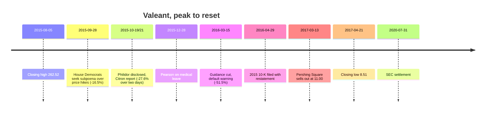

# G8 · Valeant Pharmaceuticals (2015): the roll-up that ran on price and debt

> In August 2015 Valeant was worth about $90 billion. It was one of the best-performing large companies in North
> America, its chief executive was treated as a capital-allocation genius, and some of the most respected hedge funds
> in the world owned it. It had grown revenue about sevenfold in four years, mostly by buying other companies with
> borrowed money, cutting their research budgets and raising the prices of their drugs. Its headline profit measure,
> "cash EPS", was more than four times its GAAP EPS. Twenty months later the shares were down 97%. Most of what went
> wrong could be seen in the company's own filings: how much of its growth came from acquisitions, how much of its
> "organic" growth came from price increases, the gap between adjusted profit and cash, and a balance sheet with
> −$34 billion of tangible equity. One part could not be seen: a captive specialty pharmacy called Philidor. This case
> asks you to separate the two.

| | |
|:--|:--|
| **Period** | 2010–2017, with an epilogue to 2026 |
| **Decision date** | **Wednesday 5 August 2015.** Valeant (NYSE/TSX: VRX) closes at **$262.52**. You have the 2014 10-K, the Q2 2015 10-Q (filed 28 Jul 2015), the Q2 results release (23 Jul 2015) and Pershing Square's 13D (25 Mar 2015). |
| **Sector** | Specialty pharmaceuticals and medical devices (dermatology, eye health, gastro-intestinal, neurology); US GAAP filer, domiciled in Canada |
| **Themes** | Roll-up economics · "cash EPS" and adjusted metrics · decomposing organic growth (acquisitions / FX / price / volume) · leverage · captive distribution and revenue recognition · short sellers · political risk from drug pricing |
| **Modules this case reinforces** | [04.1 Growth analysis](../../04-financial-analysis/01-growth-analysis.md) · [04.4 Cash conversion](../../04-financial-analysis/04-working-capital-and-cash-conversion.md) · [04.5 Leverage](../../04-financial-analysis/05-leverage-solvency-liquidity.md) · [04.7 Quality of earnings](../../04-financial-analysis/07-quality-of-earnings.md) · [05.5 Capital allocation](../../05-business-analysis/05-management-and-capital-allocation.md) · [06.6 Reverse DCF](../../06-valuation/06-reverse-dcf-and-expectations.md) · [08.4 Pharma](../../08-sectors/04-pharma-and-healthcare.md) · [09.2 Revenue red flags](../../09-forensics/02-revenue-red-flags.md) · [11.7 Fundamentals × derivatives](../../11-process/07-fundamentals-meets-derivatives.md) |
| **Difficulty** | Advanced (★★★★☆) |
| **Time** | ~3 hours (spend ~75 minutes on Section 3 before you read on) |

**Conventions.** All amounts are US$ millions unless stated. Valeant's financial year is the calendar year. The
company renamed itself Bausch Health Companies (NYSE: BHC) in July 2018 [25]. The share price series below is a single
series with no splits or cash dividends in 2014–2026 (checked in the price data [31]). Bausch Health still owned about
88% of Bausch + Lomb at the end of 2025, so no B+L shares were handed out to BHC holders [28]. That means price change
equals total shareholder return for this stock.

---

## 1. The scene (as of 5 August 2015)

**The company.** The Valeant of 2015 was put together on 28 September 2010, when Biovail Corporation acquired Valeant
Pharmaceuticals International and took its name [1]. J. Michael Pearson was chairman and CEO. He had run the legacy
Valeant since 2008 [19], and had previously been a senior McKinsey partner (as Citron's report later pointed out [14]).
The legal domicile was British Columbia and the headquarters was in Laval, Quebec [4]. The 2014 10-K says that a
material share of revenue and income was earned in low-tax Ireland, Luxembourg and Switzerland [1]. The 2014 effective
tax rate was 16.5% ($180.4m of tax on $1,092.6m of pre-tax income).

**The strategy, as the 10-K describes it** [1]:

- Focus on "durable" products: mostly cash-pay or privately reimbursed, with established brand names, and **not**
  mainly dependent on patents.
- Run a low-SG&A, decentralised organisation.
- Use a "lower risk, output-focused" R&D model designed to keep R&D spending low. R&D was **3.0% of 2014 revenue**. In
  2014 Pfizer spent 16.9% of revenue on R&D and Merck spent 17.0% [30].
- Keep doing "value-added business development", which in practice meant acquisitions.

The deal list backs this up. Medicis (Dec 2012). Bausch & Lomb (Aug 2013, enterprise value $8.7bn, with more than
$900m of annual cost synergies "substantially achieved by the end of 2014") [1]. Solta and PreCision (2014). A hostile
bid for Allergan in 2014, made alongside Pershing Square, which failed but left Valeant with a net gain of about $287m
[6]. Then 2015: a Marathon Pharmaceuticals portfolio of old hospital drugs, including Isuprel and Nitropress, bought
for $286m on 10 Feb 2015. Dendreon ($415m net). And Salix, bought at $173 a share for $13.1bn of consideration plus
$3.1bn of assumed debt, which closed on 1 April 2015 [4].

**Roll-up** is the name for this model: grow by buying many businesses, strip out their costs, and finance it largely
with debt. For a roll-up the key question is whether each acquisition earns more than it costs, once you count
everything the buyer paid and everything it spent afterwards.

**What the market believed.** Valeant's 10-K opens its performance discussion by saying management judges its success
by total shareholder return [1]. On that measure the record was extraordinary. $100 invested at the end of 2009 was
worth **$1,083** at the end of 2014. The same $100 in the S&P 500 was worth $205, and in Valeant's own peer composite
$377 [1]. The stock then rose another 83% in 2015, from $143.11 at the end of 2014 to $262.52 on the decision date. It
jumped 14.7% on the day the Salix deal was announced (23 Feb 2015) [31]. In March 2015 Pershing Square filed a 13D
showing 19.47m shares (5.7%) bought between February and March at an average of about **$196.72** [23]. The Q2 2015
release called it the fourth quarter in a row of organic growth above 15%. It raised 2015 guidance to **cash EPS of
$11.50–11.80** and adjusted operating cash flow of more than $3.2bn [5].

**Cash EPS** was Valeant's headline non-GAAP measure. It started from GAAP net income and added back amortisation of
acquired intangibles, restructuring and integration costs, acquisition-related items, inventory step-ups, some
financing charges and more. It also replaced the tax expense with cash taxes paid [5].

---

## 2. The numbers then

### 2.1 Five years of the roll-up (US$ m)

| Year (Dec) | 2010 | 2011 | 2012 | 2013 | 2014 |
|:--|--:|--:|--:|--:|--:|
| Revenue | 1,181.2 | 2,427.5 | 3,480.4 | 5,769.6 | 8,263.5 |
| R&D expense | 68.3 | 65.7 | 79.1 | 156.8 | 246.0 |
| R&D as % of revenue | 5.8% | 2.7% | 2.3% | 2.7% | 3.0% |
| Interest expense | 84.3 | 334.5 | 481.6 | 844.3 | 971.0 |
| GAAP net income to shareholders | (208.2) | 159.6 | (116.0) | (866.1) | 913.5 |
| GAAP diluted EPS ($) | (1.06) | 0.49 | (0.38) | (2.70) | 2.67 |
| Cash EPS, company non-GAAP ($) | n/a | 2.93 | 4.51 | 6.24 | 8.34 |
| Cash from operations (CFO) | 263.2 | 640.5 | 656.6 | 1,042.0 | 2,294.7 |
| Capex | 16.8 | 58.5 | 107.6 | 115.3 | 291.6 |
| Cash paid for acquisitions (net) | n.m.¹ | 2,464.1 | 3,485.3 | 5,253.5 | 1,102.6 |
| Total debt | 3,595.3 | 6,651.0 | 11,015.6 | 17,367.7 | 15,254.6 |
| Cash | 394.3 | 164.1 | 916.1 | 600.3 | 322.6 |
| Shareholders' equity | 4,911.1 | 3,929.8 | 3,717.4 | 5,118.7 | 5,312.2 |

¹ In 2010 the Biovail–Valeant merger brought in net cash of $309m.
*Sources:* the five-year table and statements in the 2014 10-K [1], with 2010–2012 R&D, interest and cash-flow lines
from the 2012 and 2013 10-Ks [2][3], and cash EPS from the annual results releases [6][7][8][9]. The 2014 figures are
**as originally reported**. In 2016 they were restated (Section 4).

Revenue grew at a **CAGR of 62.6%** from 2010 to 2014: $(8{,}263.5/1{,}181.2)^{1/4} - 1$. Cash EPS grew 41.7% a year
from 2011 to 2014. Over the same years net debt rose from $3.2bn to $14.9bn, and 2013 also included a $2.3bn equity
issue [1].

### 2.2 "Cash EPS" against actual cash (US$ m)

| Year | GAAP net income | Adjusted ("cash") net income | Gap | CFO | CFO ÷ adjusted NI |
|:--|--:|--:|--:|--:|--:|
| 2011 | 159.6 | 955.1 | 795.5 | 640.5 | 0.67 |
| 2012 | (116.0) | 1,412.0 | 1,528.0 | 656.6 | 0.47 |
| 2013 | (866.1) | 2,043.1 | 2,909.2 | 1,042.0 | 0.51 |
| 2014 | 913.5 | 2,849.8 | 1,936.3 | 2,294.7 | 0.81 |
| **2011–14** | **91.0** | **7,260.0** | | **4,633.8** | **0.64** |

*Sources:* adjusted net income from the reconciliation tables in [7][8][9][6], CFO from [1][2][3].

In the single quarter just before the decision date (Q2 2015), GAAP net income was **−$53.0m** and adjusted net income
was **$897.1m**. That is GAAP EPS of −$0.15 against cash EPS of $2.56 [5]. Of the $950.1m of adjustments, amortisation
of intangibles was $588.2m, restructuring/integration/acquisition costs $152.9m, "other expense" $176.9m (mostly
$165m paid to Salix employees for accelerated restricted stock [4]) and inventory step-up $46.0m [5].

### 2.3 Where the growth came from

**The 2014 revenue walk.** The 10-K's MD&A bridges 2013 revenue to 2014 revenue [1]:

| Component | US$ m | % of 2013 revenue |
|:--|--:|--:|
| 2013 revenue | 5,769.6 | |
| + Revenue from 2013–14 acquisitions | 2,279.9 | 39.5% |
| + Other revenues | 30.6 | 0.5% |
| − Divestitures, discontinuations, supply interruptions | (322.8) | (5.6%) |
| − FX on the existing business | (164.5) | (2.9%) |
| + Growth of the existing business ("organic") | 670.7 | 11.6% |
| **2014 revenue** | **8,263.5** | **43.2%** |

The same MD&A says that growth outside acquisitions came from both price and volume, with slightly more than half
from price. In Developed Markets most of the growth came from price. In Emerging Markets almost all of it came from
volume [1].

**Q2 2015 organic growth, using the company's own definitions** (product sales, US$ m) [5]:

| Segment | Q2-15 reported | − Acquired (<1 yr) | Q2-15 same-store | Q2-14 | Divest./discont. | FX (same-store) | Same-store growth | Pro-forma growth |
|:--|--:|--:|--:|--:|--:|--:|--:|--:|
| Total US | 1,822.8 | 533.7 | 1,289.1 | 1,016.7 | 42.9 | — | 32% | 21% |
| Total company | 2,695.5 | 559.4 | 2,136.1 | 1,994.1 | 53.1 | 165.7 | 19% | 15% |

Two definitions to learn. **Same-store** growth counts only businesses owned for at least a year:
(current sales − acquisitions + FX) ÷ (prior-year sales − divestitures) − 1. **Pro-forma** growth counts everything,
including acquisitions, by adding the acquired businesses' prior-year sales to the base [5].

**The gross-to-net squeeze.** **Gross-to-net** is the gap between list-price (gross) sales and the net sales a drug
company actually books after rebates, chargebacks, returns, co-pay assistance and discounts [1][4]:

| Period | 2012 | 2013 | 2014 | H1 2015 | Q2 2015 |
|:--|--:|--:|--:|--:|--:|
| Provisions ÷ gross product sales | 19.1% | 28.1% | 30.1% | 32.9% | 32.1% |

The filings name the drivers. They are higher rebates and returns, co-pay assistance programmes for launches such as
Jublia, higher managed-care rebates, and higher government rebate percentages [1][4]. The 2014 10-K's
critical-accounting section also links the deeper discounts to the price increases taken in each of the last three
years [1].

### 2.4 Balance sheet and valuation at the decision date

| Item (30 Jun 2015 balance sheet; price at 5 Aug 2015) | Value |
|:--|--:|
| Total debt (incl. current portion) | $30,881.1m |
| Cash | $958.0m |
| **Net debt** | **$29,923.1m** |
| Goodwill + intangible assets | $40,382.8m (83.5% of total assets of $48,343.2m) |
| Shareholders' equity | $6,435.4m |
| **Tangible equity** (equity − goodwill − intangibles) | **($33,947.4m)** |
| Q2 2015 interest expense (annualised) | $412.7m ($1,650.8m) |
| Shares outstanding (22 Jul 2015) | 342.8m |
| Share price | $262.52 |
| **Market capitalisation** | **≈ $90.0bn** |
| **Enterprise value** (market cap + net debt) | **≈ $119.9bn** |
| Price ÷ 2015 cash-EPS guidance midpoint ($11.65) | 22.5× |
| Price ÷ 2014 GAAP diluted EPS ($2.67) | 98.3× |
| Price ÷ book value per share | 14.0× |

*Sources:* Q2 2015 10-Q [4], Q2 release [5], price data [31]. Arithmetic: $262.52 × 342.79m = $89,989m, and
$89,989m + $29,923m = $119,912m.

**Derived ratios (all calculations checked in Python):**

- **EBITDA proxy for 2014** = operating income 2,039.7 + D&A 1,737.6 + restructuring 381.7 + IPR&D 41.0 + acquisition
  costs 6.3 − contingent-consideration gain 14.1 − other income 268.7 = **$3,923.5m**. Net debt ÷ EBITDA =
  14,932.0 ÷ 3,923.5 = **3.8×**. Management quoted about 3.5× on a *pro-forma* basis [6]. EBIT ÷ interest = 2,039.7 ÷
  971.0 = **2.1×**.
- **Run-rate EBITDA proxy for Q2 2015** = revenue 2,732.4 − (COGS 669.9 − step-up 46.0) − cost of other revenues 15.2 −
  SG&A 685.5 − R&D 81.1 = **$1,326.7m**. That is a 48.6% margin, or $5,306.8m annualised. Net debt ÷ annualised EBITDA
  = **5.6×**. Q2 EBITDA ÷ Q2 interest = **3.2×**. EV ÷ annualised EBITDA = **22.6×**.
- **CFO ÷ GAAP net income (2014)** = 2,294.7 ÷ 912.2 = 2.5×. That looks excellent until you compare CFO with the
  *adjusted* profit that management asked you to value, which gives 0.81× (Table 2.2).

---

## 3. You are the analyst

Answer these using **only** what is in Sections 1–2, i.e. what was public on 5 August 2015. Write your answers down
before you read Section 4.

1. **(Numerical: growth decomposition.)** Using the 2014 revenue walk, work out organic growth on the continuing base
   (exclude divestitures and FX). If "slightly more than half" of it came from price, roughly how many percentage
   points of 2014 growth were price? How large was acquired revenue compared with organic revenue growth?
2. **(Numerical: organic-growth definitions.)** Recompute Q2 2015 same-store and pro-forma growth from the table. Why is
   pro-forma lower than same-store? What should a US same-store growth rate of 32% make you ask about a portfolio of
   mostly mature, often off-patent brands backed by R&D of 3% of sales?
3. **(Numerical: adjusted-metric scepticism.)** Sort the Q2 2015 adjustments into three groups: (a) truly non-cash and
   non-recurring, (b) non-cash but economically real, (c) cash costs that recur for a serial acquirer. Then use Table 2.2
   to explain what the "cash" in cash EPS measures.
4. **(Numerical: roll-up economics.)** For 2011–14, compare cumulative cash spent on acquisitions with cumulative
   free cash flow (CFO − capex). Then compute (R&D + acquisitions) ÷ revenue for 2011–14 and for 2014 alone, and compare
   it with big-pharma R&D intensity. Did Valeant really avoid paying for innovation?
5. **(Numerical: leverage and equity convexity.)** Using the Q2 2015 run-rate EBITDA proxy and net debt, what is the
   price per share if EBITDA falls 20% and the EV/EBITDA multiple falls to 12×? By what percentage does the enterprise
   value fall, and by what percentage does the equity fall?
6. **(Numerical: reverse DCF.)** At $90.0bn of market cap, a 9% cost of equity and 3% terminal growth, what annual
   growth in free cash flow to equity over 10 years does the price imply if the starting FCFE is (a) $2.9bn (adjusted
   CFO guidance of more than $3.2bn, less about $0.3bn of capex) or (b) $4.09bn (cash-EPS guidance midpoint × 350.9m
   diluted shares)?
7. **(Red-flag test.)** Interpret the gross-to-net trend from 19% to 32%. Is it evidence against Valeant, or just a
   normal feature of US pharma?
8. **(Reading the notes.)** The 2014 10-K and the 2015 10-Qs mention, in one line inside the acquisitions note, "the
   consolidation of variable interest entities" described as not material [1][4]. What questions would you put to
   management?
9. **(Judgement.)** Write the strongest bull case in three bullets, then list three *thesis-breakers*, meaning facts
   that would prove you wrong, that you could track every quarter.

---

## 4. What happened

| Date | Event | Source |
|:--|:--|:--|
| 27 Sep – 2 Oct 2015 | Citron publishes reports on Valeant's price increases and its definition of organic growth. Veritas publishes a report on 1 Oct. Valeant rebuts both point by point on 6 Oct, saying for example that a 20% list-price rise on Jublia gave only a 2% net price increase. | [11] |
| 28 Sep 2015 | 18 Democrats on the House Oversight Committee ask for a subpoena over price increases on Isuprel (+525%) and Nitropress (+212%), two heart drugs bought from Marathon in February. VRX falls 16.5% and the Nasdaq Biotech index 6%. The same day Pearson writes to employees that the plan for these two drugs had been to reprice them, that they sit outside same-store growth, and that the business does not depend on price. | [15][10][31] |
| Oct 2015 | Subpoenas from the US Attorney's Offices for Massachusetts and the Southern District of New York, covering patient-assistance programmes, Philidor and pricing. | [22] |
| 19 Oct 2015 | Q3 results: same-store organic growth 13%. The release splits growth for the first time: total company 8.2% volume and 4.4% price; US branded pharma 18.8% volume and 15.2% price. On the call, management discloses an option to buy **Philidor Rx Services**, a specialty mail-order pharmacy. A Southern Investigative Reporting Foundation article on Philidor comes out the same morning. | [12][14] |
| 21 Oct 2015 | Citron report, *"Valeant: Could this be the Pharmaceutical Enron?"*, price target $50. It **alleges** that Philidor and R&O Pharmacy share management and that Valeant built a network of "phantom" captive pharmacies to book sales. Citron says it is short. VRX closes down 19.2% after touching an intraday low of $88.50. | [14][31] |
| 26 Oct 2015 | Q3 10-Q: Philidor has been consolidated as a **variable interest entity** since the purchase option of 15 Dec 2014 and made up about **7% of Q3 revenue** (about $195m of $2,786.8m). The board sets up an ad hoc committee. | [13][12] |
| Late Oct – 1 Nov 2015 | Valeant cuts all ties with Philidor, effective 1 Nov. | [22] |
| Nov 2015 | Senate Special Committee on Aging begins document requests (18 Nov: SEC subpoena). Pershing Square adds to its stake and reaches 9.9% including options. | [22][24] |
| Dec 2015 | Walgreens fulfilment agreement, with list prices of certain dermatology and ophthalmology drugs cut by about 10% on average. 28 Dec: Pearson goes on medical leave (severe pneumonia). 6 Jan 2016: former CFO Howard Schiller named interim CEO. | [22][16][17] |
| 4 Feb 2016 | Schiller testifies before the House Oversight Committee. | [22] |
| 15 Mar 2016 | Preliminary Q4 2015: GAAP EPS −$0.98, "adjusted EPS" $2.50 (the "cash EPS" label has gone). 2016 guidance cut: revenue $11.0–11.2bn (from $12.5–12.7bn), adjusted EBITDA $5.6–5.8bn (from $6.9–7.1bn). The company warns that a late 10-K could lead to notices of default and cross-acceleration on its notes. **VRX −51.5% to $33.51.** | [18][31] |
| 21 Mar 2016 | Item 4.02 non-reliance: the 2014 and Q1 2015 financial statements can no longer be relied on. Search for a new CEO. Bill Ackman joins the board. | [19] |
| 12 & 22 Apr 2016 | Noteholders send notices of default. The 10-K filed on 29 Apr cures them. | [20][22] |
| 25–27 Apr 2016 | Joseph Papa (ex-Perrigo) named chairman and CEO. On 27 Apr, Pearson, Schiller and Ackman testify before the Senate Aging Committee. | [21][22] |
| 29 Apr 2016 | 2015 10-K. **Findings:** revenue from H2 2014 sales to Philidor was recognised too early, cutting 2014 revenue by about $58m and net income by about $33m. The company says the pre-option deals included unusually large orders with extended payment terms and higher prices. It reports material weaknesses, including the **tone at the top**, a performance culture in which hitting demanding targets was a key expectation, and says the former CFO and former controller acted improperly. The same 10-K shows that in 2015 about a quarter of the $2.12bn of acquired-product growth came from post-acquisition price increases, and that growth in the existing US-led business came from pricing with volume essentially flat. | [22] |
| 13 Mar 2017 | Pershing Square sells 18.1m shares at $11.00 and unwinds options on another 9.12m shares. | [24] |
| 13 Jul 2018 | Renamed **Bausch Health Companies**. | [25] |
| 16 Dec 2019 | Agrees to pay $1.21bn to settle the US securities class action, admitting no liability and subject to court approval. | [26] |
| 31 Jul 2020 | **SEC settlement:** $45m penalty for improper revenue recognition and misleading disclosures, including same-store organic growth that the SEC says came largely from Philidor sales, and revenue from a roughly 500% price increase on one drug that was spread across more than 100 unrelated products. Pearson pays $250k, Schiller $100k and former controller Tanya Carro $75k, all without admitting or denying the findings. | [27] |

**Share-price outcome from the decision date** (VRX/BHC closing prices; SPY total return for comparison) [31]:

| Horizon | Date | VRX/BHC | Change | SPY total return |
|:--|:--|--:|--:|--:|
| Decision date | 5 Aug 2015 | $262.52 | — | — |
| ~5 months | 31 Dec 2015 | $101.65 | −61.3% | |
| ~7 months | 15 Mar 2016 | $33.51 | −87.2% | |
| 1 year | 5 Aug 2016 | $21.96 | −91.6% | +6.1% |
| Low of the crisis | 21 Apr 2017 | $8.51 | −96.8% | |
| 3 years | 6 Aug 2018 | $22.50 | −91.4% | +43.9% |
| 5 years | 5 Aug 2020 | $19.46 | −92.6% | +74.6% |
| 10 years | 5 Aug 2025 | $5.94 | −97.7% | +254.6% |
| Latest | 18 Sep 2026 | $5.67 | −97.8% | +336.0% |

The operating decline was slow; the equity decline was not. Revenue went from $10.4bn (2015) to $9.7bn (2016) and
$8.7bn (2017). Net losses were $2.4bn in 2016 and $4.1bn in 2018, the latter after a $2.3bn goodwill impairment. Debt
peaked at **$31.1bn** at the end of 2015 and was still **$20.8bn** at the end of 2025 [29][22].

**Pershing Square's round trip**, rebuilt from its 13D trading exhibits [23][24]. Pershing bought 28.4m shares in
total (19.47m at about $196.72 in Feb–Mar 2015, about 3.9m in Oct–Nov 2015 and 5.0m at about $94.77 in Feb 2016). All
28.4m were sold at an average of about $33.26, including 5.1m sold in December 2015 to realise tax losses for its US
funds. The reported share trades net to **−$3.77bn**. The option overlays net to another **−$0.52bn**. The largest
was a synthetic long position, long $60 calls and short $60 puts expiring January 2019, that had to be bought back at
$47.65 per put. The total realised cash result is **≈ −$4.3bn** before fees and financing. This is our reconstruction.
Press estimates depend on method and have ranged from about $2.8bn to $4bn [32].

---

## 5. Signals: what you could know then versus what only hindsight shows

!!! warning "Guard against hindsight bias"
    You know how the story ended, so every flag below will look obvious. It was not obvious at the time. In August
    2015 the same data supported a respectable bull case, which is set out below, and the case was held by some of
    the most careful investors in the market. The honest test is not whether the bear case was right. The test is
    whether the evidence available then was enough to refuse to pay 22.5× adjusted earnings with 5–6× leverage, and
    how much of the eventual loss that refusal would have avoided.

| Knowable on 5 Aug 2015 (from filings) | Visible only later |
|:--|:--|
| Growth came mainly from acquisitions: $2.28bn acquired against $0.67bn organic in 2014, and cash acquisitions were 3.0× cumulative FCF over 2011–14. | Philidor was named, and it was ~7% of Q3 2015 revenue (Oct 2015). |
| The 10-K said that slightly more than half of organic growth came from price, and most of it in Developed Markets. | Only in the 2015 10-K (Apr 2016) did the company say volume was essentially flat in 2015 and that ~25% of acquired growth came from price increases. |
| Gross-to-net rose from 19% to 32% in three years, with co-pay assistance named as a driver. | The SEC's findings that Philidor drove much of the same-store growth, and that revenue from a ~500% price rise was spread across 100+ unrelated products (2020). |
| Adjusted net income was 1.6× CFO over 2011–14, and restructuring costs recurred every year ($1.11bn over 2012–14). | Revenue recognised too early on H2 2014 sales to Philidor, and the "tone at the top" finding (2016). |
| $30.9bn of debt, −$34bn of tangible equity, ~5.6× run-rate net debt/EBITDA, 3.2× interest cover. | Pearson's illness, and the loss of pricing power once the Walgreens deal was signed. |
| R&D at 3% of sales, a business model built on price increases, and the Isuprel and Nitropress increases (taken in February 2015 and later confirmed by the company). | When political pressure would arrive, and how severe it would be (Sep 2015 – Apr 2016). |
| A one-line, "not material" mention of consolidated variable interest entities. | That the VIE was a captive pharmacy, and the R&O dispute. |

**The strongest bull case at the time.** A fair analyst could have argued:

- The portfolio really was durable. Cash-pay and privately reimbursed brands in dermatology and eye care, contact
  lenses and consumer products gave diversified cash flows that did not depend on patents [1].
- Management could integrate. B&L's $900m+ of synergies were achieved on schedule, debt was *reduced* by $2.1bn in 2014,
  and net leverage came down to about 3.5× pro forma [1][6].
- Organic growth of 13% in 2014 and 19% in Q2 2015 was strong by the standards of mature pharma. The Emerging Markets
  growth was volume-led [1][5].
- At 22.5× cash EPS, against cash EPS growth of 34% in 2014 and guidance implying about 40% in 2015, the PEG was
  below 1. The low tax rate was a structural advantage [1][6].
- Owners such as Pershing Square had studied the company closely, and management was paid for total shareholder
  return.

Each point was defensible. What the bull case had to assume was that price-led growth could continue, that "cash EPS"
roughly equalled owner earnings, and that leverage of 5× or more was safe for a business whose revenue depended on
decisions by payers and politicians. Those three assumptions were where the risk sat.

!!! tip "Trader's lens: leveraged equity is a call option on the enterprise"
    Between 5 Aug 2015 and 15 Mar 2016, Valeant's enterprise value fell from about $119.9bn to about $42.0bn, a drop of
    **65%**. The equity fell **87%**, from $262.52 to $33.51. Net debt of about $30bn stayed where it was, so the equity
    behaved like a deep call on EV with a strike near $30bn. In Question 5, a moderate enterprise shock (EBITDA −20%,
    multiple from 22.6× to 12×) takes EV down 58% and the equity down 77%. At a 22.6× EV/EBITDA multiple the market
    was charging a very high implied volatility on the multiple, and the leverage multiplied it.

---

## 6. Lessons

1. **Break growth into its parts before you pay for it.** Split it into acquisitions, divestitures, FX, price and
   volume. Only volume growth on an unchanged portfolio shows customers choosing the product. Price growth for an old
   drug is a lever that can only be pulled so many times. → [04.1 Growth analysis](../../04-financial-analysis/01-growth-analysis.md),
   [08.4 Pharma](../../08-sectors/04-pharma-and-healthcare.md)
2. **In a roll-up, acquisitions are the capex and the R&D.** If the business replaces its decaying products by buying
   new ones, amortisation of acquired intangibles is an economic cost and acquisition cash is reinvestment. "Cash EPS"
   that adds back the first and ignores the second is not owner earnings. → [04.7 Quality of earnings](../../04-financial-analysis/07-quality-of-earnings.md),
   [05.5 Capital allocation](../../05-business-analysis/05-management-and-capital-allocation.md)
3. **Test adjusted profit against cash.** Adjusted net income of $7.26bn against CFO of $4.63bn over four years is a
   0.64 conversion ratio, which is a flag on its own. Restructuring costs that recur every year are operating costs.
   → [04.4 Cash conversion](../../04-financial-analysis/04-working-capital-and-cash-conversion.md),
   [09.1 Why numbers lie](../../09-forensics/01-why-and-how-numbers-lie.md)
4. **Leverage turns a business problem into an equity wipe-out.** With −$34bn of tangible equity and more than 5×
   net debt/EBITDA, a 20% fall in EBITDA plus a re-rating was enough to take the stock down 77% (Question 5). Covenants
   and reporting deadlines can make things worse, as the March 2016 default notices showed. →
   [04.5 Leverage](../../04-financial-analysis/05-leverage-solvency-liquidity.md),
   [06.8 Margin of safety](../../06-valuation/08-margin-of-safety-and-expected-value.md)
5. **Pricing power is not a moat when the payer can go to a legislator.** Being able to raise prices sharply on
   inelastic products shows how exposed they are to regulation and politics, not that they are protected. The
   gross-to-net gap tells you how hard payers are pushing back. →
   [05.2 Industry analysis](../../05-business-analysis/02-industry-analysis.md),
   [05.3 Moats](../../05-business-analysis/03-moats-and-competitive-advantage.md)
6. **Follow the channel and the consolidation notes.** How and when revenue is recognised (on sell-in or on
   sell-through), who the distributor is, and why a manufacturer consolidates a customer are revenue-quality questions.
   A "not material" VIE line deserves one question on every call. →
   [02.2 Revenue recognition](../../02-accounting/02-accrual-accounting-and-revenue-recognition.md),
   [02.8 Group accounts](../../02-accounting/08-deeper-cuts-group-accounts-and-other.md),
   [09.2 Revenue red flags](../../09-forensics/02-revenue-red-flags.md)
7. **Incentives and tone decide how the numbers are produced.** A culture built on hitting demanding targets, with pay
   tied to share-price return, is the fraud triangle's "pressure" leg. Short-seller reports are allegations. Check
   their claims against filings, and do not wave them away. →
   [09.5 Governance red flags](../../09-forensics/05-governance-red-flags-india.md),
   [05.6 Governance](../../05-business-analysis/06-corporate-governance-india.md)
8. **Smart-money ownership is not a thesis. Size positions for when your thesis is broken.** Averaging down with
   synthetic leverage while credit quality is deteriorating turns one mistake into two. →
   [11.4 Position sizing](../../11-process/04-position-sizing-and-portfolio-construction.md),
   [11.6 Behavioural finance](../../11-process/06-behavioural-finance-and-decision-journals.md)

!!! info "India notes"
    The same checks work on Indian filings. Many Indian companies present "adjusted PAT", "cash PAT" or "EBITDA before
    ESOP costs" alongside their Ind AS numbers. Rebuild the bridge line by line and compare it with CFO over several
    years. For acquisitive companies (pharma, specialty chemicals, consumer brands, hospital chains), work out organic
    growth from the segment and acquisition notes rather than taking management's number. Read the subsidiary and
    associate disclosures (AOC-1) and the related-party note with the same suspicion you would bring to a US VIE line.
    The rules on drug pricing in India are different and are covered in [08.4](../../08-sectors/04-pharma-and-healthcare.md).
    The lesson that carries over is that growth which depends on price increases carries regulatory risk.

---

## 7. Model answers

Q1: 2014 growth decomposition

Continuing base = 5,769.6 − 322.8 = 5,446.8. Organic growth excluding FX = 670.7 ÷ 5,446.8 = **12.3%**. The company
reported 13% same-store; the definitions differ slightly. Including the FX drag: (670.7 − 164.5) ÷ 5,446.8 = 9.3%.

If a little over half was price, price ≈ 0.5 × 670.7 ≈ **$335m**, or about **6.2 points** of growth on the continuing
base. Volume and mix were at most another ~6 points. Acquired revenue of $2,279.9m was **3.4×** the organic increment.
So of the 43.2% headline growth, roughly 39.5 points were bought, about 6 came from price, about 6 from volume, and
the rest was FX and divestitures. The Developed Markets split (mostly price) matters most, because that is where
margins and valuation were concentrated.

Q2: Same-store against pro-forma

Same-store = (2,136.1 + 165.7) ÷ (1,994.1 − 53.1) − 1 = 2,301.8 ÷ 1,941.0 − 1 = **18.6% ≈ 19%**.
Pro-forma = (2,695.5 + 165.7 + 3.7) ÷ (2,547.9 − 53.1) − 1 = 2,864.9 ÷ 2,494.8 − 1 = **14.8% ≈ 15%**.
US same-store = 1,289.1 ÷ (1,016.7 − 42.9) − 1 = **32.4%**.

Pro-forma is lower because the newly acquired businesses, mainly Salix, grew more slowly. Salix was also working
wholesaler inventory down from 4–5 months to 3–3.5 months [5]. That makes the legacy portfolio's 32% US growth the
central puzzle. Mature dermatology and neurology brands, with R&D at 3% of sales, do not normally grow 32% on volume.
The questions to ask: how much of it is price, how much is new launches (Jublia, Onexton), how much is a change of
channel, and how much depends on co-pay subsidies? Same-store growth also leaves out repricing of drugs bought within
the last 12 months, so it can hide the buy-and-reprice economics entirely. Pearson made this point about Isuprel and
Nitropress on 28 Sep [10]. (Hindsight: the SEC later found that much of the five quarters of double-digit same-store
growth came from sales through Philidor [27].)

Q3: What "cash" EPS measured

- **(a) Truly non-cash and non-recurring:** inventory step-up ($46.0m). This is an accounting unwind of acquisition
  fair-value adjustments.
- **(b) Non-cash but economically real:** amortisation of acquired intangibles ($588.2m, 62% of the adjustments).
  Valeant's products decay through generic competition and ageing, and the company replaces them by buying new ones.
  Amortisation is the accounting cost of that decay. Adding it back is only fair if you then subtract acquisition
  spending as the equivalent of capex.
- **(c) Cash and recurring for a serial acquirer:** restructuring, integration and acquisition costs ($152.9m in the
  quarter; $1,110.8m over 2012–14 against cumulative GAAP operating income of $1,709.9m), and the $165m of accelerated
  Salix stock compensation paid in cash inside "other expense".

Table 2.2 then shows that CFO covered only **64%** of adjusted net income over 2011–14, with a low of 0.47 in 2012.
"Cash EPS" measured earnings before acquisition costs and amortisation, with cash rather than book taxes. It was not
cash earnings. A useful rule: when an adjusted metric beats GAAP every year and by a growing amount, the adjustments are
part of how the business works, not one-offs.

Q4: Roll-up economics

Over 2011–14: cash acquisitions $12,305.5m (not counting the $4.26bn of B&L debt assumed without cash in 2013)
against FCF of $4,060.8m (CFO 4,633.8 − capex 573.0). **FCF after acquisitions was −$8,244.7m.** It was funded by
$11.7bn more debt (2010 to 2014) and a $2.3bn equity issue.

(R&D + acquisitions) ÷ revenue for 2011–14 = (547.6 + 12,305.5) ÷ 19,941.0 = **64.5%**, against 2.7% for R&D alone.
For 2014 alone, adding intangibles purchases: (246.0 + 1,102.6 + 179.0) ÷ 8,263.5 = **18.5%**. That is about what
Pfizer (16.9%) and Merck (17.0%) spent on R&D. Valeant did not skip paying for its future revenue. It paid through
M&A, largely with debt, and that spending sat outside both "cash EPS" and CFO. The value question is whether those
acquisitions earned more than their cost of capital *after* the price increases that made them work could be
challenged.

Q5: Leverage and equity convexity

Run-rate EBITDA = $5,306.8m. After a 20% fall: $4,245.4m. At 12×, EV = $50,945m. Less net debt of $29,923m, equity =
$21,022m, or $21,022m ÷ 342.8m = **$61.33 per share (−76.6%)**. EV falls from $119,912m to $50,945m (**−57.5%**). At
10×, the price would be $36.56 (−86.1%).

This is the equity-as-a-call point: most of the damage comes from the multiple and the leverage, not from the operating
hit. If you give management credit for normalised 2016 EBITDA of $6.5bn or $7.5bn, net leverage comes out at 4.6× or
4.0×. That is lower, but it is still high for cash flows that depend on price. (Hindsight: in March 2016 the 2016
adjusted EBITDA guidance became $5.6–5.8bn and the stock traded at $33.51.)

Q6: Reverse DCF

The equity is valued as ten years of FCFE growing at *g*, then a Gordon terminal value at 3%, discounted at *r*. Solve
for *g* such that value = $89,989m.

| Starting FCFE | r = 8% | r = 9% | r = 10% |
|:--|--:|--:|--:|
| $2.9bn (adjusted CFO − capex) | 8.2% | **10.7%** | 13.1% |
| $4.09bn (cash-EPS basis) | 3.8% | **6.3%** | 8.4% |

At 9% and a $2.9bn start, FCFE must reach about $8.0bn by year 10, and 65% of the value sits in the terminal value. The
perpetual growth rate implied with no explicit period is (P·r − F)/(P + F) = 5.6%. Even on management's own cash-EPS
base, the price needs 6.3% growth a year for ten years, from a portfolio of old brands with price-led organic growth,
**without further acquisitions**. If the growth instead comes from more acquisitions, each deal must earn more than
its cost of capital, and the acquisition spending has to be subtracted from FCFE. The 10.7% figure already assumes
those deals are free. The market was pricing in continued repricing power and continued deal-making at good returns.
Neither was in the base cash flow.

Q7: The gross-to-net trend

A widening gross-to-net gap is common in US branded pharma: list prices rise and rebates rise with them. Valeant made
exactly that argument in October 2015, when it said a 20% gross price increase on Jublia gave only 2% net [11]. But the
*speed* here (19% to 32% in three years) together with the filings' own explanations (co-pay assistance, managed-care
rebates, higher government rebate rates) tells you three things. List prices were rising much faster than net prices.
Payers were pushing back. And a growing share of revenue depended on subsidy programmes and reserve estimates: the
10-K says a 1% change in Medicaid volume alone moves pre-tax earnings by about $48m [1]. That is not proof of
wrongdoing. It is a measure of how dependent revenue was on price, and it should have made you discount the organic
growth figure.

Q8: The VIE line

Questions to ask: What are the VIEs, and why is Valeant their primary beneficiary (an option, financing, guarantees)?
How much revenue flows through them? Is revenue recognised when product ships to them (sell-in) or when they dispense
to patients (sell-through)? Were there sales to them *before* consolidation, and on what terms and payment periods?
Who owns them, and do any Valeant employees work there? A manufacturer consolidating a pharmacy raises questions about
channel control and revenue timing. (Hindsight: this was Philidor, consolidated from 15 Dec 2014 and about 7% of Q3
2015 revenue. Pre-option sales in H2 2014 were later restated [13][22].)

Q9: Bull case, thesis-breakers and monitoring

The bull case is in Section 5. Examples of **thesis-breakers** you could track every quarter:

1. The price/volume split. If price is more than half of US organic growth for two quarters running, or volume turns
   flat, the "durable franchise" claim fails.
2. Cash conversion. If CFO divided by adjusted net income stays below about 0.8, or restructuring costs appear in
   every quarter, "cash EPS" is not owner earnings.
3. Leverage. If net debt/EBITDA is not falling toward management's target within 12–18 months of Salix, or covenant
   headroom narrows, the equity is running on leverage.

Also monitor: the gross-to-net ratio, how much revenue goes through specialty pharmacies, government and political
scrutiny of individual price increases, management and auditor changes, and the gap between GAAP and non-GAAP numbers.

---

## 8. Discussion questions and extensions

1. **Serial acquirers that work.** Some serial acquirers have compounded value for decades. Using this course's tools
   (incremental ROIC, FCF after acquisitions, organic growth split by price and volume), write down three measurable
   differences you would expect between a good compounder and Valeant. Test them on one acquisitive Indian listed
   company using its last five annual reports.
2. **Reading a short report.** Citron's Oct 2015 report combined verifiable observations (shared phone numbers and
   privacy notices across pharmacies) with a strong conclusion ("phantom" sales). Build a template that separates the
   *facts alleged*, the *inference* and the *filing evidence that would confirm or refute each point*. What did the
   2016 restatement and the 2020 SEC order confirm, and what did they not address?
3. **Options autopsy.** Pershing moved from selling $160–200 puts to enter (Feb–Mar 2015), to a leveraged 95/165 call
   spread financed by short $60 puts (Nov 2015), to a synthetic long at $60 expiring 2019 (Jun 2016). Map each
   structure's delta and its exposure to the downside tail. At what point would a Kelly-style sizing rule have forced a
   cut? → [11.7](../../11-process/07-fundamentals-meets-derivatives.md)
4. **Monitoring today.** Choose a current high-multiple company whose growth depends on price (any sector, any market).
   Draft a one-page quarterly monitor: the five numbers you would pull, where each appears in the filings, and the
   threshold that would make you sell.
5. **Compare cases.** How does Valeant differ from [Enron (G4)](04-enron-2001.md) and
   [Wirecard (G9)](09-wirecard-2020.md) in what was fabricated, what was aggressive but disclosed, and what was simply a
   fragile model? Which of the three offered the most early warning in its own filings?

---

## Sources

All accessed 21 Sep 2026. EDGAR documents were retrieved from sec.gov (CIK 885590) and financial tables were read
directly from the filings.

1. Valeant Pharmaceuticals International, **Form 10-K for FY2014** (filed 25 Feb 2015): five-year selected data, MD&A revenue walk, gross-to-net table, strategy, TSR graph, financial statements. <https://www.sec.gov/Archives/edgar/data/885590/000088559015000015/valeant2014form10-k.htm>
2. Valeant, **Form 10-K for FY2013** (filed 28 Feb 2014): 2011–12 R&D, interest, cash flows. <https://www.sec.gov/Archives/edgar/data/885590/000088559014000025/valeant2013form10-k.htm>
3. Valeant, **Form 10-K for FY2012** (filed 28 Feb 2013): 2010 R&D, interest, CFO, capex. <https://www.sec.gov/Archives/edgar/data/885590/000088559013000014/valeant2012form10-k.htm>
4. Valeant, **Form 10-Q for Q2 2015** (filed 28 Jul 2015): balance sheet at 30 Jun 2015, Salix/Marathon/Dendreon terms, gross-to-net, revenue walk. <https://www.sec.gov/Archives/edgar/data/885590/000088559015000064/valeantq22015.htm>
5. Valeant, **Q2 2015 results release**, 8-K Ex. 99.1 (23 Jul 2015): cash EPS reconciliation, guidance, organic-growth table and definitions. <https://www.sec.gov/Archives/edgar/data/885590/000119312515260449/d59791dex991.htm>
6. Valeant, **Q4/FY2014 results release**, 8-K Ex. 99.1 (22–23 Feb 2015): 2014 cash EPS $8.34, adjusted net income, ~3.5× pro-forma leverage, Allergan gain. <https://www.sec.gov/Archives/edgar/data/885590/000119312515057094/d878365dex991.htm>
7. Valeant, **FY2011 results release** (8-K, 27 Feb 2012): 2011 cash EPS $2.93, adjusted income $955.1m. <https://www.sec.gov/Archives/edgar/data/885590/000119312512079914/d307149dex991.htm>
8. Valeant, **FY2012 results release** (8-K, 28 Feb 2013): 2012 cash EPS $4.51, adjusted income $1,412.0m. <https://www.sec.gov/Archives/edgar/data/885590/000119312513082032/d493837dex991.htm>
9. Valeant, **FY2013 results release** (8-K, 27 Feb 2014): 2013 cash EPS $6.24. <https://www.sec.gov/Archives/edgar/data/885590/000119312514070983/d684472dex991.htm>
10. Valeant, **letter from J. Michael Pearson to employees**, 8-K Ex. 99.1 (28 Sep 2015). <https://www.sec.gov/Archives/edgar/data/885590/000119312515329827/d30841dex991.htm>
11. Valeant, **"Valeant Corrects Misleading Reports"**, 8-K Ex. 99.1 (6 Oct 2015): references to the Citron (27 Sep, 2 Oct) and Veritas (1 Oct) reports. <https://www.sec.gov/Archives/edgar/data/885590/000119312515337744/d83478dex991.htm>
12. Valeant, **Q3 2015 results release** (19 Oct 2015): price/volume split, same-store 13%, Q3 revenue $2,786.8m. <https://www.sec.gov/Archives/edgar/data/885590/000119312515346156/d29357dex991.htm>
13. Valeant, **Form 10-Q for Q3 2015** (filed 26 Oct 2015): Philidor VIE disclosure (~7% of Q3 revenue), ad hoc committee, class actions. <https://www.sec.gov/Archives/edgar/data/885590/000088559015000077/valeantq32015.htm>
14. Citron Research, **"Valeant: Could this be the Pharmaceutical Enron?"** (21 Oct 2015): allegations, the author's short disclosure, references to the SIRF article. <http://citronresearch.com/wp-content/uploads/2015/10/Valeant-Philador-and-RandO-final-a.pdf>
15. Fortune, "Biotech stocks dive as lawmakers take aim at Valeant for drug price hikes" (28 Sep 2015). <https://fortune.com/2015/09/28/democrats-valeant-questioning-drug-prices/>
16. Valeant, 8-K (30 Dec 2015) and Ex. 99.1 (28 Dec 2015): Pearson's medical leave. <https://www.sec.gov/Archives/edgar/data/885590/000134100415000969/form8k.htm>
17. Valeant, 8-K (6 Jan 2016): Howard Schiller appointed interim CEO. <https://www.sec.gov/Archives/edgar/data/885590/000134100416000982/form8k.htm>
18. Valeant, 8-K (15 Mar 2016) and Ex. 99.1: preliminary Q4 2015, new 2016 guidance, default-risk language. <https://www.sec.gov/Archives/edgar/data/885590/000119312516504187/d135599d8k.htm> · <https://www.sec.gov/Archives/edgar/data/885590/000119312516504187/d135599dex991.htm>
19. Valeant, 8-K (21 Mar 2016), Item 4.02 non-reliance, and Ex. 99.1 (CEO search, Ackman joins board). <https://www.sec.gov/Archives/edgar/data/885590/000119312516511157/d164248d8k.htm> · <https://www.sec.gov/Archives/edgar/data/885590/000119312516511157/d164248dex991.htm>
20. Valeant, 8-K (25 Apr 2016): notices of default dated 12 and 22 Apr 2016. <https://www.sec.gov/Archives/edgar/data/885590/000134100416001329/valeant8k.htm>
21. Valeant, 8-K (27 Apr 2016): appointment of Joseph C. Papa. <https://www.sec.gov/Archives/edgar/data/885590/000134100416001356/form8-k.htm>
22. Valeant, **Form 10-K for FY2015** (filed 29 Apr 2016): restatement, material weaknesses and tone at the top, Philidor termination, Walgreens, investigations and hearings, 2015 price/volume commentary, year-end balance sheet. <https://www.sec.gov/Archives/edgar/data/885590/000088559016000101/valeant2015form10-k.htm>
23. Pershing Square Capital Management, **Schedule 13D** on Valeant (filed 25 Mar 2015) and Ex. 99.2 trading data. <https://www.sec.gov/Archives/edgar/data/885590/000119312515104528/d892712dsc13d.htm>
24. Pershing Square, **Schedule 13D/A** amendments and trading exhibits: 23 Nov 2015 (Ex. 99.5), 31 Dec 2015 (Ex. 99.7), 5 Feb 2016 (Ex. 99.8), 10 Jun 2016 (Ex. 99.12), 13 Dec 2016 (Ex. 99.13), 14 Mar 2017 (Amendment 11, Ex. 99.15). Index example: <https://www.sec.gov/Archives/edgar/data/885590/000119312517082039/d361454dsc13da.htm>. Other accession numbers: 0001193125-15-385412, -15-418565, -16-452440, -16-619164, -16-791842.
25. Bausch Health Companies, **Form 10-K for FY2018**: name change effective 13 Jul 2018. <https://www.sec.gov/Archives/edgar/data/885590/000088559019000006/bhc2018form10-k.htm>
26. Bausch Health, **Form 10-K for FY2019**: $1,210m securities class-action settlement announced 16 Dec 2019. <https://www.sec.gov/Archives/edgar/data/885590/000088559020000006/bhc2019form10-k.htm>
27. U.S. SEC, **Press Release 2020-169**, "Pharmaceutical Company and Former Executives Charged With Misleading Financial Disclosures" (31 Jul 2020). <https://www.sec.gov/news/press-release/2020-169>
28. Bausch Health, **Form 10-K for FY2025** (filed 19 Feb 2026): ~88% ownership of Bausch + Lomb. <https://www.sec.gov/Archives/edgar/data/885590/000088559026000023/bhc-20251231.htm>
29. SEC XBRL company facts for CIK 885590: debt, revenue, net income and goodwill-impairment series 2015–2025, taken from the 10-Ks. <https://data.sec.gov/api/xbrl/companyfacts/CIK0000885590.json>
30. SEC XBRL company facts: Pfizer (CIK 78003) and Merck (CIK 310158), FY2014 R&D and revenue from their FY2014 10-Ks. <https://data.sec.gov/api/xbrl/companyfacts/CIK0000078003.json> · <https://data.sec.gov/api/xbrl/companyfacts/CIK0000310158.json>
31. Yahoo Finance daily prices for VRX/BHC (unadjusted closes; no splits or dividends recorded in 2014–2026) and SPY (dividend-adjusted), downloaded with `yfinance`. <https://finance.yahoo.com/quote/BHC/history>
32. Wikipedia, "Bausch Health" and "Pershing Square Capital Management". Used **only** for the range of press-reported estimates of Pershing's Valeant loss (≈$2.8bn per Bloomberg/CNBC as cited; ≈$4bn per CNBC 2018 as cited). The underlying articles could not be opened. <https://en.wikipedia.org/wiki/Bausch_Health> · <https://en.wikipedia.org/wiki/Pershing_Square_Capital_Management>

---
[← G7 Nokia & BlackBerry](07-nokia-blackberry-2007-2013.md) · [Module index](../index.md) · [G9 Wirecard →](09-wirecard-2020.md)
