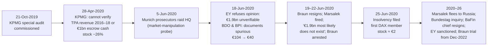

# G9 · Wirecard (2020): the cash that was never there

> **The hook.** At the end of 2019 Wirecard AG was Germany's fintech champion: a DAX-30 member that had grown revenue
> 35% a year for a decade, reported an EBITDA margin near 28%, carried €3.3bn of "cash" on its balance sheet, had an
> investment-grade rating from Moody's, a €900m convertible from SoftBank, a ten-year clean audit history from EY, and
> a regulator (BaFin) that had banned short-selling of its shares and filed criminal complaints against the journalists
> investigating it. Six months later its auditor could not find €1.9bn of that cash, the two Philippine banks that
> supposedly held it said the documents were forged, the CEO was arrested and the company filed for insolvency — the
> first DAX member ever to do so. The fraud was elaborate. The signals were not. A €2.7bn cash pile earning almost no
> interest, a "cash-rich" company that kept borrowing, profits that came from three unnamed partners in Dubai, Manila
> and Singapore, and a company that answered every question by attacking the questioner: each was public, and each
> is a test you can run on any company in Module 09.

| | |
|:--|:--|
| **Period** | FY2014–FY2018 audited financials (set-up) · **31 December 2019** (decision) · 2020–2026 (outcome) |
| **Decision date** | Close of **31 December 2019**, share price **€107.50**. You may use only what was public by then: the FY2018 annual report (April 2019), the H1 and Q3 2019 statements, Wirecard's ad-hoc announcements, the Financial Times' reporting (2015–Oct 2019), the Rajah & Tann report summary (March 2019), the SoftBank and bond announcements, and the 21-Oct-2019 announcement that KPMG had been commissioned to run a special investigation |
| **Sector** | Payments: online acquiring, issuing, payment processing and risk management; a licensed bank (Wirecard Bank AG). Germany, Frankfurt: WDI; DAX member from 24-Sep-2018 |
| **Themes** | Cash that cannot be verified · the interest-income test · third-party partners and "where does the profit come from?" · adjusted cash flow · acquisitions at prices that make no sense · a company that fights its critics · auditor and regulator failure · short-seller vindication · position sizing under fraud risk |
| **Modules this case reinforces** | [02.5 Cash-flow statement](../../02-accounting/05-the-cash-flow-statement.md) · [02.8 Group accounts & related parties](../../02-accounting/08-deeper-cuts-group-accounts-and-other.md) · [03.3 Notes to accounts](../../03-reading-filings/03-notes-to-accounts.md) · [04.7 Quality of earnings](../../04-financial-analysis/07-quality-of-earnings.md) · [09.1 Why and how numbers lie](../../09-forensics/01-why-and-how-numbers-lie.md) · [09.2 Revenue red flags](../../09-forensics/02-revenue-red-flags.md) · [09.4 Cash-flow games](../../09-forensics/04-cash-flow-games.md) · [09.5 Governance red flags (India)](../../09-forensics/05-governance-red-flags-india.md) · [09.1 Short-seller reports and the forensic mindset](../../09-forensics/01-why-and-how-numbers-lie.md) · [11.4 Position sizing](../../11-process/04-position-sizing-and-portfolio-construction.md) |
| **Difficulty** | Advanced (★★★★☆). Do it after Module 09; pairs with [G4 Enron](04-enron-2001.md) and [I1 Satyam](../india/01-satyam-2009.md) |
| **Time** | ~3 hours (about 75 minutes on sections 1–3 before you read on) |

!!! note "Conventions in this case"
    IFRS, euros. M = million, bn = billion. Wirecard's fiscal year is the calendar year. "Adjusted" cash flow from
    operations is Wirecard's own measure, which strips out the flows of its banking and acquiring businesses
    (customer deposits and merchant settlement money); the company argued this showed its "own" cash generation. The
    audited statements for FY2019 were **never published**. Share-price data are Xetra closes. Bracketed numbers point
    to the [Sources](#sources).

---

## 1. The scene (as of 31 December 2019)

### 1.1 The business

Wirecard sat between online merchants and the card networks. Its core segment, **Payment Processing & Risk
Management**, took a fee on each transaction it processed and guaranteed; its **Acquiring & Issuing** segment held
the licences (Wirecard Bank AG in Germany, Wirecard Card Solutions in the UK, and acquired portfolios in Asia-Pacific)
to accept card payments for merchants and issue prepaid cards; a tiny call-centre segment rounded it out
[[1]](#sources). Transaction volume processed in 2018 was €124.9bn, up 37%, half of it outside Europe [[1]](#sources).
The company said it served ~279,000 merchants, from airlines and travel sites to gaming and "digital goods".

Where Wirecard held no licence — much of Asia, the Middle East and parts of the Americas — it processed through
**third-party acquirers (TPAs)**: partner companies that held the Visa/Mastercard licences locally, processed the
merchants Wirecard referred, and paid Wirecard a commission. The merchants' money was held in **escrow ("trustee")
accounts** managed by a trustee on Wirecard's behalf, which Wirecard consolidated as its own cash. The 2018 annual
report described the arrangement in general terms ("acceptance via its own and third-party financial institutions")
and did not name the partners or quantify their share of revenue or profit [[1]](#sources).

Wirecard had grown by acquisition across Asia: a Singapore group (2011–12), Indonesian, Malaysian and Vietnamese
processors, the **Great Indian Retail Group** (Hermes i Tickets and GI Technology) in 2015 for up to €340m, Citi's
prepaid business in North America (2016) and Citi's merchant-acquiring portfolios in eleven Asia-Pacific markets
(2017–18) [[1]](#sources) [[7]](#sources). Goodwill and customer relationships together were €1.16bn at end-2018,
60% of equity.

### 1.2 Management, board, auditor and regulator

**Markus Braun** had been CEO since 2002, was the largest shareholder (~7%), and had personally borrowed against
his stake. **Jan Marsalek**, COO since 2010, ran Asia and the third-party business. The supervisory board was small
(five members in 2018), had no committee dedicated to the Asian businesses, and had defended management through every
allegation. **EY (Ernst & Young GmbH)** had audited the group since 2009 and had signed an unqualified opinion on the
FY2018 accounts on 24 April 2019 [[1]](#sources). **BaFin**, the German regulator, supervised Wirecard Bank but had
classified Wirecard AG as a technology company rather than a financial holding — so nobody supervised the group.

### 1.3 What the market believed, and who doubted it

The bull case was simple: Wirecard was Europe's answer to Adyen and PayPal, growing 35% a year with a 28% EBITDA
margin in a market (digital payments) growing structurally, and its "Vision 2025" promised €10bn of revenue and
€3.8bn of EBITDA by 2025 [[3]](#sources). In September 2018 it had replaced Commerzbank in the DAX [[8]](#sources);
its shares had closed above €195 on 6 September 2018, a market value of ~€24bn — briefly more than Deutsche Bank
[[6]](#sources). Twenty-plus analysts covered it; most rated it a buy through 2019.

The doubters had a long history [[6]](#sources) [[7]](#sources):

- **2008.** The German retail-shareholder association SdK questioned Wirecard's balance sheet; two of its members
  were later prosecuted for manipulating the stock, which discredited the criticism.
- **2015–16.** The FT's Dan McCrum began the "House of Wirecard" series (April 2015), reporting a gap between
  short-term assets and liabilities in the payments business and, later, that the Indian business Wirecard bought
  for up to €340m had been acquired weeks earlier by a Mauritius fund for about €37m. J Capital (2015) and an
  anonymous "Zatarra Research" report (February 2016) alleged money laundering and fraud; the stock fell ~25% and
  BaFin opened a market-manipulation investigation — into the short-sellers.
- **30 January 2019.** The FT reported an internal Singapore investigation (law firm Rajah & Tann) into Edo
  Kurniawan, Wirecard's Asia-Pacific head of accounting, for "forged and backdated contracts" and round-tripping of
  money between subsidiaries to inflate revenue. The stock fell ~20% that day and further on follow-up articles.
  Singapore police raided Wirecard's offices on 8 February.
- **18 February 2019.** BaFin banned net short positions in Wirecard for two months — the first such ban on a single
  German stock — citing the risk to market confidence. In April it filed a criminal complaint against the FT
  journalists for suspected market manipulation. Wirecard sued the FT. Rajah & Tann's summary (26 March) found
  some irregularities but "no material impact".
- **24 April 2019.** SoftBank (via a subsidiary) agreed a €900m five-year convertible at €130 a share and a
  "strategic cooperation" for Japan and Korea [[9]](#sources) [[10]](#sources). The stock recovered to ~€150 by
  September. On 11 September Wirecard placed its first bond: €500m, 0.5% coupon, five years, rated Baa3 by Moody's,
  used to repay bank lines [[3]](#sources).
- **15 October 2019.** The FT published internal spreadsheets and correspondence which, it said, showed a concerted
  effort to inflate sales and profits at Wirecard's Dubai (CardSystems Middle East) and Dublin units, largely
  through one partner, **Al Alam Solutions** of Dubai — a company operating from a largely unmanned office that the
  documents suggested contributed half of Wirecard's worldwide profit in 2016 [[11]](#sources) [[12]](#sources).
  Earlier FT reporting (March–April 2019) had said that roughly half of group revenue and almost all of its profit
  came through three partners: Al Alam, **PayEasy** (Manila) and **Senjo** (Singapore). The stock fell ~15–20% in
  early trading on 15 October [[12]](#sources).
- **21 October 2019.** Wirecard announced that its boards had commissioned **KPMG** to run an independent special
  investigation into the FT's allegations, the third-party acquiring business and "Merchant Cash Advance", with
  results expected by the end of Q1 2020 and to be published [[3]](#sources).

On 6 November Wirecard's Q3 statement reported nine-month revenue up 37% and confirmed FY2019 EBITDA guidance of
€765–815m; it also issued 2020 guidance of **€1.00–1.12bn** of EBITDA [[3]](#sources). In December the FT reported
that the escrow accounts holding the partners' money had been moved during 2019 from a Singapore trustee (Citadelle
Corporate Services, whose principal, R. Shanmugaratnam, had been charged in Singapore) to a trustee in the
Philippines.

### 1.4 The price on the decision date

Wirecard closed 2019 at **€107.50**, 45% below the September 2018 peak, 28% below the SoftBank conversion price,
and roughly 25× the EPS the company was on track to report [[6]](#sources). The FY2019 results were scheduled for
April 2020, with KPMG's report expected around the same time.

---

## 2. The numbers then

Everything here was public on 31 December 2019 [[1]](#sources)–[[3]](#sources). FY2019 figures are nine-month
actuals plus company guidance.

**Table 2.1: Income statement summary (€ M unless stated)**

| Item | FY2014 | FY2015 | FY2016 | FY2017 | FY2018 | 9M 2019 |
|:--|--:|--:|--:|--:|--:|--:|
| Revenue | 601.0 | 771.3 | 1,028.4 | 1,488.6 | 2,016.2 | 1,941.3 |
| Revenue growth (%) | 25 | 28 | 33 | 45 | 35 | 37 |
| EBITDA | 172.9 | 227.3 | 307.4 | 410.3 | 560.5 | 553.1 |
| EBITDA margin (%) | 28.8 | 29.5 | 29.9 | 27.6 | 27.8 | 28.5 |
| EBIT | 132.9 | 173.7 | 235.0 | 311.5 | 438.5 | 450.9 |
| Earnings after tax | 107.9 | 142.6 | 266.7 | 256.1 | 347.4 | ≈386 |
| Basic EPS (€) | 0.88 | 1.16 | 2.16 | 2.07 | 2.81 | 3.13 |
| Dividend per share (€) | 0.13 | 0.14 | 0.16 | 0.18 | 0.20 | — |
| Transaction volume (€ bn) | 34.3 | 45.2 | 61.7 | 91.0 | 124.9 | 124.2 |

Sources: [[1]](#sources) [[3]](#sources) and earlier annual reports. FY2016 earnings include a one-off gain on Visa
Europe shares. FY2017 EBITDA is the adjusted figure the company carried forward. Shares in issue were a constant
123.57m throughout.

**Table 2.2: Balance sheet (€ M, 31 December unless stated)**

| Item | 2017 | 2018 | 30-Sep-2019 |
|:--|--:|--:|--:|
| Goodwill | 675.8 | 705.9 | n/d |
| Customer relationships | 484.9 | 452.1 | n/d |
| Other intangibles (incl. internally generated) | 229.3 | 251.5 | n/d |
| Financial and other assets / securities (non-current) | 310.2 | 413.6 | n/d |
| Receivables of the acquiring business | 442.0 | 684.9 | n/d |
| Trade and other receivables | 274.7 | 357.4 | n/d |
| Interest-bearing securities and fixed-term deposits | 109.1 | 139.6 | n/d |
| **Cash and cash equivalents** | **1,901.3** | **2,719.8** | **3,287.4** |
| *of which customer deposits from banking operations* | *973.2* | *1,263.0* | *1,719.2* |
| *of which acquiring funds of Wirecard Bank* | *240.9* | *453.4* | *303.3* |
| Total assets | 4,532.8 | 5,854.9 | n/d |
| Interest-bearing liabilities (non-current + current) | 1,066.4 | 1,466.1 | ≈1,660 + €900m convertible |
| Liabilities of the acquiring business | 422.6 | 651.9 | n/d |
| Customer deposits from banking operations | 973.2 | 1,263.0 | 1,719.2 |
| Total equity | 1,640.0 | 1,922.7 | n/d |
| Goodwill + customer relationships / equity (%) | 71 | 60 | — |

Source: [[1]](#sources) [[3]](#sources). "n/d" = not disclosed in the quarterly statement. The €900m SoftBank
convertible was issued after 30 September 2019 [[3]](#sources).

**Table 2.3: Cash flow (€ M)**

| Item | FY2017 | FY2018 | 9M 2019 |
|:--|--:|--:|--:|
| Cash flow from operating activities (**adjusted**, company measure) | 375.7 | 500.1 | 486.8 |
| Adjusted CFO / EBITDA (%) | 92 | 89 | 88 |
| Adjusted CFO / earnings after tax (×) | 1.47 | 1.44 | ≈1.26 |
| Operating capex (PP&E + internally generated + software) | ≈85 | ≈100 | n/d |
| "Free cash flow" (company definition) | ≈290 | ≈400 | +60% y/y |
| Cash outflows for M&A and customer portfolios | ≈220 | ≈400 | n/d |
| Cash outflows for "medium-term financing agreements" (merchant cash advance) | n/d | material | material |
| Net new borrowing | +≈250 | +399.7 | +309 (bank) + 500 (bond) + 900 (convertible) |
| Dividends paid | 19.8 | 22.2 | 24.7 |

Source: [[1]](#sources) [[3]](#sources). Wirecard's *unadjusted* CFO included the swings in customer deposits and
merchant settlement money and was therefore larger and more volatile; the company presented the adjusted number as
its "own" cash generation.

**Table 2.4: Valuation and derived ratios at the decision date (price €107.50)**

| Metric | Value | Working |
|:--|--:|:--|
| Shares outstanding | 123.57 M | [[1]](#sources) |
| Market capitalisation | ≈ €13.3 bn | 123.57 × 107.50 |
| Gross debt (bank lines + the €500m bond that replaced part of them ≈ 1.66) + €900m convertible | ≈ €2.6 bn | 1.66 + 0.9 |
| "Own" cash (reported cash 3,287 − customer deposits 1,719 − acquiring funds 303) | ≈ €1.27 bn | company's own framing [[3]](#sources) |
| Enterprise value | ≈ €14.6 bn | 13.3 + 2.6 − 1.27 |
| EV / FY2019E EBITDA (guidance midpoint €790m) | ≈ 18.5× | 14.6 ÷ 0.79 |
| EV / FY2020E EBITDA (guidance midpoint €1.06bn) | ≈ 13.8× | |
| P/E on FY2019E EPS (≈ €4.3, from 9M €3.13) | ≈ 25× | |
| Price / book (equity ≈ €2.2bn est.) | ≈ 6× | |
| Interest income on "own" cash (see Q1) | ≈ 1% | 2018: €20.6m on €1.9–2.7bn of cash incl. deposits [[1]](#sources) |
| Dividend yield | 0.2% | 0.20 ÷ 107.50 |

### 2.5 What the reports said (paraphrased)

1. **Cash (note 6.7 of the Q3 statement).** "Cash and cash equivalents" of €3,287m included customer deposits of
   €1,719m and acquiring funds of €303m; the group also invested some deposits in "collared floaters and other
   interest-bearing securities" [[3]](#sources). The escrow/trustee balances were *inside* cash and were not separately
   quantified anywhere in the published reports.
2. **Interest income.** The Acquiring & Issuing segment earned €20.6m of interest in 2018 "on the investments of own
   funds as well as customer deposits", up from €12.4m [[1]](#sources). This is disclosed as revenue, not in the
   financial result.
3. **Third parties.** The management report explains that the group processes "via its own and third party financial
   institutions" and that cost of materials includes "transaction-related charges to third-party providers"; no
   partner is named and no share of revenue or profit is given [[1]](#sources).
4. **Digital lending / Merchant Cash Advance.** The rise in interest-bearing liabilities in 2018 (+€400m) and 9M 2019
   (+€309m) was attributed to "medium-term financing agreements" for real-time payouts and merchant cash advances,
   "often in the form of cash securities", and to Asian licence investments [[1]](#sources) [[3]](#sources).
5. **Goodwill.** Goodwill of €706m was tested for impairment on segment cash-generating units; none was impaired.
6. **The KPMG mandate (21-Oct-2019).** Scope: the FT allegations, the third-party acquiring business and Merchant Cash
   Advance; KPMG reports to the supervisory board; "unrestricted access to all relevant information at all levels of
   the Group"; results to be published [[3]](#sources).

---

## 3. You are the analyst

Answer these **before reading section 4**, using only the information above. Show your arithmetic.

1. **(Numerical — the interest-income test.)** At end-2018 Wirecard reported €2,720m of cash. Of it, €1,263m were
   customer deposits and €453m acquiring funds, leaving ~€1.0bn of "own" cash, plus €140m of deposits and €414m of
   securities. Total interest income disclosed was €20.6m, and that figure also covers the return on customer
   deposits. Estimate the implied yield on the group's total cash and securities (~€3.3bn) and on "own" cash alone.
   Compare with 2018 euro deposit rates (ECB deposit rate −0.40%; 1-year German Bund ≈ −0.6%) *and* with the rates
   available in Singapore, the Philippines and Dubai, where the escrow money supposedly sat (1-year deposit rates of
   roughly 2%, 4–6% and 2–3% respectively). What range of interest income would you expect? What are the innocent
   explanations, and how would you test each?
2. **(Numerical — the borrowing test.)** A company with €1bn of surplus cash and €400m of adjusted free cash flow a
   year raised, in 12 months, €400m of new bank debt (2018), €309m more (9M 2019), a €500m bond and a €900m
   convertible, while paying a €25m dividend and announcing a €200m buyback. Build a sources-and-uses table for
   2018–19 from Tables 2.2–2.3. How much of the borrowing is explained by disclosed uses (M&A, portfolio purchases,
   merchant cash advance)? What does the residual tell you? What would a company with the reported cash position
   normally do?
3. **(Numerical — where does the profit come from?)** Use the FT's claim that three partners generated about half of
   revenue and "almost all" of profit. If FY2018 EBITDA was €560m and the TPA business earned, say, 90% of it on 50% of
   revenue, compute the EBITDA margin of the TPA business and of the rest of Wirecard. Is a payments business with a
   ~50% EBITDA margin *plausible* against Adyen (2018 EBITDA margin ≈ 46% on net revenue, but ≈ 12% on gross
   revenue) and Worldline (≈ 22%)? What would the residual ~5% margin mean for the "real" Wirecard?
4. **(Numerical — the acquisition test.)** Wirecard paid up to €340m in 2015 for the Great Indian Retail Group, which
   had reportedly been bought weeks earlier for ≈€37m. Compute the mark-up. If Hermes i Tickets earned, say, €10m of
   EBITDA, what multiple did Wirecard pay, and who received the difference? List what you would check in the
   purchase-price allocation and the goodwill note, and what the Indian filings (MCA) could tell you about the target's
   real size.
5. **(Numerical — the cash-flow reconciliation.)** Adjusted CFO/EBITDA was ~90% and adjusted CFO/net income ~1.4×,
   which looks excellent. Explain why a fraud that invents both revenue and cash (in escrow accounts controlled by
   partners) would produce exactly these ratios. Which line of the *statement of financial position* — not the cash
   flow statement — is the only place the fraud must eventually show?
6. **(Numerical — what is the equity worth if the TPA business is fictitious?)** Assume the "real" Wirecard is the
   European acquiring/issuing and processing business with ~€1.0bn of revenue at a 12% EBITDA margin, that goodwill
   related to Asia is worthless, and that the €1.9bn of escrow cash does not exist while the €2.6bn of debt and
   convertible do. Value the equity at 12× EBITDA. What is the per-share value? What probability of fraud makes the
   stock a short at €107.50, and what is the expected value under your probabilities?
7. **(Judgement — the KPMG mandate.)** Read the 21-Oct-2019 announcement as a forensic analyst. What does "unrestricted
   access at all levels of the Group" *not* guarantee? What would a management determined to obstruct do, and what
   sentence in KPMG's eventual report would tell you whether they had? Name the three documents KPMG would need to
   verify the escrow cash, and who controls each.
8. **(Red flags — score it.)** Run the Module 09 forensic checklist ([09.7](../../09-forensics/07-the-forensic-checklist.md))
   on Wirecard at end-2019. Score each item, list the top five, and state which *single* item you would have tried
   to verify independently and how (e.g., writing to OCBC/BDO/BPI; visiting Al Alam's office; pulling PayEasy's
   Philippine SEC filings; checking whether the escrow trustee was a lawyer or a bank).
9. **(Decision.)** Decide: long, avoid or short, and at what size? For a long, what is the Kelly-type sizing if you
   attach a 30% probability to "the cash does not exist" ([11.4](../../11-process/04-position-sizing-and-portfolio-construction.md))?
   For a short, what were the specific risks (the BaFin ban precedent; a €900m SoftBank endorsement; a 2019 short
   squeeze from €86 to €150), and how would you express the view with defined risk
   ([11.7](../../11-process/07-fundamentals-meets-derivatives.md))?

---

## 4. What happened

**The KPMG report (28 April 2020).** After six months, KPMG said it could not verify that the third-party acquiring
revenue for 2016–2018 existed, could not confirm the existence of €1bn of cash in the escrow accounts for that period,
and had been obstructed: documents were provided late, incomplete, or not at all, and the partners and trustee did not
cooperate [[4]](#sources) [[5]](#sources). Wirecard's ad-hoc statement that morning said KPMG had found "no evidence
of balance sheet forgery"; the stock fell 26% [[4]](#sources). The hedge fund TCI, a shareholder, wrote the same day
demanding Braun's removal [[13]](#sources). Al Alam Solutions entered liquidation within weeks [[14]](#sources).

**The audit (18 June 2020).** EY, auditing FY2019, had asked the Philippine trustee's banks to confirm the escrow
balances directly. **BDO Unibank** and **Bank of the Philippine Islands** replied that the confirmation documents
were spurious and that Wirecard was not a client. EY refused to sign. Wirecard announced that €1.9bn — about a
quarter of its balance sheet — could not be located; the shares fell from €104.50 to €39.90 that day and to €25.82
the next [[6]](#sources) [[15]](#sources). The Philippine central bank said the money had never entered the
Philippine banking system.

**The collapse (19–25 June 2020).** Braun resigned on 19 June and was arrested on 22 June on suspicion of false
accounting and market manipulation (bailed at €5m, rearrested in July). On 22 June Wirecard said the €1.9bn "most
likely" did not exist and withdrew four years of results. Marsalek, dismissed on 22 June, flew from Austria to Minsk
and has been a fugitive in Russia since. On 25 June the company filed for insolvency in Munich; Wirecard Bank was
ring-fenced by BaFin. The shares, €195 in September 2018 and €107.50 six months earlier, traded below €3 by the end of
the month [[6]](#sources) [[16]](#sources). SoftBank's exposure turned out to have been largely passed on to outside
investors through a Credit Suisse repackaging, so the "€900m SoftBank bet" that reassured the market was mostly not
SoftBank's money [[17]](#sources).

**The aftermath.**

- The insolvency administrator sold the operating units (Brazil, the UK issuing business, North America and others)
  for a small fraction of the former market value; bondholders and the convertible holders recovered little.
- Oliver Bellenhaus, who ran the Dubai unit, turned crown witness. Munich prosecutors charged Braun, Bellenhaus and
  the former head of accounting Stephan von Erffa in March 2022; the trial opened on 8 December 2022 and was still
  running in 2026 [[18]](#sources). Braun has maintained that he was deceived by Marsalek and that the TPA business
  was real.
- Singapore convicted the Citadelle trustee R. Shanmugaratnam and an associate of falsifying accounts that claimed
  Citadelle held €1.1bn for Wirecard; they were sentenced in January 2026 [[6]](#sources).
- A Bundestag inquiry (2020–21) found failures at BaFin, at the financial-reporting enforcement body (FREP/DPR), which
  had taken over a year to examine the H1 2018 accounts, and at EY. BaFin's president Felix Hufeld and his deputy
  resigned in January 2021. The **FISG** (Financial Market Integrity Strengthening Act, 2021) gave BaFin direct
  powers over listed companies' accounts, mandated auditor rotation after ten years and tightened auditor liability
  [[6]](#sources) [[19]](#sources).
- Germany's audit oversight body (APAS) fined EY €500,000 in April 2023 and barred it from taking on new
  public-interest audit clients for two years. Civil claims by the administrator against EY continued.
- Dan McCrum's book *Money Men* (2022) documents the eight-year investigation, including Wirecard's surveillance of
  journalists and short-sellers, and BaFin's complaint against the FT.

---

## 5. Signals: knowable then vs hindsight

| Knowable on 31-Dec-2019 | Only in hindsight |
|:--|:--|
| **The interest-income test.** ~€3bn of cash and securities earning ~€20m: a yield around 0.6% for money supposedly deposited in Asian banks at 2–6%. The same test convicted Satyam ([I1](../india/01-satyam-2009.md)) | That the escrow accounts had *never* existed in the form claimed, and that the bank confirmations EY had accepted for years had been produced by the trustee, not the banks |
| **The borrowing test.** A "net cash" company raising €2.1bn of new debt and convertible in 18 months while paying a 0.2% yield and running a buyback | The exact mechanism: escrow cash could be shown but not spent, so real cash needs were met with real debt |
| **Where the profit came from.** FT reporting (March–April 2019) that three unnamed partners in Dubai, Manila and Singapore produced half the revenue and almost all the profit; the 2018 annual report's silence on them | KPMG's finding that the TPA units accounted for the "lion's share" of €985m of 2016–18 operating profit, and that none of it could be verified |
| **Acquisitions at unexplained prices.** The €340m Indian deal against a €37m price weeks earlier (FT, 2018–19); goodwill and customer relationships at 60% of equity | Where the money went: prosecutors alleged the mark-ups were routed to insiders and partners |
| **Behaviour.** Suing and surveilling journalists; a regulator that banned shorts and prosecuted critics; a Singapore probe framed as a rogue employee; "no material impact" from a law firm hired by the company | That Marsalek had links to intelligence services and would flee; that Bellenhaus would confess |
| **The audit trail.** A ten-year auditor; escrow cash held by a trustee rather than by the company's own banks; a special audit that management could delay by withholding documents | How KPMG would be obstructed (its report says documents arrived late or not at all) and that EY would finally seek confirmations directly from the banks only in 2020 |
| **Price.** After the FT's October documents and the KPMG mandate, the stock still traded at ~25× earnings and ~18× EBITDA: the market was pricing "probably fine" | That the resolution would take only six months and that the equity would go to zero rather than to a discounted survivor |

!!! success "The strongest bull case that existed at the time"
    Digital payments were growing 15–20% a year and Wirecard had the licences, the Asian footprint and the
    merchant relationships to take share. Every allegation since 2008 had come from short-sellers with a position or
    journalists relying on leaked documents; Rajah & Tann had found no material impact; EY had signed ten clean
    opinions; SoftBank had committed €900m at €130 after doing its own diligence; Moody's had rated the bond
    investment grade; BaFin had judged the short attacks manipulative. The company had itself commissioned KPMG,
    with unrestricted access, and promised to publish the result. At 13.8× 2020 EBITDA the stock was cheaper than
    any comparable payments company. If KPMG cleared it, the re-rating back to €150+ was 40%.

    Every sentence of that case rested on someone else's verification: the auditor, the regulator, the investor, the
    rating agency, the law firm. None of them had asked the banks.

---

## 6. Lessons

1. **Cash is the easiest number to fake and the easiest to test.** A balance earns interest; the yield on reported
   cash should match where the cash is said to be. A large cash pile that earns nothing, or that sits with a
   third-party trustee rather than in the company's own bank, is the first item to verify.
   → [09.4 Cash-flow games](../../09-forensics/04-cash-flow-games.md)
2. **Cash-rich companies do not borrow.** When a company reports surplus cash and keeps raising debt, one of the two
   numbers is wrong. Build the sources-and-uses table.
   → [04.7 Quality of earnings](../../04-financial-analysis/07-quality-of-earnings.md)
3. **Find where the profit comes from.** If the answer is "partners we do not name, in jurisdictions we do not have
   licences for, whose money a trustee holds", the profit has not been demonstrated. Segment disclosures that hide
   the profit engine are a governance flag as well as an accounting one.
   → [03.3 Notes to accounts](../../03-reading-filings/03-notes-to-accounts.md) ·
   [09.2 Revenue red flags](../../09-forensics/02-revenue-red-flags.md)
4. **A fraud that fakes cash also fakes cash flow.** CFO/EBITDA of 90% proves nothing when the "cash" received sits in
   an account the company cannot spend from. The cash-flow statement is derived from the balance sheet; test the
   balance.
   → [02.5 Cash-flow statement](../../02-accounting/05-the-cash-flow-statement.md)
5. **Acquisitions priced without reference to the target's economics are a channel, not a strategy.** Ask what the
   seller paid, when, and who the seller is. India's MCA filings would have shown Hermes i Tickets' real size.
   → [05.5 Management & capital allocation](../../05-business-analysis/05-management-and-capital-allocation.md) ·
   [02.8 Group accounts](../../02-accounting/08-deeper-cuts-group-accounts-and-other.md)
6. **How a company treats its critics is data.** Lawsuits, surveillance, "rogue employee" framings and regulator
   complaints against journalists are the behaviour of companies with something to hide more often than of companies
   with nothing to hide.
   → [09.5 Governance red flags (India)](../../09-forensics/05-governance-red-flags-india.md) ·
   [09.1 Reading short-seller reports](../../09-forensics/01-why-and-how-numbers-lie.md)
7. **Gatekeepers are not verification.** Auditors accept confirmations; regulators protect markets, not investors;
   rating agencies rate the story; strategic investors may not be risking their own money. Ask what each gatekeeper
   actually did, not what its presence implies.
   → [09.5 Governance red flags (auditors and gatekeepers)](../../09-forensics/05-governance-red-flags-india.md)
8. **Size for the tail you cannot hedge.** A 30% probability of a zero is not a reason to avoid a 40% upside — it is
   a reason to size at a few per cent and to define what would raise or lower that probability (the KPMG
   report's wording; the banks' confirmations).
   → [11.4 Position sizing](../../11-process/04-position-sizing-and-portfolio-construction.md) ·
   [06.8 Margin of safety](../../06-valuation/08-margin-of-safety-and-expected-value.md)
9. **Special audits are only as good as the access.** "Unrestricted access" is a promise by the people under
   investigation. The test is whether the auditor gets to the third parties and the banks — and the report will say.
   → [09.1 The forensic mindset](../../09-forensics/01-why-and-how-numbers-lie.md)

---

## 7. Model answers

<strong>Q1 — The interest-income test</strong>

Total cash, deposits and securities at end-2018 ≈ 2,720 + 140 + 414 = **€3.27bn**. Interest income disclosed:
€20.6m → **≈ 0.6%** on the total. If customer deposits (€1.26bn) earned nothing (plausible in the euro area at
negative rates) and the securities (€414m + €140m) earned ~1%, the "own" cash of ~€1.0bn plus escrow balances earned
roughly €15m — ≈ 1.5% — *if* everything else earned zero. But Wirecard said the escrow money sat in Singapore and
then the Philippines: at 2–5% on ~€1bn you would expect **€20–50m from the escrow balances alone**. Innocent
explanations: (a) the escrow accounts were non-interest-bearing trust accounts (test: ask why a company would leave
€1bn idle for years, and who earned the float); (b) interest on escrow accrued to the trustee or partners (test: then
the cash is not Wirecard's and should not be consolidated); (c) most cash sat in negative-rate euro accounts (test:
then the escrow story is false). Each explanation contradicts either the cash's ownership or its location. Compare
[I1 Satyam](../india/01-satyam-2009.md): ₹5,040 Cr of fictitious cash earning almost nothing.

<strong>Q2 — The borrowing test</strong>

**Sources 2018–9M 2019 (approx., € M):** adjusted CFO 500 + 487 = 987; new bank debt 400 + 309 = 709; bond 500 (used to
repay bank lines, so net zero against the 309); convertible 900 (received in Q4 2019). **Uses:** operating capex
≈ 100 + ~90; M&A and portfolios ≈ 400 (2018) + ~150; merchant cash advance / "medium-term financing" — undisclosed
but described as the main reason for the borrowing; dividends 22 + 25; buyback €200m announced; loan repayment €340m
from the convertible.

Even generous assumptions (say €500m of merchant lending) leave the company with *more* cash than at the start of
2018 — consistent with reported cash rising from €1.9bn to €3.3bn — and no need to borrow at all: a company with
€1bn of surplus cash and €400m of free cash flow funds €550m of acquisitions and €500m of lending from its own
resources. The residual borrowing is explained only if the reported cash cannot be *used*. That is exactly what
escrow cash controlled by a trustee, or non-existent cash, looks like. A genuinely cash-rich company would have paid
a real dividend, run the buyback from cash, and not paid bankers for a 0.5% bond.

<strong>Q3 — Where the profit comes from</strong>

TPA: 50% × 2,016 = €1,008m of revenue; 90% × 560 = €504m of EBITDA → **50% margin**. Rest: €1,008m of revenue and
€56m of EBITDA → **5.6% margin**. A 50% EBITDA margin on *gross* revenue is unheard of in acquiring: Adyen's ~46% is
on *net* revenue (after interchange and scheme fees), equivalent to ~12% on gross volume-based revenue; Worldline's
was ~22%. Either the TPA business had economics no payments company has ever shown, or the revenue was largely
fictitious with almost no associated cost — which is what a booked-but-not-received commission looks like. The
"real" Wirecard at a 5.6% margin was a sub-scale European processor worth a fraction of the market value. KPMG's
finding that the TPA units were the "lion's share" of €985m of 2016–18 operating profit confirmed the split.

<strong>Q4 — The acquisition test</strong>

Mark-up: 340 / 37 ≈ **9.2×** in a matter of weeks. On €10m of EBITDA, Wirecard paid **34× EBITDA** for an Indian
travel-ticketing and prepaid business. The difference (~€300m) went to the Mauritius fund's beneficiaries — which
the FT and prosecutors later linked to people connected with Wirecard. Checks: the purchase-price allocation (how
much became goodwill vs identifiable assets; €340m against tiny tangible assets means almost all goodwill); the
earn-out terms; the vendor's identity in the announcement; the target's MCA filings (Hermes i Tickets' Indian
revenue and profit — in the tens of crores, not hundreds); and whether the "customer relationships" recognised
were later impaired (they were not, which is itself a flag).

<strong>Q5 — The cash-flow reconciliation</strong>

If Wirecard books €500m of commission revenue from partners and records that the partners have deposited the
proceeds in an escrow account counted as Wirecard's cash, then: revenue ↑, EBITDA ↑, receivables unchanged (the cash
"arrived"), CFO ↑ by the same amount, and CFO/EBITDA looks perfect. The fraud is invisible in the income and cash-flow
statements because both are internally consistent with a cash balance that has been asserted rather than
verified. It must show in the **cash and cash equivalents line** — the only line that an outside party (the bank)
can confirm without reference to the company's own records. Which is why the fraud ended when EY finally wrote to
BDO and BPI directly.

<strong>Q6 — What the equity is worth if the TPA business is fictitious</strong>

"Real" EBITDA: €1.0bn × 12% = €120m; × 12 = **€1.44bn EV**. Less debt and convertible €2.6bn, plus real cash: own
cash €1.27bn − escrow €1.9bn is negative, so real own cash ≈ 0 (the customer deposits belong to customers). Equity
≈ 1.44 − 2.6 = **negative**; per share **≈ €0** — the debt holders own the company. At €107.50 the stock is worth
either ~€150 (bull) or ~€0 (fraud). At a 30% fraud probability: 0.7 × 150 + 0.3 × 0 = **€105** — roughly the price,
so the market's implied fraud probability was about 30%. At 50% the EV is €75 and the stock is a clear short; at 20%
it is €120, a marginal long. The decision therefore hinges entirely on the probability you attach to the cash — which
is why Q1's test, not the multiple, was the analysis.

<strong>Q7 — The KPMG mandate</strong>

"Unrestricted access at all levels of the Group" does not include the *partners* (Al Alam, PayEasy, Senjo), the
*trustee*, or the *banks* holding the escrow accounts — none of which is part of the Group. An obstructive
management would: supply documents late and incomplete; route KPMG's requests to the partners through Marsalek's
team; produce trustee statements instead of bank statements; and run out the clock past the Q1 deadline. The
sentence to look for: whether KPMG could obtain *original bank confirmations* and *transaction-level data from the
partners*. KPMG's report said it could not, and named the delays. The three documents: bank-issued balance
confirmations addressed to the auditor (controlled by the bank); the trust deed and account-opening documents
(trustee/bank); and the partners' own accounts reconciling commissions paid to Wirecard (partners). Wirecard
controlled none of them, and KPMG got none of them.

<strong>Q8 — Forensic score</strong>

Rubric: Red on cash verification (trustee-held, low yield), on "where the profit comes from" (unnamed partners), on
acquisitions (unexplained mark-ups, goodwill 60% of equity), on management behaviour (suing journalists, "rogue
employee"), on gatekeeper independence (ten-year auditor; regulator hostile to critics), on borrowing vs cash; Amber
on related parties (Braun's margin loans; the Mauritius fund), on disclosure quality (adjusted CFO, no segment detail
on TPA), on the special audit's scope; Green on the European licensed business. The single verification: write to the
banks named as holding the escrow accounts (or, failing names, ask why the banks are not named) and check the
Philippine SEC and Dubai registries for PayEasy and Al Alam — the FT found Al Alam's office essentially empty and
PayEasy sharing an address with a bus company.

<strong>Q9 — Decision</strong>

**Long.** Payoffs +40% / −100% at 70/30: expected +12%, but Kelly f* = (0.7 × 0.4 − 0.3)/0.4 = −5% — **do not bet**;
the long only works above ~75% confidence in the cash, which no public document supported. **Avoid** is the base
answer. **Short.** The asymmetry is the mirror image, but the path risks were real: the 2019 squeeze from €86 (Feb)
to €150 (Sep) on the SoftBank news; BaFin's precedent of banning shorts; borrow cost; and the possibility that KPMG's
report would be worded ambiguously (as Wirecard's own summary of it was). Defined-risk expression: long-dated puts
(the June 2020 puts were priced for a ~30% move, not −98%), sized so that a squeeze to €150 costs a known premium;
or a short paired with a long in a clean payments peer to strip out sector moves. The honest answer for most
investors: avoid, and log the reasoning — "cash not verifiable; profit source undisclosed; company hostile to
scrutiny" — as a template for the next one.

---

## 8. Discussion questions & extensions

1. **Run the interest-income test on five Indian companies with large cash balances** (use the treasury-income line
   and the average cash and investments). Which ones yield less than the 1-year FD rate, and what is the disclosed
   reason? For a worked prior, see [I1 Satyam](../india/01-satyam-2009.md).
2. **Adjusted cash flow.** Wirecard's "adjusted CFO" excluded banking and acquiring flows. Indian NBFCs and payment
   companies present similar adjustments. Write a rule for when an adjustment is legitimate and when it is a way to
   present a number that the audited statement does not support.
3. **The regulator's incentives.** BaFin protected a national champion from "manipulative" short-sellers. Compare
   SEBI's handling of short-seller reports ([I9 Adani–Hindenburg](../india/09-adani-hindenburg-2023.md),
   [I14 Manpasand & Vakrangee](../india/14-manpasand-vakrangee-small-cap-flags.md)). What should an investor infer when
   a regulator acts against the critics rather than investigating the claims?
4. **Escrow, trustees and "cash".** Under Ind AS 7, what qualifies as cash and cash equivalents? Find an Indian company
   that reports restricted cash, escrow balances or margin money inside cash, and restate its net debt.
5. **Fraud probability as a portfolio parameter.** Suppose 3% of listed companies in a market are outright frauds and
   your forensic screen catches two-thirds of them. What is the residual fraud rate in a portfolio of screened stocks,
   and what maximum single-position size does a 2% portfolio-loss budget imply
   ([11.4](../../11-process/04-position-sizing-and-portfolio-construction.md))?

---

## Sources

All accessed 22-Sep-2026. Wirecard's own reports are archived on its post-insolvency website; the FT's reporting is
paywalled and cited by title and date.

[1]: https://wirecard.com/wp-content/uploads/2020/12/Annual-Report-2018.pdf
[2]: https://www.wirecard.com/wp-content/uploads/2020/12/Half-yearly-financial-report-2019.pdf
[3]: https://www.wirecard.com/wp-content/uploads/2020/12/Q3-statement-Q3-financial-report-2019.pdf
[4]: https://wirecard.com/wp-content/uploads/2021/01/AH_2020_04_28_KPMG-report.pdf
[5]: https://www.scribd.com/document/458744141/KPMG-Special-Audit-on-Wirecard
[6]: https://en.wikipedia.org/wiki/Wirecard_scandal
[7]: https://en.wikipedia.org/wiki/Wirecard
[8]: https://stoxx.com/wirecard-ag-to-be-included-in-dax-new-composition-for-tecdax-mdax-and-sdax/
[9]: https://wirecard.com/wp-content/uploads/2021/01/2019_04_24_Softbank-Coop.pdf
[10]: https://www.noerr.com/en/press/noerradviseswirecardonissueofeu900mconvertiblebondinconnectionwithstrategicpartnershipwithsoftbank
[11]: https://www.eqs-news.com/news/corporate/wirecard-ag-statement-on-financial-times-article/1208231
[12]: https://www.nasdaq.com/articles/wirecard-shares-sink-after-ft-report-alleging-company-inflated-sales-2019-10-15
[13]: https://www.tcifund.com/files/corporateengageement/wirecard/TCI%20-%20Letter%20to%20Wirecard%2028%20April%202020.pdf
[14]: https://www.fintechfutures.com/paytech/al-alam-enters-liquidation-following-kpmg-s-wirecard-audit
[15]: https://fortune.com/2020/06/18/high-flying-german-fintech-wirecard-plunges-as-millions-go-missing
[16]: https://www.cnbc.com/2020/06/25/german-payments-company-wirecard-files-for-insolvency.html
[17]: https://www.cnbc.com/2020/06/24/softbanks-1-billion-wirecard-investment-under-scrutiny.html
[18]: https://www.euronews.com/next/2022/12/06/wirecard-accounts-trial-timeline
[19]: https://www.cnbc.com/2020/06/29/enron-of-germany-wirecard-scandal-casts-a-shadow-on-governance.html

Financial Times articles (Dan McCrum and colleagues): "House of Wirecard" series (from April 2015); "Wirecard's
problem partners" (April 2019); "Wirecard's suspect accounting practices revealed" (15 October 2019); "Wirecard
relied on three opaque partners for almost all its profit" (24 April 2019). Dan McCrum, *Money Men* (Bantam, 2022).

---
[← Previous: G8 · Valeant (2015)](08-valeant-2015.md) · [Module index](../index.md) · [Next: G10 · Buffett buys Apple (2016) →](10-apple-2016.md)
