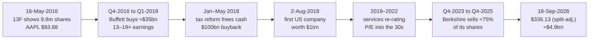

# G10 · Buffett buys Apple (2016)

> **The hook.** On Monday 16 May 2016 a routine Berkshire Hathaway filing showed a new holding: 9.8 million shares of
> Apple, worth about $1bn. Apple's shares had just had their worst stretch in years. Revenue had fallen year on year for
> the first time since 2003, iPhone unit sales had dropped 16%, and Carl Icahn had sold out, citing China. The stock
> closed at $93.88. That was about 10 times trailing earnings, and nearer 7 times once you took out Apple's $153bn of
> net cash. The market was pricing the world's most profitable consumer franchise like a hardware maker past its peak.
> Over the next two years Berkshire spent about $36bn and bought 5% of the company. Ten years later Apple's net income
> was 2.5 times higher. It had bought back a third of its shares, and the same earnings were valued at almost four times
> the multiple. The stock returned ≈30% a year. Berkshire then sold most of its stake for reasons that are still argued
> over. This case teaches **variant perception** (a view that differs from the consensus for reasons you can state),
> **buybacks** and the arithmetic of a **re-rating**.

| | |
|:--|:--|
| **Period** | FY2013–FY2016 (set-up) · 16-May-2016 (decision) · 2016–2018 (Berkshire builds) · 2023–2025 (Berkshire sells most of it) · to Sep-2026 (outcome) |
| **Decision date** | Close of **16 May 2016**. You may use only what was public by then: Apple's FY2015 10-K (Oct-2015), its Q1 and Q2 FY2016 results and 10-Qs (Jan and Apr-2016), Berkshire's 13F for the quarter to 31-Mar-2016 (filed 07:30 on 16-May-2016), and press coverage up to that day |
| **Sector** | Consumer technology: smartphones, computers, wearables, and digital services and content (US; Nasdaq: AAPL). The fiscal year ends on the last Saturday of September |
| **Themes** | Variant perception; consumer franchise vs "hardware company"; switching costs and installed base; P/E ex-net cash; tax on trapped offshore cash; buybacks at low vs high multiples; TSR decomposition and re-rating; trimming a winner |
| **Modules this case reinforces** | [01.2 Market cap & EV](../../01-markets-101/02-shares-market-cap-and-enterprise-value.md) · [01.3 Returning capital (buybacks)](../../01-markets-101/03-raising-and-returning-capital.md) · [01.5 Returns math (TSR decomposition)](../../01-markets-101/05-time-value-and-returns-math.md) · [04.7 Quality of earnings](../../04-financial-analysis/07-quality-of-earnings.md) · [05.1 Business models](../../05-business-analysis/01-business-models-and-unit-economics.md) · [05.3 Moats](../../05-business-analysis/03-moats-and-competitive-advantage.md) · [05.5 Capital allocation](../../05-business-analysis/05-management-and-capital-allocation.md) · [05.7 Scuttlebutt](../../05-business-analysis/07-scuttlebutt-and-primary-research.md) · [06.5 Multiples](../../06-valuation/05-relative-valuation-and-multiples.md) · [06.6 Reverse DCF](../../06-valuation/06-reverse-dcf-and-expectations.md) · [06.8 Margin of safety](../../06-valuation/08-margin-of-safety-and-expected-value.md) · [11.5 Monitoring & selling](../../11-process/05-monitoring-and-selling.md) · [11.6 Behavioural finance](../../11-process/06-behavioural-finance-and-decision-journals.md) |
| **Difficulty** | Intermediate. Best done after [06.6](../../06-valuation/06-reverse-dcf-and-expectations.md) and alongside [G3 Cisco](03-cisco-2000.md), its mirror image |
| **Time** | ~2.5 hours (about 75 minutes on sections 1–3 before you read on) |

!!! note "Conventions in this case"
    US GAAP, US dollars. "FY2016" means Apple's year to 24-Sep-2016. Apple split its stock **7-for-1 in 2014** (the
    FY2014 10-K restates FY2013 diluted EPS from $39.75 to $5.68; [SEC XBRL][17]) and **4-for-1 on 31-Aug-2020**
    ([Yahoo Finance][35]). **Sections 1–3 quote 2016 prices and per-share figures as they traded then**, i.e. before
    the 2020 split. Sections 4 onward use **split-adjusted** figures (2016 price ÷ 4), so $93.88 in May 2016 is
    **$23.47** on a modern chart. Berkshire's holdings come from its quarterly **13F** filings (the SEC form on which
    large managers list their US equity holdings) and from its annual letters. The two counts differ slightly because
    they are prepared on different bases; we quote each as published. Price data are closing prices, and total returns
    assume dividends are reinvested.

---

## 1. The scene (as of 16 May 2016)

### The business

In FY2015 Apple sold $233.7bn of goods and services. **iPhone** was $155.0bn of that (66%), iPad $23.2bn, Mac
$25.5bn, "Other products" $10.1bn (Apple Watch, Apple TV, Beats, accessories), and **Services** $19.9bn (8.5%). Services
covered the App Store, iTunes, Apple Music, AppleCare, Apple Pay and licensing. Apple sold 231.2m iPhones that year, up
37%, on the back of the large-screen iPhone 6 ([FY2015 10-K][1]). The FY2015 gross margin was 40.1% and the operating
margin 30.5%. Net income was $53.4bn, the largest of any company in the world, and return on average equity was 46%.

Two facts pointed beyond hardware. In January 2016 Tim Cook said Apple's installed base had crossed "a major milestone
of one billion active devices" ([Q1 FY2016 results][2]). Every one of those devices was a potential buyer of apps,
storage, music and AppleCare. And services were growing: $6.0bn in the March quarter, up 20% year on year, driven by
"App Store, licensing and AppleCare" ([Q2 FY2016 10-Q][3]).

### The quarter that broke the growth story

On 26-Apr-2016 Apple reported its second fiscal quarter ([Q2 FY2016 10-Q][3]):

- Revenue was $50.6bn, **down 13%**. CNBC noted that this was Apple's first year-on-year revenue decline since 2003
  ([CNBC, 28-Apr-2016][22]).
- **iPhone units fell 16%**, to 51.2m from 61.2m, and iPhone revenue fell 18%. Apple blamed "the acceleration of iPhone
  upgrades in the first half of 2015" (the iPhone 6 supercycle made the comparison hard) and weak economies.
- **Greater China** (mainland China, Hong Kong and Taiwan) revenue fell 26%, to $12.5bn.
- Gross margin fell to 39.4%. Apple guided the June quarter to 37.5–38.0% and wrote that margins would "remain under
  downward pressure". Its risk factors described a market with aggressive price cutting and short product life cycles.
  That is how any hardware company describes its market.

The stock fell 6.3% the next day ([Yahoo Finance][35]).

### What the market believed

The bear case was on the record, and people were acting on it.

- **Carl Icahn** told CNBC on 28-Apr-2016 that he had sold his whole Apple stake. He still called the company great and
  the stock cheap, but said he worried "maybe more than a little" about China's attitude ([CNBC][22]).
- By 16 May, 13F filings showed that David Tepper's Appaloosa had also sold out and that Bridgewater had cut its stake by
  two-thirds ([CNBC, 16-May-2016][20]).
- A Cascend Securities strategist put an **$82 target** on the stock, citing "product cycle issues", a confused sales
  channel and China ([CNBC, 16-May-2016][24]).
- Jim Cramer called Apple "the worst loved stock in the universe" ([CNBC, 16-May-2016][23]).

Apple closed at **$93.88** on 16 May, down from a 52-week closing high of $132.54 on 22-May-2015 ([Yahoo Finance][35];
CNBC quoted $132.97). At that price Apple traded at about 10× trailing earnings. The S&P 500 was on ≈23.8×
([Shiller data][37]), and the 10-year Treasury yielded 1.81% ([FRED GS10][36]).

### Capital return and the offshore cash

Apple held **$232.9bn** of cash and marketable securities on 26-Mar-2016. Of that, **$208.9bn (90%) sat in foreign
subsidiaries**. Apple warned that this money was "generally subject to U.S. income taxation on repatriation"
([Q2 FY2016 10-Q][3]). US tax had not been provided on $91.5bn of Irish-generated earnings, and Apple estimated the
unrecorded tax on them at **$30.0bn** ([FY2015 10-K][1]). So Apple borrowed in the US to fund its shareholder payouts.
Total debt was $79.9bn.

The payouts were already large. From August 2012 to March 2016 Apple returned $163bn in dividends and buybacks. On
26-Apr-2016 it raised the total programme to **$250bn**, lifted the buyback authorisation from $140bn to **$175bn**,
said it planned to finish by March 2018, and raised the quarterly dividend by 10% to **$0.57** ([Q2 FY2016 10-Q][3]).

### Berkshire's filing

Berkshire filed its 13F at 07:30 on 16-May-2016. It showed **9,811,747 Apple shares**, valued at $1.07bn on 31-Mar-2016
([Berkshire 13F, Q1 2016][18]). That was about 0.2% of Apple, and a rounding error for Berkshire. CNBC reported that
the purchase had been made by Todd Combs and Ted Weschler, Berkshire's two portfolio managers, not by Buffett himself
([CNBC][20]). Apple rose 3.7% on the day, the best performance in the Dow ([CNBC][21]). You now have to decide whether a
$1bn position bought by a deputy tells you anything, and whether the stock is worth owning on its own numbers.

---

## 2. The numbers then

**Table 2.1: Five-year record (as reported; per-share figures after the 2014 split, before the 2020 split)**

| $m | FY2013 | FY2014 | FY2015 | TTM to Mar-2016 |
|:--|--:|--:|--:|--:|
| Revenue | 170,910 | 182,795 | 233,715 | 227,535 |
| Revenue growth | — | 7.0% | 27.9% | (2.6%) vs FY2015 |
| Gross margin | 37.6% | 38.6% | 40.1% | 39.8% |
| Operating income | 48,999 | 52,503 | 71,230 | 66,864 |
| Operating margin | 28.7% | 28.7% | 30.5% | 29.4% |
| Net income | 37,037 | 39,510 | 53,394 | 50,678 |
| Diluted EPS ($) | 5.68 | 6.45 | 9.22 | 9.01 |
| Diluted shares (m) | 6,522 | 6,123 | 5,793 | 5,541 (Q2 FY16) |
| Cash from operations (CFO) | 53,666 | 59,713 | 81,266 | 67,527 |
| Capex | (8,165) | (9,571) | (11,247) | (11,609) |
| **Free cash flow (FCF)** | **45,501** | **50,142** | **70,019** | **55,918** |
| Share-based compensation (SBC) | 2,253 | 2,863 | 3,586 | 3,897 |
| **Owner FCF (FCF − SBC)** | 43,248 | 47,279 | 66,433 | **52,021** |
| Buybacks + dividends paid | 33,388 | 56,031 | 46,814 | 48,671 |

*Sources: [FY2015 10-K][1], [Q2 FY2016 10-Q][3], [SEC XBRL][17]. TTM (trailing twelve months) = FY2015 + H1 FY2016 −
H1 FY2015. Ratios computed by us.*

We subtract SBC to get **owner FCF**. Stock compensation is a real cost to shareholders even though no cash leaves the
company ([04.7](../../04-financial-analysis/07-quality-of-earnings.md)). At Apple it was small, 7% of FCF.

**Table 2.2: What a hardware bear and an ecosystem bull were each looking at**

| | FY2015 ($m) | Share of revenue | Q2 FY16 vs Q2 FY15 |
|:--|--:|--:|--:|
| iPhone | 155,041 | 66.3% | (18%) revenue; (16%) units |
| iPad | 23,227 | 9.9% | (19%) |
| Mac | 25,471 | 10.9% | (9%) |
| Services | 19,909 | 8.5% | **+20%** |
| Other products | 10,067 | 4.3% | +30% |
| **Total** | **233,715** | 100% | **(13%)** |
| Greater China (segment) | | | **(26%)** |
| Japan (segment) | | | +24% |

*Sources: [FY2015 10-K][1], [Q2 FY2016 10-Q][3].*

Look closely at services. TTM services revenue was $22.2bn. The first half of FY2016 grew 23%, but that figure
included a one-off **$548m patent payment from Samsung**, booked as licensing revenue ([Q2 FY2016 10-Q][3]). Without it,
growth was **17.4%**. Apple did not disclose a gross margin for services in 2016. It first split out products and
services margins in the FY2019 10-K ([FY2019 10-K][6]).

**Table 2.3: Balance sheet, 26-Mar-2016**

| $bn | |
|:--|--:|
| Cash and cash equivalents | 21.5 |
| Marketable securities (current + non-current) | 211.4 |
| **Total cash and securities** | **232.9** |
| — of which held by foreign subsidiaries | 208.9 (89.7%) |
| Commercial paper + term debt | (79.9) |
| **Net cash** | **153.1** (≈$27.94 per share) |
| Shareholders' equity | 130.5 |
| Equity + debt − cash & securities ("operating capital") | **(22.6)** |
| Unrecorded US tax on $91.5bn of reinvested foreign earnings (Sep-2015) | ≈30.0 |
| ROE, FY2015 (net income ÷ average equity) | 46.2% |

*Sources: [Q2 FY2016 10-Q][3], [FY2015 10-K][1], [SEC XBRL][17]. Computed by us.*

The negative "operating capital" line matters. Take away the cash pile and the operating business ran on less than
nothing: suppliers, deferred revenue and deferred taxes funded all of its assets. Return on invested capital is not
even defined when capital is negative. This business did not need shareholders' money to grow
([04.3](../../04-financial-analysis/03-returns-on-capital.md)).

**Table 2.4: Valuation at the close on 16-May-2016**

| Item | Value | How |
|:--|--:|:--|
| Share price | $93.88 | [Yahoo Finance][35], [CNBC][21] |
| Shares outstanding | 5,477.4m | 10-Q cover, 8-Apr-2016 ([Q2 FY2016 10-Q][3]) |
| **Market capitalisation** | **$514.2bn** | |
| Less net cash | ($153.1bn) | Table 2.3 |
| **Enterprise value (EV)** | **$361.2bn** | |
| TTM diluted EPS | $9.01 | 9.22 + (3.28 + 1.90) − (3.06 + 2.33) |
| **P/E** | **10.4×** | |
| TTM net income excl. after-tax other income | $49.6bn | 50,678 − 1,386 × (1 − 25.6%) |
| **P/E ex-net cash (EV ÷ that income)** | **7.3×** | 7.5× if done per share |
| Same, after deducting the $30bn tax on repatriation | 7.9× | EV $391.2bn |
| EV / TTM operating income (EBIT) | 5.4× | |
| FCF yield on market cap | 10.9% | 55.9 ÷ 514.2 |
| Owner-FCF yield on EV | 14.4% | 52.0 ÷ 361.2 |
| **Earnings yield (E/P)** | **9.6%** | vs **1.81%** on 10-year Treasuries ([FRED][36]) and ≈4.2% on the S&P 500 (1 ÷ 23.8, [Shiller][37]) |
| Dividend yield | 2.4% | $0.57 × 4 ÷ $93.88 |
| Buyback yield (TTM repurchases ÷ market cap) | 7.2% | $36.8bn ÷ $514.2bn |

**P/E ex-net cash** removes the cash from both halves of the ratio. Take the cash out of the price (so you use EV
instead of market cap) and take the interest the cash earns out of the earnings. The result is the multiple you are
paying for the *operating business*. For a company holding 30% of its market value in cash, the difference is large
([01.2](../../01-markets-101/02-shares-market-cap-and-enterprise-value.md),
[06.5](../../06-valuation/05-relative-valuation-and-multiples.md)).

Compare this with [Cisco in 2000 (G3)](03-cisco-2000.md). Cisco's earnings yield was 0.45% against a 6.21% bond yield.
Apple's was 9.6% against 1.81%. Cisco's price required heroic growth. Apple's price, as the next section shows, required
decline.

---

## 3. You are the analyst

Answer these **before reading section 4**, using only the information above. Show your arithmetic.

1. **(Numerical: the price tag.)** Rebuild Table 2.4. Compute market cap, EV, trailing P/E and P/E ex-net cash, both
   as EV ÷ (net income excluding after-tax other income) and per share. Compare Apple's earnings yield with the
   Treasury yield and with the S&P 500's.
2. **(Numerical: how much is offshore cash worth?)** Recompute the ex-cash P/E three ways: (a) count all the cash;
   (b) deduct Apple's own $30.0bn estimate of tax on repatriation; (c) the harshest case, where you give no value at all
   to the $208.9bn held abroad. Does any version make Apple look expensive?
3. **(Numerical: reverse DCF.)** Take owner FCF of $52.0bn and EV of $361.2bn. Discount at 9% (1.8% risk-free plus about
   7 points of equity risk premium, deliberately high). FCF grows at a constant rate *g* for 10 years, then at 2.5% for
   ever. Solve for the *g* the price implies. What perpetual growth rate does it imply with no 10-year stage? Repeat for
   discount rates of 8% and 10% and for EV including the $30bn tax. What does "the market was pricing Apple like a
   declining hardware maker" mean in numbers?
4. **(Numerical: the buyback engine.)** Apple was spending ≈$35bn a year on buybacks. At a P/E of 10.4×, what fraction
   of the company does that retire each year? What is the EPS accretion if net income stays flat? Redo it at 20× and
   30×. The cash used would otherwise earn ≈1.8% before tax: why does that make buybacks at 10× far more accretive than
   at 30×?
5. **(Numerical: what must be true?)** You want 10% a year over five years. The dividend yield is 2.4%. What share price
   do you need in May 2021? What EPS does that require at exit P/Es of 8×, 10.4× and 14×? If buybacks shrink the share
   count by 5% a year, what does each case require of *net income* growth?
6. **(Numerical: services.)** Take TTM services revenue of $22.2bn and assume 18% annual growth for five years while all
   other revenue stays flat. What is the services share of revenue in year 5? Now assume services earn a 60% gross
   margin (a guess, since Apple did not disclose it) against ≈38% for products. What share of gross profit does services
   provide today and in year 5?
7. **(Judgement: variant perception.)** State the consensus view in one sentence and your variant view in one sentence.
   What observable evidence would tell you which one is right within two years? Which data did Apple *not* give you
   that you would most like to have?
8. **(Risks and monitoring.)** Run a pre-mortem: it is 2019 and the investment has lost 40%. Write the three most likely
   reasons. For each, name the metric in Apple's filings you would track and the threshold that would change your mind
   ([11.5](../../11-process/05-monitoring-and-selling.md)).
9. **(Decision.)** Would you follow Berkshire in at $93.88? At what position size, and what would make you add? If you
   are an options trader, how could you express "the market is pricing a melting ice cube, but this is a franchise"?
   What is the main risk to that trade? (Educational framing; see
   [11.7](../../11-process/07-fundamentals-meets-derivatives.md).)

---

## 4. What happened



| Date | Event | Source |
|:--|:--|:--|
| 15-Aug-2016 | Q2 13F: Berkshire holds 15.2m shares (+55%) | [13F][18] |
| 24-Sep-2016 | FY2016: revenue $215.6bn (−7.7%), iPhone units 211.9m (−8%), services $24.3bn (+22%), net income $45.7bn | [FY2016 10-K][4] |
| 31-Dec-2016 | Berkshire's letter: 61.2m shares, 1.1% of Apple, cost $6.75bn | [BRK 2016][19] |
| 27-Feb-2017 | Buffett on CNBC: about 133m shares, 123m of them bought by him for Berkshire. He cites Phil Fisher's "scuttlebutt" method and customer loyalty, and says Apple has "quite a sticky product" | [CNBC transcript][25]; [Reuters via CNBC][26] |
| 31-Dec-2017 | 166.7m shares, 3.3%, cost $21.0bn, market value $28.2bn | [BRK 2017][19] |
| 17-Jan-2018 | After the US Tax Cuts and Jobs Act, Apple expects repatriation tax of ≈$38bn | [Apple Newsroom][15] |
| 1-Feb-2018 | CFO Luca Maestri targets "approximately net cash neutral over time", from $163bn of net cash | [CNBC][29] |
| Q1-2018 | Berkshire buys ≈75m more shares (13F: 165.3m → 239.6m) | [13F][18]; [CNBC][28] |
| 1-May-2018 | New **$100bn** buyback authorisation; dividend +16% to $0.73 | [Q2 FY2018 release][12] |
| 7-May-2018 | Buffett says buybacks will lift Berkshire's stake without new money. Munger says Berkshire has been "a little too restrained" | [CNBC transcript][27]; [CNBC][28] |
| Mid-2018 | Berkshire finishes buying: 5.2% of Apple for a cost of **$36bn** | [BRK 2020][19] |
| 2-Aug-2018 | Apple becomes the first US company worth $1trn | [CNBC][31] |
| FY2019 | Apple stops reporting unit sales. The FY2019 10-K gives revenue by category only and splits gross margin between products (32.2%) and services (63.7%) | [FY2019 10-K][6] |
| 2-Jan-2019 | Apple cuts Q1 FY2019 revenue guidance to ≈$84bn from $89–93bn, blaming mostly Greater China. The stock falls 10.0% the next day | [Letter to investors][14]; [Q4 FY2018 release][13]; [Yahoo][35] |
| 19/31-Aug-2020 | $2trn market cap. CNBC notes investors now see Apple less as a hardware maker, with a P/E over 33. 4-for-1 split on 31-Aug | [CNBC][30]; [Yahoo][35] |
| 2020 | Berkshire sells ≈$11bn of Apple, yet its stake rises to 5.4% because Apple's share count falls | [BRK 2020][19] |
| 2021 | Stake 5.55%. Berkshire's share of Apple's earnings is $5.6bn, of which only $785m reaches Berkshire as dividends | [BRK 2021][19] |
| 3-Jan-2022 | Apple touches $3trn intraday | [CNBC][31] |
| 31-Dec-2023 | 13F: 905.6m shares worth $174.3bn, Berkshire's peak value | [13F][18] |
| Q1-2024 | Berkshire sells 13%. At the 4-May annual meeting Buffett cites tax (21% now, possibly higher later) and calls Apple "an even better business" than AmEx or Coca-Cola | [CNBC][33] |
| Q2-2024 | Berkshire sells another ≈49% (789m → 400m shares), then cuts to 300m in Q3 | [CNBC][34]; [13F][18] |
| Q2–Q4 2025 | Further sales, to 280m, then 238.2m, then 227.9m shares | [13F][18] |
| 28-Oct-2025 | Apple touches $4trn intraday | [CNBC][32] |
| 31-Dec-2025 | Stake 1.6%, cost basis $6.3bn, market value $62.0bn (letter by Greg Abel, Buffett's successor as CEO) | [BRK 2025][19] |
| 20-Apr-2026 | Apple announces that Tim Cook will become Executive Chair and John Ternus CEO, effective 1-Sep-2026 | [Apple 8-K][16] |
| 30-Jul-2026 | Q3 FY2026: revenue $109.4bn (+16%), services $30.7bn. EPS of $2.02 includes $0.11 from tariff refunds. Apple has paid the last $8.8bn of the 2017 repatriation tax | [Q3 FY2026 release][10]; [Q3 FY2026 10-Q][9] |
| 14-Aug-2026 | Q2 13F: Berkshire still holds 227.9m shares | [13F][18] |

### Stock outcome for a buyer at the close on 16-May-2016

| Horizon | Date | Close, split-adj. ($) | In 2016 terms (×4) | Price change | Total return | TR p.a. | SPY TR p.a. | QQQ TR p.a. |
|:--|:--|--:|--:|--:|--:|--:|--:|--:|
| Start | 16-May-2016 | 23.47 | 93.88 | — | — | — | — | — |
| +1 year | 16-May-2017 | 38.87 | 155.47 | +65.6% | +68.8% | 68.8% | 18.5% | 32.1% |
| +3 years | 16-May-2019 | 47.52 | 190.08 | +102.5% | +112.7% | 28.6% | 13.8% | 21.2% |
| +5 years | 17-May-2021 | 126.27 | 505.08 | +438% | +476% | 41.9% | 17.2% | 25.9% |
| +10 years | 18-May-2026 | 297.84 | 1,191.36 | +1,169% | +1,294% | 30.1% | 15.4% | 21.6% |
| Latest | 18-Sep-2026 | 336.13 | 1,344.52 | +1,332% | **+1,474%** | **30.5%** | 15.3% | 21.1% |

*Closes and dividend-adjusted closes from [Yahoo Finance via yfinance][35], retrieved 21-Sep-2026. SPY tracks the
S&P 500; QQQ tracks the Nasdaq-100. Returns computed by us and approximate.*

### The business: fewer iPhones than the peak, far more value

| FY | Revenue ($bn) | Services ($bn) | Services share | Services gross margin | Net income ($bn) | Diluted shares, split-adj. (m) | Diluted EPS, split-adj. ($) |
|:--|--:|--:|--:|--:|--:|--:|--:|
| 2016 | 215.6 | 24.3* | 11.3% | not disclosed | 45.7 | 22,001 | 2.08 |
| 2018 | 265.6 | 39.7 | 15.0% | 60.8% | 59.5 | 20,000 | 2.98 |
| 2020 | 274.5 | 53.8 | 19.6% | 66.0% | 57.4 | 17,528 | 3.28 |
| 2023 | 383.3 | 85.2 | 22.2% | 70.8% | 97.0 | 15,813 | 6.13 |
| 2025 | 416.2 | 109.2 | 26.2% | 75.4% | 112.0 | 15,005 | 7.46 |
| TTM Jun-2026 | 466.8 | 120.5 | 25.8% | 76.3% (9M) | 128.9 | 14,715 (Q3) | 8.72 |

*Sources: [FY2016][4], [FY2018][5], [FY2019][6], [FY2020][7] and [FY2025][8] 10-Ks; [Q3 FY2026 10-Q][9]; [SEC
XBRL][17]. \*FY2016 services use the old definition. Apple redefined services in FY2019 (FY2018 went from $37.2bn to
$39.7bn), so the growth from 2016 is slightly overstated.*

Three facts stand out:

- **The "peak iPhone" bears were right about units.** Apple sold 231.2m iPhones in FY2015. In the three years it
  continued to report, it sold 211.9m, 216.8m and 217.7m, and then it stopped disclosing units
  ([FY2018 10-K][5]). iPhone *revenue* still rose from $136.7bn (FY2016) to $209.6bn (FY2025), about 4.9% a year,
  through higher prices and mix ([FY2025 10-K][8]).
- **Services grew about 4.5×**, roughly 18% a year, and its gross margin rose from 55.0% (FY2017, the first year
  disclosed) to 75.4%. Services now earns **42% of Apple's gross profit** on 26% of revenue. The company-wide gross
  margin rose from 39.1% to 46.9%.
- **The share count fell by a third.** Shares outstanding went from 21,910m (8-Apr-2016, split-adjusted) to 14,594m
  (17-Jul-2026), −33.4% ([SEC XBRL][17]). Buybacks from FY2016 to Q3 FY2026 cost ≈$775bn. The pace was ≈5.6% of shares a
  year in 2016–2020 and ≈2.5% a year in 2021–2026. Apple was spending *more* dollars, but at a higher price.

### TSR decomposition: where the 14× came from

**Total shareholder return (TSR)** can be split into its engines
([01.5](../../01-markets-101/05-time-value-and-returns-math.md)). Price is EPS × P/E, and EPS is net income ÷ shares:

$$
\frac{P_1}{P_0} = \underbrace{\frac{NI_1}{NI_0}}_{\text{business growth}} \times
\underbrace{\frac{N_0}{N_1}}_{\text{buybacks}} \times \underbrace{\frac{(P/E)_1}{(P/E)_0}}_{\text{re-rating}}
$$

| Engine | 16-May-2016 | 18-Sep-2026 | Multiple | p.a. (10.34 yrs) | Share of log return |
|:--|--:|--:|--:|--:|--:|
| TTM net income ($bn) | 50.7 | 128.9 | 2.54× | 9.5% | 34% |
| Per-share effect of buybacks (EPS growth ÷ NI growth) | | | 1.52× | 4.1% | 15% |
| = TTM diluted EPS (split-adj., $) | 2.25 | 8.72 | 3.87× | 14.0% | |
| P/E (trailing) | 10.4× | 38.5× | **3.70×** | **13.5%** | **48%** |
| **= Price** ($, split-adj.) | 23.47 | 336.13 | **14.32×** | **29.4%** | |
| Dividends reinvested | | | 1.10× | 0.9% | 3% |
| **= Total return** | | | **15.74×** | **30.5%** | 100% |

Almost half of the return came from the market changing its mind about what kind of company Apple was. A third came
from the business itself, and a sixth from buying back stock cheaply. The TTM EPS for 2026 includes a one-off $0.11
benefit from tariff refunds. Without it the P/E would be about 39.0× rather than 38.5×, which does not change the
picture.

### Berkshire's scorecard (approximate)

| Position | Shares, split-adj. (13F) | Ownership | Cost ($bn) | Market value ($bn) |
|:--|--:|--:|--:|--:|
| 31-Dec-2016 | 229m | 1.1% | 6.7 | 7.1 |
| 31-Dec-2017 | 661m | 3.3% | 21.0 | 28.2 |
| 31-Dec-2018 | 998m | 5.4% | 36.0 | 40.3 |
| 31-Dec-2021 | 887m | 5.6% | 31.1 | 161.2 |
| 31-Dec-2023 | 906m | ≈5.9% | — | 174.3 |
| 31-Dec-2025 | 228m | 1.6% | 6.3 | 62.0 |
| 18-Sep-2026 | 228m | ≈1.6% | — | ≈76.6 at $336.13 |

*Ownership and cost from [Berkshire letters][19], where given. Share counts and the 2023 value from [13F filings][18].
Letter counts are slightly higher than 13F counts.*

Berkshire bought at roughly **13–19× trailing earnings**: the Q4-2016 average price was $28.35 against FY2016 EPS of
$2.08, and the Q1-2018 average was $43.05 against FY2017 EPS of $2.30 (split-adjusted, [Yahoo][35], [XBRL][17]). It sold
most of the stake at ≈28×: the Q2-2024 average price was $186.49 against TTM EPS of $6.58. We estimate the flows by
multiplying each quarter's 13F share change by that quarter's average close. The method reproduces the letters' "$36bn"
of 2016–18 purchases and "$11bn" of 2020 sales to within 3%. On that basis Berkshire paid **≈$40bn** in total. It
received **≈$147bn** from sales (≈$134bn of it between Q4-2023 and Q4-2025, at an average of ≈$195 a share) and **≈$6bn**
of dividends, and still holds **≈$77bn**. That is ≈$229bn before tax, ≈5.7× the money invested.

---

## 5. Signals: knowable then vs hindsight

| Knowable on 16-May-2016 | Only in hindsight |
|:--|:--|
| Price: 10.4× earnings, ≈7.3× ex-cash, an owner-FCF yield of 14% on EV, against a 1.8% Treasury yield. The reverse DCF implied owner FCF **falling ≈9% a year** for a decade (section 7, Q3) | That the P/E would re-rate to the 30s. Nothing in 2016 filings forecast a change in how the market *classified* Apple |
| The franchise: 1bn active devices, services growing ≈17% underlying, and negative operating capital | Services margins: 55% in FY2017 rising to 75%. These were first disclosed in FY2019, so in 2016 you had to estimate them |
| Capital return: a $175bn buyback authorisation. At 10× earnings, ≈$35bn a year retires ≈6.6% of the company | The **Tax Cuts and Jobs Act** (Dec-2017), which let Apple bring cash home for ≈$38bn of tax, and the resulting "net cash neutral" policy |
| Apple's own explanation of the iPhone decline: a hard comparison with the iPhone 6 supercycle | That units would never regain the FY2015 peak (as far as Apple disclosed) while revenue per device rose |
| Risks: Greater China −26% and regulatory friction; iPhone at 65% of revenue; margin guidance down; smartphone saturation | The Jan-2019 China shortfall (−10% in a day); the pandemic-era demand surge; how Berkshire would end up selling |
| Institutional capitulation: Icahn, Appaloosa and Bridgewater selling; "worst-loved" headlines | Whether the Nokia/BlackBerry path ([G7](07-nokia-blackberry-2007-2013.md)) was on the cards. Unlike Nokia in 2007, Apple controlled its own operating system and app store |

!!! success "The strongest bull case that existed at the time"
    Apple was not a phone maker that happened to have software. It was a consumer franchise whose billion users kept
    their photos, apps, purchases and habits on its platform. Switching phone meant switching all of that, which made
    buyers of the next iPhone unusually predictable (a **switching cost**:
    [05.3](../../05-business-analysis/03-moats-and-competitive-advantage.md)). Services, still only 10% of revenue,
    were growing ≈17% and needed almost no capital. The operating business ran on negative capital. Yet the market
    priced the whole thing at ≈7× ex-cash earnings, the multiple of a business in terminal decline. Management was
    turning 100% of free cash flow into dividends and buybacks at that low price. Even if iPhone revenue had shrunk a
    little each year, buybacks alone would have lifted EPS. The bet did not need the market to change its mind. It
    only needed Apple not to become Nokia.

    **The honest bear case.** Apple depended on one product that was 65% of revenue, in a maturing category, with one
    fifth of sales in a country whose government could hurt it. Hardware history is a graveyard of dominant brands, and
    Apple's own 10-Q described its market in hardware terms. A reasonable analyst could have sized the position small
    because of this. An unreasonable one would have ignored the price.

!!! warning "Guard against hindsight bias"
    It is easy to say the answer was obvious. It was not obvious to Icahn, Tepper or Dalio's firm, who were selling. Even
    Berkshire started with a $1bn position bought by a deputy, not a $36bn one. The knowable edge in May 2016 was
    **asymmetry**: at 7–8× ex-cash earnings, the price already assumed decline, so the downside if the bears were right
    was limited. The upside if they were wrong was large. The *size* of the upside, a quadrupling of the P/E, was luck
    layered on top of a sound decision ([11.6](../../11-process/06-behavioural-finance-and-decision-journals.md):
    process vs outcome).

!!! tip "Trader's lens: implied vs realised growth"
    Price in, expectation out ([06.6](../../06-valuation/06-reverse-dcf-and-expectations.md)). At $93.88 you were
    effectively **selling** a growth forecast of about −9% a year. Realised owner-FCF growth was **+8.8% a year**
    ($52.0bn TTM to Mar-2016 → $123.0bn TTM to Jun-2026). An 18-point gap between implied and realised is the fundamental
    investor's version of buying options at 15 vol on something that went on to realise 33. Then the market also
    re-marked "implied" upwards: the P/E went from 10× to 38×.

!!! tip "Trader's lens: buybacks buy at the harmonic mean"
    A programme that spends a fixed number of dollars each quarter buys more shares when the price is low. Its average
    cost per share is the **harmonic mean** of the prices, which is always at or below the arithmetic mean (Jensen's
    inequality). So price volatility *helps* a continuing holder of a company that buys back steadily. Buffett said as
    much in 2018: he welcomed bad news about Apple because cheaper repurchases would raise Berkshire's share faster
    ([CNBC transcript][27]). A shareholder who never sells is, in effect, long the company's buyback convexity.

!!! info "India notes"
    - **The same tests travel.** Ex-cash P/E, a tax haircut on cash that cannot be distributed for free, the reverse DCF
      and the three-engine TSR decomposition all work identically in rupees. Remember to adjust Indian share counts for
      bonuses and splits before you compute "EPS growth" or "buyback shrinkage".
    - **Cash has a distribution cost here too.** In India, cash paid out as dividends or buybacks is taxed, and the
      buyback routes and their taxation have changed several times since 2024. Before you count a cash-rich Indian
      company's cash at 100% in an ex-cash multiple, check the current rules in
      [01.3](../../01-markets-101/03-raising-and-returning-capital.md).
    - **Hardware vs franchise debates are everywhere.** Whenever the market files an Indian company under a
      low-multiple label (a "manufacturer", a "PSU", a "distributor"), ask Apple's question: what do customers lose by
      switching, and does the installed base earn recurring revenue? Then run the reverse DCF to see which label the
      price assumes ([05.1](../../05-business-analysis/01-business-models-and-unit-economics.md)).

---

## 6. Lessons

1. **Variant perception is a disagreement about classification, backed by numbers.** The consensus was "hardware at peak
   units". The variant view was "consumer franchise with an annuity attached". Both sides had the same filings. The edge
   was judging which facts mattered: installed base and switching costs rather than unit growth.
   → [05.3 Moats](../../05-business-analysis/03-moats-and-competitive-advantage.md) ·
   [05.1 Business models](../../05-business-analysis/01-business-models-and-unit-economics.md)
2. **Read the price as a forecast, in both directions.** Cisco's price in 2000 required ≈34% growth. Apple's in 2016
   required ≈9% annual *decline*. When the implied forecast is worse than a plausible bear case, you have a margin of
   safety even if you are wrong about the upside.
   → [06.6 Reverse DCF](../../06-valuation/06-reverse-dcf-and-expectations.md) ·
   [06.8 Margin of safety](../../06-valuation/08-margin-of-safety-and-expected-value.md)
3. **Take out the cash, and tax it honestly.** A 10.4× P/E was really 7.3× on the operating business, or 7.9× after the
   repatriation tax. Even the harshest treatment, which gives no value to the cash abroad, gave ≈11.5×. Always state
   which version you are quoting.
   → [01.2 Market cap & EV](../../01-markets-101/02-shares-market-cap-and-enterprise-value.md) ·
   [06.5 Multiples](../../06-valuation/05-relative-valuation-and-multiples.md)
4. **A buyback is only as good as its price.** $35bn retired ≈6.6% of Apple at 10× earnings and would retire only ≈1.8%
   at 38×. Apple spent three times as many dollars on buybacks in FY2025 as in FY2016 but shrank its share count half
   as fast. Judge buybacks by (earnings yield at the purchase price) − (after-tax return on the cash), not by the dollar
   headline.
   → [01.3 Returning capital](../../01-markets-101/03-raising-and-returning-capital.md) ·
   [05.5 Capital allocation](../../05-business-analysis/05-management-and-capital-allocation.md)
5. **Decompose every big return, and ask which engine will repeat.** Of Apple's 30.5% a year, re-rating supplied ≈13.5
   points. That engine cannot run again from 38× with the same force. An investor extrapolating the last decade is
   implicitly assuming another quadrupling of the multiple.
   → [01.5 Returns math](../../01-markets-101/05-time-value-and-returns-math.md)
6. **Units can peak while value compounds.** For a franchise, what matters is installed base × revenue per user ×
   margin, not units shipped. Apple never regained its FY2015 unit record (as far as it disclosed), yet its net income
   rose 2.5×.
   → [04.1 Growth analysis](../../04-financial-analysis/01-growth-analysis.md) ·
   [04.7 Quality of earnings](../../04-financial-analysis/07-quality-of-earnings.md) (strip one-offs like the $548m
   Samsung payment before measuring growth)
7. **Watch customers, not just spreadsheets.** Buffett described his Apple work as Phil Fisher's scuttlebutt: watching
   how people use the product and whether they buy the same brand again ([CNBC transcript][25]). The evidence for
   switching costs came from behaviour, not from the 10-K.
   → [05.7 Scuttlebutt](../../05-business-analysis/07-scuttlebutt-and-primary-research.md)
8. **Selling is a separate decision, with its own reasons.** Berkshire trimmed because of concentration and tax (and
   possibly valuation) after a 28× re-rating. The shares it sold in 2023–25 were worth ≈$97bn more at $336 than the
   ≈$134bn it received. Judge a sale on the information and alternatives at the time, not on the next two years' price.
   → [11.5 Monitoring & selling](../../11-process/05-monitoring-and-selling.md) ·
   [11.4 Position sizing](../../11-process/04-position-sizing-and-portfolio-construction.md)

---

## 7. Model answers

<details markdown="1"><summary><strong>Q1: The price tag</strong></summary>

Market cap = 5,477.4m × $93.88 = **$514.2bn**. Net cash = 232.9 − 79.9 = $153.1bn ($27.94 per share).
EV = **$361.2bn**.

TTM EPS = 9.22 + 3.28 + 1.90 − 3.06 − 2.33 = **$9.01**, so P/E = 93.88 / 9.01 = **10.4×**. On total earnings,
514.2 / 50.68 = 10.1×. The small difference comes from diluted vs outstanding shares.

Ex-cash, on the EV basis: TTM other income was 1,285 + 557 − 456 = $1,386m. After tax at 25.6% that is $1,031m, leaving
$49.6bn of operating net income. EV / 49.6 = **7.3×**. Per share: (93.88 − 27.94) / (9.01 − 1,031/5,540.9) =
65.94 / 8.82 = **7.5×**.

Earnings yield = 1 / 10.4 = **9.6%**, which is 5.3× the 1.81% ten-year yield and 2.3× the S&P 500's ≈4.2%. The market
was paying 23.8× for the average US company and 10× for Apple.
</details>

<details markdown="1"><summary><strong>Q2: How much is offshore cash worth?</strong></summary>

| Treatment | Net cash ($bn) | EV ($bn) | EV ÷ operating net income |
|:--|--:|--:|--:|
| (a) Count everything | 153.1 | 361.2 | **7.3×** |
| (b) Deduct Apple's $30.0bn estimated repatriation tax | 123.1 | 391.2 | **7.9×** |
| (c) Give the $208.9bn held abroad no value at all | (55.9) | 570.1 | **11.5×** |

Treatment (c) is absurd: the money existed and earned interest. But even that absurd case gives a multiple half the
market's. The "trapped cash" argument could not rescue the bear case. What happened next: the December-2017 tax law set a
one-off charge, Apple estimated ≈$38bn, and the cash came home ([Apple][15]). The final $8.8bn instalment was paid in
FY2026 ([Q3 FY2026 10-Q][9]). The eventual cost (≈$38bn) was a little above Apple's 2015 estimate of $30bn, because by
2017 the offshore pile was larger. Treatment (b) was the right way to think about it.
</details>

<details markdown="1"><summary><strong>Q3: Reverse DCF</strong></summary>

Model: $EV = \sum_{t=1}^{10}\frac{F(1+g)^t}{(1+r)^t} + \frac{1}{(1+r)^{10}}\cdot\frac{F(1+g)^{10}(1+g_T)}{r-g_T}$
with $F = 52.0$, $r = 9\%$, $g_T = 2.5\%$. Solving with `brentq` gives **g ≈ −8.7% a year for ten years**. With no
ten-year stage, $EV = F(1+g)/(r-g)$ gives $g = (EV\cdot r - F)/(EV + F) =$ **−4.7% a year for ever**.

| Implied 10-year owner-FCF growth | EV $361bn | EV $391bn (after tax) |
|:--|--:|--:|
| r = 8% | −10.5% | −9.4% |
| r = 9% | −8.7% | −7.6% |
| r = 10% | −7.1% | −6.0% |

In words: even at a generous 10% discount rate and after taxing the cash, the price assumed owner FCF would roughly
halve over a decade (0.94¹⁰ ≈ 0.54). That is the arithmetic of a "declining hardware maker".

**Forward check (9%, including the $30bn tax).** Flat FCF for ten years, then 2.5%, is worth **≈$147/share**. 3% growth
gives ≈$178, 6% gives ≈$218, and a 5% annual decline still gives ≈$109, above the $93.88 price. What happened: owner
FCF grew ≈8.8% a year.
</details>

<details markdown="1"><summary><strong>Q4: The buyback engine</strong></summary>

The fraction retired is buyback ÷ market cap = B / (P/E × E). With E = $50.7bn and B = $35bn:

| P/E | Fraction of shares retired | EPS accretion if net income is flat |
|:--|--:|--:|
| 10.4× | 6.6% | 7.1% |
| 20× | 3.5% | 3.6% |
| 30× | 2.3% | 2.4% |

Accretion is 1/(1 − f) − 1. The cash spent would have earned ≈1.8% pre-tax (six-month interest and dividend income of
$1.93bn, annualised, over average cash of ≈$219bn), or ≈1.3% after tax. The shares bought "earn" the earnings yield:
9.6% at 10×, 3.3% at 30×. The gap between the two is the value created per dollar
([01.3](../../01-markets-101/03-raising-and-returning-capital.md)). At 10× every dollar of buyback turned ≈1.3 cents of
interest into ≈9.6 cents of earnings.

What happened: the share count fell ≈5.6% a year from 2016 to 2020, when the P/E was mostly in the teens. It fell ≈2.5%
a year from 2021 to 2026, when the P/E was around 30, even though annual spending had tripled. In FY2016 buybacks were
≈5.2% of the average market value. In FY2025 they were ≈2.7%.
</details>

<details markdown="1"><summary><strong>Q5: What must be true?</strong></summary>

With the 2.4% dividend reinvested, price needs to grow ≈(1.10 − 0.024) − 1 = 7.6% a year: 93.88 × 1.076⁵ ≈ **$135**
in May 2021.

| Exit P/E | EPS needed (FY-ish 2021) | EPS CAGR | Net-income CAGR if shares fall 5%/yr |
|:--|--:|--:|--:|
| 8× (further de-rating) | $16.90 | 13.4% | 7.7% |
| 10.4× (unchanged) | $12.98 | 7.6% | **2.2%** |
| 14× (modest re-rating) | $9.66 | 1.4% | −3.7% |

The unchanged-multiple case needed net income to grow ≈2% a year: in effect, "Apple doesn't shrink". Buybacks did most
of the work. What happened: FY2021 EPS was $5.61 split-adjusted ($22.44 in 2016 terms), and the share price in May 2021
was $505 in 2016 terms. The hurdle was cleared by a factor of almost four.
</details>

<details markdown="1"><summary><strong>Q6: Services</strong></summary>

Year 5 services = 22.2 × 1.18⁵ ≈ **$50.7bn**. Other revenue is flat at 227.5 − 22.2 = $205.4bn, so services would be
50.7 / 256.1 ≈ **19.8%** of revenue, up from 9.7%.

Gross profit at an assumed 60% services margin and 38% on products:

- **Today:** services 13.3; products 205.4 × 0.38 = 78.1; services share ≈ **14.6%**.
- **Year 5:** services 30.4; products 78.1; services share ≈ **28%**.

What happened: FY2020 services revenue was $53.8bn on the new definition, close to this path. The actual margin was
higher (66% in FY2020, 75% by FY2025), so services' share of gross profit reached 34% in FY2020 and 42% in FY2025. The
margin estimate you could not check in 2016 turned out to be the most valuable one.
</details>

<details markdown="1"><summary><strong>Q7: Variant perception</strong></summary>

- **Consensus (May 2016):** "Apple is a hardware company whose one hit product has peaked. Earnings will shrink as
  replacement cycles lengthen and China turns hostile. It deserves a low multiple."
- **Variant:** "Apple is a consumer franchise with a billion locked-in users and a fast-growing, capital-free services
  annuity. Unit volatility is noise around a stable installed base, and the price assumes decline."
- **Evidence that would separate them within two years:** iPhone revenue holding up through the next upgrade cycle
  while units stay flat (pricing power); services growth staying above 15% after one-offs; active-device updates; gross
  margin stabilising around 38–39% despite the guidance; the share count falling ≥5% a year.
- **Missing data:** services gross margin; customer retention / switching rates; active devices reported every quarter.
  Buffett filled the retention gap by watching customers (section 6, lesson 7).
</details>

<details markdown="1"><summary><strong>Q8: Pre-mortem and monitoring</strong></summary>

| Failure mode | Metric (source) | Threshold that changes your mind |
|:--|:--|:--|
| China turns hostile or local brands take share | Greater China segment revenue and operating income (10-Q segment note) | Two more years of double-digit declines while other regions grow |
| The franchise is weaker than believed: users switch | iPhone revenue vs units; services growth ex one-offs; active-device disclosures | Services growth below ≈10%, or falling iPhone revenue with *rising* discounting |
| Margin compression, the "hardware" outcome | Gross margin vs guidance | Gross margin below ≈36% for several quarters |
| Capital allocation turns bad | Buyback price vs value; large acquisitions | Buybacks at prices implying growth you don't believe, or a large, off-strategy deal |

The strongest answers name the filing line and a number. "Watch China" is not a monitoring plan
([11.5](../../11-process/05-monitoring-and-selling.md)).
</details>

<details markdown="1"><summary><strong>Q9: Decision (model reasoning, not advice)</strong></summary>

A disciplined 2016 analyst could buy at $93.88 without believing in any re-rating. Flat FCF was worth ≈$147 a share
(Q3), and the unchanged-multiple case needed only ≈2% net-income growth (Q5). Size should reflect the one real tail risk,
a Nokia-style collapse of the franchise. Starting at a mid-single-digit percentage of a portfolio and adding on evidence
(Q7 signals) is consistent with that. Berkshire did roughly this: a small position in Q1-2016, then heavy buying once
the franchise evidence accumulated.

**The options expression.** "Market too pessimistic, downside limited by cash and buybacks" fits instruments that are
long the upside and get paid for waiting. For example, sell cash-secured puts to be paid for agreeing to buy lower, or
buy long-dated calls if implied volatility is cheap relative to the re-rating potential. The main risk is not timing, as
it was for a Cisco short. It is that the franchise thesis is wrong and the stock goes the way of BlackBerry. Size so that
outcome is survivable ([11.7](../../11-process/07-fundamentals-meets-derivatives.md)).
</details>

<details markdown="1"><summary><strong>Python used for the arithmetic</strong></summary>

```python
from scipy.optimize import brentq

F, NET = 52.021, 153.056                  # owner FCF (TTM Mar-2016) and net cash, $bn
MCAP = 93.88 * 5477.425 / 1000            # 514.2
EV = MCAP - NET                           # 361.2

def dcf(g, r=0.09, N=10, gT=0.025):
    pv, x = 0.0, F
    for t in range(1, N + 1):
        x *= 1 + g
        pv += x / (1 + r) ** t
    return pv + x * (1 + gT) / (r - gT) / (1 + r) ** N

print(brentq(lambda g: dcf(g) - EV, -0.9, 1))           # -0.087
print((EV * 0.09 - F) / (EV + F))                       # perpetual: -0.047
print((dcf(0.0) + NET - 30) / 5477.425 * 1000)          # flat FCF, after tax: ~146.7 $/share

# TSR decomposition, 16-May-2016 -> 18-Sep-2026 (split-adjusted)
P0, P1 = 93.88 / 4, 336.13
E0, E1 = 9.01 / 4, 7.46 + 6.88 - 5.62                   # TTM diluted EPS
NI0, NI1 = 50.678, 112.010 + 101.464 - 84.544           # TTM net income, $bn
print(P1 / P0, E1 / E0, (P1 / E1) / (P0 / E0), NI1 / NI0)  # 14.32, 3.87, 3.70, 2.54
for pe in (10.42, 20, 30):                               # buyback accretion
    f = 35 / (pe * 50.678)
    print(pe, round(f, 4), round(1 / (1 - f) - 1, 4))
```

</details>

---

## 8. Discussion questions & extensions

1. **The second decision point.** Redo sections 2–3 as of 4-May-2018. Berkshire had just bought ≈75m more shares, tax
   reform had freed the offshore cash, and Apple had announced a $100bn buyback. Using the FY2017 10-K and Q1–Q2 FY2018
   filings, compute the ex-cash P/E and the implied growth. Was the margin of safety still there, or was Buffett now
   paying for the franchise he had identified?
2. **Was selling in 2024 a mistake?** Berkshire sold ≈605m shares in Q1–Q3 2024 at ≈$192 on average (≈28× earnings)
   and cited tax and concentration. Build the case *for* the sale using only 2024 information: position size, the tax
   argument, the opportunity set, the valuation. Then build the case against. Which decision rule from
   [11.5](../../11-process/05-monitoring-and-selling.md) would you have applied?
3. **Reverse DCF today (method, not advice).** At $336 and TTM owner FCF of ≈$123bn, run Q3's model on Apple in
   Sep-2026. Which growth rate does the price imply now? Compare the earnings yield (≈2.6%) with the 10-year Treasury
   (4.68% in Aug-2026, [FRED][36]). How does the TSR decomposition look going forward if the P/E *reverts* halfway to
   2016?
4. **Franchise or hardware: the G7 comparison.** Put Apple 2016 next to [Nokia and BlackBerry](07-nokia-blackberry-2007-2013.md).
   List three observable differences (ecosystem ownership, services revenue, installed-base behaviour) that separated
   Apple's temporary unit decline from their permanent ones. Could you have told them apart *at the time*?
5. **An Indian analogue.** Find a listed Indian company the market labels as low-multiple "hardware", "manufacturing"
   or "commodity" but which has an installed base that pays recurring revenue (spares, consumables, service contracts,
   subscriptions). Apply the Apple toolkit from primary documents: ex-cash P/E, reverse DCF, services share of gross
   profit, buyback or payout capacity. Write your variant view in two sentences. (For study only, not a recommendation.)

---

## Sources

All accessed 21-Sep-2026. SEC documents were retrieved from EDGAR. CNBC pages were read from archived copies on the
Wayback Machine (web.archive.org). Share prices came via the `yfinance` package.

1. Apple Inc., **Form 10-K for FY2015** (filed 28-Oct-2015): revenue by product and units, margins, foreign cash
   ($186.9bn), $91.5bn of indefinitely reinvested earnings and the $30.0bn unrecognised deferred tax, employees.
   <https://www.sec.gov/Archives/edgar/data/320193/000119312515356351/d17062d10k.htm>
2. Apple Inc., **Q1 FY2016 results press release** (8-K Exhibit 99.1, 26-Jan-2016): the one-billion active-device
   milestone. <https://www.sec.gov/Archives/edgar/data/320193/000119312516438421/d22806dex991.htm>
3. Apple Inc., **Form 10-Q for the quarter ended 26-Mar-2016** (filed 27-Apr-2016): Q2 revenue by product and segment,
   iPhone units, services commentary and the $548m Samsung payment, gross-margin guidance, cash held abroad
   ($208.9bn), the capital return programme ($250bn; $175bn buybacks; $0.57 dividend), statements and share count.
   <https://www.sec.gov/Archives/edgar/data/320193/000119312516559625/d165350d10q.htm>
4. Apple Inc., **Form 10-K for FY2016** (filed 26-Oct-2016).
   <https://www.sec.gov/Archives/edgar/data/320193/000162828016020309/a201610-k9242016.htm>
5. Apple Inc., **Form 10-K for FY2018** (filed 5-Nov-2018): FY2016–2018 revenue by product and units.
   <https://www.sec.gov/Archives/edgar/data/320193/000032019318000145/a10-k20189292018.htm>
6. Apple Inc., **Form 10-K for FY2019** (filed 31-Oct-2019): recast services; products vs services gross margin
   FY2017–2019. <https://www.sec.gov/Archives/edgar/data/320193/000032019319000119/a10-k20199282019.htm>
7. Apple Inc., **Form 10-K for FY2020** (filed 30-Oct-2020).
   <https://www.sec.gov/Archives/edgar/data/320193/000032019320000096/aapl-20200926.htm>
8. Apple Inc., **Form 10-K for FY2025** (filed 31-Oct-2025): FY2023–2025 revenue by category and gross margin by
   segment. <https://www.sec.gov/Archives/edgar/data/320193/000032019325000079/aapl-20250927.htm>
9. Apple Inc., **Form 10-Q for the quarter ended 27-Jun-2026** (filed 31-Jul-2026): gross margins, buybacks, final
   $8.8bn repatriation-tax payment. <https://www.sec.gov/Archives/edgar/data/320193/000032019326000020/aapl-20260627.htm>
10. Apple Inc., **Q3 FY2026 results press release** (8-K, 30-Jul-2026).
    <https://www.sec.gov/Archives/edgar/data/320193/000032019326000018/a8-kex991q3202606272026.htm>
11. Apple Inc., **Q1 FY2026 results press release** (29-Jan-2026): more than 2.5bn active devices.
    <https://www.sec.gov/Archives/edgar/data/320193/000032019326000005/a8-kex991q1202612272025.htm>
12. Apple Inc., **Q2 FY2018 results press release** (1-May-2018): $100bn buyback authorisation, 16% dividend increase.
    <https://www.sec.gov/Archives/edgar/data/320193/000032019318000067/a8-kexhibit991q220183312018.htm>
13. Apple Inc., **Q4 FY2018 results press release** (1-Nov-2018): Q1 FY2019 guidance of $89–93bn.
    <https://www.sec.gov/Archives/edgar/data/320193/000032019318000142/a8-kexhibit991q420189292018.htm>
14. Apple Inc., **Letter from Tim Cook to Apple investors** (8-K, 2-Jan-2019).
    <https://www.sec.gov/Archives/edgar/data/320193/000032019319000002/a8-kexhibit991122019.htm>
15. Apple Newsroom, "Apple accelerates US investment and job creation", 17-Jan-2018 (≈$38bn repatriation tax).
    <https://www.apple.com/newsroom/2018/01/apple-accelerates-us-investment-and-job-creation/>
16. Apple Inc., **Form 8-K** (20-Apr-2026): CEO transition to John Ternus effective 1-Sep-2026.
    <https://www.sec.gov/Archives/edgar/data/320193/000114036126015711/ef20071035_8k.htm>
17. SEC, **XBRL company facts for Apple (CIK 320193)**: annual and quarterly revenue, net income, EPS, diluted shares,
    shares outstanding, cash flow, buybacks, dividends, SBC. <https://data.sec.gov/api/xbrl/companyfacts/CIK0000320193.json>
18. Berkshire Hathaway, **Form 13F-HR filings** (CIK 1067983), quarterly from Q1-2016 to Q2-2026. Key filings: Q1-2016
    (16-May-2016) <https://www.sec.gov/Archives/edgar/data/1067983/000095012316017295/> · Q4-2016
    <https://www.sec.gov/Archives/edgar/data/1067983/000095012317002417/> · Q1-2018
    <https://www.sec.gov/Archives/edgar/data/1067983/000095012318005732/> · Q4-2023
    <https://www.sec.gov/Archives/edgar/data/1067983/000095012324002518/> · Q2-2024
    <https://www.sec.gov/Archives/edgar/data/1067983/000095012324008740/> · Q4-2025
    <https://www.sec.gov/Archives/edgar/data/1067983/000119312526054580/> · Q2-2026
    <https://www.sec.gov/Archives/edgar/data/1067983/000119312526352200/> · full list
    <https://www.sec.gov/cgi-bin/browse-edgar?action=getcompany&CIK=0001067983&type=13F-HR>
19. Berkshire Hathaway, **Chairman's letters 2016–2025** (2016: holdings table and the Combs/Weschler note; 2017–2021:
    Apple holdings; 2018–2019: look-through dividends and retained earnings; 2020: "the power of repurchases", the $36bn
    cost and 5.2% → 5.4%; 2021: 5.55%, $785m of dividends, $5.6bn earnings share; 2025: the first letter by Greg Abel,
    holdings table). <https://www.berkshirehathaway.com/letters/2016ltr.pdf> ·
    <https://www.berkshirehathaway.com/letters/2017ltr.pdf> · <https://www.berkshirehathaway.com/letters/2018ltr.pdf> ·
    <https://www.berkshirehathaway.com/letters/2019ltr.pdf> · <https://www.berkshirehathaway.com/letters/2020ltr.pdf> ·
    <https://www.berkshirehathaway.com/letters/2021ltr.pdf> · <https://www.berkshirehathaway.com/letters/2025ltr.pdf>
20. CNBC, "Buffett's Berkshire Hathaway takes new stake in Apple", 16-May-2016.
    <https://www.cnbc.com/2016/05/16/buffetts-berkshire-hathaway-takes-new-stake-in-apple.html>
21. CNBC, "Buffett bounce: Apple's stock pops after Berkshire Hathaway buys in", 16-May-2016.
    <https://www.cnbc.com/2016/05/16/buffett-bounce-apples-stock-pops-after-berkshire-hathaway-buys-in.html>
22. CNBC, "Icahn: We no longer have a position in Apple", 28-Apr-2016.
    <https://www.cnbc.com/2016/04/28/icahn-we-no-longer-have-a-position-in-apple.html>
23. CNBC, "Cramer: When Apple will stop being the worst loved stock in the universe", 16-May-2016.
    <https://www.cnbc.com/2016/05/16/cramer-when-apple-will-stop-being-the-worst-loved-stock-in-the-universe.html>
24. CNBC, "Why Apple is heading lower: Strategist", 16-May-2016.
    <https://www.cnbc.com/2016/05/16/why-apple-is-heading-lower-strategist.html>
25. CNBC, "Full transcript: Billionaire investor Warren Buffett speaks with CNBC's Becky Quick on 'Squawk Box'",
    27-Feb-2017. <https://www.cnbc.com/2017/02/27/full-transcript-billionaire-investor-warren-buffett-speaks-with-cnbcs-becky-quick-on-squawk-box-today.html>
26. Reuters (via CNBC), "Buffett's Berkshire more than doubled its stake in Apple", 27-Feb-2017.
    <https://www.cnbc.com/2017/02/27/reuters-america-update-5-buffetts-berkshire-more-than-doubled-its-stake-in-apple-cnbc.html>
27. CNBC, "Full transcript: … Warren Buffett speaks with CNBC's Becky Quick on 'Squawk Box'", 7-May-2018 (also Munger
    and Gates). <https://www.cnbc.com/2018/05/07/full-transcript-billionaire-investor-warren-buffett-speaks-with-cnbcs-becky-quick-on-squawk-box-today.html>
28. CNBC, "Charlie Munger: I wish Berkshire bought Apple even more aggressively", 7-May-2018.
    <https://www.cnbc.com/2018/05/07/charlie-munger-i-wish-berkshire-bought-apple-even-more-aggressively.html>
29. CNBC, "Apple vows to cut its $163 billion in net cash to 'zero'", 2-Feb-2018.
    <https://www.cnbc.com/2018/02/02/apple-vows-to-cut-its-163-billion-in-net-cash-to-zero.html>
30. CNBC, "Apple reaches $2 trillion market cap", 19-Aug-2020.
    <https://www.cnbc.com/2020/08/19/apple-reaches-2-trillion-market-cap.html>
31. CNBC, "Apple becomes first U.S. company to reach $3 trillion market cap", 3-Jan-2022 (also dates the $1trn mark,
    2-Aug-2018). <https://www.cnbc.com/2022/01/03/apple-becomes-first-us-company-to-reach-3-trillion-market-cap.html>
32. CNBC, "Apple crosses $4 trillion market cap for the first time", 28-Oct-2025.
    <https://www.cnbc.com/2025/10/28/apple-microsoft-4-trillion-market-cap.html>
33. CNBC, "Here's what Buffett said about his key holdings like Apple at the Berkshire annual meeting", 4-May-2024.
    <https://www.cnbc.com/2024/05/04/heres-what-buffett-said-about-his-key-holdings-like-apple-at-the-berkshire-annual-meeting.html>
34. CNBC, "Warren Buffett's Berkshire Hathaway sold nearly half its stake in Apple", 3-Aug-2024.
    <https://www.cnbc.com/2024/08/03/warren-buffetts-berkshire-hathaway-sold-nearly-half-its-stake-in-apple.html>
35. Yahoo Finance historical prices for AAPL, SPY and QQQ (close, dividend-adjusted close, split history), retrieved
    via `yfinance` on 21-Sep-2026. <https://finance.yahoo.com/quote/AAPL/history/>
36. Federal Reserve Bank of St. Louis, FRED: **GS10** (10-year Treasury constant-maturity yield, monthly).
    <https://fred.stlouisfed.org/series/GS10>
37. Robert J. Shiller, **online stock market data** (S&P 500 price and trailing earnings, May-2016).
    <http://www.econ.yale.edu/~shiller/data.htm>

[1]: https://www.sec.gov/Archives/edgar/data/320193/000119312515356351/d17062d10k.htm
[2]: https://www.sec.gov/Archives/edgar/data/320193/000119312516438421/d22806dex991.htm
[3]: https://www.sec.gov/Archives/edgar/data/320193/000119312516559625/d165350d10q.htm
[4]: https://www.sec.gov/Archives/edgar/data/320193/000162828016020309/a201610-k9242016.htm
[5]: https://www.sec.gov/Archives/edgar/data/320193/000032019318000145/a10-k20189292018.htm
[6]: https://www.sec.gov/Archives/edgar/data/320193/000032019319000119/a10-k20199282019.htm
[7]: https://www.sec.gov/Archives/edgar/data/320193/000032019320000096/aapl-20200926.htm
[8]: https://www.sec.gov/Archives/edgar/data/320193/000032019325000079/aapl-20250927.htm
[9]: https://www.sec.gov/Archives/edgar/data/320193/000032019326000020/aapl-20260627.htm
[10]: https://www.sec.gov/Archives/edgar/data/320193/000032019326000018/a8-kex991q3202606272026.htm
[12]: https://www.sec.gov/Archives/edgar/data/320193/000032019318000067/a8-kexhibit991q220183312018.htm
[13]: https://www.sec.gov/Archives/edgar/data/320193/000032019318000142/a8-kexhibit991q420189292018.htm
[14]: https://www.sec.gov/Archives/edgar/data/320193/000032019319000002/a8-kexhibit991122019.htm
[15]: https://www.apple.com/newsroom/2018/01/apple-accelerates-us-investment-and-job-creation/
[16]: https://www.sec.gov/Archives/edgar/data/320193/000114036126015711/ef20071035_8k.htm
[17]: https://data.sec.gov/api/xbrl/companyfacts/CIK0000320193.json
[18]: https://www.sec.gov/cgi-bin/browse-edgar?action=getcompany&CIK=0001067983&type=13F-HR
[19]: https://www.berkshirehathaway.com/letters/letters.html
[20]: https://www.cnbc.com/2016/05/16/buffetts-berkshire-hathaway-takes-new-stake-in-apple.html
[21]: https://www.cnbc.com/2016/05/16/buffett-bounce-apples-stock-pops-after-berkshire-hathaway-buys-in.html
[22]: https://www.cnbc.com/2016/04/28/icahn-we-no-longer-have-a-position-in-apple.html
[23]: https://www.cnbc.com/2016/05/16/cramer-when-apple-will-stop-being-the-worst-loved-stock-in-the-universe.html
[24]: https://www.cnbc.com/2016/05/16/why-apple-is-heading-lower-strategist.html
[25]: https://www.cnbc.com/2017/02/27/full-transcript-billionaire-investor-warren-buffett-speaks-with-cnbcs-becky-quick-on-squawk-box-today.html
[26]: https://www.cnbc.com/2017/02/27/reuters-america-update-5-buffetts-berkshire-more-than-doubled-its-stake-in-apple-cnbc.html
[27]: https://www.cnbc.com/2018/05/07/full-transcript-billionaire-investor-warren-buffett-speaks-with-cnbcs-becky-quick-on-squawk-box-today.html
[28]: https://www.cnbc.com/2018/05/07/charlie-munger-i-wish-berkshire-bought-apple-even-more-aggressively.html
[29]: https://www.cnbc.com/2018/02/02/apple-vows-to-cut-its-163-billion-in-net-cash-to-zero.html
[30]: https://www.cnbc.com/2020/08/19/apple-reaches-2-trillion-market-cap.html
[31]: https://www.cnbc.com/2022/01/03/apple-becomes-first-us-company-to-reach-3-trillion-market-cap.html
[32]: https://www.cnbc.com/2025/10/28/apple-microsoft-4-trillion-market-cap.html
[33]: https://www.cnbc.com/2024/05/04/heres-what-buffett-said-about-his-key-holdings-like-apple-at-the-berkshire-annual-meeting.html
[34]: https://www.cnbc.com/2024/08/03/warren-buffetts-berkshire-hathaway-sold-nearly-half-its-stake-in-apple.html
[35]: https://finance.yahoo.com/quote/AAPL/history/
[36]: https://fred.stlouisfed.org/series/GS10
[37]: http://www.econ.yale.edu/~shiller/data.htm

---
[← Previous: G9 · Wirecard (2020)](09-wirecard-2020.md) · [Module index](../index.md) · [Next: I1 · Satyam Computer Services (2009) →](../india/01-satyam-2009.md)
