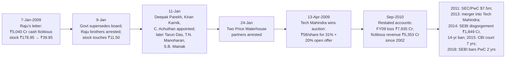

# I1 · Satyam Computer Services (2009): ₹5,040 crore that did not exist

> **The hook.** On the evening of 6 January 2009 Satyam Computer Services was India's fourth-largest IT services
> company: 53,000 employees, 654 clients including 185 of the Fortune 500, a New York listing, a Golden Peacock award
> for corporate governance, a Price Waterhouse audit opinion on ₹4,462 crore of cash and bank balances, and a share
> price that had just rallied 30% in a week on takeover talk. The next morning its chairman e-mailed the stock
> exchanges to say that ₹5,040 crore of the cash was fictitious, that ₹1,230 crore of borrowings were missing from the
> balance sheet, and that the September quarter's operating profit had been ₹61 crore, not ₹649 crore. The shares
> fell 78% that day. This is India's Enron — and, like Enron, the case is less about the cleverness of the fraud
> than about the tests nobody ran: the yield on the cash, the borrowing against "surplus" cash, the promoters' pledged
> shares, and a ₹7,800-crore related-party acquisition that made sense only if the cash was not there.

| | |
|:--|:--|
| **Period** | FY2004–FY2008 audited financials (set-up) · **6 January 2009** (decision) · Jan 2009–2018 (outcome) |
| **Decision date** | Close of **6 January 2009**, share price **₹178.95** (NSE). You may use only what was public by then: the FY2008 annual report and Form 20-F, the Q2 FY2009 results (17 October 2008), the Maytas announcement and its withdrawal (16–17 December), the World Bank debarment (23 December), the four independent-director resignations (25–29 December), the promoters' pledge disclosures (late December–early January) and the board meeting called for 10 January |
| **Sector** | IT services and BPO (India; NSE: SATYAMCOMP, NYSE: SAY). Fiscal year ends 31 March |
| **Themes** | Fictitious cash · the interest-income test · borrowing despite "surplus" cash · related-party acquisitions as a tell · promoter pledging · independent directors and the audit committee · auditor failure · what a government-appointed board and an auction can and cannot recover |
| **Modules this case reinforces** | [02.5 Cash-flow statement](../../02-accounting/05-the-cash-flow-statement.md) · [03.1 The disclosure universe (shareholding & pledges)](../../03-reading-filings/01-the-disclosure-universe.md) · [04.7 Quality of earnings](../../04-financial-analysis/07-quality-of-earnings.md) · [05.5 Management & capital allocation](../../05-business-analysis/05-management-and-capital-allocation.md) · [09.1 Why and how numbers lie](../../09-forensics/01-why-and-how-numbers-lie.md) · [09.2 Revenue red flags](../../09-forensics/02-revenue-red-flags.md) · [09.4 Cash-flow games](../../09-forensics/04-cash-flow-games.md) · [09.5 Governance red flags (India)](../../09-forensics/05-governance-red-flags-india.md) · [09.7 The forensic checklist](../../09-forensics/07-the-forensic-checklist.md) · [11.4 Position sizing](../../11-process/04-position-sizing-and-portfolio-construction.md) |
| **Difficulty** | Intermediate–Advanced (★★★☆☆). Do it after Module 09; pairs with [G4 Enron](../global/04-enron-2001.md) and [G9 Wirecard](../global/09-wirecard-2020.md) |
| **Time** | ~2.5 hours (about 60 minutes on sections 1–3 before you read on) |

!!! note "Conventions in this case"
    Indian GAAP standalone figures in ₹ crore unless stated (Satyam's consolidated revenue was slightly higher; its
    US GAAP 20-F figures are in US dollars). "As published" means the figures Satyam reported before the fraud was
    disclosed; "restated" means the figures in the FY2009 annual report prepared under the government-appointed
    board and audited by Deloitte, which carried the fraud's effects as prior-period adjustments. 1 crore = 10
    million. Share prices are NSE closes. Bracketed numbers point to the [Sources](#sources).

---

## 1. The scene (as of 6 January 2009)

### 1.1 The business

Satyam ("truth" in Sanskrit) was founded in Hyderabad in 1987 by B. Ramalinga Raju and his brother B. Rama Raju,
listed on the BSE in 1992 and on the NYSE (as ADSs) in 2001. By FY2008 it reported US-GAAP revenue of $2,138m, up
46%, net income of $417m, 50,570 associates, 654 active customers, a top customer at 4.9% of revenue and the top five
at 19.3%, with 60% of revenue from North America and 92% repeat business [[1]](#sources). Services were application
development and maintenance, ERP implementation, engineering services and BPO — the standard Indian offshore model,
in which revenue is billed per person-hour or per project and the largest cost is people. In FY2008 Satyam's
operating margin was 19.1% under US GAAP, against ~27–32% at Infosys and TCS — a gap the company attributed to mix
and pricing.

### 1.2 Governance on paper

The board had six independent directors, including Krishna Palepu (Harvard Business School, an authority on
corporate governance), Vinod Dham ("father of the Pentium"), Mangalam Srinivasan and M. Rammohan Rao (dean of the
Indian School of Business). Satyam had won the Golden Peacock Global Award for Excellence in Corporate Governance in
September 2008. The auditor was Price Waterhouse (the Indian network firm of PwC), which had audited the company
since 1991 [[1]](#sources) [[3]](#sources). The promoters' stake had fallen over the years to about 8.6% by
September 2008, much of it pledged to lenders — a fact visible in the shareholding disclosures once pledge
reporting became mandatory in early 2009, and partly inferable before that from the promoters' declining holding
[[3]](#sources) [[4]](#sources).

### 1.3 The three weeks before the decision date

- **16 December 2008.** After the close, the board approved the acquisition of **Maytas Properties** (for $1.3bn)
  and a 51% stake in **Maytas Infra** ($300m), both controlled by the Raju family (Maytas is Satyam spelled backwards),
  for a total of $1.6bn — roughly all of Satyam's reported cash. The rationale offered: "de-risking" the IT business
  by diversifying into infrastructure. The ADSs fell 55% in New York that night; institutional investors revolted;
  the board withdrew the deal within twelve hours. The NSE shares fell 30% on 17 December, to ₹158 [[5]](#sources)
  [[6]](#sources).
- **23 December.** The World Bank confirmed it had debarred Satyam for eight years from September 2008 for
  "improper benefits to Bank staff" and inadequate documentation of subcontractor charges [[7]](#sources).
- **25–29 December.** Mangalam Srinivasan, Krishna Palepu, Vinod Dham and Rammohan Rao resigned from the board.
  The company announced a board meeting for 10 January to consider a buyback and "strategic options".
- **Late December–early January.** Disclosures showed the promoters' holding falling from 8.6% to about 5% and then
  towards 3.6% as lenders sold pledged shares on margin triggers [[4]](#sources).
- **First week of January.** The stock rallied from ~₹135 to ₹178.95 on speculation that Satyam would be sold to a
  strategic buyer or would announce a large buyback on 10 January. DSP Merrill Lynch had been appointed to advise on
  options; it withdrew on the morning of 7 January.

### 1.4 The price on the decision date

At ₹178.95, Satyam's market value was ~₹12,000 crore (67.1 crore shares), about **7× trailing EPS of ₹25.66** and
roughly **2.7× the reported cash** of ₹4,462 crore. Infosys traded at ~14× and TCS at ~10× the same week
[[8]](#sources).

---

## 2. The numbers then

Everything here was public on 6 January 2009 [[1]](#sources) [[2]](#sources) [[9]](#sources).

**Table 2.1: Income statement, Indian GAAP standalone (₹ crore)**

| Item | FY2005 | FY2006 | FY2007 | FY2008 | Q2 FY2009 |
|:--|--:|--:|--:|--:|--:|
| Income from operations | 3,464 | 4,634 | 6,485 | 8,137 | 2,700 |
| Growth (%) | 36 | 34 | 40 | 25 | ~29 |
| Other income (mostly interest on deposits) | ≈70 | ≈100 | ≈150 | 257 | ≈95 |
| Operating profit (PBIDT) | ≈890 | ≈1,270 | ≈1,730 | 2,086 | 649 |
| PBIDT margin on total income (%) | ≈25 | ≈27 | ≈26 | 24.8 | 24.0 |
| Profit after tax | 750 | 1,240 | 1,423 | 1,716 | ≈581 |
| Basic EPS (₹, ₹2 share) | 11.7 | 19.0 | 21.5 | 25.66 | ≈8.7 |
| Dividend rate (%) | 150 | 225 | 175 | 175 | — |

Sources: [[2]](#sources) (FY2008 "as published" column) and Satyam's earlier annual reports; FY2005–07 rounded from the
company's own reports, Q2 FY2009 from the results release of 17 October 2008 and from the figures Raju's letter
later cited [[9]](#sources) [[10]](#sources). US GAAP consolidated revenue was $1,096m / $1,461m / $2,138m for
FY2006–08 [[1]](#sources).

**Table 2.2: Balance sheet, Indian GAAP standalone, as published (₹ crore)**

| Item | 31-Mar-2007 | 31-Mar-2008 | 30-Sep-2008 |
|:--|--:|--:|--:|
| Share capital + reserves | ≈5,600 | 7,358 | ≈8,300 |
| Secured loans | ≈25 | 24 | n/d |
| Net fixed assets + CWIP | ≈700 | 883 | n/d |
| Investments | ≈300 | 494 | n/d |
| Sundry debtors | ≈1,650 | 2,223 | 2,651 |
| **Cash and bank balances** | **≈3,700** | **4,462** | **5,361** |
| *of which on deposit accounts* | *≈2,900* | *3,318* | n/d |
| Accrued interest on deposits | n/d | n/d | 376 |
| Current liabilities + provisions | ≈1,050 | 1,441 | n/d |
| Debtor days (on quarterly revenue) | ≈92 | ≈98 | ≈88 |

Sources: [[2]](#sources) (FY2008 "as published" column); 30-Sep-2008 figures as later cited in Raju's letter
[[10]](#sources). US GAAP: cash $290.5m + bank deposits $826.7m = $1,117m at 31-Mar-2008 [[1]](#sources).

**Table 2.3: Cash flow, Indian GAAP standalone, as published (₹ crore)**

| Item | FY2008 |
|:--|--:|
| Operating profit before working-capital changes | 1,945 |
| Change in debtors | (574) |
| Cash generated from operations | 1,625 |
| Taxes paid | (212) |
| **Cash from operations** | **1,413** |
| Capex (net) | ≈(600) |
| Proceeds from secured loans / repayments | +1,002 / (390) |
| Dividends paid (incl. tax) | ≈(270) |
| CFO / PAT (×) | 0.82 |

Source: [[2]](#sources) (comparative column). Note the **₹1,002 crore of secured loans raised in FY2008** — visible in the
financing section — against a year-end secured-loan balance of just ₹24 crore: the company borrowed and repaid
short-term working-capital loans during a year in which it reported ₹4,462 crore of cash.

**Table 2.4: Valuation and derived ratios at the decision date (price ₹178.95)**

| Metric | Value | Working |
|:--|--:|:--|
| Shares outstanding | 67.1 crore | 134.1 crore of ₹2 capital [[2]](#sources) |
| Market capitalisation | ≈ ₹12,000 crore | 67.1 × 178.95 |
| Reported net cash | ≈ ₹4,440 crore | 4,462 − 24 |
| Enterprise value (reported) | ≈ ₹7,560 crore | |
| P/E (trailing FY2008 EPS ₹25.66) | 7.0× | |
| EV / PBIDT (FY2008) | 3.6× | 7,560 ÷ 2,086 |
| Price / book | 1.6× | 12,000 ÷ 7,358 |
| Implied yield on cash (other income ÷ average cash) | **≤ 6.3%** | 257 ÷ ((3,700 + 4,462)/2); other income includes non-interest items |
| 1-year bank FD rate, FY2008 | 8.5–9.5% | SBI/ICICI term-deposit cards, 2007–08 |
| Promoter holding | ≈ 3.6–5%, falling; largely pledged | [[4]](#sources) |

### 2.5 What the documents said (paraphrased)

1. **The 20-F (FY2008).** Bank deposits of $826.7m are described as term deposits with scheduled banks; interest
   income is reported within "other income". The auditor's report is unqualified [[1]](#sources).
2. **The Maytas announcement (16 December).** Satyam would pay $1.3bn for Maytas Properties (unlisted; owned by
   the Raju family) and $300m for 51% of Maytas Infra (listed), funded from "internal accruals and cash", to
   "de-risk the core business" [[5]](#sources). The ADS price fell 55% before Satyam withdrew the plan, citing
   "the reaction of investors" [[6]](#sources).
3. **The World Bank statement (23 December).** Debarred for eight years; the reason given was improper benefits to
   Bank staff and failure to document subcontractor fees [[7]](#sources).
4. **Director resignations.** Each resignation letter cited personal reasons or disagreement with the Maytas
   process; Palepu's cited the need to devote time to his academic work; none mentioned the accounts.
5. **The 10 January board meeting notice.** Agenda: "to consider a share buyback and other strategic options,
   including the possibility of a strategic investor".

---

## 3. You are the analyst

Answer these **before reading section 4**, using only the information above. Show your arithmetic.

1. **(Numerical — the interest-income test.)** Average cash and bank balances in FY2008 were ~₹4,080 crore, of which
   ~₹3,100 crore were term deposits. Other income was ₹257 crore *including* non-interest items. Compute the maximum
   implied yield on cash. Compare with FY2008 term-deposit rates (8.5–9.5%) and compute the "missing" interest
   at 8.5%. List the innocent explanations (current-account balances, money parked abroad at lower rates, timing)
   and how you would test each from the 20-F.
2. **(Numerical — the borrowing test.)** FY2008's cash-flow statement shows ₹1,002 crore of secured loans raised and
   ₹390 crore repaid, while reported cash rose from ₹3,700 to ₹4,462 crore. What kind of company borrows working
   capital while holding four times that amount in deposits? What is the *most* innocent explanation? What one
   question to management would resolve it?
3. **(Numerical — the Maytas deal as a valuation signal.)** Satyam offered $1.6bn (~₹7,800 crore at ₹48.5) for two
   companies controlled by its promoters. Maytas Infra's market value on 16 December was ~₹1,500 crore, so 51% was
   worth ~₹760 crore against the $300m (~₹1,455 crore) offered — a 90% premium. Maytas Properties was unlisted, with a
   land bank. Compute what fraction of Satyam's reported cash the deal would have consumed. Then answer: if the
   cash was real, what did the deal say about the promoters? If the cash was *not* real, what did the deal
   accomplish? Which of these two explanations makes the board's twelve-hour reversal more, and which less,
   reassuring?
4. **(Numerical — pledges.)** The promoters held ~8.6% in September 2008 and ~3.6% by early January, with the
   difference sold by lenders. Estimate the value of the pledged stake at the September price (~₹340) and at
   ₹135. If the promoters had borrowed against that stake to fund something, what was it? How would a 3.6%
   holder have voted on the Maytas deal, and why does that matter for what the deal was *for*?
5. **(Numerical — what is the company worth if the cash is fictitious?)** Assume real revenue is the reported figure
   less 20%, the real operating margin is 3% (as Q2 FY2009 turned out to be) rising to a "normal" 12% within two
   years under new ownership, and that ₹1,230 crore of undisclosed borrowings exist. Value the equity at 8× a
   normalised FY2011 operating profit and compute a per-share value. Then compute the expected value at ₹178.95
   under probabilities of (a) cash real, worth ₹250; (b) cash fictitious, your number. At what probability of
   fraud is the stock a buy?
6. **(Judgement — the independent directors.)** Four independent directors resigned within two weeks of a
   related-party deal being approved and reversed. Write the two possible interpretations. What could you learn from
   the *timing* (after the reversal, not before the vote)? What would you have asked Palepu, who had chaired the
   audit committee and written the standard textbook on financial statement analysis?
7. **(Red flags — score it.)** Run the Module 09 checklist ([09.7](../../09-forensics/07-the-forensic-checklist.md)) on
   Satyam as of 6 January 2009. Which items are Red, which Amber? Which single item would you have tried to verify,
   and how — in January 2009, with the tools then available (bank confirmations were not available to outsiders;
   the 20-F's deposit note; the auditor's fees; a peer comparison of yields)?
8. **(Decision.)** Long, avoid or short at ₹178.95 on the eve of the 10 January board meeting? For a long: the buyback
   and strategic-investor narrative. For a short: the four red flags above. Size it. How would an options trader have
   expressed "the distribution is bimodal" — and what did the stock's move on 7 January do to a short put?

---

## 4. What happened

**The letter (7 January 2009).** Raju's e-mail to the board, SEBI and the exchanges said the balance sheet at
30 September 2008 carried: inflated cash and bank balances of **₹5,040 crore** (against ₹5,361 crore in the books);
non-existent accrued interest of **₹376 crore**; an understated liability of **₹1,230 crore** for funds he had
arranged; and overstated debtors of **₹490 crore** (₹2,651 crore vs ₹2,161 crore actual). Q2 FY2009 revenue had been
₹2,112 crore, not ₹2,700 crore, and operating margin **₹61 crore (3%)**, not ₹649 crore (24%). "What started as a
marginal gap between actual operating profit and the one reflected in the books continued to grow over the years";
the Maytas deal had been "the last attempt to fill the fictitious assets with real ones". He said neither he nor
the managing director had taken a rupee, that no board member knew, and that ₹1,230 crore had been arranged over
two years "by resorting to pledging all the promoter shares" to keep operations going; "the last straw was the
selling of most of the pledged shares by the lenders on account of margin triggers". "It was like riding a tiger,
not knowing how to get off without being eaten." [[10]](#sources) [[3]](#sources)

The shares closed at ₹39.95 (−78%) on 7 January and touched ₹11.50 on 9 January [[8]](#sources) [[11]](#sources).
The Sensex fell 7% on the 7th, with IT and Hyderabad-linked stocks hit hardest.

**The rescue.** On 9 January the government superseded the board under the Companies Act; the Raju brothers and the
CFO Vadlamani Srinivas were arrested the same night. Deepak Parekh, Kiran Karnik and C. Achuthan were appointed on
11 January, joined by Tarun Das, T.N. Manoharan and S.B. Mainak. The board kept clients and 50,000 employees in place,
found that the company had roughly ₹400 crore of real cash and needed bank lines to pay salaries, and ran an auction
under SEBI's supervision. On 13 April 2009 **Tech Mahindra** (via Venturbay) bid **₹58 a share** against L&T's ₹45.90,
paying ₹1,756 crore for a 31% preferential allotment and a further ₹1,152 crore in the open offer, for 42.7% in all
[[12]](#sources) [[2]](#sources). The company was renamed Mahindra Satyam and merged into Tech Mahindra in 2013.

**The restatement (2010).** Deloitte's forensic accounting, published with the FY2009 annual report in September
2010, found [[2]](#sources):

| Fictitious item, 1-Apr-2002 to 30-Sep-2008 | ₹ crore |
|:--|--:|
| Fictitious revenue recorded | **5,352.8** |
| — of which translated into fictitious cash and bank balances | 4,870.2 |
| — of which fictitious debtors (incl. ₹18 crore of fictitious FX gain) | 501.0 |
| Fictitious interest income on fictitious fixed deposits | **899.8** |
| — of which shown as cash / as TDS receivable / as accrued interest | 327.1 / 197.0 / 375.7 |
| Fictitious net exchange gains | 206.1 |
| Opening differences before April 2002 (fictitious cash 996.4; debtors 55.7; unrecorded loans 70.0) | 1,122.1 |
| "Alleged advances" claimed by 37 companies (Raju's ₹1,230 crore), held in a suspense account | 1,230.4 |

Real cash and bank balances at 31 March 2009 were **₹407.6 crore** against ₹4,461.7 crore published a year earlier.
FY2009 income from operations was ₹8,406 crore — the *real* business was large; the fake part was the margin. The
restated FY2009 result was a **net loss of ₹7,935 crore**, including ₹6,243 crore of prior-period adjustments. The
fraud mechanism, per the CBI and SEBI: **7,561 fake invoices** generated through a hidden path in the invoicing system
that bypassed the normal workflow; forged bank statements and **fixed-deposit receipts** for accounts at real banks;
fictitious interest on the fictitious deposits; and, the CBI alleged, thousands of fictitious salary accounts
[[3]](#sources) [[13]](#sources).

**The consequences.** Price Waterhouse: two partners were arrested in January 2009; the SEC and PCAOB fined the PW
India firms $7.5m in 2011 for audit failures — including that the firm had relied on management-provided balance
confirmations rather than obtaining them directly from the banks; SEBI barred PwC's network firms from auditing
listed companies for two years in January 2018 (later overturned by SAT on jurisdiction, then appealed). SEBI's July
2014 order directed Raju, his brother and three executives to disgorge **₹1,849 crore** (₹544 crore from share
sales and ₹1,259 crore from borrowings against pledged shares, with 12% interest from 7 January 2009) and barred them
from the market for 14 years [[3]](#sources) [[14]](#sources). In April 2015 a CBI special court convicted Raju and nine
others and sentenced them to seven years; the appeals continued for years. Class actions in New York settled for
$125m (Satyam) and $25.5m (PwC) in 2011. Satyam's fall directly produced the pledge-disclosure requirement (SEBI,
January 2009), the strengthening of independent-director and audit-committee rules in Clause 49 and later the
Companies Act 2013, and the NFRA (2018) as an audit regulator [[3]](#sources).

---

## 5. Signals: knowable then vs hindsight

| Knowable on 6-Jan-2009 | Only in hindsight |
|:--|:--|
| **Yield on cash** at most ~6% against 8.5–9.5% deposit rates, for a company whose "deposits" were three-quarters of its cash | The scale: ₹5,040 crore of ₹5,361 crore did not exist, and the fraud went back before 2002 |
| **Borrowing** ₹1,002 crore of secured loans in a year of ₹4,462 crore of cash; the promoters pledging their whole stake and losing it to margin calls | That the pledged-share money was being *put into the company* to pay salaries — the missing ₹1,230 crore |
| **Maytas**: a related-party purchase, at a 90% premium for the listed part, consuming all the cash, approved unanimously and reversed in twelve hours | That the deal was designed to convert fictitious cash into real assets that nobody would later count |
| **Directors** resigning after the reversal; an audit-committee chairman who was a governance authority | Raju's claim that none of them knew, and the finding that the auditors had accepted confirmations from management |
| **Margins** consistently 8–12 points below Infosys/TCS despite similar pricing and delivery models | That the real margin was ~3%: the reported 24% was fiction and the gap to peers was the fiction's size |
| **World Bank debarment** for improper benefits — a conduct signal, unrelated to the accounts | The fake invoices to (real) clients and the invoicing-system back door |
| **Price**: 7× earnings and 2.7× "cash" — the market was already pricing something wrong, then rallied 30% on a buyback that would have needed the cash to exist | That it would take two years to restate, and that the business would survive under a new owner at ₹58 |

!!! success "The strongest bull case that existed at the time"
    A real company with 50,000 engineers, 654 clients and $2bn of revenue was trading at 7× earnings and less than 3×
    its audited cash because of one badly judged related-party deal that the board had already reversed. The
    independent directors had resigned in protest — governance working. A buyback or a strategic investor was on
    the agenda for 10 January; the auditor was a Big Four network firm with 17 years' tenure; the 20-F was filed with
    the SEC. At ₹179 the upside to a takeover at ₹250–300 was 40–70%.

    Every element of that case relied on the cash being real. The one test that bore on the cash — the yield —
    failed, and the one behaviour that would have been irrational with real cash — borrowing, pledging, and trying
    to spend all of it on the promoters' own companies — was on the record.

---

## 6. Lessons

1. **Cash earns interest; check the yield.** Other income ÷ average cash, compared with the deposit rate of the
   period, is a two-minute test. It fails for Satyam (≤6% vs 8.5–9.5%), for Wirecard (~0.6%), and for most fictitious-
   cash frauds, because the fraudster can invent cash but not the bank's interest credit.
   → [09.4 Cash-flow games](../../09-forensics/04-cash-flow-games.md) · [04.7 Quality of earnings](../../04-financial-analysis/07-quality-of-earnings.md)
2. **Companies with surplus cash do not borrow working capital, and their promoters do not pledge everything.**
   Debt taken while "cash-rich", and promoter pledges, are the two behaviours that reveal cash that cannot be used.
   → [09.5 Governance red flags (India)](../../09-forensics/05-governance-red-flags-india.md) · [03.1 Disclosure universe: shareholding & pledges](../../03-reading-filings/01-the-disclosure-universe.md)
3. **A related-party acquisition that consumes all the cash is a statement about the cash.** Ask what the deal is
   *for*. If it makes no sense as an investment, consider that it makes sense as a conversion.
   → [05.5 Management & capital allocation](../../05-business-analysis/05-management-and-capital-allocation.md) · [02.8 Related parties](../../02-accounting/08-deeper-cuts-group-accounts-and-other.md)
4. **A persistent margin gap to peers with the same model needs an explanation, not a discount.** Satyam's "lower
   margin" was the size of the fraud. Either the company is worse at the business or the numbers are not comparable;
   find out which.
   → [04.2 Margins & cost structure](../../04-financial-analysis/02-margins-and-cost-structure.md) · [05.1 Business models & unit economics](../../05-business-analysis/01-business-models-and-unit-economics.md)
5. **Governance awards, famous directors and Big Four auditors are not verification.** Independent directors
   approved Maytas unanimously; the audit-committee chairman wrote the textbook; the auditor took the company's word
   for the bank balances. Look at what each gatekeeper *did*.
   → [09.5 Governance red flags (India)](../../09-forensics/05-governance-red-flags-india.md)
6. **A fraud can sit inside a real business.** Satyam's ₹8,400 crore of real revenue and its clients survived; the
   equity did not, because the fictitious 20% of revenue was 90% of the profit. Value the real business, then ask
   what the fake part was protecting.
   → [06.1 What value is](../../06-valuation/01-what-is-value.md)
7. **"Cheap" is a symptom.** At 7× earnings and 2.7× cash, the market had already priced a problem. A low multiple on
   a suspect balance sheet is not a margin of safety; it is the market's estimate of the probability that the balance
   sheet is false.
   → [06.8 Margin of safety](../../06-valuation/08-margin-of-safety-and-expected-value.md) · [11.4 Position sizing](../../11-process/04-position-sizing-and-portfolio-construction.md)
8. **Recovery exists but is slow and partial.** A government board, a supervised auction and a credible acquirer
   preserved the business and gave shareholders ₹58 (vs ₹179 the day before, ₹340 in September, ₹11.50 at the low);
   the promoters' disgorgement and convictions took 6–15 years.
   → [11.5 Monitoring & selling](../../11-process/05-monitoring-and-selling.md)

---

## 7. Model answers

<strong>Q1 — The interest-income test</strong>

Maximum implied yield = 257 ÷ 4,080 = **6.3%**, and that treats all other income as interest. At 8.5% on ~₹3,100
crore of term deposits alone, expected interest ≈ ₹265 crore; on ₹4,080 crore of total cash at a blended 7% (some in
current accounts) ≈ ₹285 crore. "Missing" interest ≈ ₹30–100 crore a year — modest in itself, but the direction is
consistent every year, and the restatement showed why: fictitious interest of ₹900 crore was booked over 6.5 years on
fictitious deposits that grew to ₹5,000 crore, i.e. an average yield of roughly 4–5% on the fake balances, below
deposit rates because inventing more interest would have required inventing more cash. Innocent explanations and
tests: balances held abroad at USD rates (the 20-F says deposits are with scheduled banks in India: test fails);
timing (deposits placed late in the year: check the quarterly cash progression, which showed steady balances);
current-account float (₹1,140 crore of the ₹4,462 crore at 31-Mar-08 was in current accounts — plausible for a
payroll-heavy company, but it makes the deposit yield *higher*, not lower).

<strong>Q2 — The borrowing test</strong>

A company that holds ₹3,300 crore in term deposits and borrows ₹1,000 crore of packing credit is either arbitraging
export-credit subsidies (borrow cheap FX packing credit at ~LIBOR+, deposit in rupees at 9% — the most innocent
explanation, and one several IT companies used in small amounts), or cannot access its deposits. The question:
"Which banks hold the term deposits, at what rates, and can we see the confirmations?" — a question the audit
committee, not an outside analyst, could ask. The outsider's proxy: does the interest income match the deposits?
(Q1: no.) And does the company *behave* cash-rich — dividends at 175% of a ₹2 par (₹3.50, a 1% yield), no buyback
ever, and a plan to spend all the cash on the promoters' companies — or cash-poor? It behaved cash-poor.

<strong>Q3 — Maytas</strong>

₹7,800 crore ÷ ₹5,361 crore of reported cash at 30-Sep-08 = **145%** — more than all of it, with the balance from
"internal accruals" (i.e., future cash). If the cash was real, the promoters were expropriating minorities by
selling their own illiquid land bank to the company at a price of their choosing — a governance failure that
justifies exit but not a zero. If the cash was not real, the deal converted a fictitious asset into a real one whose
value nobody could check (land), closed the gap between the books and reality, and rewarded the promoters' family
companies with paper that would later be unwound. The reversal is *reassuring* under the first explanation (the board
listened to shareholders) and *alarming* under the second (the last attempt to fix the hole failed, and the hole
still exists). Raju's letter used exactly those words: "the last attempt to fill the fictitious assets with real
ones".

<strong>Q4 — Pledges</strong>

8.6% of 67.1 crore shares ≈ 5.8 crore shares; at ₹340 ≈ **₹1,960 crore**; at ₹135 ≈ ₹780 crore. Lenders sold ~5% of the
company (≈3.4 crore shares) into a falling market — a margin call of roughly ₹500–700 crore. Borrowing that size,
against a stake in a company that supposedly had ₹5,000 crore of idle cash and paid a 1% dividend, has no innocent
purpose at the *personal* level either: SEBI later found the pledge proceeds (₹1,259 crore) had been put into
Satyam — the "₹1,230 crore of funds arranged". A 3.6% holder has no voting power over a deal that needs shareholder
approval; the Maytas deal was structured as a board decision precisely because the promoters could not have won a
vote — and the ADS holders' revolt showed why.

<strong>Q5 — Value if the cash is fictitious</strong>

Real revenue ≈ 8,137 × 0.8 ≈ ₹6,500 crore (the restatement showed FY09 real revenue of ₹8,400 crore, so this is
conservative on revenue and the fake part was in margin). FY2011 normalised operating profit at 12% on ₹7,500
crore ≈ ₹900 crore; × 8 = ₹7,200 crore EV; less ₹1,230 crore of hidden debt and ~₹1,000 crore of restructuring,
litigation and class-action costs; plus ~₹400 crore of real cash → equity ≈ ₹5,400 crore ÷ 67.1 crore ≈ **₹80 a share**
before dilution — in the region of the ₹58 Tech Mahindra paid after a 31% dilution and with a client base at risk. At
₹178.95: p × 250 + (1 − p) × 80 = 178.95 → **p ≈ 58%** — the market was pricing roughly a 40% chance that the cash was
fictitious. For a buy you needed to believe the cash was real with >60% confidence; the tests in Q1–Q4 pointed the
other way.

<strong>Q6 — The independent directors</strong>

Interpretation A: they were deceived, voted for Maytas on management's presentation, and resigned once the process
(and their reputations) had been damaged. Interpretation B: they suspected something after the reversal and left
before it surfaced. The *timing* — after the reversal, not as a refusal to vote — argues for A: nobody resigned to
block the deal. What to ask the audit-committee chairman: had the committee ever seen bank confirmations obtained
directly by the auditor? Why were deposits earning below the deposit rate? Why did the company borrow packing credit?
Why was the internal audit not asked about the invoicing system? The answers would have been "no", "we did not ask",
and "we did not know" — which is the point: independence is a status, not an activity.

<strong>Q7 — Forensic score</strong>

Red: cash yield; borrowing vs cash; promoter pledging and forced sales; related-party acquisition at a premium
consuming the cash; auditor tenure 17 years with the same firm and no evidence of direct bank confirmation; margin
gap to peers; debtor days ~90–100 vs Infosys ~60–65. Amber: World Bank debarment (conduct); director resignations
(ambiguous); a buyback announced by a company that could not spend its cash. Green: client roster and revenue
reality, which the restatement confirmed. The single verification: compute the yield on cash across FY2003–08 and
compare with Infosys/TCS/Wipro (all yielding 7–9% on their treasury). A three-column table would have shown Satyam as
the outlier every year.

<strong>Q8 — Decision</strong>

Long at ₹179: expected value ≈ ₹180 at the market's own probabilities, negative asymmetry (+40%/−55% even on the Q5
numbers, and −94% in the event), with a catalyst (10 January) whose outcome the analysis could not predict —
**avoid**. Short: the bimodal distribution and the four Reds favoured it, but the squeeze from ₹135 to ₹179 in a week
and the borrow cost in a small, crowded float were real path risks; size at 1–2% with a stop above ₹200. Options: an
options trader who thought the distribution was bimodal would buy the wings — a strangle — rather than sell
anything; Satyam's January puts were priced for a ±20% move on the board meeting, not −78%. A short put sold for
"income" on the 6th was assigned at ₹40 the next day: selling volatility on a name with an unverifiable balance sheet
is the trade that a vol trader should recognise as picking up pennies in front of a confession.

---

## 8. Discussion questions & extensions

1. **The yield screen.** Build a screen for Indian companies with cash and investments above 20% of assets and
   treasury income below 5% of the average balance ([tools.md](../../appendix/tools.md), `fi.ratios`). What does
   the list look like today, and how many have an innocent explanation (foreign subsidiaries, restricted cash, margin
   money)?
2. **Pledge disclosure.** SEBI mandated pledge disclosure only after Satyam. Using today's shareholding-pattern
   filings, find three companies where promoters have pledged over 50% of their holding, and write the "what is the
   money for?" question for each ([03.1](../../03-reading-filings/01-the-disclosure-universe.md)).
3. **Recovery value.** Tech Mahindra paid ₹58 a share. Was that a bargain? Reconstruct its return on the ₹2,900
   crore invested using Mahindra Satyam's FY2011–13 results and the 2013 merger ratio.
4. **The auditors' defence.** Price Waterhouse said it relied on confirmations that turned out to be forged.
   Explain what the auditing standard (SA 505, external confirmations) requires, and why "we were deceived" is not a
   defence when the confirmation came through the client.
5. **Compare the three cash frauds.** Enron ([G4](../global/04-enron-2001.md)) faked *earnings* and hid *debt*;
   Wirecard ([G9](../global/09-wirecard-2020.md)) and Satyam faked *cash*. Which of the three would the interest-
   income test have caught, which the borrowing test, and which needed a different test entirely?

---

## Sources

All accessed 22-Sep-2026.

[1]: https://www.sec.gov/Archives/edgar/data/1106056/000114554908001441/u93288e20vf.htm
[2]: https://insights.techmahindra.com/investors/mahindra-satyam-annual-report-2008-09-and-2009-10.pdf
[3]: https://en.wikipedia.org/wiki/Satyam_scandal
[4]: https://www.business-standard.com/article/markets/the-satyam-effect-109011201084_1.html
[5]: https://www.sec.gov/Archives/edgar/data/0001106056/000114554908002076/u93403e6vk.htm
[6]: https://www.business-standard.com/article/technology/investors-force-satyam-to-call-off-acquisitions-108121801017_1.html
[7]: https://knowledge.wharton.upenn.edu/article/scandal-at-satyam-truth-lies-and-corporate-governance/
[8]: https://www.cnbc.com/2009/01/08/satyam-in-crisis-shares-freefall-as-investors-flee.html
[9]: https://www.businesstoday.in/magazine/cover-story/story/the-great-satyam-robbery-245694-2009-01-20
[10]: https://www.sec.gov/Archives/edgar/data/1106056/000114554909000025/u00107exv99w2.htm
[11]: https://hdfcsky.com/sky-learn/market-wtf-by-sky/satyam-accounting-fraud-share-price-collapse-to-near-zero
[12]: https://www.forbes.com/2009/04/13/satyam-tech-mahindra-markets-equity-outsourcing.html
[13]: https://www.sebi.gov.in/sebi_data/attachdocs/1441894262377.pdf
[14]: https://www.thequint.com/news/india/satyam-rajus-letter-of-confession

Source [2] contains the restated FY2009 accounts with Deloitte's qualified report and the forensic findings (Note 3
of Schedule 18) and the FY2008 "as published" comparatives. Source [13] is SEBI's 2015 order against related entities,
which recites the 2014 disgorgement findings.

---
[← Previous: G10 · Buffett buys Apple (2016)](../global/10-apple-2016.md) · [Module index](../index.md) · [Next: I2 · Asian Paints →](02-asian-paints-compounder.md)
