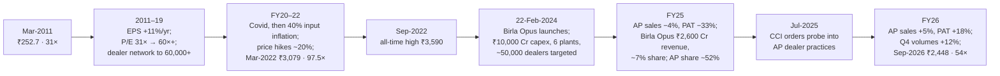

# I2 · Asian Paints (2011 → 2022 → 2026): a compounder, its price, and the day a competitor arrived

> **The hook.** Between March 2002 and March 2011 Asian Paints grew sales 4.6× and profit 6.8×, earned an average
> return on capital above 50%, needed almost no debt, and paid out half its earnings. Its market value rose 11.5×. A
> buyer at the end of that decade, at 31× earnings, then made 25% a year for the next eleven years — and, by March
> 2022, owned a stock at **97.5× earnings**. Two years later a conglomerate with ₹10,000 crore to spend launched a
> rival brand, took 7–10% of the market in eighteen months, and Asian Paints' share price fell 40% from its high while
> its earnings kept growing. This case is the mirror of [G3 Cisco](../global/03-cisco-2000.md): the business was and
> is excellent; the questions are what a moat built on distribution is worth, what price a compounder can bear, and
> how to recognise the moment when the capital cycle turns against even the best company in an industry.

| | |
|:--|:--|
| **Period** | FY2002–FY2011 (set-up) · **31 March 2011** (decision A) · FY2012–FY2022 · **31 March 2022** (decision B) · 2022–2026 (outcome) |
| **Decision dates** | **A:** close of 31 March 2011, ₹2,527 (₹252.7 adjusted for the 2013 1:10 split), market cap ₹24,238 crore. **B:** close of 31 March 2022, ₹3,079, market cap ≈ ₹2.95 lakh crore. Use only what was public on each date |
| **Sector** | Decorative and industrial paints; home décor (NSE: ASIANPAINT). Fiscal year ends 31 March |
| **Themes** | Distribution as a moat · working capital and the supply chain · sustained ROCE and the reinvestment rate · what growth is worth · multiple expansion as a return source · the capital cycle and a well-funded entrant · the "quality at any price" trap · monitoring a moat |
| **Modules this case reinforces** | [04.3 Returns on capital](../../04-financial-analysis/03-returns-on-capital.md) · [04.4 Working capital](../../04-financial-analysis/04-working-capital-and-cash-conversion.md) · [05.3 Moats](../../05-business-analysis/03-moats-and-competitive-advantage.md) · [05.4 Capital cycle](../../05-business-analysis/04-capital-cycle-and-competition.md) · [06.1 What value is](../../06-valuation/01-what-is-value.md) · [06.5 Multiples](../../06-valuation/05-relative-valuation-and-multiples.md) · [06.6 Reverse DCF](../../06-valuation/06-reverse-dcf-and-expectations.md) · [08.3 Consumer & retail](../../08-sectors/03-consumer.md) · [11.5 Monitoring & selling](../../11-process/05-monitoring-and-selling.md) · [12.2 Market cycles](../../12-macro-special-sits/02-market-cycles-and-sentiment.md) |
| **Difficulty** | Intermediate (★★★☆☆). Do it after Modules 05 and 06; pairs with [G1 See's Candies](../global/01-sees-candies-1972.md), [G3 Cisco](../global/03-cisco-2000.md) and [I13 DMart](13-dmart-avenue-supermarts.md) |
| **Time** | ~3 hours (two decision points; about 45 minutes on each before reading on) |

!!! note "Conventions in this case"
    ₹ crore; Indian GAAP standalone for FY2002–FY2011 (from the company's ten-year review), Ind AS consolidated for
    FY2015 onwards (from published results). Per-share figures before August 2013 are adjusted for the 1:10 split;
    the company had 95.9 crore shares of ₹1 after the split (9.59 crore of ₹10 before). Share prices are NSE closes.
    Bracketed numbers point to the [Sources](#sources).

---

## 1. The scene

### 1.1 The business (as of March 2011)

Asian Paints was founded in a Bombay garage on 1 February 1942 by four friends — Champaklal Choksey, Chimanlal
Choksi, Suryakant Dani and Arvind Vakil — and became India's largest paint company in 1967 [[1]](#sources). Its
economics rest on three decisions taken decades before most of its shareholders were born:

- **Sell direct to dealers, not through wholesalers.** In the 1950s–60s Choksey cut out distributors and supplied
  tens of thousands of small retailers directly, with the company's own depots and trucks. Paint is bulky, has
  hundreds of SKUs (shade × finish × pack size), and a retailer's working capital is limited; a supplier who
  delivers small quantities several times a week wins the shelf. By 2011 the company served roughly 25,000–30,000
  dealers directly; by 2024, 74,000 dealers and 1.6 lakh retail touchpoints [[2]](#sources) [[3]](#sources).
- **Forecast demand, do not chase it.** In 1970 the company bought a mainframe (reportedly the first in Indian
  private industry) to forecast SKU-level demand by location; the supply chain has been rebuilt on that logic ever
  since (i2 planning in the 2000s, SAS forecasting later). Replenishment to dealers runs up to three or four times
  a day in large cities [[4]](#sources). The result shows up in the numbers: inventory and receivables that are low
  for a consumer-products company with 1,500+ SKUs, and a business that funds itself.
- **Own the point of sale.** From the late 1990s Asian Paints installed **Colour World** tinting machines at dealers
  — a base-paint-plus-colourant dispenser that lets a small shop offer thousands of shades from a few base SKUs.
  The machine is the company's; the dealer's shelf space and emulsion sales migrate to it. By FY2011, "more than
  18,000" dealers were on the Colour World network and "most of the emulsion paint sale" ran through it
  [[2]](#sources); by the 2020s the company had more than 50,000 tinting machines against a combined ~46,000 at
  Berger and Nerolac [[4]](#sources).

Around this core: brands (Royale, Apex, Tractor, Apcolite) at every price point; the industry's largest
manufacturing footprint (Rohtak commissioned 2010, Khandala 2013); a small industrial-coatings JV with PPG;
international units in the Middle East, South Asia, Africa and the Pacific; and a management team that was
professional (P.M. Murty was MD in 2011; K.B.S. Anand from 2012; Amit Syngle from 2020) while the three founding
families (Choksi, Dani, Vakil — the Choksey branch sold out in 1997) held about 48–53% and sat on the board
[[1]](#sources) [[2]](#sources).

### 1.2 The industry

Indian decorative paint was an oligopoly with a stable pecking order: Asian Paints (~40% of the organised
market in 2011, rising to ~50%+ by the 2020s), Berger (~15–18%), Kansai Nerolac (~15%, stronger in auto/industrial),
Akzo Nobel India/Dulux (~10%) and Shalimar, plus a long tail of unorganised makers being squeezed by GST and
distribution. Demand grew at roughly 1.5–2× real GDP: 70% of decorative volume is repainting, which rises with
incomes and the shortening of repainting cycles; the rest is new construction. Raw materials — titanium dioxide,
crude-derived solvents and monomers — are ~55–60% of sales and are passed through with a lag [[2]](#sources).

### 1.3 The scene at decision B (March 2022)

By FY2022 the company had crossed ₹29,000 crore of consolidated sales, held ~55–60% of the organised decorative
market, had added waterproofing (SmartCare), wood finishes, adhesives, and a "Beautiful Homes" décor and services
platform (Sleek kitchens and Ess Ess bath fittings, acquired in 2014; White Teak lighting, 2022), and had spent two
years demonstrating pricing power through the sharpest raw-material inflation in a decade. It was one of the
market's "quality compounders", held in every institutional and retail portfolio, and had traded above 60× earnings
for most of the previous five years [[3]](#sources) [[5]](#sources).

Two entrants were on record. **JSW Paints** had launched in 2019 with a "one price for all colours" pitch and had
filed a CCI complaint in 2020 alleging Asian Paints was pressuring dealers not to stock it (the CCI found
insufficient evidence in 2022) [[6]](#sources). And on 24 May 2021 **Grasim Industries** (Aditya Birla group) had
announced it would enter decorative paints with ₹5,000 crore of capex — raised to **₹10,000 crore** in May 2022 —
building six plants with ~1.3 billion litres of capacity, more than Berger's entire footprint, with a launch planned
for early 2024 and access to the group's ~2 lakh UltraTech cement dealers [[6]](#sources) [[7]](#sources).

---

## 2. The numbers then

**Table 2.1: The first decade — standalone ten-year review (₹ crore)** [[2]](#sources)

| FY | Net sales | Growth (%) | Materials (% sales) | Operating profit | PBT margin (%) | PAT | ROCE (%) | RONW (%) | Loan funds | Net current assets | Market cap (31-Mar) |
|:--|--:|--:|--:|--:|--:|--:|--:|--:|--:|--:|--:|
| 2002 | 1,371 | 11.2 | 53.0 | 237 | 13.2 | 114 | 33.6 | 27.8 | 111 | 130 | 2,106 |
| 2003 | 1,535 | 11.9 | 52.6 | 280 | 14.6 | 142 | 42.1 | 32.0 | 104 | 125 | 2,119 |
| 2004 | 1,696 | 10.5 | 55.6 | 291 | 14.0 | 148 | 41.2 | 29.3 | 71 | 64 | 2,914 |
| 2005 | 1,955 | 15.2 | 57.7 | 325 | 14.1 | 174 | 44.0 | 31.4 | 88 | 113 | 3,751 |
| 2006 | 2,319 | 18.7 | 58.3 | 387 | 14.6 | 187 | 49.7 | 31.3 | 91 | 143 | 6,178 |
| 2007 | 2,821 | 21.7 | 58.9 | 464 | 14.6 | 272 | 52.9 | 39.8 | 126 | 211 | 7,336 |
| 2008 | 3,419 | 21.2 | 57.2 | 615 | 16.5 | 375 | 60.5 | 44.9 | 95 | 93 | 11,510 |
| 2009 | 4,270 | 24.9 | 61.1 | 619 | 13.0 | 362 | 51.3 | 35.8 | 75 | 270 | 7,539 |
| 2010 | 5,125 | 20.0 | 55.4 | 1,154 | 21.1 | 775 | 78.2 | 58.4 | 69 | (118) | 19,593 |
| 2011 | 6,322 | 23.4 | 57.7 | 1,233 | 17.8 | 775 | 62.1 | 43.9 | 65 | (16) | 24,238 |

EPS FY2011: ₹80.8 (₹8.08 split-adjusted); dividend 320% on ₹10 par (₹32; payout ~46% including tax); book value
₹205.9 (₹20.6); employees 4,640; ROCE and RONW on average capital. Net current assets *negative* in FY2010–11:
the business was funded by its dealers and suppliers. Fixed assets rose from ₹384 crore to ₹1,097 crore over the
decade while sales rose ₹4,950 crore — roughly ₹0.15 of fixed capital per rupee of new sales.

**Table 2.2: The second decade — consolidated (₹ crore)** [[3]](#sources) [[5]](#sources)

| FY | Sales | Growth (%) | Operating profit | OPM (%) | PAT | EPS (₹) | Payout (%) | ROCE (%) | Debtor days | Inventory days | Borrowings |
|:--|--:|--:|--:|--:|--:|--:|--:|--:|--:|--:|--:|
| 2012 | ≈9,630 | 24 | ≈1,570 | 16 | ≈990 | ≈10.3 | ≈40 | ≈45 | — | — | small |
| 2013 | ≈10,940 | 14 | ≈1,750 | 16 | ≈1,110 | ≈11.6 | ≈40 | ≈40 | — | — | small |
| 2014 | ≈12,715 | 16 | ≈2,000 | 16 | ≈1,220 | ≈12.7 | ≈41 | ≈38 | — | — | small |
| 2015 | 13,615 | 7 | 2,243 | 16 | 1,427 | 14.54 | 42 | 42 | 32 | 123 | 418 |
| 2016 | 14,271 | 5 | 2,725 | 19 | 1,803 | 18.19 | 41 | — | — | — | — |
| 2017 | 15,062 | 6 | 2,994 | 20 | 2,016 | 20.22 | 51 | — | — | — | — |
| 2018 | 16,825 | 12 | 3,204 | 19 | 2,098 | 21.26 | 41 | — | — | — | — |
| 2019 | 19,240 | 14 | 3,765 | 20 | 2,208 | 22.48 | 47 | — | — | — | — |
| 2020 | 20,211 | 5 | 4,162 | 21 | 2,774 | 28.20 | 43 | 33 | 32 | 127 | 1,118 |
| 2021 | 21,713 | 7 | 4,856 | 22 | 3,207 | 32.73 | 55 | — | — | — | — |
| 2022 | 29,101 | 34 | 4,804 | 17 | 3,085 | 31.59 | 61 | — | — | — | — |

FY2012–14 are approximate (from results releases); the FY2015 sales figure reflects a change in revenue presentation.
FY2022's 34% growth included ~20% of price increases passed through after a ~40% rise in input costs; the margin fell
five points and profit was flat.

**Table 2.3: Valuation at the two decision dates**

| Metric | A: 31-Mar-2011 | B: 31-Mar-2022 |
|:--|--:|--:|
| Price (split-adjusted) | ₹252.7 | ₹3,079 |
| Market cap | ₹24,238 crore | ≈ ₹2,95,000 crore |
| Trailing EPS | ₹8.08 (standalone) | ₹31.59 (consolidated) |
| **P/E** | **31×** | **97.5×** |
| Trailing PAT growth, 5-yr CAGR | 33% (FY06–11) | 9% (FY17–22) |
| Trailing sales growth, 5-yr CAGR | 22% | 14% |
| Dividend yield | 1.3% | 0.6% |
| Earnings yield vs 10-yr G-sec | 3.2% vs 8.0% | 1.0% vs 6.8% |
| P/B | 12× | 22× |
| ROCE | 62% | ≈ 30% (consolidated, after décor and capex) |
| Net cash | yes (₹65 crore of loans vs ₹1,035 crore of investments) | yes |
| Nifty 50 trailing P/E | ≈ 22× | ≈ 22× |

Sources: [[2]](#sources) [[3]](#sources) [[5]](#sources). The March 2022 P/E of 97.5× is as tabulated by stockanalysis.com
[[5]](#sources); the market cap uses 95.9 crore shares.

---

## 3. You are the analyst

### Decision A (31 March 2011, ₹252.7, 31× earnings)

1. **(Numerical — reinvestment economics.)** Over FY2002–FY2011 the company generated ₹3,360 crore of cumulative PAT,
   paid out roughly 45%, and raised its fixed assets by ₹710 crore and its investments by ₹970 crore. Compute the
   incremental return on the capital it actually retained in the *business* (ignore financial investments), and the
   fixed-asset turnover in FY2011. What does that say about how much growth the company can fund without diluting
   or borrowing? ([04.3](../../04-financial-analysis/03-returns-on-capital.md))
2. **(Numerical — the working-capital moat.)** Net current assets were negative in FY2010 and FY2011 on ₹6,300 crore of
   sales. Estimate what a "normal" paint company (say Berger, at ~60 debtor days and ~50 inventory days and 30 payable
   days) would need in working capital at the same sales, and translate the difference into ROCE points.
3. **(Numerical — what does 31× require?)** Run a reverse DCF: FCF ≈ PAT (capital-light), cost of equity 13% (rf 8%,
   ERP 5%), terminal growth 6%. What growth rate for ten years does ₹24,238 crore imply? Compare with the trailing
   five-year PAT CAGR of 33% and sales CAGR of 22%. ([06.6](../../06-valuation/06-reverse-dcf-and-expectations.md))
4. **(Judgement — the moat.)** Name the moat's components and, for each, the competitor action that could erode it and
   the capital it would take. Which component would a very well-funded entrant find hardest to copy, and why?
5. **(Decision A.)** Buy, hold or avoid at 31×? State the expected ten-year return under (i) 15% EPS growth with the
   P/E falling to 25×, (ii) 20% growth and P/E unchanged, (iii) 12% growth and P/E 20×.

### Decision B (31 March 2022, ₹3,079, 97.5× earnings)

6. **(Numerical — decompose the eleven-year return.)** Price rose from ₹252.7 to ₹3,079. Split the 25.5% annual return
   into EPS growth, multiple change and dividends ([01.5](../../01-markets-101/05-time-value-and-returns-math.md)).
   What fraction came from the re-rating from 31× to 97.5×?
7. **(Numerical — what does 97.5× require?)** Repeat Q3 at March 2022 with cost of equity 11.5% (rf 6.8%, ERP 5%, β 0.9)
   and terminal growth 5%. What ten-year growth does ₹2.95 lakh crore imply, and what would the company's FY2032
   profit have to be? Compare with the FY2017–22 PAT CAGR of 9%.
8. **(Numerical — the entrant.)** Grasim will spend ₹10,000 crore on ~1.3 billion litres of capacity in an industry
   where Asian Paints' FY2022 decorative volume was about 1.4 billion litres and the whole organised market ~3.5
   billion litres. If Grasim targets ₹10,000 crore of revenue at "full scale", what market share is that? What
   happens to industry pricing when a new entrant needs 25–30% utilisation just to cover fixed costs and has a
   parent that can lose ₹1,000 crore a year for five years? Use the capital-cycle framework
   ([05.4](../../05-business-analysis/04-capital-cycle-and-competition.md)).
9. **(Judgement — what to monitor.)** Write five dated thesis-breakers for a holder at ₹3,079 that the entrant could
   trigger, each observable in a quarterly disclosure (volume growth vs value growth; gross margin; dealer additions;
   trade-spend/other expenses ratio; market-share commentary; receivable days).
10. **(Decision B.)** Hold, trim or sell? Compute the expected five-year return if EPS compounds at 12% and the P/E
    settles at 50×, 40× and 30×. Which of those P/Es did you need to believe in to hold?

---

## 4. What happened

**2011–2022: the compounding decade.** Consolidated PAT rose from ~₹840 crore (FY2011) to ₹3,085 crore (FY2022),
about 12.5% a year; sales roughly quadrupled to ₹29,101 crore; the dealer network doubled; the company built two
mega-plants (Khandala 2013, Mysuru 2018, Visakhapatnam 2019) and kept ROCE above 30% even after the décor
acquisitions. Berger grew slightly faster from a smaller base; Nerolac and Akzo lost share. The stock's P/E went
from 31× to a range of 50–70× by 2017–19, and to 97.5× by March 2022 — the share price compounded at 25.5% a year
while earnings compounded at 12–13%. Roughly **half of the eleven-year return was re-rating** [[3]](#sources)
[[5]](#sources).

**2022–2024: the top.** The all-time high was ₹3,590 on 28 September 2022, after two quarters in which the company had
recovered margins through price increases and the market had rewarded "pricing power" [[5]](#sources)
[[8]](#sources). FY2023 and FY2024 were strong: sales ₹34,489 crore and ₹35,495 crore, PAT ₹4,195 crore and ₹5,558
crore (FY2024 helped by a raw-material deflation that took the operating margin to 21%). The P/E fell to 64× by March
2023 and ~50× by March 2024 as earnings caught up with the price [[3]](#sources) [[5]](#sources).

**2024–2025: Birla Opus.** Grasim launched the brand on 22 February 2024 — six plants, 1,332 million litres of
capacity, ~₹10,000 crore of capex, a full range at launch, national advertising, dealer margins and contractor
schemes designed to buy shelf space, and free tinting machines (the company said it had placed ~45,000 by 2025)
[[7]](#sources) [[9]](#sources). In its first full year (FY2025) it reported ₹2,600–2,700 crore of revenue and a
high-single-digit share of decorative paints — the fastest scale-up in the industry's history; by early 2026 it
claimed a revenue share above 10% while its parent absorbed operating losses [[9]](#sources) [[10]](#sources). JSW
Paints, separately, agreed in June 2025 to acquire Akzo Nobel India for about ₹9,000 crore, creating a third
well-capitalised challenger.

Asian Paints' FY2025: sales **−4.5%** to ₹33,906 crore, operating margin down three points to 18%, PAT **−33%** to
₹3,710 crore (including a one-off gain the previous year); management spoke of "muted demand", "heightened
competitive intensity" and higher trade spends; the decorative market share, by broker estimates, fell from ~59% to
~52% [[3]](#sources) [[10]](#sources). Q4 FY2025 profit fell 45% [[11]](#sources). The stock fell to ₹2,116 in
April 2025, **41% below the 2022 high** and below the March 2022 price, while the Nifty had risen ~30% over the same
period [[5]](#sources). In July 2025 the CCI ordered an investigation into Grasim's complaint that Asian Paints had
abused its dominance — exclusivity-linked discounts and foreign trips for dealers, slower credit for dealers that
stocked Birla Opus, pressure against rival tinting machines, and pressure on suppliers and landlords
[[6]](#sources).

**FY2026: the response.** Asian Paints cut costs, raised trade support selectively, launched at the value end,
added over 4,000 retailers in Q4 alone, and reported FY2026 sales of ₹35,584 crore (+5%) and PAT of ₹4,395 crore
(+18%); Q4 FY2026 decorative volumes grew 12.4% and the operating margin recovered to 19.3% [[12]](#sources)
[[13]](#sources). Surveys suggested Birla Opus's share gains had slowed [[10]](#sources). In September 2026 the
stock traded at ₹2,448, **54× trailing earnings**, with a market cap of ₹2.34 lakh crore: earnings 43% above
March 2022, the price 20% below [[3]](#sources).

---

## 5. Signals: knowable then vs hindsight

| Knowable | Only in hindsight |
|:--|:--|
| **At A (2011):** ROCE >50% with negative working capital, ₹0.15 of fixed capital per rupee of sales, 22% sales growth, dealers funding the business, a 40% share and a 20-year record. 31× was ~1.4× the Nifty multiple for a business with twice the market's growth and five times its returns | That the market would pay 60–100× for the same business a decade later; ~half the subsequent return was that re-rating |
| **At B (2022):** 97.5× earnings with a 9% trailing profit CAGR; earnings yield 1% vs 6.8% G-secs; the P/E three times the Nifty's; Grasim's ₹10,000 crore plan announced ten months earlier, with capacity equal to the leader's volume and a parent able to fund losses | Exactly how fast Birla Opus would scale (7% share in 15 months), that FY2025 PAT would fall a third, and that the CCI would open a probe |
| **The capital cycle** ([05.4](../../05-business-analysis/04-capital-cycle-and-competition.md)): an industry earning 30–60% ROCE with a stable oligopoly is an invitation; the invitation was accepted in May 2021 and the market ignored it for three years | That Asian Paints would hold ~52% share and recover volume growth to 12% within two years; the moat bent but did not break |
| **Multiple compression math:** at 97.5×, even 12% EPS growth for five years to 2027 needed a P/E above 55× to avoid a loss | The path: the price fell 41% peak-to-trough with earnings up; the P/E is at 54× and the question is still open |
| **What the entrant could copy:** capacity (bought), dealers (paid for), tinting machines (given away), advertising (spent) — all of which are *capital*; what it could not buy: 70 years of dealer relationships, forecasting data and a supply chain that delivers four times a day | Whether the copyable parts were enough to earn a return on ₹10,000 crore, or whether the entrant's parent would tire first |

!!! success "The bull case at B, honestly stated"
    India's paint market grows at 1.5–2× GDP, the unorganised share is still shrinking, the company has the widest
    distribution and the best supply chain in Indian consumer goods, it has just proved pricing power through a
    40% input-cost shock, and it is extending the franchise into waterproofing, décor and services. Entrants have
    come before (Jotun, Sherwin-Williams, JSW) and taken nothing; the CCI found no abuse. A 97.5× multiple on a
    trough-margin year is really ~65× normalised. Quality is scarce; the market pays for it.

    Every part of that case was true, and the stock still lost 20% over four and a half years while the index
    rose, because the case did not contain a price.

---

## 6. Lessons

1. **A moat built on distribution is real, measurable and worth a premium — but it is not infinite.** Negative
   working capital, ROCE above 50% and ₹0.15 of capital per rupee of sales are the moat's fingerprints. A rival can
   buy capacity, dealers and machines; it cannot buy the forecasting data or the four-deliveries-a-day habit. The
   moat held; the *excess return* on it did not.
   → [05.3 Moats](../../05-business-analysis/03-moats-and-competitive-advantage.md) · [04.4 Working capital](../../04-financial-analysis/04-working-capital-and-cash-conversion.md)
2. **Decompose every past return before extrapolating it.** 25% a year from 2011 to 2022 was 12.5% earnings growth and
   12% a year of re-rating. The first can continue; the second must reverse.
   → [01.5 Returns math](../../01-markets-101/05-time-value-and-returns-math.md) · [06.5 Multiples](../../06-valuation/05-relative-valuation-and-multiples.md)
3. **The capital cycle applies to great companies too.** High returns in a stable industry attract capital; the
   longer the returns persist, the larger the entrant. The Grasim announcement was the signal; the stock's
   indifference for three years was the opportunity to act on it.
   → [05.4 Capital cycle](../../05-business-analysis/04-capital-cycle-and-competition.md)
4. **A high multiple is a forecast; write it down.** 97.5× required ~20% growth for a decade from a business growing
   at 9–12%. Reverse-DCF the price and ask whether the implied company can exist against the competitors that
   are already announced.
   → [06.6 Reverse DCF](../../06-valuation/06-reverse-dcf-and-expectations.md) · [06.1 What value is](../../06-valuation/01-what-is-value.md)
5. **"Quality at any price" is a pricing error, not a philosophy.** The same company at 31× (A) and 97.5× (B)
   produced a 25% CAGR and a negative return. The quality was constant; the price was the variable.
   → [06.8 Margin of safety](../../06-valuation/08-margin-of-safety-and-expected-value.md)
6. **Monitor the moat with operating metrics, not the share price.** Volume vs value growth, gross margin, trade
   spend as a share of sales, dealer additions, receivable days and market-share commentary — all quarterly, all
   public — told the story a year before the earnings did.
   → [11.5 Monitoring & selling](../../11-process/05-monitoring-and-selling.md) · [03.4 Quarterly results & concalls](../../03-reading-filings/04-quarterly-results-and-concalls.md)
7. **Dominance has a regulatory cost.** A 50%+ share and exclusive-dealing practices invite CCI scrutiny when a
   large rival complains. It is a tail risk that comes *with* the moat.
   → [05.6 Corporate governance (India)](../../05-business-analysis/06-corporate-governance-india.md)
8. **Selling a great company is allowed.** Trimming at 97.5× into a re-rating, with an announced competitor, is
   "valuation full" — one of the four legitimate sell reasons — not a betrayal of long-term investing.
   → [11.5 Monitoring & selling](../../11-process/05-monitoring-and-selling.md)

---

## 7. Model answers

<strong>Q1 — Reinvestment economics (A)</strong>

Cumulative PAT FY2002–11 ≈ ₹3,360 crore; payout ~45% → retained ≈ ₹1,850 crore. Business reinvestment: fixed assets
+₹713 crore (384 → 1,097), working capital roughly flat (130 → −16, i.e. it *released* ₹146 crore), so operating
reinvestment ≈ ₹570 crore. Operating profit rose from ₹237 crore to ₹1,233 crore (+₹996 crore); after ~30% tax, about
₹700 crore of incremental after-tax operating profit on ~₹570 crore of incremental operating capital: an
**incremental return above 100%**. The rest of retained earnings went into financial investments (₹63 → ₹1,035
crore) — the business could not absorb its own cash. Fixed-asset turnover FY2011 = 6,322 / 1,097 = 5.8×. Conclusion:
growth of 20% a year needs ~₹200 crore of capex against ₹775 crore of profit — the company can grow at any rate the
market allows without external capital, and payout could rise.

<strong>Q2 — Working-capital moat (A)</strong>

"Normal" paint company at ₹6,322 crore of sales: debtors 60 days ≈ ₹1,040 crore; inventory 50 days on ~₹3,650 crore
of materials plus conversion ≈ ₹700 crore; payables 30 days on ~₹3,650 crore ≈ −₹300 crore → net working capital
≈ **₹1,440 crore**. Asian Paints: **−₹16 crore**. Difference ≈ ₹1,450 crore on an average capital employed of
₹1,833 crore: the "normal" company's capital employed would be ~₹3,280 crore, and at the same operating profit its
ROCE would be ~35% instead of 62%. Distribution and forecasting were worth ~27 points of ROCE — and, since growth is
funded from that capital, the difference compounds.

<strong>Q3 — What 31× requires (A)</strong>

FCF₀ ≈ ₹775 crore; r = 13%, g∞ = 6%; solve for g over ten years such that PV = ₹24,238 crore. At g = 15%: year-10
FCF = 3,135; PV of years 1–10 ≈ 10,800; TV = 3,135 × 1.06 / 0.07 = 47,470, PV ≈ 14,000 → total ≈ ₹24,800 crore.
**Implied growth ≈ 15% for ten years**, against a trailing 22% sales and 33% profit CAGR. The price was asking for less
than the recent past had delivered — a reasonable price for the business as it stood.

<strong>Q4 — The moat (A)</strong>

Components: (1) direct dealer distribution and delivery frequency — copyable with depots, trucks and years, at
perhaps ₹1,000–2,000 crore and a decade; (2) demand forecasting and SKU-level data — copyable only with the volume
that generates the data; (3) tinting-machine placement — copyable with capital (give machines away), which Birla
Opus did; (4) brand — copyable with advertising, slowly; (5) scale in manufacturing and procurement — copyable with
capex, which Grasim did in one go; (6) dealer loyalty and credit terms — copyable with margin, at a cost. Hardest to
copy: (1)+(2) together, because the forecasting needs the volume and the volume needs the distribution — a
circularity that money alone does not break. Easiest: (3) and (5). The 2024 entrant attacked exactly the copyable
parts.

<strong>Q5 — Decision A</strong>

(i) EPS 8.08 × 1.15¹⁰ = 32.7 × 25 = ₹817 → 12.4% a year + ~1.5% dividends ≈ **14%**; (ii) 8.08 × 1.20¹⁰ = 50.0 × 31 =
₹1,550 → 19.9% + dividends ≈ **21%**; (iii) 8.08 × 1.12¹⁰ = 25.1 × 20 = ₹502 → 7.1% + dividends ≈ **8.5%**. Even the
bear case roughly matches the G-sec; the base case beats the market. **Buy** — 31× for this business was a fair price,
not a cheap one, and the outcome (₹3,079, 25.5% a year) exceeded even (ii) because of the re-rating.

<strong>Q6 — Decomposition (B)</strong>

Price 252.7 → 3,079: 12.18× over 11 years = **25.5% a year**. EPS 8.08 → 31.59 (standalone-to-consolidated; on a
consolidated basis roughly 8.8 → 31.59): ≈ 3.6–3.9× = **12.4–13.2% a year**. P/E 31× → 97.5×: 3.15× = **11% a year**.
Dividends ≈ 1% a year. Check: 1.128 × 1.11 × 1.01 ≈ 1.264 ✓. **About 45% of the annual return — and more than half of
the multiplication — came from the re-rating.**

<strong>Q7 — What 97.5× requires (B)</strong>

FCF₀ ≈ ₹3,100 crore; r = 11.5%; g∞ = 5%; PV target ₹2,95,000 crore. At g = 20%: year-10 FCF = 19,190; PV years 1–10
≈ 51,000; TV = 19,190 × 1.05 / 0.065 = 310,000, PV ≈ 104,000 → ₹1,55,000 crore — still only half the price. At g = 27%:
year-10 FCF = 33,800, PV explicit ≈ 78,000, TV PV ≈ 184,000 → ≈ ₹2,62,000 crore. **The price implied ~28% growth for a
decade**, i.e. FY2032 profit of roughly ₹36,000 crore — from a company that had grown 9% a year for five years in a
market growing 10–12%. Even at a more generous 10% cost of equity the implied growth is ~20%. The price was not a
forecast anyone would have written down.

<strong>Q8 — The entrant (B)</strong>

₹10,000 crore of revenue ≈ 15–17% of a ₹60,000–65,000 crore decorative market (FY2025 size) — a share larger than
Nerolac's, to be taken from someone. 1.3 billion litres of capacity vs ~3.5 billion litres of organised volume: 37%
of industry volume added by one entrant. Capital-cycle logic: the entrant's fixed costs (plants, depots, advertising,
a 50,000-dealer target) must be spread over volume it does not have, so it prices for share (10–15% below the
leader), pays dealers and contractors for space, and gives away machines; incumbents must choose between share and
margin; industry ROCE falls until someone stops. With a parent that reported the paint losses inside a ₹1 lakh
crore conglomerate, the "someone" was not going to be Grasim within five years. The right prior was three to five
years of lower industry margins and share loss for the leader — which is what FY2025 delivered.

<strong>Q9 — Thesis-breakers (B)</strong>

E.g.: (1) two consecutive quarters of decorative volume growth below value growth *plus* market-share loss in
management commentary (fired Q3 FY25); (2) gross margin down >150 bps y/y with stable raw materials (fired FY25);
(3) "other expenses" (trade spend, advertising) rising faster than sales for two quarters (fired FY25); (4) receivable
days above 55 (near-miss: 46–50); (5) the entrant reporting >5% share within two years of launch (fired Q4 FY25);
(6) a CCI investigation into dealer practices (fired Jul-25). Four of six fired within 18 months of launch; a holder
with these rules would have trimmed at ₹2,800–3,200 in 2024.

<strong>Q10 — Decision B</strong>

EPS 31.59 × 1.12⁵ = 55.7. At 50×: ₹2,785 → −2% a year (+0.7% dividends); at 40×: ₹2,228 → −6.3%; at 30×: ₹1,671 →
−11.5%. To make even the G-sec's 6.8% you needed a P/E of ~76× in 2027 — a belief that the multiple would stay near
its all-time peak. **Trim or sell**: the business would be fine; the stock could not be. (Actual: Sep-2026 ₹2,448,
54×, EPS ₹45 — the path is tracking the 50× case.)

---

## 8. Discussion questions & extensions

1. **Repeat for Berger Paints.** Berger traded at similar multiples with a smaller moat. Decompose its 2011–2022
   return and its 2022–2026 drawdown. Was the "second-best" franchise a better or worse investment, and why?
2. **The entrant's economics.** Using Grasim's segment disclosures (FY2025–26), estimate Birla Opus's revenue, EBITDA
   loss and capital employed. At what share and margin does ₹10,000 crore earn its cost of capital? How long can the
   parent fund it? Then ask what Asian Paints' share price would look like in each scenario.
3. **JSW + Akzo.** A second challenger with a ₹9,000 crore acquisition. Does a three-way fight change the leader's
   position more or less than a two-way one? Map it with the industry-analysis tools of [05.2](../../05-business-analysis/02-industry-analysis.md).
4. **The CCI question.** Read the CCI's 2022 JSW order and the 2025 Grasim order. What practices are lawful for a
   dominant firm, and which are not? What would a finding of abuse cost Asian Paints — in money and in the moat?
5. **Quality-multiple base rates.** Build a list of Indian consumer franchises that traded above 70× earnings (2017–22).
   What were their subsequent five-year returns? Is there any P/E above which the base rate for a positive real
   return falls below 50%? Relate to [12.2](../../12-macro-special-sits/02-market-cycles-and-sentiment.md).

---

## Sources

All accessed 22-Sep-2026.

[1]: https://en.wikipedia.org/wiki/Asian_Paints
[2]: https://www.asianpaints.com/content/dam/asianpaints/website/secondary-navigation/investors/financial-results-2/2010-2011/annual-report-10-11.pdf
[3]: https://www.screener.in/company/ASIANPAINT/consolidated/
[4]: https://upstox.com/news/upstox-originals/stocks/what-gives-asian-paints-an-edge-over-its-peers/article-102906/
[5]: https://stockanalysis.com/quote/nse/ASIANPAINT/financials/ratios/
[6]: https://finshots.in/archive/birla-opus-puts-asian-paints-in-trouble-competition-commission-of-india-cci/
[7]: https://www.business-standard.com/markets/news/grasim-gains-2-hits-record-high-on-paint-biz-launch-asian-paints-dips-2-124022200185_1.html
[8]: https://www.moneyworks4me.com/indianstocks/large-cap/chemicals-fertilizers/paints/asian-paints/company-info
[9]: https://www.outlookbusiness.com/magazine/how-birla-opus-broke-into-indias-paints-industry-with-scale-capital-and-45000-tinting-machines
[10]: https://www.theweek.in/news/biz-tech/2025/11/14/are-investors-turning-bullish-again-on-asian-paints-after-initial-disruption-by-birla-opus.amp.html
[11]: https://www.businesstoday.in/markets/stocks/story/asian-paints-q4-results-net-profit-slumps-45-to-rs-692-crore-rs-2055-per-share-dividend-announced-475279-2025-05-08
[12]: https://www.business-standard.com/companies/quarterly-results/asian-paints-q4fy26-profit-jumps-69-3-on-strong-demand-margin-expansion-126052900994_1.html
[13]: https://www.asianpaints.com/content/annualreport/annual-report-25-26.html

Ten-year review figures (Table 2.1) are from the standalone "Ten Year Review" in source [2]. FY2015–FY2026 figures
(Table 2.2, section 4) are consolidated, as tabulated by source [3] from the company's filings.

---
[← Previous: I1 · Satyam (2009)](01-satyam-2009.md) · [Module index](../index.md) · [Next: I3 · Bajaj Finance (2008–2019) →](03-bajaj-finance-2008-2019.md)
