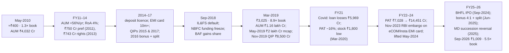

# I3 · Bajaj Finance (2010 → 2019 → 2026): underwriting a lender's growth

> **The hook.** In March 2009 Bajaj Auto Finance was a captive two-wheeler lender with 12% gross NPAs, a return on
> equity of about 1%, a share price 90% below its 2008 high and a market value of under ₹200 crore. A new CEO hired
> in 2007 had a plan — lend to the customer, not the vehicle — and in FY2010 it started to show. Anyone who bought
> in May 2010, after the first clean year, at 1.2× book, made roughly 80× their money by March 2019, when the company
> was worth ₹1.75 lakh crore at 9× book. Anyone who bought *then*, at 9× book and 44× earnings, still compounded at
> 17% a year to 2026, because the profit went up five times more. This case is about how to underwrite a lender:
> what RoA, leverage and credit cost say about a franchise, how to tell growth from risk, and why a lender's P/B
> is a statement about its future RoE.

| | |
|:--|:--|
| **Period** | FY2007–FY2010 (set-up) · **20 May 2010** (decision A) · FY2011–FY2019 · **31 March 2019** (decision B) · 2019–2026 (outcome) |
| **Decision dates** | **A:** 20 May 2010, after the FY2010 results, price ≈ ₹400 (≈ ₹4.0 on today's share count), market cap ≈ ₹1,460 crore. **B:** 31 March 2019, ₹3,025 (₹302.5 today's basis), market cap ≈ ₹1.75 lakh crore. Use only what was public on each date |
| **Sector** | Non-bank lending: consumer durables, personal loans, SME, mortgages (via Bajaj Housing Finance from 2018), commercial (NSE: BAJFINANCE). Fiscal year ends 31 March |
| **Themes** | Lender economics (RoA × leverage = RoE) · credit cost as the swing variable · cross-sell and customer acquisition cost · funding franchise and ALM · growth vs risk · P/B as a forecast of RoE · concentration and regulatory risk · succession |
| **Modules this case reinforces** | [07.1 Banks & lenders: the model](../../07-special-valuation/01-banks-and-nbfcs.md) · [08.1 Banks & lending](../../08-sectors/01-banks-and-lending.md) · [04.3 Returns on capital](../../04-financial-analysis/03-returns-on-capital.md) · [05.1 Business models](../../05-business-analysis/01-business-models-and-unit-economics.md) · [05.5 Management & capital allocation](../../05-business-analysis/05-management-and-capital-allocation.md) · [06.7 Justified P/B](../../06-valuation/07-other-valuation-methods.md) · [11.4 Position sizing](../../11-process/04-position-sizing-and-portfolio-construction.md) · [11.5 Monitoring & selling](../../11-process/05-monitoring-and-selling.md) |
| **Difficulty** | Intermediate–Advanced (★★★☆☆). Do it after Modules 07 and 08; pairs with [I4 IL&FS & DHFL](04-ilfs-dhfl-2018.md), [I5 Yes Bank](05-yes-bank-2018-2020.md) and [I7 HDFC Bank](07-hdfc-bank-consistency.md) |
| **Time** | ~3 hours (two decision points; about 45 minutes on each before reading on) |

!!! note "Conventions in this case"
    ₹ crore; standalone Indian GAAP to FY2018, consolidated Ind AS from FY2019 (the housing-finance subsidiary was
    carved out in FY2018). AUM = assets under management (loans, including assigned/securitised). Per-share and price
    figures are quoted on the basis of the time, with today's basis in brackets: the 2016 1:1 bonus plus 10→2 split
    (÷10) and the 2025 4:1 bonus plus 2→1 split (÷10) mean one 2010 share is 100 shares today. Share prices are NSE
    closes. Bracketed numbers point to the [Sources](#sources).

---

## 1. The scene

### 1.1 The business (as of May 2010)

Bajaj Auto Finance was incorporated in 1987 to finance Bajaj Auto's two- and three-wheelers and listed in 1998
[[1]](#sources). In 2007 the Bajaj group split its financial businesses into **Bajaj Finserv** under Sanjiv Bajaj, and
hired **Rajeev Jain** (from AIG's Indian consumer-finance arm, previously GE Capital and American Express) as CEO of the
finance company. The 2008 crisis hit before the new strategy could: the company's funding partner Citi pulled back,
two-wheeler and consumer-durable delinquencies rose, gross NPAs went from ~2% in FY2007 to ~12% in FY2009, and
profit fell from ₹47 crore (FY2007) to ₹20 crore (FY2008) and ₹34 crore (FY2009) — a return on equity near 1%
[[2]](#sources). Sanjiv Bajaj brought in Nanoo Pamnani, a former Citibank India head, as vice-chairman and mentor.

The strategy Jain set out, as the company explained it from FY2009 onward [[2]](#sources) [[3]](#sources):

- **Lend to the affluent, prime customer, in small tickets, at the point of sale.** Consumer-durable loans
  (televisions, refrigerators, phones) at "0% EMI" — the retailer and manufacturer subsidise the interest — became the
  **acquisition engine**: a ₹20,000 loan repaid over 8 months with almost no loss, which yields a *known* customer.
- **Cross-sell to the known customer.** The "existing member identification" (EMI) card pre-approved that customer
  for the next purchase, then a personal loan, then a loan against property, then insurance and fixed deposits. The
  cost of acquiring the first loan is amortised across a decade of products; credit risk is underwritten on observed
  repayment rather than on a bureau score alone.
- **Diversify away from two-wheelers.** The captive book (financing 18–20% of Bajaj Auto's sales) was kept but no
  longer grew the company; mortgages, SME loans and commercial lending were added with separate underwriting.
- **Fund long, lend short.** Consumer loans average under a year; the company borrowed for two to five years from
  banks and the bond market, and later (2014) got RBI approval to take public deposits — so the asset-liability
  profile was the reverse of a housing-finance company's.

By FY2010 the pieces were visible: deployments up 65% in the June 2009 quarter, AUM of ₹4,032 crore (+59%), profit of
₹89 crore (+164%), gross NPAs falling toward 5% and net NPAs toward 2% with the FY2008–09 book running off, and 90+
branches [[2]](#sources) [[3]](#sources). The company changed its name to **Bajaj Finance** in September 2010.

### 1.2 The scene at decision B (March 2019)

Nine years later Bajaj Finance had **₹1,15,888 crore of AUM**, 34.5 million customers, a AAA rating from CRISIL,
ICRA, CARE and India Ratings, deposits of ₹13,193 crore, a separately licensed housing-finance subsidiary, gross NPAs
of 1.54% and net NPAs of 0.63%, RoA of 3.8% and RoE of 20%+ — and had just come through the IL&FS liquidity crisis
(September 2018–March 2019) *gaining* share, because its funding was diversified and its rating held while peers'
did not [[4]](#sources) [[5]](#sources). It had raised equity four times (₹750 crore preferential in 2011, ₹743 crore
rights in 2013, ₹1,400 crore QIP in 2015, ₹4,500 crore QIP in 2017) at rising multiples of book, each time before it
needed to. The stock had risen 105% in fourteen months to a market value of ₹2 lakh crore by May 2019 [[6]](#sources).

---

## 2. The numbers then

**Table 2.1: FY2007–FY2014, standalone (₹ crore)** [[2]](#sources) [[3]](#sources)

| FY | AUM | Growth (%) | Total income | PAT | RoA (%) | RoE (%) | GNPA (%) | NNPA (%) | Net worth | CAR (%) |
|:--|--:|--:|--:|--:|--:|--:|--:|--:|--:|--:|
| 2007 | ≈2,400 | — | ≈540 | 47 | ≈2.0 | ≈9 | ≈2 | ≈1 | ≈550 | — |
| 2008 | ≈2,500 | ≈4 | ≈600 | 20 | ≈0.8 | ≈3 | ≈6 | ≈3 | ≈1,100 | — |
| 2009 | 2,539 | ≈1 | 599 | 34 | 1.3 | ≈3 | ≈12 (peak) | ≈5 | 1,090 | 38 |
| 2010 | 4,032 | 59 | 916 | 89 | 2.7 | 8 | 5.0 | 2.2 | 1,145 | 26 |
| 2011 | 7,573 | 88 | 1,406 | 247 | 4.3 | 20 | 1.4 | 0.8 | 1,364 | 20 |
| 2012 | 13,107 | 73 | 2,172 | 406 | 4.0 | 24 | 1.2 | 0.1 | 2,014 | 17 |
| 2013 | 17,517 | 34 | 3,110 | 591 | 3.9 | 22 | 1.1 | 0.2 | 3,367 | 22 |
| 2014 | 24,061 | 37 | 4,073 | 719 | 3.6 | 19.5 | 1.2 | 0.3 | 4,010 | 19.1 |

FY2007–09 figures are approximate (from results releases and later company disclosures); the FY2008 net worth
reflects a capital infusion from the group. RoA is PAT ÷ average AUM; RoE on average net worth; NPAs on 180-dpd
recognition until FY2016, when RBI moved NBFCs to 90 days. The FY2009 GNPA of ~12% is as later described by the
company and analysts [[2]](#sources).

**Table 2.2: FY2015–FY2026, consolidated from FY2019 (₹ crore)** [[4]](#sources) [[5]](#sources)

| FY | AUM | Growth (%) | Revenue | Net profit | EPS (₹, today's basis) | RoE (%) | GNPA (%) | NNPA (%) | Net worth | Borrowings |
|:--|--:|--:|--:|--:|--:|--:|--:|--:|--:|--:|
| 2015 | 32,410 | 35 | 5,392 | 898 | 1.79 | 20 | 1.5 | 0.5 | 4,800 | 26,655 |
| 2016 | 44,229 | 36 | 7,299 | 1,279 | 2.37 | 21 | 1.2 | 0.3 | 7,427 | 36,700 |
| 2017 | 60,194 | 36 | 9,970 | 1,836 | 3.34 | 22 | 1.7 | 0.4 | 9,600 | 49,000 |
| 2018 | 82,422 | 37 | 12,746 | 2,496 | 4.32 | 20 | 1.5 | 0.4 | 16,400 | 68,000 |
| 2019 | 1,15,888 | 41 | 18,487 | 3,995 | 6.91 | 22 | 1.5 | 0.6 | 19,700 | 1,03,000 |
| 2020 | 1,47,153 | 27 | 26,375 | 5,264 | 8.75 | 20 | 1.6 | 0.7 | 32,328 | 1,29,806 |
| 2021 | 1,52,947 | 4 | 26,673 | 4,420 | 7.33 | 13 | 1.8 | 0.8 | 36,800 | 1,31,000 |
| 2022 | 1,97,452 | 29 | 31,633 | 7,028 | 11.61 | 17 | 1.6 | 0.7 | 43,700 | 1,65,000 |
| 2023 | 2,47,379 | 25 | 41,411 | 11,508 | 19.01 | 24 | 0.9 | 0.3 | 54,400 | 2,16,000 |
| 2024 | 3,30,615 | 34 | 54,972 | 14,451 | 23.35 | 22 | 0.9 | 0.4 | 76,700 | 2,86,000 |
| 2025 | 4,16,661 | 26 | 68,832 | 16,779 | 26.77 | 19 | 1.0 | 0.4 | 96,693 | 3,61,249 |
| 2026 | ≈5,05,000 | ≈21 | 81,985 | 19,332 | 30.56 | 18 | 1.0 | 0.4 | 1,13,999 | 4,35,112 |

FY2020 net worth reflects the ₹8,500 crore QIP of November 2019. FY2021 was the Covid year (₹5,969 crore of loan
losses). FY2026 AUM is approximate.

**Table 2.3: Valuation at the two decision dates**

| Metric | A: 20-May-2010 | B: 31-Mar-2019 |
|:--|--:|--:|
| Price (basis of the time / today's) | ≈ ₹400 / ₹4.0 | ₹3,025 / ₹302.5 |
| Shares | 3.66 crore | 57.7 crore |
| Market cap | ≈ ₹1,460 crore | ≈ ₹1,75,000 crore |
| Trailing PAT | 89 | 3,995 |
| **P/E** | **≈ 16×** | **≈ 44×** |
| Book value per share | ₹313 (₹3.13) | ₹341 (₹34.1) |
| **P/B** | **≈ 1.3×** | **≈ 8.9×** |
| Trailing RoE | 8% (FY10); 20% (FY11 run-rate) | 22% |
| Trailing 3-yr AUM CAGR | 19% (FY07–10) | 38% (FY16–19) |
| GNPA / NNPA | 5.0% / 2.2% | 1.5% / 0.6% |
| Rating | AA+ (CRISIL) | AAA (all four agencies) |
| 10-yr G-sec | ≈ 7.5% | ≈ 7.4% |
| Nifty P/B | ≈ 3.5× | ≈ 3.5× |

Sources: [[3]](#sources) [[4]](#sources) [[5]](#sources) [[6]](#sources).

### 2.4 What the filings said (paraphrased)

1. **FY2010 annual report.** Three "lines of business" — consumer, SME, commercial — with the consumer-durable
   loan described as the customer-acquisition product and cross-sell as the profit engine; a target of RoA above
   3% "through the cycle"; NPAs described as legacy two-wheeler and personal-loan books in run-off; a stated intent
   to raise capital ahead of growth [[3]](#sources).
2. **FY2019 annual report.** AUM up 41%; 23.5 million new loans in the year; cross-sell franchise 20 million+;
   "operating expenses to NII" ~35%; loan losses ~1.5% of average AUM; liquidity buffer raised after September 2018;
   deposits 13% of borrowings; a stated ambition to be "a diversified financial-services firm", with payments,
   insurance distribution and a subsidiary for housing [[4]](#sources).
3. **Capital.** Each raise was made at a premium to book: 2011 (₹750 crore at ~1.4× book), 2013 rights, 2015 QIP
   (~4× book), 2017 QIP (~6× book), 2019 QIP (~8× book) — dilution that was accretive to book value per share each
   time [[1]](#sources) [[2]](#sources).

---

## 3. You are the analyst

### Decision A (20 May 2010, ≈₹400, 1.3× book)

1. **(Numerical — the lender's identity.)** RoE = RoA × leverage (assets ÷ equity). FY2010: PAT ₹89 crore on average AUM
   ≈ ₹3,300 crore and average net worth ≈ ₹1,120 crore. Compute RoA, leverage and RoE. Then compute what RoE the
   company would earn at its own targets — RoA 3%, leverage 6× (CAR ~17%) — and the justified P/B at a 14% cost of
   equity and 15% long-run growth ([06.7](../../06-valuation/07-other-valuation-methods.md)).
2. **(Numerical — credit cost is the swing.)** FY2009's NPA spike took RoE to ~1%. Build a simple P&L per ₹100 of AUM:
   yield 20%, cost of funds 9%, opex 6% (a consumer lender's), credit cost *x*, tax 33%. At what credit cost does the
   business earn RoA 3%? At what credit cost does it earn zero? What does that say about the range of outcomes a
   lender's equity holder is underwriting?
3. **(Numerical — the growth plan needs capital.)** If AUM grows 50% a year for three years from ₹4,032 crore and
   leverage is capped at 6×, how much equity does the company need by FY2013, and how much can it generate
   internally at a 3% RoA with no dividend? Will it have to dilute, and at what P/B is dilution good for existing
   holders?
4. **(Judgement — is the turnaround real?)** List the three pieces of evidence you would need to believe the
   FY2010 numbers are the start of a franchise rather than a cyclical bounce (e.g., vintage-level loss curves on the
   post-2008 consumer-durable book; the cross-sell ratio; branch and retailer-partner counts; funding diversity).
   Which of these were in the annual report?
5. **(Decision A.)** Buy, avoid, or watch? Compute the expected five-year return under (i) AUM 35% CAGR, RoA 3.5%,
   exit at 3× book; (ii) AUM 25%, RoA 2.5%, exit at 1.5× book; (iii) a repeat of 2009 (credit cost 6%, RoE 2%, exit at
   0.8× book). Weight them and size the position ([11.4](../../11-process/04-position-sizing-and-portfolio-construction.md)).

### Decision B (31 March 2019, ₹3,025, 8.9× book)

6. **(Numerical — what does 8.9× book require?)** With cost of equity 12% (rf 7.4%, ERP 5%, β 0.9) and long-run growth
   8%, solve the justified P/B formula for the RoE it implies. Then, using a two-stage model (RoE 22% and growth 30% for
   ten years, fading to 15%/8%), compute a value per share and compare with ₹3,025.
7. **(Numerical — decompose 2010–2019.)** Price ₹4.0 → ₹302.5 (today's basis): compute the CAGR and split it into
   book-value-per-share growth, P/B change and dilution. What fraction of the return was re-rating from 1.3× to 8.9×?
8. **(Numerical — the ALM test.)** In September 2018, after IL&FS defaulted, NBFC commercial-paper yields jumped 100–200
   bps and some issuers could not roll. Bajaj Finance's borrowings (FY2019) were ~₹1.03 lakh crore: ~40% bank loans,
   ~35% NCDs, ~12% deposits, ~13% CP; average asset tenor under two years. Compare with a housing-finance company whose
   assets have a 12-year tenor and whose CP is 25% of funding. Which one is a *going concern* if CP markets close for
   six months? ([I4](04-ilfs-dhfl-2018.md))
9. **(Judgement — the risks in the price.)** At 8.9× book, list the four things that could break the thesis
   (a credit cycle in unsecured consumer loans; a funding shock; regulatory action on fee income or partnerships; a
   fintech/bank attack on the consumer-durable point of sale; succession). For each, state the observable signal and
   the likely impact on RoE.
10. **(Decision B.)** Hold, trim or sell? Compute the expected seven-year return if EPS compounds at 25% and the P/E
    settles at 40×, 30× and 20×; and if EPS compounds at 15% under the same exits. Which combination did you need to
    believe for the stock to beat a 12% cost of equity?

---

## 4. What happened

**2010–2019: the compounding.** AUM grew from ₹4,032 crore to ₹1,15,888 crore — **45% a year for nine years** — while
profit grew from ₹89 crore to ₹3,995 crore (**52% a year**) and gross NPAs stayed between 1% and 2%. The engine worked
as described: consumer-durable and lifestyle loans acquired ~20 million customers; the EMI card and the app turned
them into personal-loan, SME and mortgage borrowers; the cross-sell franchise supplied more than half of new
loans; opex fell relative to income as the customer base aged. Funding diversified from bank lines to bonds, CP and,
from 2014, retail deposits. Equity was raised four times, always above the previous raise's multiple, and book
value per share grew despite the dilution [[1]](#sources) [[2]](#sources) [[4]](#sources). The IL&FS shock of
September 2018 ([I4](04-ilfs-dhfl-2018.md)) was the stress test: Bajaj Finance's rating held, its CP rolled, and it
grew AUM 41% in the year the NBFC sector's growth collapsed [[4]](#sources). The share price went from ₹4.0 to
₹302.5 on today's basis — **75× in nine years, ~61% a year** — and the market cap crossed ₹2 lakh crore in May 2019
[[6]](#sources).

**2019–2021: the test.** The November 2019 QIP raised ₹8,500 crore at ~₹3,900 (₹390), then Covid arrived: the stock
fell to ~₹1,800 (₹180) in March 2020, the company took ₹5,969 crore of loan losses in FY2021 (3.9% of AUM), AUM grew
4%, and profit fell 16% — the first decline in twelve years. Gross NPAs peaked at 1.8%; the consumer franchise
proved resilient, and the "0% EMI" book performed better than unsecured personal loans [[5]](#sources).

**2022–2026: scale, regulation and succession.** Profit rose from ₹4,420 crore (FY2021) to ₹19,332 crore (FY2026);
AUM crossed ₹5 lakh crore; customers passed 100 million. On 15 November 2023 the RBI barred the company from
sanctioning loans under its "eCOM" and "Insta EMI Card" products for failing to issue key-fact statements to
borrowers under the digital-lending guidelines; the embargo was lifted on 2 May 2024 after remediation — a reminder
that fee-generating digital products carry regulatory duration. Bajaj Housing Finance listed in September 2024
(₹6,560 crore IPO, subscribed ~64×). In June 2025 the company issued a 4:1 bonus and split the share 2→1. Rajeev
Jain, who had been due to move to vice-chairman with Anup Saha as MD from April 2025, returned as MD in July 2025
when Saha resigned; the succession that the market had priced as settled was not [[1]](#sources) [[7]](#sources).
In September 2026 the stock traded at ₹1,009 — ₹10,090 on the 2019 basis, **3.3× the March 2019 price (≈17% a
year)**, at 30.6× earnings and 5.5× book, a market value of ₹6.26 lakh crore [[5]](#sources).

---

## 5. Signals: knowable then vs hindsight

| Knowable | Only in hindsight |
|:--|:--|
| **At A (2010):** a stated, specific model (acquire at the point of sale, cross-sell, RoA >3%), a CEO with a consumer-finance record, a parent willing to recapitalise, NPAs visibly in run-off, and a price at 1.3× book — below the justified P/B of a business earning its own targets | That the model would scale to 100 million customers and 45% AUM growth for nine years without a credit accident |
| **At A:** the credit-cost sensitivity — a consumer lender's RoE swings from 25% to zero on a 4-point change in losses — and the FY2009 demonstration of it | That the next real credit test (Covid, FY2021) would cost one year of growth and a 16% profit dip, not solvency |
| **At B (2019):** 8.9× book implied a 25%+ RoE for a decade with 30% growth; the base rate for that among lenders is close to zero; the IL&FS crisis had shown funding, not credit, as the sector's fault line — and Bajaj's funding had passed | That earnings would compound at 23% anyway, so that a 9× book buyer still made 17% a year despite the P/B halving |
| **At B:** concentration in unsecured consumer credit; a fee line dependent on digital partnerships that regulators were beginning to scrutinise; a founder-CEO in his fourteenth year | The specific RBI action (2023), its short duration, and the 2025 succession reversal |
| **The dilution pattern:** raising equity at rising multiples *before* it is needed is the mark of a lender that plans for the cycle, not one that scrambles in it | How large the 2019 raise would be (₹8,500 crore) and how well-timed (four months before Covid) |

!!! success "The strongest bear case at B (March 2019)"
    Unsecured consumer credit in India had never been through a full cycle at scale; Bajaj Finance *was* the
    scale. RoE of 22% on 8.9× book gave an earnings yield of ~2.3%, below the G-sec, so the price required both
    growth and the multiple to hold. Every lender that grew 40% a year eventually met its credit cycle, and the
    unsecured personal-loan book (a third of AUM) was where it would hit. Fintechs and banks were copying the point-
    of-sale model; regulators were waking up to digital lending; and the company's fee income depended on
    partnerships the RBI could restrict with a letter.

    Most of it happened — Covid, the RBI letter, the multiple halving — and the stock still tripled, because the
    franchise's earnings power was larger than the bear case allowed for. A bear case that is right about the risks
    and wrong about the earnings is the most expensive kind.

---

## 6. Lessons

1. **A lender's return is RoA × leverage; underwrite the RoA and its variance.** Bajaj's FY2010 RoA of 2.7% on 3×
   leverage was 8% RoE; the same RoA at 6× is 16%; at 4% RoA it is 24%. The equity holder owns the *variance* of the
   credit cost, which is why the FY2009 RoE was 1%.
   → [07.1 Banks & NBFCs](../../07-special-valuation/01-banks-and-nbfcs.md) · [08.1 Banks & lending](../../08-sectors/01-banks-and-lending.md)
2. **Customer acquisition cost is the hidden capital of a consumer lender.** The "0% EMI" loan is a marketing
   expense that yields an underwritten customer; the profit is in the fifth product, not the first. Judge a
   consumer lender by its cross-sell ratio and its cost-to-income trajectory, not by the yield on the first loan.
   → [05.1 Business models & unit economics](../../05-business-analysis/01-business-models-and-unit-economics.md)
3. **Funding is the fault line; match assets to liabilities.** Short-tenor consumer assets funded by longer-tenor
   liabilities survive a CP freeze; the reverse does not. September 2018 sorted the sector on this axis, not on
   NPAs.
   → [I4 IL&FS & DHFL](04-ilfs-dhfl-2018.md) · [08.1](../../08-sectors/01-banks-and-lending.md)
4. **P/B is a forecast of RoE and growth; write it down.** 1.3× book in 2010 required an RoE of ~15%; 8.9× in 2019
   required 25%+ with 30% growth for a decade. The first was an easy bar; the second a hard one that the company
   nonetheless cleared on earnings, if not on multiple.
   → [06.7 Justified multiples](../../06-valuation/07-other-valuation-methods.md)
5. **Raising equity above book, ahead of need, creates value.** Each Bajaj QIP diluted holders and *raised* book value
   per share; each was made before a cycle, not during one. The opposite pattern (dilution at or below book, after
   losses) is the signature of a lender in trouble.
   → [05.5 Management & capital allocation](../../05-business-analysis/05-management-and-capital-allocation.md)
6. **Earnings growth can rescue a bad multiple — but do not plan on it.** The 2019 buyer made 17% a year because
   earnings compounded at 23%; at 12% earnings growth the same buyer would have lost money. Decompose the return you
   need into growth and re-rating, and be honest about which one you are betting on.
   → [01.5 Returns math](../../01-markets-101/05-time-value-and-returns-math.md) · [I2 Asian Paints](02-asian-paints-compounder.md)
7. **Regulatory and key-person risk are part of a lender's cost of equity.** The 2023 RBI embargo cost a quarter of
   fee growth; the 2025 succession reversal cost credibility. Neither broke the franchise, but both belong in the
   pre-mortem.
   → [09.5 Governance red flags (India)](../../09-forensics/05-governance-red-flags-india.md) · [11.6 Behavioural finance & journals](../../11-process/06-behavioural-finance-and-decision-journals.md)

---

## 7. Model answers

<strong>Q1 — The lender's identity (A)</strong>

RoA = 89 / 3,300 = **2.7%**; leverage = 3,300 / 1,120 ≈ **2.9×**; RoE = 2.7% × 2.9 ≈ **8%** ✓. At targets: 3% × 6 =
**18% RoE**. Justified P/B = (RoE − g) / (r − g) = (0.18 − 0.15) / (0.14 − 0.15) — undefined because g > r − the formula
needs g < r; with g = 12%: (0.18 − 0.12)/(0.14 − 0.12) = **3.0× book**. At the FY2011 run-rate (RoE 20%, g 12%): 4×. The
stock at 1.3× was pricing an RoE of ~14.6% with 12% growth — i.e., the market did not believe the targets. That gap
was the opportunity.

<strong>Q2 — Credit cost as the swing (A)</strong>

Per ₹100 of AUM: NII = 20 − 9 = 11; less opex 6 = 5 pre-provision; less credit cost x; tax 33%. RoA = (5 − x) × 0.67.
RoA 3% → 5 − x = 4.5 → **x = 0.5%**; RoA 0 → **x = 5%**. A consumer lender's entire equity return sits inside a
4.5-point band of credit cost; FY2009's ~6% (on a smaller NII) took it below zero. The equity holder is short a
put on the credit cycle; the premium is the 20% RoE in normal years.

<strong>Q3 — Capital for growth (A)</strong>

AUM FY2013 = 4,032 × 1.5³ = **₹13,600 crore**; at 6× leverage, equity needed ≈ **₹2,270 crore** vs ₹1,145 crore in
FY2010. Internal generation at RoA 3% on average AUM (~₹8,000 crore over three years) ≈ ₹720 crore → equity ≈ ₹1,870
crore: a shortfall of ~₹400 crore. **Dilution is inevitable**; it is *accretive* if done above book (each rupee raised
adds more than a rupee of book per share to old holders). Actual: AUM ₹17,517 crore by FY2013; ₹750 crore raised in
2011 at ~1.4× book and ₹743 crore of rights in 2013 — as the arithmetic predicted.

<strong>Q4 — Is the turnaround real? (A)</strong>

Evidence: (1) vintage loss curves — the FY2009–10 consumer-durable originations losing <1% at 12 months, distinct
from the legacy book (disclosed qualitatively: "legacy portfolios in run-off"); (2) cross-sell — share of new loans to
existing customers (the FY2010 report gave EMI-card issuance and repeat-customer counts); (3) distribution —
retailer partners and branches growing ahead of AUM (yes); (4) funding — bank lines replaced by NCDs and CP, rating
outlook (AA+ stable). Two of four were in the report in usable form; the vintage curves came in later investor
presentations. A "watch" investor could have bought half in May 2010 and the rest after FY2011's 20% RoE.

<strong>Q5 — Decision A</strong>

(i) AUM 4,032 × 1.35⁵ = 18,100; RoA 3.5% → PAT ≈ 600; equity ≈ 3,000 (with dilution at ~2× book) → 3× book ≈ ₹9,000
crore vs ₹1,460 → **6.2× (44% a year)**; (ii) AUM 12,300, RoA 2.5% → PAT 280, equity 2,100 → 1.5× = ₹3,150 crore → **2.2×
(17% a year)**; (iii) equity impaired to ~₹900 crore × 0.8 = ₹720 crore → **−50%**. At 40/40/20: expected ≈ 3.3×
(27% a year) with a bounded downside — **buy**, sized as a 3–5% position (max-loss rule: 2%/50% = 4%). Actual: FY2015
AUM ₹32,410 crore, PAT ₹898 crore, market cap ~₹20,000 crore: 14× in five years.

<strong>Q6 — What 8.9× requires (B)</strong>

Justified P/B = (RoE − g)/(r − g) → 8.9 = (RoE − 0.08)/(0.12 − 0.08) → **RoE = 43.6%** in a steady state, or a long
period of 20%+ RoE with 30% growth. Two-stage: book/share ₹341; RoE 22%, growth 30% for ten years (payout ≈ −36%,
i.e., needs capital — assume the QIPs are neutral), fading to RoE 15%, g 8%: year-10 book ≈ 341 × 1.3¹⁰ ≈ ₹4,700; terminal
P/B = (0.15 − 0.08)/(0.12 − 0.08) = 1.75 → ₹8,200; discounted at 12% ≈ ₹2,640; plus PV of the (negative) free
cash to equity during growth ≈ −₹300 → **≈ ₹2,300–2,400 vs ₹3,025**. The price needed either a longer growth runway
or a higher terminal RoE than 15% — plausible for this franchise, but not conservative.

<strong>Q7 — Decomposition 2010–2019 (B)</strong>

₹4.0 → ₹302.5: 75.6× over 8.9 years = **62.7% a year**. Book value per share (today's basis): ₹3.13 → ₹34.1 = 10.9× =
**30.8% a year** (after dilution from 3.66 to 57.7 crore shares on a ÷10 basis — i.e., ~58% more shares). P/B 1.3× →
8.9× = 6.9× = **24.2% a year**. Dividends ≈ 0.5%. Check: 1.308 × 1.242 × 1.005 ≈ 1.633 ✓. **About 40% of the annual
return, and more than half of the multiplication, was the re-rating.** The rest was book value compounding at
31% net of dilution — itself extraordinary.

<strong>Q8 — The ALM test (B)</strong>

Bajaj: assets of <2-year tenor run off faster than liabilities of 2–5 years; a six-month CP freeze on 13% of
funding (~₹13,000 crore) is covered by collections of ~₹5,000 crore a month plus a liquidity buffer; the company is
a going concern and can even *shrink* into the freeze. Housing-finance company: assets of 12-year tenor produce
~1% of principal a month in collections; 25% CP funding maturing within six months cannot be repaid from
collections; it must sell assets (at a discount, if anyone is buying) or default. DHFL did the second
([I4](04-ilfs-dhfl-2018.md)). ALM, not NPAs, decided who survived 2018–19.

<strong>Q9 — Risks in the price (B)</strong>

(1) Unsecured credit cycle — signal: 30+ dpd in personal loans, credit cost above 2%; impact: RoE 22% → 10%
(Covid: RoE 13%). (2) Funding shock — signal: CP spreads, rating outlook; impact: growth stalls, not solvency (passed
in 2018). (3) Regulatory — signal: RBI circulars on digital lending, fees, partnerships; impact: fee income −10–20%
(2023 embargo). (4) Competition at the point of sale — signal: consumer-durable market share, retailer-partner
exclusivity; impact: acquisition cost up. (5) Succession — signal: announcements; impact: multiple, not earnings
(2025). Four of five materialised in some form within six years; the earnings grew through them.

<strong>Q10 — Decision B</strong>

EPS ₹6.91 (today's basis) × 1.25⁷ = 32.9: at 40× ₹1,317 (**23% a year**); at 30× ₹988 (18%); at 20× ₹659 (12%). At
15% growth: EPS 18.4: at 40× ₹735 (13.5%); at 30× ₹551 (9%); at 20× ₹368 (3%). To beat 12% you needed *either* 25%
growth with any exit above 20×, *or* 15% growth with the multiple holding near 40×. The first is what happened (EPS
grew ~24% a year to ₹30.56; P/E fell to ~31; price ₹1,009 ≈ 17% a year). **Hold with a trim** was defensible; "sell
because 9× book" would have cost a tripling. The lesson is not that valuation did not matter — the P/B halved — but
that for a franchise with a 20%+ RoE and a long runway, the earnings can carry a buyer through a de-rating.

---

## 8. Discussion questions & extensions

1. **Build the RoA tree** for Bajaj Finance from its FY2019 and FY2026 annual reports: yield, cost of funds, NIM, fee
   income, opex, credit cost, tax, all as a percentage of average AUM. Which lines improved, which deteriorated, and
   which drove the fall in RoE from 22% to 18%?
2. **Compare three lenders in September 2018** — Bajaj Finance, DHFL and Yes Bank — on the ALM, funding-mix and
   asset-quality metrics in [08.1](../../08-sectors/01-banks-and-lending.md). Rank them on survival probability using
   only what was public that month, then check against [I4](04-ilfs-dhfl-2018.md) and [I5](05-yes-bank-2018-2020.md).
3. **The dilution ledger.** Tabulate each equity raise (2011, 2013, 2015, 2017, 2019): amount, price, P/B at issue, and
   book value per share before and after. Compute the value created for pre-raise holders in each case.
4. **The point-of-sale moat, ten years on.** Fintechs, banks' EMI-on-card products and UPI credit lines now compete for
   the consumer-durable customer. Using the FY2026 report, estimate Bajaj Finance's share of consumer-durable
   financing and its acquisition cost per new customer. Is the acquisition engine still cheap?
5. **Two compounders, two prices.** Put I2 (Asian Paints at 97.5× in 2022) and I3 (Bajaj Finance at 8.9× book in
   2019) side by side. Both were "expensive quality"; one lost money, one tripled. Write the rule that distinguishes
   them *ex ante* — and test it on two current examples.

---

## Sources

All accessed 22-Sep-2026.

[1]: https://en.wikipedia.org/wiki/Bajaj_Finance
[2]: https://www.ajuniorvc.com/bajaj-finance-fintech-disruptor-case-study-story-nbfc-business-model
[3]: https://www.business-standard.com/article/finance/bajaj-auto-fin-s-net-profit-jumps-five-fold-109071600053_1.html
[4]: https://www.aboutbajajfinserv.com/finance-investor-relations-annual-reports
[5]: https://www.screener.in/company/BAJFINANCE/consolidated/
[6]: https://www.business-standard.com/article/markets/bajaj-finance-market-cap-crosses-rs-2-trillion-zooms-105-in-14-months-119052100248_1.html
[7]: https://www.business-standard.com/markets/news/how-to-trade-bajaj-finance-stock-post-bonus-cum-split-price-adjustment-125061700477_1.html

FY2007–FY2014 figures (Table 2.1) are compiled from the company's annual reports and results releases for those
years (available through source [4] and the BSE archive) and from the history in source [2]; FY2015–FY2026 (Table
2.2) as tabulated by source [5] from the company's filings. Where a figure is marked "≈" it is rounded from those
disclosures.

---
[← Previous: I2 · Asian Paints](02-asian-paints-compounder.md) · [Module index](../index.md) · [Next: I4 · IL&FS and DHFL (2018–19) →](04-ilfs-dhfl-2018.md)
