# I4 · IL&FS and DHFL (2018–2019): borrowing short, lending long, rated AAA

> **The hook.** Until mid-August 2018 Infrastructure Leasing & Financial Services (IL&FS), the holding company of a
> 300-entity infrastructure group owned by LIC, ORIX, ADIA, HDFC, SBI and Central Bank of India, was rated AAA by every
> agency that rated it, even though its consolidated FY2018 accounts showed a ₹1,887 crore loss and leverage of 11×.
> Then the agencies moved it one notch, to AA+. Within five weeks it had missed a loan repayment to SIDBI,
> defaulted on commercial paper and been rated D. The government then replaced the board, and the new board counted
> ₹94,216 crore of fund-based group debt. On 21 September a mutual fund sold commercial paper of Dewan Housing Finance (DHFL), a
> AAA-rated mortgage lender with 0.96% gross NPAs, at an 11% yield, and DHFL's shares fell 42% in a day. Nine months
> later DHFL defaulted. Its shareholders got nothing, and most of its creditors recovered about 46%. In both
> failures the reported bad loans were not what started the collapse. Each company needed the short-term debt market
> to lend to it again every month, and the market stopped. This case teaches ALM buckets, rollover risk, why ratings
> lag, and how one default spreads through debt funds to every lender that looks similar.

| | |
|:--|:--|
| **Period** | FY2009–FY2018 audited financials (set-up) · **31 August 2018** (decision A) · **24 September 2018** (decision B) · September 2018–September 2026 (outcome) |
| **Decision dates** | **A:** close of **31 August 2018**, DHFL **₹666.80** (BSE), market cap ≈ **₹20,900 crore**; your debt fund holds IL&FS group CP rated AA+ (on watch). You may use only what was public by then: IL&FS's FY2018 figures as tabulated by the rating agencies, the August downgrades and IL&FS's August liquidity plan, ITNL's accounts, DHFL's FY2018 annual report, CRISIL's May 2018 rationale and DHFL's Q1 FY2019 results. **B:** close of **24 September 2018**, DHFL **₹393.00**, market cap ≈ **₹12,300 crore**; you may add the IL&FS defaults of 4–17 September, the fund markdowns, the DSP sale of 21 September and DHFL's statements of 21–24 September |
| **Sector** | IL&FS: core investment company (unlisted parent; listed arms include IL&FS Transportation Networks, NSE: IL&FSTRANS). DHFL: housing finance company, NSE: DHFL (delisted 2021). Both fiscal years end 31 March |
| **Themes** | Asset–liability mismatch · commercial-paper rollover risk · holding-company double leverage · the NHB/RBI regulatory perimeter · why ratings lag · debt-fund contagion and side-pocketing · spread widening across a sector · governance and alleged fund diversion · resolution under the NCLT and the IBC |
| **Modules this case reinforces** | [04.5 Leverage, solvency & liquidity](../../04-financial-analysis/05-leverage-solvency-liquidity.md) · [07.1 Banks & NBFCs](../../07-special-valuation/01-banks-and-nbfcs.md) · [08.1 Banks & lending](../../08-sectors/01-banks-and-lending.md) · [02.8 Group accounts](../../02-accounting/08-deeper-cuts-group-accounts-and-other.md) · [03.1 The disclosure universe (ratings)](../../03-reading-filings/01-the-disclosure-universe.md) · [03.3 Notes to accounts](../../03-reading-filings/03-notes-to-accounts.md) · [07.6 Infra & utilities](../../07-special-valuation/06-real-estate-infra-utilities-telecom.md) · [09.5 Governance red flags (India)](../../09-forensics/05-governance-red-flags-india.md) · [12.2 Market cycles & sentiment](../../12-macro-special-sits/02-market-cycles-and-sentiment.md) · [11.4 Position sizing](../../11-process/04-position-sizing-and-portfolio-construction.md) · [11.7 Fundamentals meets derivatives](../../11-process/07-fundamentals-meets-derivatives.md) |
| **Difficulty** | Advanced (★★★★☆). Do it after Modules 07 and 08. Pairs with [I3 Bajaj Finance](03-bajaj-finance-2008-2019.md) (the opposite funding structure), [I5 Yes Bank](05-yes-bank-2018-2020.md) (the same money, seen from the bank's side) and [G6 Lehman](../global/06-lehman-2008.md) (a run on wholesale funding) |
| **Time** | ~3 hours (two decision points; about 45 minutes on each before you read on) |

!!! note "Conventions in this case"
    ₹ crore unless stated (1 crore = 10 million). DHFL figures are standalone Indian GAAP to FY2018, as published in
    the FY2018 annual report. Q1 FY2019 figures were the first under Ind AS and are not strictly comparable. "Loan
    book" is on-balance-sheet loans. "AUM" adds loans assigned or securitised off the balance sheet. DHFL's share
    figures reflect the 1:1 bonus of FY2016 (the company's own restated history). Share prices are BSE closes from
    the exchange's price history [[7]](#sources), which differ from NSE closes by ₹1 or less (CARE, for example,
    quotes ₹610.55 and ₹350.55 for the closes before and on 21 September 2018 [[14]](#sources), against BSE's ₹610.60
    and ₹351.55). No split or bonus happened after 2016. IL&FS was unlisted. Its FY2018 standalone and consolidated
    figures are taken from the rating agencies' rationales of 17–18 September 2018 [[1]](#sources), which tabulate the
    audited FY2018 accounts. Those rationales post-date decision A; the case assumes the same annual figures were
    available to an analyst in August, when the agencies reviewed the company.
    Peer price moves are NSE daily data from yfinance. Bracketed numbers point to the [Sources](#sources).

---

## 1. The scene (as of 31 August and 24 September 2018)

### 1.1 IL&FS: an AAA holding company on top of 300 projects (as of 31 August 2018)

IL&FS was set up in 1987 by Central Bank of India, HDFC and UTI to develop infrastructure on commercial terms. By
2018 its shareholders were Indian and foreign institutions: LIC 25.34%, ORIX (Japan) 23.54%, ADIA 12.56%, HDFC
9.02%, Central Bank 7.67% and SBI 6.42% [[1]](#sources). In FY2008 it turned itself into a holding company. Its
lending moved to a subsidiary, **IL&FS Financial Services (IFIN)**. In 2012 the RBI registered IL&FS as a
systemically important **core investment company (CIC)**. A CIC is an NBFC whose assets are mainly investments in and
loans to its own group companies. The RBI caps its outside liabilities at 2.5× its adjusted net worth
[[1]](#sources).

The operating companies built roads (**IL&FS Transportation Networks, ITNL**, listed), power (**IEDCL**),
construction (**IECCL**, listed), ports, water and townships. IL&FS and its three other holding companies borrowed
and invested the money in project SPVs. The SPVs borrowed again against concessions paying out over 15–30 years. Cash
came back up through dividends, asset sales and settlement of claims against government counterparties.

By mid-2018 the agencies' own rationales described the stress [[1]](#sources):

- IL&FS's standalone borrowings had risen faster than its equity for three years, "to support the funding
  requirement of group entities". Reported gearing was 3.03× (3.61× on CARE's definition, which includes preference
  capital). The regulatory CIC leverage ratio was 2.30×, just under the 2.5× cap.
- The five largest exposures (IEDCL, ITNL, IECCL, the maritime arm and IFIN) made up 71% of IL&FS's lending and
  investment book, up from 65% a year earlier.
- Claims of about ₹9,000 crore against project counterparties were delayed. IL&FS itself said that over ₹16,000 crore of
  the group's liquidity was stuck in claims and termination payments [[2]](#sources).
- The RBI had told IFIN to cut its exposure to group companies to within regulatory limits by March 2019.
- On a consolidated basis the group lost ₹1,887 crore in FY2018, against a ₹142 crore profit in FY2017. Standalone
  profit rose 53%, to ₹584 crore, but only because of a ₹361 crore write-back of excess tax provisions.

**What the market believed.** Ratings stayed at AAA/A1+ until mid-August 2018 (CARE had reaffirmed AAA in October
2017, India Ratings in March 2018), and IL&FS kept issuing long bonds at AAA prices: its NCDs of August 2017 to March 2018 paid 7.6–8.65% for 3–10 years [[1]](#sources). The shareholder
register read like a guarantee. Surely LIC, SBI and ORIX would not let their own company default?

**The doubters, and the August move.** In August the agencies moved one notch. CARE cut IL&FS to **AA+ (credit watch, negative)** on 16 August. India Ratings did the same on 24 August, and ICRA
also cut its rating to AA+ that month [[1]](#sources). IL&FS then said publicly that it was over-leveraged. Its plan
had four parts: a ₹4,500 crore rights issue from its shareholders by the end of September, ₹3,500 crore of credit
lines from them, the sale of 25 projects over 12–18 months, and a cut in group debt of ₹30,000 crore
[[2]](#sources).

**Your position (decision A).** Your short-duration debt fund holds IL&FS and IFIN commercial paper (CP), which is
unsecured discount debt of 7–365 days. Issuers usually repay CP by issuing new CP, so its safety depends on
*rollover*, the market's willingness to buy the next issue. The paper is still A1+, but on watch. A colleague on the
equity side wants to buy DHFL, whose debt your fund also holds.

### 1.2 DHFL: a AAA mortgage lender with a builder book (as of 31 August 2018)

**Dewan Housing Finance Corporation** (incorporated 1984) was India's fourth-largest housing finance company (HFC).
It lent mostly to low- and middle-income borrowers in tier-II and tier-III towns through 349 locations. Its average
ticket size was ₹15.2 lakh, and it reported AUM of ₹1,11,090 crore at March 2018, up from ₹83,560 crore a year
earlier [[5]](#sources). The Wadhawan family controlled it through **Wadhawan Global Capital**. The promoter group
held 39.23% and had pledged none of it. Kapil Wadhawan was chairman and managing director [[4]](#sources).

HFCs were then regulated by the **National Housing Bank (NHB)**, not the RBI. Among the NHB-format disclosures in
DHFL's audited accounts is a note on the **maturity pattern** of assets and liabilities (Table 2.4).

What changed at DHFL between FY2016 and FY2018 was the asset mix [[5]](#sources):

- **Construction finance** (loans to property developers) grew from ₹10,058 crore to ₹16,664 crore in FY2018,
  from about 9% of the book in March 2016 to about 15%.
- **Loans against property (LAP)** reached over ₹22,200 crore, 20% of the book. SME loans were 4%.
- The non-housing share went from 28% to 39% within nine months of FY2018.

**Funding.** At 31 March 2018 borrowings were ₹92,715 crore. The mix was banks 43%, debt-market instruments 40%,
deposits 11%, NHB refinance 3% and external commercial borrowings 3% [[4]](#sources). Commercial paper outstanding
was ₹6,050 crore. Net CP raised in FY2018 was ₹3,055 crore.
In May 2018 CRISIL rated a CP programme enlarged from ₹10,000 crore to ₹15,000 crore [[5]](#sources), and in Q1
FY2019 DHFL completed a ₹12,000 crore public NCD issue [[14]](#sources).

**What the market believed.** DHFL was a steady compounder. From FY2013 to FY2018 its loan book grew 22% a year,
gross NPAs stayed below 1%, and its return on equity was 14–17%. The Q1 FY2019 numbers of 13 August 2018 looked like
an acceleration: profit up 35% to ₹435 crore, disbursements up 65% to ₹13,583 crore, AUM up 33% to ₹1,20,940 crore,
and the margin up to 3.44% [[6]](#sources).

**The doubters.** CRISIL, while keeping DHFL at A1+, called its capital "subdued". It put adjusted gearing (debt
including securitised loans, divided by net worth) at about **12.7×, higher than peers**, called RoA of 1.2%
"modest", and flagged non-housing asset quality [[5]](#sources). Tier-I capital had fallen from 14.75% to 11.52% in a
year [[4]](#sources) [[5]](#sources). CRISIL's reassurances were that DHFL had over ₹11,000 crore of liquid assets plus ₹6,978 crore of
undrawn bank lines, a policy of keeping about ₹10,000 crore of liquidity, and "no negative cumulative mismatches" in
short-term buckets at December 2017 [[5]](#sources).

### 1.3 Between the two decision dates (1–24 September 2018)

- **4–6 September.** IL&FS was reported to have defaulted on a ₹1,000 crore short-term loan from SIDBI. SIDBI
  had no security to enforce. Banking sources called it probably the first default by a large financial
  institution on such a loan [[2]](#sources).
- **8–9 September.** ICRA and CARE cut IL&FS and IFIN to **BB** (sub-investment grade) and their CP to **A4**. Debt
  funds marked their IL&FS and IFIN paper down by about 25%. Principal Cash Management, a *liquid* fund with about
  9.8% in IFIN paper, lost 2.3% in a day [[10]](#sources).
- **14–17 September.** IL&FS disclosed that CP due on 14 September had not been paid, and that lenders had sent
  notices of default on inter-corporate deposits. It also missed NCD interest due on 17 September. ICRA, CARE and
  India Ratings downgraded IL&FS to **D** on 17–18 September. The emergency shareholders' meeting on the ₹4,500 crore
  rights issue had been "inconclusive" [[1]](#sources).
- **21 September.** DSP Mutual Fund sold DHFL commercial paper in the secondary market at an implied yield of
  about **11%**. DHFL fell as much as 60% intraday and closed 42% lower. The Sensex was down 1,128 points at one
  point [[8]](#sources). Indiabulls Housing touched −34%, and Bajaj Finance, LIC Housing and PNB Housing about −15%
  each. None of them had defaulted on anything.
- **21–22 September.** Wadhawan said DHFL had no exposure to IL&FS and that no lender had recalled a loan. He said CP
  was "less than 5 per cent" of total liabilities, **₹7,500 crore against over ₹1 lakh crore**, spread over six
  months, and that surplus cash was kept in liquid funds [[9]](#sources).
- **24 September.** DHFL told the exchanges it had never delayed a repayment, had repaid ₹575 crore of CP on 21
  September, and held "approximately Rs 10,000 crore" of liquidity; CARE and ICRA had reaffirmed its ratings
  [[26]](#sources). The stock recovered 11.8% to close at ₹393.00 [[7]](#sources).

### 1.4 The prices on the decision dates

At **A (₹666.80)** DHFL was worth about ₹20,900 crore: 2.4× March 2018 book (₹280.4 a share), 17.8× FY2018 EPS
and 12.0× annualised Q1 FY2019 earnings. At **B (₹393.00)** it was worth about ₹12,300 crore: 1.4× book, 10.5× and
7.1×. About ₹6,800 crore of the ₹8,600 crore fall came in the two sessions after 19 September (20 September was a
holiday).

---

## 2. The numbers then

**Table 2.1: IL&FS, standalone and consolidated (₹ crore)** [[1]](#sources)

| Item | FY2017 | FY2018 |
|:--|--:|--:|
| Standalone total income | 1,787 | 1,899 |
| Standalone PAT (FY2018 includes ₹361 Cr tax write-back) | 383 | 584 |
| Standalone net worth (ex-preference capital) | 4,998 | 5,541 |
| Reported gearing (×, ICRA) | 2.60 | 3.03 |
| CIC leverage ratio (×; regulatory cap 2.5) | 2.23 | 2.30 |
| Top-5 group exposures, % of lending + investment book | 65 | 71 |
| Consolidated total income | 17,157 | 18,799 |
| **Consolidated PAT** | **142** | **(1,887)** |
| **Consolidated leverage ratio (×, CARE)** | **8.62** | **10.99** |
| Consolidated total assets (ex-intangibles) | 1,03,521 | 1,14,909 |
| Ratings (CARE / India Ratings / ICRA), long term | AAA / AAA / AAA | AAA until Aug-2018; AA+ (watch) from 16 Aug / 24 Aug / Aug |

**Table 2.2: IL&FS Transportation Networks (ITNL), consolidated (₹ crore)** [[3]](#sources)

| Item | FY2014 | FY2015 | FY2016 | FY2017 | FY2018 |
|:--|--:|--:|--:|--:|--:|
| Revenue | 6,587 | 6,501 | 8,036 | 8,072 | 8,717 |
| Operating profit (EBITDA) | 1,903 | 2,164 | 2,537 | 3,268 | 3,273 |
| Other income | 212 | 327 | 321 | 326 | 1,062 |
| Interest | 1,481 | 1,858 | 2,589 | 3,104 | 3,760 |
| Net profit | 462 | 415 | 87 | 146 | 65 |
| Borrowings | 19,193 | 23,890 | 26,556 | 31,185 | 34,544 |
| Net worth | 4,627 | 5,343 | 4,302 | 4,185 | 4,361 |
| Debt / equity (×) | 4.1 | 4.5 | 6.2 | 7.5 | 7.9 |
| (EBITDA + other income − depreciation) / interest (×) | 1.33 | 1.26 | 1.03 | 1.04 | 1.04 |
| Capital work in progress | 8,536 | 9,344 | 8,771 | 8,471 | 9,598 |
| Free cash flow (Screener definition) | (1,399) | (1,779) | (1,256) | (590) | (440) |

Ratios computed from the Screener tables. ITNL's free cash flow was negative in every year from FY2011 to FY2018,
a cumulative ₹7,395 crore.

**Table 2.3: DHFL, ten-year record, standalone Indian GAAP (₹ crore)** [[4]](#sources) [[6]](#sources)

| FY | Disbursements | Loan book | Growth (%) | Total revenue | PAT | RoE (%) | Net worth | Borrowings incl. deposits | Debt / NW (×) | Deposits % of debt | BVPS (₹) |
|:--|--:|--:|--:|--:|--:|--:|--:|--:|--:|--:|--:|
| 2009 | 2,266 | 5,807 | — | 694 | 92 | — | 514 | 5,876 | 11.4 | 0.8 | 70.7 |
| 2010 | 3,866 | 8,758 | 50.8 | 993 | 151 | 21.7 | 873 | 8,927 | 10.2 | 2.0 | 102.9 |
| 2011 | 6,506 | 14,122 | 61.2 | 1,451 | 265 | 21.9 | 1,548 | 14,850 | 9.6 | 3.8 | 148.3 |
| 2012 | 9,065 | 19,355 | 37.1 | 2,470 | 306 | 17.1 | 2,033 | 19,149 | 9.4 | 4.9 | 174.0 |
| 2013 | 13,358 | 33,902 | 75.2 | 4,079 | 452 | 17.2 | 3,237 | 32,058 | 9.9 | 6.0 | 252.5 |
| 2014 | 16,648 | 40,451 | 19.3 | 4,968 | 529 | 15.5 | 3,575 | 39,487 | 11.0 | 6.6 | 278.4 |
| 2015 | 19,822 | 51,040 | 26.2 | 5,982 | 621 | 15.1 | 4,636 | 48,921 | 10.6 | 7.6 | 319.7 |
| 2016 | 24,202 | 61,775 | 21.0 | 7,300 | 729 | 15.1 | 5,017 | 61,104 | 12.2 | 8.3 | 171.9 |
| 2017 | 28,582 | 72,096 | 16.7 | 8,857 | 927* | 14.2* | 7,996 | 81,341 | 10.2 | 8.3 | 255.3 |
| 2018 | 44,800 | 91,932 | 27.5 | 10,464 | 1,172 | 14.0 | 8,796 | 92,715 | 10.5 | 11.0 | 280.4 |
| Q1 FY19 (Ind AS) | 13,583 | 1,00,981 | 32.5 y/y | — | 435 | — | — | — | — | — | — |

\*FY2017 reported PAT was ₹2,896 crore including a ₹1,969 crore exceptional gain on selling the stake in DHFL
Pramerica Life. The table shows PAT excluding it. The FY2013 jump includes the merger of First Blue Home Finance.
BVPS (book value per share) halves in FY2016 because of the 1:1 bonus. RoE is PAT ÷ average net worth. FY2018
figures: NII proxy (revenue from operations − finance cost) ₹2,885 crore; opex ₹723 crore (0.88% of the average loan
book); provisions ₹420 crore (0.51%); gross / net NPAs 0.96% / 0.56%; CRAR 15.29% (Tier-I 11.52%). AUM including
off-book loans was ₹1,11,090 crore, so about ₹19,160 crore sat off the balance sheet [[5]](#sources).

**Table 2.4: DHFL's audited maturity pattern, 31 March 2018 (₹ crore)** [[4]](#sources) (note 38.14)

| Bucket | Deposits | Bank borrowings | Market borrowings | FCY | **Liabilities** | Advances | Investments | **Assets** | **Gap** | **Cumulative gap** |
|:--|--:|--:|--:|--:|--:|--:|--:|--:|--:|--:|
| ≤ 1 month | 107 | 2,499 | 197 | 0 | 2,803 | 1,701 | 6,879 | 8,580 | 5,777 | 5,777 |
| 1–2 months | 299 | 363 | 4,142 | 0 | 4,804 | 459 | 0 | 459 | (4,346) | 1,431 |
| 2–3 months | 661 | 792 | 2,054 | 0 | 3,507 | 462 | 0 | 462 | (3,044) | **(1,613)** |
| 3–6 months | 1,377 | 1,545 | 1,254 | 148 | 4,325 | 1,410 | 0 | 1,410 | (2,915) | **(4,528)** |
| 6–12 months | 2,238 | 3,106 | 1,378 | 148 | 6,871 | 2,918 | 173 | 3,091 | (3,780) | **(8,308)** |
| 1–3 years | 4,720 | 14,030 | 11,082 | 1,314 | 31,146 | 12,373 | 0 | 12,373 | (18,773) | (27,081) |
| 3–5 years | 742 | 10,795 | 3,156 | 1,355 | 16,048 | 14,095 | 0 | 14,095 | (1,954) | (29,034) |
| 5–7 years | 57 | 5,475 | 7,011 | 0 | 12,543 | 10,656 | 0 | 10,656 | (1,888) | (30,922) |
| 7–10 years | 134 | 2,989 | 5,905 | 0 | 9,027 | 9,651 | 665 | 10,316 | 1,289 | (29,633) |
| > 10 years | 4 | 455 | 1,183 | 0 | 1,641 | 38,208 | 359 | 38,568 | 36,927 | 7,293 |
| **Total** | **10,339** | **42,049** | **37,362** | **2,965** | **92,715** | **91,932** | **8,076** | **1,00,008** | | |

Converted from ₹ lakh and rounded, so rows may not add exactly. The note covers "certain items". It leaves out cash
and bank balances (CRISIL put total liquid assets above ₹11,000 crore, against ₹6,879 crore of investments due within
a month here), equity and other liabilities. It uses the contractual maturities of loans, which are longer than
their behavioural life because borrowers prepay. On bucket midpoints, advances have a weighted-average maturity of
about 7.5 years and liabilities about 3.3 years. 42% of advances fall due after ten years, but only 2% of
liabilities do.

**Table 2.5: DHFL valuation at the two decision dates**

| Metric | A: 31-Aug-2018 | B: 24-Sep-2018 | Working |
|:--|--:|--:|:--|
| Price (BSE close) | ₹666.80 | ₹393.00 | [[7]](#sources) |
| Shares | 31.37 crore | 31.37 crore | promoter group's 12.30 crore shares = 39.23% [[4]](#sources) |
| Market cap | ≈ ₹20,900 crore | ≈ ₹12,300 crore | 31.37 × price |
| P/B (March-2018 BVPS ₹280.4) | **2.38×** | **1.40×** | |
| P/E, FY2018 EPS ₹37.39 | 17.8× | 10.5× | |
| P/E, Q1 FY2019 PAT × 4 (₹55.47/share) | 12.0× | 7.1× | 435 × 4 ÷ 31.37 |
| FY2018 RoE | 14.0% | 14.0% | 1,172 ÷ avg(7,996, 8,796) |
| RoE implied by P/B (r = 13%, g = 10%) | 17.1% | 14.2% | RoE = g + P/B × (r − g) |
| Adjusted gearing (CRISIL) | 12.7× | 12.7× | [[5]](#sources) |
| CP outstanding | ₹6,050 crore (Mar-18) | ₹7,500 crore (company, Sep-18) | [[4]](#sources) [[9]](#sources) |
| Change vs 19-Sep close (₹610.60) | — | −35.6% | |

### 2.6 What the filings said (paraphrased)

1. **The agencies on IL&FS.** Strengths: institutional shareholders, a record of profitable asset sales, a CIC ratio
   within the cap. Weaknesses: leverage from funding group ventures, slow asset sales, claims stuck with government
   counterparties, weakening subsidiaries (IEDCL, IECCL), dependence on the rights issue [[1]](#sources).
2. **DHFL's FY2018 annual report.** HFC assets typically run 10–12 years against liabilities of 7–10 years; ALCO
   monitors the mismatch; the company raised "longer tenor borrowings" and assigned long-tenor loans to banks.
   Project loans are presented as a source of "better yields" and retail cross-sell, made safer by RERA escrow rules
   [[4]](#sources).
3. **DHFL, 21–24 September 2018.** No IL&FS exposure, no loan recalls, CP of ₹7,500 crore under 5% of liabilities,
   about ₹10,000 crore of liquidity, surplus cash kept in liquid mutual funds [[9]](#sources) [[26]](#sources).

---

## 3. You are the analyst

Answer these **before reading section 4**, using only sections 1–2. Show your arithmetic.

### Decision A (31 August 2018): IL&FS paper in your fund, DHFL on your screen

1. **(Numerical: the holding-company arithmetic.)** From Table 2.1, estimate IL&FS's standalone borrowings and its
   headroom under the 2.5× CIC cap. Explain **double leverage**, where a parent borrows to fund equity in subsidiaries
   that borrow again. How can a standalone AAA sit on top of 11× consolidated leverage and a loss? What share of the
   ₹30,000 crore debt cut did the ₹8,000 crore of rights issue and credit lines cover?
2. **(Numerical: the operating layer.)** From Table 2.2, compare ITNL's FY2014–18 borrowing CAGR with its revenue
   CAGR. Compute interest cover each year, and again for FY2018 without the ₹1,062 crore of other income. Which line
   shows that debt, not cash flow, was paying the interest?
3. **(Numerical: the debt-fund holder's trade.)** Your fund has 5% of NAV in 3-month IL&FS group CP yielding a
   *hypothetical* 30 bp over PSU-bank certificates of deposit. Assume loss given default is 75%. What quarterly
   default probability makes that pickup worthless? What is the NAV hit from a 25% markdown, and from a write-off?
   What changed in August that should have changed your probability, even with the rating still investment grade?
4. **(Numerical: DHFL's ALM.)** From Table 2.4, compute the cumulative gap at 3 months, 6 months and 1 year, and
   reconcile it with CRISIL's "no negative cumulative mismatches". Which items outside the note close the gap? How
   many of them depend on someone else agreeing to lend?
5. **(Judgement and decision A.)** What RoE does 2.38× book imply, against DHFL's 14.0%? List what the price ignores.
   A colleague says DHFL has no IL&FS exposure, so IL&FS is irrelevant. Write the one-paragraph reply. Buy, avoid or
   short?

### Decision B (24 September 2018): DHFL after the DSP print

6. **(Numerical: what the 11% print means.)** Reprice all ₹92,715 crore of borrowings up by 100, 200 and 250 bp and
   compare each cost with FY2018 PBT of ₹1,757 crore. Capitalise the post-tax cost of +100 bp and compare it with the
   ₹6,800 crore of market cap lost since 19 September. What else is the market pricing?
7. **(Numerical: the liquidity runway.)** Use the March 2018 note as a proxy and assume no new funding. Compute the 6-
   and 12-month shortfalls against loan inflows plus ₹10,000 crore of liquidity, before and after the ₹6,978 crore
   of undrawn lines. Disbursements ran at ₹3,733 crore a month in FY2018 and ₹4,528 crore in Q1 FY2019. What must stop,
   and what does that do to a stock priced on growth?
8. **(Red flags: score them.)** Using the [09.7 checklist](../../09-forensics/07-the-forensic-checklist.md) and
   sections 1–2 only, mark each Red, Amber or Green: gearing of 12.7×; Tier-I down from 14.75% to 11.52%; non-housing
   up from 28% to 39%; construction finance at 15%; RoA of 1.2%; about ₹19,000 crore of loans off-book; the promoter
   group's other finance companies; the enlarged CP programme; and "CP is under 5% of liabilities".
9. **(Numerical: value if growth stops.)** Use justified P/B = (RoE − g) ÷ (r − g), with r = 13% and book ₹280.4. Value
   four cases: (a) funding normalises, RoE 14% and g 10%; (b) a smaller lender, RoE 10% and g 5%; (c) run-off, RoE 8%
   and g 3%; (d) default, worth zero. Weight them. If survival is worth ₹500, what default probability does ₹393
   imply?
10. **(Decision B.)** Buy, avoid or short at ₹393? How would an options trader express "₹500 or zero", and why is
    selling puts the wrong trade? Size it with [11.4](../../11-process/04-position-sizing-and-portfolio-construction.md).

---

## 4. What happened

```mermaid
flowchart LR
  A["16–24 Aug 2018<br/>IL&FS cut AAA → AA+<br/>(on watch)"] --> B["4–9 Sep<br/>SIDBI loan missed;<br/>cut to BB / A4;<br/>funds mark paper down 25%"]
  B --> C["14–17 Sep<br/>CP and NCD defaults;<br/>IL&FS rated D"]
  C --> D["21 Sep<br/>DSP sells DHFL CP at ~11%;<br/>DHFL −42% in a day"]
  D --> E["1–4 Oct 2018<br/>NCLT suspends IL&FS board;<br/>new board under Uday Kotak"]
  E --> F["Jan–Jun 2019<br/>Cobrapost allegations (denied);<br/>DHFL delays 4-Jun payments;<br/>rated D"]
  F --> G["Nov–Dec 2019<br/>RBI supersedes DHFL board;<br/>first financial firm<br/>admitted under the IBC"]
  G --> H["Jun–Sep 2021<br/>Piramal plan approved;<br/>₹34,250 Cr paid;<br/>DHFL equity worth zero"]
  H --> I["Jun 2026<br/>IL&FS: ₹50,387 Cr discharged,<br/>82.6% of ₹61,000 Cr target"]
```

**IL&FS: from D to a government board (September–October 2018).** The rights issue never came. On 1 October 2018
the Ministry of Corporate Affairs applied to the NCLT. The same day the tribunal found the company's affairs were
being run in a manner "prejudicial to public interest" and suspended the board. A government-nominated board
chaired by **Uday Kotak** took charge on 4 October, secured a moratorium on creditor action, and set out to resolve
the group as a whole [[12]](#sources). Its April 2019 briefing is the best single description of what the AAA rating
had been sitting on [[12]](#sources):

| What the new board found | |
|:--|--:|
| Fund-based group debt, 8 October 2018 | ₹94,216 crore |
| Total including guarantees and letters of credit | ₹99,354 crore |
| — held at the four holding companies (IL&FS, IFIN, ITNL, IEDCL) | ₹48,470 crore |
| Consolidated debt : equity, 31 March 2018 | ≈ 10 : 1 |
| Entities (after closing 45) | 302 (169 domestic, 133 foreign), up to four layers deep |
| Creditors: public-sector banks / NCD holders / CP holders | ₹35,382 / ₹25,767 / ₹3,028 crore |
| Domestic external debt in "Red" entities (fail a 12-month cash-flow test) | ₹61,375 crore (69%) |
| — in "Amber" / "Green" entities | ₹16,372 crore (18%) / ₹10,472 crore (12%) |
| IFIN gross NPA: March 2018 (audited) → September 2018 → December 2018 | ≈ 5.3% → ≈ 61.8% → ≈ 90% |

The board's summary reads like an ALM textbook. Short-term liabilities had funded long-term infrastructure assets,
and cost overruns had been funded with group debt against uncertain claims. The whole model was "predicated on
continuous need for refinancing". Commercial paper was only 3% of fund-based debt, so it was the fuse, not the bomb.
The CP default was simply the first point at which a creditor had to be repaid in cash.

**The run through debt funds.** In September 2018 mutual-fund assets fell from ₹25.20 lakh crore to ₹22.06 lakh
crore. Outflows were ₹2.3 lakh crore, including ₹2.11 lakh crore from liquid and money-market funds and ₹32,504
crore from income funds [[11]](#sources). The Economic Survey 2019–20 later traced the chain: the defaults hit CP
prices, which set off panic redemptions from debt funds and falls in stressed NBFCs' shares, which in turn slowed
credit and GDP growth. The Survey's rollover-risk "health score" for HFCs had been declining since 2014 and was much
worse by the end of FY2019 [[24]](#sources). Funding did not freeze for everyone. It became selective:
[Bajaj Finance](03-bajaj-finance-2008-2019.md), with short consumer assets, grew through the crisis.

On 28 December 2018 SEBI let mutual funds **side-pocket** paper downgraded below investment grade into a separate
portfolio. Doing so is optional and needs trustee approval, and existing investors receive units in it pro rata.
Early redeemers can then no longer leave the loss to those who stay [[23]](#sources).

**The rating agencies.** In December 2019 SEBI fined ICRA, CARE and India Ratings ₹25 lakh each over their IL&FS and
IFIN ratings, citing "lethargic indifference". In September 2020, after a review, it raised each fine to ₹1 crore. On
17 September 2018 the rated amounts outstanding were ₹11,725 crore (ICRA), ₹16,270 crore (India Ratings) and ₹20,942
crore (CARE) [[22]](#sources). ICRA paid the higher penalty under protest and appealed to the Securities Appellate
Tribunal [[29]](#sources); this case does not verify the outcome of that or any other appeal.

**DHFL: a slow run (September 2018–June 2019).** DHFL cut disbursements in Q3 FY2019. It raised cash through
securitisations and assignments of loans, NCDs, CP, deposits and bank loans [[14]](#sources), and said it had repaid
over ₹17,000 crore in three months [[13]](#sources). Banks would buy home loans, so those were sold first. As a
result builder loans rose to **20% of the book by September 2018**, from 18% in March 2018 and 14% in March 2017 on
CARE's definition [[14]](#sources).

On 29 January 2019 Cobrapost alleged that DHFL's promoters had siphoned more than ₹31,000 crore through loans to shell
companies. DHFL rejected the claim as a "mischievous misadventure" made with mala fide intent [[13]](#sources). The
shares closed at ₹111.45 on 1 February [[7]](#sources). CARE cut DHFL from AAA to AA+ on 3 February and to AA− on
6 March [[14]](#sources). At that
point DHFL's liquidity statement showed EMI inflows of about ₹6,600 crore against outflows of ₹10,340 crore for
March–May 2019, a gap of about ₹3,750 crore against about ₹4,700 crore of liquid assets. The planned fixes were
₹2,000 crore of new equity, a strategic investor, selling the Aadhar Housing stake to Blackstone and selling builder
loans [[14]](#sources). None arrived in time. DHFL delayed NCD payments due on **4 June 2019**. ICRA and CRISIL cut
its CP to D the next day, and the shares closed at ₹93.90 on 6 June [[15]](#sources).

**Supersession, the IBC and Piramal (2019–2021).** On 20 November 2019 the RBI superseded DHFL's board and appointed
R. Subramaniakumar as administrator. Its petition under section 227 of the Insolvency and Bankruptcy Code (IBC) made
DHFL, on 2 December 2019, the first financial-services company admitted under the code [[16]](#sources). In August
2020 the administrator applied to the NCLT against Kapil and Dheeraj Wadhawan and 85 others. The application was
based on Grant Thornton's finding of transactions from FY2007 to FY2019, including loans to the so-called "Bandra
Books" entities, that the auditor classed as fraudulent. Their monetary impact was ₹14,046 crore, plus ₹3,348 crore of
notional interest lost to below-market rates [[19]](#sources). Further applications followed.

The NCLT approved **Piramal Capital & Housing Finance**'s resolution plan in June 2021. The company said no value was
attributable to the equity at liquidation value. Trading stopped from 14 June 2021 at ₹16.70 [[18]](#sources),
97.5% below the decision-A price. Piramal completed the deal on 29 September 2021. It paid ₹34,250 crore: ₹14,700
crore in cash and ₹19,550 crore in 10-year 6.75% NCDs. With about ₹3,800 crore of DHFL's own cash, creditors received
about ₹38,000 crore, and most recovered about 46%. It was the first successful IBC resolution of a financial-services
firm [[17]](#sources).

**The criminal cases (to September 2026).** The CBI's bank-fraud case against the Wadhawans, on a complaint from
Union Bank of India, alleges a loss of about ₹34,000 crore. The brothers had been in custody since April 2020. In
December 2025 the Supreme Court granted them bail in that case. It noted that charges had not yet been framed and
that the trial was unlikely to end within two to three years [[20]](#sources). The allegations are unproven, and no
verdict had been reported as of September 2026.

The **Yes Bank link** is also only alleged. A CBI charge sheet of June 2020 alleges that Yes Bank put ₹3,700 crore
into DHFL's short-term debentures. It alleges that in return a DHFL-linked company made a ₹600 crore loan to DoIT
Urban Ventures, a company of founder Rana Kapoor's daughters. The charge sheet names Kapoor, his daughter Roshni and
the Wadhawans [[21]](#sources). [I5 Yes Bank](05-yes-bank-2018-2020.md) tells the story from the bank's side. For
DHFL's creditors the lesson is uncomfortable: if the charge sheet is proved, not every buyer of the company's paper in
2018 was simply investing.

**IL&FS in 2026: still resolving.** The new board set a debt-resolution target of ₹61,000 crore, 61.38% of the ₹99,377
crore of external debt. It has worked through asset sales, transfers of road SPVs to the Roadstar InvIT, settlements
of terminated concessions and interim distributions. Its July 2026 affidavit reported **₹50,387 crore discharged by
30 June 2026**, which is 82.6% of the target and about 51% of external debt [[25]](#sources):

- ₹26,027 crore from monetisation, terminations and the InvIT;
- ₹8,347 crore from auto-debits, debt service by Green entities and released guarantees;
- ₹16,013 crore from interim distributions to external creditors.

By September 2025 the board reported 202 of the 302 entities fully resolved, applications for 36 more pending
approval and 62 not yet filed [[27]](#sources). The former chairman, Ravi Parthasarathy, accused of being at the
centre of the alleged fraud and arrested by a police economic offences wing in 2021, died in April 2022 [[28]](#sources).
The outcome of proceedings against other former IL&FS managers was beyond what this case could verify, so do not
assume one.

---

## 5. Signals: knowable then vs hindsight

| Knowable at A (31-Aug-2018) or B (24-Sep-2018) | Only in hindsight |
|:--|:--|
| **IL&FS:** a ₹1,887 crore consolidated loss and 10.99× leverage beneath a standalone AAA whose CIC ratio of 2.30× sat just under the 2.5× cap; a one-notch cut *on watch*; a rescue that needed ₹8,000 crore from shareholders by 30 September | ₹94,216 crore of fund-based debt across 302 entities; 69% of domestic debt in entities failing a 12-month cash test; IFIN's NPAs rising from 5.3% to about 90% in nine months |
| **ITNL:** interest cover of about 1.0× for three years, 0.76× without one-off other income, and negative free cash flow every year since FY2011 | That the operating layer could not support any refinancing |
| **DHFL's audited ALM note:** −₹8,308 crore cumulative gap within a year before cash; 7.5-year assets funded with 3.3-year liabilities; a CP programme enlarged in May 2018 | That sell-downs would strip out the best assets and push builder loans to 20% of the book |
| **DHFL's mix and capital:** construction finance up from 9% to 15% in two years, non-housing from 28% to 39%, gearing of 12.7×, Tier-I at 11.52%, RoA of 1.2% | The allegations: Cobrapost (2019), ₹14,046 crore of transactions classed as fraudulent (2020), the CBI case, the Yes Bank charge sheet |
| **The funding channel:** the same debt funds held IL&FS paper and NBFC CP; a liquid fund lost 2.3% in a day; one secondary trade knocked 42% off DHFL | ₹2.11 lakh crore of liquid-fund outflows in September, and that DHFL would never regain market access |
| **The price at B:** 1.4× book and about 7× annualised earnings, with peers down 15–34% intraday | Equity worth zero, while better-funded peers recovered |

!!! success "The strongest bull case that existed at the time (DHFL at ₹393)"
    DHFL was a 34-year-old retail mortgage lender. Its gross NPAs were 0.93% in June 2018, its average ticket
    ₹15 lakh, and banks could buy its loans through assignments. It had no IL&FS exposure. It reported ₹10,000 crore of liquidity against
    ₹7,500 crore of CP due over six months, and no lender had recalled a loan. It could stop growing for a year and
    live on collections and loan sales. At 1.4× book and 7× earnings, the price assumed permanent damage from a panic
    that had also hit Bajaj Finance and LIC Housing. If the CP market reopened by December, the stock could return
    towards 2× book.

    That case assumed funding would return for DHFL when it returned for others. It returned first for lenders with
    short assets, strong parents or low gearing, and DHFL had none of the three. A lender geared 12.7× cannot fund
    itself for long by selling home loans, because every sale leaves a riskier book behind. When the governance
    allegations arrived, the lenders DHFL needed were the same people who had to decide whether to believe them. In
    a funding crisis the equity of a geared lender is close to binary, and "cheap on book" does not say which way it
    will go.

---

## 6. Lessons

1. **Solvency is a cash-flow question before it is a balance-sheet question, so read the ALM buckets.** DHFL was
   solvent on paper in September 2018. It failed because its audited note showed a ₹8,308 crore one-year gap that
   only other people's money could close. Compute cumulative gaps with and without the lines someone else must honour.
   → [04.5 Leverage, solvency & liquidity](../../04-financial-analysis/05-leverage-solvency-liquidity.md) · [08.1 Banks & lending](../../08-sectors/01-banks-and-lending.md) · [03.3 Notes to accounts](../../03-reading-filings/03-notes-to-accounts.md)
2. **Funding long assets with rolled short debt is a short option on market sentiment.** You earn the spread
   between 3-month CP and a 15-year mortgage every quarter, and lose everything in the quarter the market will not
   roll. Watch rollover, not average maturity.
   → [07.1 Banks & NBFCs](../../07-special-valuation/01-banks-and-nbfcs.md) · [11.7 Fundamentals meets derivatives](../../11-process/07-fundamentals-meets-derivatives.md)
3. **Read the group, not the holding company.** A standalone gearing of 3× and a CIC ratio of 2.3× sat on 11×
   consolidated leverage. A parent that borrows to fund borrowing subsidiaries is only as good as their dividends.
   → [02.8 Group accounts](../../02-accounting/08-deeper-cuts-group-accounts-and-other.md) · [07.6 Infra & utilities](../../07-special-valuation/06-real-estate-infra-utilities-telecom.md)
4. **Ratings lag, and small moves carry the most information.** A one-notch cut "on watch" after a consolidated loss
   was as loud as the agencies got. Check a rationale's liquidity comments against the audited maturity note, and
   treat market prices (CP yields, the stock) as the faster signal.
   → [03.1 The disclosure universe (ratings)](../../03-reading-filings/01-the-disclosure-universe.md)
5. **In a run, a lender sells its best assets first.** Assigning home loans raised cash and left a riskier book, with
   builder loans going from 18% to 20% in six months. Check what a stressed lender is selling, not just how much.
   → [07.1 Banks & NBFCs](../../07-special-valuation/01-banks-and-nbfcs.md) · [09.5 Governance red flags (India)](../../09-forensics/05-governance-red-flags-india.md)
6. **Contagion travels through your funders, not your holdings.** "No IL&FS exposure" was true and irrelevant,
   because DHFL and IL&FS drew on the same debt funds. Map each lender to its funders and ask what they will be forced
   to sell.
   → [12.2 Market cycles & sentiment](../../12-macro-special-sits/02-market-cycles-and-sentiment.md) · [I3 Bajaj Finance](03-bajaj-finance-2008-2019.md)
7. **A geared lender in a funding crisis is not cheap on book; it is bimodal.** At 1.4× book, DHFL was worth either
   ₹450–500 or nothing. Size for the zero, and do not sell volatility on it.
   → [06.8 Margin of safety & expected value](../../06-valuation/08-margin-of-safety-and-expected-value.md) · [11.4 Position sizing](../../11-process/04-position-sizing-and-portfolio-construction.md)
8. **Resolution is slow and partial.** After nearly eight years IL&FS had repaid 82.6% of its target, about half of
   its external debt. DHFL's creditors got about 46%, its shareholders nothing, and the criminal case had not reached
   trial more than five years after the promoters' arrest.
   → [12.3 Special situations](../../12-macro-special-sits/03-special-situations.md) · [11.5 Monitoring & selling](../../11-process/05-monitoring-and-selling.md)

---

## 7. Model answers

<strong>Q1 — The holding-company arithmetic</strong>

Standalone borrowings ≈ 3.03 × ₹5,541 crore ≈ **₹16,800 crore**. CIC headroom ≈ (2.5 − 2.30) × ₹5,541 crore ≈
**₹1,100 crore**, using net worth as a stand-in for the regulatory adjusted net worth. That is a few weeks of the
group's needs. The parent looked safe because its assets were its own subsidiaries, and the CIC ratio does not look
through to their debt. This is double leverage. IL&FS borrows ₹100 and invests it as equity in ITNL, which borrows
7.9× that equity (Table 2.2). The parent is paid from dividends that come only after the subsidiaries' lenders are
paid. Consolidated, the group ran at 10.99× and lost ₹1,887 crore.

The rescue had ₹8,000 crore of rights and credit lines against a ₹30,000 crore debt cut, so it was **27%**
shareholder money and 73% asset sales. The ₹30,000 crore was to be 37.5% of group debt [[2]](#sources), which implies
about ₹80,000 crore, so the shareholder money was about **10%** of the debt. A plan to sell 25 infrastructure projects
in 12–18 months, when sales had been slow for years, only buys time. Time is what a CP holder cannot give.

<strong>Q2 — The operating layer (ITNL)</strong>

FY2014–18 CAGRs: borrowings (34,544 ÷ 19,193)^¼ − 1 = **15.8%**; revenue (8,717 ÷ 6,587)^¼ − 1 = **7.3%**; interest
(3,760 ÷ 1,481)^¼ − 1 = **26.2%**. Interest cover: 1.33, 1.26, 1.03, 1.04, 1.04. Without FY2018's ₹1,062 crore of
other income it is (3,273 − 413) ÷ 3,760 = **0.76×**. The telling line is the balance sheet. Borrowings rose ₹3,359
crore in FY2018, while free cash flow was −₹440 crore and ₹9,598 crore of work in progress earned nothing. Cumulative
free cash flow for FY2011–18 was −₹7,395 crore, so new debt was paying the old debt's interest. IL&FS lived on
dividends from subsidiaries like this one, so ITNL's filed accounts were a free look inside IL&FS.

<strong>Q3 — The debt-fund holder's trade</strong>

Break-even quarterly default probability = spread × tenor ÷ LGD = 0.30% × 0.25 ÷ 0.75 = **0.10%**. A 5% position
marked down 25% costs **1.25% of NAV**, and a write-off costs **5%**. What changed in August was the rating's
context, not its grade. The watch was explicitly about liquidity. The rescue depended on a shareholder decision due
by 30 September, *inside* the life of any 3-month CP bought in August. When one known event in your holding period
decides between par and a 75% loss, the default probability is the chance that the shareholders say no. You cannot
know that chance, but it is not 0.1%.

The disciplined action was to stop rolling maturing paper and sell the rest at a modest haircut, giving up 30 bp to
avoid a 75% loss. In a run, the paper you want to sell is the paper nobody bids for, as Principal's liquid fund found
on 9 September [[10]](#sources).

<strong>Q4 — DHFL's ALM from the audited note</strong>

Cumulative gap (Table 2.4): 3 months **−₹1,613 crore**, 6 months **−₹4,528 crore**, 1 year **−₹8,308 crore**. The
note excludes cash. CRISIL's "over ₹11,000 crore" of liquid assets, less the ₹6,879 crore of investments already in
the first bucket, adds about ₹4,121 crore. That gives −₹407 crore at 6 months and −₹4,187 crore at 1 year. Only the
₹6,978 crore of undrawn bank lines turns the year positive, at +₹2,791 crore.

So CRISIL's "no negative mismatch" needs banks to honour their lines, funds to roll CP, banks to buy loan pools,
depositors to renew and the company to make no new loans. Every item except DHFL's own cash depends on someone else.
The one-year gap is also only about two months of FY2018 disbursements (₹3,733 crore a month).

<strong>Q5 — DHFL at ₹666.80 (decision A)</strong>

Implied RoE = 10% + 2.38 × 3% = **17.1%**, against 14.0% in FY2018. Q1 FY2019 annualised profit on the March book
gives about 19.8%, but that mixes Ind AS profit with an Indian GAAP book and rests on one strong quarter. The price
assumed Q1's growth and margins would last. It ignored construction finance at 15% and rising, 12.7× gearing with
Tier-I falling, and a funding mix with 40% from debt-market instruments.

The reply to your colleague: "DHFL does not own IL&FS paper, but the funds that buy DHFL's CP and NCDs do, ours
included. If those funds face redemptions, they sell what they can and stop buying new paper, from DHFL as much as
from anyone." **Avoid.** A short was defensible only if small and hedged, because the timing was unknowable.

<strong>Q6 — What the 11% print means (decision B)</strong>

Repricing ₹92,715 crore of borrowings: +100 bp = **₹927 crore** (53% of FY2018 PBT of ₹1,757 crore); +200 bp =
**₹1,854 crore** (106%); +250 bp = **₹2,318 crore** (132%). A permanent 100 bp rise costs ₹927 × (1 − 0.333) ≈
**₹619 crore** a year after tax. Capitalised at 13%, that is about **₹4,760 crore**, roughly 70% of the ₹6,826 crore
of market cap lost since 19 September.

Repricing happens only as debt rolls, so the rest of the fall is the market pricing two other things. First,
**growth stops**, because a lender without cheap funds cannot disburse ₹4,500 crore a month. Second, there is **a
tail in which funding does not return at any price**. A 250 bp rise would wipe out the whole pre-tax profit.

<strong>Q7 — The liquidity runway</strong>

Six months: outflows of ₹15,439 crore against loan inflows of ₹4,032 crore plus ₹10,000 crore of liquidity leave a
**shortfall of ₹1,407 crore**, or a surplus of ₹5,571 crore if the undrawn lines are drawn. Twelve months: ₹22,310
crore against ₹6,950 + ₹10,000 crore leaves a **shortfall of ₹5,360 crore**, or +₹1,618 crore after the lines. The
book was about 10% bigger by June 2018, so these shortfalls are lower bounds.

Six months of disbursements cost ₹22,400 crore at the FY2018 rate and ₹27,200 crore at the Q1 FY2019 rate, which is
more than the whole liquidity pool. So DHFL could survive only by **stopping lending** and selling loans to banks.
That kills the growth the P/E was paying for, and each sale leaves a worse balance sheet. The survival plan and the
equity story could not both hold.

<strong>Q8 — Red flags</strong>

**Red:** gearing of 12.7× (above peers); Tier-I down 3.2 points while the book grew 27%; non-housing up 11 points in
nine months; construction finance at 15% and rising; audited cumulative gaps negative from the third month; a CP
programme enlarged in May 2018.

**Amber:** RoA of 1.2%, so there is little profit to absorb losses; about ₹19,000 crore assigned off-book, which
helps liquidity but sells the best loans; sister companies in housing finance, education loans and asset management
(read the related-party note); the statement that CP is under 5% of liabilities, which Wadhawan's own figures do not
support (₹7,500 crore is under 5% only if liabilities exceed ₹1.5 lakh crore; March borrowings were ₹92,715 crore,
so CP was about 8%) and which in any case covers one instrument, not the ALM.

**Green:** gross NPAs under 1% on a granular book; no promoter pledge; a 34-year record.

The Reds are about funding and asset mix. The Greens are about past credit quality, which buys very little time in a
run.

<strong>Q9 — Value if growth stops</strong>

Justified P/B = (RoE − g) ÷ (r − g), r = 13%, book ₹280.4:

| Scenario | RoE | g | P/B | Value/share | Weight |
|:--|--:|--:|--:|--:|--:|
| (a) Funding normalises | 14% | 10% | 1.33× | ₹374 | 40% |
| (b) Smaller, costlier lender | 10% | 5% | 0.63× | ₹175 | 30% |
| (c) Run-off | 8% | 3% | 0.50× | ₹140 | 15% |
| (d) Default | — | — | 0 | ₹0 | 15% |

Expected value = 0.4 × 374 + 0.3 × 175 + 0.15 × 140 + 0.15 × 0 = **₹223**, against ₹393. Even scenario (a) is below
the price. If survival were worth ₹500 (about 1.8× book), then ₹393 = (1 − p) × 500 gives **p(default) ≈ 21%**. A buyer
needed both a full re-rating and a default probability below one in five. Sections 1–2 supported neither.

<strong>Q10 — Decision B</strong>

**Avoid.** The outcome was bimodal: ₹450–500 if funding reopened, zero if it did not. The expected value was well below
the price. A short had positive expected value but a violent path; the stock rallied 11.8% on 24 September alone.

If listed options were available, the trader's expression is **long puts or put spreads**, or a strangle if you
also respect the rebound. Size them so that losing the whole premium is acceptable, because even a high implied
volatility can underprice the zero. Selling puts "to get paid to wait" is being short the zero. The rich premium
after a 42% day is the market charging for exactly the event the ALM arithmetic makes plausible. With a real chance
of −100%, a long should be about 1% of capital, not the 3–5% the "1.4× book" story invites.

What happened: ₹393 → ₹93.90 by June 2019 → ₹16.70 at suspension → zero for equity holders [[15]](#sources)
[[18]](#sources).

---

## 8. Discussion questions & extensions

1. **Two lenders, one crisis.** Rebuild Table 2.4 for Bajaj Finance at March 2018 and compute the same gaps. Then
   explain in one paragraph why September 2018 made [I3](03-bajaj-finance-2008-2019.md) and broke DHFL.
2. **A liquid-fund stress test.** Take a 2018 liquid-fund portfolio. Assume 20% redemptions in a week and a 25%
   markdown on its two largest NBFC issuers. What must the fund sell, and at what price? How would SEBI's side-pocket
   rule [[23]](#sources) change who bears the loss?
3. **Market-implied ratings.** Build an early-warning signal from secondary CP yields, price to book, the change in
   CP outstanding and the audited cumulative gap. Would it have flagged IL&FS in August 2018 and DHFL by May 2018?
   Compare the agencies' timeline for [G6 Lehman](../global/06-lehman-2008.md).
4. **A health score of your own.** Following the Economic Survey's rollover-risk score [[24]](#sources), score five
   listed HFCs today on ALM gap, short-term funding share, gearing and RoA. What does it show that the ratings do not?
5. **Follow the money.** Read [I5 Yes Bank](05-yes-bank-2018-2020.md). What could a Yes Bank shareholder have learned
   in 2018 about the bank's exposure to stressed NBFCs and HFCs?
6. **Group insolvency.** Name three problems that a 302-entity group creates and a single-company insolvency does not.
   Explain how each slowed IL&FS's recovery.

---

## Sources

All accessed 23-Sep-2026.

[1]: https://www.ilfsindia.com/media/2053/changes-in-revised-credit-rating-18092018.pdf
[2]: https://www.business-standard.com/article/companies/il-fs-defaults-on-rs-10-billion-short-term-loan-from-sidbi-sources-118090600037_1.html
[3]: https://www.screener.in/company/IL%26FSTRANS/consolidated/
[4]: https://www.bseindia.com/bseplus/annualreport/511072/5110720318.pdf
[5]: https://www.crisil.com/mnt/winshare/Ratings/RatingList/RatingDocs/Dewan_Housing_Finance_Corporation_Limited_May_07_2018_RR.html
[6]: https://www.business-standard.com/article/companies/dhfl-net-profit-up-35-to-rs-4-35-billion-gross-npas-stand-at-0-93-118081301417_1.html
[7]: https://www.bseindia.com/markets/equity/EQReports/StockPrcHistori.aspx?scripcode=511072
[8]: https://www.businesstoday.in/markets/company-stock/story/dewan-housing-finance-stock-fell-sensex-nifty-crash-110275-2018-09-21
[9]: https://www.business-standard.com/article/companies/our-liquidity-profile-is-pretty-strong-says-dhfl-s-kapil-wadhawan-118092200028_1.html
[10]: https://fundsindia.com/blog/mf-research/what-happened-with-ilfs-whats-the-debt-fund-impact/14233
[11]: https://www.business-standard.com/article/pti-stories/mutual-funds-aum-drops-12-5-to-rs-22-lakh-cr-at-sep-end-on-massive-outflow-118100800719_1.html
[12]: https://www.ilfsindia.com/media/2325/update-on-ilfs-3-apr-2019.pdf
[13]: https://www.business-standard.com/article/news-ians/cobrapost-charges-based-on-mischievous-misadventure-with-mala-fide-intent-dhfl-119013000231_1.html
[14]: https://idbitrustee.com/wp-content/uploads/2019/03/Revision-in-Credit-Rating-Dewan-Housing-Finance-Corporation-Ltd-Mar-2019.pdf
[15]: https://www.business-standard.com/article/pti-stories/dhfl-shares-tank-nearly-16-as-icra-crisil-downgrade-ratings-119060600853_1.html
[16]: https://www.business-standard.com/article/finance/nclt-admits-crippled-mortgage-player-dhfl-for-bankruptcy-proceedings-119120200892_1.html
[17]: https://www.moneylife.in/article/piramal-group-completes-dhfl-acquisition-for-rs38000-crore/65248.html
[18]: https://www.business-standard.com/article/markets/nse-suspends-trading-of-dhfl-shares-from-june-14-know-why-121061201002_1.html
[19]: https://www.business-standard.com/article/companies/dhfl-auditors-discover-fraudulent-transactions-worth-rs-14-046-cr-120090201826_1.html
[20]: https://www.livelaw.in/top-stories/supreme-court-grants-bail-kapil-wadhawan-dheeraj-wadhawan-dhfl-bank-fraud-case-513514
[21]: https://www.thequint.com/news/business/yes-bank-case-cbi-files-chargesheet-rana-kapoor-wadhawans-named
[22]: https://www.theweek.in/news/biz-tech/2020/09/22/ilfs-case-sebi-raises-penalty-to-rs-1-cr-each-on-3-rating-agencies.html
[23]: https://www.sebi.gov.in/legal/circulars/dec-2018/creation-of-segregated-portfolio-in-mutual-fund-schemes_41462.html
[24]: https://www.pib.gov.in/PressReleasePage.aspx?PRID=1601254
[25]: https://www.business-standard.com/companies/news/il-fs-group-repays-rs-50-387-cr-debt-by-june-2026-achieves-82-6-of-resolution-target-126072000636_1.html
[26]: https://www.business-standard.com/article/news-ians/not-defaulted-on-any-bonds-repayments-dhfl-118092400669_1.html
[27]: https://www.business-standard.com/companies/news/il-fs-group-repays-48-463-cr-to-its-lenders-reaches-nearly-80-of-target-125112600414_1.html
[28]: https://www.business-standard.com/article/current-affairs/former-il-fs-chairman-ravi-parthsarthy-dies-aged-70-report-122042700837_1.html
[29]: https://www.business-standard.com/article/companies/icra-conslidated-net-profit-rises-8-6-to-rs-24-45-cr-in-december-quarter-121020402070_1.html

Source [1] compiles the India Ratings (18 September 2018), ICRA and CARE (17 September) rationales on IL&FS, with
rating histories and FY2017–18 financials. Source [4] contains note 38.14 (maturity pattern). Source [14] (CARE,
6 March 2019) contains DHFL's rating history, including the 3 February 2019 cut. Source [25] reports the IL&FS
affidavit filed with the NCLAT in July 2026 (data to 30 June 2026); source [27] reports the September 2025 affidavit,
from which the entity counts are taken.

---
[← Previous: I3 · Bajaj Finance (2008–2019)](03-bajaj-finance-2008-2019.md) · [Module index](../index.md) · [Next: I5 · Yes Bank (2018–2020) →](05-yes-bank-2018-2020.md)
