# I5 · Yes Bank (2018–2020): when the regulator's NPA count is four times yours

> **The hook.** On 20 August 2018 Yes Bank closed at an all-time high of ₹394.00. It was India's fourth-largest
> private bank: worth ₹90,845 crore, trading at 3.5× book and 21× earnings, with loans up 54% in a year and a
> reported return on equity of 17.7%. Two annual reports had already disclosed that the RBI counted its bad loans
> very differently. For March 2016 the RBI counted ₹4,926 crore of gross NPAs against the ₹749 crore the bank
> had reported, 6.6 times as much. For March 2017 it was ₹8,374 crore against ₹2,019 crore, 4.1 times as much.
> Nineteen months later, on 6 March 2020, the stock traded as low as ₹5.65. Depositors could withdraw only
> ₹50,000 each. Deposits fell by more than half, from ₹2.28 lakh crore to ₹1.05 lakh crore, in a year. CET1 had
> fallen to 0.62%. ₹8,415 crore of AT1 bonds were written off to zero, and a group of banks led by SBI put in
> ₹10,000 crore at ₹10 a share. The case teaches you to treat a supervisor's divergence note as the most
> important page in a bank's annual report. It also covers concentration against equity, what CET1 and AT1
> actually protect, how fast a deposit run moves, and why a bank at 0.4× book can still be expensive.

| | |
|:--|:--|
| **Period** | FY2013–FY2018 (set-up) · **20 August 2018** (decision A) · Sep-2018 to Dec-2019 · **31 December 2019** (decision B) · 2020–September 2026 (outcome) |
| **Decision dates** | **A:** close of **20 August 2018**, **₹394.00** (NSE), market cap **≈ ₹90,845 crore**. You may use only what was public by then: the FY2016, FY2017 and FY2018 annual reports (including the divergence notes), the Q1 FY2019 results and investor presentation (26 July 2018), and the June 2018 AGM approval of Rana Kapoor's reappointment, which still needed RBI approval. **B:** close of **31 December 2019**, **₹46.95**, market cap **≈ ₹11,970 crore**. You may use only what was public by then: everything above, plus the RBI's curtailment of Kapoor's term (September 2018), the February 2019 "nil divergence" episode, the FY2019 annual report, the Q4 FY2019 to Q2 FY2020 results, the FY2019 divergence disclosure (19 November 2019) and the board's capital-raising announcements up to 10 December 2019 |
| **Sector** | Private-sector bank: corporate, MSME and retail lending (NSE: YESBANK; BSE: 532648). Fiscal year ends 31 March |
| **Themes** | Divergence between reported and RBI-assessed NPAs · growth funded by wholesale money · concentration against equity · the "BB and below" book · CET1 vs AT1 · a promoter-CEO and a regulator who stops trusting him · deposit-run dynamics · moratorium, bail-out and dilution · the AT1 write-off and its litigation |
| **Modules this case reinforces** | [03.3 Notes to accounts](../../03-reading-filings/03-notes-to-accounts.md) · [04.5 Leverage, solvency & liquidity](../../04-financial-analysis/05-leverage-solvency-liquidity.md) · [04.7 Quality of earnings](../../04-financial-analysis/07-quality-of-earnings.md) · [05.6 Corporate governance (India)](../../05-business-analysis/06-corporate-governance-india.md) · [06.7 Justified P/B](../../06-valuation/07-other-valuation-methods.md) · [06.8 Margin of safety & expected value](../../06-valuation/08-margin-of-safety-and-expected-value.md) · [07.1 Banks & NBFCs](../../07-special-valuation/01-banks-and-nbfcs.md) · [08.1 Banks & lending](../../08-sectors/01-banks-and-lending.md) · [09.5 Governance red flags (India)](../../09-forensics/05-governance-red-flags-india.md) · [11.5 Monitoring & selling](../../11-process/05-monitoring-and-selling.md) · [12.3 Special situations](../../12-macro-special-sits/03-special-situations.md) |
| **Difficulty** | Advanced (★★★★☆). Do it after Modules 07 and 08. Pairs with [I3 Bajaj Finance](03-bajaj-finance-2008-2019.md) (a lender that grew fast and held), [I4 IL&FS & DHFL](04-ilfs-dhfl-2018.md) (the same funding shock), [I7 HDFC Bank](07-hdfc-bank-consistency.md) (the counterfactual) and [G6 Lehman](../global/06-lehman-2008.md) |
| **Time** | ~3 hours (two decision points; about 45 minutes on each before you read on) |

!!! note "Conventions in this case"
    ₹ crore, Indian GAAP, standalone (Yes Bank's subsidiaries are immaterial). The annual reports' notes give
    figures in ₹ million; we convert them (₹10 million = ₹1 crore) and round to the nearest crore. Per-share figures
    and prices are on the **₹2 face-value basis** that followed the 5-for-1 split of September 2017, so they are
    comparable across the whole case. Yes Bank has had no split or bonus issue since then. The later share-count
    increases (2020, 2022 and after) came from new issues, not bonuses, and are **not** adjusted away. They are
    part of the story. Share prices are NSE closes. For the decision dates and the largest one-day moves we use the
    exchange's daily bhavcopy [[4]](#sources); for other dates we use Yahoo Finance daily history, which matched the
    bhavcopy on every date we checked. "GNPA/NNPA" are gross/net
    non-performing assets. "CET1" is common equity tier 1 capital as a percentage of risk-weighted assets (RWA).
    Bracketed numbers point to the [Sources](#sources).

---

## 1. The scene

### 1.1 The business (as of August 2018)

Yes Bank was set up by Rana Kapoor and Ashok Kapur and opened its first branch in 2004. Its self-description was
"knowledge banking". It lent to mid-sized and large corporates in sectors where it claimed specialist insight:
renewable energy, infrastructure, media, food and agribusiness. It also built a transaction-banking and digital
payments business. Corporate loans were 67.6% of advances in June 2018 and retail 14.0% [[2]](#sources)
[[3]](#sources). Three features matter here:

1. **Growth funded by wholesale money.** Advances grew 54% in FY2018 against deposit growth of 41%. The
   loan-to-deposit ratio passed 100%, and the gap was funded by ₹74,894 crore of borrowings, including
   refinance, bonds and overseas borrowing [[2]](#sources).
2. **Fees tied to lending.** Non-interest income was about 40% of total net income. A sizeable part came from
   corporate banking: the loan-syndication team alone placed about ₹28,000 crore of underwritten deals in
   calendar 2017. Fees like these depend on the bank continuing to write large loans [[2]](#sources).
3. **Capital raised often, in every form.** In addition to a US$750 million QIP in 2017, the bank issued Basel III
   **AT1 bonds** (₹3,000 crore at 9.5% in December 2016 and ₹5,415 crore at 9% in October 2017) and Tier 2 bonds.
   **AT1** (additional tier 1) bonds are perpetual, loss-absorbing bonds. Under the RBI's rules they count as
   tier 1 capital, and they can be written down if CET1 falls below a pre-set trigger or if the RBI declares the
   bank non-viable. The bank advertised its "demonstrated ability to raise capital across cycles" [[3]](#sources)
   [[20]](#sources).

### 1.2 Governance and the regulator

Rana Kapoor was the MD & CEO and the largest promoter. On 31 March 2018 his group (himself, YES Capital and Morgan
Credits) held 10.67% of the bank, none of it pledged. The family of co-founder Ashok Kapur held 9.33%. Kapoor's
term ran to 31 August 2018.
Shareholders approved a further three years at the June 2018 AGM, but under the Banking Regulation Act the
appointment needed RBI approval, and that was still pending on 20 August [[2]](#sources) [[5]](#sources).

The regulator had already spoken twice. From FY2017 a bank had to publish any material **divergence**: the gap
between the NPAs it reported and those the RBI's annual inspection found. Yes Bank's FY2017 and FY2018 annual
reports disclosed the gaps for March 2016 and March 2017 (Table 2.2). The bank said most divergent accounts had
since been repaid, sold to asset-reconstruction companies (ARCs) or upgraded [[1]](#sources) [[2]](#sources).

### 1.3 What the market believed

The bull case was simple. Yes Bank had compounded profit at 27% a year for five years with RoA of 1.5–1.8% and RoE
of 17–25%. The argument was that it was taking share from state-owned banks weighed down by their own NPAs. CASA
(current and savings deposits) rose from 18.9% of deposits in FY2013 to 36.5% in FY2018. Reported GNPA was 1.3%.
CARE had just upgraded its Tier 2 and infrastructure bonds to AAA [[2]](#sources) [[3]](#sources).

The doubters pointed to the divergences and to the speed of growth. They also pointed to the bank's internal
rating profile. It showed 78.9% of the corporate book rated A or better, but those ratings were
the bank's own, only "mapped" to external scales. Only 2.3% of that book was rated BB or below [[3]](#sources).

### 1.4 The price on decision date A

At ₹394.00 on 20 August 2018 (230.57 crore shares), Yes Bank was worth ≈ ₹90,845 crore: **3.45× book value**
(₹114.1 per share at 30 June 2018), **21.0× trailing twelve-month EPS** (₹18.76) and an earnings yield of 4.8%
[[3]](#sources) [[4]](#sources). The stock had risen from ₹229 at the start of 2017.

### 1.5 From A to B: the sixteen months in between

For decision B you also know the following.

- **30 August–19 September 2018.** The RBI first let Kapoor continue "till further notice", then allowed him to
  stay only until **31 January 2019** and told the bank to find a successor. The shares fell 29% on 21 September,
  from ₹319.20 to ₹226.50. Press reports cited governance and regulatory concerns [[5]](#sources) [[4]](#sources).
- **13–15 February 2019.** A press release announced "nil divergence" for FY2018 and the stock rose about 30% in a
  day. The RBI's letter, which the bank then filed, called the selective disclosure a "deliberate attempt to
  mislead the public" and said the confidential report had found other lapses and regulatory breaches
  [[6]](#sources).
- **1 March 2019.** Ravneet Gill took charge as MD & CEO [[14]](#sources).
- **26 April 2019 (Q4 FY2019).** The first quarterly loss in the bank's history: ₹1,507 crore. The bank disclosed
  **₹29,000 crore of "BB and below"-rated loans**, of which ₹10,000 crore was a "watch list" of likely near-term
  slippages. The stock fell 29% on 30 April. CET1 was 8.4% [[8]](#sources) [[10]](#sources).
- **August 2019.** A QIP raised ₹1,930 crore [[9]](#sources).
- **Early October 2019.** Lenders invoked promoter shares that had been pledged. On 1 October the stock fell 23%
  to ₹32.00, after touching ₹29 intraday [[14]](#sources).
- **1 November 2019 (Q2 FY2020).** Net loss ₹600 crore, GNPA 7.39%, CET1 8.7%. Deposits fell 7.3% in the
  quarter. The release announced a "binding offer" of US$1.2 billion from a "global investor", subject to
  approvals. Gill said the BB-and-below book had grown to ₹31,000 crore [[9]](#sources) [[10]](#sources).
- **19 November 2019.** The bank disclosed that the RBI had found a **₹3,277 crore divergence** for FY2019. It was
  the third divergence in four years, and it came nine months after the "nil" press release [[11]](#sources).
- **10 December 2019.** The board said it would "favourably consider" a US$500 million offer from Citax. The US$1.2
  billion offer from Erwin Singh Braich/SPGP was "under discussion", which meant it had not been accepted. The
  shares fell 15.3% the next day [[12]](#sources) [[4]](#sources).

On 31 December 2019 the stock closed at **₹46.95**: 0.43× the September book value of ₹109.0 per share, 88%
below decision A.

---

## 2. The numbers then

Everything in Tables 2.1–2.3 was public on 20 August 2018. Table 2.4 adds what was public by 31 December 2019.

**Table 2.1: The growth machine, FY2013–FY2018 and Q1 FY2019 (₹ crore)**

| Item | FY13 | FY14 | FY15 | FY16 | FY17 | FY18 | Q1 FY19 |
|:--|--:|--:|--:|--:|--:|--:|--:|
| Advances | 47,000 | 55,633 | 75,550 | 98,210 | 1,32,263 | 2,03,534 | 2,14,720 |
| Growth (%) | — | 18.4 | 35.8 | 30.0 | 34.7 | 53.9 | 53.4 y/y |
| Deposits | 66,956 | 74,192 | 91,176 | 1,11,720 | 1,42,874 | 2,00,738 | 2,13,395 |
| Loans ÷ deposits (%) | 70.2 | 75.0 | 82.9 | 87.9 | 92.6 | 101.4 | 100.6 |
| CASA ratio (%) | 18.9 | 22.0 | 23.1 | 28.1 | 36.3 | 36.5 | 35.1 |
| Net interest income | 2,219 | 2,716 | 3,488 | 4,567 | 5,797 | 7,737 | 2,219 |
| Non-interest income | 1,257 | 1,722 | 2,046 | 2,712 | 4,157 | 5,224 | 1,694 |
| Net profit | 1,301 | 1,618 | 2,005 | 2,539 | 3,330 | 4,225 | 1,260 |
| NIM (%) | 2.9 | 2.9 | 3.2 | 3.4 | 3.4 | 3.5 | 3.3 |
| RoA (%) | 1.5 | 1.6 | 1.6 | 1.7 | 1.8 | 1.6 | 1.6 |
| RoE (%, as reported) | 24.8 | 25.0 | 19.0 | 19.9 | 21.5 | 17.7 | 19.4 |
| GNPA (%, reported) | 0.20 | 0.31 | 0.41 | 0.76 | 1.52 | 1.28 | 1.31 |
| NNPA (%, reported) | 0.01 | 0.05 | 0.12 | 0.29 | 0.81 | 0.64 | 0.59 |
| Capital adequacy (%) | 18.3 | 14.4 | 15.6 | 16.5 | 17.0 | 18.4 | 17.3 |
| Shareholders' funds | 5,808 | 7,122 | 11,680 | 13,787 | 22,054 | 25,758 | — |
| Total assets | 99,104 | 1,09,016 | 1,36,170 | 1,65,263 | 2,15,060 | 3,12,446 | 3,32,549 |

Sources: [[2]](#sources) and [[3]](#sources); growth rates and ratios computed. FY2013–FY2018 CAGRs: advances
34.1%, deposits 24.6%, profit 26.6%.

**Table 2.2: What the RBI found versus what the bank reported (₹ crore)**

| As at 31 March | 2016 | 2017 | 2019 (disclosed Nov-2019; decision B only) |
|:--|--:|--:|--:|
| GNPA as reported by the bank | 749 | 2,019 | 7,883 |
| GNPA as assessed by the RBI | 4,926 | 8,374 | 11,160 |
| **Divergence in GNPA** | **4,177** | **6,355** | **3,277** |
| RBI GNPA ÷ reported GNPA (×) | **6.6** | **4.1** | 1.4 |
| GNPA % of advances: reported / RBI | 0.76 / ≈5.0 | 1.52 / ≈6.3 | 3.22 / ≈4.6 |
| Divergence in net NPA | 3,319 | 4,819 | 2,299 |
| Divergence in provisions | 858 | 1,536 | 978 |
| Net profit: reported | 2,539 | 3,330 | 1,720 |
| Net profit: RBI-adjusted (notional) | 1,978 | 2,316 | 1,084 |
| Profit overstatement (% of reported) | 22.1 | 30.4 | 37.0 |
| RoE on average equity: reported / adjusted (%) | 19.9 / 15.5 | 18.6 / 12.9 | 6.5 / 4.1 |

Sources: [[1]](#sources) Note 18.5.6.3 (FY2016), [[2]](#sources) Note 18.5.6.3 (FY2017), [[14]](#sources)
Directors' report (FY2019), converted from ₹ million. "RBI %" uses year-end net advances (≈). RoE uses simple
average equity (18.6% for FY2017 against the bank's 21.5%). **FY2017 follow-up** [[2]](#sources): by March 2018,
38.3% of the ₹6,355 crore had been repaid, 12.6% sold to ARCs, 41.4% "upgraded" and 7.6% was still an NPA.

**Table 2.3: Capital, concentration and the internal rating mix (A-date data)**

| Item | 31-Mar-2017 | 31-Mar-2018 | 30-Jun-2018 |
|:--|--:|--:|--:|
| CET1 ratio (%) | — | 9.7 | 9.5 |
| Tier 1 ratio (%) | — | 13.2 | 12.8 |
| Total capital (CRAR, %) | 17.0 | 18.4 | 17.3 |
| RWA (₹ crore) | — | — | 2,71,351 |
| RWA ÷ total assets (%) | — | — | 81.6 |
| AT1 layer ≈ (Tier 1 − CET1) × RWA (₹ crore) | — | — | ≈ 8,955 |
| Top-20 exposures (₹ crore) | 36,152 | 55,658 | n/d |
| Top-20 exposures as % of total exposures | 12.55 | 13.68 | n/d |
| **Top-20 exposures ÷ shareholders' funds (×)** | **1.64** | **2.16** | n/d |
| Corporate book rated A or better (internal, %) | — | 79.4 | 78.9 |
| Corporate book rated BBB (%) | — | 18.5 | 18.7 |
| **Corporate book rated BB and below (%)** | — | 2.2 | **2.3** |
| Promoter holding / pledged (% of equity) | 20.2 / 0.73 | 20.0 / 0.72 | — |

Sources: [[1]](#sources) [[2]](#sources) (Notes 18.6.5–18.6.6 on concentration; shareholding pattern) and
[[3]](#sources) (capital, rating profile). Tier 1 − CET1 = 3.3% of RWA, so **AT1 was 26% of Tier 1**. The
pledged 0.72% belonged to the Kapur family.

**Table 2.4: The unravelling, quarter by quarter (public by 31 December 2019)**

| Quarter-end | Jun-18 | Sep-18 | Mar-19 | Jun-19 | Sep-19 |
|:--|--:|--:|--:|--:|--:|
| Advances (₹ crore) | 2,14,720 | 2,39,627 | 2,41,500 | 2,36,300 | 2,24,505 |
| Deposits (₹ crore) | 2,13,395 | 2,22,838 | 2,27,610 | 2,25,902 | 2,09,497 |
| CASA (%) | 35.1 | 33.8 | 33.1 | 30.2 | 30.8 |
| Quarterly profit (₹ crore) | 1,260 | 965 | (1,507) | 114 | (600) |
| GNPA (%) | 1.31 | 1.60 | 3.22 | 5.01 | 7.39 |
| NNPA (%) | 0.59 | 0.84 | 1.86 | 2.91 | 4.35 |
| Provision coverage (%) | 55.3 | 47.8 | ≈ 43.1 | 43.1 | 43.1 |
| CET1 (%) | 9.5 | 9.0 | 8.4 | 8.0 | 8.7 |
| Tier 1 (%) | 12.8 | 11.9 | 11.3 | 10.7 | 11.5 |
| Book value per share (₹) | 114.1 | 118.4 | ≈ 116 | 114.3 | 109.0 |
| "BB and below" book (₹ crore) | ≈ 3,300 | n/d | 29,000 | n/d | ≈ 31,000 |

Sources: [[3]](#sources) (Jun-18), [[9]](#sources) (Sep-18, Jun-19, Sep-19 comparatives), [[7]](#sources)
(Mar-19), [[8]](#sources) [[10]](#sources) (BB and below). Jun-18 BB is our estimate: 2.3% × 67.6% × ₹2,14,720
crore ≈ ₹3,338 crore; later figures may include non-fund exposure, so the series is indicative. Mar-19 coverage
and book value are computed from the FY2019 accounts [[7]](#sources) [[24]](#sources). The Q2 FY2020 loss
includes a one-off ₹709 crore deferred-tax write-down. At 30-Sep-2019: GNPA ₹17,134 crore, NNPA ₹9,757 crore, net
security receipts ₹1,641 crore, net non-performing investments ₹558 crore, RWA ₹3,13,228 crore, daily-average LCR
113.8% [[9]](#sources).

**Table 2.5: Valuation at the two decision dates**

| Metric | A: 20-Aug-2018 | B: 31-Dec-2019 | Working |
|:--|--:|--:|:--|
| Price (₹) | 394.00 | 46.95 | NSE closes [[4]](#sources) |
| Shares (crore) | 230.57 | ≈ 254.95 | A: paid-up capital ₹461.14 crore ÷ ₹2; B: equity ₹27,790 crore ÷ BVPS ₹109.0 |
| Market cap (₹ crore) | ≈ 90,845 | ≈ 11,970 | price × shares |
| Book value per share (₹) | 114.1 (Jun-18) | 109.0 (Sep-19) | [[3]](#sources) [[9]](#sources) |
| **P/B (×)** | **3.45** | **0.43** | |
| Trailing EPS (₹) | 18.76 | 0.9 for H1 FY20 (0.5 + 0.4, adjusted for the tax write-down) | A: FY18 18.43 + Q1 FY19 5.47 − Q1 FY18 5.14 |
| P/E (×) | 21.0 | ≈ 26 on annualised H1 (not meaningful) | |
| Reported RoE (%) | 17.7 (FY18) · 19.4 (Q1 FY19) | 1.6 (Q2 FY20, adjusted) | |
| RBI-adjusted RoE, latest divergence year (%) | 12.9 (FY17) | 4.1 (FY19) | Table 2.2 |
| CET1 (%) / CET1 capital (₹ crore) | 9.5 / ≈ 25,778 | 8.7 / ≈ 27,251 | ratio × RWA |
| AT1 layer (₹ crore) | ≈ 8,955 | ≈ 8,770 | (Tier 1 − CET1) × RWA |
| Top-20 exposures ÷ equity (×) | 2.16 (Mar-18) | 2.52 (Mar-19) | [[2]](#sources) [[7]](#sources) |
| BB-and-below book ÷ CET1 capital (×) | ≈ 0.13 | **≈ 1.14** | A: ₹3,338 ÷ ₹25,778; B: ₹31,000 ÷ ₹27,251 crore |
| Market cap ÷ AT1 layer (×) | ≈ 10.1 | **≈ 1.4** | AT1 ₹8,415 crore of Basel III bonds at B |

### 2.6 What the filings said (paraphrased)

1. **FY2017 annual report.** After remedial action, the divergent GNPA was down to ₹1,040 crore, of which one
   account was ₹911 crore (88%), with near-term recovery expected. FY2017 credit cost including the divergence:
   53 bps [[1]](#sources).
2. **FY2018 annual report.** The "net current impact" of the FY2017 divergence was taken in FY2018. By March 2018,
   41% of it had been upgraded to standard on "satisfactory account conduct" [[2]](#sources).
3. **Q1 FY2019 release (26 July 2018).** Profit +30.5%, total stressed book 1.52% of advances, close to 80% of
   the corporate book rated A or better, FY2019 credit-cost guidance 50–70 bps [[3]](#sources).
4. **FY2019 annual report.** Listed a CET1 of 8.4%, "requiring it to re-balance its growth profile", as a weakness,
   and noted board approval for an equity raise of up to US$1 billion [[7]](#sources).
5. **Q2 FY2020 release (1 November 2019).** "Recognition cycle nearing an end". A binding US$1.2 billion offer and
   "multiple other non-binding but strong bids". Gross slippages ₹5,945 crore in the quarter. Exposure mix: EPC
   10.6%, real estate 7.2%, electricity 6.7%, housing-finance companies 3.3%, NBFCs 2.7% [[9]](#sources).
6. **FY2019 divergence filing (19 November 2019).** ₹1,259 crore of the ₹3,277 crore was already NPA by September.
   The rest needed about ₹632 crore of further provisions [[11]](#sources).

---

## 3. You are the analyst

Answer these **before reading section 4**, using only sections 1–2. Show your arithmetic.

### Decision A (20 August 2018, ₹394.00, 3.45× book)

1. **(Numerical — the divergence test.)** From Table 2.2, compute for FY2016 and FY2017 the RBI-to-bank GNPA
   multiple, GNPA as % of advances on each count, the profit overstatement and the RoE on each count. After two
   such findings, what is your prior that March 2018's 1.28% is right? What does "41% upgraded on satisfactory
   conduct" tell you, and what does it not?
2. **(Numerical — growth against capital.)** At 30 June 2018 CET1 was 9.5% of ₹2,71,351 crore of RWA. Assume the
   bank earns its reported RoE of 17.7% and pays out 15%. How fast can CET1 capital grow from internal
   generation? If RWA grows 30% a year (well below the 54% of FY2018), where is the CET1 ratio after one and two
   years? How much external CET1 is needed each year to hold 9.5%, as a percentage of the market cap?
3. **(Numerical — concentration against equity.)** The top 20 exposures were ₹55,658 crore at March 2018, 13.68%
   of total exposures and 2.16× shareholders' funds. Compute the average size of a top-20 exposure. If three of
   the twenty default with a 60% loss-given-default (LGD), what is the loss as a percentage of equity and as a
   multiple of FY2018 profit? Why is "13.68% of exposures" the wrong denominator for a shareholder?
4. **(Numerical — what the price requires.)** Use the justified P/B formula P/B = (RoE − g) ÷ (r − g) with a cost of
   equity r = 14%. Solve for the RoE implied by 3.45× book at g = 10% and g = 12%. Then compute the justified P/B
   at the reported FY2018 RoE of 17.7% and at the RBI-adjusted FY2017 RoE of 12.9%
   ([06.7](../../06-valuation/07-other-valuation-methods.md)).
5. **(Judgement — governance.)** The reappointment awaits the RBI. What would a "pass" and a "fail" look like,
   which do the divergence notes make more likely, and why does this matter more for a bank than for a
   manufacturer ([05.6](../../05-business-analysis/06-corporate-governance-india.md))?
6. **(Red flags and Decision A.)** Score Yes Bank on the bank-specific items of the forensic checklist
   ([09.7](../../09-forensics/07-the-forensic-checklist.md)): asset-quality recognition, growth versus system,
   funding mix, concentration, capital quality, governance. Then price three three-year scenarios from a book of
   ₹114.1: (i) the franchise is what it says, with book growing 15% a year and the stock at 3.0× book; (ii) the RBI's
   count is the truth, with book growing 10% a year and the stock at 1.5×; (iii) a concentration event cuts book by
   30%, with no growth and the stock at 0.8×. Weight them 50/30/20. Long, avoid or short, and at what size?

### Decision B (31 December 2019, ₹46.95, 0.43× book)

7. **(Numerical — the hole.)** At 30 September 2019: CET1 8.7% of ₹3,13,228 crore RWA; GNPA ₹17,134 crore and NNPA
   ₹9,757 crore (provisions ₹7,377 crore); net security receipts ₹1,641 crore; net non-performing investments
   ₹558 crore; BB-and-below book about ₹31,000 crore. Build three stress cases:

    | | NPA coverage raised to | BB-and-below that defaults | LGD on it | Haircut on SRs and NPIs |
    |:--|--:|--:|--:|--:|
    | Mild | 60% | 30% | 50% | 25% |
    | Base | 70% | 50% | 60% | 50% |
    | Severe | 80% | 80% | 70% | 75% |

    For each, compute the loss, the CET1 ratio left (RWA unchanged; ignore tax, as deferred-tax assets do not
    count as CET1) and the capital needed to return to 10%. Compare the loss with the market cap.
8. **(Numerical — dilution decides the value.)** For each Q7 case, compute the new shares, the old holders'
   stake and the post-raise book per share for a raise at ₹40, ₹20 or ₹10. Value the stock at 1.0× post-raise book
   in Mild (raise at ₹40), 0.8× in Base (₹20) and 0.8× in Severe (₹10), weighted 30/40/30. Compare with ₹46.95.
   What probability of Mild justifies the price?
9. **(Judgement — the run and the capital stack.)** Deposits fell 7.3% in Q2 FY2020 to ₹2,09,497 crore, and CASA
   plus retail term deposits were 60.3%. If half the non-retail deposits leave next quarter, what share of
   deposits is that, and how does a bank meet it? Separately, with AT1 at about ₹8,770 crore against a ₹11,970
   crore market cap, who absorbs losses first in a regulator-led rescue (re-read section 1.1)? What option
   position is a 9% AT1 coupon paying for?
10. **(Decision B.)** The board is "favourably considering" US$500 million from a little-known investor, the
    US$1.2 billion "binding" offer is "under discussion", and the RBI has just found a third divergence. At 0.43×
    book, cheap or trap? Long, avoid or short, and how would a vol trader express "bimodal: credible private raise
    or regulator-led dilution"? What single observable would change your mind?

---

## 4. What happened

```mermaid
flowchart LR
  A["20-Aug-2018<br/>₹394 all-time closing high<br/>3.45× book"] --> B["19-Sep-2018<br/>RBI caps Kapoor's term<br/>at 31-Jan-2019;<br/>stock −29% on 21-Sep"]
  B --> C["Feb–Apr 2019<br/>'nil divergence' rebuke;<br/>Gill takes charge;<br/>first loss; BB & below ₹29,000 Cr"]
  C --> D["Oct–Dec 2019<br/>pledges invoked; LCR breached;<br/>deposits −21% in Q3;<br/>31-Dec ₹46.95"]
  D --> E["5–18 Mar 2020<br/>moratorium, ₹50,000 cap;<br/>Kapoor arrested (ED);<br/>SBI-led banks invest ₹10,000 Cr at ₹10;<br/>AT1 ₹8,415 Cr written off"]
  E --> F["Jul-2020 FPO ₹15,000 Cr (₹12 floor);<br/>Dec-2022 bad loans to JC Flowers ARC;<br/>Carlyle & Advent 9.99%"]
  F --> G["20-Jan-2023<br/>Bombay HC quashes AT1 write-off;<br/>appeals in Supreme Court;<br/>verdict reserved 20-May-2026"]
  G --> H["Sep-2025 SMBC buys 20%,<br/>then ≈24.2%;<br/>FY26 PAT ₹3,476 Cr;<br/>22-Sep-2026 ₹23.20"]
```

**Recognition (September 2018 to November 2019).** The RBI's refusal to extend Kapoor's term came in the same
month that IL&FS's defaults froze wholesale funding for NBFCs and housing-finance companies
([I4](04-ilfs-dhfl-2018.md)). A year later those two groups were still 6.0% of Yes Bank's exposure
[[9]](#sources). The new management recognised losses in steps. Q4 FY2019 brought a ₹10,000 crore watch list inside
a ₹29,000 crore BB-and-below book. Macquarie noted that Axis Bank's watch list had later been restated with
additions of about 1.2 times, and built a similar overshoot into its forecasts [[8]](#sources). GNPA went from
3.22% to 7.39% in six months. The FY2020 annual report later put the losses down to "concentrated exposures to
stressed corporate groups" [[14]](#sources).

**The run (October 2019 to March 2020).** Outsiders could not see the liquidity position on 31 December 2019. The
FY2020 annual report later disclosed four things [[14]](#sources):

- An outflow began in early October, after promoter pledges were invoked, an IT glitch and the distress at
  Punjab & Maharashtra Co-operative Bank. It put the bank in **breach of the Liquidity Coverage Ratio from
  October 2019 onward**.
- Deposits fell from ₹2,09,497 crore on 30 September to ₹1,65,755 crore on 31 December (−20.9%), then to
  ₹1,05,364 crore by 31 March 2020.
- Rating downgrades triggered covenants on foreign-currency debt, and the bank prepaid about US$1.18 billion by
  February 2020.
- The December quarter's loss, reported only on 14 March 2020, was **₹18,560 crore**, and **CET1 at 31 December
  was 0.62%**, against a requirement of 7.375%.

The private investors, the RBI said, "for various reasons eventually did not infuse any capital"
[[25]](#sources).

**Moratorium and reconstruction (5–18 March 2020).** On 5 March the government imposed a 30-day moratorium under
section 45 of the Banking Regulation Act, capping withdrawals at ₹50,000 per depositor. The RBI superseded the
board and appointed Prashant Kumar, a former CFO of SBI, as administrator. Its press release cited the failure to
raise capital, downgrades, invoked bond covenants, deposit withdrawals and "serious governance issues and
practices" [[25]](#sources) [[14]](#sources). The next day's draft scheme named SBI as the anchor investor and
wrote AT1 instruments down "permanently, in full" [[19]](#sources). On 6 March the stock traded between ₹33.15
and ₹5.65 and closed at ₹16.15, down 56% [[4]](#sources).

The final scheme was notified on 13 March [[13]](#sources):

- New shares at **₹10** (₹2 face value plus ₹8 premium). SBI would hold 26–49% and could not go below 26% for
  three years.
- **75% of every existing holding of 100 shares or more was locked in for three years**, and so were 75% of the
  new investors' shares.
- A new board, with Prashant Kumar as MD & CEO.
- The AT1 write-off clause had been dropped from the final text.

On 14 March the bank received ₹10,000 crore for 1,000 crore new shares, 79.7% of the enlarged bank. SBI held
48.21% at 31 March, alongside ICICI Bank, HDFC Ltd, Axis, Kotak, Bandhan, Federal and IDFC First
[[14]](#sources). On 14 March the administrator also told the exchanges that ₹8,415 crore of AT1 bonds had been written down
[[19]](#sources). The moratorium was lifted on 18 March. With three-quarters of the old float locked up, the stock
closed at ₹60.45 that day and fell back to ₹22.45 by 31 March. FY2020 ended with a net loss of ₹16,418 crore and
GNPA of 16.80% [[14]](#sources).

**Rana Kapoor.** The Enforcement Directorate arrested Kapoor on 8 March 2020 in a money-laundering case. According
to the agency, the case concerned Yes Bank's loans to DHFL, a ₹600 crore loan by DHFL that was under scrutiny,
and alleged kickbacks. His counsel said he had been "selectively targeted" and was cooperating [[15]](#sources).
He was later named in eight ED and CBI cases. After four years in custody he was released on bail on 19 April
2024, when a special CBI court said further detention without trial would amount to "pre-trial conviction"
[[16]](#sources). We found no report of a trial verdict in any case as of September 2026, so the allegations
remain unproven in court.

**The AT1 litigation.** SEBI penalised the bank over alleged mis-selling of AT1 bonds to individuals, and the
Securities Appellate Tribunal stayed that order in May 2021. Bondholders, through their trustee Axis Trustee,
challenged the write-off itself. The bank relied on the bonds' terms, which allowed a write-down at the point of
non-viability without any write-down of equity. The bondholders argued that the administrator's power had lapsed
once the reconstruction took effect, and that the final scheme, unlike the draft, did not provide for a
write-down. On **20 January 2023** the Bombay High Court agreed with the bondholders and quashed the write-off,
suspending its order for six weeks [[19]](#sources). Yes Bank, the RBI and the government appealed. The Supreme
Court reserved judgment in February 2026, recalled it on 19 May to examine Cabinet records, and reserved it again
on 20 May 2026 [[20]](#sources). No verdict had been reported by 23 September 2026. The bonds remain written down.

**The rebuild (2020–2026).** A ₹15,000 crore follow-on offer in July 2020 at the ₹12 floor took the share count to
about 2,505 crore [[17]](#sources) [[24]](#sources). In December 2022, alongside a plan to move about ₹50,000 crore
of bad loans to an asset-reconstruction company set up with JC Flowers, Carlyle and Advent bought 9.99% for about
₹8,896 crore (shares at ₹13.78, warrants at ₹14.82) [[18]](#sources). Profit stayed thin: a ₹3,462 crore loss in
FY2021, then ₹1,066, ₹717, ₹1,251 and ₹2,406 crore [[24]](#sources). In **September 2025 SMBC** (Sumitomo Mitsui
Banking Corporation) bought 20% from SBI (13.18%) and seven other banks for ₹13,482 crore, about ₹21.5 a share.
SBI kept about 10% [[21]](#sources). SMBC then bought 4.2% more from a Carlyle affiliate and now holds 24.22%
[[22]](#sources). Vinay Tonse succeeded Prashant Kumar as MD & CEO in 2026 [[23]](#sources). FY2026 profit was **₹3,476 crore**
(RoA 0.8%, RoE 7.0%), with GNPA 1.3%, CET1 13.8% and deposits of ₹3,18,969 crore [[23]](#sources).

**The scorecard (22 September 2026, ₹23.20).**

| Holder | Entry | Value now | Result |
|:--|--:|--:|:--|
| Shareholder at decision A | ₹394.00 | ₹23.20 | **−94.1%** |
| Shareholder at decision B | ₹46.95 | ₹23.20 | −50.6%, with 75% of the holding locked in until March 2023 |
| Reconstruction investors (Mar-2020) | ₹10.00 | ₹23.20 | +132%; SBI sold 13.18% of the bank to SMBC at ≈ ₹21.5 |
| FPO buyers (Jul-2020) | ₹12.00 | ₹23.20 | +93% |
| AT1 holders | ₹8,415 crore | nil (under appeal) | −100% unless the Supreme Court upholds the High Court |
| The franchise | ₹90,845 crore market cap (A) | ≈ ₹72,800 crore | share count 13.6× larger; P/B ≈ 1.43×, P/E ≈ 21× |

Sources: [[13]](#sources) [[17]](#sources) [[21]](#sources) [[23]](#sources) [[24]](#sources); 2026 figures use
≈ 3,138 crore shares (₹6,276 crore capital ÷ ₹2) and book of ₹51,062 crore.

---

## 5. Signals: knowable then vs hindsight

| Knowable at the time | Only in hindsight |
|:--|:--|
| **A:** two divergence notes (6.6× and 4.1×; profit 22% and 30% lower), explained away as repaid, sold or "upgraded" | The "nil" FY2018 finding, then ₹3,277 crore for FY2019; the next losses sat in loans still classed as standard |
| **A:** loans +54%, loans ÷ deposits above 100%, ₹74,894 crore of borrowings | The IL&FS funding freeze a month later; deposits −53% in a year |
| **A:** top-20 exposures 2.16× equity and rising; "well rated" meant internally rated | The names, and a BB-and-below book going from ≈ ₹3,300 crore to ₹31,000 crore in fifteen months |
| **A:** CET1 9.5% with AT1 26% of Tier 1; capital needed every year | CET1 of 0.62% in December 2019; AT1 written off before any write-down of equity |
| **A:** a promoter-CEO's reappointment awaiting a regulator that had twice found under-recognition | The refusal, the "mislead" rebuke, the 2020 arrest and allegations still unproven in court |
| **A:** 3.45× book implied RoE of 19–24% for years; the RBI-adjusted RoE was 12.9% | −88% by B and −94% by 2026 |
| **B:** a third divergence; BB book 1.14× CET1; deposits −7.3% in a quarter; unnamed or unfamiliar investors | LCR breach from October, deposits −20.9% in Q3, an ₹18,560 crore loss, a ₹10 rescue giving new money 79.7% |
| **B:** AT1 terms allowed a write-down without touching equity | The final scheme dropping the clause; the 2023 High Court ruling; an appeal still pending in 2026 |

!!! success "The strongest bull case at B (December 2019)"
    At 0.43× book, the market was paying ₹11,970 crore for a franchise with ₹2.1 lakh crore of deposits, 1,100+
    branches, a leading UPI payments business, 30%-plus CASA and a new CEO who had been recognising losses
    aggressively. GNPA had gone from 1.3% to 7.4% in five quarters. The bank said the recognition
    cycle was "nearing an end", and CET1 had actually *risen* to 8.7% after the QIP. The bank said it
    had bids of more than US$3 billion, and it had a binding offer of US$1.2 billion. No regulator wants a bank
    with ₹2 lakh crore of deposits to fail. A recapitalisation at even ₹40 a share would leave a post-raise book above
    ₹40 in the Mild case, and a normalised RoE of 12% on that book is worth well above ₹46.95.

    Much of this turned out true. The franchise survived, deposits returned, the bank made ₹3,476 crore in
    FY2026, and a Japanese megabank paid ₹21.5 a share for a fifth of it. The bull was right about the
    **franchise** and wrong about the **shareholder**. The system bailed out the depositors, not the equity. The
    price of the rescue was set by the regulator at ₹10, after CET1 had fallen to 0.62%. The recapitalisation price
    was the variable that mattered, and at B nobody outside the bank knew it.

---

## 6. Lessons

1. **A divergence note is the regulator's audit of a bank's earnings. One is a warning; two is a pattern.** Value
   the bank on the RBI-adjusted RoE (12.9%), not the reported one (17.7%).
   → [03.3 Notes to accounts](../../03-reading-filings/03-notes-to-accounts.md) · [04.7 Quality of earnings](../../04-financial-analysis/07-quality-of-earnings.md) · [07.1 Banks & NBFCs](../../07-special-valuation/01-banks-and-nbfcs.md)
2. **For a bank, fast growth is a liability until the loans have seen a cycle.** 54% loan growth, funded beyond
   deposits by wholesale money, books the fees years before the losses.
   → [08.1 Banks & lending](../../08-sectors/01-banks-and-lending.md) · [04.5 Leverage, solvency & liquidity](../../04-financial-analysis/05-leverage-solvency-liquidity.md)
3. **Measure concentration against equity, not against the book.** "13.7% of exposures" sounds diversified;
   "2.2× equity" means three bad names cost a fifth of the capital.
   → [07.1 Banks & NBFCs](../../07-special-valuation/01-banks-and-nbfcs.md) · [09.7 The forensic checklist](../../09-forensics/07-the-forensic-checklist.md)
4. **Know the capital stack and read the terms.** AT1 counts as tier 1 but is a short put on the bank's viability,
   and its terms allowed a write-off without writing down equity first. The 9% coupon was the premium; whether
   the exercise was lawful is still before the Supreme Court.
   → [07.1 Banks & NBFCs](../../07-special-valuation/01-banks-and-nbfcs.md) · [11.7 Fundamentals meets derivatives](../../11-process/07-fundamentals-meets-derivatives.md)
5. **When the regulator contradicts management in public, believe the regulator.** Two divergence notes, a pending
   reappointment, a curtailed term and a "deliberate attempt to mislead" letter came from the one party that
   had read the loan files.
   → [05.6 Corporate governance (India)](../../05-business-analysis/06-corporate-governance-india.md) · [09.5 Governance red flags (India)](../../09-forensics/05-governance-red-flags-india.md)
6. **When new capital is needed, the price of that capital sets the value, not P/B.** At 0.43× book the unknowns
   were the BB-book loss and the raise price. At ₹10 even the Mild case is worth under ₹22.
   → [06.8 Margin of safety & expected value](../../06-valuation/08-margin-of-safety-and-expected-value.md) · [12.3 Special situations](../../12-macro-special-sits/03-special-situations.md)
7. **Deposit runs are non-linear and disclosures lag.** A reported LCR of 113.8% for September became a breach in
   October and a 21% deposit loss in the quarter.
   → [04.5 Leverage, solvency & liquidity](../../04-financial-analysis/05-leverage-solvency-liquidity.md) · [I4 IL&FS & DHFL](04-ilfs-dhfl-2018.md)
8. **A surviving franchise does not mean a surviving shareholder.** The bank earns ₹3,476 crore in FY2026; the
   holder at A is down 94% because 13.6× as many shares share the recovery. "The RBI will never let it fail" is a
   thesis about depositors.
   → [11.5 Monitoring & selling](../../11-process/05-monitoring-and-selling.md) · [11.4 Position sizing](../../11-process/04-position-sizing-and-portfolio-construction.md)

---

## 7. Model answers

<strong>Q1 — The divergence test (A)</strong>

| | FY2016 | FY2017 |
|:--|--:|--:|
| RBI GNPA ÷ bank GNPA | 4,926 ÷ 749 = **6.6×** | 8,374 ÷ 2,019 = **4.1×** |
| GNPA % of advances: bank / RBI | 0.76% / ≈ 5.0% | 1.52% / ≈ 6.3% |
| Profit overstatement | 1 − 1,978 ÷ 2,539 = **22.1%** | 1 − 2,316 ÷ 3,330 = **30.4%** |
| RoE on average equity: reported / adjusted | 19.9% / 15.5% | 18.6% / 12.9% |

The divergences were 30% and 29% of year-end equity, far too large to be rounding. After two such years your prior
should be that the bank classifies late, and that the true March 2018 figure is 2–4× the reported 1.28%, about
2.6–5.1%. The follow-up table cuts both ways. Repayments (38%) and ARC sales (13%) show real resolution. But
"upgraded on satisfactory conduct" (41%) is also what refinancing a borrower to keep the account current looks
like, and the note does not say where the repayment cash came from. An outsider cannot tell a cure from
evergreening. After two divergences, the benefit of the doubt belongs to the regulator.

<strong>Q2 — Growth against capital (A)</strong>

CET1 capital = 9.5% × ₹2,71,351 crore ≈ **₹25,778 crore**. Internal generation = RoE × retention = 17.7% × 0.85 =
**15.0% a year**. With RWA growing 30%, the CET1 ratio after one year is 9.5% × 1.150 ÷ 1.30 = **8.4%**, and after two
years **7.4%**, close to the 7.375% CET1 requirement that applied in 2019 [[14]](#sources). Holding 9.5% needs
25,778 × (1.30 − 1.150) ≈ **₹3,855 crore of new CET1 in year one, about 4.2% of the market cap**. At FY2018's 54%
growth the gap roughly triples. That is why the bank raised capital "across cycles", and why 26% of its Tier 1 was
AT1, which does not absorb losses the way common equity does while the bank is a going concern. A bank that needs
outside capital every year depends on the market staying open to it.

<strong>Q3 — Concentration against equity (A)</strong>

Average top-20 exposure = ₹55,658 ÷ 20 ≈ **₹2,783 crore**. Three defaults at 60% LGD = 3 × 2,783 × 0.6 ≈ **₹5,009
crore = 19.4% of equity = 1.19× FY2018 profit**. Three names out of twenty wipe out a year's profit and a fifth of
the equity. "13.68% of exposures" is the lender's diversification measure. The shareholder's measure is loss
against first-loss capital, and it rose from 1.64× to 2.16× in a year while the bank called the book "well rated".
At about 12× assets to equity, a diversified-looking book still concentrates risk on the equity.

<strong>Q4 — What the price requires (A)</strong>

Rearrange the formula: RoE = g + P/B × (r − g).

- g = 10%: RoE = 10% + 3.45 × 4% = **23.8%**.
- g = 12%: RoE = 12% + 3.45 × 2% = **18.9%**.

Justified P/B:

| RoE | g = 10% | g = 12% |
|:--|--:|--:|
| 17.7% (reported FY2018) | 1.93× | 2.85× |
| 12.9% (RBI-adjusted FY2017) | 0.73× | 0.45× |

The price needed the *reported* RoE to be real and to last, with high growth: roughly 19–24% for a long time. On
the regulator's numbers the stock was worth somewhere between 0.5× and 0.7× book, a fifth of the price. The
divergence notes were not a footnote to the valuation. They were the valuation.

<strong>Q5 — Governance (A)</strong>

On 20 August 2018 you knew of two divergence findings, which the bank described in the most favourable terms ("one
account", "near-term recovery", "upgraded"). You knew the promoter-CEO's three-year reappointment had shareholder
approval but not RBI approval, eleven days before his term ended, and that the board had backed him after both
findings. A "pass" is a routine approval; a "fail" is a shortened term or a refusal. The divergence notes make
"fail" more likely: the RBI's inspectors had twice found the bank's loan classification unreliable, and the RBI
approves a bank CEO only if it finds them "fit and proper". For a manufacturer, governance risk works through the
cash flows. For a bank it works through the **regulator's trust**, which turns into capital, funding and
eventually solvency. The market priced the reappointment as a formality. It was the biggest single risk in the
stock.

<strong>Q6 — Red flags and Decision A</strong>

**Scorecard.** Recognition: **Red** (two divergences of 4–7×). Growth versus system: **Red** (54% loan growth).
Funding: **Amber/Red** (loan-to-deposit ratio above 100%, heavy borrowing, CASA stuck around 35–36%).
Concentration: **Red** (top 20 at 2.2× equity and rising). Capital quality: **Amber** (CET1 9.5% but AT1 26% of
Tier 1, and dependence on repeated raises). Governance: **Red** (promoter-CEO, regulator's approval pending).
Profitability: **Green** as reported (RoA 1.6%, NIM 3.3%), **Amber** after adjusting.

**Scenarios (three years, from a book of ₹114.1):**

| Scenario | Book in 3 years | Exit P/B | Value | vs ₹394 | Weight |
|:--|--:|--:|--:|--:|--:|
| (i) Franchise as reported | 114.1 × 1.15³ | 3.0× | ₹520.6 | +32% | 50% |
| (ii) RBI's count is right | 114.1 × 1.10³ | 1.5× | ₹227.8 | −42% | 30% |
| (iii) Concentration event | 114.1 × 0.70 | 0.8× | ₹63.9 | −84% | 20% |

Expected value = 0.5 × 520.6 + 0.3 × 227.8 + 0.2 × 63.9 = **₹341.4, −13.3% (≈ −4.7% a year)**, before any
discounting. The payoff was skewed the wrong way: +32% in the good case against −42% to −84% in the others, with
a known catalyst (the RBI's decision on Kapoor) due within weeks.

**Decision: avoid.** A short was defensible, but a naked short in a stock up about 70% since January 2017, with
strong institutional ownership, carries squeeze risk. The options trader's expression is long puts or put
spreads across the RBI decision, which limits the loss if the term is approved. Size a naked short at 1–2% of
capital at most ([11.4](../../11-process/04-position-sizing-and-portfolio-construction.md)). The outcome was
worse than scenario (iii): ₹226.50 a month later and ₹46.95 at B.

<strong>Q7 — The hole (B)</strong>

CET1 capital = 8.7% × 3,13,228 ≈ **₹27,251 crore**. Provisions held = 17,134 − 9,757 = ₹7,377 crore, a 43.1%
coverage ratio.

| | Mild | Base | Severe |
|:--|--:|--:|--:|
| Top-up of NPA provisions (to 60/70/80% of ₹17,134 crore) | 2,903 | 4,617 | 6,330 |
| BB-and-below loss (₹31,000 × default rate × LGD) | 4,650 | 9,300 | 17,360 |
| Security receipts (₹1,641 × haircut) | 410 | 820 | 1,231 |
| Non-performing investments (₹558 × haircut) | 140 | 279 | 418 |
| **Total loss (₹ crore)** | **8,103** | **15,016** | **25,339** |
| Loss ÷ market cap (₹11,970 crore) | 0.68× | 1.25× | 2.12× |
| CET1 left (₹ crore) | 19,148 | 12,235 | 1,911 |
| **CET1 ratio (RWA unchanged)** | **6.11%** | **3.91%** | **0.61%** |
| CET1 needed to reach 10% (₹ crore) | 12,175 | 19,088 | 29,411 |

Even the Mild case breaches the 7.375% requirement. In Base and Severe the capital needed is 1.6–2.5× the whole
market cap. The actual CET1 at 31 December 2019 was **0.62%**, almost exactly the Severe case, and the bank
itself had not yet disclosed it [[14]](#sources).

<strong>Q8 — Dilution decides the value (B)</strong>

New shares = capital needed ÷ price. Old holders' stake = 254.95 ÷ (254.95 + new shares). Post-raise book per
share = (CET1 left + capital raised) ÷ total shares.

| Case | Raise at | New shares (crore) | Old holders own | Post-raise BVPS | Value |
|:--|--:|--:|--:|--:|--:|
| Mild | ₹40 | 304 | 45.6% | ₹56.0 | 1.0× = **₹56.0** |
| Base | ₹20 | 954 | 21.1% | ₹25.9 | 0.8× = **₹20.7** |
| Severe | ₹10 | 2,941 | 8.0% | ₹9.8 | 0.8× = **₹7.8** |

(For reference, raising at ₹10 in the Mild case gives a post-raise book of only ₹21.3.)

Expected value at 30/40/30 = 0.3 × 56.0 + 0.4 × 20.7 + 0.3 × 7.8 = **₹27.4, −42% versus ₹46.95**. Holding Base and
Severe in their 4:3 ratio, a fair price of ₹46.95 needs P(Mild) ≈ **78%**. That would mean believing the bank raises
₹12,000 crore at ₹40 from investors the board had not yet named with confidence.

The P/B of 0.43× was not the relevant number. The relevant number was the price of the capital that had to come
in. In the event it was ₹10: new investors took 79.7% of the bank, and the old holders had 75% of their shares
locked in for three years.

<strong>Q9 — The run and the capital stack (B)</strong>

Non-retail deposits = 2,09,497 × (1 − 0.603) ≈ **₹83,170 crore**. Half of that is ₹41,585 crore = **19.8% of
deposits**. The actual Q3 FY2020 outflow was 20.9% [[14]](#sources).

A bank losing a fifth of its deposits in a quarter must sell or pledge liquid securities, borrow from the RBI and
stop lending. Less lending means less fee income, less profit, a lower rating, triggered covenants and more
withdrawals. Wholesale depositors move first because they have treasurers paid to move. The 60.3% of retail and
CASA deposits looked comfortable, but the other 40% was enough to break the bank.

**AT1 versus equity.** AT1 ranks above equity in a liquidation, but it is built to absorb losses *before* one. The
bonds' terms said a write-down needed no prior write-down of equity, and the RBI's draft scheme did exactly that
[[19]](#sources). The AT1 holder had **sold a put** on the bank's viability, struck at the CET1 trigger or the
regulator's non-viability call, with the regulator deciding exercise. The 9–9.5% coupon was the premium. With
equity worth ₹11,970 crore and AT1 ₹8,415 crore, the equity cushion was thin.

<strong>Q10 — Decision B</strong>

**Avoid, or a small short.** At B you had a third divergence nine months after the "nil" release the RBI called
misleading; a BB-and-below book 1.14× CET1; a 7.3% deposit fall in one quarter; a board that had not closed the
raise it promised and was choosing between unfamiliar investors; and Q8's expected value of about ₹27, with a
fair price needing a 78% chance of a clean raise at ₹40. "Cheap" at 0.43× book was the market's discount for
dilution, and it was not deep enough.

**Options expression.** The distribution was bimodal: a credible raise that re-rates the stock, or a regulator-led
rescue that crushes it. That argues for owning optionality, not selling it: out-of-the-money puts or put spreads,
partly funded by selling upside calls if you accept being short the rescue rally. Anyone short puts "because it
is already down 88%" saw the stock trade at ₹5.65 on 6 March. The lock-in is a warning for shorts too: with
three-quarters of the old float frozen, the stock went from ₹16.15 on 6 March to ₹60.45 on 18 March. A float
shrunk by regulation makes squeezes easy.

**What would change your mind:** the money actually arriving. That means a completed allotment to an institution
the RBI had found "fit and proper", or two months of stable deposits. Neither happened.

---

## 8. Discussion questions & extensions

1. **Divergence screen.** Tabulate every divergence disclosed by listed Indian banks for FY2016–FY2019 (reported
   and RBI GNPA, multiple, profit overstatement) and each bank's GNPA and share price two years later. Does a
   multiple above 2× predict anything ([03.3](../../03-reading-filings/03-notes-to-accounts.md))?
2. **Three lenders, September 2018.** Rank Yes Bank, DHFL and Bajaj Finance on funding mix, concentration against
   equity and capital, using only that month's data ([08.1](../../08-sectors/01-banks-and-lending.md)). Check the
   ranking against [I3](03-bajaj-finance-2008-2019.md) and [I4](04-ilfs-dhfl-2018.md).
3. **The AT1 question.** Research the 2023 Credit Suisse AT1 write-off and compare the treatment of bondholders and
   shareholders with Yes Bank. What annual write-down probability does a 9% coupon imply over a risk-free rate of
   your choice, with zero recovery? Argue both sides of the Supreme Court case
   ([11.7](../../11-process/07-fundamentals-meets-derivatives.md)).
4. **The lock-in squeeze.** Estimate the free float after 13 March 2020 and explain ₹16.15 (6 March) → ₹60.45 (18
   March) → ₹22.45 (31 March). What does it teach about shorting into a regulatory float cut
   ([12.3](../../12-macro-special-sits/03-special-situations.md))?
5. **What is SMBC underwriting?** At about ₹21.5 against FY2026 book of about ₹16.3 a share and RoE of 7.0%, what
   RoE justifies the price at a 12% cost of equity and 8% growth ([06.7](../../06-valuation/07-other-valuation-methods.md))?
   Compare with HDFC Bank's record in [I7](07-hdfc-bank-consistency.md).

---

## Sources

All accessed 23-Sep-2026.

[1]: https://www.bseindia.com/bseplus/AnnualReport/532648/5326480317.pdf
[2]: https://www.bseindia.com/bseplus/AnnualReport/532648/5326480318.pdf
[3]: https://www.yes.bank.in/about-us/investor-relations
[4]: https://archives.nseindia.com/content/historical/EQUITIES/2018/AUG/cm20AUG2018bhav.csv.zip
[5]: https://www.business-standard.com/article/finance/rana-kapoor-s-tenure-as-yes-bank-md-and-ceo-to-end-in-january-2019-118091900836_1.html
[6]: https://www.business-standard.com/article/companies/yes-bank-violated-rules-by-revealing-nil-divergence-report-says-rbi-119021600047_1.html
[7]: https://www.bseindia.com/bseplus/AnnualReport/532648/5326480319.pdf
[8]: https://www.business-standard.com/article/markets/yes-bank-stock-tanks-29-on-weak-q4-results-rating-downgrades-119043001174_1.html
[9]: https://www.yes.bank.in/sites/web/content/published/api/v1.1/assets/CONT47B50239AC634258A2492D0FFC683E88/native/q2fy2019_20_press_release_cr_pdf.pdf?download=false
[10]: https://www.business-standard.com/article/economy-policy/we-will-not-see-repeat-of-elevated-slippages-yes-bank-s-ravneet-singh-gill-119110200069_1.html
[11]: https://www.business-standard.com/article/finance/rbi-found-rs-3-277-cr-divergence-in-npa-provisioning-for-fy19-yes-bank-119111901799_1.html
[12]: https://indianexpress.com/article/business/market/yes-bank-shares-crash-nearly-9-per-cent-post-board-meeting-outcome-6161233/
[13]: https://taxguru.in/rbi/yes-bank-limited-reconstruction-scheme-2020.html
[14]: https://www.bseindia.com/bseplus/AnnualReport/532648/5326480320.pdf
[15]: https://theprint.in/india/ed-arrests-yes-bank-co-founder-rana-kapoor-at-3am/377536/
[16]: https://www.business-standard.com/companies/people/keeping-him-in-jail-like-conviction-before-trial-rana-kapoor-gets-bail-124042000770_1.html
[17]: https://www.businesstoday.in/markets/company-stock/story/yes-banks-rs-15000-crore-fpo-to-open-on-july-15-floor-price-fixed-at-rs-12-per-share-263684-2020-07-10
[18]: https://www.business-standard.com/article/companies/carlyle-advent-buy-9-99-stake-in-yes-bank-to-pump-in-about-rs-8-896-cr-122121400003_1.html
[19]: https://indiankanoon.org/doc/183811302/
[20]: https://www.livemint.com/market/bonds/yes-bank-at1-bonds-supreme-court-reserves-verdict-11779280571743.html
[21]: https://www.business-standard.com/markets/news/smbc-completes-20-percent-acquisition-yes-bank-top-shareholder-stake-125091800652_1.html
[22]: https://scanx.trade/stock-market-news/earnings/yes-bank-reports-18-3-yoy-increase-in-q2-net-profit-smbc-completes-24-22-stake-acquisition/22318091
[23]: https://www.yes.bank.in/sites/web/content/published/api/v1.1/assets/CONT3E8EE16BAEB2479E9C1B23EFEDD17EE6/native/q4_fy26_press_release.pdf?download=false
[24]: https://www.screener.in/company/YESBANK/
[25]: https://www.rbi.org.in/Scripts/BS_PressReleaseDisplay.aspx?prid=49476

Sources [1], [2], [7] and [14] are the FY2017–FY2020 annual reports filed with BSE (divergence notes in
Schedule 18 of [1] and [2] and the Directors' report of [14]; concentration notes in Schedule 18). [3] is the
investor-relations archive holding the Q1 FY2019 filing of 26 July 2018. [4] is the NSE bhavcopy for 20 August
2018; the same archive path gives those for 21 September 2018, 11 December 2019, 31 December 2019 and 6 March 2020.
[19] is the Bombay High Court judgment of 20 January 2023 (*Axis Trustee Services Ltd v Union of India*), which
records the draft and final scheme texts and the SAT stay of SEBI's order.

---
[← Previous: I4 · IL&FS and DHFL (2018–2019)](04-ilfs-dhfl-2018.md) · [Module index](../index.md) · [Next: I6 · Eicher Motors (2009–2019) →](06-eicher-motors-royal-enfield.md)
