# I6 · Eicher Motors (2009–2019): focus, operating leverage, and a round trip in the multiple

> **The hook.** On 15 February 2010, two days after it reported calendar-2009 results, Eicher Motors was worth
> ₹1,384 crore. Most of its consolidated revenue came from trucks, in a joint venture that Volvo had just put
> ₹1,082 crore of cash into. The rest was Royal Enfield: 51,955 motorcycles a year, ₹375 crore of sales and ₹18 crore
> of operating profit. Seven years later Royal Enfield sold 6,66,493 motorcycles at a 29% EBIT margin. On 31 October
> 2017 the company was worth ₹87,708 crore, at 49× trailing earnings: 62 times the 2010 price. Then volumes stalled,
> regulation raised the price of a bike, competitors arrived and Covid hit. By August 2019 the stock was 52% below
> its 2017 level, even though earnings per share were higher. This case teaches operating leverage on a brand,
> sum-of-the-parts valuation when a joint venture hides the business, why the accounting for that joint venture
> changed the headline numbers overnight, and how a correct thesis bought at 50× earnings can still earn only
> index returns.

| | |
|:--|:--|
| **Period** | FY2005–CY2009 (set-up) · **15 February 2010** (decision A) · CY2010–FY2017 · **31 October 2017** (decision B) · 2017–September 2026 (outcome) |
| **Decision dates** | **A:** close of 15 February 2010, share price **₹518.5** (₹51.85 on today's share basis), market cap **≈ ₹1,384 crore**. You may use only what was public by then: the annual reports to CY2008, the CY2009 results approved on 13 February 2010 (the figures later printed in the CY2009 annual report), the Volvo joint-venture filings of 2008–09 and the 2009 buyback. **B:** close of 31 October 2017, **₹32,233** (₹3,223 today's basis), market cap **≈ ₹87,708 crore**, trailing P/E **≈ 49×**. You may use only what was public by then: the annual reports to FY2017 (April 2016–March 2017, the first under Ind AS) and the Q1 FY2018 results of 9 August 2017 |
| **Sector** | Automobiles: mid-size motorcycles (Royal Enfield, 100% owned) and trucks and buses (VE Commercial Vehicles, 54.4% owned, jointly controlled with AB Volvo) (NSE: EICHERMOT). Fiscal year: April–March until March 2008, then January–December from 1 April 2008 (the first period was nine months), a 15-month period from January 2015 to March 2016, and April–March since then |
| **Themes** | Focus as strategy · operating leverage and the volume S-curve · pricing power · returns on a capital-light brand with negative working capital · joint-venture accounting (line-by-line consolidation vs the equity method) · sum-of-the-parts valuation · re-rating then de-rating · regulation as a cost shock · competition entering a monopoly segment |
| **Modules this case reinforces** | [02.8 Group accounts, JVs and associates](../../02-accounting/08-deeper-cuts-group-accounts-and-other.md) · [02.9 Ind AS vs IFRS vs US GAAP](../../02-accounting/09-ind-as-ifrs-us-gaap.md) · [04.2 Margins & cost structure](../../04-financial-analysis/02-margins-and-cost-structure.md) · [04.3 Returns on capital](../../04-financial-analysis/03-returns-on-capital.md) · [05.3 Moats & competitive advantage](../../05-business-analysis/03-moats-and-competitive-advantage.md) · [05.5 Management & capital allocation](../../05-business-analysis/05-management-and-capital-allocation.md) · [06.6 Reverse DCF & expectations](../../06-valuation/06-reverse-dcf-and-expectations.md) · [07.5 Holdcos & sum-of-the-parts](../../07-special-valuation/05-holdcos-conglomerates-psus-mncs.md) · [08.6 Autos & ancillaries](../../08-sectors/06-autos-and-ancillaries.md) · [11.5 Monitoring & selling](../../11-process/05-monitoring-and-selling.md) · [12.2 Market cycles & sentiment](../../12-macro-special-sits/02-market-cycles-and-sentiment.md) |
| **Difficulty** | Intermediate (★★★☆☆). Do it after Modules 04 and 06; pairs with [I2 Asian Paints](02-asian-paints-compounder.md), [I13 DMart](13-dmart-avenue-supermarts.md) and [G1 See's Candies](../global/01-sees-candies-1972.md) |
| **Time** | ~3 hours (two decision points; about 45 minutes on each before reading on) |

!!! note "Conventions in this case"
    ₹ crore unless stated (the reports to CY2009 use ₹ million, converted here). **Consolidated** figures to CY2014
    are Indian GAAP with VECV consolidated line by line; from FY2017 they are Ind AS with VECV under the **equity
    method**. **Standalone** means Eicher Motors Ltd alone, which after July 2008 is Royal Enfield plus treasury
    income and VECV dividends. "CY" is a calendar year; "FY2017" is April 2016–March 2017. Prices and per-share
    figures are on the ₹10 share of the time. After the 1:10 sub-division of August 2020, today's basis is the old
    price ÷ 10. Prices are NSE closes from Yahoo Finance (split-adjusted, multiplied by 10 for the old basis). Royal
    Enfield volumes come from the annual reports to FY2019 and from monthly sales releases after that; the two
    counting bases differ by under 1%. Bracketed numbers point to the [Sources](#sources).

---

## 1. The scene

### 1.1 The business as of 15 February 2010

**Focus.** Eicher began as a tractor company. Enfield India had assembled the British Royal Enfield Bullet under
licence in Madras since 1955; Eicher began working with it in 1990 and merged it into the group in 1994
[[11]](#sources). Siddhartha Lal, of the promoter family, was given charge of Royal Enfield in 2000, aged 26. In 2004,
as group COO, he found about 15 businesses (tractors, trucks, motorcycles, components, footwear, garments) and no
market leader among them. He sold or closed 13 and kept two, Royal Enfield and trucks [[8]](#sources) [[9]](#sources).
The biggest sale was tractors, engines and gears, to TAFE in 2005 for ₹310 crore [[10]](#sources). Lal became MD and
CEO in 2006 [[9]](#sources).

**The truck joint venture.** Eicher signed a joint-venture agreement with AB Volvo on 26 May 2008. On 1 July 2008 it
sold its commercial-vehicle, components and engineering businesses to **VE Commercial Vehicles (VECV)**, then a
wholly owned subsidiary, for ₹185.76 crore. Volvo's Indian truck distribution business was demerged into VECV, and
on 22 August 2008 Volvo subscribed **₹1,082.13 crore** in cash for new VECV shares. That left Eicher with **54.4%** and
Volvo with 45.6%. Volvo also paid Eicher ₹39.35 crore not to compete. VECV was "jointly managed" by the two partners
[[2]](#sources). Under Indian GAAP a 54.4% holding was still consolidated line by line, with Volvo's share shown as
minority interest [[6]](#sources). In CY2009 VECV sold 25,164 trucks and buses and made a PAT of ₹94.93 crore on
₹2,538.5 crore of operating income, a 5.3% EBITDA margin. The truck industry fell 48% in the first quarter of 2009
and grew 107% in the fourth [[1]](#sources).

**Royal Enfield in 2009.** Royal Enfield sold **51,955 motorcycles** in CY2009, 20% more than the 43,298 of CY2008;
1,953 of them were exported. It was the only Indian maker of motorcycles of 350cc and above, which it called "leisure
cruisers", and priced well above the 100–150cc commuter bikes. Demand exceeded production "month after month".
Capacity went from 3,750 to 5,000 bikes a month (60,000 a year), with more promised for 2010. On 4 November 2009 it
launched the **Classic 350 and 500** on the new unit-construction engine (UCE). The whole range was to move to UCE in
April 2010, when new emission norms retired the old cast-iron engines [[1]](#sources). Standalone results, which
after July 2008 meant Royal Enfield, showed net sales of ₹375.09 crore, EBITDA of ₹27.93 crore (7.4%), depreciation
of ₹10.10 crore and PAT of ₹37.53 crore. PAT was helped by ₹29.22 crore of interest and dividend income, including a
₹13.6 crore dividend from VECV [[1]](#sources).

### 1.2 Management, governance and capital as of February 2010

Lal was MD and CEO; R.L. Ravichandran ran Royal Enfield; S. Sandilya was non-executive chairman; Deloitte audited.
Lal had **drawn no remuneration from Eicher Motors since 31 August 2008**, though he still lived in
company-provided housing whose upkeep VECV paid for. Promoters held **55.83%**. In 2009 the company bought back
**14,08,969 shares at ₹691.68** (₹97.46 crore); the promoters and Volvo did not tender [[1]](#sources)
[[2]](#sources). The standalone balance sheet at 31 December 2009 showed net worth of ₹402.5 crore, net fixed assets of
₹65.47 crore, loans of ₹12.4 crore, and ₹114.0 crore of cash plus ₹290.9 crore of liquid-fund investments. The VECV
stake sat at its ₹5.44 crore cost. The consolidated balance sheet added the cash Volvo had put into VECV: ₹1,170.65
crore of cash and ₹574.67 crore of minority interest [[1]](#sources) [[4]](#sources).

### 1.3 What the market believed in February 2010

At ₹518.5 the stock was 2.7 times its April 2009 low of ₹189.7 and 25% below the buyback price. The price was
**16.8× CY2009 consolidated EPS of ₹30.78** and **1.3× book**. The consolidated accounts looked like a truck company's:
83% of revenue came from VECV and the PBIDT margin was 8.2% (Table 2.1). The case against the motorcycle arm was also
familiar. It had one product family built on 1950s engineering, a reputation for unreliability, and a segment of
about 50,000 buyers in a 97-lakh motorcycle market made up almost entirely of commuters [[1]](#sources). It earned
₹3,432 of operating profit per bike. The bull case required separating the two businesses, which the consolidated
statements did not do for you.

### 1.4 The business as of 31 October 2017

**Seven years of the S-curve.** Royal Enfield's volumes went from 52,576 (CY2010) to 1,13,432 (CY2012), 3,02,592
(CY2014), 5,08,099 (FY2016) and **6,66,493 in FY2017** [[4]](#sources) [[5]](#sources) [[6]](#sources). The volume
models (Classic, Bullet, Thunderbird, Continental GT) all used the UCE platform. The Himalayan (early 2016) added a
second platform, which Lal called "a big decision" because it risked diluting focus [[9]](#sources)
[[11]](#sources). A plant at Oragadam had opened in 2013 and a third, at Vallam Vadagal, was under construction. For
FY2018 the company planned to produce **8,25,000 motorcycles** and to spend **₹800 crore** of capex from internal
accruals on the plant, technical centres in the UK and India, and new products [[6]](#sources). It had hired
engineers and designers from Triumph, Ducati and Harley-Davidson, and Lal had moved to London in 2015 to lead the
global push [[8]](#sources) [[9]](#sources).

**Market position.** In FY2017 India bought 111 lakh motorcycles. Royal Enfield's share was **5.9%**, up from 3.0% in
FY2015. The 250cc-and-above segment grew from 5.19 lakh to 6.70 lakh units, and Royal Enfield's share was
**above 95%** [[6]](#sources).

**The joint ventures and the accounting.** VECV's FY2017 revenue was ₹8,549 crore on 58,604 vehicles. Eicher Polaris
(EPPL), a 50:50 joint venture set up in 2012, sold 1,640 Multix utility vehicles [[4]](#sources) [[6]](#sources).
FY2017 was Eicher's first year under Ind AS (transition date 1 January 2015). Ind AS 111 classifies an arrangement
by **control**, not by percentage owned. Because Eicher and Volvo controlled VECV jointly, VECV became a **joint
venture under the equity method**. Consolidated revenue and EBITDA are now Royal Enfield's alone, and VECV is one
line, "share of profit of joint ventures". The same year therefore appears twice: under old GAAP, the 12 months to
March 2016 showed revenue of ₹13,120.7 crore at a 15.9% EBITDA margin [[5]](#sources); under Ind AS, ₹5,210.74 crore
at 27.7% [[6]](#sources).

**Ownership.** Promoters held 50.58% and foreign institutions 32.45% [[6]](#sources), up from 20.06% in September 2014
[[9]](#sources). In February 2016 *Business Standard* named Eicher its Company of the Year. In 2015 Eicher's market
value overtook Hero MotoCorp's [[9]](#sources).

### 1.5 What the market believed in October 2017

**Q1 FY2018**, reported on 9 August 2017, showed revenue of ₹2,001 crore (+28.6%), a 31.0% EBITDA margin and PAT of
**₹435 crore (+31.9%)**, after smooth transitions to BS-IV emission norms and GST. The stock fell 4% the next day, two days after
a record high [[12]](#sources). On 31 October it was at ₹32,233, near its record close of ₹32,862 (7 September).
That was a market cap of **₹87,708 crore**: 52.6× FY2017 EPS of ₹613.12, 49.5× trailing EPS of about ₹651, and 16.4× book. The press
compared Royal Enfield with Harley-Davidson. In 2015 Motilal Oswal's Raamdeo Agrawal had called the price rise
"fully justified by fundamentals" [[8]](#sources). The doubts were about arithmetic, not the business. How much
bigger can a company with 95% of its segment get? Would the waiting lists survive a plan to build 8.25 lakh bikes?
What multiple would the market pay if growth slowed from 30% to 10%?

---

## 2. The numbers then

### 2.1 Numbers available at decision A (15 February 2010)

**Table 2.1: Consolidated, FY2005–CY2009 (₹ crore; VECV consolidated from July 2008)** [[1]](#sources) [[4]](#sources)

| Item | FY2005 | FY2006 | FY2007 | FY2008 | Apr–Dec 2008 (9m) | CY2009 |
|:--|--:|--:|--:|--:|--:|--:|
| Royal Enfield volumes (units) | 29,475 | 30,777 | 32,612 | 38,528 | 32,566 | 51,955 |
| Commercial vehicles (units) | 23,004 | 23,604 | 28,072 | 29,828 | 15,436 | 25,164 |
| Net total income | 2,000.7 | 1,698.4 | 2,008.6 | 2,292.8 | 1,783.7 | 3,044.1 |
| PBIDT | 144.2 | 94.0 | 136.8 | 145.6 | 66.2 | 249.9 |
| PBIDT margin (%) | 7.2 | 5.5 | 6.8 | 6.4 | 3.7 | 8.2 |
| Exceptional items | — | 166.7 | — | — | 39.4 | — |
| PAT attributable to Eicher shareholders | 58.9 | 211.9 | 52.7 | 54.8 | 62.6 | 83.4 |
| EPS before exceptional items (₹) | 20.95 | 12.11 | 18.77 | 19.49 | 16.23 | 30.78 |
| Net worth (year end) | 241.0 | 440.3 | 400.3 | 435.9 | 1,103.7 | 1,069.0 |
| Cash and bank (year end) | 31.0 | 27.5 | 48.1 | 51.9 | 1,260.1 | 1,170.7 |
| Borrowings (year end) | 138.2 | 187.2 | 217.7 | 219.5 | 165.6 | 126.4 |
| Market cap (year end) | 871.3 | 849.4 | 695.8 | 703.8 | 660.1 | 1,748.4 |

FY2005–FY2008 run April–March and still include the tractor business until its 2005 sale. The nine months to December
2008 include the truck business directly for April–June 2008 and through VECV after that. The ₹39.35 crore
exceptional item in 2008 is Volvo's non-compete fee. Net worth rose from ₹435.9 crore to ₹1,103.7 crore in the nine
months to December 2008, the period in which Volvo subscribed ₹1,082 crore of new VECV equity. EPS is on 2.81
crore shares to 2008 and 2.67 crore after the 2009 buyback.

**Table 2.2: The two businesses inside Eicher in CY2009 (₹ crore)** [[1]](#sources)

| Item | Royal Enfield (standalone) | VECV (100% basis) |
|:--|--:|--:|
| Volumes (units) | 51,955 | 25,164 |
| Revenue (net sales / total operating income) | 375.09 | 2,538.48 |
| Revenue per unit (₹) | 72,195 | ≈ 10,08,800 |
| EBITDA | 27.93 | 135.38 |
| EBITDA margin (%) | 7.4 | 5.3 |
| Depreciation | 10.10 | 37.70 |
| EBIT (before other income) | 17.83 | 97.68 |
| EBIT margin (%) | 4.8 | 3.8 |
| Other income (interest, dividends) | 29.22 (incl. ₹13.6 VECV dividend) | 73.55 |
| Profit after tax | 37.53 | 94.93 |
| Net fixed assets (31-Dec-2009) | 65.47 | n/d |
| Cash + liquid investments (31-Dec-2009) | 404.87 | ≈ 1,057 |
| Eicher's share | 100% | 54.4% |

Royal Enfield's EBIT here is EBITDA less depreciation. The annual report's "profit before other income" of ₹17.41
crore also deducts ₹0.42 crore of interest. VECV's cash is estimated as consolidated cash less Royal Enfield's ₹114.0
crore, so it is marked ≈. VECV's revenue includes components and engineering services, so its revenue per
vehicle is overstated and also marked ≈. VECV's equity is not disclosed in the Eicher report; minority interest of
₹574.67 crore, which is Volvo's 45.6%, implies total VECV equity of about ₹1,260 crore.

### 2.2 Numbers available at decision B (31 October 2017)

**Table 2.3: Royal Enfield (standalone), CY2009–FY2017 (₹ crore)** [[1]](#sources) [[3]](#sources) [[4]](#sources) [[5]](#sources) [[6]](#sources)

| Period | Units | Revenue | EBITDA | EBITDA (%) | EBIT | EBIT (%) | PAT | Revenue/unit (₹) | EBIT/unit (₹) |
|:--|--:|--:|--:|--:|--:|--:|--:|--:|--:|
| CY2009 | 51,955 | 375.1 | 27.9 | 7.4 | 17.8 | 4.8 | 37.5 | 72,195 | 3,432 |
| CY2010 | 52,576 | 438.5 | 45.8 | 10.4 | 35.0 | 8.0 | 75.4 | 83,397 | 6,657 |
| CY2011 | 74,626 | 671.5 | 80.1 | 11.9 | 67.1 | 10.0 | 124.6 | 89,975 | 8,987 |
| CY2012 | 1,13,432 | 1,049.3 | 145.4 | 13.9 | 128.3 | 12.2 | 144.8 | 92,501 | 11,309 |
| CY2013 | 1,78,121 | 1,702.5 | 313.7 | 18.4 | 283.3 | 16.6 | 278.6 | 95,579 | 15,906 |
| CY2014 | 3,02,592 | 3,031.2 | 733.6 | 24.2 | 683.4 | 22.5 | 558.9 | 1,00,175 | 22,585 |
| FY2015 (Apr–Mar) | 3,31,169 | 3,356.7 | 838.0 | 25.0 | n/d | n/d | n/d | 1,01,358 | n/d |
| FY2016 (Apr–Mar) | 5,08,099 | 5,223.5 | 1,460.2 | 28.0 | 1,342.0 | 25.7 | 1,089.0 | 1,02,804 | 26,411 |
| FY2017 | 6,66,493 | 7,038.0 | 2,205.8 | 31.3 | 2,052.5 | 29.2 | 1,560.0 | 1,05,597 | 30,795 |

CY2009–CY2014 are Indian GAAP. FY2015 is taken from the FY2017 management discussion (Indian GAAP, 12 months).
FY2016–FY2017 are Ind AS. The 15-month period January 2015–March 2016 is omitted; FY2016 is its last 12 months as
reported by the company. Standalone PAT in CY2010–CY2011 includes large VECV dividends (₹40.8 crore in CY2011).
Margins are on net sales (CY2009–CY2010) or revenue from operations net of excise (from CY2011).

**Table 2.4: Consolidated, FY2016–FY2017, and the change in accounting (₹ crore)** [[5]](#sources) [[6]](#sources)

| Item | FY2016 old GAAP (VECV line by line) | FY2016 Ind AS (restated) | FY2017 Ind AS |
|:--|--:|--:|--:|
| Revenue from operations | 13,120.7 | 5,210.7 | 7,033.4 |
| EBITDA margin (%) | 15.9 | 27.7 | 30.9 |
| EBIT margin (%) | 13.0 | 25.4 | 28.7 |
| Share of profit of joint ventures (VECV + EPPL) | — (consolidated) | 133.3 | 143.5 |
| Profit after tax | n/c | 1,143.6 | 1,667.1 |
| Basic EPS (₹) | n/c | 421.30 | 613.12 |
| Investment in joint ventures (balance sheet) | — | 1,558.4 | 1,745.8 |
| Mutual funds and bonds + cash | n/c | 1,874.4 | 3,266.4 |
| Net worth | n/c | 3,653.1 | 5,345.1 |
| Book value per share (₹) | n/c | 1,344.97 | 1,964.36 |

"n/c" means the figure is not comparable across the change and is not used here. Consolidated borrowings at 31 March
2017 were ₹112 crore [[25]](#sources). Consolidated FY2017 EBIT excludes other income (₹227.3 crore) and the
joint-venture line.

**Table 2.5: Valuation at the two decision dates**

| Metric | A: 15-Feb-2010 | Working (A) | B: 31-Oct-2017 | Working (B) |
|:--|--:|:--|--:|:--|
| Price (basis of the time / today's) | ₹518.5 / ₹51.85 | NSE close | ₹32,233 / ₹3,223 | NSE close |
| Shares | 2.669 crore | 31-Dec-2009 | 2.721 crore | 31-Mar-2017 |
| Market cap | ₹1,384 crore | 2.669 × 518.5 | ₹87,708 crore | 2.721 × 32,233 |
| Trailing EPS | ₹30.78 | CY2009 consolidated | ≈ ₹651 | FY2017 PAT 1,667.1 + Q1 FY18 435 − Q1 FY17 ≈330, ÷ 2.721 |
| **P/E** | **16.8×** | 518.5 ÷ 30.78 | **49.5×** (52.6× FY2017) | 32,233 ÷ 651 |
| Price / book | 1.3× | ÷ ₹395.02 consolidated | 16.4× | ÷ ₹1,964.36 |
| Dividend yield | 1.35% | ₹7 ÷ 518.5 | 0.31% | ₹100 ÷ 32,233 |
| Cash + liquid investments, parent level | ₹404.9 crore | Table 2.2 | ₹3,266 crore | Table 2.4 |
| Joint-venture stake at book | ≈ ₹686 crore | 54.4% × ≈1,260 | ₹1,746 crore | Table 2.4 |
| Royal Enfield EBIT (trailing year) | ₹17.8 crore | CY2009 | ₹2,020 crore | FY2017 consolidated |
| Implied Royal Enfield value (mcap − cash − JV at book) | ≈ ₹294 crore | 1,384 − 405 − 686 | ≈ ₹82,808 crore | 87,708 − (3,266 − 112) − 1,746 |
| Implied value ÷ Royal Enfield EBIT | ≈ 16× | 294 ÷ 17.8 | ≈ 41× | 82,808 ÷ 2,020 |
| Implied value ÷ Royal Enfield revenue | 0.8× | 294 ÷ 375 | 11.8× | 82,808 ÷ 7,033 |
| Nifty 50 | 4,802 | | 10,335 | |

Prices [[1]](#sources) [[6]](#sources) [[12]](#sources); price source as in the conventions note. Q1 FY2017 PAT
is inferred from the reported 31.9% growth and marked ≈.

### 2.3 What the filings said (paraphrased)

1. **CY2009 annual report.** Royal Enfield was described as a niche player and "the only domestic player" in the
   350cc-plus segment. Demand had exceeded production all year and capacity would be raised again. The directors
   expected some commuter buyers to trade up. VECV was said to be recovering [[1]](#sources).
2. **The 2008 joint-venture filings.** VECV was jointly managed with Volvo. The cash in VECV was Volvo's payment for
   its 45.6%, not Eicher's money [[2]](#sources).
3. **FY2016 and FY2017 annual reports.** The reports presented "pure motorcycling", brand-led retail, a global
   ambition run from the UK, and a best-ever EBIT margin. They promised ₹800 crore of capex and 8,25,000 bikes in
   FY2018, all internally funded, and explained that VECV and EPPL were now equity-accounted
   [[5]](#sources) [[6]](#sources).
4. **Q1 FY2018 release (9 August 2017).** Record revenue, a 31% EBITDA margin, and smooth BS-IV and GST transitions
   [[12]](#sources).

---

## 3. You are the analyst

Answer these **before reading section 4**, using only sections 1–2. Show your arithmetic.

### Decision A (15 February 2010, ₹518.5, market cap ≈ ₹1,384 crore)

1. **(Numerical — sum of the parts.)** Value Eicher's 54.4% of VECV at book (54.4% of ≈ ₹1,260 crore) and at 8×, 10×
   and 12× Eicher's share of VECV's CY2009 profit. Take the parent's ₹404.9 crore of cash at face value. For each
   case, what value is the market putting on Royal Enfield at ₹518.5? Express it as a multiple of Royal Enfield's
   CY2009 EBIT (₹17.8 crore) and revenue (₹375.1 crore). Is 10× VECV's 2009 profit a trough multiple or a peak one?
2. **(Numerical — operating leverage.)** Assume Royal Enfield's variable costs (materials, freight, dealer margin)
   are 75% of revenue, a 25% **contribution margin**, and that everything else is fixed. (a) Back out the fixed
   costs from CY2009 EBIT. (b) Compute the **degree of operating leverage** (contribution ÷ EBIT) and say what it means.
   (c) At a constant ₹72,195 per bike, compute EBIT and the EBIT margin at 75,000 units, at 1,00,000 units (+₹25 crore of
   fixed cost) and at 1,50,000 units (+₹60 crore). (d) Repeat with contribution margins of 20% and 30%. Which matters
   more, volume or the contribution margin?
3. **(Numerical — returns on capital.)** Royal Enfield earned ₹17.8 crore of EBIT on ₹65.5 crore of net fixed
   assets. Working capital was negative: inventory of ₹22.0 crore and debtors of ₹5.2 crore against ₹103.7 crore of
   current liabilities. Compute the pre-tax return on fixed assets. Then take your Q2 case at 1,00,000 units and
   assume it needs ₹100 crore of new fixed assets. What is the pre-tax return on that *incremental* capital
   ([04.3](../../04-financial-analysis/03-returns-on-capital.md))? Can the parent fund it without borrowing?
4. **(Judgement and red flags.)** (a) The divestments and the joint venture both *shrank* the company. What does that
   say about capital allocation ([05.5](../../05-business-analysis/05-management-and-capital-allocation.md))? (b) The
   MD takes no pay from the listed company but lives in housing the joint venture maintains. Is that a concern, a
   sign of alignment, or both? (c) Score these Red, Amber or Green: one engine family and the April 2010 switch to
   UCE; a 60,000-bike capacity cap; a reputation for unreliability; a segment of about 50,000 buyers; the truck cycle;
   Volvo's joint-management rights.
5. **(Decision A.)** Buy, avoid or watch? Build three five-year scenarios, to February 2015, using the Q2 cost
   structure (25% contribution margin), a 30% tax rate, and half of Royal Enfield's after-tax EBIT retained as cash.
   **Bull**: volumes +25% a year, price per bike +4% a year, +₹60 crore of fixed cost, Royal Enfield valued at 20× after-tax
   EBIT, VECV profit +10% a year valued at 10×. **Base**: +12%, +4%, +₹30 crore, 15×, VECV +5% a year at 10×. **Bear**:
   flat volumes, +3% price, no new fixed cost, 10×, VECV flat at 8×. Weight them 30/50/20, compute the expected value
   and annual return, and size the position
   ([11.4](../../11-process/04-position-sizing-and-portfolio-construction.md)).

### Decision B (31 October 2017, ₹32,233, market cap ≈ ₹87,708 crore)

6. **(Numerical — what is in the price?)** The market values Royal Enfield's operations at about ₹82,808 crore
   (Table 2.5). Express that as a multiple of FY2017 EBIT and of after-tax EBIT at a 30% tax rate. Then run a reverse
   valuation ([06.6](../../06-valuation/06-reverse-dcf-and-expectations.md)): what ten-year EPS growth earns 12% a year
   if the P/E in 2027 is 30×, 25× or 20×? At 4% annual price increases and flat margins, how many bikes does 20% EPS
   growth imply for FY2027?
7. **(Numerical and accounting — the VECV line.)** Explain why FY2016 revenue is ₹13,120.7 crore in one annual report
   and ₹5,210.7 crore in the next ([02.8](../../02-accounting/08-deeper-cuts-group-accounts-and-other.md)). Which
   EBITDA margin describes the business you are buying? Which of PAT, EPS, EV/EBITDA and ROE change? Value the
   joint-venture line at 10× and 20× its ₹143.5 crore share of profit, as a percentage of market cap.
8. **(Numerical — the S-curve.)** Royal Enfield sold 6.66 lakh bikes, the 250cc-plus segment 6.70 lakh, and all
   Indian motorcycles 111 lakh. Compute FY2027 volumes at 10%, 15% and 20% annual growth, and each as a share of the
   FY2017 market. Where must growth come from once you *are* the segment? Compare the FY2016→FY2017 incremental EBIT
   margin (Table 2.3) with the 29.2% average. How much margin expansion is left?
9. **(Red flags — what could break the thesis?)** For each item, name the signal you would monitor and the likely
   effect on EPS or the multiple: (a) production of 8.25 lakh bikes planned against 6.66 lakh sold; (b) regulatory
   costs on a ₹1.06 lakh bike; (c) a credible competitor in the 250–500cc band; (d) dependence on one model family;
   (e) capital spent outside the core (EPPL, the UK centre, the global push); (f) the truck cycle
   ([11.5](../../11-process/05-monitoring-and-selling.md)).
10. **(Decision B.)** Hold, trim or sell? From trailing EPS of ₹651, compute the price and annual return to October
    2022 for EPS growth of 20%, 15% and 5% a year combined with exit P/Es of 35×, 25× and 20×. Which combinations beat
    12%? A volatility trader holding the stock could sell calls against it. Does the grid say that is a good trade?

---

## 4. What happened

```mermaid
flowchart LR
  A["2004–05<br/>Lal keeps 2 of ~15 businesses;<br/>tractors to TAFE for ₹310 Cr"] --> B["May–Aug 2008<br/>VECV JV: Volvo invests<br/>₹1,082 Cr; Eicher 54.4%"]
  B --> C["15-Feb-2010 (A)<br/>₹518.5 · mcap ≈ ₹1,384 Cr<br/>RE 51,955 bikes; EBIT ₹18 Cr"]
  C --> D["CY2010–FY2017<br/>RE 52,576 → 6,66,493 bikes;<br/>EBIT margin 8% → 29%"]
  D --> E["31-Oct-2017 (B)<br/>₹32,233 · mcap ≈ ₹87,708 Cr<br/>P/E ≈ 49×"]
  E --> F["FY2019–FY2022<br/>insurance, ABS, BS-VI, Jawa, Covid;<br/>volumes 8.24 → 6.02 lakh;<br/>Aug-2019 low ₹15,383 (19× EPS)"]
  F --> G["2020–2024<br/>1:10 split (Aug-2020);<br/>Meteor, Hunter, Himalayan 450,<br/>650 range"]
  G --> H["FY2025–FY2026<br/>10.1 → 12.4 lakh bikes;<br/>PAT ₹5,515 Cr; Flying Flea EV"]
  H --> I["23-Sep-2026<br/>₹7,470 (₹74,700 old basis)<br/>P/E ≈ 35×"]
```

**2010–2014: the S-curve, and a volume forecast that was far too low.** Volumes went from 51,955 (CY2009) to
3,02,592 (CY2014), **42% a year**. Revenue per bike rose 6.8% a year, from ₹72,195 to ₹1,00,175. EBIT rose from
₹17.8 crore to ₹683.4 crore, a margin of 22.5% [[1]](#sources) [[5]](#sources). The incremental EBIT margin,
(683.4 − 17.8) ÷ (3,031.2 − 375.1), was **25.1%**, almost exactly Q2's assumed contribution margin. The cost
structure had been knowable; the volume was the surprise. Lal later said that the fixed costs had to be spread over
1,00,000 bikes, and that in 2010, at 50,000 bikes on three platforms, he moved everything onto UCE to get scale
[[8]](#sources). At 31 December 2014 the stock was ₹15,075, a market cap of ₹40,860 crore and **66× CY2014 EPS**
[[4]](#sources). In February 2015 it was **31 times** the decision-A price, against 3.3× in Q5's bull case.

**2015–2017: the peak.** Volumes reached 6,66,493 in FY2017 at a 29.2% EBIT margin [[6]](#sources). From A to B the
price rose **62 times in 7.7 years (71% a year)**: EPS grew 21×, from ₹30.78 to ≈ ₹651, and the P/E rose 2.9×.

**FY2018–FY2019: the stall.** Volumes grew 23% in FY2018 and **0.4%** in FY2019, to 8,23,828. The standalone EBIT margin
slipped from 29.4% to 27.0%. FY2019's extra ₹837 crore of revenue added only ₹14.6 crore of EBIT. The Polaris joint
venture was closed, with exceptional charges of ₹311.98 crore in FY2018 and ₹17.52 crore in FY2019. The chairman's
letter blamed slower growth "along with price increases brought on by regulatory changes" [[7]](#sources). In Q4
FY2019 the EBITDA margin was 27.4%, the lowest in 14 quarters, and volumes fell 13%. Management cited "revision in
insurance cost and increase in prices on account of new safety norms". Dolat Capital put the price increases at
about 15% of the average selling price, with BS-VI still to come, and called the relaunched Jawa "the first serious
competitor" [[13]](#sources). On 23 August 2019 the stock closed at **₹15,383**, 52% below decision B. That was
**19× FY2019 EPS of ₹807.5**, which was *higher* than the ₹651 at B. The multiple had collapsed; the earnings had not.

**FY2020–FY2022: Covid and the trough.** Volumes fell to about 6.98 lakh (FY2020), 6.09 lakh and 6.02 lakh
[[15]](#sources) [[16]](#sources). Eicher lost ₹55 crore in the June 2020 quarter [[19]](#sources). The stock
closed at ₹12,680 on 3 April 2020, and the 1:10 split took effect on 24 August 2020 [[19]](#sources). FY2021 EPS
(₹492.8 on the old basis) was 20% below FY2017 [[25]](#sources). The company kept investing. The Meteor 350 launched
on 6 November 2020 [[11]](#sources), and 535 new outlets took India touchpoints to 2,056 [[15]](#sources).

**FY2023–FY2026: new platforms, a second S-curve, new competitors.** Launches included the Hunter 350 (August 2022),
Super Meteor 650 (January 2023), Himalayan 450 (November 2023), Guerrilla 450 (July 2024) and Bear 650 (October
2024). The 650 twins had been unveiled in November 2017, a week after decision B [[11]](#sources). Volumes passed the
FY2019 peak in FY2023 (8,34,895) and reached **12,38,659 in FY2026**, including 1,31,316 exported
[[16]](#sources) [[17]](#sources) [[18]](#sources). In July 2023 Hero launched the Harley-Davidson X440 and Bajaj
the Triumph Speed 400, both below ₹2.33 lakh. Kotak forecast Royal Enfield's 250cc-plus share falling from over 90% to
75%, and the shares fell about 12.5% [[20]](#sources). Royal Enfield's volumes grew 9% in FY2024 and 11% in FY2025
anyway. In February 2025 Lal became executive chairman and B. Govindarajan managing director [[22]](#sources). From
22 September 2025, GST fell from 28% to 18% on motorcycles up to 350cc (most of Royal Enfield's volume) and rose to
40% above 350cc, from 28% plus a 3% cess [[14]](#sources) [[21]](#sources).

FY2026 PAT was a record **₹5,515 crore (+17%)** on revenue of ₹23,408 crore. VECV earned ₹1,471 crore. Royal Enfield
launched its first electric motorcycle, the Flying Flea C6, and approved ₹958 crore to take capacity from 14.6 lakh
to 20 lakh a year [[23]](#sources). In Q1 FY2027, PAT rose 21% to ₹1,463 crore on a record 3,32,940 bikes, and the
board approved ₹1,225 crore for a 4.5-lakh-unit plant in Andhra Pradesh [[24]](#sources).

**Table 4.1: Consolidated (Ind AS, VECV equity-accounted), FY2017–FY2026** [[7]](#sources) [[15]](#sources) [[16]](#sources) [[17]](#sources) [[18]](#sources) [[25]](#sources)

| FY | RE volumes | Revenue (₹ Cr) | Operating margin (%) | PAT (₹ Cr) | EPS (₹, today's basis) | March-end price (₹, today's basis) | P/E at March end |
|:--|--:|--:|--:|--:|--:|--:|--:|
| 2017 | 6,66,493 | 7,033 | 31 | 1,667 | 61.27 | 2,558.8 | 41.8 |
| 2018 | 8,20,492 | 8,965 | 31 | 1,960 | 71.89 | 2,837.3 | 39.5 |
| 2019 | 8,23,828 | 9,797 | 30 | 2,203 | 80.75 | 2,089.9 | 25.9 |
| 2020 | ≈ 6,97,582 | 9,154 | 24 | 1,827 | 66.91 | 1,309.6 | 19.6 |
| 2021 | 6,09,403 | 8,720 | 20 | 1,347 | 49.28 | 2,603.9 | 52.8 |
| 2022 | 6,02,268 | 10,298 | 21 | 1,677 | 61.32 | 2,457.1 | 40.1 |
| 2023 | 8,34,895 | 14,442 | 24 | 2,914 | 106.55 | 2,948.9 | 27.7 |
| 2024 | 9,12,732 | 16,536 | 26 | 4,001 | 146.13 | 4,019.3 | 27.5 |
| 2025 | 10,09,900 | 18,870 | 25 | 4,734 | 172.69 | 5,347.7 | 31.0 |
| 2026 | 12,38,659 | 23,408 | 25 | 5,515 | 201.06 | 6,586.0 | 32.8 |

Volumes to FY2019 come from the annual reports; after that from monthly sales releases. FY2020 sources range from
6,95,947 to 6,97,582, and the FY2026 results release gives 12,27,977 [[23]](#sources). Financials are Screener's
tabulation of the filings. Prices are March-end NSE closes.

**Where it stands (23 September 2026).** The stock closed at **₹7,470** (₹74,700 on the pre-2020 basis), below its
record close of ₹8,190 on 26 February 2026. That is a market value of about ₹2.05 lakh crore and **35.5× trailing
EPS** of ₹210.41 [[25]](#sources). Price-only returns:

| From | Price then (today's basis) | Multiple to ₹7,470 | Annual return | Nifty 50 over the same period |
|:--|--:|--:|--:|--:|
| Decision A (15-Feb-2010) | ₹51.85 | 144× | 34.9% (16.6 years) | 4.9× · 10.0% a year |
| Decision B (31-Oct-2017) | ₹3,223 | 2.3× | 9.9% (8.9 years) | 2.3× · 9.6% a year |

From decision B, trailing EPS grew 3.2× (≈ ₹651 to ₹2,104, old basis) and the P/E fell from 49.5× to 35.5×,
taking 28% off. The decision-B buyer was right about the business and earned the index return.

---

## 5. Signals: knowable then vs hindsight

| Knowable | Only in hindsight |
|:--|:--|
| **At A:** a sum of the parts valuing Royal Enfield at ₹300–570 crore (0.8–1.5× sales), in a segment it had to itself, with demand above capacity | That volumes would compound at 42% a year for five years and the P/E reach 66× |
| **At A:** a ~25% contribution margin, fixed costs of about four times EBIT and operating leverage above 5× | That the 2009–2014 incremental margin would be 25.1%, while price per bike rose 6.8% a year on top |
| **At A:** negative working capital, 27% pre-tax on fixed assets, ₹405 crore of cash: growth could fund itself | That ₹800 crore a year of capex by FY2018 would still be internally funded |
| **At A:** a management that had *shrunk* the group, brought in ₹1,082 crore of partner capital and took no pay from the listed company | That discipline would slip at the edges: EPPL closed in 2018 with ≈ ₹330 crore of charges |
| **At B:** 49× trailing earnings and 41× Royal Enfield EBIT, requiring ~20% EPS growth for a decade | That EPS would compound 14% a year with a three-year stall, and the P/E settle near 35× |
| **At B:** >95% of the 250cc-plus segment, a 39% incremental margin, and planned production (8.25 lakh) above sales (6.66 lakh) | That FY2019 volumes would be flat and FY2022 volumes 27% below FY2018 |
| **At B:** a regulatory pipeline that could only add cost, and a segment profitable enough to attract entrants | Insurance, ABS and BS-VI in 2018–2020 (≈15% price rises), Covid, and Harley-Hero and Triumph-Bajaj in 2023 |

!!! success "The strongest bear case at B (October 2017)"
    Royal Enfield *was* the 250cc-plus segment. Twenty per cent annual growth for a decade meant 41 lakh bikes, over
    a third of India's 2017 motorcycle market. The margin was already 29%, and a 39% incremental margin meant most of
    the operating leverage had been earned. Building 8.25 lakh bikes against 6.66 lakh sold would end the waiting
    lists that supported pricing. Every pending regulation raised the product's price. A 29%-margin segment with one
    supplier would draw competitors. At 49× earnings, a slowdown would hit both earnings and the multiple.

    Almost all of it happened: flat volumes, then three years of decline; about 15% of regulatory price increases;
    Harley and Triumph with Indian partners; a P/E of 19× in 2019. But the company used the trough to build new
    platforms and doubled volumes from 6.02 lakh to 12.39 lakh in four years. The October 2017 buyer earned the
    Nifty's return for nine years with single-stock risk. A bear case that is right for three years and wrong for ten
    produces dead money, not a loss.

---

## 6. Lessons

1. **Focus is a capital-allocation decision, and it shows in the accounts before the price.** Selling 13 of 15
   businesses, including the founding one, and funding trucks with a partner's capital left one business that could
   compound. The 2010 market still priced a truck company.
   → [05.5 Management & capital allocation](../../05-business-analysis/05-management-and-capital-allocation.md) · [05.3 Moats](../../05-business-analysis/03-moats-and-competitive-advantage.md)
2. **Model operating leverage as contribution margin × volume, not as a margin trend.** A 25% contribution margin
   and fixed costs of four times EBIT meant each 1% of volume moved EBIT about 5%. The incremental margin held at 25%
   for five years, and the EBIT margin went from 5% to 29%. In reverse, FY2019's extra ₹837 crore of revenue added
   ₹15 crore of EBIT.
   → [04.2 Margins & cost structure](../../04-financial-analysis/02-margins-and-cost-structure.md) · [08.6 Autos](../../08-sectors/06-autos-and-ancillaries.md)
3. **When a joint venture dominates the consolidated accounts, value the parts.** In 2010, 83% of revenue and most of
   the cash belonged to a business that was 45.6% Volvo's. The 8% consolidated margin described trucks, not
   motorcycles.
   → [07.5 Holdcos & sum-of-the-parts](../../07-special-valuation/05-holdcos-conglomerates-psus-mncs.md)
4. **Presentation can change revenue by 60% without changing value.** The equity method cut FY2016 revenue from
   ₹13,121 crore to ₹5,211 crore and raised the EBITDA margin from 15.9% to 27.7%. Attributable profit and cash flow
   are, in principle, unchanged. Check the accounting basis behind every multiple.
   → [02.8 Group accounts & JVs](../../02-accounting/08-deeper-cuts-group-accounts-and-other.md) · [02.9 Ind AS vs IFRS](../../02-accounting/09-ind-as-ifrs-us-gaap.md)
5. **For a capital-light brand, the constraint is demand, not capital.** Negative working capital and returns on
   fixed assets above 100% made growth self-funding. They also made return on capital useless for timing: it peaked
   just before volumes stalled.
   → [04.3 Returns on capital](../../04-financial-analysis/03-returns-on-capital.md) · [04.4 Working capital](../../04-financial-analysis/04-working-capital-and-cash-conversion.md)
6. **S-curves flatten when you become the segment.** At 95% share, growth must come from creating segments. An
   incremental margin far above the average margin signals that operating leverage is nearly used up.
   → [05.4 Capital cycle & competition](../../05-business-analysis/04-capital-cycle-and-competition.md) · [06.6 Reverse DCF](../../06-valuation/06-reverse-dcf-and-expectations.md)
7. **Re-rating is a one-off gift; at 50× you pay for it again.** From A to B: EPS 21×, multiple 2.9×. From B to 2026:
   EPS 3.2×, multiple 0.72×. Decompose the return you need, and ask whether it depends on the multiple holding.
   → [06.5 Relative valuation](../../06-valuation/05-relative-valuation-and-multiples.md) · [12.2 Market cycles & sentiment](../../12-macro-special-sits/02-market-cycles-and-sentiment.md) · [I2 Asian Paints](02-asian-paints-compounder.md)
8. **In autos, regulation is a cost shock with price elasticity attached.** Insurance and safety rules added about
   15% to the price of a ₹1 lakh discretionary purchase by early 2019, on analysts' estimates, with BS-VI still to
   come. Track the regulatory calendar as you would a commodity input.
   → [08.6 Autos](../../08-sectors/06-autos-and-ancillaries.md) · [11.5 Monitoring & selling](../../11-process/05-monitoring-and-selling.md)

---

## 7. Model answers

<strong>Q1 — Sum of the parts (A)</strong>

Eicher's share of VECV profit = 54.4% × 94.93 = ₹51.6 crore. Market cap less parent cash = 1,384 − 404.9 = ₹979 crore.

| VECV valued at | VECV stake (₹ Cr) | Implied Royal Enfield (₹ Cr) | ÷ EBIT ₹17.8 Cr | ÷ revenue ₹375.1 Cr |
|:--|--:|--:|--:|--:|
| Book (54.4% × ≈1,260) | 686 | 294 | 16.5× | 0.78× |
| 8× profit | 413 | 566 | 31.7× | 1.51× |
| 10× profit | 516 | 463 | 26.0× | 1.23× |
| 12× profit | 620 | 359 | 20.2× | 0.96× |

Royal Enfield was priced at **₹300–570 crore, about one times sales**. The EBIT multiples look full only because the
margin was 4.8% in a business with high fixed costs and a waiting list. The price assumed it would stay a
5%-margin niche. VECV's 2009 profit came from a year in which industry demand halved and then doubled, so it was
nearer a trough than a peak. Its book value was mostly Volvo's cash, a hard floor.

<strong>Q2 — Operating leverage (A)</strong>

(a) Contribution = 25% × 375.09 = ₹93.8 crore, so fixed costs = 93.8 − 17.8 = **₹75.9 crore**. (b) DOL = 93.8 ÷ 17.8 =
**5.3×**: near 51,955 units, each 1% of volume moves EBIT about 5.3%, in both directions. (c)–(d):

| Units | Extra fixed (₹ Cr) | Revenue (₹ Cr) | EBIT at 20% CM | EBIT at 25% CM | EBIT at 30% CM |
|:--|--:|--:|--:|--:|--:|
| 75,000 | 0 | 541.5 | 51.1 (9.4%) | 59.4 (11.0%) | 67.7 (12.5%) |
| 1,00,000 | 25 | 722.0 | 62.2 (8.6%) | 79.5 (11.0%) | 96.9 (13.4%) |
| 1,50,000 | 60 | 1,082.9 | 99.4 (9.2%) | 134.8 (12.4%) | 170.2 (15.7%) |

Fixed costs are backed out separately for each margin (₹57.2, ₹75.9, ₹94.7 crore). Volume multiplies EBIT 3–10
times. The contribution margin moves it by up to 70% at a given volume. Capacity step-ups cap the margin at 9–16% at
1,50,000 bikes. What actually happened was 12.2% at 1,13,432 bikes (CY2012) and 16.6% at 1,78,121 (CY2013), inside
the range. Beyond that, pricing (+39% per bike from 2009 to 2014) did what a constant-price model cannot.

<strong>Q3 — Returns on capital (A)</strong>

17.8 ÷ 65.5 = **27% pre-tax** on fixed assets, even at a 4.8% margin, with negative working capital. At 1,00,000
bikes, incremental EBIT = 79.5 − 17.8 = ₹61.7 crore on ₹100 crore: **62%**. The ₹405 crore of parent cash could fund
four such expansions. High incremental returns, self-funded growth and a waiting list together are the pattern to
look for. By FY2017, EBIT was 165% of net fixed assets (2,052 ÷ 1,244).

<strong>Q4 — Focus, the joint venture, governance (A)</strong>

(a) Both decisions gave up size for returns: selling the founding business, and sharing trucks with a stronger
partner instead of funding them alone. Empire-builders do neither. The buyback at ₹692, a third above the February
2010 price, showed willingness to return cash, though not a sharp sense of price. (b) Both. No salary from the
listed company aligns the MD with minorities through his shares. JV-maintained housing is a small related-party
arrangement. It should be quantified, approved by the audit committee, and watched so it does not become pay routed
through an entity in which minorities own only 54.4% of the economics. (c) Amber: the UCE switch (execution risk,
but it fixes reliability), the capacity cap (a constraint, but proof of demand), reliability, segment size (the
core bull/bear question) and Volvo's rights. Green: the truck cycle, which was already priced at the trough. No
governance item was Red.

<strong>Q5 — Decision A</strong>

| Scenario | Units | Revenue | RE EBIT | RE value | VECV stake | Parent cash | Equity | Per share | × price | Annual return |
|:--|--:|--:|--:|--:|--:|--:|--:|--:|--:|--:|
| Bull | 1,58,554 | 1,392.7 | 212.2 | 2,971 | 832 | 776 | 4,579 | ₹1,716 | 3.31× | 27.0% |
| Base | 91,563 | 804.3 | 95.1 | 999 | 659 | 571 | 2,229 | ₹835 | 1.61× | 10.0% |
| Bear | 51,955 | 434.8 | 32.8 | 229 | 413 | 462 | 1,105 | ₹414 | 0.80× | −4.4% |

₹ crore unless stated; 2.669 crore shares. The expected value at 30/50/20 is **₹1,015 (1.96×, 14.4% a year)**. The
downside is a 20% loss, cushioned by the cash and VECV. That makes it a **buy**, sized at 3–5% and added to as the
volume data confirmed the curve. What happened: ₹16,051 in February 2015, **31×**. Units were twice the bull case
and EBIT three times it, and the P/E went to 66×. The grid had the direction right and the size wrong by an order of
magnitude. Early in an S-curve the value sits in the right tail, and position sizing decides how much of it you keep.

<strong>Q6 — What is in the price (B)</strong>

82,808 ÷ 2,020 = **41.0× EBIT**. After-tax EBIT is ₹1,414 crore, so the multiple is **58.6×**, a 1.7% earnings yield.
To earn 12% a year for ten years the price must reach 32,233 × 1.12¹⁰ = ₹1,00,112. From EPS of ₹651 that requires EPS
growth of **17.7% a year at a 30× exit, 19.9% at 25× and 22.6% at 20×**. Twenty per cent EPS growth with 4% price
increases means 1.20 ÷ 1.04 − 1 = **15.4% volume growth, or 27.9 lakh bikes in FY2027**. FY2026 actual: 12.4 lakh.

<strong>Q7 — The VECV line (B)</strong>

Indian GAAP consolidated any company in which the parent owned more than 50% line by line, and deducted Volvo's
45.6% as minority interest. Ind AS 111 asks who *controls* the relevant decisions. Eicher and Volvo need each other,
so VECV is a joint venture under the **equity method**: one "share of profit" line and one investment line. Revenue
loses VECV, and the EBITDA margin becomes Royal Enfield's own (27.7%), which is the business you are buying. **PAT and
EPS are essentially unchanged**, because attributable profit enters either way. EV/EBITDA changes, so you must add
the JV stake back as a separate asset. ROE barely moves (37.1% in FY2017). The JV at 10× is ₹1,435 crore
(**1.6% of market cap**) and at 20× ₹2,869 crore (**3.3%**). The market paid almost nothing for Eicher's share of an
₹8,549-crore truck maker. At B the whole valuation question was Royal Enfield.

<strong>Q8 — The S-curve (B)</strong>

| Growth | FY2027 units | % of FY2017 market (111 lakh) |
|:--|--:|--:|
| 10% | 17.3 lakh | 15.6% |
| 15% | 27.0 lakh | 24.3% |
| 20% | 41.3 lakh | 37.2% |

At 95% share, growth must come from enlarging the segment: trading commuters up, new price points, exports. All of
that is slower than the share gains of 2010–2017. The FY2017 incremental EBIT margin was (2,052.5 − 1,342.0) ÷
(7,038.0 − 5,223.5) = **39.2%**, against a 29.2% average. That cannot persist once new plants and platforms add
fixed cost, so operating leverage was nearly spent. Actual: volumes grew 7.1% a year from FY2017 to FY2026, and the
operating margin fell from 31% to 25%.

<strong>Q9 — What could break the thesis (B)</strong>

(a) Capacity overtakes demand. Signals: waiting periods, dealer stock, discounts. Effect: volume growth falls to the
market's (FY2019: +0.4%). (b) Regulation. Signals: notified safety and emission deadlines, insurance rules. Effect:
10–15% price rises on a discretionary product. (c) Competition. Signals: 250–500cc launches by players with dealer
scale. Effect: mostly on the multiple (the 2023 launches cost about 12.5% of market value, not volumes). (d) One model
family. Signal: the Classic's share of volume. (e) Diversions. Signal: capex and losses outside the core (EPPL cost ≈
₹330 crore). (f) Trucks. Small, because the JV was 1.6–3.3% of value. The first three happened within two years.
None of them broke the franchise; together they broke the multiple.

<strong>Q10 — Decision B</strong>

| EPS growth | Exit 35× | Exit 25× | Exit 20× |
|:--|--:|--:|--:|
| 20% a year | ₹56,725 (12.0%) | ₹40,518 (4.7%) | ₹32,414 (0.1%) |
| 15% a year | ₹45,852 (7.3%) | ₹32,751 (0.3%) | ₹26,201 (−4.1%) |
| 5% a year | ₹29,095 (−2.0%) | ₹20,782 (−8.4%) | ₹16,626 (−12.4%) |

Only one cell, 20% growth *and* a 35× exit, reaches 12%. The payoff was skewed to the downside, so the defensible
answer was **trim** to a size you could hold through a 50% drawdown. For a holder, covered calls struck above ₹45,000
gave away little expected value but did nothing about the bottom-right of the grid. A put spread or a smaller
position did. What happened: FY2022 EPS was ₹613, *below* the ₹651 at B. The stock was ₹38,505 on 31 October 2022
(3.6% a year) only because the P/E was back above 60× on depressed earnings. Over nine years the return matched the
index (9.9% vs 9.6%).

---

## 8. Discussion questions & extensions

1. **The sum of the parts today.** VECV earned ₹1,471 crore in FY2026. Value Eicher's 54.4% at 15× and 25× and express it
   as a share of the ₹2.05 lakh crore market cap. Then value Royal Enfield alone at the September 2026 price and run
   the Q6 reverse valuation again. Is the 2026 price more or less demanding than the 2017 one
   ([07.5](../../07-special-valuation/05-holdcos-conglomerates-psus-mncs.md))?
2. **Price elasticity, 2018–2020.** Use the FY2018–FY2021 annual reports to estimate Royal Enfield's revenue per bike
   each year and compare it with volumes. Estimate the price elasticity of demand implied by the ~15% regulatory
   price rise. What does the 2025 GST cut (28% → 18% for bikes up to 350cc) predict for volumes on the same elasticity,
   and what happened in the first year?
3. **Two expensive compounders.** Put decision B next to [I2 Asian Paints](02-asian-paints-compounder.md) and
   [I13 DMart](13-dmart-avenue-supermarts.md). All three were priced as "expensive quality" at their peaks. For each, compute
   the share of the next five years' return that came from EPS and from the multiple. What *ex ante* feature
   distinguishes the ones whose multiple held?
4. **Capital allocation outside the core.** Eicher Polaris (2012–2018) cost ₹330 crore of charges. The Flying Flea
   electric brand and two new plants (Cheyyar expansion, Andhra Pradesh) are the next test. Write the three
   monitoring signals that would tell you, within two years, whether the EV business is a platform like UCE or a
   diversion like EPPL ([11.5](../../11-process/05-monitoring-and-selling.md)).
5. **Joint ventures and control elsewhere.** Tata Motors' JLR ([I15](15-tata-motors-jlr.md)) is a wholly owned
   subsidiary; VECV is a jointly controlled 54.4% stake. Explain how each appears in the parent's consolidated
   accounts under Ind AS, and which presentation makes the parent's multiples easier to misread.

---

## Sources

All accessed 23-Sep-2026.

[1]: https://www.eicher.in/content/dam/eicher-motors/investor/financial-and-reports/annual-reports/Eicher%20Motors%20Annual%20Report%202009.pdf
[2]: https://www.eicher.in/content/dam/eicher-motors/investor/financial-and-reports/annual-reports/Eicher%20Motors%20Annual%20Report%202008.pdf
[3]: https://www.eicher.in/content/dam/eicher-motors/investor/financial-and-reports/annual-reports/Eicher%20Motors%20Annual%20Report%202011.pdf
[4]: https://www.eicher.in/content/dam/eicher-motors/investor/financial-and-reports/annual-reports/Eicher%20Motors%20Annual%20Reports%202014.pdf
[5]: https://www.eicher.in/content/dam/eicher-motors/investor/financial-and-reports/annual-reports/Eicher%20Motors%20Annual%20Report%202015-16.pdf
[6]: https://www.eicher.in/content/dam/eicher-motors/investor/financial-and-reports/annual-reports/Eicher%20Motors%20Annual%20Reports%202016-17.pdf
[7]: https://www.eicher.in/content/dam/eicher-motors/investor/financial-and-reports/annual-reports/Eicher%20Motors%20Annual%20Report%202018-19.pdf
[8]: https://economictimes.indiatimes.com/meet-siddhartha-lal-the-man-who-turned-around-royal-enfield-into-eicher-motors-profit-engine/articleshow/46461712.cms
[9]: https://www.business-standard.com/article/companies/firing-on-all-cylinders-116021000052_1.html
[10]: https://mnacritique.mergersindia.com/news/tafe-pays-rs-40-cr-for-eicher-brand-name/
[11]: https://en.wikipedia.org/wiki/Royal_Enfield
[12]: https://www.business-standard.com/amp/article/news-cm/eicher-motors-declines-after-announcing-q1-results-117081000337_1.html
[13]: https://www.business-standard.com/article/markets/eicher-motors-skids-6-on-disappointing-march-quarter-results-119051300171_1.html
[14]: https://www.autocarpro.in/news/gst-on-350cc-plus-motorcycles-hiked-to-40-from-28-128425
[15]: https://www.bikewale.com/news/royal-enfield-reports-13-per-cent-decline-in-sales-in-fy202021/
[16]: https://www.rushlane.com/royal-enfield-records-highest-ever-sales-in-fy2023-12465609.html
[17]: https://www.motorbeam.com/royal-enfield-crosses-1-million-sales-for-fy-2024-25/
[18]: https://www.rushlane.com/royal-enfield-sales-march-2026-up-11-highest-ever-fy-sales-at-12-38-lakh-12543212.html
[19]: https://www.business-standard.com/article/markets/eicher-motors-10-for-1-stock-split-takes-effect-shares-surge-10-120082400288_1.html
[20]: https://www.timeslive.co.za/motoring/news/2023-07-24-harley-davidson-triumph-gearing-up-to-challenge-royal-enfields-india-reign/
[21]: https://gstdelhizone.gov.in/new-pdfs/FAQ-of-56th-GSt-council-Meeting.pdf
[22]: https://www.autocarpro.in/news/siddhartha-lal-named-executive-chairman-of-eicher-motors-124878
[23]: https://www.autocarpro.in/news/eicher-motors-reports-record-fy26-profit-q4-pat-up-12-percent-132749
[24]: https://www.autocarpro.in/news/eicher-motors-reports-32-percent-revenue-growth-q1-fy27-approves-rs-1225-crore-greenfield-facility-in-andhra-pradesh-133794
[25]: https://www.screener.in/company/EICHERMOT/consolidated/

[1]–[7] are Eicher's annual reports: April–December 2008, CY2009, CY2011 (with CY2010 comparatives), CY2014 (ten-year
tables), the 15 months to March 2016, FY2017 (Ind AS transition) and FY2019. Share prices and Nifty levels are
Yahoo Finance NSE closes (EICHERMOT.NS, ^NSEI). [20] is a Reuters report of 24 July 2023.

---
[← Previous: I5 · Yes Bank (2018–2020)](05-yes-bank-2018-2020.md) · [Module index](../index.md) · [Next: I7 · HDFC Bank (1995–2024) →](07-hdfc-bank-consistency.md)
